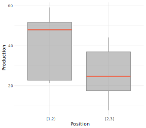
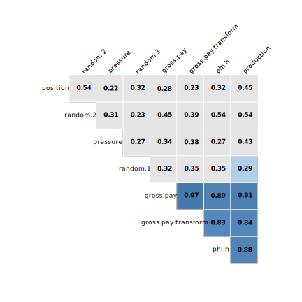
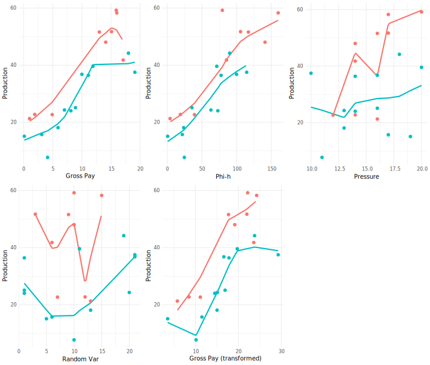
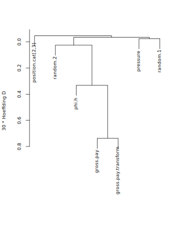
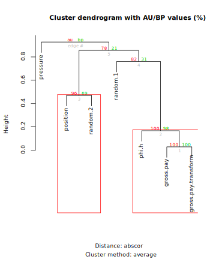
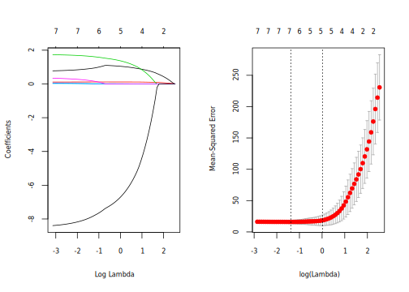
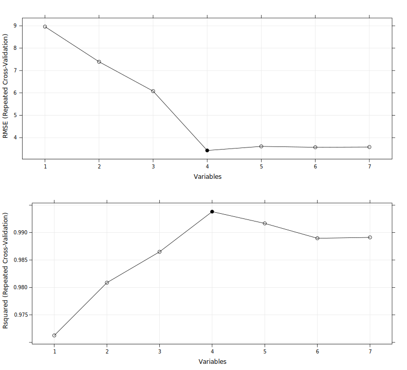
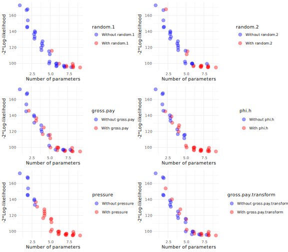
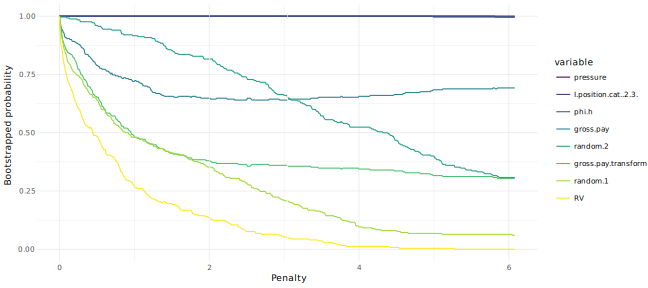

<table class="table table-striped table-hover table-condensed" style="margin-left: auto; margin-right: auto;">
 <thead>
  <tr>
   <th style="text-align:left;"> gross.pay </th>
   <th style="text-align:left;"> phi.h </th>
   <th style="text-align:left;"> position </th>
   <th style="text-align:left;"> pressure </th>
   <th style="text-align:left;"> random.1 </th>
   <th style="text-align:left;"> random.2 </th>
   <th style="text-align:left;"> gross.pay.transform </th>
   <th style="text-align:left;"> production </th>
  </tr>
 </thead>
<tbody>
  <tr>
   <td style="text-align:left;"> 0.1 </td>
   <td style="text-align:left;"> 0.5 </td>
   <td style="text-align:left;"> 2.1 </td>
   <td style="text-align:left;"> 19 </td>
   <td style="text-align:left;"> 5 </td>
   <td style="text-align:left;"> 379 </td>
   <td style="text-align:left;"> 3.54 </td>
   <td style="text-align:left;"> 15.10 </td>
  </tr>
  <tr>
   <td style="text-align:left;"> 1.0 </td>
   <td style="text-align:left;"> 4.0 </td>
   <td style="text-align:left;"> 1.1 </td>
   <td style="text-align:left;"> 16 </td>
   <td style="text-align:left;"> 13 </td>
   <td style="text-align:left;"> 269 </td>
   <td style="text-align:left;"> 5.79 </td>
   <td style="text-align:left;"> 21.30 </td>
  </tr>
  <tr>
   <td style="text-align:left;"> 1.9 </td>
   <td style="text-align:left;"> 19.0 </td>
   <td style="text-align:left;"> 1.0 </td>
   <td style="text-align:left;"> 14 </td>
   <td style="text-align:left;"> 12 </td>
   <td style="text-align:left;"> 245 </td>
   <td style="text-align:left;"> 8.51 </td>
   <td style="text-align:left;"> 22.75 </td>
  </tr>
  <tr>
   <td style="text-align:left;"> 3.1 </td>
   <td style="text-align:left;"> 21.7 </td>
   <td style="text-align:left;"> 2.1 </td>
   <td style="text-align:left;"> 17 </td>
   <td style="text-align:left;"> 6 </td>
   <td style="text-align:left;"> 273 </td>
   <td style="text-align:left;"> 11.52 </td>
   <td style="text-align:left;"> 15.72 </td>
  </tr>
  <tr>
   <td style="text-align:left;"> 4.1 </td>
   <td style="text-align:left;"> 24.6 </td>
   <td style="text-align:left;"> 2.9 </td>
   <td style="text-align:left;"> 11 </td>
   <td style="text-align:left;"> 10 </td>
   <td style="text-align:left;"> 237 </td>
   <td style="text-align:left;"> 10.16 </td>
   <td style="text-align:left;"> 7.71 </td>
  </tr>
</tbody>
</table>


# Is There A Difference in Production? The Kruskal-Wallis Test 
Suppose we are interested in assessing whether `production` changes according to `position`. The conventional approach is to perform ANOVA. However, ANOVA relies on normality and is sensitive to outliers. We can utilize the Kruskal-Wallis test, which is a rank based (i.e. non-parametric) test.

From the boxplot below, it is not apparent whether there is a difference in production between `positions`:



<br>

Let's perform the **Kruskal-Wallis** test:

<table class="table table-striped table-hover table-condensed" style="width: auto !important; ">
 <thead>
  <tr>
   <th style="text-align:left;">   </th>
   <th style="text-align:left;"> d.f. </th>
   <th style="text-align:left;"> Partial.SS </th>
   <th style="text-align:left;"> MS </th>
   <th style="text-align:left;"> F </th>
   <th style="text-align:left;"> P </th>
  </tr>
 </thead>
<tbody>
  <tr>
   <td style="text-align:left;font-weight: bold;"> position.cat </td>
   <td style="text-align:left;font-weight: bold;"> 1 </td>
   <td style="text-align:left;font-weight: bold;"> 163.528 </td>
   <td style="text-align:left;font-weight: bold;"> 163.528 </td>
   <td style="text-align:left;font-weight: bold;"> 5.123 </td>
   <td style="text-align:left;font-weight: bold;"> 0.036 </td>
  </tr>
  <tr>
   <td style="text-align:left;"> TOTAL </td>
   <td style="text-align:left;"> 1 </td>
   <td style="text-align:left;"> 163.528 </td>
   <td style="text-align:left;"> 163.528 </td>
   <td style="text-align:left;"> 5.123 </td>
   <td style="text-align:left;"> 0.036 </td>
  </tr>
  <tr>
   <td style="text-align:left;"> ERROR </td>
   <td style="text-align:left;"> 19 </td>
   <td style="text-align:left;"> 606.472 </td>
   <td style="text-align:left;"> 31.920 </td>
   <td style="text-align:left;"> NA </td>
   <td style="text-align:left;"> NA </td>
  </tr>
</tbody>
</table>

A P-value of 0.036, tells us that the probability of observing a difference in distribution equal to or more extreme than the one observed is 3.6%. In other words, **it's rather unlikely that the difference in production is due to chance variation**.

<br>

# Distance Correlation
The traditional Pearson correlation has numerous limitations. The Spearman correlation is generally preferred and avoids some of the limitations. A relatively new and powerful measure of correlation is the **[distance correlation](https://en.wikipedia.org/wiki/Distance_correlation)** [1]. 




[1] *Among measures of correlations capable of detecting non-linear association, MIC (maximal information criterion, Reshef et al. (2011)) has been touted as a powerful measures. However, several authors (Kinney and Atwal (2013), Simon and Tibshirani (2014)) point to a number of problems with MIC and suggest to utilize distance correlation instead: "We believe that the recently proposed distance correlation measure of Székely & Rizzo (2009) is a more powerful technique that is simple, easy to compute and should be considered for general use".*

<br><br>

# Smoothers
Correlation matrices are useful to visualize combinations of pairwise correlations. There is, however, more information to be had by plotting the data and adding a trend line. One of the most flexible is Cleveland's [LOESS](https://en.wikipedia.org/wiki/Local_regression) (locally weighted scatterplot smoothing). Let's plot the LOESS curves for each variable against production, separate for each `position`.


<!-- -->

*Scatterplots of production against each variable by position (red: blue:). A LOESS curve was added to highlight the overall trend.*

<br><br>

# Variable Selection
Which variables should we focus on in understanding production? Which variables are measuring the same or similar underlying quantities? As the sample size decreases, a model will likely overfit the data. It then becomes important to start with our analysis and modeling with fewer variables if possible than the ones present int he data. 

A statistically principled approach is to start by eliminating variables based on domain knowledge. This may be assisted by statistical data reduction methods such as clustering and redundancy analysis. 

<br>

## Clustering
Here we assess clusters of independent variables.
 
<!-- -->

*Hierarchical cluster dendogram of all variables except production. The similarity matrix is based on the Hoeffding D statistics which will detect non-monotonic associations.*


There are numerous methods to perform hierarchical clustering. It's always good practice to try different methods to see of the results are in the same ballpark. Let's do that with Hierarchical Clustering with P-Values via Multiscale Bootstrap:


```
## Creating a temporary cluster...done:
## socket cluster with 7 nodes on host 'localhost'
## Multiscale bootstrap... Done.
```

<!-- -->

From either cluster dendograms we can see how `gross.pay` and `gross.pay.transform` cluster together and, to a lesser extent, `phi.h`.

<br>

## Redundancy Analysis
In redundancy analysis we look at which variable can be predicted with high confidence from any combination of the other variables. Those variables can then be safely omitted from further analysis. This approach is more robust than the pairwise correlation measures from before.


```
## 
## Redundancy Analysis
## 
## redun(formula = ~gross.pay + phi.h + I(position.cat) + pressure + 
##     random.1 + random.2 + gross.pay.transform, data = hunt, r2 = 0.8, 
##     type = "adjusted", tlinear = FALSE, iterms = TRUE, pc = TRUE)
## 
## n: 21 	p: 13 	nk: 3 
## 
## Number of NAs:	 0 
## 
## R-squared cutoff: 0.8 	Type: adjusted 
## 
## R^2 with which each variable can be predicted from all other variables:
## 
##            gross.pay           gross.pay'                phi.h 
##                0.973                0.889                0.864 
##               phi.h'      I(position.cat)             pressure 
##                0.815                0.478                0.000 
##            pressure'             random.1            random.1' 
##                0.689                0.000                0.676 
##             random.2            random.2'  gross.pay.transform 
##                0.000                0.281                0.952 
## gross.pay.transform' 
##                0.878 
## 
## Rendundant variables:
## 
## gross.pay gross.pay.transform'
## 
## Predicted from variables:
## 
## gross.pay' phi.h phi.h' I(position.cat) pressure pressure' random.1 random.1' random.2 random.2' gross.pay.transform 
## 
##       Variable Deleted   R^2 R^2 after later deletions
## 1            gross.pay 0.973                     0.976
## 2 gross.pay.transform' 0.892
```


We've set the adjusted R^2^ value at 0.80. For instance, `gross.pay` and `gross.pay.transform` are redundant because they can be predicted with high confidence from all other predictors. 

<br>

## LASSO
The previous methods achieved variable reduction without consideration of the response variable, `production`. This is a sound approach, however, we may wish to do variable selection within a regression model. LASSO (least absolute shrinkage and selection operator) achieves that by shrinking the model coefficients. If some coefficients are shrinked to zero, the LASSO effectively achieves variable selection. Shrinkage methods like the LASSO are useful to improve the performance of a model and control overfitting.

There are several models besides the LASSO that allow built-in variable selection. 


```
## 8 x 1 sparse Matrix of class "dgCMatrix"
##                                    1
## (Intercept)              -4.27844527
## hunt.gross.pay            1.03153068
## hunt.phi.h                0.11603225
## hunt.pressure             1.33163584
## hunt.random.1             .         
## hunt.random.2             0.01013075
## hunt.gross.pay.transform  .         
## position.cat             -6.54390827
```

<!-- -->

Looking at the table of coefficients, notice how `hunt.random.1` and `gross.pay.transform` have no coefficient. That's because it has been shrunk to zero, thus achieving variable selection. Our model suggests that these two variable are not useful in explaining changes in `production`. The coefficient for `hunt.random.2` is also nearly zero, so we could remove it as well. 

<br>

## Recursive feature elimination
The last method we want to illustrate is that of recursive feature elimination. This is a model-based set of methods.


<table class="table table-striped table-hover table-condensed" style="margin-left: auto; margin-right: auto;">
 <thead>
  <tr>
   <th style="text-align:left;"> Variables </th>
   <th style="text-align:left;"> RMSE </th>
   <th style="text-align:left;"> Rsquared </th>
   <th style="text-align:left;"> MAE </th>
   <th style="text-align:left;"> RMSESD </th>
   <th style="text-align:left;"> RsquaredSD </th>
   <th style="text-align:left;"> MAESD </th>
  </tr>
 </thead>
<tbody>
  <tr>
   <td style="text-align:left;"> 1 </td>
   <td style="text-align:left;"> 8.961 </td>
   <td style="text-align:left;"> 0.971 </td>
   <td style="text-align:left;"> 8.065 </td>
   <td style="text-align:left;"> 4.740 </td>
   <td style="text-align:left;"> 0.124 </td>
   <td style="text-align:left;"> 4.115 </td>
  </tr>
  <tr>
   <td style="text-align:left;"> 2 </td>
   <td style="text-align:left;"> 7.391 </td>
   <td style="text-align:left;"> 0.981 </td>
   <td style="text-align:left;"> 6.633 </td>
   <td style="text-align:left;"> 3.952 </td>
   <td style="text-align:left;"> 0.100 </td>
   <td style="text-align:left;"> 3.559 </td>
  </tr>
  <tr>
   <td style="text-align:left;"> 3 </td>
   <td style="text-align:left;"> 6.079 </td>
   <td style="text-align:left;"> 0.986 </td>
   <td style="text-align:left;"> 5.525 </td>
   <td style="text-align:left;"> 2.529 </td>
   <td style="text-align:left;"> 0.071 </td>
   <td style="text-align:left;"> 2.472 </td>
  </tr>
  <tr>
   <td style="text-align:left;font-weight: bold;color: black;background-color: #FFFED0;"> 4 </td>
   <td style="text-align:left;font-weight: bold;color: black;background-color: #FFFED0;"> 3.428 </td>
   <td style="text-align:left;font-weight: bold;color: black;background-color: #FFFED0;"> 0.994 </td>
   <td style="text-align:left;font-weight: bold;color: black;background-color: #FFFED0;"> 3.034 </td>
   <td style="text-align:left;font-weight: bold;color: black;background-color: #FFFED0;"> 1.721 </td>
   <td style="text-align:left;font-weight: bold;color: black;background-color: #FFFED0;"> 0.037 </td>
   <td style="text-align:left;font-weight: bold;color: black;background-color: #FFFED0;"> 1.569 </td>
  </tr>
  <tr>
   <td style="text-align:left;"> 5 </td>
   <td style="text-align:left;"> 3.610 </td>
   <td style="text-align:left;"> 0.992 </td>
   <td style="text-align:left;"> 3.209 </td>
   <td style="text-align:left;"> 1.678 </td>
   <td style="text-align:left;"> 0.057 </td>
   <td style="text-align:left;"> 1.526 </td>
  </tr>
  <tr>
   <td style="text-align:left;"> 6 </td>
   <td style="text-align:left;"> 3.570 </td>
   <td style="text-align:left;"> 0.989 </td>
   <td style="text-align:left;"> 3.187 </td>
   <td style="text-align:left;"> 1.803 </td>
   <td style="text-align:left;"> 0.070 </td>
   <td style="text-align:left;"> 1.630 </td>
  </tr>
  <tr>
   <td style="text-align:left;"> 7 </td>
   <td style="text-align:left;"> 3.581 </td>
   <td style="text-align:left;"> 0.989 </td>
   <td style="text-align:left;"> 3.162 </td>
   <td style="text-align:left;"> 1.862 </td>
   <td style="text-align:left;"> 0.068 </td>
   <td style="text-align:left;"> 1.690 </td>
  </tr>
</tbody>
</table>

From the table we can see a model with 4 variables achieves the highest R^2^ and the lowest RMSE. Those 4 variables are: 


```
## [1] "hunt.phi.h"     "hunt.gross.pay" "hunt.pressure"  "position.cat"
```

We can, of course, plot the results for more immediacy:


<!-- -->


<br>

## Summary of Variable Selection
There is little consensus among researchers on what constitutes a sensible variable selection strategy. In fact, many authors are critical of several variable selection techniques and suggest utilizing domain knowledge coupled with variable selection blinded to Y (see Harrell, 2015).

Our example is hardly demonstrative, since we are dealing with a very limited sample size. Nonetheless, we can summarize the results as follows:


| Method                        	| No. of Variables Selected 	| Variable Removed                                                               	| Notes                                                    	|
|-------------------------------	|---------------------------	|--------------------------------------------------------------------------------	|----------------------------------------------------------	|
| Domain knowledge              	| 4                         	| `random.1`, `random.2`, `gross.pay.transform`                                  	| Baseline                                                 	|
| Clustering                    	| NA                        	| `gross.pay` and `gross.pay.transform` can be represented by a  single variable 	| Only suggestive, not a true variable selection technique 	|
| Redundancy Analysis           	| 5                         	| `gross.pay`, ` gross.pay.transform`                                            	|                                                          	|
| LASSO                         	| 5                         	| `random.1`, `gross.pay.transform`                                              	| `random.2` was very close to zero                        	|
| Recursive Feature Elimination 	| 4                         	| `random.1`, `random.2`, `gross.pay.transform`                                  	|                                                          	|


From these limited data, recursive feature elimination performed best. There are many other variable selection strategies and we've only scratched the surface. Using domain knowledge **before** applying any statistical methods is usually preferred.

<br>

# Exhaustive Search
Another option to consider is that of performing an exhaustive search throughout the model space. Exhaustive search methods can be computationally taxing as "with more than a thousand models when p = 10 and a million when p = 20". [Tarr et al.](https://www.jstatsoft.org/article/view/v083i09) (2018) illustrate an implementation of exhaustive search through many bootstrap resamples: "if there exists a “correct” model of a particular model size it will be selected overwhelmingly more often than other models of the same size". 

This approach is intended the assist the analyst with the choice of model, rather than providing an answer.

<!-- -->

The plots above illustrate what happens to the model fit measure (log-likelihood) when we remove a variable (higher is better). So for instance, in the upper left plot, there's a clear separation when we remove `random.1`, so that resamples that do not contain `random.1` perform better than model that do contain `random.1`.


Finaly, we can investigate how variables are included as the penalty increases. In the plot `RV` is a random variable that can be used as reference.

<!-- -->

As the amount of penalty increases, it become clearer what variables remain: `lposition.cat` is the strongest predictor no matter the penalty. The three random variables and `gross.pay.transform` are the fastest to fall out from bootstrap resamples.

# Outliers and Extremes


