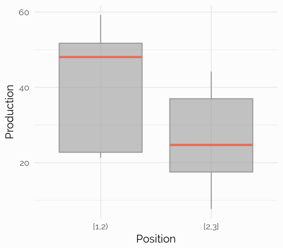
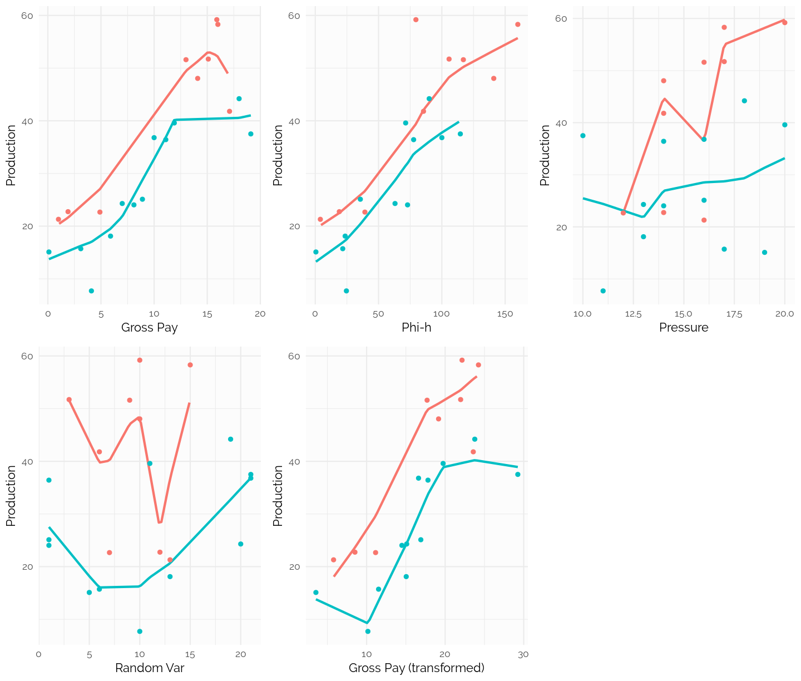
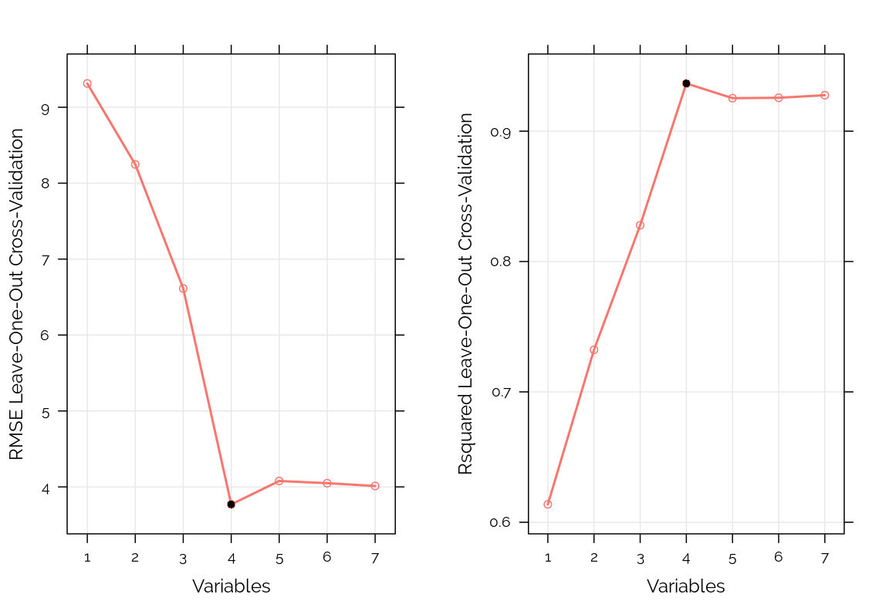

```r
#-----------------------------------------------------------------------------------------#
# NEEDED PACKAGES
#-----------------------------------------------------------------------------------------#
# library("packrat")
library("Hmisc")
library("rms")
library("ggplot2")
library("tidyr")
library("stringr")
library("pander")
library("extrafont")
library("plotly")
library("viridis")
library("readr")
library("knitr")
library("kableExtra")
library("tibble")
library("broom")
library("patchwork")
library("DT")
library("doParallel")


# font_import(pattern="[O/o]swald")
# font_import(pattern="PT_Sans")
# font_import(pattern="[R/r]aleway")
# loadfonts(device="win")
```

# Preamble
This tutorial is meant to accompany a talk given by Matteo Niccoli and myself (Thomas Speidel) at the **2018 geoconvention** in Calgary, Canada titled [Data science tools for petroleum exploration and production](https://www.geoconvention.com/uploads/2018abstracts/290_GC2018_Data_science_tools_for_petroleum_e_and_p.pdf). Many of the ideas were inspired by Nicooli's past work. See for instance, [Machine learning in geoscience with scikit-learn - notebook 1](https://github.com/mycarta/predict/blob/master/Geoscience_ML_notebook_1.ipynb). 

This tutorial was created using the [open-source language R](https://en.wikipedia.org/wiki/R_(programming_language)#CRAN). However, most of the methods illustrated can be done in [Python](https://en.wikipedia.org/wiki/Python_(programming_language)). See Niccoli's implementation of some of these methods in the Python environment. See for instance the implementation of [distance correlation](https://github.com/mycarta/Niccoli_Speidel_2018_Geoconvention/blob/master/Python_heatmap_and_distance_correlation.ipynb)in Python.


<br><br>

# Description of the Example Dataset
We will illustrate a number of methodologies on the data set by Hunt^1^. Niccoli^2^ illustrated a number of statistical techniques on this data set in a series of notebooks. As stated: "the target variable to be predicted, Y, is oil production (measured in tens of barrels of oil per day) from a marine barrier sand". Below, is a sample of the data:


```r
#-----------------------------------------------------------------------------------------#
# READ, LABEL, FORMAT DATA
#-----------------------------------------------------------------------------------------#
hunt <- read_csv("Table2_Hunt_2013_edit.csv")

#-----------------------------------------------------------------------------------------#
# MAKE SYNTACTICALLY VALID COL NAMES
#-----------------------------------------------------------------------------------------#
var.names <- tolower(colnames(hunt))
var.names <- make.names(var.names, unique = TRUE, allow_ = FALSE)
colnames(hunt) <- var.names

## Sample
options(DT.fillContainer = FALSE)
datatable(hunt,
          fillContainer = FALSE,
          style = 'bootstrap', 
          class = 'table-hover table-condensed stripe',
          extensions = 'Buttons',
          rownames = FALSE,
          filter = 'top',
          options = list(
            keys = TRUE,     
            autoWidth = TRUE,
            pageLength = 10,
            searching = FALSE, 
            dom = 'Bfrtip',
            searchHighlight = TRUE,
            buttons = c('copy', 'csv', 'excel', 'print'))) %>%
  formatStyle("production",
    background = styleColorBar(hunt$production, '#99cfca'),
    backgroundSize = '100% 80%',
    backgroundRepeat = 'no-repeat')
```

<!--html_preserve--><div id="htmlwidget-83ccb4692ef3c37c8401" style="width:100%;height:auto;" class="datatables html-widget"></div>
<script type="application/json" data-for="htmlwidget-83ccb4692ef3c37c8401">{"x":{"style":"bootstrap","filter":"top","filterHTML":"<tr>\n  <td data-type=\"number\" style=\"vertical-align: top;\">\n    <div class=\"form-group has-feedback\" style=\"margin-bottom: auto;\">\n      <input type=\"search\" placeholder=\"All\" class=\"form-control\" style=\"width: 100%;\"/>\n      <span class=\"glyphicon glyphicon-remove-circle form-control-feedback\"><\/span>\n    <\/div>\n    <div style=\"display: none; position: absolute; width: 200px;\">\n      <div data-min=\"0.1\" data-max=\"19.1\" data-scale=\"1\"><\/div>\n      <span style=\"float: left;\"><\/span>\n      <span style=\"float: right;\"><\/span>\n    <\/div>\n  <\/td>\n  <td data-type=\"number\" style=\"vertical-align: top;\">\n    <div class=\"form-group has-feedback\" style=\"margin-bottom: auto;\">\n      <input type=\"search\" placeholder=\"All\" class=\"form-control\" style=\"width: 100%;\"/>\n      <span class=\"glyphicon glyphicon-remove-circle form-control-feedback\"><\/span>\n    <\/div>\n    <div style=\"display: none; position: absolute; width: 200px;\">\n      <div data-min=\"0.5\" data-max=\"160\" data-scale=\"1\"><\/div>\n      <span style=\"float: left;\"><\/span>\n      <span style=\"float: right;\"><\/span>\n    <\/div>\n  <\/td>\n  <td data-type=\"number\" style=\"vertical-align: top;\">\n    <div class=\"form-group has-feedback\" style=\"margin-bottom: auto;\">\n      <input type=\"search\" placeholder=\"All\" class=\"form-control\" style=\"width: 100%;\"/>\n      <span class=\"glyphicon glyphicon-remove-circle form-control-feedback\"><\/span>\n    <\/div>\n    <div style=\"display: none; position: absolute; width: 200px;\">\n      <div data-min=\"1\" data-max=\"2.9\" data-scale=\"1\"><\/div>\n      <span style=\"float: left;\"><\/span>\n      <span style=\"float: right;\"><\/span>\n    <\/div>\n  <\/td>\n  <td data-type=\"integer\" style=\"vertical-align: top;\">\n    <div class=\"form-group has-feedback\" style=\"margin-bottom: auto;\">\n      <input type=\"search\" placeholder=\"All\" class=\"form-control\" style=\"width: 100%;\"/>\n      <span class=\"glyphicon glyphicon-remove-circle form-control-feedback\"><\/span>\n    <\/div>\n    <div style=\"display: none; position: absolute; width: 200px;\">\n      <div data-min=\"10\" data-max=\"20\"><\/div>\n      <span style=\"float: left;\"><\/span>\n      <span style=\"float: right;\"><\/span>\n    <\/div>\n  <\/td>\n  <td data-type=\"integer\" style=\"vertical-align: top;\">\n    <div class=\"form-group has-feedback\" style=\"margin-bottom: auto;\">\n      <input type=\"search\" placeholder=\"All\" class=\"form-control\" style=\"width: 100%;\"/>\n      <span class=\"glyphicon glyphicon-remove-circle form-control-feedback\"><\/span>\n    <\/div>\n    <div style=\"display: none; position: absolute; width: 200px;\">\n      <div data-min=\"1\" data-max=\"21\"><\/div>\n      <span style=\"float: left;\"><\/span>\n      <span style=\"float: right;\"><\/span>\n    <\/div>\n  <\/td>\n  <td data-type=\"integer\" style=\"vertical-align: top;\">\n    <div class=\"form-group has-feedback\" style=\"margin-bottom: auto;\">\n      <input type=\"search\" placeholder=\"All\" class=\"form-control\" style=\"width: 100%;\"/>\n      <span class=\"glyphicon glyphicon-remove-circle form-control-feedback\"><\/span>\n    <\/div>\n    <div style=\"display: none; position: absolute; width: 200px;\">\n      <div data-min=\"210\" data-max=\"395\"><\/div>\n      <span style=\"float: left;\"><\/span>\n      <span style=\"float: right;\"><\/span>\n    <\/div>\n  <\/td>\n  <td data-type=\"number\" style=\"vertical-align: top;\">\n    <div class=\"form-group has-feedback\" style=\"margin-bottom: auto;\">\n      <input type=\"search\" placeholder=\"All\" class=\"form-control\" style=\"width: 100%;\"/>\n      <span class=\"glyphicon glyphicon-remove-circle form-control-feedback\"><\/span>\n    <\/div>\n    <div style=\"display: none; position: absolute; width: 200px;\">\n      <div data-min=\"3.54\" data-max=\"29.25\" data-scale=\"2\"><\/div>\n      <span style=\"float: left;\"><\/span>\n      <span style=\"float: right;\"><\/span>\n    <\/div>\n  <\/td>\n  <td data-type=\"number\" style=\"vertical-align: top;\">\n    <div class=\"form-group has-feedback\" style=\"margin-bottom: auto;\">\n      <input type=\"search\" placeholder=\"All\" class=\"form-control\" style=\"width: 100%;\"/>\n      <span class=\"glyphicon glyphicon-remove-circle form-control-feedback\"><\/span>\n    <\/div>\n    <div style=\"display: none; position: absolute; width: 200px;\">\n      <div data-min=\"7.71\" data-max=\"59.2\" data-scale=\"2\"><\/div>\n      <span style=\"float: left;\"><\/span>\n      <span style=\"float: right;\"><\/span>\n    <\/div>\n  <\/td>\n<\/tr>","extensions":["Buttons"],"fillContainer":false,"data":[[0.1,1,1.9,3.1,4.1,4.9,5.9,7,8.1,8.9,10,11.1,11.9,13,14.1,15.1,15.9,16,17.1,18,19.1],[0.5,4,19,21.7,24.6,39.2,23.6,63,72.9,35.6,100,77.7,71.4,117,141,105.7,79.5,160,85.5,90,114.6],[2.1,1.1,1,2.1,2.9,1.1,2.1,2,2.9,2.8,2.2,2,2.9,1.1,1.2,1,1.1,1.2,1.9,2.8,2.1],[19,16,14,17,11,12,13,13,14,16,16,14,20,16,14,17,20,17,14,18,10],[5,13,12,6,10,7,13,20,1,1,21,1,11,9,10,3,10,15,6,19,21],[379,269,245,273,237,278,241,269,248,210,334,340,224,338,367,363,395,295,266,210,366],[3.54,5.79,8.51,11.52,10.16,11.14,15.04,15.1,14.49,16.9,16.61,17.81,19.74,17.7,19.16,21.97,22.15,24.24,23.58,23.77,29.25],[15.1,21.3,22.75,15.72,7.71,22.67,18.11,24.3,24.04,25.11,36.8,36.42,39.59,51.6,48.05,51.72,59.2,58.3,41.8,44.2,37.51]],"container":"<table class=\"table table-striped table-hover table-condensed\">\n  <thead>\n    <tr>\n      <th>gross.pay<\/th>\n      <th>phi.h<\/th>\n      <th>position<\/th>\n      <th>pressure<\/th>\n      <th>random.1<\/th>\n      <th>random.2<\/th>\n      <th>gross.pay.transform<\/th>\n      <th>production<\/th>\n    <\/tr>\n  <\/thead>\n<\/table>","options":{"keys":true,"autoWidth":true,"pageLength":10,"searching":false,"dom":"Bfrtip","searchHighlight":true,"buttons":["copy","csv","excel","print"],"columnDefs":[{"className":"dt-right","targets":[0,1,2,3,4,5,6,7]}],"order":[],"orderClasses":false,"orderCellsTop":true,"rowCallback":"function(row, data) {\nvar value=data[7]; $(this.api().cell(row, 7).node()).css({'background':isNaN(parseFloat(value)) || value <= 7.71 ? '' : 'linear-gradient(90deg, transparent ' + (59.2 - value)/51.49 * 100 + '%, #99cfca ' + (59.2 - value)/51.49 * 100 + '%)','background-size':'100% 80%','background-repeat':'no-repeat'});\n}"}},"evals":["options.rowCallback"],"jsHooks":[]}</script><!--/html_preserve-->

```r
#-----------------------------------------------------------------------------------------#
## ADD CATEGORICAL POSITION
#-----------------------------------------------------------------------------------------#
hunt %>%
  mutate(position.cat = cut2(position, c(1, 2, 3))) %>%
  as.tibble() -> hunt
```

^1^ *Hunt, L. (2013), [Many correlation coefficients, null hypotheses, and high value](https://csegrecorder.com/columns/view/value-of-integrated-geophysics-201312). CSEG Recorder, 38 (10)*  
^2^ *Niccoli, M (2017), [Machine learning in geoscience with scikit-learn - notebook 2](https://github.com/mycarta/predict/blob/master/Geoscience_ML_notebook_2.ipynb)*


```r
## Data
d <- hunt %>% describe()
html(d, size=100, scroll=FALSE)
plot(d)
```

<br><br>

# Is There A Difference in Production?
Suppose we are interested in assessing whether `production` changes according to `position`. The conventional approach is to perform [ANOVA](https://en.wikipedia.org/wiki/Analysis_of_variance) or t-test. However, both relies on normality and are sensitive to outliers. When comparing 2 samples, we can utilize the Wilcoxon test, while fore more than samples, the Kruskal-Wallis test is a generalization of the Wilcoxon test.

First, let's assess the distribution graphically. From the boxplot below, it is not apparent whether there is a difference in production between `positions`:


```r
g1 <- ggplot(hunt, aes(x = position.cat, y = production)) +
  geom_boxplot(fill = "grey60", alpha = 0.6, color = "grey60") +
  scale_x_discrete() + 
  xlab("Position") +
  ylab("Production") +
  theme_minimal(base_family = "Raleway", base_size = 11) +
  theme(panel.background = element_rect(fill = "#FCFCFC", colour = NA),
        plot.background = element_rect(fill = "#FCFCFC", colour = NA))
  
## Add lines
dat <- ggplot_build(g1)$data[[1]]
g1 + geom_segment(data=dat, aes(x=xmin, xend=xmax, y=middle, yend=middle), color = "coral2", size=1) 
```



<br>

Next, we perform the **Wilcoxon** test:


```r
# kw <- tidy(anova(ols(rank(production) ~ position.cat , data = hunt))) %>%
#   rename(` ` = `.rownames`)

# kable(kw, "html", align = "l", digits = 3) %>% 
#   kable_styling(bootstrap_options = c("striped", "hover", "condensed"), full_width = F, position = "left") %>%
#     row_spec(1:1, bold = T)

w1 <- tidy(wilcox.test(production~position.cat, data = hunt, conf.int=TRUE, distribution='exact', conf.level = .90))

kable(w1, "html", align = "l", digits = 3) %>% 
  kable_styling(bootstrap_options = c("striped", "hover", "condensed"), full_width = F, position = "left") %>%
    row_spec(1:1, bold = T)
```

<table class="table table-striped table-hover table-condensed" style="width: auto !important; ">
 <thead>
  <tr>
   <th style="text-align:left;"> estimate </th>
   <th style="text-align:left;"> statistic </th>
   <th style="text-align:left;"> p.value </th>
   <th style="text-align:left;"> conf.low </th>
   <th style="text-align:left;"> conf.high </th>
   <th style="text-align:left;"> method </th>
   <th style="text-align:left;"> alternative </th>
  </tr>
 </thead>
<tbody>
  <tr>
   <td style="text-align:left;font-weight: bold;"> 14.98 </td>
   <td style="text-align:left;font-weight: bold;"> 83 </td>
   <td style="text-align:left;font-weight: bold;"> 0.041 </td>
   <td style="text-align:left;font-weight: bold;"> 4.64 </td>
   <td style="text-align:left;font-weight: bold;"> 27.3 </td>
   <td style="text-align:left;font-weight: bold;"> Wilcoxon rank sum test </td>
   <td style="text-align:left;font-weight: bold;"> two.sided </td>
  </tr>
</tbody>
</table>

A P-value of 0.041, tells us that the probability of observing a difference in distribution equal to or more extreme than the one observed is 4.1%. In other words, **it's somewhat unlikely but not impossible that the difference in production is due to chance variation**.

<br>

# Distance Correlation
Measures of correlation quantify the strength of the relationship between pairs of variables. The traditional Pearson correlation has several limitations, one of which is that it assumes a linear relationship. The Spearman correlation is generally preferred and avoids some of these limitations. A relatively new and powerful measure of correlation is the **[distance correlation](https://en.wikipedia.org/wiki/Distance_correlation)**. 


```r
#-----------------------------------------------------------------------------------------#
# DISTANCE CORRELATION
#-----------------------------------------------------------------------------------------#
##Corr matrix
correlations <- sapply(1:8, function(r) {
  sapply(1:8, function(c) {
    energy::dcor(hunt[,r], hunt[,c])
    })
})
colnames(correlations) <- rownames(correlations) <- colnames(hunt)[1:8]

## P-values (2000 bootstrap resamples)
cor.mtest <- function(mat, ...) {
    mat <- as.matrix(mat)
    n <- ncol(mat)
    p.mat<- matrix(NA, n, n)
    diag(p.mat) <- 0
    for (i in 1:(n - 1)) {
        for (j in (i + 1):n) {
            tmp <- energy::dcov.test(mat[, i], mat[, j], index = 1.0, R=2000)
            p.mat[i, j] <- p.mat[j, i] <- tmp$p.value
        }
    }
  colnames(p.mat) <- rownames(p.mat) <- colnames(mat)
  p.mat
}
p.mat <- cor.mtest(correlations)


## Plot corrmatrix
library(corrplot)
par(family = 'Raleway',
    pin = c(3,6), 
    ps = 9,
    mar = c(0.1, 0.1, 0.1, 0.1))

col <- colorRampPalette(c("#BB4444", "#EE9988", "#FFFFFF", "#77AADD", "#4477AA"))
corrplot(correlations,
         method = "color",
         col = col(200),
         type = "upper",
         order = "hclust",
         addCoef.col = "black",
         tl.col = "black",
         tl.srt = 45,
         p.mat = p.mat,
         sig.level = 0.10,
         insig = "blank",
         diag = FALSE,
         bg = "grey90",
         outline = TRUE,
         addgrid.col = "white",
         cl.lim = c(0, 1),
         tl.cex = 1.0,
         cl.cex = 0.8,
         cl.pos = "n")
```


Above is the distance correlation matrix. Colored boxes represent statistically significant correlations at the 10% significance level. The correlation measure is able to detect that `gross.pay` is highly correlated to `gross.pay.transform` (they are algebraically related). Also, `gross.pay` is highly correlated with `production`. Notice that, unlike other correlation measures, distance correlation doe not compute direction (positive or negative correlation).

<br>

### A Note on the Choice of Correlation
Among measures of correlations capable of detecting non-linear association, MIC (maximal information criterion, Reshef et al.) has been touted as a powerful measures. However, several authors Kinney^2^, Simon^3^ point to a number of problems with MIC and suggest to utilize distance correlation instead: 

> "We believe that the recently proposed distance correlation measure of Székely & Rizzo (2009) is a more powerful technique that is simple, easy to compute and should be considered for general use".

^1^ Rashef et al. (2011), [Detecting novel associations in large data sets](https://www.ncbi.nlm.nih.gov/pubmed/22174245)  
^2^ Kinney et al. (2013), [Equitability, mutual information, and the maximal information coefficient](http://www.pnas.org/content/111/9/3354)  
^3^ Simon et al. (2014), [Comment on "Detecting Novel Associations In Large Data Sets](https://arxiv.org/abs/1401.7645)

<br><br>

# Smoothers
Correlation matrices are useful to visualize combinations of pairwise correlations. There is, however, more information to be had by plotting the data and adding a trend line. One of the most flexible is Cleveland's [LOESS](https://en.wikipedia.org/wiki/Local_regression) (locally weighted scatter plot smoothing). Let's plot the LOESS curves for each variable against production, separate for each `position`.


```r
g1 <- ggplot(hunt, aes(y = production, x = gross.pay, colour = factor(position.cat))) +
  stat_plsmo(fullrange = TRUE) + 
  geom_point() +
  xlab("Gross Pay") +
  ylab("Production") +
  theme_minimal(base_family = "Raleway", base_size = 11) +
  scale_color_discrete(guide = guide_legend(title = "Position")) +
  theme(legend.position="none") +
  theme(panel.background = element_rect(fill = "#FCFCFC", colour = NA),
        plot.background = element_rect(fill = "#FCFCFC", colour = NA))

g2 <- ggplot(hunt, aes(y = production, x = phi.h, colour = factor(position.cat))) +
  stat_plsmo(fullrange = TRUE) + 
  geom_point() +
  xlab("Phi-h") +
  ylab("Production") +
  theme_minimal(base_family = "Raleway", base_size = 11) +
  scale_color_discrete(guide = guide_legend(title = "Position")) +
  theme(legend.position="none") +
  theme(panel.background = element_rect(fill = "#FCFCFC", colour = NA),
        plot.background = element_rect(fill = "#FCFCFC", colour = NA))


g3 <- ggplot(hunt, aes(y = production, x = pressure, colour = factor(position.cat))) +
  stat_plsmo(fullrange = TRUE) + 
  geom_point() +
  xlab("Pressure") +
  ylab("Production") +
  theme_minimal(base_family = "Raleway", base_size = 11) +
  scale_color_discrete(guide = guide_legend(title = "Position")) +
  theme(legend.position="none") +
  theme(panel.background = element_rect(fill = "#FCFCFC", colour = NA),
        plot.background = element_rect(fill = "#FCFCFC", colour = NA))

g4 <- ggplot(hunt, aes(y = production, x = random.1, colour = factor(position.cat))) +
  stat_plsmo(fullrange = TRUE) + 
  geom_point() +
  xlab("Random Var") +
  ylab("Production") +
  theme_minimal(base_family = "Raleway", base_size = 11) +
  scale_color_discrete(guide = guide_legend(title = "Position")) +
  theme(legend.position="none") +
  theme(panel.background = element_rect(fill = "#FCFCFC", colour = NA),
        plot.background = element_rect(fill = "#FCFCFC", colour = NA))

g5 <- ggplot(hunt, aes(y = production, x = gross.pay.transform, colour = factor(position.cat))) +
  stat_plsmo(fullrange = TRUE) + 
  geom_point() +
  xlab("Gross Pay (transformed)") +
  ylab("Production") +
  theme_minimal(base_family = "Raleway", base_size = 11) +
  scale_color_discrete(guide = guide_legend(title = "Position")) +
  theme(legend.position="none") +
  theme(panel.background = element_rect(fill = "#FCFCFC", colour = NA),
        plot.background = element_rect(fill = "#FCFCFC", colour = NA))


g1+g2+g3+g4+g5
```



*Scatter plots of production against each variable by position (red: blue:). A LOESS curve was added to highlight the overall trend.*

<br><br>

# Variable Selection
Which variables should we focus on in understanding what drives changes in production? Which variables are measuring the same or similar underlying quantities?

A statistically principled approach is to start by eliminating variables based on domain knowledge. This may be assisted by statistical data reduction methods such as clustering and redundancy analysis. 

<br>

## Clustering
Here we assess clusters of independent variables. We do so blinded to the response variable, `production`, in order to avoid creating bias. In cluster analysis, the objective is to identify variables that are measuring the same underlying phenomenon. If they exists and supported by domain knowledge, one could argue for removing one of them.

 

```r
vc <- varclus (~ gross.pay + phi.h + position.cat + pressure + random.1 + random.2 + gross.pay.transform,
              sim = 'hoeffding', 
              data = hunt)

par(family = 'Raleway',
    ps = 9,
    par(bg = '#FCFCFC'),
    mar = c(0.2, 4, 1.5, 1.5))

plot(vc)
```


*Hierarchical cluster dendogram of all variables except production. The similarity matrix is based on the Hoeffding D statistics which will detect non-monotonic associations.*


There are numerous methods to perform hierarchical clustering. It's good practice to try different methods to see if the results are in the same ballpark. Let's do that with Hierarchical Clustering with P-Values via Multiscale Bootstrap^1^:


```r
## pvclust
library(pvclust)
hunt2 <- select(hunt, -production, -position.cat)
cluster.bootstrap <- pvclust(hunt2, 
                             nboot = 5000, 
                             method.dist = "abscor",
                             parallel = TRUE,
                             iseed = 123)
```

```
## Creating a temporary cluster...done:
## socket cluster with 7 nodes on host 'localhost'
## Multiscale bootstrap... Done.
```

```r
par(family = 'Raleway',
    par(bg = '#FCFCFC'),
    ps = 9)
plot(cluster.bootstrap)
pvrect(cluster.bootstrap)
```


From either cluster dendograms we can see how `gross.pay` and `gross.pay.transform` cluster together and, to a lesser extent, `phi.h`. Based on examination of these results, the natural choice is to remove either `gross.pay` or `gross.pay.transform` from further analyses. Suppose we don't know `gross.pay.transform` is algebraically related to `gross.pay`: which of the two should we exclude? Redundancy analysis, helps us determine that.

^1^Suzuki et al. (2006), [Pvclust: an R package for assessing the uncertainty in hierarchical clustering](https://www.ncbi.nlm.nih.gov/pubmed/16595560)

<br>

## Redundancy Analysis


```r
redun <- redun(~ gross.pay + phi.h + I(position.cat) + pressure + random.1 + random.2 + gross.pay.transform,
                r2 = 0.70,
                type = 'adjusted',
                tlinear = FALSE,
                iterms = TRUE,
                pc = TRUE,
                data = hunt)
```

In redundancy analysis we look at which variable can be predicted with high confidence from any combination of the other variables. Those variables can then be safely omitted from further analysis. This approach is more robust than the pairwise correlation measures from before. We've set the adjusted R^2^ value at 0.7.

We started with:


```r
redun$In
```

```
##  [1] "gross.pay'"          "phi.h'"              "I(position.cat)"    
##  [4] "pressure"            "pressure'"           "random.1"           
##  [7] "random.1'"           "random.2"            "random.2'"          
## [10] "gross.pay.transform"
```

The model suggests that:


```r
redun$rsquared
```

```
##            gross.pay gross.pay.transform'                phi.h 
##            0.9731901            0.8916161            0.7507618
```

can be removed because they are predicted from all the remaining variables. The numbers represent the R^2^ with which a variable ican be predicted from all other remaining ones. However, we need to be very cautious, since the sample size is much too low to reliably suggest which variables can be omitted.


<br>

## LASSO
The previous methods achieved variable reduction without consideration of the response variable, `production`. This is a sound approach, however, we may wish to do variable selection within a regression model. [LASSO](https://en.wikipedia.org/wiki/Lasso_(statistics)) (least absolute shrinkage and selection operator) achieves that by shrinking the model coefficients. The primary purpose of shrinkage methods is that of improving predictive accuracy. However, if coefficients are shrunk to zero, the LASSO effectively achieves variable selection. 

Fitting a LASSO model to the data, yield the following shrunk coefficients. 


```r
library(glmnet)
library(plotmo)

position.cat <- model.matrix(hunt$production ~ hunt$position.cat)[, -1]
x <- as.matrix(data.frame(hunt$gross.pay, hunt$phi.h, hunt$pressure, hunt$random.1, hunt$random.2, hunt$gross.pay.transform, position.cat))

## LASSO
registerDoParallel(cores=8)
lasso <- glmnet(x, 
                y = hunt$production,
                alpha = 1,
                family="gaussian",
                standardize = TRUE)

set.seed(123)
cv.lasso <- cv.glmnet(x, 
                      y = hunt$production, 
                      standardize = TRUE,
                      type.measure = "mse",
                      nfolds = 21,
                      parallel = TRUE,
                      alpha = 1)

lambda_min <- cv.lasso$lambda.min
lambda_1se <- cv.lasso$lambda.1se


## Make table of coeff
coef <- as.data.frame(as.matrix(coef(cv.lasso, s = lambda_1se))) %>% 
  rename(`Shrinked Coefficient` = !!names(.[1])) %>%
  rownames_to_column(var = "Variable") %>%
  mutate(`Shrinked Coefficient` = ifelse(`Shrinked Coefficient` == 0, NA, `Shrinked Coefficient`)) %>%
  mutate(Variable = gsub("hunt.", "", Variable))
  
kable(coef, "html", align = "l", digits = 3) %>%
  kable_styling(bootstrap_options = c("striped", "hover", "condensed"), full_width = F, position = "left")
```

<table class="table table-striped table-hover table-condensed" style="width: auto !important; ">
 <thead>
  <tr>
   <th style="text-align:left;"> Variable </th>
   <th style="text-align:left;"> Shrinked Coefficient </th>
  </tr>
 </thead>
<tbody>
  <tr>
   <td style="text-align:left;"> (Intercept) </td>
   <td style="text-align:left;"> -4.278 </td>
  </tr>
  <tr>
   <td style="text-align:left;"> gross.pay </td>
   <td style="text-align:left;"> 1.032 </td>
  </tr>
  <tr>
   <td style="text-align:left;"> phi.h </td>
   <td style="text-align:left;"> 0.116 </td>
  </tr>
  <tr>
   <td style="text-align:left;"> pressure </td>
   <td style="text-align:left;"> 1.332 </td>
  </tr>
  <tr>
   <td style="text-align:left;"> random.1 </td>
   <td style="text-align:left;"> NA </td>
  </tr>
  <tr>
   <td style="text-align:left;"> random.2 </td>
   <td style="text-align:left;"> 0.010 </td>
  </tr>
  <tr>
   <td style="text-align:left;"> gross.pay.transform </td>
   <td style="text-align:left;"> NA </td>
  </tr>
  <tr>
   <td style="text-align:left;"> position.cat </td>
   <td style="text-align:left;"> -6.544 </td>
  </tr>
</tbody>
</table>


Looking at the table of coefficients, notice how `hunt.random.1` and `gross.pay.transform` have no coefficient. That's because they have been shrunk to zero, thus achieving variable selection. Our model suggests that these two variable are not useful in explaining changes in `production`. The coefficient for `hunt.random.2` is also nearly zero, so we could remove it as well. 

To gain more insight, it helps to visualize how fast coefficients are shrunk to zero (thus, excluded from the model) as we increase the amount of shrinkage, $\lambda$.


```r
## Prepare data for ggplot
## Could have used (not pretty)
# par(family = 'Raleway',
#     ps = 9,
#     par(bg = '#FCFCFC'),
#     mfrow = c(1, 1),
#     mar = c(3, 2.5, 1.5, 1.5))
# 
# plot_glmnet(lasso, 
#             s = cv.lasso$lambda.min,
#             xlab = "Log Lambda")

beta <- coef(lasso)

lasso.data <- as.data.frame(as.matrix(beta)) %>%
  tibble::rownames_to_column(var = "coef") %>%
  reshape::melt(id = "coef") %>%
  mutate(variable = as.numeric(gsub("s", "", variable))) %>%
  mutate(lambda = lasso$lambda[variable + 1]) %>%
  mutate(loglambda = log(lambda)) %>%
  mutate(norm = apply(abs(beta[-1,]), 2, sum)[variable+1]) %>%
  mutate(coef = gsub("hunt.", "", coef))

plotly::ggplotly(ggplot(lasso.data[lasso.data$coef != "(Intercept)",], aes(loglambda, value, color = coef, linetype = coef)) + 
  geom_line(size = 0.5) + 
  xlab("Lambda (log scale)") +
  ylab("Value of Coefficient") +
  scale_x_reverse() +
  guides(color = guide_legend(title = ""), 
         linetype = guide_legend(title = "")) +
  scale_color_viridis_d() +
  geom_vline(xintercept = cv.lasso$lambda.min, color = "coral2", size = 0.5) +
  theme_minimal(base_family = "Raleway", base_size = 12) +
  theme(legend.key.width = unit(3, "lines")) +
  theme(panel.background = element_rect(fill = "#FCFCFC", colour = NA),
        plot.background = element_rect(fill = "#FCFCFC", colour = NA)) +
  annotate("text",
           x = cv.lasso$lambda.min+0.25, 
           y = -8, 
           label = round(cv.lasso$lambda.min, 3), 
           angle = 90,
           parse = TRUE))
```

<!--html_preserve--><div id="7e2a7de4e4b8" style="width:849.6px;height:612px;" class="plotly html-widget"></div>
<script type="application/json" data-for="7e2a7de4e4b8">{"x":{"data":[{"x":[-2.53642960571869,-2.44339586467426,-2.35036212362984,-2.25732838258541,-2.16429464154098,-2.07126090049655,-1.97822715945212,-1.8851934184077,-1.79215967736327,-1.69912593631884,-1.60609219527441,-1.51305845422998,-1.42002471318556,-1.32699097214113,-1.2339572310967,-1.14092349005227,-1.04788974900784,-0.954856007963415,-0.861822266918986,-0.768788525874558,-0.67575478483013,-0.582721043785702,-0.489687302741274,-0.396653561696846,-0.303619820652418,-0.21058607960799,-0.117552338563562,-0.0245185975191333,0.0685151435252947,0.161548884569723,0.254582625614151,0.347616366658579,0.440650107703007,0.533683848747435,0.626717589791863,0.719751330836292,0.81278507188072,0.905818812925148,0.998852553969576,1.091886295014,1.18492003605843,1.27795377710286,1.37098751814729,1.46402125919172,1.55705500023614,1.65008874128057,1.743122482325,1.83615622336943,1.92918996441386,2.02222370545829,2.11525744650271,2.20829118754714,2.30132492859157,2.394358669636,2.48739241068043,2.58042615172485,2.67345989276928,2.76649363381371,2.85952737485814,2.95256111590257,3.04559485694699,3.13862859799142],"y":[0,0.0515382194931082,0.14635853300467,0.232808687495726,0.311999714020431,0.383742395615073,0.449104793031232,0.508660461261586,0.563324332315156,0.614336049627672,0.667954047291562,0.707299282850365,0.74313123960422,0.77577869144946,0.805934801269013,0.833042304112112,0.857706008380114,0.880602156522728,0.901092167486924,0.918419058048392,0.939894990459511,0.958771097169545,0.976205999451771,0.992148739862053,1.00668932248918,1.01954161169502,1.03153067954138,1.04253697835727,1.05259260307832,1.06176384002797,1.07012327021609,1.07774104043456,1.08468238809377,1.0910071906997,1.09677014991217,1.09291724305934,1.05846506560513,1.02738898353996,0.99924386708373,0.972982445222208,0.949577046689982,0.931363073021034,0.915485421320067,0.9007337695742,0.887177546256237,0.87479418730059,0.863525532281304,0.853302153494125,0.84405426621547,0.835716764778003,0.827484645933615,0.821013355893531,0.814466118171179,0.808776959818374,0.803100873753567,0.798293047037831,0.793502399040933,0.78954080665698,0.785574486157826,0.782390575973239,0.779249197810588,0.776839394636687],"text":["~loglambda:  2.53642961<br />~value:  0.000000e+00<br />~coef: gross.pay<br />~coef: gross.pay","~loglambda:  2.44339586<br />~value:  5.153822e-02<br />~coef: gross.pay<br />~coef: gross.pay","~loglambda:  2.35036212<br />~value:  1.463585e-01<br />~coef: gross.pay<br />~coef: gross.pay","~loglambda:  2.25732838<br />~value:  2.328087e-01<br />~coef: gross.pay<br />~coef: gross.pay","~loglambda:  2.16429464<br />~value:  3.119997e-01<br />~coef: gross.pay<br />~coef: gross.pay","~loglambda:  2.07126090<br />~value:  3.837424e-01<br />~coef: gross.pay<br />~coef: gross.pay","~loglambda:  1.97822716<br />~value:  4.491048e-01<br />~coef: gross.pay<br />~coef: gross.pay","~loglambda:  1.88519342<br />~value:  5.086605e-01<br />~coef: gross.pay<br />~coef: gross.pay","~loglambda:  1.79215968<br />~value:  5.633243e-01<br />~coef: gross.pay<br />~coef: gross.pay","~loglambda:  1.69912594<br />~value:  6.143360e-01<br />~coef: gross.pay<br />~coef: gross.pay","~loglambda:  1.60609220<br />~value:  6.679540e-01<br />~coef: gross.pay<br />~coef: gross.pay","~loglambda:  1.51305845<br />~value:  7.072993e-01<br />~coef: gross.pay<br />~coef: gross.pay","~loglambda:  1.42002471<br />~value:  7.431312e-01<br />~coef: gross.pay<br />~coef: gross.pay","~loglambda:  1.32699097<br />~value:  7.757787e-01<br />~coef: gross.pay<br />~coef: gross.pay","~loglambda:  1.23395723<br />~value:  8.059348e-01<br />~coef: gross.pay<br />~coef: gross.pay","~loglambda:  1.14092349<br />~value:  8.330423e-01<br />~coef: gross.pay<br />~coef: gross.pay","~loglambda:  1.04788975<br />~value:  8.577060e-01<br />~coef: gross.pay<br />~coef: gross.pay","~loglambda:  0.95485601<br />~value:  8.806022e-01<br />~coef: gross.pay<br />~coef: gross.pay","~loglambda:  0.86182227<br />~value:  9.010922e-01<br />~coef: gross.pay<br />~coef: gross.pay","~loglambda:  0.76878853<br />~value:  9.184191e-01<br />~coef: gross.pay<br />~coef: gross.pay","~loglambda:  0.67575478<br />~value:  9.398950e-01<br />~coef: gross.pay<br />~coef: gross.pay","~loglambda:  0.58272104<br />~value:  9.587711e-01<br />~coef: gross.pay<br />~coef: gross.pay","~loglambda:  0.48968730<br />~value:  9.762060e-01<br />~coef: gross.pay<br />~coef: gross.pay","~loglambda:  0.39665356<br />~value:  9.921487e-01<br />~coef: gross.pay<br />~coef: gross.pay","~loglambda:  0.30361982<br />~value:  1.006689e+00<br />~coef: gross.pay<br />~coef: gross.pay","~loglambda:  0.21058608<br />~value:  1.019542e+00<br />~coef: gross.pay<br />~coef: gross.pay","~loglambda:  0.11755234<br />~value:  1.031531e+00<br />~coef: gross.pay<br />~coef: gross.pay","~loglambda:  0.02451860<br />~value:  1.042537e+00<br />~coef: gross.pay<br />~coef: gross.pay","~loglambda: -0.06851514<br />~value:  1.052593e+00<br />~coef: gross.pay<br />~coef: gross.pay","~loglambda: -0.16154888<br />~value:  1.061764e+00<br />~coef: gross.pay<br />~coef: gross.pay","~loglambda: -0.25458263<br />~value:  1.070123e+00<br />~coef: gross.pay<br />~coef: gross.pay","~loglambda: -0.34761637<br />~value:  1.077741e+00<br />~coef: gross.pay<br />~coef: gross.pay","~loglambda: -0.44065011<br />~value:  1.084682e+00<br />~coef: gross.pay<br />~coef: gross.pay","~loglambda: -0.53368385<br />~value:  1.091007e+00<br />~coef: gross.pay<br />~coef: gross.pay","~loglambda: -0.62671759<br />~value:  1.096770e+00<br />~coef: gross.pay<br />~coef: gross.pay","~loglambda: -0.71975133<br />~value:  1.092917e+00<br />~coef: gross.pay<br />~coef: gross.pay","~loglambda: -0.81278507<br />~value:  1.058465e+00<br />~coef: gross.pay<br />~coef: gross.pay","~loglambda: -0.90581881<br />~value:  1.027389e+00<br />~coef: gross.pay<br />~coef: gross.pay","~loglambda: -0.99885255<br />~value:  9.992439e-01<br />~coef: gross.pay<br />~coef: gross.pay","~loglambda: -1.09188630<br />~value:  9.729824e-01<br />~coef: gross.pay<br />~coef: gross.pay","~loglambda: -1.18492004<br />~value:  9.495770e-01<br />~coef: gross.pay<br />~coef: gross.pay","~loglambda: -1.27795378<br />~value:  9.313631e-01<br />~coef: gross.pay<br />~coef: gross.pay","~loglambda: -1.37098752<br />~value:  9.154854e-01<br />~coef: gross.pay<br />~coef: gross.pay","~loglambda: -1.46402126<br />~value:  9.007338e-01<br />~coef: gross.pay<br />~coef: gross.pay","~loglambda: -1.55705500<br />~value:  8.871775e-01<br />~coef: gross.pay<br />~coef: gross.pay","~loglambda: -1.65008874<br />~value:  8.747942e-01<br />~coef: gross.pay<br />~coef: gross.pay","~loglambda: -1.74312248<br />~value:  8.635255e-01<br />~coef: gross.pay<br />~coef: gross.pay","~loglambda: -1.83615622<br />~value:  8.533022e-01<br />~coef: gross.pay<br />~coef: gross.pay","~loglambda: -1.92918996<br />~value:  8.440543e-01<br />~coef: gross.pay<br />~coef: gross.pay","~loglambda: -2.02222371<br />~value:  8.357168e-01<br />~coef: gross.pay<br />~coef: gross.pay","~loglambda: -2.11525745<br />~value:  8.274846e-01<br />~coef: gross.pay<br />~coef: gross.pay","~loglambda: -2.20829119<br />~value:  8.210134e-01<br />~coef: gross.pay<br />~coef: gross.pay","~loglambda: -2.30132493<br />~value:  8.144661e-01<br />~coef: gross.pay<br />~coef: gross.pay","~loglambda: -2.39435867<br />~value:  8.087770e-01<br />~coef: gross.pay<br />~coef: gross.pay","~loglambda: -2.48739241<br />~value:  8.031009e-01<br />~coef: gross.pay<br />~coef: gross.pay","~loglambda: -2.58042615<br />~value:  7.982930e-01<br />~coef: gross.pay<br />~coef: gross.pay","~loglambda: -2.67345989<br />~value:  7.935024e-01<br />~coef: gross.pay<br />~coef: gross.pay","~loglambda: -2.76649363<br />~value:  7.895408e-01<br />~coef: gross.pay<br />~coef: gross.pay","~loglambda: -2.85952737<br />~value:  7.855745e-01<br />~coef: gross.pay<br />~coef: gross.pay","~loglambda: -2.95256112<br />~value:  7.823906e-01<br />~coef: gross.pay<br />~coef: gross.pay","~loglambda: -3.04559486<br />~value:  7.792492e-01<br />~coef: gross.pay<br />~coef: gross.pay","~loglambda: -3.13862860<br />~value:  7.768394e-01<br />~coef: gross.pay<br />~coef: gross.pay"],"type":"scatter","mode":"lines","line":{"width":1.88976377952756,"color":"rgba(68,1,84,1)","dash":"solid"},"hoveron":"points","name":"gross.pay","legendgroup":"gross.pay","showlegend":true,"xaxis":"x","yaxis":"y","hoverinfo":"text","frame":null},{"x":[-2.53642960571869,-2.44339586467426,-2.35036212362984,-2.25732838258541,-2.16429464154098,-2.07126090049655,-1.97822715945212,-1.8851934184077,-1.79215967736327,-1.69912593631884,-1.60609219527441,-1.51305845422998,-1.42002471318556,-1.32699097214113,-1.2339572310967,-1.14092349005227,-1.04788974900784,-0.954856007963415,-0.861822266918986,-0.768788525874558,-0.67575478483013,-0.582721043785702,-0.489687302741274,-0.396653561696846,-0.303619820652418,-0.21058607960799,-0.117552338563562,-0.0245185975191333,0.0685151435252947,0.161548884569723,0.254582625614151,0.347616366658579,0.440650107703007,0.533683848747435,0.626717589791863,0.719751330836292,0.81278507188072,0.905818812925148,0.998852553969576,1.091886295014,1.18492003605843,1.27795377710286,1.37098751814729,1.46402125919172,1.55705500023614,1.65008874128057,1.743122482325,1.83615622336943,1.92918996441386,2.02222370545829,2.11525744650271,2.20829118754714,2.30132492859157,2.394358669636,2.48739241068043,2.58042615172485,2.67345989276928,2.76649363381371,2.85952737485814,2.95256111590257,3.04559485694699,3.13862859799142],"y":[0,0,0,0,0,0,0,0,0,0,0,0,0,0,0,0,0,0,0,0,0,0,0,0,0,0,0,0,0,0,0,0,0,0,0,0.00941854513490245,0.0445782383309322,0.0763177393905154,0.105090440447268,0.131839858576487,0.155757493846448,0.174847373052165,0.191642630568775,0.207194483040347,0.221463362769128,0.234490673371229,0.246346649114854,0.257109442589748,0.266855829237919,0.275656972123231,0.28423987478857,0.291134228872126,0.298012149402577,0.304019765475309,0.309940274392682,0.314996517802733,0.319980372875394,0.324146650233484,0.328275233453677,0.331636201785899,0.334935653548538,0.337514385392658],"text":["~loglambda:  2.53642961<br />~value:  0.000000e+00<br />~coef: gross.pay.transform<br />~coef: gross.pay.transform","~loglambda:  2.44339586<br />~value:  0.000000e+00<br />~coef: gross.pay.transform<br />~coef: gross.pay.transform","~loglambda:  2.35036212<br />~value:  0.000000e+00<br />~coef: gross.pay.transform<br />~coef: gross.pay.transform","~loglambda:  2.25732838<br />~value:  0.000000e+00<br />~coef: gross.pay.transform<br />~coef: gross.pay.transform","~loglambda:  2.16429464<br />~value:  0.000000e+00<br />~coef: gross.pay.transform<br />~coef: gross.pay.transform","~loglambda:  2.07126090<br />~value:  0.000000e+00<br />~coef: gross.pay.transform<br />~coef: gross.pay.transform","~loglambda:  1.97822716<br />~value:  0.000000e+00<br />~coef: gross.pay.transform<br />~coef: gross.pay.transform","~loglambda:  1.88519342<br />~value:  0.000000e+00<br />~coef: gross.pay.transform<br />~coef: gross.pay.transform","~loglambda:  1.79215968<br />~value:  0.000000e+00<br />~coef: gross.pay.transform<br />~coef: gross.pay.transform","~loglambda:  1.69912594<br />~value:  0.000000e+00<br />~coef: gross.pay.transform<br />~coef: gross.pay.transform","~loglambda:  1.60609220<br />~value:  0.000000e+00<br />~coef: gross.pay.transform<br />~coef: gross.pay.transform","~loglambda:  1.51305845<br />~value:  0.000000e+00<br />~coef: gross.pay.transform<br />~coef: gross.pay.transform","~loglambda:  1.42002471<br />~value:  0.000000e+00<br />~coef: gross.pay.transform<br />~coef: gross.pay.transform","~loglambda:  1.32699097<br />~value:  0.000000e+00<br />~coef: gross.pay.transform<br />~coef: gross.pay.transform","~loglambda:  1.23395723<br />~value:  0.000000e+00<br />~coef: gross.pay.transform<br />~coef: gross.pay.transform","~loglambda:  1.14092349<br />~value:  0.000000e+00<br />~coef: gross.pay.transform<br />~coef: gross.pay.transform","~loglambda:  1.04788975<br />~value:  0.000000e+00<br />~coef: gross.pay.transform<br />~coef: gross.pay.transform","~loglambda:  0.95485601<br />~value:  0.000000e+00<br />~coef: gross.pay.transform<br />~coef: gross.pay.transform","~loglambda:  0.86182227<br />~value:  0.000000e+00<br />~coef: gross.pay.transform<br />~coef: gross.pay.transform","~loglambda:  0.76878853<br />~value:  0.000000e+00<br />~coef: gross.pay.transform<br />~coef: gross.pay.transform","~loglambda:  0.67575478<br />~value:  0.000000e+00<br />~coef: gross.pay.transform<br />~coef: gross.pay.transform","~loglambda:  0.58272104<br />~value:  0.000000e+00<br />~coef: gross.pay.transform<br />~coef: gross.pay.transform","~loglambda:  0.48968730<br />~value:  0.000000e+00<br />~coef: gross.pay.transform<br />~coef: gross.pay.transform","~loglambda:  0.39665356<br />~value:  0.000000e+00<br />~coef: gross.pay.transform<br />~coef: gross.pay.transform","~loglambda:  0.30361982<br />~value:  0.000000e+00<br />~coef: gross.pay.transform<br />~coef: gross.pay.transform","~loglambda:  0.21058608<br />~value:  0.000000e+00<br />~coef: gross.pay.transform<br />~coef: gross.pay.transform","~loglambda:  0.11755234<br />~value:  0.000000e+00<br />~coef: gross.pay.transform<br />~coef: gross.pay.transform","~loglambda:  0.02451860<br />~value:  0.000000e+00<br />~coef: gross.pay.transform<br />~coef: gross.pay.transform","~loglambda: -0.06851514<br />~value:  0.000000e+00<br />~coef: gross.pay.transform<br />~coef: gross.pay.transform","~loglambda: -0.16154888<br />~value:  0.000000e+00<br />~coef: gross.pay.transform<br />~coef: gross.pay.transform","~loglambda: -0.25458263<br />~value:  0.000000e+00<br />~coef: gross.pay.transform<br />~coef: gross.pay.transform","~loglambda: -0.34761637<br />~value:  0.000000e+00<br />~coef: gross.pay.transform<br />~coef: gross.pay.transform","~loglambda: -0.44065011<br />~value:  0.000000e+00<br />~coef: gross.pay.transform<br />~coef: gross.pay.transform","~loglambda: -0.53368385<br />~value:  0.000000e+00<br />~coef: gross.pay.transform<br />~coef: gross.pay.transform","~loglambda: -0.62671759<br />~value:  0.000000e+00<br />~coef: gross.pay.transform<br />~coef: gross.pay.transform","~loglambda: -0.71975133<br />~value:  9.418545e-03<br />~coef: gross.pay.transform<br />~coef: gross.pay.transform","~loglambda: -0.81278507<br />~value:  4.457824e-02<br />~coef: gross.pay.transform<br />~coef: gross.pay.transform","~loglambda: -0.90581881<br />~value:  7.631774e-02<br />~coef: gross.pay.transform<br />~coef: gross.pay.transform","~loglambda: -0.99885255<br />~value:  1.050904e-01<br />~coef: gross.pay.transform<br />~coef: gross.pay.transform","~loglambda: -1.09188630<br />~value:  1.318399e-01<br />~coef: gross.pay.transform<br />~coef: gross.pay.transform","~loglambda: -1.18492004<br />~value:  1.557575e-01<br />~coef: gross.pay.transform<br />~coef: gross.pay.transform","~loglambda: -1.27795378<br />~value:  1.748474e-01<br />~coef: gross.pay.transform<br />~coef: gross.pay.transform","~loglambda: -1.37098752<br />~value:  1.916426e-01<br />~coef: gross.pay.transform<br />~coef: gross.pay.transform","~loglambda: -1.46402126<br />~value:  2.071945e-01<br />~coef: gross.pay.transform<br />~coef: gross.pay.transform","~loglambda: -1.55705500<br />~value:  2.214634e-01<br />~coef: gross.pay.transform<br />~coef: gross.pay.transform","~loglambda: -1.65008874<br />~value:  2.344907e-01<br />~coef: gross.pay.transform<br />~coef: gross.pay.transform","~loglambda: -1.74312248<br />~value:  2.463466e-01<br />~coef: gross.pay.transform<br />~coef: gross.pay.transform","~loglambda: -1.83615622<br />~value:  2.571094e-01<br />~coef: gross.pay.transform<br />~coef: gross.pay.transform","~loglambda: -1.92918996<br />~value:  2.668558e-01<br />~coef: gross.pay.transform<br />~coef: gross.pay.transform","~loglambda: -2.02222371<br />~value:  2.756570e-01<br />~coef: gross.pay.transform<br />~coef: gross.pay.transform","~loglambda: -2.11525745<br />~value:  2.842399e-01<br />~coef: gross.pay.transform<br />~coef: gross.pay.transform","~loglambda: -2.20829119<br />~value:  2.911342e-01<br />~coef: gross.pay.transform<br />~coef: gross.pay.transform","~loglambda: -2.30132493<br />~value:  2.980121e-01<br />~coef: gross.pay.transform<br />~coef: gross.pay.transform","~loglambda: -2.39435867<br />~value:  3.040198e-01<br />~coef: gross.pay.transform<br />~coef: gross.pay.transform","~loglambda: -2.48739241<br />~value:  3.099403e-01<br />~coef: gross.pay.transform<br />~coef: gross.pay.transform","~loglambda: -2.58042615<br />~value:  3.149965e-01<br />~coef: gross.pay.transform<br />~coef: gross.pay.transform","~loglambda: -2.67345989<br />~value:  3.199804e-01<br />~coef: gross.pay.transform<br />~coef: gross.pay.transform","~loglambda: -2.76649363<br />~value:  3.241467e-01<br />~coef: gross.pay.transform<br />~coef: gross.pay.transform","~loglambda: -2.85952737<br />~value:  3.282752e-01<br />~coef: gross.pay.transform<br />~coef: gross.pay.transform","~loglambda: -2.95256112<br />~value:  3.316362e-01<br />~coef: gross.pay.transform<br />~coef: gross.pay.transform","~loglambda: -3.04559486<br />~value:  3.349357e-01<br />~coef: gross.pay.transform<br />~coef: gross.pay.transform","~loglambda: -3.13862860<br />~value:  3.375144e-01<br />~coef: gross.pay.transform<br />~coef: gross.pay.transform"],"type":"scatter","mode":"lines","line":{"width":1.88976377952756,"color":"rgba(68,58,131,1)","dash":"dash"},"hoveron":"points","name":"gross.pay.transform","legendgroup":"gross.pay.transform","showlegend":true,"xaxis":"x","yaxis":"y","hoverinfo":"text","frame":null},{"x":[-2.53642960571869,-2.44339586467426,-2.35036212362984,-2.25732838258541,-2.16429464154098,-2.07126090049655,-1.97822715945212,-1.8851934184077,-1.79215967736327,-1.69912593631884,-1.60609219527441,-1.51305845422998,-1.42002471318556,-1.32699097214113,-1.2339572310967,-1.14092349005227,-1.04788974900784,-0.954856007963415,-0.861822266918986,-0.768788525874558,-0.67575478483013,-0.582721043785702,-0.489687302741274,-0.396653561696846,-0.303619820652418,-0.21058607960799,-0.117552338563562,-0.0245185975191333,0.0685151435252947,0.161548884569723,0.254582625614151,0.347616366658579,0.440650107703007,0.533683848747435,0.626717589791863,0.719751330836292,0.81278507188072,0.905818812925148,0.998852553969576,1.091886295014,1.18492003605843,1.27795377710286,1.37098751814729,1.46402125919172,1.55705500023614,1.65008874128057,1.743122482325,1.83615622336943,1.92918996441386,2.02222370545829,2.11525744650271,2.20829118754714,2.30132492859157,2.394358669636,2.48739241068043,2.58042615172485,2.67345989276928,2.76649363381371,2.85952737485814,2.95256111590257,3.04559485694699,3.13862859799142],"y":[0,0.0196657330806456,0.0322004060579191,0.0436155242468915,0.0539692101373954,0.0634495890979419,0.0720885292615463,0.0799600226103504,0.0870873532736212,0.0927994584165565,0.0951192769161392,0.0982986815948316,0.101197726300194,0.103839378285272,0.106198762388163,0.10839155745298,0.110393698327153,0.112168692733042,0.113829302822903,0.115105186177842,0.115220974527844,0.115407983652629,0.115550940163784,0.115674353409123,0.11578509516483,0.115929978934027,0.116032246031165,0.116115502146275,0.116188092053951,0.1162531560177,0.116312084986876,0.116365661953456,0.116414440773392,0.116458873528501,0.116499354819879,0.116474934283403,0.116553290190958,0.116628953565241,0.11669776325503,0.116760968443051,0.116818152564747,0.116645033534413,0.116480496581846,0.116330668948834,0.116194554660947,0.116070811678864,0.115958295156086,0.115856005587525,0.11576305999456,0.115678677016449,0.115600403882207,0.115533721175536,0.115468036361647,0.115411431659923,0.115356936925258,0.11531096838914,0.115265722281601,0.11522855083129,0.115190893640648,0.115161139871313,0.115128998315053,0.115105198898694],"text":["~loglambda:  2.53642961<br />~value:  0.000000e+00<br />~coef: phi.h<br />~coef: phi.h","~loglambda:  2.44339586<br />~value:  1.966573e-02<br />~coef: phi.h<br />~coef: phi.h","~loglambda:  2.35036212<br />~value:  3.220041e-02<br />~coef: phi.h<br />~coef: phi.h","~loglambda:  2.25732838<br />~value:  4.361552e-02<br />~coef: phi.h<br />~coef: phi.h","~loglambda:  2.16429464<br />~value:  5.396921e-02<br />~coef: phi.h<br />~coef: phi.h","~loglambda:  2.07126090<br />~value:  6.344959e-02<br />~coef: phi.h<br />~coef: phi.h","~loglambda:  1.97822716<br />~value:  7.208853e-02<br />~coef: phi.h<br />~coef: phi.h","~loglambda:  1.88519342<br />~value:  7.996002e-02<br />~coef: phi.h<br />~coef: phi.h","~loglambda:  1.79215968<br />~value:  8.708735e-02<br />~coef: phi.h<br />~coef: phi.h","~loglambda:  1.69912594<br />~value:  9.279946e-02<br />~coef: phi.h<br />~coef: phi.h","~loglambda:  1.60609220<br />~value:  9.511928e-02<br />~coef: phi.h<br />~coef: phi.h","~loglambda:  1.51305845<br />~value:  9.829868e-02<br />~coef: phi.h<br />~coef: phi.h","~loglambda:  1.42002471<br />~value:  1.011977e-01<br />~coef: phi.h<br />~coef: phi.h","~loglambda:  1.32699097<br />~value:  1.038394e-01<br />~coef: phi.h<br />~coef: phi.h","~loglambda:  1.23395723<br />~value:  1.061988e-01<br />~coef: phi.h<br />~coef: phi.h","~loglambda:  1.14092349<br />~value:  1.083916e-01<br />~coef: phi.h<br />~coef: phi.h","~loglambda:  1.04788975<br />~value:  1.103937e-01<br />~coef: phi.h<br />~coef: phi.h","~loglambda:  0.95485601<br />~value:  1.121687e-01<br />~coef: phi.h<br />~coef: phi.h","~loglambda:  0.86182227<br />~value:  1.138293e-01<br />~coef: phi.h<br />~coef: phi.h","~loglambda:  0.76878853<br />~value:  1.151052e-01<br />~coef: phi.h<br />~coef: phi.h","~loglambda:  0.67575478<br />~value:  1.152210e-01<br />~coef: phi.h<br />~coef: phi.h","~loglambda:  0.58272104<br />~value:  1.154080e-01<br />~coef: phi.h<br />~coef: phi.h","~loglambda:  0.48968730<br />~value:  1.155509e-01<br />~coef: phi.h<br />~coef: phi.h","~loglambda:  0.39665356<br />~value:  1.156744e-01<br />~coef: phi.h<br />~coef: phi.h","~loglambda:  0.30361982<br />~value:  1.157851e-01<br />~coef: phi.h<br />~coef: phi.h","~loglambda:  0.21058608<br />~value:  1.159300e-01<br />~coef: phi.h<br />~coef: phi.h","~loglambda:  0.11755234<br />~value:  1.160322e-01<br />~coef: phi.h<br />~coef: phi.h","~loglambda:  0.02451860<br />~value:  1.161155e-01<br />~coef: phi.h<br />~coef: phi.h","~loglambda: -0.06851514<br />~value:  1.161881e-01<br />~coef: phi.h<br />~coef: phi.h","~loglambda: -0.16154888<br />~value:  1.162532e-01<br />~coef: phi.h<br />~coef: phi.h","~loglambda: -0.25458263<br />~value:  1.163121e-01<br />~coef: phi.h<br />~coef: phi.h","~loglambda: -0.34761637<br />~value:  1.163657e-01<br />~coef: phi.h<br />~coef: phi.h","~loglambda: -0.44065011<br />~value:  1.164144e-01<br />~coef: phi.h<br />~coef: phi.h","~loglambda: -0.53368385<br />~value:  1.164589e-01<br />~coef: phi.h<br />~coef: phi.h","~loglambda: -0.62671759<br />~value:  1.164994e-01<br />~coef: phi.h<br />~coef: phi.h","~loglambda: -0.71975133<br />~value:  1.164749e-01<br />~coef: phi.h<br />~coef: phi.h","~loglambda: -0.81278507<br />~value:  1.165533e-01<br />~coef: phi.h<br />~coef: phi.h","~loglambda: -0.90581881<br />~value:  1.166290e-01<br />~coef: phi.h<br />~coef: phi.h","~loglambda: -0.99885255<br />~value:  1.166978e-01<br />~coef: phi.h<br />~coef: phi.h","~loglambda: -1.09188630<br />~value:  1.167610e-01<br />~coef: phi.h<br />~coef: phi.h","~loglambda: -1.18492004<br />~value:  1.168182e-01<br />~coef: phi.h<br />~coef: phi.h","~loglambda: -1.27795378<br />~value:  1.166450e-01<br />~coef: phi.h<br />~coef: phi.h","~loglambda: -1.37098752<br />~value:  1.164805e-01<br />~coef: phi.h<br />~coef: phi.h","~loglambda: -1.46402126<br />~value:  1.163307e-01<br />~coef: phi.h<br />~coef: phi.h","~loglambda: -1.55705500<br />~value:  1.161946e-01<br />~coef: phi.h<br />~coef: phi.h","~loglambda: -1.65008874<br />~value:  1.160708e-01<br />~coef: phi.h<br />~coef: phi.h","~loglambda: -1.74312248<br />~value:  1.159583e-01<br />~coef: phi.h<br />~coef: phi.h","~loglambda: -1.83615622<br />~value:  1.158560e-01<br />~coef: phi.h<br />~coef: phi.h","~loglambda: -1.92918996<br />~value:  1.157631e-01<br />~coef: phi.h<br />~coef: phi.h","~loglambda: -2.02222371<br />~value:  1.156787e-01<br />~coef: phi.h<br />~coef: phi.h","~loglambda: -2.11525745<br />~value:  1.156004e-01<br />~coef: phi.h<br />~coef: phi.h","~loglambda: -2.20829119<br />~value:  1.155337e-01<br />~coef: phi.h<br />~coef: phi.h","~loglambda: -2.30132493<br />~value:  1.154680e-01<br />~coef: phi.h<br />~coef: phi.h","~loglambda: -2.39435867<br />~value:  1.154114e-01<br />~coef: phi.h<br />~coef: phi.h","~loglambda: -2.48739241<br />~value:  1.153569e-01<br />~coef: phi.h<br />~coef: phi.h","~loglambda: -2.58042615<br />~value:  1.153110e-01<br />~coef: phi.h<br />~coef: phi.h","~loglambda: -2.67345989<br />~value:  1.152657e-01<br />~coef: phi.h<br />~coef: phi.h","~loglambda: -2.76649363<br />~value:  1.152286e-01<br />~coef: phi.h<br />~coef: phi.h","~loglambda: -2.85952737<br />~value:  1.151909e-01<br />~coef: phi.h<br />~coef: phi.h","~loglambda: -2.95256112<br />~value:  1.151611e-01<br />~coef: phi.h<br />~coef: phi.h","~loglambda: -3.04559486<br />~value:  1.151290e-01<br />~coef: phi.h<br />~coef: phi.h","~loglambda: -3.13862860<br />~value:  1.151052e-01<br />~coef: phi.h<br />~coef: phi.h"],"type":"scatter","mode":"lines","line":{"width":1.88976377952756,"color":"rgba(49,104,142,1)","dash":"dot"},"hoveron":"points","name":"phi.h","legendgroup":"phi.h","showlegend":true,"xaxis":"x","yaxis":"y","hoverinfo":"text","frame":null},{"x":[-2.53642960571869,-2.44339586467426,-2.35036212362984,-2.25732838258541,-2.16429464154098,-2.07126090049655,-1.97822715945212,-1.8851934184077,-1.79215967736327,-1.69912593631884,-1.60609219527441,-1.51305845422998,-1.42002471318556,-1.32699097214113,-1.2339572310967,-1.14092349005227,-1.04788974900784,-0.954856007963415,-0.861822266918986,-0.768788525874558,-0.67575478483013,-0.582721043785702,-0.489687302741274,-0.396653561696846,-0.303619820652418,-0.21058607960799,-0.117552338563562,-0.0245185975191333,0.0685151435252947,0.161548884569723,0.254582625614151,0.347616366658579,0.440650107703007,0.533683848747435,0.626717589791863,0.719751330836292,0.81278507188072,0.905818812925148,0.998852553969576,1.091886295014,1.18492003605843,1.27795377710286,1.37098751814729,1.46402125919172,1.55705500023614,1.65008874128057,1.743122482325,1.83615622336943,1.92918996441386,2.02222370545829,2.11525744650271,2.20829118754714,2.30132492859157,2.394358669636,2.48739241068043,2.58042615172485,2.67345989276928,2.76649363381371,2.85952737485814,2.95256111590257,3.04559485694699,3.13862859799142],"y":[0,0,0,0,0,0,0,0,0,-0.201904243208962,-0.966900194427411,-1.63153971750001,-2.23711689155382,-2.78889499119591,-3.29205561677104,-3.75015444470779,-4.16752208952302,-4.54822716103852,-4.89474661345583,-5.18799779254512,-5.43996138157196,-5.66908788270046,-5.87802341099411,-6.06844499016295,-6.24196184651014,-6.3999385929248,-6.54390826806388,-6.67515649098393,-6.79476758946712,-6.90376021496556,-7.00307268946863,-7.09356332572547,-7.17601528954155,-7.2511425358673,-7.31959571359373,-7.39041408901445,-7.48252572127261,-7.56608289609182,-7.64205719121102,-7.71186074342668,-7.77499166415162,-7.83910601437751,-7.89697427561113,-7.94996060026422,-7.99833840730271,-8.04244260126706,-8.08261145996882,-8.11916752884856,-8.15241021170139,-8.1826133212175,-8.21073782671797,-8.23534446468188,-8.25844264951148,-8.27918193884488,-8.29857793745702,-8.31585644836025,-8.33203104918233,-8.34633214986421,-8.35975209410232,-8.37151158234181,-8.38252781819964,-8.39208732929036],"text":["~loglambda:  2.53642961<br />~value:  0.000000e+00<br />~coef: position.cat<br />~coef: position.cat","~loglambda:  2.44339586<br />~value:  0.000000e+00<br />~coef: position.cat<br />~coef: position.cat","~loglambda:  2.35036212<br />~value:  0.000000e+00<br />~coef: position.cat<br />~coef: position.cat","~loglambda:  2.25732838<br />~value:  0.000000e+00<br />~coef: position.cat<br />~coef: position.cat","~loglambda:  2.16429464<br />~value:  0.000000e+00<br />~coef: position.cat<br />~coef: position.cat","~loglambda:  2.07126090<br />~value:  0.000000e+00<br />~coef: position.cat<br />~coef: position.cat","~loglambda:  1.97822716<br />~value:  0.000000e+00<br />~coef: position.cat<br />~coef: position.cat","~loglambda:  1.88519342<br />~value:  0.000000e+00<br />~coef: position.cat<br />~coef: position.cat","~loglambda:  1.79215968<br />~value:  0.000000e+00<br />~coef: position.cat<br />~coef: position.cat","~loglambda:  1.69912594<br />~value: -2.019042e-01<br />~coef: position.cat<br />~coef: position.cat","~loglambda:  1.60609220<br />~value: -9.669002e-01<br />~coef: position.cat<br />~coef: position.cat","~loglambda:  1.51305845<br />~value: -1.631540e+00<br />~coef: position.cat<br />~coef: position.cat","~loglambda:  1.42002471<br />~value: -2.237117e+00<br />~coef: position.cat<br />~coef: position.cat","~loglambda:  1.32699097<br />~value: -2.788895e+00<br />~coef: position.cat<br />~coef: position.cat","~loglambda:  1.23395723<br />~value: -3.292056e+00<br />~coef: position.cat<br />~coef: position.cat","~loglambda:  1.14092349<br />~value: -3.750154e+00<br />~coef: position.cat<br />~coef: position.cat","~loglambda:  1.04788975<br />~value: -4.167522e+00<br />~coef: position.cat<br />~coef: position.cat","~loglambda:  0.95485601<br />~value: -4.548227e+00<br />~coef: position.cat<br />~coef: position.cat","~loglambda:  0.86182227<br />~value: -4.894747e+00<br />~coef: position.cat<br />~coef: position.cat","~loglambda:  0.76878853<br />~value: -5.187998e+00<br />~coef: position.cat<br />~coef: position.cat","~loglambda:  0.67575478<br />~value: -5.439961e+00<br />~coef: position.cat<br />~coef: position.cat","~loglambda:  0.58272104<br />~value: -5.669088e+00<br />~coef: position.cat<br />~coef: position.cat","~loglambda:  0.48968730<br />~value: -5.878023e+00<br />~coef: position.cat<br />~coef: position.cat","~loglambda:  0.39665356<br />~value: -6.068445e+00<br />~coef: position.cat<br />~coef: position.cat","~loglambda:  0.30361982<br />~value: -6.241962e+00<br />~coef: position.cat<br />~coef: position.cat","~loglambda:  0.21058608<br />~value: -6.399939e+00<br />~coef: position.cat<br />~coef: position.cat","~loglambda:  0.11755234<br />~value: -6.543908e+00<br />~coef: position.cat<br />~coef: position.cat","~loglambda:  0.02451860<br />~value: -6.675156e+00<br />~coef: position.cat<br />~coef: position.cat","~loglambda: -0.06851514<br />~value: -6.794768e+00<br />~coef: position.cat<br />~coef: position.cat","~loglambda: -0.16154888<br />~value: -6.903760e+00<br />~coef: position.cat<br />~coef: position.cat","~loglambda: -0.25458263<br />~value: -7.003073e+00<br />~coef: position.cat<br />~coef: position.cat","~loglambda: -0.34761637<br />~value: -7.093563e+00<br />~coef: position.cat<br />~coef: position.cat","~loglambda: -0.44065011<br />~value: -7.176015e+00<br />~coef: position.cat<br />~coef: position.cat","~loglambda: -0.53368385<br />~value: -7.251143e+00<br />~coef: position.cat<br />~coef: position.cat","~loglambda: -0.62671759<br />~value: -7.319596e+00<br />~coef: position.cat<br />~coef: position.cat","~loglambda: -0.71975133<br />~value: -7.390414e+00<br />~coef: position.cat<br />~coef: position.cat","~loglambda: -0.81278507<br />~value: -7.482526e+00<br />~coef: position.cat<br />~coef: position.cat","~loglambda: -0.90581881<br />~value: -7.566083e+00<br />~coef: position.cat<br />~coef: position.cat","~loglambda: -0.99885255<br />~value: -7.642057e+00<br />~coef: position.cat<br />~coef: position.cat","~loglambda: -1.09188630<br />~value: -7.711861e+00<br />~coef: position.cat<br />~coef: position.cat","~loglambda: -1.18492004<br />~value: -7.774992e+00<br />~coef: position.cat<br />~coef: position.cat","~loglambda: -1.27795378<br />~value: -7.839106e+00<br />~coef: position.cat<br />~coef: position.cat","~loglambda: -1.37098752<br />~value: -7.896974e+00<br />~coef: position.cat<br />~coef: position.cat","~loglambda: -1.46402126<br />~value: -7.949961e+00<br />~coef: position.cat<br />~coef: position.cat","~loglambda: -1.55705500<br />~value: -7.998338e+00<br />~coef: position.cat<br />~coef: position.cat","~loglambda: -1.65008874<br />~value: -8.042443e+00<br />~coef: position.cat<br />~coef: position.cat","~loglambda: -1.74312248<br />~value: -8.082611e+00<br />~coef: position.cat<br />~coef: position.cat","~loglambda: -1.83615622<br />~value: -8.119168e+00<br />~coef: position.cat<br />~coef: position.cat","~loglambda: -1.92918996<br />~value: -8.152410e+00<br />~coef: position.cat<br />~coef: position.cat","~loglambda: -2.02222371<br />~value: -8.182613e+00<br />~coef: position.cat<br />~coef: position.cat","~loglambda: -2.11525745<br />~value: -8.210738e+00<br />~coef: position.cat<br />~coef: position.cat","~loglambda: -2.20829119<br />~value: -8.235344e+00<br />~coef: position.cat<br />~coef: position.cat","~loglambda: -2.30132493<br />~value: -8.258443e+00<br />~coef: position.cat<br />~coef: position.cat","~loglambda: -2.39435867<br />~value: -8.279182e+00<br />~coef: position.cat<br />~coef: position.cat","~loglambda: -2.48739241<br />~value: -8.298578e+00<br />~coef: position.cat<br />~coef: position.cat","~loglambda: -2.58042615<br />~value: -8.315856e+00<br />~coef: position.cat<br />~coef: position.cat","~loglambda: -2.67345989<br />~value: -8.332031e+00<br />~coef: position.cat<br />~coef: position.cat","~loglambda: -2.76649363<br />~value: -8.346332e+00<br />~coef: position.cat<br />~coef: position.cat","~loglambda: -2.85952737<br />~value: -8.359752e+00<br />~coef: position.cat<br />~coef: position.cat","~loglambda: -2.95256112<br />~value: -8.371512e+00<br />~coef: position.cat<br />~coef: position.cat","~loglambda: -3.04559486<br />~value: -8.382528e+00<br />~coef: position.cat<br />~coef: position.cat","~loglambda: -3.13862860<br />~value: -8.392087e+00<br />~coef: position.cat<br />~coef: position.cat"],"type":"scatter","mode":"lines","line":{"width":1.88976377952756,"color":"rgba(33,144,140,1)","dash":"dashdot"},"hoveron":"points","name":"position.cat","legendgroup":"position.cat","showlegend":true,"xaxis":"x","yaxis":"y","hoverinfo":"text","frame":null},{"x":[-2.53642960571869,-2.44339586467426,-2.35036212362984,-2.25732838258541,-2.16429464154098,-2.07126090049655,-1.97822715945212,-1.8851934184077,-1.79215967736327,-1.69912593631884,-1.60609219527441,-1.51305845422998,-1.42002471318556,-1.32699097214113,-1.2339572310967,-1.14092349005227,-1.04788974900784,-0.954856007963415,-0.861822266918986,-0.768788525874558,-0.67575478483013,-0.582721043785702,-0.489687302741274,-0.396653561696846,-0.303619820652418,-0.21058607960799,-0.117552338563562,-0.0245185975191333,0.0685151435252947,0.161548884569723,0.254582625614151,0.347616366658579,0.440650107703007,0.533683848747435,0.626717589791863,0.719751330836292,0.81278507188072,0.905818812925148,0.998852553969576,1.091886295014,1.18492003605843,1.27795377710286,1.37098751814729,1.46402125919172,1.55705500023614,1.65008874128057,1.743122482325,1.83615622336943,1.92918996441386,2.02222370545829,2.11525744650271,2.20829118754714,2.30132492859157,2.394358669636,2.48739241068043,2.58042615172485,2.67345989276928,2.76649363381371,2.85952737485814,2.95256111590257,3.04559485694699,3.13862859799142],"y":[0,0,0,0,0,0,0,0,0,0,0.100298933701477,0.244270594823494,0.375455072710894,0.494985689199427,0.603832345289056,0.703068282487406,0.793494054030149,0.875819143191823,0.950890012319418,1.01769730091721,1.07589062218607,1.12903040904604,1.17741142075682,1.22148422597514,1.26163918647478,1.29828226323572,1.33163583445012,1.36201163354907,1.38968407019952,1.41489656270736,1.43786871939145,1.45879991921852,1.47787159169565,1.49524897049546,1.51108258464499,1.52691687314387,1.54607417105728,1.56348293699889,1.57931925186282,1.59384254458045,1.60699604730065,1.61977481178833,1.63135719248101,1.64195226591123,1.65162298083555,1.66043920482756,1.66847010836652,1.6757811261592,1.68243283747518,1.68848066480997,1.69408402425043,1.6990394598002,1.70364937017039,1.70780964713142,1.71167206108977,1.7151384796758,1.71835657399206,1.72123016505629,1.72390027160988,1.72627065667042,1.72846492973428,1.73040002429008],"text":["~loglambda:  2.53642961<br />~value:  0.000000e+00<br />~coef: pressure<br />~coef: pressure","~loglambda:  2.44339586<br />~value:  0.000000e+00<br />~coef: pressure<br />~coef: pressure","~loglambda:  2.35036212<br />~value:  0.000000e+00<br />~coef: pressure<br />~coef: pressure","~loglambda:  2.25732838<br />~value:  0.000000e+00<br />~coef: pressure<br />~coef: pressure","~loglambda:  2.16429464<br />~value:  0.000000e+00<br />~coef: pressure<br />~coef: pressure","~loglambda:  2.07126090<br />~value:  0.000000e+00<br />~coef: pressure<br />~coef: pressure","~loglambda:  1.97822716<br />~value:  0.000000e+00<br />~coef: pressure<br />~coef: pressure","~loglambda:  1.88519342<br />~value:  0.000000e+00<br />~coef: pressure<br />~coef: pressure","~loglambda:  1.79215968<br />~value:  0.000000e+00<br />~coef: pressure<br />~coef: pressure","~loglambda:  1.69912594<br />~value:  0.000000e+00<br />~coef: pressure<br />~coef: pressure","~loglambda:  1.60609220<br />~value:  1.002989e-01<br />~coef: pressure<br />~coef: pressure","~loglambda:  1.51305845<br />~value:  2.442706e-01<br />~coef: pressure<br />~coef: pressure","~loglambda:  1.42002471<br />~value:  3.754551e-01<br />~coef: pressure<br />~coef: pressure","~loglambda:  1.32699097<br />~value:  4.949857e-01<br />~coef: pressure<br />~coef: pressure","~loglambda:  1.23395723<br />~value:  6.038323e-01<br />~coef: pressure<br />~coef: pressure","~loglambda:  1.14092349<br />~value:  7.030683e-01<br />~coef: pressure<br />~coef: pressure","~loglambda:  1.04788975<br />~value:  7.934941e-01<br />~coef: pressure<br />~coef: pressure","~loglambda:  0.95485601<br />~value:  8.758191e-01<br />~coef: pressure<br />~coef: pressure","~loglambda:  0.86182227<br />~value:  9.508900e-01<br />~coef: pressure<br />~coef: pressure","~loglambda:  0.76878853<br />~value:  1.017697e+00<br />~coef: pressure<br />~coef: pressure","~loglambda:  0.67575478<br />~value:  1.075891e+00<br />~coef: pressure<br />~coef: pressure","~loglambda:  0.58272104<br />~value:  1.129030e+00<br />~coef: pressure<br />~coef: pressure","~loglambda:  0.48968730<br />~value:  1.177411e+00<br />~coef: pressure<br />~coef: pressure","~loglambda:  0.39665356<br />~value:  1.221484e+00<br />~coef: pressure<br />~coef: pressure","~loglambda:  0.30361982<br />~value:  1.261639e+00<br />~coef: pressure<br />~coef: pressure","~loglambda:  0.21058608<br />~value:  1.298282e+00<br />~coef: pressure<br />~coef: pressure","~loglambda:  0.11755234<br />~value:  1.331636e+00<br />~coef: pressure<br />~coef: pressure","~loglambda:  0.02451860<br />~value:  1.362012e+00<br />~coef: pressure<br />~coef: pressure","~loglambda: -0.06851514<br />~value:  1.389684e+00<br />~coef: pressure<br />~coef: pressure","~loglambda: -0.16154888<br />~value:  1.414897e+00<br />~coef: pressure<br />~coef: pressure","~loglambda: -0.25458263<br />~value:  1.437869e+00<br />~coef: pressure<br />~coef: pressure","~loglambda: -0.34761637<br />~value:  1.458800e+00<br />~coef: pressure<br />~coef: pressure","~loglambda: -0.44065011<br />~value:  1.477872e+00<br />~coef: pressure<br />~coef: pressure","~loglambda: -0.53368385<br />~value:  1.495249e+00<br />~coef: pressure<br />~coef: pressure","~loglambda: -0.62671759<br />~value:  1.511083e+00<br />~coef: pressure<br />~coef: pressure","~loglambda: -0.71975133<br />~value:  1.526917e+00<br />~coef: pressure<br />~coef: pressure","~loglambda: -0.81278507<br />~value:  1.546074e+00<br />~coef: pressure<br />~coef: pressure","~loglambda: -0.90581881<br />~value:  1.563483e+00<br />~coef: pressure<br />~coef: pressure","~loglambda: -0.99885255<br />~value:  1.579319e+00<br />~coef: pressure<br />~coef: pressure","~loglambda: -1.09188630<br />~value:  1.593843e+00<br />~coef: pressure<br />~coef: pressure","~loglambda: -1.18492004<br />~value:  1.606996e+00<br />~coef: pressure<br />~coef: pressure","~loglambda: -1.27795378<br />~value:  1.619775e+00<br />~coef: pressure<br />~coef: pressure","~loglambda: -1.37098752<br />~value:  1.631357e+00<br />~coef: pressure<br />~coef: pressure","~loglambda: -1.46402126<br />~value:  1.641952e+00<br />~coef: pressure<br />~coef: pressure","~loglambda: -1.55705500<br />~value:  1.651623e+00<br />~coef: pressure<br />~coef: pressure","~loglambda: -1.65008874<br />~value:  1.660439e+00<br />~coef: pressure<br />~coef: pressure","~loglambda: -1.74312248<br />~value:  1.668470e+00<br />~coef: pressure<br />~coef: pressure","~loglambda: -1.83615622<br />~value:  1.675781e+00<br />~coef: pressure<br />~coef: pressure","~loglambda: -1.92918996<br />~value:  1.682433e+00<br />~coef: pressure<br />~coef: pressure","~loglambda: -2.02222371<br />~value:  1.688481e+00<br />~coef: pressure<br />~coef: pressure","~loglambda: -2.11525745<br />~value:  1.694084e+00<br />~coef: pressure<br />~coef: pressure","~loglambda: -2.20829119<br />~value:  1.699039e+00<br />~coef: pressure<br />~coef: pressure","~loglambda: -2.30132493<br />~value:  1.703649e+00<br />~coef: pressure<br />~coef: pressure","~loglambda: -2.39435867<br />~value:  1.707810e+00<br />~coef: pressure<br />~coef: pressure","~loglambda: -2.48739241<br />~value:  1.711672e+00<br />~coef: pressure<br />~coef: pressure","~loglambda: -2.58042615<br />~value:  1.715138e+00<br />~coef: pressure<br />~coef: pressure","~loglambda: -2.67345989<br />~value:  1.718357e+00<br />~coef: pressure<br />~coef: pressure","~loglambda: -2.76649363<br />~value:  1.721230e+00<br />~coef: pressure<br />~coef: pressure","~loglambda: -2.85952737<br />~value:  1.723900e+00<br />~coef: pressure<br />~coef: pressure","~loglambda: -2.95256112<br />~value:  1.726271e+00<br />~coef: pressure<br />~coef: pressure","~loglambda: -3.04559486<br />~value:  1.728465e+00<br />~coef: pressure<br />~coef: pressure","~loglambda: -3.13862860<br />~value:  1.730400e+00<br />~coef: pressure<br />~coef: pressure"],"type":"scatter","mode":"lines","line":{"width":1.88976377952756,"color":"rgba(53,183,121,1)","dash":"longdash"},"hoveron":"points","name":"pressure","legendgroup":"pressure","showlegend":true,"xaxis":"x","yaxis":"y","hoverinfo":"text","frame":null},{"x":[-2.53642960571869,-2.44339586467426,-2.35036212362984,-2.25732838258541,-2.16429464154098,-2.07126090049655,-1.97822715945212,-1.8851934184077,-1.79215967736327,-1.69912593631884,-1.60609219527441,-1.51305845422998,-1.42002471318556,-1.32699097214113,-1.2339572310967,-1.14092349005227,-1.04788974900784,-0.954856007963415,-0.861822266918986,-0.768788525874558,-0.67575478483013,-0.582721043785702,-0.489687302741274,-0.396653561696846,-0.303619820652418,-0.21058607960799,-0.117552338563562,-0.0245185975191333,0.0685151435252947,0.161548884569723,0.254582625614151,0.347616366658579,0.440650107703007,0.533683848747435,0.626717589791863,0.719751330836292,0.81278507188072,0.905818812925148,0.998852553969576,1.091886295014,1.18492003605843,1.27795377710286,1.37098751814729,1.46402125919172,1.55705500023614,1.65008874128057,1.743122482325,1.83615622336943,1.92918996441386,2.02222370545829,2.11525744650271,2.20829118754714,2.30132492859157,2.394358669636,2.48739241068043,2.58042615172485,2.67345989276928,2.76649363381371,2.85952737485814,2.95256111590257,3.04559485694699,3.13862859799142],"y":[0,0,0,0,0,0,0,0,0,0,0,0,0,0,0,0,0,0,0,0,0,0,0,0,0,0,0,0,0,0,0,0,0,0,0,0,0,0,0,0,1.31608644504048e-05,0.00449165706761946,0.00860854086660932,0.0123520144113749,0.0157598128250531,0.0188640160640436,0.0216928377216514,0.024271540440408,0.0266229658150796,0.0287678845896193,0.0307051566586074,0.0324979669844798,0.0341140915078464,0.0355940087389124,0.0369292565258528,0.0381555991517844,0.039262034382568,0.0402809654507757,0.0411998435920337,0.0420487388557323,0.042816138851562,0.043532858342705],"text":["~loglambda:  2.53642961<br />~value:  0.000000e+00<br />~coef: random.1<br />~coef: random.1","~loglambda:  2.44339586<br />~value:  0.000000e+00<br />~coef: random.1<br />~coef: random.1","~loglambda:  2.35036212<br />~value:  0.000000e+00<br />~coef: random.1<br />~coef: random.1","~loglambda:  2.25732838<br />~value:  0.000000e+00<br />~coef: random.1<br />~coef: random.1","~loglambda:  2.16429464<br />~value:  0.000000e+00<br />~coef: random.1<br />~coef: random.1","~loglambda:  2.07126090<br />~value:  0.000000e+00<br />~coef: random.1<br />~coef: random.1","~loglambda:  1.97822716<br />~value:  0.000000e+00<br />~coef: random.1<br />~coef: random.1","~loglambda:  1.88519342<br />~value:  0.000000e+00<br />~coef: random.1<br />~coef: random.1","~loglambda:  1.79215968<br />~value:  0.000000e+00<br />~coef: random.1<br />~coef: random.1","~loglambda:  1.69912594<br />~value:  0.000000e+00<br />~coef: random.1<br />~coef: random.1","~loglambda:  1.60609220<br />~value:  0.000000e+00<br />~coef: random.1<br />~coef: random.1","~loglambda:  1.51305845<br />~value:  0.000000e+00<br />~coef: random.1<br />~coef: random.1","~loglambda:  1.42002471<br />~value:  0.000000e+00<br />~coef: random.1<br />~coef: random.1","~loglambda:  1.32699097<br />~value:  0.000000e+00<br />~coef: random.1<br />~coef: random.1","~loglambda:  1.23395723<br />~value:  0.000000e+00<br />~coef: random.1<br />~coef: random.1","~loglambda:  1.14092349<br />~value:  0.000000e+00<br />~coef: random.1<br />~coef: random.1","~loglambda:  1.04788975<br />~value:  0.000000e+00<br />~coef: random.1<br />~coef: random.1","~loglambda:  0.95485601<br />~value:  0.000000e+00<br />~coef: random.1<br />~coef: random.1","~loglambda:  0.86182227<br />~value:  0.000000e+00<br />~coef: random.1<br />~coef: random.1","~loglambda:  0.76878853<br />~value:  0.000000e+00<br />~coef: random.1<br />~coef: random.1","~loglambda:  0.67575478<br />~value:  0.000000e+00<br />~coef: random.1<br />~coef: random.1","~loglambda:  0.58272104<br />~value:  0.000000e+00<br />~coef: random.1<br />~coef: random.1","~loglambda:  0.48968730<br />~value:  0.000000e+00<br />~coef: random.1<br />~coef: random.1","~loglambda:  0.39665356<br />~value:  0.000000e+00<br />~coef: random.1<br />~coef: random.1","~loglambda:  0.30361982<br />~value:  0.000000e+00<br />~coef: random.1<br />~coef: random.1","~loglambda:  0.21058608<br />~value:  0.000000e+00<br />~coef: random.1<br />~coef: random.1","~loglambda:  0.11755234<br />~value:  0.000000e+00<br />~coef: random.1<br />~coef: random.1","~loglambda:  0.02451860<br />~value:  0.000000e+00<br />~coef: random.1<br />~coef: random.1","~loglambda: -0.06851514<br />~value:  0.000000e+00<br />~coef: random.1<br />~coef: random.1","~loglambda: -0.16154888<br />~value:  0.000000e+00<br />~coef: random.1<br />~coef: random.1","~loglambda: -0.25458263<br />~value:  0.000000e+00<br />~coef: random.1<br />~coef: random.1","~loglambda: -0.34761637<br />~value:  0.000000e+00<br />~coef: random.1<br />~coef: random.1","~loglambda: -0.44065011<br />~value:  0.000000e+00<br />~coef: random.1<br />~coef: random.1","~loglambda: -0.53368385<br />~value:  0.000000e+00<br />~coef: random.1<br />~coef: random.1","~loglambda: -0.62671759<br />~value:  0.000000e+00<br />~coef: random.1<br />~coef: random.1","~loglambda: -0.71975133<br />~value:  0.000000e+00<br />~coef: random.1<br />~coef: random.1","~loglambda: -0.81278507<br />~value:  0.000000e+00<br />~coef: random.1<br />~coef: random.1","~loglambda: -0.90581881<br />~value:  0.000000e+00<br />~coef: random.1<br />~coef: random.1","~loglambda: -0.99885255<br />~value:  0.000000e+00<br />~coef: random.1<br />~coef: random.1","~loglambda: -1.09188630<br />~value:  0.000000e+00<br />~coef: random.1<br />~coef: random.1","~loglambda: -1.18492004<br />~value:  1.316086e-05<br />~coef: random.1<br />~coef: random.1","~loglambda: -1.27795378<br />~value:  4.491657e-03<br />~coef: random.1<br />~coef: random.1","~loglambda: -1.37098752<br />~value:  8.608541e-03<br />~coef: random.1<br />~coef: random.1","~loglambda: -1.46402126<br />~value:  1.235201e-02<br />~coef: random.1<br />~coef: random.1","~loglambda: -1.55705500<br />~value:  1.575981e-02<br />~coef: random.1<br />~coef: random.1","~loglambda: -1.65008874<br />~value:  1.886402e-02<br />~coef: random.1<br />~coef: random.1","~loglambda: -1.74312248<br />~value:  2.169284e-02<br />~coef: random.1<br />~coef: random.1","~loglambda: -1.83615622<br />~value:  2.427154e-02<br />~coef: random.1<br />~coef: random.1","~loglambda: -1.92918996<br />~value:  2.662297e-02<br />~coef: random.1<br />~coef: random.1","~loglambda: -2.02222371<br />~value:  2.876788e-02<br />~coef: random.1<br />~coef: random.1","~loglambda: -2.11525745<br />~value:  3.070516e-02<br />~coef: random.1<br />~coef: random.1","~loglambda: -2.20829119<br />~value:  3.249797e-02<br />~coef: random.1<br />~coef: random.1","~loglambda: -2.30132493<br />~value:  3.411409e-02<br />~coef: random.1<br />~coef: random.1","~loglambda: -2.39435867<br />~value:  3.559401e-02<br />~coef: random.1<br />~coef: random.1","~loglambda: -2.48739241<br />~value:  3.692926e-02<br />~coef: random.1<br />~coef: random.1","~loglambda: -2.58042615<br />~value:  3.815560e-02<br />~coef: random.1<br />~coef: random.1","~loglambda: -2.67345989<br />~value:  3.926203e-02<br />~coef: random.1<br />~coef: random.1","~loglambda: -2.76649363<br />~value:  4.028097e-02<br />~coef: random.1<br />~coef: random.1","~loglambda: -2.85952737<br />~value:  4.119984e-02<br />~coef: random.1<br />~coef: random.1","~loglambda: -2.95256112<br />~value:  4.204874e-02<br />~coef: random.1<br />~coef: random.1","~loglambda: -3.04559486<br />~value:  4.281614e-02<br />~coef: random.1<br />~coef: random.1","~loglambda: -3.13862860<br />~value:  4.353286e-02<br />~coef: random.1<br />~coef: random.1"],"type":"scatter","mode":"lines","line":{"width":1.88976377952756,"color":"rgba(143,215,68,1)","dash":"longdashdot"},"hoveron":"points","name":"random.1","legendgroup":"random.1","showlegend":true,"xaxis":"x","yaxis":"y","hoverinfo":"text","frame":null},{"x":[-2.53642960571869,-2.44339586467426,-2.35036212362984,-2.25732838258541,-2.16429464154098,-2.07126090049655,-1.97822715945212,-1.8851934184077,-1.79215967736327,-1.69912593631884,-1.60609219527441,-1.51305845422998,-1.42002471318556,-1.32699097214113,-1.2339572310967,-1.14092349005227,-1.04788974900784,-0.954856007963415,-0.861822266918986,-0.768788525874558,-0.67575478483013,-0.582721043785702,-0.489687302741274,-0.396653561696846,-0.303619820652418,-0.21058607960799,-0.117552338563562,-0.0245185975191333,0.0685151435252947,0.161548884569723,0.254582625614151,0.347616366658579,0.440650107703007,0.533683848747435,0.626717589791863,0.719751330836292,0.81278507188072,0.905818812925148,0.998852553969576,1.091886295014,1.18492003605843,1.27795377710286,1.37098751814729,1.46402125919172,1.55705500023614,1.65008874128057,1.743122482325,1.83615622336943,1.92918996441386,2.02222370545829,2.11525744650271,2.20829118754714,2.30132492859157,2.394358669636,2.48739241068043,2.58042615172485,2.67345989276928,2.76649363381371,2.85952737485814,2.95256111590257,3.04559485694699,3.13862859799142],"y":[0,0,0,0,0,0,0,0,0,0,0,0,0,0,0,0,0,0,0,0.000907567594040696,0.00262529847183885,0.00418326604070197,0.00560474236994424,0.00690036501517504,0.00808099452624993,0.00915094523460776,0.0101307505312467,0.0110241330387901,0.0118383536523289,0.012580308272534,0.0132563718018615,0.0138723829953835,0.0144336718522162,0.014945098144651,0.0154110909953186,0.0158919883194154,0.0164814937030093,0.0170165155988074,0.0175031240709715,0.0179497005376475,0.0183539120545934,0.0187458684068289,0.0191003474209583,0.0194248023057833,0.0197209877102733,0.019990994167409,0.0202369133208185,0.0204607316350428,0.0206642900074587,0.0208492712140659,0.0210212641785949,0.0211721402594068,0.0213135160181579,0.0214405517845766,0.0215591682813472,0.0216649657324052,0.0217638497237116,0.0218514226458729,0.0219334709721755,0.0220054920620588,0.0220729712665487,0.0221309963802752],"text":["~loglambda:  2.53642961<br />~value:  0.000000e+00<br />~coef: random.2<br />~coef: random.2","~loglambda:  2.44339586<br />~value:  0.000000e+00<br />~coef: random.2<br />~coef: random.2","~loglambda:  2.35036212<br />~value:  0.000000e+00<br />~coef: random.2<br />~coef: random.2","~loglambda:  2.25732838<br />~value:  0.000000e+00<br />~coef: random.2<br />~coef: random.2","~loglambda:  2.16429464<br />~value:  0.000000e+00<br />~coef: random.2<br />~coef: random.2","~loglambda:  2.07126090<br />~value:  0.000000e+00<br />~coef: random.2<br />~coef: random.2","~loglambda:  1.97822716<br />~value:  0.000000e+00<br />~coef: random.2<br />~coef: random.2","~loglambda:  1.88519342<br />~value:  0.000000e+00<br />~coef: random.2<br />~coef: random.2","~loglambda:  1.79215968<br />~value:  0.000000e+00<br />~coef: random.2<br />~coef: random.2","~loglambda:  1.69912594<br />~value:  0.000000e+00<br />~coef: random.2<br />~coef: random.2","~loglambda:  1.60609220<br />~value:  0.000000e+00<br />~coef: random.2<br />~coef: random.2","~loglambda:  1.51305845<br />~value:  0.000000e+00<br />~coef: random.2<br />~coef: random.2","~loglambda:  1.42002471<br />~value:  0.000000e+00<br />~coef: random.2<br />~coef: random.2","~loglambda:  1.32699097<br />~value:  0.000000e+00<br />~coef: random.2<br />~coef: random.2","~loglambda:  1.23395723<br />~value:  0.000000e+00<br />~coef: random.2<br />~coef: random.2","~loglambda:  1.14092349<br />~value:  0.000000e+00<br />~coef: random.2<br />~coef: random.2","~loglambda:  1.04788975<br />~value:  0.000000e+00<br />~coef: random.2<br />~coef: random.2","~loglambda:  0.95485601<br />~value:  0.000000e+00<br />~coef: random.2<br />~coef: random.2","~loglambda:  0.86182227<br />~value:  0.000000e+00<br />~coef: random.2<br />~coef: random.2","~loglambda:  0.76878853<br />~value:  9.075676e-04<br />~coef: random.2<br />~coef: random.2","~loglambda:  0.67575478<br />~value:  2.625298e-03<br />~coef: random.2<br />~coef: random.2","~loglambda:  0.58272104<br />~value:  4.183266e-03<br />~coef: random.2<br />~coef: random.2","~loglambda:  0.48968730<br />~value:  5.604742e-03<br />~coef: random.2<br />~coef: random.2","~loglambda:  0.39665356<br />~value:  6.900365e-03<br />~coef: random.2<br />~coef: random.2","~loglambda:  0.30361982<br />~value:  8.080995e-03<br />~coef: random.2<br />~coef: random.2","~loglambda:  0.21058608<br />~value:  9.150945e-03<br />~coef: random.2<br />~coef: random.2","~loglambda:  0.11755234<br />~value:  1.013075e-02<br />~coef: random.2<br />~coef: random.2","~loglambda:  0.02451860<br />~value:  1.102413e-02<br />~coef: random.2<br />~coef: random.2","~loglambda: -0.06851514<br />~value:  1.183835e-02<br />~coef: random.2<br />~coef: random.2","~loglambda: -0.16154888<br />~value:  1.258031e-02<br />~coef: random.2<br />~coef: random.2","~loglambda: -0.25458263<br />~value:  1.325637e-02<br />~coef: random.2<br />~coef: random.2","~loglambda: -0.34761637<br />~value:  1.387238e-02<br />~coef: random.2<br />~coef: random.2","~loglambda: -0.44065011<br />~value:  1.443367e-02<br />~coef: random.2<br />~coef: random.2","~loglambda: -0.53368385<br />~value:  1.494510e-02<br />~coef: random.2<br />~coef: random.2","~loglambda: -0.62671759<br />~value:  1.541109e-02<br />~coef: random.2<br />~coef: random.2","~loglambda: -0.71975133<br />~value:  1.589199e-02<br />~coef: random.2<br />~coef: random.2","~loglambda: -0.81278507<br />~value:  1.648149e-02<br />~coef: random.2<br />~coef: random.2","~loglambda: -0.90581881<br />~value:  1.701652e-02<br />~coef: random.2<br />~coef: random.2","~loglambda: -0.99885255<br />~value:  1.750312e-02<br />~coef: random.2<br />~coef: random.2","~loglambda: -1.09188630<br />~value:  1.794970e-02<br />~coef: random.2<br />~coef: random.2","~loglambda: -1.18492004<br />~value:  1.835391e-02<br />~coef: random.2<br />~coef: random.2","~loglambda: -1.27795378<br />~value:  1.874587e-02<br />~coef: random.2<br />~coef: random.2","~loglambda: -1.37098752<br />~value:  1.910035e-02<br />~coef: random.2<br />~coef: random.2","~loglambda: -1.46402126<br />~value:  1.942480e-02<br />~coef: random.2<br />~coef: random.2","~loglambda: -1.55705500<br />~value:  1.972099e-02<br />~coef: random.2<br />~coef: random.2","~loglambda: -1.65008874<br />~value:  1.999099e-02<br />~coef: random.2<br />~coef: random.2","~loglambda: -1.74312248<br />~value:  2.023691e-02<br />~coef: random.2<br />~coef: random.2","~loglambda: -1.83615622<br />~value:  2.046073e-02<br />~coef: random.2<br />~coef: random.2","~loglambda: -1.92918996<br />~value:  2.066429e-02<br />~coef: random.2<br />~coef: random.2","~loglambda: -2.02222371<br />~value:  2.084927e-02<br />~coef: random.2<br />~coef: random.2","~loglambda: -2.11525745<br />~value:  2.102126e-02<br />~coef: random.2<br />~coef: random.2","~loglambda: -2.20829119<br />~value:  2.117214e-02<br />~coef: random.2<br />~coef: random.2","~loglambda: -2.30132493<br />~value:  2.131352e-02<br />~coef: random.2<br />~coef: random.2","~loglambda: -2.39435867<br />~value:  2.144055e-02<br />~coef: random.2<br />~coef: random.2","~loglambda: -2.48739241<br />~value:  2.155917e-02<br />~coef: random.2<br />~coef: random.2","~loglambda: -2.58042615<br />~value:  2.166497e-02<br />~coef: random.2<br />~coef: random.2","~loglambda: -2.67345989<br />~value:  2.176385e-02<br />~coef: random.2<br />~coef: random.2","~loglambda: -2.76649363<br />~value:  2.185142e-02<br />~coef: random.2<br />~coef: random.2","~loglambda: -2.85952737<br />~value:  2.193347e-02<br />~coef: random.2<br />~coef: random.2","~loglambda: -2.95256112<br />~value:  2.200549e-02<br />~coef: random.2<br />~coef: random.2","~loglambda: -3.04559486<br />~value:  2.207297e-02<br />~coef: random.2<br />~coef: random.2","~loglambda: -3.13862860<br />~value:  2.213100e-02<br />~coef: random.2<br />~coef: random.2"],"type":"scatter","mode":"lines","line":{"width":1.88976377952756,"color":"rgba(253,231,37,1)","dash":"dash"},"hoveron":"points","name":"random.2","legendgroup":"random.2","showlegend":true,"xaxis":"x","yaxis":"y","hoverinfo":"text","frame":null},{"x":[-0.0522058294050425,-0.0522058294050425],"y":[-8.89821169696938,2.2365243919691],"text":"~xintercept: -0.05220583","type":"scatter","mode":"lines","line":{"width":1.88976377952756,"color":"rgba(238,106,80,1)","dash":"solid"},"hoveron":"points","showlegend":false,"xaxis":"x","yaxis":"y","hoverinfo":"text","frame":null},{"x":[-0.302205829405043],"y":[-8],"text":0.052,"hovertext":"~x: 0.3022058<br />~y: -8","textfont":{"size":14.6645669291339,"color":"rgba(0,0,0,1)"},"type":"scatter","mode":"text","hoveron":"points","showlegend":false,"xaxis":"x","yaxis":"y","hoverinfo":"text","frame":null}],"layout":{"margin":{"t":27.0565770517422,"r":7.97011207970112,"b":43.7340365785168,"l":40.6475716064757},"plot_bgcolor":"rgba(252,252,252,1)","paper_bgcolor":"rgba(252,252,252,1)","font":{"color":"rgba(0,0,0,1)","family":"Raleway","size":15.9402241594022},"xaxis":{"domain":[0,1],"type":"linear","autorange":false,"range":[-2.8201825159042,3.42238150817693],"tickmode":"array","ticktext":["-3","-2","-1","0","1","2"],"tickvals":[3,2,1,0,-1,-2],"categoryorder":"array","categoryarray":["-3","-2","-1","0","1","2"],"nticks":null,"ticks":"","tickcolor":null,"ticklen":3.98505603985056,"tickwidth":0,"showticklabels":true,"tickfont":{"color":"rgba(77,77,77,1)","family":"Raleway","size":12.7521793275218},"tickangle":-0,"showline":false,"linecolor":null,"linewidth":0,"showgrid":true,"gridcolor":null,"gridwidth":0,"zeroline":false,"anchor":"y","title":"Lambda (log scale)","titlefont":{"color":"rgba(0,0,0,1)","family":"Raleway","size":15.9402241594022},"hoverformat":".2f"},"yaxis":{"domain":[0,1],"type":"linear","autorange":false,"range":[-8.89821169696938,2.2365243919691],"tickmode":"array","ticktext":["-6","-3","0"],"tickvals":[-6,-3,0],"categoryorder":"array","categoryarray":["-6","-3","0"],"nticks":null,"ticks":"","tickcolor":null,"ticklen":3.98505603985056,"tickwidth":0,"showticklabels":true,"tickfont":{"color":"rgba(77,77,77,1)","family":"Raleway","size":12.7521793275218},"tickangle":-0,"showline":false,"linecolor":null,"linewidth":0,"showgrid":true,"gridcolor":null,"gridwidth":0,"zeroline":false,"anchor":"x","title":"Value of Coefficient","titlefont":{"color":"rgba(0,0,0,1)","family":"Raleway","size":15.9402241594022},"hoverformat":".2f"},"shapes":[{"type":"rect","fillcolor":null,"line":{"color":null,"width":0,"linetype":[]},"yref":"paper","xref":"paper","x0":0,"x1":1,"y0":0,"y1":1}],"showlegend":true,"legend":{"bgcolor":null,"bordercolor":null,"borderwidth":0,"font":{"color":"rgba(0,0,0,1)","family":"Raleway","size":12.7521793275218},"y":0.888837424733673},"hovermode":"closest","barmode":"relative"},"config":{"doubleClick":"reset","modeBarButtonsToAdd":[{"name":"Collaborate","icon":{"width":1000,"ascent":500,"descent":-50,"path":"M487 375c7-10 9-23 5-36l-79-259c-3-12-11-23-22-31-11-8-22-12-35-12l-263 0c-15 0-29 5-43 15-13 10-23 23-28 37-5 13-5 25-1 37 0 0 0 3 1 7 1 5 1 8 1 11 0 2 0 4-1 6 0 3-1 5-1 6 1 2 2 4 3 6 1 2 2 4 4 6 2 3 4 5 5 7 5 7 9 16 13 26 4 10 7 19 9 26 0 2 0 5 0 9-1 4-1 6 0 8 0 2 2 5 4 8 3 3 5 5 5 7 4 6 8 15 12 26 4 11 7 19 7 26 1 1 0 4 0 9-1 4-1 7 0 8 1 2 3 5 6 8 4 4 6 6 6 7 4 5 8 13 13 24 4 11 7 20 7 28 1 1 0 4 0 7-1 3-1 6-1 7 0 2 1 4 3 6 1 1 3 4 5 6 2 3 3 5 5 6 1 2 3 5 4 9 2 3 3 7 5 10 1 3 2 6 4 10 2 4 4 7 6 9 2 3 4 5 7 7 3 2 7 3 11 3 3 0 8 0 13-1l0-1c7 2 12 2 14 2l218 0c14 0 25-5 32-16 8-10 10-23 6-37l-79-259c-7-22-13-37-20-43-7-7-19-10-37-10l-248 0c-5 0-9-2-11-5-2-3-2-7 0-12 4-13 18-20 41-20l264 0c5 0 10 2 16 5 5 3 8 6 10 11l85 282c2 5 2 10 2 17 7-3 13-7 17-13z m-304 0c-1-3-1-5 0-7 1-1 3-2 6-2l174 0c2 0 4 1 7 2 2 2 4 4 5 7l6 18c0 3 0 5-1 7-1 1-3 2-6 2l-173 0c-3 0-5-1-8-2-2-2-4-4-4-7z m-24-73c-1-3-1-5 0-7 2-2 3-2 6-2l174 0c2 0 5 0 7 2 3 2 4 4 5 7l6 18c1 2 0 5-1 6-1 2-3 3-5 3l-174 0c-3 0-5-1-7-3-3-1-4-4-5-6z"},"click":"function(gd) { \n        // is this being viewed in RStudio?\n        if (location.search == '?viewer_pane=1') {\n          alert('To learn about plotly for collaboration, visit:\\n https://cpsievert.github.io/plotly_book/plot-ly-for-collaboration.html');\n        } else {\n          window.open('https://cpsievert.github.io/plotly_book/plot-ly-for-collaboration.html', '_blank');\n        }\n      }"}],"cloud":false},"source":"A","attrs":{"7e2a6949eec8":{"x":{},"y":{},"colour":{},"linetype":{},"type":"scatter"},"7e2a384635c":{"xintercept":{}},"7e2a56ca64c":{"x":{},"y":{}}},"cur_data":"7e2a6949eec8","visdat":{"7e2a6949eec8":["function (y) ","x"],"7e2a384635c":["function (y) ","x"],"7e2a56ca64c":["function (y) ","x"]},"highlight":{"on":"plotly_click","persistent":false,"dynamic":false,"selectize":false,"opacityDim":0.2,"selected":{"opacity":1}},"base_url":"https://plot.ly"},"evals":["config.modeBarButtonsToAdd.0.click"],"jsHooks":{"render":[{"code":"function(el, x) { var ctConfig = crosstalk.var('plotlyCrosstalkOpts').set({\"on\":\"plotly_click\",\"persistent\":false,\"dynamic\":false,\"selectize\":false,\"opacityDim\":0.2,\"selected\":{\"opacity\":1}}); }","data":null}]}}</script><!--/html_preserve-->

<br>

Moving from left to right, we see that if $log(\lambda)$ (x-axis) is sufficiently large, all coefficients are shrunk to zero (y-axis), meaning all variables have been excluded. As we move to the right and $log(\lambda)$ decreases, `gross.pay` enters the model, followed by `phi.h`. Moving to the far right, we see that when $log(\lambda)$ decreases (i.e. $\lambda$ approaches 0), little shrinkage occurs and no variable selection occurs. 

Throughout the graph, `random.1`, `random.2`, remain consistently close to the zero line, suggesting that no matter the value of $\lambda$, little weight is ever given to either. The vertical line at 0.052 is the value of $log(\lambda)$ chosen by cross-validation that minimizes the loss function (this is what was used to generate the table above).

For this model the [loss function](https://en.wikipedia.org/wiki/Loss_function) is the [mean squared error ](https://en.wikipedia.org/wiki/Mean_squared_error) (MSE). The value of $\lambda$ minimizing the loss function is depicted by the red line and chosen via [cross-validation](https://en.wikipedia.org/wiki/Cross-validation_(statistics)).

It is helpful to visualize how MSE changes as a function of $\lambda$, but more crucially, to visualize the error bars of each MSE. This graph should give us pause in picking a $\lambda$ value, since the majority of  $\lambda$ < 0.052 are nearly equivalent.


```r
## Plot results
par(family = 'Raleway',
    ps = 9,
    par(bg = '#FCFCFC'),
    mfrow = c(1, 1),
    mar = c(3, 2.5, 2, 1.5))

plot(cv.lasso, xlab = "Log Lambda")
```

<!-- -->


<br>

## Recursive feature elimination
There is no shortage of methods on variable selection coming from the **Machine Learning** literature.  Recursive feature elimination^1^ is a model-based method. The technical details are beyond the scope of this article.

The majority of model-based variable selection methods perform better with normalized data (subtract the mean and divide by the standard deviation).


```r
## Recursive feature elimination
library(Hmisc)
library(randomForest)
library(caret)

## Parallelize
registerDoParallel(cores=8)


## First normalize
normalization <- preProcess(x)
x <- predict(normalization, x)
x <- as.data.frame(x)
subsets <- c(1:7)


set.seed(123)

ctrl <- rfeControl(functions = lmFuncs,        ##use lm functions due to very small sample size
                   method = "LOOCV",           ##be mindful of very small sample size 
                   returnResamp = "all",
                   repeats = 100,
                   verbose = FALSE,
                   allowParallel = TRUE)

lmProfile <- rfe(x, 
                 hunt$production,
                 sizes = subsets,
                 rfeControl = ctrl)

## Table of results
kable(as.data.frame(lmProfile$results), 
      "html",
      align = "l",
      digits = 3) %>% 
  kable_styling(bootstrap_options = c("striped", "hover", "condensed")) %>%
  row_spec(4, bold = TRUE, color = "black", background = "#ccf5ec")
```

<table class="table table-striped table-hover table-condensed" style="margin-left: auto; margin-right: auto;">
 <thead>
  <tr>
   <th style="text-align:left;"> Variables </th>
   <th style="text-align:left;"> RMSE </th>
   <th style="text-align:left;"> Rsquared </th>
   <th style="text-align:left;"> MAE </th>
  </tr>
 </thead>
<tbody>
  <tr>
   <td style="text-align:left;"> 1 </td>
   <td style="text-align:left;"> 9.313 </td>
   <td style="text-align:left;"> 0.614 </td>
   <td style="text-align:left;"> 7.588 </td>
  </tr>
  <tr>
   <td style="text-align:left;"> 2 </td>
   <td style="text-align:left;"> 8.247 </td>
   <td style="text-align:left;"> 0.732 </td>
   <td style="text-align:left;"> 6.697 </td>
  </tr>
  <tr>
   <td style="text-align:left;"> 3 </td>
   <td style="text-align:left;"> 6.613 </td>
   <td style="text-align:left;"> 0.828 </td>
   <td style="text-align:left;"> 5.464 </td>
  </tr>
  <tr>
   <td style="text-align:left;font-weight: bold;color: black;background-color: #ccf5ec;"> 4 </td>
   <td style="text-align:left;font-weight: bold;color: black;background-color: #ccf5ec;"> 3.770 </td>
   <td style="text-align:left;font-weight: bold;color: black;background-color: #ccf5ec;"> 0.937 </td>
   <td style="text-align:left;font-weight: bold;color: black;background-color: #ccf5ec;"> 3.015 </td>
  </tr>
  <tr>
   <td style="text-align:left;"> 5 </td>
   <td style="text-align:left;"> 4.078 </td>
   <td style="text-align:left;"> 0.925 </td>
   <td style="text-align:left;"> 3.293 </td>
  </tr>
  <tr>
   <td style="text-align:left;"> 6 </td>
   <td style="text-align:left;"> 4.049 </td>
   <td style="text-align:left;"> 0.926 </td>
   <td style="text-align:left;"> 3.184 </td>
  </tr>
  <tr>
   <td style="text-align:left;"> 7 </td>
   <td style="text-align:left;"> 4.012 </td>
   <td style="text-align:left;"> 0.928 </td>
   <td style="text-align:left;"> 3.091 </td>
  </tr>
</tbody>
</table>

From the table we can see a model with 4 variables achieves the highest R^2^ and the lowest RMSE and highest R^2^. Their standard deviation is also among the lowest. Those 4 variables are: 


```r
caret::predictors(lmProfile)
```

```
## [1] "hunt.phi.h"     "hunt.pressure"  "hunt.gross.pay" "position.cat"
```

We can, of course, plot the results for more immediacy:


```r
library(caret)
trellis.par.set(caretTheme())
trellis.par.set(grid.pars = list(fontfamily = 'Raleway',
                                 par(bg = '#FCFCFC'),
                                 ps = 9,
                                 mar = c(0.1, 0.1, 0.1, 0.1)))

plot1 <- plot(lmProfile, type = c("g", "o"), col = "#F8766D", lwd = 2)
plot2 <- plot(lmProfile, type = c("g", "o"), metric = "Rsquared", col = "#F8766D",lwd = 2)
print(plot1, position = c(0, 0, 0.495, 1), more=TRUE)
print(plot2, position = c(0.505, 0, 1, 1))
```



^1^ Guyon et al., [Gene Selection for Cancer Classification using Support Vector Machines](https://link.springer.com/article/10.1023/A:1012487302797)

<br>

## Exhaustive Search
Another option to consider is that of performing an exhaustive search throughout the model space. Exhaustive search methods can be computationally prohibitive as "with more than a thousand models when p = 10 and a million when p = 20". [Tarr et al.](https://www.jstatsoft.org/article/view/v083i09) (2018) illustrate an implementation of exhaustive search through many bootstrap resamples: "if there exists a “correct” model of a particular model size it will be selected overwhelmingly more often than other models of the same size". 

This approach is intended the assist the analyst with the choice of model, rather than providing with a list of selected variables.


```r
library(mplot)

f1 <- lm(production ~ gross.pay + phi.h + I(position.cat) + pressure + random.1 + random.2 + gross.pay.transform, data = hunt)
vis <- vis(f1, B = 250, redundant = TRUE, nbest = 5, seed = 123) 

p1 <- plot(vis, interactive = FALSE, highlight = "random.1", which = "lvk") + theme_minimal(base_family = "Raleway", base_size = 10) + theme(legend.position="bottom") + theme(legend.title=element_blank()) + theme(panel.background = element_rect(fill = "#FCFCFC", colour = NA), plot.background = element_rect(fill = "#FCFCFC", colour = NA))
p2 <- plot(vis, interactive = FALSE, highlight = "random.2", which = "lvk") + theme_minimal(base_family = "Raleway", base_size = 10) + theme(legend.position="bottom") + theme(legend.title=element_blank()) + theme(panel.background = element_rect(fill = "#FCFCFC", colour = NA), plot.background = element_rect(fill = "#FCFCFC", colour = NA))
p3 <- plot(vis, interactive = FALSE, highlight = "gross.pay", which = "lvk") + theme_minimal(base_family = "Raleway", base_size = 10) + theme(legend.position="bottom") + theme(legend.title=element_blank()) + theme(panel.background = element_rect(fill = "#FCFCFC", colour = NA), plot.background = element_rect(fill = "#FCFCFC", colour = NA))
p4 <- plot(vis, interactive = FALSE, highlight = "phi.h", which = "lvk") + theme_minimal(base_family = "Raleway", base_size = 10) + theme(legend.position="bottom") + theme(legend.title=element_blank()) + theme(panel.background = element_rect(fill = "#FCFCFC", colour = NA), plot.background = element_rect(fill = "#FCFCFC", colour = NA))
p5 <- plot(vis, interactive = FALSE, highlight = "pressure", which = "lvk") + theme_minimal(base_family = "Raleway", base_size = 10) + theme(legend.position="bottom") + theme(legend.title=element_blank()) + theme(panel.background = element_rect(fill = "#FCFCFC", colour = NA), plot.background = element_rect(fill = "#FCFCFC", colour = NA))
p6 <- plot(vis, interactive = FALSE, highlight = "gross.pay.transform", which = "lvk") + theme_minimal(base_family = "Raleway", base_size = 10) + theme(legend.position="bottom") + theme(legend.title=element_blank()) + theme(panel.background = element_rect(fill = "#FCFCFC", colour = NA), plot.background = element_rect(fill = "#FCFCFC", colour = NA)) + theme(panel.background = element_rect(fill = "#FCFCFC", colour = NA), plot.background = element_rect(fill = "#FCFCFC", colour = NA))
p7 <- plot(vis, interactive = FALSE, highlight = "I.position.cat..2.3.", which = "lvk") + theme_minimal(base_family = "Raleway", base_size = 10) + theme(legend.position="bottom") + theme(legend.title=element_blank())

p1 + p2 + p3 + p4 + p5 + p6 + p7 + plot_layout(ncol = 2)
```

<!-- -->

The plots above illustrate what happens to the model fit (log-likelihood) when we remove a variable (higher is better). For instance, in the upper left plot, there's a clear separation in model fit when we remove `random.1`, so that resamples that do not contain `random.1` perform better than model that do contain `random.1`.


```r
p1 <- plot(vis, interactive = FALSE, highlight = "random.1", which = "boot") + theme_minimal(base_family = "Raleway", base_size = 9) + theme(panel.background = element_rect(fill = "#FCFCFC", colour = NA), plot.background = element_rect(fill = "#FCFCFC", colour = NA))
p2 <- plot(vis, interactive = FALSE, highlight = "random.2", which = "boot") + theme_minimal(base_family = "Raleway", base_size = 9) + theme(panel.background = element_rect(fill = "#FCFCFC", colour = NA), plot.background = element_rect(fill = "#FCFCFC", colour = NA))
p3 <- plot(vis, interactive = FALSE, highlight = "gross.pay", which = "boot") + theme_minimal(base_family = "Raleway", base_size = 9) + theme(panel.background = element_rect(fill = "#FCFCFC", colour = NA), plot.background = element_rect(fill = "#FCFCFC", colour = NA))
p4 <- plot(vis, interactive = FALSE, highlight = "phi.h", which = "boot") + theme_minimal(base_family = "Raleway", base_size = 9) + theme(panel.background = element_rect(fill = "#FCFCFC", colour = NA), plot.background = element_rect(fill = "#FCFCFC", colour = NA))
p5 <- plot(vis, interactive = FALSE, highlight = "pressure", which = "boot") + theme_minimal(base_family = "Raleway", base_size = 9) + theme(panel.background = element_rect(fill = "#FCFCFC", colour = NA), plot.background = element_rect(fill = "#FCFCFC", colour = NA))
p6 <- plot(vis, interactive = FALSE, highlight = "gross.pay.transform", which = "boot") + theme_minimal(base_family = "Raleway", base_size = 9) + theme(panel.background = element_rect(fill = "#FCFCFC", colour = NA), plot.background = element_rect(fill = "#FCFCFC", colour = NA))
p7 <- plot(vis, interactive = FALSE, highlight = "I.position.cat..2.3.", which = "lvk") + theme_minimal(base_family = "Raleway", base_size = 9) + theme(panel.background = element_rect(fill = "#FCFCFC", colour = NA), plot.background = element_rect(fill = "#FCFCFC", colour = NA)) + theme(legend.position="bottom") + theme(legend.title=element_blank())

p1 + p2 + p3 + p4 + p5 + p6 + p7 + plot_layout(ncol = 2)
```


Finally, we can investigate how variables are included as the penalty increases. In the plot `RV` is a random variable that can be used as reference.


```r
plotly::ggplotly(plot(vis, interactive = FALSE, which = "vip") + 
  scale_color_viridis(discrete = TRUE, option = "D")  + 
  labs(color = "") +
  theme_minimal(base_family = "Raleway", base_size = 12) + 
  theme(panel.background = element_rect(fill = "#FCFCFC", colour = NA), plot.background = element_rect(fill = "#FCFCFC", colour = NA)))
```

<!--html_preserve--><div id="408a739b46ce" style="width:849.6px;height:633.6px;" class="plotly html-widget"></div>
<script type="application/json" data-for="408a739b46ce">{"x":{"data":[{"x":[0,0.01,0.02,0.03,0.04,0.05,0.06,0.07,0.08,0.09,0.1,0.11,0.12,0.13,0.14,0.15,0.16,0.17,0.18,0.19,0.2,0.21,0.22,0.23,0.24,0.25,0.26,0.27,0.28,0.29,0.3,0.31,0.32,0.33,0.34,0.35,0.36,0.37,0.38,0.39,0.4,0.41,0.42,0.43,0.44,0.45,0.46,0.47,0.48,0.49,0.5,0.51,0.52,0.53,0.54,0.55,0.56,0.57,0.58,0.59,0.6,0.61,0.62,0.63,0.64,0.65,0.66,0.67,0.68,0.69,0.7,0.71,0.72,0.73,0.74,0.75,0.76,0.77,0.78,0.79,0.8,0.81,0.82,0.83,0.84,0.85,0.86,0.87,0.88,0.89,0.9,0.91,0.92,0.93,0.94,0.95,0.96,0.97,0.98,0.99,1,1.01,1.02,1.03,1.04,1.05,1.06,1.07,1.08,1.09,1.1,1.11,1.12,1.13,1.14,1.15,1.16,1.17,1.18,1.19,1.2,1.21,1.22,1.23,1.24,1.25,1.26,1.27,1.28,1.29,1.3,1.31,1.32,1.33,1.34,1.35,1.36,1.37,1.38,1.39,1.4,1.41,1.42,1.43,1.44,1.45,1.46,1.47,1.48,1.49,1.5,1.51,1.52,1.53,1.54,1.55,1.56,1.57,1.58,1.59,1.6,1.61,1.62,1.63,1.64,1.65,1.66,1.67,1.68,1.69,1.7,1.71,1.72,1.73,1.74,1.75,1.76,1.77,1.78,1.79,1.8,1.81,1.82,1.83,1.84,1.85,1.86,1.87,1.88,1.89,1.9,1.91,1.92,1.93,1.94,1.95,1.96,1.97,1.98,1.99,2,2,2,2.01,2.02,2.03,2.04,2.05,2.06,2.07,2.08,2.09,2.1,2.11,2.12,2.13,2.14,2.15,2.16,2.17,2.18,2.19,2.2,2.21,2.22,2.23,2.24,2.25,2.26,2.27,2.28,2.29,2.3,2.31,2.32,2.33,2.34,2.35,2.36,2.37,2.38,2.39,2.4,2.41,2.42,2.43,2.44,2.45,2.46,2.47,2.48,2.49,2.5,2.51,2.52,2.53,2.54,2.55,2.56,2.57,2.58,2.59,2.6,2.61,2.62,2.63,2.64,2.65,2.66,2.67,2.68,2.69,2.7,2.71,2.72,2.73,2.74,2.75,2.76,2.77,2.78,2.79,2.8,2.81,2.82,2.83,2.84,2.85,2.86,2.87,2.88,2.89,2.9,2.91,2.92,2.93,2.94,2.95,2.96,2.97,2.98,2.99,3,3.01,3.02,3.03,3.04,3.04452243772342,3.04452243772342,3.05,3.06,3.07,3.08,3.09,3.1,3.11,3.12,3.13,3.14,3.15,3.16,3.17,3.18,3.19,3.2,3.21,3.22,3.23,3.24,3.25,3.26,3.27,3.28,3.29,3.3,3.31,3.32,3.33,3.34,3.35,3.36,3.37,3.38,3.39,3.4,3.41,3.42,3.43,3.44,3.45,3.46,3.47,3.48,3.49,3.5,3.51,3.52,3.53,3.54,3.55,3.56,3.57,3.58,3.59,3.6,3.61,3.62,3.63,3.64,3.65,3.66,3.67,3.68,3.69,3.7,3.71,3.72,3.73,3.74,3.75,3.76,3.77,3.78,3.79,3.8,3.81,3.82,3.83,3.84,3.85,3.86,3.87,3.88,3.89,3.9,3.91,3.92,3.93,3.94,3.95,3.96,3.97,3.98,3.99,4,4.01,4.02,4.03,4.04,4.05,4.06,4.07,4.08,4.09,4.1,4.11,4.12,4.13,4.14,4.15,4.16,4.17,4.18,4.19,4.2,4.21,4.22,4.23,4.24,4.25,4.26,4.27,4.28,4.29,4.3,4.31,4.32,4.33,4.34,4.35,4.36,4.37,4.38,4.39,4.4,4.41,4.42,4.43,4.44,4.45,4.46,4.47,4.48,4.49,4.5,4.51,4.52,4.53,4.54,4.55,4.56,4.57,4.58,4.59,4.6,4.61,4.62,4.63,4.64,4.65,4.66,4.67,4.68,4.69,4.7,4.71,4.72,4.73,4.74,4.75,4.76,4.77,4.78,4.79,4.8,4.81,4.82,4.83,4.84,4.85,4.86,4.87,4.88,4.89,4.9,4.91,4.92,4.93,4.94,4.95,4.96,4.97,4.98,4.99,5,5.01,5.02,5.03,5.04,5.05,5.06,5.07,5.08,5.09,5.1,5.11,5.12,5.13,5.14,5.15,5.16,5.17,5.18,5.19,5.2,5.21,5.22,5.23,5.24,5.25,5.26,5.27,5.28,5.29,5.3,5.31,5.32,5.33,5.34,5.35,5.36,5.37,5.38,5.39,5.4,5.41,5.42,5.43,5.44,5.45,5.46,5.47,5.48,5.49,5.5,5.51,5.52,5.53,5.54,5.55,5.56,5.57,5.58,5.59,5.6,5.61,5.62,5.63,5.64,5.65,5.66,5.67,5.68,5.69,5.7,5.71,5.72,5.73,5.74,5.75,5.76,5.77,5.78,5.79,5.8,5.81,5.82,5.83,5.84,5.85,5.86,5.87,5.88,5.89,5.9,5.91,5.92,5.93,5.94,5.95,5.96,5.97,5.98,5.99,6,6.01,6.02,6.03,6.04,6.05,6.06,6.07,6.08],"y":[1,1,1,1,1,1,1,1,1,1,1,1,1,1,1,1,1,1,1,1,1,1,1,1,1,1,1,1,1,1,1,1,1,1,1,1,1,1,1,1,1,1,1,1,1,1,1,1,1,1,1,1,1,1,1,1,1,1,1,1,1,1,1,1,1,1,1,1,1,1,1,1,1,1,1,1,1,1,1,1,1,1,1,1,1,1,1,1,1,1,1,1,1,1,1,1,1,1,1,1,1,1,1,1,1,1,1,1,1,1,1,1,1,1,1,1,1,1,1,1,1,1,1,1,1,1,1,1,1,1,1,1,1,1,1,1,1,1,1,1,1,1,1,1,1,1,1,1,1,1,1,1,1,1,1,1,1,1,1,1,1,1,1,1,1,1,1,1,1,1,1,1,1,1,1,1,1,1,1,1,1,1,1,1,1,1,1,1,1,1,1,1,1,1,1,1,1,1,1,1,1,null,null,1,1,1,1,1,1,1,1,1,1,1,1,1,1,1,1,1,1,1,1,1,1,1,1,1,1,1,1,1,1,1,1,1,1,1,1,1,1,1,1,1,1,1,1,1,1,1,1,1,1,1,1,1,1,1,1,1,1,1,1,1,1,1,1,1,1,1,1,1,1,1,1,1,1,1,1,1,1,1,1,1,1,1,1,1,1,1,1,1,1,1,1,1,1,1,1,1,1,1,1,1,1,1,1,null,null,1,1,1,1,1,1,1,1,1,1,1,1,1,1,1,1,1,1,1,1,1,1,1,1,1,1,1,1,1,1,1,1,1,1,1,1,1,1,1,1,1,1,1,1,1,1,1,1,1,1,1,1,1,1,1,1,1,1,1,1,1,1,1,1,1,1,1,1,1,1,1,1,1,1,1,1,1,1,1,1,1,1,1,1,1,1,1,1,1,1,1,1,1,1,1,1,1,1,1,1,1,1,1,1,1,1,1,1,1,1,1,1,1,1,1,1,1,1,1,1,1,1,1,1,1,1,1,1,1,1,1,1,1,1,1,1,1,1,1,1,1,1,1,1,1,1,1,1,1,1,1,1,1,1,1,1,1,1,1,1,1,1,1,1,1,1,1,1,1,1,1,1,1,1,1,1,1,1,1,1,1,1,1,1,1,1,1,1,1,1,1,1,1,1,1,1,1,1,1,1,1,1,1,1,1,1,1,1,1,1,1,1,1,1,1,1,1,1,1,1,1,1,1,1,1,1,1,1,1,1,1,1,1,1,1,1,1,1,1,1,1,1,1,1,1,1,1,1,1,1,1,1,1,1,1,1,1,1,1,1,1,1,1,1,1,1,1,1,1,1,1,1,1,1,1,1,1,1,1,1,1,1,1,1,1,1,1,1,1,1,1,1,1,1,1,1,1,1,1,1,1,1,1,1],"text":["~variable: pressure<br />~classic.lambda: 0.000000<br />~value: 1.000","~variable: pressure<br />~classic.lambda: 0.010000<br />~value: 1.000","~variable: pressure<br />~classic.lambda: 0.020000<br />~value: 1.000","~variable: pressure<br />~classic.lambda: 0.030000<br />~value: 1.000","~variable: pressure<br />~classic.lambda: 0.040000<br />~value: 1.000","~variable: pressure<br />~classic.lambda: 0.050000<br />~value: 1.000","~variable: pressure<br />~classic.lambda: 0.060000<br />~value: 1.000","~variable: pressure<br />~classic.lambda: 0.070000<br />~value: 1.000","~variable: pressure<br />~classic.lambda: 0.080000<br />~value: 1.000","~variable: pressure<br />~classic.lambda: 0.090000<br />~value: 1.000","~variable: pressure<br />~classic.lambda: 0.100000<br />~value: 1.000","~variable: pressure<br />~classic.lambda: 0.110000<br />~value: 1.000","~variable: pressure<br />~classic.lambda: 0.120000<br />~value: 1.000","~variable: pressure<br />~classic.lambda: 0.130000<br />~value: 1.000","~variable: pressure<br />~classic.lambda: 0.140000<br />~value: 1.000","~variable: pressure<br />~classic.lambda: 0.150000<br />~value: 1.000","~variable: pressure<br />~classic.lambda: 0.160000<br />~value: 1.000","~variable: pressure<br />~classic.lambda: 0.170000<br />~value: 1.000","~variable: pressure<br />~classic.lambda: 0.180000<br />~value: 1.000","~variable: pressure<br />~classic.lambda: 0.190000<br />~value: 1.000","~variable: pressure<br />~classic.lambda: 0.200000<br />~value: 1.000","~variable: pressure<br />~classic.lambda: 0.210000<br />~value: 1.000","~variable: pressure<br />~classic.lambda: 0.220000<br />~value: 1.000","~variable: pressure<br />~classic.lambda: 0.230000<br />~value: 1.000","~variable: pressure<br />~classic.lambda: 0.240000<br />~value: 1.000","~variable: pressure<br />~classic.lambda: 0.250000<br />~value: 1.000","~variable: pressure<br />~classic.lambda: 0.260000<br />~value: 1.000","~variable: pressure<br />~classic.lambda: 0.270000<br />~value: 1.000","~variable: pressure<br />~classic.lambda: 0.280000<br />~value: 1.000","~variable: pressure<br />~classic.lambda: 0.290000<br />~value: 1.000","~variable: pressure<br />~classic.lambda: 0.300000<br />~value: 1.000","~variable: pressure<br />~classic.lambda: 0.310000<br />~value: 1.000","~variable: pressure<br />~classic.lambda: 0.320000<br />~value: 1.000","~variable: pressure<br />~classic.lambda: 0.330000<br />~value: 1.000","~variable: pressure<br />~classic.lambda: 0.340000<br />~value: 1.000","~variable: pressure<br />~classic.lambda: 0.350000<br />~value: 1.000","~variable: pressure<br />~classic.lambda: 0.360000<br />~value: 1.000","~variable: pressure<br />~classic.lambda: 0.370000<br />~value: 1.000","~variable: pressure<br />~classic.lambda: 0.380000<br />~value: 1.000","~variable: pressure<br />~classic.lambda: 0.390000<br />~value: 1.000","~variable: pressure<br />~classic.lambda: 0.400000<br />~value: 1.000","~variable: pressure<br />~classic.lambda: 0.410000<br />~value: 1.000","~variable: pressure<br />~classic.lambda: 0.420000<br />~value: 1.000","~variable: pressure<br />~classic.lambda: 0.430000<br />~value: 1.000","~variable: pressure<br />~classic.lambda: 0.440000<br />~value: 1.000","~variable: pressure<br />~classic.lambda: 0.450000<br />~value: 1.000","~variable: pressure<br />~classic.lambda: 0.460000<br />~value: 1.000","~variable: pressure<br />~classic.lambda: 0.470000<br />~value: 1.000","~variable: pressure<br />~classic.lambda: 0.480000<br />~value: 1.000","~variable: pressure<br />~classic.lambda: 0.490000<br />~value: 1.000","~variable: pressure<br />~classic.lambda: 0.500000<br />~value: 1.000","~variable: pressure<br />~classic.lambda: 0.510000<br />~value: 1.000","~variable: pressure<br />~classic.lambda: 0.520000<br />~value: 1.000","~variable: pressure<br />~classic.lambda: 0.530000<br />~value: 1.000","~variable: pressure<br />~classic.lambda: 0.540000<br />~value: 1.000","~variable: pressure<br />~classic.lambda: 0.550000<br />~value: 1.000","~variable: pressure<br />~classic.lambda: 0.560000<br />~value: 1.000","~variable: pressure<br />~classic.lambda: 0.570000<br />~value: 1.000","~variable: pressure<br />~classic.lambda: 0.580000<br />~value: 1.000","~variable: pressure<br />~classic.lambda: 0.590000<br />~value: 1.000","~variable: pressure<br />~classic.lambda: 0.600000<br />~value: 1.000","~variable: pressure<br />~classic.lambda: 0.610000<br />~value: 1.000","~variable: pressure<br />~classic.lambda: 0.620000<br />~value: 1.000","~variable: pressure<br />~classic.lambda: 0.630000<br />~value: 1.000","~variable: pressure<br />~classic.lambda: 0.640000<br />~value: 1.000","~variable: pressure<br />~classic.lambda: 0.650000<br />~value: 1.000","~variable: pressure<br />~classic.lambda: 0.660000<br />~value: 1.000","~variable: pressure<br />~classic.lambda: 0.670000<br />~value: 1.000","~variable: pressure<br />~classic.lambda: 0.680000<br />~value: 1.000","~variable: pressure<br />~classic.lambda: 0.690000<br />~value: 1.000","~variable: pressure<br />~classic.lambda: 0.700000<br />~value: 1.000","~variable: pressure<br />~classic.lambda: 0.710000<br />~value: 1.000","~variable: pressure<br />~classic.lambda: 0.720000<br />~value: 1.000","~variable: pressure<br />~classic.lambda: 0.730000<br />~value: 1.000","~variable: pressure<br />~classic.lambda: 0.740000<br />~value: 1.000","~variable: pressure<br />~classic.lambda: 0.750000<br />~value: 1.000","~variable: pressure<br />~classic.lambda: 0.760000<br />~value: 1.000","~variable: pressure<br />~classic.lambda: 0.770000<br />~value: 1.000","~variable: pressure<br />~classic.lambda: 0.780000<br />~value: 1.000","~variable: pressure<br />~classic.lambda: 0.790000<br />~value: 1.000","~variable: pressure<br />~classic.lambda: 0.800000<br />~value: 1.000","~variable: pressure<br />~classic.lambda: 0.810000<br />~value: 1.000","~variable: pressure<br />~classic.lambda: 0.820000<br />~value: 1.000","~variable: pressure<br />~classic.lambda: 0.830000<br />~value: 1.000","~variable: pressure<br />~classic.lambda: 0.840000<br />~value: 1.000","~variable: pressure<br />~classic.lambda: 0.850000<br />~value: 1.000","~variable: pressure<br />~classic.lambda: 0.860000<br />~value: 1.000","~variable: pressure<br />~classic.lambda: 0.870000<br />~value: 1.000","~variable: pressure<br />~classic.lambda: 0.880000<br />~value: 1.000","~variable: pressure<br />~classic.lambda: 0.890000<br />~value: 1.000","~variable: pressure<br />~classic.lambda: 0.900000<br />~value: 1.000","~variable: pressure<br />~classic.lambda: 0.910000<br />~value: 1.000","~variable: pressure<br />~classic.lambda: 0.920000<br />~value: 1.000","~variable: pressure<br />~classic.lambda: 0.930000<br />~value: 1.000","~variable: pressure<br />~classic.lambda: 0.940000<br />~value: 1.000","~variable: pressure<br />~classic.lambda: 0.950000<br />~value: 1.000","~variable: pressure<br />~classic.lambda: 0.960000<br />~value: 1.000","~variable: pressure<br />~classic.lambda: 0.970000<br />~value: 1.000","~variable: pressure<br />~classic.lambda: 0.980000<br />~value: 1.000","~variable: pressure<br />~classic.lambda: 0.990000<br />~value: 1.000","~variable: pressure<br />~classic.lambda: 1.000000<br />~value: 1.000","~variable: pressure<br />~classic.lambda: 1.010000<br />~value: 1.000","~variable: pressure<br />~classic.lambda: 1.020000<br />~value: 1.000","~variable: pressure<br />~classic.lambda: 1.030000<br />~value: 1.000","~variable: pressure<br />~classic.lambda: 1.040000<br />~value: 1.000","~variable: pressure<br />~classic.lambda: 1.050000<br />~value: 1.000","~variable: pressure<br />~classic.lambda: 1.060000<br />~value: 1.000","~variable: pressure<br />~classic.lambda: 1.070000<br />~value: 1.000","~variable: pressure<br />~classic.lambda: 1.080000<br />~value: 1.000","~variable: pressure<br />~classic.lambda: 1.090000<br />~value: 1.000","~variable: pressure<br />~classic.lambda: 1.100000<br />~value: 1.000","~variable: pressure<br />~classic.lambda: 1.110000<br />~value: 1.000","~variable: pressure<br />~classic.lambda: 1.120000<br />~value: 1.000","~variable: pressure<br />~classic.lambda: 1.130000<br />~value: 1.000","~variable: pressure<br />~classic.lambda: 1.140000<br />~value: 1.000","~variable: pressure<br />~classic.lambda: 1.150000<br />~value: 1.000","~variable: pressure<br />~classic.lambda: 1.160000<br />~value: 1.000","~variable: pressure<br />~classic.lambda: 1.170000<br />~value: 1.000","~variable: pressure<br />~classic.lambda: 1.180000<br />~value: 1.000","~variable: pressure<br />~classic.lambda: 1.190000<br />~value: 1.000","~variable: pressure<br />~classic.lambda: 1.200000<br />~value: 1.000","~variable: pressure<br />~classic.lambda: 1.210000<br />~value: 1.000","~variable: pressure<br />~classic.lambda: 1.220000<br />~value: 1.000","~variable: pressure<br />~classic.lambda: 1.230000<br />~value: 1.000","~variable: pressure<br />~classic.lambda: 1.240000<br />~value: 1.000","~variable: pressure<br />~classic.lambda: 1.250000<br />~value: 1.000","~variable: pressure<br />~classic.lambda: 1.260000<br />~value: 1.000","~variable: pressure<br />~classic.lambda: 1.270000<br />~value: 1.000","~variable: pressure<br />~classic.lambda: 1.280000<br />~value: 1.000","~variable: pressure<br />~classic.lambda: 1.290000<br />~value: 1.000","~variable: pressure<br />~classic.lambda: 1.300000<br />~value: 1.000","~variable: pressure<br />~classic.lambda: 1.310000<br />~value: 1.000","~variable: pressure<br />~classic.lambda: 1.320000<br />~value: 1.000","~variable: pressure<br />~classic.lambda: 1.330000<br />~value: 1.000","~variable: pressure<br />~classic.lambda: 1.340000<br />~value: 1.000","~variable: pressure<br />~classic.lambda: 1.350000<br />~value: 1.000","~variable: pressure<br />~classic.lambda: 1.360000<br />~value: 1.000","~variable: pressure<br />~classic.lambda: 1.370000<br />~value: 1.000","~variable: pressure<br />~classic.lambda: 1.380000<br />~value: 1.000","~variable: pressure<br />~classic.lambda: 1.390000<br />~value: 1.000","~variable: pressure<br />~classic.lambda: 1.400000<br />~value: 1.000","~variable: pressure<br />~classic.lambda: 1.410000<br />~value: 1.000","~variable: pressure<br />~classic.lambda: 1.420000<br />~value: 1.000","~variable: pressure<br />~classic.lambda: 1.430000<br />~value: 1.000","~variable: pressure<br />~classic.lambda: 1.440000<br />~value: 1.000","~variable: pressure<br />~classic.lambda: 1.450000<br />~value: 1.000","~variable: pressure<br />~classic.lambda: 1.460000<br />~value: 1.000","~variable: pressure<br />~classic.lambda: 1.470000<br />~value: 1.000","~variable: pressure<br />~classic.lambda: 1.480000<br />~value: 1.000","~variable: pressure<br />~classic.lambda: 1.490000<br />~value: 1.000","~variable: pressure<br />~classic.lambda: 1.500000<br />~value: 1.000","~variable: pressure<br />~classic.lambda: 1.510000<br />~value: 1.000","~variable: pressure<br />~classic.lambda: 1.520000<br />~value: 1.000","~variable: pressure<br />~classic.lambda: 1.530000<br />~value: 1.000","~variable: pressure<br />~classic.lambda: 1.540000<br />~value: 1.000","~variable: pressure<br />~classic.lambda: 1.550000<br />~value: 1.000","~variable: pressure<br />~classic.lambda: 1.560000<br />~value: 1.000","~variable: pressure<br />~classic.lambda: 1.570000<br />~value: 1.000","~variable: pressure<br />~classic.lambda: 1.580000<br />~value: 1.000","~variable: pressure<br />~classic.lambda: 1.590000<br />~value: 1.000","~variable: pressure<br />~classic.lambda: 1.600000<br />~value: 1.000","~variable: pressure<br />~classic.lambda: 1.610000<br />~value: 1.000","~variable: pressure<br />~classic.lambda: 1.620000<br />~value: 1.000","~variable: pressure<br />~classic.lambda: 1.630000<br />~value: 1.000","~variable: pressure<br />~classic.lambda: 1.640000<br />~value: 1.000","~variable: pressure<br />~classic.lambda: 1.650000<br />~value: 1.000","~variable: pressure<br />~classic.lambda: 1.660000<br />~value: 1.000","~variable: pressure<br />~classic.lambda: 1.670000<br />~value: 1.000","~variable: pressure<br />~classic.lambda: 1.680000<br />~value: 1.000","~variable: pressure<br />~classic.lambda: 1.690000<br />~value: 1.000","~variable: pressure<br />~classic.lambda: 1.700000<br />~value: 1.000","~variable: pressure<br />~classic.lambda: 1.710000<br />~value: 1.000","~variable: pressure<br />~classic.lambda: 1.720000<br />~value: 1.000","~variable: pressure<br />~classic.lambda: 1.730000<br />~value: 1.000","~variable: pressure<br />~classic.lambda: 1.740000<br />~value: 1.000","~variable: pressure<br />~classic.lambda: 1.750000<br />~value: 1.000","~variable: pressure<br />~classic.lambda: 1.760000<br />~value: 1.000","~variable: pressure<br />~classic.lambda: 1.770000<br />~value: 1.000","~variable: pressure<br />~classic.lambda: 1.780000<br />~value: 1.000","~variable: pressure<br />~classic.lambda: 1.790000<br />~value: 1.000","~variable: pressure<br />~classic.lambda: 1.800000<br />~value: 1.000","~variable: pressure<br />~classic.lambda: 1.810000<br />~value: 1.000","~variable: pressure<br />~classic.lambda: 1.820000<br />~value: 1.000","~variable: pressure<br />~classic.lambda: 1.830000<br />~value: 1.000","~variable: pressure<br />~classic.lambda: 1.840000<br />~value: 1.000","~variable: pressure<br />~classic.lambda: 1.850000<br />~value: 1.000","~variable: pressure<br />~classic.lambda: 1.860000<br />~value: 1.000","~variable: pressure<br />~classic.lambda: 1.870000<br />~value: 1.000","~variable: pressure<br />~classic.lambda: 1.880000<br />~value: 1.000","~variable: pressure<br />~classic.lambda: 1.890000<br />~value: 1.000","~variable: pressure<br />~classic.lambda: 1.900000<br />~value: 1.000","~variable: pressure<br />~classic.lambda: 1.910000<br />~value: 1.000","~variable: pressure<br />~classic.lambda: 1.920000<br />~value: 1.000","~variable: pressure<br />~classic.lambda: 1.930000<br />~value: 1.000","~variable: pressure<br />~classic.lambda: 1.940000<br />~value: 1.000","~variable: pressure<br />~classic.lambda: 1.950000<br />~value: 1.000","~variable: pressure<br />~classic.lambda: 1.960000<br />~value: 1.000","~variable: pressure<br />~classic.lambda: 1.970000<br />~value: 1.000","~variable: pressure<br />~classic.lambda: 1.980000<br />~value: 1.000","~variable: pressure<br />~classic.lambda: 1.990000<br />~value: 1.000","~variable: pressure<br />~classic.lambda: 2.000000<br />~value: 1.000","~variable: pressure<br />~classic.lambda: 2.000000<br />~value:    NA","~variable: pressure<br />~classic.lambda: 2.000000<br />~value:    NA","~variable: pressure<br />~classic.lambda: 2.010000<br />~value: 1.000","~variable: pressure<br />~classic.lambda: 2.020000<br />~value: 1.000","~variable: pressure<br />~classic.lambda: 2.030000<br />~value: 1.000","~variable: pressure<br />~classic.lambda: 2.040000<br />~value: 1.000","~variable: pressure<br />~classic.lambda: 2.050000<br />~value: 1.000","~variable: pressure<br />~classic.lambda: 2.060000<br />~value: 1.000","~variable: pressure<br />~classic.lambda: 2.070000<br />~value: 1.000","~variable: pressure<br />~classic.lambda: 2.080000<br />~value: 1.000","~variable: pressure<br />~classic.lambda: 2.090000<br />~value: 1.000","~variable: pressure<br />~classic.lambda: 2.100000<br />~value: 1.000","~variable: pressure<br />~classic.lambda: 2.110000<br />~value: 1.000","~variable: pressure<br />~classic.lambda: 2.120000<br />~value: 1.000","~variable: pressure<br />~classic.lambda: 2.130000<br />~value: 1.000","~variable: pressure<br />~classic.lambda: 2.140000<br />~value: 1.000","~variable: pressure<br />~classic.lambda: 2.150000<br />~value: 1.000","~variable: pressure<br />~classic.lambda: 2.160000<br />~value: 1.000","~variable: pressure<br />~classic.lambda: 2.170000<br />~value: 1.000","~variable: pressure<br />~classic.lambda: 2.180000<br />~value: 1.000","~variable: pressure<br />~classic.lambda: 2.190000<br />~value: 1.000","~variable: pressure<br />~classic.lambda: 2.200000<br />~value: 1.000","~variable: pressure<br />~classic.lambda: 2.210000<br />~value: 1.000","~variable: pressure<br />~classic.lambda: 2.220000<br />~value: 1.000","~variable: pressure<br />~classic.lambda: 2.230000<br />~value: 1.000","~variable: pressure<br />~classic.lambda: 2.240000<br />~value: 1.000","~variable: pressure<br />~classic.lambda: 2.250000<br />~value: 1.000","~variable: pressure<br />~classic.lambda: 2.260000<br />~value: 1.000","~variable: pressure<br />~classic.lambda: 2.270000<br />~value: 1.000","~variable: pressure<br />~classic.lambda: 2.280000<br />~value: 1.000","~variable: pressure<br />~classic.lambda: 2.290000<br />~value: 1.000","~variable: pressure<br />~classic.lambda: 2.300000<br />~value: 1.000","~variable: pressure<br />~classic.lambda: 2.310000<br />~value: 1.000","~variable: pressure<br />~classic.lambda: 2.320000<br />~value: 1.000","~variable: pressure<br />~classic.lambda: 2.330000<br />~value: 1.000","~variable: pressure<br />~classic.lambda: 2.340000<br />~value: 1.000","~variable: pressure<br />~classic.lambda: 2.350000<br />~value: 1.000","~variable: pressure<br />~classic.lambda: 2.360000<br />~value: 1.000","~variable: pressure<br />~classic.lambda: 2.370000<br />~value: 1.000","~variable: pressure<br />~classic.lambda: 2.380000<br />~value: 1.000","~variable: pressure<br />~classic.lambda: 2.390000<br />~value: 1.000","~variable: pressure<br />~classic.lambda: 2.400000<br />~value: 1.000","~variable: pressure<br />~classic.lambda: 2.410000<br />~value: 1.000","~variable: pressure<br />~classic.lambda: 2.420000<br />~value: 1.000","~variable: pressure<br />~classic.lambda: 2.430000<br />~value: 1.000","~variable: pressure<br />~classic.lambda: 2.440000<br />~value: 1.000","~variable: pressure<br />~classic.lambda: 2.450000<br />~value: 1.000","~variable: pressure<br />~classic.lambda: 2.460000<br />~value: 1.000","~variable: pressure<br />~classic.lambda: 2.470000<br />~value: 1.000","~variable: pressure<br />~classic.lambda: 2.480000<br />~value: 1.000","~variable: pressure<br />~classic.lambda: 2.490000<br />~value: 1.000","~variable: pressure<br />~classic.lambda: 2.500000<br />~value: 1.000","~variable: pressure<br />~classic.lambda: 2.510000<br />~value: 1.000","~variable: pressure<br />~classic.lambda: 2.520000<br />~value: 1.000","~variable: pressure<br />~classic.lambda: 2.530000<br />~value: 1.000","~variable: pressure<br />~classic.lambda: 2.540000<br />~value: 1.000","~variable: pressure<br />~classic.lambda: 2.550000<br />~value: 1.000","~variable: pressure<br />~classic.lambda: 2.560000<br />~value: 1.000","~variable: pressure<br />~classic.lambda: 2.570000<br />~value: 1.000","~variable: pressure<br />~classic.lambda: 2.580000<br />~value: 1.000","~variable: pressure<br />~classic.lambda: 2.590000<br />~value: 1.000","~variable: pressure<br />~classic.lambda: 2.600000<br />~value: 1.000","~variable: pressure<br />~classic.lambda: 2.610000<br />~value: 1.000","~variable: pressure<br />~classic.lambda: 2.620000<br />~value: 1.000","~variable: pressure<br />~classic.lambda: 2.630000<br />~value: 1.000","~variable: pressure<br />~classic.lambda: 2.640000<br />~value: 1.000","~variable: pressure<br />~classic.lambda: 2.650000<br />~value: 1.000","~variable: pressure<br />~classic.lambda: 2.660000<br />~value: 1.000","~variable: pressure<br />~classic.lambda: 2.670000<br />~value: 1.000","~variable: pressure<br />~classic.lambda: 2.680000<br />~value: 1.000","~variable: pressure<br />~classic.lambda: 2.690000<br />~value: 1.000","~variable: pressure<br />~classic.lambda: 2.700000<br />~value: 1.000","~variable: pressure<br />~classic.lambda: 2.710000<br />~value: 1.000","~variable: pressure<br />~classic.lambda: 2.720000<br />~value: 1.000","~variable: pressure<br />~classic.lambda: 2.730000<br />~value: 1.000","~variable: pressure<br />~classic.lambda: 2.740000<br />~value: 1.000","~variable: pressure<br />~classic.lambda: 2.750000<br />~value: 1.000","~variable: pressure<br />~classic.lambda: 2.760000<br />~value: 1.000","~variable: pressure<br />~classic.lambda: 2.770000<br />~value: 1.000","~variable: pressure<br />~classic.lambda: 2.780000<br />~value: 1.000","~variable: pressure<br />~classic.lambda: 2.790000<br />~value: 1.000","~variable: pressure<br />~classic.lambda: 2.800000<br />~value: 1.000","~variable: pressure<br />~classic.lambda: 2.810000<br />~value: 1.000","~variable: pressure<br />~classic.lambda: 2.820000<br />~value: 1.000","~variable: pressure<br />~classic.lambda: 2.830000<br />~value: 1.000","~variable: pressure<br />~classic.lambda: 2.840000<br />~value: 1.000","~variable: pressure<br />~classic.lambda: 2.850000<br />~value: 1.000","~variable: pressure<br />~classic.lambda: 2.860000<br />~value: 1.000","~variable: pressure<br />~classic.lambda: 2.870000<br />~value: 1.000","~variable: pressure<br />~classic.lambda: 2.880000<br />~value: 1.000","~variable: pressure<br />~classic.lambda: 2.890000<br />~value: 1.000","~variable: pressure<br />~classic.lambda: 2.900000<br />~value: 1.000","~variable: pressure<br />~classic.lambda: 2.910000<br />~value: 1.000","~variable: pressure<br />~classic.lambda: 2.920000<br />~value: 1.000","~variable: pressure<br />~classic.lambda: 2.930000<br />~value: 1.000","~variable: pressure<br />~classic.lambda: 2.940000<br />~value: 1.000","~variable: pressure<br />~classic.lambda: 2.950000<br />~value: 1.000","~variable: pressure<br />~classic.lambda: 2.960000<br />~value: 1.000","~variable: pressure<br />~classic.lambda: 2.970000<br />~value: 1.000","~variable: pressure<br />~classic.lambda: 2.980000<br />~value: 1.000","~variable: pressure<br />~classic.lambda: 2.990000<br />~value: 1.000","~variable: pressure<br />~classic.lambda: 3.000000<br />~value: 1.000","~variable: pressure<br />~classic.lambda: 3.010000<br />~value: 1.000","~variable: pressure<br />~classic.lambda: 3.020000<br />~value: 1.000","~variable: pressure<br />~classic.lambda: 3.030000<br />~value: 1.000","~variable: pressure<br />~classic.lambda: 3.040000<br />~value: 1.000","~variable: pressure<br />~classic.lambda: 3.044522<br />~value:    NA","~variable: pressure<br />~classic.lambda: 3.044522<br />~value:    NA","~variable: pressure<br />~classic.lambda: 3.050000<br />~value: 1.000","~variable: pressure<br />~classic.lambda: 3.060000<br />~value: 1.000","~variable: pressure<br />~classic.lambda: 3.070000<br />~value: 1.000","~variable: pressure<br />~classic.lambda: 3.080000<br />~value: 1.000","~variable: pressure<br />~classic.lambda: 3.090000<br />~value: 1.000","~variable: pressure<br />~classic.lambda: 3.100000<br />~value: 1.000","~variable: pressure<br />~classic.lambda: 3.110000<br />~value: 1.000","~variable: pressure<br />~classic.lambda: 3.120000<br />~value: 1.000","~variable: pressure<br />~classic.lambda: 3.130000<br />~value: 1.000","~variable: pressure<br />~classic.lambda: 3.140000<br />~value: 1.000","~variable: pressure<br />~classic.lambda: 3.150000<br />~value: 1.000","~variable: pressure<br />~classic.lambda: 3.160000<br />~value: 1.000","~variable: pressure<br />~classic.lambda: 3.170000<br />~value: 1.000","~variable: pressure<br />~classic.lambda: 3.180000<br />~value: 1.000","~variable: pressure<br />~classic.lambda: 3.190000<br />~value: 1.000","~variable: pressure<br />~classic.lambda: 3.200000<br />~value: 1.000","~variable: pressure<br />~classic.lambda: 3.210000<br />~value: 1.000","~variable: pressure<br />~classic.lambda: 3.220000<br />~value: 1.000","~variable: pressure<br />~classic.lambda: 3.230000<br />~value: 1.000","~variable: pressure<br />~classic.lambda: 3.240000<br />~value: 1.000","~variable: pressure<br />~classic.lambda: 3.250000<br />~value: 1.000","~variable: pressure<br />~classic.lambda: 3.260000<br />~value: 1.000","~variable: pressure<br />~classic.lambda: 3.270000<br />~value: 1.000","~variable: pressure<br />~classic.lambda: 3.280000<br />~value: 1.000","~variable: pressure<br />~classic.lambda: 3.290000<br />~value: 1.000","~variable: pressure<br />~classic.lambda: 3.300000<br />~value: 1.000","~variable: pressure<br />~classic.lambda: 3.310000<br />~value: 1.000","~variable: pressure<br />~classic.lambda: 3.320000<br />~value: 1.000","~variable: pressure<br />~classic.lambda: 3.330000<br />~value: 1.000","~variable: pressure<br />~classic.lambda: 3.340000<br />~value: 1.000","~variable: pressure<br />~classic.lambda: 3.350000<br />~value: 1.000","~variable: pressure<br />~classic.lambda: 3.360000<br />~value: 1.000","~variable: pressure<br />~classic.lambda: 3.370000<br />~value: 1.000","~variable: pressure<br />~classic.lambda: 3.380000<br />~value: 1.000","~variable: pressure<br />~classic.lambda: 3.390000<br />~value: 1.000","~variable: pressure<br />~classic.lambda: 3.400000<br />~value: 1.000","~variable: pressure<br />~classic.lambda: 3.410000<br />~value: 1.000","~variable: pressure<br />~classic.lambda: 3.420000<br />~value: 1.000","~variable: pressure<br />~classic.lambda: 3.430000<br />~value: 1.000","~variable: pressure<br />~classic.lambda: 3.440000<br />~value: 1.000","~variable: pressure<br />~classic.lambda: 3.450000<br />~value: 1.000","~variable: pressure<br />~classic.lambda: 3.460000<br />~value: 1.000","~variable: pressure<br />~classic.lambda: 3.470000<br />~value: 1.000","~variable: pressure<br />~classic.lambda: 3.480000<br />~value: 1.000","~variable: pressure<br />~classic.lambda: 3.490000<br />~value: 1.000","~variable: pressure<br />~classic.lambda: 3.500000<br />~value: 1.000","~variable: pressure<br />~classic.lambda: 3.510000<br />~value: 1.000","~variable: pressure<br />~classic.lambda: 3.520000<br />~value: 1.000","~variable: pressure<br />~classic.lambda: 3.530000<br />~value: 1.000","~variable: pressure<br />~classic.lambda: 3.540000<br />~value: 1.000","~variable: pressure<br />~classic.lambda: 3.550000<br />~value: 1.000","~variable: pressure<br />~classic.lambda: 3.560000<br />~value: 1.000","~variable: pressure<br />~classic.lambda: 3.570000<br />~value: 1.000","~variable: pressure<br />~classic.lambda: 3.580000<br />~value: 1.000","~variable: pressure<br />~classic.lambda: 3.590000<br />~value: 1.000","~variable: pressure<br />~classic.lambda: 3.600000<br />~value: 1.000","~variable: pressure<br />~classic.lambda: 3.610000<br />~value: 1.000","~variable: pressure<br />~classic.lambda: 3.620000<br />~value: 1.000","~variable: pressure<br />~classic.lambda: 3.630000<br />~value: 1.000","~variable: pressure<br />~classic.lambda: 3.640000<br />~value: 1.000","~variable: pressure<br />~classic.lambda: 3.650000<br />~value: 1.000","~variable: pressure<br />~classic.lambda: 3.660000<br />~value: 1.000","~variable: pressure<br />~classic.lambda: 3.670000<br />~value: 1.000","~variable: pressure<br />~classic.lambda: 3.680000<br />~value: 1.000","~variable: pressure<br />~classic.lambda: 3.690000<br />~value: 1.000","~variable: pressure<br />~classic.lambda: 3.700000<br />~value: 1.000","~variable: pressure<br />~classic.lambda: 3.710000<br />~value: 1.000","~variable: pressure<br />~classic.lambda: 3.720000<br />~value: 1.000","~variable: pressure<br />~classic.lambda: 3.730000<br />~value: 1.000","~variable: pressure<br />~classic.lambda: 3.740000<br />~value: 1.000","~variable: pressure<br />~classic.lambda: 3.750000<br />~value: 1.000","~variable: pressure<br />~classic.lambda: 3.760000<br />~value: 1.000","~variable: pressure<br />~classic.lambda: 3.770000<br />~value: 1.000","~variable: pressure<br />~classic.lambda: 3.780000<br />~value: 1.000","~variable: pressure<br />~classic.lambda: 3.790000<br />~value: 1.000","~variable: pressure<br />~classic.lambda: 3.800000<br />~value: 1.000","~variable: pressure<br />~classic.lambda: 3.810000<br />~value: 1.000","~variable: pressure<br />~classic.lambda: 3.820000<br />~value: 1.000","~variable: pressure<br />~classic.lambda: 3.830000<br />~value: 1.000","~variable: pressure<br />~classic.lambda: 3.840000<br />~value: 1.000","~variable: pressure<br />~classic.lambda: 3.850000<br />~value: 1.000","~variable: pressure<br />~classic.lambda: 3.860000<br />~value: 1.000","~variable: pressure<br />~classic.lambda: 3.870000<br />~value: 1.000","~variable: pressure<br />~classic.lambda: 3.880000<br />~value: 1.000","~variable: pressure<br />~classic.lambda: 3.890000<br />~value: 1.000","~variable: pressure<br />~classic.lambda: 3.900000<br />~value: 1.000","~variable: pressure<br />~classic.lambda: 3.910000<br />~value: 1.000","~variable: pressure<br />~classic.lambda: 3.920000<br />~value: 1.000","~variable: pressure<br />~classic.lambda: 3.930000<br />~value: 1.000","~variable: pressure<br />~classic.lambda: 3.940000<br />~value: 1.000","~variable: pressure<br />~classic.lambda: 3.950000<br />~value: 1.000","~variable: pressure<br />~classic.lambda: 3.960000<br />~value: 1.000","~variable: pressure<br />~classic.lambda: 3.970000<br />~value: 1.000","~variable: pressure<br />~classic.lambda: 3.980000<br />~value: 1.000","~variable: pressure<br />~classic.lambda: 3.990000<br />~value: 1.000","~variable: pressure<br />~classic.lambda: 4.000000<br />~value: 1.000","~variable: pressure<br />~classic.lambda: 4.010000<br />~value: 1.000","~variable: pressure<br />~classic.lambda: 4.020000<br />~value: 1.000","~variable: pressure<br />~classic.lambda: 4.030000<br />~value: 1.000","~variable: pressure<br />~classic.lambda: 4.040000<br />~value: 1.000","~variable: pressure<br />~classic.lambda: 4.050000<br />~value: 1.000","~variable: pressure<br />~classic.lambda: 4.060000<br />~value: 1.000","~variable: pressure<br />~classic.lambda: 4.070000<br />~value: 1.000","~variable: pressure<br />~classic.lambda: 4.080000<br />~value: 1.000","~variable: pressure<br />~classic.lambda: 4.090000<br />~value: 1.000","~variable: pressure<br />~classic.lambda: 4.100000<br />~value: 1.000","~variable: pressure<br />~classic.lambda: 4.110000<br />~value: 1.000","~variable: pressure<br />~classic.lambda: 4.120000<br />~value: 1.000","~variable: pressure<br />~classic.lambda: 4.130000<br />~value: 1.000","~variable: pressure<br />~classic.lambda: 4.140000<br />~value: 1.000","~variable: pressure<br />~classic.lambda: 4.150000<br />~value: 1.000","~variable: pressure<br />~classic.lambda: 4.160000<br />~value: 1.000","~variable: pressure<br />~classic.lambda: 4.170000<br />~value: 1.000","~variable: pressure<br />~classic.lambda: 4.180000<br />~value: 1.000","~variable: pressure<br />~classic.lambda: 4.190000<br />~value: 1.000","~variable: pressure<br />~classic.lambda: 4.200000<br />~value: 1.000","~variable: pressure<br />~classic.lambda: 4.210000<br />~value: 1.000","~variable: pressure<br />~classic.lambda: 4.220000<br />~value: 1.000","~variable: pressure<br />~classic.lambda: 4.230000<br />~value: 1.000","~variable: pressure<br />~classic.lambda: 4.240000<br />~value: 1.000","~variable: pressure<br />~classic.lambda: 4.250000<br />~value: 1.000","~variable: pressure<br />~classic.lambda: 4.260000<br />~value: 1.000","~variable: pressure<br />~classic.lambda: 4.270000<br />~value: 1.000","~variable: pressure<br />~classic.lambda: 4.280000<br />~value: 1.000","~variable: pressure<br />~classic.lambda: 4.290000<br />~value: 1.000","~variable: pressure<br />~classic.lambda: 4.300000<br />~value: 1.000","~variable: pressure<br />~classic.lambda: 4.310000<br />~value: 1.000","~variable: pressure<br />~classic.lambda: 4.320000<br />~value: 1.000","~variable: pressure<br />~classic.lambda: 4.330000<br />~value: 1.000","~variable: pressure<br />~classic.lambda: 4.340000<br />~value: 1.000","~variable: pressure<br />~classic.lambda: 4.350000<br />~value: 1.000","~variable: pressure<br />~classic.lambda: 4.360000<br />~value: 1.000","~variable: pressure<br />~classic.lambda: 4.370000<br />~value: 1.000","~variable: pressure<br />~classic.lambda: 4.380000<br />~value: 1.000","~variable: pressure<br />~classic.lambda: 4.390000<br />~value: 1.000","~variable: pressure<br />~classic.lambda: 4.400000<br />~value: 1.000","~variable: pressure<br />~classic.lambda: 4.410000<br />~value: 1.000","~variable: pressure<br />~classic.lambda: 4.420000<br />~value: 1.000","~variable: pressure<br />~classic.lambda: 4.430000<br />~value: 1.000","~variable: pressure<br />~classic.lambda: 4.440000<br />~value: 1.000","~variable: pressure<br />~classic.lambda: 4.450000<br />~value: 1.000","~variable: pressure<br />~classic.lambda: 4.460000<br />~value: 1.000","~variable: pressure<br />~classic.lambda: 4.470000<br />~value: 1.000","~variable: pressure<br />~classic.lambda: 4.480000<br />~value: 1.000","~variable: pressure<br />~classic.lambda: 4.490000<br />~value: 1.000","~variable: pressure<br />~classic.lambda: 4.500000<br />~value: 1.000","~variable: pressure<br />~classic.lambda: 4.510000<br />~value: 1.000","~variable: pressure<br />~classic.lambda: 4.520000<br />~value: 1.000","~variable: pressure<br />~classic.lambda: 4.530000<br />~value: 1.000","~variable: pressure<br />~classic.lambda: 4.540000<br />~value: 1.000","~variable: pressure<br />~classic.lambda: 4.550000<br />~value: 1.000","~variable: pressure<br />~classic.lambda: 4.560000<br />~value: 1.000","~variable: pressure<br />~classic.lambda: 4.570000<br />~value: 1.000","~variable: pressure<br />~classic.lambda: 4.580000<br />~value: 1.000","~variable: pressure<br />~classic.lambda: 4.590000<br />~value: 1.000","~variable: pressure<br />~classic.lambda: 4.600000<br />~value: 1.000","~variable: pressure<br />~classic.lambda: 4.610000<br />~value: 1.000","~variable: pressure<br />~classic.lambda: 4.620000<br />~value: 1.000","~variable: pressure<br />~classic.lambda: 4.630000<br />~value: 1.000","~variable: pressure<br />~classic.lambda: 4.640000<br />~value: 1.000","~variable: pressure<br />~classic.lambda: 4.650000<br />~value: 1.000","~variable: pressure<br />~classic.lambda: 4.660000<br />~value: 1.000","~variable: pressure<br />~classic.lambda: 4.670000<br />~value: 1.000","~variable: pressure<br />~classic.lambda: 4.680000<br />~value: 1.000","~variable: pressure<br />~classic.lambda: 4.690000<br />~value: 1.000","~variable: pressure<br />~classic.lambda: 4.700000<br />~value: 1.000","~variable: pressure<br />~classic.lambda: 4.710000<br />~value: 1.000","~variable: pressure<br />~classic.lambda: 4.720000<br />~value: 1.000","~variable: pressure<br />~classic.lambda: 4.730000<br />~value: 1.000","~variable: pressure<br />~classic.lambda: 4.740000<br />~value: 1.000","~variable: pressure<br />~classic.lambda: 4.750000<br />~value: 1.000","~variable: pressure<br />~classic.lambda: 4.760000<br />~value: 1.000","~variable: pressure<br />~classic.lambda: 4.770000<br />~value: 1.000","~variable: pressure<br />~classic.lambda: 4.780000<br />~value: 1.000","~variable: pressure<br />~classic.lambda: 4.790000<br />~value: 1.000","~variable: pressure<br />~classic.lambda: 4.800000<br />~value: 1.000","~variable: pressure<br />~classic.lambda: 4.810000<br />~value: 1.000","~variable: pressure<br />~classic.lambda: 4.820000<br />~value: 1.000","~variable: pressure<br />~classic.lambda: 4.830000<br />~value: 1.000","~variable: pressure<br />~classic.lambda: 4.840000<br />~value: 1.000","~variable: pressure<br />~classic.lambda: 4.850000<br />~value: 1.000","~variable: pressure<br />~classic.lambda: 4.860000<br />~value: 1.000","~variable: pressure<br />~classic.lambda: 4.870000<br />~value: 1.000","~variable: pressure<br />~classic.lambda: 4.880000<br />~value: 1.000","~variable: pressure<br />~classic.lambda: 4.890000<br />~value: 1.000","~variable: pressure<br />~classic.lambda: 4.900000<br />~value: 1.000","~variable: pressure<br />~classic.lambda: 4.910000<br />~value: 1.000","~variable: pressure<br />~classic.lambda: 4.920000<br />~value: 1.000","~variable: pressure<br />~classic.lambda: 4.930000<br />~value: 1.000","~variable: pressure<br />~classic.lambda: 4.940000<br />~value: 1.000","~variable: pressure<br />~classic.lambda: 4.950000<br />~value: 1.000","~variable: pressure<br />~classic.lambda: 4.960000<br />~value: 1.000","~variable: pressure<br />~classic.lambda: 4.970000<br />~value: 1.000","~variable: pressure<br />~classic.lambda: 4.980000<br />~value: 1.000","~variable: pressure<br />~classic.lambda: 4.990000<br />~value: 1.000","~variable: pressure<br />~classic.lambda: 5.000000<br />~value: 1.000","~variable: pressure<br />~classic.lambda: 5.010000<br />~value: 1.000","~variable: pressure<br />~classic.lambda: 5.020000<br />~value: 1.000","~variable: pressure<br />~classic.lambda: 5.030000<br />~value: 1.000","~variable: pressure<br />~classic.lambda: 5.040000<br />~value: 1.000","~variable: pressure<br />~classic.lambda: 5.050000<br />~value: 1.000","~variable: pressure<br />~classic.lambda: 5.060000<br />~value: 1.000","~variable: pressure<br />~classic.lambda: 5.070000<br />~value: 1.000","~variable: pressure<br />~classic.lambda: 5.080000<br />~value: 1.000","~variable: pressure<br />~classic.lambda: 5.090000<br />~value: 1.000","~variable: pressure<br />~classic.lambda: 5.100000<br />~value: 1.000","~variable: pressure<br />~classic.lambda: 5.110000<br />~value: 1.000","~variable: pressure<br />~classic.lambda: 5.120000<br />~value: 1.000","~variable: pressure<br />~classic.lambda: 5.130000<br />~value: 1.000","~variable: pressure<br />~classic.lambda: 5.140000<br />~value: 1.000","~variable: pressure<br />~classic.lambda: 5.150000<br />~value: 1.000","~variable: pressure<br />~classic.lambda: 5.160000<br />~value: 1.000","~variable: pressure<br />~classic.lambda: 5.170000<br />~value: 1.000","~variable: pressure<br />~classic.lambda: 5.180000<br />~value: 1.000","~variable: pressure<br />~classic.lambda: 5.190000<br />~value: 1.000","~variable: pressure<br />~classic.lambda: 5.200000<br />~value: 1.000","~variable: pressure<br />~classic.lambda: 5.210000<br />~value: 1.000","~variable: pressure<br />~classic.lambda: 5.220000<br />~value: 1.000","~variable: pressure<br />~classic.lambda: 5.230000<br />~value: 1.000","~variable: pressure<br />~classic.lambda: 5.240000<br />~value: 1.000","~variable: pressure<br />~classic.lambda: 5.250000<br />~value: 1.000","~variable: pressure<br />~classic.lambda: 5.260000<br />~value: 1.000","~variable: pressure<br />~classic.lambda: 5.270000<br />~value: 1.000","~variable: pressure<br />~classic.lambda: 5.280000<br />~value: 1.000","~variable: pressure<br />~classic.lambda: 5.290000<br />~value: 1.000","~variable: pressure<br />~classic.lambda: 5.300000<br />~value: 1.000","~variable: pressure<br />~classic.lambda: 5.310000<br />~value: 1.000","~variable: pressure<br />~classic.lambda: 5.320000<br />~value: 1.000","~variable: pressure<br />~classic.lambda: 5.330000<br />~value: 1.000","~variable: pressure<br />~classic.lambda: 5.340000<br />~value: 1.000","~variable: pressure<br />~classic.lambda: 5.350000<br />~value: 1.000","~variable: pressure<br />~classic.lambda: 5.360000<br />~value: 1.000","~variable: pressure<br />~classic.lambda: 5.370000<br />~value: 1.000","~variable: pressure<br />~classic.lambda: 5.380000<br />~value: 1.000","~variable: pressure<br />~classic.lambda: 5.390000<br />~value: 1.000","~variable: pressure<br />~classic.lambda: 5.400000<br />~value: 1.000","~variable: pressure<br />~classic.lambda: 5.410000<br />~value: 1.000","~variable: pressure<br />~classic.lambda: 5.420000<br />~value: 1.000","~variable: pressure<br />~classic.lambda: 5.430000<br />~value: 1.000","~variable: pressure<br />~classic.lambda: 5.440000<br />~value: 1.000","~variable: pressure<br />~classic.lambda: 5.450000<br />~value: 1.000","~variable: pressure<br />~classic.lambda: 5.460000<br />~value: 1.000","~variable: pressure<br />~classic.lambda: 5.470000<br />~value: 1.000","~variable: pressure<br />~classic.lambda: 5.480000<br />~value: 1.000","~variable: pressure<br />~classic.lambda: 5.490000<br />~value: 1.000","~variable: pressure<br />~classic.lambda: 5.500000<br />~value: 1.000","~variable: pressure<br />~classic.lambda: 5.510000<br />~value: 1.000","~variable: pressure<br />~classic.lambda: 5.520000<br />~value: 1.000","~variable: pressure<br />~classic.lambda: 5.530000<br />~value: 1.000","~variable: pressure<br />~classic.lambda: 5.540000<br />~value: 1.000","~variable: pressure<br />~classic.lambda: 5.550000<br />~value: 1.000","~variable: pressure<br />~classic.lambda: 5.560000<br />~value: 1.000","~variable: pressure<br />~classic.lambda: 5.570000<br />~value: 1.000","~variable: pressure<br />~classic.lambda: 5.580000<br />~value: 1.000","~variable: pressure<br />~classic.lambda: 5.590000<br />~value: 1.000","~variable: pressure<br />~classic.lambda: 5.600000<br />~value: 1.000","~variable: pressure<br />~classic.lambda: 5.610000<br />~value: 1.000","~variable: pressure<br />~classic.lambda: 5.620000<br />~value: 1.000","~variable: pressure<br />~classic.lambda: 5.630000<br />~value: 1.000","~variable: pressure<br />~classic.lambda: 5.640000<br />~value: 1.000","~variable: pressure<br />~classic.lambda: 5.650000<br />~value: 1.000","~variable: pressure<br />~classic.lambda: 5.660000<br />~value: 1.000","~variable: pressure<br />~classic.lambda: 5.670000<br />~value: 1.000","~variable: pressure<br />~classic.lambda: 5.680000<br />~value: 1.000","~variable: pressure<br />~classic.lambda: 5.690000<br />~value: 1.000","~variable: pressure<br />~classic.lambda: 5.700000<br />~value: 1.000","~variable: pressure<br />~classic.lambda: 5.710000<br />~value: 1.000","~variable: pressure<br />~classic.lambda: 5.720000<br />~value: 1.000","~variable: pressure<br />~classic.lambda: 5.730000<br />~value: 1.000","~variable: pressure<br />~classic.lambda: 5.740000<br />~value: 1.000","~variable: pressure<br />~classic.lambda: 5.750000<br />~value: 1.000","~variable: pressure<br />~classic.lambda: 5.760000<br />~value: 1.000","~variable: pressure<br />~classic.lambda: 5.770000<br />~value: 1.000","~variable: pressure<br />~classic.lambda: 5.780000<br />~value: 1.000","~variable: pressure<br />~classic.lambda: 5.790000<br />~value: 1.000","~variable: pressure<br />~classic.lambda: 5.800000<br />~value: 1.000","~variable: pressure<br />~classic.lambda: 5.810000<br />~value: 1.000","~variable: pressure<br />~classic.lambda: 5.820000<br />~value: 1.000","~variable: pressure<br />~classic.lambda: 5.830000<br />~value: 1.000","~variable: pressure<br />~classic.lambda: 5.840000<br />~value: 1.000","~variable: pressure<br />~classic.lambda: 5.850000<br />~value: 1.000","~variable: pressure<br />~classic.lambda: 5.860000<br />~value: 1.000","~variable: pressure<br />~classic.lambda: 5.870000<br />~value: 1.000","~variable: pressure<br />~classic.lambda: 5.880000<br />~value: 1.000","~variable: pressure<br />~classic.lambda: 5.890000<br />~value: 1.000","~variable: pressure<br />~classic.lambda: 5.900000<br />~value: 1.000","~variable: pressure<br />~classic.lambda: 5.910000<br />~value: 1.000","~variable: pressure<br />~classic.lambda: 5.920000<br />~value: 1.000","~variable: pressure<br />~classic.lambda: 5.930000<br />~value: 1.000","~variable: pressure<br />~classic.lambda: 5.940000<br />~value: 1.000","~variable: pressure<br />~classic.lambda: 5.950000<br />~value: 1.000","~variable: pressure<br />~classic.lambda: 5.960000<br />~value: 1.000","~variable: pressure<br />~classic.lambda: 5.970000<br />~value: 1.000","~variable: pressure<br />~classic.lambda: 5.980000<br />~value: 1.000","~variable: pressure<br />~classic.lambda: 5.990000<br />~value: 1.000","~variable: pressure<br />~classic.lambda: 6.000000<br />~value: 1.000","~variable: pressure<br />~classic.lambda: 6.010000<br />~value: 1.000","~variable: pressure<br />~classic.lambda: 6.020000<br />~value: 1.000","~variable: pressure<br />~classic.lambda: 6.030000<br />~value: 1.000","~variable: pressure<br />~classic.lambda: 6.040000<br />~value: 1.000","~variable: pressure<br />~classic.lambda: 6.050000<br />~value: 1.000","~variable: pressure<br />~classic.lambda: 6.060000<br />~value: 1.000","~variable: pressure<br />~classic.lambda: 6.070000<br />~value: 1.000","~variable: pressure<br />~classic.lambda: 6.080000<br />~value: 1.000"],"type":"scatter","mode":"lines","line":{"width":1.88976377952756,"color":"rgba(68,1,84,1)","dash":"solid"},"hoveron":"points","name":"pressure","legendgroup":"pressure","showlegend":true,"xaxis":"x","yaxis":"y","hoverinfo":"text","frame":null},{"x":[0,0.01,0.02,0.03,0.04,0.05,0.06,0.07,0.08,0.09,0.1,0.11,0.12,0.13,0.14,0.15,0.16,0.17,0.18,0.19,0.2,0.21,0.22,0.23,0.24,0.25,0.26,0.27,0.28,0.29,0.3,0.31,0.32,0.33,0.34,0.35,0.36,0.37,0.38,0.39,0.4,0.41,0.42,0.43,0.44,0.45,0.46,0.47,0.48,0.49,0.5,0.51,0.52,0.53,0.54,0.55,0.56,0.57,0.58,0.59,0.6,0.61,0.62,0.63,0.64,0.65,0.66,0.67,0.68,0.69,0.7,0.71,0.72,0.73,0.74,0.75,0.76,0.77,0.78,0.79,0.8,0.81,0.82,0.83,0.84,0.85,0.86,0.87,0.88,0.89,0.9,0.91,0.92,0.93,0.94,0.95,0.96,0.97,0.98,0.99,1,1.01,1.02,1.03,1.04,1.05,1.06,1.07,1.08,1.09,1.1,1.11,1.12,1.13,1.14,1.15,1.16,1.17,1.18,1.19,1.2,1.21,1.22,1.23,1.24,1.25,1.26,1.27,1.28,1.29,1.3,1.31,1.32,1.33,1.34,1.35,1.36,1.37,1.38,1.39,1.4,1.41,1.42,1.43,1.44,1.45,1.46,1.47,1.48,1.49,1.5,1.51,1.52,1.53,1.54,1.55,1.56,1.57,1.58,1.59,1.6,1.61,1.62,1.63,1.64,1.65,1.66,1.67,1.68,1.69,1.7,1.71,1.72,1.73,1.74,1.75,1.76,1.77,1.78,1.79,1.8,1.81,1.82,1.83,1.84,1.85,1.86,1.87,1.88,1.89,1.9,1.91,1.92,1.93,1.94,1.95,1.96,1.97,1.98,1.99,2,2,2,2.01,2.02,2.03,2.04,2.05,2.06,2.07,2.08,2.09,2.1,2.11,2.12,2.13,2.14,2.15,2.16,2.17,2.18,2.19,2.2,2.21,2.22,2.23,2.24,2.25,2.26,2.27,2.28,2.29,2.3,2.31,2.32,2.33,2.34,2.35,2.36,2.37,2.38,2.39,2.4,2.41,2.42,2.43,2.44,2.45,2.46,2.47,2.48,2.49,2.5,2.51,2.52,2.53,2.54,2.55,2.56,2.57,2.58,2.59,2.6,2.61,2.62,2.63,2.64,2.65,2.66,2.67,2.68,2.69,2.7,2.71,2.72,2.73,2.74,2.75,2.76,2.77,2.78,2.79,2.8,2.81,2.82,2.83,2.84,2.85,2.86,2.87,2.88,2.89,2.9,2.91,2.92,2.93,2.94,2.95,2.96,2.97,2.98,2.99,3,3.01,3.02,3.03,3.04,3.04452243772342,3.04452243772342,3.05,3.06,3.07,3.08,3.09,3.1,3.11,3.12,3.13,3.14,3.15,3.16,3.17,3.18,3.19,3.2,3.21,3.22,3.23,3.24,3.25,3.26,3.27,3.28,3.29,3.3,3.31,3.32,3.33,3.34,3.35,3.36,3.37,3.38,3.39,3.4,3.41,3.42,3.43,3.44,3.45,3.46,3.47,3.48,3.49,3.5,3.51,3.52,3.53,3.54,3.55,3.56,3.57,3.58,3.59,3.6,3.61,3.62,3.63,3.64,3.65,3.66,3.67,3.68,3.69,3.7,3.71,3.72,3.73,3.74,3.75,3.76,3.77,3.78,3.79,3.8,3.81,3.82,3.83,3.84,3.85,3.86,3.87,3.88,3.89,3.9,3.91,3.92,3.93,3.94,3.95,3.96,3.97,3.98,3.99,4,4.01,4.02,4.03,4.04,4.05,4.06,4.07,4.08,4.09,4.1,4.11,4.12,4.13,4.14,4.15,4.16,4.17,4.18,4.19,4.2,4.21,4.22,4.23,4.24,4.25,4.26,4.27,4.28,4.29,4.3,4.31,4.32,4.33,4.34,4.35,4.36,4.37,4.38,4.39,4.4,4.41,4.42,4.43,4.44,4.45,4.46,4.47,4.48,4.49,4.5,4.51,4.52,4.53,4.54,4.55,4.56,4.57,4.58,4.59,4.6,4.61,4.62,4.63,4.64,4.65,4.66,4.67,4.68,4.69,4.7,4.71,4.72,4.73,4.74,4.75,4.76,4.77,4.78,4.79,4.8,4.81,4.82,4.83,4.84,4.85,4.86,4.87,4.88,4.89,4.9,4.91,4.92,4.93,4.94,4.95,4.96,4.97,4.98,4.99,5,5.01,5.02,5.03,5.04,5.05,5.06,5.07,5.08,5.09,5.1,5.11,5.12,5.13,5.14,5.15,5.16,5.17,5.18,5.19,5.2,5.21,5.22,5.23,5.24,5.25,5.26,5.27,5.28,5.29,5.3,5.31,5.32,5.33,5.34,5.35,5.36,5.37,5.38,5.39,5.4,5.41,5.42,5.43,5.44,5.45,5.46,5.47,5.48,5.49,5.5,5.51,5.52,5.53,5.54,5.55,5.56,5.57,5.58,5.59,5.6,5.61,5.62,5.63,5.64,5.65,5.66,5.67,5.68,5.69,5.7,5.71,5.72,5.73,5.74,5.75,5.76,5.77,5.78,5.79,5.8,5.81,5.82,5.83,5.84,5.85,5.86,5.87,5.88,5.89,5.9,5.91,5.92,5.93,5.94,5.95,5.96,5.97,5.98,5.99,6,6.01,6.02,6.03,6.04,6.05,6.06,6.07,6.08],"y":[1,1,1,1,1,1,1,1,1,1,1,1,1,1,1,1,1,1,1,1,1,1,1,1,1,1,1,1,1,1,1,1,1,1,1,1,1,1,1,1,1,1,1,1,1,1,1,1,1,1,1,1,1,1,1,1,1,1,1,1,1,1,1,1,1,1,1,1,1,1,1,1,1,1,1,1,1,1,1,1,1,1,1,1,1,1,1,1,1,1,1,1,1,1,1,1,1,1,1,1,1,1,1,1,1,1,1,1,1,1,1,1,1,1,1,1,1,1,1,1,1,1,1,1,1,1,1,1,1,1,1,1,1,1,1,1,1,1,1,1,1,1,1,1,1,1,1,1,1,1,1,1,1,1,1,1,1,1,1,1,1,1,1,1,1,1,1,1,1,1,1,1,1,1,1,1,1,1,1,1,1,1,1,1,1,1,1,1,1,1,1,1,1,1,1,1,1,1,1,1,1,null,null,1,1,1,1,1,1,1,1,1,1,1,1,1,1,1,1,1,1,1,1,1,1,1,1,1,1,1,1,1,1,1,1,1,1,1,1,1,1,1,1,1,1,1,1,1,1,1,1,1,1,1,1,1,1,1,1,1,1,1,1,1,1,1,1,1,1,1,1,1,1,1,1,1,1,1,1,1,1,1,1,1,1,1,1,1,1,1,1,1,1,1,1,1,1,1,1,1,1,1,1,1,1,1,1,null,null,1,1,1,1,1,1,1,1,1,1,1,1,1,1,1,1,1,1,1,1,1,1,1,1,1,1,1,1,1,1,1,1,1,1,1,1,1,1,1,1,1,1,1,1,1,1,1,1,1,1,1,1,1,1,1,1,1,1,1,1,1,1,1,1,1,1,1,1,1,1,1,1,1,1,1,1,1,1,1,1,1,1,1,1,1,1,1,1,1,1,1,1,1,1,1,1,1,1,1,1,1,1,1,1,1,1,1,1,1,1,1,1,1,1,1,1,1,1,1,1,1,1,1,1,1,1,1,1,1,1,1,1,1,1,1,1,1,1,1,1,1,1,1,1,1,1,1,1,1,1,1,1,1,1,1,1,1,1,1,1,1,1,1,1,1,1,1,1,1,1,1,1,1,1,1,1,1,1,1,1,1,1,1,1,1,1,1,1,1,1,1,1,1,1,1,1,1,1,1,1,1,1,1,1,1,1,1,1,1,1,1,1,1,1,1,1,1,1,1,1,1,1,1,1,1,1,1,1,1,1,1,1,1,1,1,1,1,1,1,1,1,1,1,1,1,1,1,1,1,1,1,1,1,1,1,1,1,1,1,1,1,1,1,1,1,1,1,1,1,1,1,1,1,1,1,1,1,0.996,0.996,0.996,0.996,0.996,0.996,0.996,0.996,0.996,0.996,0.996,0.996,0.996,0.996,0.996,0.996,0.996,0.996,0.996,0.996,0.996,0.996,0.996,0.996,0.996,0.996,0.996],"text":["~variable: I.position.cat..2.3.<br />~classic.lambda: 0.000000<br />~value: 1.000","~variable: I.position.cat..2.3.<br />~classic.lambda: 0.010000<br />~value: 1.000","~variable: I.position.cat..2.3.<br />~classic.lambda: 0.020000<br />~value: 1.000","~variable: I.position.cat..2.3.<br />~classic.lambda: 0.030000<br />~value: 1.000","~variable: I.position.cat..2.3.<br />~classic.lambda: 0.040000<br />~value: 1.000","~variable: I.position.cat..2.3.<br />~classic.lambda: 0.050000<br />~value: 1.000","~variable: I.position.cat..2.3.<br />~classic.lambda: 0.060000<br />~value: 1.000","~variable: I.position.cat..2.3.<br />~classic.lambda: 0.070000<br />~value: 1.000","~variable: I.position.cat..2.3.<br />~classic.lambda: 0.080000<br />~value: 1.000","~variable: I.position.cat..2.3.<br />~classic.lambda: 0.090000<br />~value: 1.000","~variable: I.position.cat..2.3.<br />~classic.lambda: 0.100000<br />~value: 1.000","~variable: I.position.cat..2.3.<br />~classic.lambda: 0.110000<br />~value: 1.000","~variable: I.position.cat..2.3.<br />~classic.lambda: 0.120000<br />~value: 1.000","~variable: I.position.cat..2.3.<br />~classic.lambda: 0.130000<br />~value: 1.000","~variable: I.position.cat..2.3.<br />~classic.lambda: 0.140000<br />~value: 1.000","~variable: I.position.cat..2.3.<br />~classic.lambda: 0.150000<br />~value: 1.000","~variable: I.position.cat..2.3.<br />~classic.lambda: 0.160000<br />~value: 1.000","~variable: I.position.cat..2.3.<br />~classic.lambda: 0.170000<br />~value: 1.000","~variable: I.position.cat..2.3.<br />~classic.lambda: 0.180000<br />~value: 1.000","~variable: I.position.cat..2.3.<br />~classic.lambda: 0.190000<br />~value: 1.000","~variable: I.position.cat..2.3.<br />~classic.lambda: 0.200000<br />~value: 1.000","~variable: I.position.cat..2.3.<br />~classic.lambda: 0.210000<br />~value: 1.000","~variable: I.position.cat..2.3.<br />~classic.lambda: 0.220000<br />~value: 1.000","~variable: I.position.cat..2.3.<br />~classic.lambda: 0.230000<br />~value: 1.000","~variable: I.position.cat..2.3.<br />~classic.lambda: 0.240000<br />~value: 1.000","~variable: I.position.cat..2.3.<br />~classic.lambda: 0.250000<br />~value: 1.000","~variable: I.position.cat..2.3.<br />~classic.lambda: 0.260000<br />~value: 1.000","~variable: I.position.cat..2.3.<br />~classic.lambda: 0.270000<br />~value: 1.000","~variable: I.position.cat..2.3.<br />~classic.lambda: 0.280000<br />~value: 1.000","~variable: I.position.cat..2.3.<br />~classic.lambda: 0.290000<br />~value: 1.000","~variable: I.position.cat..2.3.<br />~classic.lambda: 0.300000<br />~value: 1.000","~variable: I.position.cat..2.3.<br />~classic.lambda: 0.310000<br />~value: 1.000","~variable: I.position.cat..2.3.<br />~classic.lambda: 0.320000<br />~value: 1.000","~variable: I.position.cat..2.3.<br />~classic.lambda: 0.330000<br />~value: 1.000","~variable: I.position.cat..2.3.<br />~classic.lambda: 0.340000<br />~value: 1.000","~variable: I.position.cat..2.3.<br />~classic.lambda: 0.350000<br />~value: 1.000","~variable: I.position.cat..2.3.<br />~classic.lambda: 0.360000<br />~value: 1.000","~variable: I.position.cat..2.3.<br />~classic.lambda: 0.370000<br />~value: 1.000","~variable: I.position.cat..2.3.<br />~classic.lambda: 0.380000<br />~value: 1.000","~variable: I.position.cat..2.3.<br />~classic.lambda: 0.390000<br />~value: 1.000","~variable: I.position.cat..2.3.<br />~classic.lambda: 0.400000<br />~value: 1.000","~variable: I.position.cat..2.3.<br />~classic.lambda: 0.410000<br />~value: 1.000","~variable: I.position.cat..2.3.<br />~classic.lambda: 0.420000<br />~value: 1.000","~variable: I.position.cat..2.3.<br />~classic.lambda: 0.430000<br />~value: 1.000","~variable: I.position.cat..2.3.<br />~classic.lambda: 0.440000<br />~value: 1.000","~variable: I.position.cat..2.3.<br />~classic.lambda: 0.450000<br />~value: 1.000","~variable: I.position.cat..2.3.<br />~classic.lambda: 0.460000<br />~value: 1.000","~variable: I.position.cat..2.3.<br />~classic.lambda: 0.470000<br />~value: 1.000","~variable: I.position.cat..2.3.<br />~classic.lambda: 0.480000<br />~value: 1.000","~variable: I.position.cat..2.3.<br />~classic.lambda: 0.490000<br />~value: 1.000","~variable: I.position.cat..2.3.<br />~classic.lambda: 0.500000<br />~value: 1.000","~variable: I.position.cat..2.3.<br />~classic.lambda: 0.510000<br />~value: 1.000","~variable: I.position.cat..2.3.<br />~classic.lambda: 0.520000<br />~value: 1.000","~variable: I.position.cat..2.3.<br />~classic.lambda: 0.530000<br />~value: 1.000","~variable: I.position.cat..2.3.<br />~classic.lambda: 0.540000<br />~value: 1.000","~variable: I.position.cat..2.3.<br />~classic.lambda: 0.550000<br />~value: 1.000","~variable: I.position.cat..2.3.<br />~classic.lambda: 0.560000<br />~value: 1.000","~variable: I.position.cat..2.3.<br />~classic.lambda: 0.570000<br />~value: 1.000","~variable: I.position.cat..2.3.<br />~classic.lambda: 0.580000<br />~value: 1.000","~variable: I.position.cat..2.3.<br />~classic.lambda: 0.590000<br />~value: 1.000","~variable: I.position.cat..2.3.<br />~classic.lambda: 0.600000<br />~value: 1.000","~variable: I.position.cat..2.3.<br />~classic.lambda: 0.610000<br />~value: 1.000","~variable: I.position.cat..2.3.<br />~classic.lambda: 0.620000<br />~value: 1.000","~variable: I.position.cat..2.3.<br />~classic.lambda: 0.630000<br />~value: 1.000","~variable: I.position.cat..2.3.<br />~classic.lambda: 0.640000<br />~value: 1.000","~variable: I.position.cat..2.3.<br />~classic.lambda: 0.650000<br />~value: 1.000","~variable: I.position.cat..2.3.<br />~classic.lambda: 0.660000<br />~value: 1.000","~variable: I.position.cat..2.3.<br />~classic.lambda: 0.670000<br />~value: 1.000","~variable: I.position.cat..2.3.<br />~classic.lambda: 0.680000<br />~value: 1.000","~variable: I.position.cat..2.3.<br />~classic.lambda: 0.690000<br />~value: 1.000","~variable: I.position.cat..2.3.<br />~classic.lambda: 0.700000<br />~value: 1.000","~variable: I.position.cat..2.3.<br />~classic.lambda: 0.710000<br />~value: 1.000","~variable: I.position.cat..2.3.<br />~classic.lambda: 0.720000<br />~value: 1.000","~variable: I.position.cat..2.3.<br />~classic.lambda: 0.730000<br />~value: 1.000","~variable: I.position.cat..2.3.<br />~classic.lambda: 0.740000<br />~value: 1.000","~variable: I.position.cat..2.3.<br />~classic.lambda: 0.750000<br />~value: 1.000","~variable: I.position.cat..2.3.<br />~classic.lambda: 0.760000<br />~value: 1.000","~variable: I.position.cat..2.3.<br />~classic.lambda: 0.770000<br />~value: 1.000","~variable: I.position.cat..2.3.<br />~classic.lambda: 0.780000<br />~value: 1.000","~variable: I.position.cat..2.3.<br />~classic.lambda: 0.790000<br />~value: 1.000","~variable: I.position.cat..2.3.<br />~classic.lambda: 0.800000<br />~value: 1.000","~variable: I.position.cat..2.3.<br />~classic.lambda: 0.810000<br />~value: 1.000","~variable: I.position.cat..2.3.<br />~classic.lambda: 0.820000<br />~value: 1.000","~variable: I.position.cat..2.3.<br />~classic.lambda: 0.830000<br />~value: 1.000","~variable: I.position.cat..2.3.<br />~classic.lambda: 0.840000<br />~value: 1.000","~variable: I.position.cat..2.3.<br />~classic.lambda: 0.850000<br />~value: 1.000","~variable: I.position.cat..2.3.<br />~classic.lambda: 0.860000<br />~value: 1.000","~variable: I.position.cat..2.3.<br />~classic.lambda: 0.870000<br />~value: 1.000","~variable: I.position.cat..2.3.<br />~classic.lambda: 0.880000<br />~value: 1.000","~variable: I.position.cat..2.3.<br />~classic.lambda: 0.890000<br />~value: 1.000","~variable: I.position.cat..2.3.<br />~classic.lambda: 0.900000<br />~value: 1.000","~variable: I.position.cat..2.3.<br />~classic.lambda: 0.910000<br />~value: 1.000","~variable: I.position.cat..2.3.<br />~classic.lambda: 0.920000<br />~value: 1.000","~variable: I.position.cat..2.3.<br />~classic.lambda: 0.930000<br />~value: 1.000","~variable: I.position.cat..2.3.<br />~classic.lambda: 0.940000<br />~value: 1.000","~variable: I.position.cat..2.3.<br />~classic.lambda: 0.950000<br />~value: 1.000","~variable: I.position.cat..2.3.<br />~classic.lambda: 0.960000<br />~value: 1.000","~variable: I.position.cat..2.3.<br />~classic.lambda: 0.970000<br />~value: 1.000","~variable: I.position.cat..2.3.<br />~classic.lambda: 0.980000<br />~value: 1.000","~variable: I.position.cat..2.3.<br />~classic.lambda: 0.990000<br />~value: 1.000","~variable: I.position.cat..2.3.<br />~classic.lambda: 1.000000<br />~value: 1.000","~variable: I.position.cat..2.3.<br />~classic.lambda: 1.010000<br />~value: 1.000","~variable: I.position.cat..2.3.<br />~classic.lambda: 1.020000<br />~value: 1.000","~variable: I.position.cat..2.3.<br />~classic.lambda: 1.030000<br />~value: 1.000","~variable: I.position.cat..2.3.<br />~classic.lambda: 1.040000<br />~value: 1.000","~variable: I.position.cat..2.3.<br />~classic.lambda: 1.050000<br />~value: 1.000","~variable: I.position.cat..2.3.<br />~classic.lambda: 1.060000<br />~value: 1.000","~variable: I.position.cat..2.3.<br />~classic.lambda: 1.070000<br />~value: 1.000","~variable: I.position.cat..2.3.<br />~classic.lambda: 1.080000<br />~value: 1.000","~variable: I.position.cat..2.3.<br />~classic.lambda: 1.090000<br />~value: 1.000","~variable: I.position.cat..2.3.<br />~classic.lambda: 1.100000<br />~value: 1.000","~variable: I.position.cat..2.3.<br />~classic.lambda: 1.110000<br />~value: 1.000","~variable: I.position.cat..2.3.<br />~classic.lambda: 1.120000<br />~value: 1.000","~variable: I.position.cat..2.3.<br />~classic.lambda: 1.130000<br />~value: 1.000","~variable: I.position.cat..2.3.<br />~classic.lambda: 1.140000<br />~value: 1.000","~variable: I.position.cat..2.3.<br />~classic.lambda: 1.150000<br />~value: 1.000","~variable: I.position.cat..2.3.<br />~classic.lambda: 1.160000<br />~value: 1.000","~variable: I.position.cat..2.3.<br />~classic.lambda: 1.170000<br />~value: 1.000","~variable: I.position.cat..2.3.<br />~classic.lambda: 1.180000<br />~value: 1.000","~variable: I.position.cat..2.3.<br />~classic.lambda: 1.190000<br />~value: 1.000","~variable: I.position.cat..2.3.<br />~classic.lambda: 1.200000<br />~value: 1.000","~variable: I.position.cat..2.3.<br />~classic.lambda: 1.210000<br />~value: 1.000","~variable: I.position.cat..2.3.<br />~classic.lambda: 1.220000<br />~value: 1.000","~variable: I.position.cat..2.3.<br />~classic.lambda: 1.230000<br />~value: 1.000","~variable: I.position.cat..2.3.<br />~classic.lambda: 1.240000<br />~value: 1.000","~variable: I.position.cat..2.3.<br />~classic.lambda: 1.250000<br />~value: 1.000","~variable: I.position.cat..2.3.<br />~classic.lambda: 1.260000<br />~value: 1.000","~variable: I.position.cat..2.3.<br />~classic.lambda: 1.270000<br />~value: 1.000","~variable: I.position.cat..2.3.<br />~classic.lambda: 1.280000<br />~value: 1.000","~variable: I.position.cat..2.3.<br />~classic.lambda: 1.290000<br />~value: 1.000","~variable: I.position.cat..2.3.<br />~classic.lambda: 1.300000<br />~value: 1.000","~variable: I.position.cat..2.3.<br />~classic.lambda: 1.310000<br />~value: 1.000","~variable: I.position.cat..2.3.<br />~classic.lambda: 1.320000<br />~value: 1.000","~variable: I.position.cat..2.3.<br />~classic.lambda: 1.330000<br />~value: 1.000","~variable: I.position.cat..2.3.<br />~classic.lambda: 1.340000<br />~value: 1.000","~variable: I.position.cat..2.3.<br />~classic.lambda: 1.350000<br />~value: 1.000","~variable: I.position.cat..2.3.<br />~classic.lambda: 1.360000<br />~value: 1.000","~variable: I.position.cat..2.3.<br />~classic.lambda: 1.370000<br />~value: 1.000","~variable: I.position.cat..2.3.<br />~classic.lambda: 1.380000<br />~value: 1.000","~variable: I.position.cat..2.3.<br />~classic.lambda: 1.390000<br />~value: 1.000","~variable: I.position.cat..2.3.<br />~classic.lambda: 1.400000<br />~value: 1.000","~variable: I.position.cat..2.3.<br />~classic.lambda: 1.410000<br />~value: 1.000","~variable: I.position.cat..2.3.<br />~classic.lambda: 1.420000<br />~value: 1.000","~variable: I.position.cat..2.3.<br />~classic.lambda: 1.430000<br />~value: 1.000","~variable: I.position.cat..2.3.<br />~classic.lambda: 1.440000<br />~value: 1.000","~variable: I.position.cat..2.3.<br />~classic.lambda: 1.450000<br />~value: 1.000","~variable: I.position.cat..2.3.<br />~classic.lambda: 1.460000<br />~value: 1.000","~variable: I.position.cat..2.3.<br />~classic.lambda: 1.470000<br />~value: 1.000","~variable: I.position.cat..2.3.<br />~classic.lambda: 1.480000<br />~value: 1.000","~variable: I.position.cat..2.3.<br />~classic.lambda: 1.490000<br />~value: 1.000","~variable: I.position.cat..2.3.<br />~classic.lambda: 1.500000<br />~value: 1.000","~variable: I.position.cat..2.3.<br />~classic.lambda: 1.510000<br />~value: 1.000","~variable: I.position.cat..2.3.<br />~classic.lambda: 1.520000<br />~value: 1.000","~variable: I.position.cat..2.3.<br />~classic.lambda: 1.530000<br />~value: 1.000","~variable: I.position.cat..2.3.<br />~classic.lambda: 1.540000<br />~value: 1.000","~variable: I.position.cat..2.3.<br />~classic.lambda: 1.550000<br />~value: 1.000","~variable: I.position.cat..2.3.<br />~classic.lambda: 1.560000<br />~value: 1.000","~variable: I.position.cat..2.3.<br />~classic.lambda: 1.570000<br />~value: 1.000","~variable: I.position.cat..2.3.<br />~classic.lambda: 1.580000<br />~value: 1.000","~variable: I.position.cat..2.3.<br />~classic.lambda: 1.590000<br />~value: 1.000","~variable: I.position.cat..2.3.<br />~classic.lambda: 1.600000<br />~value: 1.000","~variable: I.position.cat..2.3.<br />~classic.lambda: 1.610000<br />~value: 1.000","~variable: I.position.cat..2.3.<br />~classic.lambda: 1.620000<br />~value: 1.000","~variable: I.position.cat..2.3.<br />~classic.lambda: 1.630000<br />~value: 1.000","~variable: I.position.cat..2.3.<br />~classic.lambda: 1.640000<br />~value: 1.000","~variable: I.position.cat..2.3.<br />~classic.lambda: 1.650000<br />~value: 1.000","~variable: I.position.cat..2.3.<br />~classic.lambda: 1.660000<br />~value: 1.000","~variable: I.position.cat..2.3.<br />~classic.lambda: 1.670000<br />~value: 1.000","~variable: I.position.cat..2.3.<br />~classic.lambda: 1.680000<br />~value: 1.000","~variable: I.position.cat..2.3.<br />~classic.lambda: 1.690000<br />~value: 1.000","~variable: I.position.cat..2.3.<br />~classic.lambda: 1.700000<br />~value: 1.000","~variable: I.position.cat..2.3.<br />~classic.lambda: 1.710000<br />~value: 1.000","~variable: I.position.cat..2.3.<br />~classic.lambda: 1.720000<br />~value: 1.000","~variable: I.position.cat..2.3.<br />~classic.lambda: 1.730000<br />~value: 1.000","~variable: I.position.cat..2.3.<br />~classic.lambda: 1.740000<br />~value: 1.000","~variable: I.position.cat..2.3.<br />~classic.lambda: 1.750000<br />~value: 1.000","~variable: I.position.cat..2.3.<br />~classic.lambda: 1.760000<br />~value: 1.000","~variable: I.position.cat..2.3.<br />~classic.lambda: 1.770000<br />~value: 1.000","~variable: I.position.cat..2.3.<br />~classic.lambda: 1.780000<br />~value: 1.000","~variable: I.position.cat..2.3.<br />~classic.lambda: 1.790000<br />~value: 1.000","~variable: I.position.cat..2.3.<br />~classic.lambda: 1.800000<br />~value: 1.000","~variable: I.position.cat..2.3.<br />~classic.lambda: 1.810000<br />~value: 1.000","~variable: I.position.cat..2.3.<br />~classic.lambda: 1.820000<br />~value: 1.000","~variable: I.position.cat..2.3.<br />~classic.lambda: 1.830000<br />~value: 1.000","~variable: I.position.cat..2.3.<br />~classic.lambda: 1.840000<br />~value: 1.000","~variable: I.position.cat..2.3.<br />~classic.lambda: 1.850000<br />~value: 1.000","~variable: I.position.cat..2.3.<br />~classic.lambda: 1.860000<br />~value: 1.000","~variable: I.position.cat..2.3.<br />~classic.lambda: 1.870000<br />~value: 1.000","~variable: I.position.cat..2.3.<br />~classic.lambda: 1.880000<br />~value: 1.000","~variable: I.position.cat..2.3.<br />~classic.lambda: 1.890000<br />~value: 1.000","~variable: I.position.cat..2.3.<br />~classic.lambda: 1.900000<br />~value: 1.000","~variable: I.position.cat..2.3.<br />~classic.lambda: 1.910000<br />~value: 1.000","~variable: I.position.cat..2.3.<br />~classic.lambda: 1.920000<br />~value: 1.000","~variable: I.position.cat..2.3.<br />~classic.lambda: 1.930000<br />~value: 1.000","~variable: I.position.cat..2.3.<br />~classic.lambda: 1.940000<br />~value: 1.000","~variable: I.position.cat..2.3.<br />~classic.lambda: 1.950000<br />~value: 1.000","~variable: I.position.cat..2.3.<br />~classic.lambda: 1.960000<br />~value: 1.000","~variable: I.position.cat..2.3.<br />~classic.lambda: 1.970000<br />~value: 1.000","~variable: I.position.cat..2.3.<br />~classic.lambda: 1.980000<br />~value: 1.000","~variable: I.position.cat..2.3.<br />~classic.lambda: 1.990000<br />~value: 1.000","~variable: I.position.cat..2.3.<br />~classic.lambda: 2.000000<br />~value: 1.000","~variable: I.position.cat..2.3.<br />~classic.lambda: 2.000000<br />~value:    NA","~variable: I.position.cat..2.3.<br />~classic.lambda: 2.000000<br />~value:    NA","~variable: I.position.cat..2.3.<br />~classic.lambda: 2.010000<br />~value: 1.000","~variable: I.position.cat..2.3.<br />~classic.lambda: 2.020000<br />~value: 1.000","~variable: I.position.cat..2.3.<br />~classic.lambda: 2.030000<br />~value: 1.000","~variable: I.position.cat..2.3.<br />~classic.lambda: 2.040000<br />~value: 1.000","~variable: I.position.cat..2.3.<br />~classic.lambda: 2.050000<br />~value: 1.000","~variable: I.position.cat..2.3.<br />~classic.lambda: 2.060000<br />~value: 1.000","~variable: I.position.cat..2.3.<br />~classic.lambda: 2.070000<br />~value: 1.000","~variable: I.position.cat..2.3.<br />~classic.lambda: 2.080000<br />~value: 1.000","~variable: I.position.cat..2.3.<br />~classic.lambda: 2.090000<br />~value: 1.000","~variable: I.position.cat..2.3.<br />~classic.lambda: 2.100000<br />~value: 1.000","~variable: I.position.cat..2.3.<br />~classic.lambda: 2.110000<br />~value: 1.000","~variable: I.position.cat..2.3.<br />~classic.lambda: 2.120000<br />~value: 1.000","~variable: I.position.cat..2.3.<br />~classic.lambda: 2.130000<br />~value: 1.000","~variable: I.position.cat..2.3.<br />~classic.lambda: 2.140000<br />~value: 1.000","~variable: I.position.cat..2.3.<br />~classic.lambda: 2.150000<br />~value: 1.000","~variable: I.position.cat..2.3.<br />~classic.lambda: 2.160000<br />~value: 1.000","~variable: I.position.cat..2.3.<br />~classic.lambda: 2.170000<br />~value: 1.000","~variable: I.position.cat..2.3.<br />~classic.lambda: 2.180000<br />~value: 1.000","~variable: I.position.cat..2.3.<br />~classic.lambda: 2.190000<br />~value: 1.000","~variable: I.position.cat..2.3.<br />~classic.lambda: 2.200000<br />~value: 1.000","~variable: I.position.cat..2.3.<br />~classic.lambda: 2.210000<br />~value: 1.000","~variable: I.position.cat..2.3.<br />~classic.lambda: 2.220000<br />~value: 1.000","~variable: I.position.cat..2.3.<br />~classic.lambda: 2.230000<br />~value: 1.000","~variable: I.position.cat..2.3.<br />~classic.lambda: 2.240000<br />~value: 1.000","~variable: I.position.cat..2.3.<br />~classic.lambda: 2.250000<br />~value: 1.000","~variable: I.position.cat..2.3.<br />~classic.lambda: 2.260000<br />~value: 1.000","~variable: I.position.cat..2.3.<br />~classic.lambda: 2.270000<br />~value: 1.000","~variable: I.position.cat..2.3.<br />~classic.lambda: 2.280000<br />~value: 1.000","~variable: I.position.cat..2.3.<br />~classic.lambda: 2.290000<br />~value: 1.000","~variable: I.position.cat..2.3.<br />~classic.lambda: 2.300000<br />~value: 1.000","~variable: I.position.cat..2.3.<br />~classic.lambda: 2.310000<br />~value: 1.000","~variable: I.position.cat..2.3.<br />~classic.lambda: 2.320000<br />~value: 1.000","~variable: I.position.cat..2.3.<br />~classic.lambda: 2.330000<br />~value: 1.000","~variable: I.position.cat..2.3.<br />~classic.lambda: 2.340000<br />~value: 1.000","~variable: I.position.cat..2.3.<br />~classic.lambda: 2.350000<br />~value: 1.000","~variable: I.position.cat..2.3.<br />~classic.lambda: 2.360000<br />~value: 1.000","~variable: I.position.cat..2.3.<br />~classic.lambda: 2.370000<br />~value: 1.000","~variable: I.position.cat..2.3.<br />~classic.lambda: 2.380000<br />~value: 1.000","~variable: I.position.cat..2.3.<br />~classic.lambda: 2.390000<br />~value: 1.000","~variable: I.position.cat..2.3.<br />~classic.lambda: 2.400000<br />~value: 1.000","~variable: I.position.cat..2.3.<br />~classic.lambda: 2.410000<br />~value: 1.000","~variable: I.position.cat..2.3.<br />~classic.lambda: 2.420000<br />~value: 1.000","~variable: I.position.cat..2.3.<br />~classic.lambda: 2.430000<br />~value: 1.000","~variable: I.position.cat..2.3.<br />~classic.lambda: 2.440000<br />~value: 1.000","~variable: I.position.cat..2.3.<br />~classic.lambda: 2.450000<br />~value: 1.000","~variable: I.position.cat..2.3.<br />~classic.lambda: 2.460000<br />~value: 1.000","~variable: I.position.cat..2.3.<br />~classic.lambda: 2.470000<br />~value: 1.000","~variable: I.position.cat..2.3.<br />~classic.lambda: 2.480000<br />~value: 1.000","~variable: I.position.cat..2.3.<br />~classic.lambda: 2.490000<br />~value: 1.000","~variable: I.position.cat..2.3.<br />~classic.lambda: 2.500000<br />~value: 1.000","~variable: I.position.cat..2.3.<br />~classic.lambda: 2.510000<br />~value: 1.000","~variable: I.position.cat..2.3.<br />~classic.lambda: 2.520000<br />~value: 1.000","~variable: I.position.cat..2.3.<br />~classic.lambda: 2.530000<br />~value: 1.000","~variable: I.position.cat..2.3.<br />~classic.lambda: 2.540000<br />~value: 1.000","~variable: I.position.cat..2.3.<br />~classic.lambda: 2.550000<br />~value: 1.000","~variable: I.position.cat..2.3.<br />~classic.lambda: 2.560000<br />~value: 1.000","~variable: I.position.cat..2.3.<br />~classic.lambda: 2.570000<br />~value: 1.000","~variable: I.position.cat..2.3.<br />~classic.lambda: 2.580000<br />~value: 1.000","~variable: I.position.cat..2.3.<br />~classic.lambda: 2.590000<br />~value: 1.000","~variable: I.position.cat..2.3.<br />~classic.lambda: 2.600000<br />~value: 1.000","~variable: I.position.cat..2.3.<br />~classic.lambda: 2.610000<br />~value: 1.000","~variable: I.position.cat..2.3.<br />~classic.lambda: 2.620000<br />~value: 1.000","~variable: I.position.cat..2.3.<br />~classic.lambda: 2.630000<br />~value: 1.000","~variable: I.position.cat..2.3.<br />~classic.lambda: 2.640000<br />~value: 1.000","~variable: I.position.cat..2.3.<br />~classic.lambda: 2.650000<br />~value: 1.000","~variable: I.position.cat..2.3.<br />~classic.lambda: 2.660000<br />~value: 1.000","~variable: I.position.cat..2.3.<br />~classic.lambda: 2.670000<br />~value: 1.000","~variable: I.position.cat..2.3.<br />~classic.lambda: 2.680000<br />~value: 1.000","~variable: I.position.cat..2.3.<br />~classic.lambda: 2.690000<br />~value: 1.000","~variable: I.position.cat..2.3.<br />~classic.lambda: 2.700000<br />~value: 1.000","~variable: I.position.cat..2.3.<br />~classic.lambda: 2.710000<br />~value: 1.000","~variable: I.position.cat..2.3.<br />~classic.lambda: 2.720000<br />~value: 1.000","~variable: I.position.cat..2.3.<br />~classic.lambda: 2.730000<br />~value: 1.000","~variable: I.position.cat..2.3.<br />~classic.lambda: 2.740000<br />~value: 1.000","~variable: I.position.cat..2.3.<br />~classic.lambda: 2.750000<br />~value: 1.000","~variable: I.position.cat..2.3.<br />~classic.lambda: 2.760000<br />~value: 1.000","~variable: I.position.cat..2.3.<br />~classic.lambda: 2.770000<br />~value: 1.000","~variable: I.position.cat..2.3.<br />~classic.lambda: 2.780000<br />~value: 1.000","~variable: I.position.cat..2.3.<br />~classic.lambda: 2.790000<br />~value: 1.000","~variable: I.position.cat..2.3.<br />~classic.lambda: 2.800000<br />~value: 1.000","~variable: I.position.cat..2.3.<br />~classic.lambda: 2.810000<br />~value: 1.000","~variable: I.position.cat..2.3.<br />~classic.lambda: 2.820000<br />~value: 1.000","~variable: I.position.cat..2.3.<br />~classic.lambda: 2.830000<br />~value: 1.000","~variable: I.position.cat..2.3.<br />~classic.lambda: 2.840000<br />~value: 1.000","~variable: I.position.cat..2.3.<br />~classic.lambda: 2.850000<br />~value: 1.000","~variable: I.position.cat..2.3.<br />~classic.lambda: 2.860000<br />~value: 1.000","~variable: I.position.cat..2.3.<br />~classic.lambda: 2.870000<br />~value: 1.000","~variable: I.position.cat..2.3.<br />~classic.lambda: 2.880000<br />~value: 1.000","~variable: I.position.cat..2.3.<br />~classic.lambda: 2.890000<br />~value: 1.000","~variable: I.position.cat..2.3.<br />~classic.lambda: 2.900000<br />~value: 1.000","~variable: I.position.cat..2.3.<br />~classic.lambda: 2.910000<br />~value: 1.000","~variable: I.position.cat..2.3.<br />~classic.lambda: 2.920000<br />~value: 1.000","~variable: I.position.cat..2.3.<br />~classic.lambda: 2.930000<br />~value: 1.000","~variable: I.position.cat..2.3.<br />~classic.lambda: 2.940000<br />~value: 1.000","~variable: I.position.cat..2.3.<br />~classic.lambda: 2.950000<br />~value: 1.000","~variable: I.position.cat..2.3.<br />~classic.lambda: 2.960000<br />~value: 1.000","~variable: I.position.cat..2.3.<br />~classic.lambda: 2.970000<br />~value: 1.000","~variable: I.position.cat..2.3.<br />~classic.lambda: 2.980000<br />~value: 1.000","~variable: I.position.cat..2.3.<br />~classic.lambda: 2.990000<br />~value: 1.000","~variable: I.position.cat..2.3.<br />~classic.lambda: 3.000000<br />~value: 1.000","~variable: I.position.cat..2.3.<br />~classic.lambda: 3.010000<br />~value: 1.000","~variable: I.position.cat..2.3.<br />~classic.lambda: 3.020000<br />~value: 1.000","~variable: I.position.cat..2.3.<br />~classic.lambda: 3.030000<br />~value: 1.000","~variable: I.position.cat..2.3.<br />~classic.lambda: 3.040000<br />~value: 1.000","~variable: I.position.cat..2.3.<br />~classic.lambda: 3.044522<br />~value:    NA","~variable: I.position.cat..2.3.<br />~classic.lambda: 3.044522<br />~value:    NA","~variable: I.position.cat..2.3.<br />~classic.lambda: 3.050000<br />~value: 1.000","~variable: I.position.cat..2.3.<br />~classic.lambda: 3.060000<br />~value: 1.000","~variable: I.position.cat..2.3.<br />~classic.lambda: 3.070000<br />~value: 1.000","~variable: I.position.cat..2.3.<br />~classic.lambda: 3.080000<br />~value: 1.000","~variable: I.position.cat..2.3.<br />~classic.lambda: 3.090000<br />~value: 1.000","~variable: I.position.cat..2.3.<br />~classic.lambda: 3.100000<br />~value: 1.000","~variable: I.position.cat..2.3.<br />~classic.lambda: 3.110000<br />~value: 1.000","~variable: I.position.cat..2.3.<br />~classic.lambda: 3.120000<br />~value: 1.000","~variable: I.position.cat..2.3.<br />~classic.lambda: 3.130000<br />~value: 1.000","~variable: I.position.cat..2.3.<br />~classic.lambda: 3.140000<br />~value: 1.000","~variable: I.position.cat..2.3.<br />~classic.lambda: 3.150000<br />~value: 1.000","~variable: I.position.cat..2.3.<br />~classic.lambda: 3.160000<br />~value: 1.000","~variable: I.position.cat..2.3.<br />~classic.lambda: 3.170000<br />~value: 1.000","~variable: I.position.cat..2.3.<br />~classic.lambda: 3.180000<br />~value: 1.000","~variable: I.position.cat..2.3.<br />~classic.lambda: 3.190000<br />~value: 1.000","~variable: I.position.cat..2.3.<br />~classic.lambda: 3.200000<br />~value: 1.000","~variable: I.position.cat..2.3.<br />~classic.lambda: 3.210000<br />~value: 1.000","~variable: I.position.cat..2.3.<br />~classic.lambda: 3.220000<br />~value: 1.000","~variable: I.position.cat..2.3.<br />~classic.lambda: 3.230000<br />~value: 1.000","~variable: I.position.cat..2.3.<br />~classic.lambda: 3.240000<br />~value: 1.000","~variable: I.position.cat..2.3.<br />~classic.lambda: 3.250000<br />~value: 1.000","~variable: I.position.cat..2.3.<br />~classic.lambda: 3.260000<br />~value: 1.000","~variable: I.position.cat..2.3.<br />~classic.lambda: 3.270000<br />~value: 1.000","~variable: I.position.cat..2.3.<br />~classic.lambda: 3.280000<br />~value: 1.000","~variable: I.position.cat..2.3.<br />~classic.lambda: 3.290000<br />~value: 1.000","~variable: I.position.cat..2.3.<br />~classic.lambda: 3.300000<br />~value: 1.000","~variable: I.position.cat..2.3.<br />~classic.lambda: 3.310000<br />~value: 1.000","~variable: I.position.cat..2.3.<br />~classic.lambda: 3.320000<br />~value: 1.000","~variable: I.position.cat..2.3.<br />~classic.lambda: 3.330000<br />~value: 1.000","~variable: I.position.cat..2.3.<br />~classic.lambda: 3.340000<br />~value: 1.000","~variable: I.position.cat..2.3.<br />~classic.lambda: 3.350000<br />~value: 1.000","~variable: I.position.cat..2.3.<br />~classic.lambda: 3.360000<br />~value: 1.000","~variable: I.position.cat..2.3.<br />~classic.lambda: 3.370000<br />~value: 1.000","~variable: I.position.cat..2.3.<br />~classic.lambda: 3.380000<br />~value: 1.000","~variable: I.position.cat..2.3.<br />~classic.lambda: 3.390000<br />~value: 1.000","~variable: I.position.cat..2.3.<br />~classic.lambda: 3.400000<br />~value: 1.000","~variable: I.position.cat..2.3.<br />~classic.lambda: 3.410000<br />~value: 1.000","~variable: I.position.cat..2.3.<br />~classic.lambda: 3.420000<br />~value: 1.000","~variable: I.position.cat..2.3.<br />~classic.lambda: 3.430000<br />~value: 1.000","~variable: I.position.cat..2.3.<br />~classic.lambda: 3.440000<br />~value: 1.000","~variable: I.position.cat..2.3.<br />~classic.lambda: 3.450000<br />~value: 1.000","~variable: I.position.cat..2.3.<br />~classic.lambda: 3.460000<br />~value: 1.000","~variable: I.position.cat..2.3.<br />~classic.lambda: 3.470000<br />~value: 1.000","~variable: I.position.cat..2.3.<br />~classic.lambda: 3.480000<br />~value: 1.000","~variable: I.position.cat..2.3.<br />~classic.lambda: 3.490000<br />~value: 1.000","~variable: I.position.cat..2.3.<br />~classic.lambda: 3.500000<br />~value: 1.000","~variable: I.position.cat..2.3.<br />~classic.lambda: 3.510000<br />~value: 1.000","~variable: I.position.cat..2.3.<br />~classic.lambda: 3.520000<br />~value: 1.000","~variable: I.position.cat..2.3.<br />~classic.lambda: 3.530000<br />~value: 1.000","~variable: I.position.cat..2.3.<br />~classic.lambda: 3.540000<br />~value: 1.000","~variable: I.position.cat..2.3.<br />~classic.lambda: 3.550000<br />~value: 1.000","~variable: I.position.cat..2.3.<br />~classic.lambda: 3.560000<br />~value: 1.000","~variable: I.position.cat..2.3.<br />~classic.lambda: 3.570000<br />~value: 1.000","~variable: I.position.cat..2.3.<br />~classic.lambda: 3.580000<br />~value: 1.000","~variable: I.position.cat..2.3.<br />~classic.lambda: 3.590000<br />~value: 1.000","~variable: I.position.cat..2.3.<br />~classic.lambda: 3.600000<br />~value: 1.000","~variable: I.position.cat..2.3.<br />~classic.lambda: 3.610000<br />~value: 1.000","~variable: I.position.cat..2.3.<br />~classic.lambda: 3.620000<br />~value: 1.000","~variable: I.position.cat..2.3.<br />~classic.lambda: 3.630000<br />~value: 1.000","~variable: I.position.cat..2.3.<br />~classic.lambda: 3.640000<br />~value: 1.000","~variable: I.position.cat..2.3.<br />~classic.lambda: 3.650000<br />~value: 1.000","~variable: I.position.cat..2.3.<br />~classic.lambda: 3.660000<br />~value: 1.000","~variable: I.position.cat..2.3.<br />~classic.lambda: 3.670000<br />~value: 1.000","~variable: I.position.cat..2.3.<br />~classic.lambda: 3.680000<br />~value: 1.000","~variable: I.position.cat..2.3.<br />~classic.lambda: 3.690000<br />~value: 1.000","~variable: I.position.cat..2.3.<br />~classic.lambda: 3.700000<br />~value: 1.000","~variable: I.position.cat..2.3.<br />~classic.lambda: 3.710000<br />~value: 1.000","~variable: I.position.cat..2.3.<br />~classic.lambda: 3.720000<br />~value: 1.000","~variable: I.position.cat..2.3.<br />~classic.lambda: 3.730000<br />~value: 1.000","~variable: I.position.cat..2.3.<br />~classic.lambda: 3.740000<br />~value: 1.000","~variable: I.position.cat..2.3.<br />~classic.lambda: 3.750000<br />~value: 1.000","~variable: I.position.cat..2.3.<br />~classic.lambda: 3.760000<br />~value: 1.000","~variable: I.position.cat..2.3.<br />~classic.lambda: 3.770000<br />~value: 1.000","~variable: I.position.cat..2.3.<br />~classic.lambda: 3.780000<br />~value: 1.000","~variable: I.position.cat..2.3.<br />~classic.lambda: 3.790000<br />~value: 1.000","~variable: I.position.cat..2.3.<br />~classic.lambda: 3.800000<br />~value: 1.000","~variable: I.position.cat..2.3.<br />~classic.lambda: 3.810000<br />~value: 1.000","~variable: I.position.cat..2.3.<br />~classic.lambda: 3.820000<br />~value: 1.000","~variable: I.position.cat..2.3.<br />~classic.lambda: 3.830000<br />~value: 1.000","~variable: I.position.cat..2.3.<br />~classic.lambda: 3.840000<br />~value: 1.000","~variable: I.position.cat..2.3.<br />~classic.lambda: 3.850000<br />~value: 1.000","~variable: I.position.cat..2.3.<br />~classic.lambda: 3.860000<br />~value: 1.000","~variable: I.position.cat..2.3.<br />~classic.lambda: 3.870000<br />~value: 1.000","~variable: I.position.cat..2.3.<br />~classic.lambda: 3.880000<br />~value: 1.000","~variable: I.position.cat..2.3.<br />~classic.lambda: 3.890000<br />~value: 1.000","~variable: I.position.cat..2.3.<br />~classic.lambda: 3.900000<br />~value: 1.000","~variable: I.position.cat..2.3.<br />~classic.lambda: 3.910000<br />~value: 1.000","~variable: I.position.cat..2.3.<br />~classic.lambda: 3.920000<br />~value: 1.000","~variable: I.position.cat..2.3.<br />~classic.lambda: 3.930000<br />~value: 1.000","~variable: I.position.cat..2.3.<br />~classic.lambda: 3.940000<br />~value: 1.000","~variable: I.position.cat..2.3.<br />~classic.lambda: 3.950000<br />~value: 1.000","~variable: I.position.cat..2.3.<br />~classic.lambda: 3.960000<br />~value: 1.000","~variable: I.position.cat..2.3.<br />~classic.lambda: 3.970000<br />~value: 1.000","~variable: I.position.cat..2.3.<br />~classic.lambda: 3.980000<br />~value: 1.000","~variable: I.position.cat..2.3.<br />~classic.lambda: 3.990000<br />~value: 1.000","~variable: I.position.cat..2.3.<br />~classic.lambda: 4.000000<br />~value: 1.000","~variable: I.position.cat..2.3.<br />~classic.lambda: 4.010000<br />~value: 1.000","~variable: I.position.cat..2.3.<br />~classic.lambda: 4.020000<br />~value: 1.000","~variable: I.position.cat..2.3.<br />~classic.lambda: 4.030000<br />~value: 1.000","~variable: I.position.cat..2.3.<br />~classic.lambda: 4.040000<br />~value: 1.000","~variable: I.position.cat..2.3.<br />~classic.lambda: 4.050000<br />~value: 1.000","~variable: I.position.cat..2.3.<br />~classic.lambda: 4.060000<br />~value: 1.000","~variable: I.position.cat..2.3.<br />~classic.lambda: 4.070000<br />~value: 1.000","~variable: I.position.cat..2.3.<br />~classic.lambda: 4.080000<br />~value: 1.000","~variable: I.position.cat..2.3.<br />~classic.lambda: 4.090000<br />~value: 1.000","~variable: I.position.cat..2.3.<br />~classic.lambda: 4.100000<br />~value: 1.000","~variable: I.position.cat..2.3.<br />~classic.lambda: 4.110000<br />~value: 1.000","~variable: I.position.cat..2.3.<br />~classic.lambda: 4.120000<br />~value: 1.000","~variable: I.position.cat..2.3.<br />~classic.lambda: 4.130000<br />~value: 1.000","~variable: I.position.cat..2.3.<br />~classic.lambda: 4.140000<br />~value: 1.000","~variable: I.position.cat..2.3.<br />~classic.lambda: 4.150000<br />~value: 1.000","~variable: I.position.cat..2.3.<br />~classic.lambda: 4.160000<br />~value: 1.000","~variable: I.position.cat..2.3.<br />~classic.lambda: 4.170000<br />~value: 1.000","~variable: I.position.cat..2.3.<br />~classic.lambda: 4.180000<br />~value: 1.000","~variable: I.position.cat..2.3.<br />~classic.lambda: 4.190000<br />~value: 1.000","~variable: I.position.cat..2.3.<br />~classic.lambda: 4.200000<br />~value: 1.000","~variable: I.position.cat..2.3.<br />~classic.lambda: 4.210000<br />~value: 1.000","~variable: I.position.cat..2.3.<br />~classic.lambda: 4.220000<br />~value: 1.000","~variable: I.position.cat..2.3.<br />~classic.lambda: 4.230000<br />~value: 1.000","~variable: I.position.cat..2.3.<br />~classic.lambda: 4.240000<br />~value: 1.000","~variable: I.position.cat..2.3.<br />~classic.lambda: 4.250000<br />~value: 1.000","~variable: I.position.cat..2.3.<br />~classic.lambda: 4.260000<br />~value: 1.000","~variable: I.position.cat..2.3.<br />~classic.lambda: 4.270000<br />~value: 1.000","~variable: I.position.cat..2.3.<br />~classic.lambda: 4.280000<br />~value: 1.000","~variable: I.position.cat..2.3.<br />~classic.lambda: 4.290000<br />~value: 1.000","~variable: I.position.cat..2.3.<br />~classic.lambda: 4.300000<br />~value: 1.000","~variable: I.position.cat..2.3.<br />~classic.lambda: 4.310000<br />~value: 1.000","~variable: I.position.cat..2.3.<br />~classic.lambda: 4.320000<br />~value: 1.000","~variable: I.position.cat..2.3.<br />~classic.lambda: 4.330000<br />~value: 1.000","~variable: I.position.cat..2.3.<br />~classic.lambda: 4.340000<br />~value: 1.000","~variable: I.position.cat..2.3.<br />~classic.lambda: 4.350000<br />~value: 1.000","~variable: I.position.cat..2.3.<br />~classic.lambda: 4.360000<br />~value: 1.000","~variable: I.position.cat..2.3.<br />~classic.lambda: 4.370000<br />~value: 1.000","~variable: I.position.cat..2.3.<br />~classic.lambda: 4.380000<br />~value: 1.000","~variable: I.position.cat..2.3.<br />~classic.lambda: 4.390000<br />~value: 1.000","~variable: I.position.cat..2.3.<br />~classic.lambda: 4.400000<br />~value: 1.000","~variable: I.position.cat..2.3.<br />~classic.lambda: 4.410000<br />~value: 1.000","~variable: I.position.cat..2.3.<br />~classic.lambda: 4.420000<br />~value: 1.000","~variable: I.position.cat..2.3.<br />~classic.lambda: 4.430000<br />~value: 1.000","~variable: I.position.cat..2.3.<br />~classic.lambda: 4.440000<br />~value: 1.000","~variable: I.position.cat..2.3.<br />~classic.lambda: 4.450000<br />~value: 1.000","~variable: I.position.cat..2.3.<br />~classic.lambda: 4.460000<br />~value: 1.000","~variable: I.position.cat..2.3.<br />~classic.lambda: 4.470000<br />~value: 1.000","~variable: I.position.cat..2.3.<br />~classic.lambda: 4.480000<br />~value: 1.000","~variable: I.position.cat..2.3.<br />~classic.lambda: 4.490000<br />~value: 1.000","~variable: I.position.cat..2.3.<br />~classic.lambda: 4.500000<br />~value: 1.000","~variable: I.position.cat..2.3.<br />~classic.lambda: 4.510000<br />~value: 1.000","~variable: I.position.cat..2.3.<br />~classic.lambda: 4.520000<br />~value: 1.000","~variable: I.position.cat..2.3.<br />~classic.lambda: 4.530000<br />~value: 1.000","~variable: I.position.cat..2.3.<br />~classic.lambda: 4.540000<br />~value: 1.000","~variable: I.position.cat..2.3.<br />~classic.lambda: 4.550000<br />~value: 1.000","~variable: I.position.cat..2.3.<br />~classic.lambda: 4.560000<br />~value: 1.000","~variable: I.position.cat..2.3.<br />~classic.lambda: 4.570000<br />~value: 1.000","~variable: I.position.cat..2.3.<br />~classic.lambda: 4.580000<br />~value: 1.000","~variable: I.position.cat..2.3.<br />~classic.lambda: 4.590000<br />~value: 1.000","~variable: I.position.cat..2.3.<br />~classic.lambda: 4.600000<br />~value: 1.000","~variable: I.position.cat..2.3.<br />~classic.lambda: 4.610000<br />~value: 1.000","~variable: I.position.cat..2.3.<br />~classic.lambda: 4.620000<br />~value: 1.000","~variable: I.position.cat..2.3.<br />~classic.lambda: 4.630000<br />~value: 1.000","~variable: I.position.cat..2.3.<br />~classic.lambda: 4.640000<br />~value: 1.000","~variable: I.position.cat..2.3.<br />~classic.lambda: 4.650000<br />~value: 1.000","~variable: I.position.cat..2.3.<br />~classic.lambda: 4.660000<br />~value: 1.000","~variable: I.position.cat..2.3.<br />~classic.lambda: 4.670000<br />~value: 1.000","~variable: I.position.cat..2.3.<br />~classic.lambda: 4.680000<br />~value: 1.000","~variable: I.position.cat..2.3.<br />~classic.lambda: 4.690000<br />~value: 1.000","~variable: I.position.cat..2.3.<br />~classic.lambda: 4.700000<br />~value: 1.000","~variable: I.position.cat..2.3.<br />~classic.lambda: 4.710000<br />~value: 1.000","~variable: I.position.cat..2.3.<br />~classic.lambda: 4.720000<br />~value: 1.000","~variable: I.position.cat..2.3.<br />~classic.lambda: 4.730000<br />~value: 1.000","~variable: I.position.cat..2.3.<br />~classic.lambda: 4.740000<br />~value: 1.000","~variable: I.position.cat..2.3.<br />~classic.lambda: 4.750000<br />~value: 1.000","~variable: I.position.cat..2.3.<br />~classic.lambda: 4.760000<br />~value: 1.000","~variable: I.position.cat..2.3.<br />~classic.lambda: 4.770000<br />~value: 1.000","~variable: I.position.cat..2.3.<br />~classic.lambda: 4.780000<br />~value: 1.000","~variable: I.position.cat..2.3.<br />~classic.lambda: 4.790000<br />~value: 1.000","~variable: I.position.cat..2.3.<br />~classic.lambda: 4.800000<br />~value: 1.000","~variable: I.position.cat..2.3.<br />~classic.lambda: 4.810000<br />~value: 1.000","~variable: I.position.cat..2.3.<br />~classic.lambda: 4.820000<br />~value: 1.000","~variable: I.position.cat..2.3.<br />~classic.lambda: 4.830000<br />~value: 1.000","~variable: I.position.cat..2.3.<br />~classic.lambda: 4.840000<br />~value: 1.000","~variable: I.position.cat..2.3.<br />~classic.lambda: 4.850000<br />~value: 1.000","~variable: I.position.cat..2.3.<br />~classic.lambda: 4.860000<br />~value: 1.000","~variable: I.position.cat..2.3.<br />~classic.lambda: 4.870000<br />~value: 1.000","~variable: I.position.cat..2.3.<br />~classic.lambda: 4.880000<br />~value: 1.000","~variable: I.position.cat..2.3.<br />~classic.lambda: 4.890000<br />~value: 1.000","~variable: I.position.cat..2.3.<br />~classic.lambda: 4.900000<br />~value: 1.000","~variable: I.position.cat..2.3.<br />~classic.lambda: 4.910000<br />~value: 1.000","~variable: I.position.cat..2.3.<br />~classic.lambda: 4.920000<br />~value: 1.000","~variable: I.position.cat..2.3.<br />~classic.lambda: 4.930000<br />~value: 1.000","~variable: I.position.cat..2.3.<br />~classic.lambda: 4.940000<br />~value: 1.000","~variable: I.position.cat..2.3.<br />~classic.lambda: 4.950000<br />~value: 1.000","~variable: I.position.cat..2.3.<br />~classic.lambda: 4.960000<br />~value: 1.000","~variable: I.position.cat..2.3.<br />~classic.lambda: 4.970000<br />~value: 1.000","~variable: I.position.cat..2.3.<br />~classic.lambda: 4.980000<br />~value: 1.000","~variable: I.position.cat..2.3.<br />~classic.lambda: 4.990000<br />~value: 1.000","~variable: I.position.cat..2.3.<br />~classic.lambda: 5.000000<br />~value: 1.000","~variable: I.position.cat..2.3.<br />~classic.lambda: 5.010000<br />~value: 1.000","~variable: I.position.cat..2.3.<br />~classic.lambda: 5.020000<br />~value: 1.000","~variable: I.position.cat..2.3.<br />~classic.lambda: 5.030000<br />~value: 1.000","~variable: I.position.cat..2.3.<br />~classic.lambda: 5.040000<br />~value: 1.000","~variable: I.position.cat..2.3.<br />~classic.lambda: 5.050000<br />~value: 1.000","~variable: I.position.cat..2.3.<br />~classic.lambda: 5.060000<br />~value: 1.000","~variable: I.position.cat..2.3.<br />~classic.lambda: 5.070000<br />~value: 1.000","~variable: I.position.cat..2.3.<br />~classic.lambda: 5.080000<br />~value: 1.000","~variable: I.position.cat..2.3.<br />~classic.lambda: 5.090000<br />~value: 1.000","~variable: I.position.cat..2.3.<br />~classic.lambda: 5.100000<br />~value: 1.000","~variable: I.position.cat..2.3.<br />~classic.lambda: 5.110000<br />~value: 1.000","~variable: I.position.cat..2.3.<br />~classic.lambda: 5.120000<br />~value: 1.000","~variable: I.position.cat..2.3.<br />~classic.lambda: 5.130000<br />~value: 1.000","~variable: I.position.cat..2.3.<br />~classic.lambda: 5.140000<br />~value: 1.000","~variable: I.position.cat..2.3.<br />~classic.lambda: 5.150000<br />~value: 1.000","~variable: I.position.cat..2.3.<br />~classic.lambda: 5.160000<br />~value: 1.000","~variable: I.position.cat..2.3.<br />~classic.lambda: 5.170000<br />~value: 1.000","~variable: I.position.cat..2.3.<br />~classic.lambda: 5.180000<br />~value: 1.000","~variable: I.position.cat..2.3.<br />~classic.lambda: 5.190000<br />~value: 1.000","~variable: I.position.cat..2.3.<br />~classic.lambda: 5.200000<br />~value: 1.000","~variable: I.position.cat..2.3.<br />~classic.lambda: 5.210000<br />~value: 1.000","~variable: I.position.cat..2.3.<br />~classic.lambda: 5.220000<br />~value: 1.000","~variable: I.position.cat..2.3.<br />~classic.lambda: 5.230000<br />~value: 1.000","~variable: I.position.cat..2.3.<br />~classic.lambda: 5.240000<br />~value: 1.000","~variable: I.position.cat..2.3.<br />~classic.lambda: 5.250000<br />~value: 1.000","~variable: I.position.cat..2.3.<br />~classic.lambda: 5.260000<br />~value: 1.000","~variable: I.position.cat..2.3.<br />~classic.lambda: 5.270000<br />~value: 1.000","~variable: I.position.cat..2.3.<br />~classic.lambda: 5.280000<br />~value: 1.000","~variable: I.position.cat..2.3.<br />~classic.lambda: 5.290000<br />~value: 1.000","~variable: I.position.cat..2.3.<br />~classic.lambda: 5.300000<br />~value: 1.000","~variable: I.position.cat..2.3.<br />~classic.lambda: 5.310000<br />~value: 1.000","~variable: I.position.cat..2.3.<br />~classic.lambda: 5.320000<br />~value: 1.000","~variable: I.position.cat..2.3.<br />~classic.lambda: 5.330000<br />~value: 1.000","~variable: I.position.cat..2.3.<br />~classic.lambda: 5.340000<br />~value: 1.000","~variable: I.position.cat..2.3.<br />~classic.lambda: 5.350000<br />~value: 1.000","~variable: I.position.cat..2.3.<br />~classic.lambda: 5.360000<br />~value: 1.000","~variable: I.position.cat..2.3.<br />~classic.lambda: 5.370000<br />~value: 1.000","~variable: I.position.cat..2.3.<br />~classic.lambda: 5.380000<br />~value: 1.000","~variable: I.position.cat..2.3.<br />~classic.lambda: 5.390000<br />~value: 1.000","~variable: I.position.cat..2.3.<br />~classic.lambda: 5.400000<br />~value: 1.000","~variable: I.position.cat..2.3.<br />~classic.lambda: 5.410000<br />~value: 1.000","~variable: I.position.cat..2.3.<br />~classic.lambda: 5.420000<br />~value: 1.000","~variable: I.position.cat..2.3.<br />~classic.lambda: 5.430000<br />~value: 1.000","~variable: I.position.cat..2.3.<br />~classic.lambda: 5.440000<br />~value: 1.000","~variable: I.position.cat..2.3.<br />~classic.lambda: 5.450000<br />~value: 1.000","~variable: I.position.cat..2.3.<br />~classic.lambda: 5.460000<br />~value: 1.000","~variable: I.position.cat..2.3.<br />~classic.lambda: 5.470000<br />~value: 1.000","~variable: I.position.cat..2.3.<br />~classic.lambda: 5.480000<br />~value: 1.000","~variable: I.position.cat..2.3.<br />~classic.lambda: 5.490000<br />~value: 1.000","~variable: I.position.cat..2.3.<br />~classic.lambda: 5.500000<br />~value: 1.000","~variable: I.position.cat..2.3.<br />~classic.lambda: 5.510000<br />~value: 1.000","~variable: I.position.cat..2.3.<br />~classic.lambda: 5.520000<br />~value: 1.000","~variable: I.position.cat..2.3.<br />~classic.lambda: 5.530000<br />~value: 1.000","~variable: I.position.cat..2.3.<br />~classic.lambda: 5.540000<br />~value: 1.000","~variable: I.position.cat..2.3.<br />~classic.lambda: 5.550000<br />~value: 1.000","~variable: I.position.cat..2.3.<br />~classic.lambda: 5.560000<br />~value: 1.000","~variable: I.position.cat..2.3.<br />~classic.lambda: 5.570000<br />~value: 1.000","~variable: I.position.cat..2.3.<br />~classic.lambda: 5.580000<br />~value: 1.000","~variable: I.position.cat..2.3.<br />~classic.lambda: 5.590000<br />~value: 1.000","~variable: I.position.cat..2.3.<br />~classic.lambda: 5.600000<br />~value: 1.000","~variable: I.position.cat..2.3.<br />~classic.lambda: 5.610000<br />~value: 1.000","~variable: I.position.cat..2.3.<br />~classic.lambda: 5.620000<br />~value: 1.000","~variable: I.position.cat..2.3.<br />~classic.lambda: 5.630000<br />~value: 1.000","~variable: I.position.cat..2.3.<br />~classic.lambda: 5.640000<br />~value: 1.000","~variable: I.position.cat..2.3.<br />~classic.lambda: 5.650000<br />~value: 1.000","~variable: I.position.cat..2.3.<br />~classic.lambda: 5.660000<br />~value: 1.000","~variable: I.position.cat..2.3.<br />~classic.lambda: 5.670000<br />~value: 1.000","~variable: I.position.cat..2.3.<br />~classic.lambda: 5.680000<br />~value: 1.000","~variable: I.position.cat..2.3.<br />~classic.lambda: 5.690000<br />~value: 1.000","~variable: I.position.cat..2.3.<br />~classic.lambda: 5.700000<br />~value: 1.000","~variable: I.position.cat..2.3.<br />~classic.lambda: 5.710000<br />~value: 1.000","~variable: I.position.cat..2.3.<br />~classic.lambda: 5.720000<br />~value: 1.000","~variable: I.position.cat..2.3.<br />~classic.lambda: 5.730000<br />~value: 1.000","~variable: I.position.cat..2.3.<br />~classic.lambda: 5.740000<br />~value: 1.000","~variable: I.position.cat..2.3.<br />~classic.lambda: 5.750000<br />~value: 1.000","~variable: I.position.cat..2.3.<br />~classic.lambda: 5.760000<br />~value: 1.000","~variable: I.position.cat..2.3.<br />~classic.lambda: 5.770000<br />~value: 1.000","~variable: I.position.cat..2.3.<br />~classic.lambda: 5.780000<br />~value: 1.000","~variable: I.position.cat..2.3.<br />~classic.lambda: 5.790000<br />~value: 1.000","~variable: I.position.cat..2.3.<br />~classic.lambda: 5.800000<br />~value: 1.000","~variable: I.position.cat..2.3.<br />~classic.lambda: 5.810000<br />~value: 1.000","~variable: I.position.cat..2.3.<br />~classic.lambda: 5.820000<br />~value: 0.996","~variable: I.position.cat..2.3.<br />~classic.lambda: 5.830000<br />~value: 0.996","~variable: I.position.cat..2.3.<br />~classic.lambda: 5.840000<br />~value: 0.996","~variable: I.position.cat..2.3.<br />~classic.lambda: 5.850000<br />~value: 0.996","~variable: I.position.cat..2.3.<br />~classic.lambda: 5.860000<br />~value: 0.996","~variable: I.position.cat..2.3.<br />~classic.lambda: 5.870000<br />~value: 0.996","~variable: I.position.cat..2.3.<br />~classic.lambda: 5.880000<br />~value: 0.996","~variable: I.position.cat..2.3.<br />~classic.lambda: 5.890000<br />~value: 0.996","~variable: I.position.cat..2.3.<br />~classic.lambda: 5.900000<br />~value: 0.996","~variable: I.position.cat..2.3.<br />~classic.lambda: 5.910000<br />~value: 0.996","~variable: I.position.cat..2.3.<br />~classic.lambda: 5.920000<br />~value: 0.996","~variable: I.position.cat..2.3.<br />~classic.lambda: 5.930000<br />~value: 0.996","~variable: I.position.cat..2.3.<br />~classic.lambda: 5.940000<br />~value: 0.996","~variable: I.position.cat..2.3.<br />~classic.lambda: 5.950000<br />~value: 0.996","~variable: I.position.cat..2.3.<br />~classic.lambda: 5.960000<br />~value: 0.996","~variable: I.position.cat..2.3.<br />~classic.lambda: 5.970000<br />~value: 0.996","~variable: I.position.cat..2.3.<br />~classic.lambda: 5.980000<br />~value: 0.996","~variable: I.position.cat..2.3.<br />~classic.lambda: 5.990000<br />~value: 0.996","~variable: I.position.cat..2.3.<br />~classic.lambda: 6.000000<br />~value: 0.996","~variable: I.position.cat..2.3.<br />~classic.lambda: 6.010000<br />~value: 0.996","~variable: I.position.cat..2.3.<br />~classic.lambda: 6.020000<br />~value: 0.996","~variable: I.position.cat..2.3.<br />~classic.lambda: 6.030000<br />~value: 0.996","~variable: I.position.cat..2.3.<br />~classic.lambda: 6.040000<br />~value: 0.996","~variable: I.position.cat..2.3.<br />~classic.lambda: 6.050000<br />~value: 0.996","~variable: I.position.cat..2.3.<br />~classic.lambda: 6.060000<br />~value: 0.996","~variable: I.position.cat..2.3.<br />~classic.lambda: 6.070000<br />~value: 0.996","~variable: I.position.cat..2.3.<br />~classic.lambda: 6.080000<br />~value: 0.996"],"type":"scatter","mode":"lines","line":{"width":1.88976377952756,"color":"rgba(70,51,126,1)","dash":"solid"},"hoveron":"points","name":"I.position.cat..2.3.","legendgroup":"I.position.cat..2.3.","showlegend":true,"xaxis":"x","yaxis":"y","hoverinfo":"text","frame":null},{"x":[0,0.01,0.02,0.03,0.04,0.05,0.06,0.07,0.08,0.09,0.1,0.11,0.12,0.13,0.14,0.15,0.16,0.17,0.18,0.19,0.2,0.21,0.22,0.23,0.24,0.25,0.26,0.27,0.28,0.29,0.3,0.31,0.32,0.33,0.34,0.35,0.36,0.37,0.38,0.39,0.4,0.41,0.42,0.43,0.44,0.45,0.46,0.47,0.48,0.49,0.5,0.51,0.52,0.53,0.54,0.55,0.56,0.57,0.58,0.59,0.6,0.61,0.62,0.63,0.64,0.65,0.66,0.67,0.68,0.69,0.7,0.71,0.72,0.73,0.74,0.75,0.76,0.77,0.78,0.79,0.8,0.81,0.82,0.83,0.84,0.85,0.86,0.87,0.88,0.89,0.9,0.91,0.92,0.93,0.94,0.95,0.96,0.97,0.98,0.99,1,1.01,1.02,1.03,1.04,1.05,1.06,1.07,1.08,1.09,1.1,1.11,1.12,1.13,1.14,1.15,1.16,1.17,1.18,1.19,1.2,1.21,1.22,1.23,1.24,1.25,1.26,1.27,1.28,1.29,1.3,1.31,1.32,1.33,1.34,1.35,1.36,1.37,1.38,1.39,1.4,1.41,1.42,1.43,1.44,1.45,1.46,1.47,1.48,1.49,1.5,1.51,1.52,1.53,1.54,1.55,1.56,1.57,1.58,1.59,1.6,1.61,1.62,1.63,1.64,1.65,1.66,1.67,1.68,1.69,1.7,1.71,1.72,1.73,1.74,1.75,1.76,1.77,1.78,1.79,1.8,1.81,1.82,1.83,1.84,1.85,1.86,1.87,1.88,1.89,1.9,1.91,1.92,1.93,1.94,1.95,1.96,1.97,1.98,1.99,2,2,2,2.01,2.02,2.03,2.04,2.05,2.06,2.07,2.08,2.09,2.1,2.11,2.12,2.13,2.14,2.15,2.16,2.17,2.18,2.19,2.2,2.21,2.22,2.23,2.24,2.25,2.26,2.27,2.28,2.29,2.3,2.31,2.32,2.33,2.34,2.35,2.36,2.37,2.38,2.39,2.4,2.41,2.42,2.43,2.44,2.45,2.46,2.47,2.48,2.49,2.5,2.51,2.52,2.53,2.54,2.55,2.56,2.57,2.58,2.59,2.6,2.61,2.62,2.63,2.64,2.65,2.66,2.67,2.68,2.69,2.7,2.71,2.72,2.73,2.74,2.75,2.76,2.77,2.78,2.79,2.8,2.81,2.82,2.83,2.84,2.85,2.86,2.87,2.88,2.89,2.9,2.91,2.92,2.93,2.94,2.95,2.96,2.97,2.98,2.99,3,3.01,3.02,3.03,3.04,3.04452243772342,3.04452243772342,3.05,3.06,3.07,3.08,3.09,3.1,3.11,3.12,3.13,3.14,3.15,3.16,3.17,3.18,3.19,3.2,3.21,3.22,3.23,3.24,3.25,3.26,3.27,3.28,3.29,3.3,3.31,3.32,3.33,3.34,3.35,3.36,3.37,3.38,3.39,3.4,3.41,3.42,3.43,3.44,3.45,3.46,3.47,3.48,3.49,3.5,3.51,3.52,3.53,3.54,3.55,3.56,3.57,3.58,3.59,3.6,3.61,3.62,3.63,3.64,3.65,3.66,3.67,3.68,3.69,3.7,3.71,3.72,3.73,3.74,3.75,3.76,3.77,3.78,3.79,3.8,3.81,3.82,3.83,3.84,3.85,3.86,3.87,3.88,3.89,3.9,3.91,3.92,3.93,3.94,3.95,3.96,3.97,3.98,3.99,4,4.01,4.02,4.03,4.04,4.05,4.06,4.07,4.08,4.09,4.1,4.11,4.12,4.13,4.14,4.15,4.16,4.17,4.18,4.19,4.2,4.21,4.22,4.23,4.24,4.25,4.26,4.27,4.28,4.29,4.3,4.31,4.32,4.33,4.34,4.35,4.36,4.37,4.38,4.39,4.4,4.41,4.42,4.43,4.44,4.45,4.46,4.47,4.48,4.49,4.5,4.51,4.52,4.53,4.54,4.55,4.56,4.57,4.58,4.59,4.6,4.61,4.62,4.63,4.64,4.65,4.66,4.67,4.68,4.69,4.7,4.71,4.72,4.73,4.74,4.75,4.76,4.77,4.78,4.79,4.8,4.81,4.82,4.83,4.84,4.85,4.86,4.87,4.88,4.89,4.9,4.91,4.92,4.93,4.94,4.95,4.96,4.97,4.98,4.99,5,5.01,5.02,5.03,5.04,5.05,5.06,5.07,5.08,5.09,5.1,5.11,5.12,5.13,5.14,5.15,5.16,5.17,5.18,5.19,5.2,5.21,5.22,5.23,5.24,5.25,5.26,5.27,5.28,5.29,5.3,5.31,5.32,5.33,5.34,5.35,5.36,5.37,5.38,5.39,5.4,5.41,5.42,5.43,5.44,5.45,5.46,5.47,5.48,5.49,5.5,5.51,5.52,5.53,5.54,5.55,5.56,5.57,5.58,5.59,5.6,5.61,5.62,5.63,5.64,5.65,5.66,5.67,5.68,5.69,5.7,5.71,5.72,5.73,5.74,5.75,5.76,5.77,5.78,5.79,5.8,5.81,5.82,5.83,5.84,5.85,5.86,5.87,5.88,5.89,5.9,5.91,5.92,5.93,5.94,5.95,5.96,5.97,5.98,5.99,6,6.01,6.02,6.03,6.04,6.05,6.06,6.07,6.08],"y":[1,1,1,1,1,1,1,1,1,1,1,1,1,1,1,1,1,1,1,1,1,1,1,1,1,1,1,1,1,1,1,1,1,1,1,1,1,1,1,1,1,1,1,1,1,1,1,1,1,1,1,1,1,1,1,1,1,1,1,1,1,1,1,1,1,1,1,1,1,1,1,1,1,1,1,1,1,1,1,1,1,1,1,1,1,1,1,1,1,1,1,1,1,1,1,1,1,1,1,1,1,1,1,1,1,1,1,1,1,1,1,1,1,1,1,1,1,1,1,1,1,1,1,1,1,1,1,1,1,1,1,1,1,1,1,1,1,1,1,1,1,1,1,1,1,1,1,1,1,1,1,1,1,1,1,1,1,1,1,1,1,1,1,1,1,1,1,1,1,1,1,1,1,1,1,1,1,1,1,1,1,1,1,1,1,1,1,1,1,1,1,1,1,1,1,1,1,1,1,1,1,null,null,1,1,1,1,1,1,1,1,1,1,1,1,1,1,1,1,1,1,1,1,1,1,1,1,1,1,1,1,1,1,1,1,1,1,1,1,1,1,1,1,1,1,1,1,1,1,1,1,1,1,1,1,1,1,1,1,1,1,1,1,1,1,1,1,1,1,1,1,1,1,1,1,1,1,1,1,1,1,1,1,1,1,1,1,1,1,1,1,1,1,1,1,1,1,1,1,1,1,1,1,1,1,1,1,null,null,1,1,1,1,1,1,1,1,1,1,1,1,1,1,1,1,1,1,1,1,1,1,1,1,1,1,1,1,1,1,1,1,1,1,1,1,1,1,1,1,1,1,1,1,1,1,1,1,1,1,1,1,1,1,1,1,1,1,1,1,1,1,1,1,1,1,1,1,1,1,1,1,1,1,1,1,1,1,1,1,1,1,1,1,1,1,1,1,1,1,1,1,1,1,1,1,1,1,1,1,1,1,1,1,1,1,1,1,1,1,1,1,1,1,1,1,1,1,1,1,1,1,1,1,1,1,1,1,1,1,1,1,1,1,1,1,1,1,1,1,1,1,1,1,1,1,1,1,1,1,1,1,1,1,1,1,1,1,1,1,1,1,1,1,1,1,1,1,1,1,1,1,1,1,1,1,1,1,1,1,1,1,1,1,1,1,1,1,1,1,1,1,1,1,0.996,0.996,0.996,0.996,0.996,0.996,0.996,0.996,0.996,0.996,0.996,0.996,0.996,0.996,0.996,0.996,0.996,0.996,0.996,0.996,0.996,0.996,0.996,0.996,0.996,0.996,0.996,0.996,0.996,0.996,0.996,0.996,0.996,0.996,0.996,0.996,0.996,0.996,0.996,0.996,0.996,0.996,0.996,0.996,0.996,0.996,0.996,0.996,0.996,0.996,0.996,0.996,0.996,0.996,0.996,0.996,0.996,0.996,0.996,0.996,0.996,0.996,0.996,0.996,0.996,0.996,0.996,0.996,0.996,0.996,0.996,0.996,0.996,0.996,0.996,0.996,0.996,0.996,0.996,0.996,0.996,0.996,0.996,0.996,0.996,0.996,0.996,0.996,0.996,0.996,0.996,0.996,0.996,0.996,0.996,0.996,0.996,0.996,0.996,0.996,0.996,0.996,0.996,0.996,0.996,0.996,0.996,0.996,0.996,0.996],"text":["~variable: phi.h<br />~classic.lambda: 0.000000<br />~value: 1.000","~variable: phi.h<br />~classic.lambda: 0.010000<br />~value: 1.000","~variable: phi.h<br />~classic.lambda: 0.020000<br />~value: 1.000","~variable: phi.h<br />~classic.lambda: 0.030000<br />~value: 1.000","~variable: phi.h<br />~classic.lambda: 0.040000<br />~value: 1.000","~variable: phi.h<br />~classic.lambda: 0.050000<br />~value: 1.000","~variable: phi.h<br />~classic.lambda: 0.060000<br />~value: 1.000","~variable: phi.h<br />~classic.lambda: 0.070000<br />~value: 1.000","~variable: phi.h<br />~classic.lambda: 0.080000<br />~value: 1.000","~variable: phi.h<br />~classic.lambda: 0.090000<br />~value: 1.000","~variable: phi.h<br />~classic.lambda: 0.100000<br />~value: 1.000","~variable: phi.h<br />~classic.lambda: 0.110000<br />~value: 1.000","~variable: phi.h<br />~classic.lambda: 0.120000<br />~value: 1.000","~variable: phi.h<br />~classic.lambda: 0.130000<br />~value: 1.000","~variable: phi.h<br />~classic.lambda: 0.140000<br />~value: 1.000","~variable: phi.h<br />~classic.lambda: 0.150000<br />~value: 1.000","~variable: phi.h<br />~classic.lambda: 0.160000<br />~value: 1.000","~variable: phi.h<br />~classic.lambda: 0.170000<br />~value: 1.000","~variable: phi.h<br />~classic.lambda: 0.180000<br />~value: 1.000","~variable: phi.h<br />~classic.lambda: 0.190000<br />~value: 1.000","~variable: phi.h<br />~classic.lambda: 0.200000<br />~value: 1.000","~variable: phi.h<br />~classic.lambda: 0.210000<br />~value: 1.000","~variable: phi.h<br />~classic.lambda: 0.220000<br />~value: 1.000","~variable: phi.h<br />~classic.lambda: 0.230000<br />~value: 1.000","~variable: phi.h<br />~classic.lambda: 0.240000<br />~value: 1.000","~variable: phi.h<br />~classic.lambda: 0.250000<br />~value: 1.000","~variable: phi.h<br />~classic.lambda: 0.260000<br />~value: 1.000","~variable: phi.h<br />~classic.lambda: 0.270000<br />~value: 1.000","~variable: phi.h<br />~classic.lambda: 0.280000<br />~value: 1.000","~variable: phi.h<br />~classic.lambda: 0.290000<br />~value: 1.000","~variable: phi.h<br />~classic.lambda: 0.300000<br />~value: 1.000","~variable: phi.h<br />~classic.lambda: 0.310000<br />~value: 1.000","~variable: phi.h<br />~classic.lambda: 0.320000<br />~value: 1.000","~variable: phi.h<br />~classic.lambda: 0.330000<br />~value: 1.000","~variable: phi.h<br />~classic.lambda: 0.340000<br />~value: 1.000","~variable: phi.h<br />~classic.lambda: 0.350000<br />~value: 1.000","~variable: phi.h<br />~classic.lambda: 0.360000<br />~value: 1.000","~variable: phi.h<br />~classic.lambda: 0.370000<br />~value: 1.000","~variable: phi.h<br />~classic.lambda: 0.380000<br />~value: 1.000","~variable: phi.h<br />~classic.lambda: 0.390000<br />~value: 1.000","~variable: phi.h<br />~classic.lambda: 0.400000<br />~value: 1.000","~variable: phi.h<br />~classic.lambda: 0.410000<br />~value: 1.000","~variable: phi.h<br />~classic.lambda: 0.420000<br />~value: 1.000","~variable: phi.h<br />~classic.lambda: 0.430000<br />~value: 1.000","~variable: phi.h<br />~classic.lambda: 0.440000<br />~value: 1.000","~variable: phi.h<br />~classic.lambda: 0.450000<br />~value: 1.000","~variable: phi.h<br />~classic.lambda: 0.460000<br />~value: 1.000","~variable: phi.h<br />~classic.lambda: 0.470000<br />~value: 1.000","~variable: phi.h<br />~classic.lambda: 0.480000<br />~value: 1.000","~variable: phi.h<br />~classic.lambda: 0.490000<br />~value: 1.000","~variable: phi.h<br />~classic.lambda: 0.500000<br />~value: 1.000","~variable: phi.h<br />~classic.lambda: 0.510000<br />~value: 1.000","~variable: phi.h<br />~classic.lambda: 0.520000<br />~value: 1.000","~variable: phi.h<br />~classic.lambda: 0.530000<br />~value: 1.000","~variable: phi.h<br />~classic.lambda: 0.540000<br />~value: 1.000","~variable: phi.h<br />~classic.lambda: 0.550000<br />~value: 1.000","~variable: phi.h<br />~classic.lambda: 0.560000<br />~value: 1.000","~variable: phi.h<br />~classic.lambda: 0.570000<br />~value: 1.000","~variable: phi.h<br />~classic.lambda: 0.580000<br />~value: 1.000","~variable: phi.h<br />~classic.lambda: 0.590000<br />~value: 1.000","~variable: phi.h<br />~classic.lambda: 0.600000<br />~value: 1.000","~variable: phi.h<br />~classic.lambda: 0.610000<br />~value: 1.000","~variable: phi.h<br />~classic.lambda: 0.620000<br />~value: 1.000","~variable: phi.h<br />~classic.lambda: 0.630000<br />~value: 1.000","~variable: phi.h<br />~classic.lambda: 0.640000<br />~value: 1.000","~variable: phi.h<br />~classic.lambda: 0.650000<br />~value: 1.000","~variable: phi.h<br />~classic.lambda: 0.660000<br />~value: 1.000","~variable: phi.h<br />~classic.lambda: 0.670000<br />~value: 1.000","~variable: phi.h<br />~classic.lambda: 0.680000<br />~value: 1.000","~variable: phi.h<br />~classic.lambda: 0.690000<br />~value: 1.000","~variable: phi.h<br />~classic.lambda: 0.700000<br />~value: 1.000","~variable: phi.h<br />~classic.lambda: 0.710000<br />~value: 1.000","~variable: phi.h<br />~classic.lambda: 0.720000<br />~value: 1.000","~variable: phi.h<br />~classic.lambda: 0.730000<br />~value: 1.000","~variable: phi.h<br />~classic.lambda: 0.740000<br />~value: 1.000","~variable: phi.h<br />~classic.lambda: 0.750000<br />~value: 1.000","~variable: phi.h<br />~classic.lambda: 0.760000<br />~value: 1.000","~variable: phi.h<br />~classic.lambda: 0.770000<br />~value: 1.000","~variable: phi.h<br />~classic.lambda: 0.780000<br />~value: 1.000","~variable: phi.h<br />~classic.lambda: 0.790000<br />~value: 1.000","~variable: phi.h<br />~classic.lambda: 0.800000<br />~value: 1.000","~variable: phi.h<br />~classic.lambda: 0.810000<br />~value: 1.000","~variable: phi.h<br />~classic.lambda: 0.820000<br />~value: 1.000","~variable: phi.h<br />~classic.lambda: 0.830000<br />~value: 1.000","~variable: phi.h<br />~classic.lambda: 0.840000<br />~value: 1.000","~variable: phi.h<br />~classic.lambda: 0.850000<br />~value: 1.000","~variable: phi.h<br />~classic.lambda: 0.860000<br />~value: 1.000","~variable: phi.h<br />~classic.lambda: 0.870000<br />~value: 1.000","~variable: phi.h<br />~classic.lambda: 0.880000<br />~value: 1.000","~variable: phi.h<br />~classic.lambda: 0.890000<br />~value: 1.000","~variable: phi.h<br />~classic.lambda: 0.900000<br />~value: 1.000","~variable: phi.h<br />~classic.lambda: 0.910000<br />~value: 1.000","~variable: phi.h<br />~classic.lambda: 0.920000<br />~value: 1.000","~variable: phi.h<br />~classic.lambda: 0.930000<br />~value: 1.000","~variable: phi.h<br />~classic.lambda: 0.940000<br />~value: 1.000","~variable: phi.h<br />~classic.lambda: 0.950000<br />~value: 1.000","~variable: phi.h<br />~classic.lambda: 0.960000<br />~value: 1.000","~variable: phi.h<br />~classic.lambda: 0.970000<br />~value: 1.000","~variable: phi.h<br />~classic.lambda: 0.980000<br />~value: 1.000","~variable: phi.h<br />~classic.lambda: 0.990000<br />~value: 1.000","~variable: phi.h<br />~classic.lambda: 1.000000<br />~value: 1.000","~variable: phi.h<br />~classic.lambda: 1.010000<br />~value: 1.000","~variable: phi.h<br />~classic.lambda: 1.020000<br />~value: 1.000","~variable: phi.h<br />~classic.lambda: 1.030000<br />~value: 1.000","~variable: phi.h<br />~classic.lambda: 1.040000<br />~value: 1.000","~variable: phi.h<br />~classic.lambda: 1.050000<br />~value: 1.000","~variable: phi.h<br />~classic.lambda: 1.060000<br />~value: 1.000","~variable: phi.h<br />~classic.lambda: 1.070000<br />~value: 1.000","~variable: phi.h<br />~classic.lambda: 1.080000<br />~value: 1.000","~variable: phi.h<br />~classic.lambda: 1.090000<br />~value: 1.000","~variable: phi.h<br />~classic.lambda: 1.100000<br />~value: 1.000","~variable: phi.h<br />~classic.lambda: 1.110000<br />~value: 1.000","~variable: phi.h<br />~classic.lambda: 1.120000<br />~value: 1.000","~variable: phi.h<br />~classic.lambda: 1.130000<br />~value: 1.000","~variable: phi.h<br />~classic.lambda: 1.140000<br />~value: 1.000","~variable: phi.h<br />~classic.lambda: 1.150000<br />~value: 1.000","~variable: phi.h<br />~classic.lambda: 1.160000<br />~value: 1.000","~variable: phi.h<br />~classic.lambda: 1.170000<br />~value: 1.000","~variable: phi.h<br />~classic.lambda: 1.180000<br />~value: 1.000","~variable: phi.h<br />~classic.lambda: 1.190000<br />~value: 1.000","~variable: phi.h<br />~classic.lambda: 1.200000<br />~value: 1.000","~variable: phi.h<br />~classic.lambda: 1.210000<br />~value: 1.000","~variable: phi.h<br />~classic.lambda: 1.220000<br />~value: 1.000","~variable: phi.h<br />~classic.lambda: 1.230000<br />~value: 1.000","~variable: phi.h<br />~classic.lambda: 1.240000<br />~value: 1.000","~variable: phi.h<br />~classic.lambda: 1.250000<br />~value: 1.000","~variable: phi.h<br />~classic.lambda: 1.260000<br />~value: 1.000","~variable: phi.h<br />~classic.lambda: 1.270000<br />~value: 1.000","~variable: phi.h<br />~classic.lambda: 1.280000<br />~value: 1.000","~variable: phi.h<br />~classic.lambda: 1.290000<br />~value: 1.000","~variable: phi.h<br />~classic.lambda: 1.300000<br />~value: 1.000","~variable: phi.h<br />~classic.lambda: 1.310000<br />~value: 1.000","~variable: phi.h<br />~classic.lambda: 1.320000<br />~value: 1.000","~variable: phi.h<br />~classic.lambda: 1.330000<br />~value: 1.000","~variable: phi.h<br />~classic.lambda: 1.340000<br />~value: 1.000","~variable: phi.h<br />~classic.lambda: 1.350000<br />~value: 1.000","~variable: phi.h<br />~classic.lambda: 1.360000<br />~value: 1.000","~variable: phi.h<br />~classic.lambda: 1.370000<br />~value: 1.000","~variable: phi.h<br />~classic.lambda: 1.380000<br />~value: 1.000","~variable: phi.h<br />~classic.lambda: 1.390000<br />~value: 1.000","~variable: phi.h<br />~classic.lambda: 1.400000<br />~value: 1.000","~variable: phi.h<br />~classic.lambda: 1.410000<br />~value: 1.000","~variable: phi.h<br />~classic.lambda: 1.420000<br />~value: 1.000","~variable: phi.h<br />~classic.lambda: 1.430000<br />~value: 1.000","~variable: phi.h<br />~classic.lambda: 1.440000<br />~value: 1.000","~variable: phi.h<br />~classic.lambda: 1.450000<br />~value: 1.000","~variable: phi.h<br />~classic.lambda: 1.460000<br />~value: 1.000","~variable: phi.h<br />~classic.lambda: 1.470000<br />~value: 1.000","~variable: phi.h<br />~classic.lambda: 1.480000<br />~value: 1.000","~variable: phi.h<br />~classic.lambda: 1.490000<br />~value: 1.000","~variable: phi.h<br />~classic.lambda: 1.500000<br />~value: 1.000","~variable: phi.h<br />~classic.lambda: 1.510000<br />~value: 1.000","~variable: phi.h<br />~classic.lambda: 1.520000<br />~value: 1.000","~variable: phi.h<br />~classic.lambda: 1.530000<br />~value: 1.000","~variable: phi.h<br />~classic.lambda: 1.540000<br />~value: 1.000","~variable: phi.h<br />~classic.lambda: 1.550000<br />~value: 1.000","~variable: phi.h<br />~classic.lambda: 1.560000<br />~value: 1.000","~variable: phi.h<br />~classic.lambda: 1.570000<br />~value: 1.000","~variable: phi.h<br />~classic.lambda: 1.580000<br />~value: 1.000","~variable: phi.h<br />~classic.lambda: 1.590000<br />~value: 1.000","~variable: phi.h<br />~classic.lambda: 1.600000<br />~value: 1.000","~variable: phi.h<br />~classic.lambda: 1.610000<br />~value: 1.000","~variable: phi.h<br />~classic.lambda: 1.620000<br />~value: 1.000","~variable: phi.h<br />~classic.lambda: 1.630000<br />~value: 1.000","~variable: phi.h<br />~classic.lambda: 1.640000<br />~value: 1.000","~variable: phi.h<br />~classic.lambda: 1.650000<br />~value: 1.000","~variable: phi.h<br />~classic.lambda: 1.660000<br />~value: 1.000","~variable: phi.h<br />~classic.lambda: 1.670000<br />~value: 1.000","~variable: phi.h<br />~classic.lambda: 1.680000<br />~value: 1.000","~variable: phi.h<br />~classic.lambda: 1.690000<br />~value: 1.000","~variable: phi.h<br />~classic.lambda: 1.700000<br />~value: 1.000","~variable: phi.h<br />~classic.lambda: 1.710000<br />~value: 1.000","~variable: phi.h<br />~classic.lambda: 1.720000<br />~value: 1.000","~variable: phi.h<br />~classic.lambda: 1.730000<br />~value: 1.000","~variable: phi.h<br />~classic.lambda: 1.740000<br />~value: 1.000","~variable: phi.h<br />~classic.lambda: 1.750000<br />~value: 1.000","~variable: phi.h<br />~classic.lambda: 1.760000<br />~value: 1.000","~variable: phi.h<br />~classic.lambda: 1.770000<br />~value: 1.000","~variable: phi.h<br />~classic.lambda: 1.780000<br />~value: 1.000","~variable: phi.h<br />~classic.lambda: 1.790000<br />~value: 1.000","~variable: phi.h<br />~classic.lambda: 1.800000<br />~value: 1.000","~variable: phi.h<br />~classic.lambda: 1.810000<br />~value: 1.000","~variable: phi.h<br />~classic.lambda: 1.820000<br />~value: 1.000","~variable: phi.h<br />~classic.lambda: 1.830000<br />~value: 1.000","~variable: phi.h<br />~classic.lambda: 1.840000<br />~value: 1.000","~variable: phi.h<br />~classic.lambda: 1.850000<br />~value: 1.000","~variable: phi.h<br />~classic.lambda: 1.860000<br />~value: 1.000","~variable: phi.h<br />~classic.lambda: 1.870000<br />~value: 1.000","~variable: phi.h<br />~classic.lambda: 1.880000<br />~value: 1.000","~variable: phi.h<br />~classic.lambda: 1.890000<br />~value: 1.000","~variable: phi.h<br />~classic.lambda: 1.900000<br />~value: 1.000","~variable: phi.h<br />~classic.lambda: 1.910000<br />~value: 1.000","~variable: phi.h<br />~classic.lambda: 1.920000<br />~value: 1.000","~variable: phi.h<br />~classic.lambda: 1.930000<br />~value: 1.000","~variable: phi.h<br />~classic.lambda: 1.940000<br />~value: 1.000","~variable: phi.h<br />~classic.lambda: 1.950000<br />~value: 1.000","~variable: phi.h<br />~classic.lambda: 1.960000<br />~value: 1.000","~variable: phi.h<br />~classic.lambda: 1.970000<br />~value: 1.000","~variable: phi.h<br />~classic.lambda: 1.980000<br />~value: 1.000","~variable: phi.h<br />~classic.lambda: 1.990000<br />~value: 1.000","~variable: phi.h<br />~classic.lambda: 2.000000<br />~value: 1.000","~variable: phi.h<br />~classic.lambda: 2.000000<br />~value:    NA","~variable: phi.h<br />~classic.lambda: 2.000000<br />~value:    NA","~variable: phi.h<br />~classic.lambda: 2.010000<br />~value: 1.000","~variable: phi.h<br />~classic.lambda: 2.020000<br />~value: 1.000","~variable: phi.h<br />~classic.lambda: 2.030000<br />~value: 1.000","~variable: phi.h<br />~classic.lambda: 2.040000<br />~value: 1.000","~variable: phi.h<br />~classic.lambda: 2.050000<br />~value: 1.000","~variable: phi.h<br />~classic.lambda: 2.060000<br />~value: 1.000","~variable: phi.h<br />~classic.lambda: 2.070000<br />~value: 1.000","~variable: phi.h<br />~classic.lambda: 2.080000<br />~value: 1.000","~variable: phi.h<br />~classic.lambda: 2.090000<br />~value: 1.000","~variable: phi.h<br />~classic.lambda: 2.100000<br />~value: 1.000","~variable: phi.h<br />~classic.lambda: 2.110000<br />~value: 1.000","~variable: phi.h<br />~classic.lambda: 2.120000<br />~value: 1.000","~variable: phi.h<br />~classic.lambda: 2.130000<br />~value: 1.000","~variable: phi.h<br />~classic.lambda: 2.140000<br />~value: 1.000","~variable: phi.h<br />~classic.lambda: 2.150000<br />~value: 1.000","~variable: phi.h<br />~classic.lambda: 2.160000<br />~value: 1.000","~variable: phi.h<br />~classic.lambda: 2.170000<br />~value: 1.000","~variable: phi.h<br />~classic.lambda: 2.180000<br />~value: 1.000","~variable: phi.h<br />~classic.lambda: 2.190000<br />~value: 1.000","~variable: phi.h<br />~classic.lambda: 2.200000<br />~value: 1.000","~variable: phi.h<br />~classic.lambda: 2.210000<br />~value: 1.000","~variable: phi.h<br />~classic.lambda: 2.220000<br />~value: 1.000","~variable: phi.h<br />~classic.lambda: 2.230000<br />~value: 1.000","~variable: phi.h<br />~classic.lambda: 2.240000<br />~value: 1.000","~variable: phi.h<br />~classic.lambda: 2.250000<br />~value: 1.000","~variable: phi.h<br />~classic.lambda: 2.260000<br />~value: 1.000","~variable: phi.h<br />~classic.lambda: 2.270000<br />~value: 1.000","~variable: phi.h<br />~classic.lambda: 2.280000<br />~value: 1.000","~variable: phi.h<br />~classic.lambda: 2.290000<br />~value: 1.000","~variable: phi.h<br />~classic.lambda: 2.300000<br />~value: 1.000","~variable: phi.h<br />~classic.lambda: 2.310000<br />~value: 1.000","~variable: phi.h<br />~classic.lambda: 2.320000<br />~value: 1.000","~variable: phi.h<br />~classic.lambda: 2.330000<br />~value: 1.000","~variable: phi.h<br />~classic.lambda: 2.340000<br />~value: 1.000","~variable: phi.h<br />~classic.lambda: 2.350000<br />~value: 1.000","~variable: phi.h<br />~classic.lambda: 2.360000<br />~value: 1.000","~variable: phi.h<br />~classic.lambda: 2.370000<br />~value: 1.000","~variable: phi.h<br />~classic.lambda: 2.380000<br />~value: 1.000","~variable: phi.h<br />~classic.lambda: 2.390000<br />~value: 1.000","~variable: phi.h<br />~classic.lambda: 2.400000<br />~value: 1.000","~variable: phi.h<br />~classic.lambda: 2.410000<br />~value: 1.000","~variable: phi.h<br />~classic.lambda: 2.420000<br />~value: 1.000","~variable: phi.h<br />~classic.lambda: 2.430000<br />~value: 1.000","~variable: phi.h<br />~classic.lambda: 2.440000<br />~value: 1.000","~variable: phi.h<br />~classic.lambda: 2.450000<br />~value: 1.000","~variable: phi.h<br />~classic.lambda: 2.460000<br />~value: 1.000","~variable: phi.h<br />~classic.lambda: 2.470000<br />~value: 1.000","~variable: phi.h<br />~classic.lambda: 2.480000<br />~value: 1.000","~variable: phi.h<br />~classic.lambda: 2.490000<br />~value: 1.000","~variable: phi.h<br />~classic.lambda: 2.500000<br />~value: 1.000","~variable: phi.h<br />~classic.lambda: 2.510000<br />~value: 1.000","~variable: phi.h<br />~classic.lambda: 2.520000<br />~value: 1.000","~variable: phi.h<br />~classic.lambda: 2.530000<br />~value: 1.000","~variable: phi.h<br />~classic.lambda: 2.540000<br />~value: 1.000","~variable: phi.h<br />~classic.lambda: 2.550000<br />~value: 1.000","~variable: phi.h<br />~classic.lambda: 2.560000<br />~value: 1.000","~variable: phi.h<br />~classic.lambda: 2.570000<br />~value: 1.000","~variable: phi.h<br />~classic.lambda: 2.580000<br />~value: 1.000","~variable: phi.h<br />~classic.lambda: 2.590000<br />~value: 1.000","~variable: phi.h<br />~classic.lambda: 2.600000<br />~value: 1.000","~variable: phi.h<br />~classic.lambda: 2.610000<br />~value: 1.000","~variable: phi.h<br />~classic.lambda: 2.620000<br />~value: 1.000","~variable: phi.h<br />~classic.lambda: 2.630000<br />~value: 1.000","~variable: phi.h<br />~classic.lambda: 2.640000<br />~value: 1.000","~variable: phi.h<br />~classic.lambda: 2.650000<br />~value: 1.000","~variable: phi.h<br />~classic.lambda: 2.660000<br />~value: 1.000","~variable: phi.h<br />~classic.lambda: 2.670000<br />~value: 1.000","~variable: phi.h<br />~classic.lambda: 2.680000<br />~value: 1.000","~variable: phi.h<br />~classic.lambda: 2.690000<br />~value: 1.000","~variable: phi.h<br />~classic.lambda: 2.700000<br />~value: 1.000","~variable: phi.h<br />~classic.lambda: 2.710000<br />~value: 1.000","~variable: phi.h<br />~classic.lambda: 2.720000<br />~value: 1.000","~variable: phi.h<br />~classic.lambda: 2.730000<br />~value: 1.000","~variable: phi.h<br />~classic.lambda: 2.740000<br />~value: 1.000","~variable: phi.h<br />~classic.lambda: 2.750000<br />~value: 1.000","~variable: phi.h<br />~classic.lambda: 2.760000<br />~value: 1.000","~variable: phi.h<br />~classic.lambda: 2.770000<br />~value: 1.000","~variable: phi.h<br />~classic.lambda: 2.780000<br />~value: 1.000","~variable: phi.h<br />~classic.lambda: 2.790000<br />~value: 1.000","~variable: phi.h<br />~classic.lambda: 2.800000<br />~value: 1.000","~variable: phi.h<br />~classic.lambda: 2.810000<br />~value: 1.000","~variable: phi.h<br />~classic.lambda: 2.820000<br />~value: 1.000","~variable: phi.h<br />~classic.lambda: 2.830000<br />~value: 1.000","~variable: phi.h<br />~classic.lambda: 2.840000<br />~value: 1.000","~variable: phi.h<br />~classic.lambda: 2.850000<br />~value: 1.000","~variable: phi.h<br />~classic.lambda: 2.860000<br />~value: 1.000","~variable: phi.h<br />~classic.lambda: 2.870000<br />~value: 1.000","~variable: phi.h<br />~classic.lambda: 2.880000<br />~value: 1.000","~variable: phi.h<br />~classic.lambda: 2.890000<br />~value: 1.000","~variable: phi.h<br />~classic.lambda: 2.900000<br />~value: 1.000","~variable: phi.h<br />~classic.lambda: 2.910000<br />~value: 1.000","~variable: phi.h<br />~classic.lambda: 2.920000<br />~value: 1.000","~variable: phi.h<br />~classic.lambda: 2.930000<br />~value: 1.000","~variable: phi.h<br />~classic.lambda: 2.940000<br />~value: 1.000","~variable: phi.h<br />~classic.lambda: 2.950000<br />~value: 1.000","~variable: phi.h<br />~classic.lambda: 2.960000<br />~value: 1.000","~variable: phi.h<br />~classic.lambda: 2.970000<br />~value: 1.000","~variable: phi.h<br />~classic.lambda: 2.980000<br />~value: 1.000","~variable: phi.h<br />~classic.lambda: 2.990000<br />~value: 1.000","~variable: phi.h<br />~classic.lambda: 3.000000<br />~value: 1.000","~variable: phi.h<br />~classic.lambda: 3.010000<br />~value: 1.000","~variable: phi.h<br />~classic.lambda: 3.020000<br />~value: 1.000","~variable: phi.h<br />~classic.lambda: 3.030000<br />~value: 1.000","~variable: phi.h<br />~classic.lambda: 3.040000<br />~value: 1.000","~variable: phi.h<br />~classic.lambda: 3.044522<br />~value:    NA","~variable: phi.h<br />~classic.lambda: 3.044522<br />~value:    NA","~variable: phi.h<br />~classic.lambda: 3.050000<br />~value: 1.000","~variable: phi.h<br />~classic.lambda: 3.060000<br />~value: 1.000","~variable: phi.h<br />~classic.lambda: 3.070000<br />~value: 1.000","~variable: phi.h<br />~classic.lambda: 3.080000<br />~value: 1.000","~variable: phi.h<br />~classic.lambda: 3.090000<br />~value: 1.000","~variable: phi.h<br />~classic.lambda: 3.100000<br />~value: 1.000","~variable: phi.h<br />~classic.lambda: 3.110000<br />~value: 1.000","~variable: phi.h<br />~classic.lambda: 3.120000<br />~value: 1.000","~variable: phi.h<br />~classic.lambda: 3.130000<br />~value: 1.000","~variable: phi.h<br />~classic.lambda: 3.140000<br />~value: 1.000","~variable: phi.h<br />~classic.lambda: 3.150000<br />~value: 1.000","~variable: phi.h<br />~classic.lambda: 3.160000<br />~value: 1.000","~variable: phi.h<br />~classic.lambda: 3.170000<br />~value: 1.000","~variable: phi.h<br />~classic.lambda: 3.180000<br />~value: 1.000","~variable: phi.h<br />~classic.lambda: 3.190000<br />~value: 1.000","~variable: phi.h<br />~classic.lambda: 3.200000<br />~value: 1.000","~variable: phi.h<br />~classic.lambda: 3.210000<br />~value: 1.000","~variable: phi.h<br />~classic.lambda: 3.220000<br />~value: 1.000","~variable: phi.h<br />~classic.lambda: 3.230000<br />~value: 1.000","~variable: phi.h<br />~classic.lambda: 3.240000<br />~value: 1.000","~variable: phi.h<br />~classic.lambda: 3.250000<br />~value: 1.000","~variable: phi.h<br />~classic.lambda: 3.260000<br />~value: 1.000","~variable: phi.h<br />~classic.lambda: 3.270000<br />~value: 1.000","~variable: phi.h<br />~classic.lambda: 3.280000<br />~value: 1.000","~variable: phi.h<br />~classic.lambda: 3.290000<br />~value: 1.000","~variable: phi.h<br />~classic.lambda: 3.300000<br />~value: 1.000","~variable: phi.h<br />~classic.lambda: 3.310000<br />~value: 1.000","~variable: phi.h<br />~classic.lambda: 3.320000<br />~value: 1.000","~variable: phi.h<br />~classic.lambda: 3.330000<br />~value: 1.000","~variable: phi.h<br />~classic.lambda: 3.340000<br />~value: 1.000","~variable: phi.h<br />~classic.lambda: 3.350000<br />~value: 1.000","~variable: phi.h<br />~classic.lambda: 3.360000<br />~value: 1.000","~variable: phi.h<br />~classic.lambda: 3.370000<br />~value: 1.000","~variable: phi.h<br />~classic.lambda: 3.380000<br />~value: 1.000","~variable: phi.h<br />~classic.lambda: 3.390000<br />~value: 1.000","~variable: phi.h<br />~classic.lambda: 3.400000<br />~value: 1.000","~variable: phi.h<br />~classic.lambda: 3.410000<br />~value: 1.000","~variable: phi.h<br />~classic.lambda: 3.420000<br />~value: 1.000","~variable: phi.h<br />~classic.lambda: 3.430000<br />~value: 1.000","~variable: phi.h<br />~classic.lambda: 3.440000<br />~value: 1.000","~variable: phi.h<br />~classic.lambda: 3.450000<br />~value: 1.000","~variable: phi.h<br />~classic.lambda: 3.460000<br />~value: 1.000","~variable: phi.h<br />~classic.lambda: 3.470000<br />~value: 1.000","~variable: phi.h<br />~classic.lambda: 3.480000<br />~value: 1.000","~variable: phi.h<br />~classic.lambda: 3.490000<br />~value: 1.000","~variable: phi.h<br />~classic.lambda: 3.500000<br />~value: 1.000","~variable: phi.h<br />~classic.lambda: 3.510000<br />~value: 1.000","~variable: phi.h<br />~classic.lambda: 3.520000<br />~value: 1.000","~variable: phi.h<br />~classic.lambda: 3.530000<br />~value: 1.000","~variable: phi.h<br />~classic.lambda: 3.540000<br />~value: 1.000","~variable: phi.h<br />~classic.lambda: 3.550000<br />~value: 1.000","~variable: phi.h<br />~classic.lambda: 3.560000<br />~value: 1.000","~variable: phi.h<br />~classic.lambda: 3.570000<br />~value: 1.000","~variable: phi.h<br />~classic.lambda: 3.580000<br />~value: 1.000","~variable: phi.h<br />~classic.lambda: 3.590000<br />~value: 1.000","~variable: phi.h<br />~classic.lambda: 3.600000<br />~value: 1.000","~variable: phi.h<br />~classic.lambda: 3.610000<br />~value: 1.000","~variable: phi.h<br />~classic.lambda: 3.620000<br />~value: 1.000","~variable: phi.h<br />~classic.lambda: 3.630000<br />~value: 1.000","~variable: phi.h<br />~classic.lambda: 3.640000<br />~value: 1.000","~variable: phi.h<br />~classic.lambda: 3.650000<br />~value: 1.000","~variable: phi.h<br />~classic.lambda: 3.660000<br />~value: 1.000","~variable: phi.h<br />~classic.lambda: 3.670000<br />~value: 1.000","~variable: phi.h<br />~classic.lambda: 3.680000<br />~value: 1.000","~variable: phi.h<br />~classic.lambda: 3.690000<br />~value: 1.000","~variable: phi.h<br />~classic.lambda: 3.700000<br />~value: 1.000","~variable: phi.h<br />~classic.lambda: 3.710000<br />~value: 1.000","~variable: phi.h<br />~classic.lambda: 3.720000<br />~value: 1.000","~variable: phi.h<br />~classic.lambda: 3.730000<br />~value: 1.000","~variable: phi.h<br />~classic.lambda: 3.740000<br />~value: 1.000","~variable: phi.h<br />~classic.lambda: 3.750000<br />~value: 1.000","~variable: phi.h<br />~classic.lambda: 3.760000<br />~value: 1.000","~variable: phi.h<br />~classic.lambda: 3.770000<br />~value: 1.000","~variable: phi.h<br />~classic.lambda: 3.780000<br />~value: 1.000","~variable: phi.h<br />~classic.lambda: 3.790000<br />~value: 1.000","~variable: phi.h<br />~classic.lambda: 3.800000<br />~value: 1.000","~variable: phi.h<br />~classic.lambda: 3.810000<br />~value: 1.000","~variable: phi.h<br />~classic.lambda: 3.820000<br />~value: 1.000","~variable: phi.h<br />~classic.lambda: 3.830000<br />~value: 1.000","~variable: phi.h<br />~classic.lambda: 3.840000<br />~value: 1.000","~variable: phi.h<br />~classic.lambda: 3.850000<br />~value: 1.000","~variable: phi.h<br />~classic.lambda: 3.860000<br />~value: 1.000","~variable: phi.h<br />~classic.lambda: 3.870000<br />~value: 1.000","~variable: phi.h<br />~classic.lambda: 3.880000<br />~value: 1.000","~variable: phi.h<br />~classic.lambda: 3.890000<br />~value: 1.000","~variable: phi.h<br />~classic.lambda: 3.900000<br />~value: 1.000","~variable: phi.h<br />~classic.lambda: 3.910000<br />~value: 1.000","~variable: phi.h<br />~classic.lambda: 3.920000<br />~value: 1.000","~variable: phi.h<br />~classic.lambda: 3.930000<br />~value: 1.000","~variable: phi.h<br />~classic.lambda: 3.940000<br />~value: 1.000","~variable: phi.h<br />~classic.lambda: 3.950000<br />~value: 1.000","~variable: phi.h<br />~classic.lambda: 3.960000<br />~value: 1.000","~variable: phi.h<br />~classic.lambda: 3.970000<br />~value: 1.000","~variable: phi.h<br />~classic.lambda: 3.980000<br />~value: 1.000","~variable: phi.h<br />~classic.lambda: 3.990000<br />~value: 1.000","~variable: phi.h<br />~classic.lambda: 4.000000<br />~value: 1.000","~variable: phi.h<br />~classic.lambda: 4.010000<br />~value: 1.000","~variable: phi.h<br />~classic.lambda: 4.020000<br />~value: 1.000","~variable: phi.h<br />~classic.lambda: 4.030000<br />~value: 1.000","~variable: phi.h<br />~classic.lambda: 4.040000<br />~value: 1.000","~variable: phi.h<br />~classic.lambda: 4.050000<br />~value: 1.000","~variable: phi.h<br />~classic.lambda: 4.060000<br />~value: 1.000","~variable: phi.h<br />~classic.lambda: 4.070000<br />~value: 1.000","~variable: phi.h<br />~classic.lambda: 4.080000<br />~value: 1.000","~variable: phi.h<br />~classic.lambda: 4.090000<br />~value: 1.000","~variable: phi.h<br />~classic.lambda: 4.100000<br />~value: 1.000","~variable: phi.h<br />~classic.lambda: 4.110000<br />~value: 1.000","~variable: phi.h<br />~classic.lambda: 4.120000<br />~value: 1.000","~variable: phi.h<br />~classic.lambda: 4.130000<br />~value: 1.000","~variable: phi.h<br />~classic.lambda: 4.140000<br />~value: 1.000","~variable: phi.h<br />~classic.lambda: 4.150000<br />~value: 1.000","~variable: phi.h<br />~classic.lambda: 4.160000<br />~value: 1.000","~variable: phi.h<br />~classic.lambda: 4.170000<br />~value: 1.000","~variable: phi.h<br />~classic.lambda: 4.180000<br />~value: 1.000","~variable: phi.h<br />~classic.lambda: 4.190000<br />~value: 1.000","~variable: phi.h<br />~classic.lambda: 4.200000<br />~value: 1.000","~variable: phi.h<br />~classic.lambda: 4.210000<br />~value: 1.000","~variable: phi.h<br />~classic.lambda: 4.220000<br />~value: 1.000","~variable: phi.h<br />~classic.lambda: 4.230000<br />~value: 1.000","~variable: phi.h<br />~classic.lambda: 4.240000<br />~value: 1.000","~variable: phi.h<br />~classic.lambda: 4.250000<br />~value: 1.000","~variable: phi.h<br />~classic.lambda: 4.260000<br />~value: 1.000","~variable: phi.h<br />~classic.lambda: 4.270000<br />~value: 1.000","~variable: phi.h<br />~classic.lambda: 4.280000<br />~value: 1.000","~variable: phi.h<br />~classic.lambda: 4.290000<br />~value: 1.000","~variable: phi.h<br />~classic.lambda: 4.300000<br />~value: 1.000","~variable: phi.h<br />~classic.lambda: 4.310000<br />~value: 1.000","~variable: phi.h<br />~classic.lambda: 4.320000<br />~value: 1.000","~variable: phi.h<br />~classic.lambda: 4.330000<br />~value: 1.000","~variable: phi.h<br />~classic.lambda: 4.340000<br />~value: 1.000","~variable: phi.h<br />~classic.lambda: 4.350000<br />~value: 1.000","~variable: phi.h<br />~classic.lambda: 4.360000<br />~value: 1.000","~variable: phi.h<br />~classic.lambda: 4.370000<br />~value: 1.000","~variable: phi.h<br />~classic.lambda: 4.380000<br />~value: 1.000","~variable: phi.h<br />~classic.lambda: 4.390000<br />~value: 1.000","~variable: phi.h<br />~classic.lambda: 4.400000<br />~value: 1.000","~variable: phi.h<br />~classic.lambda: 4.410000<br />~value: 1.000","~variable: phi.h<br />~classic.lambda: 4.420000<br />~value: 1.000","~variable: phi.h<br />~classic.lambda: 4.430000<br />~value: 1.000","~variable: phi.h<br />~classic.lambda: 4.440000<br />~value: 1.000","~variable: phi.h<br />~classic.lambda: 4.450000<br />~value: 1.000","~variable: phi.h<br />~classic.lambda: 4.460000<br />~value: 1.000","~variable: phi.h<br />~classic.lambda: 4.470000<br />~value: 1.000","~variable: phi.h<br />~classic.lambda: 4.480000<br />~value: 1.000","~variable: phi.h<br />~classic.lambda: 4.490000<br />~value: 1.000","~variable: phi.h<br />~classic.lambda: 4.500000<br />~value: 1.000","~variable: phi.h<br />~classic.lambda: 4.510000<br />~value: 1.000","~variable: phi.h<br />~classic.lambda: 4.520000<br />~value: 1.000","~variable: phi.h<br />~classic.lambda: 4.530000<br />~value: 1.000","~variable: phi.h<br />~classic.lambda: 4.540000<br />~value: 1.000","~variable: phi.h<br />~classic.lambda: 4.550000<br />~value: 1.000","~variable: phi.h<br />~classic.lambda: 4.560000<br />~value: 1.000","~variable: phi.h<br />~classic.lambda: 4.570000<br />~value: 1.000","~variable: phi.h<br />~classic.lambda: 4.580000<br />~value: 1.000","~variable: phi.h<br />~classic.lambda: 4.590000<br />~value: 1.000","~variable: phi.h<br />~classic.lambda: 4.600000<br />~value: 1.000","~variable: phi.h<br />~classic.lambda: 4.610000<br />~value: 1.000","~variable: phi.h<br />~classic.lambda: 4.620000<br />~value: 1.000","~variable: phi.h<br />~classic.lambda: 4.630000<br />~value: 1.000","~variable: phi.h<br />~classic.lambda: 4.640000<br />~value: 1.000","~variable: phi.h<br />~classic.lambda: 4.650000<br />~value: 1.000","~variable: phi.h<br />~classic.lambda: 4.660000<br />~value: 1.000","~variable: phi.h<br />~classic.lambda: 4.670000<br />~value: 1.000","~variable: phi.h<br />~classic.lambda: 4.680000<br />~value: 1.000","~variable: phi.h<br />~classic.lambda: 4.690000<br />~value: 1.000","~variable: phi.h<br />~classic.lambda: 4.700000<br />~value: 1.000","~variable: phi.h<br />~classic.lambda: 4.710000<br />~value: 1.000","~variable: phi.h<br />~classic.lambda: 4.720000<br />~value: 1.000","~variable: phi.h<br />~classic.lambda: 4.730000<br />~value: 1.000","~variable: phi.h<br />~classic.lambda: 4.740000<br />~value: 1.000","~variable: phi.h<br />~classic.lambda: 4.750000<br />~value: 1.000","~variable: phi.h<br />~classic.lambda: 4.760000<br />~value: 1.000","~variable: phi.h<br />~classic.lambda: 4.770000<br />~value: 1.000","~variable: phi.h<br />~classic.lambda: 4.780000<br />~value: 1.000","~variable: phi.h<br />~classic.lambda: 4.790000<br />~value: 1.000","~variable: phi.h<br />~classic.lambda: 4.800000<br />~value: 1.000","~variable: phi.h<br />~classic.lambda: 4.810000<br />~value: 1.000","~variable: phi.h<br />~classic.lambda: 4.820000<br />~value: 1.000","~variable: phi.h<br />~classic.lambda: 4.830000<br />~value: 1.000","~variable: phi.h<br />~classic.lambda: 4.840000<br />~value: 1.000","~variable: phi.h<br />~classic.lambda: 4.850000<br />~value: 1.000","~variable: phi.h<br />~classic.lambda: 4.860000<br />~value: 1.000","~variable: phi.h<br />~classic.lambda: 4.870000<br />~value: 1.000","~variable: phi.h<br />~classic.lambda: 4.880000<br />~value: 1.000","~variable: phi.h<br />~classic.lambda: 4.890000<br />~value: 1.000","~variable: phi.h<br />~classic.lambda: 4.900000<br />~value: 1.000","~variable: phi.h<br />~classic.lambda: 4.910000<br />~value: 1.000","~variable: phi.h<br />~classic.lambda: 4.920000<br />~value: 1.000","~variable: phi.h<br />~classic.lambda: 4.930000<br />~value: 1.000","~variable: phi.h<br />~classic.lambda: 4.940000<br />~value: 1.000","~variable: phi.h<br />~classic.lambda: 4.950000<br />~value: 1.000","~variable: phi.h<br />~classic.lambda: 4.960000<br />~value: 1.000","~variable: phi.h<br />~classic.lambda: 4.970000<br />~value: 1.000","~variable: phi.h<br />~classic.lambda: 4.980000<br />~value: 1.000","~variable: phi.h<br />~classic.lambda: 4.990000<br />~value: 0.996","~variable: phi.h<br />~classic.lambda: 5.000000<br />~value: 0.996","~variable: phi.h<br />~classic.lambda: 5.010000<br />~value: 0.996","~variable: phi.h<br />~classic.lambda: 5.020000<br />~value: 0.996","~variable: phi.h<br />~classic.lambda: 5.030000<br />~value: 0.996","~variable: phi.h<br />~classic.lambda: 5.040000<br />~value: 0.996","~variable: phi.h<br />~classic.lambda: 5.050000<br />~value: 0.996","~variable: phi.h<br />~classic.lambda: 5.060000<br />~value: 0.996","~variable: phi.h<br />~classic.lambda: 5.070000<br />~value: 0.996","~variable: phi.h<br />~classic.lambda: 5.080000<br />~value: 0.996","~variable: phi.h<br />~classic.lambda: 5.090000<br />~value: 0.996","~variable: phi.h<br />~classic.lambda: 5.100000<br />~value: 0.996","~variable: phi.h<br />~classic.lambda: 5.110000<br />~value: 0.996","~variable: phi.h<br />~classic.lambda: 5.120000<br />~value: 0.996","~variable: phi.h<br />~classic.lambda: 5.130000<br />~value: 0.996","~variable: phi.h<br />~classic.lambda: 5.140000<br />~value: 0.996","~variable: phi.h<br />~classic.lambda: 5.150000<br />~value: 0.996","~variable: phi.h<br />~classic.lambda: 5.160000<br />~value: 0.996","~variable: phi.h<br />~classic.lambda: 5.170000<br />~value: 0.996","~variable: phi.h<br />~classic.lambda: 5.180000<br />~value: 0.996","~variable: phi.h<br />~classic.lambda: 5.190000<br />~value: 0.996","~variable: phi.h<br />~classic.lambda: 5.200000<br />~value: 0.996","~variable: phi.h<br />~classic.lambda: 5.210000<br />~value: 0.996","~variable: phi.h<br />~classic.lambda: 5.220000<br />~value: 0.996","~variable: phi.h<br />~classic.lambda: 5.230000<br />~value: 0.996","~variable: phi.h<br />~classic.lambda: 5.240000<br />~value: 0.996","~variable: phi.h<br />~classic.lambda: 5.250000<br />~value: 0.996","~variable: phi.h<br />~classic.lambda: 5.260000<br />~value: 0.996","~variable: phi.h<br />~classic.lambda: 5.270000<br />~value: 0.996","~variable: phi.h<br />~classic.lambda: 5.280000<br />~value: 0.996","~variable: phi.h<br />~classic.lambda: 5.290000<br />~value: 0.996","~variable: phi.h<br />~classic.lambda: 5.300000<br />~value: 0.996","~variable: phi.h<br />~classic.lambda: 5.310000<br />~value: 0.996","~variable: phi.h<br />~classic.lambda: 5.320000<br />~value: 0.996","~variable: phi.h<br />~classic.lambda: 5.330000<br />~value: 0.996","~variable: phi.h<br />~classic.lambda: 5.340000<br />~value: 0.996","~variable: phi.h<br />~classic.lambda: 5.350000<br />~value: 0.996","~variable: phi.h<br />~classic.lambda: 5.360000<br />~value: 0.996","~variable: phi.h<br />~classic.lambda: 5.370000<br />~value: 0.996","~variable: phi.h<br />~classic.lambda: 5.380000<br />~value: 0.996","~variable: phi.h<br />~classic.lambda: 5.390000<br />~value: 0.996","~variable: phi.h<br />~classic.lambda: 5.400000<br />~value: 0.996","~variable: phi.h<br />~classic.lambda: 5.410000<br />~value: 0.996","~variable: phi.h<br />~classic.lambda: 5.420000<br />~value: 0.996","~variable: phi.h<br />~classic.lambda: 5.430000<br />~value: 0.996","~variable: phi.h<br />~classic.lambda: 5.440000<br />~value: 0.996","~variable: phi.h<br />~classic.lambda: 5.450000<br />~value: 0.996","~variable: phi.h<br />~classic.lambda: 5.460000<br />~value: 0.996","~variable: phi.h<br />~classic.lambda: 5.470000<br />~value: 0.996","~variable: phi.h<br />~classic.lambda: 5.480000<br />~value: 0.996","~variable: phi.h<br />~classic.lambda: 5.490000<br />~value: 0.996","~variable: phi.h<br />~classic.lambda: 5.500000<br />~value: 0.996","~variable: phi.h<br />~classic.lambda: 5.510000<br />~value: 0.996","~variable: phi.h<br />~classic.lambda: 5.520000<br />~value: 0.996","~variable: phi.h<br />~classic.lambda: 5.530000<br />~value: 0.996","~variable: phi.h<br />~classic.lambda: 5.540000<br />~value: 0.996","~variable: phi.h<br />~classic.lambda: 5.550000<br />~value: 0.996","~variable: phi.h<br />~classic.lambda: 5.560000<br />~value: 0.996","~variable: phi.h<br />~classic.lambda: 5.570000<br />~value: 0.996","~variable: phi.h<br />~classic.lambda: 5.580000<br />~value: 0.996","~variable: phi.h<br />~classic.lambda: 5.590000<br />~value: 0.996","~variable: phi.h<br />~classic.lambda: 5.600000<br />~value: 0.996","~variable: phi.h<br />~classic.lambda: 5.610000<br />~value: 0.996","~variable: phi.h<br />~classic.lambda: 5.620000<br />~value: 0.996","~variable: phi.h<br />~classic.lambda: 5.630000<br />~value: 0.996","~variable: phi.h<br />~classic.lambda: 5.640000<br />~value: 0.996","~variable: phi.h<br />~classic.lambda: 5.650000<br />~value: 0.996","~variable: phi.h<br />~classic.lambda: 5.660000<br />~value: 0.996","~variable: phi.h<br />~classic.lambda: 5.670000<br />~value: 0.996","~variable: phi.h<br />~classic.lambda: 5.680000<br />~value: 0.996","~variable: phi.h<br />~classic.lambda: 5.690000<br />~value: 0.996","~variable: phi.h<br />~classic.lambda: 5.700000<br />~value: 0.996","~variable: phi.h<br />~classic.lambda: 5.710000<br />~value: 0.996","~variable: phi.h<br />~classic.lambda: 5.720000<br />~value: 0.996","~variable: phi.h<br />~classic.lambda: 5.730000<br />~value: 0.996","~variable: phi.h<br />~classic.lambda: 5.740000<br />~value: 0.996","~variable: phi.h<br />~classic.lambda: 5.750000<br />~value: 0.996","~variable: phi.h<br />~classic.lambda: 5.760000<br />~value: 0.996","~variable: phi.h<br />~classic.lambda: 5.770000<br />~value: 0.996","~variable: phi.h<br />~classic.lambda: 5.780000<br />~value: 0.996","~variable: phi.h<br />~classic.lambda: 5.790000<br />~value: 0.996","~variable: phi.h<br />~classic.lambda: 5.800000<br />~value: 0.996","~variable: phi.h<br />~classic.lambda: 5.810000<br />~value: 0.996","~variable: phi.h<br />~classic.lambda: 5.820000<br />~value: 0.996","~variable: phi.h<br />~classic.lambda: 5.830000<br />~value: 0.996","~variable: phi.h<br />~classic.lambda: 5.840000<br />~value: 0.996","~variable: phi.h<br />~classic.lambda: 5.850000<br />~value: 0.996","~variable: phi.h<br />~classic.lambda: 5.860000<br />~value: 0.996","~variable: phi.h<br />~classic.lambda: 5.870000<br />~value: 0.996","~variable: phi.h<br />~classic.lambda: 5.880000<br />~value: 0.996","~variable: phi.h<br />~classic.lambda: 5.890000<br />~value: 0.996","~variable: phi.h<br />~classic.lambda: 5.900000<br />~value: 0.996","~variable: phi.h<br />~classic.lambda: 5.910000<br />~value: 0.996","~variable: phi.h<br />~classic.lambda: 5.920000<br />~value: 0.996","~variable: phi.h<br />~classic.lambda: 5.930000<br />~value: 0.996","~variable: phi.h<br />~classic.lambda: 5.940000<br />~value: 0.996","~variable: phi.h<br />~classic.lambda: 5.950000<br />~value: 0.996","~variable: phi.h<br />~classic.lambda: 5.960000<br />~value: 0.996","~variable: phi.h<br />~classic.lambda: 5.970000<br />~value: 0.996","~variable: phi.h<br />~classic.lambda: 5.980000<br />~value: 0.996","~variable: phi.h<br />~classic.lambda: 5.990000<br />~value: 0.996","~variable: phi.h<br />~classic.lambda: 6.000000<br />~value: 0.996","~variable: phi.h<br />~classic.lambda: 6.010000<br />~value: 0.996","~variable: phi.h<br />~classic.lambda: 6.020000<br />~value: 0.996","~variable: phi.h<br />~classic.lambda: 6.030000<br />~value: 0.996","~variable: phi.h<br />~classic.lambda: 6.040000<br />~value: 0.996","~variable: phi.h<br />~classic.lambda: 6.050000<br />~value: 0.996","~variable: phi.h<br />~classic.lambda: 6.060000<br />~value: 0.996","~variable: phi.h<br />~classic.lambda: 6.070000<br />~value: 0.996","~variable: phi.h<br />~classic.lambda: 6.080000<br />~value: 0.996"],"type":"scatter","mode":"lines","line":{"width":1.88976377952756,"color":"rgba(54,92,141,1)","dash":"solid"},"hoveron":"points","name":"phi.h","legendgroup":"phi.h","showlegend":true,"xaxis":"x","yaxis":"y","hoverinfo":"text","frame":null},{"x":[0,0.01,0.02,0.03,0.04,0.05,0.06,0.07,0.08,0.09,0.1,0.11,0.12,0.13,0.14,0.15,0.16,0.17,0.18,0.19,0.2,0.21,0.22,0.23,0.24,0.25,0.26,0.27,0.28,0.29,0.3,0.31,0.32,0.33,0.34,0.35,0.36,0.37,0.38,0.39,0.4,0.41,0.42,0.43,0.44,0.45,0.46,0.47,0.48,0.49,0.5,0.51,0.52,0.53,0.54,0.55,0.56,0.57,0.58,0.59,0.6,0.61,0.62,0.63,0.64,0.65,0.66,0.67,0.68,0.69,0.7,0.71,0.72,0.73,0.74,0.75,0.76,0.77,0.78,0.79,0.8,0.81,0.82,0.83,0.84,0.85,0.86,0.87,0.88,0.89,0.9,0.91,0.92,0.93,0.94,0.95,0.96,0.97,0.98,0.99,1,1.01,1.02,1.03,1.04,1.05,1.06,1.07,1.08,1.09,1.1,1.11,1.12,1.13,1.14,1.15,1.16,1.17,1.18,1.19,1.2,1.21,1.22,1.23,1.24,1.25,1.26,1.27,1.28,1.29,1.3,1.31,1.32,1.33,1.34,1.35,1.36,1.37,1.38,1.39,1.4,1.41,1.42,1.43,1.44,1.45,1.46,1.47,1.48,1.49,1.5,1.51,1.52,1.53,1.54,1.55,1.56,1.57,1.58,1.59,1.6,1.61,1.62,1.63,1.64,1.65,1.66,1.67,1.68,1.69,1.7,1.71,1.72,1.73,1.74,1.75,1.76,1.77,1.78,1.79,1.8,1.81,1.82,1.83,1.84,1.85,1.86,1.87,1.88,1.89,1.9,1.91,1.92,1.93,1.94,1.95,1.96,1.97,1.98,1.99,2,2,2,2.01,2.02,2.03,2.04,2.05,2.06,2.07,2.08,2.09,2.1,2.11,2.12,2.13,2.14,2.15,2.16,2.17,2.18,2.19,2.2,2.21,2.22,2.23,2.24,2.25,2.26,2.27,2.28,2.29,2.3,2.31,2.32,2.33,2.34,2.35,2.36,2.37,2.38,2.39,2.4,2.41,2.42,2.43,2.44,2.45,2.46,2.47,2.48,2.49,2.5,2.51,2.52,2.53,2.54,2.55,2.56,2.57,2.58,2.59,2.6,2.61,2.62,2.63,2.64,2.65,2.66,2.67,2.68,2.69,2.7,2.71,2.72,2.73,2.74,2.75,2.76,2.77,2.78,2.79,2.8,2.81,2.82,2.83,2.84,2.85,2.86,2.87,2.88,2.89,2.9,2.91,2.92,2.93,2.94,2.95,2.96,2.97,2.98,2.99,3,3.01,3.02,3.03,3.04,3.04452243772342,3.04452243772342,3.05,3.06,3.07,3.08,3.09,3.1,3.11,3.12,3.13,3.14,3.15,3.16,3.17,3.18,3.19,3.2,3.21,3.22,3.23,3.24,3.25,3.26,3.27,3.28,3.29,3.3,3.31,3.32,3.33,3.34,3.35,3.36,3.37,3.38,3.39,3.4,3.41,3.42,3.43,3.44,3.45,3.46,3.47,3.48,3.49,3.5,3.51,3.52,3.53,3.54,3.55,3.56,3.57,3.58,3.59,3.6,3.61,3.62,3.63,3.64,3.65,3.66,3.67,3.68,3.69,3.7,3.71,3.72,3.73,3.74,3.75,3.76,3.77,3.78,3.79,3.8,3.81,3.82,3.83,3.84,3.85,3.86,3.87,3.88,3.89,3.9,3.91,3.92,3.93,3.94,3.95,3.96,3.97,3.98,3.99,4,4.01,4.02,4.03,4.04,4.05,4.06,4.07,4.08,4.09,4.1,4.11,4.12,4.13,4.14,4.15,4.16,4.17,4.18,4.19,4.2,4.21,4.22,4.23,4.24,4.25,4.26,4.27,4.28,4.29,4.3,4.31,4.32,4.33,4.34,4.35,4.36,4.37,4.38,4.39,4.4,4.41,4.42,4.43,4.44,4.45,4.46,4.47,4.48,4.49,4.5,4.51,4.52,4.53,4.54,4.55,4.56,4.57,4.58,4.59,4.6,4.61,4.62,4.63,4.64,4.65,4.66,4.67,4.68,4.69,4.7,4.71,4.72,4.73,4.74,4.75,4.76,4.77,4.78,4.79,4.8,4.81,4.82,4.83,4.84,4.85,4.86,4.87,4.88,4.89,4.9,4.91,4.92,4.93,4.94,4.95,4.96,4.97,4.98,4.99,5,5.01,5.02,5.03,5.04,5.05,5.06,5.07,5.08,5.09,5.1,5.11,5.12,5.13,5.14,5.15,5.16,5.17,5.18,5.19,5.2,5.21,5.22,5.23,5.24,5.25,5.26,5.27,5.28,5.29,5.3,5.31,5.32,5.33,5.34,5.35,5.36,5.37,5.38,5.39,5.4,5.41,5.42,5.43,5.44,5.45,5.46,5.47,5.48,5.49,5.5,5.51,5.52,5.53,5.54,5.55,5.56,5.57,5.58,5.59,5.6,5.61,5.62,5.63,5.64,5.65,5.66,5.67,5.68,5.69,5.7,5.71,5.72,5.73,5.74,5.75,5.76,5.77,5.78,5.79,5.8,5.81,5.82,5.83,5.84,5.85,5.86,5.87,5.88,5.89,5.9,5.91,5.92,5.93,5.94,5.95,5.96,5.97,5.98,5.99,6,6.01,6.02,6.03,6.04,6.05,6.06,6.07,6.08],"y":[1,0.964,0.952,0.944,0.94,0.932,0.928,0.912,0.908,0.908,0.904,0.904,0.904,0.904,0.9,0.9,0.9,0.892,0.892,0.892,0.892,0.888,0.888,0.884,0.884,0.88,0.88,0.876,0.876,0.868,0.864,0.864,0.86,0.856,0.84,0.836,0.836,0.836,0.836,0.828,0.828,0.824,0.82,0.816,0.812,0.808,0.804,0.804,0.796,0.792,0.788,0.788,0.784,0.784,0.776,0.776,0.776,0.772,0.772,0.772,0.772,0.772,0.768,0.764,0.764,0.764,0.76,0.76,0.752,0.752,0.756,0.748,0.748,0.748,0.748,0.744,0.744,0.744,0.744,0.74,0.74,0.74,0.74,0.736,0.732,0.732,0.736,0.736,0.736,0.732,0.732,0.732,0.732,0.728,0.728,0.728,0.728,0.724,0.72,0.72,0.72,0.724,0.724,0.72,0.72,0.72,0.716,0.716,0.712,0.712,0.712,0.704,0.704,0.7,0.7,0.7,0.7,0.7,0.696,0.696,0.696,0.692,0.684,0.68,0.676,0.672,0.672,0.672,0.672,0.668,0.668,0.668,0.668,0.668,0.668,0.664,0.664,0.66,0.66,0.66,0.656,0.656,0.656,0.656,0.656,0.656,0.656,0.656,0.656,0.656,0.656,0.656,0.656,0.652,0.652,0.652,0.652,0.652,0.652,0.656,0.656,0.656,0.656,0.656,0.656,0.656,0.656,0.656,0.656,0.656,0.656,0.656,0.656,0.656,0.656,0.652,0.652,0.656,0.656,0.656,0.656,0.656,0.656,0.652,0.652,0.652,0.652,0.652,0.652,0.648,0.648,0.648,0.648,0.648,0.648,0.648,0.648,0.648,0.648,0.648,0.648,null,null,0.648,0.644,0.644,0.644,0.644,0.644,0.644,0.644,0.644,0.648,0.648,0.648,0.648,0.648,0.648,0.648,0.648,0.648,0.648,0.648,0.648,0.648,0.648,0.644,0.644,0.644,0.644,0.644,0.644,0.644,0.644,0.644,0.644,0.64,0.64,0.64,0.64,0.64,0.64,0.64,0.64,0.64,0.64,0.64,0.64,0.64,0.64,0.64,0.64,0.64,0.648,0.648,0.648,0.648,0.648,0.644,0.64,0.64,0.64,0.64,0.64,0.64,0.64,0.64,0.64,0.64,0.64,0.64,0.64,0.64,0.64,0.64,0.64,0.64,0.64,0.64,0.64,0.64,0.64,0.644,0.644,0.644,0.644,0.644,0.644,0.644,0.644,0.644,0.644,0.644,0.644,0.644,0.644,0.64,0.64,0.64,0.64,0.64,0.64,0.64,0.64,0.64,0.64,0.64,null,null,0.644,0.644,0.644,0.644,0.644,0.644,0.644,0.644,0.644,0.644,0.644,0.644,0.644,0.644,0.644,0.644,0.644,0.644,0.644,0.644,0.644,0.644,0.644,0.644,0.644,0.644,0.644,0.644,0.644,0.644,0.644,0.648,0.648,0.648,0.648,0.648,0.648,0.648,0.648,0.648,0.648,0.652,0.652,0.652,0.652,0.652,0.652,0.652,0.652,0.652,0.652,0.652,0.652,0.652,0.652,0.652,0.652,0.652,0.652,0.652,0.652,0.652,0.652,0.652,0.652,0.652,0.652,0.652,0.652,0.652,0.652,0.656,0.656,0.652,0.652,0.652,0.652,0.652,0.652,0.652,0.652,0.652,0.652,0.652,0.652,0.652,0.652,0.652,0.652,0.652,0.652,0.652,0.652,0.652,0.652,0.656,0.656,0.656,0.656,0.656,0.656,0.656,0.656,0.656,0.656,0.656,0.656,0.656,0.656,0.656,0.66,0.66,0.66,0.66,0.66,0.66,0.66,0.66,0.66,0.66,0.66,0.66,0.66,0.66,0.66,0.66,0.66,0.66,0.66,0.66,0.66,0.66,0.66,0.66,0.66,0.66,0.66,0.66,0.66,0.66,0.66,0.66,0.664,0.664,0.664,0.664,0.664,0.664,0.664,0.664,0.664,0.664,0.664,0.664,0.668,0.668,0.668,0.672,0.672,0.672,0.672,0.672,0.672,0.672,0.672,0.672,0.672,0.672,0.672,0.672,0.672,0.672,0.672,0.672,0.672,0.672,0.672,0.676,0.676,0.676,0.676,0.676,0.676,0.676,0.676,0.676,0.676,0.676,0.676,0.676,0.676,0.68,0.68,0.68,0.684,0.684,0.684,0.684,0.684,0.684,0.684,0.684,0.684,0.684,0.684,0.684,0.684,0.688,0.688,0.688,0.688,0.688,0.688,0.688,0.688,0.688,0.688,0.688,0.688,0.688,0.688,0.688,0.688,0.688,0.688,0.688,0.688,0.688,0.688,0.688,0.688,0.688,0.688,0.688,0.688,0.688,0.688,0.688,0.688,0.688,0.688,0.688,0.688,0.688,0.688,0.688,0.688,0.688,0.688,0.688,0.688,0.688,0.688,0.688,0.688,0.688,0.688,0.688,0.688,0.688,0.688,0.688,0.688,0.688,0.688,0.688,0.688,0.688,0.688,0.688,0.688,0.688,0.688,0.688,0.692,0.692,0.692,0.688,0.688,0.688,0.692,0.692,0.692,0.692,0.692,0.692,0.692,0.692,0.692,0.692,0.692,0.692,0.692,0.692,0.692,0.692,0.692,0.692,0.692,0.692,0.692,0.692,0.692,0.692],"text":["~variable: gross.pay<br />~classic.lambda: 0.000000<br />~value: 1.000","~variable: gross.pay<br />~classic.lambda: 0.010000<br />~value: 0.964","~variable: gross.pay<br />~classic.lambda: 0.020000<br />~value: 0.952","~variable: gross.pay<br />~classic.lambda: 0.030000<br />~value: 0.944","~variable: gross.pay<br />~classic.lambda: 0.040000<br />~value: 0.940","~variable: gross.pay<br />~classic.lambda: 0.050000<br />~value: 0.932","~variable: gross.pay<br />~classic.lambda: 0.060000<br />~value: 0.928","~variable: gross.pay<br />~classic.lambda: 0.070000<br />~value: 0.912","~variable: gross.pay<br />~classic.lambda: 0.080000<br />~value: 0.908","~variable: gross.pay<br />~classic.lambda: 0.090000<br />~value: 0.908","~variable: gross.pay<br />~classic.lambda: 0.100000<br />~value: 0.904","~variable: gross.pay<br />~classic.lambda: 0.110000<br />~value: 0.904","~variable: gross.pay<br />~classic.lambda: 0.120000<br />~value: 0.904","~variable: gross.pay<br />~classic.lambda: 0.130000<br />~value: 0.904","~variable: gross.pay<br />~classic.lambda: 0.140000<br />~value: 0.900","~variable: gross.pay<br />~classic.lambda: 0.150000<br />~value: 0.900","~variable: gross.pay<br />~classic.lambda: 0.160000<br />~value: 0.900","~variable: gross.pay<br />~classic.lambda: 0.170000<br />~value: 0.892","~variable: gross.pay<br />~classic.lambda: 0.180000<br />~value: 0.892","~variable: gross.pay<br />~classic.lambda: 0.190000<br />~value: 0.892","~variable: gross.pay<br />~classic.lambda: 0.200000<br />~value: 0.892","~variable: gross.pay<br />~classic.lambda: 0.210000<br />~value: 0.888","~variable: gross.pay<br />~classic.lambda: 0.220000<br />~value: 0.888","~variable: gross.pay<br />~classic.lambda: 0.230000<br />~value: 0.884","~variable: gross.pay<br />~classic.lambda: 0.240000<br />~value: 0.884","~variable: gross.pay<br />~classic.lambda: 0.250000<br />~value: 0.880","~variable: gross.pay<br />~classic.lambda: 0.260000<br />~value: 0.880","~variable: gross.pay<br />~classic.lambda: 0.270000<br />~value: 0.876","~variable: gross.pay<br />~classic.lambda: 0.280000<br />~value: 0.876","~variable: gross.pay<br />~classic.lambda: 0.290000<br />~value: 0.868","~variable: gross.pay<br />~classic.lambda: 0.300000<br />~value: 0.864","~variable: gross.pay<br />~classic.lambda: 0.310000<br />~value: 0.864","~variable: gross.pay<br />~classic.lambda: 0.320000<br />~value: 0.860","~variable: gross.pay<br />~classic.lambda: 0.330000<br />~value: 0.856","~variable: gross.pay<br />~classic.lambda: 0.340000<br />~value: 0.840","~variable: gross.pay<br />~classic.lambda: 0.350000<br />~value: 0.836","~variable: gross.pay<br />~classic.lambda: 0.360000<br />~value: 0.836","~variable: gross.pay<br />~classic.lambda: 0.370000<br />~value: 0.836","~variable: gross.pay<br />~classic.lambda: 0.380000<br />~value: 0.836","~variable: gross.pay<br />~classic.lambda: 0.390000<br />~value: 0.828","~variable: gross.pay<br />~classic.lambda: 0.400000<br />~value: 0.828","~variable: gross.pay<br />~classic.lambda: 0.410000<br />~value: 0.824","~variable: gross.pay<br />~classic.lambda: 0.420000<br />~value: 0.820","~variable: gross.pay<br />~classic.lambda: 0.430000<br />~value: 0.816","~variable: gross.pay<br />~classic.lambda: 0.440000<br />~value: 0.812","~variable: gross.pay<br />~classic.lambda: 0.450000<br />~value: 0.808","~variable: gross.pay<br />~classic.lambda: 0.460000<br />~value: 0.804","~variable: gross.pay<br />~classic.lambda: 0.470000<br />~value: 0.804","~variable: gross.pay<br />~classic.lambda: 0.480000<br />~value: 0.796","~variable: gross.pay<br />~classic.lambda: 0.490000<br />~value: 0.792","~variable: gross.pay<br />~classic.lambda: 0.500000<br />~value: 0.788","~variable: gross.pay<br />~classic.lambda: 0.510000<br />~value: 0.788","~variable: gross.pay<br />~classic.lambda: 0.520000<br />~value: 0.784","~variable: gross.pay<br />~classic.lambda: 0.530000<br />~value: 0.784","~variable: gross.pay<br />~classic.lambda: 0.540000<br />~value: 0.776","~variable: gross.pay<br />~classic.lambda: 0.550000<br />~value: 0.776","~variable: gross.pay<br />~classic.lambda: 0.560000<br />~value: 0.776","~variable: gross.pay<br />~classic.lambda: 0.570000<br />~value: 0.772","~variable: gross.pay<br />~classic.lambda: 0.580000<br />~value: 0.772","~variable: gross.pay<br />~classic.lambda: 0.590000<br />~value: 0.772","~variable: gross.pay<br />~classic.lambda: 0.600000<br />~value: 0.772","~variable: gross.pay<br />~classic.lambda: 0.610000<br />~value: 0.772","~variable: gross.pay<br />~classic.lambda: 0.620000<br />~value: 0.768","~variable: gross.pay<br />~classic.lambda: 0.630000<br />~value: 0.764","~variable: gross.pay<br />~classic.lambda: 0.640000<br />~value: 0.764","~variable: gross.pay<br />~classic.lambda: 0.650000<br />~value: 0.764","~variable: gross.pay<br />~classic.lambda: 0.660000<br />~value: 0.760","~variable: gross.pay<br />~classic.lambda: 0.670000<br />~value: 0.760","~variable: gross.pay<br />~classic.lambda: 0.680000<br />~value: 0.752","~variable: gross.pay<br />~classic.lambda: 0.690000<br />~value: 0.752","~variable: gross.pay<br />~classic.lambda: 0.700000<br />~value: 0.756","~variable: gross.pay<br />~classic.lambda: 0.710000<br />~value: 0.748","~variable: gross.pay<br />~classic.lambda: 0.720000<br />~value: 0.748","~variable: gross.pay<br />~classic.lambda: 0.730000<br />~value: 0.748","~variable: gross.pay<br />~classic.lambda: 0.740000<br />~value: 0.748","~variable: gross.pay<br />~classic.lambda: 0.750000<br />~value: 0.744","~variable: gross.pay<br />~classic.lambda: 0.760000<br />~value: 0.744","~variable: gross.pay<br />~classic.lambda: 0.770000<br />~value: 0.744","~variable: gross.pay<br />~classic.lambda: 0.780000<br />~value: 0.744","~variable: gross.pay<br />~classic.lambda: 0.790000<br />~value: 0.740","~variable: gross.pay<br />~classic.lambda: 0.800000<br />~value: 0.740","~variable: gross.pay<br />~classic.lambda: 0.810000<br />~value: 0.740","~variable: gross.pay<br />~classic.lambda: 0.820000<br />~value: 0.740","~variable: gross.pay<br />~classic.lambda: 0.830000<br />~value: 0.736","~variable: gross.pay<br />~classic.lambda: 0.840000<br />~value: 0.732","~variable: gross.pay<br />~classic.lambda: 0.850000<br />~value: 0.732","~variable: gross.pay<br />~classic.lambda: 0.860000<br />~value: 0.736","~variable: gross.pay<br />~classic.lambda: 0.870000<br />~value: 0.736","~variable: gross.pay<br />~classic.lambda: 0.880000<br />~value: 0.736","~variable: gross.pay<br />~classic.lambda: 0.890000<br />~value: 0.732","~variable: gross.pay<br />~classic.lambda: 0.900000<br />~value: 0.732","~variable: gross.pay<br />~classic.lambda: 0.910000<br />~value: 0.732","~variable: gross.pay<br />~classic.lambda: 0.920000<br />~value: 0.732","~variable: gross.pay<br />~classic.lambda: 0.930000<br />~value: 0.728","~variable: gross.pay<br />~classic.lambda: 0.940000<br />~value: 0.728","~variable: gross.pay<br />~classic.lambda: 0.950000<br />~value: 0.728","~variable: gross.pay<br />~classic.lambda: 0.960000<br />~value: 0.728","~variable: gross.pay<br />~classic.lambda: 0.970000<br />~value: 0.724","~variable: gross.pay<br />~classic.lambda: 0.980000<br />~value: 0.720","~variable: gross.pay<br />~classic.lambda: 0.990000<br />~value: 0.720","~variable: gross.pay<br />~classic.lambda: 1.000000<br />~value: 0.720","~variable: gross.pay<br />~classic.lambda: 1.010000<br />~value: 0.724","~variable: gross.pay<br />~classic.lambda: 1.020000<br />~value: 0.724","~variable: gross.pay<br />~classic.lambda: 1.030000<br />~value: 0.720","~variable: gross.pay<br />~classic.lambda: 1.040000<br />~value: 0.720","~variable: gross.pay<br />~classic.lambda: 1.050000<br />~value: 0.720","~variable: gross.pay<br />~classic.lambda: 1.060000<br />~value: 0.716","~variable: gross.pay<br />~classic.lambda: 1.070000<br />~value: 0.716","~variable: gross.pay<br />~classic.lambda: 1.080000<br />~value: 0.712","~variable: gross.pay<br />~classic.lambda: 1.090000<br />~value: 0.712","~variable: gross.pay<br />~classic.lambda: 1.100000<br />~value: 0.712","~variable: gross.pay<br />~classic.lambda: 1.110000<br />~value: 0.704","~variable: gross.pay<br />~classic.lambda: 1.120000<br />~value: 0.704","~variable: gross.pay<br />~classic.lambda: 1.130000<br />~value: 0.700","~variable: gross.pay<br />~classic.lambda: 1.140000<br />~value: 0.700","~variable: gross.pay<br />~classic.lambda: 1.150000<br />~value: 0.700","~variable: gross.pay<br />~classic.lambda: 1.160000<br />~value: 0.700","~variable: gross.pay<br />~classic.lambda: 1.170000<br />~value: 0.700","~variable: gross.pay<br />~classic.lambda: 1.180000<br />~value: 0.696","~variable: gross.pay<br />~classic.lambda: 1.190000<br />~value: 0.696","~variable: gross.pay<br />~classic.lambda: 1.200000<br />~value: 0.696","~variable: gross.pay<br />~classic.lambda: 1.210000<br />~value: 0.692","~variable: gross.pay<br />~classic.lambda: 1.220000<br />~value: 0.684","~variable: gross.pay<br />~classic.lambda: 1.230000<br />~value: 0.680","~variable: gross.pay<br />~classic.lambda: 1.240000<br />~value: 0.676","~variable: gross.pay<br />~classic.lambda: 1.250000<br />~value: 0.672","~variable: gross.pay<br />~classic.lambda: 1.260000<br />~value: 0.672","~variable: gross.pay<br />~classic.lambda: 1.270000<br />~value: 0.672","~variable: gross.pay<br />~classic.lambda: 1.280000<br />~value: 0.672","~variable: gross.pay<br />~classic.lambda: 1.290000<br />~value: 0.668","~variable: gross.pay<br />~classic.lambda: 1.300000<br />~value: 0.668","~variable: gross.pay<br />~classic.lambda: 1.310000<br />~value: 0.668","~variable: gross.pay<br />~classic.lambda: 1.320000<br />~value: 0.668","~variable: gross.pay<br />~classic.lambda: 1.330000<br />~value: 0.668","~variable: gross.pay<br />~classic.lambda: 1.340000<br />~value: 0.668","~variable: gross.pay<br />~classic.lambda: 1.350000<br />~value: 0.664","~variable: gross.pay<br />~classic.lambda: 1.360000<br />~value: 0.664","~variable: gross.pay<br />~classic.lambda: 1.370000<br />~value: 0.660","~variable: gross.pay<br />~classic.lambda: 1.380000<br />~value: 0.660","~variable: gross.pay<br />~classic.lambda: 1.390000<br />~value: 0.660","~variable: gross.pay<br />~classic.lambda: 1.400000<br />~value: 0.656","~variable: gross.pay<br />~classic.lambda: 1.410000<br />~value: 0.656","~variable: gross.pay<br />~classic.lambda: 1.420000<br />~value: 0.656","~variable: gross.pay<br />~classic.lambda: 1.430000<br />~value: 0.656","~variable: gross.pay<br />~classic.lambda: 1.440000<br />~value: 0.656","~variable: gross.pay<br />~classic.lambda: 1.450000<br />~value: 0.656","~variable: gross.pay<br />~classic.lambda: 1.460000<br />~value: 0.656","~variable: gross.pay<br />~classic.lambda: 1.470000<br />~value: 0.656","~variable: gross.pay<br />~classic.lambda: 1.480000<br />~value: 0.656","~variable: gross.pay<br />~classic.lambda: 1.490000<br />~value: 0.656","~variable: gross.pay<br />~classic.lambda: 1.500000<br />~value: 0.656","~variable: gross.pay<br />~classic.lambda: 1.510000<br />~value: 0.656","~variable: gross.pay<br />~classic.lambda: 1.520000<br />~value: 0.656","~variable: gross.pay<br />~classic.lambda: 1.530000<br />~value: 0.652","~variable: gross.pay<br />~classic.lambda: 1.540000<br />~value: 0.652","~variable: gross.pay<br />~classic.lambda: 1.550000<br />~value: 0.652","~variable: gross.pay<br />~classic.lambda: 1.560000<br />~value: 0.652","~variable: gross.pay<br />~classic.lambda: 1.570000<br />~value: 0.652","~variable: gross.pay<br />~classic.lambda: 1.580000<br />~value: 0.652","~variable: gross.pay<br />~classic.lambda: 1.590000<br />~value: 0.656","~variable: gross.pay<br />~classic.lambda: 1.600000<br />~value: 0.656","~variable: gross.pay<br />~classic.lambda: 1.610000<br />~value: 0.656","~variable: gross.pay<br />~classic.lambda: 1.620000<br />~value: 0.656","~variable: gross.pay<br />~classic.lambda: 1.630000<br />~value: 0.656","~variable: gross.pay<br />~classic.lambda: 1.640000<br />~value: 0.656","~variable: gross.pay<br />~classic.lambda: 1.650000<br />~value: 0.656","~variable: gross.pay<br />~classic.lambda: 1.660000<br />~value: 0.656","~variable: gross.pay<br />~classic.lambda: 1.670000<br />~value: 0.656","~variable: gross.pay<br />~classic.lambda: 1.680000<br />~value: 0.656","~variable: gross.pay<br />~classic.lambda: 1.690000<br />~value: 0.656","~variable: gross.pay<br />~classic.lambda: 1.700000<br />~value: 0.656","~variable: gross.pay<br />~classic.lambda: 1.710000<br />~value: 0.656","~variable: gross.pay<br />~classic.lambda: 1.720000<br />~value: 0.656","~variable: gross.pay<br />~classic.lambda: 1.730000<br />~value: 0.656","~variable: gross.pay<br />~classic.lambda: 1.740000<br />~value: 0.656","~variable: gross.pay<br />~classic.lambda: 1.750000<br />~value: 0.652","~variable: gross.pay<br />~classic.lambda: 1.760000<br />~value: 0.652","~variable: gross.pay<br />~classic.lambda: 1.770000<br />~value: 0.656","~variable: gross.pay<br />~classic.lambda: 1.780000<br />~value: 0.656","~variable: gross.pay<br />~classic.lambda: 1.790000<br />~value: 0.656","~variable: gross.pay<br />~classic.lambda: 1.800000<br />~value: 0.656","~variable: gross.pay<br />~classic.lambda: 1.810000<br />~value: 0.656","~variable: gross.pay<br />~classic.lambda: 1.820000<br />~value: 0.656","~variable: gross.pay<br />~classic.lambda: 1.830000<br />~value: 0.652","~variable: gross.pay<br />~classic.lambda: 1.840000<br />~value: 0.652","~variable: gross.pay<br />~classic.lambda: 1.850000<br />~value: 0.652","~variable: gross.pay<br />~classic.lambda: 1.860000<br />~value: 0.652","~variable: gross.pay<br />~classic.lambda: 1.870000<br />~value: 0.652","~variable: gross.pay<br />~classic.lambda: 1.880000<br />~value: 0.652","~variable: gross.pay<br />~classic.lambda: 1.890000<br />~value: 0.648","~variable: gross.pay<br />~classic.lambda: 1.900000<br />~value: 0.648","~variable: gross.pay<br />~classic.lambda: 1.910000<br />~value: 0.648","~variable: gross.pay<br />~classic.lambda: 1.920000<br />~value: 0.648","~variable: gross.pay<br />~classic.lambda: 1.930000<br />~value: 0.648","~variable: gross.pay<br />~classic.lambda: 1.940000<br />~value: 0.648","~variable: gross.pay<br />~classic.lambda: 1.950000<br />~value: 0.648","~variable: gross.pay<br />~classic.lambda: 1.960000<br />~value: 0.648","~variable: gross.pay<br />~classic.lambda: 1.970000<br />~value: 0.648","~variable: gross.pay<br />~classic.lambda: 1.980000<br />~value: 0.648","~variable: gross.pay<br />~classic.lambda: 1.990000<br />~value: 0.648","~variable: gross.pay<br />~classic.lambda: 2.000000<br />~value: 0.648","~variable: gross.pay<br />~classic.lambda: 2.000000<br />~value:    NA","~variable: gross.pay<br />~classic.lambda: 2.000000<br />~value:    NA","~variable: gross.pay<br />~classic.lambda: 2.010000<br />~value: 0.648","~variable: gross.pay<br />~classic.lambda: 2.020000<br />~value: 0.644","~variable: gross.pay<br />~classic.lambda: 2.030000<br />~value: 0.644","~variable: gross.pay<br />~classic.lambda: 2.040000<br />~value: 0.644","~variable: gross.pay<br />~classic.lambda: 2.050000<br />~value: 0.644","~variable: gross.pay<br />~classic.lambda: 2.060000<br />~value: 0.644","~variable: gross.pay<br />~classic.lambda: 2.070000<br />~value: 0.644","~variable: gross.pay<br />~classic.lambda: 2.080000<br />~value: 0.644","~variable: gross.pay<br />~classic.lambda: 2.090000<br />~value: 0.644","~variable: gross.pay<br />~classic.lambda: 2.100000<br />~value: 0.648","~variable: gross.pay<br />~classic.lambda: 2.110000<br />~value: 0.648","~variable: gross.pay<br />~classic.lambda: 2.120000<br />~value: 0.648","~variable: gross.pay<br />~classic.lambda: 2.130000<br />~value: 0.648","~variable: gross.pay<br />~classic.lambda: 2.140000<br />~value: 0.648","~variable: gross.pay<br />~classic.lambda: 2.150000<br />~value: 0.648","~variable: gross.pay<br />~classic.lambda: 2.160000<br />~value: 0.648","~variable: gross.pay<br />~classic.lambda: 2.170000<br />~value: 0.648","~variable: gross.pay<br />~classic.lambda: 2.180000<br />~value: 0.648","~variable: gross.pay<br />~classic.lambda: 2.190000<br />~value: 0.648","~variable: gross.pay<br />~classic.lambda: 2.200000<br />~value: 0.648","~variable: gross.pay<br />~classic.lambda: 2.210000<br />~value: 0.648","~variable: gross.pay<br />~classic.lambda: 2.220000<br />~value: 0.648","~variable: gross.pay<br />~classic.lambda: 2.230000<br />~value: 0.648","~variable: gross.pay<br />~classic.lambda: 2.240000<br />~value: 0.644","~variable: gross.pay<br />~classic.lambda: 2.250000<br />~value: 0.644","~variable: gross.pay<br />~classic.lambda: 2.260000<br />~value: 0.644","~variable: gross.pay<br />~classic.lambda: 2.270000<br />~value: 0.644","~variable: gross.pay<br />~classic.lambda: 2.280000<br />~value: 0.644","~variable: gross.pay<br />~classic.lambda: 2.290000<br />~value: 0.644","~variable: gross.pay<br />~classic.lambda: 2.300000<br />~value: 0.644","~variable: gross.pay<br />~classic.lambda: 2.310000<br />~value: 0.644","~variable: gross.pay<br />~classic.lambda: 2.320000<br />~value: 0.644","~variable: gross.pay<br />~classic.lambda: 2.330000<br />~value: 0.644","~variable: gross.pay<br />~classic.lambda: 2.340000<br />~value: 0.640","~variable: gross.pay<br />~classic.lambda: 2.350000<br />~value: 0.640","~variable: gross.pay<br />~classic.lambda: 2.360000<br />~value: 0.640","~variable: gross.pay<br />~classic.lambda: 2.370000<br />~value: 0.640","~variable: gross.pay<br />~classic.lambda: 2.380000<br />~value: 0.640","~variable: gross.pay<br />~classic.lambda: 2.390000<br />~value: 0.640","~variable: gross.pay<br />~classic.lambda: 2.400000<br />~value: 0.640","~variable: gross.pay<br />~classic.lambda: 2.410000<br />~value: 0.640","~variable: gross.pay<br />~classic.lambda: 2.420000<br />~value: 0.640","~variable: gross.pay<br />~classic.lambda: 2.430000<br />~value: 0.640","~variable: gross.pay<br />~classic.lambda: 2.440000<br />~value: 0.640","~variable: gross.pay<br />~classic.lambda: 2.450000<br />~value: 0.640","~variable: gross.pay<br />~classic.lambda: 2.460000<br />~value: 0.640","~variable: gross.pay<br />~classic.lambda: 2.470000<br />~value: 0.640","~variable: gross.pay<br />~classic.lambda: 2.480000<br />~value: 0.640","~variable: gross.pay<br />~classic.lambda: 2.490000<br />~value: 0.640","~variable: gross.pay<br />~classic.lambda: 2.500000<br />~value: 0.640","~variable: gross.pay<br />~classic.lambda: 2.510000<br />~value: 0.648","~variable: gross.pay<br />~classic.lambda: 2.520000<br />~value: 0.648","~variable: gross.pay<br />~classic.lambda: 2.530000<br />~value: 0.648","~variable: gross.pay<br />~classic.lambda: 2.540000<br />~value: 0.648","~variable: gross.pay<br />~classic.lambda: 2.550000<br />~value: 0.648","~variable: gross.pay<br />~classic.lambda: 2.560000<br />~value: 0.644","~variable: gross.pay<br />~classic.lambda: 2.570000<br />~value: 0.640","~variable: gross.pay<br />~classic.lambda: 2.580000<br />~value: 0.640","~variable: gross.pay<br />~classic.lambda: 2.590000<br />~value: 0.640","~variable: gross.pay<br />~classic.lambda: 2.600000<br />~value: 0.640","~variable: gross.pay<br />~classic.lambda: 2.610000<br />~value: 0.640","~variable: gross.pay<br />~classic.lambda: 2.620000<br />~value: 0.640","~variable: gross.pay<br />~classic.lambda: 2.630000<br />~value: 0.640","~variable: gross.pay<br />~classic.lambda: 2.640000<br />~value: 0.640","~variable: gross.pay<br />~classic.lambda: 2.650000<br />~value: 0.640","~variable: gross.pay<br />~classic.lambda: 2.660000<br />~value: 0.640","~variable: gross.pay<br />~classic.lambda: 2.670000<br />~value: 0.640","~variable: gross.pay<br />~classic.lambda: 2.680000<br />~value: 0.640","~variable: gross.pay<br />~classic.lambda: 2.690000<br />~value: 0.640","~variable: gross.pay<br />~classic.lambda: 2.700000<br />~value: 0.640","~variable: gross.pay<br />~classic.lambda: 2.710000<br />~value: 0.640","~variable: gross.pay<br />~classic.lambda: 2.720000<br />~value: 0.640","~variable: gross.pay<br />~classic.lambda: 2.730000<br />~value: 0.640","~variable: gross.pay<br />~classic.lambda: 2.740000<br />~value: 0.640","~variable: gross.pay<br />~classic.lambda: 2.750000<br />~value: 0.640","~variable: gross.pay<br />~classic.lambda: 2.760000<br />~value: 0.640","~variable: gross.pay<br />~classic.lambda: 2.770000<br />~value: 0.640","~variable: gross.pay<br />~classic.lambda: 2.780000<br />~value: 0.640","~variable: gross.pay<br />~classic.lambda: 2.790000<br />~value: 0.640","~variable: gross.pay<br />~classic.lambda: 2.800000<br />~value: 0.644","~variable: gross.pay<br />~classic.lambda: 2.810000<br />~value: 0.644","~variable: gross.pay<br />~classic.lambda: 2.820000<br />~value: 0.644","~variable: gross.pay<br />~classic.lambda: 2.830000<br />~value: 0.644","~variable: gross.pay<br />~classic.lambda: 2.840000<br />~value: 0.644","~variable: gross.pay<br />~classic.lambda: 2.850000<br />~value: 0.644","~variable: gross.pay<br />~classic.lambda: 2.860000<br />~value: 0.644","~variable: gross.pay<br />~classic.lambda: 2.870000<br />~value: 0.644","~variable: gross.pay<br />~classic.lambda: 2.880000<br />~value: 0.644","~variable: gross.pay<br />~classic.lambda: 2.890000<br />~value: 0.644","~variable: gross.pay<br />~classic.lambda: 2.900000<br />~value: 0.644","~variable: gross.pay<br />~classic.lambda: 2.910000<br />~value: 0.644","~variable: gross.pay<br />~classic.lambda: 2.920000<br />~value: 0.644","~variable: gross.pay<br />~classic.lambda: 2.930000<br />~value: 0.644","~variable: gross.pay<br />~classic.lambda: 2.940000<br />~value: 0.640","~variable: gross.pay<br />~classic.lambda: 2.950000<br />~value: 0.640","~variable: gross.pay<br />~classic.lambda: 2.960000<br />~value: 0.640","~variable: gross.pay<br />~classic.lambda: 2.970000<br />~value: 0.640","~variable: gross.pay<br />~classic.lambda: 2.980000<br />~value: 0.640","~variable: gross.pay<br />~classic.lambda: 2.990000<br />~value: 0.640","~variable: gross.pay<br />~classic.lambda: 3.000000<br />~value: 0.640","~variable: gross.pay<br />~classic.lambda: 3.010000<br />~value: 0.640","~variable: gross.pay<br />~classic.lambda: 3.020000<br />~value: 0.640","~variable: gross.pay<br />~classic.lambda: 3.030000<br />~value: 0.640","~variable: gross.pay<br />~classic.lambda: 3.040000<br />~value: 0.640","~variable: gross.pay<br />~classic.lambda: 3.044522<br />~value:    NA","~variable: gross.pay<br />~classic.lambda: 3.044522<br />~value:    NA","~variable: gross.pay<br />~classic.lambda: 3.050000<br />~value: 0.644","~variable: gross.pay<br />~classic.lambda: 3.060000<br />~value: 0.644","~variable: gross.pay<br />~classic.lambda: 3.070000<br />~value: 0.644","~variable: gross.pay<br />~classic.lambda: 3.080000<br />~value: 0.644","~variable: gross.pay<br />~classic.lambda: 3.090000<br />~value: 0.644","~variable: gross.pay<br />~classic.lambda: 3.100000<br />~value: 0.644","~variable: gross.pay<br />~classic.lambda: 3.110000<br />~value: 0.644","~variable: gross.pay<br />~classic.lambda: 3.120000<br />~value: 0.644","~variable: gross.pay<br />~classic.lambda: 3.130000<br />~value: 0.644","~variable: gross.pay<br />~classic.lambda: 3.140000<br />~value: 0.644","~variable: gross.pay<br />~classic.lambda: 3.150000<br />~value: 0.644","~variable: gross.pay<br />~classic.lambda: 3.160000<br />~value: 0.644","~variable: gross.pay<br />~classic.lambda: 3.170000<br />~value: 0.644","~variable: gross.pay<br />~classic.lambda: 3.180000<br />~value: 0.644","~variable: gross.pay<br />~classic.lambda: 3.190000<br />~value: 0.644","~variable: gross.pay<br />~classic.lambda: 3.200000<br />~value: 0.644","~variable: gross.pay<br />~classic.lambda: 3.210000<br />~value: 0.644","~variable: gross.pay<br />~classic.lambda: 3.220000<br />~value: 0.644","~variable: gross.pay<br />~classic.lambda: 3.230000<br />~value: 0.644","~variable: gross.pay<br />~classic.lambda: 3.240000<br />~value: 0.644","~variable: gross.pay<br />~classic.lambda: 3.250000<br />~value: 0.644","~variable: gross.pay<br />~classic.lambda: 3.260000<br />~value: 0.644","~variable: gross.pay<br />~classic.lambda: 3.270000<br />~value: 0.644","~variable: gross.pay<br />~classic.lambda: 3.280000<br />~value: 0.644","~variable: gross.pay<br />~classic.lambda: 3.290000<br />~value: 0.644","~variable: gross.pay<br />~classic.lambda: 3.300000<br />~value: 0.644","~variable: gross.pay<br />~classic.lambda: 3.310000<br />~value: 0.644","~variable: gross.pay<br />~classic.lambda: 3.320000<br />~value: 0.644","~variable: gross.pay<br />~classic.lambda: 3.330000<br />~value: 0.644","~variable: gross.pay<br />~classic.lambda: 3.340000<br />~value: 0.644","~variable: gross.pay<br />~classic.lambda: 3.350000<br />~value: 0.644","~variable: gross.pay<br />~classic.lambda: 3.360000<br />~value: 0.648","~variable: gross.pay<br />~classic.lambda: 3.370000<br />~value: 0.648","~variable: gross.pay<br />~classic.lambda: 3.380000<br />~value: 0.648","~variable: gross.pay<br />~classic.lambda: 3.390000<br />~value: 0.648","~variable: gross.pay<br />~classic.lambda: 3.400000<br />~value: 0.648","~variable: gross.pay<br />~classic.lambda: 3.410000<br />~value: 0.648","~variable: gross.pay<br />~classic.lambda: 3.420000<br />~value: 0.648","~variable: gross.pay<br />~classic.lambda: 3.430000<br />~value: 0.648","~variable: gross.pay<br />~classic.lambda: 3.440000<br />~value: 0.648","~variable: gross.pay<br />~classic.lambda: 3.450000<br />~value: 0.648","~variable: gross.pay<br />~classic.lambda: 3.460000<br />~value: 0.652","~variable: gross.pay<br />~classic.lambda: 3.470000<br />~value: 0.652","~variable: gross.pay<br />~classic.lambda: 3.480000<br />~value: 0.652","~variable: gross.pay<br />~classic.lambda: 3.490000<br />~value: 0.652","~variable: gross.pay<br />~classic.lambda: 3.500000<br />~value: 0.652","~variable: gross.pay<br />~classic.lambda: 3.510000<br />~value: 0.652","~variable: gross.pay<br />~classic.lambda: 3.520000<br />~value: 0.652","~variable: gross.pay<br />~classic.lambda: 3.530000<br />~value: 0.652","~variable: gross.pay<br />~classic.lambda: 3.540000<br />~value: 0.652","~variable: gross.pay<br />~classic.lambda: 3.550000<br />~value: 0.652","~variable: gross.pay<br />~classic.lambda: 3.560000<br />~value: 0.652","~variable: gross.pay<br />~classic.lambda: 3.570000<br />~value: 0.652","~variable: gross.pay<br />~classic.lambda: 3.580000<br />~value: 0.652","~variable: gross.pay<br />~classic.lambda: 3.590000<br />~value: 0.652","~variable: gross.pay<br />~classic.lambda: 3.600000<br />~value: 0.652","~variable: gross.pay<br />~classic.lambda: 3.610000<br />~value: 0.652","~variable: gross.pay<br />~classic.lambda: 3.620000<br />~value: 0.652","~variable: gross.pay<br />~classic.lambda: 3.630000<br />~value: 0.652","~variable: gross.pay<br />~classic.lambda: 3.640000<br />~value: 0.652","~variable: gross.pay<br />~classic.lambda: 3.650000<br />~value: 0.652","~variable: gross.pay<br />~classic.lambda: 3.660000<br />~value: 0.652","~variable: gross.pay<br />~classic.lambda: 3.670000<br />~value: 0.652","~variable: gross.pay<br />~classic.lambda: 3.680000<br />~value: 0.652","~variable: gross.pay<br />~classic.lambda: 3.690000<br />~value: 0.652","~variable: gross.pay<br />~classic.lambda: 3.700000<br />~value: 0.652","~variable: gross.pay<br />~classic.lambda: 3.710000<br />~value: 0.652","~variable: gross.pay<br />~classic.lambda: 3.720000<br />~value: 0.652","~variable: gross.pay<br />~classic.lambda: 3.730000<br />~value: 0.652","~variable: gross.pay<br />~classic.lambda: 3.740000<br />~value: 0.652","~variable: gross.pay<br />~classic.lambda: 3.750000<br />~value: 0.652","~variable: gross.pay<br />~classic.lambda: 3.760000<br />~value: 0.656","~variable: gross.pay<br />~classic.lambda: 3.770000<br />~value: 0.656","~variable: gross.pay<br />~classic.lambda: 3.780000<br />~value: 0.652","~variable: gross.pay<br />~classic.lambda: 3.790000<br />~value: 0.652","~variable: gross.pay<br />~classic.lambda: 3.800000<br />~value: 0.652","~variable: gross.pay<br />~classic.lambda: 3.810000<br />~value: 0.652","~variable: gross.pay<br />~classic.lambda: 3.820000<br />~value: 0.652","~variable: gross.pay<br />~classic.lambda: 3.830000<br />~value: 0.652","~variable: gross.pay<br />~classic.lambda: 3.840000<br />~value: 0.652","~variable: gross.pay<br />~classic.lambda: 3.850000<br />~value: 0.652","~variable: gross.pay<br />~classic.lambda: 3.860000<br />~value: 0.652","~variable: gross.pay<br />~classic.lambda: 3.870000<br />~value: 0.652","~variable: gross.pay<br />~classic.lambda: 3.880000<br />~value: 0.652","~variable: gross.pay<br />~classic.lambda: 3.890000<br />~value: 0.652","~variable: gross.pay<br />~classic.lambda: 3.900000<br />~value: 0.652","~variable: gross.pay<br />~classic.lambda: 3.910000<br />~value: 0.652","~variable: gross.pay<br />~classic.lambda: 3.920000<br />~value: 0.652","~variable: gross.pay<br />~classic.lambda: 3.930000<br />~value: 0.652","~variable: gross.pay<br />~classic.lambda: 3.940000<br />~value: 0.652","~variable: gross.pay<br />~classic.lambda: 3.950000<br />~value: 0.652","~variable: gross.pay<br />~classic.lambda: 3.960000<br />~value: 0.652","~variable: gross.pay<br />~classic.lambda: 3.970000<br />~value: 0.652","~variable: gross.pay<br />~classic.lambda: 3.980000<br />~value: 0.652","~variable: gross.pay<br />~classic.lambda: 3.990000<br />~value: 0.652","~variable: gross.pay<br />~classic.lambda: 4.000000<br />~value: 0.656","~variable: gross.pay<br />~classic.lambda: 4.010000<br />~value: 0.656","~variable: gross.pay<br />~classic.lambda: 4.020000<br />~value: 0.656","~variable: gross.pay<br />~classic.lambda: 4.030000<br />~value: 0.656","~variable: gross.pay<br />~classic.lambda: 4.040000<br />~value: 0.656","~variable: gross.pay<br />~classic.lambda: 4.050000<br />~value: 0.656","~variable: gross.pay<br />~classic.lambda: 4.060000<br />~value: 0.656","~variable: gross.pay<br />~classic.lambda: 4.070000<br />~value: 0.656","~variable: gross.pay<br />~classic.lambda: 4.080000<br />~value: 0.656","~variable: gross.pay<br />~classic.lambda: 4.090000<br />~value: 0.656","~variable: gross.pay<br />~classic.lambda: 4.100000<br />~value: 0.656","~variable: gross.pay<br />~classic.lambda: 4.110000<br />~value: 0.656","~variable: gross.pay<br />~classic.lambda: 4.120000<br />~value: 0.656","~variable: gross.pay<br />~classic.lambda: 4.130000<br />~value: 0.656","~variable: gross.pay<br />~classic.lambda: 4.140000<br />~value: 0.656","~variable: gross.pay<br />~classic.lambda: 4.150000<br />~value: 0.660","~variable: gross.pay<br />~classic.lambda: 4.160000<br />~value: 0.660","~variable: gross.pay<br />~classic.lambda: 4.170000<br />~value: 0.660","~variable: gross.pay<br />~classic.lambda: 4.180000<br />~value: 0.660","~variable: gross.pay<br />~classic.lambda: 4.190000<br />~value: 0.660","~variable: gross.pay<br />~classic.lambda: 4.200000<br />~value: 0.660","~variable: gross.pay<br />~classic.lambda: 4.210000<br />~value: 0.660","~variable: gross.pay<br />~classic.lambda: 4.220000<br />~value: 0.660","~variable: gross.pay<br />~classic.lambda: 4.230000<br />~value: 0.660","~variable: gross.pay<br />~classic.lambda: 4.240000<br />~value: 0.660","~variable: gross.pay<br />~classic.lambda: 4.250000<br />~value: 0.660","~variable: gross.pay<br />~classic.lambda: 4.260000<br />~value: 0.660","~variable: gross.pay<br />~classic.lambda: 4.270000<br />~value: 0.660","~variable: gross.pay<br />~classic.lambda: 4.280000<br />~value: 0.660","~variable: gross.pay<br />~classic.lambda: 4.290000<br />~value: 0.660","~variable: gross.pay<br />~classic.lambda: 4.300000<br />~value: 0.660","~variable: gross.pay<br />~classic.lambda: 4.310000<br />~value: 0.660","~variable: gross.pay<br />~classic.lambda: 4.320000<br />~value: 0.660","~variable: gross.pay<br />~classic.lambda: 4.330000<br />~value: 0.660","~variable: gross.pay<br />~classic.lambda: 4.340000<br />~value: 0.660","~variable: gross.pay<br />~classic.lambda: 4.350000<br />~value: 0.660","~variable: gross.pay<br />~classic.lambda: 4.360000<br />~value: 0.660","~variable: gross.pay<br />~classic.lambda: 4.370000<br />~value: 0.660","~variable: gross.pay<br />~classic.lambda: 4.380000<br />~value: 0.660","~variable: gross.pay<br />~classic.lambda: 4.390000<br />~value: 0.660","~variable: gross.pay<br />~classic.lambda: 4.400000<br />~value: 0.660","~variable: gross.pay<br />~classic.lambda: 4.410000<br />~value: 0.660","~variable: gross.pay<br />~classic.lambda: 4.420000<br />~value: 0.660","~variable: gross.pay<br />~classic.lambda: 4.430000<br />~value: 0.660","~variable: gross.pay<br />~classic.lambda: 4.440000<br />~value: 0.660","~variable: gross.pay<br />~classic.lambda: 4.450000<br />~value: 0.660","~variable: gross.pay<br />~classic.lambda: 4.460000<br />~value: 0.660","~variable: gross.pay<br />~classic.lambda: 4.470000<br />~value: 0.664","~variable: gross.pay<br />~classic.lambda: 4.480000<br />~value: 0.664","~variable: gross.pay<br />~classic.lambda: 4.490000<br />~value: 0.664","~variable: gross.pay<br />~classic.lambda: 4.500000<br />~value: 0.664","~variable: gross.pay<br />~classic.lambda: 4.510000<br />~value: 0.664","~variable: gross.pay<br />~classic.lambda: 4.520000<br />~value: 0.664","~variable: gross.pay<br />~classic.lambda: 4.530000<br />~value: 0.664","~variable: gross.pay<br />~classic.lambda: 4.540000<br />~value: 0.664","~variable: gross.pay<br />~classic.lambda: 4.550000<br />~value: 0.664","~variable: gross.pay<br />~classic.lambda: 4.560000<br />~value: 0.664","~variable: gross.pay<br />~classic.lambda: 4.570000<br />~value: 0.664","~variable: gross.pay<br />~classic.lambda: 4.580000<br />~value: 0.664","~variable: gross.pay<br />~classic.lambda: 4.590000<br />~value: 0.668","~variable: gross.pay<br />~classic.lambda: 4.600000<br />~value: 0.668","~variable: gross.pay<br />~classic.lambda: 4.610000<br />~value: 0.668","~variable: gross.pay<br />~classic.lambda: 4.620000<br />~value: 0.672","~variable: gross.pay<br />~classic.lambda: 4.630000<br />~value: 0.672","~variable: gross.pay<br />~classic.lambda: 4.640000<br />~value: 0.672","~variable: gross.pay<br />~classic.lambda: 4.650000<br />~value: 0.672","~variable: gross.pay<br />~classic.lambda: 4.660000<br />~value: 0.672","~variable: gross.pay<br />~classic.lambda: 4.670000<br />~value: 0.672","~variable: gross.pay<br />~classic.lambda: 4.680000<br />~value: 0.672","~variable: gross.pay<br />~classic.lambda: 4.690000<br />~value: 0.672","~variable: gross.pay<br />~classic.lambda: 4.700000<br />~value: 0.672","~variable: gross.pay<br />~classic.lambda: 4.710000<br />~value: 0.672","~variable: gross.pay<br />~classic.lambda: 4.720000<br />~value: 0.672","~variable: gross.pay<br />~classic.lambda: 4.730000<br />~value: 0.672","~variable: gross.pay<br />~classic.lambda: 4.740000<br />~value: 0.672","~variable: gross.pay<br />~classic.lambda: 4.750000<br />~value: 0.672","~variable: gross.pay<br />~classic.lambda: 4.760000<br />~value: 0.672","~variable: gross.pay<br />~classic.lambda: 4.770000<br />~value: 0.672","~variable: gross.pay<br />~classic.lambda: 4.780000<br />~value: 0.672","~variable: gross.pay<br />~classic.lambda: 4.790000<br />~value: 0.672","~variable: gross.pay<br />~classic.lambda: 4.800000<br />~value: 0.672","~variable: gross.pay<br />~classic.lambda: 4.810000<br />~value: 0.672","~variable: gross.pay<br />~classic.lambda: 4.820000<br />~value: 0.676","~variable: gross.pay<br />~classic.lambda: 4.830000<br />~value: 0.676","~variable: gross.pay<br />~classic.lambda: 4.840000<br />~value: 0.676","~variable: gross.pay<br />~classic.lambda: 4.850000<br />~value: 0.676","~variable: gross.pay<br />~classic.lambda: 4.860000<br />~value: 0.676","~variable: gross.pay<br />~classic.lambda: 4.870000<br />~value: 0.676","~variable: gross.pay<br />~classic.lambda: 4.880000<br />~value: 0.676","~variable: gross.pay<br />~classic.lambda: 4.890000<br />~value: 0.676","~variable: gross.pay<br />~classic.lambda: 4.900000<br />~value: 0.676","~variable: gross.pay<br />~classic.lambda: 4.910000<br />~value: 0.676","~variable: gross.pay<br />~classic.lambda: 4.920000<br />~value: 0.676","~variable: gross.pay<br />~classic.lambda: 4.930000<br />~value: 0.676","~variable: gross.pay<br />~classic.lambda: 4.940000<br />~value: 0.676","~variable: gross.pay<br />~classic.lambda: 4.950000<br />~value: 0.676","~variable: gross.pay<br />~classic.lambda: 4.960000<br />~value: 0.680","~variable: gross.pay<br />~classic.lambda: 4.970000<br />~value: 0.680","~variable: gross.pay<br />~classic.lambda: 4.980000<br />~value: 0.680","~variable: gross.pay<br />~classic.lambda: 4.990000<br />~value: 0.684","~variable: gross.pay<br />~classic.lambda: 5.000000<br />~value: 0.684","~variable: gross.pay<br />~classic.lambda: 5.010000<br />~value: 0.684","~variable: gross.pay<br />~classic.lambda: 5.020000<br />~value: 0.684","~variable: gross.pay<br />~classic.lambda: 5.030000<br />~value: 0.684","~variable: gross.pay<br />~classic.lambda: 5.040000<br />~value: 0.684","~variable: gross.pay<br />~classic.lambda: 5.050000<br />~value: 0.684","~variable: gross.pay<br />~classic.lambda: 5.060000<br />~value: 0.684","~variable: gross.pay<br />~classic.lambda: 5.070000<br />~value: 0.684","~variable: gross.pay<br />~classic.lambda: 5.080000<br />~value: 0.684","~variable: gross.pay<br />~classic.lambda: 5.090000<br />~value: 0.684","~variable: gross.pay<br />~classic.lambda: 5.100000<br />~value: 0.684","~variable: gross.pay<br />~classic.lambda: 5.110000<br />~value: 0.684","~variable: gross.pay<br />~classic.lambda: 5.120000<br />~value: 0.688","~variable: gross.pay<br />~classic.lambda: 5.130000<br />~value: 0.688","~variable: gross.pay<br />~classic.lambda: 5.140000<br />~value: 0.688","~variable: gross.pay<br />~classic.lambda: 5.150000<br />~value: 0.688","~variable: gross.pay<br />~classic.lambda: 5.160000<br />~value: 0.688","~variable: gross.pay<br />~classic.lambda: 5.170000<br />~value: 0.688","~variable: gross.pay<br />~classic.lambda: 5.180000<br />~value: 0.688","~variable: gross.pay<br />~classic.lambda: 5.190000<br />~value: 0.688","~variable: gross.pay<br />~classic.lambda: 5.200000<br />~value: 0.688","~variable: gross.pay<br />~classic.lambda: 5.210000<br />~value: 0.688","~variable: gross.pay<br />~classic.lambda: 5.220000<br />~value: 0.688","~variable: gross.pay<br />~classic.lambda: 5.230000<br />~value: 0.688","~variable: gross.pay<br />~classic.lambda: 5.240000<br />~value: 0.688","~variable: gross.pay<br />~classic.lambda: 5.250000<br />~value: 0.688","~variable: gross.pay<br />~classic.lambda: 5.260000<br />~value: 0.688","~variable: gross.pay<br />~classic.lambda: 5.270000<br />~value: 0.688","~variable: gross.pay<br />~classic.lambda: 5.280000<br />~value: 0.688","~variable: gross.pay<br />~classic.lambda: 5.290000<br />~value: 0.688","~variable: gross.pay<br />~classic.lambda: 5.300000<br />~value: 0.688","~variable: gross.pay<br />~classic.lambda: 5.310000<br />~value: 0.688","~variable: gross.pay<br />~classic.lambda: 5.320000<br />~value: 0.688","~variable: gross.pay<br />~classic.lambda: 5.330000<br />~value: 0.688","~variable: gross.pay<br />~classic.lambda: 5.340000<br />~value: 0.688","~variable: gross.pay<br />~classic.lambda: 5.350000<br />~value: 0.688","~variable: gross.pay<br />~classic.lambda: 5.360000<br />~value: 0.688","~variable: gross.pay<br />~classic.lambda: 5.370000<br />~value: 0.688","~variable: gross.pay<br />~classic.lambda: 5.380000<br />~value: 0.688","~variable: gross.pay<br />~classic.lambda: 5.390000<br />~value: 0.688","~variable: gross.pay<br />~classic.lambda: 5.400000<br />~value: 0.688","~variable: gross.pay<br />~classic.lambda: 5.410000<br />~value: 0.688","~variable: gross.pay<br />~classic.lambda: 5.420000<br />~value: 0.688","~variable: gross.pay<br />~classic.lambda: 5.430000<br />~value: 0.688","~variable: gross.pay<br />~classic.lambda: 5.440000<br />~value: 0.688","~variable: gross.pay<br />~classic.lambda: 5.450000<br />~value: 0.688","~variable: gross.pay<br />~classic.lambda: 5.460000<br />~value: 0.688","~variable: gross.pay<br />~classic.lambda: 5.470000<br />~value: 0.688","~variable: gross.pay<br />~classic.lambda: 5.480000<br />~value: 0.688","~variable: gross.pay<br />~classic.lambda: 5.490000<br />~value: 0.688","~variable: gross.pay<br />~classic.lambda: 5.500000<br />~value: 0.688","~variable: gross.pay<br />~classic.lambda: 5.510000<br />~value: 0.688","~variable: gross.pay<br />~classic.lambda: 5.520000<br />~value: 0.688","~variable: gross.pay<br />~classic.lambda: 5.530000<br />~value: 0.688","~variable: gross.pay<br />~classic.lambda: 5.540000<br />~value: 0.688","~variable: gross.pay<br />~classic.lambda: 5.550000<br />~value: 0.688","~variable: gross.pay<br />~classic.lambda: 5.560000<br />~value: 0.688","~variable: gross.pay<br />~classic.lambda: 5.570000<br />~value: 0.688","~variable: gross.pay<br />~classic.lambda: 5.580000<br />~value: 0.688","~variable: gross.pay<br />~classic.lambda: 5.590000<br />~value: 0.688","~variable: gross.pay<br />~classic.lambda: 5.600000<br />~value: 0.688","~variable: gross.pay<br />~classic.lambda: 5.610000<br />~value: 0.688","~variable: gross.pay<br />~classic.lambda: 5.620000<br />~value: 0.688","~variable: gross.pay<br />~classic.lambda: 5.630000<br />~value: 0.688","~variable: gross.pay<br />~classic.lambda: 5.640000<br />~value: 0.688","~variable: gross.pay<br />~classic.lambda: 5.650000<br />~value: 0.688","~variable: gross.pay<br />~classic.lambda: 5.660000<br />~value: 0.688","~variable: gross.pay<br />~classic.lambda: 5.670000<br />~value: 0.688","~variable: gross.pay<br />~classic.lambda: 5.680000<br />~value: 0.688","~variable: gross.pay<br />~classic.lambda: 5.690000<br />~value: 0.688","~variable: gross.pay<br />~classic.lambda: 5.700000<br />~value: 0.688","~variable: gross.pay<br />~classic.lambda: 5.710000<br />~value: 0.688","~variable: gross.pay<br />~classic.lambda: 5.720000<br />~value: 0.688","~variable: gross.pay<br />~classic.lambda: 5.730000<br />~value: 0.688","~variable: gross.pay<br />~classic.lambda: 5.740000<br />~value: 0.688","~variable: gross.pay<br />~classic.lambda: 5.750000<br />~value: 0.688","~variable: gross.pay<br />~classic.lambda: 5.760000<br />~value: 0.688","~variable: gross.pay<br />~classic.lambda: 5.770000<br />~value: 0.688","~variable: gross.pay<br />~classic.lambda: 5.780000<br />~value: 0.688","~variable: gross.pay<br />~classic.lambda: 5.790000<br />~value: 0.692","~variable: gross.pay<br />~classic.lambda: 5.800000<br />~value: 0.692","~variable: gross.pay<br />~classic.lambda: 5.810000<br />~value: 0.692","~variable: gross.pay<br />~classic.lambda: 5.820000<br />~value: 0.688","~variable: gross.pay<br />~classic.lambda: 5.830000<br />~value: 0.688","~variable: gross.pay<br />~classic.lambda: 5.840000<br />~value: 0.688","~variable: gross.pay<br />~classic.lambda: 5.850000<br />~value: 0.692","~variable: gross.pay<br />~classic.lambda: 5.860000<br />~value: 0.692","~variable: gross.pay<br />~classic.lambda: 5.870000<br />~value: 0.692","~variable: gross.pay<br />~classic.lambda: 5.880000<br />~value: 0.692","~variable: gross.pay<br />~classic.lambda: 5.890000<br />~value: 0.692","~variable: gross.pay<br />~classic.lambda: 5.900000<br />~value: 0.692","~variable: gross.pay<br />~classic.lambda: 5.910000<br />~value: 0.692","~variable: gross.pay<br />~classic.lambda: 5.920000<br />~value: 0.692","~variable: gross.pay<br />~classic.lambda: 5.930000<br />~value: 0.692","~variable: gross.pay<br />~classic.lambda: 5.940000<br />~value: 0.692","~variable: gross.pay<br />~classic.lambda: 5.950000<br />~value: 0.692","~variable: gross.pay<br />~classic.lambda: 5.960000<br />~value: 0.692","~variable: gross.pay<br />~classic.lambda: 5.970000<br />~value: 0.692","~variable: gross.pay<br />~classic.lambda: 5.980000<br />~value: 0.692","~variable: gross.pay<br />~classic.lambda: 5.990000<br />~value: 0.692","~variable: gross.pay<br />~classic.lambda: 6.000000<br />~value: 0.692","~variable: gross.pay<br />~classic.lambda: 6.010000<br />~value: 0.692","~variable: gross.pay<br />~classic.lambda: 6.020000<br />~value: 0.692","~variable: gross.pay<br />~classic.lambda: 6.030000<br />~value: 0.692","~variable: gross.pay<br />~classic.lambda: 6.040000<br />~value: 0.692","~variable: gross.pay<br />~classic.lambda: 6.050000<br />~value: 0.692","~variable: gross.pay<br />~classic.lambda: 6.060000<br />~value: 0.692","~variable: gross.pay<br />~classic.lambda: 6.070000<br />~value: 0.692","~variable: gross.pay<br />~classic.lambda: 6.080000<br />~value: 0.692"],"type":"scatter","mode":"lines","line":{"width":1.88976377952756,"color":"rgba(39,127,142,1)","dash":"solid"},"hoveron":"points","name":"gross.pay","legendgroup":"gross.pay","showlegend":true,"xaxis":"x","yaxis":"y","hoverinfo":"text","frame":null},{"x":[0,0.01,0.02,0.03,0.04,0.05,0.06,0.07,0.08,0.09,0.1,0.11,0.12,0.13,0.14,0.15,0.16,0.17,0.18,0.19,0.2,0.21,0.22,0.23,0.24,0.25,0.26,0.27,0.28,0.29,0.3,0.31,0.32,0.33,0.34,0.35,0.36,0.37,0.38,0.39,0.4,0.41,0.42,0.43,0.44,0.45,0.46,0.47,0.48,0.49,0.5,0.51,0.52,0.53,0.54,0.55,0.56,0.57,0.58,0.59,0.6,0.61,0.62,0.63,0.64,0.65,0.66,0.67,0.68,0.69,0.7,0.71,0.72,0.73,0.74,0.75,0.76,0.77,0.78,0.79,0.8,0.81,0.82,0.83,0.84,0.85,0.86,0.87,0.88,0.89,0.9,0.91,0.92,0.93,0.94,0.95,0.96,0.97,0.98,0.99,1,1.01,1.02,1.03,1.04,1.05,1.06,1.07,1.08,1.09,1.1,1.11,1.12,1.13,1.14,1.15,1.16,1.17,1.18,1.19,1.2,1.21,1.22,1.23,1.24,1.25,1.26,1.27,1.28,1.29,1.3,1.31,1.32,1.33,1.34,1.35,1.36,1.37,1.38,1.39,1.4,1.41,1.42,1.43,1.44,1.45,1.46,1.47,1.48,1.49,1.5,1.51,1.52,1.53,1.54,1.55,1.56,1.57,1.58,1.59,1.6,1.61,1.62,1.63,1.64,1.65,1.66,1.67,1.68,1.69,1.7,1.71,1.72,1.73,1.74,1.75,1.76,1.77,1.78,1.79,1.8,1.81,1.82,1.83,1.84,1.85,1.86,1.87,1.88,1.89,1.9,1.91,1.92,1.93,1.94,1.95,1.96,1.97,1.98,1.99,2,2,2,2.01,2.02,2.03,2.04,2.05,2.06,2.07,2.08,2.09,2.1,2.11,2.12,2.13,2.14,2.15,2.16,2.17,2.18,2.19,2.2,2.21,2.22,2.23,2.24,2.25,2.26,2.27,2.28,2.29,2.3,2.31,2.32,2.33,2.34,2.35,2.36,2.37,2.38,2.39,2.4,2.41,2.42,2.43,2.44,2.45,2.46,2.47,2.48,2.49,2.5,2.51,2.52,2.53,2.54,2.55,2.56,2.57,2.58,2.59,2.6,2.61,2.62,2.63,2.64,2.65,2.66,2.67,2.68,2.69,2.7,2.71,2.72,2.73,2.74,2.75,2.76,2.77,2.78,2.79,2.8,2.81,2.82,2.83,2.84,2.85,2.86,2.87,2.88,2.89,2.9,2.91,2.92,2.93,2.94,2.95,2.96,2.97,2.98,2.99,3,3.01,3.02,3.03,3.04,3.04452243772342,3.04452243772342,3.05,3.06,3.07,3.08,3.09,3.1,3.11,3.12,3.13,3.14,3.15,3.16,3.17,3.18,3.19,3.2,3.21,3.22,3.23,3.24,3.25,3.26,3.27,3.28,3.29,3.3,3.31,3.32,3.33,3.34,3.35,3.36,3.37,3.38,3.39,3.4,3.41,3.42,3.43,3.44,3.45,3.46,3.47,3.48,3.49,3.5,3.51,3.52,3.53,3.54,3.55,3.56,3.57,3.58,3.59,3.6,3.61,3.62,3.63,3.64,3.65,3.66,3.67,3.68,3.69,3.7,3.71,3.72,3.73,3.74,3.75,3.76,3.77,3.78,3.79,3.8,3.81,3.82,3.83,3.84,3.85,3.86,3.87,3.88,3.89,3.9,3.91,3.92,3.93,3.94,3.95,3.96,3.97,3.98,3.99,4,4.01,4.02,4.03,4.04,4.05,4.06,4.07,4.08,4.09,4.1,4.11,4.12,4.13,4.14,4.15,4.16,4.17,4.18,4.19,4.2,4.21,4.22,4.23,4.24,4.25,4.26,4.27,4.28,4.29,4.3,4.31,4.32,4.33,4.34,4.35,4.36,4.37,4.38,4.39,4.4,4.41,4.42,4.43,4.44,4.45,4.46,4.47,4.48,4.49,4.5,4.51,4.52,4.53,4.54,4.55,4.56,4.57,4.58,4.59,4.6,4.61,4.62,4.63,4.64,4.65,4.66,4.67,4.68,4.69,4.7,4.71,4.72,4.73,4.74,4.75,4.76,4.77,4.78,4.79,4.8,4.81,4.82,4.83,4.84,4.85,4.86,4.87,4.88,4.89,4.9,4.91,4.92,4.93,4.94,4.95,4.96,4.97,4.98,4.99,5,5.01,5.02,5.03,5.04,5.05,5.06,5.07,5.08,5.09,5.1,5.11,5.12,5.13,5.14,5.15,5.16,5.17,5.18,5.19,5.2,5.21,5.22,5.23,5.24,5.25,5.26,5.27,5.28,5.29,5.3,5.31,5.32,5.33,5.34,5.35,5.36,5.37,5.38,5.39,5.4,5.41,5.42,5.43,5.44,5.45,5.46,5.47,5.48,5.49,5.5,5.51,5.52,5.53,5.54,5.55,5.56,5.57,5.58,5.59,5.6,5.61,5.62,5.63,5.64,5.65,5.66,5.67,5.68,5.69,5.7,5.71,5.72,5.73,5.74,5.75,5.76,5.77,5.78,5.79,5.8,5.81,5.82,5.83,5.84,5.85,5.86,5.87,5.88,5.89,5.9,5.91,5.92,5.93,5.94,5.95,5.96,5.97,5.98,5.99,6,6.01,6.02,6.03,6.04,6.05,6.06,6.07,6.08],"y":[1,0.996,0.996,0.996,0.996,0.996,0.996,0.996,0.996,0.996,0.992,0.992,0.992,0.992,0.988,0.988,0.988,0.988,0.988,0.988,0.988,0.988,0.988,0.988,0.984,0.984,0.984,0.984,0.976,0.976,0.976,0.976,0.976,0.976,0.976,0.976,0.976,0.976,0.976,0.976,0.976,0.976,0.976,0.976,0.972,0.972,0.972,0.968,0.96,0.96,0.96,0.96,0.956,0.956,0.956,0.956,0.952,0.948,0.944,0.944,0.944,0.944,0.944,0.944,0.944,0.944,0.944,0.944,0.944,0.944,0.94,0.94,0.94,0.94,0.94,0.94,0.94,0.94,0.94,0.94,0.94,0.94,0.936,0.924,0.924,0.924,0.92,0.92,0.92,0.92,0.92,0.92,0.92,0.92,0.92,0.92,0.92,0.92,0.916,0.916,0.916,0.916,0.916,0.916,0.916,0.912,0.912,0.912,0.912,0.912,0.912,0.912,0.912,0.912,0.908,0.908,0.908,0.908,0.908,0.908,0.908,0.908,0.908,0.908,0.904,0.904,0.904,0.904,0.896,0.892,0.892,0.892,0.888,0.888,0.888,0.884,0.884,0.884,0.884,0.876,0.872,0.872,0.868,0.86,0.86,0.856,0.856,0.856,0.856,0.856,0.852,0.852,0.848,0.848,0.844,0.84,0.84,0.84,0.84,0.836,0.836,0.836,0.836,0.836,0.836,0.836,0.836,0.836,0.836,0.836,0.836,0.836,0.836,0.836,0.836,0.832,0.832,0.832,0.828,0.828,0.828,0.828,0.828,0.828,0.828,0.828,0.828,0.828,0.828,0.828,0.828,0.828,0.824,0.816,0.816,0.816,0.816,0.816,0.816,0.816,0.816,null,null,0.816,0.816,0.816,0.816,0.808,0.808,0.808,0.804,0.8,0.796,0.792,0.792,0.792,0.792,0.788,0.784,0.784,0.784,0.78,0.776,0.776,0.776,0.772,0.768,0.768,0.768,0.768,0.768,0.768,0.768,0.764,0.764,0.76,0.756,0.756,0.756,0.756,0.756,0.752,0.752,0.748,0.748,0.744,0.74,0.74,0.74,0.74,0.74,0.74,0.736,0.728,0.728,0.728,0.728,0.728,0.728,0.728,0.728,0.728,0.724,0.724,0.724,0.72,0.72,0.72,0.72,0.72,0.716,0.716,0.716,0.716,0.716,0.716,0.716,0.716,0.708,0.708,0.708,0.704,0.692,0.692,0.692,0.688,0.684,0.68,0.68,0.672,0.672,0.668,0.668,0.664,0.664,0.664,0.664,0.664,0.664,0.664,0.664,0.664,0.66,0.66,0.66,0.66,0.656,null,null,0.652,0.648,0.648,0.644,0.64,0.64,0.64,0.64,0.64,0.64,0.64,0.64,0.64,0.636,0.636,0.636,0.636,0.628,0.628,0.628,0.624,0.624,0.624,0.62,0.62,0.616,0.616,0.616,0.616,0.616,0.616,0.612,0.604,0.6,0.6,0.6,0.6,0.6,0.592,0.592,0.592,0.584,0.584,0.58,0.572,0.572,0.572,0.572,0.564,0.56,0.556,0.556,0.556,0.556,0.556,0.556,0.556,0.556,0.556,0.556,0.556,0.552,0.552,0.548,0.548,0.548,0.544,0.544,0.544,0.544,0.544,0.548,0.544,0.544,0.54,0.54,0.54,0.54,0.54,0.54,0.536,0.536,0.532,0.524,0.524,0.524,0.524,0.524,0.524,0.524,0.524,0.524,0.524,0.524,0.524,0.524,0.524,0.524,0.524,0.524,0.524,0.524,0.524,0.524,0.524,0.524,0.524,0.524,0.524,0.524,0.52,0.52,0.516,0.516,0.516,0.512,0.512,0.512,0.508,0.508,0.504,0.504,0.504,0.504,0.504,0.504,0.504,0.5,0.5,0.5,0.5,0.5,0.5,0.5,0.496,0.496,0.492,0.488,0.488,0.488,0.484,0.484,0.476,0.468,0.468,0.468,0.464,0.464,0.456,0.452,0.452,0.448,0.448,0.448,0.444,0.444,0.444,0.44,0.44,0.44,0.436,0.436,0.432,0.432,0.428,0.428,0.428,0.428,0.428,0.424,0.42,0.42,0.42,0.42,0.42,0.416,0.416,0.412,0.408,0.408,0.404,0.404,0.404,0.404,0.404,0.404,0.404,0.404,0.404,0.404,0.404,0.4,0.4,0.4,0.4,0.4,0.392,0.392,0.388,0.384,0.384,0.384,0.384,0.38,0.38,0.376,0.368,0.364,0.364,0.364,0.364,0.36,0.36,0.36,0.36,0.36,0.36,0.36,0.36,0.36,0.36,0.36,0.36,0.352,0.352,0.352,0.352,0.352,0.352,0.352,0.352,0.348,0.348,0.348,0.348,0.348,0.348,0.344,0.34,0.34,0.34,0.34,0.34,0.34,0.34,0.34,0.336,0.336,0.336,0.336,0.336,0.336,0.336,0.332,0.332,0.332,0.332,0.332,0.332,0.332,0.332,0.328,0.328,0.324,0.324,0.324,0.324,0.324,0.324,0.324,0.324,0.324,0.32,0.32,0.316,0.316,0.316,0.316,0.316,0.316,0.312,0.312,0.308,0.308,0.308,0.308,0.308,0.308,0.308,0.308,0.308,0.308,0.308,0.308,0.308,0.308,0.308,0.308,0.308,0.308,0.308,0.308,0.308,0.308],"text":["~variable: random.2<br />~classic.lambda: 0.000000<br />~value: 1.000","~variable: random.2<br />~classic.lambda: 0.010000<br />~value: 0.996","~variable: random.2<br />~classic.lambda: 0.020000<br />~value: 0.996","~variable: random.2<br />~classic.lambda: 0.030000<br />~value: 0.996","~variable: random.2<br />~classic.lambda: 0.040000<br />~value: 0.996","~variable: random.2<br />~classic.lambda: 0.050000<br />~value: 0.996","~variable: random.2<br />~classic.lambda: 0.060000<br />~value: 0.996","~variable: random.2<br />~classic.lambda: 0.070000<br />~value: 0.996","~variable: random.2<br />~classic.lambda: 0.080000<br />~value: 0.996","~variable: random.2<br />~classic.lambda: 0.090000<br />~value: 0.996","~variable: random.2<br />~classic.lambda: 0.100000<br />~value: 0.992","~variable: random.2<br />~classic.lambda: 0.110000<br />~value: 0.992","~variable: random.2<br />~classic.lambda: 0.120000<br />~value: 0.992","~variable: random.2<br />~classic.lambda: 0.130000<br />~value: 0.992","~variable: random.2<br />~classic.lambda: 0.140000<br />~value: 0.988","~variable: random.2<br />~classic.lambda: 0.150000<br />~value: 0.988","~variable: random.2<br />~classic.lambda: 0.160000<br />~value: 0.988","~variable: random.2<br />~classic.lambda: 0.170000<br />~value: 0.988","~variable: random.2<br />~classic.lambda: 0.180000<br />~value: 0.988","~variable: random.2<br />~classic.lambda: 0.190000<br />~value: 0.988","~variable: random.2<br />~classic.lambda: 0.200000<br />~value: 0.988","~variable: random.2<br />~classic.lambda: 0.210000<br />~value: 0.988","~variable: random.2<br />~classic.lambda: 0.220000<br />~value: 0.988","~variable: random.2<br />~classic.lambda: 0.230000<br />~value: 0.988","~variable: random.2<br />~classic.lambda: 0.240000<br />~value: 0.984","~variable: random.2<br />~classic.lambda: 0.250000<br />~value: 0.984","~variable: random.2<br />~classic.lambda: 0.260000<br />~value: 0.984","~variable: random.2<br />~classic.lambda: 0.270000<br />~value: 0.984","~variable: random.2<br />~classic.lambda: 0.280000<br />~value: 0.976","~variable: random.2<br />~classic.lambda: 0.290000<br />~value: 0.976","~variable: random.2<br />~classic.lambda: 0.300000<br />~value: 0.976","~variable: random.2<br />~classic.lambda: 0.310000<br />~value: 0.976","~variable: random.2<br />~classic.lambda: 0.320000<br />~value: 0.976","~variable: random.2<br />~classic.lambda: 0.330000<br />~value: 0.976","~variable: random.2<br />~classic.lambda: 0.340000<br />~value: 0.976","~variable: random.2<br />~classic.lambda: 0.350000<br />~value: 0.976","~variable: random.2<br />~classic.lambda: 0.360000<br />~value: 0.976","~variable: random.2<br />~classic.lambda: 0.370000<br />~value: 0.976","~variable: random.2<br />~classic.lambda: 0.380000<br />~value: 0.976","~variable: random.2<br />~classic.lambda: 0.390000<br />~value: 0.976","~variable: random.2<br />~classic.lambda: 0.400000<br />~value: 0.976","~variable: random.2<br />~classic.lambda: 0.410000<br />~value: 0.976","~variable: random.2<br />~classic.lambda: 0.420000<br />~value: 0.976","~variable: random.2<br />~classic.lambda: 0.430000<br />~value: 0.976","~variable: random.2<br />~classic.lambda: 0.440000<br />~value: 0.972","~variable: random.2<br />~classic.lambda: 0.450000<br />~value: 0.972","~variable: random.2<br />~classic.lambda: 0.460000<br />~value: 0.972","~variable: random.2<br />~classic.lambda: 0.470000<br />~value: 0.968","~variable: random.2<br />~classic.lambda: 0.480000<br />~value: 0.960","~variable: random.2<br />~classic.lambda: 0.490000<br />~value: 0.960","~variable: random.2<br />~classic.lambda: 0.500000<br />~value: 0.960","~variable: random.2<br />~classic.lambda: 0.510000<br />~value: 0.960","~variable: random.2<br />~classic.lambda: 0.520000<br />~value: 0.956","~variable: random.2<br />~classic.lambda: 0.530000<br />~value: 0.956","~variable: random.2<br />~classic.lambda: 0.540000<br />~value: 0.956","~variable: random.2<br />~classic.lambda: 0.550000<br />~value: 0.956","~variable: random.2<br />~classic.lambda: 0.560000<br />~value: 0.952","~variable: random.2<br />~classic.lambda: 0.570000<br />~value: 0.948","~variable: random.2<br />~classic.lambda: 0.580000<br />~value: 0.944","~variable: random.2<br />~classic.lambda: 0.590000<br />~value: 0.944","~variable: random.2<br />~classic.lambda: 0.600000<br />~value: 0.944","~variable: random.2<br />~classic.lambda: 0.610000<br />~value: 0.944","~variable: random.2<br />~classic.lambda: 0.620000<br />~value: 0.944","~variable: random.2<br />~classic.lambda: 0.630000<br />~value: 0.944","~variable: random.2<br />~classic.lambda: 0.640000<br />~value: 0.944","~variable: random.2<br />~classic.lambda: 0.650000<br />~value: 0.944","~variable: random.2<br />~classic.lambda: 0.660000<br />~value: 0.944","~variable: random.2<br />~classic.lambda: 0.670000<br />~value: 0.944","~variable: random.2<br />~classic.lambda: 0.680000<br />~value: 0.944","~variable: random.2<br />~classic.lambda: 0.690000<br />~value: 0.944","~variable: random.2<br />~classic.lambda: 0.700000<br />~value: 0.940","~variable: random.2<br />~classic.lambda: 0.710000<br />~value: 0.940","~variable: random.2<br />~classic.lambda: 0.720000<br />~value: 0.940","~variable: random.2<br />~classic.lambda: 0.730000<br />~value: 0.940","~variable: random.2<br />~classic.lambda: 0.740000<br />~value: 0.940","~variable: random.2<br />~classic.lambda: 0.750000<br />~value: 0.940","~variable: random.2<br />~classic.lambda: 0.760000<br />~value: 0.940","~variable: random.2<br />~classic.lambda: 0.770000<br />~value: 0.940","~variable: random.2<br />~classic.lambda: 0.780000<br />~value: 0.940","~variable: random.2<br />~classic.lambda: 0.790000<br />~value: 0.940","~variable: random.2<br />~classic.lambda: 0.800000<br />~value: 0.940","~variable: random.2<br />~classic.lambda: 0.810000<br />~value: 0.940","~variable: random.2<br />~classic.lambda: 0.820000<br />~value: 0.936","~variable: random.2<br />~classic.lambda: 0.830000<br />~value: 0.924","~variable: random.2<br />~classic.lambda: 0.840000<br />~value: 0.924","~variable: random.2<br />~classic.lambda: 0.850000<br />~value: 0.924","~variable: random.2<br />~classic.lambda: 0.860000<br />~value: 0.920","~variable: random.2<br />~classic.lambda: 0.870000<br />~value: 0.920","~variable: random.2<br />~classic.lambda: 0.880000<br />~value: 0.920","~variable: random.2<br />~classic.lambda: 0.890000<br />~value: 0.920","~variable: random.2<br />~classic.lambda: 0.900000<br />~value: 0.920","~variable: random.2<br />~classic.lambda: 0.910000<br />~value: 0.920","~variable: random.2<br />~classic.lambda: 0.920000<br />~value: 0.920","~variable: random.2<br />~classic.lambda: 0.930000<br />~value: 0.920","~variable: random.2<br />~classic.lambda: 0.940000<br />~value: 0.920","~variable: random.2<br />~classic.lambda: 0.950000<br />~value: 0.920","~variable: random.2<br />~classic.lambda: 0.960000<br />~value: 0.920","~variable: random.2<br />~classic.lambda: 0.970000<br />~value: 0.920","~variable: random.2<br />~classic.lambda: 0.980000<br />~value: 0.916","~variable: random.2<br />~classic.lambda: 0.990000<br />~value: 0.916","~variable: random.2<br />~classic.lambda: 1.000000<br />~value: 0.916","~variable: random.2<br />~classic.lambda: 1.010000<br />~value: 0.916","~variable: random.2<br />~classic.lambda: 1.020000<br />~value: 0.916","~variable: random.2<br />~classic.lambda: 1.030000<br />~value: 0.916","~variable: random.2<br />~classic.lambda: 1.040000<br />~value: 0.916","~variable: random.2<br />~classic.lambda: 1.050000<br />~value: 0.912","~variable: random.2<br />~classic.lambda: 1.060000<br />~value: 0.912","~variable: random.2<br />~classic.lambda: 1.070000<br />~value: 0.912","~variable: random.2<br />~classic.lambda: 1.080000<br />~value: 0.912","~variable: random.2<br />~classic.lambda: 1.090000<br />~value: 0.912","~variable: random.2<br />~classic.lambda: 1.100000<br />~value: 0.912","~variable: random.2<br />~classic.lambda: 1.110000<br />~value: 0.912","~variable: random.2<br />~classic.lambda: 1.120000<br />~value: 0.912","~variable: random.2<br />~classic.lambda: 1.130000<br />~value: 0.912","~variable: random.2<br />~classic.lambda: 1.140000<br />~value: 0.908","~variable: random.2<br />~classic.lambda: 1.150000<br />~value: 0.908","~variable: random.2<br />~classic.lambda: 1.160000<br />~value: 0.908","~variable: random.2<br />~classic.lambda: 1.170000<br />~value: 0.908","~variable: random.2<br />~classic.lambda: 1.180000<br />~value: 0.908","~variable: random.2<br />~classic.lambda: 1.190000<br />~value: 0.908","~variable: random.2<br />~classic.lambda: 1.200000<br />~value: 0.908","~variable: random.2<br />~classic.lambda: 1.210000<br />~value: 0.908","~variable: random.2<br />~classic.lambda: 1.220000<br />~value: 0.908","~variable: random.2<br />~classic.lambda: 1.230000<br />~value: 0.908","~variable: random.2<br />~classic.lambda: 1.240000<br />~value: 0.904","~variable: random.2<br />~classic.lambda: 1.250000<br />~value: 0.904","~variable: random.2<br />~classic.lambda: 1.260000<br />~value: 0.904","~variable: random.2<br />~classic.lambda: 1.270000<br />~value: 0.904","~variable: random.2<br />~classic.lambda: 1.280000<br />~value: 0.896","~variable: random.2<br />~classic.lambda: 1.290000<br />~value: 0.892","~variable: random.2<br />~classic.lambda: 1.300000<br />~value: 0.892","~variable: random.2<br />~classic.lambda: 1.310000<br />~value: 0.892","~variable: random.2<br />~classic.lambda: 1.320000<br />~value: 0.888","~variable: random.2<br />~classic.lambda: 1.330000<br />~value: 0.888","~variable: random.2<br />~classic.lambda: 1.340000<br />~value: 0.888","~variable: random.2<br />~classic.lambda: 1.350000<br />~value: 0.884","~variable: random.2<br />~classic.lambda: 1.360000<br />~value: 0.884","~variable: random.2<br />~classic.lambda: 1.370000<br />~value: 0.884","~variable: random.2<br />~classic.lambda: 1.380000<br />~value: 0.884","~variable: random.2<br />~classic.lambda: 1.390000<br />~value: 0.876","~variable: random.2<br />~classic.lambda: 1.400000<br />~value: 0.872","~variable: random.2<br />~classic.lambda: 1.410000<br />~value: 0.872","~variable: random.2<br />~classic.lambda: 1.420000<br />~value: 0.868","~variable: random.2<br />~classic.lambda: 1.430000<br />~value: 0.860","~variable: random.2<br />~classic.lambda: 1.440000<br />~value: 0.860","~variable: random.2<br />~classic.lambda: 1.450000<br />~value: 0.856","~variable: random.2<br />~classic.lambda: 1.460000<br />~value: 0.856","~variable: random.2<br />~classic.lambda: 1.470000<br />~value: 0.856","~variable: random.2<br />~classic.lambda: 1.480000<br />~value: 0.856","~variable: random.2<br />~classic.lambda: 1.490000<br />~value: 0.856","~variable: random.2<br />~classic.lambda: 1.500000<br />~value: 0.852","~variable: random.2<br />~classic.lambda: 1.510000<br />~value: 0.852","~variable: random.2<br />~classic.lambda: 1.520000<br />~value: 0.848","~variable: random.2<br />~classic.lambda: 1.530000<br />~value: 0.848","~variable: random.2<br />~classic.lambda: 1.540000<br />~value: 0.844","~variable: random.2<br />~classic.lambda: 1.550000<br />~value: 0.840","~variable: random.2<br />~classic.lambda: 1.560000<br />~value: 0.840","~variable: random.2<br />~classic.lambda: 1.570000<br />~value: 0.840","~variable: random.2<br />~classic.lambda: 1.580000<br />~value: 0.840","~variable: random.2<br />~classic.lambda: 1.590000<br />~value: 0.836","~variable: random.2<br />~classic.lambda: 1.600000<br />~value: 0.836","~variable: random.2<br />~classic.lambda: 1.610000<br />~value: 0.836","~variable: random.2<br />~classic.lambda: 1.620000<br />~value: 0.836","~variable: random.2<br />~classic.lambda: 1.630000<br />~value: 0.836","~variable: random.2<br />~classic.lambda: 1.640000<br />~value: 0.836","~variable: random.2<br />~classic.lambda: 1.650000<br />~value: 0.836","~variable: random.2<br />~classic.lambda: 1.660000<br />~value: 0.836","~variable: random.2<br />~classic.lambda: 1.670000<br />~value: 0.836","~variable: random.2<br />~classic.lambda: 1.680000<br />~value: 0.836","~variable: random.2<br />~classic.lambda: 1.690000<br />~value: 0.836","~variable: random.2<br />~classic.lambda: 1.700000<br />~value: 0.836","~variable: random.2<br />~classic.lambda: 1.710000<br />~value: 0.836","~variable: random.2<br />~classic.lambda: 1.720000<br />~value: 0.836","~variable: random.2<br />~classic.lambda: 1.730000<br />~value: 0.836","~variable: random.2<br />~classic.lambda: 1.740000<br />~value: 0.836","~variable: random.2<br />~classic.lambda: 1.750000<br />~value: 0.832","~variable: random.2<br />~classic.lambda: 1.760000<br />~value: 0.832","~variable: random.2<br />~classic.lambda: 1.770000<br />~value: 0.832","~variable: random.2<br />~classic.lambda: 1.780000<br />~value: 0.828","~variable: random.2<br />~classic.lambda: 1.790000<br />~value: 0.828","~variable: random.2<br />~classic.lambda: 1.800000<br />~value: 0.828","~variable: random.2<br />~classic.lambda: 1.810000<br />~value: 0.828","~variable: random.2<br />~classic.lambda: 1.820000<br />~value: 0.828","~variable: random.2<br />~classic.lambda: 1.830000<br />~value: 0.828","~variable: random.2<br />~classic.lambda: 1.840000<br />~value: 0.828","~variable: random.2<br />~classic.lambda: 1.850000<br />~value: 0.828","~variable: random.2<br />~classic.lambda: 1.860000<br />~value: 0.828","~variable: random.2<br />~classic.lambda: 1.870000<br />~value: 0.828","~variable: random.2<br />~classic.lambda: 1.880000<br />~value: 0.828","~variable: random.2<br />~classic.lambda: 1.890000<br />~value: 0.828","~variable: random.2<br />~classic.lambda: 1.900000<br />~value: 0.828","~variable: random.2<br />~classic.lambda: 1.910000<br />~value: 0.828","~variable: random.2<br />~classic.lambda: 1.920000<br />~value: 0.824","~variable: random.2<br />~classic.lambda: 1.930000<br />~value: 0.816","~variable: random.2<br />~classic.lambda: 1.940000<br />~value: 0.816","~variable: random.2<br />~classic.lambda: 1.950000<br />~value: 0.816","~variable: random.2<br />~classic.lambda: 1.960000<br />~value: 0.816","~variable: random.2<br />~classic.lambda: 1.970000<br />~value: 0.816","~variable: random.2<br />~classic.lambda: 1.980000<br />~value: 0.816","~variable: random.2<br />~classic.lambda: 1.990000<br />~value: 0.816","~variable: random.2<br />~classic.lambda: 2.000000<br />~value: 0.816","~variable: random.2<br />~classic.lambda: 2.000000<br />~value:    NA","~variable: random.2<br />~classic.lambda: 2.000000<br />~value:    NA","~variable: random.2<br />~classic.lambda: 2.010000<br />~value: 0.816","~variable: random.2<br />~classic.lambda: 2.020000<br />~value: 0.816","~variable: random.2<br />~classic.lambda: 2.030000<br />~value: 0.816","~variable: random.2<br />~classic.lambda: 2.040000<br />~value: 0.816","~variable: random.2<br />~classic.lambda: 2.050000<br />~value: 0.808","~variable: random.2<br />~classic.lambda: 2.060000<br />~value: 0.808","~variable: random.2<br />~classic.lambda: 2.070000<br />~value: 0.808","~variable: random.2<br />~classic.lambda: 2.080000<br />~value: 0.804","~variable: random.2<br />~classic.lambda: 2.090000<br />~value: 0.800","~variable: random.2<br />~classic.lambda: 2.100000<br />~value: 0.796","~variable: random.2<br />~classic.lambda: 2.110000<br />~value: 0.792","~variable: random.2<br />~classic.lambda: 2.120000<br />~value: 0.792","~variable: random.2<br />~classic.lambda: 2.130000<br />~value: 0.792","~variable: random.2<br />~classic.lambda: 2.140000<br />~value: 0.792","~variable: random.2<br />~classic.lambda: 2.150000<br />~value: 0.788","~variable: random.2<br />~classic.lambda: 2.160000<br />~value: 0.784","~variable: random.2<br />~classic.lambda: 2.170000<br />~value: 0.784","~variable: random.2<br />~classic.lambda: 2.180000<br />~value: 0.784","~variable: random.2<br />~classic.lambda: 2.190000<br />~value: 0.780","~variable: random.2<br />~classic.lambda: 2.200000<br />~value: 0.776","~variable: random.2<br />~classic.lambda: 2.210000<br />~value: 0.776","~variable: random.2<br />~classic.lambda: 2.220000<br />~value: 0.776","~variable: random.2<br />~classic.lambda: 2.230000<br />~value: 0.772","~variable: random.2<br />~classic.lambda: 2.240000<br />~value: 0.768","~variable: random.2<br />~classic.lambda: 2.250000<br />~value: 0.768","~variable: random.2<br />~classic.lambda: 2.260000<br />~value: 0.768","~variable: random.2<br />~classic.lambda: 2.270000<br />~value: 0.768","~variable: random.2<br />~classic.lambda: 2.280000<br />~value: 0.768","~variable: random.2<br />~classic.lambda: 2.290000<br />~value: 0.768","~variable: random.2<br />~classic.lambda: 2.300000<br />~value: 0.768","~variable: random.2<br />~classic.lambda: 2.310000<br />~value: 0.764","~variable: random.2<br />~classic.lambda: 2.320000<br />~value: 0.764","~variable: random.2<br />~classic.lambda: 2.330000<br />~value: 0.760","~variable: random.2<br />~classic.lambda: 2.340000<br />~value: 0.756","~variable: random.2<br />~classic.lambda: 2.350000<br />~value: 0.756","~variable: random.2<br />~classic.lambda: 2.360000<br />~value: 0.756","~variable: random.2<br />~classic.lambda: 2.370000<br />~value: 0.756","~variable: random.2<br />~classic.lambda: 2.380000<br />~value: 0.756","~variable: random.2<br />~classic.lambda: 2.390000<br />~value: 0.752","~variable: random.2<br />~classic.lambda: 2.400000<br />~value: 0.752","~variable: random.2<br />~classic.lambda: 2.410000<br />~value: 0.748","~variable: random.2<br />~classic.lambda: 2.420000<br />~value: 0.748","~variable: random.2<br />~classic.lambda: 2.430000<br />~value: 0.744","~variable: random.2<br />~classic.lambda: 2.440000<br />~value: 0.740","~variable: random.2<br />~classic.lambda: 2.450000<br />~value: 0.740","~variable: random.2<br />~classic.lambda: 2.460000<br />~value: 0.740","~variable: random.2<br />~classic.lambda: 2.470000<br />~value: 0.740","~variable: random.2<br />~classic.lambda: 2.480000<br />~value: 0.740","~variable: random.2<br />~classic.lambda: 2.490000<br />~value: 0.740","~variable: random.2<br />~classic.lambda: 2.500000<br />~value: 0.736","~variable: random.2<br />~classic.lambda: 2.510000<br />~value: 0.728","~variable: random.2<br />~classic.lambda: 2.520000<br />~value: 0.728","~variable: random.2<br />~classic.lambda: 2.530000<br />~value: 0.728","~variable: random.2<br />~classic.lambda: 2.540000<br />~value: 0.728","~variable: random.2<br />~classic.lambda: 2.550000<br />~value: 0.728","~variable: random.2<br />~classic.lambda: 2.560000<br />~value: 0.728","~variable: random.2<br />~classic.lambda: 2.570000<br />~value: 0.728","~variable: random.2<br />~classic.lambda: 2.580000<br />~value: 0.728","~variable: random.2<br />~classic.lambda: 2.590000<br />~value: 0.728","~variable: random.2<br />~classic.lambda: 2.600000<br />~value: 0.724","~variable: random.2<br />~classic.lambda: 2.610000<br />~value: 0.724","~variable: random.2<br />~classic.lambda: 2.620000<br />~value: 0.724","~variable: random.2<br />~classic.lambda: 2.630000<br />~value: 0.720","~variable: random.2<br />~classic.lambda: 2.640000<br />~value: 0.720","~variable: random.2<br />~classic.lambda: 2.650000<br />~value: 0.720","~variable: random.2<br />~classic.lambda: 2.660000<br />~value: 0.720","~variable: random.2<br />~classic.lambda: 2.670000<br />~value: 0.720","~variable: random.2<br />~classic.lambda: 2.680000<br />~value: 0.716","~variable: random.2<br />~classic.lambda: 2.690000<br />~value: 0.716","~variable: random.2<br />~classic.lambda: 2.700000<br />~value: 0.716","~variable: random.2<br />~classic.lambda: 2.710000<br />~value: 0.716","~variable: random.2<br />~classic.lambda: 2.720000<br />~value: 0.716","~variable: random.2<br />~classic.lambda: 2.730000<br />~value: 0.716","~variable: random.2<br />~classic.lambda: 2.740000<br />~value: 0.716","~variable: random.2<br />~classic.lambda: 2.750000<br />~value: 0.716","~variable: random.2<br />~classic.lambda: 2.760000<br />~value: 0.708","~variable: random.2<br />~classic.lambda: 2.770000<br />~value: 0.708","~variable: random.2<br />~classic.lambda: 2.780000<br />~value: 0.708","~variable: random.2<br />~classic.lambda: 2.790000<br />~value: 0.704","~variable: random.2<br />~classic.lambda: 2.800000<br />~value: 0.692","~variable: random.2<br />~classic.lambda: 2.810000<br />~value: 0.692","~variable: random.2<br />~classic.lambda: 2.820000<br />~value: 0.692","~variable: random.2<br />~classic.lambda: 2.830000<br />~value: 0.688","~variable: random.2<br />~classic.lambda: 2.840000<br />~value: 0.684","~variable: random.2<br />~classic.lambda: 2.850000<br />~value: 0.680","~variable: random.2<br />~classic.lambda: 2.860000<br />~value: 0.680","~variable: random.2<br />~classic.lambda: 2.870000<br />~value: 0.672","~variable: random.2<br />~classic.lambda: 2.880000<br />~value: 0.672","~variable: random.2<br />~classic.lambda: 2.890000<br />~value: 0.668","~variable: random.2<br />~classic.lambda: 2.900000<br />~value: 0.668","~variable: random.2<br />~classic.lambda: 2.910000<br />~value: 0.664","~variable: random.2<br />~classic.lambda: 2.920000<br />~value: 0.664","~variable: random.2<br />~classic.lambda: 2.930000<br />~value: 0.664","~variable: random.2<br />~classic.lambda: 2.940000<br />~value: 0.664","~variable: random.2<br />~classic.lambda: 2.950000<br />~value: 0.664","~variable: random.2<br />~classic.lambda: 2.960000<br />~value: 0.664","~variable: random.2<br />~classic.lambda: 2.970000<br />~value: 0.664","~variable: random.2<br />~classic.lambda: 2.980000<br />~value: 0.664","~variable: random.2<br />~classic.lambda: 2.990000<br />~value: 0.664","~variable: random.2<br />~classic.lambda: 3.000000<br />~value: 0.660","~variable: random.2<br />~classic.lambda: 3.010000<br />~value: 0.660","~variable: random.2<br />~classic.lambda: 3.020000<br />~value: 0.660","~variable: random.2<br />~classic.lambda: 3.030000<br />~value: 0.660","~variable: random.2<br />~classic.lambda: 3.040000<br />~value: 0.656","~variable: random.2<br />~classic.lambda: 3.044522<br />~value:    NA","~variable: random.2<br />~classic.lambda: 3.044522<br />~value:    NA","~variable: random.2<br />~classic.lambda: 3.050000<br />~value: 0.652","~variable: random.2<br />~classic.lambda: 3.060000<br />~value: 0.648","~variable: random.2<br />~classic.lambda: 3.070000<br />~value: 0.648","~variable: random.2<br />~classic.lambda: 3.080000<br />~value: 0.644","~variable: random.2<br />~classic.lambda: 3.090000<br />~value: 0.640","~variable: random.2<br />~classic.lambda: 3.100000<br />~value: 0.640","~variable: random.2<br />~classic.lambda: 3.110000<br />~value: 0.640","~variable: random.2<br />~classic.lambda: 3.120000<br />~value: 0.640","~variable: random.2<br />~classic.lambda: 3.130000<br />~value: 0.640","~variable: random.2<br />~classic.lambda: 3.140000<br />~value: 0.640","~variable: random.2<br />~classic.lambda: 3.150000<br />~value: 0.640","~variable: random.2<br />~classic.lambda: 3.160000<br />~value: 0.640","~variable: random.2<br />~classic.lambda: 3.170000<br />~value: 0.640","~variable: random.2<br />~classic.lambda: 3.180000<br />~value: 0.636","~variable: random.2<br />~classic.lambda: 3.190000<br />~value: 0.636","~variable: random.2<br />~classic.lambda: 3.200000<br />~value: 0.636","~variable: random.2<br />~classic.lambda: 3.210000<br />~value: 0.636","~variable: random.2<br />~classic.lambda: 3.220000<br />~value: 0.628","~variable: random.2<br />~classic.lambda: 3.230000<br />~value: 0.628","~variable: random.2<br />~classic.lambda: 3.240000<br />~value: 0.628","~variable: random.2<br />~classic.lambda: 3.250000<br />~value: 0.624","~variable: random.2<br />~classic.lambda: 3.260000<br />~value: 0.624","~variable: random.2<br />~classic.lambda: 3.270000<br />~value: 0.624","~variable: random.2<br />~classic.lambda: 3.280000<br />~value: 0.620","~variable: random.2<br />~classic.lambda: 3.290000<br />~value: 0.620","~variable: random.2<br />~classic.lambda: 3.300000<br />~value: 0.616","~variable: random.2<br />~classic.lambda: 3.310000<br />~value: 0.616","~variable: random.2<br />~classic.lambda: 3.320000<br />~value: 0.616","~variable: random.2<br />~classic.lambda: 3.330000<br />~value: 0.616","~variable: random.2<br />~classic.lambda: 3.340000<br />~value: 0.616","~variable: random.2<br />~classic.lambda: 3.350000<br />~value: 0.616","~variable: random.2<br />~classic.lambda: 3.360000<br />~value: 0.612","~variable: random.2<br />~classic.lambda: 3.370000<br />~value: 0.604","~variable: random.2<br />~classic.lambda: 3.380000<br />~value: 0.600","~variable: random.2<br />~classic.lambda: 3.390000<br />~value: 0.600","~variable: random.2<br />~classic.lambda: 3.400000<br />~value: 0.600","~variable: random.2<br />~classic.lambda: 3.410000<br />~value: 0.600","~variable: random.2<br />~classic.lambda: 3.420000<br />~value: 0.600","~variable: random.2<br />~classic.lambda: 3.430000<br />~value: 0.592","~variable: random.2<br />~classic.lambda: 3.440000<br />~value: 0.592","~variable: random.2<br />~classic.lambda: 3.450000<br />~value: 0.592","~variable: random.2<br />~classic.lambda: 3.460000<br />~value: 0.584","~variable: random.2<br />~classic.lambda: 3.470000<br />~value: 0.584","~variable: random.2<br />~classic.lambda: 3.480000<br />~value: 0.580","~variable: random.2<br />~classic.lambda: 3.490000<br />~value: 0.572","~variable: random.2<br />~classic.lambda: 3.500000<br />~value: 0.572","~variable: random.2<br />~classic.lambda: 3.510000<br />~value: 0.572","~variable: random.2<br />~classic.lambda: 3.520000<br />~value: 0.572","~variable: random.2<br />~classic.lambda: 3.530000<br />~value: 0.564","~variable: random.2<br />~classic.lambda: 3.540000<br />~value: 0.560","~variable: random.2<br />~classic.lambda: 3.550000<br />~value: 0.556","~variable: random.2<br />~classic.lambda: 3.560000<br />~value: 0.556","~variable: random.2<br />~classic.lambda: 3.570000<br />~value: 0.556","~variable: random.2<br />~classic.lambda: 3.580000<br />~value: 0.556","~variable: random.2<br />~classic.lambda: 3.590000<br />~value: 0.556","~variable: random.2<br />~classic.lambda: 3.600000<br />~value: 0.556","~variable: random.2<br />~classic.lambda: 3.610000<br />~value: 0.556","~variable: random.2<br />~classic.lambda: 3.620000<br />~value: 0.556","~variable: random.2<br />~classic.lambda: 3.630000<br />~value: 0.556","~variable: random.2<br />~classic.lambda: 3.640000<br />~value: 0.556","~variable: random.2<br />~classic.lambda: 3.650000<br />~value: 0.556","~variable: random.2<br />~classic.lambda: 3.660000<br />~value: 0.552","~variable: random.2<br />~classic.lambda: 3.670000<br />~value: 0.552","~variable: random.2<br />~classic.lambda: 3.680000<br />~value: 0.548","~variable: random.2<br />~classic.lambda: 3.690000<br />~value: 0.548","~variable: random.2<br />~classic.lambda: 3.700000<br />~value: 0.548","~variable: random.2<br />~classic.lambda: 3.710000<br />~value: 0.544","~variable: random.2<br />~classic.lambda: 3.720000<br />~value: 0.544","~variable: random.2<br />~classic.lambda: 3.730000<br />~value: 0.544","~variable: random.2<br />~classic.lambda: 3.740000<br />~value: 0.544","~variable: random.2<br />~classic.lambda: 3.750000<br />~value: 0.544","~variable: random.2<br />~classic.lambda: 3.760000<br />~value: 0.548","~variable: random.2<br />~classic.lambda: 3.770000<br />~value: 0.544","~variable: random.2<br />~classic.lambda: 3.780000<br />~value: 0.544","~variable: random.2<br />~classic.lambda: 3.790000<br />~value: 0.540","~variable: random.2<br />~classic.lambda: 3.800000<br />~value: 0.540","~variable: random.2<br />~classic.lambda: 3.810000<br />~value: 0.540","~variable: random.2<br />~classic.lambda: 3.820000<br />~value: 0.540","~variable: random.2<br />~classic.lambda: 3.830000<br />~value: 0.540","~variable: random.2<br />~classic.lambda: 3.840000<br />~value: 0.540","~variable: random.2<br />~classic.lambda: 3.850000<br />~value: 0.536","~variable: random.2<br />~classic.lambda: 3.860000<br />~value: 0.536","~variable: random.2<br />~classic.lambda: 3.870000<br />~value: 0.532","~variable: random.2<br />~classic.lambda: 3.880000<br />~value: 0.524","~variable: random.2<br />~classic.lambda: 3.890000<br />~value: 0.524","~variable: random.2<br />~classic.lambda: 3.900000<br />~value: 0.524","~variable: random.2<br />~classic.lambda: 3.910000<br />~value: 0.524","~variable: random.2<br />~classic.lambda: 3.920000<br />~value: 0.524","~variable: random.2<br />~classic.lambda: 3.930000<br />~value: 0.524","~variable: random.2<br />~classic.lambda: 3.940000<br />~value: 0.524","~variable: random.2<br />~classic.lambda: 3.950000<br />~value: 0.524","~variable: random.2<br />~classic.lambda: 3.960000<br />~value: 0.524","~variable: random.2<br />~classic.lambda: 3.970000<br />~value: 0.524","~variable: random.2<br />~classic.lambda: 3.980000<br />~value: 0.524","~variable: random.2<br />~classic.lambda: 3.990000<br />~value: 0.524","~variable: random.2<br />~classic.lambda: 4.000000<br />~value: 0.524","~variable: random.2<br />~classic.lambda: 4.010000<br />~value: 0.524","~variable: random.2<br />~classic.lambda: 4.020000<br />~value: 0.524","~variable: random.2<br />~classic.lambda: 4.030000<br />~value: 0.524","~variable: random.2<br />~classic.lambda: 4.040000<br />~value: 0.524","~variable: random.2<br />~classic.lambda: 4.050000<br />~value: 0.524","~variable: random.2<br />~classic.lambda: 4.060000<br />~value: 0.524","~variable: random.2<br />~classic.lambda: 4.070000<br />~value: 0.524","~variable: random.2<br />~classic.lambda: 4.080000<br />~value: 0.524","~variable: random.2<br />~classic.lambda: 4.090000<br />~value: 0.524","~variable: random.2<br />~classic.lambda: 4.100000<br />~value: 0.524","~variable: random.2<br />~classic.lambda: 4.110000<br />~value: 0.524","~variable: random.2<br />~classic.lambda: 4.120000<br />~value: 0.524","~variable: random.2<br />~classic.lambda: 4.130000<br />~value: 0.524","~variable: random.2<br />~classic.lambda: 4.140000<br />~value: 0.524","~variable: random.2<br />~classic.lambda: 4.150000<br />~value: 0.520","~variable: random.2<br />~classic.lambda: 4.160000<br />~value: 0.520","~variable: random.2<br />~classic.lambda: 4.170000<br />~value: 0.516","~variable: random.2<br />~classic.lambda: 4.180000<br />~value: 0.516","~variable: random.2<br />~classic.lambda: 4.190000<br />~value: 0.516","~variable: random.2<br />~classic.lambda: 4.200000<br />~value: 0.512","~variable: random.2<br />~classic.lambda: 4.210000<br />~value: 0.512","~variable: random.2<br />~classic.lambda: 4.220000<br />~value: 0.512","~variable: random.2<br />~classic.lambda: 4.230000<br />~value: 0.508","~variable: random.2<br />~classic.lambda: 4.240000<br />~value: 0.508","~variable: random.2<br />~classic.lambda: 4.250000<br />~value: 0.504","~variable: random.2<br />~classic.lambda: 4.260000<br />~value: 0.504","~variable: random.2<br />~classic.lambda: 4.270000<br />~value: 0.504","~variable: random.2<br />~classic.lambda: 4.280000<br />~value: 0.504","~variable: random.2<br />~classic.lambda: 4.290000<br />~value: 0.504","~variable: random.2<br />~classic.lambda: 4.300000<br />~value: 0.504","~variable: random.2<br />~classic.lambda: 4.310000<br />~value: 0.504","~variable: random.2<br />~classic.lambda: 4.320000<br />~value: 0.500","~variable: random.2<br />~classic.lambda: 4.330000<br />~value: 0.500","~variable: random.2<br />~classic.lambda: 4.340000<br />~value: 0.500","~variable: random.2<br />~classic.lambda: 4.350000<br />~value: 0.500","~variable: random.2<br />~classic.lambda: 4.360000<br />~value: 0.500","~variable: random.2<br />~classic.lambda: 4.370000<br />~value: 0.500","~variable: random.2<br />~classic.lambda: 4.380000<br />~value: 0.500","~variable: random.2<br />~classic.lambda: 4.390000<br />~value: 0.496","~variable: random.2<br />~classic.lambda: 4.400000<br />~value: 0.496","~variable: random.2<br />~classic.lambda: 4.410000<br />~value: 0.492","~variable: random.2<br />~classic.lambda: 4.420000<br />~value: 0.488","~variable: random.2<br />~classic.lambda: 4.430000<br />~value: 0.488","~variable: random.2<br />~classic.lambda: 4.440000<br />~value: 0.488","~variable: random.2<br />~classic.lambda: 4.450000<br />~value: 0.484","~variable: random.2<br />~classic.lambda: 4.460000<br />~value: 0.484","~variable: random.2<br />~classic.lambda: 4.470000<br />~value: 0.476","~variable: random.2<br />~classic.lambda: 4.480000<br />~value: 0.468","~variable: random.2<br />~classic.lambda: 4.490000<br />~value: 0.468","~variable: random.2<br />~classic.lambda: 4.500000<br />~value: 0.468","~variable: random.2<br />~classic.lambda: 4.510000<br />~value: 0.464","~variable: random.2<br />~classic.lambda: 4.520000<br />~value: 0.464","~variable: random.2<br />~classic.lambda: 4.530000<br />~value: 0.456","~variable: random.2<br />~classic.lambda: 4.540000<br />~value: 0.452","~variable: random.2<br />~classic.lambda: 4.550000<br />~value: 0.452","~variable: random.2<br />~classic.lambda: 4.560000<br />~value: 0.448","~variable: random.2<br />~classic.lambda: 4.570000<br />~value: 0.448","~variable: random.2<br />~classic.lambda: 4.580000<br />~value: 0.448","~variable: random.2<br />~classic.lambda: 4.590000<br />~value: 0.444","~variable: random.2<br />~classic.lambda: 4.600000<br />~value: 0.444","~variable: random.2<br />~classic.lambda: 4.610000<br />~value: 0.444","~variable: random.2<br />~classic.lambda: 4.620000<br />~value: 0.440","~variable: random.2<br />~classic.lambda: 4.630000<br />~value: 0.440","~variable: random.2<br />~classic.lambda: 4.640000<br />~value: 0.440","~variable: random.2<br />~classic.lambda: 4.650000<br />~value: 0.436","~variable: random.2<br />~classic.lambda: 4.660000<br />~value: 0.436","~variable: random.2<br />~classic.lambda: 4.670000<br />~value: 0.432","~variable: random.2<br />~classic.lambda: 4.680000<br />~value: 0.432","~variable: random.2<br />~classic.lambda: 4.690000<br />~value: 0.428","~variable: random.2<br />~classic.lambda: 4.700000<br />~value: 0.428","~variable: random.2<br />~classic.lambda: 4.710000<br />~value: 0.428","~variable: random.2<br />~classic.lambda: 4.720000<br />~value: 0.428","~variable: random.2<br />~classic.lambda: 4.730000<br />~value: 0.428","~variable: random.2<br />~classic.lambda: 4.740000<br />~value: 0.424","~variable: random.2<br />~classic.lambda: 4.750000<br />~value: 0.420","~variable: random.2<br />~classic.lambda: 4.760000<br />~value: 0.420","~variable: random.2<br />~classic.lambda: 4.770000<br />~value: 0.420","~variable: random.2<br />~classic.lambda: 4.780000<br />~value: 0.420","~variable: random.2<br />~classic.lambda: 4.790000<br />~value: 0.420","~variable: random.2<br />~classic.lambda: 4.800000<br />~value: 0.416","~variable: random.2<br />~classic.lambda: 4.810000<br />~value: 0.416","~variable: random.2<br />~classic.lambda: 4.820000<br />~value: 0.412","~variable: random.2<br />~classic.lambda: 4.830000<br />~value: 0.408","~variable: random.2<br />~classic.lambda: 4.840000<br />~value: 0.408","~variable: random.2<br />~classic.lambda: 4.850000<br />~value: 0.404","~variable: random.2<br />~classic.lambda: 4.860000<br />~value: 0.404","~variable: random.2<br />~classic.lambda: 4.870000<br />~value: 0.404","~variable: random.2<br />~classic.lambda: 4.880000<br />~value: 0.404","~variable: random.2<br />~classic.lambda: 4.890000<br />~value: 0.404","~variable: random.2<br />~classic.lambda: 4.900000<br />~value: 0.404","~variable: random.2<br />~classic.lambda: 4.910000<br />~value: 0.404","~variable: random.2<br />~classic.lambda: 4.920000<br />~value: 0.404","~variable: random.2<br />~classic.lambda: 4.930000<br />~value: 0.404","~variable: random.2<br />~classic.lambda: 4.940000<br />~value: 0.404","~variable: random.2<br />~classic.lambda: 4.950000<br />~value: 0.404","~variable: random.2<br />~classic.lambda: 4.960000<br />~value: 0.400","~variable: random.2<br />~classic.lambda: 4.970000<br />~value: 0.400","~variable: random.2<br />~classic.lambda: 4.980000<br />~value: 0.400","~variable: random.2<br />~classic.lambda: 4.990000<br />~value: 0.400","~variable: random.2<br />~classic.lambda: 5.000000<br />~value: 0.400","~variable: random.2<br />~classic.lambda: 5.010000<br />~value: 0.392","~variable: random.2<br />~classic.lambda: 5.020000<br />~value: 0.392","~variable: random.2<br />~classic.lambda: 5.030000<br />~value: 0.388","~variable: random.2<br />~classic.lambda: 5.040000<br />~value: 0.384","~variable: random.2<br />~classic.lambda: 5.050000<br />~value: 0.384","~variable: random.2<br />~classic.lambda: 5.060000<br />~value: 0.384","~variable: random.2<br />~classic.lambda: 5.070000<br />~value: 0.384","~variable: random.2<br />~classic.lambda: 5.080000<br />~value: 0.380","~variable: random.2<br />~classic.lambda: 5.090000<br />~value: 0.380","~variable: random.2<br />~classic.lambda: 5.100000<br />~value: 0.376","~variable: random.2<br />~classic.lambda: 5.110000<br />~value: 0.368","~variable: random.2<br />~classic.lambda: 5.120000<br />~value: 0.364","~variable: random.2<br />~classic.lambda: 5.130000<br />~value: 0.364","~variable: random.2<br />~classic.lambda: 5.140000<br />~value: 0.364","~variable: random.2<br />~classic.lambda: 5.150000<br />~value: 0.364","~variable: random.2<br />~classic.lambda: 5.160000<br />~value: 0.360","~variable: random.2<br />~classic.lambda: 5.170000<br />~value: 0.360","~variable: random.2<br />~classic.lambda: 5.180000<br />~value: 0.360","~variable: random.2<br />~classic.lambda: 5.190000<br />~value: 0.360","~variable: random.2<br />~classic.lambda: 5.200000<br />~value: 0.360","~variable: random.2<br />~classic.lambda: 5.210000<br />~value: 0.360","~variable: random.2<br />~classic.lambda: 5.220000<br />~value: 0.360","~variable: random.2<br />~classic.lambda: 5.230000<br />~value: 0.360","~variable: random.2<br />~classic.lambda: 5.240000<br />~value: 0.360","~variable: random.2<br />~classic.lambda: 5.250000<br />~value: 0.360","~variable: random.2<br />~classic.lambda: 5.260000<br />~value: 0.360","~variable: random.2<br />~classic.lambda: 5.270000<br />~value: 0.360","~variable: random.2<br />~classic.lambda: 5.280000<br />~value: 0.352","~variable: random.2<br />~classic.lambda: 5.290000<br />~value: 0.352","~variable: random.2<br />~classic.lambda: 5.300000<br />~value: 0.352","~variable: random.2<br />~classic.lambda: 5.310000<br />~value: 0.352","~variable: random.2<br />~classic.lambda: 5.320000<br />~value: 0.352","~variable: random.2<br />~classic.lambda: 5.330000<br />~value: 0.352","~variable: random.2<br />~classic.lambda: 5.340000<br />~value: 0.352","~variable: random.2<br />~classic.lambda: 5.350000<br />~value: 0.352","~variable: random.2<br />~classic.lambda: 5.360000<br />~value: 0.348","~variable: random.2<br />~classic.lambda: 5.370000<br />~value: 0.348","~variable: random.2<br />~classic.lambda: 5.380000<br />~value: 0.348","~variable: random.2<br />~classic.lambda: 5.390000<br />~value: 0.348","~variable: random.2<br />~classic.lambda: 5.400000<br />~value: 0.348","~variable: random.2<br />~classic.lambda: 5.410000<br />~value: 0.348","~variable: random.2<br />~classic.lambda: 5.420000<br />~value: 0.344","~variable: random.2<br />~classic.lambda: 5.430000<br />~value: 0.340","~variable: random.2<br />~classic.lambda: 5.440000<br />~value: 0.340","~variable: random.2<br />~classic.lambda: 5.450000<br />~value: 0.340","~variable: random.2<br />~classic.lambda: 5.460000<br />~value: 0.340","~variable: random.2<br />~classic.lambda: 5.470000<br />~value: 0.340","~variable: random.2<br />~classic.lambda: 5.480000<br />~value: 0.340","~variable: random.2<br />~classic.lambda: 5.490000<br />~value: 0.340","~variable: random.2<br />~classic.lambda: 5.500000<br />~value: 0.340","~variable: random.2<br />~classic.lambda: 5.510000<br />~value: 0.336","~variable: random.2<br />~classic.lambda: 5.520000<br />~value: 0.336","~variable: random.2<br />~classic.lambda: 5.530000<br />~value: 0.336","~variable: random.2<br />~classic.lambda: 5.540000<br />~value: 0.336","~variable: random.2<br />~classic.lambda: 5.550000<br />~value: 0.336","~variable: random.2<br />~classic.lambda: 5.560000<br />~value: 0.336","~variable: random.2<br />~classic.lambda: 5.570000<br />~value: 0.336","~variable: random.2<br />~classic.lambda: 5.580000<br />~value: 0.332","~variable: random.2<br />~classic.lambda: 5.590000<br />~value: 0.332","~variable: random.2<br />~classic.lambda: 5.600000<br />~value: 0.332","~variable: random.2<br />~classic.lambda: 5.610000<br />~value: 0.332","~variable: random.2<br />~classic.lambda: 5.620000<br />~value: 0.332","~variable: random.2<br />~classic.lambda: 5.630000<br />~value: 0.332","~variable: random.2<br />~classic.lambda: 5.640000<br />~value: 0.332","~variable: random.2<br />~classic.lambda: 5.650000<br />~value: 0.332","~variable: random.2<br />~classic.lambda: 5.660000<br />~value: 0.328","~variable: random.2<br />~classic.lambda: 5.670000<br />~value: 0.328","~variable: random.2<br />~classic.lambda: 5.680000<br />~value: 0.324","~variable: random.2<br />~classic.lambda: 5.690000<br />~value: 0.324","~variable: random.2<br />~classic.lambda: 5.700000<br />~value: 0.324","~variable: random.2<br />~classic.lambda: 5.710000<br />~value: 0.324","~variable: random.2<br />~classic.lambda: 5.720000<br />~value: 0.324","~variable: random.2<br />~classic.lambda: 5.730000<br />~value: 0.324","~variable: random.2<br />~classic.lambda: 5.740000<br />~value: 0.324","~variable: random.2<br />~classic.lambda: 5.750000<br />~value: 0.324","~variable: random.2<br />~classic.lambda: 5.760000<br />~value: 0.324","~variable: random.2<br />~classic.lambda: 5.770000<br />~value: 0.320","~variable: random.2<br />~classic.lambda: 5.780000<br />~value: 0.320","~variable: random.2<br />~classic.lambda: 5.790000<br />~value: 0.316","~variable: random.2<br />~classic.lambda: 5.800000<br />~value: 0.316","~variable: random.2<br />~classic.lambda: 5.810000<br />~value: 0.316","~variable: random.2<br />~classic.lambda: 5.820000<br />~value: 0.316","~variable: random.2<br />~classic.lambda: 5.830000<br />~value: 0.316","~variable: random.2<br />~classic.lambda: 5.840000<br />~value: 0.316","~variable: random.2<br />~classic.lambda: 5.850000<br />~value: 0.312","~variable: random.2<br />~classic.lambda: 5.860000<br />~value: 0.312","~variable: random.2<br />~classic.lambda: 5.870000<br />~value: 0.308","~variable: random.2<br />~classic.lambda: 5.880000<br />~value: 0.308","~variable: random.2<br />~classic.lambda: 5.890000<br />~value: 0.308","~variable: random.2<br />~classic.lambda: 5.900000<br />~value: 0.308","~variable: random.2<br />~classic.lambda: 5.910000<br />~value: 0.308","~variable: random.2<br />~classic.lambda: 5.920000<br />~value: 0.308","~variable: random.2<br />~classic.lambda: 5.930000<br />~value: 0.308","~variable: random.2<br />~classic.lambda: 5.940000<br />~value: 0.308","~variable: random.2<br />~classic.lambda: 5.950000<br />~value: 0.308","~variable: random.2<br />~classic.lambda: 5.960000<br />~value: 0.308","~variable: random.2<br />~classic.lambda: 5.970000<br />~value: 0.308","~variable: random.2<br />~classic.lambda: 5.980000<br />~value: 0.308","~variable: random.2<br />~classic.lambda: 5.990000<br />~value: 0.308","~variable: random.2<br />~classic.lambda: 6.000000<br />~value: 0.308","~variable: random.2<br />~classic.lambda: 6.010000<br />~value: 0.308","~variable: random.2<br />~classic.lambda: 6.020000<br />~value: 0.308","~variable: random.2<br />~classic.lambda: 6.030000<br />~value: 0.308","~variable: random.2<br />~classic.lambda: 6.040000<br />~value: 0.308","~variable: random.2<br />~classic.lambda: 6.050000<br />~value: 0.308","~variable: random.2<br />~classic.lambda: 6.060000<br />~value: 0.308","~variable: random.2<br />~classic.lambda: 6.070000<br />~value: 0.308","~variable: random.2<br />~classic.lambda: 6.080000<br />~value: 0.308"],"type":"scatter","mode":"lines","line":{"width":1.88976377952756,"color":"rgba(31,161,135,1)","dash":"solid"},"hoveron":"points","name":"random.2","legendgroup":"random.2","showlegend":true,"xaxis":"x","yaxis":"y","hoverinfo":"text","frame":null},{"x":[0,0.01,0.02,0.03,0.04,0.05,0.06,0.07,0.08,0.09,0.1,0.11,0.12,0.13,0.14,0.15,0.16,0.17,0.18,0.19,0.2,0.21,0.22,0.23,0.24,0.25,0.26,0.27,0.28,0.29,0.3,0.31,0.32,0.33,0.34,0.35,0.36,0.37,0.38,0.39,0.4,0.41,0.42,0.43,0.44,0.45,0.46,0.47,0.48,0.49,0.5,0.51,0.52,0.53,0.54,0.55,0.56,0.57,0.58,0.59,0.6,0.61,0.62,0.63,0.64,0.65,0.66,0.67,0.68,0.69,0.7,0.71,0.72,0.73,0.74,0.75,0.76,0.77,0.78,0.79,0.8,0.81,0.82,0.83,0.84,0.85,0.86,0.87,0.88,0.89,0.9,0.91,0.92,0.93,0.94,0.95,0.96,0.97,0.98,0.99,1,1.01,1.02,1.03,1.04,1.05,1.06,1.07,1.08,1.09,1.1,1.11,1.12,1.13,1.14,1.15,1.16,1.17,1.18,1.19,1.2,1.21,1.22,1.23,1.24,1.25,1.26,1.27,1.28,1.29,1.3,1.31,1.32,1.33,1.34,1.35,1.36,1.37,1.38,1.39,1.4,1.41,1.42,1.43,1.44,1.45,1.46,1.47,1.48,1.49,1.5,1.51,1.52,1.53,1.54,1.55,1.56,1.57,1.58,1.59,1.6,1.61,1.62,1.63,1.64,1.65,1.66,1.67,1.68,1.69,1.7,1.71,1.72,1.73,1.74,1.75,1.76,1.77,1.78,1.79,1.8,1.81,1.82,1.83,1.84,1.85,1.86,1.87,1.88,1.89,1.9,1.91,1.92,1.93,1.94,1.95,1.96,1.97,1.98,1.99,2,2,2,2.01,2.02,2.03,2.04,2.05,2.06,2.07,2.08,2.09,2.1,2.11,2.12,2.13,2.14,2.15,2.16,2.17,2.18,2.19,2.2,2.21,2.22,2.23,2.24,2.25,2.26,2.27,2.28,2.29,2.3,2.31,2.32,2.33,2.34,2.35,2.36,2.37,2.38,2.39,2.4,2.41,2.42,2.43,2.44,2.45,2.46,2.47,2.48,2.49,2.5,2.51,2.52,2.53,2.54,2.55,2.56,2.57,2.58,2.59,2.6,2.61,2.62,2.63,2.64,2.65,2.66,2.67,2.68,2.69,2.7,2.71,2.72,2.73,2.74,2.75,2.76,2.77,2.78,2.79,2.8,2.81,2.82,2.83,2.84,2.85,2.86,2.87,2.88,2.89,2.9,2.91,2.92,2.93,2.94,2.95,2.96,2.97,2.98,2.99,3,3.01,3.02,3.03,3.04,3.04452243772342,3.04452243772342,3.05,3.06,3.07,3.08,3.09,3.1,3.11,3.12,3.13,3.14,3.15,3.16,3.17,3.18,3.19,3.2,3.21,3.22,3.23,3.24,3.25,3.26,3.27,3.28,3.29,3.3,3.31,3.32,3.33,3.34,3.35,3.36,3.37,3.38,3.39,3.4,3.41,3.42,3.43,3.44,3.45,3.46,3.47,3.48,3.49,3.5,3.51,3.52,3.53,3.54,3.55,3.56,3.57,3.58,3.59,3.6,3.61,3.62,3.63,3.64,3.65,3.66,3.67,3.68,3.69,3.7,3.71,3.72,3.73,3.74,3.75,3.76,3.77,3.78,3.79,3.8,3.81,3.82,3.83,3.84,3.85,3.86,3.87,3.88,3.89,3.9,3.91,3.92,3.93,3.94,3.95,3.96,3.97,3.98,3.99,4,4.01,4.02,4.03,4.04,4.05,4.06,4.07,4.08,4.09,4.1,4.11,4.12,4.13,4.14,4.15,4.16,4.17,4.18,4.19,4.2,4.21,4.22,4.23,4.24,4.25,4.26,4.27,4.28,4.29,4.3,4.31,4.32,4.33,4.34,4.35,4.36,4.37,4.38,4.39,4.4,4.41,4.42,4.43,4.44,4.45,4.46,4.47,4.48,4.49,4.5,4.51,4.52,4.53,4.54,4.55,4.56,4.57,4.58,4.59,4.6,4.61,4.62,4.63,4.64,4.65,4.66,4.67,4.68,4.69,4.7,4.71,4.72,4.73,4.74,4.75,4.76,4.77,4.78,4.79,4.8,4.81,4.82,4.83,4.84,4.85,4.86,4.87,4.88,4.89,4.9,4.91,4.92,4.93,4.94,4.95,4.96,4.97,4.98,4.99,5,5.01,5.02,5.03,5.04,5.05,5.06,5.07,5.08,5.09,5.1,5.11,5.12,5.13,5.14,5.15,5.16,5.17,5.18,5.19,5.2,5.21,5.22,5.23,5.24,5.25,5.26,5.27,5.28,5.29,5.3,5.31,5.32,5.33,5.34,5.35,5.36,5.37,5.38,5.39,5.4,5.41,5.42,5.43,5.44,5.45,5.46,5.47,5.48,5.49,5.5,5.51,5.52,5.53,5.54,5.55,5.56,5.57,5.58,5.59,5.6,5.61,5.62,5.63,5.64,5.65,5.66,5.67,5.68,5.69,5.7,5.71,5.72,5.73,5.74,5.75,5.76,5.77,5.78,5.79,5.8,5.81,5.82,5.83,5.84,5.85,5.86,5.87,5.88,5.89,5.9,5.91,5.92,5.93,5.94,5.95,5.96,5.97,5.98,5.99,6,6.01,6.02,6.03,6.04,6.05,6.06,6.07,6.08],"y":[1,0.972,0.96,0.928,0.9,0.892,0.88,0.872,0.864,0.856,0.852,0.844,0.844,0.84,0.84,0.836,0.836,0.832,0.824,0.82,0.82,0.808,0.804,0.796,0.78,0.772,0.772,0.768,0.756,0.748,0.748,0.744,0.736,0.728,0.728,0.724,0.72,0.712,0.7,0.7,0.696,0.696,0.688,0.684,0.68,0.664,0.664,0.66,0.656,0.656,0.652,0.652,0.652,0.64,0.636,0.632,0.628,0.612,0.612,0.608,0.6,0.6,0.588,0.584,0.584,0.584,0.584,0.584,0.58,0.576,0.572,0.572,0.572,0.572,0.572,0.564,0.556,0.556,0.552,0.548,0.548,0.544,0.536,0.528,0.528,0.528,0.52,0.52,0.52,0.52,0.52,0.516,0.516,0.508,0.508,0.504,0.496,0.492,0.492,0.488,0.484,0.48,0.48,0.48,0.476,0.476,0.476,0.472,0.472,0.472,0.472,0.472,0.472,0.472,0.472,0.464,0.46,0.46,0.456,0.456,0.452,0.452,0.452,0.452,0.448,0.448,0.448,0.448,0.448,0.448,0.44,0.44,0.436,0.436,0.432,0.432,0.432,0.432,0.432,0.428,0.428,0.424,0.42,0.42,0.42,0.42,0.416,0.416,0.412,0.412,0.412,0.412,0.408,0.408,0.408,0.408,0.408,0.408,0.408,0.404,0.404,0.404,0.404,0.404,0.404,0.404,0.404,0.4,0.4,0.4,0.396,0.392,0.392,0.392,0.392,0.392,0.392,0.388,0.384,0.384,0.384,0.384,0.384,0.384,0.384,0.384,0.384,0.384,0.384,0.384,0.384,0.384,0.384,0.384,0.384,0.384,0.38,0.38,0.38,0.38,0.38,null,null,0.38,0.376,0.376,0.372,0.372,0.372,0.372,0.372,0.372,0.368,0.368,0.368,0.368,0.368,0.368,0.368,0.368,0.368,0.368,0.368,0.368,0.368,0.368,0.368,0.368,0.368,0.368,0.368,0.368,0.368,0.368,0.368,0.368,0.368,0.368,0.368,0.368,0.368,0.364,0.364,0.364,0.364,0.364,0.364,0.364,0.364,0.364,0.364,0.364,0.364,0.356,0.356,0.356,0.356,0.356,0.36,0.364,0.364,0.364,0.364,0.364,0.364,0.364,0.364,0.364,0.364,0.364,0.364,0.364,0.364,0.364,0.364,0.364,0.364,0.364,0.364,0.364,0.364,0.364,0.36,0.36,0.36,0.36,0.36,0.36,0.36,0.36,0.36,0.36,0.36,0.36,0.36,0.36,0.36,0.36,0.36,0.36,0.36,0.36,0.36,0.36,0.36,0.36,0.36,null,null,0.356,0.356,0.356,0.356,0.356,0.356,0.356,0.356,0.356,0.356,0.356,0.356,0.356,0.356,0.356,0.356,0.356,0.356,0.356,0.356,0.356,0.356,0.356,0.356,0.356,0.356,0.356,0.356,0.356,0.356,0.356,0.352,0.352,0.352,0.352,0.352,0.352,0.352,0.352,0.352,0.352,0.348,0.348,0.348,0.348,0.348,0.348,0.348,0.348,0.348,0.348,0.348,0.348,0.348,0.348,0.348,0.348,0.348,0.348,0.348,0.348,0.348,0.348,0.348,0.348,0.348,0.348,0.348,0.348,0.348,0.348,0.344,0.344,0.348,0.348,0.348,0.348,0.348,0.348,0.348,0.348,0.348,0.348,0.348,0.348,0.348,0.348,0.348,0.348,0.348,0.348,0.348,0.348,0.348,0.348,0.344,0.344,0.344,0.344,0.344,0.344,0.344,0.344,0.344,0.344,0.344,0.344,0.344,0.344,0.344,0.34,0.34,0.34,0.34,0.34,0.34,0.34,0.34,0.34,0.34,0.34,0.34,0.34,0.34,0.34,0.34,0.34,0.34,0.34,0.34,0.34,0.34,0.34,0.34,0.34,0.34,0.34,0.34,0.34,0.34,0.34,0.34,0.336,0.336,0.336,0.336,0.336,0.336,0.336,0.336,0.336,0.336,0.336,0.336,0.332,0.332,0.332,0.328,0.328,0.328,0.328,0.328,0.328,0.328,0.328,0.328,0.328,0.328,0.328,0.328,0.328,0.328,0.328,0.328,0.328,0.328,0.328,0.324,0.324,0.324,0.324,0.324,0.324,0.324,0.324,0.324,0.324,0.324,0.324,0.324,0.324,0.32,0.32,0.32,0.316,0.316,0.316,0.316,0.316,0.316,0.316,0.316,0.316,0.316,0.316,0.316,0.316,0.312,0.312,0.312,0.312,0.312,0.312,0.312,0.312,0.312,0.312,0.312,0.312,0.312,0.312,0.312,0.312,0.312,0.312,0.312,0.312,0.312,0.312,0.312,0.312,0.312,0.312,0.312,0.312,0.312,0.312,0.312,0.312,0.312,0.312,0.312,0.312,0.312,0.312,0.312,0.312,0.312,0.312,0.312,0.312,0.312,0.312,0.312,0.312,0.312,0.312,0.312,0.312,0.312,0.312,0.312,0.312,0.312,0.312,0.312,0.312,0.312,0.312,0.312,0.312,0.312,0.312,0.312,0.308,0.308,0.308,0.308,0.308,0.308,0.304,0.304,0.304,0.304,0.304,0.304,0.304,0.304,0.304,0.304,0.304,0.304,0.304,0.304,0.304,0.304,0.304,0.304,0.304,0.304,0.304,0.304,0.304,0.304],"text":["~variable: gross.pay.transform<br />~classic.lambda: 0.000000<br />~value: 1.000","~variable: gross.pay.transform<br />~classic.lambda: 0.010000<br />~value: 0.972","~variable: gross.pay.transform<br />~classic.lambda: 0.020000<br />~value: 0.960","~variable: gross.pay.transform<br />~classic.lambda: 0.030000<br />~value: 0.928","~variable: gross.pay.transform<br />~classic.lambda: 0.040000<br />~value: 0.900","~variable: gross.pay.transform<br />~classic.lambda: 0.050000<br />~value: 0.892","~variable: gross.pay.transform<br />~classic.lambda: 0.060000<br />~value: 0.880","~variable: gross.pay.transform<br />~classic.lambda: 0.070000<br />~value: 0.872","~variable: gross.pay.transform<br />~classic.lambda: 0.080000<br />~value: 0.864","~variable: gross.pay.transform<br />~classic.lambda: 0.090000<br />~value: 0.856","~variable: gross.pay.transform<br />~classic.lambda: 0.100000<br />~value: 0.852","~variable: gross.pay.transform<br />~classic.lambda: 0.110000<br />~value: 0.844","~variable: gross.pay.transform<br />~classic.lambda: 0.120000<br />~value: 0.844","~variable: gross.pay.transform<br />~classic.lambda: 0.130000<br />~value: 0.840","~variable: gross.pay.transform<br />~classic.lambda: 0.140000<br />~value: 0.840","~variable: gross.pay.transform<br />~classic.lambda: 0.150000<br />~value: 0.836","~variable: gross.pay.transform<br />~classic.lambda: 0.160000<br />~value: 0.836","~variable: gross.pay.transform<br />~classic.lambda: 0.170000<br />~value: 0.832","~variable: gross.pay.transform<br />~classic.lambda: 0.180000<br />~value: 0.824","~variable: gross.pay.transform<br />~classic.lambda: 0.190000<br />~value: 0.820","~variable: gross.pay.transform<br />~classic.lambda: 0.200000<br />~value: 0.820","~variable: gross.pay.transform<br />~classic.lambda: 0.210000<br />~value: 0.808","~variable: gross.pay.transform<br />~classic.lambda: 0.220000<br />~value: 0.804","~variable: gross.pay.transform<br />~classic.lambda: 0.230000<br />~value: 0.796","~variable: gross.pay.transform<br />~classic.lambda: 0.240000<br />~value: 0.780","~variable: gross.pay.transform<br />~classic.lambda: 0.250000<br />~value: 0.772","~variable: gross.pay.transform<br />~classic.lambda: 0.260000<br />~value: 0.772","~variable: gross.pay.transform<br />~classic.lambda: 0.270000<br />~value: 0.768","~variable: gross.pay.transform<br />~classic.lambda: 0.280000<br />~value: 0.756","~variable: gross.pay.transform<br />~classic.lambda: 0.290000<br />~value: 0.748","~variable: gross.pay.transform<br />~classic.lambda: 0.300000<br />~value: 0.748","~variable: gross.pay.transform<br />~classic.lambda: 0.310000<br />~value: 0.744","~variable: gross.pay.transform<br />~classic.lambda: 0.320000<br />~value: 0.736","~variable: gross.pay.transform<br />~classic.lambda: 0.330000<br />~value: 0.728","~variable: gross.pay.transform<br />~classic.lambda: 0.340000<br />~value: 0.728","~variable: gross.pay.transform<br />~classic.lambda: 0.350000<br />~value: 0.724","~variable: gross.pay.transform<br />~classic.lambda: 0.360000<br />~value: 0.720","~variable: gross.pay.transform<br />~classic.lambda: 0.370000<br />~value: 0.712","~variable: gross.pay.transform<br />~classic.lambda: 0.380000<br />~value: 0.700","~variable: gross.pay.transform<br />~classic.lambda: 0.390000<br />~value: 0.700","~variable: gross.pay.transform<br />~classic.lambda: 0.400000<br />~value: 0.696","~variable: gross.pay.transform<br />~classic.lambda: 0.410000<br />~value: 0.696","~variable: gross.pay.transform<br />~classic.lambda: 0.420000<br />~value: 0.688","~variable: gross.pay.transform<br />~classic.lambda: 0.430000<br />~value: 0.684","~variable: gross.pay.transform<br />~classic.lambda: 0.440000<br />~value: 0.680","~variable: gross.pay.transform<br />~classic.lambda: 0.450000<br />~value: 0.664","~variable: gross.pay.transform<br />~classic.lambda: 0.460000<br />~value: 0.664","~variable: gross.pay.transform<br />~classic.lambda: 0.470000<br />~value: 0.660","~variable: gross.pay.transform<br />~classic.lambda: 0.480000<br />~value: 0.656","~variable: gross.pay.transform<br />~classic.lambda: 0.490000<br />~value: 0.656","~variable: gross.pay.transform<br />~classic.lambda: 0.500000<br />~value: 0.652","~variable: gross.pay.transform<br />~classic.lambda: 0.510000<br />~value: 0.652","~variable: gross.pay.transform<br />~classic.lambda: 0.520000<br />~value: 0.652","~variable: gross.pay.transform<br />~classic.lambda: 0.530000<br />~value: 0.640","~variable: gross.pay.transform<br />~classic.lambda: 0.540000<br />~value: 0.636","~variable: gross.pay.transform<br />~classic.lambda: 0.550000<br />~value: 0.632","~variable: gross.pay.transform<br />~classic.lambda: 0.560000<br />~value: 0.628","~variable: gross.pay.transform<br />~classic.lambda: 0.570000<br />~value: 0.612","~variable: gross.pay.transform<br />~classic.lambda: 0.580000<br />~value: 0.612","~variable: gross.pay.transform<br />~classic.lambda: 0.590000<br />~value: 0.608","~variable: gross.pay.transform<br />~classic.lambda: 0.600000<br />~value: 0.600","~variable: gross.pay.transform<br />~classic.lambda: 0.610000<br />~value: 0.600","~variable: gross.pay.transform<br />~classic.lambda: 0.620000<br />~value: 0.588","~variable: gross.pay.transform<br />~classic.lambda: 0.630000<br />~value: 0.584","~variable: gross.pay.transform<br />~classic.lambda: 0.640000<br />~value: 0.584","~variable: gross.pay.transform<br />~classic.lambda: 0.650000<br />~value: 0.584","~variable: gross.pay.transform<br />~classic.lambda: 0.660000<br />~value: 0.584","~variable: gross.pay.transform<br />~classic.lambda: 0.670000<br />~value: 0.584","~variable: gross.pay.transform<br />~classic.lambda: 0.680000<br />~value: 0.580","~variable: gross.pay.transform<br />~classic.lambda: 0.690000<br />~value: 0.576","~variable: gross.pay.transform<br />~classic.lambda: 0.700000<br />~value: 0.572","~variable: gross.pay.transform<br />~classic.lambda: 0.710000<br />~value: 0.572","~variable: gross.pay.transform<br />~classic.lambda: 0.720000<br />~value: 0.572","~variable: gross.pay.transform<br />~classic.lambda: 0.730000<br />~value: 0.572","~variable: gross.pay.transform<br />~classic.lambda: 0.740000<br />~value: 0.572","~variable: gross.pay.transform<br />~classic.lambda: 0.750000<br />~value: 0.564","~variable: gross.pay.transform<br />~classic.lambda: 0.760000<br />~value: 0.556","~variable: gross.pay.transform<br />~classic.lambda: 0.770000<br />~value: 0.556","~variable: gross.pay.transform<br />~classic.lambda: 0.780000<br />~value: 0.552","~variable: gross.pay.transform<br />~classic.lambda: 0.790000<br />~value: 0.548","~variable: gross.pay.transform<br />~classic.lambda: 0.800000<br />~value: 0.548","~variable: gross.pay.transform<br />~classic.lambda: 0.810000<br />~value: 0.544","~variable: gross.pay.transform<br />~classic.lambda: 0.820000<br />~value: 0.536","~variable: gross.pay.transform<br />~classic.lambda: 0.830000<br />~value: 0.528","~variable: gross.pay.transform<br />~classic.lambda: 0.840000<br />~value: 0.528","~variable: gross.pay.transform<br />~classic.lambda: 0.850000<br />~value: 0.528","~variable: gross.pay.transform<br />~classic.lambda: 0.860000<br />~value: 0.520","~variable: gross.pay.transform<br />~classic.lambda: 0.870000<br />~value: 0.520","~variable: gross.pay.transform<br />~classic.lambda: 0.880000<br />~value: 0.520","~variable: gross.pay.transform<br />~classic.lambda: 0.890000<br />~value: 0.520","~variable: gross.pay.transform<br />~classic.lambda: 0.900000<br />~value: 0.520","~variable: gross.pay.transform<br />~classic.lambda: 0.910000<br />~value: 0.516","~variable: gross.pay.transform<br />~classic.lambda: 0.920000<br />~value: 0.516","~variable: gross.pay.transform<br />~classic.lambda: 0.930000<br />~value: 0.508","~variable: gross.pay.transform<br />~classic.lambda: 0.940000<br />~value: 0.508","~variable: gross.pay.transform<br />~classic.lambda: 0.950000<br />~value: 0.504","~variable: gross.pay.transform<br />~classic.lambda: 0.960000<br />~value: 0.496","~variable: gross.pay.transform<br />~classic.lambda: 0.970000<br />~value: 0.492","~variable: gross.pay.transform<br />~classic.lambda: 0.980000<br />~value: 0.492","~variable: gross.pay.transform<br />~classic.lambda: 0.990000<br />~value: 0.488","~variable: gross.pay.transform<br />~classic.lambda: 1.000000<br />~value: 0.484","~variable: gross.pay.transform<br />~classic.lambda: 1.010000<br />~value: 0.480","~variable: gross.pay.transform<br />~classic.lambda: 1.020000<br />~value: 0.480","~variable: gross.pay.transform<br />~classic.lambda: 1.030000<br />~value: 0.480","~variable: gross.pay.transform<br />~classic.lambda: 1.040000<br />~value: 0.476","~variable: gross.pay.transform<br />~classic.lambda: 1.050000<br />~value: 0.476","~variable: gross.pay.transform<br />~classic.lambda: 1.060000<br />~value: 0.476","~variable: gross.pay.transform<br />~classic.lambda: 1.070000<br />~value: 0.472","~variable: gross.pay.transform<br />~classic.lambda: 1.080000<br />~value: 0.472","~variable: gross.pay.transform<br />~classic.lambda: 1.090000<br />~value: 0.472","~variable: gross.pay.transform<br />~classic.lambda: 1.100000<br />~value: 0.472","~variable: gross.pay.transform<br />~classic.lambda: 1.110000<br />~value: 0.472","~variable: gross.pay.transform<br />~classic.lambda: 1.120000<br />~value: 0.472","~variable: gross.pay.transform<br />~classic.lambda: 1.130000<br />~value: 0.472","~variable: gross.pay.transform<br />~classic.lambda: 1.140000<br />~value: 0.472","~variable: gross.pay.transform<br />~classic.lambda: 1.150000<br />~value: 0.464","~variable: gross.pay.transform<br />~classic.lambda: 1.160000<br />~value: 0.460","~variable: gross.pay.transform<br />~classic.lambda: 1.170000<br />~value: 0.460","~variable: gross.pay.transform<br />~classic.lambda: 1.180000<br />~value: 0.456","~variable: gross.pay.transform<br />~classic.lambda: 1.190000<br />~value: 0.456","~variable: gross.pay.transform<br />~classic.lambda: 1.200000<br />~value: 0.452","~variable: gross.pay.transform<br />~classic.lambda: 1.210000<br />~value: 0.452","~variable: gross.pay.transform<br />~classic.lambda: 1.220000<br />~value: 0.452","~variable: gross.pay.transform<br />~classic.lambda: 1.230000<br />~value: 0.452","~variable: gross.pay.transform<br />~classic.lambda: 1.240000<br />~value: 0.448","~variable: gross.pay.transform<br />~classic.lambda: 1.250000<br />~value: 0.448","~variable: gross.pay.transform<br />~classic.lambda: 1.260000<br />~value: 0.448","~variable: gross.pay.transform<br />~classic.lambda: 1.270000<br />~value: 0.448","~variable: gross.pay.transform<br />~classic.lambda: 1.280000<br />~value: 0.448","~variable: gross.pay.transform<br />~classic.lambda: 1.290000<br />~value: 0.448","~variable: gross.pay.transform<br />~classic.lambda: 1.300000<br />~value: 0.440","~variable: gross.pay.transform<br />~classic.lambda: 1.310000<br />~value: 0.440","~variable: gross.pay.transform<br />~classic.lambda: 1.320000<br />~value: 0.436","~variable: gross.pay.transform<br />~classic.lambda: 1.330000<br />~value: 0.436","~variable: gross.pay.transform<br />~classic.lambda: 1.340000<br />~value: 0.432","~variable: gross.pay.transform<br />~classic.lambda: 1.350000<br />~value: 0.432","~variable: gross.pay.transform<br />~classic.lambda: 1.360000<br />~value: 0.432","~variable: gross.pay.transform<br />~classic.lambda: 1.370000<br />~value: 0.432","~variable: gross.pay.transform<br />~classic.lambda: 1.380000<br />~value: 0.432","~variable: gross.pay.transform<br />~classic.lambda: 1.390000<br />~value: 0.428","~variable: gross.pay.transform<br />~classic.lambda: 1.400000<br />~value: 0.428","~variable: gross.pay.transform<br />~classic.lambda: 1.410000<br />~value: 0.424","~variable: gross.pay.transform<br />~classic.lambda: 1.420000<br />~value: 0.420","~variable: gross.pay.transform<br />~classic.lambda: 1.430000<br />~value: 0.420","~variable: gross.pay.transform<br />~classic.lambda: 1.440000<br />~value: 0.420","~variable: gross.pay.transform<br />~classic.lambda: 1.450000<br />~value: 0.420","~variable: gross.pay.transform<br />~classic.lambda: 1.460000<br />~value: 0.416","~variable: gross.pay.transform<br />~classic.lambda: 1.470000<br />~value: 0.416","~variable: gross.pay.transform<br />~classic.lambda: 1.480000<br />~value: 0.412","~variable: gross.pay.transform<br />~classic.lambda: 1.490000<br />~value: 0.412","~variable: gross.pay.transform<br />~classic.lambda: 1.500000<br />~value: 0.412","~variable: gross.pay.transform<br />~classic.lambda: 1.510000<br />~value: 0.412","~variable: gross.pay.transform<br />~classic.lambda: 1.520000<br />~value: 0.408","~variable: gross.pay.transform<br />~classic.lambda: 1.530000<br />~value: 0.408","~variable: gross.pay.transform<br />~classic.lambda: 1.540000<br />~value: 0.408","~variable: gross.pay.transform<br />~classic.lambda: 1.550000<br />~value: 0.408","~variable: gross.pay.transform<br />~classic.lambda: 1.560000<br />~value: 0.408","~variable: gross.pay.transform<br />~classic.lambda: 1.570000<br />~value: 0.408","~variable: gross.pay.transform<br />~classic.lambda: 1.580000<br />~value: 0.408","~variable: gross.pay.transform<br />~classic.lambda: 1.590000<br />~value: 0.404","~variable: gross.pay.transform<br />~classic.lambda: 1.600000<br />~value: 0.404","~variable: gross.pay.transform<br />~classic.lambda: 1.610000<br />~value: 0.404","~variable: gross.pay.transform<br />~classic.lambda: 1.620000<br />~value: 0.404","~variable: gross.pay.transform<br />~classic.lambda: 1.630000<br />~value: 0.404","~variable: gross.pay.transform<br />~classic.lambda: 1.640000<br />~value: 0.404","~variable: gross.pay.transform<br />~classic.lambda: 1.650000<br />~value: 0.404","~variable: gross.pay.transform<br />~classic.lambda: 1.660000<br />~value: 0.404","~variable: gross.pay.transform<br />~classic.lambda: 1.670000<br />~value: 0.400","~variable: gross.pay.transform<br />~classic.lambda: 1.680000<br />~value: 0.400","~variable: gross.pay.transform<br />~classic.lambda: 1.690000<br />~value: 0.400","~variable: gross.pay.transform<br />~classic.lambda: 1.700000<br />~value: 0.396","~variable: gross.pay.transform<br />~classic.lambda: 1.710000<br />~value: 0.392","~variable: gross.pay.transform<br />~classic.lambda: 1.720000<br />~value: 0.392","~variable: gross.pay.transform<br />~classic.lambda: 1.730000<br />~value: 0.392","~variable: gross.pay.transform<br />~classic.lambda: 1.740000<br />~value: 0.392","~variable: gross.pay.transform<br />~classic.lambda: 1.750000<br />~value: 0.392","~variable: gross.pay.transform<br />~classic.lambda: 1.760000<br />~value: 0.392","~variable: gross.pay.transform<br />~classic.lambda: 1.770000<br />~value: 0.388","~variable: gross.pay.transform<br />~classic.lambda: 1.780000<br />~value: 0.384","~variable: gross.pay.transform<br />~classic.lambda: 1.790000<br />~value: 0.384","~variable: gross.pay.transform<br />~classic.lambda: 1.800000<br />~value: 0.384","~variable: gross.pay.transform<br />~classic.lambda: 1.810000<br />~value: 0.384","~variable: gross.pay.transform<br />~classic.lambda: 1.820000<br />~value: 0.384","~variable: gross.pay.transform<br />~classic.lambda: 1.830000<br />~value: 0.384","~variable: gross.pay.transform<br />~classic.lambda: 1.840000<br />~value: 0.384","~variable: gross.pay.transform<br />~classic.lambda: 1.850000<br />~value: 0.384","~variable: gross.pay.transform<br />~classic.lambda: 1.860000<br />~value: 0.384","~variable: gross.pay.transform<br />~classic.lambda: 1.870000<br />~value: 0.384","~variable: gross.pay.transform<br />~classic.lambda: 1.880000<br />~value: 0.384","~variable: gross.pay.transform<br />~classic.lambda: 1.890000<br />~value: 0.384","~variable: gross.pay.transform<br />~classic.lambda: 1.900000<br />~value: 0.384","~variable: gross.pay.transform<br />~classic.lambda: 1.910000<br />~value: 0.384","~variable: gross.pay.transform<br />~classic.lambda: 1.920000<br />~value: 0.384","~variable: gross.pay.transform<br />~classic.lambda: 1.930000<br />~value: 0.384","~variable: gross.pay.transform<br />~classic.lambda: 1.940000<br />~value: 0.384","~variable: gross.pay.transform<br />~classic.lambda: 1.950000<br />~value: 0.384","~variable: gross.pay.transform<br />~classic.lambda: 1.960000<br />~value: 0.380","~variable: gross.pay.transform<br />~classic.lambda: 1.970000<br />~value: 0.380","~variable: gross.pay.transform<br />~classic.lambda: 1.980000<br />~value: 0.380","~variable: gross.pay.transform<br />~classic.lambda: 1.990000<br />~value: 0.380","~variable: gross.pay.transform<br />~classic.lambda: 2.000000<br />~value: 0.380","~variable: gross.pay.transform<br />~classic.lambda: 2.000000<br />~value:    NA","~variable: gross.pay.transform<br />~classic.lambda: 2.000000<br />~value:    NA","~variable: gross.pay.transform<br />~classic.lambda: 2.010000<br />~value: 0.380","~variable: gross.pay.transform<br />~classic.lambda: 2.020000<br />~value: 0.376","~variable: gross.pay.transform<br />~classic.lambda: 2.030000<br />~value: 0.376","~variable: gross.pay.transform<br />~classic.lambda: 2.040000<br />~value: 0.372","~variable: gross.pay.transform<br />~classic.lambda: 2.050000<br />~value: 0.372","~variable: gross.pay.transform<br />~classic.lambda: 2.060000<br />~value: 0.372","~variable: gross.pay.transform<br />~classic.lambda: 2.070000<br />~value: 0.372","~variable: gross.pay.transform<br />~classic.lambda: 2.080000<br />~value: 0.372","~variable: gross.pay.transform<br />~classic.lambda: 2.090000<br />~value: 0.372","~variable: gross.pay.transform<br />~classic.lambda: 2.100000<br />~value: 0.368","~variable: gross.pay.transform<br />~classic.lambda: 2.110000<br />~value: 0.368","~variable: gross.pay.transform<br />~classic.lambda: 2.120000<br />~value: 0.368","~variable: gross.pay.transform<br />~classic.lambda: 2.130000<br />~value: 0.368","~variable: gross.pay.transform<br />~classic.lambda: 2.140000<br />~value: 0.368","~variable: gross.pay.transform<br />~classic.lambda: 2.150000<br />~value: 0.368","~variable: gross.pay.transform<br />~classic.lambda: 2.160000<br />~value: 0.368","~variable: gross.pay.transform<br />~classic.lambda: 2.170000<br />~value: 0.368","~variable: gross.pay.transform<br />~classic.lambda: 2.180000<br />~value: 0.368","~variable: gross.pay.transform<br />~classic.lambda: 2.190000<br />~value: 0.368","~variable: gross.pay.transform<br />~classic.lambda: 2.200000<br />~value: 0.368","~variable: gross.pay.transform<br />~classic.lambda: 2.210000<br />~value: 0.368","~variable: gross.pay.transform<br />~classic.lambda: 2.220000<br />~value: 0.368","~variable: gross.pay.transform<br />~classic.lambda: 2.230000<br />~value: 0.368","~variable: gross.pay.transform<br />~classic.lambda: 2.240000<br />~value: 0.368","~variable: gross.pay.transform<br />~classic.lambda: 2.250000<br />~value: 0.368","~variable: gross.pay.transform<br />~classic.lambda: 2.260000<br />~value: 0.368","~variable: gross.pay.transform<br />~classic.lambda: 2.270000<br />~value: 0.368","~variable: gross.pay.transform<br />~classic.lambda: 2.280000<br />~value: 0.368","~variable: gross.pay.transform<br />~classic.lambda: 2.290000<br />~value: 0.368","~variable: gross.pay.transform<br />~classic.lambda: 2.300000<br />~value: 0.368","~variable: gross.pay.transform<br />~classic.lambda: 2.310000<br />~value: 0.368","~variable: gross.pay.transform<br />~classic.lambda: 2.320000<br />~value: 0.368","~variable: gross.pay.transform<br />~classic.lambda: 2.330000<br />~value: 0.368","~variable: gross.pay.transform<br />~classic.lambda: 2.340000<br />~value: 0.368","~variable: gross.pay.transform<br />~classic.lambda: 2.350000<br />~value: 0.368","~variable: gross.pay.transform<br />~classic.lambda: 2.360000<br />~value: 0.368","~variable: gross.pay.transform<br />~classic.lambda: 2.370000<br />~value: 0.368","~variable: gross.pay.transform<br />~classic.lambda: 2.380000<br />~value: 0.368","~variable: gross.pay.transform<br />~classic.lambda: 2.390000<br />~value: 0.364","~variable: gross.pay.transform<br />~classic.lambda: 2.400000<br />~value: 0.364","~variable: gross.pay.transform<br />~classic.lambda: 2.410000<br />~value: 0.364","~variable: gross.pay.transform<br />~classic.lambda: 2.420000<br />~value: 0.364","~variable: gross.pay.transform<br />~classic.lambda: 2.430000<br />~value: 0.364","~variable: gross.pay.transform<br />~classic.lambda: 2.440000<br />~value: 0.364","~variable: gross.pay.transform<br />~classic.lambda: 2.450000<br />~value: 0.364","~variable: gross.pay.transform<br />~classic.lambda: 2.460000<br />~value: 0.364","~variable: gross.pay.transform<br />~classic.lambda: 2.470000<br />~value: 0.364","~variable: gross.pay.transform<br />~classic.lambda: 2.480000<br />~value: 0.364","~variable: gross.pay.transform<br />~classic.lambda: 2.490000<br />~value: 0.364","~variable: gross.pay.transform<br />~classic.lambda: 2.500000<br />~value: 0.364","~variable: gross.pay.transform<br />~classic.lambda: 2.510000<br />~value: 0.356","~variable: gross.pay.transform<br />~classic.lambda: 2.520000<br />~value: 0.356","~variable: gross.pay.transform<br />~classic.lambda: 2.530000<br />~value: 0.356","~variable: gross.pay.transform<br />~classic.lambda: 2.540000<br />~value: 0.356","~variable: gross.pay.transform<br />~classic.lambda: 2.550000<br />~value: 0.356","~variable: gross.pay.transform<br />~classic.lambda: 2.560000<br />~value: 0.360","~variable: gross.pay.transform<br />~classic.lambda: 2.570000<br />~value: 0.364","~variable: gross.pay.transform<br />~classic.lambda: 2.580000<br />~value: 0.364","~variable: gross.pay.transform<br />~classic.lambda: 2.590000<br />~value: 0.364","~variable: gross.pay.transform<br />~classic.lambda: 2.600000<br />~value: 0.364","~variable: gross.pay.transform<br />~classic.lambda: 2.610000<br />~value: 0.364","~variable: gross.pay.transform<br />~classic.lambda: 2.620000<br />~value: 0.364","~variable: gross.pay.transform<br />~classic.lambda: 2.630000<br />~value: 0.364","~variable: gross.pay.transform<br />~classic.lambda: 2.640000<br />~value: 0.364","~variable: gross.pay.transform<br />~classic.lambda: 2.650000<br />~value: 0.364","~variable: gross.pay.transform<br />~classic.lambda: 2.660000<br />~value: 0.364","~variable: gross.pay.transform<br />~classic.lambda: 2.670000<br />~value: 0.364","~variable: gross.pay.transform<br />~classic.lambda: 2.680000<br />~value: 0.364","~variable: gross.pay.transform<br />~classic.lambda: 2.690000<br />~value: 0.364","~variable: gross.pay.transform<br />~classic.lambda: 2.700000<br />~value: 0.364","~variable: gross.pay.transform<br />~classic.lambda: 2.710000<br />~value: 0.364","~variable: gross.pay.transform<br />~classic.lambda: 2.720000<br />~value: 0.364","~variable: gross.pay.transform<br />~classic.lambda: 2.730000<br />~value: 0.364","~variable: gross.pay.transform<br />~classic.lambda: 2.740000<br />~value: 0.364","~variable: gross.pay.transform<br />~classic.lambda: 2.750000<br />~value: 0.364","~variable: gross.pay.transform<br />~classic.lambda: 2.760000<br />~value: 0.364","~variable: gross.pay.transform<br />~classic.lambda: 2.770000<br />~value: 0.364","~variable: gross.pay.transform<br />~classic.lambda: 2.780000<br />~value: 0.364","~variable: gross.pay.transform<br />~classic.lambda: 2.790000<br />~value: 0.364","~variable: gross.pay.transform<br />~classic.lambda: 2.800000<br />~value: 0.360","~variable: gross.pay.transform<br />~classic.lambda: 2.810000<br />~value: 0.360","~variable: gross.pay.transform<br />~classic.lambda: 2.820000<br />~value: 0.360","~variable: gross.pay.transform<br />~classic.lambda: 2.830000<br />~value: 0.360","~variable: gross.pay.transform<br />~classic.lambda: 2.840000<br />~value: 0.360","~variable: gross.pay.transform<br />~classic.lambda: 2.850000<br />~value: 0.360","~variable: gross.pay.transform<br />~classic.lambda: 2.860000<br />~value: 0.360","~variable: gross.pay.transform<br />~classic.lambda: 2.870000<br />~value: 0.360","~variable: gross.pay.transform<br />~classic.lambda: 2.880000<br />~value: 0.360","~variable: gross.pay.transform<br />~classic.lambda: 2.890000<br />~value: 0.360","~variable: gross.pay.transform<br />~classic.lambda: 2.900000<br />~value: 0.360","~variable: gross.pay.transform<br />~classic.lambda: 2.910000<br />~value: 0.360","~variable: gross.pay.transform<br />~classic.lambda: 2.920000<br />~value: 0.360","~variable: gross.pay.transform<br />~classic.lambda: 2.930000<br />~value: 0.360","~variable: gross.pay.transform<br />~classic.lambda: 2.940000<br />~value: 0.360","~variable: gross.pay.transform<br />~classic.lambda: 2.950000<br />~value: 0.360","~variable: gross.pay.transform<br />~classic.lambda: 2.960000<br />~value: 0.360","~variable: gross.pay.transform<br />~classic.lambda: 2.970000<br />~value: 0.360","~variable: gross.pay.transform<br />~classic.lambda: 2.980000<br />~value: 0.360","~variable: gross.pay.transform<br />~classic.lambda: 2.990000<br />~value: 0.360","~variable: gross.pay.transform<br />~classic.lambda: 3.000000<br />~value: 0.360","~variable: gross.pay.transform<br />~classic.lambda: 3.010000<br />~value: 0.360","~variable: gross.pay.transform<br />~classic.lambda: 3.020000<br />~value: 0.360","~variable: gross.pay.transform<br />~classic.lambda: 3.030000<br />~value: 0.360","~variable: gross.pay.transform<br />~classic.lambda: 3.040000<br />~value: 0.360","~variable: gross.pay.transform<br />~classic.lambda: 3.044522<br />~value:    NA","~variable: gross.pay.transform<br />~classic.lambda: 3.044522<br />~value:    NA","~variable: gross.pay.transform<br />~classic.lambda: 3.050000<br />~value: 0.356","~variable: gross.pay.transform<br />~classic.lambda: 3.060000<br />~value: 0.356","~variable: gross.pay.transform<br />~classic.lambda: 3.070000<br />~value: 0.356","~variable: gross.pay.transform<br />~classic.lambda: 3.080000<br />~value: 0.356","~variable: gross.pay.transform<br />~classic.lambda: 3.090000<br />~value: 0.356","~variable: gross.pay.transform<br />~classic.lambda: 3.100000<br />~value: 0.356","~variable: gross.pay.transform<br />~classic.lambda: 3.110000<br />~value: 0.356","~variable: gross.pay.transform<br />~classic.lambda: 3.120000<br />~value: 0.356","~variable: gross.pay.transform<br />~classic.lambda: 3.130000<br />~value: 0.356","~variable: gross.pay.transform<br />~classic.lambda: 3.140000<br />~value: 0.356","~variable: gross.pay.transform<br />~classic.lambda: 3.150000<br />~value: 0.356","~variable: gross.pay.transform<br />~classic.lambda: 3.160000<br />~value: 0.356","~variable: gross.pay.transform<br />~classic.lambda: 3.170000<br />~value: 0.356","~variable: gross.pay.transform<br />~classic.lambda: 3.180000<br />~value: 0.356","~variable: gross.pay.transform<br />~classic.lambda: 3.190000<br />~value: 0.356","~variable: gross.pay.transform<br />~classic.lambda: 3.200000<br />~value: 0.356","~variable: gross.pay.transform<br />~classic.lambda: 3.210000<br />~value: 0.356","~variable: gross.pay.transform<br />~classic.lambda: 3.220000<br />~value: 0.356","~variable: gross.pay.transform<br />~classic.lambda: 3.230000<br />~value: 0.356","~variable: gross.pay.transform<br />~classic.lambda: 3.240000<br />~value: 0.356","~variable: gross.pay.transform<br />~classic.lambda: 3.250000<br />~value: 0.356","~variable: gross.pay.transform<br />~classic.lambda: 3.260000<br />~value: 0.356","~variable: gross.pay.transform<br />~classic.lambda: 3.270000<br />~value: 0.356","~variable: gross.pay.transform<br />~classic.lambda: 3.280000<br />~value: 0.356","~variable: gross.pay.transform<br />~classic.lambda: 3.290000<br />~value: 0.356","~variable: gross.pay.transform<br />~classic.lambda: 3.300000<br />~value: 0.356","~variable: gross.pay.transform<br />~classic.lambda: 3.310000<br />~value: 0.356","~variable: gross.pay.transform<br />~classic.lambda: 3.320000<br />~value: 0.356","~variable: gross.pay.transform<br />~classic.lambda: 3.330000<br />~value: 0.356","~variable: gross.pay.transform<br />~classic.lambda: 3.340000<br />~value: 0.356","~variable: gross.pay.transform<br />~classic.lambda: 3.350000<br />~value: 0.356","~variable: gross.pay.transform<br />~classic.lambda: 3.360000<br />~value: 0.352","~variable: gross.pay.transform<br />~classic.lambda: 3.370000<br />~value: 0.352","~variable: gross.pay.transform<br />~classic.lambda: 3.380000<br />~value: 0.352","~variable: gross.pay.transform<br />~classic.lambda: 3.390000<br />~value: 0.352","~variable: gross.pay.transform<br />~classic.lambda: 3.400000<br />~value: 0.352","~variable: gross.pay.transform<br />~classic.lambda: 3.410000<br />~value: 0.352","~variable: gross.pay.transform<br />~classic.lambda: 3.420000<br />~value: 0.352","~variable: gross.pay.transform<br />~classic.lambda: 3.430000<br />~value: 0.352","~variable: gross.pay.transform<br />~classic.lambda: 3.440000<br />~value: 0.352","~variable: gross.pay.transform<br />~classic.lambda: 3.450000<br />~value: 0.352","~variable: gross.pay.transform<br />~classic.lambda: 3.460000<br />~value: 0.348","~variable: gross.pay.transform<br />~classic.lambda: 3.470000<br />~value: 0.348","~variable: gross.pay.transform<br />~classic.lambda: 3.480000<br />~value: 0.348","~variable: gross.pay.transform<br />~classic.lambda: 3.490000<br />~value: 0.348","~variable: gross.pay.transform<br />~classic.lambda: 3.500000<br />~value: 0.348","~variable: gross.pay.transform<br />~classic.lambda: 3.510000<br />~value: 0.348","~variable: gross.pay.transform<br />~classic.lambda: 3.520000<br />~value: 0.348","~variable: gross.pay.transform<br />~classic.lambda: 3.530000<br />~value: 0.348","~variable: gross.pay.transform<br />~classic.lambda: 3.540000<br />~value: 0.348","~variable: gross.pay.transform<br />~classic.lambda: 3.550000<br />~value: 0.348","~variable: gross.pay.transform<br />~classic.lambda: 3.560000<br />~value: 0.348","~variable: gross.pay.transform<br />~classic.lambda: 3.570000<br />~value: 0.348","~variable: gross.pay.transform<br />~classic.lambda: 3.580000<br />~value: 0.348","~variable: gross.pay.transform<br />~classic.lambda: 3.590000<br />~value: 0.348","~variable: gross.pay.transform<br />~classic.lambda: 3.600000<br />~value: 0.348","~variable: gross.pay.transform<br />~classic.lambda: 3.610000<br />~value: 0.348","~variable: gross.pay.transform<br />~classic.lambda: 3.620000<br />~value: 0.348","~variable: gross.pay.transform<br />~classic.lambda: 3.630000<br />~value: 0.348","~variable: gross.pay.transform<br />~classic.lambda: 3.640000<br />~value: 0.348","~variable: gross.pay.transform<br />~classic.lambda: 3.650000<br />~value: 0.348","~variable: gross.pay.transform<br />~classic.lambda: 3.660000<br />~value: 0.348","~variable: gross.pay.transform<br />~classic.lambda: 3.670000<br />~value: 0.348","~variable: gross.pay.transform<br />~classic.lambda: 3.680000<br />~value: 0.348","~variable: gross.pay.transform<br />~classic.lambda: 3.690000<br />~value: 0.348","~variable: gross.pay.transform<br />~classic.lambda: 3.700000<br />~value: 0.348","~variable: gross.pay.transform<br />~classic.lambda: 3.710000<br />~value: 0.348","~variable: gross.pay.transform<br />~classic.lambda: 3.720000<br />~value: 0.348","~variable: gross.pay.transform<br />~classic.lambda: 3.730000<br />~value: 0.348","~variable: gross.pay.transform<br />~classic.lambda: 3.740000<br />~value: 0.348","~variable: gross.pay.transform<br />~classic.lambda: 3.750000<br />~value: 0.348","~variable: gross.pay.transform<br />~classic.lambda: 3.760000<br />~value: 0.344","~variable: gross.pay.transform<br />~classic.lambda: 3.770000<br />~value: 0.344","~variable: gross.pay.transform<br />~classic.lambda: 3.780000<br />~value: 0.348","~variable: gross.pay.transform<br />~classic.lambda: 3.790000<br />~value: 0.348","~variable: gross.pay.transform<br />~classic.lambda: 3.800000<br />~value: 0.348","~variable: gross.pay.transform<br />~classic.lambda: 3.810000<br />~value: 0.348","~variable: gross.pay.transform<br />~classic.lambda: 3.820000<br />~value: 0.348","~variable: gross.pay.transform<br />~classic.lambda: 3.830000<br />~value: 0.348","~variable: gross.pay.transform<br />~classic.lambda: 3.840000<br />~value: 0.348","~variable: gross.pay.transform<br />~classic.lambda: 3.850000<br />~value: 0.348","~variable: gross.pay.transform<br />~classic.lambda: 3.860000<br />~value: 0.348","~variable: gross.pay.transform<br />~classic.lambda: 3.870000<br />~value: 0.348","~variable: gross.pay.transform<br />~classic.lambda: 3.880000<br />~value: 0.348","~variable: gross.pay.transform<br />~classic.lambda: 3.890000<br />~value: 0.348","~variable: gross.pay.transform<br />~classic.lambda: 3.900000<br />~value: 0.348","~variable: gross.pay.transform<br />~classic.lambda: 3.910000<br />~value: 0.348","~variable: gross.pay.transform<br />~classic.lambda: 3.920000<br />~value: 0.348","~variable: gross.pay.transform<br />~classic.lambda: 3.930000<br />~value: 0.348","~variable: gross.pay.transform<br />~classic.lambda: 3.940000<br />~value: 0.348","~variable: gross.pay.transform<br />~classic.lambda: 3.950000<br />~value: 0.348","~variable: gross.pay.transform<br />~classic.lambda: 3.960000<br />~value: 0.348","~variable: gross.pay.transform<br />~classic.lambda: 3.970000<br />~value: 0.348","~variable: gross.pay.transform<br />~classic.lambda: 3.980000<br />~value: 0.348","~variable: gross.pay.transform<br />~classic.lambda: 3.990000<br />~value: 0.348","~variable: gross.pay.transform<br />~classic.lambda: 4.000000<br />~value: 0.344","~variable: gross.pay.transform<br />~classic.lambda: 4.010000<br />~value: 0.344","~variable: gross.pay.transform<br />~classic.lambda: 4.020000<br />~value: 0.344","~variable: gross.pay.transform<br />~classic.lambda: 4.030000<br />~value: 0.344","~variable: gross.pay.transform<br />~classic.lambda: 4.040000<br />~value: 0.344","~variable: gross.pay.transform<br />~classic.lambda: 4.050000<br />~value: 0.344","~variable: gross.pay.transform<br />~classic.lambda: 4.060000<br />~value: 0.344","~variable: gross.pay.transform<br />~classic.lambda: 4.070000<br />~value: 0.344","~variable: gross.pay.transform<br />~classic.lambda: 4.080000<br />~value: 0.344","~variable: gross.pay.transform<br />~classic.lambda: 4.090000<br />~value: 0.344","~variable: gross.pay.transform<br />~classic.lambda: 4.100000<br />~value: 0.344","~variable: gross.pay.transform<br />~classic.lambda: 4.110000<br />~value: 0.344","~variable: gross.pay.transform<br />~classic.lambda: 4.120000<br />~value: 0.344","~variable: gross.pay.transform<br />~classic.lambda: 4.130000<br />~value: 0.344","~variable: gross.pay.transform<br />~classic.lambda: 4.140000<br />~value: 0.344","~variable: gross.pay.transform<br />~classic.lambda: 4.150000<br />~value: 0.340","~variable: gross.pay.transform<br />~classic.lambda: 4.160000<br />~value: 0.340","~variable: gross.pay.transform<br />~classic.lambda: 4.170000<br />~value: 0.340","~variable: gross.pay.transform<br />~classic.lambda: 4.180000<br />~value: 0.340","~variable: gross.pay.transform<br />~classic.lambda: 4.190000<br />~value: 0.340","~variable: gross.pay.transform<br />~classic.lambda: 4.200000<br />~value: 0.340","~variable: gross.pay.transform<br />~classic.lambda: 4.210000<br />~value: 0.340","~variable: gross.pay.transform<br />~classic.lambda: 4.220000<br />~value: 0.340","~variable: gross.pay.transform<br />~classic.lambda: 4.230000<br />~value: 0.340","~variable: gross.pay.transform<br />~classic.lambda: 4.240000<br />~value: 0.340","~variable: gross.pay.transform<br />~classic.lambda: 4.250000<br />~value: 0.340","~variable: gross.pay.transform<br />~classic.lambda: 4.260000<br />~value: 0.340","~variable: gross.pay.transform<br />~classic.lambda: 4.270000<br />~value: 0.340","~variable: gross.pay.transform<br />~classic.lambda: 4.280000<br />~value: 0.340","~variable: gross.pay.transform<br />~classic.lambda: 4.290000<br />~value: 0.340","~variable: gross.pay.transform<br />~classic.lambda: 4.300000<br />~value: 0.340","~variable: gross.pay.transform<br />~classic.lambda: 4.310000<br />~value: 0.340","~variable: gross.pay.transform<br />~classic.lambda: 4.320000<br />~value: 0.340","~variable: gross.pay.transform<br />~classic.lambda: 4.330000<br />~value: 0.340","~variable: gross.pay.transform<br />~classic.lambda: 4.340000<br />~value: 0.340","~variable: gross.pay.transform<br />~classic.lambda: 4.350000<br />~value: 0.340","~variable: gross.pay.transform<br />~classic.lambda: 4.360000<br />~value: 0.340","~variable: gross.pay.transform<br />~classic.lambda: 4.370000<br />~value: 0.340","~variable: gross.pay.transform<br />~classic.lambda: 4.380000<br />~value: 0.340","~variable: gross.pay.transform<br />~classic.lambda: 4.390000<br />~value: 0.340","~variable: gross.pay.transform<br />~classic.lambda: 4.400000<br />~value: 0.340","~variable: gross.pay.transform<br />~classic.lambda: 4.410000<br />~value: 0.340","~variable: gross.pay.transform<br />~classic.lambda: 4.420000<br />~value: 0.340","~variable: gross.pay.transform<br />~classic.lambda: 4.430000<br />~value: 0.340","~variable: gross.pay.transform<br />~classic.lambda: 4.440000<br />~value: 0.340","~variable: gross.pay.transform<br />~classic.lambda: 4.450000<br />~value: 0.340","~variable: gross.pay.transform<br />~classic.lambda: 4.460000<br />~value: 0.340","~variable: gross.pay.transform<br />~classic.lambda: 4.470000<br />~value: 0.336","~variable: gross.pay.transform<br />~classic.lambda: 4.480000<br />~value: 0.336","~variable: gross.pay.transform<br />~classic.lambda: 4.490000<br />~value: 0.336","~variable: gross.pay.transform<br />~classic.lambda: 4.500000<br />~value: 0.336","~variable: gross.pay.transform<br />~classic.lambda: 4.510000<br />~value: 0.336","~variable: gross.pay.transform<br />~classic.lambda: 4.520000<br />~value: 0.336","~variable: gross.pay.transform<br />~classic.lambda: 4.530000<br />~value: 0.336","~variable: gross.pay.transform<br />~classic.lambda: 4.540000<br />~value: 0.336","~variable: gross.pay.transform<br />~classic.lambda: 4.550000<br />~value: 0.336","~variable: gross.pay.transform<br />~classic.lambda: 4.560000<br />~value: 0.336","~variable: gross.pay.transform<br />~classic.lambda: 4.570000<br />~value: 0.336","~variable: gross.pay.transform<br />~classic.lambda: 4.580000<br />~value: 0.336","~variable: gross.pay.transform<br />~classic.lambda: 4.590000<br />~value: 0.332","~variable: gross.pay.transform<br />~classic.lambda: 4.600000<br />~value: 0.332","~variable: gross.pay.transform<br />~classic.lambda: 4.610000<br />~value: 0.332","~variable: gross.pay.transform<br />~classic.lambda: 4.620000<br />~value: 0.328","~variable: gross.pay.transform<br />~classic.lambda: 4.630000<br />~value: 0.328","~variable: gross.pay.transform<br />~classic.lambda: 4.640000<br />~value: 0.328","~variable: gross.pay.transform<br />~classic.lambda: 4.650000<br />~value: 0.328","~variable: gross.pay.transform<br />~classic.lambda: 4.660000<br />~value: 0.328","~variable: gross.pay.transform<br />~classic.lambda: 4.670000<br />~value: 0.328","~variable: gross.pay.transform<br />~classic.lambda: 4.680000<br />~value: 0.328","~variable: gross.pay.transform<br />~classic.lambda: 4.690000<br />~value: 0.328","~variable: gross.pay.transform<br />~classic.lambda: 4.700000<br />~value: 0.328","~variable: gross.pay.transform<br />~classic.lambda: 4.710000<br />~value: 0.328","~variable: gross.pay.transform<br />~classic.lambda: 4.720000<br />~value: 0.328","~variable: gross.pay.transform<br />~classic.lambda: 4.730000<br />~value: 0.328","~variable: gross.pay.transform<br />~classic.lambda: 4.740000<br />~value: 0.328","~variable: gross.pay.transform<br />~classic.lambda: 4.750000<br />~value: 0.328","~variable: gross.pay.transform<br />~classic.lambda: 4.760000<br />~value: 0.328","~variable: gross.pay.transform<br />~classic.lambda: 4.770000<br />~value: 0.328","~variable: gross.pay.transform<br />~classic.lambda: 4.780000<br />~value: 0.328","~variable: gross.pay.transform<br />~classic.lambda: 4.790000<br />~value: 0.328","~variable: gross.pay.transform<br />~classic.lambda: 4.800000<br />~value: 0.328","~variable: gross.pay.transform<br />~classic.lambda: 4.810000<br />~value: 0.328","~variable: gross.pay.transform<br />~classic.lambda: 4.820000<br />~value: 0.324","~variable: gross.pay.transform<br />~classic.lambda: 4.830000<br />~value: 0.324","~variable: gross.pay.transform<br />~classic.lambda: 4.840000<br />~value: 0.324","~variable: gross.pay.transform<br />~classic.lambda: 4.850000<br />~value: 0.324","~variable: gross.pay.transform<br />~classic.lambda: 4.860000<br />~value: 0.324","~variable: gross.pay.transform<br />~classic.lambda: 4.870000<br />~value: 0.324","~variable: gross.pay.transform<br />~classic.lambda: 4.880000<br />~value: 0.324","~variable: gross.pay.transform<br />~classic.lambda: 4.890000<br />~value: 0.324","~variable: gross.pay.transform<br />~classic.lambda: 4.900000<br />~value: 0.324","~variable: gross.pay.transform<br />~classic.lambda: 4.910000<br />~value: 0.324","~variable: gross.pay.transform<br />~classic.lambda: 4.920000<br />~value: 0.324","~variable: gross.pay.transform<br />~classic.lambda: 4.930000<br />~value: 0.324","~variable: gross.pay.transform<br />~classic.lambda: 4.940000<br />~value: 0.324","~variable: gross.pay.transform<br />~classic.lambda: 4.950000<br />~value: 0.324","~variable: gross.pay.transform<br />~classic.lambda: 4.960000<br />~value: 0.320","~variable: gross.pay.transform<br />~classic.lambda: 4.970000<br />~value: 0.320","~variable: gross.pay.transform<br />~classic.lambda: 4.980000<br />~value: 0.320","~variable: gross.pay.transform<br />~classic.lambda: 4.990000<br />~value: 0.316","~variable: gross.pay.transform<br />~classic.lambda: 5.000000<br />~value: 0.316","~variable: gross.pay.transform<br />~classic.lambda: 5.010000<br />~value: 0.316","~variable: gross.pay.transform<br />~classic.lambda: 5.020000<br />~value: 0.316","~variable: gross.pay.transform<br />~classic.lambda: 5.030000<br />~value: 0.316","~variable: gross.pay.transform<br />~classic.lambda: 5.040000<br />~value: 0.316","~variable: gross.pay.transform<br />~classic.lambda: 5.050000<br />~value: 0.316","~variable: gross.pay.transform<br />~classic.lambda: 5.060000<br />~value: 0.316","~variable: gross.pay.transform<br />~classic.lambda: 5.070000<br />~value: 0.316","~variable: gross.pay.transform<br />~classic.lambda: 5.080000<br />~value: 0.316","~variable: gross.pay.transform<br />~classic.lambda: 5.090000<br />~value: 0.316","~variable: gross.pay.transform<br />~classic.lambda: 5.100000<br />~value: 0.316","~variable: gross.pay.transform<br />~classic.lambda: 5.110000<br />~value: 0.316","~variable: gross.pay.transform<br />~classic.lambda: 5.120000<br />~value: 0.312","~variable: gross.pay.transform<br />~classic.lambda: 5.130000<br />~value: 0.312","~variable: gross.pay.transform<br />~classic.lambda: 5.140000<br />~value: 0.312","~variable: gross.pay.transform<br />~classic.lambda: 5.150000<br />~value: 0.312","~variable: gross.pay.transform<br />~classic.lambda: 5.160000<br />~value: 0.312","~variable: gross.pay.transform<br />~classic.lambda: 5.170000<br />~value: 0.312","~variable: gross.pay.transform<br />~classic.lambda: 5.180000<br />~value: 0.312","~variable: gross.pay.transform<br />~classic.lambda: 5.190000<br />~value: 0.312","~variable: gross.pay.transform<br />~classic.lambda: 5.200000<br />~value: 0.312","~variable: gross.pay.transform<br />~classic.lambda: 5.210000<br />~value: 0.312","~variable: gross.pay.transform<br />~classic.lambda: 5.220000<br />~value: 0.312","~variable: gross.pay.transform<br />~classic.lambda: 5.230000<br />~value: 0.312","~variable: gross.pay.transform<br />~classic.lambda: 5.240000<br />~value: 0.312","~variable: gross.pay.transform<br />~classic.lambda: 5.250000<br />~value: 0.312","~variable: gross.pay.transform<br />~classic.lambda: 5.260000<br />~value: 0.312","~variable: gross.pay.transform<br />~classic.lambda: 5.270000<br />~value: 0.312","~variable: gross.pay.transform<br />~classic.lambda: 5.280000<br />~value: 0.312","~variable: gross.pay.transform<br />~classic.lambda: 5.290000<br />~value: 0.312","~variable: gross.pay.transform<br />~classic.lambda: 5.300000<br />~value: 0.312","~variable: gross.pay.transform<br />~classic.lambda: 5.310000<br />~value: 0.312","~variable: gross.pay.transform<br />~classic.lambda: 5.320000<br />~value: 0.312","~variable: gross.pay.transform<br />~classic.lambda: 5.330000<br />~value: 0.312","~variable: gross.pay.transform<br />~classic.lambda: 5.340000<br />~value: 0.312","~variable: gross.pay.transform<br />~classic.lambda: 5.350000<br />~value: 0.312","~variable: gross.pay.transform<br />~classic.lambda: 5.360000<br />~value: 0.312","~variable: gross.pay.transform<br />~classic.lambda: 5.370000<br />~value: 0.312","~variable: gross.pay.transform<br />~classic.lambda: 5.380000<br />~value: 0.312","~variable: gross.pay.transform<br />~classic.lambda: 5.390000<br />~value: 0.312","~variable: gross.pay.transform<br />~classic.lambda: 5.400000<br />~value: 0.312","~variable: gross.pay.transform<br />~classic.lambda: 5.410000<br />~value: 0.312","~variable: gross.pay.transform<br />~classic.lambda: 5.420000<br />~value: 0.312","~variable: gross.pay.transform<br />~classic.lambda: 5.430000<br />~value: 0.312","~variable: gross.pay.transform<br />~classic.lambda: 5.440000<br />~value: 0.312","~variable: gross.pay.transform<br />~classic.lambda: 5.450000<br />~value: 0.312","~variable: gross.pay.transform<br />~classic.lambda: 5.460000<br />~value: 0.312","~variable: gross.pay.transform<br />~classic.lambda: 5.470000<br />~value: 0.312","~variable: gross.pay.transform<br />~classic.lambda: 5.480000<br />~value: 0.312","~variable: gross.pay.transform<br />~classic.lambda: 5.490000<br />~value: 0.312","~variable: gross.pay.transform<br />~classic.lambda: 5.500000<br />~value: 0.312","~variable: gross.pay.transform<br />~classic.lambda: 5.510000<br />~value: 0.312","~variable: gross.pay.transform<br />~classic.lambda: 5.520000<br />~value: 0.312","~variable: gross.pay.transform<br />~classic.lambda: 5.530000<br />~value: 0.312","~variable: gross.pay.transform<br />~classic.lambda: 5.540000<br />~value: 0.312","~variable: gross.pay.transform<br />~classic.lambda: 5.550000<br />~value: 0.312","~variable: gross.pay.transform<br />~classic.lambda: 5.560000<br />~value: 0.312","~variable: gross.pay.transform<br />~classic.lambda: 5.570000<br />~value: 0.312","~variable: gross.pay.transform<br />~classic.lambda: 5.580000<br />~value: 0.312","~variable: gross.pay.transform<br />~classic.lambda: 5.590000<br />~value: 0.312","~variable: gross.pay.transform<br />~classic.lambda: 5.600000<br />~value: 0.312","~variable: gross.pay.transform<br />~classic.lambda: 5.610000<br />~value: 0.312","~variable: gross.pay.transform<br />~classic.lambda: 5.620000<br />~value: 0.312","~variable: gross.pay.transform<br />~classic.lambda: 5.630000<br />~value: 0.312","~variable: gross.pay.transform<br />~classic.lambda: 5.640000<br />~value: 0.312","~variable: gross.pay.transform<br />~classic.lambda: 5.650000<br />~value: 0.312","~variable: gross.pay.transform<br />~classic.lambda: 5.660000<br />~value: 0.312","~variable: gross.pay.transform<br />~classic.lambda: 5.670000<br />~value: 0.312","~variable: gross.pay.transform<br />~classic.lambda: 5.680000<br />~value: 0.312","~variable: gross.pay.transform<br />~classic.lambda: 5.690000<br />~value: 0.312","~variable: gross.pay.transform<br />~classic.lambda: 5.700000<br />~value: 0.312","~variable: gross.pay.transform<br />~classic.lambda: 5.710000<br />~value: 0.312","~variable: gross.pay.transform<br />~classic.lambda: 5.720000<br />~value: 0.312","~variable: gross.pay.transform<br />~classic.lambda: 5.730000<br />~value: 0.312","~variable: gross.pay.transform<br />~classic.lambda: 5.740000<br />~value: 0.312","~variable: gross.pay.transform<br />~classic.lambda: 5.750000<br />~value: 0.312","~variable: gross.pay.transform<br />~classic.lambda: 5.760000<br />~value: 0.312","~variable: gross.pay.transform<br />~classic.lambda: 5.770000<br />~value: 0.312","~variable: gross.pay.transform<br />~classic.lambda: 5.780000<br />~value: 0.312","~variable: gross.pay.transform<br />~classic.lambda: 5.790000<br />~value: 0.308","~variable: gross.pay.transform<br />~classic.lambda: 5.800000<br />~value: 0.308","~variable: gross.pay.transform<br />~classic.lambda: 5.810000<br />~value: 0.308","~variable: gross.pay.transform<br />~classic.lambda: 5.820000<br />~value: 0.308","~variable: gross.pay.transform<br />~classic.lambda: 5.830000<br />~value: 0.308","~variable: gross.pay.transform<br />~classic.lambda: 5.840000<br />~value: 0.308","~variable: gross.pay.transform<br />~classic.lambda: 5.850000<br />~value: 0.304","~variable: gross.pay.transform<br />~classic.lambda: 5.860000<br />~value: 0.304","~variable: gross.pay.transform<br />~classic.lambda: 5.870000<br />~value: 0.304","~variable: gross.pay.transform<br />~classic.lambda: 5.880000<br />~value: 0.304","~variable: gross.pay.transform<br />~classic.lambda: 5.890000<br />~value: 0.304","~variable: gross.pay.transform<br />~classic.lambda: 5.900000<br />~value: 0.304","~variable: gross.pay.transform<br />~classic.lambda: 5.910000<br />~value: 0.304","~variable: gross.pay.transform<br />~classic.lambda: 5.920000<br />~value: 0.304","~variable: gross.pay.transform<br />~classic.lambda: 5.930000<br />~value: 0.304","~variable: gross.pay.transform<br />~classic.lambda: 5.940000<br />~value: 0.304","~variable: gross.pay.transform<br />~classic.lambda: 5.950000<br />~value: 0.304","~variable: gross.pay.transform<br />~classic.lambda: 5.960000<br />~value: 0.304","~variable: gross.pay.transform<br />~classic.lambda: 5.970000<br />~value: 0.304","~variable: gross.pay.transform<br />~classic.lambda: 5.980000<br />~value: 0.304","~variable: gross.pay.transform<br />~classic.lambda: 5.990000<br />~value: 0.304","~variable: gross.pay.transform<br />~classic.lambda: 6.000000<br />~value: 0.304","~variable: gross.pay.transform<br />~classic.lambda: 6.010000<br />~value: 0.304","~variable: gross.pay.transform<br />~classic.lambda: 6.020000<br />~value: 0.304","~variable: gross.pay.transform<br />~classic.lambda: 6.030000<br />~value: 0.304","~variable: gross.pay.transform<br />~classic.lambda: 6.040000<br />~value: 0.304","~variable: gross.pay.transform<br />~classic.lambda: 6.050000<br />~value: 0.304","~variable: gross.pay.transform<br />~classic.lambda: 6.060000<br />~value: 0.304","~variable: gross.pay.transform<br />~classic.lambda: 6.070000<br />~value: 0.304","~variable: gross.pay.transform<br />~classic.lambda: 6.080000<br />~value: 0.304"],"type":"scatter","mode":"lines","line":{"width":1.88976377952756,"color":"rgba(74,193,109,1)","dash":"solid"},"hoveron":"points","name":"gross.pay.transform","legendgroup":"gross.pay.transform","showlegend":true,"xaxis":"x","yaxis":"y","hoverinfo":"text","frame":null},{"x":[0,0.01,0.02,0.03,0.04,0.05,0.06,0.07,0.08,0.09,0.1,0.11,0.12,0.13,0.14,0.15,0.16,0.17,0.18,0.19,0.2,0.21,0.22,0.23,0.24,0.25,0.26,0.27,0.28,0.29,0.3,0.31,0.32,0.33,0.34,0.35,0.36,0.37,0.38,0.39,0.4,0.41,0.42,0.43,0.44,0.45,0.46,0.47,0.48,0.49,0.5,0.51,0.52,0.53,0.54,0.55,0.56,0.57,0.58,0.59,0.6,0.61,0.62,0.63,0.64,0.65,0.66,0.67,0.68,0.69,0.7,0.71,0.72,0.73,0.74,0.75,0.76,0.77,0.78,0.79,0.8,0.81,0.82,0.83,0.84,0.85,0.86,0.87,0.88,0.89,0.9,0.91,0.92,0.93,0.94,0.95,0.96,0.97,0.98,0.99,1,1.01,1.02,1.03,1.04,1.05,1.06,1.07,1.08,1.09,1.1,1.11,1.12,1.13,1.14,1.15,1.16,1.17,1.18,1.19,1.2,1.21,1.22,1.23,1.24,1.25,1.26,1.27,1.28,1.29,1.3,1.31,1.32,1.33,1.34,1.35,1.36,1.37,1.38,1.39,1.4,1.41,1.42,1.43,1.44,1.45,1.46,1.47,1.48,1.49,1.5,1.51,1.52,1.53,1.54,1.55,1.56,1.57,1.58,1.59,1.6,1.61,1.62,1.63,1.64,1.65,1.66,1.67,1.68,1.69,1.7,1.71,1.72,1.73,1.74,1.75,1.76,1.77,1.78,1.79,1.8,1.81,1.82,1.83,1.84,1.85,1.86,1.87,1.88,1.89,1.9,1.91,1.92,1.93,1.94,1.95,1.96,1.97,1.98,1.99,2,2,2,2.01,2.02,2.03,2.04,2.05,2.06,2.07,2.08,2.09,2.1,2.11,2.12,2.13,2.14,2.15,2.16,2.17,2.18,2.19,2.2,2.21,2.22,2.23,2.24,2.25,2.26,2.27,2.28,2.29,2.3,2.31,2.32,2.33,2.34,2.35,2.36,2.37,2.38,2.39,2.4,2.41,2.42,2.43,2.44,2.45,2.46,2.47,2.48,2.49,2.5,2.51,2.52,2.53,2.54,2.55,2.56,2.57,2.58,2.59,2.6,2.61,2.62,2.63,2.64,2.65,2.66,2.67,2.68,2.69,2.7,2.71,2.72,2.73,2.74,2.75,2.76,2.77,2.78,2.79,2.8,2.81,2.82,2.83,2.84,2.85,2.86,2.87,2.88,2.89,2.9,2.91,2.92,2.93,2.94,2.95,2.96,2.97,2.98,2.99,3,3.01,3.02,3.03,3.04,3.04452243772342,3.04452243772342,3.05,3.06,3.07,3.08,3.09,3.1,3.11,3.12,3.13,3.14,3.15,3.16,3.17,3.18,3.19,3.2,3.21,3.22,3.23,3.24,3.25,3.26,3.27,3.28,3.29,3.3,3.31,3.32,3.33,3.34,3.35,3.36,3.37,3.38,3.39,3.4,3.41,3.42,3.43,3.44,3.45,3.46,3.47,3.48,3.49,3.5,3.51,3.52,3.53,3.54,3.55,3.56,3.57,3.58,3.59,3.6,3.61,3.62,3.63,3.64,3.65,3.66,3.67,3.68,3.69,3.7,3.71,3.72,3.73,3.74,3.75,3.76,3.77,3.78,3.79,3.8,3.81,3.82,3.83,3.84,3.85,3.86,3.87,3.88,3.89,3.9,3.91,3.92,3.93,3.94,3.95,3.96,3.97,3.98,3.99,4,4.01,4.02,4.03,4.04,4.05,4.06,4.07,4.08,4.09,4.1,4.11,4.12,4.13,4.14,4.15,4.16,4.17,4.18,4.19,4.2,4.21,4.22,4.23,4.24,4.25,4.26,4.27,4.28,4.29,4.3,4.31,4.32,4.33,4.34,4.35,4.36,4.37,4.38,4.39,4.4,4.41,4.42,4.43,4.44,4.45,4.46,4.47,4.48,4.49,4.5,4.51,4.52,4.53,4.54,4.55,4.56,4.57,4.58,4.59,4.6,4.61,4.62,4.63,4.64,4.65,4.66,4.67,4.68,4.69,4.7,4.71,4.72,4.73,4.74,4.75,4.76,4.77,4.78,4.79,4.8,4.81,4.82,4.83,4.84,4.85,4.86,4.87,4.88,4.89,4.9,4.91,4.92,4.93,4.94,4.95,4.96,4.97,4.98,4.99,5,5.01,5.02,5.03,5.04,5.05,5.06,5.07,5.08,5.09,5.1,5.11,5.12,5.13,5.14,5.15,5.16,5.17,5.18,5.19,5.2,5.21,5.22,5.23,5.24,5.25,5.26,5.27,5.28,5.29,5.3,5.31,5.32,5.33,5.34,5.35,5.36,5.37,5.38,5.39,5.4,5.41,5.42,5.43,5.44,5.45,5.46,5.47,5.48,5.49,5.5,5.51,5.52,5.53,5.54,5.55,5.56,5.57,5.58,5.59,5.6,5.61,5.62,5.63,5.64,5.65,5.66,5.67,5.68,5.69,5.7,5.71,5.72,5.73,5.74,5.75,5.76,5.77,5.78,5.79,5.8,5.81,5.82,5.83,5.84,5.85,5.86,5.87,5.88,5.89,5.9,5.91,5.92,5.93,5.94,5.95,5.96,5.97,5.98,5.99,6,6.01,6.02,6.03,6.04,6.05,6.06,6.07,6.08],"y":[1,0.944,0.916,0.912,0.9,0.88,0.86,0.856,0.84,0.836,0.82,0.804,0.8,0.796,0.792,0.788,0.776,0.772,0.764,0.76,0.76,0.756,0.752,0.748,0.744,0.744,0.744,0.736,0.736,0.732,0.728,0.72,0.708,0.704,0.7,0.696,0.688,0.688,0.68,0.672,0.668,0.664,0.664,0.664,0.66,0.652,0.652,0.652,0.648,0.648,0.64,0.64,0.632,0.624,0.616,0.612,0.6,0.6,0.6,0.6,0.596,0.596,0.584,0.58,0.576,0.572,0.572,0.572,0.568,0.564,0.556,0.552,0.552,0.54,0.54,0.536,0.532,0.532,0.532,0.528,0.524,0.52,0.52,0.512,0.512,0.504,0.504,0.504,0.5,0.5,0.5,0.5,0.5,0.492,0.492,0.488,0.484,0.48,0.48,0.48,0.484,0.48,0.48,0.48,0.48,0.48,0.476,0.476,0.472,0.472,0.472,0.468,0.464,0.464,0.464,0.464,0.46,0.456,0.456,0.456,0.456,0.452,0.452,0.452,0.452,0.452,0.44,0.44,0.44,0.44,0.436,0.432,0.432,0.432,0.432,0.432,0.432,0.432,0.432,0.428,0.424,0.424,0.42,0.42,0.42,0.42,0.416,0.416,0.416,0.416,0.416,0.412,0.412,0.412,0.412,0.408,0.408,0.408,0.408,0.408,0.408,0.404,0.404,0.404,0.404,0.404,0.404,0.4,0.4,0.396,0.396,0.392,0.392,0.384,0.384,0.384,0.384,0.384,0.38,0.38,0.376,0.376,0.376,0.376,0.376,0.376,0.372,0.372,0.372,0.368,0.368,0.368,0.368,0.364,0.364,0.36,0.356,0.356,0.352,0.352,0.352,null,null,0.352,0.352,0.352,0.352,0.348,0.348,0.336,0.336,0.336,0.332,0.332,0.332,0.328,0.324,0.324,0.324,0.324,0.324,0.316,0.316,0.312,0.308,0.308,0.308,0.308,0.308,0.308,0.304,0.304,0.304,0.304,0.304,0.304,0.304,0.304,0.304,0.304,0.304,0.304,0.304,0.296,0.296,0.296,0.292,0.292,0.292,0.292,0.288,0.284,0.284,0.28,0.276,0.276,0.276,0.276,0.272,0.264,0.264,0.264,0.26,0.26,0.26,0.26,0.26,0.256,0.256,0.252,0.248,0.248,0.248,0.248,0.248,0.248,0.248,0.248,0.24,0.24,0.24,0.24,0.24,0.24,0.236,0.232,0.232,0.224,0.224,0.224,0.224,0.224,0.224,0.224,0.224,0.22,0.22,0.216,0.216,0.212,0.212,0.212,0.208,0.208,0.208,0.208,0.208,null,null,0.208,0.204,0.204,0.2,0.2,0.2,0.2,0.196,0.196,0.192,0.192,0.192,0.192,0.192,0.192,0.188,0.188,0.184,0.184,0.18,0.176,0.176,0.176,0.176,0.176,0.176,0.176,0.168,0.168,0.168,0.168,0.168,0.168,0.168,0.168,0.168,0.168,0.164,0.164,0.164,0.164,0.164,0.164,0.164,0.16,0.16,0.16,0.156,0.156,0.156,0.148,0.144,0.144,0.144,0.144,0.144,0.144,0.144,0.144,0.144,0.144,0.144,0.14,0.14,0.14,0.14,0.136,0.136,0.136,0.136,0.136,0.128,0.128,0.124,0.124,0.124,0.124,0.124,0.124,0.12,0.12,0.12,0.12,0.116,0.116,0.116,0.116,0.116,0.116,0.116,0.112,0.1,0.1,0.1,0.1,0.096,0.096,0.096,0.096,0.096,0.092,0.092,0.092,0.092,0.092,0.092,0.092,0.092,0.092,0.092,0.092,0.092,0.092,0.088,0.088,0.088,0.088,0.084,0.084,0.084,0.084,0.084,0.084,0.084,0.084,0.08,0.08,0.08,0.08,0.08,0.08,0.08,0.08,0.08,0.08,0.08,0.08,0.08,0.08,0.08,0.08,0.08,0.08,0.08,0.08,0.08,0.076,0.076,0.076,0.076,0.076,0.072,0.072,0.072,0.072,0.072,0.072,0.072,0.072,0.072,0.072,0.068,0.068,0.068,0.068,0.068,0.068,0.068,0.068,0.068,0.068,0.068,0.068,0.068,0.068,0.068,0.068,0.068,0.068,0.068,0.068,0.068,0.068,0.068,0.068,0.068,0.068,0.068,0.068,0.068,0.068,0.068,0.068,0.068,0.068,0.068,0.068,0.068,0.068,0.068,0.068,0.068,0.068,0.068,0.068,0.068,0.064,0.064,0.064,0.064,0.064,0.064,0.064,0.064,0.064,0.064,0.064,0.064,0.064,0.064,0.064,0.064,0.064,0.064,0.064,0.064,0.064,0.064,0.064,0.064,0.064,0.064,0.064,0.064,0.064,0.064,0.064,0.064,0.064,0.064,0.064,0.064,0.064,0.064,0.064,0.064,0.064,0.064,0.064,0.064,0.064,0.064,0.064,0.064,0.064,0.064,0.064,0.064,0.064,0.064,0.064,0.064,0.064,0.064,0.064,0.064,0.064,0.064,0.064,0.064,0.064,0.064,0.064,0.064,0.064,0.064,0.064,0.064,0.064,0.064,0.064,0.064,0.064,0.064,0.064,0.064,0.064,0.064,0.064,0.064,0.064,0.064,0.064,0.064,0.064,0.064,0.064,0.064,0.064,0.064,0.06,0.06,0.06,0.06],"text":["~variable: random.1<br />~classic.lambda: 0.000000<br />~value: 1.000","~variable: random.1<br />~classic.lambda: 0.010000<br />~value: 0.944","~variable: random.1<br />~classic.lambda: 0.020000<br />~value: 0.916","~variable: random.1<br />~classic.lambda: 0.030000<br />~value: 0.912","~variable: random.1<br />~classic.lambda: 0.040000<br />~value: 0.900","~variable: random.1<br />~classic.lambda: 0.050000<br />~value: 0.880","~variable: random.1<br />~classic.lambda: 0.060000<br />~value: 0.860","~variable: random.1<br />~classic.lambda: 0.070000<br />~value: 0.856","~variable: random.1<br />~classic.lambda: 0.080000<br />~value: 0.840","~variable: random.1<br />~classic.lambda: 0.090000<br />~value: 0.836","~variable: random.1<br />~classic.lambda: 0.100000<br />~value: 0.820","~variable: random.1<br />~classic.lambda: 0.110000<br />~value: 0.804","~variable: random.1<br />~classic.lambda: 0.120000<br />~value: 0.800","~variable: random.1<br />~classic.lambda: 0.130000<br />~value: 0.796","~variable: random.1<br />~classic.lambda: 0.140000<br />~value: 0.792","~variable: random.1<br />~classic.lambda: 0.150000<br />~value: 0.788","~variable: random.1<br />~classic.lambda: 0.160000<br />~value: 0.776","~variable: random.1<br />~classic.lambda: 0.170000<br />~value: 0.772","~variable: random.1<br />~classic.lambda: 0.180000<br />~value: 0.764","~variable: random.1<br />~classic.lambda: 0.190000<br />~value: 0.760","~variable: random.1<br />~classic.lambda: 0.200000<br />~value: 0.760","~variable: random.1<br />~classic.lambda: 0.210000<br />~value: 0.756","~variable: random.1<br />~classic.lambda: 0.220000<br />~value: 0.752","~variable: random.1<br />~classic.lambda: 0.230000<br />~value: 0.748","~variable: random.1<br />~classic.lambda: 0.240000<br />~value: 0.744","~variable: random.1<br />~classic.lambda: 0.250000<br />~value: 0.744","~variable: random.1<br />~classic.lambda: 0.260000<br />~value: 0.744","~variable: random.1<br />~classic.lambda: 0.270000<br />~value: 0.736","~variable: random.1<br />~classic.lambda: 0.280000<br />~value: 0.736","~variable: random.1<br />~classic.lambda: 0.290000<br />~value: 0.732","~variable: random.1<br />~classic.lambda: 0.300000<br />~value: 0.728","~variable: random.1<br />~classic.lambda: 0.310000<br />~value: 0.720","~variable: random.1<br />~classic.lambda: 0.320000<br />~value: 0.708","~variable: random.1<br />~classic.lambda: 0.330000<br />~value: 0.704","~variable: random.1<br />~classic.lambda: 0.340000<br />~value: 0.700","~variable: random.1<br />~classic.lambda: 0.350000<br />~value: 0.696","~variable: random.1<br />~classic.lambda: 0.360000<br />~value: 0.688","~variable: random.1<br />~classic.lambda: 0.370000<br />~value: 0.688","~variable: random.1<br />~classic.lambda: 0.380000<br />~value: 0.680","~variable: random.1<br />~classic.lambda: 0.390000<br />~value: 0.672","~variable: random.1<br />~classic.lambda: 0.400000<br />~value: 0.668","~variable: random.1<br />~classic.lambda: 0.410000<br />~value: 0.664","~variable: random.1<br />~classic.lambda: 0.420000<br />~value: 0.664","~variable: random.1<br />~classic.lambda: 0.430000<br />~value: 0.664","~variable: random.1<br />~classic.lambda: 0.440000<br />~value: 0.660","~variable: random.1<br />~classic.lambda: 0.450000<br />~value: 0.652","~variable: random.1<br />~classic.lambda: 0.460000<br />~value: 0.652","~variable: random.1<br />~classic.lambda: 0.470000<br />~value: 0.652","~variable: random.1<br />~classic.lambda: 0.480000<br />~value: 0.648","~variable: random.1<br />~classic.lambda: 0.490000<br />~value: 0.648","~variable: random.1<br />~classic.lambda: 0.500000<br />~value: 0.640","~variable: random.1<br />~classic.lambda: 0.510000<br />~value: 0.640","~variable: random.1<br />~classic.lambda: 0.520000<br />~value: 0.632","~variable: random.1<br />~classic.lambda: 0.530000<br />~value: 0.624","~variable: random.1<br />~classic.lambda: 0.540000<br />~value: 0.616","~variable: random.1<br />~classic.lambda: 0.550000<br />~value: 0.612","~variable: random.1<br />~classic.lambda: 0.560000<br />~value: 0.600","~variable: random.1<br />~classic.lambda: 0.570000<br />~value: 0.600","~variable: random.1<br />~classic.lambda: 0.580000<br />~value: 0.600","~variable: random.1<br />~classic.lambda: 0.590000<br />~value: 0.600","~variable: random.1<br />~classic.lambda: 0.600000<br />~value: 0.596","~variable: random.1<br />~classic.lambda: 0.610000<br />~value: 0.596","~variable: random.1<br />~classic.lambda: 0.620000<br />~value: 0.584","~variable: random.1<br />~classic.lambda: 0.630000<br />~value: 0.580","~variable: random.1<br />~classic.lambda: 0.640000<br />~value: 0.576","~variable: random.1<br />~classic.lambda: 0.650000<br />~value: 0.572","~variable: random.1<br />~classic.lambda: 0.660000<br />~value: 0.572","~variable: random.1<br />~classic.lambda: 0.670000<br />~value: 0.572","~variable: random.1<br />~classic.lambda: 0.680000<br />~value: 0.568","~variable: random.1<br />~classic.lambda: 0.690000<br />~value: 0.564","~variable: random.1<br />~classic.lambda: 0.700000<br />~value: 0.556","~variable: random.1<br />~classic.lambda: 0.710000<br />~value: 0.552","~variable: random.1<br />~classic.lambda: 0.720000<br />~value: 0.552","~variable: random.1<br />~classic.lambda: 0.730000<br />~value: 0.540","~variable: random.1<br />~classic.lambda: 0.740000<br />~value: 0.540","~variable: random.1<br />~classic.lambda: 0.750000<br />~value: 0.536","~variable: random.1<br />~classic.lambda: 0.760000<br />~value: 0.532","~variable: random.1<br />~classic.lambda: 0.770000<br />~value: 0.532","~variable: random.1<br />~classic.lambda: 0.780000<br />~value: 0.532","~variable: random.1<br />~classic.lambda: 0.790000<br />~value: 0.528","~variable: random.1<br />~classic.lambda: 0.800000<br />~value: 0.524","~variable: random.1<br />~classic.lambda: 0.810000<br />~value: 0.520","~variable: random.1<br />~classic.lambda: 0.820000<br />~value: 0.520","~variable: random.1<br />~classic.lambda: 0.830000<br />~value: 0.512","~variable: random.1<br />~classic.lambda: 0.840000<br />~value: 0.512","~variable: random.1<br />~classic.lambda: 0.850000<br />~value: 0.504","~variable: random.1<br />~classic.lambda: 0.860000<br />~value: 0.504","~variable: random.1<br />~classic.lambda: 0.870000<br />~value: 0.504","~variable: random.1<br />~classic.lambda: 0.880000<br />~value: 0.500","~variable: random.1<br />~classic.lambda: 0.890000<br />~value: 0.500","~variable: random.1<br />~classic.lambda: 0.900000<br />~value: 0.500","~variable: random.1<br />~classic.lambda: 0.910000<br />~value: 0.500","~variable: random.1<br />~classic.lambda: 0.920000<br />~value: 0.500","~variable: random.1<br />~classic.lambda: 0.930000<br />~value: 0.492","~variable: random.1<br />~classic.lambda: 0.940000<br />~value: 0.492","~variable: random.1<br />~classic.lambda: 0.950000<br />~value: 0.488","~variable: random.1<br />~classic.lambda: 0.960000<br />~value: 0.484","~variable: random.1<br />~classic.lambda: 0.970000<br />~value: 0.480","~variable: random.1<br />~classic.lambda: 0.980000<br />~value: 0.480","~variable: random.1<br />~classic.lambda: 0.990000<br />~value: 0.480","~variable: random.1<br />~classic.lambda: 1.000000<br />~value: 0.484","~variable: random.1<br />~classic.lambda: 1.010000<br />~value: 0.480","~variable: random.1<br />~classic.lambda: 1.020000<br />~value: 0.480","~variable: random.1<br />~classic.lambda: 1.030000<br />~value: 0.480","~variable: random.1<br />~classic.lambda: 1.040000<br />~value: 0.480","~variable: random.1<br />~classic.lambda: 1.050000<br />~value: 0.480","~variable: random.1<br />~classic.lambda: 1.060000<br />~value: 0.476","~variable: random.1<br />~classic.lambda: 1.070000<br />~value: 0.476","~variable: random.1<br />~classic.lambda: 1.080000<br />~value: 0.472","~variable: random.1<br />~classic.lambda: 1.090000<br />~value: 0.472","~variable: random.1<br />~classic.lambda: 1.100000<br />~value: 0.472","~variable: random.1<br />~classic.lambda: 1.110000<br />~value: 0.468","~variable: random.1<br />~classic.lambda: 1.120000<br />~value: 0.464","~variable: random.1<br />~classic.lambda: 1.130000<br />~value: 0.464","~variable: random.1<br />~classic.lambda: 1.140000<br />~value: 0.464","~variable: random.1<br />~classic.lambda: 1.150000<br />~value: 0.464","~variable: random.1<br />~classic.lambda: 1.160000<br />~value: 0.460","~variable: random.1<br />~classic.lambda: 1.170000<br />~value: 0.456","~variable: random.1<br />~classic.lambda: 1.180000<br />~value: 0.456","~variable: random.1<br />~classic.lambda: 1.190000<br />~value: 0.456","~variable: random.1<br />~classic.lambda: 1.200000<br />~value: 0.456","~variable: random.1<br />~classic.lambda: 1.210000<br />~value: 0.452","~variable: random.1<br />~classic.lambda: 1.220000<br />~value: 0.452","~variable: random.1<br />~classic.lambda: 1.230000<br />~value: 0.452","~variable: random.1<br />~classic.lambda: 1.240000<br />~value: 0.452","~variable: random.1<br />~classic.lambda: 1.250000<br />~value: 0.452","~variable: random.1<br />~classic.lambda: 1.260000<br />~value: 0.440","~variable: random.1<br />~classic.lambda: 1.270000<br />~value: 0.440","~variable: random.1<br />~classic.lambda: 1.280000<br />~value: 0.440","~variable: random.1<br />~classic.lambda: 1.290000<br />~value: 0.440","~variable: random.1<br />~classic.lambda: 1.300000<br />~value: 0.436","~variable: random.1<br />~classic.lambda: 1.310000<br />~value: 0.432","~variable: random.1<br />~classic.lambda: 1.320000<br />~value: 0.432","~variable: random.1<br />~classic.lambda: 1.330000<br />~value: 0.432","~variable: random.1<br />~classic.lambda: 1.340000<br />~value: 0.432","~variable: random.1<br />~classic.lambda: 1.350000<br />~value: 0.432","~variable: random.1<br />~classic.lambda: 1.360000<br />~value: 0.432","~variable: random.1<br />~classic.lambda: 1.370000<br />~value: 0.432","~variable: random.1<br />~classic.lambda: 1.380000<br />~value: 0.432","~variable: random.1<br />~classic.lambda: 1.390000<br />~value: 0.428","~variable: random.1<br />~classic.lambda: 1.400000<br />~value: 0.424","~variable: random.1<br />~classic.lambda: 1.410000<br />~value: 0.424","~variable: random.1<br />~classic.lambda: 1.420000<br />~value: 0.420","~variable: random.1<br />~classic.lambda: 1.430000<br />~value: 0.420","~variable: random.1<br />~classic.lambda: 1.440000<br />~value: 0.420","~variable: random.1<br />~classic.lambda: 1.450000<br />~value: 0.420","~variable: random.1<br />~classic.lambda: 1.460000<br />~value: 0.416","~variable: random.1<br />~classic.lambda: 1.470000<br />~value: 0.416","~variable: random.1<br />~classic.lambda: 1.480000<br />~value: 0.416","~variable: random.1<br />~classic.lambda: 1.490000<br />~value: 0.416","~variable: random.1<br />~classic.lambda: 1.500000<br />~value: 0.416","~variable: random.1<br />~classic.lambda: 1.510000<br />~value: 0.412","~variable: random.1<br />~classic.lambda: 1.520000<br />~value: 0.412","~variable: random.1<br />~classic.lambda: 1.530000<br />~value: 0.412","~variable: random.1<br />~classic.lambda: 1.540000<br />~value: 0.412","~variable: random.1<br />~classic.lambda: 1.550000<br />~value: 0.408","~variable: random.1<br />~classic.lambda: 1.560000<br />~value: 0.408","~variable: random.1<br />~classic.lambda: 1.570000<br />~value: 0.408","~variable: random.1<br />~classic.lambda: 1.580000<br />~value: 0.408","~variable: random.1<br />~classic.lambda: 1.590000<br />~value: 0.408","~variable: random.1<br />~classic.lambda: 1.600000<br />~value: 0.408","~variable: random.1<br />~classic.lambda: 1.610000<br />~value: 0.404","~variable: random.1<br />~classic.lambda: 1.620000<br />~value: 0.404","~variable: random.1<br />~classic.lambda: 1.630000<br />~value: 0.404","~variable: random.1<br />~classic.lambda: 1.640000<br />~value: 0.404","~variable: random.1<br />~classic.lambda: 1.650000<br />~value: 0.404","~variable: random.1<br />~classic.lambda: 1.660000<br />~value: 0.404","~variable: random.1<br />~classic.lambda: 1.670000<br />~value: 0.400","~variable: random.1<br />~classic.lambda: 1.680000<br />~value: 0.400","~variable: random.1<br />~classic.lambda: 1.690000<br />~value: 0.396","~variable: random.1<br />~classic.lambda: 1.700000<br />~value: 0.396","~variable: random.1<br />~classic.lambda: 1.710000<br />~value: 0.392","~variable: random.1<br />~classic.lambda: 1.720000<br />~value: 0.392","~variable: random.1<br />~classic.lambda: 1.730000<br />~value: 0.384","~variable: random.1<br />~classic.lambda: 1.740000<br />~value: 0.384","~variable: random.1<br />~classic.lambda: 1.750000<br />~value: 0.384","~variable: random.1<br />~classic.lambda: 1.760000<br />~value: 0.384","~variable: random.1<br />~classic.lambda: 1.770000<br />~value: 0.384","~variable: random.1<br />~classic.lambda: 1.780000<br />~value: 0.380","~variable: random.1<br />~classic.lambda: 1.790000<br />~value: 0.380","~variable: random.1<br />~classic.lambda: 1.800000<br />~value: 0.376","~variable: random.1<br />~classic.lambda: 1.810000<br />~value: 0.376","~variable: random.1<br />~classic.lambda: 1.820000<br />~value: 0.376","~variable: random.1<br />~classic.lambda: 1.830000<br />~value: 0.376","~variable: random.1<br />~classic.lambda: 1.840000<br />~value: 0.376","~variable: random.1<br />~classic.lambda: 1.850000<br />~value: 0.376","~variable: random.1<br />~classic.lambda: 1.860000<br />~value: 0.372","~variable: random.1<br />~classic.lambda: 1.870000<br />~value: 0.372","~variable: random.1<br />~classic.lambda: 1.880000<br />~value: 0.372","~variable: random.1<br />~classic.lambda: 1.890000<br />~value: 0.368","~variable: random.1<br />~classic.lambda: 1.900000<br />~value: 0.368","~variable: random.1<br />~classic.lambda: 1.910000<br />~value: 0.368","~variable: random.1<br />~classic.lambda: 1.920000<br />~value: 0.368","~variable: random.1<br />~classic.lambda: 1.930000<br />~value: 0.364","~variable: random.1<br />~classic.lambda: 1.940000<br />~value: 0.364","~variable: random.1<br />~classic.lambda: 1.950000<br />~value: 0.360","~variable: random.1<br />~classic.lambda: 1.960000<br />~value: 0.356","~variable: random.1<br />~classic.lambda: 1.970000<br />~value: 0.356","~variable: random.1<br />~classic.lambda: 1.980000<br />~value: 0.352","~variable: random.1<br />~classic.lambda: 1.990000<br />~value: 0.352","~variable: random.1<br />~classic.lambda: 2.000000<br />~value: 0.352","~variable: random.1<br />~classic.lambda: 2.000000<br />~value:    NA","~variable: random.1<br />~classic.lambda: 2.000000<br />~value:    NA","~variable: random.1<br />~classic.lambda: 2.010000<br />~value: 0.352","~variable: random.1<br />~classic.lambda: 2.020000<br />~value: 0.352","~variable: random.1<br />~classic.lambda: 2.030000<br />~value: 0.352","~variable: random.1<br />~classic.lambda: 2.040000<br />~value: 0.352","~variable: random.1<br />~classic.lambda: 2.050000<br />~value: 0.348","~variable: random.1<br />~classic.lambda: 2.060000<br />~value: 0.348","~variable: random.1<br />~classic.lambda: 2.070000<br />~value: 0.336","~variable: random.1<br />~classic.lambda: 2.080000<br />~value: 0.336","~variable: random.1<br />~classic.lambda: 2.090000<br />~value: 0.336","~variable: random.1<br />~classic.lambda: 2.100000<br />~value: 0.332","~variable: random.1<br />~classic.lambda: 2.110000<br />~value: 0.332","~variable: random.1<br />~classic.lambda: 2.120000<br />~value: 0.332","~variable: random.1<br />~classic.lambda: 2.130000<br />~value: 0.328","~variable: random.1<br />~classic.lambda: 2.140000<br />~value: 0.324","~variable: random.1<br />~classic.lambda: 2.150000<br />~value: 0.324","~variable: random.1<br />~classic.lambda: 2.160000<br />~value: 0.324","~variable: random.1<br />~classic.lambda: 2.170000<br />~value: 0.324","~variable: random.1<br />~classic.lambda: 2.180000<br />~value: 0.324","~variable: random.1<br />~classic.lambda: 2.190000<br />~value: 0.316","~variable: random.1<br />~classic.lambda: 2.200000<br />~value: 0.316","~variable: random.1<br />~classic.lambda: 2.210000<br />~value: 0.312","~variable: random.1<br />~classic.lambda: 2.220000<br />~value: 0.308","~variable: random.1<br />~classic.lambda: 2.230000<br />~value: 0.308","~variable: random.1<br />~classic.lambda: 2.240000<br />~value: 0.308","~variable: random.1<br />~classic.lambda: 2.250000<br />~value: 0.308","~variable: random.1<br />~classic.lambda: 2.260000<br />~value: 0.308","~variable: random.1<br />~classic.lambda: 2.270000<br />~value: 0.308","~variable: random.1<br />~classic.lambda: 2.280000<br />~value: 0.304","~variable: random.1<br />~classic.lambda: 2.290000<br />~value: 0.304","~variable: random.1<br />~classic.lambda: 2.300000<br />~value: 0.304","~variable: random.1<br />~classic.lambda: 2.310000<br />~value: 0.304","~variable: random.1<br />~classic.lambda: 2.320000<br />~value: 0.304","~variable: random.1<br />~classic.lambda: 2.330000<br />~value: 0.304","~variable: random.1<br />~classic.lambda: 2.340000<br />~value: 0.304","~variable: random.1<br />~classic.lambda: 2.350000<br />~value: 0.304","~variable: random.1<br />~classic.lambda: 2.360000<br />~value: 0.304","~variable: random.1<br />~classic.lambda: 2.370000<br />~value: 0.304","~variable: random.1<br />~classic.lambda: 2.380000<br />~value: 0.304","~variable: random.1<br />~classic.lambda: 2.390000<br />~value: 0.304","~variable: random.1<br />~classic.lambda: 2.400000<br />~value: 0.304","~variable: random.1<br />~classic.lambda: 2.410000<br />~value: 0.296","~variable: random.1<br />~classic.lambda: 2.420000<br />~value: 0.296","~variable: random.1<br />~classic.lambda: 2.430000<br />~value: 0.296","~variable: random.1<br />~classic.lambda: 2.440000<br />~value: 0.292","~variable: random.1<br />~classic.lambda: 2.450000<br />~value: 0.292","~variable: random.1<br />~classic.lambda: 2.460000<br />~value: 0.292","~variable: random.1<br />~classic.lambda: 2.470000<br />~value: 0.292","~variable: random.1<br />~classic.lambda: 2.480000<br />~value: 0.288","~variable: random.1<br />~classic.lambda: 2.490000<br />~value: 0.284","~variable: random.1<br />~classic.lambda: 2.500000<br />~value: 0.284","~variable: random.1<br />~classic.lambda: 2.510000<br />~value: 0.280","~variable: random.1<br />~classic.lambda: 2.520000<br />~value: 0.276","~variable: random.1<br />~classic.lambda: 2.530000<br />~value: 0.276","~variable: random.1<br />~classic.lambda: 2.540000<br />~value: 0.276","~variable: random.1<br />~classic.lambda: 2.550000<br />~value: 0.276","~variable: random.1<br />~classic.lambda: 2.560000<br />~value: 0.272","~variable: random.1<br />~classic.lambda: 2.570000<br />~value: 0.264","~variable: random.1<br />~classic.lambda: 2.580000<br />~value: 0.264","~variable: random.1<br />~classic.lambda: 2.590000<br />~value: 0.264","~variable: random.1<br />~classic.lambda: 2.600000<br />~value: 0.260","~variable: random.1<br />~classic.lambda: 2.610000<br />~value: 0.260","~variable: random.1<br />~classic.lambda: 2.620000<br />~value: 0.260","~variable: random.1<br />~classic.lambda: 2.630000<br />~value: 0.260","~variable: random.1<br />~classic.lambda: 2.640000<br />~value: 0.260","~variable: random.1<br />~classic.lambda: 2.650000<br />~value: 0.256","~variable: random.1<br />~classic.lambda: 2.660000<br />~value: 0.256","~variable: random.1<br />~classic.lambda: 2.670000<br />~value: 0.252","~variable: random.1<br />~classic.lambda: 2.680000<br />~value: 0.248","~variable: random.1<br />~classic.lambda: 2.690000<br />~value: 0.248","~variable: random.1<br />~classic.lambda: 2.700000<br />~value: 0.248","~variable: random.1<br />~classic.lambda: 2.710000<br />~value: 0.248","~variable: random.1<br />~classic.lambda: 2.720000<br />~value: 0.248","~variable: random.1<br />~classic.lambda: 2.730000<br />~value: 0.248","~variable: random.1<br />~classic.lambda: 2.740000<br />~value: 0.248","~variable: random.1<br />~classic.lambda: 2.750000<br />~value: 0.248","~variable: random.1<br />~classic.lambda: 2.760000<br />~value: 0.240","~variable: random.1<br />~classic.lambda: 2.770000<br />~value: 0.240","~variable: random.1<br />~classic.lambda: 2.780000<br />~value: 0.240","~variable: random.1<br />~classic.lambda: 2.790000<br />~value: 0.240","~variable: random.1<br />~classic.lambda: 2.800000<br />~value: 0.240","~variable: random.1<br />~classic.lambda: 2.810000<br />~value: 0.240","~variable: random.1<br />~classic.lambda: 2.820000<br />~value: 0.236","~variable: random.1<br />~classic.lambda: 2.830000<br />~value: 0.232","~variable: random.1<br />~classic.lambda: 2.840000<br />~value: 0.232","~variable: random.1<br />~classic.lambda: 2.850000<br />~value: 0.224","~variable: random.1<br />~classic.lambda: 2.860000<br />~value: 0.224","~variable: random.1<br />~classic.lambda: 2.870000<br />~value: 0.224","~variable: random.1<br />~classic.lambda: 2.880000<br />~value: 0.224","~variable: random.1<br />~classic.lambda: 2.890000<br />~value: 0.224","~variable: random.1<br />~classic.lambda: 2.900000<br />~value: 0.224","~variable: random.1<br />~classic.lambda: 2.910000<br />~value: 0.224","~variable: random.1<br />~classic.lambda: 2.920000<br />~value: 0.224","~variable: random.1<br />~classic.lambda: 2.930000<br />~value: 0.220","~variable: random.1<br />~classic.lambda: 2.940000<br />~value: 0.220","~variable: random.1<br />~classic.lambda: 2.950000<br />~value: 0.216","~variable: random.1<br />~classic.lambda: 2.960000<br />~value: 0.216","~variable: random.1<br />~classic.lambda: 2.970000<br />~value: 0.212","~variable: random.1<br />~classic.lambda: 2.980000<br />~value: 0.212","~variable: random.1<br />~classic.lambda: 2.990000<br />~value: 0.212","~variable: random.1<br />~classic.lambda: 3.000000<br />~value: 0.208","~variable: random.1<br />~classic.lambda: 3.010000<br />~value: 0.208","~variable: random.1<br />~classic.lambda: 3.020000<br />~value: 0.208","~variable: random.1<br />~classic.lambda: 3.030000<br />~value: 0.208","~variable: random.1<br />~classic.lambda: 3.040000<br />~value: 0.208","~variable: random.1<br />~classic.lambda: 3.044522<br />~value:    NA","~variable: random.1<br />~classic.lambda: 3.044522<br />~value:    NA","~variable: random.1<br />~classic.lambda: 3.050000<br />~value: 0.208","~variable: random.1<br />~classic.lambda: 3.060000<br />~value: 0.204","~variable: random.1<br />~classic.lambda: 3.070000<br />~value: 0.204","~variable: random.1<br />~classic.lambda: 3.080000<br />~value: 0.200","~variable: random.1<br />~classic.lambda: 3.090000<br />~value: 0.200","~variable: random.1<br />~classic.lambda: 3.100000<br />~value: 0.200","~variable: random.1<br />~classic.lambda: 3.110000<br />~value: 0.200","~variable: random.1<br />~classic.lambda: 3.120000<br />~value: 0.196","~variable: random.1<br />~classic.lambda: 3.130000<br />~value: 0.196","~variable: random.1<br />~classic.lambda: 3.140000<br />~value: 0.192","~variable: random.1<br />~classic.lambda: 3.150000<br />~value: 0.192","~variable: random.1<br />~classic.lambda: 3.160000<br />~value: 0.192","~variable: random.1<br />~classic.lambda: 3.170000<br />~value: 0.192","~variable: random.1<br />~classic.lambda: 3.180000<br />~value: 0.192","~variable: random.1<br />~classic.lambda: 3.190000<br />~value: 0.192","~variable: random.1<br />~classic.lambda: 3.200000<br />~value: 0.188","~variable: random.1<br />~classic.lambda: 3.210000<br />~value: 0.188","~variable: random.1<br />~classic.lambda: 3.220000<br />~value: 0.184","~variable: random.1<br />~classic.lambda: 3.230000<br />~value: 0.184","~variable: random.1<br />~classic.lambda: 3.240000<br />~value: 0.180","~variable: random.1<br />~classic.lambda: 3.250000<br />~value: 0.176","~variable: random.1<br />~classic.lambda: 3.260000<br />~value: 0.176","~variable: random.1<br />~classic.lambda: 3.270000<br />~value: 0.176","~variable: random.1<br />~classic.lambda: 3.280000<br />~value: 0.176","~variable: random.1<br />~classic.lambda: 3.290000<br />~value: 0.176","~variable: random.1<br />~classic.lambda: 3.300000<br />~value: 0.176","~variable: random.1<br />~classic.lambda: 3.310000<br />~value: 0.176","~variable: random.1<br />~classic.lambda: 3.320000<br />~value: 0.168","~variable: random.1<br />~classic.lambda: 3.330000<br />~value: 0.168","~variable: random.1<br />~classic.lambda: 3.340000<br />~value: 0.168","~variable: random.1<br />~classic.lambda: 3.350000<br />~value: 0.168","~variable: random.1<br />~classic.lambda: 3.360000<br />~value: 0.168","~variable: random.1<br />~classic.lambda: 3.370000<br />~value: 0.168","~variable: random.1<br />~classic.lambda: 3.380000<br />~value: 0.168","~variable: random.1<br />~classic.lambda: 3.390000<br />~value: 0.168","~variable: random.1<br />~classic.lambda: 3.400000<br />~value: 0.168","~variable: random.1<br />~classic.lambda: 3.410000<br />~value: 0.168","~variable: random.1<br />~classic.lambda: 3.420000<br />~value: 0.164","~variable: random.1<br />~classic.lambda: 3.430000<br />~value: 0.164","~variable: random.1<br />~classic.lambda: 3.440000<br />~value: 0.164","~variable: random.1<br />~classic.lambda: 3.450000<br />~value: 0.164","~variable: random.1<br />~classic.lambda: 3.460000<br />~value: 0.164","~variable: random.1<br />~classic.lambda: 3.470000<br />~value: 0.164","~variable: random.1<br />~classic.lambda: 3.480000<br />~value: 0.164","~variable: random.1<br />~classic.lambda: 3.490000<br />~value: 0.160","~variable: random.1<br />~classic.lambda: 3.500000<br />~value: 0.160","~variable: random.1<br />~classic.lambda: 3.510000<br />~value: 0.160","~variable: random.1<br />~classic.lambda: 3.520000<br />~value: 0.156","~variable: random.1<br />~classic.lambda: 3.530000<br />~value: 0.156","~variable: random.1<br />~classic.lambda: 3.540000<br />~value: 0.156","~variable: random.1<br />~classic.lambda: 3.550000<br />~value: 0.148","~variable: random.1<br />~classic.lambda: 3.560000<br />~value: 0.144","~variable: random.1<br />~classic.lambda: 3.570000<br />~value: 0.144","~variable: random.1<br />~classic.lambda: 3.580000<br />~value: 0.144","~variable: random.1<br />~classic.lambda: 3.590000<br />~value: 0.144","~variable: random.1<br />~classic.lambda: 3.600000<br />~value: 0.144","~variable: random.1<br />~classic.lambda: 3.610000<br />~value: 0.144","~variable: random.1<br />~classic.lambda: 3.620000<br />~value: 0.144","~variable: random.1<br />~classic.lambda: 3.630000<br />~value: 0.144","~variable: random.1<br />~classic.lambda: 3.640000<br />~value: 0.144","~variable: random.1<br />~classic.lambda: 3.650000<br />~value: 0.144","~variable: random.1<br />~classic.lambda: 3.660000<br />~value: 0.144","~variable: random.1<br />~classic.lambda: 3.670000<br />~value: 0.140","~variable: random.1<br />~classic.lambda: 3.680000<br />~value: 0.140","~variable: random.1<br />~classic.lambda: 3.690000<br />~value: 0.140","~variable: random.1<br />~classic.lambda: 3.700000<br />~value: 0.140","~variable: random.1<br />~classic.lambda: 3.710000<br />~value: 0.136","~variable: random.1<br />~classic.lambda: 3.720000<br />~value: 0.136","~variable: random.1<br />~classic.lambda: 3.730000<br />~value: 0.136","~variable: random.1<br />~classic.lambda: 3.740000<br />~value: 0.136","~variable: random.1<br />~classic.lambda: 3.750000<br />~value: 0.136","~variable: random.1<br />~classic.lambda: 3.760000<br />~value: 0.128","~variable: random.1<br />~classic.lambda: 3.770000<br />~value: 0.128","~variable: random.1<br />~classic.lambda: 3.780000<br />~value: 0.124","~variable: random.1<br />~classic.lambda: 3.790000<br />~value: 0.124","~variable: random.1<br />~classic.lambda: 3.800000<br />~value: 0.124","~variable: random.1<br />~classic.lambda: 3.810000<br />~value: 0.124","~variable: random.1<br />~classic.lambda: 3.820000<br />~value: 0.124","~variable: random.1<br />~classic.lambda: 3.830000<br />~value: 0.124","~variable: random.1<br />~classic.lambda: 3.840000<br />~value: 0.120","~variable: random.1<br />~classic.lambda: 3.850000<br />~value: 0.120","~variable: random.1<br />~classic.lambda: 3.860000<br />~value: 0.120","~variable: random.1<br />~classic.lambda: 3.870000<br />~value: 0.120","~variable: random.1<br />~classic.lambda: 3.880000<br />~value: 0.116","~variable: random.1<br />~classic.lambda: 3.890000<br />~value: 0.116","~variable: random.1<br />~classic.lambda: 3.900000<br />~value: 0.116","~variable: random.1<br />~classic.lambda: 3.910000<br />~value: 0.116","~variable: random.1<br />~classic.lambda: 3.920000<br />~value: 0.116","~variable: random.1<br />~classic.lambda: 3.930000<br />~value: 0.116","~variable: random.1<br />~classic.lambda: 3.940000<br />~value: 0.116","~variable: random.1<br />~classic.lambda: 3.950000<br />~value: 0.112","~variable: random.1<br />~classic.lambda: 3.960000<br />~value: 0.100","~variable: random.1<br />~classic.lambda: 3.970000<br />~value: 0.100","~variable: random.1<br />~classic.lambda: 3.980000<br />~value: 0.100","~variable: random.1<br />~classic.lambda: 3.990000<br />~value: 0.100","~variable: random.1<br />~classic.lambda: 4.000000<br />~value: 0.096","~variable: random.1<br />~classic.lambda: 4.010000<br />~value: 0.096","~variable: random.1<br />~classic.lambda: 4.020000<br />~value: 0.096","~variable: random.1<br />~classic.lambda: 4.030000<br />~value: 0.096","~variable: random.1<br />~classic.lambda: 4.040000<br />~value: 0.096","~variable: random.1<br />~classic.lambda: 4.050000<br />~value: 0.092","~variable: random.1<br />~classic.lambda: 4.060000<br />~value: 0.092","~variable: random.1<br />~classic.lambda: 4.070000<br />~value: 0.092","~variable: random.1<br />~classic.lambda: 4.080000<br />~value: 0.092","~variable: random.1<br />~classic.lambda: 4.090000<br />~value: 0.092","~variable: random.1<br />~classic.lambda: 4.100000<br />~value: 0.092","~variable: random.1<br />~classic.lambda: 4.110000<br />~value: 0.092","~variable: random.1<br />~classic.lambda: 4.120000<br />~value: 0.092","~variable: random.1<br />~classic.lambda: 4.130000<br />~value: 0.092","~variable: random.1<br />~classic.lambda: 4.140000<br />~value: 0.092","~variable: random.1<br />~classic.lambda: 4.150000<br />~value: 0.092","~variable: random.1<br />~classic.lambda: 4.160000<br />~value: 0.092","~variable: random.1<br />~classic.lambda: 4.170000<br />~value: 0.092","~variable: random.1<br />~classic.lambda: 4.180000<br />~value: 0.088","~variable: random.1<br />~classic.lambda: 4.190000<br />~value: 0.088","~variable: random.1<br />~classic.lambda: 4.200000<br />~value: 0.088","~variable: random.1<br />~classic.lambda: 4.210000<br />~value: 0.088","~variable: random.1<br />~classic.lambda: 4.220000<br />~value: 0.084","~variable: random.1<br />~classic.lambda: 4.230000<br />~value: 0.084","~variable: random.1<br />~classic.lambda: 4.240000<br />~value: 0.084","~variable: random.1<br />~classic.lambda: 4.250000<br />~value: 0.084","~variable: random.1<br />~classic.lambda: 4.260000<br />~value: 0.084","~variable: random.1<br />~classic.lambda: 4.270000<br />~value: 0.084","~variable: random.1<br />~classic.lambda: 4.280000<br />~value: 0.084","~variable: random.1<br />~classic.lambda: 4.290000<br />~value: 0.084","~variable: random.1<br />~classic.lambda: 4.300000<br />~value: 0.080","~variable: random.1<br />~classic.lambda: 4.310000<br />~value: 0.080","~variable: random.1<br />~classic.lambda: 4.320000<br />~value: 0.080","~variable: random.1<br />~classic.lambda: 4.330000<br />~value: 0.080","~variable: random.1<br />~classic.lambda: 4.340000<br />~value: 0.080","~variable: random.1<br />~classic.lambda: 4.350000<br />~value: 0.080","~variable: random.1<br />~classic.lambda: 4.360000<br />~value: 0.080","~variable: random.1<br />~classic.lambda: 4.370000<br />~value: 0.080","~variable: random.1<br />~classic.lambda: 4.380000<br />~value: 0.080","~variable: random.1<br />~classic.lambda: 4.390000<br />~value: 0.080","~variable: random.1<br />~classic.lambda: 4.400000<br />~value: 0.080","~variable: random.1<br />~classic.lambda: 4.410000<br />~value: 0.080","~variable: random.1<br />~classic.lambda: 4.420000<br />~value: 0.080","~variable: random.1<br />~classic.lambda: 4.430000<br />~value: 0.080","~variable: random.1<br />~classic.lambda: 4.440000<br />~value: 0.080","~variable: random.1<br />~classic.lambda: 4.450000<br />~value: 0.080","~variable: random.1<br />~classic.lambda: 4.460000<br />~value: 0.080","~variable: random.1<br />~classic.lambda: 4.470000<br />~value: 0.080","~variable: random.1<br />~classic.lambda: 4.480000<br />~value: 0.080","~variable: random.1<br />~classic.lambda: 4.490000<br />~value: 0.080","~variable: random.1<br />~classic.lambda: 4.500000<br />~value: 0.080","~variable: random.1<br />~classic.lambda: 4.510000<br />~value: 0.076","~variable: random.1<br />~classic.lambda: 4.520000<br />~value: 0.076","~variable: random.1<br />~classic.lambda: 4.530000<br />~value: 0.076","~variable: random.1<br />~classic.lambda: 4.540000<br />~value: 0.076","~variable: random.1<br />~classic.lambda: 4.550000<br />~value: 0.076","~variable: random.1<br />~classic.lambda: 4.560000<br />~value: 0.072","~variable: random.1<br />~classic.lambda: 4.570000<br />~value: 0.072","~variable: random.1<br />~classic.lambda: 4.580000<br />~value: 0.072","~variable: random.1<br />~classic.lambda: 4.590000<br />~value: 0.072","~variable: random.1<br />~classic.lambda: 4.600000<br />~value: 0.072","~variable: random.1<br />~classic.lambda: 4.610000<br />~value: 0.072","~variable: random.1<br />~classic.lambda: 4.620000<br />~value: 0.072","~variable: random.1<br />~classic.lambda: 4.630000<br />~value: 0.072","~variable: random.1<br />~classic.lambda: 4.640000<br />~value: 0.072","~variable: random.1<br />~classic.lambda: 4.650000<br />~value: 0.072","~variable: random.1<br />~classic.lambda: 4.660000<br />~value: 0.068","~variable: random.1<br />~classic.lambda: 4.670000<br />~value: 0.068","~variable: random.1<br />~classic.lambda: 4.680000<br />~value: 0.068","~variable: random.1<br />~classic.lambda: 4.690000<br />~value: 0.068","~variable: random.1<br />~classic.lambda: 4.700000<br />~value: 0.068","~variable: random.1<br />~classic.lambda: 4.710000<br />~value: 0.068","~variable: random.1<br />~classic.lambda: 4.720000<br />~value: 0.068","~variable: random.1<br />~classic.lambda: 4.730000<br />~value: 0.068","~variable: random.1<br />~classic.lambda: 4.740000<br />~value: 0.068","~variable: random.1<br />~classic.lambda: 4.750000<br />~value: 0.068","~variable: random.1<br />~classic.lambda: 4.760000<br />~value: 0.068","~variable: random.1<br />~classic.lambda: 4.770000<br />~value: 0.068","~variable: random.1<br />~classic.lambda: 4.780000<br />~value: 0.068","~variable: random.1<br />~classic.lambda: 4.790000<br />~value: 0.068","~variable: random.1<br />~classic.lambda: 4.800000<br />~value: 0.068","~variable: random.1<br />~classic.lambda: 4.810000<br />~value: 0.068","~variable: random.1<br />~classic.lambda: 4.820000<br />~value: 0.068","~variable: random.1<br />~classic.lambda: 4.830000<br />~value: 0.068","~variable: random.1<br />~classic.lambda: 4.840000<br />~value: 0.068","~variable: random.1<br />~classic.lambda: 4.850000<br />~value: 0.068","~variable: random.1<br />~classic.lambda: 4.860000<br />~value: 0.068","~variable: random.1<br />~classic.lambda: 4.870000<br />~value: 0.068","~variable: random.1<br />~classic.lambda: 4.880000<br />~value: 0.068","~variable: random.1<br />~classic.lambda: 4.890000<br />~value: 0.068","~variable: random.1<br />~classic.lambda: 4.900000<br />~value: 0.068","~variable: random.1<br />~classic.lambda: 4.910000<br />~value: 0.068","~variable: random.1<br />~classic.lambda: 4.920000<br />~value: 0.068","~variable: random.1<br />~classic.lambda: 4.930000<br />~value: 0.068","~variable: random.1<br />~classic.lambda: 4.940000<br />~value: 0.068","~variable: random.1<br />~classic.lambda: 4.950000<br />~value: 0.068","~variable: random.1<br />~classic.lambda: 4.960000<br />~value: 0.068","~variable: random.1<br />~classic.lambda: 4.970000<br />~value: 0.068","~variable: random.1<br />~classic.lambda: 4.980000<br />~value: 0.068","~variable: random.1<br />~classic.lambda: 4.990000<br />~value: 0.068","~variable: random.1<br />~classic.lambda: 5.000000<br />~value: 0.068","~variable: random.1<br />~classic.lambda: 5.010000<br />~value: 0.068","~variable: random.1<br />~classic.lambda: 5.020000<br />~value: 0.068","~variable: random.1<br />~classic.lambda: 5.030000<br />~value: 0.068","~variable: random.1<br />~classic.lambda: 5.040000<br />~value: 0.068","~variable: random.1<br />~classic.lambda: 5.050000<br />~value: 0.068","~variable: random.1<br />~classic.lambda: 5.060000<br />~value: 0.068","~variable: random.1<br />~classic.lambda: 5.070000<br />~value: 0.068","~variable: random.1<br />~classic.lambda: 5.080000<br />~value: 0.068","~variable: random.1<br />~classic.lambda: 5.090000<br />~value: 0.068","~variable: random.1<br />~classic.lambda: 5.100000<br />~value: 0.068","~variable: random.1<br />~classic.lambda: 5.110000<br />~value: 0.064","~variable: random.1<br />~classic.lambda: 5.120000<br />~value: 0.064","~variable: random.1<br />~classic.lambda: 5.130000<br />~value: 0.064","~variable: random.1<br />~classic.lambda: 5.140000<br />~value: 0.064","~variable: random.1<br />~classic.lambda: 5.150000<br />~value: 0.064","~variable: random.1<br />~classic.lambda: 5.160000<br />~value: 0.064","~variable: random.1<br />~classic.lambda: 5.170000<br />~value: 0.064","~variable: random.1<br />~classic.lambda: 5.180000<br />~value: 0.064","~variable: random.1<br />~classic.lambda: 5.190000<br />~value: 0.064","~variable: random.1<br />~classic.lambda: 5.200000<br />~value: 0.064","~variable: random.1<br />~classic.lambda: 5.210000<br />~value: 0.064","~variable: random.1<br />~classic.lambda: 5.220000<br />~value: 0.064","~variable: random.1<br />~classic.lambda: 5.230000<br />~value: 0.064","~variable: random.1<br />~classic.lambda: 5.240000<br />~value: 0.064","~variable: random.1<br />~classic.lambda: 5.250000<br />~value: 0.064","~variable: random.1<br />~classic.lambda: 5.260000<br />~value: 0.064","~variable: random.1<br />~classic.lambda: 5.270000<br />~value: 0.064","~variable: random.1<br />~classic.lambda: 5.280000<br />~value: 0.064","~variable: random.1<br />~classic.lambda: 5.290000<br />~value: 0.064","~variable: random.1<br />~classic.lambda: 5.300000<br />~value: 0.064","~variable: random.1<br />~classic.lambda: 5.310000<br />~value: 0.064","~variable: random.1<br />~classic.lambda: 5.320000<br />~value: 0.064","~variable: random.1<br />~classic.lambda: 5.330000<br />~value: 0.064","~variable: random.1<br />~classic.lambda: 5.340000<br />~value: 0.064","~variable: random.1<br />~classic.lambda: 5.350000<br />~value: 0.064","~variable: random.1<br />~classic.lambda: 5.360000<br />~value: 0.064","~variable: random.1<br />~classic.lambda: 5.370000<br />~value: 0.064","~variable: random.1<br />~classic.lambda: 5.380000<br />~value: 0.064","~variable: random.1<br />~classic.lambda: 5.390000<br />~value: 0.064","~variable: random.1<br />~classic.lambda: 5.400000<br />~value: 0.064","~variable: random.1<br />~classic.lambda: 5.410000<br />~value: 0.064","~variable: random.1<br />~classic.lambda: 5.420000<br />~value: 0.064","~variable: random.1<br />~classic.lambda: 5.430000<br />~value: 0.064","~variable: random.1<br />~classic.lambda: 5.440000<br />~value: 0.064","~variable: random.1<br />~classic.lambda: 5.450000<br />~value: 0.064","~variable: random.1<br />~classic.lambda: 5.460000<br />~value: 0.064","~variable: random.1<br />~classic.lambda: 5.470000<br />~value: 0.064","~variable: random.1<br />~classic.lambda: 5.480000<br />~value: 0.064","~variable: random.1<br />~classic.lambda: 5.490000<br />~value: 0.064","~variable: random.1<br />~classic.lambda: 5.500000<br />~value: 0.064","~variable: random.1<br />~classic.lambda: 5.510000<br />~value: 0.064","~variable: random.1<br />~classic.lambda: 5.520000<br />~value: 0.064","~variable: random.1<br />~classic.lambda: 5.530000<br />~value: 0.064","~variable: random.1<br />~classic.lambda: 5.540000<br />~value: 0.064","~variable: random.1<br />~classic.lambda: 5.550000<br />~value: 0.064","~variable: random.1<br />~classic.lambda: 5.560000<br />~value: 0.064","~variable: random.1<br />~classic.lambda: 5.570000<br />~value: 0.064","~variable: random.1<br />~classic.lambda: 5.580000<br />~value: 0.064","~variable: random.1<br />~classic.lambda: 5.590000<br />~value: 0.064","~variable: random.1<br />~classic.lambda: 5.600000<br />~value: 0.064","~variable: random.1<br />~classic.lambda: 5.610000<br />~value: 0.064","~variable: random.1<br />~classic.lambda: 5.620000<br />~value: 0.064","~variable: random.1<br />~classic.lambda: 5.630000<br />~value: 0.064","~variable: random.1<br />~classic.lambda: 5.640000<br />~value: 0.064","~variable: random.1<br />~classic.lambda: 5.650000<br />~value: 0.064","~variable: random.1<br />~classic.lambda: 5.660000<br />~value: 0.064","~variable: random.1<br />~classic.lambda: 5.670000<br />~value: 0.064","~variable: random.1<br />~classic.lambda: 5.680000<br />~value: 0.064","~variable: random.1<br />~classic.lambda: 5.690000<br />~value: 0.064","~variable: random.1<br />~classic.lambda: 5.700000<br />~value: 0.064","~variable: random.1<br />~classic.lambda: 5.710000<br />~value: 0.064","~variable: random.1<br />~classic.lambda: 5.720000<br />~value: 0.064","~variable: random.1<br />~classic.lambda: 5.730000<br />~value: 0.064","~variable: random.1<br />~classic.lambda: 5.740000<br />~value: 0.064","~variable: random.1<br />~classic.lambda: 5.750000<br />~value: 0.064","~variable: random.1<br />~classic.lambda: 5.760000<br />~value: 0.064","~variable: random.1<br />~classic.lambda: 5.770000<br />~value: 0.064","~variable: random.1<br />~classic.lambda: 5.780000<br />~value: 0.064","~variable: random.1<br />~classic.lambda: 5.790000<br />~value: 0.064","~variable: random.1<br />~classic.lambda: 5.800000<br />~value: 0.064","~variable: random.1<br />~classic.lambda: 5.810000<br />~value: 0.064","~variable: random.1<br />~classic.lambda: 5.820000<br />~value: 0.064","~variable: random.1<br />~classic.lambda: 5.830000<br />~value: 0.064","~variable: random.1<br />~classic.lambda: 5.840000<br />~value: 0.064","~variable: random.1<br />~classic.lambda: 5.850000<br />~value: 0.064","~variable: random.1<br />~classic.lambda: 5.860000<br />~value: 0.064","~variable: random.1<br />~classic.lambda: 5.870000<br />~value: 0.064","~variable: random.1<br />~classic.lambda: 5.880000<br />~value: 0.064","~variable: random.1<br />~classic.lambda: 5.890000<br />~value: 0.064","~variable: random.1<br />~classic.lambda: 5.900000<br />~value: 0.064","~variable: random.1<br />~classic.lambda: 5.910000<br />~value: 0.064","~variable: random.1<br />~classic.lambda: 5.920000<br />~value: 0.064","~variable: random.1<br />~classic.lambda: 5.930000<br />~value: 0.064","~variable: random.1<br />~classic.lambda: 5.940000<br />~value: 0.064","~variable: random.1<br />~classic.lambda: 5.950000<br />~value: 0.064","~variable: random.1<br />~classic.lambda: 5.960000<br />~value: 0.064","~variable: random.1<br />~classic.lambda: 5.970000<br />~value: 0.064","~variable: random.1<br />~classic.lambda: 5.980000<br />~value: 0.064","~variable: random.1<br />~classic.lambda: 5.990000<br />~value: 0.064","~variable: random.1<br />~classic.lambda: 6.000000<br />~value: 0.064","~variable: random.1<br />~classic.lambda: 6.010000<br />~value: 0.064","~variable: random.1<br />~classic.lambda: 6.020000<br />~value: 0.064","~variable: random.1<br />~classic.lambda: 6.030000<br />~value: 0.064","~variable: random.1<br />~classic.lambda: 6.040000<br />~value: 0.064","~variable: random.1<br />~classic.lambda: 6.050000<br />~value: 0.060","~variable: random.1<br />~classic.lambda: 6.060000<br />~value: 0.060","~variable: random.1<br />~classic.lambda: 6.070000<br />~value: 0.060","~variable: random.1<br />~classic.lambda: 6.080000<br />~value: 0.060"],"type":"scatter","mode":"lines","line":{"width":1.88976377952756,"color":"rgba(159,218,58,1)","dash":"solid"},"hoveron":"points","name":"random.1","legendgroup":"random.1","showlegend":true,"xaxis":"x","yaxis":"y","hoverinfo":"text","frame":null},{"x":[0,0.01,0.02,0.03,0.04,0.05,0.06,0.07,0.08,0.09,0.1,0.11,0.12,0.13,0.14,0.15,0.16,0.17,0.18,0.19,0.2,0.21,0.22,0.23,0.24,0.25,0.26,0.27,0.28,0.29,0.3,0.31,0.32,0.33,0.34,0.35,0.36,0.37,0.38,0.39,0.4,0.41,0.42,0.43,0.44,0.45,0.46,0.47,0.48,0.49,0.5,0.51,0.52,0.53,0.54,0.55,0.56,0.57,0.58,0.59,0.6,0.61,0.62,0.63,0.64,0.65,0.66,0.67,0.68,0.69,0.7,0.71,0.72,0.73,0.74,0.75,0.76,0.77,0.78,0.79,0.8,0.81,0.82,0.83,0.84,0.85,0.86,0.87,0.88,0.89,0.9,0.91,0.92,0.93,0.94,0.95,0.96,0.97,0.98,0.99,1,1.01,1.02,1.03,1.04,1.05,1.06,1.07,1.08,1.09,1.1,1.11,1.12,1.13,1.14,1.15,1.16,1.17,1.18,1.19,1.2,1.21,1.22,1.23,1.24,1.25,1.26,1.27,1.28,1.29,1.3,1.31,1.32,1.33,1.34,1.35,1.36,1.37,1.38,1.39,1.4,1.41,1.42,1.43,1.44,1.45,1.46,1.47,1.48,1.49,1.5,1.51,1.52,1.53,1.54,1.55,1.56,1.57,1.58,1.59,1.6,1.61,1.62,1.63,1.64,1.65,1.66,1.67,1.68,1.69,1.7,1.71,1.72,1.73,1.74,1.75,1.76,1.77,1.78,1.79,1.8,1.81,1.82,1.83,1.84,1.85,1.86,1.87,1.88,1.89,1.9,1.91,1.92,1.93,1.94,1.95,1.96,1.97,1.98,1.99,2,2,2,2.01,2.02,2.03,2.04,2.05,2.06,2.07,2.08,2.09,2.1,2.11,2.12,2.13,2.14,2.15,2.16,2.17,2.18,2.19,2.2,2.21,2.22,2.23,2.24,2.25,2.26,2.27,2.28,2.29,2.3,2.31,2.32,2.33,2.34,2.35,2.36,2.37,2.38,2.39,2.4,2.41,2.42,2.43,2.44,2.45,2.46,2.47,2.48,2.49,2.5,2.51,2.52,2.53,2.54,2.55,2.56,2.57,2.58,2.59,2.6,2.61,2.62,2.63,2.64,2.65,2.66,2.67,2.68,2.69,2.7,2.71,2.72,2.73,2.74,2.75,2.76,2.77,2.78,2.79,2.8,2.81,2.82,2.83,2.84,2.85,2.86,2.87,2.88,2.89,2.9,2.91,2.92,2.93,2.94,2.95,2.96,2.97,2.98,2.99,3,3.01,3.02,3.03,3.04,3.04452243772342,3.04452243772342,3.05,3.06,3.07,3.08,3.09,3.1,3.11,3.12,3.13,3.14,3.15,3.16,3.17,3.18,3.19,3.2,3.21,3.22,3.23,3.24,3.25,3.26,3.27,3.28,3.29,3.3,3.31,3.32,3.33,3.34,3.35,3.36,3.37,3.38,3.39,3.4,3.41,3.42,3.43,3.44,3.45,3.46,3.47,3.48,3.49,3.5,3.51,3.52,3.53,3.54,3.55,3.56,3.57,3.58,3.59,3.6,3.61,3.62,3.63,3.64,3.65,3.66,3.67,3.68,3.69,3.7,3.71,3.72,3.73,3.74,3.75,3.76,3.77,3.78,3.79,3.8,3.81,3.82,3.83,3.84,3.85,3.86,3.87,3.88,3.89,3.9,3.91,3.92,3.93,3.94,3.95,3.96,3.97,3.98,3.99,4,4.01,4.02,4.03,4.04,4.05,4.06,4.07,4.08,4.09,4.1,4.11,4.12,4.13,4.14,4.15,4.16,4.17,4.18,4.19,4.2,4.21,4.22,4.23,4.24,4.25,4.26,4.27,4.28,4.29,4.3,4.31,4.32,4.33,4.34,4.35,4.36,4.37,4.38,4.39,4.4,4.41,4.42,4.43,4.44,4.45,4.46,4.47,4.48,4.49,4.5,4.51,4.52,4.53,4.54,4.55,4.56,4.57,4.58,4.59,4.6,4.61,4.62,4.63,4.64,4.65,4.66,4.67,4.68,4.69,4.7,4.71,4.72,4.73,4.74,4.75,4.76,4.77,4.78,4.79,4.8,4.81,4.82,4.83,4.84,4.85,4.86,4.87,4.88,4.89,4.9,4.91,4.92,4.93,4.94,4.95,4.96,4.97,4.98,4.99,5,5.01,5.02,5.03,5.04,5.05,5.06,5.07,5.08,5.09,5.1,5.11,5.12,5.13,5.14,5.15,5.16,5.17,5.18,5.19,5.2,5.21,5.22,5.23,5.24,5.25,5.26,5.27,5.28,5.29,5.3,5.31,5.32,5.33,5.34,5.35,5.36,5.37,5.38,5.39,5.4,5.41,5.42,5.43,5.44,5.45,5.46,5.47,5.48,5.49,5.5,5.51,5.52,5.53,5.54,5.55,5.56,5.57,5.58,5.59,5.6,5.61,5.62,5.63,5.64,5.65,5.66,5.67,5.68,5.69,5.7,5.71,5.72,5.73,5.74,5.75,5.76,5.77,5.78,5.79,5.8,5.81,5.82,5.83,5.84,5.85,5.86,5.87,5.88,5.89,5.9,5.91,5.92,5.93,5.94,5.95,5.96,5.97,5.98,5.99,6,6.01,6.02,6.03,6.04,6.05,6.06,6.07,6.08],"y":[1,0.924,0.876,0.864,0.848,0.816,0.796,0.784,0.764,0.756,0.74,0.724,0.716,0.712,0.7,0.696,0.68,0.68,0.668,0.66,0.644,0.636,0.632,0.62,0.608,0.608,0.6,0.6,0.588,0.58,0.568,0.56,0.556,0.544,0.536,0.532,0.532,0.528,0.524,0.524,0.52,0.524,0.52,0.52,0.512,0.492,0.488,0.488,0.488,0.488,0.484,0.484,0.476,0.468,0.464,0.456,0.448,0.44,0.436,0.428,0.428,0.428,0.412,0.404,0.404,0.404,0.404,0.404,0.404,0.4,0.4,0.396,0.396,0.392,0.388,0.38,0.376,0.372,0.372,0.36,0.352,0.344,0.332,0.332,0.328,0.32,0.312,0.312,0.304,0.296,0.296,0.296,0.296,0.292,0.292,0.292,0.288,0.288,0.276,0.276,0.268,0.264,0.264,0.264,0.26,0.26,0.26,0.26,0.26,0.26,0.26,0.26,0.256,0.248,0.248,0.24,0.24,0.236,0.236,0.228,0.228,0.224,0.22,0.22,0.216,0.216,0.216,0.216,0.212,0.212,0.208,0.208,0.204,0.204,0.204,0.204,0.2,0.2,0.2,0.204,0.204,0.204,0.2,0.2,0.196,0.196,0.196,0.196,0.196,0.196,0.196,0.192,0.192,0.192,0.192,0.188,0.188,0.188,0.184,0.184,0.18,0.172,0.168,0.168,0.168,0.168,0.164,0.168,0.168,0.168,0.168,0.168,0.168,0.168,0.168,0.168,0.168,0.16,0.152,0.152,0.152,0.148,0.148,0.148,0.148,0.148,0.144,0.144,0.144,0.144,0.144,0.144,0.144,0.144,0.144,0.14,0.14,0.14,0.14,0.136,0.136,null,null,0.132,0.132,0.128,0.128,0.124,0.124,0.124,0.124,0.124,0.124,0.124,0.124,0.124,0.124,0.124,0.124,0.124,0.124,0.124,0.124,0.12,0.12,0.12,0.116,0.116,0.112,0.112,0.108,0.108,0.104,0.104,0.104,0.104,0.104,0.104,0.104,0.104,0.104,0.096,0.096,0.096,0.092,0.088,0.088,0.084,0.084,0.084,0.08,0.076,0.076,0.076,0.076,0.076,0.076,0.076,0.076,0.076,0.076,0.076,0.076,0.076,0.068,0.068,0.068,0.068,0.068,0.068,0.068,0.068,0.068,0.064,0.064,0.064,0.064,0.064,0.064,0.064,0.064,0.064,0.064,0.064,0.064,0.064,0.064,0.064,0.064,0.064,0.064,0.064,0.064,0.064,0.064,0.06,0.06,0.06,0.06,0.056,0.056,0.056,0.052,0.052,0.052,0.052,0.048,null,null,0.048,0.048,0.048,0.048,0.048,0.044,0.044,0.044,0.044,0.044,0.044,0.044,0.044,0.044,0.044,0.044,0.044,0.044,0.044,0.044,0.044,0.044,0.044,0.044,0.044,0.044,0.044,0.044,0.044,0.04,0.04,0.04,0.04,0.04,0.04,0.04,0.04,0.04,0.04,0.04,0.04,0.036,0.036,0.036,0.036,0.036,0.036,0.032,0.028,0.028,0.028,0.028,0.028,0.028,0.028,0.028,0.028,0.028,0.028,0.028,0.028,0.028,0.024,0.024,0.024,0.024,0.02,0.02,0.02,0.02,0.02,0.016,0.016,0.016,0.016,0.016,0.016,0.016,0.012,0.012,0.012,0.012,0.012,0.012,0.012,0.012,0.012,0.012,0.012,0.012,0.012,0.012,0.012,0.012,0.012,0.012,0.012,0.012,0.012,0.012,0.012,0.012,0.012,0.012,0.012,0.012,0.012,0.012,0.012,0.012,0.012,0.012,0.012,0.012,0.012,0.012,0.012,0.012,0.012,0.012,0.012,0.012,0.012,0.012,0.012,0.012,0.012,0.012,0.012,0.012,0.012,0.012,0.012,0.012,0.012,0.012,0.008,0.008,0.008,0.008,0.008,0.008,0.008,0.008,0.008,0.008,0.008,0.008,0.008,0.004,0.004,0.004,0.004,0.004,0.004,0.004,0.004,0.004,0.004,0.004,0.004,0.004,0.004,0.004,0.004,0.004,0.004,0.004,0.004,0.004,0.004,0.004,0.004,0.004,0.004,0.004,0.004,0.004,0.004,0.004,0.004,0.004,0.004,0.004,0.004,0.004,0.004,0.004,0.004,0.004,0.004,0.004,0.004,0.004,0.004,0.004,0.004,0.004,0.004,0.004,0.004,0.004,0.004,0.004,0.004,0.004,0.004,0.004,0.004,0.004,0.004,0.004,0.004,0.004,0.004,0.004,0.004,0.004,0.004,0.004,0.004,0.004,0.004,0,0,0,0,0,0,0,0,0,0,0,0,0,0,0,0,0,0,0,0,0,0,0,0,0,0,0,0,0,0,0,0,0,0,0,0,0,0,0,0,0,0,0,0,0,0,0,0,0,0,0,0,0,0,0,0,0,0,0,0,0,0,0,0,0,0,0,0,0,0,0,0,0,0,0,0,0,0,0,0,0],"text":["~variable: RV<br />~classic.lambda: 0.000000<br />~value: 1.000","~variable: RV<br />~classic.lambda: 0.010000<br />~value: 0.924","~variable: RV<br />~classic.lambda: 0.020000<br />~value: 0.876","~variable: RV<br />~classic.lambda: 0.030000<br />~value: 0.864","~variable: RV<br />~classic.lambda: 0.040000<br />~value: 0.848","~variable: RV<br />~classic.lambda: 0.050000<br />~value: 0.816","~variable: RV<br />~classic.lambda: 0.060000<br />~value: 0.796","~variable: RV<br />~classic.lambda: 0.070000<br />~value: 0.784","~variable: RV<br />~classic.lambda: 0.080000<br />~value: 0.764","~variable: RV<br />~classic.lambda: 0.090000<br />~value: 0.756","~variable: RV<br />~classic.lambda: 0.100000<br />~value: 0.740","~variable: RV<br />~classic.lambda: 0.110000<br />~value: 0.724","~variable: RV<br />~classic.lambda: 0.120000<br />~value: 0.716","~variable: RV<br />~classic.lambda: 0.130000<br />~value: 0.712","~variable: RV<br />~classic.lambda: 0.140000<br />~value: 0.700","~variable: RV<br />~classic.lambda: 0.150000<br />~value: 0.696","~variable: RV<br />~classic.lambda: 0.160000<br />~value: 0.680","~variable: RV<br />~classic.lambda: 0.170000<br />~value: 0.680","~variable: RV<br />~classic.lambda: 0.180000<br />~value: 0.668","~variable: RV<br />~classic.lambda: 0.190000<br />~value: 0.660","~variable: RV<br />~classic.lambda: 0.200000<br />~value: 0.644","~variable: RV<br />~classic.lambda: 0.210000<br />~value: 0.636","~variable: RV<br />~classic.lambda: 0.220000<br />~value: 0.632","~variable: RV<br />~classic.lambda: 0.230000<br />~value: 0.620","~variable: RV<br />~classic.lambda: 0.240000<br />~value: 0.608","~variable: RV<br />~classic.lambda: 0.250000<br />~value: 0.608","~variable: RV<br />~classic.lambda: 0.260000<br />~value: 0.600","~variable: RV<br />~classic.lambda: 0.270000<br />~value: 0.600","~variable: RV<br />~classic.lambda: 0.280000<br />~value: 0.588","~variable: RV<br />~classic.lambda: 0.290000<br />~value: 0.580","~variable: RV<br />~classic.lambda: 0.300000<br />~value: 0.568","~variable: RV<br />~classic.lambda: 0.310000<br />~value: 0.560","~variable: RV<br />~classic.lambda: 0.320000<br />~value: 0.556","~variable: RV<br />~classic.lambda: 0.330000<br />~value: 0.544","~variable: RV<br />~classic.lambda: 0.340000<br />~value: 0.536","~variable: RV<br />~classic.lambda: 0.350000<br />~value: 0.532","~variable: RV<br />~classic.lambda: 0.360000<br />~value: 0.532","~variable: RV<br />~classic.lambda: 0.370000<br />~value: 0.528","~variable: RV<br />~classic.lambda: 0.380000<br />~value: 0.524","~variable: RV<br />~classic.lambda: 0.390000<br />~value: 0.524","~variable: RV<br />~classic.lambda: 0.400000<br />~value: 0.520","~variable: RV<br />~classic.lambda: 0.410000<br />~value: 0.524","~variable: RV<br />~classic.lambda: 0.420000<br />~value: 0.520","~variable: RV<br />~classic.lambda: 0.430000<br />~value: 0.520","~variable: RV<br />~classic.lambda: 0.440000<br />~value: 0.512","~variable: RV<br />~classic.lambda: 0.450000<br />~value: 0.492","~variable: RV<br />~classic.lambda: 0.460000<br />~value: 0.488","~variable: RV<br />~classic.lambda: 0.470000<br />~value: 0.488","~variable: RV<br />~classic.lambda: 0.480000<br />~value: 0.488","~variable: RV<br />~classic.lambda: 0.490000<br />~value: 0.488","~variable: RV<br />~classic.lambda: 0.500000<br />~value: 0.484","~variable: RV<br />~classic.lambda: 0.510000<br />~value: 0.484","~variable: RV<br />~classic.lambda: 0.520000<br />~value: 0.476","~variable: RV<br />~classic.lambda: 0.530000<br />~value: 0.468","~variable: RV<br />~classic.lambda: 0.540000<br />~value: 0.464","~variable: RV<br />~classic.lambda: 0.550000<br />~value: 0.456","~variable: RV<br />~classic.lambda: 0.560000<br />~value: 0.448","~variable: RV<br />~classic.lambda: 0.570000<br />~value: 0.440","~variable: RV<br />~classic.lambda: 0.580000<br />~value: 0.436","~variable: RV<br />~classic.lambda: 0.590000<br />~value: 0.428","~variable: RV<br />~classic.lambda: 0.600000<br />~value: 0.428","~variable: RV<br />~classic.lambda: 0.610000<br />~value: 0.428","~variable: RV<br />~classic.lambda: 0.620000<br />~value: 0.412","~variable: RV<br />~classic.lambda: 0.630000<br />~value: 0.404","~variable: RV<br />~classic.lambda: 0.640000<br />~value: 0.404","~variable: RV<br />~classic.lambda: 0.650000<br />~value: 0.404","~variable: RV<br />~classic.lambda: 0.660000<br />~value: 0.404","~variable: RV<br />~classic.lambda: 0.670000<br />~value: 0.404","~variable: RV<br />~classic.lambda: 0.680000<br />~value: 0.404","~variable: RV<br />~classic.lambda: 0.690000<br />~value: 0.400","~variable: RV<br />~classic.lambda: 0.700000<br />~value: 0.400","~variable: RV<br />~classic.lambda: 0.710000<br />~value: 0.396","~variable: RV<br />~classic.lambda: 0.720000<br />~value: 0.396","~variable: RV<br />~classic.lambda: 0.730000<br />~value: 0.392","~variable: RV<br />~classic.lambda: 0.740000<br />~value: 0.388","~variable: RV<br />~classic.lambda: 0.750000<br />~value: 0.380","~variable: RV<br />~classic.lambda: 0.760000<br />~value: 0.376","~variable: RV<br />~classic.lambda: 0.770000<br />~value: 0.372","~variable: RV<br />~classic.lambda: 0.780000<br />~value: 0.372","~variable: RV<br />~classic.lambda: 0.790000<br />~value: 0.360","~variable: RV<br />~classic.lambda: 0.800000<br />~value: 0.352","~variable: RV<br />~classic.lambda: 0.810000<br />~value: 0.344","~variable: RV<br />~classic.lambda: 0.820000<br />~value: 0.332","~variable: RV<br />~classic.lambda: 0.830000<br />~value: 0.332","~variable: RV<br />~classic.lambda: 0.840000<br />~value: 0.328","~variable: RV<br />~classic.lambda: 0.850000<br />~value: 0.320","~variable: RV<br />~classic.lambda: 0.860000<br />~value: 0.312","~variable: RV<br />~classic.lambda: 0.870000<br />~value: 0.312","~variable: RV<br />~classic.lambda: 0.880000<br />~value: 0.304","~variable: RV<br />~classic.lambda: 0.890000<br />~value: 0.296","~variable: RV<br />~classic.lambda: 0.900000<br />~value: 0.296","~variable: RV<br />~classic.lambda: 0.910000<br />~value: 0.296","~variable: RV<br />~classic.lambda: 0.920000<br />~value: 0.296","~variable: RV<br />~classic.lambda: 0.930000<br />~value: 0.292","~variable: RV<br />~classic.lambda: 0.940000<br />~value: 0.292","~variable: RV<br />~classic.lambda: 0.950000<br />~value: 0.292","~variable: RV<br />~classic.lambda: 0.960000<br />~value: 0.288","~variable: RV<br />~classic.lambda: 0.970000<br />~value: 0.288","~variable: RV<br />~classic.lambda: 0.980000<br />~value: 0.276","~variable: RV<br />~classic.lambda: 0.990000<br />~value: 0.276","~variable: RV<br />~classic.lambda: 1.000000<br />~value: 0.268","~variable: RV<br />~classic.lambda: 1.010000<br />~value: 0.264","~variable: RV<br />~classic.lambda: 1.020000<br />~value: 0.264","~variable: RV<br />~classic.lambda: 1.030000<br />~value: 0.264","~variable: RV<br />~classic.lambda: 1.040000<br />~value: 0.260","~variable: RV<br />~classic.lambda: 1.050000<br />~value: 0.260","~variable: RV<br />~classic.lambda: 1.060000<br />~value: 0.260","~variable: RV<br />~classic.lambda: 1.070000<br />~value: 0.260","~variable: RV<br />~classic.lambda: 1.080000<br />~value: 0.260","~variable: RV<br />~classic.lambda: 1.090000<br />~value: 0.260","~variable: RV<br />~classic.lambda: 1.100000<br />~value: 0.260","~variable: RV<br />~classic.lambda: 1.110000<br />~value: 0.260","~variable: RV<br />~classic.lambda: 1.120000<br />~value: 0.256","~variable: RV<br />~classic.lambda: 1.130000<br />~value: 0.248","~variable: RV<br />~classic.lambda: 1.140000<br />~value: 0.248","~variable: RV<br />~classic.lambda: 1.150000<br />~value: 0.240","~variable: RV<br />~classic.lambda: 1.160000<br />~value: 0.240","~variable: RV<br />~classic.lambda: 1.170000<br />~value: 0.236","~variable: RV<br />~classic.lambda: 1.180000<br />~value: 0.236","~variable: RV<br />~classic.lambda: 1.190000<br />~value: 0.228","~variable: RV<br />~classic.lambda: 1.200000<br />~value: 0.228","~variable: RV<br />~classic.lambda: 1.210000<br />~value: 0.224","~variable: RV<br />~classic.lambda: 1.220000<br />~value: 0.220","~variable: RV<br />~classic.lambda: 1.230000<br />~value: 0.220","~variable: RV<br />~classic.lambda: 1.240000<br />~value: 0.216","~variable: RV<br />~classic.lambda: 1.250000<br />~value: 0.216","~variable: RV<br />~classic.lambda: 1.260000<br />~value: 0.216","~variable: RV<br />~classic.lambda: 1.270000<br />~value: 0.216","~variable: RV<br />~classic.lambda: 1.280000<br />~value: 0.212","~variable: RV<br />~classic.lambda: 1.290000<br />~value: 0.212","~variable: RV<br />~classic.lambda: 1.300000<br />~value: 0.208","~variable: RV<br />~classic.lambda: 1.310000<br />~value: 0.208","~variable: RV<br />~classic.lambda: 1.320000<br />~value: 0.204","~variable: RV<br />~classic.lambda: 1.330000<br />~value: 0.204","~variable: RV<br />~classic.lambda: 1.340000<br />~value: 0.204","~variable: RV<br />~classic.lambda: 1.350000<br />~value: 0.204","~variable: RV<br />~classic.lambda: 1.360000<br />~value: 0.200","~variable: RV<br />~classic.lambda: 1.370000<br />~value: 0.200","~variable: RV<br />~classic.lambda: 1.380000<br />~value: 0.200","~variable: RV<br />~classic.lambda: 1.390000<br />~value: 0.204","~variable: RV<br />~classic.lambda: 1.400000<br />~value: 0.204","~variable: RV<br />~classic.lambda: 1.410000<br />~value: 0.204","~variable: RV<br />~classic.lambda: 1.420000<br />~value: 0.200","~variable: RV<br />~classic.lambda: 1.430000<br />~value: 0.200","~variable: RV<br />~classic.lambda: 1.440000<br />~value: 0.196","~variable: RV<br />~classic.lambda: 1.450000<br />~value: 0.196","~variable: RV<br />~classic.lambda: 1.460000<br />~value: 0.196","~variable: RV<br />~classic.lambda: 1.470000<br />~value: 0.196","~variable: RV<br />~classic.lambda: 1.480000<br />~value: 0.196","~variable: RV<br />~classic.lambda: 1.490000<br />~value: 0.196","~variable: RV<br />~classic.lambda: 1.500000<br />~value: 0.196","~variable: RV<br />~classic.lambda: 1.510000<br />~value: 0.192","~variable: RV<br />~classic.lambda: 1.520000<br />~value: 0.192","~variable: RV<br />~classic.lambda: 1.530000<br />~value: 0.192","~variable: RV<br />~classic.lambda: 1.540000<br />~value: 0.192","~variable: RV<br />~classic.lambda: 1.550000<br />~value: 0.188","~variable: RV<br />~classic.lambda: 1.560000<br />~value: 0.188","~variable: RV<br />~classic.lambda: 1.570000<br />~value: 0.188","~variable: RV<br />~classic.lambda: 1.580000<br />~value: 0.184","~variable: RV<br />~classic.lambda: 1.590000<br />~value: 0.184","~variable: RV<br />~classic.lambda: 1.600000<br />~value: 0.180","~variable: RV<br />~classic.lambda: 1.610000<br />~value: 0.172","~variable: RV<br />~classic.lambda: 1.620000<br />~value: 0.168","~variable: RV<br />~classic.lambda: 1.630000<br />~value: 0.168","~variable: RV<br />~classic.lambda: 1.640000<br />~value: 0.168","~variable: RV<br />~classic.lambda: 1.650000<br />~value: 0.168","~variable: RV<br />~classic.lambda: 1.660000<br />~value: 0.164","~variable: RV<br />~classic.lambda: 1.670000<br />~value: 0.168","~variable: RV<br />~classic.lambda: 1.680000<br />~value: 0.168","~variable: RV<br />~classic.lambda: 1.690000<br />~value: 0.168","~variable: RV<br />~classic.lambda: 1.700000<br />~value: 0.168","~variable: RV<br />~classic.lambda: 1.710000<br />~value: 0.168","~variable: RV<br />~classic.lambda: 1.720000<br />~value: 0.168","~variable: RV<br />~classic.lambda: 1.730000<br />~value: 0.168","~variable: RV<br />~classic.lambda: 1.740000<br />~value: 0.168","~variable: RV<br />~classic.lambda: 1.750000<br />~value: 0.168","~variable: RV<br />~classic.lambda: 1.760000<br />~value: 0.168","~variable: RV<br />~classic.lambda: 1.770000<br />~value: 0.160","~variable: RV<br />~classic.lambda: 1.780000<br />~value: 0.152","~variable: RV<br />~classic.lambda: 1.790000<br />~value: 0.152","~variable: RV<br />~classic.lambda: 1.800000<br />~value: 0.152","~variable: RV<br />~classic.lambda: 1.810000<br />~value: 0.148","~variable: RV<br />~classic.lambda: 1.820000<br />~value: 0.148","~variable: RV<br />~classic.lambda: 1.830000<br />~value: 0.148","~variable: RV<br />~classic.lambda: 1.840000<br />~value: 0.148","~variable: RV<br />~classic.lambda: 1.850000<br />~value: 0.148","~variable: RV<br />~classic.lambda: 1.860000<br />~value: 0.144","~variable: RV<br />~classic.lambda: 1.870000<br />~value: 0.144","~variable: RV<br />~classic.lambda: 1.880000<br />~value: 0.144","~variable: RV<br />~classic.lambda: 1.890000<br />~value: 0.144","~variable: RV<br />~classic.lambda: 1.900000<br />~value: 0.144","~variable: RV<br />~classic.lambda: 1.910000<br />~value: 0.144","~variable: RV<br />~classic.lambda: 1.920000<br />~value: 0.144","~variable: RV<br />~classic.lambda: 1.930000<br />~value: 0.144","~variable: RV<br />~classic.lambda: 1.940000<br />~value: 0.144","~variable: RV<br />~classic.lambda: 1.950000<br />~value: 0.140","~variable: RV<br />~classic.lambda: 1.960000<br />~value: 0.140","~variable: RV<br />~classic.lambda: 1.970000<br />~value: 0.140","~variable: RV<br />~classic.lambda: 1.980000<br />~value: 0.140","~variable: RV<br />~classic.lambda: 1.990000<br />~value: 0.136","~variable: RV<br />~classic.lambda: 2.000000<br />~value: 0.136","~variable: RV<br />~classic.lambda: 2.000000<br />~value:    NA","~variable: RV<br />~classic.lambda: 2.000000<br />~value:    NA","~variable: RV<br />~classic.lambda: 2.010000<br />~value: 0.132","~variable: RV<br />~classic.lambda: 2.020000<br />~value: 0.132","~variable: RV<br />~classic.lambda: 2.030000<br />~value: 0.128","~variable: RV<br />~classic.lambda: 2.040000<br />~value: 0.128","~variable: RV<br />~classic.lambda: 2.050000<br />~value: 0.124","~variable: RV<br />~classic.lambda: 2.060000<br />~value: 0.124","~variable: RV<br />~classic.lambda: 2.070000<br />~value: 0.124","~variable: RV<br />~classic.lambda: 2.080000<br />~value: 0.124","~variable: RV<br />~classic.lambda: 2.090000<br />~value: 0.124","~variable: RV<br />~classic.lambda: 2.100000<br />~value: 0.124","~variable: RV<br />~classic.lambda: 2.110000<br />~value: 0.124","~variable: RV<br />~classic.lambda: 2.120000<br />~value: 0.124","~variable: RV<br />~classic.lambda: 2.130000<br />~value: 0.124","~variable: RV<br />~classic.lambda: 2.140000<br />~value: 0.124","~variable: RV<br />~classic.lambda: 2.150000<br />~value: 0.124","~variable: RV<br />~classic.lambda: 2.160000<br />~value: 0.124","~variable: RV<br />~classic.lambda: 2.170000<br />~value: 0.124","~variable: RV<br />~classic.lambda: 2.180000<br />~value: 0.124","~variable: RV<br />~classic.lambda: 2.190000<br />~value: 0.124","~variable: RV<br />~classic.lambda: 2.200000<br />~value: 0.124","~variable: RV<br />~classic.lambda: 2.210000<br />~value: 0.120","~variable: RV<br />~classic.lambda: 2.220000<br />~value: 0.120","~variable: RV<br />~classic.lambda: 2.230000<br />~value: 0.120","~variable: RV<br />~classic.lambda: 2.240000<br />~value: 0.116","~variable: RV<br />~classic.lambda: 2.250000<br />~value: 0.116","~variable: RV<br />~classic.lambda: 2.260000<br />~value: 0.112","~variable: RV<br />~classic.lambda: 2.270000<br />~value: 0.112","~variable: RV<br />~classic.lambda: 2.280000<br />~value: 0.108","~variable: RV<br />~classic.lambda: 2.290000<br />~value: 0.108","~variable: RV<br />~classic.lambda: 2.300000<br />~value: 0.104","~variable: RV<br />~classic.lambda: 2.310000<br />~value: 0.104","~variable: RV<br />~classic.lambda: 2.320000<br />~value: 0.104","~variable: RV<br />~classic.lambda: 2.330000<br />~value: 0.104","~variable: RV<br />~classic.lambda: 2.340000<br />~value: 0.104","~variable: RV<br />~classic.lambda: 2.350000<br />~value: 0.104","~variable: RV<br />~classic.lambda: 2.360000<br />~value: 0.104","~variable: RV<br />~classic.lambda: 2.370000<br />~value: 0.104","~variable: RV<br />~classic.lambda: 2.380000<br />~value: 0.104","~variable: RV<br />~classic.lambda: 2.390000<br />~value: 0.096","~variable: RV<br />~classic.lambda: 2.400000<br />~value: 0.096","~variable: RV<br />~classic.lambda: 2.410000<br />~value: 0.096","~variable: RV<br />~classic.lambda: 2.420000<br />~value: 0.092","~variable: RV<br />~classic.lambda: 2.430000<br />~value: 0.088","~variable: RV<br />~classic.lambda: 2.440000<br />~value: 0.088","~variable: RV<br />~classic.lambda: 2.450000<br />~value: 0.084","~variable: RV<br />~classic.lambda: 2.460000<br />~value: 0.084","~variable: RV<br />~classic.lambda: 2.470000<br />~value: 0.084","~variable: RV<br />~classic.lambda: 2.480000<br />~value: 0.080","~variable: RV<br />~classic.lambda: 2.490000<br />~value: 0.076","~variable: RV<br />~classic.lambda: 2.500000<br />~value: 0.076","~variable: RV<br />~classic.lambda: 2.510000<br />~value: 0.076","~variable: RV<br />~classic.lambda: 2.520000<br />~value: 0.076","~variable: RV<br />~classic.lambda: 2.530000<br />~value: 0.076","~variable: RV<br />~classic.lambda: 2.540000<br />~value: 0.076","~variable: RV<br />~classic.lambda: 2.550000<br />~value: 0.076","~variable: RV<br />~classic.lambda: 2.560000<br />~value: 0.076","~variable: RV<br />~classic.lambda: 2.570000<br />~value: 0.076","~variable: RV<br />~classic.lambda: 2.580000<br />~value: 0.076","~variable: RV<br />~classic.lambda: 2.590000<br />~value: 0.076","~variable: RV<br />~classic.lambda: 2.600000<br />~value: 0.076","~variable: RV<br />~classic.lambda: 2.610000<br />~value: 0.076","~variable: RV<br />~classic.lambda: 2.620000<br />~value: 0.068","~variable: RV<br />~classic.lambda: 2.630000<br />~value: 0.068","~variable: RV<br />~classic.lambda: 2.640000<br />~value: 0.068","~variable: RV<br />~classic.lambda: 2.650000<br />~value: 0.068","~variable: RV<br />~classic.lambda: 2.660000<br />~value: 0.068","~variable: RV<br />~classic.lambda: 2.670000<br />~value: 0.068","~variable: RV<br />~classic.lambda: 2.680000<br />~value: 0.068","~variable: RV<br />~classic.lambda: 2.690000<br />~value: 0.068","~variable: RV<br />~classic.lambda: 2.700000<br />~value: 0.068","~variable: RV<br />~classic.lambda: 2.710000<br />~value: 0.064","~variable: RV<br />~classic.lambda: 2.720000<br />~value: 0.064","~variable: RV<br />~classic.lambda: 2.730000<br />~value: 0.064","~variable: RV<br />~classic.lambda: 2.740000<br />~value: 0.064","~variable: RV<br />~classic.lambda: 2.750000<br />~value: 0.064","~variable: RV<br />~classic.lambda: 2.760000<br />~value: 0.064","~variable: RV<br />~classic.lambda: 2.770000<br />~value: 0.064","~variable: RV<br />~classic.lambda: 2.780000<br />~value: 0.064","~variable: RV<br />~classic.lambda: 2.790000<br />~value: 0.064","~variable: RV<br />~classic.lambda: 2.800000<br />~value: 0.064","~variable: RV<br />~classic.lambda: 2.810000<br />~value: 0.064","~variable: RV<br />~classic.lambda: 2.820000<br />~value: 0.064","~variable: RV<br />~classic.lambda: 2.830000<br />~value: 0.064","~variable: RV<br />~classic.lambda: 2.840000<br />~value: 0.064","~variable: RV<br />~classic.lambda: 2.850000<br />~value: 0.064","~variable: RV<br />~classic.lambda: 2.860000<br />~value: 0.064","~variable: RV<br />~classic.lambda: 2.870000<br />~value: 0.064","~variable: RV<br />~classic.lambda: 2.880000<br />~value: 0.064","~variable: RV<br />~classic.lambda: 2.890000<br />~value: 0.064","~variable: RV<br />~classic.lambda: 2.900000<br />~value: 0.064","~variable: RV<br />~classic.lambda: 2.910000<br />~value: 0.064","~variable: RV<br />~classic.lambda: 2.920000<br />~value: 0.064","~variable: RV<br />~classic.lambda: 2.930000<br />~value: 0.060","~variable: RV<br />~classic.lambda: 2.940000<br />~value: 0.060","~variable: RV<br />~classic.lambda: 2.950000<br />~value: 0.060","~variable: RV<br />~classic.lambda: 2.960000<br />~value: 0.060","~variable: RV<br />~classic.lambda: 2.970000<br />~value: 0.056","~variable: RV<br />~classic.lambda: 2.980000<br />~value: 0.056","~variable: RV<br />~classic.lambda: 2.990000<br />~value: 0.056","~variable: RV<br />~classic.lambda: 3.000000<br />~value: 0.052","~variable: RV<br />~classic.lambda: 3.010000<br />~value: 0.052","~variable: RV<br />~classic.lambda: 3.020000<br />~value: 0.052","~variable: RV<br />~classic.lambda: 3.030000<br />~value: 0.052","~variable: RV<br />~classic.lambda: 3.040000<br />~value: 0.048","~variable: RV<br />~classic.lambda: 3.044522<br />~value:    NA","~variable: RV<br />~classic.lambda: 3.044522<br />~value:    NA","~variable: RV<br />~classic.lambda: 3.050000<br />~value: 0.048","~variable: RV<br />~classic.lambda: 3.060000<br />~value: 0.048","~variable: RV<br />~classic.lambda: 3.070000<br />~value: 0.048","~variable: RV<br />~classic.lambda: 3.080000<br />~value: 0.048","~variable: RV<br />~classic.lambda: 3.090000<br />~value: 0.048","~variable: RV<br />~classic.lambda: 3.100000<br />~value: 0.044","~variable: RV<br />~classic.lambda: 3.110000<br />~value: 0.044","~variable: RV<br />~classic.lambda: 3.120000<br />~value: 0.044","~variable: RV<br />~classic.lambda: 3.130000<br />~value: 0.044","~variable: RV<br />~classic.lambda: 3.140000<br />~value: 0.044","~variable: RV<br />~classic.lambda: 3.150000<br />~value: 0.044","~variable: RV<br />~classic.lambda: 3.160000<br />~value: 0.044","~variable: RV<br />~classic.lambda: 3.170000<br />~value: 0.044","~variable: RV<br />~classic.lambda: 3.180000<br />~value: 0.044","~variable: RV<br />~classic.lambda: 3.190000<br />~value: 0.044","~variable: RV<br />~classic.lambda: 3.200000<br />~value: 0.044","~variable: RV<br />~classic.lambda: 3.210000<br />~value: 0.044","~variable: RV<br />~classic.lambda: 3.220000<br />~value: 0.044","~variable: RV<br />~classic.lambda: 3.230000<br />~value: 0.044","~variable: RV<br />~classic.lambda: 3.240000<br />~value: 0.044","~variable: RV<br />~classic.lambda: 3.250000<br />~value: 0.044","~variable: RV<br />~classic.lambda: 3.260000<br />~value: 0.044","~variable: RV<br />~classic.lambda: 3.270000<br />~value: 0.044","~variable: RV<br />~classic.lambda: 3.280000<br />~value: 0.044","~variable: RV<br />~classic.lambda: 3.290000<br />~value: 0.044","~variable: RV<br />~classic.lambda: 3.300000<br />~value: 0.044","~variable: RV<br />~classic.lambda: 3.310000<br />~value: 0.044","~variable: RV<br />~classic.lambda: 3.320000<br />~value: 0.044","~variable: RV<br />~classic.lambda: 3.330000<br />~value: 0.044","~variable: RV<br />~classic.lambda: 3.340000<br />~value: 0.040","~variable: RV<br />~classic.lambda: 3.350000<br />~value: 0.040","~variable: RV<br />~classic.lambda: 3.360000<br />~value: 0.040","~variable: RV<br />~classic.lambda: 3.370000<br />~value: 0.040","~variable: RV<br />~classic.lambda: 3.380000<br />~value: 0.040","~variable: RV<br />~classic.lambda: 3.390000<br />~value: 0.040","~variable: RV<br />~classic.lambda: 3.400000<br />~value: 0.040","~variable: RV<br />~classic.lambda: 3.410000<br />~value: 0.040","~variable: RV<br />~classic.lambda: 3.420000<br />~value: 0.040","~variable: RV<br />~classic.lambda: 3.430000<br />~value: 0.040","~variable: RV<br />~classic.lambda: 3.440000<br />~value: 0.040","~variable: RV<br />~classic.lambda: 3.450000<br />~value: 0.040","~variable: RV<br />~classic.lambda: 3.460000<br />~value: 0.036","~variable: RV<br />~classic.lambda: 3.470000<br />~value: 0.036","~variable: RV<br />~classic.lambda: 3.480000<br />~value: 0.036","~variable: RV<br />~classic.lambda: 3.490000<br />~value: 0.036","~variable: RV<br />~classic.lambda: 3.500000<br />~value: 0.036","~variable: RV<br />~classic.lambda: 3.510000<br />~value: 0.036","~variable: RV<br />~classic.lambda: 3.520000<br />~value: 0.032","~variable: RV<br />~classic.lambda: 3.530000<br />~value: 0.028","~variable: RV<br />~classic.lambda: 3.540000<br />~value: 0.028","~variable: RV<br />~classic.lambda: 3.550000<br />~value: 0.028","~variable: RV<br />~classic.lambda: 3.560000<br />~value: 0.028","~variable: RV<br />~classic.lambda: 3.570000<br />~value: 0.028","~variable: RV<br />~classic.lambda: 3.580000<br />~value: 0.028","~variable: RV<br />~classic.lambda: 3.590000<br />~value: 0.028","~variable: RV<br />~classic.lambda: 3.600000<br />~value: 0.028","~variable: RV<br />~classic.lambda: 3.610000<br />~value: 0.028","~variable: RV<br />~classic.lambda: 3.620000<br />~value: 0.028","~variable: RV<br />~classic.lambda: 3.630000<br />~value: 0.028","~variable: RV<br />~classic.lambda: 3.640000<br />~value: 0.028","~variable: RV<br />~classic.lambda: 3.650000<br />~value: 0.028","~variable: RV<br />~classic.lambda: 3.660000<br />~value: 0.028","~variable: RV<br />~classic.lambda: 3.670000<br />~value: 0.024","~variable: RV<br />~classic.lambda: 3.680000<br />~value: 0.024","~variable: RV<br />~classic.lambda: 3.690000<br />~value: 0.024","~variable: RV<br />~classic.lambda: 3.700000<br />~value: 0.024","~variable: RV<br />~classic.lambda: 3.710000<br />~value: 0.020","~variable: RV<br />~classic.lambda: 3.720000<br />~value: 0.020","~variable: RV<br />~classic.lambda: 3.730000<br />~value: 0.020","~variable: RV<br />~classic.lambda: 3.740000<br />~value: 0.020","~variable: RV<br />~classic.lambda: 3.750000<br />~value: 0.020","~variable: RV<br />~classic.lambda: 3.760000<br />~value: 0.016","~variable: RV<br />~classic.lambda: 3.770000<br />~value: 0.016","~variable: RV<br />~classic.lambda: 3.780000<br />~value: 0.016","~variable: RV<br />~classic.lambda: 3.790000<br />~value: 0.016","~variable: RV<br />~classic.lambda: 3.800000<br />~value: 0.016","~variable: RV<br />~classic.lambda: 3.810000<br />~value: 0.016","~variable: RV<br />~classic.lambda: 3.820000<br />~value: 0.016","~variable: RV<br />~classic.lambda: 3.830000<br />~value: 0.012","~variable: RV<br />~classic.lambda: 3.840000<br />~value: 0.012","~variable: RV<br />~classic.lambda: 3.850000<br />~value: 0.012","~variable: RV<br />~classic.lambda: 3.860000<br />~value: 0.012","~variable: RV<br />~classic.lambda: 3.870000<br />~value: 0.012","~variable: RV<br />~classic.lambda: 3.880000<br />~value: 0.012","~variable: RV<br />~classic.lambda: 3.890000<br />~value: 0.012","~variable: RV<br />~classic.lambda: 3.900000<br />~value: 0.012","~variable: RV<br />~classic.lambda: 3.910000<br />~value: 0.012","~variable: RV<br />~classic.lambda: 3.920000<br />~value: 0.012","~variable: RV<br />~classic.lambda: 3.930000<br />~value: 0.012","~variable: RV<br />~classic.lambda: 3.940000<br />~value: 0.012","~variable: RV<br />~classic.lambda: 3.950000<br />~value: 0.012","~variable: RV<br />~classic.lambda: 3.960000<br />~value: 0.012","~variable: RV<br />~classic.lambda: 3.970000<br />~value: 0.012","~variable: RV<br />~classic.lambda: 3.980000<br />~value: 0.012","~variable: RV<br />~classic.lambda: 3.990000<br />~value: 0.012","~variable: RV<br />~classic.lambda: 4.000000<br />~value: 0.012","~variable: RV<br />~classic.lambda: 4.010000<br />~value: 0.012","~variable: RV<br />~classic.lambda: 4.020000<br />~value: 0.012","~variable: RV<br />~classic.lambda: 4.030000<br />~value: 0.012","~variable: RV<br />~classic.lambda: 4.040000<br />~value: 0.012","~variable: RV<br />~classic.lambda: 4.050000<br />~value: 0.012","~variable: RV<br />~classic.lambda: 4.060000<br />~value: 0.012","~variable: RV<br />~classic.lambda: 4.070000<br />~value: 0.012","~variable: RV<br />~classic.lambda: 4.080000<br />~value: 0.012","~variable: RV<br />~classic.lambda: 4.090000<br />~value: 0.012","~variable: RV<br />~classic.lambda: 4.100000<br />~value: 0.012","~variable: RV<br />~classic.lambda: 4.110000<br />~value: 0.012","~variable: RV<br />~classic.lambda: 4.120000<br />~value: 0.012","~variable: RV<br />~classic.lambda: 4.130000<br />~value: 0.012","~variable: RV<br />~classic.lambda: 4.140000<br />~value: 0.012","~variable: RV<br />~classic.lambda: 4.150000<br />~value: 0.012","~variable: RV<br />~classic.lambda: 4.160000<br />~value: 0.012","~variable: RV<br />~classic.lambda: 4.170000<br />~value: 0.012","~variable: RV<br />~classic.lambda: 4.180000<br />~value: 0.012","~variable: RV<br />~classic.lambda: 4.190000<br />~value: 0.012","~variable: RV<br />~classic.lambda: 4.200000<br />~value: 0.012","~variable: RV<br />~classic.lambda: 4.210000<br />~value: 0.012","~variable: RV<br />~classic.lambda: 4.220000<br />~value: 0.012","~variable: RV<br />~classic.lambda: 4.230000<br />~value: 0.012","~variable: RV<br />~classic.lambda: 4.240000<br />~value: 0.012","~variable: RV<br />~classic.lambda: 4.250000<br />~value: 0.012","~variable: RV<br />~classic.lambda: 4.260000<br />~value: 0.012","~variable: RV<br />~classic.lambda: 4.270000<br />~value: 0.012","~variable: RV<br />~classic.lambda: 4.280000<br />~value: 0.012","~variable: RV<br />~classic.lambda: 4.290000<br />~value: 0.012","~variable: RV<br />~classic.lambda: 4.300000<br />~value: 0.012","~variable: RV<br />~classic.lambda: 4.310000<br />~value: 0.012","~variable: RV<br />~classic.lambda: 4.320000<br />~value: 0.012","~variable: RV<br />~classic.lambda: 4.330000<br />~value: 0.012","~variable: RV<br />~classic.lambda: 4.340000<br />~value: 0.012","~variable: RV<br />~classic.lambda: 4.350000<br />~value: 0.012","~variable: RV<br />~classic.lambda: 4.360000<br />~value: 0.012","~variable: RV<br />~classic.lambda: 4.370000<br />~value: 0.012","~variable: RV<br />~classic.lambda: 4.380000<br />~value: 0.012","~variable: RV<br />~classic.lambda: 4.390000<br />~value: 0.012","~variable: RV<br />~classic.lambda: 4.400000<br />~value: 0.012","~variable: RV<br />~classic.lambda: 4.410000<br />~value: 0.008","~variable: RV<br />~classic.lambda: 4.420000<br />~value: 0.008","~variable: RV<br />~classic.lambda: 4.430000<br />~value: 0.008","~variable: RV<br />~classic.lambda: 4.440000<br />~value: 0.008","~variable: RV<br />~classic.lambda: 4.450000<br />~value: 0.008","~variable: RV<br />~classic.lambda: 4.460000<br />~value: 0.008","~variable: RV<br />~classic.lambda: 4.470000<br />~value: 0.008","~variable: RV<br />~classic.lambda: 4.480000<br />~value: 0.008","~variable: RV<br />~classic.lambda: 4.490000<br />~value: 0.008","~variable: RV<br />~classic.lambda: 4.500000<br />~value: 0.008","~variable: RV<br />~classic.lambda: 4.510000<br />~value: 0.008","~variable: RV<br />~classic.lambda: 4.520000<br />~value: 0.008","~variable: RV<br />~classic.lambda: 4.530000<br />~value: 0.008","~variable: RV<br />~classic.lambda: 4.540000<br />~value: 0.004","~variable: RV<br />~classic.lambda: 4.550000<br />~value: 0.004","~variable: RV<br />~classic.lambda: 4.560000<br />~value: 0.004","~variable: RV<br />~classic.lambda: 4.570000<br />~value: 0.004","~variable: RV<br />~classic.lambda: 4.580000<br />~value: 0.004","~variable: RV<br />~classic.lambda: 4.590000<br />~value: 0.004","~variable: RV<br />~classic.lambda: 4.600000<br />~value: 0.004","~variable: RV<br />~classic.lambda: 4.610000<br />~value: 0.004","~variable: RV<br />~classic.lambda: 4.620000<br />~value: 0.004","~variable: RV<br />~classic.lambda: 4.630000<br />~value: 0.004","~variable: RV<br />~classic.lambda: 4.640000<br />~value: 0.004","~variable: RV<br />~classic.lambda: 4.650000<br />~value: 0.004","~variable: RV<br />~classic.lambda: 4.660000<br />~value: 0.004","~variable: RV<br />~classic.lambda: 4.670000<br />~value: 0.004","~variable: RV<br />~classic.lambda: 4.680000<br />~value: 0.004","~variable: RV<br />~classic.lambda: 4.690000<br />~value: 0.004","~variable: RV<br />~classic.lambda: 4.700000<br />~value: 0.004","~variable: RV<br />~classic.lambda: 4.710000<br />~value: 0.004","~variable: RV<br />~classic.lambda: 4.720000<br />~value: 0.004","~variable: RV<br />~classic.lambda: 4.730000<br />~value: 0.004","~variable: RV<br />~classic.lambda: 4.740000<br />~value: 0.004","~variable: RV<br />~classic.lambda: 4.750000<br />~value: 0.004","~variable: RV<br />~classic.lambda: 4.760000<br />~value: 0.004","~variable: RV<br />~classic.lambda: 4.770000<br />~value: 0.004","~variable: RV<br />~classic.lambda: 4.780000<br />~value: 0.004","~variable: RV<br />~classic.lambda: 4.790000<br />~value: 0.004","~variable: RV<br />~classic.lambda: 4.800000<br />~value: 0.004","~variable: RV<br />~classic.lambda: 4.810000<br />~value: 0.004","~variable: RV<br />~classic.lambda: 4.820000<br />~value: 0.004","~variable: RV<br />~classic.lambda: 4.830000<br />~value: 0.004","~variable: RV<br />~classic.lambda: 4.840000<br />~value: 0.004","~variable: RV<br />~classic.lambda: 4.850000<br />~value: 0.004","~variable: RV<br />~classic.lambda: 4.860000<br />~value: 0.004","~variable: RV<br />~classic.lambda: 4.870000<br />~value: 0.004","~variable: RV<br />~classic.lambda: 4.880000<br />~value: 0.004","~variable: RV<br />~classic.lambda: 4.890000<br />~value: 0.004","~variable: RV<br />~classic.lambda: 4.900000<br />~value: 0.004","~variable: RV<br />~classic.lambda: 4.910000<br />~value: 0.004","~variable: RV<br />~classic.lambda: 4.920000<br />~value: 0.004","~variable: RV<br />~classic.lambda: 4.930000<br />~value: 0.004","~variable: RV<br />~classic.lambda: 4.940000<br />~value: 0.004","~variable: RV<br />~classic.lambda: 4.950000<br />~value: 0.004","~variable: RV<br />~classic.lambda: 4.960000<br />~value: 0.004","~variable: RV<br />~classic.lambda: 4.970000<br />~value: 0.004","~variable: RV<br />~classic.lambda: 4.980000<br />~value: 0.004","~variable: RV<br />~classic.lambda: 4.990000<br />~value: 0.004","~variable: RV<br />~classic.lambda: 5.000000<br />~value: 0.004","~variable: RV<br />~classic.lambda: 5.010000<br />~value: 0.004","~variable: RV<br />~classic.lambda: 5.020000<br />~value: 0.004","~variable: RV<br />~classic.lambda: 5.030000<br />~value: 0.004","~variable: RV<br />~classic.lambda: 5.040000<br />~value: 0.004","~variable: RV<br />~classic.lambda: 5.050000<br />~value: 0.004","~variable: RV<br />~classic.lambda: 5.060000<br />~value: 0.004","~variable: RV<br />~classic.lambda: 5.070000<br />~value: 0.004","~variable: RV<br />~classic.lambda: 5.080000<br />~value: 0.004","~variable: RV<br />~classic.lambda: 5.090000<br />~value: 0.004","~variable: RV<br />~classic.lambda: 5.100000<br />~value: 0.004","~variable: RV<br />~classic.lambda: 5.110000<br />~value: 0.004","~variable: RV<br />~classic.lambda: 5.120000<br />~value: 0.004","~variable: RV<br />~classic.lambda: 5.130000<br />~value: 0.004","~variable: RV<br />~classic.lambda: 5.140000<br />~value: 0.004","~variable: RV<br />~classic.lambda: 5.150000<br />~value: 0.004","~variable: RV<br />~classic.lambda: 5.160000<br />~value: 0.004","~variable: RV<br />~classic.lambda: 5.170000<br />~value: 0.004","~variable: RV<br />~classic.lambda: 5.180000<br />~value: 0.004","~variable: RV<br />~classic.lambda: 5.190000<br />~value: 0.004","~variable: RV<br />~classic.lambda: 5.200000<br />~value: 0.004","~variable: RV<br />~classic.lambda: 5.210000<br />~value: 0.004","~variable: RV<br />~classic.lambda: 5.220000<br />~value: 0.004","~variable: RV<br />~classic.lambda: 5.230000<br />~value: 0.004","~variable: RV<br />~classic.lambda: 5.240000<br />~value: 0.004","~variable: RV<br />~classic.lambda: 5.250000<br />~value: 0.004","~variable: RV<br />~classic.lambda: 5.260000<br />~value: 0.004","~variable: RV<br />~classic.lambda: 5.270000<br />~value: 0.004","~variable: RV<br />~classic.lambda: 5.280000<br />~value: 0.000","~variable: RV<br />~classic.lambda: 5.290000<br />~value: 0.000","~variable: RV<br />~classic.lambda: 5.300000<br />~value: 0.000","~variable: RV<br />~classic.lambda: 5.310000<br />~value: 0.000","~variable: RV<br />~classic.lambda: 5.320000<br />~value: 0.000","~variable: RV<br />~classic.lambda: 5.330000<br />~value: 0.000","~variable: RV<br />~classic.lambda: 5.340000<br />~value: 0.000","~variable: RV<br />~classic.lambda: 5.350000<br />~value: 0.000","~variable: RV<br />~classic.lambda: 5.360000<br />~value: 0.000","~variable: RV<br />~classic.lambda: 5.370000<br />~value: 0.000","~variable: RV<br />~classic.lambda: 5.380000<br />~value: 0.000","~variable: RV<br />~classic.lambda: 5.390000<br />~value: 0.000","~variable: RV<br />~classic.lambda: 5.400000<br />~value: 0.000","~variable: RV<br />~classic.lambda: 5.410000<br />~value: 0.000","~variable: RV<br />~classic.lambda: 5.420000<br />~value: 0.000","~variable: RV<br />~classic.lambda: 5.430000<br />~value: 0.000","~variable: RV<br />~classic.lambda: 5.440000<br />~value: 0.000","~variable: RV<br />~classic.lambda: 5.450000<br />~value: 0.000","~variable: RV<br />~classic.lambda: 5.460000<br />~value: 0.000","~variable: RV<br />~classic.lambda: 5.470000<br />~value: 0.000","~variable: RV<br />~classic.lambda: 5.480000<br />~value: 0.000","~variable: RV<br />~classic.lambda: 5.490000<br />~value: 0.000","~variable: RV<br />~classic.lambda: 5.500000<br />~value: 0.000","~variable: RV<br />~classic.lambda: 5.510000<br />~value: 0.000","~variable: RV<br />~classic.lambda: 5.520000<br />~value: 0.000","~variable: RV<br />~classic.lambda: 5.530000<br />~value: 0.000","~variable: RV<br />~classic.lambda: 5.540000<br />~value: 0.000","~variable: RV<br />~classic.lambda: 5.550000<br />~value: 0.000","~variable: RV<br />~classic.lambda: 5.560000<br />~value: 0.000","~variable: RV<br />~classic.lambda: 5.570000<br />~value: 0.000","~variable: RV<br />~classic.lambda: 5.580000<br />~value: 0.000","~variable: RV<br />~classic.lambda: 5.590000<br />~value: 0.000","~variable: RV<br />~classic.lambda: 5.600000<br />~value: 0.000","~variable: RV<br />~classic.lambda: 5.610000<br />~value: 0.000","~variable: RV<br />~classic.lambda: 5.620000<br />~value: 0.000","~variable: RV<br />~classic.lambda: 5.630000<br />~value: 0.000","~variable: RV<br />~classic.lambda: 5.640000<br />~value: 0.000","~variable: RV<br />~classic.lambda: 5.650000<br />~value: 0.000","~variable: RV<br />~classic.lambda: 5.660000<br />~value: 0.000","~variable: RV<br />~classic.lambda: 5.670000<br />~value: 0.000","~variable: RV<br />~classic.lambda: 5.680000<br />~value: 0.000","~variable: RV<br />~classic.lambda: 5.690000<br />~value: 0.000","~variable: RV<br />~classic.lambda: 5.700000<br />~value: 0.000","~variable: RV<br />~classic.lambda: 5.710000<br />~value: 0.000","~variable: RV<br />~classic.lambda: 5.720000<br />~value: 0.000","~variable: RV<br />~classic.lambda: 5.730000<br />~value: 0.000","~variable: RV<br />~classic.lambda: 5.740000<br />~value: 0.000","~variable: RV<br />~classic.lambda: 5.750000<br />~value: 0.000","~variable: RV<br />~classic.lambda: 5.760000<br />~value: 0.000","~variable: RV<br />~classic.lambda: 5.770000<br />~value: 0.000","~variable: RV<br />~classic.lambda: 5.780000<br />~value: 0.000","~variable: RV<br />~classic.lambda: 5.790000<br />~value: 0.000","~variable: RV<br />~classic.lambda: 5.800000<br />~value: 0.000","~variable: RV<br />~classic.lambda: 5.810000<br />~value: 0.000","~variable: RV<br />~classic.lambda: 5.820000<br />~value: 0.000","~variable: RV<br />~classic.lambda: 5.830000<br />~value: 0.000","~variable: RV<br />~classic.lambda: 5.840000<br />~value: 0.000","~variable: RV<br />~classic.lambda: 5.850000<br />~value: 0.000","~variable: RV<br />~classic.lambda: 5.860000<br />~value: 0.000","~variable: RV<br />~classic.lambda: 5.870000<br />~value: 0.000","~variable: RV<br />~classic.lambda: 5.880000<br />~value: 0.000","~variable: RV<br />~classic.lambda: 5.890000<br />~value: 0.000","~variable: RV<br />~classic.lambda: 5.900000<br />~value: 0.000","~variable: RV<br />~classic.lambda: 5.910000<br />~value: 0.000","~variable: RV<br />~classic.lambda: 5.920000<br />~value: 0.000","~variable: RV<br />~classic.lambda: 5.930000<br />~value: 0.000","~variable: RV<br />~classic.lambda: 5.940000<br />~value: 0.000","~variable: RV<br />~classic.lambda: 5.950000<br />~value: 0.000","~variable: RV<br />~classic.lambda: 5.960000<br />~value: 0.000","~variable: RV<br />~classic.lambda: 5.970000<br />~value: 0.000","~variable: RV<br />~classic.lambda: 5.980000<br />~value: 0.000","~variable: RV<br />~classic.lambda: 5.990000<br />~value: 0.000","~variable: RV<br />~classic.lambda: 6.000000<br />~value: 0.000","~variable: RV<br />~classic.lambda: 6.010000<br />~value: 0.000","~variable: RV<br />~classic.lambda: 6.020000<br />~value: 0.000","~variable: RV<br />~classic.lambda: 6.030000<br />~value: 0.000","~variable: RV<br />~classic.lambda: 6.040000<br />~value: 0.000","~variable: RV<br />~classic.lambda: 6.050000<br />~value: 0.000","~variable: RV<br />~classic.lambda: 6.060000<br />~value: 0.000","~variable: RV<br />~classic.lambda: 6.070000<br />~value: 0.000","~variable: RV<br />~classic.lambda: 6.080000<br />~value: 0.000"],"type":"scatter","mode":"lines","line":{"width":1.88976377952756,"color":"rgba(253,231,37,1)","dash":"solid"},"hoveron":"points","name":"RV","legendgroup":"RV","showlegend":true,"xaxis":"x","yaxis":"y","hoverinfo":"text","frame":null}],"layout":{"margin":{"t":26.6897711779878,"r":7.97011207970112,"b":43.3672307047624,"l":53.3997509339975},"plot_bgcolor":"rgba(252,252,252,1)","paper_bgcolor":"rgba(252,252,252,1)","font":{"color":"rgba(0,0,0,1)","family":"Raleway","size":15.9402241594022},"xaxis":{"domain":[0,1],"type":"linear","autorange":false,"range":[-0.304,6.384],"tickmode":"array","ticktext":["0","2","4","6"],"tickvals":[0,2,4,6],"categoryorder":"array","categoryarray":["0","2","4","6"],"nticks":null,"ticks":"","tickcolor":null,"ticklen":3.98505603985056,"tickwidth":0,"showticklabels":true,"tickfont":{"color":"rgba(77,77,77,1)","family":"Raleway","size":12.7521793275218},"tickangle":-0,"showline":false,"linecolor":null,"linewidth":0,"showgrid":true,"gridcolor":null,"gridwidth":0,"zeroline":false,"anchor":"y","title":"Penalty","titlefont":{"color":"rgba(0,0,0,1)","family":"Raleway","size":15.9402241594022},"hoverformat":".2f"},"yaxis":{"domain":[0,1],"type":"linear","autorange":false,"range":[-0.05,1.05],"tickmode":"array","ticktext":["0.00","0.25","0.50","0.75","1.00"],"tickvals":[0,0.25,0.5,0.75,1],"categoryorder":"array","categoryarray":["0.00","0.25","0.50","0.75","1.00"],"nticks":null,"ticks":"","tickcolor":null,"ticklen":3.98505603985056,"tickwidth":0,"showticklabels":true,"tickfont":{"color":"rgba(77,77,77,1)","family":"Raleway","size":12.7521793275218},"tickangle":-0,"showline":false,"linecolor":null,"linewidth":0,"showgrid":true,"gridcolor":null,"gridwidth":0,"zeroline":false,"anchor":"x","title":"Bootstrapped probability","titlefont":{"color":"rgba(0,0,0,1)","family":"Raleway","size":15.9402241594022},"hoverformat":".2f"},"shapes":[{"type":"rect","fillcolor":null,"line":{"color":null,"width":0,"linetype":[]},"yref":"paper","xref":"paper","x0":0,"x1":1,"y0":0,"y1":1}],"showlegend":true,"legend":{"bgcolor":null,"bordercolor":null,"borderwidth":0,"font":{"color":"rgba(0,0,0,1)","family":"Raleway","size":12.7521793275218},"y":0.892525282680897},"hovermode":"closest","barmode":"relative"},"config":{"doubleClick":"reset","modeBarButtonsToAdd":[{"name":"Collaborate","icon":{"width":1000,"ascent":500,"descent":-50,"path":"M487 375c7-10 9-23 5-36l-79-259c-3-12-11-23-22-31-11-8-22-12-35-12l-263 0c-15 0-29 5-43 15-13 10-23 23-28 37-5 13-5 25-1 37 0 0 0 3 1 7 1 5 1 8 1 11 0 2 0 4-1 6 0 3-1 5-1 6 1 2 2 4 3 6 1 2 2 4 4 6 2 3 4 5 5 7 5 7 9 16 13 26 4 10 7 19 9 26 0 2 0 5 0 9-1 4-1 6 0 8 0 2 2 5 4 8 3 3 5 5 5 7 4 6 8 15 12 26 4 11 7 19 7 26 1 1 0 4 0 9-1 4-1 7 0 8 1 2 3 5 6 8 4 4 6 6 6 7 4 5 8 13 13 24 4 11 7 20 7 28 1 1 0 4 0 7-1 3-1 6-1 7 0 2 1 4 3 6 1 1 3 4 5 6 2 3 3 5 5 6 1 2 3 5 4 9 2 3 3 7 5 10 1 3 2 6 4 10 2 4 4 7 6 9 2 3 4 5 7 7 3 2 7 3 11 3 3 0 8 0 13-1l0-1c7 2 12 2 14 2l218 0c14 0 25-5 32-16 8-10 10-23 6-37l-79-259c-7-22-13-37-20-43-7-7-19-10-37-10l-248 0c-5 0-9-2-11-5-2-3-2-7 0-12 4-13 18-20 41-20l264 0c5 0 10 2 16 5 5 3 8 6 10 11l85 282c2 5 2 10 2 17 7-3 13-7 17-13z m-304 0c-1-3-1-5 0-7 1-1 3-2 6-2l174 0c2 0 4 1 7 2 2 2 4 4 5 7l6 18c0 3 0 5-1 7-1 1-3 2-6 2l-173 0c-3 0-5-1-8-2-2-2-4-4-4-7z m-24-73c-1-3-1-5 0-7 2-2 3-2 6-2l174 0c2 0 5 0 7 2 3 2 4 4 5 7l6 18c1 2 0 5-1 6-1 2-3 3-5 3l-174 0c-3 0-5-1-7-3-3-1-4-4-5-6z"},"click":"function(gd) { \n        // is this being viewed in RStudio?\n        if (location.search == '?viewer_pane=1') {\n          alert('To learn about plotly for collaboration, visit:\\n https://cpsievert.github.io/plotly_book/plot-ly-for-collaboration.html');\n        } else {\n          window.open('https://cpsievert.github.io/plotly_book/plot-ly-for-collaboration.html', '_blank');\n        }\n      }"}],"cloud":false},"source":"A","attrs":{"408a6410b571":{"colour":{},"x":{},"y":{},"type":"scatter"}},"cur_data":"408a6410b571","visdat":{"408a6410b571":["function (y) ","x"]},"highlight":{"on":"plotly_click","persistent":false,"dynamic":false,"selectize":false,"opacityDim":0.2,"selected":{"opacity":1}},"base_url":"https://plot.ly"},"evals":["config.modeBarButtonsToAdd.0.click"],"jsHooks":{"render":[{"code":"function(el, x) { var ctConfig = crosstalk.var('plotlyCrosstalkOpts').set({\"on\":\"plotly_click\",\"persistent\":false,\"dynamic\":false,\"selectize\":false,\"opacityDim\":0.2,\"selected\":{\"opacity\":1}}); }","data":null}]}}</script><!--/html_preserve-->

<br>

As the amount of penalty increases, it become clearer what variables remain: `lposition.cat` is the strongest predictor no matter the penalty. The three random variables and `gross.pay.transform` (which contained noise) are the fastest to fall out from bootstrap resamples.


```r
library(mplot)
af <- af(f1, 
         B = 500,
         cores = 8,
         n.c = 100, 
         seed = 123) 

plotly::ggplotly(plot(af, best.only = TRUE, legend.position = "right", model.wrap = 4) + 
  scale_color_viridis(discrete = TRUE, option = "D") +
  labs(color = "") +
  theme_minimal(base_family = "Raleway", base_size = 12) +
  theme(panel.background = element_rect(fill = "#FCFCFC", colour = NA), plot.background = element_rect(fill = "#FCFCFC", colour = NA)))
```

<!--html_preserve--><div id="4a90667cf2aa" style="width:849.6px;height:633.6px;" class="plotly html-widget"></div>
<script type="application/json" data-for="4a90667cf2aa">{"x":{"data":[{"x":[38.4769233732498,38.9081247594661,39.3393261456824,39.7705275318987,40.201728918115,40.6329303043313,41.0641316905476,41.4953330767638,41.9265344629801,42.3577358491964,42.7889372354127],"y":[0.408,0.414,0.466,0.524,0.568,0.604,0.598,0.652,0.7,0.696,0.74],"text":["~model: 1<br />~c.range: 38.4769234<br />~pstar: 0.408","~model: 1<br />~c.range: 38.9081248<br />~pstar: 0.414","~model: 1<br />~c.range: 39.3393261<br />~pstar: 0.466","~model: 1<br />~c.range: 39.7705275<br />~pstar: 0.524","~model: 1<br />~c.range: 40.2017289<br />~pstar: 0.568","~model: 1<br />~c.range: 40.6329303<br />~pstar: 0.604","~model: 1<br />~c.range: 41.0641317<br />~pstar: 0.598","~model: 1<br />~c.range: 41.4953331<br />~pstar: 0.652","~model: 1<br />~c.range: 41.9265345<br />~pstar: 0.700","~model: 1<br />~c.range: 42.3577358<br />~pstar: 0.696","~model: 1<br />~c.range: 42.7889372<br />~pstar: 0.740"],"type":"scatter","mode":"markers","marker":{"autocolorscale":false,"color":"rgba(68,1,84,1)","opacity":1,"size":5.66929133858268,"symbol":"circle","line":{"width":1.88976377952756,"color":"rgba(68,1,84,1)"}},"hoveron":"points","name":"1","legendgroup":"1","showlegend":true,"xaxis":"x","yaxis":"y","hoverinfo":"text","frame":null},{"x":[11.3112360416235,11.7424374278398,12.1736388140561,12.6048402002724,13.0360415864887,13.467242972705,13.8984443589213,14.3296457451376,14.7608471313539,15.1920485175702,15.6232499037864,16.0544512900027,16.485652676219,16.9168540624353,17.3480554486516,17.7792568348679],"y":[0.3,0.37,0.364,0.364,0.39,0.392,0.326,0.388,0.418,0.364,0.37,0.356,0.368,0.33,0.306,0.304],"text":["~model: gross.pay + I.position.cat..2.3. + pressure<br />~c.range: 11.3112360<br />~pstar: 0.300","~model: gross.pay + I.position.cat..2.3. + pressure<br />~c.range: 11.7424374<br />~pstar: 0.370","~model: gross.pay + I.position.cat..2.3. + pressure<br />~c.range: 12.1736388<br />~pstar: 0.364","~model: gross.pay + I.position.cat..2.3. + pressure<br />~c.range: 12.6048402<br />~pstar: 0.364","~model: gross.pay + I.position.cat..2.3. + pressure<br />~c.range: 13.0360416<br />~pstar: 0.390","~model: gross.pay + I.position.cat..2.3. + pressure<br />~c.range: 13.4672430<br />~pstar: 0.392","~model: gross.pay + I.position.cat..2.3. + pressure<br />~c.range: 13.8984444<br />~pstar: 0.326","~model: gross.pay + I.position.cat..2.3. + pressure<br />~c.range: 14.3296457<br />~pstar: 0.388","~model: gross.pay + I.position.cat..2.3. + pressure<br />~c.range: 14.7608471<br />~pstar: 0.418","~model: gross.pay + I.position.cat..2.3. + pressure<br />~c.range: 15.1920485<br />~pstar: 0.364","~model: gross.pay + I.position.cat..2.3. + pressure<br />~c.range: 15.6232499<br />~pstar: 0.370","~model: gross.pay + I.position.cat..2.3. + pressure<br />~c.range: 16.0544513<br />~pstar: 0.356","~model: gross.pay + I.position.cat..2.3. + pressure<br />~c.range: 16.4856527<br />~pstar: 0.368","~model: gross.pay + I.position.cat..2.3. + pressure<br />~c.range: 16.9168541<br />~pstar: 0.330","~model: gross.pay + I.position.cat..2.3. + pressure<br />~c.range: 17.3480554<br />~pstar: 0.306","~model: gross.pay + I.position.cat..2.3. + pressure<br />~c.range: 17.7792568<br />~pstar: 0.304"],"type":"scatter","mode":"markers","marker":{"autocolorscale":false,"color":"rgba(70,51,126,1)","opacity":1,"size":5.66929133858268,"symbol":"circle","line":{"width":1.88976377952756,"color":"rgba(70,51,126,1)"}},"hoveron":"points","name":"gross.pay + I.position.cat..2.3. + pressure","legendgroup":"gross.pay + I.position.cat..2.3. + pressure","showlegend":true,"xaxis":"x","yaxis":"y","hoverinfo":"text","frame":null},{"x":[3.11840970351403,3.54961108973032,3.98081247594661,4.4120138621629,4.84321524837919,5.27441663459548,5.70561802081177,6.13681940702806,6.56802079324435,6.99922217946064,7.43042356567693,7.86162495189322,8.29282633810951,8.7240277243258,9.15522911054209,9.58643049675838,10.0176318829747,10.448833269191,10.8800346554073],"y":[0.226,0.28,0.314,0.394,0.356,0.386,0.402,0.45,0.428,0.422,0.444,0.448,0.452,0.45,0.41,0.352,0.318,0.312,0.288],"text":["~model: gross.pay + phi.h + I.position.cat..2.3. + pressure<br />~c.range:  3.1184097<br />~pstar: 0.226","~model: gross.pay + phi.h + I.position.cat..2.3. + pressure<br />~c.range:  3.5496111<br />~pstar: 0.280","~model: gross.pay + phi.h + I.position.cat..2.3. + pressure<br />~c.range:  3.9808125<br />~pstar: 0.314","~model: gross.pay + phi.h + I.position.cat..2.3. + pressure<br />~c.range:  4.4120139<br />~pstar: 0.394","~model: gross.pay + phi.h + I.position.cat..2.3. + pressure<br />~c.range:  4.8432152<br />~pstar: 0.356","~model: gross.pay + phi.h + I.position.cat..2.3. + pressure<br />~c.range:  5.2744166<br />~pstar: 0.386","~model: gross.pay + phi.h + I.position.cat..2.3. + pressure<br />~c.range:  5.7056180<br />~pstar: 0.402","~model: gross.pay + phi.h + I.position.cat..2.3. + pressure<br />~c.range:  6.1368194<br />~pstar: 0.450","~model: gross.pay + phi.h + I.position.cat..2.3. + pressure<br />~c.range:  6.5680208<br />~pstar: 0.428","~model: gross.pay + phi.h + I.position.cat..2.3. + pressure<br />~c.range:  6.9992222<br />~pstar: 0.422","~model: gross.pay + phi.h + I.position.cat..2.3. + pressure<br />~c.range:  7.4304236<br />~pstar: 0.444","~model: gross.pay + phi.h + I.position.cat..2.3. + pressure<br />~c.range:  7.8616250<br />~pstar: 0.448","~model: gross.pay + phi.h + I.position.cat..2.3. + pressure<br />~c.range:  8.2928263<br />~pstar: 0.452","~model: gross.pay + phi.h + I.position.cat..2.3. + pressure<br />~c.range:  8.7240277<br />~pstar: 0.450","~model: gross.pay + phi.h + I.position.cat..2.3. + pressure<br />~c.range:  9.1552291<br />~pstar: 0.410","~model: gross.pay + phi.h + I.position.cat..2.3. + pressure<br />~c.range:  9.5864305<br />~pstar: 0.352","~model: gross.pay + phi.h + I.position.cat..2.3. + pressure<br />~c.range: 10.0176319<br />~pstar: 0.318","~model: gross.pay + phi.h + I.position.cat..2.3. + pressure<br />~c.range: 10.4488333<br />~pstar: 0.312","~model: gross.pay + phi.h + I.position.cat..2.3. + pressure<br />~c.range: 10.8800347<br />~pstar: 0.288"],"type":"scatter","mode":"markers","marker":{"autocolorscale":false,"color":"rgba(54,92,141,1)","opacity":1,"size":5.66929133858268,"symbol":"circle","line":{"width":1.88976377952756,"color":"rgba(54,92,141,1)"}},"hoveron":"points","name":"gross.pay + phi.h + I.position.cat..2.3. + pressure","legendgroup":"gross.pay + phi.h + I.position.cat..2.3. + pressure","showlegend":true,"xaxis":"x","yaxis":"y","hoverinfo":"text","frame":null},{"x":[0.53120138621629],"y":[0.07],"text":"~model: gross.pay + phi.h + I.position.cat..2.3. + pressure +<br /> random.1 + random.2<br />~c.range:  0.5312014<br />~pstar: 0.070","type":"scatter","mode":"markers","marker":{"autocolorscale":false,"color":"rgba(39,127,142,1)","opacity":1,"size":5.66929133858268,"symbol":"circle","line":{"width":1.88976377952756,"color":"rgba(39,127,142,1)"}},"hoveron":"points","name":"gross.pay + phi.h + I.position.cat..2.3. + pressure +<br /> random.1 + random.2","legendgroup":"gross.pay + phi.h + I.position.cat..2.3. + pressure +<br /> random.1 + random.2","showlegend":true,"xaxis":"x","yaxis":"y","hoverinfo":"text","frame":null},{"x":[1.39360415864887,1.82480554486516,2.68720831729774],"y":[0.144,0.168,0.2],"text":["~model: gross.pay + phi.h + I.position.cat..2.3. + pressure +<br /> random.2<br />~c.range:  1.3936042<br />~pstar: 0.144","~model: gross.pay + phi.h + I.position.cat..2.3. + pressure +<br /> random.2<br />~c.range:  1.8248055<br />~pstar: 0.168","~model: gross.pay + phi.h + I.position.cat..2.3. + pressure +<br /> random.2<br />~c.range:  2.6872083<br />~pstar: 0.200"],"type":"scatter","mode":"markers","marker":{"autocolorscale":false,"color":"rgba(31,161,135,1)","opacity":1,"size":5.66929133858268,"symbol":"circle","line":{"width":1.88976377952756,"color":"rgba(31,161,135,1)"}},"hoveron":"points","name":"gross.pay + phi.h + I.position.cat..2.3. + pressure +<br /> random.2","legendgroup":"gross.pay + phi.h + I.position.cat..2.3. + pressure +<br /> random.2","showlegend":true,"xaxis":"x","yaxis":"y","hoverinfo":"text","frame":null},{"x":[25.5408817867611,25.9720831729774,26.4032845591937,26.83448594541,27.2656873316263,27.6968887178426,28.1280901040589,28.5592914902752,28.9904928764914,29.4216942627077,29.852895648924,30.2840970351403,30.7152984213566,31.1464998075729,31.5777011937892,32.0089025800055,32.4401039662218,32.871305352438,33.3025067386543,33.7337081248706,34.1649095110869,34.5961108973032,35.0273122835195,35.4585136697358,35.8897150559521,36.3209164421684,36.7521178283847,37.1833192146009,37.6145206008172,38.0457219870335],"y":[0.286,0.314,0.332,0.394,0.356,0.396,0.416,0.468,0.484,0.48,0.464,0.458,0.502,0.498,0.524,0.508,0.474,0.554,0.582,0.532,0.552,0.518,0.476,0.458,0.48,0.492,0.46,0.444,0.446,0.38],"text":["~model: phi.h<br />~c.range: 25.5408818<br />~pstar: 0.286","~model: phi.h<br />~c.range: 25.9720832<br />~pstar: 0.314","~model: phi.h<br />~c.range: 26.4032846<br />~pstar: 0.332","~model: phi.h<br />~c.range: 26.8344859<br />~pstar: 0.394","~model: phi.h<br />~c.range: 27.2656873<br />~pstar: 0.356","~model: phi.h<br />~c.range: 27.6968887<br />~pstar: 0.396","~model: phi.h<br />~c.range: 28.1280901<br />~pstar: 0.416","~model: phi.h<br />~c.range: 28.5592915<br />~pstar: 0.468","~model: phi.h<br />~c.range: 28.9904929<br />~pstar: 0.484","~model: phi.h<br />~c.range: 29.4216943<br />~pstar: 0.480","~model: phi.h<br />~c.range: 29.8528956<br />~pstar: 0.464","~model: phi.h<br />~c.range: 30.2840970<br />~pstar: 0.458","~model: phi.h<br />~c.range: 30.7152984<br />~pstar: 0.502","~model: phi.h<br />~c.range: 31.1464998<br />~pstar: 0.498","~model: phi.h<br />~c.range: 31.5777012<br />~pstar: 0.524","~model: phi.h<br />~c.range: 32.0089026<br />~pstar: 0.508","~model: phi.h<br />~c.range: 32.4401040<br />~pstar: 0.474","~model: phi.h<br />~c.range: 32.8713054<br />~pstar: 0.554","~model: phi.h<br />~c.range: 33.3025067<br />~pstar: 0.582","~model: phi.h<br />~c.range: 33.7337081<br />~pstar: 0.532","~model: phi.h<br />~c.range: 34.1649095<br />~pstar: 0.552","~model: phi.h<br />~c.range: 34.5961109<br />~pstar: 0.518","~model: phi.h<br />~c.range: 35.0273123<br />~pstar: 0.476","~model: phi.h<br />~c.range: 35.4585137<br />~pstar: 0.458","~model: phi.h<br />~c.range: 35.8897151<br />~pstar: 0.480","~model: phi.h<br />~c.range: 36.3209164<br />~pstar: 0.492","~model: phi.h<br />~c.range: 36.7521178<br />~pstar: 0.460","~model: phi.h<br />~c.range: 37.1833192<br />~pstar: 0.444","~model: phi.h<br />~c.range: 37.6145206<br />~pstar: 0.446","~model: phi.h<br />~c.range: 38.0457220<br />~pstar: 0.380"],"type":"scatter","mode":"markers","marker":{"autocolorscale":false,"color":"rgba(74,193,109,1)","opacity":1,"size":5.66929133858268,"symbol":"circle","line":{"width":1.88976377952756,"color":"rgba(74,193,109,1)"}},"hoveron":"points","name":"phi.h","legendgroup":"phi.h","showlegend":true,"xaxis":"x","yaxis":"y","hoverinfo":"text","frame":null},{"x":[0.96240277243258,2.25600693108145],"y":[0.104,0.196],"text":["~model: phi.h + I.position.cat..2.3. + pressure + random.2 +<br /> gross.pay.transform<br />~c.range:  0.9624028<br />~pstar: 0.104","~model: phi.h + I.position.cat..2.3. + pressure + random.2 +<br /> gross.pay.transform<br />~c.range:  2.2560069<br />~pstar: 0.196"],"type":"scatter","mode":"markers","marker":{"autocolorscale":false,"color":"rgba(159,218,58,1)","opacity":1,"size":5.66929133858268,"symbol":"circle","line":{"width":1.88976377952756,"color":"rgba(159,218,58,1)"}},"hoveron":"points","name":"phi.h + I.position.cat..2.3. + pressure + random.2 +<br /> gross.pay.transform","legendgroup":"phi.h + I.position.cat..2.3. + pressure + random.2 +<br /> gross.pay.transform","showlegend":true,"xaxis":"x","yaxis":"y","hoverinfo":"text","frame":null},{"x":[18.2104582210842,18.6416596073005,19.0728609935168,19.5040623797331,19.9352637659493,20.3664651521656,20.7976665383819,21.2288679245982,21.6600693108145,22.0912706970308,22.5224720832471,22.9536734694634,23.3848748556797,23.816076241896,24.2472776281122,24.6784790143285,25.1096804005448],"y":[0.298,0.336,0.328,0.38,0.322,0.35,0.408,0.358,0.406,0.388,0.378,0.362,0.338,0.352,0.294,0.32,0.316],"text":["~model: phi.h + pressure<br />~c.range: 18.2104582<br />~pstar: 0.298","~model: phi.h + pressure<br />~c.range: 18.6416596<br />~pstar: 0.336","~model: phi.h + pressure<br />~c.range: 19.0728610<br />~pstar: 0.328","~model: phi.h + pressure<br />~c.range: 19.5040624<br />~pstar: 0.380","~model: phi.h + pressure<br />~c.range: 19.9352638<br />~pstar: 0.322","~model: phi.h + pressure<br />~c.range: 20.3664652<br />~pstar: 0.350","~model: phi.h + pressure<br />~c.range: 20.7976665<br />~pstar: 0.408","~model: phi.h + pressure<br />~c.range: 21.2288679<br />~pstar: 0.358","~model: phi.h + pressure<br />~c.range: 21.6600693<br />~pstar: 0.406","~model: phi.h + pressure<br />~c.range: 22.0912707<br />~pstar: 0.388","~model: phi.h + pressure<br />~c.range: 22.5224721<br />~pstar: 0.378","~model: phi.h + pressure<br />~c.range: 22.9536735<br />~pstar: 0.362","~model: phi.h + pressure<br />~c.range: 23.3848749<br />~pstar: 0.338","~model: phi.h + pressure<br />~c.range: 23.8160762<br />~pstar: 0.352","~model: phi.h + pressure<br />~c.range: 24.2472776<br />~pstar: 0.294","~model: phi.h + pressure<br />~c.range: 24.6784790<br />~pstar: 0.320","~model: phi.h + pressure<br />~c.range: 25.1096804<br />~pstar: 0.316"],"type":"scatter","mode":"markers","marker":{"autocolorscale":false,"color":"rgba(253,231,37,1)","opacity":1,"size":5.66929133858268,"symbol":"circle","line":{"width":1.88976377952756,"color":"rgba(253,231,37,1)"}},"hoveron":"points","name":"phi.h + pressure","legendgroup":"phi.h + pressure","showlegend":true,"xaxis":"x","yaxis":"y","hoverinfo":"text","frame":null}],"layout":{"margin":{"t":26.6897711779878,"r":7.97011207970112,"b":43.3672307047624,"l":53.3997509339975},"plot_bgcolor":"rgba(252,252,252,1)","paper_bgcolor":"rgba(252,252,252,1)","font":{"color":"rgba(0,0,0,1)","family":"Raleway","size":15.9402241594022},"xaxis":{"domain":[0,1],"type":"linear","autorange":false,"range":[-1.58168540624353,44.9018240278726],"tickmode":"array","ticktext":["0","10","20","30","40"],"tickvals":[-2.22044604925031e-16,10,20,30,40],"categoryorder":"array","categoryarray":["0","10","20","30","40"],"nticks":null,"ticks":"","tickcolor":null,"ticklen":3.98505603985056,"tickwidth":0,"showticklabels":true,"tickfont":{"color":"rgba(77,77,77,1)","family":"Raleway","size":12.7521793275218},"tickangle":-0,"showline":false,"linecolor":null,"linewidth":0,"showgrid":true,"gridcolor":null,"gridwidth":0,"zeroline":false,"anchor":"y","title":"c","titlefont":{"color":"rgba(0,0,0,1)","family":"Raleway","size":15.9402241594022},"hoverformat":".2f"},"yaxis":{"domain":[0,1],"type":"linear","autorange":false,"range":[-0.05,1.05],"tickmode":"array","ticktext":["0.00","0.25","0.50","0.75","1.00"],"tickvals":[0,0.25,0.5,0.75,1],"categoryorder":"array","categoryarray":["0.00","0.25","0.50","0.75","1.00"],"nticks":null,"ticks":"","tickcolor":null,"ticklen":3.98505603985056,"tickwidth":0,"showticklabels":true,"tickfont":{"color":"rgba(77,77,77,1)","family":"Raleway","size":12.7521793275218},"tickangle":-0,"showline":false,"linecolor":null,"linewidth":0,"showgrid":true,"gridcolor":null,"gridwidth":0,"zeroline":false,"anchor":"x","title":"p*","titlefont":{"color":"rgba(0,0,0,1)","family":"Raleway","size":15.9402241594022},"hoverformat":".2f"},"shapes":[{"type":"rect","fillcolor":null,"line":{"color":null,"width":0,"linetype":[]},"yref":"paper","xref":"paper","x0":0,"x1":1,"y0":0,"y1":1}],"showlegend":true,"legend":{"bgcolor":null,"bordercolor":null,"borderwidth":0,"font":{"color":"rgba(0,0,0,1)","family":"Raleway","size":12.7521793275218},"y":0.892525282680897},"hovermode":"closest","barmode":"relative"},"config":{"doubleClick":"reset","modeBarButtonsToAdd":[{"name":"Collaborate","icon":{"width":1000,"ascent":500,"descent":-50,"path":"M487 375c7-10 9-23 5-36l-79-259c-3-12-11-23-22-31-11-8-22-12-35-12l-263 0c-15 0-29 5-43 15-13 10-23 23-28 37-5 13-5 25-1 37 0 0 0 3 1 7 1 5 1 8 1 11 0 2 0 4-1 6 0 3-1 5-1 6 1 2 2 4 3 6 1 2 2 4 4 6 2 3 4 5 5 7 5 7 9 16 13 26 4 10 7 19 9 26 0 2 0 5 0 9-1 4-1 6 0 8 0 2 2 5 4 8 3 3 5 5 5 7 4 6 8 15 12 26 4 11 7 19 7 26 1 1 0 4 0 9-1 4-1 7 0 8 1 2 3 5 6 8 4 4 6 6 6 7 4 5 8 13 13 24 4 11 7 20 7 28 1 1 0 4 0 7-1 3-1 6-1 7 0 2 1 4 3 6 1 1 3 4 5 6 2 3 3 5 5 6 1 2 3 5 4 9 2 3 3 7 5 10 1 3 2 6 4 10 2 4 4 7 6 9 2 3 4 5 7 7 3 2 7 3 11 3 3 0 8 0 13-1l0-1c7 2 12 2 14 2l218 0c14 0 25-5 32-16 8-10 10-23 6-37l-79-259c-7-22-13-37-20-43-7-7-19-10-37-10l-248 0c-5 0-9-2-11-5-2-3-2-7 0-12 4-13 18-20 41-20l264 0c5 0 10 2 16 5 5 3 8 6 10 11l85 282c2 5 2 10 2 17 7-3 13-7 17-13z m-304 0c-1-3-1-5 0-7 1-1 3-2 6-2l174 0c2 0 4 1 7 2 2 2 4 4 5 7l6 18c0 3 0 5-1 7-1 1-3 2-6 2l-173 0c-3 0-5-1-8-2-2-2-4-4-4-7z m-24-73c-1-3-1-5 0-7 2-2 3-2 6-2l174 0c2 0 5 0 7 2 3 2 4 4 5 7l6 18c1 2 0 5-1 6-1 2-3 3-5 3l-174 0c-3 0-5-1-7-3-3-1-4-4-5-6z"},"click":"function(gd) { \n        // is this being viewed in RStudio?\n        if (location.search == '?viewer_pane=1') {\n          alert('To learn about plotly for collaboration, visit:\\n https://cpsievert.github.io/plotly_book/plot-ly-for-collaboration.html');\n        } else {\n          window.open('https://cpsievert.github.io/plotly_book/plot-ly-for-collaboration.html', '_blank');\n        }\n      }"}],"cloud":false},"source":"A","attrs":{"4a903070bc0b":{"colour":{},"x":{},"y":{},"type":"scatter"}},"cur_data":"4a903070bc0b","visdat":{"4a903070bc0b":["function (y) ","x"]},"highlight":{"on":"plotly_click","persistent":false,"dynamic":false,"selectize":false,"opacityDim":0.2,"selected":{"opacity":1}},"base_url":"https://plot.ly"},"evals":["config.modeBarButtonsToAdd.0.click"],"jsHooks":{"render":[{"code":"function(el, x) { var ctConfig = crosstalk.var('plotlyCrosstalkOpts').set({\"on\":\"plotly_click\",\"persistent\":false,\"dynamic\":false,\"selectize\":false,\"opacityDim\":0.2,\"selected\":{\"opacity\":1}}); }","data":null}]}}</script><!--/html_preserve-->

p is the proportion of times a given model is selected for a given c value. 

<br>

## Sparse Principal Components
Principal components have a long and rich history in statistics and several applied sciences. Principal components were first proposed by Harold Hotelling in the 1930's. Principal components allow us to describe our data with fewer new variables. These new variables are linear combinations of multiple variables. We call these new variables principal components. These components are derived in such a way to maximize the variation across variables. For a wonderful explanation of principal components see this [CrossValidated](https://stats.stackexchange.com/questions/2691/making-sense-of-principal-component-analysis-eigenvectors-eigenvalues) discussion.

Sparse principal components use ideas similar to that of the LASSO in the sense that instead of utilizing all variables, only some are for some components (hence the term sparse). Therefore, as with the LASSO, some variables are shrunk to zero. Let's take a look at the **loadings**, that is, the weights of the linear combinations^1^:


```r
library(pcaPP) # robust PCA based on projection pursuit

## Identify sparness parameter and plot
oTPO <- opt.TPO(select(hunt, -production, -position),
                 k.max = 4, 
                 method = "sd", 
                 center = median, 
                 scale = sd, 
                 maxiter = 3000)

lambda <- oTPO$pc$lambda

## Plot sparness parameter
# par (mfrow = c (2, 4))
# for (i in 1:4)
#   plot (oTPO, k = i)
# for (i in 1:4)
#   plot(oTPO, k = i, f.x = "lambda")


## Sparse PC
set.seed (12)
spc <- sPCAgrid(select(hunt, -production, -position),
                 k = 4, 
                 lambda = lambda, 
                 method = "sd", 
                 center = median, 
                 scale = sd, 
                 scores = TRUE,
                 maxiter = 50) ##Sparse

kable(spc$loadings[1:7,],
  "html", align = "l", digits = 4, row.names = TRUE) %>%
  kable_styling(bootstrap_options = c("hover", "condensed"), full_width = T, position = "center")
```

<table class="table table-hover table-condensed" style="margin-left: auto; margin-right: auto;">
 <thead>
  <tr>
   <th style="text-align:left;">   </th>
   <th style="text-align:left;"> Comp.1 </th>
   <th style="text-align:left;"> Comp.2 </th>
   <th style="text-align:left;"> Comp.3 </th>
   <th style="text-align:left;"> Comp.4 </th>
  </tr>
 </thead>
<tbody>
  <tr>
   <td style="text-align:left;"> gross.pay </td>
   <td style="text-align:left;"> 0.5990 </td>
   <td style="text-align:left;"> 0.0000 </td>
   <td style="text-align:left;"> 0.0000 </td>
   <td style="text-align:left;"> 0.0000 </td>
  </tr>
  <tr>
   <td style="text-align:left;"> phi.h </td>
   <td style="text-align:left;"> 0.5450 </td>
   <td style="text-align:left;"> -0.0814 </td>
   <td style="text-align:left;"> 0.0000 </td>
   <td style="text-align:left;"> 0.0000 </td>
  </tr>
  <tr>
   <td style="text-align:left;"> pressure </td>
   <td style="text-align:left;"> 0.0000 </td>
   <td style="text-align:left;"> -0.3480 </td>
   <td style="text-align:left;"> 0.0000 </td>
   <td style="text-align:left;"> 0.8804 </td>
  </tr>
  <tr>
   <td style="text-align:left;"> random.1 </td>
   <td style="text-align:left;"> 0.0000 </td>
   <td style="text-align:left;"> 0.2194 </td>
   <td style="text-align:left;"> 0.9449 </td>
   <td style="text-align:left;"> 0.0000 </td>
  </tr>
  <tr>
   <td style="text-align:left;"> random.2 </td>
   <td style="text-align:left;"> 0.0000 </td>
   <td style="text-align:left;"> -0.6331 </td>
   <td style="text-align:left;"> 0.3275 </td>
   <td style="text-align:left;"> 0.0000 </td>
  </tr>
  <tr>
   <td style="text-align:left;"> gross.pay.transform </td>
   <td style="text-align:left;"> 0.5867 </td>
   <td style="text-align:left;"> 0.0756 </td>
   <td style="text-align:left;"> 0.0000 </td>
   <td style="text-align:left;"> 0.0000 </td>
  </tr>
  <tr>
   <td style="text-align:left;"> position.cat </td>
   <td style="text-align:left;"> 0.0000 </td>
   <td style="text-align:left;"> 0.6462 </td>
   <td style="text-align:left;"> 0.0000 </td>
   <td style="text-align:left;"> 0.4742 </td>
  </tr>
</tbody>
</table>

Notice how, in the loadings matrix, some weights were shrunk to zero.  `gross.pay` is assigned the greatest weight in PC1, while `position.cat` is assigned the greatest loading in PC2. Next, we are going to visualize the PC's:


```r
## Plot PC
library(ggbiplot)

plotly::ggplotly(ggbiplot(spc, 
         obs.scale = 1, 
         var.scale = 1,
         ellipse = TRUE, 
         circle = FALSE,
         alpha = 0,
         varname.size = 4.5, 
         labels.size = 6) +
  geom_point(aes(colour =  cut2(hunt$production, g = 4)), size = 6, alpha = 0.75) +
  geom_text(aes(label = rownames(hunt)), hjust = 0, vjust = 0, size = 4) +  
  scale_color_viridis_d(direction = -1) +
  scale_x_continuous(limits = c(-60, 60)) +
  scale_y_continuous(limits = c(-60, 60)) +
  labs(colour = "Production") +
  theme_minimal(base_family = "Raleway", base_size = 14) + 
  theme(legend.position="bottom") + 
  theme(panel.background = element_rect(fill = "#FCFCFC", colour = NA), plot.background = element_rect(fill = "#FCFCFC", colour = NA)) +
  geom_vline(xintercept = 0, color = "grey10", size = 0.2) +
  geom_hline(yintercept = 0, color = "grey10", size = 0.2))
```

<!--html_preserve--><div id="6cde24b2c400" style="width:849.6px;height:720px;" class="plotly html-widget"></div>
<script type="application/json" data-for="6cde24b2c400">{"x":{"data":[{"x":[0,53.5455811181055,null,0,48.7129763076535,null,0,2.07845535494777e-14,null,0,0,null,0,0,null,0,52.4391102455459,null,0,0],"y":[0,3.39340076215896e-14,null,0,-5.23655502428297,null,0,-22.3939791283316,null,0,14.119414428672,null,0,-40.7389129778251,null,0,4.86446432132753,null,0,41.5812707864936],"text":["0: 0<br />0: 0<br />~xvar: 5.354558e+01<br />~yvar:  3.393401e-14<br />~xvar: 0<br />~yvar: 0","0: 0<br />0: 0<br />~xvar: 5.354558e+01<br />~yvar:  3.393401e-14<br />~xvar: 0<br />~yvar: 0",null,"0: 0<br />0: 0<br />~xvar: 4.871298e+01<br />~yvar: -5.236555e+00<br />~xvar: 0<br />~yvar: 0","0: 0<br />0: 0<br />~xvar: 4.871298e+01<br />~yvar: -5.236555e+00<br />~xvar: 0<br />~yvar: 0",null,"0: 0<br />0: 0<br />~xvar: 2.078455e-14<br />~yvar: -2.239398e+01<br />~xvar: 0<br />~yvar: 0","0: 0<br />0: 0<br />~xvar: 2.078455e-14<br />~yvar: -2.239398e+01<br />~xvar: 0<br />~yvar: 0",null,"0: 0<br />0: 0<br />~xvar: 0.000000e+00<br />~yvar:  1.411941e+01<br />~xvar: 0<br />~yvar: 0","0: 0<br />0: 0<br />~xvar: 0.000000e+00<br />~yvar:  1.411941e+01<br />~xvar: 0<br />~yvar: 0",null,"0: 0<br />0: 0<br />~xvar: 0.000000e+00<br />~yvar: -4.073891e+01<br />~xvar: 0<br />~yvar: 0","0: 0<br />0: 0<br />~xvar: 0.000000e+00<br />~yvar: -4.073891e+01<br />~xvar: 0<br />~yvar: 0",null,"0: 0<br />0: 0<br />~xvar: 5.243911e+01<br />~yvar:  4.864464e+00<br />~xvar: 0<br />~yvar: 0","0: 0<br />0: 0<br />~xvar: 5.243911e+01<br />~yvar:  4.864464e+00<br />~xvar: 0<br />~yvar: 0",null,"0: 0<br />0: 0<br />~xvar: 0.000000e+00<br />~yvar:  4.158127e+01<br />~xvar: 0<br />~yvar: 0","0: 0<br />0: 0<br />~xvar: 0.000000e+00<br />~yvar:  4.158127e+01<br />~xvar: 0<br />~yvar: 0"],"type":"scatter","mode":"lines","line":{"width":1.88976377952756,"color":"rgba(131,36,36,1)","dash":"solid"},"hoveron":"points","showlegend":false,"xaxis":"x","yaxis":"y","hoverinfo":"text","frame":null},{"x":[-53.2240112158214,-49.4575084807898,-39.1481193912143,-35.1920240440421,-33.8104278973354,-24.7997116572781,-30.4142553149888,-8.24828956886401,-2.55200616998725,-20.9863288299183,14.598564023116,3.80865203442455,1.98681281475254,26.2996167857398,40.8943587053664,23.9044458322094,10.211050436622,55.3671712570061,15.0386313121858,18.1415931196747,35.4216739970089],"y":[null,7.31166653448863,21.9678111456671,2.53419790014911,27.9530889694355,-0.770901966739621,25.833187798509,6.44031144618573,14.3667348484902,40.9464626317168,-38.4332498837295,-44.0188837619872,30.1864373482873,-45.5460273769374,null,null,null,-20.3587418098813,3.08350154537232,40.2923850476442,-56.8372160049711],"text":["~xvar: -53.224011<br />~yvar: -64.368778","~xvar: -49.457508<br />~yvar:   7.311667","~xvar: -39.148119<br />~yvar:  21.967811","~xvar: -35.192024<br />~yvar:   2.534198","~xvar: -33.810428<br />~yvar:  27.953089","~xvar: -24.799712<br />~yvar:  -0.770902","~xvar: -30.414255<br />~yvar:  25.833188","~xvar:  -8.248290<br />~yvar:   6.440311","~xvar:  -2.552006<br />~yvar:  14.366735","~xvar: -20.986329<br />~yvar:  40.946463","~xvar:  14.598564<br />~yvar: -38.433250","~xvar:   3.808652<br />~yvar: -44.018884","~xvar:   1.986813<br />~yvar:  30.186437","~xvar:  26.299617<br />~yvar: -45.546027","~xvar:  40.894359<br />~yvar: -64.833449","~xvar:  23.904446<br />~yvar: -61.795918","~xvar:  10.211050<br />~yvar: -79.417719","~xvar:  55.367171<br />~yvar: -20.358742","~xvar:  15.038631<br />~yvar:   3.083502","~xvar:  18.141593<br />~yvar:  40.292385","~xvar:  35.421674<br />~yvar: -56.837216"],"type":"scatter","mode":"markers","marker":{"autocolorscale":false,"color":"rgba(0,0,0,1)","opacity":0,"size":5.66929133858268,"symbol":"circle","line":{"width":1.88976377952756,"color":"rgba(0,0,0,1)"}},"hoveron":"points","showlegend":false,"xaxis":"x","yaxis":"y","hoverinfo":"text","frame":null},{"x":[53.5455811181055,48.7129763076535,2.07845535494777e-14,0,0,52.4391102455459,0],"y":[3.39340076215896e-14,-5.23655502428297,-22.3939791283316,14.119414428672,-40.7389129778251,4.86446432132753,41.5812707864936],"text":["gross.pay","phi.h","pressure","random.1","random.2","gross.pay.transform","position.cat"],"hovertext":["~xvar: 5.354558e+01<br />~yvar:  3.393401e-14<br />~varname: gross.pay<br />~angle:  3.631066e-14<br />~hjust: -0.25<br />~xvar: 5.354558e+01<br />~yvar:  3.393401e-14","~xvar: 4.871298e+01<br />~yvar: -5.236555e+00<br />~varname: phi.h<br />~angle: -6.135629e+00<br />~hjust: -0.25<br />~xvar: 4.871298e+01<br />~yvar: -5.236555e+00","~xvar: 2.078455e-14<br />~yvar: -2.239398e+01<br />~varname: pressure<br />~angle: -9.000000e+01<br />~hjust: -0.25<br />~xvar: 2.078455e-14<br />~yvar: -2.239398e+01","~xvar: 0.000000e+00<br />~yvar:  1.411941e+01<br />~varname: random.1<br />~angle:  9.000000e+01<br />~hjust:  0.50<br />~xvar: 0.000000e+00<br />~yvar:  1.411941e+01","~xvar: 0.000000e+00<br />~yvar: -4.073891e+01<br />~varname: random.2<br />~angle: -9.000000e+01<br />~hjust:  0.50<br />~xvar: 0.000000e+00<br />~yvar: -4.073891e+01","~xvar: 5.243911e+01<br />~yvar:  4.864464e+00<br />~varname: gross.pay.transform<br />~angle:  5.299821e+00<br />~hjust: -0.25<br />~xvar: 5.243911e+01<br />~yvar:  4.864464e+00","~xvar: 0.000000e+00<br />~yvar:  4.158127e+01<br />~varname: position.cat<br />~angle:  9.000000e+01<br />~hjust:  0.50<br />~xvar: 0.000000e+00<br />~yvar:  4.158127e+01"],"textfont":{"size":17.007874015748,"color":"rgba(139,0,0,1)"},"type":"scatter","mode":"text","hoveron":"points","showlegend":false,"xaxis":"x","yaxis":"y","hoverinfo":"text","frame":null},{"x":[-53.2240112158214,-49.4575084807898,-35.1920240440421,-33.8104278973354,-24.7997116572781,-30.4142553149888],"y":[null,7.31166653448863,2.53419790014911,27.9530889694355,-0.770901966739621,25.833187798509],"text":["~cut2(hunt$production, g = 4): [ 7.71,22.8)<br />~xvar: -53.224011<br />~yvar: -64.368778","~cut2(hunt$production, g = 4): [ 7.71,22.8)<br />~xvar: -49.457508<br />~yvar:   7.311667","~cut2(hunt$production, g = 4): [ 7.71,22.8)<br />~xvar: -35.192024<br />~yvar:   2.534198","~cut2(hunt$production, g = 4): [ 7.71,22.8)<br />~xvar: -33.810428<br />~yvar:  27.953089","~cut2(hunt$production, g = 4): [ 7.71,22.8)<br />~xvar: -24.799712<br />~yvar:  -0.770902","~cut2(hunt$production, g = 4): [ 7.71,22.8)<br />~xvar: -30.414255<br />~yvar:  25.833188"],"type":"scatter","mode":"markers","marker":{"autocolorscale":false,"color":"rgba(253,231,37,1)","opacity":0.75,"size":22.6771653543307,"symbol":"circle","line":{"width":1.88976377952756,"color":"rgba(253,231,37,1)"}},"hoveron":"points","name":"[ 7.71,22.8)","legendgroup":"[ 7.71,22.8)","showlegend":true,"xaxis":"x","yaxis":"y","hoverinfo":"text","frame":null},{"x":[-39.1481193912143,-8.24828956886401,-2.55200616998725,-20.9863288299183,3.80865203442455],"y":[21.9678111456671,6.44031144618573,14.3667348484902,40.9464626317168,-44.0188837619872],"text":["~cut2(hunt$production, g = 4): [22.75,36.8)<br />~xvar: -39.148119<br />~yvar:  21.967811","~cut2(hunt$production, g = 4): [22.75,36.8)<br />~xvar:  -8.248290<br />~yvar:   6.440311","~cut2(hunt$production, g = 4): [22.75,36.8)<br />~xvar:  -2.552006<br />~yvar:  14.366735","~cut2(hunt$production, g = 4): [22.75,36.8)<br />~xvar: -20.986329<br />~yvar:  40.946463","~cut2(hunt$production, g = 4): [22.75,36.8)<br />~xvar:   3.808652<br />~yvar: -44.018884"],"type":"scatter","mode":"markers","marker":{"autocolorscale":false,"color":"rgba(53,183,121,1)","opacity":0.75,"size":22.6771653543307,"symbol":"circle","line":{"width":1.88976377952756,"color":"rgba(53,183,121,1)"}},"hoveron":"points","name":"[22.75,36.8)","legendgroup":"[22.75,36.8)","showlegend":true,"xaxis":"x","yaxis":"y","hoverinfo":"text","frame":null},{"x":[14.598564023116,1.98681281475254,15.0386313121858,18.1415931196747,35.4216739970089],"y":[-38.4332498837295,30.1864373482873,3.08350154537232,40.2923850476442,-56.8372160049711],"text":["~cut2(hunt$production, g = 4): [36.80,48.0)<br />~xvar:  14.598564<br />~yvar: -38.433250","~cut2(hunt$production, g = 4): [36.80,48.0)<br />~xvar:   1.986813<br />~yvar:  30.186437","~cut2(hunt$production, g = 4): [36.80,48.0)<br />~xvar:  15.038631<br />~yvar:   3.083502","~cut2(hunt$production, g = 4): [36.80,48.0)<br />~xvar:  18.141593<br />~yvar:  40.292385","~cut2(hunt$production, g = 4): [36.80,48.0)<br />~xvar:  35.421674<br />~yvar: -56.837216"],"type":"scatter","mode":"markers","marker":{"autocolorscale":false,"color":"rgba(49,104,142,1)","opacity":0.75,"size":22.6771653543307,"symbol":"circle","line":{"width":1.88976377952756,"color":"rgba(49,104,142,1)"}},"hoveron":"points","name":"[36.80,48.0)","legendgroup":"[36.80,48.0)","showlegend":true,"xaxis":"x","yaxis":"y","hoverinfo":"text","frame":null},{"x":[26.2996167857398,40.8943587053664,23.9044458322094,10.211050436622,55.3671712570061],"y":[-45.5460273769374,null,null,null,-20.3587418098813],"text":["~cut2(hunt$production, g = 4): [48.05,59.2]<br />~xvar:  26.299617<br />~yvar: -45.546027","~cut2(hunt$production, g = 4): [48.05,59.2]<br />~xvar:  40.894359<br />~yvar: -64.833449","~cut2(hunt$production, g = 4): [48.05,59.2]<br />~xvar:  23.904446<br />~yvar: -61.795918","~cut2(hunt$production, g = 4): [48.05,59.2]<br />~xvar:  10.211050<br />~yvar: -79.417719","~cut2(hunt$production, g = 4): [48.05,59.2]<br />~xvar:  55.367171<br />~yvar: -20.358742"],"type":"scatter","mode":"markers","marker":{"autocolorscale":false,"color":"rgba(68,1,84,1)","opacity":0.75,"size":22.6771653543307,"symbol":"circle","line":{"width":1.88976377952756,"color":"rgba(68,1,84,1)"}},"hoveron":"points","name":"[48.05,59.2]","legendgroup":"[48.05,59.2]","showlegend":true,"xaxis":"x","yaxis":"y","hoverinfo":"text","frame":null},{"x":[-53.2240112158214,-49.4575084807898,-39.1481193912143,-35.1920240440421,-33.8104278973354,-24.7997116572781,-30.4142553149888,-8.24828956886401,-2.55200616998725,-20.9863288299183,14.598564023116,3.80865203442455,1.98681281475254,26.2996167857398,40.8943587053664,23.9044458322094,10.211050436622,55.3671712570061,15.0386313121858,18.1415931196747,35.4216739970089],"y":[null,7.31166653448863,21.9678111456671,2.53419790014911,27.9530889694355,-0.770901966739621,25.833187798509,6.44031144618573,14.3667348484902,40.9464626317168,-38.4332498837295,-44.0188837619872,30.1864373482873,-45.5460273769374,null,null,null,-20.3587418098813,3.08350154537232,40.2923850476442,-56.8372160049711],"text":["1","2","3","4","5","6","7","8","9","10","11","12","13","14","15","16","17","18","19","20","21"],"hovertext":["~rownames(hunt): 1<br />~xvar: -53.224011<br />~yvar: -64.368778","~rownames(hunt): 2<br />~xvar: -49.457508<br />~yvar:   7.311667","~rownames(hunt): 3<br />~xvar: -39.148119<br />~yvar:  21.967811","~rownames(hunt): 4<br />~xvar: -35.192024<br />~yvar:   2.534198","~rownames(hunt): 5<br />~xvar: -33.810428<br />~yvar:  27.953089","~rownames(hunt): 6<br />~xvar: -24.799712<br />~yvar:  -0.770902","~rownames(hunt): 7<br />~xvar: -30.414255<br />~yvar:  25.833188","~rownames(hunt): 8<br />~xvar:  -8.248290<br />~yvar:   6.440311","~rownames(hunt): 9<br />~xvar:  -2.552006<br />~yvar:  14.366735","~rownames(hunt): 10<br />~xvar: -20.986329<br />~yvar:  40.946463","~rownames(hunt): 11<br />~xvar:  14.598564<br />~yvar: -38.433250","~rownames(hunt): 12<br />~xvar:   3.808652<br />~yvar: -44.018884","~rownames(hunt): 13<br />~xvar:   1.986813<br />~yvar:  30.186437","~rownames(hunt): 14<br />~xvar:  26.299617<br />~yvar: -45.546027","~rownames(hunt): 15<br />~xvar:  40.894359<br />~yvar: -64.833449","~rownames(hunt): 16<br />~xvar:  23.904446<br />~yvar: -61.795918","~rownames(hunt): 17<br />~xvar:  10.211050<br />~yvar: -79.417719","~rownames(hunt): 18<br />~xvar:  55.367171<br />~yvar: -20.358742","~rownames(hunt): 19<br />~xvar:  15.038631<br />~yvar:   3.083502","~rownames(hunt): 20<br />~xvar:  18.141593<br />~yvar:  40.292385","~rownames(hunt): 21<br />~xvar:  35.421674<br />~yvar: -56.837216"],"textfont":{"size":15.1181102362205,"color":"rgba(0,0,0,1)"},"type":"scatter","mode":"text","hoveron":"points","showlegend":false,"xaxis":"x","yaxis":"y","hoverinfo":"text","frame":null},{"x":[0,0],"y":[-66,66],"text":"~xintercept: 0","type":"scatter","mode":"lines","line":{"width":0.755905511811024,"color":"rgba(26,26,26,1)","dash":"solid"},"hoveron":"points","showlegend":false,"xaxis":"x","yaxis":"y","hoverinfo":"text","frame":null},{"x":[-66,66],"y":[0,0],"text":"~yintercept: 0","type":"scatter","mode":"lines","line":{"width":0.755905511811024,"color":"rgba(26,26,26,1)","dash":"solid"},"hoveron":"points","showlegend":false,"xaxis":"x","yaxis":"y","hoverinfo":"text","frame":null}],"layout":{"margin":{"t":26.9644389096444,"r":9.29846409298464,"b":49.0881416908814,"l":54.8609381486094},"plot_bgcolor":"rgba(252,252,252,1)","paper_bgcolor":"rgba(252,252,252,1)","font":{"color":"rgba(0,0,0,1)","family":"Raleway","size":18.5969281859693},"xaxis":{"domain":[0,1],"type":"linear","autorange":false,"range":[-66,66],"tickmode":"array","ticktext":["-60","-30","0","30","60"],"tickvals":[-60,-30,0,30,60],"categoryorder":"array","categoryarray":["-60","-30","0","30","60"],"nticks":null,"ticks":"","tickcolor":null,"ticklen":4.64923204649232,"tickwidth":0,"showticklabels":true,"tickfont":{"color":"rgba(77,77,77,1)","family":"Raleway","size":14.8775425487754},"tickangle":-0,"showline":false,"linecolor":null,"linewidth":0,"showgrid":true,"gridcolor":null,"gridwidth":0,"zeroline":false,"anchor":"y","title":"PC1 (45.2% explained var.)","titlefont":{"color":"rgba(0,0,0,1)","family":"Raleway","size":18.5969281859693},"scaleanchor":"y","scaleratio":1,"hoverformat":".2f"},"yaxis":{"domain":[0,1],"type":"linear","autorange":false,"range":[-66,66],"tickmode":"array","ticktext":["-60","-30","0","30","60"],"tickvals":[-60,-30,0,30,60],"categoryorder":"array","categoryarray":["-60","-30","0","30","60"],"nticks":null,"ticks":"","tickcolor":null,"ticklen":4.64923204649232,"tickwidth":0,"showticklabels":true,"tickfont":{"color":"rgba(77,77,77,1)","family":"Raleway","size":14.8775425487754},"tickangle":-0,"showline":false,"linecolor":null,"linewidth":0,"showgrid":true,"gridcolor":null,"gridwidth":0,"zeroline":false,"anchor":"x","title":"PC2 (23.4% explained var.)","titlefont":{"color":"rgba(0,0,0,1)","family":"Raleway","size":18.5969281859693},"scaleanchor":"x","scaleratio":1,"hoverformat":".2f"},"shapes":[{"type":"rect","fillcolor":null,"line":{"color":null,"width":0,"linetype":[]},"yref":"paper","xref":"paper","x0":0,"x1":1,"y0":0,"y1":1}],"showlegend":true,"legend":{"bgcolor":null,"bordercolor":null,"borderwidth":0,"font":{"color":"rgba(0,0,0,1)","family":"Raleway","size":14.8775425487754},"y":0.889763779527559},"annotations":[{"text":"Production","x":1.02,"y":1,"showarrow":false,"ax":0,"ay":0,"font":{"color":"rgba(0,0,0,1)","family":"Raleway","size":18.5969281859693},"xref":"paper","yref":"paper","textangle":-0,"xanchor":"left","yanchor":"bottom","legendTitle":true}],"hovermode":"closest","barmode":"relative"},"config":{"doubleClick":"reset","modeBarButtonsToAdd":[{"name":"Collaborate","icon":{"width":1000,"ascent":500,"descent":-50,"path":"M487 375c7-10 9-23 5-36l-79-259c-3-12-11-23-22-31-11-8-22-12-35-12l-263 0c-15 0-29 5-43 15-13 10-23 23-28 37-5 13-5 25-1 37 0 0 0 3 1 7 1 5 1 8 1 11 0 2 0 4-1 6 0 3-1 5-1 6 1 2 2 4 3 6 1 2 2 4 4 6 2 3 4 5 5 7 5 7 9 16 13 26 4 10 7 19 9 26 0 2 0 5 0 9-1 4-1 6 0 8 0 2 2 5 4 8 3 3 5 5 5 7 4 6 8 15 12 26 4 11 7 19 7 26 1 1 0 4 0 9-1 4-1 7 0 8 1 2 3 5 6 8 4 4 6 6 6 7 4 5 8 13 13 24 4 11 7 20 7 28 1 1 0 4 0 7-1 3-1 6-1 7 0 2 1 4 3 6 1 1 3 4 5 6 2 3 3 5 5 6 1 2 3 5 4 9 2 3 3 7 5 10 1 3 2 6 4 10 2 4 4 7 6 9 2 3 4 5 7 7 3 2 7 3 11 3 3 0 8 0 13-1l0-1c7 2 12 2 14 2l218 0c14 0 25-5 32-16 8-10 10-23 6-37l-79-259c-7-22-13-37-20-43-7-7-19-10-37-10l-248 0c-5 0-9-2-11-5-2-3-2-7 0-12 4-13 18-20 41-20l264 0c5 0 10 2 16 5 5 3 8 6 10 11l85 282c2 5 2 10 2 17 7-3 13-7 17-13z m-304 0c-1-3-1-5 0-7 1-1 3-2 6-2l174 0c2 0 4 1 7 2 2 2 4 4 5 7l6 18c0 3 0 5-1 7-1 1-3 2-6 2l-173 0c-3 0-5-1-8-2-2-2-4-4-4-7z m-24-73c-1-3-1-5 0-7 2-2 3-2 6-2l174 0c2 0 5 0 7 2 3 2 4 4 5 7l6 18c1 2 0 5-1 6-1 2-3 3-5 3l-174 0c-3 0-5-1-7-3-3-1-4-4-5-6z"},"click":"function(gd) { \n        // is this being viewed in RStudio?\n        if (location.search == '?viewer_pane=1') {\n          alert('To learn about plotly for collaboration, visit:\\n https://cpsievert.github.io/plotly_book/plot-ly-for-collaboration.html');\n        } else {\n          window.open('https://cpsievert.github.io/plotly_book/plot-ly-for-collaboration.html', '_blank');\n        }\n      }"}],"cloud":false},"source":"A","attrs":{"6cde4ff1b5cb":{"x":{},"y":{},"xend":{},"yend":{},"x.1":{},"y.1":{},"type":"scatter"},"6cdea56b472":{"x":{},"y":{}},"6cde8803312":{"x":{},"y":{},"label":{},"angle":{},"hjust":{},"x.1":{},"y.1":{}},"6cde44c85e8f":{"colour":{},"x":{},"y":{}},"6cde53a4e107":{"label":{},"x":{},"y":{}},"6cde4192bb25":{"xintercept":{}},"6cde7a53aedb":{"yintercept":{}}},"cur_data":"6cde4ff1b5cb","visdat":{"6cde4ff1b5cb":["function (y) ","x"],"6cdea56b472":["function (y) ","x"],"6cde8803312":["function (y) ","x"],"6cde44c85e8f":["function (y) ","x"],"6cde53a4e107":["function (y) ","x"],"6cde4192bb25":["function (y) ","x"],"6cde7a53aedb":["function (y) ","x"]},"highlight":{"on":"plotly_click","persistent":false,"dynamic":false,"selectize":false,"opacityDim":0.2,"selected":{"opacity":1}},"base_url":"https://plot.ly"},"evals":["config.modeBarButtonsToAdd.0.click"],"jsHooks":{"render":[{"code":"function(el, x) { var ctConfig = crosstalk.var('plotlyCrosstalkOpts').set({\"on\":\"plotly_click\",\"persistent\":false,\"dynamic\":false,\"selectize\":false,\"opacityDim\":0.2,\"selected\":{\"opacity\":1}}); }","data":null}]}}</script><!--/html_preserve-->

```r
## Use Harrell's example:
# ptrans <- transcan(~ gross.pay + phi.h + position.cat + pressure + random.1 + random.2 + gross.pay.transform,
#                    imputed = TRUE, 
#                    transformed = TRUE,
#                    trantab = TRUE, 
#                    pl = FALSE , 
#                    show.na = TRUE, 
#                    data = hunt, 
#                    frac = 0.1, 
#                    pr = FALSE)
# 
# summary(ptrans, digits=4)
# 
# s <- sPCAgrid(ptrans$transformed , 
#               k = 6, 
#               method='sd', 
#               center = mean, 
#               scale = sd,
#               scores = TRUE, 
#               maxiter = 10) 
# 
# 
# ## Function to add variance explained
addscree <- function(x, npcs=min(10, length(x$sdev)), plotv=FALSE , col=1, offset=.8, adj=0, pr=FALSE)
  {
  vars <- x$sdev^2
  cumv <- cumsum(vars)/sum(vars)
  if(pr) print(cumv)
  text(1:npcs, vars[1:npcs] + offset*par('cxy')[2], as.character(round(cumv[1:npcs], 2)), srt=45, adj=adj, cex=.65, xpd=NA, col=col)
  if(plotv) lines(1:npcs, vars[1:npcs], type='b', col=col)
  }
# 
# s$loadings
# 
# pcs <- s$scores
# aic <- numeric(6)
# for(i in 1:6) { 
#   ps <- pcs[,1:i] 
#   aic[i] <- AIC(ols(hunt$production ~ ps)) 
#   } 
# 
# 
# par(family = 'Raleway',
#     ps = 10,
#     mfrow = c(1, 2),
#     mar = c(3, 2.5, 2, 1.5))
# 
# plot(s, type='lines', ylim=c(0,3), main = "Screeplot: PC Contributions")
# addscree(s) 
# plot(1:6, aic, xlab='Number of Components Used', ylab='AIC', type='l', main = "How Well Do the PC Perform in Predicting Production") 
# 
# autoplot(s,
#          label = TRUE,
#          loadings.label = TRUE) +
#   theme_minimal(base_family = "Raleway")
```

<br>


The plot above is called a biplot and it is filled with information:

  * Principal component 1 accounts for 45% of the variation
  * Principal component 2 accounts for 23% of the variation
  * Together, the two principal components account for 68% of the variation
  * Points that are close to one another have similar values on the variables: for instance, rows 3, 5 and 7 are similar in their `gross.pay`, `gross.pay.transform` and `phi.h` profile, but very different compared to row 15. 
  * The correlation between the three vectors `gross.pay.transform`, `gross.pay` and `phi.h` is high as represented by the small angle.
  * The correlation between the three vectors `gross.pay.transform`, `gross.pay` and `phi.h` is positive because all vectors are pointing in similar directions.
  * Take point 18 (far right) we would expect this observation to have one of the highest value for `gross.pay.transform`, `gross.pay` and `phi.h`
  * Production is color coded and there seems to be a cluster of low production associated with low `gross.pay.transform`, `gross.pay` and `phi.h`
  
One of the limitations of principal components analysis is that the new PC are not directly interpretable.  

<br>

^1^ We will focus on the first two principal components.

<br>

## Summary of Variable Selection
There is little consensus among researchers on what constitutes a sensible variable selection strategy. In fact, many authors are critical of several variable selection techniques and suggest utilizing domain knowledge coupled with variable selection blinded to to the response^1^.

Our example is hardly demonstrative, since we are dealing with a very limited sample size. Nonetheless, we can summarize the results as follows:

| Method                        | No. of Variables Selected | Variable Removed                                                               | Notes                                                    |
|-------------------------------|---------------------------|--------------------------------------------------------------------------------|----------------------------------------------------------|
| Domain knowledge              | 4                         | `random.1`, `random.2`, `gross.pay.transform`                                  | Baseline                                                 |
| Clustering                    | NA                        | `gross.pay` and `gross.pay.transform` can be represented by a  single variable | Only suggestive, not a true variable selection technique |
| Redundancy Analysis           | 5                         | `gross.pay`, ` gross.pay.transform`                                            |                                                          |
| LASSO                         | 5                         | `random.1`, `gross.pay.transform`                                              | `random.2` was very close to zero                        |
| Recursive Feature Elimination | 4                         | `random.1`, `random.2`, `gross.pay.transform`                                  |                                                          |
| Exhaustive search             | 4                         | `random.1`, `random.2`, `gross.pay.transform`                                  | Based on visual inspection                               |
| Sparse Principal Components   | 2                         | `random.1`, `position.cat`                                                     | No a true variable selection technique                   |
From these limited data, recursive feature elimination performed best. There are many variable selection strategies and we have only skimmed through a few of them. 

Little consensus exists around variable selection. Harrell ^1,2^ states that 

> Variable selection (without penalization) only makes things worse. Variable selection has almost no chance of finding the "right" variables, and results in large overstatements of effects of remaining variables and huge understatement of standard errors. 

Kuhn^3^ confirms by writing: 

> This underscores the idea that feature selection is a poor method for determining the most significant variables in the *data*, as opposed to which predictors mostly influenced the *model*. Different models will score the predictors differently. To assess which predictors have individual associations with the outcome, common classical statistical methods are far more appropriate. 

Hence, using domain knowledge **before** applying any statistical methods is preferable. If statistical or ML approaches are to be used, it is best to start with methods blinded to the outcome. Shrinkage methods, such as the LASSO, can be used as a next step.


^1^ See Harrell (2015), [Regression Modeling Strategies](https://www.springer.com/gb/book/9781441929181)  
^2^ See Harrell (2015), [CrossValidated](https://stats.stackexchange.com/questions/18214/why-is-variable-selection-necessary)  
^3^ See Kuhn et al. (2013), [Applied Predictive Modeling](https://www.springer.com/gp/book/9781461468486)


<br><br>

# Sample Size and Power Calculations
Sample size calculations are customary tools used to estimate how many observations one needs in order to detect a given effect with a certain probability. Effect here means, quite broadly, any difference between, say, two means (or other parameter). For instance, one may be interested in the difference between the mean production in the presence or absence of certain geological features and wonder how many wells we would need in order to conclude with a given confidence that the two means are different from each other.

Key points and definitions in the evaluation of sample sizes are:

1.  Large differences are easier to detect than smaller differences
2.  We may commit **two types of errors**, called **type I** (alpha, or false positive) and **type II** error (beta, or false negative)
3.  **Power** refers to 1-beta, or the probability of detecting a difference if fact it exists
4.  Normally, we solve for n (sample size) or power


> **Example**  
> Suppose we are trying to assess whether a hypothetical geological feature is associated with increased production. How many wells are needed to achieve a 80% probability of detecting a difference in mean production (1-beta or power), and we are willing to accept a 10% probability of declaring a false positive (alpha or significance level)?

In the simplest scenario one could utilize the following formula:

$$\normalsize n = \frac{(Z_{\alpha /2}+Z_{\beta})^{2}\times 2\sigma ^2}{d^{2}}$$

where $Z_{\alpha /2}$ is the critical value from the normal distribution at α/2 (for a two-sided test); $Z_{\beta}$ is the critical value from the normal distribution at β; $\sigma ^2$ is the population variance (or pooled variance); $d$ is the difference between the two means.

From the equation we need an estimate for $d = \overline{x_{1}}-\overline{x_{2}}$ and the population standard deviation, $\sigma$. Normally, we take these estimates from other similar analysis or data sets. Suppose from previous analysis we know that:

Mean production when geological feature is **present**: 48 (SD: 15.6)  
Mean production when geological feature is **not present**: 27 (SD: 11.6)  

It is always wise to solve for a range of plausible values, rather than a single point. In the graph below, we have included a range of values: 34 to 44 for $\mu_1$ and 24 to 34 for $\mu_2$ ^1^. 

Solving for the above equation yield the following curves^2,3^.  


```r
## This uses output from NCSS PASS
ss1 <- structure(list(Power = c(0.807, 0.805, 0.803, 0.802, 0.8, 0.8, 
0.801, 0.807, 0.805, 0.803, 0.802, 0.8, 0.816, 0.801, 0.807, 
0.805, 0.803, 0.802, 0.819, 0.816, 0.801, 0.807, 0.805, 0.803, 
0.824, 0.819, 0.816, 0.801, 0.807, 0.805, 0.849, 0.824, 0.819, 
0.816, 0.801, 0.807), N1 = c(26L, 40L, 70L, 156L, 619L, NA, 18L, 
26L, 40L, 70L, 156L, 619L, 14L, 18L, 26L, 40L, 70L, 156L, 11L, 
14L, 18L, 26L, 40L, 70L, 9L, 11L, 14L, 18L, 26L, 40L, 8L, 9L, 
11L, 14L, 18L, 26L), N2 = c(26, 40, 70, 156, 619, 1.7e+308, 18, 
26, 40, 70, 156, 619, 14, 18, 26, 40, 70, 156, 11, 14, 18, 26, 
40, 70, 9, 11, 14, 18, 26, 40, 8, 9, 11, 14, 18, 26), µ1 = c(34, 
34, 34, 34, 34, 34, 36, 36, 36, 36, 36, 36, 38, 38, 38, 38, 38, 
38, 40, 40, 40, 40, 40, 40, 42, 42, 42, 42, 42, 42, 44, 44, 44, 
44, 44, 44), µ2 = c(24, 26, 28, 30, 32, 34, 24, 26, 28, 30, 32, 
34, 24, 26, 28, 30, 32, 34, 24, 26, 28, 30, 32, 34, 24, 26, 28, 
30, 32, 34, 24, 26, 28, 30, 32, 34), µ1...µ2 = c(10, 8, 6, 4, 
2, 0, 12, 10, 8, 6, 4, 2, 14, 12, 10, 8, 6, 4, 16, 14, 12, 10, 
8, 6, 18, 16, 14, 12, 10, 8, 20, 18, 16, 14, 12, 10), s1 = c(16, 
16, 16, 16, 16, 16, 16, 16, 16, 16, 16, 16, 16, 16, 16, 16, 16, 
16, 16, 16, 16, 16, 16, 16, 16, 16, 16, 16, 16, 16, 16, 16, 16, 
16, 16, 16), s2 = c(12, 12, 12, 12, 12, 12, 12, 12, 12, 12, 12, 
12, 12, 12, 12, 12, 12, 12, 12, 12, 12, 12, 12, 12, 12, 12, 12, 
12, 12, 12, 12, 12, 12, 12, 12, 12), Alpha = c(0.1, 0.1, 0.1, 
0.1, 0.1, 0.1, 0.1, 0.1, 0.1, 0.1, 0.1, 0.1, 0.1, 0.1, 0.1, 0.1, 
0.1, 0.1, 0.1, 0.1, 0.1, 0.1, 0.1, 0.1, 0.1, 0.1, 0.1, 0.1, 0.1, 
0.1, 0.1, 0.1, 0.1, 0.1, 0.1, 0.1), Beta = c(0.193, 0.195, 0.197, 
0.198, 0.2, 0.2, 0.199, 0.193, 0.195, 0.197, 0.198, 0.2, 0.184, 
0.199, 0.193, 0.195, 0.197, 0.198, 0.181, 0.184, 0.199, 0.193, 
0.195, 0.197, 0.176, 0.181, 0.184, 0.199, 0.193, 0.195, 0.151, 
0.176, 0.181, 0.184, 0.199, 0.193)), .Names = c("Power", "N1", 
"N2", "µ1", "µ2", "µ1...µ2", "s1", "s2", "Alpha", "Beta"), class = "data.frame", row.names = c(NA, 
-36L))

## Or could have used R
# pwr::pwr.t.test(d=(0-18)/14.14214,
#                 power = 0.8,
#                 sig.level = 0.10,
#                 type = "two.sample",
#                 alternative = "two.sided")


ss1 <- ss1 %>%
  mutate(µ2 = as.factor(µ2))

plotly::ggplotly(ggplot(ss1, aes(x = µ1, y = N1, color = µ2)) +
  geom_point(size = 3) + 
  geom_line(size = 1) +
  scale_colour_viridis_d() +
  scale_y_log10(breaks = c(8, 9, 10, 12, 14, 16, 20, 24, 28, 34, 44, 50, 60, 70, 80, 100, 150, 250, 400, 600)) +
annotation_logticks(sides = "lr") +
  labs(y = "N1",
       color = "µ2",
       caption = "N2 assumed to be equal to N1") +
  theme_minimal(base_family = "Raleway", base_size = 14) +
  theme(panel.background = element_rect(fill = "#FCFCFC", colour = NA),
        plot.background = element_rect(fill = "#FCFCFC", colour = NA))
)
```

<!--html_preserve--><div id="3452c29de4f" style="width:849.6px;height:720px;" class="plotly html-widget"></div>
<script type="application/json" data-for="3452c29de4f">{"x":{"data":[{"x":[34,36,38,40,42,44],"y":[1.41497334797082,1.25527250510331,1.14612803567824,1.04139268515822,0.954242509439325,0.903089986991944],"text":["~µ1: 34<br />~N1:  26<br />~µ2: 24","~µ1: 36<br />~N1:  18<br />~µ2: 24","~µ1: 38<br />~N1:  14<br />~µ2: 24","~µ1: 40<br />~N1:  11<br />~µ2: 24","~µ1: 42<br />~N1:   9<br />~µ2: 24","~µ1: 44<br />~N1:   8<br />~µ2: 24"],"type":"scatter","mode":"markers+lines","marker":{"autocolorscale":false,"color":"rgba(68,1,84,1)","opacity":1,"size":11.3385826771654,"symbol":"circle","line":{"width":1.88976377952756,"color":"rgba(68,1,84,1)"}},"hoveron":"points","name":"24","legendgroup":"24","showlegend":true,"xaxis":"x","yaxis":"y","hoverinfo":"text","line":{"width":3.77952755905512,"color":"rgba(68,1,84,1)","dash":"solid"},"frame":null},{"x":[34,36,38,40,42,44],"y":[1.60205999132796,1.41497334797082,1.25527250510331,1.14612803567824,1.04139268515822,0.954242509439325],"text":["~µ1: 34<br />~N1:  40<br />~µ2: 26","~µ1: 36<br />~N1:  26<br />~µ2: 26","~µ1: 38<br />~N1:  18<br />~µ2: 26","~µ1: 40<br />~N1:  14<br />~µ2: 26","~µ1: 42<br />~N1:  11<br />~µ2: 26","~µ1: 44<br />~N1:   9<br />~µ2: 26"],"type":"scatter","mode":"markers+lines","marker":{"autocolorscale":false,"color":"rgba(65,68,135,1)","opacity":1,"size":11.3385826771654,"symbol":"circle","line":{"width":1.88976377952756,"color":"rgba(65,68,135,1)"}},"hoveron":"points","name":"26","legendgroup":"26","showlegend":true,"xaxis":"x","yaxis":"y","hoverinfo":"text","line":{"width":3.77952755905512,"color":"rgba(65,68,135,1)","dash":"solid"},"frame":null},{"x":[34,36,38,40,42,44],"y":[1.84509804001426,1.60205999132796,1.41497334797082,1.25527250510331,1.14612803567824,1.04139268515822],"text":["~µ1: 34<br />~N1:  70<br />~µ2: 28","~µ1: 36<br />~N1:  40<br />~µ2: 28","~µ1: 38<br />~N1:  26<br />~µ2: 28","~µ1: 40<br />~N1:  18<br />~µ2: 28","~µ1: 42<br />~N1:  14<br />~µ2: 28","~µ1: 44<br />~N1:  11<br />~µ2: 28"],"type":"scatter","mode":"markers+lines","marker":{"autocolorscale":false,"color":"rgba(42,120,142,1)","opacity":1,"size":11.3385826771654,"symbol":"circle","line":{"width":1.88976377952756,"color":"rgba(42,120,142,1)"}},"hoveron":"points","name":"28","legendgroup":"28","showlegend":true,"xaxis":"x","yaxis":"y","hoverinfo":"text","line":{"width":3.77952755905512,"color":"rgba(42,120,142,1)","dash":"solid"},"frame":null},{"x":[34,36,38,40,42,44],"y":[2.19312459835446,1.84509804001426,1.60205999132796,1.41497334797082,1.25527250510331,1.14612803567824],"text":["~µ1: 34<br />~N1: 156<br />~µ2: 30","~µ1: 36<br />~N1:  70<br />~µ2: 30","~µ1: 38<br />~N1:  40<br />~µ2: 30","~µ1: 40<br />~N1:  26<br />~µ2: 30","~µ1: 42<br />~N1:  18<br />~µ2: 30","~µ1: 44<br />~N1:  14<br />~µ2: 30"],"type":"scatter","mode":"markers+lines","marker":{"autocolorscale":false,"color":"rgba(34,168,132,1)","opacity":1,"size":11.3385826771654,"symbol":"circle","line":{"width":1.88976377952756,"color":"rgba(34,168,132,1)"}},"hoveron":"points","name":"30","legendgroup":"30","showlegend":true,"xaxis":"x","yaxis":"y","hoverinfo":"text","line":{"width":3.77952755905512,"color":"rgba(34,168,132,1)","dash":"solid"},"frame":null},{"x":[34,36,38,40,42,44],"y":[2.79169064902012,2.19312459835446,1.84509804001426,1.60205999132796,1.41497334797082,1.25527250510331],"text":["~µ1: 34<br />~N1: 619<br />~µ2: 32","~µ1: 36<br />~N1: 156<br />~µ2: 32","~µ1: 38<br />~N1:  70<br />~µ2: 32","~µ1: 40<br />~N1:  40<br />~µ2: 32","~µ1: 42<br />~N1:  26<br />~µ2: 32","~µ1: 44<br />~N1:  18<br />~µ2: 32"],"type":"scatter","mode":"markers+lines","marker":{"autocolorscale":false,"color":"rgba(122,209,81,1)","opacity":1,"size":11.3385826771654,"symbol":"circle","line":{"width":1.88976377952756,"color":"rgba(122,209,81,1)"}},"hoveron":"points","name":"32","legendgroup":"32","showlegend":true,"xaxis":"x","yaxis":"y","hoverinfo":"text","line":{"width":3.77952755905512,"color":"rgba(122,209,81,1)","dash":"solid"},"frame":null},{"x":[34,36,38,40,42,44],"y":[null,2.79169064902012,2.19312459835446,1.84509804001426,1.60205999132796,1.41497334797082],"text":["~µ1: 34<br />~N1:  NA<br />~µ2: 34","~µ1: 36<br />~N1: 619<br />~µ2: 34","~µ1: 38<br />~N1: 156<br />~µ2: 34","~µ1: 40<br />~N1:  70<br />~µ2: 34","~µ1: 42<br />~N1:  40<br />~µ2: 34","~µ1: 44<br />~N1:  26<br />~µ2: 34"],"type":"scatter","mode":"markers+lines","marker":{"autocolorscale":false,"color":"rgba(253,231,37,1)","opacity":1,"size":11.3385826771654,"symbol":"circle","line":{"width":1.88976377952756,"color":"rgba(253,231,37,1)"}},"hoveron":"points","name":"34","legendgroup":"34","showlegend":true,"xaxis":"x","yaxis":"y","hoverinfo":"text","line":{"width":3.77952755905512,"color":"rgba(253,231,37,1)","dash":"solid"},"frame":null},{"showlegend":false,"xaxis":"x","yaxis":"y","hoverinfo":"text","mode":"","frame":null}],"layout":{"margin":{"t":26.9644389096444,"r":9.29846409298464,"b":49.0881416908814,"l":54.8609381486094},"plot_bgcolor":"rgba(252,252,252,1)","paper_bgcolor":"rgba(252,252,252,1)","font":{"color":"rgba(0,0,0,1)","family":"Raleway","size":18.5969281859693},"xaxis":{"domain":[0,1],"type":"linear","autorange":false,"range":[33.5,44.5],"tickmode":"array","ticktext":["36","39","42"],"tickvals":[36,39,42],"categoryorder":"array","categoryarray":["36","39","42"],"nticks":null,"ticks":"","tickcolor":null,"ticklen":4.64923204649232,"tickwidth":0,"showticklabels":true,"tickfont":{"color":"rgba(77,77,77,1)","family":"Raleway","size":14.8775425487754},"tickangle":-0,"showline":false,"linecolor":null,"linewidth":0,"showgrid":true,"gridcolor":null,"gridwidth":0,"zeroline":false,"anchor":"y","title":"µ1","titlefont":{"color":"rgba(0,0,0,1)","family":"Raleway","size":18.5969281859693},"hoverformat":".2f"},"yaxis":{"domain":[0,1],"type":"linear","autorange":false,"range":[0.808659953890535,2.88612068212153],"tickmode":"array","ticktext":["8","9","10","12","14","16","20","24","28","34","44","50","60","70","80","100","150","250","400","600"],"tickvals":[0.903089986991944,0.954242509439325,1,1.07918124604762,1.14612803567824,1.20411998265592,1.30102999566398,1.38021124171161,1.44715803134222,1.53147891704226,1.64345267648619,1.69897000433602,1.77815125038364,1.84509804001426,1.90308998699194,2,2.17609125905568,2.39794000867204,2.60205999132796,2.77815125038364],"categoryorder":"array","categoryarray":["8","9","10","12","14","16","20","24","28","34","44","50","60","70","80","100","150","250","400","600"],"nticks":null,"ticks":"","tickcolor":null,"ticklen":4.64923204649232,"tickwidth":0,"showticklabels":true,"tickfont":{"color":"rgba(77,77,77,1)","family":"Raleway","size":14.8775425487754},"tickangle":-0,"showline":false,"linecolor":null,"linewidth":0,"showgrid":true,"gridcolor":null,"gridwidth":0,"zeroline":false,"anchor":"x","title":"N1","titlefont":{"color":"rgba(0,0,0,1)","family":"Raleway","size":18.5969281859693},"hoverformat":".2f"},"shapes":[{"type":"rect","fillcolor":null,"line":{"color":null,"width":0,"linetype":[]},"yref":"paper","xref":"paper","x0":0,"x1":1,"y0":0,"y1":1}],"showlegend":true,"legend":{"bgcolor":null,"bordercolor":null,"borderwidth":0,"font":{"color":"rgba(0,0,0,1)","family":"Raleway","size":14.8775425487754},"y":0.889763779527559},"annotations":[{"text":"µ2","x":1.02,"y":1,"showarrow":false,"ax":0,"ay":0,"font":{"color":"rgba(0,0,0,1)","family":"Raleway","size":18.5969281859693},"xref":"paper","yref":"paper","textangle":-0,"xanchor":"left","yanchor":"bottom","legendTitle":true}],"hovermode":"closest","barmode":"relative"},"config":{"doubleClick":"reset","modeBarButtonsToAdd":[{"name":"Collaborate","icon":{"width":1000,"ascent":500,"descent":-50,"path":"M487 375c7-10 9-23 5-36l-79-259c-3-12-11-23-22-31-11-8-22-12-35-12l-263 0c-15 0-29 5-43 15-13 10-23 23-28 37-5 13-5 25-1 37 0 0 0 3 1 7 1 5 1 8 1 11 0 2 0 4-1 6 0 3-1 5-1 6 1 2 2 4 3 6 1 2 2 4 4 6 2 3 4 5 5 7 5 7 9 16 13 26 4 10 7 19 9 26 0 2 0 5 0 9-1 4-1 6 0 8 0 2 2 5 4 8 3 3 5 5 5 7 4 6 8 15 12 26 4 11 7 19 7 26 1 1 0 4 0 9-1 4-1 7 0 8 1 2 3 5 6 8 4 4 6 6 6 7 4 5 8 13 13 24 4 11 7 20 7 28 1 1 0 4 0 7-1 3-1 6-1 7 0 2 1 4 3 6 1 1 3 4 5 6 2 3 3 5 5 6 1 2 3 5 4 9 2 3 3 7 5 10 1 3 2 6 4 10 2 4 4 7 6 9 2 3 4 5 7 7 3 2 7 3 11 3 3 0 8 0 13-1l0-1c7 2 12 2 14 2l218 0c14 0 25-5 32-16 8-10 10-23 6-37l-79-259c-7-22-13-37-20-43-7-7-19-10-37-10l-248 0c-5 0-9-2-11-5-2-3-2-7 0-12 4-13 18-20 41-20l264 0c5 0 10 2 16 5 5 3 8 6 10 11l85 282c2 5 2 10 2 17 7-3 13-7 17-13z m-304 0c-1-3-1-5 0-7 1-1 3-2 6-2l174 0c2 0 4 1 7 2 2 2 4 4 5 7l6 18c0 3 0 5-1 7-1 1-3 2-6 2l-173 0c-3 0-5-1-8-2-2-2-4-4-4-7z m-24-73c-1-3-1-5 0-7 2-2 3-2 6-2l174 0c2 0 5 0 7 2 3 2 4 4 5 7l6 18c1 2 0 5-1 6-1 2-3 3-5 3l-174 0c-3 0-5-1-7-3-3-1-4-4-5-6z"},"click":"function(gd) { \n        // is this being viewed in RStudio?\n        if (location.search == '?viewer_pane=1') {\n          alert('To learn about plotly for collaboration, visit:\\n https://cpsievert.github.io/plotly_book/plot-ly-for-collaboration.html');\n        } else {\n          window.open('https://cpsievert.github.io/plotly_book/plot-ly-for-collaboration.html', '_blank');\n        }\n      }"}],"cloud":false},"source":"A","attrs":{"3457e4f5271":{"x":{},"y":{},"colour":{},"type":"scatter"},"3452efdead7":{"x":{},"y":{},"colour":{}},"345366a68dc":[]},"cur_data":"3457e4f5271","visdat":{"3457e4f5271":["function (y) ","x"],"3452efdead7":["function (y) ","x"],"345366a68dc":["function (y) ","x"]},"highlight":{"on":"plotly_click","persistent":false,"dynamic":false,"selectize":false,"opacityDim":0.2,"selected":{"opacity":1}},"base_url":"https://plot.ly"},"evals":["config.modeBarButtonsToAdd.0.click"],"jsHooks":{"render":[{"code":"function(el, x) { var ctConfig = crosstalk.var('plotlyCrosstalkOpts').set({\"on\":\"plotly_click\",\"persistent\":false,\"dynamic\":false,\"selectize\":false,\"opacityDim\":0.2,\"selected\":{\"opacity\":1}}); }","data":null}]}}</script><!--/html_preserve-->


<br>

Therefore, if we believe that the *true* mean production with and without a geological feature is, say, 42 and 26 ($d=16$), respectively, we would need **at least 11 wells for each of the two geological features (total 22)** in order to have an 80% probability of detecting a difference in production as small as 16^4,6^. We are willing to accept a 10% chance of concluding there is a significant difference in production, when, in fact, there is none.

The statistical field on sample size and power calculations is very rich. Here, we have taken numerous liberties in order to illustrate the general approach.  Readers interested in this area are advised to work with statisticians^5^ and to utilize sample size and power calculation tools or libraries.

<br>

^1^ *Readers may wonder why the range of values do not match the means provided. We constructed the range by examining [bootstrap replicates](https://en.wikipedia.org/wiki/Bootstrapping_(statistics)) of mean production in order to have a better sense of how much the mean could vary.*  
^2^ *The choice of solving for n or power depends on the objective. For power, it is tempting to perform the calculations after collecting the data and utilize the observed parameters (post-hoc). This is considered [poor statistical practice](https://daniellakens.blogspot.ca/2014/12/observed-power-and-what-to-do-if-your.html).*  
^3^ *We utilized a different formula than the one shown in order to account for different variances.*  
^4^ *In this test we chose what's called a two-sided test: we are entertaining the possibility that one mean could higher or lower than the other mean.  A one-sided test is possible, but should only be performed if we have strong evidence that one mean is higher than the other.*  
^5^ *The number of statistical procedures for sample size and power calculations can be overwhelming. For instance, [PASS](https://www.ncss.com/software/pass/), a software tool for sample size and power calculations, lists as many as 740 statistical tests.*  
^6^ *We have chosen to have equal sample size allocation. However, one could choose different sample sizes for n1 and n2. This is useful when, for instance, the cost of sampling is higher in one group than the other.*

<br><br>

# Regression

In this section we will fit a regression model to better understand changes in production. We are going to utilize the previous findings of the [variable selection](#variable-selection) by entertaining a model with `gross.pay`, `phi.h`, `pressure` and `position.cat`. Notice that the sample size is much too small to fit a model with all these variables. A general rule of thumb suggests we need 15-20 observations per variable; therefore, we would need about 80 observations (wells in this case): far short of what we have.

Recall from the [correlation matrix](#distance-correlation) `gross.pay` and `phi.h` are highly correlated. This is going to be a problem when we interpret the model because of [collinearity](https://en.wikipedia.org/wiki/Multicollinearity). Collinearity *makes it difficult to estimate and interpret a particular regression coefficient because the data have little information about the effect of changing one variable while holding another (highly correlated) variable constant* (Harrell, 2015).

So, **which variable should we keep in the model, `gross.pay` or `phi.h`?**   
A sensible strategy is to consider domain knowledge about the physics to guide which one should be in the model. One also needs to consider costs: if one variable is significantly more expensive to collect data for in the future, we might want stop further consideration. However, suppose we have no preference. Let's revisit [redundancy analysis](#redundancy-analysis), but this time focus only on a subset of variable:


```r
(redun.2 <- redun(~ gross.pay + phi.h + I(position.cat) + pressure, 
     r2 = 0.70,
     data = hunt))
```

```
## 
## Redundancy Analysis
## 
## redun(formula = ~gross.pay + phi.h + I(position.cat) + pressure, 
##     data = hunt, r2 = 0.7)
## 
## n: 21 	p: 4 	nk: 3 
## 
## Number of NAs:	 0 
## 
## Transformation of target variables forced to be linear
## 
## R-squared cutoff: 0.7 	Type: ordinary 
## 
## R^2 with which each variable can be predicted from all other variables:
## 
##       gross.pay           phi.h I(position.cat)        pressure 
##           0.838           0.802           0.301           0.037 
## 
## Rendundant variables:
## 
## gross.pay
## 
## Predicted from variables:
## 
## phi.h I(position.cat) pressure 
## 
##   Variable Deleted   R^2 R^2 after later deletions
## 1        gross.pay 0.838
```

What does this tells us? That it's marginally easier to predict `gross.pay` from all other variables (R^2^=0.838) than it is to predict `phi.h`. Therefore, we are better off removing `gross.pay` and keep `phi.h` instead.

<br>

## Non Linearities
It is generally wise **not** to assume a system, especially in nature, behaves linearly. The major limitation here, however, is sample size: entertaining non-linearities is *more expensive* on the data. Thus, it is important to be very selective. A general technique is to entertain non-linearities only for those variables that have enough predictive power. 

Once again, recall the [correlation matrix](#distance-correlation). Which variables among `phi.h`, `position.cat` and `pressure` have the highest correlation with the response, `production`? That would be `phi.h` (distance correlation=0.88). Therefore, we will assign more degrees of freedom to `phi.h`, on the grounds that missing a non-linear relationship here would be costlier.

How exactly are we going to make a variable non-linear? Several approaches exist. One flexible approach is based on restricted cubic splines. The details are beyond the scope of this tutorial. Interested readers can refer to Davis^1^ who articulates the intution and provides a fascinating historical perspective.

^1^ *Davis, P. (1996), [B-Splines and Geometric Design](https://users.wpi.edu/~pwdavis/sinews/spline17.htm).*  

<br>

## Linear Model
Armed with this information, it'time to fit a linear model. But before we do that, we need to decide on the kind of model. The size of the data is much too small to consider models from the Machine Learning field^1^. 

We could try least squares regression, but our response, `production`, is a rate and we could run into problems. Beta regression, poisson or negative binomial may provide better approaches. Here we will illusrate a robust approach, that of **ordinal regression**, a type of semi-parametric model.


^1^ *Van der Ploeg et al. [Modern modelling techniques are data hungry: a simulation study for predicting dichotomous endpoints](https://bmcmedresmethodol.biomedcentral.com/articles/10.1186/1471-2288-14-137)*


```r
##The third approach is to treat it the proportion as a censored continous variable.  The censoring means that you don’t have information below 0 or above 1.  For example, perhaps the plant would spread even more if it hadn’t run out of land.  If you take this approach, you would run the model as a two-limit tobit model (Long, 1997).  This approach works best if there isn’t an excessive amount of censoring (values of 0 and 1).

dd <- datadist (hunt); options(datadist = 'dd')

f1 <- orm(production ~ 
          rcs(phi.h, 3) +
          position.cat +
          pressure,
          data = hunt,
          family = "probit",
          x=TRUE, y=TRUE)

options(prType="html")
f1
```


 <div align=center><strong>Probit Ordinal Regression Model</strong></div>
 
 <pre>
 orm(formula = production ~ rcs(phi.h, 3) + position.cat + pressure, 
     data = hunt, x = TRUE, y = TRUE, family = "probit")
 </pre>
 
 <table class='gmisc_table' style='border-collapse: collapse; margin-top: 1em; margin-bottom: 1em;' >
<thead>
<tr>
<th style='border-bottom: 1px solid grey; border-top: 2px solid grey; border-left: 1px solid black; border-right: 1px solid black; text-align: center;'></th>
<th style='border-bottom: 1px solid grey; border-top: 2px solid grey; border-right: 1px solid black; text-align: center;'>Model Likelihood<br>Ratio Test</th>
<th style='border-bottom: 1px solid grey; border-top: 2px solid grey; border-right: 1px solid black; text-align: center;'>Discrimination<br> Indexes</th>
<th style='border-bottom: 1px solid grey; border-top: 2px solid grey; border-right: 1px solid black; text-align: center;'>Rank Discrim.<br>Indexes</th>
</tr>
</thead>
<tbody>
<tr>
<td style='min-width: 9em; border-left: 1px solid black; border-right: 1px solid black; text-align: center;'>Obs 21</td>
<td style='min-width: 9em; border-right: 1px solid black; text-align: center;'>LR χ<sup>2</sup> 54.82</td>
<td style='min-width: 9em; border-right: 1px solid black; text-align: center;'><i>R</i><sup>2</sup> 0.929</td>
<td style='min-width: 9em; border-right: 1px solid black; text-align: center;'>ρ 0.969</td>
</tr>
<tr>
<td style='min-width: 9em; border-left: 1px solid black; border-right: 1px solid black; text-align: center;'>Unique <i>Y</i> 21</td>
<td style='min-width: 9em; border-right: 1px solid black; text-align: center;'>d.f. 4</td>
<td style='min-width: 9em; border-right: 1px solid black; text-align: center;'><i>g</i> 4.831</td>
<td style='min-width: 9em; border-right: 1px solid black; text-align: center;'></td>
</tr>
<tr>
<td style='min-width: 9em; border-left: 1px solid black; border-right: 1px solid black; text-align: center;'><i>Y</i><sub>0.5</sub> 36.42</td>
<td style='min-width: 9em; border-right: 1px solid black; text-align: center;'>Pr(>χ<sup>2</sup>) <0.0001</td>
<td style='min-width: 9em; border-right: 1px solid black; text-align: center;'><i>g</i><sub>r</sub> 125.315</td>
<td style='min-width: 9em; border-right: 1px solid black; text-align: center;'></td>
</tr>
<tr>
<td style='min-width: 9em; border-left: 1px solid black; border-right: 1px solid black; text-align: center;'>max |∂log <i>L</i>/∂β| 0.005</td>
<td style='min-width: 9em; border-right: 1px solid black; text-align: center;'>Score χ<sup>2</sup> 34.25</td>
<td style='min-width: 9em; border-right: 1px solid black; text-align: center;'><span style="text-decoration: overline">|Pr(<i>Y</i> ≥ median)-½|</span> 0.430</td>
<td style='min-width: 9em; border-right: 1px solid black; text-align: center;'></td>
</tr>
<tr>
<td style='min-width: 9em; border-bottom: 2px solid grey; border-left: 1px solid black; border-right: 1px solid black; text-align: center;'></td>
<td style='min-width: 9em; border-bottom: 2px solid grey; border-right: 1px solid black; text-align: center;'>Pr(>χ<sup>2</sup>) <0.0001</td>
<td style='min-width: 9em; border-bottom: 2px solid grey; border-right: 1px solid black; text-align: center;'></td>
<td style='min-width: 9em; border-bottom: 2px solid grey; border-right: 1px solid black; text-align: center;'></td>
</tr>
</tbody>
</table>

 
 <table class='gmisc_table' style='border-collapse: collapse; margin-top: 1em; margin-bottom: 1em;' >
<thead>
<tr>
<th style='font-weight: 900; border-bottom: 1px solid grey; border-top: 2px solid grey; text-align: center;'></th>
<th style='border-bottom: 1px solid grey; border-top: 2px solid grey; text-align: right;'>β</th>
<th style='border-bottom: 1px solid grey; border-top: 2px solid grey; text-align: right;'>S.E.</th>
<th style='border-bottom: 1px solid grey; border-top: 2px solid grey; text-align: right;'>Wald <i>Z</i></th>
<th style='border-bottom: 1px solid grey; border-top: 2px solid grey; text-align: right;'>Pr(>|<i>Z</i>|)</th>
</tr>
</thead>
<tbody>
<tr>
<td style='text-align: left;'>phi.h</td>
<td style='min-width: 7em; text-align: right;'>  0.1185</td>
<td style='min-width: 7em; text-align: right;'> 0.0253</td>
<td style='min-width: 7em; text-align: right;'> 4.68</td>
<td style='min-width: 7em; text-align: right;'><0.0001</td>
</tr>
<tr>
<td style='text-align: left;'>phi.h'</td>
<td style='min-width: 7em; text-align: right;'> -0.0515</td>
<td style='min-width: 7em; text-align: right;'> 0.0171</td>
<td style='min-width: 7em; text-align: right;'>-3.02</td>
<td style='min-width: 7em; text-align: right;'>0.0025</td>
</tr>
<tr>
<td style='text-align: left;'>position.cat=[2,3]</td>
<td style='min-width: 7em; text-align: right;'> -2.7903</td>
<td style='min-width: 7em; text-align: right;'> 0.7852</td>
<td style='min-width: 7em; text-align: right;'>-3.55</td>
<td style='min-width: 7em; text-align: right;'>0.0004</td>
</tr>
<tr>
<td style='border-bottom: 2px solid grey; text-align: left;'>pressure</td>
<td style='min-width: 7em; border-bottom: 2px solid grey; text-align: right;'>  0.4958</td>
<td style='min-width: 7em; border-bottom: 2px solid grey; text-align: right;'> 0.1246</td>
<td style='min-width: 7em; border-bottom: 2px solid grey; text-align: right;'> 3.98</td>
<td style='min-width: 7em; border-bottom: 2px solid grey; text-align: right;'><0.0001</td>
</tr>
</tbody>
</table>

```r
# f1.resid <- resid(f1)
# plot(hunt$phi.h, f1.resid, cex=0.4); lines(lowess(hunt$phi.h, f1.resid)); abline(h=0, col=2,lty=2)

## Robust estimates
# set.seed(123)
# f1.boot <- bootcov(f1, coef.reps = TRUE, B = 2000)

## Prepare quantiles
bar <- Mean(f1)
qu <- Quantile(f1)
p50 <- function(x) qu(0.50, x)
p25 <- function(x) qu(0.25, x)
p75 <- function(x) qu(0.75, x)
```


```r
# Point estimates
ggplot(Predict(f1, fun = bar),
       colfill = "gray50",
       adj.subtitle = FALSE,
       addlayer = theme_minimal(base_family = "Raleway", base_size = 14) +
       labs(y = "Production"))
```

<!-- -->


```r
## Heatmap
heatmap <- Predict(f1, phi.h, pressure, position.cat, fun = bar, np = 90)
heatmap <- as.data.frame(heatmap)

plotly::ggplotly(ggplot(heatmap, aes(phi.h, pressure)) + 
     geom_tile(aes(fill = yhat), color = "white")  + 
     scale_fill_viridis(discrete = FALSE, option = "D") +
     facet_grid(.~position.cat) +
     labs(x = "\nphi.h",
          y = "Pressure",
          fill = "Predicted\nMean\nProduction",
          title = "Predicted Production",
          subtitle = "Predicted mean production as a function of pressure, phi.h and position",
          caption = "Insufficient data to estimate production when pressure is 15.") + 
     scale_x_continuous(breaks = seq(0, 160, 20)) +
     scale_y_continuous(breaks = seq(0, 20, 2)) +
     theme_minimal() +
     theme(plot.title = element_text(face = "bold", hjust = 0, vjust = 0.8, colour = "#3C3C3C", size = 22, family = "Raleway")) +
     theme(plot.subtitle = element_text(hjust = 0, vjust = 0.8, colour = "#3C3C3C", size = 10, family = "Raleway")) +
     theme(plot.caption = element_text(size = 7, family = "Raleway")) +
     theme(axis.title = element_text()) +
     theme(axis.title.y = element_text(size = 13, angle = 90, family = "Raleway")) +
     theme(axis.title.x = element_text(size = 13, angle = 0, family = "Raleway")) +
     theme(axis.text.x = element_text(size = 10, family = "Raleway", color = "black", margin = margin(r=0))) +
     theme(axis.text.y = element_text(size = 10, family = "Raleway", color = "black")) +
     theme(legend.text = element_text(size = 8, family = "Raleway")) +
     theme(legend.title = element_text(size = 9, family = "Raleway", hjust = 0.5)) +
     theme(legend.position = "right") +
     theme(axis.line = element_blank(), 
           axis.ticks.y = element_blank(),
           panel.grid.major = element_blank(),
           panel.grid.minor = element_blank(),
           panel.border = element_blank()) +
     guides(colour = guide_legend(ncol = 1)) +
     theme(legend.title.align=0) +
     theme(panel.background = element_rect(fill = "#FCFCFC", colour = NA), plot.background = element_rect(fill = "#FCFCFC", colour = NA)))
```

<!--html_preserve--><div id="56345b4a97ff" style="width:792px;height:576px;" class="plotly html-widget"></div>
<script type="application/json" data-for="56345b4a97ff">{"x":{"data":[{"x":[4,5.53932584269663,7.07865168539326,8.61797752808989,10.1573033707865,11.6966292134831,13.2359550561798,14.7752808988764,16.314606741573,17.8539325842697,19.3932584269663,20.9325842696629,22.4719101123596,24.0112359550562,25.5505617977528,27.0898876404494,28.6292134831461,30.1685393258427,31.7078651685393,33.247191011236,34.7865168539326,36.3258426966292,37.8651685393258,39.4044943820225,40.9438202247191,42.4831460674157,44.0224719101124,45.561797752809,47.1011235955056,48.6404494382022,50.1797752808989,51.7191011235955,53.2584269662921,54.7977528089888,56.3370786516854,57.876404494382,59.4157303370786,60.9550561797753,62.4943820224719,64.0337078651685,65.5730337078652,67.1123595505618,68.6516853932584,70.1910112359551,71.7303370786517,73.2696629213483,74.8089887640449,76.3483146067416,77.8876404494382,79.4269662921348,80.9662921348315,82.5056179775281,84.0449438202247,85.5842696629213,87.123595505618,88.6629213483146,90.2022471910112,91.7415730337079,93.2808988764045,94.8202247191011,96.3595505617977,97.8988764044944,99.438202247191,100.977528089888,102.516853932584,104.056179775281,105.595505617978,107.134831460674,108.674157303371,110.213483146067,111.752808988764,113.292134831461,114.831460674157,116.370786516854,117.910112359551,119.449438202247,120.988764044944,122.52808988764,124.067415730337,125.606741573034,127.14606741573,128.685393258427,130.224719101124,131.76404494382,133.303370786517,134.842696629213,136.38202247191,137.921348314607,139.460674157303,141],"y":[10,11,12,13,14,16,17,18,19,20],"z":[[0,0.0122477430265141,0.0252121547101599,0.038632698645847,0.0522611457070663,0.0658864336177225,0.0793508601558042,0.092555036730565,0.105451664902876,0.118030715662008,0.130300332666268,0.142268347274777,0.153928646021046,0.165255036222136,0.176200207952798,0.186703052841739,0.196708981256702,0.206186422187462,0.215140855821648,0.223624662426096,0.231741413150223,0.239644157914452,0.247527917196733,0.255616976860306,0.264147866103783,0.273349232723289,0.283420290357307,0.294510026174179,0.306699727164047,0.319991375432129,0.334303922654954,0.349478392119692,0.365291370323454,0.381475063834849,0.397741053793942,0.413804425495818,0.429405157966009,0.444324422418376,0.458394525429692,0.47150236620628,0.483587220763592,0.494634275514052,0.504665572161002,0.513729946529508,0.521893248639134,0.529229805069711,0.53582434837336,0.541773469687412,0.547165026595359,0.552075610401271,0.556571156876178,0.560707995843027,0.564534092852645,0.56809032170722,0.57141167073961,0.574528331083949,0.577466645435136,0.580249914795116,0.582899071734141,0.585433234356665,0.587870157384068,0.590226596912189,0.592518604390945,0.594761763801714,0.596971384242845,0.599162658386815,0.601350795654892,0.603549248390917,0.605762318847094,0.60799141358903,0.610237847774211,0.612502847091346,0.614787549116069,0.617093004773241,0.61942017987467,0.621769956704909,0.624143135631622,0.626540436720895,0.628962501341724,0.631409893747597,0.633883102626734,0.636382542615976,0.638908555776513,0.641461413032683,0.644041315577814,0.646648396253539,0.649282720911262,0.651944289766328,0.654633038757081,0.657348840922302],[0.0348029975073903,0.0483960198691402,0.0620407104766913,0.0755632524645831,0.0888479280906364,0.101833896558637,0.114502423862138,0.126858501192263,0.138911707779062,0.150660853120694,0.162085584465111,0.173146234963887,0.183791268983064,0.193970191012139,0.203646341806963,0.212810706456792,0.221499867630539,0.229803979003149,0.237868025323271,0.245886752353699,0.25409350361915,0.26274353984011,0.272092807831825,0.282373705142311,0.29377013179257,0.30639482496533,0.320272318966807,0.335330572623092,0.351403245547915,0.368242927102674,0.38554370574613,0.402969802137147,0.42018600846646,0.436885606290997,0.452812235061554,0.467773581619821,0.481646364152397,0.494373510965037,0.505955419388007,0.516437619985395,0.525897112736202,0.534429229642155,0.542136290996457,0.549118719999641,0.555468772705096,0.561266736933788,0.566586329121917,0.57150079143257,0.576070702440498,0.580344686127466,0.584361787901685,0.588153563319398,0.591745842812295,0.59516017967579,0.598415011438276,0.601526574233476,0.604509611423216,0.607377915116592,0.610144734692166,0.612823081299666,0.615425952330072,0.617966495350573,0.620458127133528,0.622914620173095,0.625350166425173,0.627779425845331,0.630217565548389,0.632678175275652,0.635164822995864,0.637677886660934,0.640217671581449,0.642784412657683,0.645378275770849,0.647999359152038,0.650647694738495,0.653323249528698,0.656025926949105,0.658755568246635,0.661511953921779,0.664294805217804,0.667103785681759,0.669938502812978,0.672798509814431,0.675683307461704,0.678592346103498,0.681525027806429,0.684480708655533,0.687458701220242,0.690458277193788,0.693478670211901],[0.0717562460881229,0.0851166289647103,0.098190554016403,0.1109490789615,0.123392480876206,0.13553083663542,0.147367198610804,0.158887013697921,0.170055626387065,0.180823736128513,0.19113905181701,0.200961427111516,0.210278550177426,0.219119631537197,0.227562876032997,0.235738714515221,0.243832673449095,0.252077311582113,0.260737197185055,0.270088057251921,0.280391307029549,0.291866069167493,0.304661810345228,0.318835504359264,0.334337357530783,0.351008316629513,0.36859082346134,0.386751928454979,0.405115522481935,0.423298732278365,0.440946908773444,0.457762241123838,0.47352261566094,0.488089422072469,0.501405034909485,0.513482220777969,0.524388509653544,0.534228623930081,0.543127556265008,0.551216082535719,0.558619636189779,0.565450734942539,0.57180463264249,0.577757582900914,0.583367009586288,0.588672974331439,0.593707270010137,0.59850322083933,0.6030865326143,0.60747628969492,0.611687026517519,0.615730306916873,0.619615903523452,0.623352660945872,0.626949114012707,0.630413919430806,0.633756147431632,0.636985469923789,0.640112273425076,0.643147718447183,0.646103761801451,0.648993154227445,0.651829422584705,0.654626843394978,0.657400412615778,0.660165815036193,0.662939395507616,0.665735726929762,0.668557991697911,0.671405770091376,0.674278588117586,0.677175920367822,0.680097192090397,0.683041781414178,0.686009021733052,0.688998204260197,0.692008580759075,0.695039366455868,0.698089743135778,0.701158862423028,0.704245849241762,0.707349805452203,0.710469813653509,0.713604941141757,0.716754244008412,0.719916771361559,0.723091569649067,0.726277687059851,0.729474177976412,0.732680107449003],[0.107370433853921,0.119902073871096,0.132125889775944,0.144048317819543,0.155660405630781,0.166932957548862,0.17781985897669,0.188268225138327,0.198232852262183,0.207692033096263,0.216662047244063,0.22520829565915,0.233451806098403,0.241570412957681,0.249791829824135,0.258380248323971,0.267621520250743,0.277798620651377,0.28916228543992,0.301900213164691,0.316108925183633,0.331773045187883,0.34875643290493,0.366808077697276,0.385583122056296,0.40467643602151,0.423663606921409,0.442142774755896,0.459770821106921,0.476288927293885,0.491534958780558,0.505442797229126,0.518030957217959,0.529384156822134,0.539631844445141,0.548927182991149,0.557428984228417,0.565287927141296,0.572637366183525,0.579588298100652,0.586227648836079,0.592618918681771,0.598804296201218,0.604807526896709,0.61063702682568,0.616288973288779,0.621757730880888,0.627046999530819,0.63215943930552,0.637096461781098,0.641859299276272,0.646449724339964,0.65087051118978,0.655125709328152,0.659220782613432,0.663162653946716,0.666959685669908,0.670621618062767,0.674159482421352,0.677585500672963,0.680912980014339,0.684156208409815,0.687330354770102,0.690451376106958,0.693535932810638,0.696601312335174,0.699665360929026,0.702743778181094,0.70583960283947,0.708951927392252,0.712079826067342,0.715222359880179,0.718378580797727,0.72154753601491,0.724728272321097,0.727919840531256,0.731121299953487,0.734331722861903,0.737550198941247,0.740775839667308,0.744007782585133,0.747245195445307,0.750487280157176,0.753733276516946,0.756982465668051,0.760234173251165,0.763487772201683,0.766742685153548,0.769998386409888,0.773254403443074],[0.140704708982732,0.152406709278919,0.163779442069736,0.174780807776624,0.185358504131592,0.19546355365243,0.20506602692802,0.214170147096021,0.222826534997365,0.231140114322153,0.239272859829611,0.247440977144422,0.255906253038188,0.264961339200665,0.274905885345052,0.286015305686177,0.298512329278301,0.312535445976939,0.328112191301212,0.345143144939505,0.363400997520911,0.382546684750638,0.402161324700104,0.421789373046554,0.44098599492208,0.459360860019003,0.476611607941301,0.492542737887924,0.507068871433387,0.520204326225557,0.532043017477774,0.542733545880792,0.552454008511429,0.561389943745589,0.569717361439619,0.577591431559662,0.585140373162497,0.592463494817572,0.599632145452713,0.606692425127067,0.613668745954367,0.620567614453007,0.627381257258746,0.634090900058344,0.640669630745219,0.647084908071384,0.653309326607933,0.659332203107666,0.665146489827298,0.670747340572861,0.676132383412434,0.681301802699002,0.686258290339654,0.691006911568558,0.695554919114254,0.699911540724601,0.704087757964757,0.708096088663455,0.711950381083458,0.715665624621614,0.719257779421133,0.722743625542788,0.726140631150001,0.729466838391083,0.732740765205426,0.735981321053927,0.73920773451133,0.742436722318777,0.745671579345432,0.748911491490355,0.752155679691639,0.755403404589424,0.758653969832014,0.761906725049851,0.76516106845567,0.768416449030423,0.771672368256487,0.77492838136213,0.77818409804427,0.781439182640242,0.78469335372349,0.787946383102927,0.791198094210971,0.794448359871088,0.797697099441886,0.800944275341397,0.804189888962074,0.807433975994163,0.810676601182357,0.813917852547967],[0.199692973778967,0.20907618196888,0.217976729881568,0.226468122138912,0.234680022374721,0.242798622004844,0.251061319578889,0.259745470892639,0.269151052365247,0.279577410050966,0.291295020185315,0.304514366946197,0.319355424095551,0.335822333584488,0.3537829059442,0.372961701997583,0.392966295069123,0.413325881660214,0.433541420385099,0.453139900879702,0.471723393099193,0.489004815706262,0.50482553982145,0.519154020846546,0.532068438863215,0.543728868457643,0.554345348972456,0.564147513667786,0.573359701090374,0.582183401808926,0.590787076394794,0.599302158699415,0.607823507509667,0.616412567191572,0.625101829695784,0.633899644048938,0.642794841212209,0.651760952388692,0.660759980567941,0.669745760272951,0.678666946786057,0.687469650558337,0.696099702852226,0.704504521146546,0.712634543292369,0.720444293477017,0.727903289579336,0.735006969433854,0.741758300728249,0.748164536995991,0.754236427008051,0.759987494103778,0.765433407904254,0.770591456465109,0.775480116840496,0.780118715685147,0.784527168159941,0.788725782234981,0.792735115781651,0.796575875018563,0.800268844478331,0.80383484038138,0.80729468094255,0.810669168585441,0.813979080248487,0.817245162923987,0.820488132285755,0.823725899880847,0.826962748665946,0.830198781443532,0.833434079796609,0.836668697119161,0.839902650536876,0.843135912873197,0.846368404746759,0.849599986887573,0.852830452759626,0.856059521576834,0.859286831797425,0.862511935178946,0.865734291472004,0.868953263825902,0.872168114973131,0.875378004252763,0.878581985524805,0.881779006018908,0.884967906151424,0.888147420334851,0.891316178793265,0.894472710386641],[0.224099904928672,0.232374420252112,0.240497403336958,0.248692639843756,0.257227670540011,0.26639818109823,0.276506372527388,0.28783397768721,0.300611661156449,0.314987899691636,0.331001711673912,0.34856428479251,0.367454184460992,0.387329132029094,0.407748684677194,0.428212033781391,0.44822158359972,0.467338163452787,0.485224859442081,0.501673694530618,0.516612201989108,0.530091281193604,0.542259205443019,0.553328460631278,0.563542050779703,0.57314440857719,0.582359822821315,0.591379088220107,0.600353428599821,0.609393860021856,0.61857398450896,0.627934511562838,0.637488327221112,0.647225453592818,0.657117639978558,0.667122560186939,0.677187679058175,0.687253842137861,0.697258587469797,0.707139119186897,0.716834845327332,0.726289378326622,0.735451924853905,0.744278042565522,0.752729801212036,0.76077551974308,0.768399592169718,0.775612123080655,0.782429141269256,0.788869036951199,0.794951733505566,0.800698068721938,0.806129356117495,0.811267091635254,0.816132771314675,0.820747789145702,0.825133389537493,0.829310654425139,0.833300510236556,0.837123744349521,0.840801024146419,0.844352914344902,0.8477998900561,0.85116234414115,0.854460588044017,0.857714845497293,0.860945238424146,0.864169003999112,0.867389706323978,0.870606658413434,0.873819070159762,0.877026046875313,0.880226587682398,0.883419584856214,0.886603824149759,0.889777986119449,0.892940648459564,0.896090289342822,0.899225291753407,0.902343948787894,0.905444469888805,0.908524987965115,0.911583567344173,0.914618212490135,0.917626877415513,0.920607475704675,0.923557891061387,0.926475988286775,0.929359624589475,0.932206661126288],[0.246351000870618,0.254760729512936,0.263720543373774,0.273533326555231,0.284489598310315,0.296837683550724,0.310752345700532,0.326305927828889,0.343446947887989,0.361991059639506,0.381628017111581,0.401945810395753,0.422469926701696,0.442712448699501,0.462217974424939,0.480606662356535,0.49761962586633,0.5131358207229,0.52716739229503,0.539838169808356,0.551351577140504,0.561955119187657,0.571907681150752,0.581453773567001,0.590806400461462,0.600138141152986,0.60957872812596,0.619216938720265,0.629104807668633,0.639262711480025,0.64968449374784,0.660342304381584,0.671191135136945,0.682173152955085,0.693221913328576,0.70426644447832,0.715235089001032,0.726058915322984,0.736674489571416,0.747025833633327,0.757065476316959,0.766754610546562,0.776062475224101,0.784965162937864,0.793444098810435,0.80148451571045,0.809084473164569,0.816264123625521,0.823046229551925,0.829453195378005,0.835506866592259,0.841228498369855,0.846638822793112,0.851758161502572,0.856606547553124,0.861203834450518,0.86556978113681,0.869724109161308,0.873686532906847,0.877476766182869,0.881114509383169,0.884619421282513,0.888011078835255,0.891308927341068,0.894532222253949,0.897699962845054,0.900830816944413,0.903940379550333,0.907030854352814,0.910100338990025,0.913146865877821,0.916168412325935,0.919162910274733,0.922128256599497,0.925062323891272,0.927962971618127,0.930828057566674,0.933655449460904,0.936443036653768,0.939188741786606,0.941890532312406,0.944546431780953,0.947154530787172,0.949712997488363,0.952220087601377,0.954674153797173,0.957073654417348,0.959417161445221,0.961703367672556,0.963931093012128],[0.270652134993957,0.281257160799475,0.293189828166053,0.306648844363136,0.321738131363446,0.338442789972236,0.356616112360119,0.37598177223031,0.396153161949874,0.416668774846493,0.437039249167671,0.45679907023429,0.475554733920671,0.493021750265869,0.50904081833788,0.523578871281248,0.536724266859832,0.548659442210745,0.559625742272064,0.569888447677913,0.579707293363881,0.589315324021318,0.59890652630233,0.608630922117292,0.618594950665036,0.628864922704087,0.639471812548028,0.650416331214796,0.661673838867372,0.67319906579271,0.68493078882116,0.696796597599097,0.708717758299873,0.720614019612759,0.732408071472128,0.744029303590115,0.755416536651067,0.766519508074604,0.777299060010344,0.787726160017249,0.797780042459687,0.807445857240075,0.816712234965395,0.82556912645707,0.83400616877699,0.84201177717434,0.849583257705984,0.856737420800425,0.863492426312246,0.869865773438917,0.875874754927813,0.881536817485135,0.886869806007966,0.891892093669415,0.896622614009481,0.901080817381265,0.905286574873197,0.909260050349186,0.913021557187124,0.916591411796563,0.919989791757544,0.923236602805381,0.926351356021211,0.929353054463777,0.93226008700789,0.935090126224293,0.937860026628902,0.940583405745356,0.943261845502101,0.945893403484183,0.948476208880304,0.951008473651638,0.953488502229069,0.955914700568087,0.958285584489965,0.9605997872461,0.962856066251224,0.9650533089405,0.967190537715044,0.969266913950211,0.971281741050733,0.973234466546565,0.975124683232757,0.97695212936591,0.978716687938514,0.98041838506075,0.982057387486959,0.983633999330996,0.985148658020844,0.986601929548379],[0.302676671022569,0.317300552658987,0.333557086353874,0.351337365251799,0.370400538263538,0.390388261717688,0.410855847616977,0.431316625038434,0.451293136191,0.470367131472699,0.488220427380266,0.504660570065407,0.519628411880411,0.533188270589115,0.545501091189712,0.556791756221785,0.567322042250217,0.577359460910374,0.587152468365703,0.596914404337359,0.606815548080018,0.61698138724361,0.627494808811827,0.638400230381945,0.649708356189795,0.661400945687016,0.673435510970675,0.685750128239163,0.698268573374345,0.710905845453158,0.723573916783526,0.736187331803631,0.748668139778858,0.760949631043893,0.772978464332387,0.784714999789796,0.796131935789119,0.807211619515684,0.817942596903993,0.828316044061853,0.838322669663344,0.847950518784923,0.857183889470672,0.86600334809025,0.874386645138348,0.882310296446126,0.88976157991615,0.896749914326005,0.903289065868812,0.90939502464237,0.915086046853528,0.920382461980497,0.925306326758886,0.929880998473836,0.934130684813952,0.938080011027621,0.941753630034061,0.945175888785451,0.94837055490881,0.951360601275539,0.954168042182388,0.956813812730109,0.959317682234427,0.961698192659632,0.963972613788174,0.966156907885381,0.968265697823795,0.970310508869801,0.972293467961442,0.974214097916996,0.976072066350853,0.977867186079362,0.979599413932118,0.981268848688904,0.98287572818322,0.984420425619865,0.985903445159883,0.987325416831224,0.988687090827605,0.989989331261437,0.99123310943908,0.99241949672837,0.993549657089096,0.994624839337119,0.99564636921203,0.996615641316779,0.997534110995547,0.998403286213403,0.999224719498019,1]],"text":[["~yhat: 10.659982<br />~phi.h:   4.000000<br />~pressure: 10","~yhat: 11.248549<br />~phi.h:   5.539326<br />~pressure: 10","~yhat: 11.871556<br />~phi.h:   7.078652<br />~pressure: 10","~yhat: 12.516483<br />~phi.h:   8.617978<br />~pressure: 10","~yhat: 13.171400<br />~phi.h:  10.157303<br />~pressure: 10","~yhat: 13.826166<br />~phi.h:  11.696629<br />~pressure: 10","~yhat: 14.473201<br />~phi.h:  13.235955<br />~pressure: 10","~yhat: 15.107730<br />~phi.h:  14.775281<br />~pressure: 10","~yhat: 15.727480<br />~phi.h:  16.314607<br />~pressure: 10","~yhat: 16.331968<br />~phi.h:  17.853933<br />~pressure: 10","~yhat: 16.921587<br />~phi.h:  19.393258<br />~pressure: 10","~yhat: 17.496712<br />~phi.h:  20.932584<br />~pressure: 10","~yhat: 18.057049<br />~phi.h:  22.471910<br />~pressure: 10","~yhat: 18.601341<br />~phi.h:  24.011236<br />~pressure: 10","~yhat: 19.127313<br />~phi.h:  25.550562<br />~pressure: 10","~yhat: 19.632029<br />~phi.h:  27.089888<br />~pressure: 10","~yhat: 20.112865<br />~phi.h:  28.629213<br />~pressure: 10","~yhat: 20.568306<br />~phi.h:  30.168539<br />~pressure: 10","~yhat: 20.998612<br />~phi.h:  31.707865<br />~pressure: 10","~yhat: 21.406303<br />~phi.h:  33.247191<br />~pressure: 10","~yhat: 21.796355<br />~phi.h:  34.786517<br />~pressure: 10","~yhat: 22.176123<br />~phi.h:  36.325843<br />~pressure: 10","~yhat: 22.554978<br />~phi.h:  37.865169<br />~pressure: 10","~yhat: 22.943699<br />~phi.h:  39.404494<br />~pressure: 10","~yhat: 23.353653<br />~phi.h:  40.943820<br />~pressure: 10","~yhat: 23.795826<br />~phi.h:  42.483146<br />~pressure: 10","~yhat: 24.279792<br />~phi.h:  44.022472<br />~pressure: 10","~yhat: 24.812711<br />~phi.h:  45.561798<br />~pressure: 10","~yhat: 25.398489<br />~phi.h:  47.101124<br />~pressure: 10","~yhat: 26.037222<br />~phi.h:  48.640449<br />~pressure: 10","~yhat: 26.725014<br />~phi.h:  50.179775<br />~pressure: 10","~yhat: 27.454225<br />~phi.h:  51.719101<br />~pressure: 10","~yhat: 28.214121<br />~phi.h:  53.258427<br />~pressure: 10","~yhat: 28.991831<br />~phi.h:  54.797753<br />~pressure: 10","~yhat: 29.773496<br />~phi.h:  56.337079<br />~pressure: 10","~yhat: 30.545424<br />~phi.h:  57.876404<br />~pressure: 10","~yhat: 31.295120<br />~phi.h:  59.415730<br />~pressure: 10","~yhat: 32.012068<br />~phi.h:  60.955056<br />~pressure: 10","~yhat: 32.688209<br />~phi.h:  62.494382<br />~pressure: 10","~yhat: 33.318108<br />~phi.h:  64.033708<br />~pressure: 10","~yhat: 33.898848<br />~phi.h:  65.573034<br />~pressure: 10","~yhat: 34.429716<br />~phi.h:  67.112360<br />~pressure: 10","~yhat: 34.911772<br />~phi.h:  68.651685<br />~pressure: 10","~yhat: 35.347362<br />~phi.h:  70.191011<br />~pressure: 10","~yhat: 35.739651<br />~phi.h:  71.730337<br />~pressure: 10","~yhat: 36.092210<br />~phi.h:  73.269663<br />~pressure: 10","~yhat: 36.409112<br />~phi.h:  74.808989<br />~pressure: 10","~yhat: 36.694998<br />~phi.h:  76.348315<br />~pressure: 10","~yhat: 36.954090<br />~phi.h:  77.887640<br />~pressure: 10","~yhat: 37.190069<br />~phi.h:  79.426966<br />~pressure: 10","~yhat: 37.406103<br />~phi.h:  80.966292<br />~pressure: 10","~yhat: 37.604900<br />~phi.h:  82.505618<br />~pressure: 10","~yhat: 37.788764<br />~phi.h:  84.044944<br />~pressure: 10","~yhat: 37.959659<br />~phi.h:  85.584270<br />~pressure: 10","~yhat: 38.119267<br />~phi.h:  87.123596<br />~pressure: 10","~yhat: 38.269039<br />~phi.h:  88.662921<br />~pressure: 10","~yhat: 38.410240<br />~phi.h:  90.202247<br />~pressure: 10","~yhat: 38.543990<br />~phi.h:  91.741573<br />~pressure: 10","~yhat: 38.671296<br />~phi.h:  93.280899<br />~pressure: 10","~yhat: 38.793076<br />~phi.h:  94.820225<br />~pressure: 10","~yhat: 38.910182<br />~phi.h:  96.359551<br />~pressure: 10","~yhat: 39.023421<br />~phi.h:  97.898876<br />~pressure: 10","~yhat: 39.133564<br />~phi.h:  99.438202<br />~pressure: 10","~yhat: 39.241360<br />~phi.h: 100.977528<br />~pressure: 10","~yhat: 39.347543<br />~phi.h: 102.516854<br />~pressure: 10","~yhat: 39.452845<br />~phi.h: 104.056180<br />~pressure: 10","~yhat: 39.557997<br />~phi.h: 105.595506<br />~pressure: 10","~yhat: 39.663644<br />~phi.h: 107.134831<br />~pressure: 10","~yhat: 39.769993<br />~phi.h: 108.674157<br />~pressure: 10","~yhat: 39.877113<br />~phi.h: 110.213483<br />~pressure: 10","~yhat: 39.985065<br />~phi.h: 111.752809<br />~pressure: 10","~yhat: 40.093910<br />~phi.h: 113.292135<br />~pressure: 10","~yhat: 40.203702<br />~phi.h: 114.831461<br />~pressure: 10","~yhat: 40.314491<br />~phi.h: 116.370787<br />~pressure: 10","~yhat: 40.426324<br />~phi.h: 117.910112<br />~pressure: 10","~yhat: 40.539243<br />~phi.h: 119.449438<br />~pressure: 10","~yhat: 40.653286<br />~phi.h: 120.988764<br />~pressure: 10","~yhat: 40.768489<br />~phi.h: 122.528090<br />~pressure: 10","~yhat: 40.884882<br />~phi.h: 124.067416<br />~pressure: 10","~yhat: 41.002492<br />~phi.h: 125.606742<br />~pressure: 10","~yhat: 41.121342<br />~phi.h: 127.146067<br />~pressure: 10","~yhat: 41.241453<br />~phi.h: 128.685393<br />~pressure: 10","~yhat: 41.362841<br />~phi.h: 130.224719<br />~pressure: 10","~yhat: 41.485519<br />~phi.h: 131.764045<br />~pressure: 10","~yhat: 41.609497<br />~phi.h: 133.303371<br />~pressure: 10","~yhat: 41.734781<br />~phi.h: 134.842697<br />~pressure: 10","~yhat: 41.861373<br />~phi.h: 136.382022<br />~pressure: 10","~yhat: 41.989276<br />~phi.h: 137.921348<br />~pressure: 10","~yhat: 42.118484<br />~phi.h: 139.460674<br />~pressure: 10","~yhat: 42.248992<br />~phi.h: 141.000000<br />~pressure: 10"],["~yhat: 12.332446<br />~phi.h:   4.000000<br />~pressure: 11","~yhat: 12.985661<br />~phi.h:   5.539326<br />~pressure: 11","~yhat: 13.641359<br />~phi.h:   7.078652<br />~pressure: 11","~yhat: 14.291187<br />~phi.h:   8.617978<br />~pressure: 11","~yhat: 14.929584<br />~phi.h:  10.157303<br />~pressure: 11","~yhat: 15.553627<br />~phi.h:  11.696629<br />~pressure: 11","~yhat: 16.162415<br />~phi.h:  13.235955<br />~pressure: 11","~yhat: 16.756189<br />~phi.h:  14.775281<br />~pressure: 11","~yhat: 17.335408<br />~phi.h:  16.314607<br />~pressure: 11","~yhat: 17.900015<br />~phi.h:  17.853933<br />~pressure: 11","~yhat: 18.449032<br />~phi.h:  19.393258<br />~pressure: 11","~yhat: 18.980554<br />~phi.h:  20.932584<br />~pressure: 11","~yhat: 19.492103<br />~phi.h:  22.471910<br />~pressure: 11","~yhat: 19.981252<br />~phi.h:  24.011236<br />~pressure: 11","~yhat: 20.446242<br />~phi.h:  25.550562<br />~pressure: 11","~yhat: 20.886637<br />~phi.h:  27.089888<br />~pressure: 11","~yhat: 21.304196<br />~phi.h:  28.629213<br />~pressure: 11","~yhat: 21.703251<br />~phi.h:  30.168539<br />~pressure: 11","~yhat: 22.090770<br />~phi.h:  31.707865<br />~pressure: 11","~yhat: 22.476112<br />~phi.h:  33.247191<br />~pressure: 11","~yhat: 22.870488<br />~phi.h:  34.786517<br />~pressure: 11","~yhat: 23.286167<br />~phi.h:  36.325843<br />~pressure: 11","~yhat: 23.735448<br />~phi.h:  37.865169<br />~pressure: 11","~yhat: 24.229498<br />~phi.h:  39.404494<br />~pressure: 11","~yhat: 24.777156<br />~phi.h:  40.943820<br />~pressure: 11","~yhat: 25.383837<br />~phi.h:  42.483146<br />~pressure: 11","~yhat: 26.050723<br />~phi.h:  44.022472<br />~pressure: 11","~yhat: 26.774350<br />~phi.h:  45.561798<br />~pressure: 11","~yhat: 27.546725<br />~phi.h:  47.101124<br />~pressure: 11","~yhat: 28.355958<br />~phi.h:  48.640449<br />~pressure: 11","~yhat: 29.187350<br />~phi.h:  50.179775<br />~pressure: 11","~yhat: 30.024764<br />~phi.h:  51.719101<br />~pressure: 11","~yhat: 30.852092<br />~phi.h:  53.258427<br />~pressure: 11","~yhat: 31.654594<br />~phi.h:  54.797753<br />~pressure: 11","~yhat: 32.419951<br />~phi.h:  56.337079<br />~pressure: 11","~yhat: 33.138921<br />~phi.h:  57.876404<br />~pressure: 11","~yhat: 33.805580<br />~phi.h:  59.415730<br />~pressure: 11","~yhat: 34.417185<br />~phi.h:  60.955056<br />~pressure: 11","~yhat: 34.973756<br />~phi.h:  62.494382<br />~pressure: 11","~yhat: 35.477480<br />~phi.h:  64.033708<br />~pressure: 11","~yhat: 35.932057<br />~phi.h:  65.573034<br />~pressure: 11","~yhat: 36.342069<br />~phi.h:  67.112360<br />~pressure: 11","~yhat: 36.712434<br />~phi.h:  68.651685<br />~pressure: 11","~yhat: 37.047975<br />~phi.h:  70.191011<br />~pressure: 11","~yhat: 37.353128<br />~phi.h:  71.730337<br />~pressure: 11","~yhat: 37.631750<br />~phi.h:  73.269663<br />~pressure: 11","~yhat: 37.887384<br />~phi.h:  74.808989<br />~pressure: 11","~yhat: 38.123550<br />~phi.h:  76.348315<br />~pressure: 11","~yhat: 38.343157<br />~phi.h:  77.887640<br />~pressure: 11","~yhat: 38.548544<br />~phi.h:  79.426966<br />~pressure: 11","~yhat: 38.741587<br />~phi.h:  80.966292<br />~pressure: 11","~yhat: 38.923801<br />~phi.h:  82.505618<br />~pressure: 11","~yhat: 39.096429<br />~phi.h:  84.044944<br />~pressure: 11","~yhat: 39.260506<br />~phi.h:  85.584270<br />~pressure: 11","~yhat: 39.416917<br />~phi.h:  87.123596<br />~pressure: 11","~yhat: 39.566444<br />~phi.h:  88.662921<br />~pressure: 11","~yhat: 39.709794<br />~phi.h:  90.202247<br />~pressure: 11","~yhat: 39.847631<br />~phi.h:  91.741573<br />~pressure: 11","~yhat: 39.980591<br />~phi.h:  93.280899<br />~pressure: 11","~yhat: 40.109299<br />~phi.h:  94.820225<br />~pressure: 11","~yhat: 40.234381<br />~phi.h:  96.359551<br />~pressure: 11","~yhat: 40.356467<br />~phi.h:  97.898876<br />~pressure: 11","~yhat: 40.476203<br />~phi.h:  99.438202<br />~pressure: 11","~yhat: 40.594250<br />~phi.h: 100.977528<br />~pressure: 11","~yhat: 40.711290<br />~phi.h: 102.516854<br />~pressure: 11","~yhat: 40.828029<br />~phi.h: 104.056180<br />~pressure: 11","~yhat: 40.945194<br />~phi.h: 105.595506<br />~pressure: 11","~yhat: 41.063439<br />~phi.h: 107.134831<br />~pressure: 11","~yhat: 41.182935<br />~phi.h: 108.674157<br />~pressure: 11","~yhat: 41.303701<br />~phi.h: 110.213483<br />~pressure: 11","~yhat: 41.425751<br />~phi.h: 111.752809<br />~pressure: 11","~yhat: 41.549096<br />~phi.h: 113.292135<br />~pressure: 11","~yhat: 41.673745<br />~phi.h: 114.831461<br />~pressure: 11","~yhat: 41.799701<br />~phi.h: 116.370787<br />~pressure: 11","~yhat: 41.926968<br />~phi.h: 117.910112<br />~pressure: 11","~yhat: 42.055542<br />~phi.h: 119.449438<br />~pressure: 11","~yhat: 42.185419<br />~phi.h: 120.988764<br />~pressure: 11","~yhat: 42.316593<br />~phi.h: 122.528090<br />~pressure: 11","~yhat: 42.449051<br />~phi.h: 124.067416<br />~pressure: 11","~yhat: 42.582782<br />~phi.h: 125.606742<br />~pressure: 11","~yhat: 42.717768<br />~phi.h: 127.146067<br />~pressure: 11","~yhat: 42.853991<br />~phi.h: 128.685393<br />~pressure: 11","~yhat: 42.991429<br />~phi.h: 130.224719<br />~pressure: 11","~yhat: 43.130058<br />~phi.h: 131.764045<br />~pressure: 11","~yhat: 43.269852<br />~phi.h: 133.303371<br />~pressure: 11","~yhat: 43.410783<br />~phi.h: 134.842697<br />~pressure: 11","~yhat: 43.552819<br />~phi.h: 136.382022<br />~pressure: 11","~yhat: 43.695927<br />~phi.h: 137.921348<br />~pressure: 11","~yhat: 43.840072<br />~phi.h: 139.460674<br />~pressure: 11","~yhat: 43.985217<br />~phi.h: 141.000000<br />~pressure: 11"],["~yhat: 14.108241<br />~phi.h:   4.000000<br />~pressure: 12","~yhat: 14.750276<br />~phi.h:   5.539326<br />~pressure: 12","~yhat: 15.378546<br />~phi.h:   7.078652<br />~pressure: 12","~yhat: 15.991659<br />~phi.h:   8.617978<br />~pressure: 12","~yhat: 16.589629<br />~phi.h:  10.157303<br />~pressure: 12","~yhat: 17.172939<br />~phi.h:  11.696629<br />~pressure: 12","~yhat: 17.741738<br />~phi.h:  13.235955<br />~pressure: 12","~yhat: 18.295324<br />~phi.h:  14.775281<br />~pressure: 12","~yhat: 18.832034<br />~phi.h:  16.314607<br />~pressure: 12","~yhat: 19.349497<br />~phi.h:  17.853933<br />~pressure: 12","~yhat: 19.845202<br />~phi.h:  19.393258<br />~pressure: 12","~yhat: 20.317217<br />~phi.h:  20.932584<br />~pressure: 12","~yhat: 20.764953<br />~phi.h:  22.471910<br />~pressure: 12","~yhat: 21.189813<br />~phi.h:  24.011236<br />~pressure: 12","~yhat: 21.595555<br />~phi.h:  25.550562<br />~pressure: 12","~yhat: 21.988446<br />~phi.h:  27.089888<br />~pressure: 12","~yhat: 22.377403<br />~phi.h:  28.629213<br />~pressure: 12","~yhat: 22.773600<br />~phi.h:  30.168539<br />~pressure: 12","~yhat: 23.189752<br />~phi.h:  31.707865<br />~pressure: 12","~yhat: 23.639109<br />~phi.h:  33.247191<br />~pressure: 12","~yhat: 24.134234<br />~phi.h:  34.786517<br />~pressure: 12","~yhat: 24.685656<br />~phi.h:  36.325843<br />~pressure: 12","~yhat: 25.300557<br />~phi.h:  37.865169<br />~pressure: 12","~yhat: 25.981676<br />~phi.h:  39.404494<br />~pressure: 12","~yhat: 26.726620<br />~phi.h:  40.943820<br />~pressure: 12","~yhat: 27.527746<br />~phi.h:  42.483146<br />~pressure: 12","~yhat: 28.372677<br />~phi.h:  44.022472<br />~pressure: 12","~yhat: 29.245412<br />~phi.h:  45.561798<br />~pressure: 12","~yhat: 30.127877<br />~phi.h:  47.101124<br />~pressure: 12","~yhat: 31.001674<br />~phi.h:  48.640449<br />~pressure: 12","~yhat: 31.849761<br />~phi.h:  50.179775<br />~pressure: 12","~yhat: 32.657824<br />~phi.h:  51.719101<br />~pressure: 12","~yhat: 33.415192<br />~phi.h:  53.258427<br />~pressure: 12","~yhat: 34.115202<br />~phi.h:  54.797753<br />~pressure: 12","~yhat: 34.755086<br />~phi.h:  56.337079<br />~pressure: 12","~yhat: 35.335457<br />~phi.h:  57.876404<br />~pressure: 12","~yhat: 35.859561<br />~phi.h:  59.415730<br />~pressure: 12","~yhat: 36.332429<br />~phi.h:  60.955056<br />~pressure: 12","~yhat: 36.760069<br />~phi.h:  62.494382<br />~pressure: 12","~yhat: 37.148764<br />~phi.h:  64.033708<br />~pressure: 12","~yhat: 37.504544<br />~phi.h:  65.573034<br />~pressure: 12","~yhat: 37.832813<br />~phi.h:  67.112360<br />~pressure: 12","~yhat: 38.138151<br />~phi.h:  68.651685<br />~pressure: 12","~yhat: 38.424221<br />~phi.h:  70.191011<br />~pressure: 12","~yhat: 38.693783<br />~phi.h:  71.730337<br />~pressure: 12","~yhat: 38.948762<br />~phi.h:  73.269663<br />~pressure: 12","~yhat: 39.190686<br />~phi.h:  74.808989<br />~pressure: 12","~yhat: 39.421156<br />~phi.h:  76.348315<br />~pressure: 12","~yhat: 39.641408<br />~phi.h:  77.887640<br />~pressure: 12","~yhat: 39.852358<br />~phi.h:  79.426966<br />~pressure: 12","~yhat: 40.054706<br />~phi.h:  80.966292<br />~pressure: 12","~yhat: 40.249006<br />~phi.h:  82.505618<br />~pressure: 12","~yhat: 40.435730<br />~phi.h:  84.044944<br />~pressure: 12","~yhat: 40.615300<br />~phi.h:  85.584270<br />~pressure: 12","~yhat: 40.788128<br />~phi.h:  87.123596<br />~pressure: 12","~yhat: 40.954630<br />~phi.h:  88.662921<br />~pressure: 12","~yhat: 41.115241<br />~phi.h:  90.202247<br />~pressure: 12","~yhat: 41.270427<br />~phi.h:  91.741573<br />~pressure: 12","~yhat: 41.420686<br />~phi.h:  93.280899<br />~pressure: 12","~yhat: 41.566555<br />~phi.h:  94.820225<br />~pressure: 12","~yhat: 41.708608<br />~phi.h:  96.359551<br />~pressure: 12","~yhat: 41.847458<br />~phi.h:  97.898876<br />~pressure: 12","~yhat: 41.983756<br />~phi.h:  99.438202<br />~pressure: 12","~yhat: 42.118186<br />~phi.h: 100.977528<br />~pressure: 12","~yhat: 42.251471<br />~phi.h: 102.516854<br />~pressure: 12","~yhat: 42.384362<br />~phi.h: 104.056180<br />~pressure: 12","~yhat: 42.517647<br />~phi.h: 105.595506<br />~pressure: 12","~yhat: 42.652025<br />~phi.h: 107.134831<br />~pressure: 12","~yhat: 42.787650<br />~phi.h: 108.674157<br />~pressure: 12","~yhat: 42.924500<br />~phi.h: 110.213483<br />~pressure: 12","~yhat: 43.062554<br />~phi.h: 111.752809<br />~pressure: 12","~yhat: 43.201786<br />~phi.h: 113.292135<br />~pressure: 12","~yhat: 43.342168<br />~phi.h: 114.831461<br />~pressure: 12","~yhat: 43.483671<br />~phi.h: 116.370787<br />~pressure: 12","~yhat: 43.626262<br />~phi.h: 117.910112<br />~pressure: 12","~yhat: 43.769908<br />~phi.h: 119.449438<br />~pressure: 12","~yhat: 43.914572<br />~phi.h: 120.988764<br />~pressure: 12","~yhat: 44.060217<br />~phi.h: 122.528090<br />~pressure: 12","~yhat: 44.206803<br />~phi.h: 124.067416<br />~pressure: 12","~yhat: 44.354290<br />~phi.h: 125.606742<br />~pressure: 12","~yhat: 44.502636<br />~phi.h: 127.146067<br />~pressure: 12","~yhat: 44.651797<br />~phi.h: 128.685393<br />~pressure: 12","~yhat: 44.801730<br />~phi.h: 130.224719<br />~pressure: 12","~yhat: 44.952389<br />~phi.h: 131.764045<br />~pressure: 12","~yhat: 45.103729<br />~phi.h: 133.303371<br />~pressure: 12","~yhat: 45.255705<br />~phi.h: 134.842697<br />~pressure: 12","~yhat: 45.408270<br />~phi.h: 136.382022<br />~pressure: 12","~yhat: 45.561380<br />~phi.h: 137.921348<br />~pressure: 12","~yhat: 45.714988<br />~phi.h: 139.460674<br />~pressure: 12","~yhat: 45.869049<br />~phi.h: 141.000000<br />~pressure: 12"],["~yhat: 15.819686<br />~phi.h:   4.000000<br />~pressure: 13","~yhat: 16.421896<br />~phi.h:   5.539326<br />~pressure: 13","~yhat: 17.009314<br />~phi.h:   7.078652<br />~pressure: 13","~yhat: 17.582248<br />~phi.h:   8.617978<br />~pressure: 13","~yhat: 18.140269<br />~phi.h:  10.157303<br />~pressure: 13","~yhat: 18.681974<br />~phi.h:  11.696629<br />~pressure: 13","~yhat: 19.205145<br />~phi.h:  13.235955<br />~pressure: 13","~yhat: 19.707244<br />~phi.h:  14.775281<br />~pressure: 13","~yhat: 20.186095<br />~phi.h:  16.314607<br />~pressure: 13","~yhat: 20.640658<br />~phi.h:  17.853933<br />~pressure: 13","~yhat: 21.071713<br />~phi.h:  19.393258<br />~pressure: 13","~yhat: 21.482405<br />~phi.h:  20.932584<br />~pressure: 13","~yhat: 21.878548<br />~phi.h:  22.471910<br />~pressure: 13","~yhat: 22.268689<br />~phi.h:  24.011236<br />~pressure: 13","~yhat: 22.663771<br />~phi.h:  25.550562<br />~pressure: 13","~yhat: 23.076489<br />~phi.h:  27.089888<br />~pressure: 13","~yhat: 23.520580<br />~phi.h:  28.629213<br />~pressure: 13","~yhat: 24.009642<br />~phi.h:  30.168539<br />~pressure: 13","~yhat: 24.555725<br />~phi.h:  31.707865<br />~pressure: 13","~yhat: 25.167848<br />~phi.h:  33.247191<br />~pressure: 13","~yhat: 25.850650<br />~phi.h:  34.786517<br />~pressure: 13","~yhat: 26.603392<br />~phi.h:  36.325843<br />~pressure: 13","~yhat: 27.419532<br />~phi.h:  37.865169<br />~pressure: 13","~yhat: 28.287006<br />~phi.h:  39.404494<br />~pressure: 13","~yhat: 29.189244<br />~phi.h:  40.943820<br />~pressure: 13","~yhat: 30.106777<br />~phi.h:  42.483146<br />~pressure: 13","~yhat: 31.019209<br />~phi.h:  44.022472<br />~pressure: 13","~yhat: 31.907228<br />~phi.h:  45.561798<br />~pressure: 13","~yhat: 32.754347<br />~phi.h:  47.101124<br />~pressure: 13","~yhat: 33.548127<br />~phi.h:  48.640449<br />~pressure: 13","~yhat: 34.280778<br />~phi.h:  50.179775<br />~pressure: 13","~yhat: 34.949121<br />~phi.h:  51.719101<br />~pressure: 13","~yhat: 35.554048<br />~phi.h:  53.258427<br />~pressure: 13","~yhat: 36.099628<br />~phi.h:  54.797753<br />~pressure: 13","~yhat: 36.592082<br />~phi.h:  56.337079<br />~pressure: 13","~yhat: 37.038771<br />~phi.h:  57.876404<br />~pressure: 13","~yhat: 37.447327<br />~phi.h:  59.415730<br />~pressure: 13","~yhat: 37.824989<br />~phi.h:  60.955056<br />~pressure: 13","~yhat: 38.178168<br />~phi.h:  62.494382<br />~pressure: 13","~yhat: 38.512196<br />~phi.h:  64.033708<br />~pressure: 13","~yhat: 38.831251<br />~phi.h:  65.573034<br />~pressure: 13","~yhat: 39.138385<br />~phi.h:  67.112360<br />~pressure: 13","~yhat: 39.435624<br />~phi.h:  68.651685<br />~pressure: 13","~yhat: 39.724110<br />~phi.h:  70.191011<br />~pressure: 13","~yhat: 40.004248<br />~phi.h:  71.730337<br />~pressure: 13","~yhat: 40.275853<br />~phi.h:  73.269663<br />~pressure: 13","~yhat: 40.538655<br />~phi.h:  74.808989<br />~pressure: 13","~yhat: 40.792832<br />~phi.h:  76.348315<br />~pressure: 13","~yhat: 41.038511<br />~phi.h:  77.887640<br />~pressure: 13","~yhat: 41.275761<br />~phi.h:  79.426966<br />~pressure: 13","~yhat: 41.504640<br />~phi.h:  80.966292<br />~pressure: 13","~yhat: 41.725233<br />~phi.h:  82.505618<br />~pressure: 13","~yhat: 41.937675<br />~phi.h:  84.044944<br />~pressure: 13","~yhat: 42.142159<br />~phi.h:  85.584270<br />~pressure: 13","~yhat: 42.338949<br />~phi.h:  87.123596<br />~pressure: 13","~yhat: 42.528376<br />~phi.h:  88.662921<br />~pressure: 13","~yhat: 42.710843<br />~phi.h:  90.202247<br />~pressure: 13","~yhat: 42.886818<br />~phi.h:  91.741573<br />~pressure: 13","~yhat: 43.056830<br />~phi.h:  93.280899<br />~pressure: 13","~yhat: 43.221468<br />~phi.h:  94.820225<br />~pressure: 13","~yhat: 43.381371<br />~phi.h:  96.359551<br />~pressure: 13","~yhat: 43.537225<br />~phi.h:  97.898876<br />~pressure: 13","~yhat: 43.689759<br />~phi.h:  99.438202<br />~pressure: 13","~yhat: 43.839740<br />~phi.h: 100.977528<br />~pressure: 13","~yhat: 43.987969<br />~phi.h: 102.516854<br />~pressure: 13","~yhat: 44.135276<br />~phi.h: 104.056180<br />~pressure: 13","~yhat: 44.282520<br />~phi.h: 105.595506<br />~pressure: 13","~yhat: 44.430454<br />~phi.h: 107.134831<br />~pressure: 13","~yhat: 44.579224<br />~phi.h: 108.674157<br />~pressure: 13","~yhat: 44.728787<br />~phi.h: 110.213483<br />~pressure: 13","~yhat: 44.879099<br />~phi.h: 111.752809<br />~pressure: 13","~yhat: 45.030114<br />~phi.h: 113.292135<br />~pressure: 13","~yhat: 45.181787<br />~phi.h: 114.831461<br />~pressure: 13","~yhat: 45.334071<br />~phi.h: 116.370787<br />~pressure: 13","~yhat: 45.486922<br />~phi.h: 117.910112<br />~pressure: 13","~yhat: 45.640294<br />~phi.h: 119.449438<br />~pressure: 13","~yhat: 45.794140<br />~phi.h: 120.988764<br />~pressure: 13","~yhat: 45.948418<br />~phi.h: 122.528090<br />~pressure: 13","~yhat: 46.103082<br />~phi.h: 124.067416<br />~pressure: 13","~yhat: 46.258091<br />~phi.h: 125.606742<br />~pressure: 13","~yhat: 46.413402<br />~phi.h: 127.146067<br />~pressure: 13","~yhat: 46.568977<br />~phi.h: 128.685393<br />~pressure: 13","~yhat: 46.724776<br />~phi.h: 130.224719<br />~pressure: 13","~yhat: 46.880763<br />~phi.h: 131.764045<br />~pressure: 13","~yhat: 47.036903<br />~phi.h: 133.303371<br />~pressure: 13","~yhat: 47.193164<br />~phi.h: 134.842697<br />~pressure: 13","~yhat: 47.349517<br />~phi.h: 136.382022<br />~pressure: 13","~yhat: 47.505932<br />~phi.h: 137.921348<br />~pressure: 13","~yhat: 47.662385<br />~phi.h: 139.460674<br />~pressure: 13","~yhat: 47.818854<br />~phi.h: 141.000000<br />~pressure: 13"],["~yhat: 17.421571<br />~phi.h:   4.000000<br />~pressure: 14","~yhat: 17.983912<br />~phi.h:   5.539326<br />~pressure: 14","~yhat: 18.530431<br />~phi.h:   7.078652<br />~pressure: 14","~yhat: 19.059103<br />~phi.h:   8.617978<br />~pressure: 14","~yhat: 19.567416<br />~phi.h:  10.157303<br />~pressure: 14","~yhat: 20.053016<br />~phi.h:  11.696629<br />~pressure: 14","~yhat: 20.514465<br />~phi.h:  13.235955<br />~pressure: 14","~yhat: 20.951965<br />~phi.h:  14.775281<br />~pressure: 14","~yhat: 21.367949<br />~phi.h:  16.314607<br />~pressure: 14","~yhat: 21.767459<br />~phi.h:  17.853933<br />~pressure: 14","~yhat: 22.158280<br />~phi.h:  19.393258<br />~pressure: 14","~yhat: 22.550800<br />~phi.h:  20.932584<br />~pressure: 14","~yhat: 22.957600<br />~phi.h:  22.471910<br />~pressure: 14","~yhat: 23.392744<br />~phi.h:  24.011236<br />~pressure: 14","~yhat: 23.870631<br />~phi.h:  25.550562<br />~pressure: 14","~yhat: 24.404496<br />~phi.h:  27.089888<br />~pressure: 14","~yhat: 25.005043<br />~phi.h:  28.629213<br />~pressure: 14","~yhat: 25.678926<br />~phi.h:  30.168539<br />~pressure: 14","~yhat: 26.427469<br />~phi.h:  31.707865<br />~pressure: 14","~yhat: 27.245894<br />~phi.h:  33.247191<br />~pressure: 14","~yhat: 28.123279<br />~phi.h:  34.786517<br />~pressure: 14","~yhat: 29.043328<br />~phi.h:  36.325843<br />~pressure: 14","~yhat: 29.985913<br />~phi.h:  37.865169<br />~pressure: 14","~yhat: 30.929142<br />~phi.h:  39.404494<br />~pressure: 14","~yhat: 31.851639<br />~phi.h:  40.943820<br />~pressure: 14","~yhat: 32.734646<br />~phi.h:  42.483146<br />~pressure: 14","~yhat: 33.563634<br />~phi.h:  44.022472<br />~pressure: 14","~yhat: 34.329207<br />~phi.h:  45.561798<br />~pressure: 14","~yhat: 35.027263<br />~phi.h:  47.101124<br />~pressure: 14","~yhat: 35.658489<br />~phi.h:  48.640449<br />~pressure: 14","~yhat: 36.227400<br />~phi.h:  50.179775<br />~pressure: 14","~yhat: 36.741135<br />~phi.h:  51.719101<br />~pressure: 14","~yhat: 37.208253<br />~phi.h:  53.258427<br />~pressure: 14","~yhat: 37.637671<br />~phi.h:  54.797753<br />~pressure: 14","~yhat: 38.037847<br />~phi.h:  56.337079<br />~pressure: 14","~yhat: 38.416236<br />~phi.h:  57.876404<br />~pressure: 14","~yhat: 38.779002<br />~phi.h:  59.415730<br />~pressure: 14","~yhat: 39.130916<br />~phi.h:  60.955056<br />~pressure: 14","~yhat: 39.475407<br />~phi.h:  62.494382<br />~pressure: 14","~yhat: 39.814690<br />~phi.h:  64.033708<br />~pressure: 14","~yhat: 40.149938<br />~phi.h:  65.573034<br />~pressure: 14","~yhat: 40.481464<br />~phi.h:  67.112360<br />~pressure: 14","~yhat: 40.808895<br />~phi.h:  68.651685<br />~pressure: 14","~yhat: 41.131328<br />~phi.h:  70.191011<br />~pressure: 14","~yhat: 41.447470<br />~phi.h:  71.730337<br />~pressure: 14","~yhat: 41.755757<br />~phi.h:  73.269663<br />~pressure: 14","~yhat: 42.054873<br />~phi.h:  74.808989<br />~pressure: 14","~yhat: 42.344303<br />~phi.h:  76.348315<br />~pressure: 14","~yhat: 42.623710<br />~phi.h:  77.887640<br />~pressure: 14","~yhat: 42.892859<br />~phi.h:  79.426966<br />~pressure: 14","~yhat: 43.151639<br />~phi.h:  80.966292<br />~pressure: 14","~yhat: 43.400056<br />~phi.h:  82.505618<br />~pressure: 14","~yhat: 43.638241<br />~phi.h:  84.044944<br />~pressure: 14","~yhat: 43.866437<br />~phi.h:  85.584270<br />~pressure: 14","~yhat: 44.084992<br />~phi.h:  87.123596<br />~pressure: 14","~yhat: 44.294350<br />~phi.h:  88.662921<br />~pressure: 14","~yhat: 44.495039<br />~phi.h:  90.202247<br />~pressure: 14","~yhat: 44.687660<br />~phi.h:  91.741573<br />~pressure: 14","~yhat: 44.872879<br />~phi.h:  93.280899<br />~pressure: 14","~yhat: 45.051415<br />~phi.h:  94.820225<br />~pressure: 14","~yhat: 45.224037<br />~phi.h:  96.359551<br />~pressure: 14","~yhat: 45.391550<br />~phi.h:  97.898876<br />~pressure: 14","~yhat: 45.554793<br />~phi.h:  99.438202<br />~pressure: 14","~yhat: 45.714635<br />~phi.h: 100.977528<br />~pressure: 14","~yhat: 45.871964<br />~phi.h: 102.516854<br />~pressure: 14","~yhat: 46.027689<br />~phi.h: 104.056180<br />~pressure: 14","~yhat: 46.182735<br />~phi.h: 105.595506<br />~pressure: 14","~yhat: 46.337905<br />~phi.h: 107.134831<br />~pressure: 14","~yhat: 46.493356<br />~phi.h: 108.674157<br />~pressure: 14","~yhat: 46.649051<br />~phi.h: 110.213483<br />~pressure: 14","~yhat: 46.804951<br />~phi.h: 111.752809<br />~pressure: 14","~yhat: 46.961021<br />~phi.h: 113.292135<br />~pressure: 14","~yhat: 47.117227<br />~phi.h: 114.831461<br />~pressure: 14","~yhat: 47.273539<br />~phi.h: 116.370787<br />~pressure: 14","~yhat: 47.429927<br />~phi.h: 117.910112<br />~pressure: 14","~yhat: 47.586365<br />~phi.h: 119.449438<br />~pressure: 14","~yhat: 47.742829<br />~phi.h: 120.988764<br />~pressure: 14","~yhat: 47.899297<br />~phi.h: 122.528090<br />~pressure: 14","~yhat: 48.055751<br />~phi.h: 124.067416<br />~pressure: 14","~yhat: 48.212175<br />~phi.h: 125.606742<br />~pressure: 14","~yhat: 48.368554<br />~phi.h: 127.146067<br />~pressure: 14","~yhat: 48.524879<br />~phi.h: 128.685393<br />~pressure: 14","~yhat: 48.681141<br />~phi.h: 130.224719<br />~pressure: 14","~yhat: 48.837333<br />~phi.h: 131.764045<br />~pressure: 14","~yhat: 48.993452<br />~phi.h: 133.303371<br />~pressure: 14","~yhat: 49.149495<br />~phi.h: 134.842697<br />~pressure: 14","~yhat: 49.305464<br />~phi.h: 136.382022<br />~pressure: 14","~yhat: 49.461359<br />~phi.h: 137.921348<br />~pressure: 14","~yhat: 49.617184<br />~phi.h: 139.460674<br />~pressure: 14","~yhat: 49.772943<br />~phi.h: 141.000000<br />~pressure: 14"],["~yhat: 20.256262<br />~phi.h:   4.000000<br />~pressure: 16","~yhat: 20.707173<br />~phi.h:   5.539326<br />~pressure: 16","~yhat: 21.134891<br />~phi.h:   7.078652<br />~pressure: 16","~yhat: 21.542946<br />~phi.h:   8.617978<br />~pressure: 16","~yhat: 21.937570<br />~phi.h:  10.157303<br />~pressure: 16","~yhat: 22.327711<br />~phi.h:  11.696629<br />~pressure: 16","~yhat: 22.724776<br />~phi.h:  13.235955<br />~pressure: 16","~yhat: 23.142095<br />~phi.h:  14.775281<br />~pressure: 16","~yhat: 23.594082<br />~phi.h:  16.314607<br />~pressure: 16","~yhat: 24.095122<br />~phi.h:  17.853933<br />~pressure: 16","~yhat: 24.658214<br />~phi.h:  19.393258<br />~pressure: 16","~yhat: 25.293472<br />~phi.h:  20.932584<br />~pressure: 16","~yhat: 26.006661<br />~phi.h:  22.471910<br />~pressure: 16","~yhat: 26.797981<br />~phi.h:  24.011236<br />~pressure: 16","~yhat: 27.661080<br />~phi.h:  25.550562<br />~pressure: 16","~yhat: 28.582720<br />~phi.h:  27.089888<br />~pressure: 16","~yhat: 29.544044<br />~phi.h:  28.629213<br />~pressure: 16","~yhat: 30.522427<br />~phi.h:  30.168539<br />~pressure: 16","~yhat: 31.493889<br />~phi.h:  31.707865<br />~pressure: 16","~yhat: 32.435697<br />~phi.h:  33.247191<br />~pressure: 16","~yhat: 33.328730<br />~phi.h:  34.786517<br />~pressure: 16","~yhat: 34.159191<br />~phi.h:  36.325843<br />~pressure: 16","~yhat: 34.919459<br />~phi.h:  37.865169<br />~pressure: 16","~yhat: 35.608017<br />~phi.h:  39.404494<br />~pressure: 16","~yhat: 36.228621<br />~phi.h:  40.943820<br />~pressure: 16","~yhat: 36.788965<br />~phi.h:  42.483146<br />~pressure: 16","~yhat: 37.299142<br />~phi.h:  44.022472<br />~pressure: 16","~yhat: 37.770187<br />~phi.h:  45.561798<br />~pressure: 16","~yhat: 38.212880<br />~phi.h:  47.101124<br />~pressure: 16","~yhat: 38.636904<br />~phi.h:  48.640449<br />~pressure: 16","~yhat: 39.050355<br />~phi.h:  50.179775<br />~pressure: 16","~yhat: 39.459549<br />~phi.h:  51.719101<br />~pressure: 16","~yhat: 39.869044<br />~phi.h:  53.258427<br />~pressure: 16","~yhat: 40.281793<br />~phi.h:  54.797753<br />~pressure: 16","~yhat: 40.699357<br />~phi.h:  56.337079<br />~pressure: 16","~yhat: 41.122137<br />~phi.h:  57.876404<br />~pressure: 16","~yhat: 41.549597<br />~phi.h:  59.415730<br />~pressure: 16","~yhat: 41.980465<br />~phi.h:  60.955056<br />~pressure: 16","~yhat: 42.412915<br />~phi.h:  62.494382<br />~pressure: 16","~yhat: 42.844728<br />~phi.h:  64.033708<br />~pressure: 16","~yhat: 43.273437<br />~phi.h:  65.573034<br />~pressure: 16","~yhat: 43.696453<br />~phi.h:  67.112360<br />~pressure: 16","~yhat: 44.111171<br />~phi.h:  68.651685<br />~pressure: 16","~yhat: 44.515066<br />~phi.h:  70.191011<br />~pressure: 16","~yhat: 44.905756<br />~phi.h:  71.730337<br />~pressure: 16","~yhat: 45.281055<br />~phi.h:  73.269663<br />~pressure: 16","~yhat: 45.639498<br />~phi.h:  74.808989<br />~pressure: 16","~yhat: 45.980867<br />~phi.h:  76.348315<br />~pressure: 16","~yhat: 46.305303<br />~phi.h:  77.887640<br />~pressure: 16","~yhat: 46.613156<br />~phi.h:  79.426966<br />~pressure: 16","~yhat: 46.904942<br />~phi.h:  80.966292<br />~pressure: 16","~yhat: 47.181310<br />~phi.h:  82.505618<br />~pressure: 16","~yhat: 47.443014<br />~phi.h:  84.044944<br />~pressure: 16","~yhat: 47.690885<br />~phi.h:  85.584270<br />~pressure: 16","~yhat: 47.925811<br />~phi.h:  87.123596<br />~pressure: 16","~yhat: 48.148719<br />~phi.h:  88.662921<br />~pressure: 16","~yhat: 48.360568<br />~phi.h:  90.202247<br />~pressure: 16","~yhat: 48.562333<br />~phi.h:  91.741573<br />~pressure: 16","~yhat: 48.755003<br />~phi.h:  93.280899<br />~pressure: 16","~yhat: 48.939571<br />~phi.h:  94.820225<br />~pressure: 16","~yhat: 49.117037<br />~phi.h:  96.359551<br />~pressure: 16","~yhat: 49.288402<br />~phi.h:  97.898876<br />~pressure: 16","~yhat: 49.454665<br />~phi.h:  99.438202<br />~pressure: 16","~yhat: 49.616827<br />~phi.h: 100.977528<br />~pressure: 16","~yhat: 49.775885<br />~phi.h: 102.516854<br />~pressure: 16","~yhat: 49.932837<br />~phi.h: 104.056180<br />~pressure: 16","~yhat: 50.088679<br />~phi.h: 105.595506<br />~pressure: 16","~yhat: 50.244270<br />~phi.h: 107.134831<br />~pressure: 16","~yhat: 50.399817<br />~phi.h: 108.674157<br />~pressure: 16","~yhat: 50.555325<br />~phi.h: 110.213483<br />~pressure: 16","~yhat: 50.710798<br />~phi.h: 111.752809<br />~pressure: 16","~yhat: 50.866238<br />~phi.h: 113.292135<br />~pressure: 16","~yhat: 51.021647<br />~phi.h: 114.831461<br />~pressure: 16","~yhat: 51.177022<br />~phi.h: 116.370787<br />~pressure: 16","~yhat: 51.332359<br />~phi.h: 117.910112<br />~pressure: 16","~yhat: 51.487654<br />~phi.h: 119.449438<br />~pressure: 16","~yhat: 51.642894<br />~phi.h: 120.988764<br />~pressure: 16","~yhat: 51.798068<br />~phi.h: 122.528090<br />~pressure: 16","~yhat: 51.953157<br />~phi.h: 124.067416<br />~pressure: 16","~yhat: 52.108140<br />~phi.h: 125.606742<br />~pressure: 16","~yhat: 52.262990<br />~phi.h: 127.146067<br />~pressure: 16","~yhat: 52.417679<br />~phi.h: 128.685393<br />~pressure: 16","~yhat: 52.572169<br />~phi.h: 130.224719<br />~pressure: 16","~yhat: 52.726421<br />~phi.h: 131.764045<br />~pressure: 16","~yhat: 52.880389<br />~phi.h: 133.303371<br />~pressure: 16","~yhat: 53.034022<br />~phi.h: 134.842697<br />~pressure: 16","~yhat: 53.187265<br />~phi.h: 136.382022<br />~pressure: 16","~yhat: 53.340057<br />~phi.h: 137.921348<br />~pressure: 16","~yhat: 53.492332<br />~phi.h: 139.460674<br />~pressure: 16","~yhat: 53.644020<br />~phi.h: 141.000000<br />~pressure: 16"],["~yhat: 21.429141<br />~phi.h:   4.000000<br />~pressure: 17","~yhat: 21.826774<br />~phi.h:   5.539326<br />~pressure: 17","~yhat: 22.217126<br />~phi.h:   7.078652<br />~pressure: 17","~yhat: 22.610949<br />~phi.h:   8.617978<br />~pressure: 17","~yhat: 23.021101<br />~phi.h:  10.157303<br />~pressure: 17","~yhat: 23.461792<br />~phi.h:  11.696629<br />~pressure: 17","~yhat: 23.947543<br />~phi.h:  13.235955<br />~pressure: 17","~yhat: 24.491893<br />~phi.h:  14.775281<br />~pressure: 17","~yhat: 25.105926<br />~phi.h:  16.314607<br />~pressure: 17","~yhat: 25.796779<br />~phi.h:  17.853933<br />~pressure: 17","~yhat: 26.566325<br />~phi.h:  19.393258<br />~pressure: 17","~yhat: 27.410298<br />~phi.h:  20.932584<br />~pressure: 17","~yhat: 28.318055<br />~phi.h:  22.471910<br />~pressure: 17","~yhat: 29.273149<br />~phi.h:  24.011236<br />~pressure: 17","~yhat: 30.254414<br />~phi.h:  25.550562<br />~pressure: 17","~yhat: 31.237784<br />~phi.h:  27.089888<br />~pressure: 17","~yhat: 32.199346<br />~phi.h:  28.629213<br />~pressure: 17","~yhat: 33.117997<br />~phi.h:  30.168539<br />~pressure: 17","~yhat: 33.977545<br />~phi.h:  31.707865<br />~pressure: 17","~yhat: 34.767997<br />~phi.h:  33.247191<br />~pressure: 17","~yhat: 35.485869<br />~phi.h:  34.786517<br />~pressure: 17","~yhat: 36.133609<br />~phi.h:  36.325843<br />~pressure: 17","~yhat: 36.718340<br />~phi.h:  37.865169<br />~pressure: 17","~yhat: 37.250275<br />~phi.h:  39.404494<br />~pressure: 17","~yhat: 37.741091<br />~phi.h:  40.943820<br />~pressure: 17","~yhat: 38.202534<br />~phi.h:  42.483146<br />~pressure: 17","~yhat: 38.645382<br />~phi.h:  44.022472<br />~pressure: 17","~yhat: 39.078805<br />~phi.h:  45.561798<br />~pressure: 17","~yhat: 39.510068<br />~phi.h:  47.101124<br />~pressure: 17","~yhat: 39.944507<br />~phi.h:  48.640449<br />~pressure: 17","~yhat: 40.385660<br />~phi.h:  50.179775<br />~pressure: 17","~yhat: 40.835482<br />~phi.h:  51.719101<br />~pressure: 17","~yhat: 41.294592<br />~phi.h:  53.258427<br />~pressure: 17","~yhat: 41.762511<br />~phi.h:  54.797753<br />~pressure: 17","~yhat: 42.237882<br />~phi.h:  56.337079<br />~pressure: 17","~yhat: 42.718670<br />~phi.h:  57.876404<br />~pressure: 17","~yhat: 43.202351<br />~phi.h:  59.415730<br />~pressure: 17","~yhat: 43.686082<br />~phi.h:  60.955056<br />~pressure: 17","~yhat: 44.166862<br />~phi.h:  62.494382<br />~pressure: 17","~yhat: 44.641673<br />~phi.h:  64.033708<br />~pressure: 17","~yhat: 45.107602<br />~phi.h:  65.573034<br />~pressure: 17","~yhat: 45.561941<br />~phi.h:  67.112360<br />~pressure: 17","~yhat: 46.002249<br />~phi.h:  68.651685<br />~pressure: 17","~yhat: 46.426390<br />~phi.h:  70.191011<br />~pressure: 17","~yhat: 46.832540<br />~phi.h:  71.730337<br />~pressure: 17","~yhat: 47.219179<br />~phi.h:  73.269663<br />~pressure: 17","~yhat: 47.585555<br />~phi.h:  74.808989<br />~pressure: 17","~yhat: 47.932154<br />~phi.h:  76.348315<br />~pressure: 17","~yhat: 48.259747<br />~phi.h:  77.887640<br />~pressure: 17","~yhat: 48.569218<br />~phi.h:  79.426966<br />~pressure: 17","~yhat: 48.861523<br />~phi.h:  80.966292<br />~pressure: 17","~yhat: 49.137664<br />~phi.h:  82.505618<br />~pressure: 17","~yhat: 49.398665<br />~phi.h:  84.044944<br />~pressure: 17","~yhat: 49.645560<br />~phi.h:  85.584270<br />~pressure: 17","~yhat: 49.879381<br />~phi.h:  87.123596<br />~pressure: 17","~yhat: 50.101156<br />~phi.h:  88.662921<br />~pressure: 17","~yhat: 50.311907<br />~phi.h:  90.202247<br />~pressure: 17","~yhat: 50.512646<br />~phi.h:  91.741573<br />~pressure: 17","~yhat: 50.704380<br />~phi.h:  93.280899<br />~pressure: 17","~yhat: 50.888106<br />~phi.h:  94.820225<br />~pressure: 17","~yhat: 51.064818<br />~phi.h:  96.359551<br />~pressure: 17","~yhat: 51.235505<br />~phi.h:  97.898876<br />~pressure: 17","~yhat: 51.401150<br />~phi.h:  99.438202<br />~pressure: 17","~yhat: 51.562733<br />~phi.h: 100.977528<br />~pressure: 17","~yhat: 51.721231<br />~phi.h: 102.516854<br />~pressure: 17","~yhat: 51.877615<br />~phi.h: 104.056180<br />~pressure: 17","~yhat: 52.032852<br />~phi.h: 105.595506<br />~pressure: 17","~yhat: 52.187770<br />~phi.h: 107.134831<br />~pressure: 17","~yhat: 52.342542<br />~phi.h: 108.674157<br />~pressure: 17","~yhat: 52.497133<br />~phi.h: 110.213483<br />~pressure: 17","~yhat: 52.651506<br />~phi.h: 111.752809<br />~pressure: 17","~yhat: 52.805618<br />~phi.h: 113.292135<br />~pressure: 17","~yhat: 52.959420<br />~phi.h: 114.831461<br />~pressure: 17","~yhat: 53.112860<br />~phi.h: 116.370787<br />~pressure: 17","~yhat: 53.265879<br />~phi.h: 117.910112<br />~pressure: 17","~yhat: 53.418414<br />~phi.h: 119.449438<br />~pressure: 17","~yhat: 53.570397<br />~phi.h: 120.988764<br />~pressure: 17","~yhat: 53.721753<br />~phi.h: 122.528090<br />~pressure: 17","~yhat: 53.872406<br />~phi.h: 124.067416<br />~pressure: 17","~yhat: 54.022274<br />~phi.h: 125.606742<br />~pressure: 17","~yhat: 54.171270<br />~phi.h: 127.146067<br />~pressure: 17","~yhat: 54.319305<br />~phi.h: 128.685393<br />~pressure: 17","~yhat: 54.466285<br />~phi.h: 130.224719<br />~pressure: 17","~yhat: 54.612116<br />~phi.h: 131.764045<br />~pressure: 17","~yhat: 54.756698<br />~phi.h: 133.303371<br />~pressure: 17","~yhat: 54.899931<br />~phi.h: 134.842697<br />~pressure: 17","~yhat: 55.041713<br />~phi.h: 136.382022<br />~pressure: 17","~yhat: 55.181943<br />~phi.h: 137.921348<br />~pressure: 17","~yhat: 55.320517<br />~phi.h: 139.460674<br />~pressure: 17","~yhat: 55.457331<br />~phi.h: 141.000000<br />~pressure: 17"],["~yhat: 22.498421<br />~phi.h:   4.000000<br />~pressure: 18","~yhat: 22.902552<br />~phi.h:   5.539326<br />~pressure: 18","~yhat: 23.333117<br />~phi.h:   7.078652<br />~pressure: 18","~yhat: 23.804672<br />~phi.h:   8.617978<br />~pressure: 18","~yhat: 24.331178<br />~phi.h:  10.157303<br />~pressure: 18","~yhat: 24.924567<br />~phi.h:  11.696629<br />~pressure: 18","~yhat: 25.593239<br />~phi.h:  13.235955<br />~pressure: 18","~yhat: 26.340669<br />~phi.h:  14.775281<br />~pressure: 18","~yhat: 27.164383<br />~phi.h:  16.314607<br />~pressure: 18","~yhat: 28.055524<br />~phi.h:  17.853933<br />~pressure: 18","~yhat: 28.999181<br />~phi.h:  19.393258<br />~pressure: 18","~yhat: 29.975556<br />~phi.h:  20.932584<br />~pressure: 18","~yhat: 30.961846<br />~phi.h:  22.471910<br />~pressure: 18","~yhat: 31.934604<br />~phi.h:  24.011236<br />~pressure: 18","~yhat: 32.871945<br />~phi.h:  25.550562<br />~pressure: 18","~yhat: 33.755617<br />~phi.h:  27.089888<br />~pressure: 18","~yhat: 34.573178<br />~phi.h:  28.629213<br />~pressure: 18","~yhat: 35.318811<br />~phi.h:  30.168539<br />~pressure: 18","~yhat: 35.993101<br />~phi.h:  31.707865<br />~pressure: 18","~yhat: 36.601997<br />~phi.h:  33.247191<br />~pressure: 18","~yhat: 37.155276<br />~phi.h:  34.786517<br />~pressure: 18","~yhat: 37.664831<br />~phi.h:  36.325843<br />~pressure: 18","~yhat: 38.143103<br />~phi.h:  37.865169<br />~pressure: 18","~yhat: 38.601842<br />~phi.h:  39.404494<br />~pressure: 18","~yhat: 39.051284<br />~phi.h:  40.943820<br />~pressure: 18","~yhat: 39.499722<br />~phi.h:  42.483146<br />~pressure: 18","~yhat: 39.953391<br />~phi.h:  44.022472<br />~pressure: 18","~yhat: 40.416557<br />~phi.h:  45.561798<br />~pressure: 18","~yhat: 40.891720<br />~phi.h:  47.101124<br />~pressure: 18","~yhat: 41.379860<br />~phi.h:  48.640449<br />~pressure: 18","~yhat: 41.880681<br />~phi.h:  50.179775<br />~pressure: 18","~yhat: 42.392844<br />~phi.h:  51.719101<br />~pressure: 18","~yhat: 42.914186<br />~phi.h:  53.258427<br />~pressure: 18","~yhat: 43.441929<br />~phi.h:  54.797753<br />~pressure: 18","~yhat: 43.972879<br />~phi.h:  56.337079<br />~pressure: 18","~yhat: 44.503626<br />~phi.h:  57.876404<br />~pressure: 18","~yhat: 45.030726<br />~phi.h:  59.415730<br />~pressure: 18","~yhat: 45.550867<br />~phi.h:  60.955056<br />~pressure: 18","~yhat: 46.061000<br />~phi.h:  62.494382<br />~pressure: 18","~yhat: 46.558435<br />~phi.h:  64.033708<br />~pressure: 18","~yhat: 47.040892<br />~phi.h:  65.573034<br />~pressure: 18","~yhat: 47.506505<br />~phi.h:  67.112360<br />~pressure: 18","~yhat: 47.953796<br />~phi.h:  68.651685<br />~pressure: 18","~yhat: 48.381616<br />~phi.h:  70.191011<br />~pressure: 18","~yhat: 48.789073<br />~phi.h:  71.730337<br />~pressure: 18","~yhat: 49.175457<br />~phi.h:  73.269663<br />~pressure: 18","~yhat: 49.540674<br />~phi.h:  74.808989<br />~pressure: 18","~yhat: 49.885693<br />~phi.h:  76.348315<br />~pressure: 18","~yhat: 50.211608<br />~phi.h:  77.887640<br />~pressure: 18","~yhat: 50.519496<br />~phi.h:  79.426966<br />~pressure: 18","~yhat: 50.810406<br />~phi.h:  80.966292<br />~pressure: 18","~yhat: 51.085360<br />~phi.h:  82.505618<br />~pressure: 18","~yhat: 51.345354<br />~phi.h:  84.044944<br />~pressure: 18","~yhat: 51.591365<br />~phi.h:  85.584270<br />~pressure: 18","~yhat: 51.824355<br />~phi.h:  87.123596<br />~pressure: 18","~yhat: 52.045279<br />~phi.h:  88.662921<br />~pressure: 18","~yhat: 52.255085<br />~phi.h:  90.202247<br />~pressure: 18","~yhat: 52.454722<br />~phi.h:  91.741573<br />~pressure: 18","~yhat: 52.645137<br />~phi.h:  93.280899<br />~pressure: 18","~yhat: 52.827277<br />~phi.h:  94.820225<br />~pressure: 18","~yhat: 53.002089<br />~phi.h:  96.359551<br />~pressure: 18","~yhat: 53.170519<br />~phi.h:  97.898876<br />~pressure: 18","~yhat: 53.333505<br />~phi.h:  99.438202<br />~pressure: 18","~yhat: 53.491984<br />~phi.h: 100.977528<br />~pressure: 18","~yhat: 53.646880<br />~phi.h: 102.516854<br />~pressure: 18","~yhat: 53.799106<br />~phi.h: 104.056180<br />~pressure: 18","~yhat: 53.949560<br />~phi.h: 105.595506<br />~pressure: 18","~yhat: 54.098991<br />~phi.h: 107.134831<br />~pressure: 18","~yhat: 54.247504<br />~phi.h: 108.674157<br />~pressure: 18","~yhat: 54.395008<br />~phi.h: 110.213483<br />~pressure: 18","~yhat: 54.541410<br />~phi.h: 111.752809<br />~pressure: 18","~yhat: 54.686611<br />~phi.h: 113.292135<br />~pressure: 18","~yhat: 54.830512<br />~phi.h: 114.831461<br />~pressure: 18","~yhat: 54.973012<br />~phi.h: 116.370787<br />~pressure: 18","~yhat: 55.114009<br />~phi.h: 117.910112<br />~pressure: 18","~yhat: 55.253400<br />~phi.h: 119.449438<br />~pressure: 18","~yhat: 55.391082<br />~phi.h: 120.988764<br />~pressure: 18","~yhat: 55.526953<br />~phi.h: 122.528090<br />~pressure: 18","~yhat: 55.660911<br />~phi.h: 124.067416<br />~pressure: 18","~yhat: 55.792857<br />~phi.h: 125.606742<br />~pressure: 18","~yhat: 55.922692<br />~phi.h: 127.146067<br />~pressure: 18","~yhat: 56.050321<br />~phi.h: 128.685393<br />~pressure: 18","~yhat: 56.175654<br />~phi.h: 130.224719<br />~pressure: 18","~yhat: 56.298601<br />~phi.h: 131.764045<br />~pressure: 18","~yhat: 56.419080<br />~phi.h: 133.303371<br />~pressure: 18","~yhat: 56.537011<br />~phi.h: 134.842697<br />~pressure: 18","~yhat: 56.652319<br />~phi.h: 136.382022<br />~pressure: 18","~yhat: 56.764937<br />~phi.h: 137.921348<br />~pressure: 18","~yhat: 56.874801<br />~phi.h: 139.460674<br />~pressure: 18","~yhat: 56.981854<br />~phi.h: 141.000000<br />~pressure: 18"],["~yhat: 23.666216<br />~phi.h:   4.000000<br />~pressure: 19","~yhat: 24.175843<br />~phi.h:   5.539326<br />~pressure: 19","~yhat: 24.749269<br />~phi.h:   7.078652<br />~pressure: 19","~yhat: 25.396044<br />~phi.h:   8.617978<br />~pressure: 19","~yhat: 26.121163<br />~phi.h:  10.157303<br />~pressure: 19","~yhat: 26.923908<br />~phi.h:  11.696629<br />~pressure: 19","~yhat: 27.797230<br />~phi.h:  13.235955<br />~pressure: 19","~yhat: 28.727850<br />~phi.h:  14.775281<br />~pressure: 19","~yhat: 29.697189<br />~phi.h:  16.314607<br />~pressure: 19","~yhat: 30.683071<br />~phi.h:  17.853933<br />~pressure: 19","~yhat: 31.661977<br />~phi.h:  19.393258<br />~pressure: 19","~yhat: 32.611539<br />~phi.h:  20.932584<br />~pressure: 19","~yhat: 33.512846<br />~phi.h:  22.471910<br />~pressure: 19","~yhat: 34.352226<br />~phi.h:  24.011236<br />~pressure: 19","~yhat: 35.122025<br />~phi.h:  25.550562<br />~pressure: 19","~yhat: 35.820654<br />~phi.h:  27.089888<br />~pressure: 19","~yhat: 36.452358<br />~phi.h:  28.629213<br />~pressure: 19","~yhat: 37.025905<br />~phi.h:  30.168539<br />~pressure: 19","~yhat: 37.552892<br />~phi.h:  31.707865<br />~pressure: 19","~yhat: 38.046068<br />~phi.h:  33.247191<br />~pressure: 19","~yhat: 38.517914<br />~phi.h:  34.786517<br />~pressure: 19","~yhat: 38.979630<br />~phi.h:  36.325843<br />~pressure: 19","~yhat: 39.440537<br />~phi.h:  37.865169<br />~pressure: 19","~yhat: 39.907844<br />~phi.h:  39.404494<br />~pressure: 19","~yhat: 40.386667<br />~phi.h:  40.943820<br />~pressure: 19","~yhat: 40.880193<br />~phi.h:  42.483146<br />~pressure: 19","~yhat: 41.389909<br />~phi.h:  44.022472<br />~pressure: 19","~yhat: 41.915849<br />~phi.h:  45.561798<br />~pressure: 19","~yhat: 42.456831<br />~phi.h:  47.101124<br />~pressure: 19","~yhat: 43.010677<br />~phi.h:  48.640449<br />~pressure: 19","~yhat: 43.574447<br />~phi.h:  50.179775<br />~pressure: 19","~yhat: 44.144661<br />~phi.h:  51.719101<br />~pressure: 19","~yhat: 44.717534<br />~phi.h:  53.258427<br />~pressure: 19","~yhat: 45.289211<br />~phi.h:  54.797753<br />~pressure: 19","~yhat: 45.855976<br />~phi.h:  56.337079<br />~pressure: 19","~yhat: 46.414437<br />~phi.h:  57.876404<br />~pressure: 19","~yhat: 46.961652<br />~phi.h:  59.415730<br />~pressure: 19","~yhat: 47.495207<br />~phi.h:  60.955056<br />~pressure: 19","~yhat: 48.013220<br />~phi.h:  62.494382<br />~pressure: 19","~yhat: 48.514296<br />~phi.h:  64.033708<br />~pressure: 19","~yhat: 48.997437<br />~phi.h:  65.573034<br />~pressure: 19","~yhat: 49.461930<br />~phi.h:  67.112360<br />~pressure: 19","~yhat: 49.907227<br />~phi.h:  68.651685<br />~pressure: 19","~yhat: 50.332847<br />~phi.h:  70.191011<br />~pressure: 19","~yhat: 50.738290<br />~phi.h:  71.730337<br />~pressure: 19","~yhat: 51.123001<br />~phi.h:  73.269663<br />~pressure: 19","~yhat: 51.486850<br />~phi.h:  74.808989<br />~pressure: 19","~yhat: 51.830644<br />~phi.h:  76.348315<br />~pressure: 19","~yhat: 52.155257<br />~phi.h:  77.887640<br />~pressure: 19","~yhat: 52.461530<br />~phi.h:  79.426966<br />~pressure: 19","~yhat: 52.750292<br />~phi.h:  80.966292<br />~pressure: 19","~yhat: 53.022384<br />~phi.h:  82.505618<br />~pressure: 19","~yhat: 53.278661<br />~phi.h:  84.044944<br />~pressure: 19","~yhat: 53.520008<br />~phi.h:  85.584270<br />~pressure: 19","~yhat: 53.747334<br />~phi.h:  87.123596<br />~pressure: 19","~yhat: 53.961574<br />~phi.h:  88.662921<br />~pressure: 19","~yhat: 54.163682<br />~phi.h:  90.202247<br />~pressure: 19","~yhat: 54.354628<br />~phi.h:  91.741573<br />~pressure: 19","~yhat: 54.535388<br />~phi.h:  93.280899<br />~pressure: 19","~yhat: 54.706938<br />~phi.h:  94.820225<br />~pressure: 19","~yhat: 54.870248<br />~phi.h:  96.359551<br />~pressure: 19","~yhat: 55.026274<br />~phi.h:  97.898876<br />~pressure: 19","~yhat: 55.175954<br />~phi.h:  99.438202<br />~pressure: 19","~yhat: 55.320201<br />~phi.h: 100.977528<br />~pressure: 19","~yhat: 55.459899<br />~phi.h: 102.516854<br />~pressure: 19","~yhat: 55.595897<br />~phi.h: 104.056180<br />~pressure: 19","~yhat: 55.729005<br />~phi.h: 105.595506<br />~pressure: 19","~yhat: 55.859877<br />~phi.h: 107.134831<br />~pressure: 19","~yhat: 55.988590<br />~phi.h: 108.674157<br />~pressure: 19","~yhat: 56.115050<br />~phi.h: 110.213483<br />~pressure: 19","~yhat: 56.239167<br />~phi.h: 111.752809<br />~pressure: 19","~yhat: 56.360856<br />~phi.h: 113.292135<br />~pressure: 19","~yhat: 56.480034<br />~phi.h: 114.831461<br />~pressure: 19","~yhat: 56.596625<br />~phi.h: 116.370787<br />~pressure: 19","~yhat: 56.710559<br />~phi.h: 117.910112<br />~pressure: 19","~yhat: 56.821768<br />~phi.h: 119.449438<br />~pressure: 19","~yhat: 56.930194<br />~phi.h: 120.988764<br />~pressure: 19","~yhat: 57.035783<br />~phi.h: 122.528090<br />~pressure: 19","~yhat: 57.138488<br />~phi.h: 124.067416<br />~pressure: 19","~yhat: 57.238268<br />~phi.h: 125.606742<br />~pressure: 19","~yhat: 57.335091<br />~phi.h: 127.146067<br />~pressure: 19","~yhat: 57.428930<br />~phi.h: 128.685393<br />~pressure: 19","~yhat: 57.519764<br />~phi.h: 130.224719<br />~pressure: 19","~yhat: 57.607583<br />~phi.h: 131.764045<br />~pressure: 19","~yhat: 57.692379<br />~phi.h: 133.303371<br />~pressure: 19","~yhat: 57.774154<br />~phi.h: 134.842697<br />~pressure: 19","~yhat: 57.852917<br />~phi.h: 136.382022<br />~pressure: 19","~yhat: 57.928681<br />~phi.h: 137.921348<br />~pressure: 19","~yhat: 58.001468<br />~phi.h: 139.460674<br />~pressure: 19","~yhat: 58.071305<br />~phi.h: 141.000000<br />~pressure: 19"],["~yhat: 25.205161<br />~phi.h:   4.000000<br />~pressure: 20","~yhat: 25.907914<br />~phi.h:   5.539326<br />~pressure: 20","~yhat: 26.689124<br />~phi.h:   7.078652<br />~pressure: 20","~yhat: 27.543559<br />~phi.h:   8.617978<br />~pressure: 20","~yhat: 28.459643<br />~phi.h:  10.157303<br />~pressure: 20","~yhat: 29.420156<br />~phi.h:  11.696629<br />~pressure: 20","~yhat: 30.403730<br />~phi.h:  13.235955<br />~pressure: 20","~yhat: 31.386976<br />~phi.h:  14.775281<br />~pressure: 20","~yhat: 32.346950<br />~phi.h:  16.314607<br />~pressure: 20","~yhat: 33.263554<br />~phi.h:  17.853933<br />~pressure: 20","~yhat: 34.121498<br />~phi.h:  19.393258<br />~pressure: 20","~yhat: 34.911531<br />~phi.h:  20.932584<br />~pressure: 20","~yhat: 35.630814<br />~phi.h:  22.471910<br />~pressure: 20","~yhat: 36.282435<br />~phi.h:  24.011236<br />~pressure: 20","~yhat: 36.874130<br />~phi.h:  25.550562<br />~pressure: 20","~yhat: 37.416704<br />~phi.h:  27.089888<br />~pressure: 20","~yhat: 37.922739<br />~phi.h:  28.629213<br />~pressure: 20","~yhat: 38.405089<br />~phi.h:  30.168539<br />~pressure: 20","~yhat: 38.875694<br />~phi.h:  31.707865<br />~pressure: 20","~yhat: 39.344805<br />~phi.h:  33.247191<br />~pressure: 20","~yhat: 39.820606<br />~phi.h:  34.786517<br />~pressure: 20","~yhat: 40.309127<br />~phi.h:  36.325843<br />~pressure: 20","~yhat: 40.814352<br />~phi.h:  37.865169<br />~pressure: 20","~yhat: 41.338414<br />~phi.h:  39.404494<br />~pressure: 20","~yhat: 41.881827<br />~phi.h:  40.943820<br />~pressure: 20","~yhat: 42.443717<br />~phi.h:  42.483146<br />~pressure: 20","~yhat: 43.022040<br />~phi.h:  44.022472<br />~pressure: 20","~yhat: 43.613821<br />~phi.h:  45.561798<br />~pressure: 20","~yhat: 44.215397<br />~phi.h:  47.101124<br />~pressure: 20","~yhat: 44.822683<br />~phi.h:  48.640449<br />~pressure: 20","~yhat: 45.431449<br />~phi.h:  50.179775<br />~pressure: 20","~yhat: 46.037589<br />~phi.h:  51.719101<br />~pressure: 20","~yhat: 46.637357<br />~phi.h:  53.258427<br />~pressure: 20","~yhat: 47.227546<br />~phi.h:  54.797753<br />~pressure: 20","~yhat: 47.805593<br />~phi.h:  56.337079<br />~pressure: 20","~yhat: 48.369595<br />~phi.h:  57.876404<br />~pressure: 20","~yhat: 48.918237<br />~phi.h:  59.415730<br />~pressure: 20","~yhat: 49.450674<br />~phi.h:  60.955056<br />~pressure: 20","~yhat: 49.966352<br />~phi.h:  62.494382<br />~pressure: 20","~yhat: 50.464850<br />~phi.h:  64.033708<br />~pressure: 20","~yhat: 50.945720<br />~phi.h:  65.573034<br />~pressure: 20","~yhat: 51.408388<br />~phi.h:  67.112360<br />~pressure: 20","~yhat: 51.852099<br />~phi.h:  68.651685<br />~pressure: 20","~yhat: 52.275920<br />~phi.h:  70.191011<br />~pressure: 20","~yhat: 52.678781<br />~phi.h:  71.730337<br />~pressure: 20","~yhat: 53.059553<br />~phi.h:  73.269663<br />~pressure: 20","~yhat: 53.417626<br />~phi.h:  74.808989<br />~pressure: 20","~yhat: 53.753451<br />~phi.h:  76.348315<br />~pressure: 20","~yhat: 54.067692<br />~phi.h:  77.887640<br />~pressure: 20","~yhat: 54.361114<br />~phi.h:  79.426966<br />~pressure: 20","~yhat: 54.634597<br />~phi.h:  80.966292<br />~pressure: 20","~yhat: 54.889118<br />~phi.h:  82.505618<br />~pressure: 20","~yhat: 55.125735<br />~phi.h:  84.044944<br />~pressure: 20","~yhat: 55.345571<br />~phi.h:  85.584270<br />~pressure: 20","~yhat: 55.549791<br />~phi.h:  87.123596<br />~pressure: 20","~yhat: 55.739576<br />~phi.h:  88.662921<br />~pressure: 20","~yhat: 55.916113<br />~phi.h:  90.202247<br />~pressure: 20","~yhat: 56.080570<br />~phi.h:  91.741573<br />~pressure: 20","~yhat: 56.234090<br />~phi.h:  93.280899<br />~pressure: 20","~yhat: 56.377777<br />~phi.h:  94.820225<br />~pressure: 20","~yhat: 56.512689<br />~phi.h:  96.359551<br />~pressure: 20","~yhat: 56.639832<br />~phi.h:  97.898876<br />~pressure: 20","~yhat: 56.760156<br />~phi.h:  99.438202<br />~pressure: 20","~yhat: 56.874552<br />~phi.h: 100.977528<br />~pressure: 20","~yhat: 56.983850<br />~phi.h: 102.516854<br />~pressure: 20","~yhat: 57.088816<br />~phi.h: 104.056180<br />~pressure: 20","~yhat: 57.190155<br />~phi.h: 105.595506<br />~pressure: 20","~yhat: 57.288418<br />~phi.h: 107.134831<br />~pressure: 20","~yhat: 57.383710<br />~phi.h: 108.674157<br />~pressure: 20","~yhat: 57.476006<br />~phi.h: 110.213483<br />~pressure: 20","~yhat: 57.565291<br />~phi.h: 111.752809<br />~pressure: 20","~yhat: 57.651556<br />~phi.h: 113.292135<br />~pressure: 20","~yhat: 57.734798<br />~phi.h: 114.831461<br />~pressure: 20","~yhat: 57.815023<br />~phi.h: 116.370787<br />~pressure: 20","~yhat: 57.892242<br />~phi.h: 117.910112<br />~pressure: 20","~yhat: 57.966473<br />~phi.h: 119.449438<br />~pressure: 20","~yhat: 58.037740<br />~phi.h: 120.988764<br />~pressure: 20","~yhat: 58.106073<br />~phi.h: 122.528090<br />~pressure: 20","~yhat: 58.171508<br />~phi.h: 124.067416<br />~pressure: 20","~yhat: 58.234088<br />~phi.h: 125.606742<br />~pressure: 20","~yhat: 58.293857<br />~phi.h: 127.146067<br />~pressure: 20","~yhat: 58.350870<br />~phi.h: 128.685393<br />~pressure: 20","~yhat: 58.405180<br />~phi.h: 130.224719<br />~pressure: 20","~yhat: 58.456848<br />~phi.h: 131.764045<br />~pressure: 20","~yhat: 58.505937<br />~phi.h: 133.303371<br />~pressure: 20","~yhat: 58.552516<br />~phi.h: 134.842697<br />~pressure: 20","~yhat: 58.596653<br />~phi.h: 136.382022<br />~pressure: 20","~yhat: 58.638422<br />~phi.h: 137.921348<br />~pressure: 20","~yhat: 58.677896<br />~phi.h: 139.460674<br />~pressure: 20","~yhat: 58.715152<br />~phi.h: 141.000000<br />~pressure: 20"]],"colorscale":[[0,"#481769"],[0.0122477430265141,"#481B6D"],[0.0252121547101599,"#481F70"],[0.0348029975073903,"#482173"],[0.038632698645847,"#482374"],[0.0483960198691402,"#482576"],[0.0522611457070663,"#482777"],[0.0620407104766913,"#472A7A"],[0.0658864336177225,"#472B7A"],[0.0717562460881229,"#472D7B"],[0.0755632524645831,"#472E7C"],[0.0793508601558042,"#472F7D"],[0.0851166289647103,"#46307E"],[0.0888479280906364,"#46327E"],[0.092555036730565,"#46337F"],[0.098190554016403,"#463480"],[0.101833896558637,"#453581"],[0.105451664902876,"#453781"],[0.107370433853921,"#453882"],[0.1109490789615,"#453882"],[0.114502423862138,"#443983"],[0.118030715662008,"#443A83"],[0.119902073871096,"#443B84"],[0.123392480876206,"#443C84"],[0.126858501192263,"#433D84"],[0.130300332666268,"#433E85"],[0.132125889775944,"#433E85"],[0.13553083663542,"#423F85"],[0.138911707779062,"#424086"],[0.140704708982732,"#424186"],[0.142268347274777,"#424186"],[0.144048317819543,"#424186"],[0.147367198610804,"#414287"],[0.150660853120694,"#414487"],[0.152406709278919,"#414487"],[0.153928646021046,"#404588"],[0.155660405630781,"#404588"],[0.158887013697921,"#404688"],[0.162085584465111,"#3F4788"],[0.163779442069736,"#3F4788"],[0.165255036222136,"#3F4788"],[0.166932957548862,"#3F4889"],[0.170055626387065,"#3E4989"],[0.173146234963887,"#3E4989"],[0.174780807776624,"#3E4A89"],[0.176200207952798,"#3E4A89"],[0.17781985897669,"#3E4B89"],[0.180823736128513,"#3E4C8A"],[0.183791268983064,"#3D4D8A"],[0.185358504131592,"#3D4D8A"],[0.186703052841739,"#3D4E8A"],[0.188268225138327,"#3D4E8A"],[0.19113905181701,"#3C4F8A"],[0.193970191012139,"#3C4F8A"],[0.19546355365243,"#3C508B"],[0.196708981256702,"#3C508B"],[0.198232852262183,"#3C508B"],[0.199692973778967,"#3B518B"],[0.200961427111516,"#3B518B"],[0.203646341806963,"#3B528B"],[0.20506602692802,"#3B528B"],[0.206186422187462,"#3B528B"],[0.207692033096263,"#3A538B"],[0.20907618196888,"#3A538B"],[0.210278550177426,"#3A538B"],[0.212810706456792,"#3A548C"],[0.214170147096021,"#3A548C"],[0.215140855821648,"#3A548C"],[0.216662047244063,"#39558C"],[0.217976729881568,"#39558C"],[0.219119631537197,"#39558C"],[0.221499867630539,"#39568C"],[0.222826534997365,"#39578C"],[0.223624662426096,"#39578C"],[0.224099904928672,"#38578C"],[0.22520829565915,"#38588C"],[0.226468122138912,"#38588C"],[0.227562876032997,"#38588C"],[0.229803979003149,"#38598C"],[0.231140114322153,"#38598C"],[0.231741413150223,"#38598C"],[0.232374420252112,"#375A8C"],[0.233451806098403,"#375A8C"],[0.234680022374721,"#375A8C"],[0.235738714515221,"#375A8C"],[0.237868025323271,"#375B8D"],[0.239272859829611,"#375B8D"],[0.239644157914452,"#375B8D"],[0.240497403336958,"#375C8D"],[0.241570412957681,"#365C8D"],[0.242798622004844,"#365C8D"],[0.243832673449095,"#365C8D"],[0.245886752353699,"#365D8D"],[0.246351000870618,"#365D8D"],[0.247440977144422,"#365D8D"],[0.247527917196733,"#365D8D"],[0.248692639843756,"#365D8D"],[0.249791829824135,"#355E8D"],[0.251061319578889,"#355E8D"],[0.252077311582113,"#355E8D"],[0.25409350361915,"#355F8D"],[0.254760729512936,"#355F8D"],[0.255616976860306,"#355F8D"],[0.255906253038188,"#355F8D"],[0.257227670540011,"#34608D"],[0.258380248323971,"#34608D"],[0.259745470892639,"#34608D"],[0.260737197185055,"#34608D"],[0.26274353984011,"#34618D"],[0.263720543373774,"#34618D"],[0.264147866103783,"#34618D"],[0.264961339200665,"#34618D"],[0.26639818109823,"#33628D"],[0.267621520250743,"#33628D"],[0.269151052365247,"#33628D"],[0.270088057251921,"#33638D"],[0.270652134993957,"#33638D"],[0.272092807831825,"#33638D"],[0.273349232723289,"#33638D"],[0.273533326555231,"#33638D"],[0.274905885345052,"#32648E"],[0.276506372527388,"#32648E"],[0.277798620651377,"#32648E"],[0.279577410050966,"#32658E"],[0.280391307029549,"#32658E"],[0.281257160799475,"#32658E"],[0.282373705142311,"#31668E"],[0.283420290357307,"#31668E"],[0.284489598310315,"#31668E"],[0.286015305686177,"#31668E"],[0.28783397768721,"#31678E"],[0.28916228543992,"#31678E"],[0.291295020185315,"#31688E"],[0.291866069167493,"#31688E"],[0.293189828166053,"#31688E"],[0.29377013179257,"#31688E"],[0.294510026174179,"#31688E"],[0.296837683550724,"#30698E"],[0.298512329278301,"#30698E"],[0.300611661156449,"#306A8E"],[0.301900213164691,"#306A8E"],[0.302676671022569,"#306A8E"],[0.304514366946197,"#2F6B8E"],[0.304661810345228,"#2F6B8E"],[0.30639482496533,"#2F6B8E"],[0.306648844363136,"#2F6B8E"],[0.306699727164047,"#2F6B8E"],[0.310752345700532,"#2F6C8E"],[0.312535445976939,"#2E6D8E"],[0.314987899691636,"#2E6D8E"],[0.316108925183633,"#2E6E8E"],[0.317300552658987,"#2E6E8E"],[0.318835504359264,"#2E6E8E"],[0.319355424095551,"#2E6E8E"],[0.319991375432129,"#2E6F8E"],[0.320272318966807,"#2E6F8E"],[0.321738131363446,"#2E6F8E"],[0.326305927828889,"#2D708E"],[0.328112191301212,"#2D718E"],[0.331001711673912,"#2D718E"],[0.331773045187883,"#2D718E"],[0.333557086353874,"#2C718E"],[0.334303922654954,"#2C718E"],[0.334337357530783,"#2C718E"],[0.335330572623092,"#2C718E"],[0.335822333584488,"#2C718E"],[0.338442789972236,"#2C728E"],[0.343446947887989,"#2C738E"],[0.345143144939505,"#2B748E"],[0.34856428479251,"#2B748E"],[0.34875643290493,"#2B758E"],[0.349478392119692,"#2B758E"],[0.351008316629513,"#2B758E"],[0.351337365251799,"#2B758E"],[0.351403245547915,"#2B758E"],[0.3537829059442,"#2A768E"],[0.356616112360119,"#2A768E"],[0.361991059639506,"#2A788E"],[0.363400997520911,"#2A788E"],[0.365291370323454,"#2A788E"],[0.366808077697276,"#29798E"],[0.367454184460992,"#29798E"],[0.368242927102674,"#29798E"],[0.36859082346134,"#29798E"],[0.370400538263538,"#297A8E"],[0.372961701997583,"#297A8E"],[0.37598177223031,"#297B8E"],[0.381475063834849,"#287C8E"],[0.381628017111581,"#287C8E"],[0.382546684750638,"#287D8E"],[0.38554370574613,"#287D8E"],[0.385583122056296,"#287D8E"],[0.386751928454979,"#277E8E"],[0.387329132029094,"#277E8E"],[0.390388261717688,"#277F8E"],[0.392966295069123,"#277F8E"],[0.396153161949874,"#27808E"],[0.397741053793942,"#27808E"],[0.401945810395753,"#26818E"],[0.402161324700104,"#26818E"],[0.402969802137147,"#26828E"],[0.40467643602151,"#26828E"],[0.405115522481935,"#26828E"],[0.407748684677194,"#26828E"],[0.410855847616977,"#26828E"],[0.413325881660214,"#25838E"],[0.413804425495818,"#25838E"],[0.416668774846493,"#25848E"],[0.42018600846646,"#25858E"],[0.421789373046554,"#25858E"],[0.422469926701696,"#25858E"],[0.423298732278365,"#25858E"],[0.423663606921409,"#24868E"],[0.428212033781391,"#24878E"],[0.429405157966009,"#24878E"],[0.431316625038434,"#24878E"],[0.433541420385099,"#23888E"],[0.436885606290997,"#23898E"],[0.437039249167671,"#23898E"],[0.440946908773444,"#238A8D"],[0.44098599492208,"#238A8D"],[0.442142774755896,"#238A8D"],[0.442712448699501,"#238A8D"],[0.444324422418376,"#238A8D"],[0.44822158359972,"#228B8D"],[0.451293136191,"#228C8D"],[0.452812235061554,"#228D8D"],[0.453139900879702,"#228D8D"],[0.45679907023429,"#228D8D"],[0.457762241123838,"#218E8D"],[0.458394525429692,"#218E8D"],[0.459360860019003,"#218E8D"],[0.459770821106921,"#218E8D"],[0.462217974424939,"#218F8D"],[0.467338163452787,"#21908D"],[0.467773581619821,"#21908D"],[0.470367131472699,"#21918C"],[0.47150236620628,"#21918C"],[0.471723393099193,"#21918C"],[0.47352261566094,"#21918C"],[0.475554733920671,"#20928C"],[0.476288927293885,"#20928C"],[0.476611607941301,"#20928C"],[0.480606662356535,"#20928C"],[0.481646364152397,"#20928C"],[0.483587220763592,"#20938C"],[0.485224859442081,"#20938C"],[0.488089422072469,"#1F948C"],[0.488220427380266,"#1F948C"],[0.489004815706262,"#1F948C"],[0.491534958780558,"#1F958B"],[0.492542737887924,"#1F958B"],[0.493021750265869,"#1F958B"],[0.494373510965037,"#1F968B"],[0.494634275514052,"#1F968B"],[0.49761962586633,"#1F968B"],[0.501405034909485,"#1F978B"],[0.501673694530618,"#1F978B"],[0.504660570065407,"#1F988B"],[0.504665572161002,"#1F988B"],[0.50482553982145,"#1F988B"],[0.505442797229126,"#1F988B"],[0.505955419388007,"#1F988B"],[0.507068871433387,"#1F998A"],[0.50904081833788,"#1F998A"],[0.5131358207229,"#1F9A8A"],[0.513482220777969,"#1F9A8A"],[0.513729946529508,"#1F9A8A"],[0.516437619985395,"#1E9B8A"],[0.516612201989108,"#1E9B8A"],[0.518030957217959,"#1E9B8A"],[0.519154020846546,"#1E9B8A"],[0.519628411880411,"#1E9C89"],[0.520204326225557,"#1E9C89"],[0.521893248639134,"#1E9C89"],[0.523578871281248,"#1E9D89"],[0.524388509653544,"#1E9D89"],[0.525897112736202,"#1E9D89"],[0.52716739229503,"#1E9D89"],[0.529229805069711,"#1F9E89"],[0.529384156822134,"#1F9E89"],[0.530091281193604,"#1F9E89"],[0.532043017477774,"#1F9F88"],[0.532068438863215,"#1F9F88"],[0.533188270589115,"#1F9F88"],[0.534228623930081,"#1F9F88"],[0.534429229642155,"#1F9F88"],[0.53582434837336,"#1F9F88"],[0.536724266859832,"#1FA088"],[0.539631844445141,"#1FA088"],[0.539838169808356,"#1FA088"],[0.541773469687412,"#1FA188"],[0.542136290996457,"#1FA188"],[0.542259205443019,"#1FA188"],[0.542733545880792,"#1FA188"],[0.543127556265008,"#1FA188"],[0.543728868457643,"#1FA188"],[0.545501091189712,"#1FA187"],[0.547165026595359,"#1FA187"],[0.548659442210745,"#1FA287"],[0.548927182991149,"#1FA287"],[0.549118719999641,"#1FA287"],[0.551216082535719,"#1FA287"],[0.551351577140504,"#1FA287"],[0.552075610401271,"#1FA287"],[0.552454008511429,"#1FA287"],[0.553328460631278,"#20A386"],[0.554345348972456,"#20A386"],[0.555468772705096,"#20A386"],[0.556571156876178,"#20A386"],[0.556791756221785,"#20A486"],[0.557428984228417,"#20A486"],[0.558619636189779,"#20A486"],[0.559625742272064,"#20A486"],[0.560707995843027,"#20A486"],[0.561266736933788,"#21A585"],[0.561389943745589,"#21A585"],[0.561955119187657,"#21A585"],[0.563542050779703,"#21A585"],[0.564147513667786,"#21A585"],[0.564534092852645,"#21A585"],[0.565287927141296,"#21A685"],[0.565450734942539,"#21A685"],[0.566586329121917,"#21A685"],[0.567322042250217,"#21A685"],[0.56809032170722,"#21A685"],[0.569717361439619,"#22A785"],[0.569888447677913,"#22A785"],[0.57141167073961,"#22A785"],[0.57150079143257,"#22A785"],[0.57180463264249,"#22A785"],[0.571907681150752,"#22A785"],[0.572637366183525,"#22A785"],[0.57314440857719,"#22A785"],[0.573359701090374,"#22A785"],[0.574528331083949,"#22A884"],[0.576070702440498,"#22A884"],[0.577359460910374,"#22A884"],[0.577466645435136,"#22A884"],[0.577591431559662,"#23A983"],[0.577757582900914,"#23A983"],[0.579588298100652,"#23A983"],[0.579707293363881,"#23A983"],[0.580249914795116,"#23A983"],[0.580344686127466,"#23A983"],[0.581453773567001,"#23A983"],[0.582183401808926,"#24AA83"],[0.582359822821315,"#24AA83"],[0.582899071734141,"#24AA83"],[0.583367009586288,"#24AA83"],[0.584361787901685,"#24AA83"],[0.585140373162497,"#24AA83"],[0.585433234356665,"#24AA83"],[0.586227648836079,"#25AB82"],[0.587152468365703,"#25AB82"],[0.587870157384068,"#25AB82"],[0.588153563319398,"#25AB82"],[0.588672974331439,"#25AB82"],[0.589315324021318,"#25AB82"],[0.590226596912189,"#25AC82"],[0.590787076394794,"#25AC82"],[0.590806400461462,"#25AC82"],[0.591379088220107,"#25AC82"],[0.591745842812295,"#25AC82"],[0.592463494817572,"#25AC82"],[0.592518604390945,"#25AC82"],[0.592618918681771,"#25AC82"],[0.593707270010137,"#25AC82"],[0.594761763801714,"#26AD81"],[0.59516017967579,"#26AD81"],[0.596914404337359,"#26AD81"],[0.596971384242845,"#26AD81"],[0.598415011438276,"#27AD81"],[0.59850322083933,"#27AD81"],[0.598804296201218,"#27AD81"],[0.59890652630233,"#27AD81"],[0.599162658386815,"#27AD81"],[0.599302158699415,"#27AD81"],[0.599632145452713,"#27AD81"],[0.600138141152986,"#27AD81"],[0.600353428599821,"#27AD81"],[0.601350795654892,"#27AD81"],[0.601526574233476,"#27AD81"],[0.6030865326143,"#28AE80"],[0.603549248390917,"#28AE80"],[0.604509611423216,"#28AE80"],[0.604807526896709,"#28AE80"],[0.605762318847094,"#28AE80"],[0.606692425127067,"#29AE80"],[0.606815548080018,"#29AF7F"],[0.607377915116592,"#29AF7F"],[0.60747628969492,"#29AF7F"],[0.607823507509667,"#29AF7F"],[0.60799141358903,"#29AF7F"],[0.608630922117292,"#29AF7F"],[0.609393860021856,"#29AF7F"],[0.60957872812596,"#29AF7F"],[0.610144734692166,"#29AF7F"],[0.610237847774211,"#29AF7F"],[0.61063702682568,"#29AF7F"],[0.611687026517519,"#2AB07F"],[0.612502847091346,"#2AB07F"],[0.612823081299666,"#2AB07F"],[0.613668745954367,"#2AB07F"],[0.614787549116069,"#2BB07F"],[0.615425952330072,"#2BB17E"],[0.615730306916873,"#2BB17E"],[0.616288973288779,"#2CB17E"],[0.616412567191572,"#2CB17E"],[0.61698138724361,"#2CB17E"],[0.617093004773241,"#2CB17E"],[0.617966495350573,"#2CB17E"],[0.61857398450896,"#2CB17E"],[0.618594950665036,"#2CB17E"],[0.619216938720265,"#2DB27D"],[0.61942017987467,"#2DB27D"],[0.619615903523452,"#2DB27D"],[0.620458127133528,"#2DB27D"],[0.620567614453007,"#2DB27D"],[0.621757730880888,"#2DB27D"],[0.621769956704909,"#2DB27D"],[0.622914620173095,"#2DB27D"],[0.623352660945872,"#2EB27D"],[0.624143135631622,"#2EB37C"],[0.625101829695784,"#2EB37C"],[0.625350166425173,"#2EB37C"],[0.626540436720895,"#2EB37C"],[0.626949114012707,"#2EB37C"],[0.627046999530819,"#2EB37C"],[0.627381257258746,"#2EB37C"],[0.627494808811827,"#2EB37C"],[0.627779425845331,"#2FB47C"],[0.627934511562838,"#2FB47C"],[0.628864922704087,"#2FB47C"],[0.628962501341724,"#2FB47C"],[0.629104807668633,"#2FB47C"],[0.630217565548389,"#2FB47C"],[0.630413919430806,"#2FB47C"],[0.631409893747597,"#30B47C"],[0.63215943930552,"#30B57B"],[0.632678175275652,"#30B57B"],[0.633756147431632,"#31B57B"],[0.633883102626734,"#31B57B"],[0.633899644048938,"#31B57B"],[0.634090900058344,"#31B57B"],[0.635164822995864,"#31B57B"],[0.636382542615976,"#32B67A"],[0.636985469923789,"#32B67A"],[0.637096461781098,"#32B67A"],[0.637488327221112,"#32B67A"],[0.637677886660934,"#32B67A"],[0.638400230381945,"#32B67A"],[0.638908555776513,"#32B67A"],[0.639262711480025,"#33B67A"],[0.639471812548028,"#33B67A"],[0.640112273425076,"#33B679"],[0.640217671581449,"#33B679"],[0.640669630745219,"#33B679"],[0.641461413032683,"#34B679"],[0.641859299276272,"#34B679"],[0.642784412657683,"#34B679"],[0.642794841212209,"#34B679"],[0.643147718447183,"#34B679"],[0.644041315577814,"#34B679"],[0.645378275770849,"#35B779"],[0.646103761801451,"#35B779"],[0.646449724339964,"#35B779"],[0.646648396253539,"#35B779"],[0.647084908071384,"#35B779"],[0.647225453592818,"#35B779"],[0.647999359152038,"#36B779"],[0.648993154227445,"#36B878"],[0.649282720911262,"#36B878"],[0.64968449374784,"#37B878"],[0.649708356189795,"#37B878"],[0.650416331214796,"#37B878"],[0.650647694738495,"#37B878"],[0.65087051118978,"#37B878"],[0.651760952388692,"#37B878"],[0.651829422584705,"#37B878"],[0.651944289766328,"#37B878"],[0.653309326607933,"#38B977"],[0.653323249528698,"#38B977"],[0.654626843394978,"#38B977"],[0.654633038757081,"#38B977"],[0.655125709328152,"#38B977"],[0.656025926949105,"#39B977"],[0.657117639978558,"#39BA76"],[0.657348840922302,"#39BA76"],[0.657400412615778,"#39BA76"],[0.658755568246635,"#3ABA76"],[0.659220782613432,"#3ABA76"],[0.659332203107666,"#3ABA76"],[0.660165815036193,"#3ABA76"],[0.660342304381584,"#3ABA76"],[0.660759980567941,"#3ABA76"],[0.661400945687016,"#3BBB75"],[0.661511953921779,"#3BBB75"],[0.661673838867372,"#3BBB75"],[0.662939395507616,"#3BBB75"],[0.663162653946716,"#3BBB75"],[0.664294805217804,"#3CBB75"],[0.665146489827298,"#3CBC74"],[0.665735726929762,"#3CBC74"],[0.666959685669908,"#3DBC74"],[0.667103785681759,"#3DBC74"],[0.667122560186939,"#3DBC74"],[0.668557991697911,"#3EBC74"],[0.669745760272951,"#3EBC73"],[0.669938502812978,"#3EBC73"],[0.670621618062767,"#3FBC73"],[0.670747340572861,"#3FBC73"],[0.671191135136945,"#3FBC73"],[0.671405770091376,"#3FBC73"],[0.672798509814431,"#3FBC73"],[0.67319906579271,"#3FBC73"],[0.673435510970675,"#40BD72"],[0.674159482421352,"#40BD72"],[0.674278588117586,"#40BD72"],[0.675683307461704,"#40BD72"],[0.676132383412434,"#40BD72"],[0.677175920367822,"#41BD72"],[0.677187679058175,"#41BD72"],[0.677585500672963,"#41BE71"],[0.678592346103498,"#42BE71"],[0.678666946786057,"#42BE71"],[0.680097192090397,"#42BE71"],[0.680912980014339,"#43BE71"],[0.681301802699002,"#43BE71"],[0.681525027806429,"#43BE71"],[0.682173152955085,"#43BF70"],[0.683041781414178,"#44BF70"],[0.684156208409815,"#44BF70"],[0.684480708655533,"#44BF70"],[0.68493078882116,"#45BF70"],[0.685750128239163,"#45BF70"],[0.686009021733052,"#45C06F"],[0.686258290339654,"#45C06F"],[0.687253842137861,"#46C06F"],[0.687330354770102,"#46C06F"],[0.687458701220242,"#46C06F"],[0.687469650558337,"#46C06F"],[0.688998204260197,"#47C06F"],[0.690451376106958,"#47C16E"],[0.690458277193788,"#47C16E"],[0.691006911568558,"#48C16E"],[0.692008580759075,"#48C16E"],[0.693221913328576,"#49C16E"],[0.693478670211901,"#49C16E"],[0.693535932810638,"#49C16E"],[0.695039366455868,"#49C16D"],[0.695554919114254,"#4AC16D"],[0.696099702852226,"#4AC16D"],[0.696601312335174,"#4AC16D"],[0.696796597599097,"#4AC16D"],[0.697258587469797,"#4BC16D"],[0.698089743135778,"#4BC16D"],[0.698268573374345,"#4BC16D"],[0.699665360929026,"#4CC26C"],[0.699911540724601,"#4CC26C"],[0.701158862423028,"#4CC26C"],[0.702743778181094,"#4DC36B"],[0.704087757964757,"#4EC36B"],[0.704245849241762,"#4EC36B"],[0.70426644447832,"#4EC36B"],[0.704504521146546,"#4EC36B"],[0.70583960283947,"#4FC36B"],[0.707139119186897,"#4FC46A"],[0.707349805452203,"#4FC46A"],[0.708096088663455,"#50C46A"],[0.708717758299873,"#50C46A"],[0.708951927392252,"#50C46A"],[0.710469813653509,"#51C46A"],[0.710905845453158,"#51C569"],[0.711950381083458,"#52C569"],[0.712079826067342,"#52C569"],[0.712634543292369,"#52C569"],[0.713604941141757,"#52C569"],[0.715222359880179,"#53C568"],[0.715235089001032,"#53C568"],[0.715665624621614,"#53C568"],[0.716754244008412,"#54C568"],[0.716834845327332,"#54C568"],[0.718378580797727,"#55C568"],[0.719257779421133,"#55C667"],[0.719916771361559,"#55C667"],[0.720444293477017,"#56C667"],[0.720614019612759,"#56C667"],[0.72154753601491,"#56C667"],[0.722743625542788,"#57C666"],[0.723091569649067,"#57C666"],[0.723573916783526,"#57C766"],[0.724728272321097,"#58C765"],[0.726058915322984,"#58C765"],[0.726140631150001,"#58C765"],[0.726277687059851,"#58C765"],[0.726289378326622,"#58C765"],[0.727903289579336,"#59C864"],[0.727919840531256,"#59C864"],[0.729466838391083,"#5AC864"],[0.729474177976412,"#5AC864"],[0.731121299953487,"#5BC864"],[0.732408071472128,"#5BC863"],[0.732680107449003,"#5CC863"],[0.732740765205426,"#5CC863"],[0.734331722861903,"#5CC863"],[0.735006969433854,"#5DC863"],[0.735451924853905,"#5DC863"],[0.735981321053927,"#5DC962"],[0.736187331803631,"#5DC962"],[0.736674489571416,"#5DC962"],[0.737550198941247,"#5EC962"],[0.73920773451133,"#5FC961"],[0.740775839667308,"#5FCA61"],[0.741758300728249,"#60CA60"],[0.742436722318777,"#60CA60"],[0.744007782585133,"#61CA60"],[0.744029303590115,"#61CA60"],[0.744278042565522,"#62CB5F"],[0.745671579345432,"#63CB5F"],[0.747025833633327,"#63CB5F"],[0.747245195445307,"#64CB5F"],[0.748164536995991,"#64CB5F"],[0.748668139778858,"#64CB5E"],[0.748911491490355,"#64CB5E"],[0.750487280157176,"#65CB5E"],[0.752155679691639,"#66CB5D"],[0.752729801212036,"#66CC5D"],[0.753733276516946,"#67CC5C"],[0.754236427008051,"#67CC5C"],[0.755403404589424,"#67CC5C"],[0.755416536651067,"#67CC5C"],[0.756982465668051,"#68CD5B"],[0.757065476316959,"#68CD5B"],[0.758653969832014,"#69CD5B"],[0.759987494103778,"#6ACD5B"],[0.760234173251165,"#6ACD5B"],[0.76077551974308,"#6BCD5A"],[0.760949631043893,"#6BCD5A"],[0.761906725049851,"#6BCD5A"],[0.763487772201683,"#6CCD5A"],[0.76516106845567,"#6DCE59"],[0.765433407904254,"#6DCE59"],[0.766519508074604,"#6ECE58"],[0.766742685153548,"#6ECE58"],[0.766754610546562,"#6ECE58"],[0.768399592169718,"#6FCE58"],[0.768416449030423,"#6FCE58"],[0.769998386409888,"#6FCF57"],[0.770591456465109,"#70CF57"],[0.771672368256487,"#70CF57"],[0.772978464332387,"#71CF57"],[0.773254403443074,"#72D056"],[0.77492838136213,"#73D056"],[0.775480116840496,"#73D056"],[0.775612123080655,"#73D056"],[0.776062475224101,"#73D056"],[0.777299060010344,"#74D055"],[0.77818409804427,"#74D055"],[0.780118715685147,"#75D054"],[0.781439182640242,"#76D054"],[0.782429141269256,"#76D153"],[0.784527168159941,"#78D153"],[0.78469335372349,"#78D152"],[0.784714999789796,"#78D152"],[0.784965162937864,"#78D152"],[0.787726160017249,"#7AD151"],[0.787946383102927,"#7AD151"],[0.788725782234981,"#7AD151"],[0.788869036951199,"#7BD151"],[0.791198094210971,"#7CD250"],[0.792735115781651,"#7DD250"],[0.793444098810435,"#7DD24F"],[0.794448359871088,"#7ED34F"],[0.794951733505566,"#7ED34F"],[0.796131935789119,"#7FD34E"],[0.796575875018563,"#7FD34E"],[0.797697099441886,"#80D34E"],[0.797780042459687,"#80D34E"],[0.800268844478331,"#81D34D"],[0.800698068721938,"#81D34D"],[0.800944275341397,"#82D34D"],[0.80148451571045,"#82D34C"],[0.80383484038138,"#84D44B"],[0.804189888962074,"#84D44B"],[0.806129356117495,"#85D44A"],[0.807211619515684,"#85D54A"],[0.80729468094255,"#85D54A"],[0.807433975994163,"#85D54A"],[0.807445857240075,"#85D54A"],[0.809084473164569,"#86D549"],[0.810669168585441,"#88D548"],[0.810676601182357,"#88D548"],[0.811267091635254,"#88D548"],[0.813917852547967,"#8AD547"],[0.813979080248487,"#8AD547"],[0.816132771314675,"#8BD646"],[0.816264123625521,"#8BD646"],[0.816712234965395,"#8BD646"],[0.817245162923987,"#8BD646"],[0.817942596903993,"#8CD646"],[0.820488132285755,"#8ED645"],[0.820747789145702,"#8ED645"],[0.823046229551925,"#8FD644"],[0.823725899880847,"#8FD744"],[0.825133389537493,"#90D743"],[0.82556912645707,"#90D743"],[0.826962748665946,"#91D742"],[0.828316044061853,"#92D742"],[0.829310654425139,"#93D741"],[0.829453195378005,"#93D741"],[0.830198781443532,"#93D741"],[0.833300510236556,"#95D840"],[0.833434079796609,"#95D840"],[0.83400616877699,"#95D840"],[0.835506866592259,"#96D83F"],[0.836668697119161,"#97D83E"],[0.837123744349521,"#98D83E"],[0.838322669663344,"#98D83E"],[0.839902650536876,"#9AD93D"],[0.840801024146419,"#9AD93D"],[0.841228498369855,"#9BD93C"],[0.84201177717434,"#9BD93C"],[0.843135912873197,"#9CD93C"],[0.844352914344902,"#9CD93B"],[0.846368404746759,"#9DD93B"],[0.846638822793112,"#9DD93B"],[0.8477998900561,"#9ED93A"],[0.847950518784923,"#9ED93A"],[0.849583257705984,"#A0DA39"],[0.849599986887573,"#A0DA39"],[0.85116234414115,"#A0DA39"],[0.851758161502572,"#A1DA38"],[0.852830452759626,"#A1DA38"],[0.854460588044017,"#A2DA37"],[0.856059521576834,"#A3DA37"],[0.856606547553124,"#A4DB36"],[0.856737420800425,"#A4DB36"],[0.857183889470672,"#A4DB36"],[0.857714845497293,"#A4DB36"],[0.859286831797425,"#A6DB36"],[0.860945238424146,"#A7DB35"],[0.861203834450518,"#A7DB35"],[0.862511935178946,"#A8DB34"],[0.863492426312246,"#A8DB34"],[0.864169003999112,"#A9DB33"],[0.86556978113681,"#A9DC33"],[0.865734291472004,"#A9DC33"],[0.86600334809025,"#AADC32"],[0.867389706323978,"#AADC32"],[0.868953263825902,"#ACDC31"],[0.869724109161308,"#ACDC31"],[0.869865773438917,"#ACDC31"],[0.870606658413434,"#ADDC30"],[0.872168114973131,"#AEDC30"],[0.873686532906847,"#AFDD2F"],[0.873819070159762,"#AFDD2F"],[0.874386645138348,"#AFDD2F"],[0.875378004252763,"#B0DD2F"],[0.875874754927813,"#B0DD2F"],[0.877026046875313,"#B1DD2E"],[0.877476766182869,"#B1DD2E"],[0.878581985524805,"#B2DD2D"],[0.880226587682398,"#B3DD2D"],[0.881114509383169,"#B3DD2C"],[0.881536817485135,"#B4DE2C"],[0.881779006018908,"#B4DE2C"],[0.882310296446126,"#B4DE2C"],[0.883419584856214,"#B5DE2B"],[0.884619421282513,"#B6DE2A"],[0.884967906151424,"#B6DE2A"],[0.886603824149759,"#B7DE2A"],[0.886869806007966,"#B7DE29"],[0.888011078835255,"#B8DE29"],[0.888147420334851,"#B8DE29"],[0.88976157991615,"#B9DE28"],[0.889777986119449,"#B9DE28"],[0.891308927341068,"#BADE28"],[0.891316178793265,"#BADE28"],[0.891892093669415,"#BADE28"],[0.892940648459564,"#BBDE27"],[0.894472710386641,"#BCDF27"],[0.894532222253949,"#BCDF27"],[0.896090289342822,"#BDDF26"],[0.896622614009481,"#BDDF26"],[0.896749914326005,"#BEDF26"],[0.897699962845054,"#BEDF26"],[0.899225291753407,"#BFDF25"],[0.900830816944413,"#C0DF25"],[0.901080817381265,"#C0DF25"],[0.902343948787894,"#C1DF24"],[0.903289065868812,"#C2DF23"],[0.903940379550333,"#C2DF23"],[0.905286574873197,"#C3DF23"],[0.905444469888805,"#C3DF22"],[0.907030854352814,"#C4E022"],[0.908524987965115,"#C5E021"],[0.909260050349186,"#C6E021"],[0.90939502464237,"#C6E021"],[0.910100338990025,"#C6E021"],[0.911583567344173,"#C7E020"],[0.913021557187124,"#C8E020"],[0.913146865877821,"#C8E020"],[0.914618212490135,"#C9E020"],[0.915086046853528,"#C9E11F"],[0.916168412325935,"#CAE11F"],[0.916591411796563,"#CAE11F"],[0.917626877415513,"#CBE11F"],[0.919162910274733,"#CCE11E"],[0.919989791757544,"#CCE11D"],[0.920382461980497,"#CDE11D"],[0.920607475704675,"#CDE11D"],[0.922128256599497,"#CEE11D"],[0.923236602805381,"#CFE11C"],[0.923557891061387,"#CFE11C"],[0.925062323891272,"#D0E11C"],[0.925306326758886,"#D0E11C"],[0.926351356021211,"#D1E11C"],[0.926475988286775,"#D1E11C"],[0.927962971618127,"#D1E21B"],[0.929353054463777,"#D2E21B"],[0.929359624589475,"#D2E21B"],[0.929880998473836,"#D2E21B"],[0.930828057566674,"#D3E21B"],[0.932206661126288,"#D4E21A"],[0.93226008700789,"#D4E21A"],[0.933655449460904,"#D5E21A"],[0.934130684813952,"#D6E21A"],[0.935090126224293,"#D6E21A"],[0.936443036653768,"#D7E219"],[0.937860026628902,"#D8E219"],[0.938080011027621,"#D8E219"],[0.939188741786606,"#D9E219"],[0.940583405745356,"#D9E319"],[0.941753630034061,"#DAE319"],[0.941890532312406,"#DAE319"],[0.943261845502101,"#DBE319"],[0.944546431780953,"#DCE318"],[0.945175888785451,"#DCE318"],[0.945893403484183,"#DDE318"],[0.947154530787172,"#DEE318"],[0.94837055490881,"#DEE318"],[0.948476208880304,"#DEE318"],[0.949712997488363,"#DFE318"],[0.951008473651638,"#E0E318"],[0.951360601275539,"#E0E318"],[0.952220087601377,"#E1E418"],[0.953488502229069,"#E1E418"],[0.954168042182388,"#E2E418"],[0.954674153797173,"#E2E418"],[0.955914700568087,"#E3E418"],[0.956813812730109,"#E4E419"],[0.957073654417348,"#E4E419"],[0.958285584489965,"#E5E419"],[0.959317682234427,"#E5E419"],[0.959417161445221,"#E5E419"],[0.9605997872461,"#E6E419"],[0.961698192659632,"#E7E419"],[0.961703367672556,"#E7E419"],[0.962856066251224,"#E7E419"],[0.963931093012128,"#E8E419"],[0.963972613788174,"#E8E419"],[0.9650533089405,"#E9E51A"],[0.966156907885381,"#EAE51A"],[0.967190537715044,"#EAE51A"],[0.968265697823795,"#EBE51A"],[0.969266913950211,"#EBE51B"],[0.970310508869801,"#ECE51B"],[0.971281741050733,"#ECE51B"],[0.972293467961442,"#EDE51B"],[0.973234466546565,"#EEE51C"],[0.974214097916996,"#EEE51C"],[0.975124683232757,"#EFE51C"],[0.976072066350853,"#F0E51C"],[0.97695212936591,"#F0E51C"],[0.977867186079362,"#F0E51D"],[0.978716687938514,"#F1E51D"],[0.979599413932118,"#F1E51D"],[0.98041838506075,"#F2E51D"],[0.981268848688904,"#F2E51E"],[0.982057387486959,"#F3E61E"],[0.98287572818322,"#F4E61E"],[0.983633999330996,"#F4E61E"],[0.984420425619865,"#F5E61F"],[0.985148658020844,"#F5E61F"],[0.985903445159883,"#F5E61F"],[0.986601929548379,"#F6E620"],[0.987325416831224,"#F6E620"],[0.988687090827605,"#F7E620"],[0.989989331261437,"#F7E621"],[0.99123310943908,"#F8E621"],[0.99241949672837,"#F9E621"],[0.993549657089096,"#F9E622"],[0.994624839337119,"#FAE722"],[0.99564636921203,"#FBE723"],[0.996615641316779,"#FBE723"],[0.997534110995547,"#FCE724"],[0.998403286213403,"#FCE724"],[0.999224719498019,"#FDE725"],[1,"#FDE725"]],"type":"heatmap","showscale":false,"autocolorscale":false,"showlegend":false,"xaxis":"x","yaxis":"y","hoverinfo":"text","frame":null},{"x":[4,5.53932584269663,7.07865168539326,8.61797752808989,10.1573033707865,11.6966292134831,13.2359550561798,14.7752808988764,16.314606741573,17.8539325842697,19.3932584269663,20.9325842696629,22.4719101123596,24.0112359550562,25.5505617977528,27.0898876404494,28.6292134831461,30.1685393258427,31.7078651685393,33.247191011236,34.7865168539326,36.3258426966292,37.8651685393258,39.4044943820225,40.9438202247191,42.4831460674157,44.0224719101124,45.561797752809,47.1011235955056,48.6404494382022,50.1797752808989,51.7191011235955,53.2584269662921,54.7977528089888,56.3370786516854,57.876404494382,59.4157303370786,60.9550561797753,62.4943820224719,64.0337078651685,65.5730337078652,67.1123595505618,68.6516853932584,70.1910112359551,71.7303370786517,73.2696629213483,74.8089887640449,76.3483146067416,77.8876404494382,79.4269662921348,80.9662921348315,82.5056179775281,84.0449438202247,85.5842696629213,87.123595505618,88.6629213483146,90.2022471910112,91.7415730337079,93.2808988764045,94.8202247191011,96.3595505617977,97.8988764044944,99.438202247191,100.977528089888,102.516853932584,104.056179775281,105.595505617978,107.134831460674,108.674157303371,110.213483146067,111.752808988764,113.292134831461,114.831460674157,116.370786516854,117.910112359551,119.449438202247,120.988764044944,122.52808988764,124.067415730337,125.606741573034,127.14606741573,128.685393258427,130.224719101124,131.76404494382,133.303370786517,134.842696629213,136.38202247191,137.921348314607,139.460674157303,141],"y":[10,11,12,13,14,16,17,18,19,20],"z":[[0,0.00014081003282187,0.000380126894189215,0.000773649617846767,0.00139975150238046,0.00236364127604287,0.00379964045589365,0.0058701369327911,0.00875983855513999,0.0126644286574634,0.0177736624855493,0.0242502428868356,0.0322072144716111,0.0416876971251689,0.0526477930487416,0.0649480483889768,0.0783671149127997,0.0926255887141203,0.107418027958295,0.122447404761465,0.137455145281135,0.152241180142097,0.166671128171335,0.180670999958598,0.194212640873624,0.207294776953226,0.219924687933797,0.232104410566353,0.24382351589532,0.255058551613019,0.265777718931175,0.275948536786267,0.285546144798314,0.294560329580588,0.303000065133391,0.310895093660272,0.318294672972368,0.325264009326476,0.331879084870803,0.338220624709864,0.344367888672265,0.350392865305674,0.356355319827961,0.362299016701937,0.368249305175879,0.37421218554662,0.380183177762657,0.386160351763803,0.392135103474072,0.398093229057056,0.404017475114563,0.409889676467786,0.415692456653652,0.421410505160945,0.427031471210581,0.432546528379743,0.43795066995553,0.443242794046189,0.448425632419125,0.453505569622754,0.458492390578983,0.463398986468158,0.46824104096379,0.473036712018576,0.477806318558783,0.48257203657881,0.487357605132621,0.492183886871099,0.497052061113905,0.501957003344235,0.506893425205249,0.511855901720597,0.516838897991153,0.521836796762661,0.526843926659327,0.531854590870187,0.536863096069065,0.541863781345321,0.546851046921401,0.551819382434455,0.556763394563004,0.56167783378581,0.566557620068549,0.571397867284643,0.576193906189438,0.580941305781672,0.585635892902671,0.590273769941754,0.594851330535599,0.599365273169669],[0.000642545385408616,0.00119337530973948,0.00204931222180854,0.00333637236525682,0.00520935667179435,0.00784755505049962,0.0114450312123106,0.0161952177787938,0.0222707676873183,0.0298010153925475,0.0388506385607751,0.0494037526460335,0.0613573643858827,0.0745266841003812,0.088658323438174,0.103452939624899,0.118605262524412,0.133838223601733,0.148928193305829,0.16371762184363,0.178113939441677,0.192076968105801,0.205599562844276,0.218687121818916,0.231340928051214,0.243548455562,0.255281503427124,0.266501010984384,0.277166123373533,0.287244665945316,0.296722516160668,0.305610139166208,0.313945459455543,0.321793032077894,0.329240027652495,0.336389841025219,0.343354228699131,0.350244852672606,0.357165022168717,0.364202314624444,0.37142263078972,0.378866089575666,0.386544991349051,0.394443879829415,0.40252153171597,0.410714609819062,0.418954080940993,0.427185977926337,0.435359134787985,0.443425822617426,0.451343930100035,0.459078315407865,0.466601469132225,0.473893639373743,0.480942563950169,0.487742937701416,0.494295720619572,0.500607369067286,0.506689050307375,0.512555881411378,0.518226217936527,0.52372100557101,0.529063198918349,0.534277245233344,0.539388626704028,0.544423452299671,0.549408088851384,0.554364585971168,0.559294039555115,0.564191285729976,0.569051341190839,0.573869428543617,0.578640998469834,0.58336175019964,0.588027650152609,0.592634948624549,0.597180194418437,0.601660247338308,0.606072288486306,0.610413828324769,0.614682712486953,0.618877125341563,0.622995591337222,0.627036974173326,0.631000473863023,0.634885621772107,0.638692273734309,0.64242060135853,0.646071081656917,0.649644485134187],[0.00291988366150115,0.00460977682009781,0.00701211234325013,0.0103180947068455,0.0147232053687944,0.0204082193981115,0.0275170250549218,0.0361345288811273,0.0462687808906748,0.0578414418823634,0.0706896300371017,0.0845801198476819,0.099234248187846,0.114359333990174,0.129676334399257,0.144942969814136,0.159978741940766,0.174670028321761,0.188961136286107,0.202836152630626,0.216297322823547,0.229345745193094,0.241968684239287,0.254135449452385,0.265801362198465,0.276917513512073,0.287443145143225,0.297357553515493,0.306669149703628,0.315420333049303,0.323687818882046,0.331578799121468,0.339223751806711,0.346766903490274,0.354355384337535,0.362128086084748,0.370205181190801,0.378679185659954,0.387608320367063,0.397012720275446,0.406873755293752,0.417136389600163,0.427714170952837,0.438496167429058,0.449355003694922,0.460155223098547,0.470775909866049,0.481134640350203,0.491166995012821,0.500823810020665,0.510070678168242,0.518886746290181,0.527263103552739,0.535200991845955,0.542710006336219,0.549806398079519,0.556511544720349,0.562850620411437,0.56885147132827,0.574543686894766,0.579957847227625,0.585124922586352,0.590075799280715,0.594840907347755,0.599449927483185,0.603931557581068,0.608313322401573,0.612617757497973,0.61684855957956,0.621004089264473,0.625083045656195,0.629084465857395,0.633007720980718,0.636852510185179,0.640618852846565,0.644307078984513,0.647917818081294,0.651451986437848,0.654910773221149,0.658295625363476,0.661608231478623,0.664850504962541,0.668024566446368,0.671132725768365,0.674177463628046,0.67716141308081,0.680087341024934,0.682958129824846,0.685776759205458,0.688546288542153],[0.00927928910778923,0.0133539433642734,0.018660086485561,0.0253543645651935,0.0335404549845542,0.0432495592409077,0.0544281336587184,0.0669363119392973,0.0805586572243373,0.0950263597926353,0.110047385204693,0.12533910437138,0.140657208658648,0.155815459111942,0.170688733510846,0.185204547003396,0.199335401913111,0.21307845734929,0.226434406070425,0.239391771511802,0.251919797912048,0.263970482107172,0.275487988015538,0.286422259339748,0.296743282818279,0.306452980242047,0.315592741403679,0.324245742723105,0.332534129493727,0.34061174781312,0.348653423353088,0.356841910619244,0.365353694486185,0.374344877757546,0.383938424859133,0.394213992576505,0.40520139679236,0.416878407892502,0.429173064614907,0.441970129933989,0.45512079526127,0.468454375094025,0.481790588181199,0.494951103352475,0.507769296960765,0.52009767141226,0.531828648299641,0.542912413183365,0.553326065605809,0.563065970955133,0.572143844826054,0.580583069078067,0.588415430922823,0.595678371628138,0.602412758106649,0.6086611442874,0.614466463748355,0.619871084649442,0.624916157419531,0.629641190916744,0.634083801016156,0.638279584854173,0.642262083089923,0.64606280088374,0.649711265558487,0.653235105047444,0.656660136321388,0.660007620747929,0.663283814766476,0.666490741662694,0.669630621618996,0.672705854622458,0.675719002017555,0.67867276797836,0.68156998104818,0.684413575885972,0.687206575349207,0.689952073032179,0.692653216367256,0.695313190384555,0.697935202213027,0.700522466393284,0.703078191059746,0.705605565037093,0.708107745883676,0.710587848902659,0.713048937130301,0.715494012300133,0.717926006771892,0.720347776405006],[0.0233116534925601,0.0310689080872386,0.0403485866849667,0.0511218041167715,0.0632725762151983,0.0766050548604013,0.0908627333132869,0.105756832386167,0.120998852782733,0.13633115281995,0.151549768285452,0.166515490358241,0.181151986788712,0.195432694390101,0.209356664226706,0.222923934202721,0.236124865339793,0.248930685283726,0.261292693638594,0.273150163291505,0.284444143479404,0.295133461283718,0.305209361092606,0.314706106314292,0.323706052847293,0.332338800374402,0.340774816458164,0.349214384485421,0.357872960859556,0.366964188873196,0.376682003230404,0.387183467091149,0.398574119251854,0.4108975437522,0.424130514892353,0.438184414813416,0.452912770533465,0.468123889513634,0.483596880191801,0.499098972769316,0.514402064057825,0.52929676000772,0.543602768442343,0.557175157364972,0.569906605185064,0.581726347213955,0.592611250829067,0.602592512057789,0.611720112235255,0.620053310459976,0.627656085857683,0.634593728099962,0.640930427973927,0.646727687796909,0.652043370975676,0.656931227394653,0.661440756875698,0.665617300414731,0.669502274650414,0.673133487296241,0.676545489498998,0.679769935393922,0.682835929977569,0.685770354411825,0.688598163608217,0.691342654961519,0.694025709857898,0.696665766143595,0.699269511996588,0.701840161212851,0.704380913551801,0.706894943196106,0.709385387290752,0.711855335456078,0.71430782027858,0.716745808773082,0.719172194800334,0.721589792415578,0.724001330115919,0.72640944594773,0.728816683429628,0.731225488241902,0.733638205629644,0.736057078464116,0.738484245905171,0.740921742606677,0.743371498406878,0.745835338446414,0.748314983658128,0.750812051574959],[0.0826951253468612,0.0972651864693927,0.112344528750733,0.127654624506311,0.142958948409715,0.158081043368764,0.17290994546808,0.1873930705295,0.20151948675207,0.215298441666112,0.228738633097107,0.24183297356424,0.254551834259953,0.266845507340352,0.278651266427884,0.289907148433326,0.300576457344025,0.310664699375415,0.320231165304363,0.329394260423342,0.338329966462146,0.347263557737948,0.35645514795472,0.366179984475851,0.376704829234206,0.388262360013099,0.401026204893983,0.415089740088357,0.430451837354647,0.447012131763394,0.46457708980807,0.482876427738383,0.501587669842353,0.520365290124088,0.538870275565605,0.556796193271771,0.573888809689851,0.589957698649715,0.604879726210543,0.618595503536459,0.631100665492881,0.642434115752393,0.652665249485549,0.661881760061966,0.670179109311128,0.677652291884472,0.684398985827604,0.690522890040544,0.69611462081568,0.701250593401892,0.705994755656934,0.710400465600476,0.714512317601373,0.718367808999331,0.721998797825121,0.725432739555671,0.728693712652774,0.731803253992449,0.734781029963196,0.737645369663946,0.740413685062858,0.743102800338943,0.745729209621808,0.748309279371008,0.750859408902047,0.753396160157541,0.755936365755305,0.758495021349107,0.761076592416418,0.763682197498524,0.766312859847761,0.768969510072497,0.771652987951939,0.774364044244402,0.777103342474066,0.779871460685366,0.78266889315804,0.785496052079643,0.788353269175722,0.791240797301105,0.794158811998602,0.797107413034033,0.800086625918751,0.803096403432743,0.806136627163006,0.809207109073133,0.81230759312095,0.815437756941645,0.818597213614039,0.821785513527605],[0.123312825188773,0.138639506367537,0.153827244467258,0.168746749758981,0.183330273923755,0.197557171755241,0.211433214588281,0.224969113512435,0.238163335744721,0.250992772261206,0.263412665404266,0.275365052661933,0.286793349060845,0.297659832565996,0.30795991444458,0.317734725358283,0.327085798769984,0.336177651976523,0.34523247571527,0.35451774735243,0.36432730444679,0.3749568845042,0.386675847681014,0.399697731457659,0.414153195776158,0.430069413915968,0.44735967935444,0.465825767044363,0.485173561553696,0.505040098943802,0.525028075723455,0.544742611549746,0.563824919569225,0.581978507756605,0.598985273530026,0.614710865385165,0.629100479519541,0.642167491973973,0.653977862741944,0.664633148107192,0.674254409930148,0.68296854857886,0.690897816421592,0.698152631709038,0.704827373349198,0.710998658497323,0.716733218182858,0.722096631753135,0.727141655485005,0.731909481429491,0.736432483058635,0.740736480037112,0.7448425549841,0.748768478762205,0.752529807766804,0.756140714465789,0.7596146058468,0.762964576295206,0.766203733293296,0.769345426945949,0.772403407986217,0.775391933631245,0.778325836358949,0.781220567223306,0.784092222575036,0.786957560867,0.789834014477164,0.792737200296836,0.795670932393517,0.798635273122677,0.801630210411954,0.804655660245648,0.807711468217086,0.810797411120765,0.813913198601459,0.817058474877884,0.820232820558593,0.823435754567498,0.826666736195908,0.829925167297039,0.833210394637826,0.836521712421412,0.83985836499195,0.84321954973138,0.846604420155613,0.8500120892151,0.853441632802055,0.856892093463806,0.860362484318631,0.863851793167324],[0.164556346607531,0.179238747728524,0.193566725580848,0.207540822775417,0.221172364846279,0.234464617519993,0.247400990773121,0.25994233365539,0.272033151768176,0.283614757710039,0.294642296402563,0.305102359640028,0.315028353862601,0.324511566411499,0.333704081086791,0.342815861662018,0.352110667673298,0.361889940900775,0.372469220181477,0.384148939673518,0.397181965483167,0.411741477754205,0.427893810136654,0.445581107208046,0.464617779549277,0.484702692840246,0.505446209117086,0.526408316787092,0.547141934743094,0.567234645684953,0.586342787449282,0.604213741432895,0.620694811500399,0.63572959230031,0.64934461504515,0.661630032151291,0.672718155588468,0.682763017632379,0.691923102111423,0.700348313879474,0.708171342105277,0.715502943466586,0.722430338428386,0.729017825334594,0.735308792532205,0.741328528291351,0.747095263672323,0.75263197849509,0.757955985382403,0.763079622305691,0.76801216898181,0.772761249156612,0.777333833864773,0.781736940699273,0.785978105036195,0.790065682638264,0.794009029476499,0.797818593769063,0.801505946735367,0.80508377196354,0.808565828193894,0.811966896398381,0.815302719019702,0.818589936913362,0.821846027746,0.825089248213989,0.828338581354778,0.831610875064103,0.834909607467552,0.838234047863045,0.841583416076144,0.844956886536737,0.848353591479847,0.851772624352332,0.855213043426346,0.858673875617436,0.862154120502065,0.86565275452608,0.869168735392311,0.872701006612049,0.876248502201676,0.87981015150227,0.883384884096562,0.88697163479424,0.890569348653404,0.894176986002881,0.897793527427245,0.901417978673856,0.905049375438911,0.908686787987634],[0.203621046729747,0.217348567636067,0.230737538263915,0.243777672271716,0.256435936313982,0.268660376980785,0.280391588959912,0.291578981988479,0.302198545622651,0.312269096732997,0.3218647377428,0.331122103913818,0.340241649391563,0.349482556694136,0.359148079234062,0.36956283395749,0.381049116127313,0.393893944517879,0.40831351130942,0.424420287338418,0.442198364196976,0.461492349889858,0.482013437162379,0.503363321563107,0.52507313568218,0.546651447057668,0.567633542895912,0.587624208065177,0.606327939069197,0.623563450293585,0.639262559534503,0.653456253730453,0.666252379979335,0.677809822378216,0.688313406592765,0.697952526269218,0.706905053822227,0.715326836506198,0.723346185789035,0.73106229009923,0.738546355577539,0.745844392204761,0.752980795320015,0.759962131995195,0.766780770353275,0.773418228735245,0.779857053364932,0.786093568720794,0.792125163667386,0.797949508827493,0.803565384913228,0.808973192705517,0.814175233289966,0.81917582535167,0.823981309727485,0.828599978770655,0.833041958408869,0.837319063337807,0.841444640057254,0.845433408042206,0.849301305962616,0.853065347304513,0.856743487829458,0.860354505898516,0.863917895666276,0.867453772426437,0.870982788887944,0.874523022027461,0.878077928193586,0.881646437401201,0.885227481294601,0.888819999324323,0.892422943773638,0.896035284766625,0.899656015218332,0.903284155685118,0.906918759071128,0.910558915145255,0.914203754821595,0.917852454155721,0.921504238008802,0.925158383331989,0.92881422202437,0.932471143319391,0.93612859565686,0.939786088000491,0.943443190564525,0.94709953491714,0.950754813433214,0.954408778074456],[0.240123887365327,0.252894838134111,0.265248040182263,0.27712469420854,0.288469916664062,0.299250410366259,0.309471409122037,0.319190388184851,0.328525886253555,0.337660527902247,0.346837787331813,0.356352200925267,0.366532794284751,0.377719676190702,0.390230531781909,0.404320266342641,0.420148725939462,0.437750166074041,0.457014020589997,0.477682830816869,0.499369920734437,0.521595632548896,0.543837000592405,0.56558278412882,0.586384696037459,0.605896761148617,0.623897630904808,0.640294463865938,0.655110578461385,0.668461622601663,0.680526058885205,0.691515400640473,0.701648281032573,0.711130668016495,0.720142866063947,0.728832701125013,0.73731358443849,0.745665939973939,0.753940612786591,0.762163185119567,0.770338477173317,0.778454813961291,0.786487861280524,0.79440397062969,0.802163042254595,0.809721016167113,0.817042114633863,0.824111957859777,0.83092166008961,0.837465783711753,0.843742381988053,0.849752877630987,0.855501836320641,0.860996679739426,0.86624737101755,0.871266096050813,0.876066956619662,0.880665685346419,0.885079388049878,0.889326315775408,0.893425666481846,0.89739741485322,0.901262167792312,0.905041042687739,0.908755565398109,0.912427584965056,0.916079202276832,0.919729582244154,0.923382667090384,0.927037762895586,0.930694230769158,0.934351490184145,0.938009020568976,0.941666362325505,0.94532311723897,0.948978948249984,0.95263357856386,0.956286790078343,0.959938421117109,0.963588363463286,0.96723655869444,0.97088299382819,0.974527696295476,0.978170728266642,0.981812180363712,0.985452164800405,0.989090807999497,0.992728242744991,0.996364599933966,1]],"text":[["~yhat:  7.717329<br />~phi.h:   4.000000<br />~pressure: 10","~yhat:  7.723353<br />~phi.h:   5.539326<br />~pressure: 10","~yhat:  7.733591<br />~phi.h:   7.078652<br />~pressure: 10","~yhat:  7.750426<br />~phi.h:   8.617978<br />~pressure: 10","~yhat:  7.777211<br />~phi.h:  10.157303<br />~pressure: 10","~yhat:  7.818446<br />~phi.h:  11.696629<br />~pressure: 10","~yhat:  7.879878<br />~phi.h:  13.235955<br />~pressure: 10","~yhat:  7.968454<br />~phi.h:  14.775281<br />~pressure: 10","~yhat:  8.092075<br />~phi.h:  16.314607<br />~pressure: 10","~yhat:  8.259113<br />~phi.h:  17.853933<br />~pressure: 10","~yhat:  8.477686<br />~phi.h:  19.393258<br />~pressure: 10","~yhat:  8.754754<br />~phi.h:  20.932584<br />~pressure: 10","~yhat:  9.095152<br />~phi.h:  22.471910<br />~pressure: 10","~yhat:  9.500727<br />~phi.h:  24.011236<br />~pressure: 10","~yhat:  9.969599<br />~phi.h:  25.550562<br />~pressure: 10","~yhat: 10.495804<br />~phi.h:  27.089888<br />~pressure: 10","~yhat: 11.069871<br />~phi.h:  28.629213<br />~pressure: 10","~yhat: 11.679847<br />~phi.h:  30.168539<br />~pressure: 10","~yhat: 12.312667<br />~phi.h:  31.707865<br />~pressure: 10","~yhat: 12.955623<br />~phi.h:  33.247191<br />~pressure: 10","~yhat: 13.597653<br />~phi.h:  34.786517<br />~pressure: 10","~yhat: 14.230199<br />~phi.h:  36.325843<br />~pressure: 10","~yhat: 14.847512<br />~phi.h:  37.865169<br />~pressure: 10","~yhat: 15.446425<br />~phi.h:  39.404494<br />~pressure: 10","~yhat: 16.025736<br />~phi.h:  40.943820<br />~pressure: 10","~yhat: 16.585389<br />~phi.h:  42.483146<br />~pressure: 10","~yhat: 17.125696<br />~phi.h:  44.022472<br />~pressure: 10","~yhat: 17.646744<br />~phi.h:  45.561798<br />~pressure: 10","~yhat: 18.148087<br />~phi.h:  47.101124<br />~pressure: 10","~yhat: 18.628721<br />~phi.h:  48.640449<br />~pressure: 10","~yhat: 19.087286<br />~phi.h:  50.179775<br />~pressure: 10","~yhat: 19.522393<br />~phi.h:  51.719101<br />~pressure: 10","~yhat: 19.932979<br />~phi.h:  53.258427<br />~pressure: 10","~yhat: 20.318605<br />~phi.h:  54.797753<br />~pressure: 10","~yhat: 20.679656<br />~phi.h:  56.337079<br />~pressure: 10","~yhat: 21.017405<br />~phi.h:  57.876404<br />~pressure: 10","~yhat: 21.333959<br />~phi.h:  59.415730<br />~pressure: 10","~yhat: 21.632107<br />~phi.h:  60.955056<br />~pressure: 10","~yhat: 21.915099<br />~phi.h:  62.494382<br />~pressure: 10","~yhat: 22.186390<br />~phi.h:  64.033708<br />~pressure: 10","~yhat: 22.449370<br />~phi.h:  65.573034<br />~pressure: 10","~yhat: 22.707118<br />~phi.h:  67.112360<br />~pressure: 10","~yhat: 22.962191<br />~phi.h:  68.651685<br />~pressure: 10","~yhat: 23.216462<br />~phi.h:  70.191011<br />~pressure: 10","~yhat: 23.471015<br />~phi.h:  71.730337<br />~pressure: 10","~yhat: 23.726107<br />~phi.h:  73.269663<br />~pressure: 10","~yhat: 23.981546<br />~phi.h:  74.808989<br />~pressure: 10","~yhat: 24.237249<br />~phi.h:  76.348315<br />~pressure: 10","~yhat: 24.492849<br />~phi.h:  77.887640<br />~pressure: 10","~yhat: 24.747737<br />~phi.h:  79.426966<br />~pressure: 10","~yhat: 25.001176<br />~phi.h:  80.966292<br />~pressure: 10","~yhat: 25.252388<br />~phi.h:  82.505618<br />~pressure: 10","~yhat: 25.500631<br />~phi.h:  84.044944<br />~pressure: 10","~yhat: 25.745249<br />~phi.h:  85.584270<br />~pressure: 10","~yhat: 25.985713<br />~phi.h:  87.123596<br />~pressure: 10","~yhat: 26.221647<br />~phi.h:  88.662921<br />~pressure: 10","~yhat: 26.452836<br />~phi.h:  90.202247<br />~pressure: 10","~yhat: 26.679233<br />~phi.h:  91.741573<br />~pressure: 10","~yhat: 26.900955<br />~phi.h:  93.280899<br />~pressure: 10","~yhat: 27.118274<br />~phi.h:  94.820225<br />~pressure: 10","~yhat: 27.331610<br />~phi.h:  96.359551<br />~pressure: 10","~yhat: 27.541514<br />~phi.h:  97.898876<br />~pressure: 10","~yhat: 27.748657<br />~phi.h:  99.438202<br />~pressure: 10","~yhat: 27.953815<br />~phi.h: 100.977528<br />~pressure: 10","~yhat: 28.157859<br />~phi.h: 102.516854<br />~pressure: 10","~yhat: 28.361736<br />~phi.h: 104.056180<br />~pressure: 10","~yhat: 28.566462<br />~phi.h: 105.595506<br />~pressure: 10","~yhat: 28.772930<br />~phi.h: 107.134831<br />~pressure: 10","~yhat: 28.981191<br />~phi.h: 108.674157<br />~pressure: 10","~yhat: 29.191024<br />~phi.h: 110.213483<br />~pressure: 10","~yhat: 29.402204<br />~phi.h: 111.752809<br />~pressure: 10","~yhat: 29.614498<br />~phi.h: 113.292135<br />~pressure: 10","~yhat: 29.827670<br />~phi.h: 114.831461<br />~pressure: 10","~yhat: 30.041480<br />~phi.h: 116.370787<br />~pressure: 10","~yhat: 30.255685<br />~phi.h: 117.910112<br />~pressure: 10","~yhat: 30.470041<br />~phi.h: 119.449438<br />~pressure: 10","~yhat: 30.684305<br />~phi.h: 120.988764<br />~pressure: 10","~yhat: 30.898234<br />~phi.h: 122.528090<br />~pressure: 10","~yhat: 31.111589<br />~phi.h: 124.067416<br />~pressure: 10","~yhat: 31.324134<br />~phi.h: 125.606742<br />~pressure: 10","~yhat: 31.535638<br />~phi.h: 127.146067<br />~pressure: 10","~yhat: 31.745878<br />~phi.h: 128.685393<br />~pressure: 10","~yhat: 31.954635<br />~phi.h: 130.224719<br />~pressure: 10","~yhat: 32.161700<br />~phi.h: 131.764045<br />~pressure: 10","~yhat: 32.366875<br />~phi.h: 133.303371<br />~pressure: 10","~yhat: 32.569968<br />~phi.h: 134.842697<br />~pressure: 10","~yhat: 32.770802<br />~phi.h: 136.382022<br />~pressure: 10","~yhat: 32.969210<br />~phi.h: 137.921348<br />~pressure: 10","~yhat: 33.165038<br />~phi.h: 139.460674<br />~pressure: 10","~yhat: 33.358145<br />~phi.h: 141.000000<br />~pressure: 10"],["~yhat:  7.744817<br />~phi.h:   4.000000<br />~pressure: 11","~yhat:  7.768382<br />~phi.h:   5.539326<br />~pressure: 11","~yhat:  7.804999<br />~phi.h:   7.078652<br />~pressure: 11","~yhat:  7.860059<br />~phi.h:   8.617978<br />~pressure: 11","~yhat:  7.940185<br />~phi.h:  10.157303<br />~pressure: 11","~yhat:  8.053047<br />~phi.h:  11.696629<br />~pressure: 11","~yhat:  8.206947<br />~phi.h:  13.235955<br />~pressure: 11","~yhat:  8.410160<br />~phi.h:  14.775281<br />~pressure: 11","~yhat:  8.670072<br />~phi.h:  16.314607<br />~pressure: 11","~yhat:  8.992215<br />~phi.h:  17.853933<br />~pressure: 11","~yhat:  9.379358<br />~phi.h:  19.393258<br />~pressure: 11","~yhat:  9.830819<br />~phi.h:  20.932584<br />~pressure: 11","~yhat: 10.342194<br />~phi.h:  22.471910<br />~pressure: 11","~yhat: 10.905577<br />~phi.h:  24.011236<br />~pressure: 11","~yhat: 11.510128<br />~phi.h:  25.550562<br />~pressure: 11","~yhat: 12.143041<br />~phi.h:  27.089888<br />~pressure: 11","~yhat: 12.791256<br />~phi.h:  28.629213<br />~pressure: 11","~yhat: 13.442922<br />~phi.h:  30.168539<br />~pressure: 11","~yhat: 14.088470<br />~phi.h:  31.707865<br />~pressure: 11","~yhat: 14.721161<br />~phi.h:  33.247191<br />~pressure: 11","~yhat: 15.337034<br />~phi.h:  34.786517<br />~pressure: 11","~yhat: 15.934372<br />~phi.h:  36.325843<br />~pressure: 11","~yhat: 16.512868<br />~phi.h:  37.865169<br />~pressure: 11","~yhat: 17.072753<br />~phi.h:  39.404494<br />~pressure: 11","~yhat: 17.614082<br />~phi.h:  40.943820<br />~pressure: 11","~yhat: 18.136320<br />~phi.h:  42.483146<br />~pressure: 11","~yhat: 18.638259<br />~phi.h:  44.022472<br />~pressure: 11","~yhat: 19.118229<br />~phi.h:  45.561798<br />~pressure: 11","~yhat: 19.574482<br />~phi.h:  47.101124<br />~pressure: 11","~yhat: 20.005641<br />~phi.h:  48.640449<br />~pressure: 11","~yhat: 20.411103<br />~phi.h:  50.179775<br />~pressure: 11","~yhat: 20.791315<br />~phi.h:  51.719101<br />~pressure: 11","~yhat: 21.147900<br />~phi.h:  53.258427<br />~pressure: 11","~yhat: 21.483619<br />~phi.h:  54.797753<br />~pressure: 11","~yhat: 21.802201<br />~phi.h:  56.337079<br />~pressure: 11","~yhat: 22.108069<br />~phi.h:  57.876404<br />~pressure: 11","~yhat: 22.406005<br />~phi.h:  59.415730<br />~pressure: 11","~yhat: 22.700786<br />~phi.h:  60.955056<br />~pressure: 11","~yhat: 22.996830<br />~phi.h:  62.494382<br />~pressure: 11","~yhat: 23.297885<br />~phi.h:  64.033708<br />~pressure: 11","~yhat: 23.606770<br />~phi.h:  65.573034<br />~pressure: 11","~yhat: 23.925201<br />~phi.h:  67.112360<br />~pressure: 11","~yhat: 24.253704<br />~phi.h:  68.651685<br />~pressure: 11","~yhat: 24.591618<br />~phi.h:  70.191011<br />~pressure: 11","~yhat: 24.937180<br />~phi.h:  71.730337<br />~pressure: 11","~yhat: 25.287679<br />~phi.h:  73.269663<br />~pressure: 11","~yhat: 25.640163<br />~phi.h:  74.808989<br />~pressure: 11","~yhat: 25.992323<br />~phi.h:  76.348315<br />~pressure: 11","~yhat: 26.341970<br />~phi.h:  77.887640<br />~pressure: 11","~yhat: 26.687063<br />~phi.h:  79.426966<br />~pressure: 11","~yhat: 27.025799<br />~phi.h:  80.966292<br />~pressure: 11","~yhat: 27.356676<br />~phi.h:  82.505618<br />~pressure: 11","~yhat: 27.678516<br />~phi.h:  84.044944<br />~pressure: 11","~yhat: 27.990475<br />~phi.h:  85.584270<br />~pressure: 11","~yhat: 28.292027<br />~phi.h:  87.123596<br />~pressure: 11","~yhat: 28.582947<br />~phi.h:  88.662921<br />~pressure: 11","~yhat: 28.863275<br />~phi.h:  90.202247<br />~pressure: 11","~yhat: 29.133287<br />~phi.h:  91.741573<br />~pressure: 11","~yhat: 29.393461<br />~phi.h:  93.280899<br />~pressure: 11","~yhat: 29.644443<br />~phi.h:  94.820225<br />~pressure: 11","~yhat: 29.887020<br />~phi.h:  96.359551<br />~pressure: 11","~yhat: 30.122087<br />~phi.h:  97.898876<br />~pressure: 11","~yhat: 30.350625<br />~phi.h:  99.438202<br />~pressure: 11","~yhat: 30.573682<br />~phi.h: 100.977528<br />~pressure: 11","~yhat: 30.792347<br />~phi.h: 102.516854<br />~pressure: 11","~yhat: 31.007736<br />~phi.h: 104.056180<br />~pressure: 11","~yhat: 31.220979<br />~phi.h: 105.595506<br />~pressure: 11","~yhat: 31.433017<br />~phi.h: 107.134831<br />~pressure: 11","~yhat: 31.643899<br />~phi.h: 108.674157<br />~pressure: 11","~yhat: 31.853403<br />~phi.h: 110.213483<br />~pressure: 11","~yhat: 32.061316<br />~phi.h: 111.752809<br />~pressure: 11","~yhat: 32.267434<br />~phi.h: 113.292135<br />~pressure: 11","~yhat: 32.471561<br />~phi.h: 114.831461<br />~pressure: 11","~yhat: 32.673515<br />~phi.h: 116.370787<br />~pressure: 11","~yhat: 32.873122<br />~phi.h: 117.910112<br />~pressure: 11","~yhat: 33.070222<br />~phi.h: 119.449438<br />~pressure: 11","~yhat: 33.264667<br />~phi.h: 120.988764<br />~pressure: 11","~yhat: 33.456323<br />~phi.h: 122.528090<br />~pressure: 11","~yhat: 33.645070<br />~phi.h: 124.067416<br />~pressure: 11","~yhat: 33.830801<br />~phi.h: 125.606742<br />~pressure: 11","~yhat: 34.013424<br />~phi.h: 127.146067<br />~pressure: 11","~yhat: 34.192861<br />~phi.h: 128.685393<br />~pressure: 11","~yhat: 34.369048<br />~phi.h: 130.224719<br />~pressure: 11","~yhat: 34.541938<br />~phi.h: 131.764045<br />~pressure: 11","~yhat: 34.711497<br />~phi.h: 133.303371<br />~pressure: 11","~yhat: 34.877703<br />~phi.h: 134.842697<br />~pressure: 11","~yhat: 35.040552<br />~phi.h: 136.382022<br />~pressure: 11","~yhat: 35.200049<br />~phi.h: 137.921348<br />~pressure: 11","~yhat: 35.356217<br />~phi.h: 139.460674<br />~pressure: 11","~yhat: 35.509087<br />~phi.h: 141.000000<br />~pressure: 11"],["~yhat:  7.842242<br />~phi.h:   4.000000<br />~pressure: 12","~yhat:  7.914535<br />~phi.h:   5.539326<br />~pressure: 12","~yhat:  8.017307<br />~phi.h:   7.078652<br />~pressure: 12","~yhat:  8.158737<br />~phi.h:   8.617978<br />~pressure: 12","~yhat:  8.347187<br />~phi.h:  10.157303<br />~pressure: 12","~yhat:  8.590392<br />~phi.h:  11.696629<br />~pressure: 12","~yhat:  8.894506<br />~phi.h:  13.235955<br />~pressure: 12","~yhat:  9.263163<br />~phi.h:  14.775281<br />~pressure: 12","~yhat:  9.696705<br />~phi.h:  16.314607<br />~pressure: 12","~yhat: 10.191783<br />~phi.h:  17.853933<br />~pressure: 12","~yhat: 10.741428<br />~phi.h:  19.393258<br />~pressure: 12","~yhat: 11.335663<br />~phi.h:  20.932584<br />~pressure: 12","~yhat: 11.962565<br />~phi.h:  22.471910<br />~pressure: 12","~yhat: 12.609616<br />~phi.h:  24.011236<br />~pressure: 12","~yhat: 13.264876<br />~phi.h:  25.550562<br />~pressure: 12","~yhat: 13.917982<br />~phi.h:  27.089888<br />~pressure: 12","~yhat: 14.561212<br />~phi.h:  28.629213<br />~pressure: 12","~yhat: 15.189704<br />~phi.h:  30.168539<br />~pressure: 12","~yhat: 15.801077<br />~phi.h:  31.707865<br />~pressure: 12","~yhat: 16.394649<br />~phi.h:  33.247191<br />~pressure: 12","~yhat: 16.970518<br />~phi.h:  34.786517<br />~pressure: 12","~yhat: 17.528728<br />~phi.h:  36.325843<br />~pressure: 12","~yhat: 18.068737<br />~phi.h:  37.865169<br />~pressure: 12","~yhat: 18.589231<br />~phi.h:  39.404494<br />~pressure: 12","~yhat: 19.088298<br />~phi.h:  40.943820<br />~pressure: 12","~yhat: 19.563846<br />~phi.h:  42.483146<br />~pressure: 12","~yhat: 20.014132<br />~phi.h:  44.022472<br />~pressure: 12","~yhat: 20.438270<br />~phi.h:  45.561798<br />~pressure: 12","~yhat: 20.836620<br />~phi.h:  47.101124<br />~pressure: 12","~yhat: 21.210995<br />~phi.h:  48.640449<br />~pressure: 12","~yhat: 21.564677<br />~phi.h:  50.179775<br />~pressure: 12","~yhat: 21.902253<br />~phi.h:  51.719101<br />~pressure: 12","~yhat: 22.229304<br />~phi.h:  53.258427<br />~pressure: 12","~yhat: 22.551999<br />~phi.h:  54.797753<br />~pressure: 12","~yhat: 22.876634<br />~phi.h:  56.337079<br />~pressure: 12","~yhat: 23.209150<br />~phi.h:  57.876404<br />~pressure: 12","~yhat: 23.554688<br />~phi.h:  59.415730<br />~pressure: 12","~yhat: 23.917205<br />~phi.h:  60.955056<br />~pressure: 12","~yhat: 24.299193<br />~phi.h:  62.494382<br />~pressure: 12","~yhat: 24.701513<br />~phi.h:  64.033708<br />~pressure: 12","~yhat: 25.123367<br />~phi.h:  65.573034<br />~pressure: 12","~yhat: 25.562402<br />~phi.h:  67.112360<br />~pressure: 12","~yhat: 26.014919<br />~phi.h:  68.651685<br />~pressure: 12","~yhat: 26.476173<br />~phi.h:  70.191011<br />~pressure: 12","~yhat: 26.940713<br />~phi.h:  71.730337<br />~pressure: 12","~yhat: 27.402746<br />~phi.h:  73.269663<br />~pressure: 12","~yhat: 27.857098<br />~phi.h:  74.808989<br />~pressure: 12","~yhat: 28.300244<br />~phi.h:  76.348315<br />~pressure: 12","~yhat: 28.729428<br />~phi.h:  77.887640<br />~pressure: 12","~yhat: 29.142546<br />~phi.h:  79.426966<br />~pressure: 12","~yhat: 29.538126<br />~phi.h:  80.966292<br />~pressure: 12","~yhat: 29.915277<br />~phi.h:  82.505618<br />~pressure: 12","~yhat: 30.273617<br />~phi.h:  84.044944<br />~pressure: 12","~yhat: 30.613200<br />~phi.h:  85.584270<br />~pressure: 12","~yhat: 30.934435<br />~phi.h:  87.123596<br />~pressure: 12","~yhat: 31.238018<br />~phi.h:  88.662921<br />~pressure: 12","~yhat: 31.524864<br />~phi.h:  90.202247<br />~pressure: 12","~yhat: 31.796050<br />~phi.h:  91.741573<br />~pressure: 12","~yhat: 32.052766<br />~phi.h:  93.280899<br />~pressure: 12","~yhat: 32.296278<br />~phi.h:  94.820225<br />~pressure: 12","~yhat: 32.527896<br />~phi.h:  96.359551<br />~pressure: 12","~yhat: 32.748943<br />~phi.h:  97.898876<br />~pressure: 12","~yhat: 32.960741<br />~phi.h:  99.438202<br />~pressure: 12","~yhat: 33.164592<br />~phi.h: 100.977528<br />~pressure: 12","~yhat: 33.361766<br />~phi.h: 102.516854<br />~pressure: 12","~yhat: 33.553490<br />~phi.h: 104.056180<br />~pressure: 12","~yhat: 33.740942<br />~phi.h: 105.595506<br />~pressure: 12","~yhat: 33.925085<br />~phi.h: 107.134831<br />~pressure: 12","~yhat: 34.106079<br />~phi.h: 108.674157<br />~pressure: 12","~yhat: 34.283852<br />~phi.h: 110.213483<br />~pressure: 12","~yhat: 34.458349<br />~phi.h: 111.752809<br />~pressure: 12","~yhat: 34.629530<br />~phi.h: 113.292135<br />~pressure: 12","~yhat: 34.797367<br />~phi.h: 114.831461<br />~pressure: 12","~yhat: 34.961847<br />~phi.h: 116.370787<br />~pressure: 12","~yhat: 35.122970<br />~phi.h: 117.910112<br />~pressure: 12","~yhat: 35.280753<br />~phi.h: 119.449438<br />~pressure: 12","~yhat: 35.435220<br />~phi.h: 120.988764<br />~pressure: 12","~yhat: 35.586411<br />~phi.h: 122.528090<br />~pressure: 12","~yhat: 35.734378<br />~phi.h: 124.067416<br />~pressure: 12","~yhat: 35.879182<br />~phi.h: 125.606742<br />~pressure: 12","~yhat: 36.020895<br />~phi.h: 127.146067<br />~pressure: 12","~yhat: 36.159599<br />~phi.h: 128.685393<br />~pressure: 12","~yhat: 36.295385<br />~phi.h: 130.224719<br />~pressure: 12","~yhat: 36.428352<br />~phi.h: 131.764045<br />~pressure: 12","~yhat: 36.558606<br />~phi.h: 133.303371<br />~pressure: 12","~yhat: 36.686259<br />~phi.h: 134.842697<br />~pressure: 12","~yhat: 36.811430<br />~phi.h: 136.382022<br />~pressure: 12","~yhat: 36.934243<br />~phi.h: 137.921348<br />~pressure: 12","~yhat: 37.054823<br />~phi.h: 139.460674<br />~pressure: 12","~yhat: 37.173304<br />~phi.h: 141.000000<br />~pressure: 12"],["~yhat:  8.114297<br />~phi.h:   4.000000<br />~pressure: 13","~yhat:  8.288610<br />~phi.h:   5.539326<br />~pressure: 13","~yhat:  8.515607<br />~phi.h:   7.078652<br />~pressure: 13","~yhat:  8.801988<br />~phi.h:   8.617978<br />~pressure: 13","~yhat:  9.152188<br />~phi.h:  10.157303<br />~pressure: 13","~yhat:  9.567543<br />~phi.h:  11.696629<br />~pressure: 13","~yhat: 10.045762<br />~phi.h:  13.235955<br />~pressure: 13","~yhat: 10.580861<br />~phi.h:  14.775281<br />~pressure: 13","~yhat: 11.163625<br />~phi.h:  16.314607<br />~pressure: 13","~yhat: 11.782552<br />~phi.h:  17.853933<br />~pressure: 13","~yhat: 12.425151<br />~phi.h:  19.393258<br />~pressure: 13","~yhat: 13.079330<br />~phi.h:  20.932584<br />~pressure: 13","~yhat: 13.734637<br />~phi.h:  22.471910<br />~pressure: 13","~yhat: 14.383107<br />~phi.h:  24.011236<br />~pressure: 13","~yhat: 15.019385<br />~phi.h:  25.550562<br />~pressure: 13","~yhat: 15.640370<br />~phi.h:  27.089888<br />~pressure: 13","~yhat: 16.244888<br />~phi.h:  28.629213<br />~pressure: 13","~yhat: 16.832815<br />~phi.h:  30.168539<br />~pressure: 13","~yhat: 17.404181<br />~phi.h:  31.707865<br />~pressure: 13","~yhat: 17.958497<br />~phi.h:  33.247191<br />~pressure: 13","~yhat: 18.494445<br />~phi.h:  34.786517<br />~pressure: 13","~yhat: 19.009973<br />~phi.h:  36.325843<br />~pressure: 13","~yhat: 19.502691<br />~phi.h:  37.865169<br />~pressure: 13","~yhat: 19.970459<br />~phi.h:  39.404494<br />~pressure: 13","~yhat: 20.411992<br />~phi.h:  40.943820<br />~pressure: 13","~yhat: 20.827372<br />~phi.h:  42.483146<br />~pressure: 13","~yhat: 21.218370<br />~phi.h:  44.022472<br />~pressure: 13","~yhat: 21.588545<br />~phi.h:  45.561798<br />~pressure: 13","~yhat: 21.943122<br />~phi.h:  47.101124<br />~pressure: 13","~yhat: 22.288682<br />~phi.h:  48.640449<br />~pressure: 13","~yhat: 22.632705<br />~phi.h:  50.179775<br />~pressure: 13","~yhat: 22.983008<br />~phi.h:  51.719101<br />~pressure: 13","~yhat: 23.347141<br />~phi.h:  53.258427<br />~pressure: 13","~yhat: 23.731784<br />~phi.h:  54.797753<br />~pressure: 13","~yhat: 24.142195<br />~phi.h:  56.337079<br />~pressure: 13","~yhat: 24.581783<br />~phi.h:  57.876404<br />~pressure: 13","~yhat: 25.051824<br />~phi.h:  59.415730<br />~pressure: 13","~yhat: 25.551366<br />~phi.h:  60.955056<br />~pressure: 13","~yhat: 26.077331<br />~phi.h:  62.494382<br />~pressure: 13","~yhat: 26.624789<br />~phi.h:  64.033708<br />~pressure: 13","~yhat: 27.187373<br />~phi.h:  65.573034<br />~pressure: 13","~yhat: 27.757783<br />~phi.h:  67.112360<br />~pressure: 13","~yhat: 28.328306<br />~phi.h:  68.651685<br />~pressure: 13","~yhat: 28.891312<br />~phi.h:  70.191011<br />~pressure: 13","~yhat: 29.439673<br />~phi.h:  71.730337<br />~pressure: 13","~yhat: 29.967081<br />~phi.h:  73.269663<br />~pressure: 13","~yhat: 30.468931<br />~phi.h:  74.808989<br />~pressure: 13","~yhat: 30.943094<br />~phi.h:  76.348315<br />~pressure: 13","~yhat: 31.388590<br />~phi.h:  77.887640<br />~pressure: 13","~yhat: 31.805262<br />~phi.h:  79.426966<br />~pressure: 13","~yhat: 32.193613<br />~phi.h:  80.966292<br />~pressure: 13","~yhat: 32.554643<br />~phi.h:  82.505618<br />~pressure: 13","~yhat: 32.889711<br />~phi.h:  84.044944<br />~pressure: 13","~yhat: 33.200419<br />~phi.h:  85.584270<br />~pressure: 13","~yhat: 33.488516<br />~phi.h:  87.123596<br />~pressure: 13","~yhat: 33.755821<br />~phi.h:  88.662921<br />~pressure: 13","~yhat: 34.004173<br />~phi.h:  90.202247<br />~pressure: 13","~yhat: 34.235382<br />~phi.h:  91.741573<br />~pressure: 13","~yhat: 34.451210<br />~phi.h:  93.280899<br />~pressure: 13","~yhat: 34.653347<br />~phi.h:  94.820225<br />~pressure: 13","~yhat: 34.843401<br />~phi.h:  96.359551<br />~pressure: 13","~yhat: 35.022897<br />~phi.h:  97.898876<br />~pressure: 13","~yhat: 35.193268<br />~phi.h:  99.438202<br />~pressure: 13","~yhat: 35.355862<br />~phi.h: 100.977528<br />~pressure: 13","~yhat: 35.511943<br />~phi.h: 102.516854<br />~pressure: 13","~yhat: 35.662693<br />~phi.h: 104.056180<br />~pressure: 13","~yhat: 35.809216<br />~phi.h: 105.595506<br />~pressure: 13","~yhat: 35.952421<br />~phi.h: 107.134831<br />~pressure: 13","~yhat: 36.092576<br />~phi.h: 108.674157<br />~pressure: 13","~yhat: 36.229769<br />~phi.h: 110.213483<br />~pressure: 13","~yhat: 36.364092<br />~phi.h: 111.752809<br />~pressure: 13","~yhat: 36.495651<br />~phi.h: 113.292135<br />~pressure: 13","~yhat: 36.624553<br />~phi.h: 114.831461<br />~pressure: 13","~yhat: 36.750915<br />~phi.h: 116.370787<br />~pressure: 13","~yhat: 36.874858<br />~phi.h: 117.910112<br />~pressure: 13","~yhat: 36.996506<br />~phi.h: 119.449438<br />~pressure: 13","~yhat: 37.115991<br />~phi.h: 120.988764<br />~pressure: 13","~yhat: 37.233443<br />~phi.h: 122.528090<br />~pressure: 13","~yhat: 37.348998<br />~phi.h: 124.067416<br />~pressure: 13","~yhat: 37.462791<br />~phi.h: 125.606742<br />~pressure: 13","~yhat: 37.574961<br />~phi.h: 127.146067<br />~pressure: 13","~yhat: 37.685644<br />~phi.h: 128.685393<br />~pressure: 13","~yhat: 37.794978<br />~phi.h: 130.224719<br />~pressure: 13","~yhat: 37.903099<br />~phi.h: 131.764045<br />~pressure: 13","~yhat: 38.010142<br />~phi.h: 133.303371<br />~pressure: 13","~yhat: 38.116240<br />~phi.h: 134.842697<br />~pressure: 13","~yhat: 38.221526<br />~phi.h: 136.382022<br />~pressure: 13","~yhat: 38.326126<br />~phi.h: 137.921348<br />~pressure: 13","~yhat: 38.430167<br />~phi.h: 139.460674<br />~pressure: 13","~yhat: 38.533770<br />~phi.h: 141.000000<br />~pressure: 13"],["~yhat:  8.714601<br />~phi.h:   4.000000<br />~pressure: 14","~yhat:  9.046456<br />~phi.h:   5.539326<br />~pressure: 14","~yhat:  9.443440<br />~phi.h:   7.078652<br />~pressure: 14","~yhat:  9.904318<br />~phi.h:   8.617978<br />~pressure: 14","~yhat: 10.424127<br />~phi.h:  10.157303<br />~pressure: 14","~yhat: 10.994490<br />~phi.h:  11.696629<br />~pressure: 14","~yhat: 11.604432<br />~phi.h:  13.235955<br />~pressure: 14","~yhat: 12.241601<br />~phi.h:  14.775281<br />~pressure: 14","~yhat: 12.893654<br />~phi.h:  16.314607<br />~pressure: 14","~yhat: 13.549569<br />~phi.h:  17.853933<br />~pressure: 14","~yhat: 14.200621<br />~phi.h:  19.393258<br />~pressure: 14","~yhat: 14.840853<br />~phi.h:  20.932584<br />~pressure: 14","~yhat: 15.467002<br />~phi.h:  22.471910<br />~pressure: 14","~yhat: 16.077930<br />~phi.h:  24.011236<br />~pressure: 14","~yhat: 16.673597<br />~phi.h:  25.550562<br />~pressure: 14","~yhat: 17.254004<br />~phi.h:  27.089888<br />~pressure: 14","~yhat: 17.818739<br />~phi.h:  28.629213<br />~pressure: 14","~yhat: 18.366571<br />~phi.h:  30.168539<br />~pressure: 14","~yhat: 18.895417<br />~phi.h:  31.707865<br />~pressure: 14","~yhat: 19.402679<br />~phi.h:  33.247191<br />~pressure: 14","~yhat: 19.885835<br />~phi.h:  34.786517<br />~pressure: 14","~yhat: 20.343123<br />~phi.h:  36.325843<br />~pressure: 14","~yhat: 20.774170<br />~phi.h:  37.865169<br />~pressure: 14","~yhat: 21.180440<br />~phi.h:  39.404494<br />~pressure: 14","~yhat: 21.565457<br />~phi.h:  40.943820<br />~pressure: 14","~yhat: 21.934766<br />~phi.h:  42.483146<br />~pressure: 14","~yhat: 22.295658<br />~phi.h:  44.022472<br />~pressure: 14","~yhat: 22.656703<br />~phi.h:  45.561798<br />~pressure: 14","~yhat: 23.027116<br />~phi.h:  47.101124<br />~pressure: 14","~yhat: 23.416038<br />~phi.h:  48.640449<br />~pressure: 14","~yhat: 23.831766<br />~phi.h:  50.179775<br />~pressure: 14","~yhat: 24.281018<br />~phi.h:  51.719101<br />~pressure: 14","~yhat: 24.768309<br />~phi.h:  53.258427<br />~pressure: 14","~yhat: 25.295505<br />~phi.h:  54.797753<br />~pressure: 14","~yhat: 25.861611<br />~phi.h:  56.337079<br />~pressure: 14","~yhat: 26.462836<br />~phi.h:  57.876404<br />~pressure: 14","~yhat: 27.092914<br />~phi.h:  59.415730<br />~pressure: 14","~yhat: 27.743645<br />~phi.h:  60.955056<br />~pressure: 14","~yhat: 28.405579<br />~phi.h:  62.494382<br />~pressure: 14","~yhat: 29.068757<br />~phi.h:  64.033708<br />~pressure: 14","~yhat: 29.723423<br />~phi.h:  65.573034<br />~pressure: 14","~yhat: 30.360617<br />~phi.h:  67.112360<br />~pressure: 14","~yhat: 30.972627<br />~phi.h:  68.651685<br />~pressure: 14","~yhat: 31.553254<br />~phi.h:  70.191011<br />~pressure: 14","~yhat: 32.097904<br />~phi.h:  71.730337<br />~pressure: 14","~yhat: 32.603552<br />~phi.h:  73.269663<br />~pressure: 14","~yhat: 33.069208<br />~phi.h:  74.808989<br />~pressure: 14","~yhat: 33.496206<br />~phi.h:  76.348315<br />~pressure: 14","~yhat: 33.886684<br />~phi.h:  77.887640<br />~pressure: 14","~yhat: 34.243178<br />~phi.h:  79.426966<br />~pressure: 14","~yhat: 34.568424<br />~phi.h:  80.966292<br />~pressure: 14","~yhat: 34.865216<br />~phi.h:  82.505618<br />~pressure: 14","~yhat: 35.136300<br />~phi.h:  84.044944<br />~pressure: 14","~yhat: 35.384306<br />~phi.h:  85.584270<br />~pressure: 14","~yhat: 35.611711<br />~phi.h:  87.123596<br />~pressure: 14","~yhat: 35.820813<br />~phi.h:  88.662921<br />~pressure: 14","~yhat: 36.013730<br />~phi.h:  90.202247<br />~pressure: 14","~yhat: 36.192403<br />~phi.h:  91.741573<br />~pressure: 14","~yhat: 36.358602<br />~phi.h:  93.280899<br />~pressure: 14","~yhat: 36.513945<br />~phi.h:  94.820225<br />~pressure: 14","~yhat: 36.659910<br />~phi.h:  96.359551<br />~pressure: 14","~yhat: 36.797852<br />~phi.h:  97.898876<br />~pressure: 14","~yhat: 36.929015<br />~phi.h:  99.438202<br />~pressure: 14","~yhat: 37.054549<br />~phi.h: 100.977528<br />~pressure: 14","~yhat: 37.175523<br />~phi.h: 102.516854<br />~pressure: 14","~yhat: 37.292932<br />~phi.h: 104.056180<br />~pressure: 14","~yhat: 37.407713<br />~phi.h: 105.595506<br />~pressure: 14","~yhat: 37.520655<br />~phi.h: 107.134831<br />~pressure: 14","~yhat: 37.632043<br />~phi.h: 108.674157<br />~pressure: 14","~yhat: 37.742015<br />~phi.h: 110.213483<br />~pressure: 14","~yhat: 37.850708<br />~phi.h: 111.752809<br />~pressure: 14","~yhat: 37.958258<br />~phi.h: 113.292135<br />~pressure: 14","~yhat: 38.064799<br />~phi.h: 114.831461<br />~pressure: 14","~yhat: 38.170464<br />~phi.h: 116.370787<br />~pressure: 14","~yhat: 38.275381<br />~phi.h: 117.910112<br />~pressure: 14","~yhat: 38.379678<br />~phi.h: 119.449438<br />~pressure: 14","~yhat: 38.483478<br />~phi.h: 120.988764<br />~pressure: 14","~yhat: 38.586903<br />~phi.h: 122.528090<br />~pressure: 14","~yhat: 38.690069<br />~phi.h: 124.067416<br />~pressure: 14","~yhat: 38.793088<br />~phi.h: 125.606742<br />~pressure: 14","~yhat: 38.896069<br />~phi.h: 127.146067<br />~pressure: 14","~yhat: 38.999118<br />~phi.h: 128.685393<br />~pressure: 14","~yhat: 39.102334<br />~phi.h: 130.224719<br />~pressure: 14","~yhat: 39.205813<br />~phi.h: 131.764045<br />~pressure: 14","~yhat: 39.309647<br />~phi.h: 133.303371<br />~pressure: 14","~yhat: 39.413923<br />~phi.h: 134.842697<br />~pressure: 14","~yhat: 39.518723<br />~phi.h: 136.382022<br />~pressure: 14","~yhat: 39.624126<br />~phi.h: 137.921348<br />~pressure: 14","~yhat: 39.730205<br />~phi.h: 139.460674<br />~pressure: 14","~yhat: 39.837030<br />~phi.h: 141.000000<br />~pressure: 14"],["~yhat: 11.255023<br />~phi.h:   4.000000<br />~pressure: 16","~yhat: 11.878329<br />~phi.h:   5.539326<br />~pressure: 16","~yhat: 12.523422<br />~phi.h:   7.078652<br />~pressure: 16","~yhat: 13.178388<br />~phi.h:   8.617978<br />~pressure: 16","~yhat: 13.833106<br />~phi.h:  10.157303<br />~pressure: 16","~yhat: 14.480028<br />~phi.h:  11.696629<br />~pressure: 16","~yhat: 15.114408<br />~phi.h:  13.235955<br />~pressure: 16","~yhat: 15.733995<br />~phi.h:  14.775281<br />~pressure: 16","~yhat: 16.338323<br />~phi.h:  16.314607<br />~pressure: 16","~yhat: 16.927786<br />~phi.h:  17.853933<br />~pressure: 16","~yhat: 17.502756<br />~phi.h:  19.393258<br />~pressure: 16","~yhat: 18.062931<br />~phi.h:  20.932584<br />~pressure: 16","~yhat: 18.607044<br />~phi.h:  22.471910<br />~pressure: 16","~yhat: 19.132966<br />~phi.h:  24.011236<br />~pressure: 16","~yhat: 19.638016<br />~phi.h:  25.550562<br />~pressure: 16","~yhat: 20.119542<br />~phi.h:  27.089888<br />~pressure: 16","~yhat: 20.575975<br />~phi.h:  28.629213<br />~pressure: 16","~yhat: 21.007549<br />~phi.h:  30.168539<br />~pressure: 16","~yhat: 21.416802<br />~phi.h:  31.707865<br />~pressure: 16","~yhat: 21.808799<br />~phi.h:  33.247191<br />~pressure: 16","~yhat: 22.191068<br />~phi.h:  34.786517<br />~pressure: 16","~yhat: 22.573246<br />~phi.h:  36.325843<br />~pressure: 16","~yhat: 22.966462<br />~phi.h:  37.865169<br />~pressure: 16","~yhat: 23.382490<br />~phi.h:  39.404494<br />~pressure: 16","~yhat: 23.832742<br />~phi.h:  40.943820<br />~pressure: 16","~yhat: 24.327173<br />~phi.h:  42.483146<br />~pressure: 16","~yhat: 24.873210<br />~phi.h:  44.022472<br />~pressure: 16","~yhat: 25.474847<br />~phi.h:  45.561798<br />~pressure: 16","~yhat: 26.132037<br />~phi.h:  47.101124<br />~pressure: 16","~yhat: 26.840485<br />~phi.h:  48.640449<br />~pressure: 16","~yhat: 27.591913<br />~phi.h:  50.179775<br />~pressure: 16","~yhat: 28.374758<br />~phi.h:  51.719101<br />~pressure: 16","~yhat: 29.175224<br />~phi.h:  53.258427<br />~pressure: 16","~yhat: 29.978529<br />~phi.h:  54.797753<br />~pressure: 16","~yhat: 30.770172<br />~phi.h:  56.337079<br />~pressure: 16","~yhat: 31.537041<br />~phi.h:  57.876404<br />~pressure: 16","~yhat: 32.268263<br />~phi.h:  59.415730<br />~pressure: 16","~yhat: 32.955689<br />~phi.h:  60.955056<br />~pressure: 16","~yhat: 33.594053<br />~phi.h:  62.494382<br />~pressure: 16","~yhat: 34.180813<br />~phi.h:  64.033708<br />~pressure: 16","~yhat: 34.715783<br />~phi.h:  65.573034<br />~pressure: 16","~yhat: 35.200627<br />~phi.h:  67.112360<br />~pressure: 16","~yhat: 35.638315<br />~phi.h:  68.651685<br />~pressure: 16","~yhat: 36.032597<br />~phi.h:  70.191011<br />~pressure: 16","~yhat: 36.387557<br />~phi.h:  71.730337<br />~pressure: 16","~yhat: 36.707259<br />~phi.h:  73.269663<br />~pressure: 16","~yhat: 36.995882<br />~phi.h:  74.808989<br />~pressure: 16","~yhat: 37.257863<br />~phi.h:  76.348315<br />~pressure: 16","~yhat: 37.497077<br />~phi.h:  77.887640<br />~pressure: 16","~yhat: 37.716793<br />~phi.h:  79.426966<br />~pressure: 16","~yhat: 37.919748<br />~phi.h:  80.966292<br />~pressure: 16","~yhat: 38.108224<br />~phi.h:  82.505618<br />~pressure: 16","~yhat: 38.284129<br />~phi.h:  84.044944<br />~pressure: 16","~yhat: 38.449067<br />~phi.h:  85.584270<br />~pressure: 16","~yhat: 38.604400<br />~phi.h:  87.123596<br />~pressure: 16","~yhat: 38.751304<br />~phi.h:  88.662921<br />~pressure: 16","~yhat: 38.890808<br />~phi.h:  90.202247<br />~pressure: 16","~yhat: 39.023834<br />~phi.h:  91.741573<br />~pressure: 16","~yhat: 39.151224<br />~phi.h:  93.280899<br />~pressure: 16","~yhat: 39.273760<br />~phi.h:  94.820225<br />~pressure: 16","~yhat: 39.392188<br />~phi.h:  96.359551<br />~pressure: 16","~yhat: 39.507228<br />~phi.h:  97.898876<br />~pressure: 16","~yhat: 39.619586<br />~phi.h:  99.438202<br />~pressure: 16","~yhat: 39.729961<br />~phi.h: 100.977528<br />~pressure: 16","~yhat: 39.839056<br />~phi.h: 102.516854<br />~pressure: 16","~yhat: 39.947578<br />~phi.h: 104.056180<br />~pressure: 16","~yhat: 40.056248<br />~phi.h: 105.595506<br />~pressure: 16","~yhat: 40.165707<br />~phi.h: 107.134831<br />~pressure: 16","~yhat: 40.276146<br />~phi.h: 108.674157<br />~pressure: 16","~yhat: 40.387614<br />~phi.h: 110.213483<br />~pressure: 16","~yhat: 40.500154<br />~phi.h: 111.752809<br />~pressure: 16","~yhat: 40.613805<br />~phi.h: 113.292135<br />~pressure: 16","~yhat: 40.728604<br />~phi.h: 114.831461<br />~pressure: 16","~yhat: 40.844583<br />~phi.h: 116.370787<br />~pressure: 16","~yhat: 40.961770<br />~phi.h: 117.910112<br />~pressure: 16","~yhat: 41.080190<br />~phi.h: 119.449438<br />~pressure: 16","~yhat: 41.199864<br />~phi.h: 120.988764<br />~pressure: 16","~yhat: 41.320810<br />~phi.h: 122.528090<br />~pressure: 16","~yhat: 41.443041<br />~phi.h: 124.067416<br />~pressure: 16","~yhat: 41.566569<br />~phi.h: 125.606742<br />~pressure: 16","~yhat: 41.691402<br />~phi.h: 127.146067<br />~pressure: 16","~yhat: 41.817543<br />~phi.h: 128.685393<br />~pressure: 16","~yhat: 41.944994<br />~phi.h: 130.224719<br />~pressure: 16","~yhat: 42.073752<br />~phi.h: 131.764045<br />~pressure: 16","~yhat: 42.203812<br />~phi.h: 133.303371<br />~pressure: 16","~yhat: 42.335167<br />~phi.h: 134.842697<br />~pressure: 16","~yhat: 42.467806<br />~phi.h: 136.382022<br />~pressure: 16","~yhat: 42.601714<br />~phi.h: 137.921348<br />~pressure: 16","~yhat: 42.736875<br />~phi.h: 139.460674<br />~pressure: 16","~yhat: 42.873271<br />~phi.h: 141.000000<br />~pressure: 16"],["~yhat: 12.992646<br />~phi.h:   4.000000<br />~pressure: 17","~yhat: 13.648320<br />~phi.h:   5.539326<br />~pressure: 17","~yhat: 14.298051<br />~phi.h:   7.078652<br />~pressure: 17","~yhat: 14.936307<br />~phi.h:   8.617978<br />~pressure: 17","~yhat: 15.560189<br />~phi.h:  10.157303<br />~pressure: 17","~yhat: 16.168815<br />~phi.h:  11.696629<br />~pressure: 17","~yhat: 16.762431<br />~phi.h:  13.235955<br />~pressure: 17","~yhat: 17.341496<br />~phi.h:  14.775281<br />~pressure: 17","~yhat: 17.905944<br />~phi.h:  16.314607<br />~pressure: 17","~yhat: 18.454787<br />~phi.h:  17.853933<br />~pressure: 17","~yhat: 18.986109<br />~phi.h:  19.393258<br />~pressure: 17","~yhat: 19.497432<br />~phi.h:  20.932584<br />~pressure: 17","~yhat: 19.986334<br />~phi.h:  22.471910<br />~pressure: 17","~yhat: 20.451202<br />~phi.h:  24.011236<br />~pressure: 17","~yhat: 20.891838<br />~phi.h:  25.550562<br />~pressure: 17","~yhat: 21.310004<br />~phi.h:  27.089888<br />~pressure: 17","~yhat: 21.710043<br />~phi.h:  28.629213<br />~pressure: 17","~yhat: 22.098992<br />~phi.h:  30.168539<br />~pressure: 17","~yhat: 22.486357<br />~phi.h:  31.707865<br />~pressure: 17","~yhat: 22.883580<br />~phi.h:  33.247191<br />~pressure: 17","~yhat: 23.303232<br />~phi.h:  34.786517<br />~pressure: 17","~yhat: 23.757965<br />~phi.h:  36.325843<br />~pressure: 17","~yhat: 24.259302<br />~phi.h:  37.865169<br />~pressure: 17","~yhat: 24.816378<br />~phi.h:  39.404494<br />~pressure: 17","~yhat: 25.434782<br />~phi.h:  40.943820<br />~pressure: 17","~yhat: 26.115676<br />~phi.h:  42.483146<br />~pressure: 17","~yhat: 26.855353<br />~phi.h:  44.022472<br />~pressure: 17","~yhat: 27.645331<br />~phi.h:  45.561798<br />~pressure: 17","~yhat: 28.473029<br />~phi.h:  47.101124<br />~pressure: 17","~yhat: 29.322918<br />~phi.h:  48.640449<br />~pressure: 17","~yhat: 30.178003<br />~phi.h:  50.179775<br />~pressure: 17","~yhat: 31.021390<br />~phi.h:  51.719101<br />~pressure: 17","~yhat: 31.837730<br />~phi.h:  53.258427<br />~pressure: 17","~yhat: 32.614340<br />~phi.h:  54.797753<br />~pressure: 17","~yhat: 33.341888<br />~phi.h:  56.337079<br />~pressure: 17","~yhat: 34.014628<br />~phi.h:  57.876404<br />~pressure: 17","~yhat: 34.630215<br />~phi.h:  59.415730<br />~pressure: 17","~yhat: 35.189221<br />~phi.h:  60.955056<br />~pressure: 17","~yhat: 35.694468<br />~phi.h:  62.494382<br />~pressure: 17","~yhat: 36.150301<br />~phi.h:  64.033708<br />~pressure: 17","~yhat: 36.561898<br />~phi.h:  65.573034<br />~pressure: 17","~yhat: 36.934688<br />~phi.h:  67.112360<br />~pressure: 17","~yhat: 37.273902<br />~phi.h:  68.651685<br />~pressure: 17","~yhat: 37.584263<br />~phi.h:  70.191011<br />~pressure: 17","~yhat: 37.869808<br />~phi.h:  71.730337<br />~pressure: 17","~yhat: 38.133815<br />~phi.h:  73.269663<br />~pressure: 17","~yhat: 38.379139<br />~phi.h:  74.808989<br />~pressure: 17","~yhat: 38.608586<br />~phi.h:  76.348315<br />~pressure: 17","~yhat: 38.824411<br />~phi.h:  77.887640<br />~pressure: 17","~yhat: 39.028379<br />~phi.h:  79.426966<br />~pressure: 17","~yhat: 39.221873<br />~phi.h:  80.966292<br />~pressure: 17","~yhat: 39.405997<br />~phi.h:  82.505618<br />~pressure: 17","~yhat: 39.581655<br />~phi.h:  84.044944<br />~pressure: 17","~yhat: 39.749606<br />~phi.h:  85.584270<br />~pressure: 17","~yhat: 39.910515<br />~phi.h:  87.123596<br />~pressure: 17","~yhat: 40.064990<br />~phi.h:  88.662921<br />~pressure: 17","~yhat: 40.213603<br />~phi.h:  90.202247<br />~pressure: 17","~yhat: 40.356914<br />~phi.h:  91.741573<br />~pressure: 17","~yhat: 40.495485<br />~phi.h:  93.280899<br />~pressure: 17","~yhat: 40.629887<br />~phi.h:  94.820225<br />~pressure: 17","~yhat: 40.760707<br />~phi.h:  96.359551<br />~pressure: 17","~yhat: 40.888556<br />~phi.h:  97.898876<br />~pressure: 17","~yhat: 41.014068<br />~phi.h:  99.438202<br />~pressure: 17","~yhat: 41.137904<br />~phi.h: 100.977528<br />~pressure: 17","~yhat: 41.260754<br />~phi.h: 102.516854<br />~pressure: 17","~yhat: 41.383333<br />~phi.h: 104.056180<br />~pressure: 17","~yhat: 41.506387<br />~phi.h: 105.595506<br />~pressure: 17","~yhat: 41.630585<br />~phi.h: 107.134831<br />~pressure: 17","~yhat: 41.756090<br />~phi.h: 108.674157<br />~pressure: 17","~yhat: 41.882905<br />~phi.h: 110.213483<br />~pressure: 17","~yhat: 42.011028<br />~phi.h: 111.752809<br />~pressure: 17","~yhat: 42.140457<br />~phi.h: 113.292135<br />~pressure: 17","~yhat: 42.271184<br />~phi.h: 114.831461<br />~pressure: 17","~yhat: 42.403200<br />~phi.h: 116.370787<br />~pressure: 17","~yhat: 42.536494<br />~phi.h: 117.910112<br />~pressure: 17","~yhat: 42.671048<br />~phi.h: 119.449438<br />~pressure: 17","~yhat: 42.806847<br />~phi.h: 120.988764<br />~pressure: 17","~yhat: 42.943868<br />~phi.h: 122.528090<br />~pressure: 17","~yhat: 43.082089<br />~phi.h: 124.067416<br />~pressure: 17","~yhat: 43.221485<br />~phi.h: 125.606742<br />~pressure: 17","~yhat: 43.362027<br />~phi.h: 127.146067<br />~pressure: 17","~yhat: 43.503685<br />~phi.h: 128.685393<br />~pressure: 17","~yhat: 43.646426<br />~phi.h: 130.224719<br />~pressure: 17","~yhat: 43.790218<br />~phi.h: 131.764045<br />~pressure: 17","~yhat: 43.935022<br />~phi.h: 133.303371<br />~pressure: 17","~yhat: 44.080802<br />~phi.h: 134.842697<br />~pressure: 17","~yhat: 44.227518<br />~phi.h: 136.382022<br />~pressure: 17","~yhat: 44.375128<br />~phi.h: 137.921348<br />~pressure: 17","~yhat: 44.523592<br />~phi.h: 139.460674<br />~pressure: 17","~yhat: 44.672864<br />~phi.h: 141.000000<br />~pressure: 17"],["~yhat: 14.757041<br />~phi.h:   4.000000<br />~pressure: 18","~yhat: 15.385154<br />~phi.h:   5.539326<br />~pressure: 18","~yhat: 15.998104<br />~phi.h:   7.078652<br />~pressure: 18","~yhat: 16.595915<br />~phi.h:   8.617978<br />~pressure: 18","~yhat: 17.179072<br />~phi.h:  10.157303<br />~pressure: 18","~yhat: 17.747714<br />~phi.h:  11.696629<br />~pressure: 18","~yhat: 18.301131<br />~phi.h:  13.235955<br />~pressure: 18","~yhat: 18.837649<br />~phi.h:  14.775281<br />~pressure: 18","~yhat: 19.354893<br />~phi.h:  16.314607<br />~pressure: 18","~yhat: 19.850354<br />~phi.h:  17.853933<br />~pressure: 18","~yhat: 20.322111<br />~phi.h:  19.393258<br />~pressure: 18","~yhat: 20.769592<br />~phi.h:  20.932584<br />~pressure: 18","~yhat: 21.194226<br />~phi.h:  22.471910<br />~pressure: 18","~yhat: 21.599917<br />~phi.h:  24.011236<br />~pressure: 18","~yhat: 21.993173<br />~phi.h:  25.550562<br />~pressure: 18","~yhat: 22.382974<br />~phi.h:  27.089888<br />~pressure: 18","~yhat: 22.780605<br />~phi.h:  28.629213<br />~pressure: 18","~yhat: 23.198962<br />~phi.h:  30.168539<br />~pressure: 18","~yhat: 23.651543<br />~phi.h:  31.707865<br />~pressure: 18","~yhat: 24.151201<br />~phi.h:  33.247191<br />~pressure: 18","~yhat: 24.708753<br />~phi.h:  34.786517<br />~pressure: 18","~yhat: 25.331608<br />~phi.h:  36.325843<br />~pressure: 18","~yhat: 26.022604<br />~phi.h:  37.865169<br />~pressure: 18","~yhat: 26.779266<br />~phi.h:  39.404494<br />~pressure: 18","~yhat: 27.593654<br />~phi.h:  40.943820<br />~pressure: 18","~yhat: 28.452885<br />~phi.h:  42.483146<br />~pressure: 18","~yhat: 29.340292<br />~phi.h:  44.022472<br />~pressure: 18","~yhat: 30.237050<br />~phi.h:  45.561798<br />~pressure: 18","~yhat: 31.124033<br />~phi.h:  47.101124<br />~pressure: 18","~yhat: 31.983598<br />~phi.h:  48.640449<br />~pressure: 18","~yhat: 32.801043<br />~phi.h:  50.179775<br />~pressure: 18","~yhat: 33.565562<br />~phi.h:  51.719101<br />~pressure: 18","~yhat: 34.270621<br />~phi.h:  53.258427<br />~pressure: 18","~yhat: 34.913808<br />~phi.h:  54.797753<br />~pressure: 18","~yhat: 35.496258<br />~phi.h:  56.337079<br />~pressure: 18","~yhat: 36.021828<br />~phi.h:  57.876404<br />~pressure: 18","~yhat: 36.496177<br />~phi.h:  59.415730<br />~pressure: 18","~yhat: 36.925896<br />~phi.h:  60.955056<br />~pressure: 18","~yhat: 37.317764<br />~phi.h:  62.494382<br />~pressure: 18","~yhat: 37.678194<br />~phi.h:  64.033708<br />~pressure: 18","~yhat: 38.012862<br />~phi.h:  65.573034<br />~pressure: 18","~yhat: 38.326508<br />~phi.h:  67.112360<br />~pressure: 18","~yhat: 38.622862<br />~phi.h:  68.651685<br />~pressure: 18","~yhat: 38.904674<br />~phi.h:  70.191011<br />~pressure: 18","~yhat: 39.173801<br />~phi.h:  71.730337<br />~pressure: 18","~yhat: 39.431325<br />~phi.h:  73.269663<br />~pressure: 18","~yhat: 39.678026<br />~phi.h:  74.808989<br />~pressure: 18","~yhat: 39.914886<br />~phi.h:  76.348315<br />~pressure: 18","~yhat: 40.142647<br />~phi.h:  77.887640<br />~pressure: 18","~yhat: 40.361836<br />~phi.h:  79.426966<br />~pressure: 18","~yhat: 40.572850<br />~phi.h:  80.966292<br />~pressure: 18","~yhat: 40.776015<br />~phi.h:  82.505618<br />~pressure: 18","~yhat: 40.971630<br />~phi.h:  84.044944<br />~pressure: 18","~yhat: 41.159995<br />~phi.h:  85.584270<br />~pressure: 18","~yhat: 41.341432<br />~phi.h:  87.123596<br />~pressure: 18","~yhat: 41.516298<br />~phi.h:  88.662921<br />~pressure: 18","~yhat: 41.684994<br />~phi.h:  90.202247<br />~pressure: 18","~yhat: 41.847967<br />~phi.h:  91.741573<br />~pressure: 18","~yhat: 42.005712<br />~phi.h:  93.280899<br />~pressure: 18","~yhat: 42.158771<br />~phi.h:  94.820225<br />~pressure: 18","~yhat: 42.307733<br />~phi.h:  96.359551<br />~pressure: 18","~yhat: 42.453231<br />~phi.h:  97.898876<br />~pressure: 18","~yhat: 42.595937<br />~phi.h:  99.438202<br />~pressure: 18","~yhat: 42.736564<br />~phi.h: 100.977528<br />~pressure: 18","~yhat: 42.875860<br />~phi.h: 102.516854<br />~pressure: 18","~yhat: 43.014604<br />~phi.h: 104.056180<br />~pressure: 18","~yhat: 43.153611<br />~phi.h: 105.595506<br />~pressure: 18","~yhat: 43.293599<br />~phi.h: 107.134831<br />~pressure: 18","~yhat: 43.434719<br />~phi.h: 108.674157<br />~pressure: 18","~yhat: 43.576938<br />~phi.h: 110.213483<br />~pressure: 18","~yhat: 43.720224<br />~phi.h: 111.752809<br />~pressure: 18","~yhat: 43.864541<br />~phi.h: 113.292135<br />~pressure: 18","~yhat: 44.009852<br />~phi.h: 114.831461<br />~pressure: 18","~yhat: 44.156118<br />~phi.h: 116.370787<br />~pressure: 18","~yhat: 44.303299<br />~phi.h: 117.910112<br />~pressure: 18","~yhat: 44.451353<br />~phi.h: 119.449438<br />~pressure: 18","~yhat: 44.600238<br />~phi.h: 120.988764<br />~pressure: 18","~yhat: 44.749909<br />~phi.h: 122.528090<br />~pressure: 18","~yhat: 44.900323<br />~phi.h: 124.067416<br />~pressure: 18","~yhat: 45.051433<br />~phi.h: 125.606742<br />~pressure: 18","~yhat: 45.203195<br />~phi.h: 127.146067<br />~pressure: 18","~yhat: 45.355562<br />~phi.h: 128.685393<br />~pressure: 18","~yhat: 45.508489<br />~phi.h: 130.224719<br />~pressure: 18","~yhat: 45.661930<br />~phi.h: 131.764045<br />~pressure: 18","~yhat: 45.815840<br />~phi.h: 133.303371<br />~pressure: 18","~yhat: 45.970174<br />~phi.h: 134.842697<br />~pressure: 18","~yhat: 46.124890<br />~phi.h: 136.382022<br />~pressure: 18","~yhat: 46.279943<br />~phi.h: 137.921348<br />~pressure: 18","~yhat: 46.435294<br />~phi.h: 139.460674<br />~pressure: 18","~yhat: 46.590903<br />~phi.h: 141.000000<br />~pressure: 18"],["~yhat: 16.428227<br />~phi.h:   4.000000<br />~pressure: 19","~yhat: 17.015490<br />~phi.h:   5.539326<br />~pressure: 19","~yhat: 17.588269<br />~phi.h:   7.078652<br />~pressure: 19","~yhat: 18.146126<br />~phi.h:   8.617978<br />~pressure: 19","~yhat: 18.687645<br />~phi.h:  10.157303<br />~pressure: 19","~yhat: 19.210606<br />~phi.h:  11.696629<br />~pressure: 19","~yhat: 19.712467<br />~phi.h:  13.235955<br />~pressure: 19","~yhat: 20.191063<br />~phi.h:  14.775281<br />~pressure: 19","~yhat: 20.645367<br />~phi.h:  16.314607<br />~pressure: 19","~yhat: 21.076185<br />~phi.h:  17.853933<br />~pressure: 19","~yhat: 21.486686<br />~phi.h:  19.393258<br />~pressure: 19","~yhat: 21.882716<br />~phi.h:  20.932584<br />~pressure: 19","~yhat: 22.272849<br />~phi.h:  22.471910<br />~pressure: 19","~yhat: 22.668175<br />~phi.h:  24.011236<br />~pressure: 19","~yhat: 23.081665<br />~phi.h:  25.550562<br />~pressure: 19","~yhat: 23.527208<br />~phi.h:  27.089888<br />~pressure: 19","~yhat: 24.018591<br />~phi.h:  28.629213<br />~pressure: 19","~yhat: 24.568092<br />~phi.h:  30.168539<br />~pressure: 19","~yhat: 25.184960<br />~phi.h:  31.707865<br />~pressure: 19","~yhat: 25.874007<br />~phi.h:  33.247191<br />~pressure: 19","~yhat: 26.634552<br />~phi.h:  34.786517<br />~pressure: 19","~yhat: 27.459948<br />~phi.h:  36.325843<br />~pressure: 19","~yhat: 28.337839<br />~phi.h:  37.865169<br />~pressure: 19","~yhat: 29.251186<br />~phi.h:  39.404494<br />~pressure: 19","~yhat: 30.179931<br />~phi.h:  40.943820<br />~pressure: 19","~yhat: 31.103050<br />~phi.h:  42.483146<br />~pressure: 19","~yhat: 32.000663<br />~phi.h:  44.022472<br />~pressure: 19","~yhat: 32.855862<br />~phi.h:  45.561798<br />~pressure: 19","~yhat: 33.656007<br />~phi.h:  47.101124<br />~pressure: 19","~yhat: 34.393341<br />~phi.h:  48.640449<br />~pressure: 19","~yhat: 35.064948<br />~phi.h:  50.179775<br />~pressure: 19","~yhat: 35.672154<br />~phi.h:  51.719101<br />~pressure: 19","~yhat: 36.219571<br />~phi.h:  53.258427<br />~pressure: 19","~yhat: 36.713998<br />~phi.h:  54.797753<br />~pressure: 19","~yhat: 37.163341<br />~phi.h:  56.337079<br />~pressure: 19","~yhat: 37.575702<br />~phi.h:  57.876404<br />~pressure: 19","~yhat: 37.958691<br />~phi.h:  59.415730<br />~pressure: 19","~yhat: 38.318974<br />~phi.h:  60.955056<br />~pressure: 19","~yhat: 38.662041<br />~phi.h:  62.494382<br />~pressure: 19","~yhat: 38.992136<br />~phi.h:  64.033708<br />~pressure: 19","~yhat: 39.312304<br />~phi.h:  65.573034<br />~pressure: 19","~yhat: 39.624514<br />~phi.h:  67.112360<br />~pressure: 19","~yhat: 39.929809<br />~phi.h:  68.651685<br />~pressure: 19","~yhat: 40.228470<br />~phi.h:  70.191011<br />~pressure: 19","~yhat: 40.520171<br />~phi.h:  71.730337<br />~pressure: 19","~yhat: 40.804121<br />~phi.h:  73.269663<br />~pressure: 19","~yhat: 41.079573<br />~phi.h:  74.808989<br />~pressure: 19","~yhat: 41.346371<br />~phi.h:  76.348315<br />~pressure: 19","~yhat: 41.604403<br />~phi.h:  77.887640<br />~pressure: 19","~yhat: 41.853568<br />~phi.h:  79.426966<br />~pressure: 19","~yhat: 42.093815<br />~phi.h:  80.966292<br />~pressure: 19","~yhat: 42.325160<br />~phi.h:  82.505618<br />~pressure: 19","~yhat: 42.547703<br />~phi.h:  84.044944<br />~pressure: 19","~yhat: 42.761628<br />~phi.h:  85.584270<br />~pressure: 19","~yhat: 42.967207<br />~phi.h:  87.123596<br />~pressure: 19","~yhat: 43.164793<br />~phi.h:  88.662921<br />~pressure: 19","~yhat: 43.354821<br />~phi.h:  90.202247<br />~pressure: 19","~yhat: 43.537795<br />~phi.h:  91.741573<br />~pressure: 19","~yhat: 43.714287<br />~phi.h:  93.280899<br />~pressure: 19","~yhat: 43.884926<br />~phi.h:  94.820225<br />~pressure: 19","~yhat: 44.050395<br />~phi.h:  96.359551<br />~pressure: 19","~yhat: 44.211420<br />~phi.h:  97.898876<br />~pressure: 19","~yhat: 44.368771<br />~phi.h:  99.438202<br />~pressure: 19","~yhat: 44.523250<br />~phi.h: 100.977528<br />~pressure: 19","~yhat: 44.675692<br />~phi.h: 102.516854<br />~pressure: 19","~yhat: 44.826957<br />~phi.h: 104.056180<br />~pressure: 19","~yhat: 44.977928<br />~phi.h: 105.595506<br />~pressure: 19","~yhat: 45.129379<br />~phi.h: 107.134831<br />~pressure: 19","~yhat: 45.281457<br />~phi.h: 108.674157<br />~pressure: 19","~yhat: 45.434118<br />~phi.h: 110.213483<br />~pressure: 19","~yhat: 45.587315<br />~phi.h: 111.752809<br />~pressure: 19","~yhat: 45.741003<br />~phi.h: 113.292135<br />~pressure: 19","~yhat: 45.895136<br />~phi.h: 114.831461<br />~pressure: 19","~yhat: 46.049672<br />~phi.h: 116.370787<br />~pressure: 19","~yhat: 46.204567<br />~phi.h: 117.910112<br />~pressure: 19","~yhat: 46.359778<br />~phi.h: 119.449438<br />~pressure: 19","~yhat: 46.515267<br />~phi.h: 120.988764<br />~pressure: 19","~yhat: 46.670992<br />~phi.h: 122.528090<br />~pressure: 19","~yhat: 46.826918<br />~phi.h: 124.067416<br />~pressure: 19","~yhat: 46.983009<br />~phi.h: 125.606742<br />~pressure: 19","~yhat: 47.139233<br />~phi.h: 127.146067<br />~pressure: 19","~yhat: 47.295557<br />~phi.h: 128.685393<br />~pressure: 19","~yhat: 47.451953<br />~phi.h: 130.224719<br />~pressure: 19","~yhat: 47.608396<br />~phi.h: 131.764045<br />~pressure: 19","~yhat: 47.764862<br />~phi.h: 133.303371<br />~pressure: 19","~yhat: 47.921329<br />~phi.h: 134.842697<br />~pressure: 19","~yhat: 48.077780<br />~phi.h: 136.382022<br />~pressure: 19","~yhat: 48.234198<br />~phi.h: 137.921348<br />~pressure: 19","~yhat: 48.390571<br />~phi.h: 139.460674<br />~pressure: 19","~yhat: 48.546887<br />~phi.h: 141.000000<br />~pressure: 19"],["~yhat: 17.989817<br />~phi.h:   4.000000<br />~pressure: 20","~yhat: 18.536157<br />~phi.h:   5.539326<br />~pressure: 20","~yhat: 19.064627<br />~phi.h:   7.078652<br />~pressure: 20","~yhat: 19.572709<br />~phi.h:   8.617978<br />~pressure: 20","~yhat: 20.058057<br />~phi.h:  10.157303<br />~pressure: 20","~yhat: 20.519246<br />~phi.h:  11.696629<br />~pressure: 20","~yhat: 20.956500<br />~phi.h:  13.235955<br />~pressure: 20","~yhat: 21.372278<br />~phi.h:  14.775281<br />~pressure: 20","~yhat: 21.771650<br />~phi.h:  16.314607<br />~pressure: 20","~yhat: 22.162429<br />~phi.h:  17.853933<br />~pressure: 20","~yhat: 22.555032<br />~phi.h:  19.393258<br />~pressure: 20","~yhat: 22.962058<br />~phi.h:  20.932584<br />~pressure: 20","~yhat: 23.397583<br />~phi.h:  22.471910<br />~pressure: 20","~yhat: 23.876157<br />~phi.h:  24.011236<br />~pressure: 20","~yhat: 24.411371<br />~phi.h:  25.550562<br />~pressure: 20","~yhat: 25.014129<br />~phi.h:  27.089888<br />~pressure: 20","~yhat: 25.691270<br />~phi.h:  28.629213<br />~pressure: 20","~yhat: 26.444259<br />~phi.h:  30.168539<br />~pressure: 20","~yhat: 27.268365<br />~phi.h:  31.707865<br />~pressure: 20","~yhat: 28.152576<br />~phi.h:  33.247191<br />~pressure: 20","~yhat: 29.080349<br />~phi.h:  34.786517<br />~pressure: 20","~yhat: 30.031163<br />~phi.h:  36.325843<br />~pressure: 20","~yhat: 30.982648<br />~phi.h:  37.865169<br />~pressure: 20","~yhat: 31.912931<br />~phi.h:  39.404494<br />~pressure: 20","~yhat: 32.802836<br />~phi.h:  40.943820<br />~pressure: 20","~yhat: 33.637561<br />~phi.h:  42.483146<br />~pressure: 20","~yhat: 34.407637<br />~phi.h:  44.022472<br />~pressure: 20","~yhat: 35.109093<br />~phi.h:  45.561798<br />~pressure: 20","~yhat: 35.742926<br />~phi.h:  47.101124<br />~pressure: 20","~yhat: 36.314083<br />~phi.h:  48.640449<br />~pressure: 20","~yhat: 36.830199<br />~phi.h:  50.179775<br />~pressure: 20","~yhat: 37.300322<br />~phi.h:  51.719101<br />~pressure: 20","~yhat: 37.733806<br />~phi.h:  53.258427<br />~pressure: 20","~yhat: 38.139462<br />~phi.h:  54.797753<br />~pressure: 20","~yhat: 38.525004<br />~phi.h:  56.337079<br />~pressure: 20","~yhat: 38.896754<br />~phi.h:  57.876404<br />~pressure: 20","~yhat: 39.259566<br />~phi.h:  59.415730<br />~pressure: 20","~yhat: 39.616879<br />~phi.h:  60.955056<br />~pressure: 20","~yhat: 39.970869<br />~phi.h:  62.494382<br />~pressure: 20","~yhat: 40.322631<br />~phi.h:  64.033708<br />~pressure: 20","~yhat: 40.672369<br />~phi.h:  65.573034<br />~pressure: 20","~yhat: 41.019586<br />~phi.h:  67.112360<br />~pressure: 20","~yhat: 41.363239<br />~phi.h:  68.651685<br />~pressure: 20","~yhat: 41.701890<br />~phi.h:  70.191011<br />~pressure: 20","~yhat: 42.033822<br />~phi.h:  71.730337<br />~pressure: 20","~yhat: 42.357152<br />~phi.h:  73.269663<br />~pressure: 20","~yhat: 42.670348<br />~phi.h:  74.808989<br />~pressure: 20","~yhat: 42.972796<br />~phi.h:  76.348315<br />~pressure: 20","~yhat: 43.264115<br />~phi.h:  77.887640<br />~pressure: 20","~yhat: 43.544072<br />~phi.h:  79.426966<br />~pressure: 20","~yhat: 43.812584<br />~phi.h:  80.966292<br />~pressure: 20","~yhat: 44.069713<br />~phi.h:  82.505618<br />~pressure: 20","~yhat: 44.315653<br />~phi.h:  84.044944<br />~pressure: 20","~yhat: 44.550722<br />~phi.h:  85.584270<br />~pressure: 20","~yhat: 44.775347<br />~phi.h:  87.123596<br />~pressure: 20","~yhat: 44.990048<br />~phi.h:  88.662921<br />~pressure: 20","~yhat: 45.195428<br />~phi.h:  90.202247<br />~pressure: 20","~yhat: 45.392161<br />~phi.h:  91.741573<br />~pressure: 20","~yhat: 45.580979<br />~phi.h:  93.280899<br />~pressure: 20","~yhat: 45.762663<br />~phi.h:  94.820225<br />~pressure: 20","~yhat: 45.938033<br />~phi.h:  96.359551<br />~pressure: 20","~yhat: 46.107944<br />~phi.h:  97.898876<br />~pressure: 20","~yhat: 46.273278<br />~phi.h:  99.438202<br />~pressure: 20","~yhat: 46.434938<br />~phi.h: 100.977528<br />~pressure: 20","~yhat: 46.593845<br />~phi.h: 102.516854<br />~pressure: 20","~yhat: 46.750934<br />~phi.h: 104.056180<br />~pressure: 20","~yhat: 46.907150<br />~phi.h: 105.595506<br />~pressure: 20","~yhat: 47.063313<br />~phi.h: 107.134831<br />~pressure: 20","~yhat: 47.219592<br />~phi.h: 108.674157<br />~pressure: 20","~yhat: 47.375957<br />~phi.h: 110.213483<br />~pressure: 20","~yhat: 47.532380<br />~phi.h: 111.752809<br />~pressure: 20","~yhat: 47.688837<br />~phi.h: 113.292135<br />~pressure: 20","~yhat: 47.845306<br />~phi.h: 114.831461<br />~pressure: 20","~yhat: 48.001767<br />~phi.h: 116.370787<br />~pressure: 20","~yhat: 48.158203<br />~phi.h: 117.910112<br />~pressure: 20","~yhat: 48.314599<br />~phi.h: 119.449438<br />~pressure: 20","~yhat: 48.470944<br />~phi.h: 120.988764<br />~pressure: 20","~yhat: 48.627228<br />~phi.h: 122.528090<br />~pressure: 20","~yhat: 48.783445<br />~phi.h: 124.067416<br />~pressure: 20","~yhat: 48.939589<br />~phi.h: 125.606742<br />~pressure: 20","~yhat: 49.095659<br />~phi.h: 127.146067<br />~pressure: 20","~yhat: 49.251653<br />~phi.h: 128.685393<br />~pressure: 20","~yhat: 49.407573<br />~phi.h: 130.224719<br />~pressure: 20","~yhat: 49.563422<br />~phi.h: 131.764045<br />~pressure: 20","~yhat: 49.719203<br />~phi.h: 133.303371<br />~pressure: 20","~yhat: 49.874922<br />~phi.h: 134.842697<br />~pressure: 20","~yhat: 50.030583<br />~phi.h: 136.382022<br />~pressure: 20","~yhat: 50.186192<br />~phi.h: 137.921348<br />~pressure: 20","~yhat: 50.341755<br />~phi.h: 139.460674<br />~pressure: 20","~yhat: 50.497277<br />~phi.h: 141.000000<br />~pressure: 20"]],"colorscale":[[0,"#440154"],[0.00014081003282187,"#440154"],[0.000380126894189215,"#440154"],[0.000642545385408616,"#440154"],[0.000773649617846767,"#440154"],[0.00119337530973948,"#440155"],[0.00139975150238046,"#440155"],[0.00204931222180854,"#440155"],[0.00236364127604287,"#440255"],[0.00291988366150115,"#440255"],[0.00333637236525682,"#440255"],[0.00379964045589365,"#440256"],[0.00460977682009781,"#440256"],[0.00520935667179435,"#440256"],[0.0058701369327911,"#440356"],[0.00701211234325013,"#450356"],[0.00784755505049962,"#450357"],[0.00875983855513999,"#450457"],[0.00927928910778923,"#450457"],[0.0103180947068455,"#450457"],[0.0114450312123106,"#450458"],[0.0126644286574634,"#450558"],[0.0133539433642734,"#450559"],[0.0147232053687944,"#450559"],[0.0161952177787938,"#450659"],[0.0177736624855493,"#46075A"],[0.018660086485561,"#46075A"],[0.0204082193981115,"#46075B"],[0.0222707676873183,"#46085C"],[0.0233116534925601,"#46085C"],[0.0242502428868356,"#46085C"],[0.0253543645651935,"#46095C"],[0.0275170250549218,"#460A5D"],[0.0298010153925475,"#460A5D"],[0.0310689080872386,"#460B5E"],[0.0322072144716111,"#460B5E"],[0.0335404549845542,"#460B5E"],[0.0361345288811273,"#470C5F"],[0.0388506385607751,"#470D60"],[0.0403485866849667,"#470E61"],[0.0416876971251689,"#470E61"],[0.0432495592409077,"#470F62"],[0.0462687808906748,"#471063"],[0.0494037526460335,"#471164"],[0.0511218041167715,"#471164"],[0.0526477930487416,"#471264"],[0.0544281336587184,"#471265"],[0.0578414418823634,"#471366"],[0.0613573643858827,"#481467"],[0.0632725762151983,"#481568"],[0.0649480483889768,"#481668"],[0.0669363119392973,"#481668"],[0.0706896300371017,"#481769"],[0.0745266841003812,"#48186A"],[0.0766050548604013,"#48196B"],[0.0783671149127997,"#481A6C"],[0.0805586572243373,"#481A6C"],[0.0826951253468612,"#481B6D"],[0.0845801198476819,"#481B6D"],[0.088658323438174,"#481C6E"],[0.0908627333132869,"#481C6E"],[0.0926255887141203,"#481D6F"],[0.0950263597926353,"#481E6F"],[0.0972651864693927,"#481F70"],[0.099234248187846,"#481F70"],[0.103452939624899,"#482071"],[0.105756832386167,"#482172"],[0.107418027958295,"#482173"],[0.110047385204693,"#482274"],[0.112344528750733,"#482374"],[0.114359333990174,"#482374"],[0.118605262524412,"#482475"],[0.120998852782733,"#482576"],[0.122447404761465,"#482576"],[0.123312825188773,"#482576"],[0.12533910437138,"#482677"],[0.127654624506311,"#482777"],[0.129676334399257,"#482778"],[0.133838223601733,"#482979"],[0.13633115281995,"#482979"],[0.137455145281135,"#482979"],[0.138639506367537,"#472A7A"],[0.140657208658648,"#472A7A"],[0.142958948409715,"#472B7A"],[0.144942969814136,"#472C7A"],[0.148928193305829,"#472D7B"],[0.151549768285452,"#472D7B"],[0.152241180142097,"#472E7C"],[0.153827244467258,"#472E7C"],[0.155815459111942,"#472E7C"],[0.158081043368764,"#472F7D"],[0.159978741940766,"#472F7D"],[0.16371762184363,"#46307E"],[0.164556346607531,"#46307E"],[0.166515490358241,"#46317E"],[0.166671128171335,"#46317E"],[0.168746749758981,"#46327E"],[0.170688733510846,"#46337F"],[0.17290994546808,"#46337F"],[0.174670028321761,"#46337F"],[0.178113939441677,"#463480"],[0.179238747728524,"#463480"],[0.180670999958598,"#453581"],[0.181151986788712,"#453581"],[0.183330273923755,"#453581"],[0.185204547003396,"#453681"],[0.1873930705295,"#453781"],[0.188961136286107,"#453781"],[0.192076968105801,"#453882"],[0.193566725580848,"#453882"],[0.194212640873624,"#443983"],[0.195432694390101,"#443983"],[0.197557171755241,"#443983"],[0.199335401913111,"#443A83"],[0.20151948675207,"#443A83"],[0.202836152630626,"#443A83"],[0.203621046729747,"#443B84"],[0.205599562844276,"#443B84"],[0.207294776953226,"#443C84"],[0.207540822775417,"#443C84"],[0.209356664226706,"#433D84"],[0.211433214588281,"#433D84"],[0.21307845734929,"#433E85"],[0.215298441666112,"#433E85"],[0.216297322823547,"#433E85"],[0.217348567636067,"#433E85"],[0.218687121818916,"#423F85"],[0.219924687933797,"#423F85"],[0.221172364846279,"#423F85"],[0.222923934202721,"#424086"],[0.224969113512435,"#424086"],[0.226434406070425,"#424086"],[0.228738633097107,"#424186"],[0.229345745193094,"#424186"],[0.230737538263915,"#424186"],[0.231340928051214,"#424186"],[0.232104410566353,"#414287"],[0.234464617519993,"#414287"],[0.236124865339793,"#414387"],[0.238163335744721,"#414487"],[0.239391771511802,"#414487"],[0.240123887365327,"#414487"],[0.24183297356424,"#404588"],[0.241968684239287,"#404588"],[0.243548455562,"#404588"],[0.243777672271716,"#404588"],[0.24382351589532,"#404588"],[0.247400990773121,"#404688"],[0.248930685283726,"#404688"],[0.250992772261206,"#3F4788"],[0.251919797912048,"#3F4788"],[0.252894838134111,"#3F4788"],[0.254135449452385,"#3F4788"],[0.254551834259953,"#3F4788"],[0.255058551613019,"#3F4889"],[0.255281503427124,"#3F4889"],[0.256435936313982,"#3F4889"],[0.25994233365539,"#3E4989"],[0.261292693638594,"#3E4989"],[0.263412665404266,"#3E4989"],[0.263970482107172,"#3E4989"],[0.265248040182263,"#3E4A89"],[0.265777718931175,"#3E4A89"],[0.265801362198465,"#3E4A89"],[0.266501010984384,"#3E4A89"],[0.266845507340352,"#3E4A89"],[0.268660376980785,"#3E4B89"],[0.272033151768176,"#3E4C8A"],[0.273150163291505,"#3E4C8A"],[0.275365052661933,"#3D4D8A"],[0.275487988015538,"#3D4D8A"],[0.275948536786267,"#3D4D8A"],[0.276917513512073,"#3D4D8A"],[0.27712469420854,"#3D4D8A"],[0.277166123373533,"#3D4D8A"],[0.278651266427884,"#3D4E8A"],[0.280391588959912,"#3D4E8A"],[0.283614757710039,"#3C4F8A"],[0.284444143479404,"#3C4F8A"],[0.285546144798314,"#3C4F8A"],[0.286422259339748,"#3C4F8A"],[0.286793349060845,"#3C4F8A"],[0.287244665945316,"#3C4F8A"],[0.287443145143225,"#3C4F8A"],[0.288469916664062,"#3C508B"],[0.289907148433326,"#3C508B"],[0.291578981988479,"#3C508B"],[0.294560329580588,"#3B518B"],[0.294642296402563,"#3B518B"],[0.295133461283718,"#3B518B"],[0.296722516160668,"#3B518B"],[0.296743282818279,"#3B518B"],[0.297357553515493,"#3B528B"],[0.297659832565996,"#3B528B"],[0.299250410366259,"#3B528B"],[0.300576457344025,"#3B528B"],[0.302198545622651,"#3A538B"],[0.303000065133391,"#3A538B"],[0.305102359640028,"#3A538B"],[0.305209361092606,"#3A538B"],[0.305610139166208,"#3A538B"],[0.306452980242047,"#3A548C"],[0.306669149703628,"#3A548C"],[0.30795991444458,"#3A548C"],[0.309471409122037,"#3A548C"],[0.310664699375415,"#3A548C"],[0.310895093660272,"#3A558C"],[0.312269096732997,"#39558C"],[0.313945459455543,"#39558C"],[0.314706106314292,"#39558C"],[0.315028353862601,"#39558C"],[0.315420333049303,"#39558C"],[0.315592741403679,"#39568C"],[0.317734725358283,"#39568C"],[0.318294672972368,"#39568C"],[0.319190388184851,"#39578C"],[0.320231165304363,"#39578C"],[0.321793032077894,"#38588C"],[0.3218647377428,"#38588C"],[0.323687818882046,"#38588C"],[0.323706052847293,"#38588C"],[0.324245742723105,"#38588C"],[0.324511566411499,"#38588C"],[0.325264009326476,"#38598C"],[0.327085798769984,"#38598C"],[0.328525886253555,"#38598C"],[0.329240027652495,"#38598C"],[0.329394260423342,"#38598C"],[0.331122103913818,"#375A8C"],[0.331578799121468,"#375A8C"],[0.331879084870803,"#375A8C"],[0.332338800374402,"#375A8C"],[0.332534129493727,"#375A8C"],[0.333704081086791,"#375A8C"],[0.336177651976523,"#375B8D"],[0.336389841025219,"#375B8D"],[0.337660527902247,"#375B8D"],[0.338220624709864,"#375B8D"],[0.338329966462146,"#375B8D"],[0.339223751806711,"#365C8D"],[0.340241649391563,"#365C8D"],[0.34061174781312,"#365C8D"],[0.340774816458164,"#365C8D"],[0.342815861662018,"#365C8D"],[0.343354228699131,"#365C8D"],[0.344367888672265,"#365D8D"],[0.34523247571527,"#365D8D"],[0.346766903490274,"#365D8D"],[0.346837787331813,"#365D8D"],[0.347263557737948,"#365D8D"],[0.348653423353088,"#355E8D"],[0.349214384485421,"#355E8D"],[0.349482556694136,"#355E8D"],[0.350244852672606,"#355E8D"],[0.350392865305674,"#355E8D"],[0.352110667673298,"#355E8D"],[0.354355384337535,"#355F8D"],[0.35451774735243,"#355F8D"],[0.356352200925267,"#355F8D"],[0.356355319827961,"#355F8D"],[0.35645514795472,"#355F8D"],[0.356841910619244,"#355F8D"],[0.357165022168717,"#355F8D"],[0.357872960859556,"#34608D"],[0.359148079234062,"#34608D"],[0.361889940900775,"#34608D"],[0.362128086084748,"#34608D"],[0.362299016701937,"#34608D"],[0.364202314624444,"#34618D"],[0.36432730444679,"#34618D"],[0.365353694486185,"#34618D"],[0.366179984475851,"#34618D"],[0.366532794284751,"#34618D"],[0.366964188873196,"#34618D"],[0.368249305175879,"#33628D"],[0.36956283395749,"#33628D"],[0.370205181190801,"#33628D"],[0.37142263078972,"#33628D"],[0.372469220181477,"#33638D"],[0.37421218554662,"#33638D"],[0.374344877757546,"#33638D"],[0.3749568845042,"#33638D"],[0.376682003230404,"#32648E"],[0.376704829234206,"#32648E"],[0.377719676190702,"#32648E"],[0.378679185659954,"#32648E"],[0.378866089575666,"#32648E"],[0.380183177762657,"#32648E"],[0.381049116127313,"#32658E"],[0.383938424859133,"#32658E"],[0.384148939673518,"#32658E"],[0.386160351763803,"#31668E"],[0.386544991349051,"#31668E"],[0.386675847681014,"#31668E"],[0.387183467091149,"#31668E"],[0.387608320367063,"#31668E"],[0.388262360013099,"#31668E"],[0.390230531781909,"#31668E"],[0.392135103474072,"#31678E"],[0.393893944517879,"#31678E"],[0.394213992576505,"#31678E"],[0.394443879829415,"#31678E"],[0.397012720275446,"#31688E"],[0.397181965483167,"#31688E"],[0.398093229057056,"#31688E"],[0.398574119251854,"#31688E"],[0.399697731457659,"#31688E"],[0.401026204893983,"#30698E"],[0.40252153171597,"#30698E"],[0.404017475114563,"#30698E"],[0.404320266342641,"#30698E"],[0.40520139679236,"#306A8E"],[0.406873755293752,"#306A8E"],[0.40831351130942,"#306A8E"],[0.409889676467786,"#2F6B8E"],[0.410714609819062,"#2F6B8E"],[0.4108975437522,"#2F6B8E"],[0.411741477754205,"#2F6B8E"],[0.414153195776158,"#2F6C8E"],[0.415089740088357,"#2F6C8E"],[0.415692456653652,"#2F6C8E"],[0.416878407892502,"#2F6C8E"],[0.417136389600163,"#2F6C8E"],[0.418954080940993,"#2E6D8E"],[0.420148725939462,"#2E6D8E"],[0.421410505160945,"#2E6D8E"],[0.424130514892353,"#2E6E8E"],[0.424420287338418,"#2E6E8E"],[0.427031471210581,"#2E6E8E"],[0.427185977926337,"#2E6E8E"],[0.427714170952837,"#2E6E8E"],[0.427893810136654,"#2E6F8E"],[0.429173064614907,"#2E6F8E"],[0.430069413915968,"#2E6F8E"],[0.430451837354647,"#2E6F8E"],[0.432546528379743,"#2D708E"],[0.435359134787985,"#2D708E"],[0.437750166074041,"#2D718E"],[0.43795066995553,"#2D718E"],[0.438184414813416,"#2D718E"],[0.438496167429058,"#2D718E"],[0.441970129933989,"#2C718E"],[0.442198364196976,"#2C718E"],[0.443242794046189,"#2C718E"],[0.443425822617426,"#2C718E"],[0.445581107208046,"#2C718E"],[0.447012131763394,"#2C728E"],[0.44735967935444,"#2C728E"],[0.448425632419125,"#2C728E"],[0.449355003694922,"#2C728E"],[0.451343930100035,"#2C738E"],[0.452912770533465,"#2C738E"],[0.453505569622754,"#2C738E"],[0.45512079526127,"#2C738E"],[0.457014020589997,"#2B748E"],[0.458492390578983,"#2B748E"],[0.459078315407865,"#2B748E"],[0.460155223098547,"#2B748E"],[0.461492349889858,"#2B758E"],[0.463398986468158,"#2B758E"],[0.46457708980807,"#2B758E"],[0.464617779549277,"#2B758E"],[0.465825767044363,"#2A768E"],[0.466601469132225,"#2A768E"],[0.468123889513634,"#2A768E"],[0.46824104096379,"#2A768E"],[0.468454375094025,"#2A768E"],[0.470775909866049,"#2A778E"],[0.473036712018576,"#2A778E"],[0.473893639373743,"#2A778E"],[0.477682830816869,"#2A788E"],[0.477806318558783,"#2A788E"],[0.480942563950169,"#29798E"],[0.481134640350203,"#29798E"],[0.481790588181199,"#29798E"],[0.482013437162379,"#29798E"],[0.48257203657881,"#29798E"],[0.482876427738383,"#29798E"],[0.483596880191801,"#29798E"],[0.484702692840246,"#297A8E"],[0.485173561553696,"#297A8E"],[0.487357605132621,"#297A8E"],[0.487742937701416,"#297A8E"],[0.491166995012821,"#297B8E"],[0.492183886871099,"#297B8E"],[0.494295720619572,"#287C8E"],[0.494951103352475,"#287C8E"],[0.497052061113905,"#287C8E"],[0.499098972769316,"#287D8E"],[0.499369920734437,"#287D8E"],[0.500607369067286,"#287D8E"],[0.500823810020665,"#287D8E"],[0.501587669842353,"#287D8E"],[0.501957003344235,"#287D8E"],[0.503363321563107,"#277E8E"],[0.505040098943802,"#277E8E"],[0.505446209117086,"#277E8E"],[0.506689050307375,"#277E8E"],[0.506893425205249,"#277E8E"],[0.507769296960765,"#277F8E"],[0.510070678168242,"#277F8E"],[0.511855901720597,"#277F8E"],[0.512555881411378,"#27808E"],[0.514402064057825,"#27808E"],[0.516838897991153,"#26818E"],[0.518226217936527,"#26818E"],[0.518886746290181,"#26818E"],[0.52009767141226,"#26818E"],[0.520365290124088,"#26818E"],[0.521595632548896,"#26828E"],[0.521836796762661,"#26828E"],[0.52372100557101,"#26828E"],[0.525028075723455,"#26828E"],[0.52507313568218,"#26828E"],[0.526408316787092,"#26828E"],[0.526843926659327,"#26828E"],[0.527263103552739,"#26828E"],[0.529063198918349,"#26828E"],[0.52929676000772,"#26828E"],[0.531828648299641,"#25838E"],[0.531854590870187,"#25838E"],[0.534277245233344,"#25838E"],[0.535200991845955,"#25838E"],[0.536863096069065,"#25848E"],[0.538870275565605,"#25848E"],[0.539388626704028,"#25848E"],[0.541863781345321,"#25858E"],[0.542710006336219,"#25858E"],[0.542912413183365,"#25858E"],[0.543602768442343,"#25858E"],[0.543837000592405,"#25858E"],[0.544423452299671,"#25858E"],[0.544742611549746,"#24868E"],[0.546651447057668,"#24868E"],[0.546851046921401,"#24868E"],[0.547141934743094,"#24868E"],[0.549408088851384,"#24878E"],[0.549806398079519,"#24878E"],[0.551819382434455,"#24878E"],[0.553326065605809,"#24878E"],[0.554364585971168,"#23888E"],[0.556511544720349,"#23888E"],[0.556763394563004,"#23888E"],[0.556796193271771,"#23888E"],[0.557175157364972,"#23888E"],[0.559294039555115,"#23898E"],[0.56167783378581,"#23898E"],[0.562850620411437,"#23898E"],[0.563065970955133,"#23898E"],[0.563824919569225,"#238A8D"],[0.564191285729976,"#238A8D"],[0.56558278412882,"#238A8D"],[0.566557620068549,"#238A8D"],[0.567234645684953,"#238A8D"],[0.567633542895912,"#238A8D"],[0.56885147132827,"#228B8D"],[0.569051341190839,"#228B8D"],[0.569906605185064,"#228B8D"],[0.571397867284643,"#228B8D"],[0.572143844826054,"#228B8D"],[0.573869428543617,"#228C8D"],[0.573888809689851,"#228C8D"],[0.574543686894766,"#228C8D"],[0.576193906189438,"#228C8D"],[0.578640998469834,"#228D8D"],[0.579957847227625,"#228D8D"],[0.580583069078067,"#228D8D"],[0.580941305781672,"#228D8D"],[0.581726347213955,"#228D8D"],[0.581978507756605,"#228D8D"],[0.58336175019964,"#218E8D"],[0.585124922586352,"#218E8D"],[0.585635892902671,"#218E8D"],[0.586342787449282,"#218E8D"],[0.586384696037459,"#218E8D"],[0.587624208065177,"#218F8D"],[0.588027650152609,"#218F8D"],[0.588415430922823,"#218F8D"],[0.589957698649715,"#218F8D"],[0.590075799280715,"#218F8D"],[0.590273769941754,"#218F8D"],[0.592611250829067,"#21908D"],[0.592634948624549,"#21908D"],[0.594840907347755,"#21908D"],[0.594851330535599,"#21908D"],[0.595678371628138,"#21908D"],[0.597180194418437,"#21918C"],[0.598985273530026,"#21918C"],[0.599365273169669,"#21918C"],[0.599449927483185,"#21918C"],[0.601660247338308,"#20928C"],[0.602412758106649,"#20928C"],[0.602592512057789,"#20928C"],[0.603931557581068,"#20928C"],[0.604213741432895,"#20928C"],[0.604879726210543,"#20928C"],[0.605896761148617,"#20928C"],[0.606072288486306,"#20928C"],[0.606327939069197,"#20928C"],[0.608313322401573,"#20928C"],[0.6086611442874,"#20928C"],[0.610413828324769,"#20938C"],[0.611720112235255,"#20938C"],[0.612617757497973,"#20938C"],[0.614466463748355,"#20938C"],[0.614682712486953,"#20938C"],[0.614710865385165,"#20938C"],[0.61684855957956,"#1F948C"],[0.618595503536459,"#1F948C"],[0.618877125341563,"#1F948C"],[0.619871084649442,"#1F958B"],[0.620053310459976,"#1F958B"],[0.620694811500399,"#1F958B"],[0.621004089264473,"#1F958B"],[0.622995591337222,"#1F958B"],[0.623563450293585,"#1F958B"],[0.623897630904808,"#1F958B"],[0.624916157419531,"#1F968B"],[0.625083045656195,"#1F968B"],[0.627036974173326,"#1F968B"],[0.627656085857683,"#1F968B"],[0.629084465857395,"#1F978B"],[0.629100479519541,"#1F978B"],[0.629641190916744,"#1F978B"],[0.631000473863023,"#1F978B"],[0.631100665492881,"#1F978B"],[0.633007720980718,"#1F978B"],[0.634083801016156,"#1F988B"],[0.634593728099962,"#1F988B"],[0.634885621772107,"#1F988B"],[0.63572959230031,"#1F988B"],[0.636852510185179,"#1F988B"],[0.638279584854173,"#1F998A"],[0.638692273734309,"#1F998A"],[0.639262559534503,"#1F998A"],[0.640294463865938,"#1F998A"],[0.640618852846565,"#1F998A"],[0.640930427973927,"#1F998A"],[0.642167491973973,"#1F998A"],[0.642262083089923,"#1F998A"],[0.64242060135853,"#1F998A"],[0.642434115752393,"#1F998A"],[0.644307078984513,"#1F9A8A"],[0.64606280088374,"#1F9A8A"],[0.646071081656917,"#1F9A8A"],[0.646727687796909,"#1F9A8A"],[0.647917818081294,"#1E9B8A"],[0.64934461504515,"#1E9B8A"],[0.649644485134187,"#1E9B8A"],[0.649711265558487,"#1E9B8A"],[0.651451986437848,"#1E9B8A"],[0.652043370975676,"#1E9B8A"],[0.652665249485549,"#1E9C89"],[0.653235105047444,"#1E9C89"],[0.653456253730453,"#1E9C89"],[0.653977862741944,"#1E9C89"],[0.654910773221149,"#1E9C89"],[0.655110578461385,"#1E9C89"],[0.656660136321388,"#1E9C89"],[0.656931227394653,"#1E9D89"],[0.658295625363476,"#1E9D89"],[0.660007620747929,"#1E9D89"],[0.661440756875698,"#1E9D89"],[0.661608231478623,"#1F9E89"],[0.661630032151291,"#1F9E89"],[0.661881760061966,"#1F9E89"],[0.663283814766476,"#1F9E89"],[0.664633148107192,"#1F9E89"],[0.664850504962541,"#1F9E89"],[0.665617300414731,"#1F9E89"],[0.666252379979335,"#1F9F88"],[0.666490741662694,"#1F9F88"],[0.668024566446368,"#1F9F88"],[0.668461622601663,"#1F9F88"],[0.669502274650414,"#1F9F88"],[0.669630621618996,"#1F9F88"],[0.670179109311128,"#1F9F88"],[0.671132725768365,"#1FA088"],[0.672705854622458,"#1FA088"],[0.672718155588468,"#1FA088"],[0.673133487296241,"#1FA088"],[0.674177463628046,"#1FA088"],[0.674254409930148,"#1FA088"],[0.675719002017555,"#1FA188"],[0.676545489498998,"#1FA188"],[0.67716141308081,"#1FA188"],[0.677652291884472,"#1FA188"],[0.677809822378216,"#1FA188"],[0.67867276797836,"#1FA188"],[0.679769935393922,"#1FA188"],[0.680087341024934,"#1FA188"],[0.680526058885205,"#1FA187"],[0.68156998104818,"#1FA187"],[0.682763017632379,"#1FA187"],[0.682835929977569,"#1FA187"],[0.682958129824846,"#1FA187"],[0.68296854857886,"#1FA187"],[0.684398985827604,"#1FA187"],[0.684413575885972,"#1FA187"],[0.685770354411825,"#1FA287"],[0.685776759205458,"#1FA287"],[0.687206575349207,"#1FA287"],[0.688313406592765,"#1FA287"],[0.688546288542153,"#1FA287"],[0.688598163608217,"#1FA287"],[0.689952073032179,"#20A386"],[0.690522890040544,"#20A386"],[0.690897816421592,"#20A386"],[0.691342654961519,"#20A386"],[0.691515400640473,"#20A386"],[0.691923102111423,"#20A386"],[0.692653216367256,"#20A386"],[0.694025709857898,"#20A386"],[0.695313190384555,"#20A486"],[0.69611462081568,"#20A486"],[0.696665766143595,"#20A486"],[0.697935202213027,"#20A486"],[0.697952526269218,"#20A486"],[0.698152631709038,"#20A486"],[0.699269511996588,"#21A585"],[0.700348313879474,"#21A585"],[0.700522466393284,"#21A585"],[0.701250593401892,"#21A585"],[0.701648281032573,"#21A585"],[0.701840161212851,"#21A585"],[0.703078191059746,"#21A585"],[0.704380913551801,"#21A685"],[0.704827373349198,"#21A685"],[0.705605565037093,"#21A685"],[0.705994755656934,"#21A685"],[0.706894943196106,"#21A685"],[0.706905053822227,"#21A685"],[0.708107745883676,"#21A685"],[0.708171342105277,"#21A685"],[0.709385387290752,"#22A785"],[0.710400465600476,"#22A785"],[0.710587848902659,"#22A785"],[0.710998658497323,"#22A785"],[0.711130668016495,"#22A785"],[0.711855335456078,"#22A785"],[0.713048937130301,"#22A884"],[0.71430782027858,"#22A884"],[0.714512317601373,"#22A884"],[0.715326836506198,"#22A884"],[0.715494012300133,"#22A884"],[0.715502943466586,"#22A884"],[0.716733218182858,"#22A884"],[0.716745808773082,"#22A884"],[0.717926006771892,"#23A983"],[0.718367808999331,"#23A983"],[0.719172194800334,"#23A983"],[0.720142866063947,"#23A983"],[0.720347776405006,"#23A983"],[0.721589792415578,"#23A983"],[0.721998797825121,"#23A983"],[0.722096631753135,"#23A983"],[0.722430338428386,"#24AA83"],[0.723346185789035,"#24AA83"],[0.724001330115919,"#24AA83"],[0.725432739555671,"#24AA83"],[0.72640944594773,"#24AA83"],[0.727141655485005,"#25AB82"],[0.728693712652774,"#25AB82"],[0.728816683429628,"#25AB82"],[0.728832701125013,"#25AB82"],[0.729017825334594,"#25AB82"],[0.73106229009923,"#25AB82"],[0.731225488241902,"#25AB82"],[0.731803253992449,"#25AC82"],[0.731909481429491,"#25AC82"],[0.733638205629644,"#25AC82"],[0.734781029963196,"#25AC82"],[0.735308792532205,"#25AC82"],[0.736057078464116,"#25AC82"],[0.736432483058635,"#26AD81"],[0.73731358443849,"#26AD81"],[0.737645369663946,"#26AD81"],[0.738484245905171,"#26AD81"],[0.738546355577539,"#26AD81"],[0.740413685062858,"#26AD81"],[0.740736480037112,"#26AD81"],[0.740921742606677,"#26AD81"],[0.741328528291351,"#27AD81"],[0.743102800338943,"#27AD81"],[0.743371498406878,"#27AD81"],[0.7448425549841,"#27AD81"],[0.745665939973939,"#28AE80"],[0.745729209621808,"#28AE80"],[0.745835338446414,"#28AE80"],[0.745844392204761,"#28AE80"],[0.747095263672323,"#28AE80"],[0.748309279371008,"#28AE80"],[0.748314983658128,"#28AE80"],[0.748768478762205,"#28AE80"],[0.750812051574959,"#29AF7F"],[0.750859408902047,"#29AF7F"],[0.752529807766804,"#29AF7F"],[0.75263197849509,"#29AF7F"],[0.752980795320015,"#29AF7F"],[0.753396160157541,"#29AF7F"],[0.753940612786591,"#29AF7F"],[0.755936365755305,"#2AB07F"],[0.756140714465789,"#2AB07F"],[0.757955985382403,"#2AB07F"],[0.758495021349107,"#2BB07F"],[0.7596146058468,"#2BB07F"],[0.759962131995195,"#2BB17E"],[0.761076592416418,"#2CB17E"],[0.762163185119567,"#2CB17E"],[0.762964576295206,"#2CB17E"],[0.763079622305691,"#2CB17E"],[0.763682197498524,"#2CB17E"],[0.766203733293296,"#2DB27D"],[0.766312859847761,"#2DB27D"],[0.766780770353275,"#2DB27D"],[0.76801216898181,"#2DB27D"],[0.768969510072497,"#2DB27D"],[0.769345426945949,"#2EB37C"],[0.770338477173317,"#2EB37C"],[0.771652987951939,"#2EB37C"],[0.772403407986217,"#2EB37C"],[0.772761249156612,"#2EB37C"],[0.773418228735245,"#2EB37C"],[0.774364044244402,"#2FB47C"],[0.775391933631245,"#2FB47C"],[0.777103342474066,"#2FB47C"],[0.777333833864773,"#30B47C"],[0.778325836358949,"#30B47C"],[0.778454813961291,"#30B57B"],[0.779857053364932,"#31B57B"],[0.779871460685366,"#31B57B"],[0.781220567223306,"#31B57B"],[0.781736940699273,"#31B57B"],[0.78266889315804,"#31B57B"],[0.784092222575036,"#32B67A"],[0.785496052079643,"#32B67A"],[0.785978105036195,"#32B67A"],[0.786093568720794,"#32B67A"],[0.786487861280524,"#32B67A"],[0.786957560867,"#33B67A"],[0.788353269175722,"#33B679"],[0.789834014477164,"#34B679"],[0.790065682638264,"#34B679"],[0.791240797301105,"#34B679"],[0.792125163667386,"#34B679"],[0.792737200296836,"#35B779"],[0.794009029476499,"#35B779"],[0.794158811998602,"#35B779"],[0.79440397062969,"#35B779"],[0.795670932393517,"#35B779"],[0.797107413034033,"#36B878"],[0.797818593769063,"#36B878"],[0.797949508827493,"#36B878"],[0.798635273122677,"#37B878"],[0.800086625918751,"#37B878"],[0.801505946735367,"#37B878"],[0.801630210411954,"#37B878"],[0.802163042254595,"#38B977"],[0.803096403432743,"#38B977"],[0.803565384913228,"#38B977"],[0.804655660245648,"#38B977"],[0.80508377196354,"#38B977"],[0.806136627163006,"#39B977"],[0.807711468217086,"#3ABA76"],[0.808565828193894,"#3ABA76"],[0.808973192705517,"#3ABA76"],[0.809207109073133,"#3ABA76"],[0.809721016167113,"#3ABA76"],[0.810797411120765,"#3ABA76"],[0.811966896398381,"#3BBB75"],[0.81230759312095,"#3BBB75"],[0.813913198601459,"#3BBB75"],[0.814175233289966,"#3BBB75"],[0.815302719019702,"#3CBB75"],[0.815437756941645,"#3CBB75"],[0.817042114633863,"#3DBC74"],[0.817058474877884,"#3DBC74"],[0.818589936913362,"#3DBC74"],[0.818597213614039,"#3DBC74"],[0.81917582535167,"#3DBC74"],[0.820232820558593,"#3EBC74"],[0.821785513527605,"#3FBC73"],[0.821846027746,"#3FBC73"],[0.823435754567498,"#3FBC73"],[0.823981309727485,"#3FBC73"],[0.824111957859777,"#3FBC73"],[0.825089248213989,"#3FBC73"],[0.826666736195908,"#40BD72"],[0.828338581354778,"#40BD72"],[0.828599978770655,"#40BD72"],[0.829925167297039,"#41BE71"],[0.83092166008961,"#41BE71"],[0.831610875064103,"#42BE71"],[0.833041958408869,"#42BE71"],[0.833210394637826,"#42BE71"],[0.834909607467552,"#43BF70"],[0.836521712421412,"#44BF70"],[0.837319063337807,"#44BF70"],[0.837465783711753,"#44BF70"],[0.838234047863045,"#45BF70"],[0.83985836499195,"#45C06F"],[0.841444640057254,"#46C06F"],[0.841583416076144,"#46C06F"],[0.84321954973138,"#47C06F"],[0.843742381988053,"#47C06F"],[0.844956886536737,"#47C16E"],[0.845433408042206,"#48C16E"],[0.846604420155613,"#48C16E"],[0.848353591479847,"#49C16E"],[0.849301305962616,"#49C16D"],[0.849752877630987,"#4AC16D"],[0.8500120892151,"#4AC16D"],[0.851772624352332,"#4AC16D"],[0.853065347304513,"#4BC16D"],[0.853441632802055,"#4BC26C"],[0.855213043426346,"#4CC26C"],[0.855501836320641,"#4CC26C"],[0.856743487829458,"#4DC26C"],[0.856892093463806,"#4DC26C"],[0.858673875617436,"#4DC36B"],[0.860354505898516,"#4EC36B"],[0.860362484318631,"#4EC36B"],[0.860996679739426,"#4EC36B"],[0.862154120502065,"#4FC36B"],[0.863851793167324,"#50C46A"],[0.863917895666276,"#50C46A"],[0.86565275452608,"#50C46A"],[0.86624737101755,"#51C46A"],[0.867453772426437,"#51C569"],[0.869168735392311,"#52C569"],[0.870982788887944,"#53C569"],[0.871266096050813,"#53C569"],[0.872701006612049,"#53C568"],[0.874523022027461,"#54C568"],[0.876066956619662,"#55C568"],[0.876248502201676,"#55C568"],[0.878077928193586,"#56C667"],[0.87981015150227,"#56C667"],[0.880665685346419,"#57C666"],[0.881646437401201,"#57C766"],[0.883384884096562,"#58C765"],[0.885079388049878,"#59C765"],[0.885227481294601,"#59C765"],[0.88697163479424,"#59C864"],[0.888819999324323,"#5AC864"],[0.889326315775408,"#5AC864"],[0.890569348653404,"#5BC863"],[0.892422943773638,"#5CC863"],[0.893425666481846,"#5CC863"],[0.894176986002881,"#5DC863"],[0.896035284766625,"#5DC962"],[0.89739741485322,"#5EC962"],[0.897793527427245,"#5EC962"],[0.899656015218332,"#5FC961"],[0.901262167792312,"#60CA60"],[0.901417978673856,"#60CA60"],[0.903284155685118,"#61CA60"],[0.905041042687739,"#62CB5F"],[0.905049375438911,"#62CB5F"],[0.906918759071128,"#63CB5F"],[0.908686787987634,"#64CB5F"],[0.908755565398109,"#64CB5F"],[0.910558915145255,"#65CB5E"],[0.912427584965056,"#65CB5E"],[0.914203754821595,"#66CC5D"],[0.916079202276832,"#67CC5C"],[0.917852454155721,"#68CC5C"],[0.919729582244154,"#68CD5B"],[0.921504238008802,"#69CD5B"],[0.923382667090384,"#6BCD5A"],[0.925158383331989,"#6CCD5A"],[0.927037762895586,"#6DCD59"],[0.92881422202437,"#6DCE59"],[0.930694230769158,"#6ECE58"],[0.932471143319391,"#6FCE58"],[0.934351490184145,"#70CF57"],[0.93612859565686,"#71CF57"],[0.938009020568976,"#72D056"],[0.939786088000491,"#73D056"],[0.941666362325505,"#74D055"],[0.943443190564525,"#75D054"],[0.94532311723897,"#75D054"],[0.94709953491714,"#76D153"],[0.948978948249984,"#77D153"],[0.950754813433214,"#78D152"],[0.95263357856386,"#79D151"],[0.954408778074456,"#7AD151"],[0.956286790078343,"#7BD250"],[0.959938421117109,"#7DD24F"],[0.963588363463286,"#7FD34E"],[0.96723655869444,"#81D34D"],[0.97088299382819,"#83D44C"],[0.974527696295476,"#85D44A"],[0.978170728266642,"#87D549"],[0.981812180363712,"#89D548"],[0.985452164800405,"#8BD646"],[0.989090807999497,"#8DD645"],[0.992728242744991,"#8FD644"],[0.996364599933966,"#90D743"],[1,"#93D741"]],"type":"heatmap","showscale":false,"autocolorscale":false,"showlegend":false,"xaxis":"x2","yaxis":"y","hoverinfo":"text","frame":null},{"x":[0],"y":[10],"name":"99_66573bf678dd2ab4057df45860bb8fe8","type":"scatter","mode":"markers","opacity":0,"hoverinfo":"none","showlegend":false,"marker":{"color":[0,1],"colorscale":[[0,"#440154"],[0.0526315789473684,"#481567"],[0.105263157894737,"#482677"],[0.157894736842105,"#453781"],[0.210526315789474,"#3F4788"],[0.263157894736842,"#39558C"],[0.315789473684211,"#32648E"],[0.368421052631579,"#2D718E"],[0.421052631578947,"#287D8E"],[0.473684210526316,"#238A8D"],[0.526315789473684,"#1F968B"],[0.578947368421053,"#20A386"],[0.631578947368421,"#29AF7F"],[0.684210526315789,"#3CBB75"],[0.736842105263158,"#56C667"],[0.789473684210526,"#74D055"],[0.842105263157895,"#94D840"],[0.894736842105263,"#B8DE29"],[0.947368421052632,"#DCE318"],[1,"#FDE725"]],"colorbar":{"bgcolor":null,"bordercolor":null,"borderwidth":0,"thickness":23.04,"title":"Predicted<br />Mean<br />Production","titlefont":{"color":"rgba(0,0,0,1)","family":"Raleway","size":11.9551681195517},"tickmode":"array","ticktext":["10","20","30","40","50"],"tickvals":[0.0447601577668058,0.240846961321349,0.436933764875892,0.633020568430435,0.829107371984978],"tickfont":{"color":"rgba(0,0,0,1)","family":"Raleway","size":10.6268161062682},"ticklen":2,"len":0.5}},"xaxis":"x","yaxis":"y","frame":null}],"layout":{"margin":{"t":66.958904109589,"r":18.9954337899543,"b":44.2507264425073,"l":41.51100041511},"plot_bgcolor":"rgba(252,252,252,1)","paper_bgcolor":"rgba(252,252,252,1)","font":{"color":"rgba(0,0,0,1)","family":"","size":14.6118721461187},"title":"<b> Predicted Production <\/b>","titlefont":{"color":"rgba(60,60,60,1)","family":"Raleway","size":29.2237442922374},"xaxis":{"domain":[0,0.48616299986163],"type":"linear","autorange":false,"range":[-3.69662921348313,148.696629213483],"tickmode":"array","ticktext":["0","20","40","60","80","100","120","140"],"tickvals":[0,20,40,60,80,100,120,140],"categoryorder":"array","categoryarray":["0","20","40","60","80","100","120","140"],"nticks":null,"ticks":"","tickcolor":null,"ticklen":3.65296803652968,"tickwidth":0,"showticklabels":true,"tickfont":{"color":"rgba(0,0,0,1)","family":"Raleway","size":13.2835201328352},"tickangle":-0,"showline":false,"linecolor":null,"linewidth":0,"showgrid":false,"gridcolor":null,"gridwidth":0,"zeroline":false,"anchor":"y","title":"","titlefont":{"color":"rgba(0,0,0,1)","family":"Raleway","size":17.2685761726858},"hoverformat":".2f"},"annotations":[{"text":"<br />phi.h","x":0.5,"y":-0.0665905631659056,"showarrow":false,"ax":0,"ay":0,"font":{"color":"rgba(0,0,0,1)","family":"Raleway","size":17.2685761726858},"xref":"paper","yref":"paper","textangle":-0,"xanchor":"center","yanchor":"top","annotationType":"axis"},{"text":"Pressure","x":-0.048429500484295,"y":0.5,"showarrow":false,"ax":0,"ay":0,"font":{"color":"rgba(0,0,0,1)","family":"Raleway","size":17.2685761726858},"xref":"paper","yref":"paper","textangle":-90,"xanchor":"right","yanchor":"center","annotationType":"axis"},{"text":"[1,2)","x":0.243081499930815,"y":1,"showarrow":false,"ax":0,"ay":0,"font":{"color":"rgba(26,26,26,1)","family":"","size":11.689497716895},"xref":"paper","yref":"paper","textangle":-0,"xanchor":"center","yanchor":"bottom"},{"text":"[2,3]","x":0.756918500069185,"y":1,"showarrow":false,"ax":0,"ay":0,"font":{"color":"rgba(26,26,26,1)","family":"","size":11.689497716895},"xref":"paper","yref":"paper","textangle":-0,"xanchor":"center","yanchor":"bottom"}],"yaxis":{"domain":[0,1],"type":"linear","autorange":false,"range":[8.95,21.05],"tickmode":"array","ticktext":["10","12","14","16","18","20"],"tickvals":[10,12,14,16,18,20],"categoryorder":"array","categoryarray":["10","12","14","16","18","20"],"nticks":null,"ticks":"","tickcolor":null,"ticklen":3.65296803652968,"tickwidth":0,"showticklabels":true,"tickfont":{"color":"rgba(0,0,0,1)","family":"Raleway","size":13.2835201328352},"tickangle":-0,"showline":false,"linecolor":null,"linewidth":0,"showgrid":false,"gridcolor":null,"gridwidth":0,"zeroline":false,"anchor":"x","title":"","titlefont":{"color":"rgba(0,0,0,1)","family":"Raleway","size":17.2685761726858},"hoverformat":".2f"},"shapes":[{"type":"rect","fillcolor":null,"line":{"color":null,"width":0,"linetype":[]},"yref":"paper","xref":"paper","x0":0,"x1":0.48616299986163,"y0":0,"y1":1},{"type":"rect","fillcolor":null,"line":{"color":null,"width":0,"linetype":[]},"yref":"paper","xref":"paper","x0":0,"x1":0.48616299986163,"y0":1,"y1":1.08661417322835},{"type":"rect","fillcolor":null,"line":{"color":null,"width":0,"linetype":[]},"yref":"paper","xref":"paper","x0":0.51383700013837,"x1":1,"y0":0,"y1":1},{"type":"rect","fillcolor":null,"line":{"color":null,"width":0,"linetype":[]},"yref":"paper","xref":"paper","x0":0.51383700013837,"x1":1,"y0":1,"y1":1.08661417322835}],"xaxis2":{"type":"linear","autorange":false,"range":[-3.69662921348313,148.696629213483],"tickmode":"array","ticktext":["0","20","40","60","80","100","120","140"],"tickvals":[0,20,40,60,80,100,120,140],"categoryorder":"array","categoryarray":["0","20","40","60","80","100","120","140"],"nticks":null,"ticks":"","tickcolor":null,"ticklen":3.65296803652968,"tickwidth":0,"showticklabels":true,"tickfont":{"color":"rgba(0,0,0,1)","family":"Raleway","size":13.2835201328352},"tickangle":-0,"showline":false,"linecolor":null,"linewidth":0,"showgrid":false,"domain":[0.51383700013837,1],"gridcolor":null,"gridwidth":0,"zeroline":false,"anchor":"y","title":"","titlefont":{"color":"rgba(0,0,0,1)","family":"Raleway","size":17.2685761726858},"hoverformat":".2f"},"showlegend":false,"legend":{"bgcolor":null,"bordercolor":null,"borderwidth":0,"font":{"color":"rgba(0,0,0,1)","family":"Raleway","size":10.6268161062682}},"hovermode":"closest","barmode":"relative"},"config":{"doubleClick":"reset","modeBarButtonsToAdd":[{"name":"Collaborate","icon":{"width":1000,"ascent":500,"descent":-50,"path":"M487 375c7-10 9-23 5-36l-79-259c-3-12-11-23-22-31-11-8-22-12-35-12l-263 0c-15 0-29 5-43 15-13 10-23 23-28 37-5 13-5 25-1 37 0 0 0 3 1 7 1 5 1 8 1 11 0 2 0 4-1 6 0 3-1 5-1 6 1 2 2 4 3 6 1 2 2 4 4 6 2 3 4 5 5 7 5 7 9 16 13 26 4 10 7 19 9 26 0 2 0 5 0 9-1 4-1 6 0 8 0 2 2 5 4 8 3 3 5 5 5 7 4 6 8 15 12 26 4 11 7 19 7 26 1 1 0 4 0 9-1 4-1 7 0 8 1 2 3 5 6 8 4 4 6 6 6 7 4 5 8 13 13 24 4 11 7 20 7 28 1 1 0 4 0 7-1 3-1 6-1 7 0 2 1 4 3 6 1 1 3 4 5 6 2 3 3 5 5 6 1 2 3 5 4 9 2 3 3 7 5 10 1 3 2 6 4 10 2 4 4 7 6 9 2 3 4 5 7 7 3 2 7 3 11 3 3 0 8 0 13-1l0-1c7 2 12 2 14 2l218 0c14 0 25-5 32-16 8-10 10-23 6-37l-79-259c-7-22-13-37-20-43-7-7-19-10-37-10l-248 0c-5 0-9-2-11-5-2-3-2-7 0-12 4-13 18-20 41-20l264 0c5 0 10 2 16 5 5 3 8 6 10 11l85 282c2 5 2 10 2 17 7-3 13-7 17-13z m-304 0c-1-3-1-5 0-7 1-1 3-2 6-2l174 0c2 0 4 1 7 2 2 2 4 4 5 7l6 18c0 3 0 5-1 7-1 1-3 2-6 2l-173 0c-3 0-5-1-8-2-2-2-4-4-4-7z m-24-73c-1-3-1-5 0-7 2-2 3-2 6-2l174 0c2 0 5 0 7 2 3 2 4 4 5 7l6 18c1 2 0 5-1 6-1 2-3 3-5 3l-174 0c-3 0-5-1-7-3-3-1-4-4-5-6z"},"click":"function(gd) { \n        // is this being viewed in RStudio?\n        if (location.search == '?viewer_pane=1') {\n          alert('To learn about plotly for collaboration, visit:\\n https://cpsievert.github.io/plotly_book/plot-ly-for-collaboration.html');\n        } else {\n          window.open('https://cpsievert.github.io/plotly_book/plot-ly-for-collaboration.html', '_blank');\n        }\n      }"}],"cloud":false},"source":"A","attrs":{"5634719082f7":{"fill":{},"x":{},"y":{},"type":"heatmap"}},"cur_data":"5634719082f7","visdat":{"5634719082f7":["function (y) ","x"]},"highlight":{"on":"plotly_click","persistent":false,"dynamic":false,"selectize":false,"opacityDim":0.2,"selected":{"opacity":1}},"base_url":"https://plot.ly"},"evals":["config.modeBarButtonsToAdd.0.click"],"jsHooks":{"render":[{"code":"function(el, x) { var ctConfig = crosstalk.var('plotlyCrosstalkOpts').set({\"on\":\"plotly_click\",\"persistent\":false,\"dynamic\":false,\"selectize\":false,\"opacityDim\":0.2,\"selected\":{\"opacity\":1}}); }","data":null}]}}</script><!--/html_preserve-->


<br><br>

# Colophon
This document and the analysis presented were performed in  [R](https://en.wikipedia.org/wiki/R_(programming_language)), a programming language and software environment for statistical computing and graphics.

* Graphs were plotted using the [ggplot2](https://en.wikipedia.org/wiki/Ggplot2) package, Lattice or D3 libraries, such as [Plotly](https://en.wikipedia.org/wiki/Plotly)

* The HTML template is [readthedown](https://github.com/juba/rmdformats)

* The document uses the [Raleway font family](https://fonts.google.com/specimen/Raleway)

* [Rstudio](https://rstudio.org) was used as the R IDE

Last updated on 2018-05-06 11:19:25


