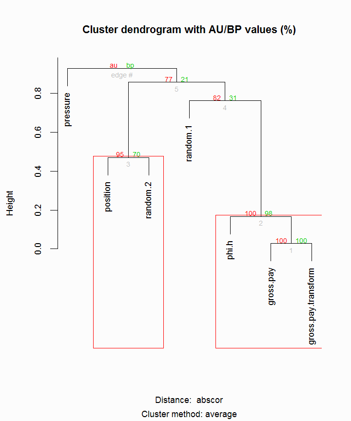
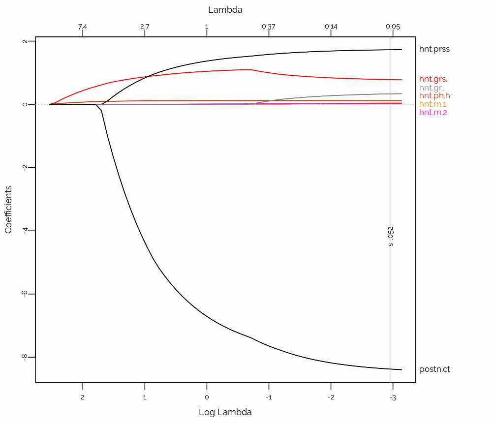
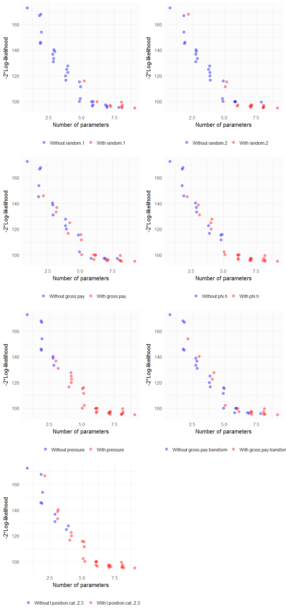
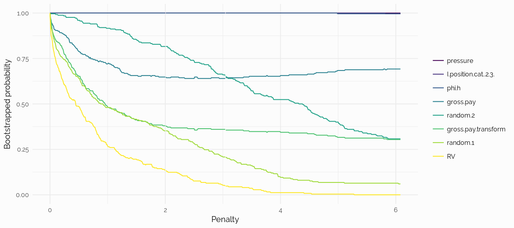
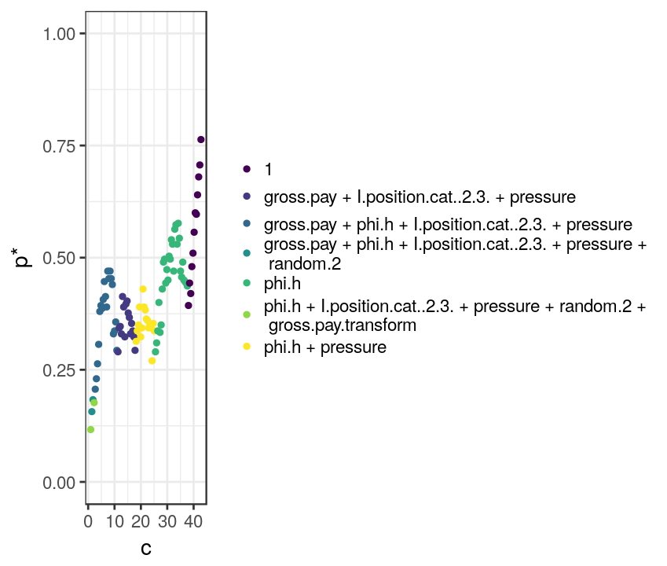

```r
#-----------------------------------------------------------------------------------------#
# NEEDED PACKAGES
#-----------------------------------------------------------------------------------------#
# library("packrat")
library("Hmisc")
library("rms")
library("ggplot2")
library("tidyr")
library("stringr")
library("pander")
library("extrafont")
library("plotly")
library("viridis")
library("readr")
library("knitr")
library("kableExtra")
library("tibble")
library("broom")
library("patchwork")
library("DT")
library("doParallel")


# font_import(pattern="[O/o]swald")
# font_import(pattern="PT_Sans")
# font_import(pattern="[R/r]aleway")
# loadfonts(device="win")
```

# Description of the Example Dataset
We will illustrate a number of methodologies on the dataset by Hunt^1^. Niccoli^2^ illustrated a number of statistical techniques on this dataset in a series of notebooks. As stated: "the target variable to be predicted, Y, is oil production (measured in tens of barrels of oil per day) from a marine barrier sand". Below, is a sample of the data:


```r
#-----------------------------------------------------------------------------------------#
# READ, LABEL, FORMAT DATA
#-----------------------------------------------------------------------------------------#
hunt <- read_csv("Table2_Hunt_2013_edit.csv")

#-----------------------------------------------------------------------------------------#
# MAKE SYNTACTICALLY VALID COL NAMES
#-----------------------------------------------------------------------------------------#
var.names <- tolower(colnames(hunt))
var.names <- make.names(var.names, unique = TRUE, allow_ = FALSE)
colnames(hunt) <- var.names

## Sample
options(DT.fillContainer = FALSE)
datatable(hunt,
          fillContainer = FALSE,
          style = 'bootstrap', 
          class = 'table-hover table-condensed stripe',
          extensions = 'Buttons',
          rownames = FALSE,
          filter = 'top',
          options = list(
            keys = TRUE,     
            autoWidth = TRUE,
            pageLength = 10,
            searching = FALSE, 
            dom = 'Bfrtip',
            searchHighlight = TRUE,
            buttons = c('copy', 'csv', 'excel', 'print'))) %>%
  formatStyle("production",
    background = styleColorBar(hunt$production, '#00D09E'),
    backgroundSize = '100% 80%',
    backgroundRepeat = 'no-repeat')
```

<!--html_preserve--><div id="htmlwidget-9249a7f9d48c76a52438" style="width:100%;height:auto;" class="datatables html-widget"></div>
<script type="application/json" data-for="htmlwidget-9249a7f9d48c76a52438">{"x":{"style":"bootstrap","filter":"top","filterHTML":"<tr>\n  <td data-type=\"number\" style=\"vertical-align: top;\">\n    <div class=\"form-group has-feedback\" style=\"margin-bottom: auto;\">\n      <input type=\"search\" placeholder=\"All\" class=\"form-control\" style=\"width: 100%;\"/>\n      <span class=\"glyphicon glyphicon-remove-circle form-control-feedback\"><\/span>\n    <\/div>\n    <div style=\"display: none; position: absolute; width: 200px;\">\n      <div data-min=\"0.1\" data-max=\"19.1\" data-scale=\"1\"><\/div>\n      <span style=\"float: left;\"><\/span>\n      <span style=\"float: right;\"><\/span>\n    <\/div>\n  <\/td>\n  <td data-type=\"number\" style=\"vertical-align: top;\">\n    <div class=\"form-group has-feedback\" style=\"margin-bottom: auto;\">\n      <input type=\"search\" placeholder=\"All\" class=\"form-control\" style=\"width: 100%;\"/>\n      <span class=\"glyphicon glyphicon-remove-circle form-control-feedback\"><\/span>\n    <\/div>\n    <div style=\"display: none; position: absolute; width: 200px;\">\n      <div data-min=\"0.5\" data-max=\"160\" data-scale=\"1\"><\/div>\n      <span style=\"float: left;\"><\/span>\n      <span style=\"float: right;\"><\/span>\n    <\/div>\n  <\/td>\n  <td data-type=\"number\" style=\"vertical-align: top;\">\n    <div class=\"form-group has-feedback\" style=\"margin-bottom: auto;\">\n      <input type=\"search\" placeholder=\"All\" class=\"form-control\" style=\"width: 100%;\"/>\n      <span class=\"glyphicon glyphicon-remove-circle form-control-feedback\"><\/span>\n    <\/div>\n    <div style=\"display: none; position: absolute; width: 200px;\">\n      <div data-min=\"1\" data-max=\"2.9\" data-scale=\"1\"><\/div>\n      <span style=\"float: left;\"><\/span>\n      <span style=\"float: right;\"><\/span>\n    <\/div>\n  <\/td>\n  <td data-type=\"integer\" style=\"vertical-align: top;\">\n    <div class=\"form-group has-feedback\" style=\"margin-bottom: auto;\">\n      <input type=\"search\" placeholder=\"All\" class=\"form-control\" style=\"width: 100%;\"/>\n      <span class=\"glyphicon glyphicon-remove-circle form-control-feedback\"><\/span>\n    <\/div>\n    <div style=\"display: none; position: absolute; width: 200px;\">\n      <div data-min=\"10\" data-max=\"20\"><\/div>\n      <span style=\"float: left;\"><\/span>\n      <span style=\"float: right;\"><\/span>\n    <\/div>\n  <\/td>\n  <td data-type=\"integer\" style=\"vertical-align: top;\">\n    <div class=\"form-group has-feedback\" style=\"margin-bottom: auto;\">\n      <input type=\"search\" placeholder=\"All\" class=\"form-control\" style=\"width: 100%;\"/>\n      <span class=\"glyphicon glyphicon-remove-circle form-control-feedback\"><\/span>\n    <\/div>\n    <div style=\"display: none; position: absolute; width: 200px;\">\n      <div data-min=\"1\" data-max=\"21\"><\/div>\n      <span style=\"float: left;\"><\/span>\n      <span style=\"float: right;\"><\/span>\n    <\/div>\n  <\/td>\n  <td data-type=\"integer\" style=\"vertical-align: top;\">\n    <div class=\"form-group has-feedback\" style=\"margin-bottom: auto;\">\n      <input type=\"search\" placeholder=\"All\" class=\"form-control\" style=\"width: 100%;\"/>\n      <span class=\"glyphicon glyphicon-remove-circle form-control-feedback\"><\/span>\n    <\/div>\n    <div style=\"display: none; position: absolute; width: 200px;\">\n      <div data-min=\"210\" data-max=\"395\"><\/div>\n      <span style=\"float: left;\"><\/span>\n      <span style=\"float: right;\"><\/span>\n    <\/div>\n  <\/td>\n  <td data-type=\"number\" style=\"vertical-align: top;\">\n    <div class=\"form-group has-feedback\" style=\"margin-bottom: auto;\">\n      <input type=\"search\" placeholder=\"All\" class=\"form-control\" style=\"width: 100%;\"/>\n      <span class=\"glyphicon glyphicon-remove-circle form-control-feedback\"><\/span>\n    <\/div>\n    <div style=\"display: none; position: absolute; width: 200px;\">\n      <div data-min=\"3.54\" data-max=\"29.25\" data-scale=\"2\"><\/div>\n      <span style=\"float: left;\"><\/span>\n      <span style=\"float: right;\"><\/span>\n    <\/div>\n  <\/td>\n  <td data-type=\"number\" style=\"vertical-align: top;\">\n    <div class=\"form-group has-feedback\" style=\"margin-bottom: auto;\">\n      <input type=\"search\" placeholder=\"All\" class=\"form-control\" style=\"width: 100%;\"/>\n      <span class=\"glyphicon glyphicon-remove-circle form-control-feedback\"><\/span>\n    <\/div>\n    <div style=\"display: none; position: absolute; width: 200px;\">\n      <div data-min=\"7.71\" data-max=\"59.2\" data-scale=\"2\"><\/div>\n      <span style=\"float: left;\"><\/span>\n      <span style=\"float: right;\"><\/span>\n    <\/div>\n  <\/td>\n<\/tr>","extensions":["Buttons"],"fillContainer":false,"data":[[0.1,1,1.9,3.1,4.1,4.9,5.9,7,8.1,8.9,10,11.1,11.9,13,14.1,15.1,15.9,16,17.1,18,19.1],[0.5,4,19,21.7,24.6,39.2,23.6,63,72.9,35.6,100,77.7,71.4,117,141,105.7,79.5,160,85.5,90,114.6],[2.1,1.1,1,2.1,2.9,1.1,2.1,2,2.9,2.8,2.2,2,2.9,1.1,1.2,1,1.1,1.2,1.9,2.8,2.1],[19,16,14,17,11,12,13,13,14,16,16,14,20,16,14,17,20,17,14,18,10],[5,13,12,6,10,7,13,20,1,1,21,1,11,9,10,3,10,15,6,19,21],[379,269,245,273,237,278,241,269,248,210,334,340,224,338,367,363,395,295,266,210,366],[3.54,5.79,8.51,11.52,10.16,11.14,15.04,15.1,14.49,16.9,16.61,17.81,19.74,17.7,19.16,21.97,22.15,24.24,23.58,23.77,29.25],[15.1,21.3,22.75,15.72,7.71,22.67,18.11,24.3,24.04,25.11,36.8,36.42,39.59,51.6,48.05,51.72,59.2,58.3,41.8,44.2,37.51]],"container":"<table class=\"table table-striped table-hover table-condensed\">\n  <thead>\n    <tr>\n      <th>gross.pay<\/th>\n      <th>phi.h<\/th>\n      <th>position<\/th>\n      <th>pressure<\/th>\n      <th>random.1<\/th>\n      <th>random.2<\/th>\n      <th>gross.pay.transform<\/th>\n      <th>production<\/th>\n    <\/tr>\n  <\/thead>\n<\/table>","options":{"keys":true,"autoWidth":true,"pageLength":10,"searching":false,"dom":"Bfrtip","searchHighlight":true,"buttons":["copy","csv","excel","print"],"columnDefs":[{"className":"dt-right","targets":[0,1,2,3,4,5,6,7]}],"order":[],"orderClasses":false,"orderCellsTop":true,"rowCallback":"function(row, data) {\nvar value=data[7]; $(this.api().cell(row, 7).node()).css({'background':isNaN(parseFloat(value)) || value <= 7.71 ? '' : 'linear-gradient(90deg, transparent ' + (59.2 - value)/51.49 * 100 + '%, #00D09E ' + (59.2 - value)/51.49 * 100 + '%)','background-size':'100% 80%','background-repeat':'no-repeat'});\n}"}},"evals":["options.rowCallback"],"jsHooks":[]}</script><!--/html_preserve-->

```r
#-----------------------------------------------------------------------------------------#
## ADD CATEGORICAL POSITION
#-----------------------------------------------------------------------------------------#
hunt %>%
  mutate(position.cat = cut2(position, c(1, 2, 3))) %>%
  as.tibble() -> hunt
```

^1^ *Hunt, L. (2013), [Many correlation coefficients, null hypotheses, and high value](https://csegrecorder.com/columns/view/value-of-integrated-geophysics-201312). CSEG Recorder, 38 (10)*  
^2^ *Niccoli, M (2017), [Machine learning in geoscience with scikit-learn - notebook 2](https://github.com/mycarta/predict/blob/master/Geoscience_ML_notebook_2.ipynb)*


```r
## Data
d <- hunt %>% describe()
html(d, size=100, scroll=FALSE)
plot(d)
```

<br><br>

# Is There A Difference in Production?
Suppose we are interested in assessing whether `production` changes according to `position`. The conventional approach is to perform [ANOVA](https://en.wikipedia.org/wiki/Analysis_of_variance) or t-test. However, both relies on normality and are sensitive to outliers. When comparing 2 samples, we can utilize the Wilcoxon test, while fore more than samples, the Kruskal-Wallis test is a generalization of the Wilcoxon test.

First, let's assess the distribution graphically. From the boxplot below, it is not apparent whether there is a difference in production between `positions`:


```r
g1 <- ggplot(hunt, aes(x = position.cat, y = production)) +
  geom_boxplot(fill = "grey60", alpha = 0.6, color = "grey60") +
  scale_x_discrete() + 
  xlab("Position") +
  ylab("Production") +
  theme_minimal(base_family = "Raleway", base_size = 9)

dat <- ggplot_build(g1)$data[[1]]
g1 + geom_segment(data=dat, aes(x=xmin, xend=xmax, y=middle, yend=middle), color = "coral2", size=1) 
```


<br>

Next, we perform the **Wilcoxon** test:


```r
# kw <- tidy(anova(ols(rank(production) ~ position.cat , data = hunt))) %>%
#   rename(` ` = `.rownames`)

# kable(kw, "html", align = "l", digits = 3) %>% 
#   kable_styling(bootstrap_options = c("striped", "hover", "condensed"), full_width = F, position = "left") %>%
#     row_spec(1:1, bold = T)

w1 <- tidy(wilcox.test(production~position.cat, data = hunt, conf.int=TRUE, distribution='exact', conf.level = .90))

kable(w1, "html", align = "l", digits = 3) %>% 
  kable_styling(bootstrap_options = c("striped", "hover", "condensed"), full_width = F, position = "left") %>%
    row_spec(1:1, bold = T)
```

<table class="table table-striped table-hover table-condensed" style="width: auto !important; ">
 <thead>
  <tr>
   <th style="text-align:left;"> estimate </th>
   <th style="text-align:left;"> statistic </th>
   <th style="text-align:left;"> p.value </th>
   <th style="text-align:left;"> conf.low </th>
   <th style="text-align:left;"> conf.high </th>
   <th style="text-align:left;"> method </th>
   <th style="text-align:left;"> alternative </th>
  </tr>
 </thead>
<tbody>
  <tr>
   <td style="text-align:left;font-weight: bold;"> 14.98 </td>
   <td style="text-align:left;font-weight: bold;"> 83 </td>
   <td style="text-align:left;font-weight: bold;"> 0.041 </td>
   <td style="text-align:left;font-weight: bold;"> 4.64 </td>
   <td style="text-align:left;font-weight: bold;"> 27.3 </td>
   <td style="text-align:left;font-weight: bold;"> Wilcoxon rank sum test </td>
   <td style="text-align:left;font-weight: bold;"> two.sided </td>
  </tr>
</tbody>
</table>

A P-value of 0.041, tells us that the probability of observing a difference in distribution equal to or more extreme than the one observed is 4.1%. In other words, **it's somewhat unlikely but not impossible that the difference in production is due to chance variation**.

<br>

# Distance Correlation
Measures of correlation quantify the strength of the relationship between pairs of variables. The traditional Pearson correlation has several limitations, one of which is that it assumes a linear relationship. The Spearman correlation is generally preferred and avoids some of these limitations. A relatively new and powerful measure of correlation is the **[distance correlation](https://en.wikipedia.org/wiki/Distance_correlation)**. 


```r
#-----------------------------------------------------------------------------------------#
# DISTANCE CORRELATION
#-----------------------------------------------------------------------------------------#
##Corr matrix
correlations <- sapply(1:8, function(r) {
  sapply(1:8, function(c) {
    energy::dcor(hunt[,r], hunt[,c])
    })
})
colnames(correlations) <- rownames(correlations) <- colnames(hunt)[1:8]

## P-values (2000 bootstrap resamples)
cor.mtest <- function(mat, ...) {
    mat <- as.matrix(mat)
    n <- ncol(mat)
    p.mat<- matrix(NA, n, n)
    diag(p.mat) <- 0
    for (i in 1:(n - 1)) {
        for (j in (i + 1):n) {
            tmp <- energy::dcov.test(mat[, i], mat[, j], index = 1.0, R=2000)
            p.mat[i, j] <- p.mat[j, i] <- tmp$p.value
        }
    }
  colnames(p.mat) <- rownames(p.mat) <- colnames(mat)
  p.mat
}
p.mat <- cor.mtest(correlations)


## Plot corrmatrix
library(corrplot)
par(family = 'Raleway',
    pin = c(3,6), 
    ps = 9,
    mar = c(0.1, 0.1, 0.1, 0.1))

col <- colorRampPalette(c("#BB4444", "#EE9988", "#FFFFFF", "#77AADD", "#4477AA"))
corrplot(correlations,
         method = "color",
         col = col(200),
         type = "upper",
         order = "hclust",
         addCoef.col = "black",
         tl.col = "black",
         tl.srt = 45,
         p.mat = p.mat,
         sig.level = 0.10,
         insig = "blank",
         diag = FALSE,
         bg = "grey90",
         outline = TRUE,
         addgrid.col = "white",
         cl.lim = c(0, 1),
         tl.cex = 1.0,
         cl.cex = 0.8,
         cl.pos = "n")
```


Above is the distance correlation matrix. Colored boxes represent statistically significant correlations at the 10% significance level. The correlation measure is able to detect that `gross.pay` is highly correlated to `gross.pay.transform` (they are algebraically related). Also, `gross.pay` is highly correlated with `production`.


### A Note on the Choice of Correlation
Among measures of correlations capable of detecting non-linear association, MIC (maximal information criterion, Reshef et al.) has been touted as a powerful measures. However, several authors Kinney^2^, Simon^3^ point to a number of problems with MIC and suggest to utilize distance correlation instead: 

> "We believe that the recently proposed distance correlation measure of Székely & Rizzo (2009) is a more powerful technique that is simple, easy to compute and should be considered for general use".

^1^ Rashef et al. (2011), [Detecting novel associations in large data sets](https://www.ncbi.nlm.nih.gov/pubmed/22174245)  
^2^ Kinney et al. (2013), [Equitability, mutual information, and the maximal information coefficient](http://www.pnas.org/content/111/9/3354)  
^3^ Simon et al. (2014), [Comment on "Detecting Novel Associations In Large Data Sets](https://arxiv.org/abs/1401.7645)

<br><br>

# Smoothers
Correlation matrices are useful to visualize combinations of pairwise correlations. There is, however, more information to be had by plotting the data and adding a trend line. One of the most flexible is Cleveland's [LOESS](https://en.wikipedia.org/wiki/Local_regression) (locally weighted scatterplot smoothing). Let's plot the LOESS curves for each variable against production, separate for each `position`.


```r
g1 <- ggplot(hunt, aes(y = production, x = gross.pay, colour = factor(position.cat))) +
  stat_plsmo(fullrange = TRUE) + 
  geom_point() +
  xlab("Gross Pay") +
  ylab("Production") +
  theme_minimal(base_family = "Raleway", base_size = 10) +
  scale_color_discrete(guide = guide_legend(title = "Position")) +
  theme(legend.position="none")

g2 <- ggplot(hunt, aes(y = production, x = phi.h, colour = factor(position.cat))) +
  stat_plsmo(fullrange = TRUE) + 
  geom_point() +
  xlab("Phi-h") +
  ylab("Production") +
  theme_minimal(base_family = "Raleway", base_size = 10) +
  scale_color_discrete(guide = guide_legend(title = "Position")) +
  theme(legend.position="none")


g3 <- ggplot(hunt, aes(y = production, x = pressure, colour = factor(position.cat))) +
  stat_plsmo(fullrange = TRUE) + 
  geom_point() +
  xlab("Pressure") +
  ylab("Production") +
  theme_minimal(base_family = "Raleway", base_size = 10) +
  scale_color_discrete(guide = guide_legend(title = "Position")) +
  theme(legend.position="none")

g4 <- ggplot(hunt, aes(y = production, x = random.1, colour = factor(position.cat))) +
  stat_plsmo(fullrange = TRUE) + 
  geom_point() +
  xlab("Random Var") +
  ylab("Production") +
  theme_minimal(base_family = "Raleway", base_size = 10) +
  scale_color_discrete(guide = guide_legend(title = "Position")) +
  theme(legend.position="none")

g5 <- ggplot(hunt, aes(y = production, x = gross.pay.transform, colour = factor(position.cat))) +
  stat_plsmo(fullrange = TRUE) + 
  geom_point() +
  xlab("Gross Pay (transformed)") +
  ylab("Production") +
  theme_minimal(base_family = "Raleway", base_size = 10) +
  scale_color_discrete(guide = guide_legend(title = "Position")) +
  theme(legend.position="none")


g1+g2+g3+g4+g5
```


*Scatterplots of production against each variable by position (red: blue:). A LOESS curve was added to highlight the overall trend.*

<br><br>

# Variable Selection
Which variables should we focus on in understanding what drives changes in production? Which variables are measuring the same or similar underlying quantities?

A statistically principled approach is to start by eliminating variables based on domain knowledge. This may be assisted by statistical data reduction methods such as clustering and redundancy analysis. 

<br>

## Clustering
Here we assess clusters of independent variables. We do so blinded to the response variable, `production`, in order to avoid creating bias. In cluster analysis, the objective is to identify vairables that are measuring the same underlying phenomenon. If they exists and supported by domain knowledge, one could argue for removing one of them.

 

```r
vc <- varclus (~ gross.pay + phi.h + position.cat + pressure + random.1 + random.2 + gross.pay.transform,
              sim = 'hoeffding', 
              data = hunt)

par(family = 'Raleway',
    ps = 9,
    mar = c(0.2, 4, 1.5, 1.5))
plot(vc)
```


*Hierarchical cluster dendogram of all variables except production. The similarity matrix is based on the Hoeffding D statistics which will detect non-monotonic associations.*


There are numerous methods to perform hierarchical clustering. It's good practice to try different methods to see if the results are in the same ballpark. Let's do that with Hierarchical Clustering with P-Values via Multiscale Bootstrap^1^:


```r
## pvclust
library(pvclust)
hunt2 <- select(hunt, -production, -position.cat)
cluster.bootstrap <- pvclust(hunt2, 
                             nboot = 5000, 
                             method.dist = "abscor",
                             parallel = TRUE,
                             iseed = 123)
```

```
## Creating a temporary cluster...done:
## socket cluster with 7 nodes on host 'localhost'
## Multiscale bootstrap... Done.
```

```r
par(family = 'Raleway',
    ps = 9)
plot(cluster.bootstrap)
pvrect(cluster.bootstrap)
```



From either cluster dendograms we can see how `gross.pay` and `gross.pay.transform` cluster together and, to a lesser extent, `phi.h`. Based on examination of these results, the natural choice is to remove either `gross.pay` or `gross.pay.transform` from further analyses. Suppose we don't know `gross.pay.transform` is algebraically related to `gross.pay`: which of the two should we exclude? Redundancy analysis, helps us determine that.

^1^Suzuki et al. (2006), [Pvclust: an R package for assessing the uncertainty in hierarchical clustering](https://www.ncbi.nlm.nih.gov/pubmed/16595560)

<br>

## Redundancy Analysis


```r
redun <- redun(~ gross.pay + phi.h + I(position.cat) + pressure + random.1 + random.2 + gross.pay.transform,
                r2 = 0.75,
                type = 'adjusted',
                tlinear = FALSE,
                iterms = TRUE,
                pc = TRUE,
                data = hunt)
```

In redundancy analysis we look at which variable can be predicted with high confidence from any combination of the other variables. Those variables can then be safely omitted from further analysis. This approach is more robust than the pairwise correlation measures from before. We've set the adjusted R^2^ value at 0.75.

We started with:


```r
redun$In
```

```
##  [1] "gross.pay'"          "phi.h'"              "I(position.cat)"    
##  [4] "pressure"            "pressure'"           "random.1"           
##  [7] "random.1'"           "random.2"            "random.2'"          
## [10] "gross.pay.transform"
```

The model suggests that:


```r
redun$rsquared
```

```
##            gross.pay gross.pay.transform'                phi.h 
##            0.9731901            0.8916161            0.7507618
```

can be removed because they are predicted from all the remaining variables. The numbers represent the R^2^ with which a variable ican be predicted from all other remaining ones. However, we need to be very cautious, since the sample size is much too low to reliably suggest which variables can be omitted.


<br>

## LASSO
The previous methods achieved variable reduction without consideration of the response variable, `production`. This is a sound approach, however, we may wish to do variable selection within a regression model. [LASSO](https://en.wikipedia.org/wiki/Lasso_(statistics)) (least absolute shrinkage and selection operator) achieves that by shrinking the model coefficients. The primary purpose of shrinkage methods is that of improving predictive accuracy. However, if coefficients are shrinked to zero, the LASSO effectively achieves variable selection. 

Fitting a LASSO model to the data, yield the following shrinked coefficients. 


```r
library(glmnet)
library(plotmo)

position.cat <- model.matrix(hunt$production ~ hunt$position.cat)[, -1]
x <- as.matrix(data.frame(hunt$gross.pay, hunt$phi.h, hunt$pressure, hunt$random.1, hunt$random.2, hunt$gross.pay.transform, position.cat))

## LASSO
lasso <- glmnet(x, 
                y = hunt$production,
                alpha = 1,
                family="gaussian",
                standardize = TRUE)

set.seed(123)
cv.lasso <- cv.glmnet(x, 
                      y = hunt$production, 
                      standardize = TRUE,
                      type.measure = "mse",
                      nfolds = 21,
                      parallel = TRUE,
                      alpha = 1)

lambda_min <- cv.lasso$lambda.min
lambda_1se <- cv.lasso$lambda.1se

## Make table of coeff
coef <- as.data.frame(as.matrix(coef(cv.lasso, s = lambda_1se))) %>% 
  rename(`Shrinked Coefficient` = !!names(.[1])) %>%
  rownames_to_column(var = "Variable") %>%
  mutate(`Shrinked Coefficient` = ifelse(`Shrinked Coefficient` == 0, NA, `Shrinked Coefficient`)) %>%
  mutate(Variable = gsub("hunt.", "", Variable))
  
kable(coef, "html", align = "l", digits = 3) %>%
  kable_styling(bootstrap_options = c("striped", "hover", "condensed"), full_width = F, position = "left")
```

<table class="table table-striped table-hover table-condensed" style="width: auto !important; ">
 <thead>
  <tr>
   <th style="text-align:left;"> Variable </th>
   <th style="text-align:left;"> Shrinked Coefficient </th>
  </tr>
 </thead>
<tbody>
  <tr>
   <td style="text-align:left;"> (Intercept) </td>
   <td style="text-align:left;"> -4.278 </td>
  </tr>
  <tr>
   <td style="text-align:left;"> gross.pay </td>
   <td style="text-align:left;"> 1.032 </td>
  </tr>
  <tr>
   <td style="text-align:left;"> phi.h </td>
   <td style="text-align:left;"> 0.116 </td>
  </tr>
  <tr>
   <td style="text-align:left;"> pressure </td>
   <td style="text-align:left;"> 1.332 </td>
  </tr>
  <tr>
   <td style="text-align:left;"> random.1 </td>
   <td style="text-align:left;"> NA </td>
  </tr>
  <tr>
   <td style="text-align:left;"> random.2 </td>
   <td style="text-align:left;"> 0.010 </td>
  </tr>
  <tr>
   <td style="text-align:left;"> gross.pay.transform </td>
   <td style="text-align:left;"> NA </td>
  </tr>
  <tr>
   <td style="text-align:left;"> position.cat </td>
   <td style="text-align:left;"> -6.544 </td>
  </tr>
</tbody>
</table>


Looking at the table of coefficients, notice how `hunt.random.1` and `gross.pay.transform` have no coefficient. That's because they have been shrunked to zero, thus achieving variable selection. Our model suggests that these two variable are not useful in explaining changes in `production`. The coefficient for `hunt.random.2` is also nearly zero, so we could remove it as well. 

To gain more insight, it helps to visualize how fast coefficients are shrunked to zero (thus, excluded from the mdoel) as we increase the amount of shirinkage, $\lambda$. The range of $\lambda$ is chosen via [cross-validation](https://en.wikipedia.org/wiki/Cross-validation_(statistics)).


```r
## Plot results
par(family = 'Raleway',
    ps = 9,
    mfrow = c(1, 1),
    mar = c(3, 2.5, 1.5, 1.5))

plot_glmnet(lasso, 
            s = cv.lasso$lambda.min,
            xlab = "Log Lambda")
```

<!-- -->

```r
# plot(cv.lasso)
```

Moving from left to right, we see that if $\lambda$ (x-axis) is sufficiently large, all coefficients are shrunked to zero (y-axis), meaning all variables have been excluded. As we move to the right and $\lambda$ decreases, `gross.pay` enters the model, followed by `phi.h`. Moving to the far right, we see that when $\lambda$ is close to zero, little shrinkage occurs and no variable selection occurs. Throughout the graph, `random.1`, `random.2`, remain consistently close to the zero line. The vertical line at 0.052 is the value of $\lambda$ chosen by cross-validation that minimizes the loss function (this is what was used to generate the table above).

For this model the [loss function](https://en.wikipedia.org/wiki/Loss_function) is the [mean squared error](https://en.wikipedia.org/wiki/Mean_squared_error) (MSE). It is helpful to visualize how MSE changes as a function of $\lambda$, but more crucially, to visualize the error bars of each MSE. This graph should give us pause in picking a $\lambda$ value, since the majority of  $\lambda$ < 0.052 are nearly equivalent.


```r
## Plot results
par(family = 'Raleway',
    ps = 9,
    mfrow = c(1, 1),
    mar = c(3, 2.5, 2, 1.5))

plot(cv.lasso, xlab = "Log Lambda")
```

<!-- -->


<br>

## Recursive feature elimination
There is no shortage of methods on variable selection coming from the **Machine Learning** literature.  Recursive feature elimination^1^ is a model-based method. The technical details are beyond the scope of this article.

The majority of model-based variable selection methods perform better with normalized data (substract the mean and divide by the standard deviation).


```r
## Recursive feature elimination
library(Hmisc)
library(randomForest)
library(caret)

## Parallelize
# doMC::registerDomc(cores = 6)

## First normalize
normalization <- preProcess(x)
x <- predict(normalization, x)
x <- as.data.frame(x)
subsets <- c(1:7)


set.seed(123)

ctrl <- rfeControl(functions = lmFuncs,        ##use lm functions due to very small sample size
                   method = "repeatedcv",      ##use bootstrap due to very small sample size. Otherwise, do repeatedcv
                   returnResamp = "all",
                   repeats = 100,
                   verbose = FALSE,
                   allowParallel = TRUE)

lmProfile <- rfe(x, 
                 hunt$production,
                 sizes = subsets,
                 rfeControl = ctrl)

## Table of results
kable(as.data.frame(lmProfile$results), 
      "html",
      align = "l",
      digits = 3) %>% 
  kable_styling(bootstrap_options = c("striped", "hover", "condensed")) %>%
  row_spec(4, bold = TRUE, color = "black", background = "#FFFED0")
```

<table class="table table-striped table-hover table-condensed" style="margin-left: auto; margin-right: auto;">
 <thead>
  <tr>
   <th style="text-align:left;"> Variables </th>
   <th style="text-align:left;"> RMSE </th>
   <th style="text-align:left;"> Rsquared </th>
   <th style="text-align:left;"> MAE </th>
   <th style="text-align:left;"> RMSESD </th>
   <th style="text-align:left;"> RsquaredSD </th>
   <th style="text-align:left;"> MAESD </th>
  </tr>
 </thead>
<tbody>
  <tr>
   <td style="text-align:left;"> 1 </td>
   <td style="text-align:left;"> 9.021 </td>
   <td style="text-align:left;"> 0.970 </td>
   <td style="text-align:left;"> 8.147 </td>
   <td style="text-align:left;"> 4.768 </td>
   <td style="text-align:left;"> 0.131 </td>
   <td style="text-align:left;"> 4.191 </td>
  </tr>
  <tr>
   <td style="text-align:left;"> 2 </td>
   <td style="text-align:left;"> 7.361 </td>
   <td style="text-align:left;"> 0.977 </td>
   <td style="text-align:left;"> 6.640 </td>
   <td style="text-align:left;"> 3.915 </td>
   <td style="text-align:left;"> 0.113 </td>
   <td style="text-align:left;"> 3.528 </td>
  </tr>
  <tr>
   <td style="text-align:left;"> 3 </td>
   <td style="text-align:left;"> 6.060 </td>
   <td style="text-align:left;"> 0.985 </td>
   <td style="text-align:left;"> 5.502 </td>
   <td style="text-align:left;"> 2.552 </td>
   <td style="text-align:left;"> 0.073 </td>
   <td style="text-align:left;"> 2.500 </td>
  </tr>
  <tr>
   <td style="text-align:left;font-weight: bold;color: black;background-color: #FFFED0;"> 4 </td>
   <td style="text-align:left;font-weight: bold;color: black;background-color: #FFFED0;"> 3.414 </td>
   <td style="text-align:left;font-weight: bold;color: black;background-color: #FFFED0;"> 0.993 </td>
   <td style="text-align:left;font-weight: bold;color: black;background-color: #FFFED0;"> 3.017 </td>
   <td style="text-align:left;font-weight: bold;color: black;background-color: #FFFED0;"> 1.666 </td>
   <td style="text-align:left;font-weight: bold;color: black;background-color: #FFFED0;"> 0.043 </td>
   <td style="text-align:left;font-weight: bold;color: black;background-color: #FFFED0;"> 1.516 </td>
  </tr>
  <tr>
   <td style="text-align:left;"> 5 </td>
   <td style="text-align:left;"> 3.638 </td>
   <td style="text-align:left;"> 0.992 </td>
   <td style="text-align:left;"> 3.231 </td>
   <td style="text-align:left;"> 1.639 </td>
   <td style="text-align:left;"> 0.051 </td>
   <td style="text-align:left;"> 1.489 </td>
  </tr>
  <tr>
   <td style="text-align:left;"> 6 </td>
   <td style="text-align:left;"> 3.589 </td>
   <td style="text-align:left;"> 0.990 </td>
   <td style="text-align:left;"> 3.196 </td>
   <td style="text-align:left;"> 1.796 </td>
   <td style="text-align:left;"> 0.062 </td>
   <td style="text-align:left;"> 1.629 </td>
  </tr>
  <tr>
   <td style="text-align:left;"> 7 </td>
   <td style="text-align:left;"> 3.600 </td>
   <td style="text-align:left;"> 0.990 </td>
   <td style="text-align:left;"> 3.169 </td>
   <td style="text-align:left;"> 1.860 </td>
   <td style="text-align:left;"> 0.063 </td>
   <td style="text-align:left;"> 1.694 </td>
  </tr>
</tbody>
</table>

From the table we can see a model with 4 variables achieves the highest R^2^ and the lowest RMSE and highest R^2^. Their standard deviation is also among the lowest. Those 4 variables are: 


```r
caret::predictors(lmProfile)
```

```
## [1] "hunt.phi.h"     "hunt.gross.pay" "hunt.pressure"  "position.cat"
```

We can, of course, plot the results for more immediacy:


```r
library(caret)
trellis.par.set(caretTheme())
trellis.par.set(grid.pars = list(fontfamily = 'Raleway',
                                 ps = 9,
                                 mar = c(0.1, 0.1, 0.1, 0.1)))

plot1 <- plot(lmProfile, type = c("g", "o"), col = "#F8766D", lwd = 2)
plot2 <- plot(lmProfile, type = c("g", "o"), metric = "Rsquared", col = "#F8766D",lwd = 2)
print(plot1, position = c(0, 0, 0.495, 1), more=TRUE)
print(plot2, position = c(0.505, 0, 1, 1))
```


^1^ Guyon et al., [Gene Selection for Cancer Classification using Support Vector Machines](https://link.springer.com/article/10.1023/A:1012487302797)

<br>

## Exhaustive Search
Another option to consider is that of performing an exhaustive search throughout the model space. Exhaustive search methods can be computationally prohibitive as "with more than a thousand models when p = 10 and a million when p = 20". [Tarr et al.](https://www.jstatsoft.org/article/view/v083i09) (2018) illustrate an implementation of exhaustive search through many bootstrap resamples: "if there exists a “correct” model of a particular model size it will be selected overwhelmingly more often than other models of the same size". 

This approach is intended the assist the analyst with the choice of model, rather than providing with a list of selected variables.


```r
library(mplot)

f1 <- lm(production ~ gross.pay + phi.h + I(position.cat) + pressure + random.1 + random.2 + gross.pay.transform, data = hunt)
vis <- vis(f1, B = 250, redundant = TRUE, nbest = 5, seed = 123) 

p1 <- plot(vis, interactive = FALSE, highlight = "random.1", which = "lvk") + theme_minimal(base_family = "Raleway", base_size = 10) + theme(legend.position="bottom") + theme(legend.title=element_blank())
p2 <- plot(vis, interactive = FALSE, highlight = "random.2", which = "lvk") + theme_minimal(base_family = "Raleway", base_size = 10) + theme(legend.position="bottom") + theme(legend.title=element_blank())
p3 <- plot(vis, interactive = FALSE, highlight = "gross.pay", which = "lvk") + theme_minimal(base_family = "Raleway", base_size = 10) + theme(legend.position="bottom") + theme(legend.title=element_blank())
p4 <- plot(vis, interactive = FALSE, highlight = "phi.h", which = "lvk") + theme_minimal(base_family = "Raleway", base_size = 10) + theme(legend.position="bottom") + theme(legend.title=element_blank())
p5 <- plot(vis, interactive = FALSE, highlight = "pressure", which = "lvk") + theme_minimal(base_family = "Raleway", base_size = 10) + theme(legend.position="bottom") + theme(legend.title=element_blank())
p6 <- plot(vis, interactive = FALSE, highlight = "gross.pay.transform", which = "lvk") + theme_minimal(base_family = "Raleway", base_size = 10) + theme(legend.position="bottom") + theme(legend.title=element_blank())
p7 <- plot(vis, interactive = FALSE, highlight = "I.position.cat..2.3.", which = "lvk") + theme_minimal(base_family = "Raleway", base_size = 10) + theme(legend.position="bottom") + theme(legend.title=element_blank())


p1 + p2 + p3 + p4 + p5 + p6 + p7 + plot_layout(ncol = 2)
```

<!-- -->

The plots above illustrate what happens to the model fit (log-likelihood) when we remove a variable (higher is better). For instance, in the upper left plot, there's a clear separation in model fit when we remove `random.1`, so that resamples that do not contain `random.1` perform better than model that do contain `random.1`.


```r
p1 <- plot(vis, interactive = FALSE, highlight = "random.1", which = "boot") + theme_minimal(base_family = "Raleway", base_size = 9)
p2 <- plot(vis, interactive = FALSE, highlight = "random.2", which = "boot") + theme_minimal(base_family = "Raleway", base_size = 9)
p3 <- plot(vis, interactive = FALSE, highlight = "gross.pay", which = "boot") + theme_minimal(base_family = "Raleway", base_size = 9)
p4 <- plot(vis, interactive = FALSE, highlight = "phi.h", which = "boot") + theme_minimal(base_family = "Raleway", base_size = 9)
p5 <- plot(vis, interactive = FALSE, highlight = "pressure", which = "boot") + theme_minimal(base_family = "Raleway", base_size = 9)
p6 <- plot(vis, interactive = FALSE, highlight = "gross.pay.transform", which = "boot") + theme_minimal(base_family = "Raleway", base_size = 9)
p7 <- plot(vis, interactive = FALSE, highlight = "I.position.cat..2.3.", which = "lvk") + theme_minimal(base_family = "Raleway", base_size = 9) + theme(legend.position="bottom") + theme(legend.title=element_blank())

p1 + p2 + p3 + p4 + p5 + p6 + p7 + plot_layout(ncol = 2)
```


Finaly, we can investigate how variables are included as the penalty increases. In the plot `RV` is a random variable that can be used as reference.


```r
plot(vis, interactive = FALSE, which = "vip") + theme_minimal(base_family = "Raleway", base_size = 9) + scale_color_viridis(discrete = TRUE, option = "D")
```

<!-- -->

As the amount of penalty increases, it become clearer what variables remain: `lposition.cat` is the strongest predictor no matter the penalty. The three random variables and `gross.pay.transform` (which contained noise) are the fastest to fall out from bootstrap resamples.


```r
library(mplot)
af <- af(f1, B = 300, n.c = 100, seed = 123) 
plot(af, best.only = TRUE, legend.position = "right", model.wrap = 4) + theme_minimal(base_family = "Raleway", base_size = 9) + scale_color_viridis(discrete = TRUE, option = "D")
```

<!-- -->

p is the proportion of times a given model is selected for a given c value. 

<br>


## Summary of Variable Selection
There is little consensus among researchers on what constitutes a sensible variable selection strategy. In fact, many authors are critical of several variable selection techniques and suggest utilizing domain knowledge coupled with variable selection blinded to to the response^1^.

Our example is hardly demonstrative, since we are dealing with a very limited sample size. Nonetheless, we can summarize the results as follows:

| Method                        	| No. of Variables Selected 	| Variable Removed                                                               	| Notes                                                    	|
|-------------------------------	|---------------------------	|--------------------------------------------------------------------------------	|----------------------------------------------------------	|
| Domain knowledge              	| 4                         	| `random.1`, `random.2`, `gross.pay.transform`                                  	| Baseline                                                 	|
| Clustering                    	| NA                        	| `gross.pay` and `gross.pay.transform` can be represented by a  single variable 	| Only suggestive, not a true variable selection technique 	|
| Redundancy Analysis           	| 5                         	| `gross.pay`, ` gross.pay.transform`                                            	|                                                          	|
| LASSO                         	| 5                         	| `random.1`, `gross.pay.transform`                                              	| `random.2` was very close to zero                        	|
| Recursive Feature Elimination 	| 4                         	| `random.1`, `random.2`, `gross.pay.transform`                                  	|                                                          	|
| Exhaustive search             	| 4                         	| `random.1`, `random.2`, `gross.pay.transform`                                  	| Based on visual inspection                               	|

From these limited data, recursive feature elimination performed best. There are many variable selection strategies and we have only skimmed through a few of them. 

Little consensus exists around variable selection. Harrell ^1,2^ states that 

> Variable selection (without penalization) only makes things worse. Variable selection has almost no chance of finding the "right" variables, and results in large overstatements of effects of remaining variables and huge understatement of standard errors. 

Kuhn^3^ confirms by writing: 

> This underscores the idea that feature selection is a poor method for determining the most significant variables in the *data*, as opposed to which predictors mostly influenced the *model*. Different models will score the predictors differently. To assess which predictors have individual associations with the outcome, common classical statistical methods are far more appropriate. 

Hence, using domain knowledge **before** applying any statistical methods is preferrable. If statistical or ML approaches are to be used, it is best to start with methods blinded to the outcome. Shrinkage methods, such as the LASSO, can be used as a next step.


^1^ See Harrell (2015), [Regression Modeling Strategies](https://www.springer.com/gb/book/9781441929181)  
^2^ See Harrell (2015), [CrossValidated](https://stats.stackexchange.com/questions/18214/why-is-variable-selection-necessary)  
^3^ See Kuhn et al. (2013), [Applied Predictive Modeling](https://www.springer.com/gp/book/9781461468486)

<br>


<br><br>

# Sample Size and Power Calculations
Sample size calculations are customary tools used to estimate how many observations one needs in order to detect a given effect with a certain probability. Effect here means, quite broadly, any difference between, say, two means (or other parameter). For instance, one may be interested in the difference between the mean production in the presence or absence of certain geological features and wonder how many wells we would need in order to conclude with a given confidence that the two means are different from each other.

Key points and definitions in the evaluation of sample sizes are:

1.  Large differences are easier to detect than smaller differences
2.  We may commit **two types of errors**, called **type I** (alpha, or false positive) and **type II** error (beta, or false negative)
3.  **Power** refers to 1-beta, or the probability of detecting a difference if fact it exists
4.  Normally, we solve for n (sample size) or power


> **Example**  
> Suppose we are trying to assess whether a hypothetical geological feature is associated with increased production. How many wells are needed to achieve a 80% probability of detecting a difference in mean production (1-beta or power), and we are willing to accept a 10% probability of declaring a false positive (alpha or significance level)?

In the simplest scenario one could utilize the following formula:

$$\normalsize n = \frac{(Z_{\alpha /2}+Z_{\beta})^{2}\times 2\sigma ^2}{d^{2}}$$

where $Z_{\alpha /2}$ is the critical value from the normal distribution at α/2 (for a two-sided test); $Z_{\beta}$ is the critical value from the normal distribution at β; $\sigma ^2$ is the population variance (or pooled variance); $d$ is the difference between the two means.

From the equation we need an estimate for $d = \overline{x_{1}}-\overline{x_{2}}$ and the population standard deviation, $\sigma$. Normally, we take these estimates from other similar analysis or datasets. Suppose from previous analysis we know that:

Mean production when geological feature is **present**: 48 (sd: 15.6)  
Mean production when geological feature is **not present**: 27 (sd: 11.6)  

It is always wise to solve for a range of plausible values, rather than a single point. In the graph below, we have included a range of values (34, 36, 38, 40, 42, 44 for µ1 and 24, 26, 28, 30, 32, 34 for µ2)^1^. 

Solving for the above equation yield the following curves^2,3^.  


```r
## This uses output from NCSS PASS
ss1 <- structure(list(Power = c(0.807, 0.805, 0.803, 0.802, 0.8, 0.8, 
0.801, 0.807, 0.805, 0.803, 0.802, 0.8, 0.816, 0.801, 0.807, 
0.805, 0.803, 0.802, 0.819, 0.816, 0.801, 0.807, 0.805, 0.803, 
0.824, 0.819, 0.816, 0.801, 0.807, 0.805, 0.849, 0.824, 0.819, 
0.816, 0.801, 0.807), N1 = c(26L, 40L, 70L, 156L, 619L, NA, 18L, 
26L, 40L, 70L, 156L, 619L, 14L, 18L, 26L, 40L, 70L, 156L, 11L, 
14L, 18L, 26L, 40L, 70L, 9L, 11L, 14L, 18L, 26L, 40L, 8L, 9L, 
11L, 14L, 18L, 26L), N2 = c(26, 40, 70, 156, 619, 1.7e+308, 18, 
26, 40, 70, 156, 619, 14, 18, 26, 40, 70, 156, 11, 14, 18, 26, 
40, 70, 9, 11, 14, 18, 26, 40, 8, 9, 11, 14, 18, 26), µ1 = c(34, 
34, 34, 34, 34, 34, 36, 36, 36, 36, 36, 36, 38, 38, 38, 38, 38, 
38, 40, 40, 40, 40, 40, 40, 42, 42, 42, 42, 42, 42, 44, 44, 44, 
44, 44, 44), µ2 = c(24, 26, 28, 30, 32, 34, 24, 26, 28, 30, 32, 
34, 24, 26, 28, 30, 32, 34, 24, 26, 28, 30, 32, 34, 24, 26, 28, 
30, 32, 34, 24, 26, 28, 30, 32, 34), µ1...µ2 = c(10, 8, 6, 4, 
2, 0, 12, 10, 8, 6, 4, 2, 14, 12, 10, 8, 6, 4, 16, 14, 12, 10, 
8, 6, 18, 16, 14, 12, 10, 8, 20, 18, 16, 14, 12, 10), s1 = c(16, 
16, 16, 16, 16, 16, 16, 16, 16, 16, 16, 16, 16, 16, 16, 16, 16, 
16, 16, 16, 16, 16, 16, 16, 16, 16, 16, 16, 16, 16, 16, 16, 16, 
16, 16, 16), s2 = c(12, 12, 12, 12, 12, 12, 12, 12, 12, 12, 12, 
12, 12, 12, 12, 12, 12, 12, 12, 12, 12, 12, 12, 12, 12, 12, 12, 
12, 12, 12, 12, 12, 12, 12, 12, 12), Alpha = c(0.1, 0.1, 0.1, 
0.1, 0.1, 0.1, 0.1, 0.1, 0.1, 0.1, 0.1, 0.1, 0.1, 0.1, 0.1, 0.1, 
0.1, 0.1, 0.1, 0.1, 0.1, 0.1, 0.1, 0.1, 0.1, 0.1, 0.1, 0.1, 0.1, 
0.1, 0.1, 0.1, 0.1, 0.1, 0.1, 0.1), Beta = c(0.193, 0.195, 0.197, 
0.198, 0.2, 0.2, 0.199, 0.193, 0.195, 0.197, 0.198, 0.2, 0.184, 
0.199, 0.193, 0.195, 0.197, 0.198, 0.181, 0.184, 0.199, 0.193, 
0.195, 0.197, 0.176, 0.181, 0.184, 0.199, 0.193, 0.195, 0.151, 
0.176, 0.181, 0.184, 0.199, 0.193)), .Names = c("Power", "N1", 
"N2", "µ1", "µ2", "µ1...µ2", "s1", "s2", "Alpha", "Beta"), class = "data.frame", row.names = c(NA, 
-36L))

## Or could use R
# pwr::pwr.t.test(d=(0-18)/14.14214,
#                 power = 0.8,
#                 sig.level = 0.10,
#                 type = "two.sample",
#                 alternative = "two.sided")


ss1 <- ss1 %>%
  mutate(µ2 = as.factor(µ2))

plotly::ggplotly(ggplot(ss1, aes(x = µ1, y = N1, color = µ2)) +
  geom_point(size = 3) + 
  geom_line(size = 1) +
  scale_colour_viridis_d() +
  scale_y_log10(breaks = c(8, 9, 10, 12, 14, 16, 20, 24, 28, 34, 44, 50, 60, 70, 80, 100, 150, 250, 400, 600)) +
annotation_logticks(sides = "lr") +
  labs(y = "N1",
       color = "µ2",
       caption = "N2 assumed to be equal to N1") +
  theme_minimal(base_family = "Raleway", base_size = 14))
```

<!--html_preserve--><div id="65a24795efa0" style="width:849.6px;height:720px;" class="plotly html-widget"></div>
<script type="application/json" data-for="65a24795efa0">{"x":{"data":[{"x":[34,36,38,40,42,44],"y":[1.41497334797082,1.25527250510331,1.14612803567824,1.04139268515822,0.954242509439325,0.903089986991944],"text":["µ1: 34<br />N1:  26<br />µ2: 24","µ1: 36<br />N1:  18<br />µ2: 24","µ1: 38<br />N1:  14<br />µ2: 24","µ1: 40<br />N1:  11<br />µ2: 24","µ1: 42<br />N1:   9<br />µ2: 24","µ1: 44<br />N1:   8<br />µ2: 24"],"type":"scatter","mode":"markers+lines","marker":{"autocolorscale":false,"color":"rgba(68,1,84,1)","opacity":1,"size":11.3385826771654,"symbol":"circle","line":{"width":1.88976377952756,"color":"rgba(68,1,84,1)"}},"hoveron":"points","name":"24","legendgroup":"24","showlegend":true,"xaxis":"x","yaxis":"y","hoverinfo":"text","line":{"width":3.77952755905512,"color":"rgba(68,1,84,1)","dash":"solid"},"frame":null},{"x":[34,36,38,40,42,44],"y":[1.60205999132796,1.41497334797082,1.25527250510331,1.14612803567824,1.04139268515822,0.954242509439325],"text":["µ1: 34<br />N1:  40<br />µ2: 26","µ1: 36<br />N1:  26<br />µ2: 26","µ1: 38<br />N1:  18<br />µ2: 26","µ1: 40<br />N1:  14<br />µ2: 26","µ1: 42<br />N1:  11<br />µ2: 26","µ1: 44<br />N1:   9<br />µ2: 26"],"type":"scatter","mode":"markers+lines","marker":{"autocolorscale":false,"color":"rgba(65,68,135,1)","opacity":1,"size":11.3385826771654,"symbol":"circle","line":{"width":1.88976377952756,"color":"rgba(65,68,135,1)"}},"hoveron":"points","name":"26","legendgroup":"26","showlegend":true,"xaxis":"x","yaxis":"y","hoverinfo":"text","line":{"width":3.77952755905512,"color":"rgba(65,68,135,1)","dash":"solid"},"frame":null},{"x":[34,36,38,40,42,44],"y":[1.84509804001426,1.60205999132796,1.41497334797082,1.25527250510331,1.14612803567824,1.04139268515822],"text":["µ1: 34<br />N1:  70<br />µ2: 28","µ1: 36<br />N1:  40<br />µ2: 28","µ1: 38<br />N1:  26<br />µ2: 28","µ1: 40<br />N1:  18<br />µ2: 28","µ1: 42<br />N1:  14<br />µ2: 28","µ1: 44<br />N1:  11<br />µ2: 28"],"type":"scatter","mode":"markers+lines","marker":{"autocolorscale":false,"color":"rgba(42,120,142,1)","opacity":1,"size":11.3385826771654,"symbol":"circle","line":{"width":1.88976377952756,"color":"rgba(42,120,142,1)"}},"hoveron":"points","name":"28","legendgroup":"28","showlegend":true,"xaxis":"x","yaxis":"y","hoverinfo":"text","line":{"width":3.77952755905512,"color":"rgba(42,120,142,1)","dash":"solid"},"frame":null},{"x":[34,36,38,40,42,44],"y":[2.19312459835446,1.84509804001426,1.60205999132796,1.41497334797082,1.25527250510331,1.14612803567824],"text":["µ1: 34<br />N1: 156<br />µ2: 30","µ1: 36<br />N1:  70<br />µ2: 30","µ1: 38<br />N1:  40<br />µ2: 30","µ1: 40<br />N1:  26<br />µ2: 30","µ1: 42<br />N1:  18<br />µ2: 30","µ1: 44<br />N1:  14<br />µ2: 30"],"type":"scatter","mode":"markers+lines","marker":{"autocolorscale":false,"color":"rgba(34,168,132,1)","opacity":1,"size":11.3385826771654,"symbol":"circle","line":{"width":1.88976377952756,"color":"rgba(34,168,132,1)"}},"hoveron":"points","name":"30","legendgroup":"30","showlegend":true,"xaxis":"x","yaxis":"y","hoverinfo":"text","line":{"width":3.77952755905512,"color":"rgba(34,168,132,1)","dash":"solid"},"frame":null},{"x":[34,36,38,40,42,44],"y":[2.79169064902012,2.19312459835446,1.84509804001426,1.60205999132796,1.41497334797082,1.25527250510331],"text":["µ1: 34<br />N1: 619<br />µ2: 32","µ1: 36<br />N1: 156<br />µ2: 32","µ1: 38<br />N1:  70<br />µ2: 32","µ1: 40<br />N1:  40<br />µ2: 32","µ1: 42<br />N1:  26<br />µ2: 32","µ1: 44<br />N1:  18<br />µ2: 32"],"type":"scatter","mode":"markers+lines","marker":{"autocolorscale":false,"color":"rgba(122,209,81,1)","opacity":1,"size":11.3385826771654,"symbol":"circle","line":{"width":1.88976377952756,"color":"rgba(122,209,81,1)"}},"hoveron":"points","name":"32","legendgroup":"32","showlegend":true,"xaxis":"x","yaxis":"y","hoverinfo":"text","line":{"width":3.77952755905512,"color":"rgba(122,209,81,1)","dash":"solid"},"frame":null},{"x":[34,36,38,40,42,44],"y":[null,2.79169064902012,2.19312459835446,1.84509804001426,1.60205999132796,1.41497334797082],"text":["µ1: 34<br />N1:  NA<br />µ2: 34","µ1: 36<br />N1: 619<br />µ2: 34","µ1: 38<br />N1: 156<br />µ2: 34","µ1: 40<br />N1:  70<br />µ2: 34","µ1: 42<br />N1:  40<br />µ2: 34","µ1: 44<br />N1:  26<br />µ2: 34"],"type":"scatter","mode":"markers+lines","marker":{"autocolorscale":false,"color":"rgba(253,231,37,1)","opacity":1,"size":11.3385826771654,"symbol":"circle","line":{"width":1.88976377952756,"color":"rgba(253,231,37,1)"}},"hoveron":"points","name":"34","legendgroup":"34","showlegend":true,"xaxis":"x","yaxis":"y","hoverinfo":"text","line":{"width":3.77952755905512,"color":"rgba(253,231,37,1)","dash":"solid"},"frame":null},{"showlegend":false,"xaxis":"x","yaxis":"y","hoverinfo":"text","mode":"","frame":null}],"layout":{"margin":{"t":26.9644389096444,"r":9.29846409298464,"b":49.0881416908814,"l":54.8609381486094},"font":{"color":"rgba(0,0,0,1)","family":"Raleway","size":18.5969281859693},"xaxis":{"domain":[0,1],"type":"linear","autorange":false,"range":[33.5,44.5],"tickmode":"array","ticktext":["36","39","42"],"tickvals":[36,39,42],"categoryorder":"array","categoryarray":["36","39","42"],"nticks":null,"ticks":"","tickcolor":null,"ticklen":4.64923204649232,"tickwidth":0,"showticklabels":true,"tickfont":{"color":"rgba(77,77,77,1)","family":"Raleway","size":14.8775425487754},"tickangle":-0,"showline":false,"linecolor":null,"linewidth":0,"showgrid":true,"gridcolor":null,"gridwidth":0,"zeroline":false,"anchor":"y","title":"µ1","titlefont":{"color":"rgba(0,0,0,1)","family":"Raleway","size":18.5969281859693},"hoverformat":".2f"},"yaxis":{"domain":[0,1],"type":"linear","autorange":false,"range":[0.808659953890535,2.88612068212153],"tickmode":"array","ticktext":["8","9","10","12","14","16","20","24","28","34","44","50","60","70","80","100","150","250","400","600"],"tickvals":[0.903089986991944,0.954242509439325,1,1.07918124604762,1.14612803567824,1.20411998265592,1.30102999566398,1.38021124171161,1.44715803134222,1.53147891704226,1.64345267648619,1.69897000433602,1.77815125038364,1.84509804001426,1.90308998699194,2,2.17609125905568,2.39794000867204,2.60205999132796,2.77815125038364],"categoryorder":"array","categoryarray":["8","9","10","12","14","16","20","24","28","34","44","50","60","70","80","100","150","250","400","600"],"nticks":null,"ticks":"","tickcolor":null,"ticklen":4.64923204649232,"tickwidth":0,"showticklabels":true,"tickfont":{"color":"rgba(77,77,77,1)","family":"Raleway","size":14.8775425487754},"tickangle":-0,"showline":false,"linecolor":null,"linewidth":0,"showgrid":true,"gridcolor":null,"gridwidth":0,"zeroline":false,"anchor":"x","title":"N1","titlefont":{"color":"rgba(0,0,0,1)","family":"Raleway","size":18.5969281859693},"hoverformat":".2f"},"shapes":[{"type":"rect","fillcolor":null,"line":{"color":null,"width":0,"linetype":[]},"yref":"paper","xref":"paper","x0":0,"x1":1,"y0":0,"y1":1}],"showlegend":true,"legend":{"bgcolor":null,"bordercolor":null,"borderwidth":0,"font":{"color":"rgba(0,0,0,1)","family":"Raleway","size":14.8775425487754},"y":0.889763779527559},"annotations":[{"text":"µ2","x":1.02,"y":1,"showarrow":false,"ax":0,"ay":0,"font":{"color":"rgba(0,0,0,1)","family":"Raleway","size":18.5969281859693},"xref":"paper","yref":"paper","textangle":-0,"xanchor":"left","yanchor":"bottom","legendTitle":true}],"hovermode":"closest","barmode":"relative"},"config":{"doubleClick":"reset","modeBarButtonsToAdd":[{"name":"Collaborate","icon":{"width":1000,"ascent":500,"descent":-50,"path":"M487 375c7-10 9-23 5-36l-79-259c-3-12-11-23-22-31-11-8-22-12-35-12l-263 0c-15 0-29 5-43 15-13 10-23 23-28 37-5 13-5 25-1 37 0 0 0 3 1 7 1 5 1 8 1 11 0 2 0 4-1 6 0 3-1 5-1 6 1 2 2 4 3 6 1 2 2 4 4 6 2 3 4 5 5 7 5 7 9 16 13 26 4 10 7 19 9 26 0 2 0 5 0 9-1 4-1 6 0 8 0 2 2 5 4 8 3 3 5 5 5 7 4 6 8 15 12 26 4 11 7 19 7 26 1 1 0 4 0 9-1 4-1 7 0 8 1 2 3 5 6 8 4 4 6 6 6 7 4 5 8 13 13 24 4 11 7 20 7 28 1 1 0 4 0 7-1 3-1 6-1 7 0 2 1 4 3 6 1 1 3 4 5 6 2 3 3 5 5 6 1 2 3 5 4 9 2 3 3 7 5 10 1 3 2 6 4 10 2 4 4 7 6 9 2 3 4 5 7 7 3 2 7 3 11 3 3 0 8 0 13-1l0-1c7 2 12 2 14 2l218 0c14 0 25-5 32-16 8-10 10-23 6-37l-79-259c-7-22-13-37-20-43-7-7-19-10-37-10l-248 0c-5 0-9-2-11-5-2-3-2-7 0-12 4-13 18-20 41-20l264 0c5 0 10 2 16 5 5 3 8 6 10 11l85 282c2 5 2 10 2 17 7-3 13-7 17-13z m-304 0c-1-3-1-5 0-7 1-1 3-2 6-2l174 0c2 0 4 1 7 2 2 2 4 4 5 7l6 18c0 3 0 5-1 7-1 1-3 2-6 2l-173 0c-3 0-5-1-8-2-2-2-4-4-4-7z m-24-73c-1-3-1-5 0-7 2-2 3-2 6-2l174 0c2 0 5 0 7 2 3 2 4 4 5 7l6 18c1 2 0 5-1 6-1 2-3 3-5 3l-174 0c-3 0-5-1-7-3-3-1-4-4-5-6z"},"click":"function(gd) { \n        // is this being viewed in RStudio?\n        if (location.search == '?viewer_pane=1') {\n          alert('To learn about plotly for collaboration, visit:\\n https://cpsievert.github.io/plotly_book/plot-ly-for-collaboration.html');\n        } else {\n          window.open('https://cpsievert.github.io/plotly_book/plot-ly-for-collaboration.html', '_blank');\n        }\n      }"}],"cloud":false},"source":"A","attrs":{"65a29e3b9ab":{"x":{},"y":{},"colour":{},"type":"scatter"},"65a264b01864":{"x":{},"y":{},"colour":{}},"65a23a4ccad6":[]},"cur_data":"65a29e3b9ab","visdat":{"65a29e3b9ab":["function (y) ","x"],"65a264b01864":["function (y) ","x"],"65a23a4ccad6":["function (y) ","x"]},"highlight":{"on":"plotly_click","persistent":false,"dynamic":false,"selectize":false,"opacityDim":0.2,"selected":{"opacity":1}},"base_url":"https://plot.ly"},"evals":["config.modeBarButtonsToAdd.0.click"],"jsHooks":{"render":[{"code":"function(el, x) { var ctConfig = crosstalk.var('plotlyCrosstalkOpts').set({\"on\":\"plotly_click\",\"persistent\":false,\"dynamic\":false,\"selectize\":false,\"opacityDim\":0.2,\"selected\":{\"opacity\":1}}); }","data":null}]}}</script><!--/html_preserve-->


<br>

Therefore, if we believe that the *true* mean production with and without a geological feature is, say, 42 and 26 ($d=16$), respectively, we would need **at least 11 wells for each of the two geological features (total 22)** in order to have an 80% probability of detecting a difference in production as small as 16^4,6^. We are willing to accept a 10% chance of concluding there is a significant difference in production, when, in fact, there is none.

The statistical field on sample size and power calculations is very rich and varied. Here, we have taken numerous liberties in order to illustrate the general approach.  Readers interested in this area are advised to work with statisticians^5^ and to utilize sample size and power calculation tools and libraries.

<br>

^1^ *Readers may wonder why the range of values do not match the means provided. We constructed the range by examining [bootstrap replicates](https://en.wikipedia.org/wiki/Bootstrapping_(statistics)) of mean production in order to have a better sense of how much the mean could vary.*  
^2^ *The choice of solving for n or power depends on the objective. For power, it is tempting to perform the calculations after collecting the data and utilize the observed parameters (post-hoc). This is considered [poor statistical practice](https://daniellakens.blogspot.ca/2014/12/observed-power-and-what-to-do-if-your.html).*  
^3^ *We utilized a different formula than the one shown in order to account for different variances.*  
^4^ *In this test we chose what's called a two-sided test: we are entertaining the possibility that one mean could higher or lower than the other mean.  A one-sided test is possible, but should only be performed if we have strong evidence that one mean is higher than the other.*  
^5^ *The number of statistical procedures for sample size and power calculations can be overwhelming. For instance, [PASS](https://www.ncss.com/software/pass/), a software tool for sample size and power calculations, lists as many as 740 statistical tests.*  
^6^ *We have chosen to have equal sample size allocation. However, one could choose different sample sizes for n1 and n2. This is useful when, for instance, the cost of sampling is higher in one group than the other.*

<br><br>

# Regression
We utilize the information we gained in variabe selection section to hypothesize a model.


## Linear Models
We start 


```r
w <- spearman2(production ~ phi.h + gross.pay + pressure + position.cat, p=2, data = hunt)  ## Faster

dd <- datadist (hunt); options(datadist = 'dd')
f1 <- orm(production ~ position.cat + pressure + gross.pay, data = hunt)

ggplot(Predict(f1))
```

<!-- -->

```r
## Prepare quantiles
bar <- Mean(f1)
qu <- Quantile(f1)
p50 <- function(x) qu(0.50, x)
p25 <- function(x) qu(0.25, x)
p75 <- function(x) qu(0.75, x)


## Point estimates
ggplot(Predict(f1,
             fun = bar,
             conf.int = TRUE))
```

<!-- -->


