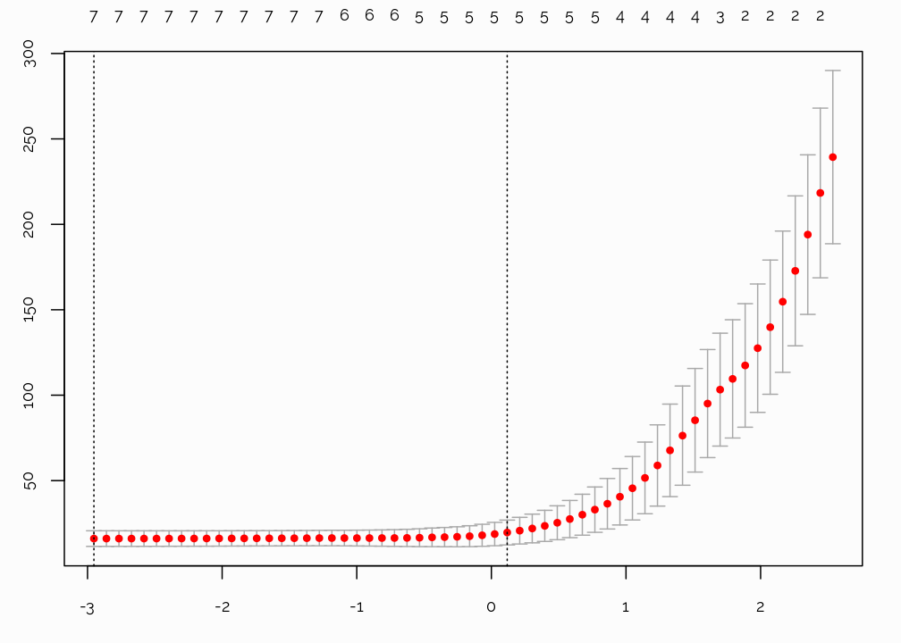

```r
#-----------------------------------------------------------------------------------------#
# NEEDED PACKAGES
#-----------------------------------------------------------------------------------------#
# library("packrat")
library("Hmisc")
library("rms")
library("ggplot2")
library("tidyr")
library("stringr")
library("pander")
library("extrafont")
library("plotly")
library("viridis")
library("readr")
library("knitr")
library("kableExtra")
library("tibble")
library("broom")
library("patchwork")
library("DT")
library("doParallel")


# font_import(pattern="[O/o]swald")
# font_import(pattern="PT_Sans")
# font_import(pattern="[R/r]aleway")
# loadfonts(device="win")
```

# Description of the Example Dataset
We will illustrate a number of methodologies on the dataset by Hunt^1^. Niccoli^2^ illustrated a number of statistical techniques on this dataset in a series of notebooks. As stated: "the target variable to be predicted, Y, is oil production (measured in tens of barrels of oil per day) from a marine barrier sand". Below, is a sample of the data:


```r
#-----------------------------------------------------------------------------------------#
# READ, LABEL, FORMAT DATA
#-----------------------------------------------------------------------------------------#
hunt <- read_csv("Table2_Hunt_2013_edit.csv")

#-----------------------------------------------------------------------------------------#
# MAKE SYNTACTICALLY VALID COL NAMES
#-----------------------------------------------------------------------------------------#
var.names <- tolower(colnames(hunt))
var.names <- make.names(var.names, unique = TRUE, allow_ = FALSE)
colnames(hunt) <- var.names

## Sample
options(DT.fillContainer = FALSE)
datatable(hunt,
          fillContainer = FALSE,
          style = 'bootstrap', 
          class = 'table-hover table-condensed stripe',
          extensions = 'Buttons',
          rownames = FALSE,
          filter = 'top',
          options = list(
            keys = TRUE,     
            autoWidth = TRUE,
            pageLength = 10,
            searching = FALSE, 
            dom = 'Bfrtip',
            searchHighlight = TRUE,
            buttons = c('copy', 'csv', 'excel', 'print'))) %>%
  formatStyle("production",
    background = styleColorBar(hunt$production, '#00D09E'),
    backgroundSize = '100% 80%',
    backgroundRepeat = 'no-repeat')
```

<!--html_preserve--><div id="htmlwidget-00e80e639a256976bde7" style="width:100%;height:auto;" class="datatables html-widget"></div>
<script type="application/json" data-for="htmlwidget-00e80e639a256976bde7">{"x":{"style":"bootstrap","filter":"top","filterHTML":"<tr>\n  <td data-type=\"number\" style=\"vertical-align: top;\">\n    <div class=\"form-group has-feedback\" style=\"margin-bottom: auto;\">\n      <input type=\"search\" placeholder=\"All\" class=\"form-control\" style=\"width: 100%;\"/>\n      <span class=\"glyphicon glyphicon-remove-circle form-control-feedback\"><\/span>\n    <\/div>\n    <div style=\"display: none; position: absolute; width: 200px;\">\n      <div data-min=\"0.1\" data-max=\"19.1\" data-scale=\"1\"><\/div>\n      <span style=\"float: left;\"><\/span>\n      <span style=\"float: right;\"><\/span>\n    <\/div>\n  <\/td>\n  <td data-type=\"number\" style=\"vertical-align: top;\">\n    <div class=\"form-group has-feedback\" style=\"margin-bottom: auto;\">\n      <input type=\"search\" placeholder=\"All\" class=\"form-control\" style=\"width: 100%;\"/>\n      <span class=\"glyphicon glyphicon-remove-circle form-control-feedback\"><\/span>\n    <\/div>\n    <div style=\"display: none; position: absolute; width: 200px;\">\n      <div data-min=\"0.5\" data-max=\"160\" data-scale=\"1\"><\/div>\n      <span style=\"float: left;\"><\/span>\n      <span style=\"float: right;\"><\/span>\n    <\/div>\n  <\/td>\n  <td data-type=\"number\" style=\"vertical-align: top;\">\n    <div class=\"form-group has-feedback\" style=\"margin-bottom: auto;\">\n      <input type=\"search\" placeholder=\"All\" class=\"form-control\" style=\"width: 100%;\"/>\n      <span class=\"glyphicon glyphicon-remove-circle form-control-feedback\"><\/span>\n    <\/div>\n    <div style=\"display: none; position: absolute; width: 200px;\">\n      <div data-min=\"1\" data-max=\"2.9\" data-scale=\"1\"><\/div>\n      <span style=\"float: left;\"><\/span>\n      <span style=\"float: right;\"><\/span>\n    <\/div>\n  <\/td>\n  <td data-type=\"integer\" style=\"vertical-align: top;\">\n    <div class=\"form-group has-feedback\" style=\"margin-bottom: auto;\">\n      <input type=\"search\" placeholder=\"All\" class=\"form-control\" style=\"width: 100%;\"/>\n      <span class=\"glyphicon glyphicon-remove-circle form-control-feedback\"><\/span>\n    <\/div>\n    <div style=\"display: none; position: absolute; width: 200px;\">\n      <div data-min=\"10\" data-max=\"20\"><\/div>\n      <span style=\"float: left;\"><\/span>\n      <span style=\"float: right;\"><\/span>\n    <\/div>\n  <\/td>\n  <td data-type=\"integer\" style=\"vertical-align: top;\">\n    <div class=\"form-group has-feedback\" style=\"margin-bottom: auto;\">\n      <input type=\"search\" placeholder=\"All\" class=\"form-control\" style=\"width: 100%;\"/>\n      <span class=\"glyphicon glyphicon-remove-circle form-control-feedback\"><\/span>\n    <\/div>\n    <div style=\"display: none; position: absolute; width: 200px;\">\n      <div data-min=\"1\" data-max=\"21\"><\/div>\n      <span style=\"float: left;\"><\/span>\n      <span style=\"float: right;\"><\/span>\n    <\/div>\n  <\/td>\n  <td data-type=\"integer\" style=\"vertical-align: top;\">\n    <div class=\"form-group has-feedback\" style=\"margin-bottom: auto;\">\n      <input type=\"search\" placeholder=\"All\" class=\"form-control\" style=\"width: 100%;\"/>\n      <span class=\"glyphicon glyphicon-remove-circle form-control-feedback\"><\/span>\n    <\/div>\n    <div style=\"display: none; position: absolute; width: 200px;\">\n      <div data-min=\"210\" data-max=\"395\"><\/div>\n      <span style=\"float: left;\"><\/span>\n      <span style=\"float: right;\"><\/span>\n    <\/div>\n  <\/td>\n  <td data-type=\"number\" style=\"vertical-align: top;\">\n    <div class=\"form-group has-feedback\" style=\"margin-bottom: auto;\">\n      <input type=\"search\" placeholder=\"All\" class=\"form-control\" style=\"width: 100%;\"/>\n      <span class=\"glyphicon glyphicon-remove-circle form-control-feedback\"><\/span>\n    <\/div>\n    <div style=\"display: none; position: absolute; width: 200px;\">\n      <div data-min=\"3.54\" data-max=\"29.25\" data-scale=\"2\"><\/div>\n      <span style=\"float: left;\"><\/span>\n      <span style=\"float: right;\"><\/span>\n    <\/div>\n  <\/td>\n  <td data-type=\"number\" style=\"vertical-align: top;\">\n    <div class=\"form-group has-feedback\" style=\"margin-bottom: auto;\">\n      <input type=\"search\" placeholder=\"All\" class=\"form-control\" style=\"width: 100%;\"/>\n      <span class=\"glyphicon glyphicon-remove-circle form-control-feedback\"><\/span>\n    <\/div>\n    <div style=\"display: none; position: absolute; width: 200px;\">\n      <div data-min=\"7.71\" data-max=\"59.2\" data-scale=\"2\"><\/div>\n      <span style=\"float: left;\"><\/span>\n      <span style=\"float: right;\"><\/span>\n    <\/div>\n  <\/td>\n<\/tr>","extensions":["Buttons"],"fillContainer":false,"data":[[0.1,1,1.9,3.1,4.1,4.9,5.9,7,8.1,8.9,10,11.1,11.9,13,14.1,15.1,15.9,16,17.1,18,19.1],[0.5,4,19,21.7,24.6,39.2,23.6,63,72.9,35.6,100,77.7,71.4,117,141,105.7,79.5,160,85.5,90,114.6],[2.1,1.1,1,2.1,2.9,1.1,2.1,2,2.9,2.8,2.2,2,2.9,1.1,1.2,1,1.1,1.2,1.9,2.8,2.1],[19,16,14,17,11,12,13,13,14,16,16,14,20,16,14,17,20,17,14,18,10],[5,13,12,6,10,7,13,20,1,1,21,1,11,9,10,3,10,15,6,19,21],[379,269,245,273,237,278,241,269,248,210,334,340,224,338,367,363,395,295,266,210,366],[3.54,5.79,8.51,11.52,10.16,11.14,15.04,15.1,14.49,16.9,16.61,17.81,19.74,17.7,19.16,21.97,22.15,24.24,23.58,23.77,29.25],[15.1,21.3,22.75,15.72,7.71,22.67,18.11,24.3,24.04,25.11,36.8,36.42,39.59,51.6,48.05,51.72,59.2,58.3,41.8,44.2,37.51]],"container":"<table class=\"table table-striped table-hover table-condensed\">\n  <thead>\n    <tr>\n      <th>gross.pay<\/th>\n      <th>phi.h<\/th>\n      <th>position<\/th>\n      <th>pressure<\/th>\n      <th>random.1<\/th>\n      <th>random.2<\/th>\n      <th>gross.pay.transform<\/th>\n      <th>production<\/th>\n    <\/tr>\n  <\/thead>\n<\/table>","options":{"keys":true,"autoWidth":true,"pageLength":10,"searching":false,"dom":"Bfrtip","searchHighlight":true,"buttons":["copy","csv","excel","print"],"columnDefs":[{"className":"dt-right","targets":[0,1,2,3,4,5,6,7]}],"order":[],"orderClasses":false,"orderCellsTop":true,"rowCallback":"function(row, data) {\nvar value=data[7]; $(this.api().cell(row, 7).node()).css({'background':isNaN(parseFloat(value)) || value <= 7.71 ? '' : 'linear-gradient(90deg, transparent ' + (59.2 - value)/51.49 * 100 + '%, #00D09E ' + (59.2 - value)/51.49 * 100 + '%)','background-size':'100% 80%','background-repeat':'no-repeat'});\n}"}},"evals":["options.rowCallback"],"jsHooks":[]}</script><!--/html_preserve-->

```r
#-----------------------------------------------------------------------------------------#
## ADD CATEGORICAL POSITION
#-----------------------------------------------------------------------------------------#
hunt %>%
  mutate(position.cat = cut2(position, c(1, 2, 3))) %>%
  as.tibble() -> hunt
```

^1^ *Hunt, L. (2013), [Many correlation coefficients, null hypotheses, and high value](https://csegrecorder.com/columns/view/value-of-integrated-geophysics-201312). CSEG Recorder, 38 (10)*  
^2^ *Niccoli, M (2017), [Machine learning in geoscience with scikit-learn - notebook 2](https://github.com/mycarta/predict/blob/master/Geoscience_ML_notebook_2.ipynb)*


```r
## Data
d <- hunt %>% describe()
html(d, size=100, scroll=FALSE)
plot(d)
```

<br><br>

# Is There A Difference in Production?
Suppose we are interested in assessing whether `production` changes according to `position`. The conventional approach is to perform [ANOVA](https://en.wikipedia.org/wiki/Analysis_of_variance) or t-test. However, both relies on normality and are sensitive to outliers. When comparing 2 samples, we can utilize the Wilcoxon test, while fore more than samples, the Kruskal-Wallis test is a generalization of the Wilcoxon test.

First, let's assess the distribution graphically. From the boxplot below, it is not apparent whether there is a difference in production between `positions`:


```r
g1 <- ggplot(hunt, aes(x = position.cat, y = production)) +
  geom_boxplot(fill = "grey60", alpha = 0.6, color = "grey60") +
  scale_x_discrete() + 
  xlab("Position") +
  ylab("Production") +
  theme_minimal(base_family = "Raleway", base_size = 10) +
  theme(panel.background = element_rect(fill = "#FCFCFC", colour = NA),
        plot.background = element_rect(fill = "#FCFCFC", colour = NA))
  
## Add lines
dat <- ggplot_build(g1)$data[[1]]
g1 + geom_segment(data=dat, aes(x=xmin, xend=xmax, y=middle, yend=middle), color = "coral2", size=1) 
```


<br>

Next, we perform the **Wilcoxon** test:


```r
# kw <- tidy(anova(ols(rank(production) ~ position.cat , data = hunt))) %>%
#   rename(` ` = `.rownames`)

# kable(kw, "html", align = "l", digits = 3) %>% 
#   kable_styling(bootstrap_options = c("striped", "hover", "condensed"), full_width = F, position = "left") %>%
#     row_spec(1:1, bold = T)

w1 <- tidy(wilcox.test(production~position.cat, data = hunt, conf.int=TRUE, distribution='exact', conf.level = .90))

kable(w1, "html", align = "l", digits = 3) %>% 
  kable_styling(bootstrap_options = c("striped", "hover", "condensed"), full_width = F, position = "left") %>%
    row_spec(1:1, bold = T)
```

<table class="table table-striped table-hover table-condensed" style="width: auto !important; ">
 <thead>
  <tr>
   <th style="text-align:left;"> estimate </th>
   <th style="text-align:left;"> statistic </th>
   <th style="text-align:left;"> p.value </th>
   <th style="text-align:left;"> conf.low </th>
   <th style="text-align:left;"> conf.high </th>
   <th style="text-align:left;"> method </th>
   <th style="text-align:left;"> alternative </th>
  </tr>
 </thead>
<tbody>
  <tr>
   <td style="text-align:left;font-weight: bold;"> 14.98 </td>
   <td style="text-align:left;font-weight: bold;"> 83 </td>
   <td style="text-align:left;font-weight: bold;"> 0.041 </td>
   <td style="text-align:left;font-weight: bold;"> 4.64 </td>
   <td style="text-align:left;font-weight: bold;"> 27.3 </td>
   <td style="text-align:left;font-weight: bold;"> Wilcoxon rank sum test </td>
   <td style="text-align:left;font-weight: bold;"> two.sided </td>
  </tr>
</tbody>
</table>

A P-value of 0.041, tells us that the probability of observing a difference in distribution equal to or more extreme than the one observed is 4.1%. In other words, **it's somewhat unlikely but not impossible that the difference in production is due to chance variation**.

<br>

# Distance Correlation
Measures of correlation quantify the strength of the relationship between pairs of variables. The traditional Pearson correlation has several limitations, one of which is that it assumes a linear relationship. The Spearman correlation is generally preferred and avoids some of these limitations. A relatively new and powerful measure of correlation is the **[distance correlation](https://en.wikipedia.org/wiki/Distance_correlation)**. 


```r
#-----------------------------------------------------------------------------------------#
# DISTANCE CORRELATION
#-----------------------------------------------------------------------------------------#
##Corr matrix
correlations <- sapply(1:8, function(r) {
  sapply(1:8, function(c) {
    energy::dcor(hunt[,r], hunt[,c])
    })
})
colnames(correlations) <- rownames(correlations) <- colnames(hunt)[1:8]

## P-values (2000 bootstrap resamples)
cor.mtest <- function(mat, ...) {
    mat <- as.matrix(mat)
    n <- ncol(mat)
    p.mat<- matrix(NA, n, n)
    diag(p.mat) <- 0
    for (i in 1:(n - 1)) {
        for (j in (i + 1):n) {
            tmp <- energy::dcov.test(mat[, i], mat[, j], index = 1.0, R=2000)
            p.mat[i, j] <- p.mat[j, i] <- tmp$p.value
        }
    }
  colnames(p.mat) <- rownames(p.mat) <- colnames(mat)
  p.mat
}
p.mat <- cor.mtest(correlations)


## Plot corrmatrix
library(corrplot)
par(family = 'Raleway',
    pin = c(3,6), 
    ps = 9,
    mar = c(0.1, 0.1, 0.1, 0.1))

col <- colorRampPalette(c("#BB4444", "#EE9988", "#FFFFFF", "#77AADD", "#4477AA"))
corrplot(correlations,
         method = "color",
         col = col(200),
         type = "upper",
         order = "hclust",
         addCoef.col = "black",
         tl.col = "black",
         tl.srt = 45,
         p.mat = p.mat,
         sig.level = 0.10,
         insig = "blank",
         diag = FALSE,
         bg = "grey90",
         outline = TRUE,
         addgrid.col = "white",
         cl.lim = c(0, 1),
         tl.cex = 1.0,
         cl.cex = 0.8,
         cl.pos = "n")
```


Above is the distance correlation matrix. Colored boxes represent statistically significant correlations at the 10% significance level. The correlation measure is able to detect that `gross.pay` is highly correlated to `gross.pay.transform` (they are algebraically related). Also, `gross.pay` is highly correlated with `production`. Notice that, unlike other correlation measures, distance correlation doe not compute direction (positive or negative correlation).

<br>

### A Note on the Choice of Correlation
Among measures of correlations capable of detecting non-linear association, MIC (maximal information criterion, Reshef et al.) has been touted as a powerful measures. However, several authors Kinney^2^, Simon^3^ point to a number of problems with MIC and suggest to utilize distance correlation instead: 

> "We believe that the recently proposed distance correlation measure of Székely & Rizzo (2009) is a more powerful technique that is simple, easy to compute and should be considered for general use".

^1^ Rashef et al. (2011), [Detecting novel associations in large data sets](https://www.ncbi.nlm.nih.gov/pubmed/22174245)  
^2^ Kinney et al. (2013), [Equitability, mutual information, and the maximal information coefficient](http://www.pnas.org/content/111/9/3354)  
^3^ Simon et al. (2014), [Comment on "Detecting Novel Associations In Large Data Sets](https://arxiv.org/abs/1401.7645)

<br><br>

# Smoothers
Correlation matrices are useful to visualize combinations of pairwise correlations. There is, however, more information to be had by plotting the data and adding a trend line. One of the most flexible is Cleveland's [LOESS](https://en.wikipedia.org/wiki/Local_regression) (locally weighted scatterplot smoothing). Let's plot the LOESS curves for each variable against production, separate for each `position`.


```r
g1 <- ggplot(hunt, aes(y = production, x = gross.pay, colour = factor(position.cat))) +
  stat_plsmo(fullrange = TRUE) + 
  geom_point() +
  xlab("Gross Pay") +
  ylab("Production") +
  theme_minimal(base_family = "Raleway", base_size = 11) +
  scale_color_discrete(guide = guide_legend(title = "Position")) +
  theme(legend.position="none") +
  theme(panel.background = element_rect(fill = "#FCFCFC", colour = NA),
        plot.background = element_rect(fill = "#FCFCFC", colour = NA))

g2 <- ggplot(hunt, aes(y = production, x = phi.h, colour = factor(position.cat))) +
  stat_plsmo(fullrange = TRUE) + 
  geom_point() +
  xlab("Phi-h") +
  ylab("Production") +
  theme_minimal(base_family = "Raleway", base_size = 11) +
  scale_color_discrete(guide = guide_legend(title = "Position")) +
  theme(legend.position="none") +
  theme(panel.background = element_rect(fill = "#FCFCFC", colour = NA),
        plot.background = element_rect(fill = "#FCFCFC", colour = NA))


g3 <- ggplot(hunt, aes(y = production, x = pressure, colour = factor(position.cat))) +
  stat_plsmo(fullrange = TRUE) + 
  geom_point() +
  xlab("Pressure") +
  ylab("Production") +
  theme_minimal(base_family = "Raleway", base_size = 11) +
  scale_color_discrete(guide = guide_legend(title = "Position")) +
  theme(legend.position="none") +
  theme(panel.background = element_rect(fill = "#FCFCFC", colour = NA),
        plot.background = element_rect(fill = "#FCFCFC", colour = NA))

g4 <- ggplot(hunt, aes(y = production, x = random.1, colour = factor(position.cat))) +
  stat_plsmo(fullrange = TRUE) + 
  geom_point() +
  xlab("Random Var") +
  ylab("Production") +
  theme_minimal(base_family = "Raleway", base_size = 11) +
  scale_color_discrete(guide = guide_legend(title = "Position")) +
  theme(legend.position="none") +
  theme(panel.background = element_rect(fill = "#FCFCFC", colour = NA),
        plot.background = element_rect(fill = "#FCFCFC", colour = NA))

g5 <- ggplot(hunt, aes(y = production, x = gross.pay.transform, colour = factor(position.cat))) +
  stat_plsmo(fullrange = TRUE) + 
  geom_point() +
  xlab("Gross Pay (transformed)") +
  ylab("Production") +
  theme_minimal(base_family = "Raleway", base_size = 11) +
  scale_color_discrete(guide = guide_legend(title = "Position")) +
  theme(legend.position="none") +
  theme(panel.background = element_rect(fill = "#FCFCFC", colour = NA),
        plot.background = element_rect(fill = "#FCFCFC", colour = NA))


g1+g2+g3+g4+g5
```


*Scatterplots of production against each variable by position (red: blue:). A LOESS curve was added to highlight the overall trend.*

<br><br>

# Variable Selection
Which variables should we focus on in understanding what drives changes in production? Which variables are measuring the same or similar underlying quantities?

A statistically principled approach is to start by eliminating variables based on domain knowledge. This may be assisted by statistical data reduction methods such as clustering and redundancy analysis. 

<br>

## Clustering
Here we assess clusters of independent variables. We do so blinded to the response variable, `production`, in order to avoid creating bias. In cluster analysis, the objective is to identify vairables that are measuring the same underlying phenomenon. If they exists and supported by domain knowledge, one could argue for removing one of them.

 

```r
vc <- varclus (~ gross.pay + phi.h + position.cat + pressure + random.1 + random.2 + gross.pay.transform,
              sim = 'hoeffding', 
              data = hunt)

par(family = 'Raleway',
    ps = 9,
    par(bg = '#FCFCFC'),
    mar = c(0.2, 4, 1.5, 1.5))
plot(vc)
```


*Hierarchical cluster dendogram of all variables except production. The similarity matrix is based on the Hoeffding D statistics which will detect non-monotonic associations.*


There are numerous methods to perform hierarchical clustering. It's good practice to try different methods to see if the results are in the same ballpark. Let's do that with Hierarchical Clustering with P-Values via Multiscale Bootstrap^1^:


```r
## pvclust
library(pvclust)
hunt2 <- select(hunt, -production, -position.cat)
cluster.bootstrap <- pvclust(hunt2, 
                             nboot = 5000, 
                             method.dist = "abscor",
                             parallel = TRUE,
                             iseed = 123)
```

```
## Creating a temporary cluster...done:
## socket cluster with 7 nodes on host 'localhost'
## Multiscale bootstrap... Done.
```

```r
par(family = 'Raleway',
    par(bg = '#FCFCFC'),
    ps = 9)
plot(cluster.bootstrap)
pvrect(cluster.bootstrap)
```


From either cluster dendograms we can see how `gross.pay` and `gross.pay.transform` cluster together and, to a lesser extent, `phi.h`. Based on examination of these results, the natural choice is to remove either `gross.pay` or `gross.pay.transform` from further analyses. Suppose we don't know `gross.pay.transform` is algebraically related to `gross.pay`: which of the two should we exclude? Redundancy analysis, helps us determine that.

^1^Suzuki et al. (2006), [Pvclust: an R package for assessing the uncertainty in hierarchical clustering](https://www.ncbi.nlm.nih.gov/pubmed/16595560)

<br>

## Redundancy Analysis


```r
redun <- redun(~ gross.pay + phi.h + I(position.cat) + pressure + random.1 + random.2 + gross.pay.transform,
                r2 = 0.75,
                type = 'adjusted',
                tlinear = FALSE,
                iterms = TRUE,
                pc = TRUE,
                data = hunt)
```

In redundancy analysis we look at which variable can be predicted with high confidence from any combination of the other variables. Those variables can then be safely omitted from further analysis. This approach is more robust than the pairwise correlation measures from before. We've set the adjusted R^2^ value at 0.75.

We started with:


```r
redun$In
```

```
##  [1] "gross.pay'"          "phi.h'"              "I(position.cat)"    
##  [4] "pressure"            "pressure'"           "random.1"           
##  [7] "random.1'"           "random.2"            "random.2'"          
## [10] "gross.pay.transform"
```

The model suggests that:


```r
redun$rsquared
```

```
##            gross.pay gross.pay.transform'                phi.h 
##            0.9731901            0.8916161            0.7507618
```

can be removed because they are predicted from all the remaining variables. The numbers represent the R^2^ with which a variable ican be predicted from all other remaining ones. However, we need to be very cautious, since the sample size is much too low to reliably suggest which variables can be omitted.


<br>

## LASSO
The previous methods achieved variable reduction without consideration of the response variable, `production`. This is a sound approach, however, we may wish to do variable selection within a regression model. [LASSO](https://en.wikipedia.org/wiki/Lasso_(statistics)) (least absolute shrinkage and selection operator) achieves that by shrinking the model coefficients. The primary purpose of shrinkage methods is that of improving predictive accuracy. However, if coefficients are shrinked to zero, the LASSO effectively achieves variable selection. 

Fitting a LASSO model to the data, yield the following shrinked coefficients. 


```r
library(glmnet)
library(plotmo)

position.cat <- model.matrix(hunt$production ~ hunt$position.cat)[, -1]
x <- as.matrix(data.frame(hunt$gross.pay, hunt$phi.h, hunt$pressure, hunt$random.1, hunt$random.2, hunt$gross.pay.transform, position.cat))

## LASSO
registerDoParallel(cores=8)
lasso <- glmnet(x, 
                y = hunt$production,
                alpha = 1,
                family="gaussian",
                standardize = TRUE)

set.seed(123)
cv.lasso <- cv.glmnet(x, 
                      y = hunt$production, 
                      standardize = TRUE,
                      type.measure = "mse",
                      nfolds = 21,
                      parallel = TRUE,
                      alpha = 1)

lambda_min <- cv.lasso$lambda.min
lambda_1se <- cv.lasso$lambda.1se


## Make table of coeff
coef <- as.data.frame(as.matrix(coef(cv.lasso, s = lambda_1se))) %>% 
  rename(`Shrinked Coefficient` = !!names(.[1])) %>%
  rownames_to_column(var = "Variable") %>%
  mutate(`Shrinked Coefficient` = ifelse(`Shrinked Coefficient` == 0, NA, `Shrinked Coefficient`)) %>%
  mutate(Variable = gsub("hunt.", "", Variable))
  
kable(coef, "html", align = "l", digits = 3) %>%
  kable_styling(bootstrap_options = c("striped", "hover", "condensed"), full_width = F, position = "left")
```

<table class="table table-striped table-hover table-condensed" style="width: auto !important; ">
 <thead>
  <tr>
   <th style="text-align:left;"> Variable </th>
   <th style="text-align:left;"> Shrinked Coefficient </th>
  </tr>
 </thead>
<tbody>
  <tr>
   <td style="text-align:left;"> (Intercept) </td>
   <td style="text-align:left;"> -4.278 </td>
  </tr>
  <tr>
   <td style="text-align:left;"> gross.pay </td>
   <td style="text-align:left;"> 1.032 </td>
  </tr>
  <tr>
   <td style="text-align:left;"> phi.h </td>
   <td style="text-align:left;"> 0.116 </td>
  </tr>
  <tr>
   <td style="text-align:left;"> pressure </td>
   <td style="text-align:left;"> 1.332 </td>
  </tr>
  <tr>
   <td style="text-align:left;"> random.1 </td>
   <td style="text-align:left;"> NA </td>
  </tr>
  <tr>
   <td style="text-align:left;"> random.2 </td>
   <td style="text-align:left;"> 0.010 </td>
  </tr>
  <tr>
   <td style="text-align:left;"> gross.pay.transform </td>
   <td style="text-align:left;"> NA </td>
  </tr>
  <tr>
   <td style="text-align:left;"> position.cat </td>
   <td style="text-align:left;"> -6.544 </td>
  </tr>
</tbody>
</table>


Looking at the table of coefficients, notice how `hunt.random.1` and `gross.pay.transform` have no coefficient. That's because they have been shrunked to zero, thus achieving variable selection. Our model suggests that these two variable are not useful in explaining changes in `production`. The coefficient for `hunt.random.2` is also nearly zero, so we could remove it as well. 

To gain more insight, it helps to visualize how fast coefficients are shrunked to zero (thus, excluded from the mdoel) as we increase the amount of shirinkage, $\lambda$.


```r
## Prepare data for ggplot
## Could have used (not pretty)
# par(family = 'Raleway',
#     ps = 9,
#     par(bg = '#FCFCFC'),
#     mfrow = c(1, 1),
#     mar = c(3, 2.5, 1.5, 1.5))
# 
# plot_glmnet(lasso, 
#             s = cv.lasso$lambda.min,
#             xlab = "Log Lambda")

beta <- coef(lasso)

lasso.data <- as.data.frame(as.matrix(beta)) %>%
  tibble::rownames_to_column(var = "coef") %>%
  reshape::melt(id = "coef") %>%
  mutate(variable = as.numeric(gsub("s", "", variable))) %>%
  mutate(lambda = lasso$lambda[variable + 1]) %>%
  mutate(loglambda = log(lambda)) %>%
  mutate(norm = apply(abs(beta[-1,]), 2, sum)[variable+1]) %>%
  mutate(coef = gsub("hunt.", "", coef))

plotly::ggplotly(ggplot(lasso.data[lasso.data$coef != "(Intercept)",], aes(loglambda, value, color = coef, linetype = coef)) + 
  geom_line(size = 0.5) + 
  xlab("Lambda (log scale)") +
  ylab("Value of Coefficient") +
  scale_x_reverse() +
  guides(color = guide_legend(title = ""), 
         linetype = guide_legend(title = "")) +
  scale_color_viridis_d() +
  geom_vline(xintercept = cv.lasso$lambda.min, color = "coral2", size = 0.5) +
  theme_minimal(base_family = "Raleway", base_size = 12) +
  theme(legend.key.width = unit(3, "lines")) +
  theme(panel.background = element_rect(fill = "#FCFCFC", colour = NA),
        plot.background = element_rect(fill = "#FCFCFC", colour = NA)) +
  annotate("text",
           x = cv.lasso$lambda.min+0.25, 
           y = -8, 
           label = round(cv.lasso$lambda.min, 3), 
           angle = 90,
           parse = TRUE))
```

<!--html_preserve--><div id="7e2a7de4e4b8" style="width:849.6px;height:612px;" class="plotly html-widget"></div>
<script type="application/json" data-for="7e2a7de4e4b8">{"x":{"data":[{"x":[-2.53642960571869,-2.44339586467426,-2.35036212362984,-2.25732838258541,-2.16429464154098,-2.07126090049655,-1.97822715945212,-1.8851934184077,-1.79215967736327,-1.69912593631884,-1.60609219527441,-1.51305845422998,-1.42002471318556,-1.32699097214113,-1.2339572310967,-1.14092349005227,-1.04788974900784,-0.954856007963415,-0.861822266918986,-0.768788525874558,-0.67575478483013,-0.582721043785702,-0.489687302741274,-0.396653561696846,-0.303619820652418,-0.21058607960799,-0.117552338563562,-0.0245185975191333,0.0685151435252947,0.161548884569723,0.254582625614151,0.347616366658579,0.440650107703007,0.533683848747435,0.626717589791863,0.719751330836292,0.81278507188072,0.905818812925148,0.998852553969576,1.091886295014,1.18492003605843,1.27795377710286,1.37098751814729,1.46402125919172,1.55705500023614,1.65008874128057,1.743122482325,1.83615622336943,1.92918996441386,2.02222370545829,2.11525744650271,2.20829118754714,2.30132492859157,2.394358669636,2.48739241068043,2.58042615172485,2.67345989276928,2.76649363381371,2.85952737485814,2.95256111590257,3.04559485694699,3.13862859799142],"y":[0,0.0515382194931082,0.14635853300467,0.232808687495726,0.311999714020431,0.383742395615073,0.449104793031232,0.508660461261586,0.563324332315156,0.614336049627672,0.667954047291562,0.707299282850365,0.74313123960422,0.77577869144946,0.805934801269013,0.833042304112112,0.857706008380114,0.880602156522728,0.901092167486924,0.918419058048392,0.939894990459511,0.958771097169545,0.976205999451771,0.992148739862053,1.00668932248918,1.01954161169502,1.03153067954138,1.04253697835727,1.05259260307832,1.06176384002797,1.07012327021609,1.07774104043456,1.08468238809377,1.0910071906997,1.09677014991217,1.09291724305934,1.05846506560513,1.02738898353996,0.99924386708373,0.972982445222208,0.949577046689982,0.931363073021034,0.915485421320067,0.9007337695742,0.887177546256237,0.87479418730059,0.863525532281304,0.853302153494125,0.84405426621547,0.835716764778003,0.827484645933615,0.821013355893531,0.814466118171179,0.808776959818374,0.803100873753567,0.798293047037831,0.793502399040933,0.78954080665698,0.785574486157826,0.782390575973239,0.779249197810588,0.776839394636687],"text":["~loglambda:  2.53642961<br />~value:  0.000000e+00<br />~coef: gross.pay<br />~coef: gross.pay","~loglambda:  2.44339586<br />~value:  5.153822e-02<br />~coef: gross.pay<br />~coef: gross.pay","~loglambda:  2.35036212<br />~value:  1.463585e-01<br />~coef: gross.pay<br />~coef: gross.pay","~loglambda:  2.25732838<br />~value:  2.328087e-01<br />~coef: gross.pay<br />~coef: gross.pay","~loglambda:  2.16429464<br />~value:  3.119997e-01<br />~coef: gross.pay<br />~coef: gross.pay","~loglambda:  2.07126090<br />~value:  3.837424e-01<br />~coef: gross.pay<br />~coef: gross.pay","~loglambda:  1.97822716<br />~value:  4.491048e-01<br />~coef: gross.pay<br />~coef: gross.pay","~loglambda:  1.88519342<br />~value:  5.086605e-01<br />~coef: gross.pay<br />~coef: gross.pay","~loglambda:  1.79215968<br />~value:  5.633243e-01<br />~coef: gross.pay<br />~coef: gross.pay","~loglambda:  1.69912594<br />~value:  6.143360e-01<br />~coef: gross.pay<br />~coef: gross.pay","~loglambda:  1.60609220<br />~value:  6.679540e-01<br />~coef: gross.pay<br />~coef: gross.pay","~loglambda:  1.51305845<br />~value:  7.072993e-01<br />~coef: gross.pay<br />~coef: gross.pay","~loglambda:  1.42002471<br />~value:  7.431312e-01<br />~coef: gross.pay<br />~coef: gross.pay","~loglambda:  1.32699097<br />~value:  7.757787e-01<br />~coef: gross.pay<br />~coef: gross.pay","~loglambda:  1.23395723<br />~value:  8.059348e-01<br />~coef: gross.pay<br />~coef: gross.pay","~loglambda:  1.14092349<br />~value:  8.330423e-01<br />~coef: gross.pay<br />~coef: gross.pay","~loglambda:  1.04788975<br />~value:  8.577060e-01<br />~coef: gross.pay<br />~coef: gross.pay","~loglambda:  0.95485601<br />~value:  8.806022e-01<br />~coef: gross.pay<br />~coef: gross.pay","~loglambda:  0.86182227<br />~value:  9.010922e-01<br />~coef: gross.pay<br />~coef: gross.pay","~loglambda:  0.76878853<br />~value:  9.184191e-01<br />~coef: gross.pay<br />~coef: gross.pay","~loglambda:  0.67575478<br />~value:  9.398950e-01<br />~coef: gross.pay<br />~coef: gross.pay","~loglambda:  0.58272104<br />~value:  9.587711e-01<br />~coef: gross.pay<br />~coef: gross.pay","~loglambda:  0.48968730<br />~value:  9.762060e-01<br />~coef: gross.pay<br />~coef: gross.pay","~loglambda:  0.39665356<br />~value:  9.921487e-01<br />~coef: gross.pay<br />~coef: gross.pay","~loglambda:  0.30361982<br />~value:  1.006689e+00<br />~coef: gross.pay<br />~coef: gross.pay","~loglambda:  0.21058608<br />~value:  1.019542e+00<br />~coef: gross.pay<br />~coef: gross.pay","~loglambda:  0.11755234<br />~value:  1.031531e+00<br />~coef: gross.pay<br />~coef: gross.pay","~loglambda:  0.02451860<br />~value:  1.042537e+00<br />~coef: gross.pay<br />~coef: gross.pay","~loglambda: -0.06851514<br />~value:  1.052593e+00<br />~coef: gross.pay<br />~coef: gross.pay","~loglambda: -0.16154888<br />~value:  1.061764e+00<br />~coef: gross.pay<br />~coef: gross.pay","~loglambda: -0.25458263<br />~value:  1.070123e+00<br />~coef: gross.pay<br />~coef: gross.pay","~loglambda: -0.34761637<br />~value:  1.077741e+00<br />~coef: gross.pay<br />~coef: gross.pay","~loglambda: -0.44065011<br />~value:  1.084682e+00<br />~coef: gross.pay<br />~coef: gross.pay","~loglambda: -0.53368385<br />~value:  1.091007e+00<br />~coef: gross.pay<br />~coef: gross.pay","~loglambda: -0.62671759<br />~value:  1.096770e+00<br />~coef: gross.pay<br />~coef: gross.pay","~loglambda: -0.71975133<br />~value:  1.092917e+00<br />~coef: gross.pay<br />~coef: gross.pay","~loglambda: -0.81278507<br />~value:  1.058465e+00<br />~coef: gross.pay<br />~coef: gross.pay","~loglambda: -0.90581881<br />~value:  1.027389e+00<br />~coef: gross.pay<br />~coef: gross.pay","~loglambda: -0.99885255<br />~value:  9.992439e-01<br />~coef: gross.pay<br />~coef: gross.pay","~loglambda: -1.09188630<br />~value:  9.729824e-01<br />~coef: gross.pay<br />~coef: gross.pay","~loglambda: -1.18492004<br />~value:  9.495770e-01<br />~coef: gross.pay<br />~coef: gross.pay","~loglambda: -1.27795378<br />~value:  9.313631e-01<br />~coef: gross.pay<br />~coef: gross.pay","~loglambda: -1.37098752<br />~value:  9.154854e-01<br />~coef: gross.pay<br />~coef: gross.pay","~loglambda: -1.46402126<br />~value:  9.007338e-01<br />~coef: gross.pay<br />~coef: gross.pay","~loglambda: -1.55705500<br />~value:  8.871775e-01<br />~coef: gross.pay<br />~coef: gross.pay","~loglambda: -1.65008874<br />~value:  8.747942e-01<br />~coef: gross.pay<br />~coef: gross.pay","~loglambda: -1.74312248<br />~value:  8.635255e-01<br />~coef: gross.pay<br />~coef: gross.pay","~loglambda: -1.83615622<br />~value:  8.533022e-01<br />~coef: gross.pay<br />~coef: gross.pay","~loglambda: -1.92918996<br />~value:  8.440543e-01<br />~coef: gross.pay<br />~coef: gross.pay","~loglambda: -2.02222371<br />~value:  8.357168e-01<br />~coef: gross.pay<br />~coef: gross.pay","~loglambda: -2.11525745<br />~value:  8.274846e-01<br />~coef: gross.pay<br />~coef: gross.pay","~loglambda: -2.20829119<br />~value:  8.210134e-01<br />~coef: gross.pay<br />~coef: gross.pay","~loglambda: -2.30132493<br />~value:  8.144661e-01<br />~coef: gross.pay<br />~coef: gross.pay","~loglambda: -2.39435867<br />~value:  8.087770e-01<br />~coef: gross.pay<br />~coef: gross.pay","~loglambda: -2.48739241<br />~value:  8.031009e-01<br />~coef: gross.pay<br />~coef: gross.pay","~loglambda: -2.58042615<br />~value:  7.982930e-01<br />~coef: gross.pay<br />~coef: gross.pay","~loglambda: -2.67345989<br />~value:  7.935024e-01<br />~coef: gross.pay<br />~coef: gross.pay","~loglambda: -2.76649363<br />~value:  7.895408e-01<br />~coef: gross.pay<br />~coef: gross.pay","~loglambda: -2.85952737<br />~value:  7.855745e-01<br />~coef: gross.pay<br />~coef: gross.pay","~loglambda: -2.95256112<br />~value:  7.823906e-01<br />~coef: gross.pay<br />~coef: gross.pay","~loglambda: -3.04559486<br />~value:  7.792492e-01<br />~coef: gross.pay<br />~coef: gross.pay","~loglambda: -3.13862860<br />~value:  7.768394e-01<br />~coef: gross.pay<br />~coef: gross.pay"],"type":"scatter","mode":"lines","line":{"width":1.88976377952756,"color":"rgba(68,1,84,1)","dash":"solid"},"hoveron":"points","name":"gross.pay","legendgroup":"gross.pay","showlegend":true,"xaxis":"x","yaxis":"y","hoverinfo":"text","frame":null},{"x":[-2.53642960571869,-2.44339586467426,-2.35036212362984,-2.25732838258541,-2.16429464154098,-2.07126090049655,-1.97822715945212,-1.8851934184077,-1.79215967736327,-1.69912593631884,-1.60609219527441,-1.51305845422998,-1.42002471318556,-1.32699097214113,-1.2339572310967,-1.14092349005227,-1.04788974900784,-0.954856007963415,-0.861822266918986,-0.768788525874558,-0.67575478483013,-0.582721043785702,-0.489687302741274,-0.396653561696846,-0.303619820652418,-0.21058607960799,-0.117552338563562,-0.0245185975191333,0.0685151435252947,0.161548884569723,0.254582625614151,0.347616366658579,0.440650107703007,0.533683848747435,0.626717589791863,0.719751330836292,0.81278507188072,0.905818812925148,0.998852553969576,1.091886295014,1.18492003605843,1.27795377710286,1.37098751814729,1.46402125919172,1.55705500023614,1.65008874128057,1.743122482325,1.83615622336943,1.92918996441386,2.02222370545829,2.11525744650271,2.20829118754714,2.30132492859157,2.394358669636,2.48739241068043,2.58042615172485,2.67345989276928,2.76649363381371,2.85952737485814,2.95256111590257,3.04559485694699,3.13862859799142],"y":[0,0,0,0,0,0,0,0,0,0,0,0,0,0,0,0,0,0,0,0,0,0,0,0,0,0,0,0,0,0,0,0,0,0,0,0.00941854513490245,0.0445782383309322,0.0763177393905154,0.105090440447268,0.131839858576487,0.155757493846448,0.174847373052165,0.191642630568775,0.207194483040347,0.221463362769128,0.234490673371229,0.246346649114854,0.257109442589748,0.266855829237919,0.275656972123231,0.28423987478857,0.291134228872126,0.298012149402577,0.304019765475309,0.309940274392682,0.314996517802733,0.319980372875394,0.324146650233484,0.328275233453677,0.331636201785899,0.334935653548538,0.337514385392658],"text":["~loglambda:  2.53642961<br />~value:  0.000000e+00<br />~coef: gross.pay.transform<br />~coef: gross.pay.transform","~loglambda:  2.44339586<br />~value:  0.000000e+00<br />~coef: gross.pay.transform<br />~coef: gross.pay.transform","~loglambda:  2.35036212<br />~value:  0.000000e+00<br />~coef: gross.pay.transform<br />~coef: gross.pay.transform","~loglambda:  2.25732838<br />~value:  0.000000e+00<br />~coef: gross.pay.transform<br />~coef: gross.pay.transform","~loglambda:  2.16429464<br />~value:  0.000000e+00<br />~coef: gross.pay.transform<br />~coef: gross.pay.transform","~loglambda:  2.07126090<br />~value:  0.000000e+00<br />~coef: gross.pay.transform<br />~coef: gross.pay.transform","~loglambda:  1.97822716<br />~value:  0.000000e+00<br />~coef: gross.pay.transform<br />~coef: gross.pay.transform","~loglambda:  1.88519342<br />~value:  0.000000e+00<br />~coef: gross.pay.transform<br />~coef: gross.pay.transform","~loglambda:  1.79215968<br />~value:  0.000000e+00<br />~coef: gross.pay.transform<br />~coef: gross.pay.transform","~loglambda:  1.69912594<br />~value:  0.000000e+00<br />~coef: gross.pay.transform<br />~coef: gross.pay.transform","~loglambda:  1.60609220<br />~value:  0.000000e+00<br />~coef: gross.pay.transform<br />~coef: gross.pay.transform","~loglambda:  1.51305845<br />~value:  0.000000e+00<br />~coef: gross.pay.transform<br />~coef: gross.pay.transform","~loglambda:  1.42002471<br />~value:  0.000000e+00<br />~coef: gross.pay.transform<br />~coef: gross.pay.transform","~loglambda:  1.32699097<br />~value:  0.000000e+00<br />~coef: gross.pay.transform<br />~coef: gross.pay.transform","~loglambda:  1.23395723<br />~value:  0.000000e+00<br />~coef: gross.pay.transform<br />~coef: gross.pay.transform","~loglambda:  1.14092349<br />~value:  0.000000e+00<br />~coef: gross.pay.transform<br />~coef: gross.pay.transform","~loglambda:  1.04788975<br />~value:  0.000000e+00<br />~coef: gross.pay.transform<br />~coef: gross.pay.transform","~loglambda:  0.95485601<br />~value:  0.000000e+00<br />~coef: gross.pay.transform<br />~coef: gross.pay.transform","~loglambda:  0.86182227<br />~value:  0.000000e+00<br />~coef: gross.pay.transform<br />~coef: gross.pay.transform","~loglambda:  0.76878853<br />~value:  0.000000e+00<br />~coef: gross.pay.transform<br />~coef: gross.pay.transform","~loglambda:  0.67575478<br />~value:  0.000000e+00<br />~coef: gross.pay.transform<br />~coef: gross.pay.transform","~loglambda:  0.58272104<br />~value:  0.000000e+00<br />~coef: gross.pay.transform<br />~coef: gross.pay.transform","~loglambda:  0.48968730<br />~value:  0.000000e+00<br />~coef: gross.pay.transform<br />~coef: gross.pay.transform","~loglambda:  0.39665356<br />~value:  0.000000e+00<br />~coef: gross.pay.transform<br />~coef: gross.pay.transform","~loglambda:  0.30361982<br />~value:  0.000000e+00<br />~coef: gross.pay.transform<br />~coef: gross.pay.transform","~loglambda:  0.21058608<br />~value:  0.000000e+00<br />~coef: gross.pay.transform<br />~coef: gross.pay.transform","~loglambda:  0.11755234<br />~value:  0.000000e+00<br />~coef: gross.pay.transform<br />~coef: gross.pay.transform","~loglambda:  0.02451860<br />~value:  0.000000e+00<br />~coef: gross.pay.transform<br />~coef: gross.pay.transform","~loglambda: -0.06851514<br />~value:  0.000000e+00<br />~coef: gross.pay.transform<br />~coef: gross.pay.transform","~loglambda: -0.16154888<br />~value:  0.000000e+00<br />~coef: gross.pay.transform<br />~coef: gross.pay.transform","~loglambda: -0.25458263<br />~value:  0.000000e+00<br />~coef: gross.pay.transform<br />~coef: gross.pay.transform","~loglambda: -0.34761637<br />~value:  0.000000e+00<br />~coef: gross.pay.transform<br />~coef: gross.pay.transform","~loglambda: -0.44065011<br />~value:  0.000000e+00<br />~coef: gross.pay.transform<br />~coef: gross.pay.transform","~loglambda: -0.53368385<br />~value:  0.000000e+00<br />~coef: gross.pay.transform<br />~coef: gross.pay.transform","~loglambda: -0.62671759<br />~value:  0.000000e+00<br />~coef: gross.pay.transform<br />~coef: gross.pay.transform","~loglambda: -0.71975133<br />~value:  9.418545e-03<br />~coef: gross.pay.transform<br />~coef: gross.pay.transform","~loglambda: -0.81278507<br />~value:  4.457824e-02<br />~coef: gross.pay.transform<br />~coef: gross.pay.transform","~loglambda: -0.90581881<br />~value:  7.631774e-02<br />~coef: gross.pay.transform<br />~coef: gross.pay.transform","~loglambda: -0.99885255<br />~value:  1.050904e-01<br />~coef: gross.pay.transform<br />~coef: gross.pay.transform","~loglambda: -1.09188630<br />~value:  1.318399e-01<br />~coef: gross.pay.transform<br />~coef: gross.pay.transform","~loglambda: -1.18492004<br />~value:  1.557575e-01<br />~coef: gross.pay.transform<br />~coef: gross.pay.transform","~loglambda: -1.27795378<br />~value:  1.748474e-01<br />~coef: gross.pay.transform<br />~coef: gross.pay.transform","~loglambda: -1.37098752<br />~value:  1.916426e-01<br />~coef: gross.pay.transform<br />~coef: gross.pay.transform","~loglambda: -1.46402126<br />~value:  2.071945e-01<br />~coef: gross.pay.transform<br />~coef: gross.pay.transform","~loglambda: -1.55705500<br />~value:  2.214634e-01<br />~coef: gross.pay.transform<br />~coef: gross.pay.transform","~loglambda: -1.65008874<br />~value:  2.344907e-01<br />~coef: gross.pay.transform<br />~coef: gross.pay.transform","~loglambda: -1.74312248<br />~value:  2.463466e-01<br />~coef: gross.pay.transform<br />~coef: gross.pay.transform","~loglambda: -1.83615622<br />~value:  2.571094e-01<br />~coef: gross.pay.transform<br />~coef: gross.pay.transform","~loglambda: -1.92918996<br />~value:  2.668558e-01<br />~coef: gross.pay.transform<br />~coef: gross.pay.transform","~loglambda: -2.02222371<br />~value:  2.756570e-01<br />~coef: gross.pay.transform<br />~coef: gross.pay.transform","~loglambda: -2.11525745<br />~value:  2.842399e-01<br />~coef: gross.pay.transform<br />~coef: gross.pay.transform","~loglambda: -2.20829119<br />~value:  2.911342e-01<br />~coef: gross.pay.transform<br />~coef: gross.pay.transform","~loglambda: -2.30132493<br />~value:  2.980121e-01<br />~coef: gross.pay.transform<br />~coef: gross.pay.transform","~loglambda: -2.39435867<br />~value:  3.040198e-01<br />~coef: gross.pay.transform<br />~coef: gross.pay.transform","~loglambda: -2.48739241<br />~value:  3.099403e-01<br />~coef: gross.pay.transform<br />~coef: gross.pay.transform","~loglambda: -2.58042615<br />~value:  3.149965e-01<br />~coef: gross.pay.transform<br />~coef: gross.pay.transform","~loglambda: -2.67345989<br />~value:  3.199804e-01<br />~coef: gross.pay.transform<br />~coef: gross.pay.transform","~loglambda: -2.76649363<br />~value:  3.241467e-01<br />~coef: gross.pay.transform<br />~coef: gross.pay.transform","~loglambda: -2.85952737<br />~value:  3.282752e-01<br />~coef: gross.pay.transform<br />~coef: gross.pay.transform","~loglambda: -2.95256112<br />~value:  3.316362e-01<br />~coef: gross.pay.transform<br />~coef: gross.pay.transform","~loglambda: -3.04559486<br />~value:  3.349357e-01<br />~coef: gross.pay.transform<br />~coef: gross.pay.transform","~loglambda: -3.13862860<br />~value:  3.375144e-01<br />~coef: gross.pay.transform<br />~coef: gross.pay.transform"],"type":"scatter","mode":"lines","line":{"width":1.88976377952756,"color":"rgba(68,58,131,1)","dash":"dash"},"hoveron":"points","name":"gross.pay.transform","legendgroup":"gross.pay.transform","showlegend":true,"xaxis":"x","yaxis":"y","hoverinfo":"text","frame":null},{"x":[-2.53642960571869,-2.44339586467426,-2.35036212362984,-2.25732838258541,-2.16429464154098,-2.07126090049655,-1.97822715945212,-1.8851934184077,-1.79215967736327,-1.69912593631884,-1.60609219527441,-1.51305845422998,-1.42002471318556,-1.32699097214113,-1.2339572310967,-1.14092349005227,-1.04788974900784,-0.954856007963415,-0.861822266918986,-0.768788525874558,-0.67575478483013,-0.582721043785702,-0.489687302741274,-0.396653561696846,-0.303619820652418,-0.21058607960799,-0.117552338563562,-0.0245185975191333,0.0685151435252947,0.161548884569723,0.254582625614151,0.347616366658579,0.440650107703007,0.533683848747435,0.626717589791863,0.719751330836292,0.81278507188072,0.905818812925148,0.998852553969576,1.091886295014,1.18492003605843,1.27795377710286,1.37098751814729,1.46402125919172,1.55705500023614,1.65008874128057,1.743122482325,1.83615622336943,1.92918996441386,2.02222370545829,2.11525744650271,2.20829118754714,2.30132492859157,2.394358669636,2.48739241068043,2.58042615172485,2.67345989276928,2.76649363381371,2.85952737485814,2.95256111590257,3.04559485694699,3.13862859799142],"y":[0,0.0196657330806456,0.0322004060579191,0.0436155242468915,0.0539692101373954,0.0634495890979419,0.0720885292615463,0.0799600226103504,0.0870873532736212,0.0927994584165565,0.0951192769161392,0.0982986815948316,0.101197726300194,0.103839378285272,0.106198762388163,0.10839155745298,0.110393698327153,0.112168692733042,0.113829302822903,0.115105186177842,0.115220974527844,0.115407983652629,0.115550940163784,0.115674353409123,0.11578509516483,0.115929978934027,0.116032246031165,0.116115502146275,0.116188092053951,0.1162531560177,0.116312084986876,0.116365661953456,0.116414440773392,0.116458873528501,0.116499354819879,0.116474934283403,0.116553290190958,0.116628953565241,0.11669776325503,0.116760968443051,0.116818152564747,0.116645033534413,0.116480496581846,0.116330668948834,0.116194554660947,0.116070811678864,0.115958295156086,0.115856005587525,0.11576305999456,0.115678677016449,0.115600403882207,0.115533721175536,0.115468036361647,0.115411431659923,0.115356936925258,0.11531096838914,0.115265722281601,0.11522855083129,0.115190893640648,0.115161139871313,0.115128998315053,0.115105198898694],"text":["~loglambda:  2.53642961<br />~value:  0.000000e+00<br />~coef: phi.h<br />~coef: phi.h","~loglambda:  2.44339586<br />~value:  1.966573e-02<br />~coef: phi.h<br />~coef: phi.h","~loglambda:  2.35036212<br />~value:  3.220041e-02<br />~coef: phi.h<br />~coef: phi.h","~loglambda:  2.25732838<br />~value:  4.361552e-02<br />~coef: phi.h<br />~coef: phi.h","~loglambda:  2.16429464<br />~value:  5.396921e-02<br />~coef: phi.h<br />~coef: phi.h","~loglambda:  2.07126090<br />~value:  6.344959e-02<br />~coef: phi.h<br />~coef: phi.h","~loglambda:  1.97822716<br />~value:  7.208853e-02<br />~coef: phi.h<br />~coef: phi.h","~loglambda:  1.88519342<br />~value:  7.996002e-02<br />~coef: phi.h<br />~coef: phi.h","~loglambda:  1.79215968<br />~value:  8.708735e-02<br />~coef: phi.h<br />~coef: phi.h","~loglambda:  1.69912594<br />~value:  9.279946e-02<br />~coef: phi.h<br />~coef: phi.h","~loglambda:  1.60609220<br />~value:  9.511928e-02<br />~coef: phi.h<br />~coef: phi.h","~loglambda:  1.51305845<br />~value:  9.829868e-02<br />~coef: phi.h<br />~coef: phi.h","~loglambda:  1.42002471<br />~value:  1.011977e-01<br />~coef: phi.h<br />~coef: phi.h","~loglambda:  1.32699097<br />~value:  1.038394e-01<br />~coef: phi.h<br />~coef: phi.h","~loglambda:  1.23395723<br />~value:  1.061988e-01<br />~coef: phi.h<br />~coef: phi.h","~loglambda:  1.14092349<br />~value:  1.083916e-01<br />~coef: phi.h<br />~coef: phi.h","~loglambda:  1.04788975<br />~value:  1.103937e-01<br />~coef: phi.h<br />~coef: phi.h","~loglambda:  0.95485601<br />~value:  1.121687e-01<br />~coef: phi.h<br />~coef: phi.h","~loglambda:  0.86182227<br />~value:  1.138293e-01<br />~coef: phi.h<br />~coef: phi.h","~loglambda:  0.76878853<br />~value:  1.151052e-01<br />~coef: phi.h<br />~coef: phi.h","~loglambda:  0.67575478<br />~value:  1.152210e-01<br />~coef: phi.h<br />~coef: phi.h","~loglambda:  0.58272104<br />~value:  1.154080e-01<br />~coef: phi.h<br />~coef: phi.h","~loglambda:  0.48968730<br />~value:  1.155509e-01<br />~coef: phi.h<br />~coef: phi.h","~loglambda:  0.39665356<br />~value:  1.156744e-01<br />~coef: phi.h<br />~coef: phi.h","~loglambda:  0.30361982<br />~value:  1.157851e-01<br />~coef: phi.h<br />~coef: phi.h","~loglambda:  0.21058608<br />~value:  1.159300e-01<br />~coef: phi.h<br />~coef: phi.h","~loglambda:  0.11755234<br />~value:  1.160322e-01<br />~coef: phi.h<br />~coef: phi.h","~loglambda:  0.02451860<br />~value:  1.161155e-01<br />~coef: phi.h<br />~coef: phi.h","~loglambda: -0.06851514<br />~value:  1.161881e-01<br />~coef: phi.h<br />~coef: phi.h","~loglambda: -0.16154888<br />~value:  1.162532e-01<br />~coef: phi.h<br />~coef: phi.h","~loglambda: -0.25458263<br />~value:  1.163121e-01<br />~coef: phi.h<br />~coef: phi.h","~loglambda: -0.34761637<br />~value:  1.163657e-01<br />~coef: phi.h<br />~coef: phi.h","~loglambda: -0.44065011<br />~value:  1.164144e-01<br />~coef: phi.h<br />~coef: phi.h","~loglambda: -0.53368385<br />~value:  1.164589e-01<br />~coef: phi.h<br />~coef: phi.h","~loglambda: -0.62671759<br />~value:  1.164994e-01<br />~coef: phi.h<br />~coef: phi.h","~loglambda: -0.71975133<br />~value:  1.164749e-01<br />~coef: phi.h<br />~coef: phi.h","~loglambda: -0.81278507<br />~value:  1.165533e-01<br />~coef: phi.h<br />~coef: phi.h","~loglambda: -0.90581881<br />~value:  1.166290e-01<br />~coef: phi.h<br />~coef: phi.h","~loglambda: -0.99885255<br />~value:  1.166978e-01<br />~coef: phi.h<br />~coef: phi.h","~loglambda: -1.09188630<br />~value:  1.167610e-01<br />~coef: phi.h<br />~coef: phi.h","~loglambda: -1.18492004<br />~value:  1.168182e-01<br />~coef: phi.h<br />~coef: phi.h","~loglambda: -1.27795378<br />~value:  1.166450e-01<br />~coef: phi.h<br />~coef: phi.h","~loglambda: -1.37098752<br />~value:  1.164805e-01<br />~coef: phi.h<br />~coef: phi.h","~loglambda: -1.46402126<br />~value:  1.163307e-01<br />~coef: phi.h<br />~coef: phi.h","~loglambda: -1.55705500<br />~value:  1.161946e-01<br />~coef: phi.h<br />~coef: phi.h","~loglambda: -1.65008874<br />~value:  1.160708e-01<br />~coef: phi.h<br />~coef: phi.h","~loglambda: -1.74312248<br />~value:  1.159583e-01<br />~coef: phi.h<br />~coef: phi.h","~loglambda: -1.83615622<br />~value:  1.158560e-01<br />~coef: phi.h<br />~coef: phi.h","~loglambda: -1.92918996<br />~value:  1.157631e-01<br />~coef: phi.h<br />~coef: phi.h","~loglambda: -2.02222371<br />~value:  1.156787e-01<br />~coef: phi.h<br />~coef: phi.h","~loglambda: -2.11525745<br />~value:  1.156004e-01<br />~coef: phi.h<br />~coef: phi.h","~loglambda: -2.20829119<br />~value:  1.155337e-01<br />~coef: phi.h<br />~coef: phi.h","~loglambda: -2.30132493<br />~value:  1.154680e-01<br />~coef: phi.h<br />~coef: phi.h","~loglambda: -2.39435867<br />~value:  1.154114e-01<br />~coef: phi.h<br />~coef: phi.h","~loglambda: -2.48739241<br />~value:  1.153569e-01<br />~coef: phi.h<br />~coef: phi.h","~loglambda: -2.58042615<br />~value:  1.153110e-01<br />~coef: phi.h<br />~coef: phi.h","~loglambda: -2.67345989<br />~value:  1.152657e-01<br />~coef: phi.h<br />~coef: phi.h","~loglambda: -2.76649363<br />~value:  1.152286e-01<br />~coef: phi.h<br />~coef: phi.h","~loglambda: -2.85952737<br />~value:  1.151909e-01<br />~coef: phi.h<br />~coef: phi.h","~loglambda: -2.95256112<br />~value:  1.151611e-01<br />~coef: phi.h<br />~coef: phi.h","~loglambda: -3.04559486<br />~value:  1.151290e-01<br />~coef: phi.h<br />~coef: phi.h","~loglambda: -3.13862860<br />~value:  1.151052e-01<br />~coef: phi.h<br />~coef: phi.h"],"type":"scatter","mode":"lines","line":{"width":1.88976377952756,"color":"rgba(49,104,142,1)","dash":"dot"},"hoveron":"points","name":"phi.h","legendgroup":"phi.h","showlegend":true,"xaxis":"x","yaxis":"y","hoverinfo":"text","frame":null},{"x":[-2.53642960571869,-2.44339586467426,-2.35036212362984,-2.25732838258541,-2.16429464154098,-2.07126090049655,-1.97822715945212,-1.8851934184077,-1.79215967736327,-1.69912593631884,-1.60609219527441,-1.51305845422998,-1.42002471318556,-1.32699097214113,-1.2339572310967,-1.14092349005227,-1.04788974900784,-0.954856007963415,-0.861822266918986,-0.768788525874558,-0.67575478483013,-0.582721043785702,-0.489687302741274,-0.396653561696846,-0.303619820652418,-0.21058607960799,-0.117552338563562,-0.0245185975191333,0.0685151435252947,0.161548884569723,0.254582625614151,0.347616366658579,0.440650107703007,0.533683848747435,0.626717589791863,0.719751330836292,0.81278507188072,0.905818812925148,0.998852553969576,1.091886295014,1.18492003605843,1.27795377710286,1.37098751814729,1.46402125919172,1.55705500023614,1.65008874128057,1.743122482325,1.83615622336943,1.92918996441386,2.02222370545829,2.11525744650271,2.20829118754714,2.30132492859157,2.394358669636,2.48739241068043,2.58042615172485,2.67345989276928,2.76649363381371,2.85952737485814,2.95256111590257,3.04559485694699,3.13862859799142],"y":[0,0,0,0,0,0,0,0,0,-0.201904243208962,-0.966900194427411,-1.63153971750001,-2.23711689155382,-2.78889499119591,-3.29205561677104,-3.75015444470779,-4.16752208952302,-4.54822716103852,-4.89474661345583,-5.18799779254512,-5.43996138157196,-5.66908788270046,-5.87802341099411,-6.06844499016295,-6.24196184651014,-6.3999385929248,-6.54390826806388,-6.67515649098393,-6.79476758946712,-6.90376021496556,-7.00307268946863,-7.09356332572547,-7.17601528954155,-7.2511425358673,-7.31959571359373,-7.39041408901445,-7.48252572127261,-7.56608289609182,-7.64205719121102,-7.71186074342668,-7.77499166415162,-7.83910601437751,-7.89697427561113,-7.94996060026422,-7.99833840730271,-8.04244260126706,-8.08261145996882,-8.11916752884856,-8.15241021170139,-8.1826133212175,-8.21073782671797,-8.23534446468188,-8.25844264951148,-8.27918193884488,-8.29857793745702,-8.31585644836025,-8.33203104918233,-8.34633214986421,-8.35975209410232,-8.37151158234181,-8.38252781819964,-8.39208732929036],"text":["~loglambda:  2.53642961<br />~value:  0.000000e+00<br />~coef: position.cat<br />~coef: position.cat","~loglambda:  2.44339586<br />~value:  0.000000e+00<br />~coef: position.cat<br />~coef: position.cat","~loglambda:  2.35036212<br />~value:  0.000000e+00<br />~coef: position.cat<br />~coef: position.cat","~loglambda:  2.25732838<br />~value:  0.000000e+00<br />~coef: position.cat<br />~coef: position.cat","~loglambda:  2.16429464<br />~value:  0.000000e+00<br />~coef: position.cat<br />~coef: position.cat","~loglambda:  2.07126090<br />~value:  0.000000e+00<br />~coef: position.cat<br />~coef: position.cat","~loglambda:  1.97822716<br />~value:  0.000000e+00<br />~coef: position.cat<br />~coef: position.cat","~loglambda:  1.88519342<br />~value:  0.000000e+00<br />~coef: position.cat<br />~coef: position.cat","~loglambda:  1.79215968<br />~value:  0.000000e+00<br />~coef: position.cat<br />~coef: position.cat","~loglambda:  1.69912594<br />~value: -2.019042e-01<br />~coef: position.cat<br />~coef: position.cat","~loglambda:  1.60609220<br />~value: -9.669002e-01<br />~coef: position.cat<br />~coef: position.cat","~loglambda:  1.51305845<br />~value: -1.631540e+00<br />~coef: position.cat<br />~coef: position.cat","~loglambda:  1.42002471<br />~value: -2.237117e+00<br />~coef: position.cat<br />~coef: position.cat","~loglambda:  1.32699097<br />~value: -2.788895e+00<br />~coef: position.cat<br />~coef: position.cat","~loglambda:  1.23395723<br />~value: -3.292056e+00<br />~coef: position.cat<br />~coef: position.cat","~loglambda:  1.14092349<br />~value: -3.750154e+00<br />~coef: position.cat<br />~coef: position.cat","~loglambda:  1.04788975<br />~value: -4.167522e+00<br />~coef: position.cat<br />~coef: position.cat","~loglambda:  0.95485601<br />~value: -4.548227e+00<br />~coef: position.cat<br />~coef: position.cat","~loglambda:  0.86182227<br />~value: -4.894747e+00<br />~coef: position.cat<br />~coef: position.cat","~loglambda:  0.76878853<br />~value: -5.187998e+00<br />~coef: position.cat<br />~coef: position.cat","~loglambda:  0.67575478<br />~value: -5.439961e+00<br />~coef: position.cat<br />~coef: position.cat","~loglambda:  0.58272104<br />~value: -5.669088e+00<br />~coef: position.cat<br />~coef: position.cat","~loglambda:  0.48968730<br />~value: -5.878023e+00<br />~coef: position.cat<br />~coef: position.cat","~loglambda:  0.39665356<br />~value: -6.068445e+00<br />~coef: position.cat<br />~coef: position.cat","~loglambda:  0.30361982<br />~value: -6.241962e+00<br />~coef: position.cat<br />~coef: position.cat","~loglambda:  0.21058608<br />~value: -6.399939e+00<br />~coef: position.cat<br />~coef: position.cat","~loglambda:  0.11755234<br />~value: -6.543908e+00<br />~coef: position.cat<br />~coef: position.cat","~loglambda:  0.02451860<br />~value: -6.675156e+00<br />~coef: position.cat<br />~coef: position.cat","~loglambda: -0.06851514<br />~value: -6.794768e+00<br />~coef: position.cat<br />~coef: position.cat","~loglambda: -0.16154888<br />~value: -6.903760e+00<br />~coef: position.cat<br />~coef: position.cat","~loglambda: -0.25458263<br />~value: -7.003073e+00<br />~coef: position.cat<br />~coef: position.cat","~loglambda: -0.34761637<br />~value: -7.093563e+00<br />~coef: position.cat<br />~coef: position.cat","~loglambda: -0.44065011<br />~value: -7.176015e+00<br />~coef: position.cat<br />~coef: position.cat","~loglambda: -0.53368385<br />~value: -7.251143e+00<br />~coef: position.cat<br />~coef: position.cat","~loglambda: -0.62671759<br />~value: -7.319596e+00<br />~coef: position.cat<br />~coef: position.cat","~loglambda: -0.71975133<br />~value: -7.390414e+00<br />~coef: position.cat<br />~coef: position.cat","~loglambda: -0.81278507<br />~value: -7.482526e+00<br />~coef: position.cat<br />~coef: position.cat","~loglambda: -0.90581881<br />~value: -7.566083e+00<br />~coef: position.cat<br />~coef: position.cat","~loglambda: -0.99885255<br />~value: -7.642057e+00<br />~coef: position.cat<br />~coef: position.cat","~loglambda: -1.09188630<br />~value: -7.711861e+00<br />~coef: position.cat<br />~coef: position.cat","~loglambda: -1.18492004<br />~value: -7.774992e+00<br />~coef: position.cat<br />~coef: position.cat","~loglambda: -1.27795378<br />~value: -7.839106e+00<br />~coef: position.cat<br />~coef: position.cat","~loglambda: -1.37098752<br />~value: -7.896974e+00<br />~coef: position.cat<br />~coef: position.cat","~loglambda: -1.46402126<br />~value: -7.949961e+00<br />~coef: position.cat<br />~coef: position.cat","~loglambda: -1.55705500<br />~value: -7.998338e+00<br />~coef: position.cat<br />~coef: position.cat","~loglambda: -1.65008874<br />~value: -8.042443e+00<br />~coef: position.cat<br />~coef: position.cat","~loglambda: -1.74312248<br />~value: -8.082611e+00<br />~coef: position.cat<br />~coef: position.cat","~loglambda: -1.83615622<br />~value: -8.119168e+00<br />~coef: position.cat<br />~coef: position.cat","~loglambda: -1.92918996<br />~value: -8.152410e+00<br />~coef: position.cat<br />~coef: position.cat","~loglambda: -2.02222371<br />~value: -8.182613e+00<br />~coef: position.cat<br />~coef: position.cat","~loglambda: -2.11525745<br />~value: -8.210738e+00<br />~coef: position.cat<br />~coef: position.cat","~loglambda: -2.20829119<br />~value: -8.235344e+00<br />~coef: position.cat<br />~coef: position.cat","~loglambda: -2.30132493<br />~value: -8.258443e+00<br />~coef: position.cat<br />~coef: position.cat","~loglambda: -2.39435867<br />~value: -8.279182e+00<br />~coef: position.cat<br />~coef: position.cat","~loglambda: -2.48739241<br />~value: -8.298578e+00<br />~coef: position.cat<br />~coef: position.cat","~loglambda: -2.58042615<br />~value: -8.315856e+00<br />~coef: position.cat<br />~coef: position.cat","~loglambda: -2.67345989<br />~value: -8.332031e+00<br />~coef: position.cat<br />~coef: position.cat","~loglambda: -2.76649363<br />~value: -8.346332e+00<br />~coef: position.cat<br />~coef: position.cat","~loglambda: -2.85952737<br />~value: -8.359752e+00<br />~coef: position.cat<br />~coef: position.cat","~loglambda: -2.95256112<br />~value: -8.371512e+00<br />~coef: position.cat<br />~coef: position.cat","~loglambda: -3.04559486<br />~value: -8.382528e+00<br />~coef: position.cat<br />~coef: position.cat","~loglambda: -3.13862860<br />~value: -8.392087e+00<br />~coef: position.cat<br />~coef: position.cat"],"type":"scatter","mode":"lines","line":{"width":1.88976377952756,"color":"rgba(33,144,140,1)","dash":"dashdot"},"hoveron":"points","name":"position.cat","legendgroup":"position.cat","showlegend":true,"xaxis":"x","yaxis":"y","hoverinfo":"text","frame":null},{"x":[-2.53642960571869,-2.44339586467426,-2.35036212362984,-2.25732838258541,-2.16429464154098,-2.07126090049655,-1.97822715945212,-1.8851934184077,-1.79215967736327,-1.69912593631884,-1.60609219527441,-1.51305845422998,-1.42002471318556,-1.32699097214113,-1.2339572310967,-1.14092349005227,-1.04788974900784,-0.954856007963415,-0.861822266918986,-0.768788525874558,-0.67575478483013,-0.582721043785702,-0.489687302741274,-0.396653561696846,-0.303619820652418,-0.21058607960799,-0.117552338563562,-0.0245185975191333,0.0685151435252947,0.161548884569723,0.254582625614151,0.347616366658579,0.440650107703007,0.533683848747435,0.626717589791863,0.719751330836292,0.81278507188072,0.905818812925148,0.998852553969576,1.091886295014,1.18492003605843,1.27795377710286,1.37098751814729,1.46402125919172,1.55705500023614,1.65008874128057,1.743122482325,1.83615622336943,1.92918996441386,2.02222370545829,2.11525744650271,2.20829118754714,2.30132492859157,2.394358669636,2.48739241068043,2.58042615172485,2.67345989276928,2.76649363381371,2.85952737485814,2.95256111590257,3.04559485694699,3.13862859799142],"y":[0,0,0,0,0,0,0,0,0,0,0.100298933701477,0.244270594823494,0.375455072710894,0.494985689199427,0.603832345289056,0.703068282487406,0.793494054030149,0.875819143191823,0.950890012319418,1.01769730091721,1.07589062218607,1.12903040904604,1.17741142075682,1.22148422597514,1.26163918647478,1.29828226323572,1.33163583445012,1.36201163354907,1.38968407019952,1.41489656270736,1.43786871939145,1.45879991921852,1.47787159169565,1.49524897049546,1.51108258464499,1.52691687314387,1.54607417105728,1.56348293699889,1.57931925186282,1.59384254458045,1.60699604730065,1.61977481178833,1.63135719248101,1.64195226591123,1.65162298083555,1.66043920482756,1.66847010836652,1.6757811261592,1.68243283747518,1.68848066480997,1.69408402425043,1.6990394598002,1.70364937017039,1.70780964713142,1.71167206108977,1.7151384796758,1.71835657399206,1.72123016505629,1.72390027160988,1.72627065667042,1.72846492973428,1.73040002429008],"text":["~loglambda:  2.53642961<br />~value:  0.000000e+00<br />~coef: pressure<br />~coef: pressure","~loglambda:  2.44339586<br />~value:  0.000000e+00<br />~coef: pressure<br />~coef: pressure","~loglambda:  2.35036212<br />~value:  0.000000e+00<br />~coef: pressure<br />~coef: pressure","~loglambda:  2.25732838<br />~value:  0.000000e+00<br />~coef: pressure<br />~coef: pressure","~loglambda:  2.16429464<br />~value:  0.000000e+00<br />~coef: pressure<br />~coef: pressure","~loglambda:  2.07126090<br />~value:  0.000000e+00<br />~coef: pressure<br />~coef: pressure","~loglambda:  1.97822716<br />~value:  0.000000e+00<br />~coef: pressure<br />~coef: pressure","~loglambda:  1.88519342<br />~value:  0.000000e+00<br />~coef: pressure<br />~coef: pressure","~loglambda:  1.79215968<br />~value:  0.000000e+00<br />~coef: pressure<br />~coef: pressure","~loglambda:  1.69912594<br />~value:  0.000000e+00<br />~coef: pressure<br />~coef: pressure","~loglambda:  1.60609220<br />~value:  1.002989e-01<br />~coef: pressure<br />~coef: pressure","~loglambda:  1.51305845<br />~value:  2.442706e-01<br />~coef: pressure<br />~coef: pressure","~loglambda:  1.42002471<br />~value:  3.754551e-01<br />~coef: pressure<br />~coef: pressure","~loglambda:  1.32699097<br />~value:  4.949857e-01<br />~coef: pressure<br />~coef: pressure","~loglambda:  1.23395723<br />~value:  6.038323e-01<br />~coef: pressure<br />~coef: pressure","~loglambda:  1.14092349<br />~value:  7.030683e-01<br />~coef: pressure<br />~coef: pressure","~loglambda:  1.04788975<br />~value:  7.934941e-01<br />~coef: pressure<br />~coef: pressure","~loglambda:  0.95485601<br />~value:  8.758191e-01<br />~coef: pressure<br />~coef: pressure","~loglambda:  0.86182227<br />~value:  9.508900e-01<br />~coef: pressure<br />~coef: pressure","~loglambda:  0.76878853<br />~value:  1.017697e+00<br />~coef: pressure<br />~coef: pressure","~loglambda:  0.67575478<br />~value:  1.075891e+00<br />~coef: pressure<br />~coef: pressure","~loglambda:  0.58272104<br />~value:  1.129030e+00<br />~coef: pressure<br />~coef: pressure","~loglambda:  0.48968730<br />~value:  1.177411e+00<br />~coef: pressure<br />~coef: pressure","~loglambda:  0.39665356<br />~value:  1.221484e+00<br />~coef: pressure<br />~coef: pressure","~loglambda:  0.30361982<br />~value:  1.261639e+00<br />~coef: pressure<br />~coef: pressure","~loglambda:  0.21058608<br />~value:  1.298282e+00<br />~coef: pressure<br />~coef: pressure","~loglambda:  0.11755234<br />~value:  1.331636e+00<br />~coef: pressure<br />~coef: pressure","~loglambda:  0.02451860<br />~value:  1.362012e+00<br />~coef: pressure<br />~coef: pressure","~loglambda: -0.06851514<br />~value:  1.389684e+00<br />~coef: pressure<br />~coef: pressure","~loglambda: -0.16154888<br />~value:  1.414897e+00<br />~coef: pressure<br />~coef: pressure","~loglambda: -0.25458263<br />~value:  1.437869e+00<br />~coef: pressure<br />~coef: pressure","~loglambda: -0.34761637<br />~value:  1.458800e+00<br />~coef: pressure<br />~coef: pressure","~loglambda: -0.44065011<br />~value:  1.477872e+00<br />~coef: pressure<br />~coef: pressure","~loglambda: -0.53368385<br />~value:  1.495249e+00<br />~coef: pressure<br />~coef: pressure","~loglambda: -0.62671759<br />~value:  1.511083e+00<br />~coef: pressure<br />~coef: pressure","~loglambda: -0.71975133<br />~value:  1.526917e+00<br />~coef: pressure<br />~coef: pressure","~loglambda: -0.81278507<br />~value:  1.546074e+00<br />~coef: pressure<br />~coef: pressure","~loglambda: -0.90581881<br />~value:  1.563483e+00<br />~coef: pressure<br />~coef: pressure","~loglambda: -0.99885255<br />~value:  1.579319e+00<br />~coef: pressure<br />~coef: pressure","~loglambda: -1.09188630<br />~value:  1.593843e+00<br />~coef: pressure<br />~coef: pressure","~loglambda: -1.18492004<br />~value:  1.606996e+00<br />~coef: pressure<br />~coef: pressure","~loglambda: -1.27795378<br />~value:  1.619775e+00<br />~coef: pressure<br />~coef: pressure","~loglambda: -1.37098752<br />~value:  1.631357e+00<br />~coef: pressure<br />~coef: pressure","~loglambda: -1.46402126<br />~value:  1.641952e+00<br />~coef: pressure<br />~coef: pressure","~loglambda: -1.55705500<br />~value:  1.651623e+00<br />~coef: pressure<br />~coef: pressure","~loglambda: -1.65008874<br />~value:  1.660439e+00<br />~coef: pressure<br />~coef: pressure","~loglambda: -1.74312248<br />~value:  1.668470e+00<br />~coef: pressure<br />~coef: pressure","~loglambda: -1.83615622<br />~value:  1.675781e+00<br />~coef: pressure<br />~coef: pressure","~loglambda: -1.92918996<br />~value:  1.682433e+00<br />~coef: pressure<br />~coef: pressure","~loglambda: -2.02222371<br />~value:  1.688481e+00<br />~coef: pressure<br />~coef: pressure","~loglambda: -2.11525745<br />~value:  1.694084e+00<br />~coef: pressure<br />~coef: pressure","~loglambda: -2.20829119<br />~value:  1.699039e+00<br />~coef: pressure<br />~coef: pressure","~loglambda: -2.30132493<br />~value:  1.703649e+00<br />~coef: pressure<br />~coef: pressure","~loglambda: -2.39435867<br />~value:  1.707810e+00<br />~coef: pressure<br />~coef: pressure","~loglambda: -2.48739241<br />~value:  1.711672e+00<br />~coef: pressure<br />~coef: pressure","~loglambda: -2.58042615<br />~value:  1.715138e+00<br />~coef: pressure<br />~coef: pressure","~loglambda: -2.67345989<br />~value:  1.718357e+00<br />~coef: pressure<br />~coef: pressure","~loglambda: -2.76649363<br />~value:  1.721230e+00<br />~coef: pressure<br />~coef: pressure","~loglambda: -2.85952737<br />~value:  1.723900e+00<br />~coef: pressure<br />~coef: pressure","~loglambda: -2.95256112<br />~value:  1.726271e+00<br />~coef: pressure<br />~coef: pressure","~loglambda: -3.04559486<br />~value:  1.728465e+00<br />~coef: pressure<br />~coef: pressure","~loglambda: -3.13862860<br />~value:  1.730400e+00<br />~coef: pressure<br />~coef: pressure"],"type":"scatter","mode":"lines","line":{"width":1.88976377952756,"color":"rgba(53,183,121,1)","dash":"longdash"},"hoveron":"points","name":"pressure","legendgroup":"pressure","showlegend":true,"xaxis":"x","yaxis":"y","hoverinfo":"text","frame":null},{"x":[-2.53642960571869,-2.44339586467426,-2.35036212362984,-2.25732838258541,-2.16429464154098,-2.07126090049655,-1.97822715945212,-1.8851934184077,-1.79215967736327,-1.69912593631884,-1.60609219527441,-1.51305845422998,-1.42002471318556,-1.32699097214113,-1.2339572310967,-1.14092349005227,-1.04788974900784,-0.954856007963415,-0.861822266918986,-0.768788525874558,-0.67575478483013,-0.582721043785702,-0.489687302741274,-0.396653561696846,-0.303619820652418,-0.21058607960799,-0.117552338563562,-0.0245185975191333,0.0685151435252947,0.161548884569723,0.254582625614151,0.347616366658579,0.440650107703007,0.533683848747435,0.626717589791863,0.719751330836292,0.81278507188072,0.905818812925148,0.998852553969576,1.091886295014,1.18492003605843,1.27795377710286,1.37098751814729,1.46402125919172,1.55705500023614,1.65008874128057,1.743122482325,1.83615622336943,1.92918996441386,2.02222370545829,2.11525744650271,2.20829118754714,2.30132492859157,2.394358669636,2.48739241068043,2.58042615172485,2.67345989276928,2.76649363381371,2.85952737485814,2.95256111590257,3.04559485694699,3.13862859799142],"y":[0,0,0,0,0,0,0,0,0,0,0,0,0,0,0,0,0,0,0,0,0,0,0,0,0,0,0,0,0,0,0,0,0,0,0,0,0,0,0,0,1.31608644504048e-05,0.00449165706761946,0.00860854086660932,0.0123520144113749,0.0157598128250531,0.0188640160640436,0.0216928377216514,0.024271540440408,0.0266229658150796,0.0287678845896193,0.0307051566586074,0.0324979669844798,0.0341140915078464,0.0355940087389124,0.0369292565258528,0.0381555991517844,0.039262034382568,0.0402809654507757,0.0411998435920337,0.0420487388557323,0.042816138851562,0.043532858342705],"text":["~loglambda:  2.53642961<br />~value:  0.000000e+00<br />~coef: random.1<br />~coef: random.1","~loglambda:  2.44339586<br />~value:  0.000000e+00<br />~coef: random.1<br />~coef: random.1","~loglambda:  2.35036212<br />~value:  0.000000e+00<br />~coef: random.1<br />~coef: random.1","~loglambda:  2.25732838<br />~value:  0.000000e+00<br />~coef: random.1<br />~coef: random.1","~loglambda:  2.16429464<br />~value:  0.000000e+00<br />~coef: random.1<br />~coef: random.1","~loglambda:  2.07126090<br />~value:  0.000000e+00<br />~coef: random.1<br />~coef: random.1","~loglambda:  1.97822716<br />~value:  0.000000e+00<br />~coef: random.1<br />~coef: random.1","~loglambda:  1.88519342<br />~value:  0.000000e+00<br />~coef: random.1<br />~coef: random.1","~loglambda:  1.79215968<br />~value:  0.000000e+00<br />~coef: random.1<br />~coef: random.1","~loglambda:  1.69912594<br />~value:  0.000000e+00<br />~coef: random.1<br />~coef: random.1","~loglambda:  1.60609220<br />~value:  0.000000e+00<br />~coef: random.1<br />~coef: random.1","~loglambda:  1.51305845<br />~value:  0.000000e+00<br />~coef: random.1<br />~coef: random.1","~loglambda:  1.42002471<br />~value:  0.000000e+00<br />~coef: random.1<br />~coef: random.1","~loglambda:  1.32699097<br />~value:  0.000000e+00<br />~coef: random.1<br />~coef: random.1","~loglambda:  1.23395723<br />~value:  0.000000e+00<br />~coef: random.1<br />~coef: random.1","~loglambda:  1.14092349<br />~value:  0.000000e+00<br />~coef: random.1<br />~coef: random.1","~loglambda:  1.04788975<br />~value:  0.000000e+00<br />~coef: random.1<br />~coef: random.1","~loglambda:  0.95485601<br />~value:  0.000000e+00<br />~coef: random.1<br />~coef: random.1","~loglambda:  0.86182227<br />~value:  0.000000e+00<br />~coef: random.1<br />~coef: random.1","~loglambda:  0.76878853<br />~value:  0.000000e+00<br />~coef: random.1<br />~coef: random.1","~loglambda:  0.67575478<br />~value:  0.000000e+00<br />~coef: random.1<br />~coef: random.1","~loglambda:  0.58272104<br />~value:  0.000000e+00<br />~coef: random.1<br />~coef: random.1","~loglambda:  0.48968730<br />~value:  0.000000e+00<br />~coef: random.1<br />~coef: random.1","~loglambda:  0.39665356<br />~value:  0.000000e+00<br />~coef: random.1<br />~coef: random.1","~loglambda:  0.30361982<br />~value:  0.000000e+00<br />~coef: random.1<br />~coef: random.1","~loglambda:  0.21058608<br />~value:  0.000000e+00<br />~coef: random.1<br />~coef: random.1","~loglambda:  0.11755234<br />~value:  0.000000e+00<br />~coef: random.1<br />~coef: random.1","~loglambda:  0.02451860<br />~value:  0.000000e+00<br />~coef: random.1<br />~coef: random.1","~loglambda: -0.06851514<br />~value:  0.000000e+00<br />~coef: random.1<br />~coef: random.1","~loglambda: -0.16154888<br />~value:  0.000000e+00<br />~coef: random.1<br />~coef: random.1","~loglambda: -0.25458263<br />~value:  0.000000e+00<br />~coef: random.1<br />~coef: random.1","~loglambda: -0.34761637<br />~value:  0.000000e+00<br />~coef: random.1<br />~coef: random.1","~loglambda: -0.44065011<br />~value:  0.000000e+00<br />~coef: random.1<br />~coef: random.1","~loglambda: -0.53368385<br />~value:  0.000000e+00<br />~coef: random.1<br />~coef: random.1","~loglambda: -0.62671759<br />~value:  0.000000e+00<br />~coef: random.1<br />~coef: random.1","~loglambda: -0.71975133<br />~value:  0.000000e+00<br />~coef: random.1<br />~coef: random.1","~loglambda: -0.81278507<br />~value:  0.000000e+00<br />~coef: random.1<br />~coef: random.1","~loglambda: -0.90581881<br />~value:  0.000000e+00<br />~coef: random.1<br />~coef: random.1","~loglambda: -0.99885255<br />~value:  0.000000e+00<br />~coef: random.1<br />~coef: random.1","~loglambda: -1.09188630<br />~value:  0.000000e+00<br />~coef: random.1<br />~coef: random.1","~loglambda: -1.18492004<br />~value:  1.316086e-05<br />~coef: random.1<br />~coef: random.1","~loglambda: -1.27795378<br />~value:  4.491657e-03<br />~coef: random.1<br />~coef: random.1","~loglambda: -1.37098752<br />~value:  8.608541e-03<br />~coef: random.1<br />~coef: random.1","~loglambda: -1.46402126<br />~value:  1.235201e-02<br />~coef: random.1<br />~coef: random.1","~loglambda: -1.55705500<br />~value:  1.575981e-02<br />~coef: random.1<br />~coef: random.1","~loglambda: -1.65008874<br />~value:  1.886402e-02<br />~coef: random.1<br />~coef: random.1","~loglambda: -1.74312248<br />~value:  2.169284e-02<br />~coef: random.1<br />~coef: random.1","~loglambda: -1.83615622<br />~value:  2.427154e-02<br />~coef: random.1<br />~coef: random.1","~loglambda: -1.92918996<br />~value:  2.662297e-02<br />~coef: random.1<br />~coef: random.1","~loglambda: -2.02222371<br />~value:  2.876788e-02<br />~coef: random.1<br />~coef: random.1","~loglambda: -2.11525745<br />~value:  3.070516e-02<br />~coef: random.1<br />~coef: random.1","~loglambda: -2.20829119<br />~value:  3.249797e-02<br />~coef: random.1<br />~coef: random.1","~loglambda: -2.30132493<br />~value:  3.411409e-02<br />~coef: random.1<br />~coef: random.1","~loglambda: -2.39435867<br />~value:  3.559401e-02<br />~coef: random.1<br />~coef: random.1","~loglambda: -2.48739241<br />~value:  3.692926e-02<br />~coef: random.1<br />~coef: random.1","~loglambda: -2.58042615<br />~value:  3.815560e-02<br />~coef: random.1<br />~coef: random.1","~loglambda: -2.67345989<br />~value:  3.926203e-02<br />~coef: random.1<br />~coef: random.1","~loglambda: -2.76649363<br />~value:  4.028097e-02<br />~coef: random.1<br />~coef: random.1","~loglambda: -2.85952737<br />~value:  4.119984e-02<br />~coef: random.1<br />~coef: random.1","~loglambda: -2.95256112<br />~value:  4.204874e-02<br />~coef: random.1<br />~coef: random.1","~loglambda: -3.04559486<br />~value:  4.281614e-02<br />~coef: random.1<br />~coef: random.1","~loglambda: -3.13862860<br />~value:  4.353286e-02<br />~coef: random.1<br />~coef: random.1"],"type":"scatter","mode":"lines","line":{"width":1.88976377952756,"color":"rgba(143,215,68,1)","dash":"longdashdot"},"hoveron":"points","name":"random.1","legendgroup":"random.1","showlegend":true,"xaxis":"x","yaxis":"y","hoverinfo":"text","frame":null},{"x":[-2.53642960571869,-2.44339586467426,-2.35036212362984,-2.25732838258541,-2.16429464154098,-2.07126090049655,-1.97822715945212,-1.8851934184077,-1.79215967736327,-1.69912593631884,-1.60609219527441,-1.51305845422998,-1.42002471318556,-1.32699097214113,-1.2339572310967,-1.14092349005227,-1.04788974900784,-0.954856007963415,-0.861822266918986,-0.768788525874558,-0.67575478483013,-0.582721043785702,-0.489687302741274,-0.396653561696846,-0.303619820652418,-0.21058607960799,-0.117552338563562,-0.0245185975191333,0.0685151435252947,0.161548884569723,0.254582625614151,0.347616366658579,0.440650107703007,0.533683848747435,0.626717589791863,0.719751330836292,0.81278507188072,0.905818812925148,0.998852553969576,1.091886295014,1.18492003605843,1.27795377710286,1.37098751814729,1.46402125919172,1.55705500023614,1.65008874128057,1.743122482325,1.83615622336943,1.92918996441386,2.02222370545829,2.11525744650271,2.20829118754714,2.30132492859157,2.394358669636,2.48739241068043,2.58042615172485,2.67345989276928,2.76649363381371,2.85952737485814,2.95256111590257,3.04559485694699,3.13862859799142],"y":[0,0,0,0,0,0,0,0,0,0,0,0,0,0,0,0,0,0,0,0.000907567594040696,0.00262529847183885,0.00418326604070197,0.00560474236994424,0.00690036501517504,0.00808099452624993,0.00915094523460776,0.0101307505312467,0.0110241330387901,0.0118383536523289,0.012580308272534,0.0132563718018615,0.0138723829953835,0.0144336718522162,0.014945098144651,0.0154110909953186,0.0158919883194154,0.0164814937030093,0.0170165155988074,0.0175031240709715,0.0179497005376475,0.0183539120545934,0.0187458684068289,0.0191003474209583,0.0194248023057833,0.0197209877102733,0.019990994167409,0.0202369133208185,0.0204607316350428,0.0206642900074587,0.0208492712140659,0.0210212641785949,0.0211721402594068,0.0213135160181579,0.0214405517845766,0.0215591682813472,0.0216649657324052,0.0217638497237116,0.0218514226458729,0.0219334709721755,0.0220054920620588,0.0220729712665487,0.0221309963802752],"text":["~loglambda:  2.53642961<br />~value:  0.000000e+00<br />~coef: random.2<br />~coef: random.2","~loglambda:  2.44339586<br />~value:  0.000000e+00<br />~coef: random.2<br />~coef: random.2","~loglambda:  2.35036212<br />~value:  0.000000e+00<br />~coef: random.2<br />~coef: random.2","~loglambda:  2.25732838<br />~value:  0.000000e+00<br />~coef: random.2<br />~coef: random.2","~loglambda:  2.16429464<br />~value:  0.000000e+00<br />~coef: random.2<br />~coef: random.2","~loglambda:  2.07126090<br />~value:  0.000000e+00<br />~coef: random.2<br />~coef: random.2","~loglambda:  1.97822716<br />~value:  0.000000e+00<br />~coef: random.2<br />~coef: random.2","~loglambda:  1.88519342<br />~value:  0.000000e+00<br />~coef: random.2<br />~coef: random.2","~loglambda:  1.79215968<br />~value:  0.000000e+00<br />~coef: random.2<br />~coef: random.2","~loglambda:  1.69912594<br />~value:  0.000000e+00<br />~coef: random.2<br />~coef: random.2","~loglambda:  1.60609220<br />~value:  0.000000e+00<br />~coef: random.2<br />~coef: random.2","~loglambda:  1.51305845<br />~value:  0.000000e+00<br />~coef: random.2<br />~coef: random.2","~loglambda:  1.42002471<br />~value:  0.000000e+00<br />~coef: random.2<br />~coef: random.2","~loglambda:  1.32699097<br />~value:  0.000000e+00<br />~coef: random.2<br />~coef: random.2","~loglambda:  1.23395723<br />~value:  0.000000e+00<br />~coef: random.2<br />~coef: random.2","~loglambda:  1.14092349<br />~value:  0.000000e+00<br />~coef: random.2<br />~coef: random.2","~loglambda:  1.04788975<br />~value:  0.000000e+00<br />~coef: random.2<br />~coef: random.2","~loglambda:  0.95485601<br />~value:  0.000000e+00<br />~coef: random.2<br />~coef: random.2","~loglambda:  0.86182227<br />~value:  0.000000e+00<br />~coef: random.2<br />~coef: random.2","~loglambda:  0.76878853<br />~value:  9.075676e-04<br />~coef: random.2<br />~coef: random.2","~loglambda:  0.67575478<br />~value:  2.625298e-03<br />~coef: random.2<br />~coef: random.2","~loglambda:  0.58272104<br />~value:  4.183266e-03<br />~coef: random.2<br />~coef: random.2","~loglambda:  0.48968730<br />~value:  5.604742e-03<br />~coef: random.2<br />~coef: random.2","~loglambda:  0.39665356<br />~value:  6.900365e-03<br />~coef: random.2<br />~coef: random.2","~loglambda:  0.30361982<br />~value:  8.080995e-03<br />~coef: random.2<br />~coef: random.2","~loglambda:  0.21058608<br />~value:  9.150945e-03<br />~coef: random.2<br />~coef: random.2","~loglambda:  0.11755234<br />~value:  1.013075e-02<br />~coef: random.2<br />~coef: random.2","~loglambda:  0.02451860<br />~value:  1.102413e-02<br />~coef: random.2<br />~coef: random.2","~loglambda: -0.06851514<br />~value:  1.183835e-02<br />~coef: random.2<br />~coef: random.2","~loglambda: -0.16154888<br />~value:  1.258031e-02<br />~coef: random.2<br />~coef: random.2","~loglambda: -0.25458263<br />~value:  1.325637e-02<br />~coef: random.2<br />~coef: random.2","~loglambda: -0.34761637<br />~value:  1.387238e-02<br />~coef: random.2<br />~coef: random.2","~loglambda: -0.44065011<br />~value:  1.443367e-02<br />~coef: random.2<br />~coef: random.2","~loglambda: -0.53368385<br />~value:  1.494510e-02<br />~coef: random.2<br />~coef: random.2","~loglambda: -0.62671759<br />~value:  1.541109e-02<br />~coef: random.2<br />~coef: random.2","~loglambda: -0.71975133<br />~value:  1.589199e-02<br />~coef: random.2<br />~coef: random.2","~loglambda: -0.81278507<br />~value:  1.648149e-02<br />~coef: random.2<br />~coef: random.2","~loglambda: -0.90581881<br />~value:  1.701652e-02<br />~coef: random.2<br />~coef: random.2","~loglambda: -0.99885255<br />~value:  1.750312e-02<br />~coef: random.2<br />~coef: random.2","~loglambda: -1.09188630<br />~value:  1.794970e-02<br />~coef: random.2<br />~coef: random.2","~loglambda: -1.18492004<br />~value:  1.835391e-02<br />~coef: random.2<br />~coef: random.2","~loglambda: -1.27795378<br />~value:  1.874587e-02<br />~coef: random.2<br />~coef: random.2","~loglambda: -1.37098752<br />~value:  1.910035e-02<br />~coef: random.2<br />~coef: random.2","~loglambda: -1.46402126<br />~value:  1.942480e-02<br />~coef: random.2<br />~coef: random.2","~loglambda: -1.55705500<br />~value:  1.972099e-02<br />~coef: random.2<br />~coef: random.2","~loglambda: -1.65008874<br />~value:  1.999099e-02<br />~coef: random.2<br />~coef: random.2","~loglambda: -1.74312248<br />~value:  2.023691e-02<br />~coef: random.2<br />~coef: random.2","~loglambda: -1.83615622<br />~value:  2.046073e-02<br />~coef: random.2<br />~coef: random.2","~loglambda: -1.92918996<br />~value:  2.066429e-02<br />~coef: random.2<br />~coef: random.2","~loglambda: -2.02222371<br />~value:  2.084927e-02<br />~coef: random.2<br />~coef: random.2","~loglambda: -2.11525745<br />~value:  2.102126e-02<br />~coef: random.2<br />~coef: random.2","~loglambda: -2.20829119<br />~value:  2.117214e-02<br />~coef: random.2<br />~coef: random.2","~loglambda: -2.30132493<br />~value:  2.131352e-02<br />~coef: random.2<br />~coef: random.2","~loglambda: -2.39435867<br />~value:  2.144055e-02<br />~coef: random.2<br />~coef: random.2","~loglambda: -2.48739241<br />~value:  2.155917e-02<br />~coef: random.2<br />~coef: random.2","~loglambda: -2.58042615<br />~value:  2.166497e-02<br />~coef: random.2<br />~coef: random.2","~loglambda: -2.67345989<br />~value:  2.176385e-02<br />~coef: random.2<br />~coef: random.2","~loglambda: -2.76649363<br />~value:  2.185142e-02<br />~coef: random.2<br />~coef: random.2","~loglambda: -2.85952737<br />~value:  2.193347e-02<br />~coef: random.2<br />~coef: random.2","~loglambda: -2.95256112<br />~value:  2.200549e-02<br />~coef: random.2<br />~coef: random.2","~loglambda: -3.04559486<br />~value:  2.207297e-02<br />~coef: random.2<br />~coef: random.2","~loglambda: -3.13862860<br />~value:  2.213100e-02<br />~coef: random.2<br />~coef: random.2"],"type":"scatter","mode":"lines","line":{"width":1.88976377952756,"color":"rgba(253,231,37,1)","dash":"dash"},"hoveron":"points","name":"random.2","legendgroup":"random.2","showlegend":true,"xaxis":"x","yaxis":"y","hoverinfo":"text","frame":null},{"x":[-0.0522058294050425,-0.0522058294050425],"y":[-8.89821169696938,2.2365243919691],"text":"~xintercept: -0.05220583","type":"scatter","mode":"lines","line":{"width":1.88976377952756,"color":"rgba(238,106,80,1)","dash":"solid"},"hoveron":"points","showlegend":false,"xaxis":"x","yaxis":"y","hoverinfo":"text","frame":null},{"x":[-0.302205829405043],"y":[-8],"text":0.052,"hovertext":"~x: 0.3022058<br />~y: -8","textfont":{"size":14.6645669291339,"color":"rgba(0,0,0,1)"},"type":"scatter","mode":"text","hoveron":"points","showlegend":false,"xaxis":"x","yaxis":"y","hoverinfo":"text","frame":null}],"layout":{"margin":{"t":27.0565770517422,"r":7.97011207970112,"b":43.7340365785168,"l":40.6475716064757},"plot_bgcolor":"rgba(252,252,252,1)","paper_bgcolor":"rgba(252,252,252,1)","font":{"color":"rgba(0,0,0,1)","family":"Raleway","size":15.9402241594022},"xaxis":{"domain":[0,1],"type":"linear","autorange":false,"range":[-2.8201825159042,3.42238150817693],"tickmode":"array","ticktext":["-3","-2","-1","0","1","2"],"tickvals":[3,2,1,0,-1,-2],"categoryorder":"array","categoryarray":["-3","-2","-1","0","1","2"],"nticks":null,"ticks":"","tickcolor":null,"ticklen":3.98505603985056,"tickwidth":0,"showticklabels":true,"tickfont":{"color":"rgba(77,77,77,1)","family":"Raleway","size":12.7521793275218},"tickangle":-0,"showline":false,"linecolor":null,"linewidth":0,"showgrid":true,"gridcolor":null,"gridwidth":0,"zeroline":false,"anchor":"y","title":"Lambda (log scale)","titlefont":{"color":"rgba(0,0,0,1)","family":"Raleway","size":15.9402241594022},"hoverformat":".2f"},"yaxis":{"domain":[0,1],"type":"linear","autorange":false,"range":[-8.89821169696938,2.2365243919691],"tickmode":"array","ticktext":["-6","-3","0"],"tickvals":[-6,-3,0],"categoryorder":"array","categoryarray":["-6","-3","0"],"nticks":null,"ticks":"","tickcolor":null,"ticklen":3.98505603985056,"tickwidth":0,"showticklabels":true,"tickfont":{"color":"rgba(77,77,77,1)","family":"Raleway","size":12.7521793275218},"tickangle":-0,"showline":false,"linecolor":null,"linewidth":0,"showgrid":true,"gridcolor":null,"gridwidth":0,"zeroline":false,"anchor":"x","title":"Value of Coefficient","titlefont":{"color":"rgba(0,0,0,1)","family":"Raleway","size":15.9402241594022},"hoverformat":".2f"},"shapes":[{"type":"rect","fillcolor":null,"line":{"color":null,"width":0,"linetype":[]},"yref":"paper","xref":"paper","x0":0,"x1":1,"y0":0,"y1":1}],"showlegend":true,"legend":{"bgcolor":null,"bordercolor":null,"borderwidth":0,"font":{"color":"rgba(0,0,0,1)","family":"Raleway","size":12.7521793275218},"y":0.888837424733673},"hovermode":"closest","barmode":"relative"},"config":{"doubleClick":"reset","modeBarButtonsToAdd":[{"name":"Collaborate","icon":{"width":1000,"ascent":500,"descent":-50,"path":"M487 375c7-10 9-23 5-36l-79-259c-3-12-11-23-22-31-11-8-22-12-35-12l-263 0c-15 0-29 5-43 15-13 10-23 23-28 37-5 13-5 25-1 37 0 0 0 3 1 7 1 5 1 8 1 11 0 2 0 4-1 6 0 3-1 5-1 6 1 2 2 4 3 6 1 2 2 4 4 6 2 3 4 5 5 7 5 7 9 16 13 26 4 10 7 19 9 26 0 2 0 5 0 9-1 4-1 6 0 8 0 2 2 5 4 8 3 3 5 5 5 7 4 6 8 15 12 26 4 11 7 19 7 26 1 1 0 4 0 9-1 4-1 7 0 8 1 2 3 5 6 8 4 4 6 6 6 7 4 5 8 13 13 24 4 11 7 20 7 28 1 1 0 4 0 7-1 3-1 6-1 7 0 2 1 4 3 6 1 1 3 4 5 6 2 3 3 5 5 6 1 2 3 5 4 9 2 3 3 7 5 10 1 3 2 6 4 10 2 4 4 7 6 9 2 3 4 5 7 7 3 2 7 3 11 3 3 0 8 0 13-1l0-1c7 2 12 2 14 2l218 0c14 0 25-5 32-16 8-10 10-23 6-37l-79-259c-7-22-13-37-20-43-7-7-19-10-37-10l-248 0c-5 0-9-2-11-5-2-3-2-7 0-12 4-13 18-20 41-20l264 0c5 0 10 2 16 5 5 3 8 6 10 11l85 282c2 5 2 10 2 17 7-3 13-7 17-13z m-304 0c-1-3-1-5 0-7 1-1 3-2 6-2l174 0c2 0 4 1 7 2 2 2 4 4 5 7l6 18c0 3 0 5-1 7-1 1-3 2-6 2l-173 0c-3 0-5-1-8-2-2-2-4-4-4-7z m-24-73c-1-3-1-5 0-7 2-2 3-2 6-2l174 0c2 0 5 0 7 2 3 2 4 4 5 7l6 18c1 2 0 5-1 6-1 2-3 3-5 3l-174 0c-3 0-5-1-7-3-3-1-4-4-5-6z"},"click":"function(gd) { \n        // is this being viewed in RStudio?\n        if (location.search == '?viewer_pane=1') {\n          alert('To learn about plotly for collaboration, visit:\\n https://cpsievert.github.io/plotly_book/plot-ly-for-collaboration.html');\n        } else {\n          window.open('https://cpsievert.github.io/plotly_book/plot-ly-for-collaboration.html', '_blank');\n        }\n      }"}],"cloud":false},"source":"A","attrs":{"7e2a6949eec8":{"x":{},"y":{},"colour":{},"linetype":{},"type":"scatter"},"7e2a384635c":{"xintercept":{}},"7e2a56ca64c":{"x":{},"y":{}}},"cur_data":"7e2a6949eec8","visdat":{"7e2a6949eec8":["function (y) ","x"],"7e2a384635c":["function (y) ","x"],"7e2a56ca64c":["function (y) ","x"]},"highlight":{"on":"plotly_click","persistent":false,"dynamic":false,"selectize":false,"opacityDim":0.2,"selected":{"opacity":1}},"base_url":"https://plot.ly"},"evals":["config.modeBarButtonsToAdd.0.click"],"jsHooks":{"render":[{"code":"function(el, x) { var ctConfig = crosstalk.var('plotlyCrosstalkOpts').set({\"on\":\"plotly_click\",\"persistent\":false,\"dynamic\":false,\"selectize\":false,\"opacityDim\":0.2,\"selected\":{\"opacity\":1}}); }","data":null}]}}</script><!--/html_preserve-->

<br>

Moving from left to right, we see that if $log(\lambda)$ (x-axis) is sufficiently large, all coefficients are shrunked to zero (y-axis), meaning all variables have been excluded. As we move to the right and $log(\lambda)$ decreases, `gross.pay` enters the model, followed by `phi.h`. Moving to the far right, we see that when $log(\lambda)$ decreases (i.e. $\lambda$ approaches 0), little shrinkage occurs and no variable selection occurs. 

Throughout the graph, `random.1`, `random.2`, remain consistently close to the zero line, suggesting that no matter the value of $\lambda$, little weight is ever given to either. The vertical line at 0.052 is the value of $log(\lambda)$ chosen by cross-validation that minimizes the loss function (this is what was used to generate the table above).

For this model the [loss function](https://en.wikipedia.org/wiki/Loss_function) is the [mean squared error ](https://en.wikipedia.org/wiki/Mean_squared_error) (MSE). The value of $\lambda$ minimizing the loss function is depicted by the red line and chosen via [cross-validation](https://en.wikipedia.org/wiki/Cross-validation_(statistics)).

It is helpful to visualize how MSE changes as a function of $\lambda$, but more crucially, to visualize the error bars of each MSE. This graph should give us pause in picking a $\lambda$ value, since the majority of  $\lambda$ < 0.052 are nearly equivalent.


```r
## Plot results
par(family = 'Raleway',
    ps = 9,
    par(bg = '#FCFCFC'),
    mfrow = c(1, 1),
    mar = c(3, 2.5, 2, 1.5))

plot(cv.lasso, xlab = "Log Lambda")
```

<!-- -->


<br>

## Recursive feature elimination
There is no shortage of methods on variable selection coming from the **Machine Learning** literature.  Recursive feature elimination^1^ is a model-based method. The technical details are beyond the scope of this article.

The majority of model-based variable selection methods perform better with normalized data (substract the mean and divide by the standard deviation).


```r
## Recursive feature elimination
library(Hmisc)
library(randomForest)
library(caret)

## Parallelize
registerDoParallel(cores=8)


## First normalize
normalization <- preProcess(x)
x <- predict(normalization, x)
x <- as.data.frame(x)
subsets <- c(1:7)


set.seed(123)

ctrl <- rfeControl(functions = lmFuncs,        ##use lm functions due to very small sample size
                   method = "LOOCV",           ##be mindful of very small sample size 
                   returnResamp = "all",
                   repeats = 100,
                   verbose = FALSE,
                   allowParallel = TRUE)

lmProfile <- rfe(x, 
                 hunt$production,
                 sizes = subsets,
                 rfeControl = ctrl)

## Table of results
kable(as.data.frame(lmProfile$results), 
      "html",
      align = "l",
      digits = 3) %>% 
  kable_styling(bootstrap_options = c("striped", "hover", "condensed")) %>%
  row_spec(4, bold = TRUE, color = "black", background = "#ccf5ec")
```

<table class="table table-striped table-hover table-condensed" style="margin-left: auto; margin-right: auto;">
 <thead>
  <tr>
   <th style="text-align:left;"> Variables </th>
   <th style="text-align:left;"> RMSE </th>
   <th style="text-align:left;"> Rsquared </th>
   <th style="text-align:left;"> MAE </th>
  </tr>
 </thead>
<tbody>
  <tr>
   <td style="text-align:left;"> 1 </td>
   <td style="text-align:left;"> 9.313 </td>
   <td style="text-align:left;"> 0.614 </td>
   <td style="text-align:left;"> 7.588 </td>
  </tr>
  <tr>
   <td style="text-align:left;"> 2 </td>
   <td style="text-align:left;"> 8.247 </td>
   <td style="text-align:left;"> 0.732 </td>
   <td style="text-align:left;"> 6.697 </td>
  </tr>
  <tr>
   <td style="text-align:left;"> 3 </td>
   <td style="text-align:left;"> 6.613 </td>
   <td style="text-align:left;"> 0.828 </td>
   <td style="text-align:left;"> 5.464 </td>
  </tr>
  <tr>
   <td style="text-align:left;font-weight: bold;color: black;background-color: #ccf5ec;"> 4 </td>
   <td style="text-align:left;font-weight: bold;color: black;background-color: #ccf5ec;"> 3.770 </td>
   <td style="text-align:left;font-weight: bold;color: black;background-color: #ccf5ec;"> 0.937 </td>
   <td style="text-align:left;font-weight: bold;color: black;background-color: #ccf5ec;"> 3.015 </td>
  </tr>
  <tr>
   <td style="text-align:left;"> 5 </td>
   <td style="text-align:left;"> 4.078 </td>
   <td style="text-align:left;"> 0.925 </td>
   <td style="text-align:left;"> 3.293 </td>
  </tr>
  <tr>
   <td style="text-align:left;"> 6 </td>
   <td style="text-align:left;"> 4.049 </td>
   <td style="text-align:left;"> 0.926 </td>
   <td style="text-align:left;"> 3.184 </td>
  </tr>
  <tr>
   <td style="text-align:left;"> 7 </td>
   <td style="text-align:left;"> 4.012 </td>
   <td style="text-align:left;"> 0.928 </td>
   <td style="text-align:left;"> 3.091 </td>
  </tr>
</tbody>
</table>

From the table we can see a model with 4 variables achieves the highest R^2^ and the lowest RMSE and highest R^2^. Their standard deviation is also among the lowest. Those 4 variables are: 


```r
caret::predictors(lmProfile)
```

```
## [1] "hunt.phi.h"     "hunt.pressure"  "hunt.gross.pay" "position.cat"
```

We can, of course, plot the results for more immediacy:


```r
library(caret)
trellis.par.set(caretTheme())
trellis.par.set(grid.pars = list(fontfamily = 'Raleway',
                                 par(bg = '#FCFCFC'),
                                 ps = 9,
                                 mar = c(0.1, 0.1, 0.1, 0.1)))

plot1 <- plot(lmProfile, type = c("g", "o"), col = "#F8766D", lwd = 2)
plot2 <- plot(lmProfile, type = c("g", "o"), metric = "Rsquared", col = "#F8766D",lwd = 2)
print(plot1, position = c(0, 0, 0.495, 1), more=TRUE)
print(plot2, position = c(0.505, 0, 1, 1))
```


^1^ Guyon et al., [Gene Selection for Cancer Classification using Support Vector Machines](https://link.springer.com/article/10.1023/A:1012487302797)

<br>

## Exhaustive Search
Another option to consider is that of performing an exhaustive search throughout the model space. Exhaustive search methods can be computationally prohibitive as "with more than a thousand models when p = 10 and a million when p = 20". [Tarr et al.](https://www.jstatsoft.org/article/view/v083i09) (2018) illustrate an implementation of exhaustive search through many bootstrap resamples: "if there exists a “correct” model of a particular model size it will be selected overwhelmingly more often than other models of the same size". 

This approach is intended the assist the analyst with the choice of model, rather than providing with a list of selected variables.


```r
library(mplot)

f1 <- lm(production ~ gross.pay + phi.h + I(position.cat) + pressure + random.1 + random.2 + gross.pay.transform, data = hunt)
vis <- vis(f1, B = 250, redundant = TRUE, nbest = 5, seed = 123) 

p1 <- plot(vis, interactive = FALSE, highlight = "random.1", which = "lvk") + theme_minimal(base_family = "Raleway", base_size = 10) + theme(legend.position="bottom") + theme(legend.title=element_blank()) + theme(panel.background = element_rect(fill = "#FCFCFC", colour = NA), plot.background = element_rect(fill = "#FCFCFC", colour = NA))
p2 <- plot(vis, interactive = FALSE, highlight = "random.2", which = "lvk") + theme_minimal(base_family = "Raleway", base_size = 10) + theme(legend.position="bottom") + theme(legend.title=element_blank()) + theme(panel.background = element_rect(fill = "#FCFCFC", colour = NA), plot.background = element_rect(fill = "#FCFCFC", colour = NA))
p3 <- plot(vis, interactive = FALSE, highlight = "gross.pay", which = "lvk") + theme_minimal(base_family = "Raleway", base_size = 10) + theme(legend.position="bottom") + theme(legend.title=element_blank()) + theme(panel.background = element_rect(fill = "#FCFCFC", colour = NA), plot.background = element_rect(fill = "#FCFCFC", colour = NA))
p4 <- plot(vis, interactive = FALSE, highlight = "phi.h", which = "lvk") + theme_minimal(base_family = "Raleway", base_size = 10) + theme(legend.position="bottom") + theme(legend.title=element_blank()) + theme(panel.background = element_rect(fill = "#FCFCFC", colour = NA), plot.background = element_rect(fill = "#FCFCFC", colour = NA))
p5 <- plot(vis, interactive = FALSE, highlight = "pressure", which = "lvk") + theme_minimal(base_family = "Raleway", base_size = 10) + theme(legend.position="bottom") + theme(legend.title=element_blank()) + theme(panel.background = element_rect(fill = "#FCFCFC", colour = NA), plot.background = element_rect(fill = "#FCFCFC", colour = NA))
p6 <- plot(vis, interactive = FALSE, highlight = "gross.pay.transform", which = "lvk") + theme_minimal(base_family = "Raleway", base_size = 10) + theme(legend.position="bottom") + theme(legend.title=element_blank()) + theme(panel.background = element_rect(fill = "#FCFCFC", colour = NA), plot.background = element_rect(fill = "#FCFCFC", colour = NA)) + theme(panel.background = element_rect(fill = "#FCFCFC", colour = NA), plot.background = element_rect(fill = "#FCFCFC", colour = NA))
p7 <- plot(vis, interactive = FALSE, highlight = "I.position.cat..2.3.", which = "lvk") + theme_minimal(base_family = "Raleway", base_size = 10) + theme(legend.position="bottom") + theme(legend.title=element_blank())

p1 + p2 + p3 + p4 + p5 + p6 + p7 + plot_layout(ncol = 2)
```

<!-- -->

The plots above illustrate what happens to the model fit (log-likelihood) when we remove a variable (higher is better). For instance, in the upper left plot, there's a clear separation in model fit when we remove `random.1`, so that resamples that do not contain `random.1` perform better than model that do contain `random.1`.


```r
p1 <- plot(vis, interactive = FALSE, highlight = "random.1", which = "boot") + theme_minimal(base_family = "Raleway", base_size = 9) + theme(panel.background = element_rect(fill = "#FCFCFC", colour = NA), plot.background = element_rect(fill = "#FCFCFC", colour = NA))
p2 <- plot(vis, interactive = FALSE, highlight = "random.2", which = "boot") + theme_minimal(base_family = "Raleway", base_size = 9) + theme(panel.background = element_rect(fill = "#FCFCFC", colour = NA), plot.background = element_rect(fill = "#FCFCFC", colour = NA))
p3 <- plot(vis, interactive = FALSE, highlight = "gross.pay", which = "boot") + theme_minimal(base_family = "Raleway", base_size = 9) + theme(panel.background = element_rect(fill = "#FCFCFC", colour = NA), plot.background = element_rect(fill = "#FCFCFC", colour = NA))
p4 <- plot(vis, interactive = FALSE, highlight = "phi.h", which = "boot") + theme_minimal(base_family = "Raleway", base_size = 9) + theme(panel.background = element_rect(fill = "#FCFCFC", colour = NA), plot.background = element_rect(fill = "#FCFCFC", colour = NA))
p5 <- plot(vis, interactive = FALSE, highlight = "pressure", which = "boot") + theme_minimal(base_family = "Raleway", base_size = 9) + theme(panel.background = element_rect(fill = "#FCFCFC", colour = NA), plot.background = element_rect(fill = "#FCFCFC", colour = NA))
p6 <- plot(vis, interactive = FALSE, highlight = "gross.pay.transform", which = "boot") + theme_minimal(base_family = "Raleway", base_size = 9) + theme(panel.background = element_rect(fill = "#FCFCFC", colour = NA), plot.background = element_rect(fill = "#FCFCFC", colour = NA))
p7 <- plot(vis, interactive = FALSE, highlight = "I.position.cat..2.3.", which = "lvk") + theme_minimal(base_family = "Raleway", base_size = 9) + theme(panel.background = element_rect(fill = "#FCFCFC", colour = NA), plot.background = element_rect(fill = "#FCFCFC", colour = NA)) + theme(legend.position="bottom") + theme(legend.title=element_blank())

p1 + p2 + p3 + p4 + p5 + p6 + p7 + plot_layout(ncol = 2)
```


Finaly, we can investigate how variables are included as the penalty increases. In the plot `RV` is a random variable that can be used as reference.


```r
plotly::ggplotly(plot(vis, interactive = FALSE, which = "vip") + 
  scale_color_viridis(discrete = TRUE, option = "D")  + 
  labs(color = "") +
  theme_minimal(base_family = "Raleway", base_size = 12) + 
  theme(panel.background = element_rect(fill = "#FCFCFC", colour = NA), plot.background = element_rect(fill = "#FCFCFC", colour = NA)))
```

<!--html_preserve--><div id="408a739b46ce" style="width:849.6px;height:633.6px;" class="plotly html-widget"></div>
<script type="application/json" data-for="408a739b46ce">{"x":{"data":[{"x":[0,0.01,0.02,0.03,0.04,0.05,0.06,0.07,0.08,0.09,0.1,0.11,0.12,0.13,0.14,0.15,0.16,0.17,0.18,0.19,0.2,0.21,0.22,0.23,0.24,0.25,0.26,0.27,0.28,0.29,0.3,0.31,0.32,0.33,0.34,0.35,0.36,0.37,0.38,0.39,0.4,0.41,0.42,0.43,0.44,0.45,0.46,0.47,0.48,0.49,0.5,0.51,0.52,0.53,0.54,0.55,0.56,0.57,0.58,0.59,0.6,0.61,0.62,0.63,0.64,0.65,0.66,0.67,0.68,0.69,0.7,0.71,0.72,0.73,0.74,0.75,0.76,0.77,0.78,0.79,0.8,0.81,0.82,0.83,0.84,0.85,0.86,0.87,0.88,0.89,0.9,0.91,0.92,0.93,0.94,0.95,0.96,0.97,0.98,0.99,1,1.01,1.02,1.03,1.04,1.05,1.06,1.07,1.08,1.09,1.1,1.11,1.12,1.13,1.14,1.15,1.16,1.17,1.18,1.19,1.2,1.21,1.22,1.23,1.24,1.25,1.26,1.27,1.28,1.29,1.3,1.31,1.32,1.33,1.34,1.35,1.36,1.37,1.38,1.39,1.4,1.41,1.42,1.43,1.44,1.45,1.46,1.47,1.48,1.49,1.5,1.51,1.52,1.53,1.54,1.55,1.56,1.57,1.58,1.59,1.6,1.61,1.62,1.63,1.64,1.65,1.66,1.67,1.68,1.69,1.7,1.71,1.72,1.73,1.74,1.75,1.76,1.77,1.78,1.79,1.8,1.81,1.82,1.83,1.84,1.85,1.86,1.87,1.88,1.89,1.9,1.91,1.92,1.93,1.94,1.95,1.96,1.97,1.98,1.99,2,2,2,2.01,2.02,2.03,2.04,2.05,2.06,2.07,2.08,2.09,2.1,2.11,2.12,2.13,2.14,2.15,2.16,2.17,2.18,2.19,2.2,2.21,2.22,2.23,2.24,2.25,2.26,2.27,2.28,2.29,2.3,2.31,2.32,2.33,2.34,2.35,2.36,2.37,2.38,2.39,2.4,2.41,2.42,2.43,2.44,2.45,2.46,2.47,2.48,2.49,2.5,2.51,2.52,2.53,2.54,2.55,2.56,2.57,2.58,2.59,2.6,2.61,2.62,2.63,2.64,2.65,2.66,2.67,2.68,2.69,2.7,2.71,2.72,2.73,2.74,2.75,2.76,2.77,2.78,2.79,2.8,2.81,2.82,2.83,2.84,2.85,2.86,2.87,2.88,2.89,2.9,2.91,2.92,2.93,2.94,2.95,2.96,2.97,2.98,2.99,3,3.01,3.02,3.03,3.04,3.04452243772342,3.04452243772342,3.05,3.06,3.07,3.08,3.09,3.1,3.11,3.12,3.13,3.14,3.15,3.16,3.17,3.18,3.19,3.2,3.21,3.22,3.23,3.24,3.25,3.26,3.27,3.28,3.29,3.3,3.31,3.32,3.33,3.34,3.35,3.36,3.37,3.38,3.39,3.4,3.41,3.42,3.43,3.44,3.45,3.46,3.47,3.48,3.49,3.5,3.51,3.52,3.53,3.54,3.55,3.56,3.57,3.58,3.59,3.6,3.61,3.62,3.63,3.64,3.65,3.66,3.67,3.68,3.69,3.7,3.71,3.72,3.73,3.74,3.75,3.76,3.77,3.78,3.79,3.8,3.81,3.82,3.83,3.84,3.85,3.86,3.87,3.88,3.89,3.9,3.91,3.92,3.93,3.94,3.95,3.96,3.97,3.98,3.99,4,4.01,4.02,4.03,4.04,4.05,4.06,4.07,4.08,4.09,4.1,4.11,4.12,4.13,4.14,4.15,4.16,4.17,4.18,4.19,4.2,4.21,4.22,4.23,4.24,4.25,4.26,4.27,4.28,4.29,4.3,4.31,4.32,4.33,4.34,4.35,4.36,4.37,4.38,4.39,4.4,4.41,4.42,4.43,4.44,4.45,4.46,4.47,4.48,4.49,4.5,4.51,4.52,4.53,4.54,4.55,4.56,4.57,4.58,4.59,4.6,4.61,4.62,4.63,4.64,4.65,4.66,4.67,4.68,4.69,4.7,4.71,4.72,4.73,4.74,4.75,4.76,4.77,4.78,4.79,4.8,4.81,4.82,4.83,4.84,4.85,4.86,4.87,4.88,4.89,4.9,4.91,4.92,4.93,4.94,4.95,4.96,4.97,4.98,4.99,5,5.01,5.02,5.03,5.04,5.05,5.06,5.07,5.08,5.09,5.1,5.11,5.12,5.13,5.14,5.15,5.16,5.17,5.18,5.19,5.2,5.21,5.22,5.23,5.24,5.25,5.26,5.27,5.28,5.29,5.3,5.31,5.32,5.33,5.34,5.35,5.36,5.37,5.38,5.39,5.4,5.41,5.42,5.43,5.44,5.45,5.46,5.47,5.48,5.49,5.5,5.51,5.52,5.53,5.54,5.55,5.56,5.57,5.58,5.59,5.6,5.61,5.62,5.63,5.64,5.65,5.66,5.67,5.68,5.69,5.7,5.71,5.72,5.73,5.74,5.75,5.76,5.77,5.78,5.79,5.8,5.81,5.82,5.83,5.84,5.85,5.86,5.87,5.88,5.89,5.9,5.91,5.92,5.93,5.94,5.95,5.96,5.97,5.98,5.99,6,6.01,6.02,6.03,6.04,6.05,6.06,6.07,6.08],"y":[1,1,1,1,1,1,1,1,1,1,1,1,1,1,1,1,1,1,1,1,1,1,1,1,1,1,1,1,1,1,1,1,1,1,1,1,1,1,1,1,1,1,1,1,1,1,1,1,1,1,1,1,1,1,1,1,1,1,1,1,1,1,1,1,1,1,1,1,1,1,1,1,1,1,1,1,1,1,1,1,1,1,1,1,1,1,1,1,1,1,1,1,1,1,1,1,1,1,1,1,1,1,1,1,1,1,1,1,1,1,1,1,1,1,1,1,1,1,1,1,1,1,1,1,1,1,1,1,1,1,1,1,1,1,1,1,1,1,1,1,1,1,1,1,1,1,1,1,1,1,1,1,1,1,1,1,1,1,1,1,1,1,1,1,1,1,1,1,1,1,1,1,1,1,1,1,1,1,1,1,1,1,1,1,1,1,1,1,1,1,1,1,1,1,1,1,1,1,1,1,1,null,null,1,1,1,1,1,1,1,1,1,1,1,1,1,1,1,1,1,1,1,1,1,1,1,1,1,1,1,1,1,1,1,1,1,1,1,1,1,1,1,1,1,1,1,1,1,1,1,1,1,1,1,1,1,1,1,1,1,1,1,1,1,1,1,1,1,1,1,1,1,1,1,1,1,1,1,1,1,1,1,1,1,1,1,1,1,1,1,1,1,1,1,1,1,1,1,1,1,1,1,1,1,1,1,1,null,null,1,1,1,1,1,1,1,1,1,1,1,1,1,1,1,1,1,1,1,1,1,1,1,1,1,1,1,1,1,1,1,1,1,1,1,1,1,1,1,1,1,1,1,1,1,1,1,1,1,1,1,1,1,1,1,1,1,1,1,1,1,1,1,1,1,1,1,1,1,1,1,1,1,1,1,1,1,1,1,1,1,1,1,1,1,1,1,1,1,1,1,1,1,1,1,1,1,1,1,1,1,1,1,1,1,1,1,1,1,1,1,1,1,1,1,1,1,1,1,1,1,1,1,1,1,1,1,1,1,1,1,1,1,1,1,1,1,1,1,1,1,1,1,1,1,1,1,1,1,1,1,1,1,1,1,1,1,1,1,1,1,1,1,1,1,1,1,1,1,1,1,1,1,1,1,1,1,1,1,1,1,1,1,1,1,1,1,1,1,1,1,1,1,1,1,1,1,1,1,1,1,1,1,1,1,1,1,1,1,1,1,1,1,1,1,1,1,1,1,1,1,1,1,1,1,1,1,1,1,1,1,1,1,1,1,1,1,1,1,1,1,1,1,1,1,1,1,1,1,1,1,1,1,1,1,1,1,1,1,1,1,1,1,1,1,1,1,1,1,1,1,1,1,1,1,1,1,1,1,1,1,1,1,1,1,1,1,1,1,1,1,1,1,1,1,1,1,1,1,1,1,1,1,1],"text":["~variable: pressure<br />~classic.lambda: 0.000000<br />~value: 1.000","~variable: pressure<br />~classic.lambda: 0.010000<br />~value: 1.000","~variable: pressure<br />~classic.lambda: 0.020000<br />~value: 1.000","~variable: pressure<br />~classic.lambda: 0.030000<br />~value: 1.000","~variable: pressure<br />~classic.lambda: 0.040000<br />~value: 1.000","~variable: pressure<br />~classic.lambda: 0.050000<br />~value: 1.000","~variable: pressure<br />~classic.lambda: 0.060000<br />~value: 1.000","~variable: pressure<br />~classic.lambda: 0.070000<br />~value: 1.000","~variable: pressure<br />~classic.lambda: 0.080000<br />~value: 1.000","~variable: pressure<br />~classic.lambda: 0.090000<br />~value: 1.000","~variable: pressure<br />~classic.lambda: 0.100000<br />~value: 1.000","~variable: pressure<br />~classic.lambda: 0.110000<br />~value: 1.000","~variable: pressure<br />~classic.lambda: 0.120000<br />~value: 1.000","~variable: pressure<br />~classic.lambda: 0.130000<br />~value: 1.000","~variable: pressure<br />~classic.lambda: 0.140000<br />~value: 1.000","~variable: pressure<br />~classic.lambda: 0.150000<br />~value: 1.000","~variable: pressure<br />~classic.lambda: 0.160000<br />~value: 1.000","~variable: pressure<br />~classic.lambda: 0.170000<br />~value: 1.000","~variable: pressure<br />~classic.lambda: 0.180000<br />~value: 1.000","~variable: pressure<br />~classic.lambda: 0.190000<br />~value: 1.000","~variable: pressure<br />~classic.lambda: 0.200000<br />~value: 1.000","~variable: pressure<br />~classic.lambda: 0.210000<br />~value: 1.000","~variable: pressure<br />~classic.lambda: 0.220000<br />~value: 1.000","~variable: pressure<br />~classic.lambda: 0.230000<br />~value: 1.000","~variable: pressure<br />~classic.lambda: 0.240000<br />~value: 1.000","~variable: pressure<br />~classic.lambda: 0.250000<br />~value: 1.000","~variable: pressure<br />~classic.lambda: 0.260000<br />~value: 1.000","~variable: pressure<br />~classic.lambda: 0.270000<br />~value: 1.000","~variable: pressure<br />~classic.lambda: 0.280000<br />~value: 1.000","~variable: pressure<br />~classic.lambda: 0.290000<br />~value: 1.000","~variable: pressure<br />~classic.lambda: 0.300000<br />~value: 1.000","~variable: pressure<br />~classic.lambda: 0.310000<br />~value: 1.000","~variable: pressure<br />~classic.lambda: 0.320000<br />~value: 1.000","~variable: pressure<br />~classic.lambda: 0.330000<br />~value: 1.000","~variable: pressure<br />~classic.lambda: 0.340000<br />~value: 1.000","~variable: pressure<br />~classic.lambda: 0.350000<br />~value: 1.000","~variable: pressure<br />~classic.lambda: 0.360000<br />~value: 1.000","~variable: pressure<br />~classic.lambda: 0.370000<br />~value: 1.000","~variable: pressure<br />~classic.lambda: 0.380000<br />~value: 1.000","~variable: pressure<br />~classic.lambda: 0.390000<br />~value: 1.000","~variable: pressure<br />~classic.lambda: 0.400000<br />~value: 1.000","~variable: pressure<br />~classic.lambda: 0.410000<br />~value: 1.000","~variable: pressure<br />~classic.lambda: 0.420000<br />~value: 1.000","~variable: pressure<br />~classic.lambda: 0.430000<br />~value: 1.000","~variable: pressure<br />~classic.lambda: 0.440000<br />~value: 1.000","~variable: pressure<br />~classic.lambda: 0.450000<br />~value: 1.000","~variable: pressure<br />~classic.lambda: 0.460000<br />~value: 1.000","~variable: pressure<br />~classic.lambda: 0.470000<br />~value: 1.000","~variable: pressure<br />~classic.lambda: 0.480000<br />~value: 1.000","~variable: pressure<br />~classic.lambda: 0.490000<br />~value: 1.000","~variable: pressure<br />~classic.lambda: 0.500000<br />~value: 1.000","~variable: pressure<br />~classic.lambda: 0.510000<br />~value: 1.000","~variable: pressure<br />~classic.lambda: 0.520000<br />~value: 1.000","~variable: pressure<br />~classic.lambda: 0.530000<br />~value: 1.000","~variable: pressure<br />~classic.lambda: 0.540000<br />~value: 1.000","~variable: pressure<br />~classic.lambda: 0.550000<br />~value: 1.000","~variable: pressure<br />~classic.lambda: 0.560000<br />~value: 1.000","~variable: pressure<br />~classic.lambda: 0.570000<br />~value: 1.000","~variable: pressure<br />~classic.lambda: 0.580000<br />~value: 1.000","~variable: pressure<br />~classic.lambda: 0.590000<br />~value: 1.000","~variable: pressure<br />~classic.lambda: 0.600000<br />~value: 1.000","~variable: pressure<br />~classic.lambda: 0.610000<br />~value: 1.000","~variable: pressure<br />~classic.lambda: 0.620000<br />~value: 1.000","~variable: pressure<br />~classic.lambda: 0.630000<br />~value: 1.000","~variable: pressure<br />~classic.lambda: 0.640000<br />~value: 1.000","~variable: pressure<br />~classic.lambda: 0.650000<br />~value: 1.000","~variable: pressure<br />~classic.lambda: 0.660000<br />~value: 1.000","~variable: pressure<br />~classic.lambda: 0.670000<br />~value: 1.000","~variable: pressure<br />~classic.lambda: 0.680000<br />~value: 1.000","~variable: pressure<br />~classic.lambda: 0.690000<br />~value: 1.000","~variable: pressure<br />~classic.lambda: 0.700000<br />~value: 1.000","~variable: pressure<br />~classic.lambda: 0.710000<br />~value: 1.000","~variable: pressure<br />~classic.lambda: 0.720000<br />~value: 1.000","~variable: pressure<br />~classic.lambda: 0.730000<br />~value: 1.000","~variable: pressure<br />~classic.lambda: 0.740000<br />~value: 1.000","~variable: pressure<br />~classic.lambda: 0.750000<br />~value: 1.000","~variable: pressure<br />~classic.lambda: 0.760000<br />~value: 1.000","~variable: pressure<br />~classic.lambda: 0.770000<br />~value: 1.000","~variable: pressure<br />~classic.lambda: 0.780000<br />~value: 1.000","~variable: pressure<br />~classic.lambda: 0.790000<br />~value: 1.000","~variable: pressure<br />~classic.lambda: 0.800000<br />~value: 1.000","~variable: pressure<br />~classic.lambda: 0.810000<br />~value: 1.000","~variable: pressure<br />~classic.lambda: 0.820000<br />~value: 1.000","~variable: pressure<br />~classic.lambda: 0.830000<br />~value: 1.000","~variable: pressure<br />~classic.lambda: 0.840000<br />~value: 1.000","~variable: pressure<br />~classic.lambda: 0.850000<br />~value: 1.000","~variable: pressure<br />~classic.lambda: 0.860000<br />~value: 1.000","~variable: pressure<br />~classic.lambda: 0.870000<br />~value: 1.000","~variable: pressure<br />~classic.lambda: 0.880000<br />~value: 1.000","~variable: pressure<br />~classic.lambda: 0.890000<br />~value: 1.000","~variable: pressure<br />~classic.lambda: 0.900000<br />~value: 1.000","~variable: pressure<br />~classic.lambda: 0.910000<br />~value: 1.000","~variable: pressure<br />~classic.lambda: 0.920000<br />~value: 1.000","~variable: pressure<br />~classic.lambda: 0.930000<br />~value: 1.000","~variable: pressure<br />~classic.lambda: 0.940000<br />~value: 1.000","~variable: pressure<br />~classic.lambda: 0.950000<br />~value: 1.000","~variable: pressure<br />~classic.lambda: 0.960000<br />~value: 1.000","~variable: pressure<br />~classic.lambda: 0.970000<br />~value: 1.000","~variable: pressure<br />~classic.lambda: 0.980000<br />~value: 1.000","~variable: pressure<br />~classic.lambda: 0.990000<br />~value: 1.000","~variable: pressure<br />~classic.lambda: 1.000000<br />~value: 1.000","~variable: pressure<br />~classic.lambda: 1.010000<br />~value: 1.000","~variable: pressure<br />~classic.lambda: 1.020000<br />~value: 1.000","~variable: pressure<br />~classic.lambda: 1.030000<br />~value: 1.000","~variable: pressure<br />~classic.lambda: 1.040000<br />~value: 1.000","~variable: pressure<br />~classic.lambda: 1.050000<br />~value: 1.000","~variable: pressure<br />~classic.lambda: 1.060000<br />~value: 1.000","~variable: pressure<br />~classic.lambda: 1.070000<br />~value: 1.000","~variable: pressure<br />~classic.lambda: 1.080000<br />~value: 1.000","~variable: pressure<br />~classic.lambda: 1.090000<br />~value: 1.000","~variable: pressure<br />~classic.lambda: 1.100000<br />~value: 1.000","~variable: pressure<br />~classic.lambda: 1.110000<br />~value: 1.000","~variable: pressure<br />~classic.lambda: 1.120000<br />~value: 1.000","~variable: pressure<br />~classic.lambda: 1.130000<br />~value: 1.000","~variable: pressure<br />~classic.lambda: 1.140000<br />~value: 1.000","~variable: pressure<br />~classic.lambda: 1.150000<br />~value: 1.000","~variable: pressure<br />~classic.lambda: 1.160000<br />~value: 1.000","~variable: pressure<br />~classic.lambda: 1.170000<br />~value: 1.000","~variable: pressure<br />~classic.lambda: 1.180000<br />~value: 1.000","~variable: pressure<br />~classic.lambda: 1.190000<br />~value: 1.000","~variable: pressure<br />~classic.lambda: 1.200000<br />~value: 1.000","~variable: pressure<br />~classic.lambda: 1.210000<br />~value: 1.000","~variable: pressure<br />~classic.lambda: 1.220000<br />~value: 1.000","~variable: pressure<br />~classic.lambda: 1.230000<br />~value: 1.000","~variable: pressure<br />~classic.lambda: 1.240000<br />~value: 1.000","~variable: pressure<br />~classic.lambda: 1.250000<br />~value: 1.000","~variable: pressure<br />~classic.lambda: 1.260000<br />~value: 1.000","~variable: pressure<br />~classic.lambda: 1.270000<br />~value: 1.000","~variable: pressure<br />~classic.lambda: 1.280000<br />~value: 1.000","~variable: pressure<br />~classic.lambda: 1.290000<br />~value: 1.000","~variable: pressure<br />~classic.lambda: 1.300000<br />~value: 1.000","~variable: pressure<br />~classic.lambda: 1.310000<br />~value: 1.000","~variable: pressure<br />~classic.lambda: 1.320000<br />~value: 1.000","~variable: pressure<br />~classic.lambda: 1.330000<br />~value: 1.000","~variable: pressure<br />~classic.lambda: 1.340000<br />~value: 1.000","~variable: pressure<br />~classic.lambda: 1.350000<br />~value: 1.000","~variable: pressure<br />~classic.lambda: 1.360000<br />~value: 1.000","~variable: pressure<br />~classic.lambda: 1.370000<br />~value: 1.000","~variable: pressure<br />~classic.lambda: 1.380000<br />~value: 1.000","~variable: pressure<br />~classic.lambda: 1.390000<br />~value: 1.000","~variable: pressure<br />~classic.lambda: 1.400000<br />~value: 1.000","~variable: pressure<br />~classic.lambda: 1.410000<br />~value: 1.000","~variable: pressure<br />~classic.lambda: 1.420000<br />~value: 1.000","~variable: pressure<br />~classic.lambda: 1.430000<br />~value: 1.000","~variable: pressure<br />~classic.lambda: 1.440000<br />~value: 1.000","~variable: pressure<br />~classic.lambda: 1.450000<br />~value: 1.000","~variable: pressure<br />~classic.lambda: 1.460000<br />~value: 1.000","~variable: pressure<br />~classic.lambda: 1.470000<br />~value: 1.000","~variable: pressure<br />~classic.lambda: 1.480000<br />~value: 1.000","~variable: pressure<br />~classic.lambda: 1.490000<br />~value: 1.000","~variable: pressure<br />~classic.lambda: 1.500000<br />~value: 1.000","~variable: pressure<br />~classic.lambda: 1.510000<br />~value: 1.000","~variable: pressure<br />~classic.lambda: 1.520000<br />~value: 1.000","~variable: pressure<br />~classic.lambda: 1.530000<br />~value: 1.000","~variable: pressure<br />~classic.lambda: 1.540000<br />~value: 1.000","~variable: pressure<br />~classic.lambda: 1.550000<br />~value: 1.000","~variable: pressure<br />~classic.lambda: 1.560000<br />~value: 1.000","~variable: pressure<br />~classic.lambda: 1.570000<br />~value: 1.000","~variable: pressure<br />~classic.lambda: 1.580000<br />~value: 1.000","~variable: pressure<br />~classic.lambda: 1.590000<br />~value: 1.000","~variable: pressure<br />~classic.lambda: 1.600000<br />~value: 1.000","~variable: pressure<br />~classic.lambda: 1.610000<br />~value: 1.000","~variable: pressure<br />~classic.lambda: 1.620000<br />~value: 1.000","~variable: pressure<br />~classic.lambda: 1.630000<br />~value: 1.000","~variable: pressure<br />~classic.lambda: 1.640000<br />~value: 1.000","~variable: pressure<br />~classic.lambda: 1.650000<br />~value: 1.000","~variable: pressure<br />~classic.lambda: 1.660000<br />~value: 1.000","~variable: pressure<br />~classic.lambda: 1.670000<br />~value: 1.000","~variable: pressure<br />~classic.lambda: 1.680000<br />~value: 1.000","~variable: pressure<br />~classic.lambda: 1.690000<br />~value: 1.000","~variable: pressure<br />~classic.lambda: 1.700000<br />~value: 1.000","~variable: pressure<br />~classic.lambda: 1.710000<br />~value: 1.000","~variable: pressure<br />~classic.lambda: 1.720000<br />~value: 1.000","~variable: pressure<br />~classic.lambda: 1.730000<br />~value: 1.000","~variable: pressure<br />~classic.lambda: 1.740000<br />~value: 1.000","~variable: pressure<br />~classic.lambda: 1.750000<br />~value: 1.000","~variable: pressure<br />~classic.lambda: 1.760000<br />~value: 1.000","~variable: pressure<br />~classic.lambda: 1.770000<br />~value: 1.000","~variable: pressure<br />~classic.lambda: 1.780000<br />~value: 1.000","~variable: pressure<br />~classic.lambda: 1.790000<br />~value: 1.000","~variable: pressure<br />~classic.lambda: 1.800000<br />~value: 1.000","~variable: pressure<br />~classic.lambda: 1.810000<br />~value: 1.000","~variable: pressure<br />~classic.lambda: 1.820000<br />~value: 1.000","~variable: pressure<br />~classic.lambda: 1.830000<br />~value: 1.000","~variable: pressure<br />~classic.lambda: 1.840000<br />~value: 1.000","~variable: pressure<br />~classic.lambda: 1.850000<br />~value: 1.000","~variable: pressure<br />~classic.lambda: 1.860000<br />~value: 1.000","~variable: pressure<br />~classic.lambda: 1.870000<br />~value: 1.000","~variable: pressure<br />~classic.lambda: 1.880000<br />~value: 1.000","~variable: pressure<br />~classic.lambda: 1.890000<br />~value: 1.000","~variable: pressure<br />~classic.lambda: 1.900000<br />~value: 1.000","~variable: pressure<br />~classic.lambda: 1.910000<br />~value: 1.000","~variable: pressure<br />~classic.lambda: 1.920000<br />~value: 1.000","~variable: pressure<br />~classic.lambda: 1.930000<br />~value: 1.000","~variable: pressure<br />~classic.lambda: 1.940000<br />~value: 1.000","~variable: pressure<br />~classic.lambda: 1.950000<br />~value: 1.000","~variable: pressure<br />~classic.lambda: 1.960000<br />~value: 1.000","~variable: pressure<br />~classic.lambda: 1.970000<br />~value: 1.000","~variable: pressure<br />~classic.lambda: 1.980000<br />~value: 1.000","~variable: pressure<br />~classic.lambda: 1.990000<br />~value: 1.000","~variable: pressure<br />~classic.lambda: 2.000000<br />~value: 1.000","~variable: pressure<br />~classic.lambda: 2.000000<br />~value:    NA","~variable: pressure<br />~classic.lambda: 2.000000<br />~value:    NA","~variable: pressure<br />~classic.lambda: 2.010000<br />~value: 1.000","~variable: pressure<br />~classic.lambda: 2.020000<br />~value: 1.000","~variable: pressure<br />~classic.lambda: 2.030000<br />~value: 1.000","~variable: pressure<br />~classic.lambda: 2.040000<br />~value: 1.000","~variable: pressure<br />~classic.lambda: 2.050000<br />~value: 1.000","~variable: pressure<br />~classic.lambda: 2.060000<br />~value: 1.000","~variable: pressure<br />~classic.lambda: 2.070000<br />~value: 1.000","~variable: pressure<br />~classic.lambda: 2.080000<br />~value: 1.000","~variable: pressure<br />~classic.lambda: 2.090000<br />~value: 1.000","~variable: pressure<br />~classic.lambda: 2.100000<br />~value: 1.000","~variable: pressure<br />~classic.lambda: 2.110000<br />~value: 1.000","~variable: pressure<br />~classic.lambda: 2.120000<br />~value: 1.000","~variable: pressure<br />~classic.lambda: 2.130000<br />~value: 1.000","~variable: pressure<br />~classic.lambda: 2.140000<br />~value: 1.000","~variable: pressure<br />~classic.lambda: 2.150000<br />~value: 1.000","~variable: pressure<br />~classic.lambda: 2.160000<br />~value: 1.000","~variable: pressure<br />~classic.lambda: 2.170000<br />~value: 1.000","~variable: pressure<br />~classic.lambda: 2.180000<br />~value: 1.000","~variable: pressure<br />~classic.lambda: 2.190000<br />~value: 1.000","~variable: pressure<br />~classic.lambda: 2.200000<br />~value: 1.000","~variable: pressure<br />~classic.lambda: 2.210000<br />~value: 1.000","~variable: pressure<br />~classic.lambda: 2.220000<br />~value: 1.000","~variable: pressure<br />~classic.lambda: 2.230000<br />~value: 1.000","~variable: pressure<br />~classic.lambda: 2.240000<br />~value: 1.000","~variable: pressure<br />~classic.lambda: 2.250000<br />~value: 1.000","~variable: pressure<br />~classic.lambda: 2.260000<br />~value: 1.000","~variable: pressure<br />~classic.lambda: 2.270000<br />~value: 1.000","~variable: pressure<br />~classic.lambda: 2.280000<br />~value: 1.000","~variable: pressure<br />~classic.lambda: 2.290000<br />~value: 1.000","~variable: pressure<br />~classic.lambda: 2.300000<br />~value: 1.000","~variable: pressure<br />~classic.lambda: 2.310000<br />~value: 1.000","~variable: pressure<br />~classic.lambda: 2.320000<br />~value: 1.000","~variable: pressure<br />~classic.lambda: 2.330000<br />~value: 1.000","~variable: pressure<br />~classic.lambda: 2.340000<br />~value: 1.000","~variable: pressure<br />~classic.lambda: 2.350000<br />~value: 1.000","~variable: pressure<br />~classic.lambda: 2.360000<br />~value: 1.000","~variable: pressure<br />~classic.lambda: 2.370000<br />~value: 1.000","~variable: pressure<br />~classic.lambda: 2.380000<br />~value: 1.000","~variable: pressure<br />~classic.lambda: 2.390000<br />~value: 1.000","~variable: pressure<br />~classic.lambda: 2.400000<br />~value: 1.000","~variable: pressure<br />~classic.lambda: 2.410000<br />~value: 1.000","~variable: pressure<br />~classic.lambda: 2.420000<br />~value: 1.000","~variable: pressure<br />~classic.lambda: 2.430000<br />~value: 1.000","~variable: pressure<br />~classic.lambda: 2.440000<br />~value: 1.000","~variable: pressure<br />~classic.lambda: 2.450000<br />~value: 1.000","~variable: pressure<br />~classic.lambda: 2.460000<br />~value: 1.000","~variable: pressure<br />~classic.lambda: 2.470000<br />~value: 1.000","~variable: pressure<br />~classic.lambda: 2.480000<br />~value: 1.000","~variable: pressure<br />~classic.lambda: 2.490000<br />~value: 1.000","~variable: pressure<br />~classic.lambda: 2.500000<br />~value: 1.000","~variable: pressure<br />~classic.lambda: 2.510000<br />~value: 1.000","~variable: pressure<br />~classic.lambda: 2.520000<br />~value: 1.000","~variable: pressure<br />~classic.lambda: 2.530000<br />~value: 1.000","~variable: pressure<br />~classic.lambda: 2.540000<br />~value: 1.000","~variable: pressure<br />~classic.lambda: 2.550000<br />~value: 1.000","~variable: pressure<br />~classic.lambda: 2.560000<br />~value: 1.000","~variable: pressure<br />~classic.lambda: 2.570000<br />~value: 1.000","~variable: pressure<br />~classic.lambda: 2.580000<br />~value: 1.000","~variable: pressure<br />~classic.lambda: 2.590000<br />~value: 1.000","~variable: pressure<br />~classic.lambda: 2.600000<br />~value: 1.000","~variable: pressure<br />~classic.lambda: 2.610000<br />~value: 1.000","~variable: pressure<br />~classic.lambda: 2.620000<br />~value: 1.000","~variable: pressure<br />~classic.lambda: 2.630000<br />~value: 1.000","~variable: pressure<br />~classic.lambda: 2.640000<br />~value: 1.000","~variable: pressure<br />~classic.lambda: 2.650000<br />~value: 1.000","~variable: pressure<br />~classic.lambda: 2.660000<br />~value: 1.000","~variable: pressure<br />~classic.lambda: 2.670000<br />~value: 1.000","~variable: pressure<br />~classic.lambda: 2.680000<br />~value: 1.000","~variable: pressure<br />~classic.lambda: 2.690000<br />~value: 1.000","~variable: pressure<br />~classic.lambda: 2.700000<br />~value: 1.000","~variable: pressure<br />~classic.lambda: 2.710000<br />~value: 1.000","~variable: pressure<br />~classic.lambda: 2.720000<br />~value: 1.000","~variable: pressure<br />~classic.lambda: 2.730000<br />~value: 1.000","~variable: pressure<br />~classic.lambda: 2.740000<br />~value: 1.000","~variable: pressure<br />~classic.lambda: 2.750000<br />~value: 1.000","~variable: pressure<br />~classic.lambda: 2.760000<br />~value: 1.000","~variable: pressure<br />~classic.lambda: 2.770000<br />~value: 1.000","~variable: pressure<br />~classic.lambda: 2.780000<br />~value: 1.000","~variable: pressure<br />~classic.lambda: 2.790000<br />~value: 1.000","~variable: pressure<br />~classic.lambda: 2.800000<br />~value: 1.000","~variable: pressure<br />~classic.lambda: 2.810000<br />~value: 1.000","~variable: pressure<br />~classic.lambda: 2.820000<br />~value: 1.000","~variable: pressure<br />~classic.lambda: 2.830000<br />~value: 1.000","~variable: pressure<br />~classic.lambda: 2.840000<br />~value: 1.000","~variable: pressure<br />~classic.lambda: 2.850000<br />~value: 1.000","~variable: pressure<br />~classic.lambda: 2.860000<br />~value: 1.000","~variable: pressure<br />~classic.lambda: 2.870000<br />~value: 1.000","~variable: pressure<br />~classic.lambda: 2.880000<br />~value: 1.000","~variable: pressure<br />~classic.lambda: 2.890000<br />~value: 1.000","~variable: pressure<br />~classic.lambda: 2.900000<br />~value: 1.000","~variable: pressure<br />~classic.lambda: 2.910000<br />~value: 1.000","~variable: pressure<br />~classic.lambda: 2.920000<br />~value: 1.000","~variable: pressure<br />~classic.lambda: 2.930000<br />~value: 1.000","~variable: pressure<br />~classic.lambda: 2.940000<br />~value: 1.000","~variable: pressure<br />~classic.lambda: 2.950000<br />~value: 1.000","~variable: pressure<br />~classic.lambda: 2.960000<br />~value: 1.000","~variable: pressure<br />~classic.lambda: 2.970000<br />~value: 1.000","~variable: pressure<br />~classic.lambda: 2.980000<br />~value: 1.000","~variable: pressure<br />~classic.lambda: 2.990000<br />~value: 1.000","~variable: pressure<br />~classic.lambda: 3.000000<br />~value: 1.000","~variable: pressure<br />~classic.lambda: 3.010000<br />~value: 1.000","~variable: pressure<br />~classic.lambda: 3.020000<br />~value: 1.000","~variable: pressure<br />~classic.lambda: 3.030000<br />~value: 1.000","~variable: pressure<br />~classic.lambda: 3.040000<br />~value: 1.000","~variable: pressure<br />~classic.lambda: 3.044522<br />~value:    NA","~variable: pressure<br />~classic.lambda: 3.044522<br />~value:    NA","~variable: pressure<br />~classic.lambda: 3.050000<br />~value: 1.000","~variable: pressure<br />~classic.lambda: 3.060000<br />~value: 1.000","~variable: pressure<br />~classic.lambda: 3.070000<br />~value: 1.000","~variable: pressure<br />~classic.lambda: 3.080000<br />~value: 1.000","~variable: pressure<br />~classic.lambda: 3.090000<br />~value: 1.000","~variable: pressure<br />~classic.lambda: 3.100000<br />~value: 1.000","~variable: pressure<br />~classic.lambda: 3.110000<br />~value: 1.000","~variable: pressure<br />~classic.lambda: 3.120000<br />~value: 1.000","~variable: pressure<br />~classic.lambda: 3.130000<br />~value: 1.000","~variable: pressure<br />~classic.lambda: 3.140000<br />~value: 1.000","~variable: pressure<br />~classic.lambda: 3.150000<br />~value: 1.000","~variable: pressure<br />~classic.lambda: 3.160000<br />~value: 1.000","~variable: pressure<br />~classic.lambda: 3.170000<br />~value: 1.000","~variable: pressure<br />~classic.lambda: 3.180000<br />~value: 1.000","~variable: pressure<br />~classic.lambda: 3.190000<br />~value: 1.000","~variable: pressure<br />~classic.lambda: 3.200000<br />~value: 1.000","~variable: pressure<br />~classic.lambda: 3.210000<br />~value: 1.000","~variable: pressure<br />~classic.lambda: 3.220000<br />~value: 1.000","~variable: pressure<br />~classic.lambda: 3.230000<br />~value: 1.000","~variable: pressure<br />~classic.lambda: 3.240000<br />~value: 1.000","~variable: pressure<br />~classic.lambda: 3.250000<br />~value: 1.000","~variable: pressure<br />~classic.lambda: 3.260000<br />~value: 1.000","~variable: pressure<br />~classic.lambda: 3.270000<br />~value: 1.000","~variable: pressure<br />~classic.lambda: 3.280000<br />~value: 1.000","~variable: pressure<br />~classic.lambda: 3.290000<br />~value: 1.000","~variable: pressure<br />~classic.lambda: 3.300000<br />~value: 1.000","~variable: pressure<br />~classic.lambda: 3.310000<br />~value: 1.000","~variable: pressure<br />~classic.lambda: 3.320000<br />~value: 1.000","~variable: pressure<br />~classic.lambda: 3.330000<br />~value: 1.000","~variable: pressure<br />~classic.lambda: 3.340000<br />~value: 1.000","~variable: pressure<br />~classic.lambda: 3.350000<br />~value: 1.000","~variable: pressure<br />~classic.lambda: 3.360000<br />~value: 1.000","~variable: pressure<br />~classic.lambda: 3.370000<br />~value: 1.000","~variable: pressure<br />~classic.lambda: 3.380000<br />~value: 1.000","~variable: pressure<br />~classic.lambda: 3.390000<br />~value: 1.000","~variable: pressure<br />~classic.lambda: 3.400000<br />~value: 1.000","~variable: pressure<br />~classic.lambda: 3.410000<br />~value: 1.000","~variable: pressure<br />~classic.lambda: 3.420000<br />~value: 1.000","~variable: pressure<br />~classic.lambda: 3.430000<br />~value: 1.000","~variable: pressure<br />~classic.lambda: 3.440000<br />~value: 1.000","~variable: pressure<br />~classic.lambda: 3.450000<br />~value: 1.000","~variable: pressure<br />~classic.lambda: 3.460000<br />~value: 1.000","~variable: pressure<br />~classic.lambda: 3.470000<br />~value: 1.000","~variable: pressure<br />~classic.lambda: 3.480000<br />~value: 1.000","~variable: pressure<br />~classic.lambda: 3.490000<br />~value: 1.000","~variable: pressure<br />~classic.lambda: 3.500000<br />~value: 1.000","~variable: pressure<br />~classic.lambda: 3.510000<br />~value: 1.000","~variable: pressure<br />~classic.lambda: 3.520000<br />~value: 1.000","~variable: pressure<br />~classic.lambda: 3.530000<br />~value: 1.000","~variable: pressure<br />~classic.lambda: 3.540000<br />~value: 1.000","~variable: pressure<br />~classic.lambda: 3.550000<br />~value: 1.000","~variable: pressure<br />~classic.lambda: 3.560000<br />~value: 1.000","~variable: pressure<br />~classic.lambda: 3.570000<br />~value: 1.000","~variable: pressure<br />~classic.lambda: 3.580000<br />~value: 1.000","~variable: pressure<br />~classic.lambda: 3.590000<br />~value: 1.000","~variable: pressure<br />~classic.lambda: 3.600000<br />~value: 1.000","~variable: pressure<br />~classic.lambda: 3.610000<br />~value: 1.000","~variable: pressure<br />~classic.lambda: 3.620000<br />~value: 1.000","~variable: pressure<br />~classic.lambda: 3.630000<br />~value: 1.000","~variable: pressure<br />~classic.lambda: 3.640000<br />~value: 1.000","~variable: pressure<br />~classic.lambda: 3.650000<br />~value: 1.000","~variable: pressure<br />~classic.lambda: 3.660000<br />~value: 1.000","~variable: pressure<br />~classic.lambda: 3.670000<br />~value: 1.000","~variable: pressure<br />~classic.lambda: 3.680000<br />~value: 1.000","~variable: pressure<br />~classic.lambda: 3.690000<br />~value: 1.000","~variable: pressure<br />~classic.lambda: 3.700000<br />~value: 1.000","~variable: pressure<br />~classic.lambda: 3.710000<br />~value: 1.000","~variable: pressure<br />~classic.lambda: 3.720000<br />~value: 1.000","~variable: pressure<br />~classic.lambda: 3.730000<br />~value: 1.000","~variable: pressure<br />~classic.lambda: 3.740000<br />~value: 1.000","~variable: pressure<br />~classic.lambda: 3.750000<br />~value: 1.000","~variable: pressure<br />~classic.lambda: 3.760000<br />~value: 1.000","~variable: pressure<br />~classic.lambda: 3.770000<br />~value: 1.000","~variable: pressure<br />~classic.lambda: 3.780000<br />~value: 1.000","~variable: pressure<br />~classic.lambda: 3.790000<br />~value: 1.000","~variable: pressure<br />~classic.lambda: 3.800000<br />~value: 1.000","~variable: pressure<br />~classic.lambda: 3.810000<br />~value: 1.000","~variable: pressure<br />~classic.lambda: 3.820000<br />~value: 1.000","~variable: pressure<br />~classic.lambda: 3.830000<br />~value: 1.000","~variable: pressure<br />~classic.lambda: 3.840000<br />~value: 1.000","~variable: pressure<br />~classic.lambda: 3.850000<br />~value: 1.000","~variable: pressure<br />~classic.lambda: 3.860000<br />~value: 1.000","~variable: pressure<br />~classic.lambda: 3.870000<br />~value: 1.000","~variable: pressure<br />~classic.lambda: 3.880000<br />~value: 1.000","~variable: pressure<br />~classic.lambda: 3.890000<br />~value: 1.000","~variable: pressure<br />~classic.lambda: 3.900000<br />~value: 1.000","~variable: pressure<br />~classic.lambda: 3.910000<br />~value: 1.000","~variable: pressure<br />~classic.lambda: 3.920000<br />~value: 1.000","~variable: pressure<br />~classic.lambda: 3.930000<br />~value: 1.000","~variable: pressure<br />~classic.lambda: 3.940000<br />~value: 1.000","~variable: pressure<br />~classic.lambda: 3.950000<br />~value: 1.000","~variable: pressure<br />~classic.lambda: 3.960000<br />~value: 1.000","~variable: pressure<br />~classic.lambda: 3.970000<br />~value: 1.000","~variable: pressure<br />~classic.lambda: 3.980000<br />~value: 1.000","~variable: pressure<br />~classic.lambda: 3.990000<br />~value: 1.000","~variable: pressure<br />~classic.lambda: 4.000000<br />~value: 1.000","~variable: pressure<br />~classic.lambda: 4.010000<br />~value: 1.000","~variable: pressure<br />~classic.lambda: 4.020000<br />~value: 1.000","~variable: pressure<br />~classic.lambda: 4.030000<br />~value: 1.000","~variable: pressure<br />~classic.lambda: 4.040000<br />~value: 1.000","~variable: pressure<br />~classic.lambda: 4.050000<br />~value: 1.000","~variable: pressure<br />~classic.lambda: 4.060000<br />~value: 1.000","~variable: pressure<br />~classic.lambda: 4.070000<br />~value: 1.000","~variable: pressure<br />~classic.lambda: 4.080000<br />~value: 1.000","~variable: pressure<br />~classic.lambda: 4.090000<br />~value: 1.000","~variable: pressure<br />~classic.lambda: 4.100000<br />~value: 1.000","~variable: pressure<br />~classic.lambda: 4.110000<br />~value: 1.000","~variable: pressure<br />~classic.lambda: 4.120000<br />~value: 1.000","~variable: pressure<br />~classic.lambda: 4.130000<br />~value: 1.000","~variable: pressure<br />~classic.lambda: 4.140000<br />~value: 1.000","~variable: pressure<br />~classic.lambda: 4.150000<br />~value: 1.000","~variable: pressure<br />~classic.lambda: 4.160000<br />~value: 1.000","~variable: pressure<br />~classic.lambda: 4.170000<br />~value: 1.000","~variable: pressure<br />~classic.lambda: 4.180000<br />~value: 1.000","~variable: pressure<br />~classic.lambda: 4.190000<br />~value: 1.000","~variable: pressure<br />~classic.lambda: 4.200000<br />~value: 1.000","~variable: pressure<br />~classic.lambda: 4.210000<br />~value: 1.000","~variable: pressure<br />~classic.lambda: 4.220000<br />~value: 1.000","~variable: pressure<br />~classic.lambda: 4.230000<br />~value: 1.000","~variable: pressure<br />~classic.lambda: 4.240000<br />~value: 1.000","~variable: pressure<br />~classic.lambda: 4.250000<br />~value: 1.000","~variable: pressure<br />~classic.lambda: 4.260000<br />~value: 1.000","~variable: pressure<br />~classic.lambda: 4.270000<br />~value: 1.000","~variable: pressure<br />~classic.lambda: 4.280000<br />~value: 1.000","~variable: pressure<br />~classic.lambda: 4.290000<br />~value: 1.000","~variable: pressure<br />~classic.lambda: 4.300000<br />~value: 1.000","~variable: pressure<br />~classic.lambda: 4.310000<br />~value: 1.000","~variable: pressure<br />~classic.lambda: 4.320000<br />~value: 1.000","~variable: pressure<br />~classic.lambda: 4.330000<br />~value: 1.000","~variable: pressure<br />~classic.lambda: 4.340000<br />~value: 1.000","~variable: pressure<br />~classic.lambda: 4.350000<br />~value: 1.000","~variable: pressure<br />~classic.lambda: 4.360000<br />~value: 1.000","~variable: pressure<br />~classic.lambda: 4.370000<br />~value: 1.000","~variable: pressure<br />~classic.lambda: 4.380000<br />~value: 1.000","~variable: pressure<br />~classic.lambda: 4.390000<br />~value: 1.000","~variable: pressure<br />~classic.lambda: 4.400000<br />~value: 1.000","~variable: pressure<br />~classic.lambda: 4.410000<br />~value: 1.000","~variable: pressure<br />~classic.lambda: 4.420000<br />~value: 1.000","~variable: pressure<br />~classic.lambda: 4.430000<br />~value: 1.000","~variable: pressure<br />~classic.lambda: 4.440000<br />~value: 1.000","~variable: pressure<br />~classic.lambda: 4.450000<br />~value: 1.000","~variable: pressure<br />~classic.lambda: 4.460000<br />~value: 1.000","~variable: pressure<br />~classic.lambda: 4.470000<br />~value: 1.000","~variable: pressure<br />~classic.lambda: 4.480000<br />~value: 1.000","~variable: pressure<br />~classic.lambda: 4.490000<br />~value: 1.000","~variable: pressure<br />~classic.lambda: 4.500000<br />~value: 1.000","~variable: pressure<br />~classic.lambda: 4.510000<br />~value: 1.000","~variable: pressure<br />~classic.lambda: 4.520000<br />~value: 1.000","~variable: pressure<br />~classic.lambda: 4.530000<br />~value: 1.000","~variable: pressure<br />~classic.lambda: 4.540000<br />~value: 1.000","~variable: pressure<br />~classic.lambda: 4.550000<br />~value: 1.000","~variable: pressure<br />~classic.lambda: 4.560000<br />~value: 1.000","~variable: pressure<br />~classic.lambda: 4.570000<br />~value: 1.000","~variable: pressure<br />~classic.lambda: 4.580000<br />~value: 1.000","~variable: pressure<br />~classic.lambda: 4.590000<br />~value: 1.000","~variable: pressure<br />~classic.lambda: 4.600000<br />~value: 1.000","~variable: pressure<br />~classic.lambda: 4.610000<br />~value: 1.000","~variable: pressure<br />~classic.lambda: 4.620000<br />~value: 1.000","~variable: pressure<br />~classic.lambda: 4.630000<br />~value: 1.000","~variable: pressure<br />~classic.lambda: 4.640000<br />~value: 1.000","~variable: pressure<br />~classic.lambda: 4.650000<br />~value: 1.000","~variable: pressure<br />~classic.lambda: 4.660000<br />~value: 1.000","~variable: pressure<br />~classic.lambda: 4.670000<br />~value: 1.000","~variable: pressure<br />~classic.lambda: 4.680000<br />~value: 1.000","~variable: pressure<br />~classic.lambda: 4.690000<br />~value: 1.000","~variable: pressure<br />~classic.lambda: 4.700000<br />~value: 1.000","~variable: pressure<br />~classic.lambda: 4.710000<br />~value: 1.000","~variable: pressure<br />~classic.lambda: 4.720000<br />~value: 1.000","~variable: pressure<br />~classic.lambda: 4.730000<br />~value: 1.000","~variable: pressure<br />~classic.lambda: 4.740000<br />~value: 1.000","~variable: pressure<br />~classic.lambda: 4.750000<br />~value: 1.000","~variable: pressure<br />~classic.lambda: 4.760000<br />~value: 1.000","~variable: pressure<br />~classic.lambda: 4.770000<br />~value: 1.000","~variable: pressure<br />~classic.lambda: 4.780000<br />~value: 1.000","~variable: pressure<br />~classic.lambda: 4.790000<br />~value: 1.000","~variable: pressure<br />~classic.lambda: 4.800000<br />~value: 1.000","~variable: pressure<br />~classic.lambda: 4.810000<br />~value: 1.000","~variable: pressure<br />~classic.lambda: 4.820000<br />~value: 1.000","~variable: pressure<br />~classic.lambda: 4.830000<br />~value: 1.000","~variable: pressure<br />~classic.lambda: 4.840000<br />~value: 1.000","~variable: pressure<br />~classic.lambda: 4.850000<br />~value: 1.000","~variable: pressure<br />~classic.lambda: 4.860000<br />~value: 1.000","~variable: pressure<br />~classic.lambda: 4.870000<br />~value: 1.000","~variable: pressure<br />~classic.lambda: 4.880000<br />~value: 1.000","~variable: pressure<br />~classic.lambda: 4.890000<br />~value: 1.000","~variable: pressure<br />~classic.lambda: 4.900000<br />~value: 1.000","~variable: pressure<br />~classic.lambda: 4.910000<br />~value: 1.000","~variable: pressure<br />~classic.lambda: 4.920000<br />~value: 1.000","~variable: pressure<br />~classic.lambda: 4.930000<br />~value: 1.000","~variable: pressure<br />~classic.lambda: 4.940000<br />~value: 1.000","~variable: pressure<br />~classic.lambda: 4.950000<br />~value: 1.000","~variable: pressure<br />~classic.lambda: 4.960000<br />~value: 1.000","~variable: pressure<br />~classic.lambda: 4.970000<br />~value: 1.000","~variable: pressure<br />~classic.lambda: 4.980000<br />~value: 1.000","~variable: pressure<br />~classic.lambda: 4.990000<br />~value: 1.000","~variable: pressure<br />~classic.lambda: 5.000000<br />~value: 1.000","~variable: pressure<br />~classic.lambda: 5.010000<br />~value: 1.000","~variable: pressure<br />~classic.lambda: 5.020000<br />~value: 1.000","~variable: pressure<br />~classic.lambda: 5.030000<br />~value: 1.000","~variable: pressure<br />~classic.lambda: 5.040000<br />~value: 1.000","~variable: pressure<br />~classic.lambda: 5.050000<br />~value: 1.000","~variable: pressure<br />~classic.lambda: 5.060000<br />~value: 1.000","~variable: pressure<br />~classic.lambda: 5.070000<br />~value: 1.000","~variable: pressure<br />~classic.lambda: 5.080000<br />~value: 1.000","~variable: pressure<br />~classic.lambda: 5.090000<br />~value: 1.000","~variable: pressure<br />~classic.lambda: 5.100000<br />~value: 1.000","~variable: pressure<br />~classic.lambda: 5.110000<br />~value: 1.000","~variable: pressure<br />~classic.lambda: 5.120000<br />~value: 1.000","~variable: pressure<br />~classic.lambda: 5.130000<br />~value: 1.000","~variable: pressure<br />~classic.lambda: 5.140000<br />~value: 1.000","~variable: pressure<br />~classic.lambda: 5.150000<br />~value: 1.000","~variable: pressure<br />~classic.lambda: 5.160000<br />~value: 1.000","~variable: pressure<br />~classic.lambda: 5.170000<br />~value: 1.000","~variable: pressure<br />~classic.lambda: 5.180000<br />~value: 1.000","~variable: pressure<br />~classic.lambda: 5.190000<br />~value: 1.000","~variable: pressure<br />~classic.lambda: 5.200000<br />~value: 1.000","~variable: pressure<br />~classic.lambda: 5.210000<br />~value: 1.000","~variable: pressure<br />~classic.lambda: 5.220000<br />~value: 1.000","~variable: pressure<br />~classic.lambda: 5.230000<br />~value: 1.000","~variable: pressure<br />~classic.lambda: 5.240000<br />~value: 1.000","~variable: pressure<br />~classic.lambda: 5.250000<br />~value: 1.000","~variable: pressure<br />~classic.lambda: 5.260000<br />~value: 1.000","~variable: pressure<br />~classic.lambda: 5.270000<br />~value: 1.000","~variable: pressure<br />~classic.lambda: 5.280000<br />~value: 1.000","~variable: pressure<br />~classic.lambda: 5.290000<br />~value: 1.000","~variable: pressure<br />~classic.lambda: 5.300000<br />~value: 1.000","~variable: pressure<br />~classic.lambda: 5.310000<br />~value: 1.000","~variable: pressure<br />~classic.lambda: 5.320000<br />~value: 1.000","~variable: pressure<br />~classic.lambda: 5.330000<br />~value: 1.000","~variable: pressure<br />~classic.lambda: 5.340000<br />~value: 1.000","~variable: pressure<br />~classic.lambda: 5.350000<br />~value: 1.000","~variable: pressure<br />~classic.lambda: 5.360000<br />~value: 1.000","~variable: pressure<br />~classic.lambda: 5.370000<br />~value: 1.000","~variable: pressure<br />~classic.lambda: 5.380000<br />~value: 1.000","~variable: pressure<br />~classic.lambda: 5.390000<br />~value: 1.000","~variable: pressure<br />~classic.lambda: 5.400000<br />~value: 1.000","~variable: pressure<br />~classic.lambda: 5.410000<br />~value: 1.000","~variable: pressure<br />~classic.lambda: 5.420000<br />~value: 1.000","~variable: pressure<br />~classic.lambda: 5.430000<br />~value: 1.000","~variable: pressure<br />~classic.lambda: 5.440000<br />~value: 1.000","~variable: pressure<br />~classic.lambda: 5.450000<br />~value: 1.000","~variable: pressure<br />~classic.lambda: 5.460000<br />~value: 1.000","~variable: pressure<br />~classic.lambda: 5.470000<br />~value: 1.000","~variable: pressure<br />~classic.lambda: 5.480000<br />~value: 1.000","~variable: pressure<br />~classic.lambda: 5.490000<br />~value: 1.000","~variable: pressure<br />~classic.lambda: 5.500000<br />~value: 1.000","~variable: pressure<br />~classic.lambda: 5.510000<br />~value: 1.000","~variable: pressure<br />~classic.lambda: 5.520000<br />~value: 1.000","~variable: pressure<br />~classic.lambda: 5.530000<br />~value: 1.000","~variable: pressure<br />~classic.lambda: 5.540000<br />~value: 1.000","~variable: pressure<br />~classic.lambda: 5.550000<br />~value: 1.000","~variable: pressure<br />~classic.lambda: 5.560000<br />~value: 1.000","~variable: pressure<br />~classic.lambda: 5.570000<br />~value: 1.000","~variable: pressure<br />~classic.lambda: 5.580000<br />~value: 1.000","~variable: pressure<br />~classic.lambda: 5.590000<br />~value: 1.000","~variable: pressure<br />~classic.lambda: 5.600000<br />~value: 1.000","~variable: pressure<br />~classic.lambda: 5.610000<br />~value: 1.000","~variable: pressure<br />~classic.lambda: 5.620000<br />~value: 1.000","~variable: pressure<br />~classic.lambda: 5.630000<br />~value: 1.000","~variable: pressure<br />~classic.lambda: 5.640000<br />~value: 1.000","~variable: pressure<br />~classic.lambda: 5.650000<br />~value: 1.000","~variable: pressure<br />~classic.lambda: 5.660000<br />~value: 1.000","~variable: pressure<br />~classic.lambda: 5.670000<br />~value: 1.000","~variable: pressure<br />~classic.lambda: 5.680000<br />~value: 1.000","~variable: pressure<br />~classic.lambda: 5.690000<br />~value: 1.000","~variable: pressure<br />~classic.lambda: 5.700000<br />~value: 1.000","~variable: pressure<br />~classic.lambda: 5.710000<br />~value: 1.000","~variable: pressure<br />~classic.lambda: 5.720000<br />~value: 1.000","~variable: pressure<br />~classic.lambda: 5.730000<br />~value: 1.000","~variable: pressure<br />~classic.lambda: 5.740000<br />~value: 1.000","~variable: pressure<br />~classic.lambda: 5.750000<br />~value: 1.000","~variable: pressure<br />~classic.lambda: 5.760000<br />~value: 1.000","~variable: pressure<br />~classic.lambda: 5.770000<br />~value: 1.000","~variable: pressure<br />~classic.lambda: 5.780000<br />~value: 1.000","~variable: pressure<br />~classic.lambda: 5.790000<br />~value: 1.000","~variable: pressure<br />~classic.lambda: 5.800000<br />~value: 1.000","~variable: pressure<br />~classic.lambda: 5.810000<br />~value: 1.000","~variable: pressure<br />~classic.lambda: 5.820000<br />~value: 1.000","~variable: pressure<br />~classic.lambda: 5.830000<br />~value: 1.000","~variable: pressure<br />~classic.lambda: 5.840000<br />~value: 1.000","~variable: pressure<br />~classic.lambda: 5.850000<br />~value: 1.000","~variable: pressure<br />~classic.lambda: 5.860000<br />~value: 1.000","~variable: pressure<br />~classic.lambda: 5.870000<br />~value: 1.000","~variable: pressure<br />~classic.lambda: 5.880000<br />~value: 1.000","~variable: pressure<br />~classic.lambda: 5.890000<br />~value: 1.000","~variable: pressure<br />~classic.lambda: 5.900000<br />~value: 1.000","~variable: pressure<br />~classic.lambda: 5.910000<br />~value: 1.000","~variable: pressure<br />~classic.lambda: 5.920000<br />~value: 1.000","~variable: pressure<br />~classic.lambda: 5.930000<br />~value: 1.000","~variable: pressure<br />~classic.lambda: 5.940000<br />~value: 1.000","~variable: pressure<br />~classic.lambda: 5.950000<br />~value: 1.000","~variable: pressure<br />~classic.lambda: 5.960000<br />~value: 1.000","~variable: pressure<br />~classic.lambda: 5.970000<br />~value: 1.000","~variable: pressure<br />~classic.lambda: 5.980000<br />~value: 1.000","~variable: pressure<br />~classic.lambda: 5.990000<br />~value: 1.000","~variable: pressure<br />~classic.lambda: 6.000000<br />~value: 1.000","~variable: pressure<br />~classic.lambda: 6.010000<br />~value: 1.000","~variable: pressure<br />~classic.lambda: 6.020000<br />~value: 1.000","~variable: pressure<br />~classic.lambda: 6.030000<br />~value: 1.000","~variable: pressure<br />~classic.lambda: 6.040000<br />~value: 1.000","~variable: pressure<br />~classic.lambda: 6.050000<br />~value: 1.000","~variable: pressure<br />~classic.lambda: 6.060000<br />~value: 1.000","~variable: pressure<br />~classic.lambda: 6.070000<br />~value: 1.000","~variable: pressure<br />~classic.lambda: 6.080000<br />~value: 1.000"],"type":"scatter","mode":"lines","line":{"width":1.88976377952756,"color":"rgba(68,1,84,1)","dash":"solid"},"hoveron":"points","name":"pressure","legendgroup":"pressure","showlegend":true,"xaxis":"x","yaxis":"y","hoverinfo":"text","frame":null},{"x":[0,0.01,0.02,0.03,0.04,0.05,0.06,0.07,0.08,0.09,0.1,0.11,0.12,0.13,0.14,0.15,0.16,0.17,0.18,0.19,0.2,0.21,0.22,0.23,0.24,0.25,0.26,0.27,0.28,0.29,0.3,0.31,0.32,0.33,0.34,0.35,0.36,0.37,0.38,0.39,0.4,0.41,0.42,0.43,0.44,0.45,0.46,0.47,0.48,0.49,0.5,0.51,0.52,0.53,0.54,0.55,0.56,0.57,0.58,0.59,0.6,0.61,0.62,0.63,0.64,0.65,0.66,0.67,0.68,0.69,0.7,0.71,0.72,0.73,0.74,0.75,0.76,0.77,0.78,0.79,0.8,0.81,0.82,0.83,0.84,0.85,0.86,0.87,0.88,0.89,0.9,0.91,0.92,0.93,0.94,0.95,0.96,0.97,0.98,0.99,1,1.01,1.02,1.03,1.04,1.05,1.06,1.07,1.08,1.09,1.1,1.11,1.12,1.13,1.14,1.15,1.16,1.17,1.18,1.19,1.2,1.21,1.22,1.23,1.24,1.25,1.26,1.27,1.28,1.29,1.3,1.31,1.32,1.33,1.34,1.35,1.36,1.37,1.38,1.39,1.4,1.41,1.42,1.43,1.44,1.45,1.46,1.47,1.48,1.49,1.5,1.51,1.52,1.53,1.54,1.55,1.56,1.57,1.58,1.59,1.6,1.61,1.62,1.63,1.64,1.65,1.66,1.67,1.68,1.69,1.7,1.71,1.72,1.73,1.74,1.75,1.76,1.77,1.78,1.79,1.8,1.81,1.82,1.83,1.84,1.85,1.86,1.87,1.88,1.89,1.9,1.91,1.92,1.93,1.94,1.95,1.96,1.97,1.98,1.99,2,2,2,2.01,2.02,2.03,2.04,2.05,2.06,2.07,2.08,2.09,2.1,2.11,2.12,2.13,2.14,2.15,2.16,2.17,2.18,2.19,2.2,2.21,2.22,2.23,2.24,2.25,2.26,2.27,2.28,2.29,2.3,2.31,2.32,2.33,2.34,2.35,2.36,2.37,2.38,2.39,2.4,2.41,2.42,2.43,2.44,2.45,2.46,2.47,2.48,2.49,2.5,2.51,2.52,2.53,2.54,2.55,2.56,2.57,2.58,2.59,2.6,2.61,2.62,2.63,2.64,2.65,2.66,2.67,2.68,2.69,2.7,2.71,2.72,2.73,2.74,2.75,2.76,2.77,2.78,2.79,2.8,2.81,2.82,2.83,2.84,2.85,2.86,2.87,2.88,2.89,2.9,2.91,2.92,2.93,2.94,2.95,2.96,2.97,2.98,2.99,3,3.01,3.02,3.03,3.04,3.04452243772342,3.04452243772342,3.05,3.06,3.07,3.08,3.09,3.1,3.11,3.12,3.13,3.14,3.15,3.16,3.17,3.18,3.19,3.2,3.21,3.22,3.23,3.24,3.25,3.26,3.27,3.28,3.29,3.3,3.31,3.32,3.33,3.34,3.35,3.36,3.37,3.38,3.39,3.4,3.41,3.42,3.43,3.44,3.45,3.46,3.47,3.48,3.49,3.5,3.51,3.52,3.53,3.54,3.55,3.56,3.57,3.58,3.59,3.6,3.61,3.62,3.63,3.64,3.65,3.66,3.67,3.68,3.69,3.7,3.71,3.72,3.73,3.74,3.75,3.76,3.77,3.78,3.79,3.8,3.81,3.82,3.83,3.84,3.85,3.86,3.87,3.88,3.89,3.9,3.91,3.92,3.93,3.94,3.95,3.96,3.97,3.98,3.99,4,4.01,4.02,4.03,4.04,4.05,4.06,4.07,4.08,4.09,4.1,4.11,4.12,4.13,4.14,4.15,4.16,4.17,4.18,4.19,4.2,4.21,4.22,4.23,4.24,4.25,4.26,4.27,4.28,4.29,4.3,4.31,4.32,4.33,4.34,4.35,4.36,4.37,4.38,4.39,4.4,4.41,4.42,4.43,4.44,4.45,4.46,4.47,4.48,4.49,4.5,4.51,4.52,4.53,4.54,4.55,4.56,4.57,4.58,4.59,4.6,4.61,4.62,4.63,4.64,4.65,4.66,4.67,4.68,4.69,4.7,4.71,4.72,4.73,4.74,4.75,4.76,4.77,4.78,4.79,4.8,4.81,4.82,4.83,4.84,4.85,4.86,4.87,4.88,4.89,4.9,4.91,4.92,4.93,4.94,4.95,4.96,4.97,4.98,4.99,5,5.01,5.02,5.03,5.04,5.05,5.06,5.07,5.08,5.09,5.1,5.11,5.12,5.13,5.14,5.15,5.16,5.17,5.18,5.19,5.2,5.21,5.22,5.23,5.24,5.25,5.26,5.27,5.28,5.29,5.3,5.31,5.32,5.33,5.34,5.35,5.36,5.37,5.38,5.39,5.4,5.41,5.42,5.43,5.44,5.45,5.46,5.47,5.48,5.49,5.5,5.51,5.52,5.53,5.54,5.55,5.56,5.57,5.58,5.59,5.6,5.61,5.62,5.63,5.64,5.65,5.66,5.67,5.68,5.69,5.7,5.71,5.72,5.73,5.74,5.75,5.76,5.77,5.78,5.79,5.8,5.81,5.82,5.83,5.84,5.85,5.86,5.87,5.88,5.89,5.9,5.91,5.92,5.93,5.94,5.95,5.96,5.97,5.98,5.99,6,6.01,6.02,6.03,6.04,6.05,6.06,6.07,6.08],"y":[1,1,1,1,1,1,1,1,1,1,1,1,1,1,1,1,1,1,1,1,1,1,1,1,1,1,1,1,1,1,1,1,1,1,1,1,1,1,1,1,1,1,1,1,1,1,1,1,1,1,1,1,1,1,1,1,1,1,1,1,1,1,1,1,1,1,1,1,1,1,1,1,1,1,1,1,1,1,1,1,1,1,1,1,1,1,1,1,1,1,1,1,1,1,1,1,1,1,1,1,1,1,1,1,1,1,1,1,1,1,1,1,1,1,1,1,1,1,1,1,1,1,1,1,1,1,1,1,1,1,1,1,1,1,1,1,1,1,1,1,1,1,1,1,1,1,1,1,1,1,1,1,1,1,1,1,1,1,1,1,1,1,1,1,1,1,1,1,1,1,1,1,1,1,1,1,1,1,1,1,1,1,1,1,1,1,1,1,1,1,1,1,1,1,1,1,1,1,1,1,1,null,null,1,1,1,1,1,1,1,1,1,1,1,1,1,1,1,1,1,1,1,1,1,1,1,1,1,1,1,1,1,1,1,1,1,1,1,1,1,1,1,1,1,1,1,1,1,1,1,1,1,1,1,1,1,1,1,1,1,1,1,1,1,1,1,1,1,1,1,1,1,1,1,1,1,1,1,1,1,1,1,1,1,1,1,1,1,1,1,1,1,1,1,1,1,1,1,1,1,1,1,1,1,1,1,1,null,null,1,1,1,1,1,1,1,1,1,1,1,1,1,1,1,1,1,1,1,1,1,1,1,1,1,1,1,1,1,1,1,1,1,1,1,1,1,1,1,1,1,1,1,1,1,1,1,1,1,1,1,1,1,1,1,1,1,1,1,1,1,1,1,1,1,1,1,1,1,1,1,1,1,1,1,1,1,1,1,1,1,1,1,1,1,1,1,1,1,1,1,1,1,1,1,1,1,1,1,1,1,1,1,1,1,1,1,1,1,1,1,1,1,1,1,1,1,1,1,1,1,1,1,1,1,1,1,1,1,1,1,1,1,1,1,1,1,1,1,1,1,1,1,1,1,1,1,1,1,1,1,1,1,1,1,1,1,1,1,1,1,1,1,1,1,1,1,1,1,1,1,1,1,1,1,1,1,1,1,1,1,1,1,1,1,1,1,1,1,1,1,1,1,1,1,1,1,1,1,1,1,1,1,1,1,1,1,1,1,1,1,1,1,1,1,1,1,1,1,1,1,1,1,1,1,1,1,1,1,1,1,1,1,1,1,1,1,1,1,1,1,1,1,1,1,1,1,1,1,1,1,1,1,1,1,1,1,1,1,1,1,1,1,1,1,1,1,1,1,1,1,1,1,1,1,1,1,0.996,0.996,0.996,0.996,0.996,0.996,0.996,0.996,0.996,0.996,0.996,0.996,0.996,0.996,0.996,0.996,0.996,0.996,0.996,0.996,0.996,0.996,0.996,0.996,0.996,0.996,0.996],"text":["~variable: I.position.cat..2.3.<br />~classic.lambda: 0.000000<br />~value: 1.000","~variable: I.position.cat..2.3.<br />~classic.lambda: 0.010000<br />~value: 1.000","~variable: I.position.cat..2.3.<br />~classic.lambda: 0.020000<br />~value: 1.000","~variable: I.position.cat..2.3.<br />~classic.lambda: 0.030000<br />~value: 1.000","~variable: I.position.cat..2.3.<br />~classic.lambda: 0.040000<br />~value: 1.000","~variable: I.position.cat..2.3.<br />~classic.lambda: 0.050000<br />~value: 1.000","~variable: I.position.cat..2.3.<br />~classic.lambda: 0.060000<br />~value: 1.000","~variable: I.position.cat..2.3.<br />~classic.lambda: 0.070000<br />~value: 1.000","~variable: I.position.cat..2.3.<br />~classic.lambda: 0.080000<br />~value: 1.000","~variable: I.position.cat..2.3.<br />~classic.lambda: 0.090000<br />~value: 1.000","~variable: I.position.cat..2.3.<br />~classic.lambda: 0.100000<br />~value: 1.000","~variable: I.position.cat..2.3.<br />~classic.lambda: 0.110000<br />~value: 1.000","~variable: I.position.cat..2.3.<br />~classic.lambda: 0.120000<br />~value: 1.000","~variable: I.position.cat..2.3.<br />~classic.lambda: 0.130000<br />~value: 1.000","~variable: I.position.cat..2.3.<br />~classic.lambda: 0.140000<br />~value: 1.000","~variable: I.position.cat..2.3.<br />~classic.lambda: 0.150000<br />~value: 1.000","~variable: I.position.cat..2.3.<br />~classic.lambda: 0.160000<br />~value: 1.000","~variable: I.position.cat..2.3.<br />~classic.lambda: 0.170000<br />~value: 1.000","~variable: I.position.cat..2.3.<br />~classic.lambda: 0.180000<br />~value: 1.000","~variable: I.position.cat..2.3.<br />~classic.lambda: 0.190000<br />~value: 1.000","~variable: I.position.cat..2.3.<br />~classic.lambda: 0.200000<br />~value: 1.000","~variable: I.position.cat..2.3.<br />~classic.lambda: 0.210000<br />~value: 1.000","~variable: I.position.cat..2.3.<br />~classic.lambda: 0.220000<br />~value: 1.000","~variable: I.position.cat..2.3.<br />~classic.lambda: 0.230000<br />~value: 1.000","~variable: I.position.cat..2.3.<br />~classic.lambda: 0.240000<br />~value: 1.000","~variable: I.position.cat..2.3.<br />~classic.lambda: 0.250000<br />~value: 1.000","~variable: I.position.cat..2.3.<br />~classic.lambda: 0.260000<br />~value: 1.000","~variable: I.position.cat..2.3.<br />~classic.lambda: 0.270000<br />~value: 1.000","~variable: I.position.cat..2.3.<br />~classic.lambda: 0.280000<br />~value: 1.000","~variable: I.position.cat..2.3.<br />~classic.lambda: 0.290000<br />~value: 1.000","~variable: I.position.cat..2.3.<br />~classic.lambda: 0.300000<br />~value: 1.000","~variable: I.position.cat..2.3.<br />~classic.lambda: 0.310000<br />~value: 1.000","~variable: I.position.cat..2.3.<br />~classic.lambda: 0.320000<br />~value: 1.000","~variable: I.position.cat..2.3.<br />~classic.lambda: 0.330000<br />~value: 1.000","~variable: I.position.cat..2.3.<br />~classic.lambda: 0.340000<br />~value: 1.000","~variable: I.position.cat..2.3.<br />~classic.lambda: 0.350000<br />~value: 1.000","~variable: I.position.cat..2.3.<br />~classic.lambda: 0.360000<br />~value: 1.000","~variable: I.position.cat..2.3.<br />~classic.lambda: 0.370000<br />~value: 1.000","~variable: I.position.cat..2.3.<br />~classic.lambda: 0.380000<br />~value: 1.000","~variable: I.position.cat..2.3.<br />~classic.lambda: 0.390000<br />~value: 1.000","~variable: I.position.cat..2.3.<br />~classic.lambda: 0.400000<br />~value: 1.000","~variable: I.position.cat..2.3.<br />~classic.lambda: 0.410000<br />~value: 1.000","~variable: I.position.cat..2.3.<br />~classic.lambda: 0.420000<br />~value: 1.000","~variable: I.position.cat..2.3.<br />~classic.lambda: 0.430000<br />~value: 1.000","~variable: I.position.cat..2.3.<br />~classic.lambda: 0.440000<br />~value: 1.000","~variable: I.position.cat..2.3.<br />~classic.lambda: 0.450000<br />~value: 1.000","~variable: I.position.cat..2.3.<br />~classic.lambda: 0.460000<br />~value: 1.000","~variable: I.position.cat..2.3.<br />~classic.lambda: 0.470000<br />~value: 1.000","~variable: I.position.cat..2.3.<br />~classic.lambda: 0.480000<br />~value: 1.000","~variable: I.position.cat..2.3.<br />~classic.lambda: 0.490000<br />~value: 1.000","~variable: I.position.cat..2.3.<br />~classic.lambda: 0.500000<br />~value: 1.000","~variable: I.position.cat..2.3.<br />~classic.lambda: 0.510000<br />~value: 1.000","~variable: I.position.cat..2.3.<br />~classic.lambda: 0.520000<br />~value: 1.000","~variable: I.position.cat..2.3.<br />~classic.lambda: 0.530000<br />~value: 1.000","~variable: I.position.cat..2.3.<br />~classic.lambda: 0.540000<br />~value: 1.000","~variable: I.position.cat..2.3.<br />~classic.lambda: 0.550000<br />~value: 1.000","~variable: I.position.cat..2.3.<br />~classic.lambda: 0.560000<br />~value: 1.000","~variable: I.position.cat..2.3.<br />~classic.lambda: 0.570000<br />~value: 1.000","~variable: I.position.cat..2.3.<br />~classic.lambda: 0.580000<br />~value: 1.000","~variable: I.position.cat..2.3.<br />~classic.lambda: 0.590000<br />~value: 1.000","~variable: I.position.cat..2.3.<br />~classic.lambda: 0.600000<br />~value: 1.000","~variable: I.position.cat..2.3.<br />~classic.lambda: 0.610000<br />~value: 1.000","~variable: I.position.cat..2.3.<br />~classic.lambda: 0.620000<br />~value: 1.000","~variable: I.position.cat..2.3.<br />~classic.lambda: 0.630000<br />~value: 1.000","~variable: I.position.cat..2.3.<br />~classic.lambda: 0.640000<br />~value: 1.000","~variable: I.position.cat..2.3.<br />~classic.lambda: 0.650000<br />~value: 1.000","~variable: I.position.cat..2.3.<br />~classic.lambda: 0.660000<br />~value: 1.000","~variable: I.position.cat..2.3.<br />~classic.lambda: 0.670000<br />~value: 1.000","~variable: I.position.cat..2.3.<br />~classic.lambda: 0.680000<br />~value: 1.000","~variable: I.position.cat..2.3.<br />~classic.lambda: 0.690000<br />~value: 1.000","~variable: I.position.cat..2.3.<br />~classic.lambda: 0.700000<br />~value: 1.000","~variable: I.position.cat..2.3.<br />~classic.lambda: 0.710000<br />~value: 1.000","~variable: I.position.cat..2.3.<br />~classic.lambda: 0.720000<br />~value: 1.000","~variable: I.position.cat..2.3.<br />~classic.lambda: 0.730000<br />~value: 1.000","~variable: I.position.cat..2.3.<br />~classic.lambda: 0.740000<br />~value: 1.000","~variable: I.position.cat..2.3.<br />~classic.lambda: 0.750000<br />~value: 1.000","~variable: I.position.cat..2.3.<br />~classic.lambda: 0.760000<br />~value: 1.000","~variable: I.position.cat..2.3.<br />~classic.lambda: 0.770000<br />~value: 1.000","~variable: I.position.cat..2.3.<br />~classic.lambda: 0.780000<br />~value: 1.000","~variable: I.position.cat..2.3.<br />~classic.lambda: 0.790000<br />~value: 1.000","~variable: I.position.cat..2.3.<br />~classic.lambda: 0.800000<br />~value: 1.000","~variable: I.position.cat..2.3.<br />~classic.lambda: 0.810000<br />~value: 1.000","~variable: I.position.cat..2.3.<br />~classic.lambda: 0.820000<br />~value: 1.000","~variable: I.position.cat..2.3.<br />~classic.lambda: 0.830000<br />~value: 1.000","~variable: I.position.cat..2.3.<br />~classic.lambda: 0.840000<br />~value: 1.000","~variable: I.position.cat..2.3.<br />~classic.lambda: 0.850000<br />~value: 1.000","~variable: I.position.cat..2.3.<br />~classic.lambda: 0.860000<br />~value: 1.000","~variable: I.position.cat..2.3.<br />~classic.lambda: 0.870000<br />~value: 1.000","~variable: I.position.cat..2.3.<br />~classic.lambda: 0.880000<br />~value: 1.000","~variable: I.position.cat..2.3.<br />~classic.lambda: 0.890000<br />~value: 1.000","~variable: I.position.cat..2.3.<br />~classic.lambda: 0.900000<br />~value: 1.000","~variable: I.position.cat..2.3.<br />~classic.lambda: 0.910000<br />~value: 1.000","~variable: I.position.cat..2.3.<br />~classic.lambda: 0.920000<br />~value: 1.000","~variable: I.position.cat..2.3.<br />~classic.lambda: 0.930000<br />~value: 1.000","~variable: I.position.cat..2.3.<br />~classic.lambda: 0.940000<br />~value: 1.000","~variable: I.position.cat..2.3.<br />~classic.lambda: 0.950000<br />~value: 1.000","~variable: I.position.cat..2.3.<br />~classic.lambda: 0.960000<br />~value: 1.000","~variable: I.position.cat..2.3.<br />~classic.lambda: 0.970000<br />~value: 1.000","~variable: I.position.cat..2.3.<br />~classic.lambda: 0.980000<br />~value: 1.000","~variable: I.position.cat..2.3.<br />~classic.lambda: 0.990000<br />~value: 1.000","~variable: I.position.cat..2.3.<br />~classic.lambda: 1.000000<br />~value: 1.000","~variable: I.position.cat..2.3.<br />~classic.lambda: 1.010000<br />~value: 1.000","~variable: I.position.cat..2.3.<br />~classic.lambda: 1.020000<br />~value: 1.000","~variable: I.position.cat..2.3.<br />~classic.lambda: 1.030000<br />~value: 1.000","~variable: I.position.cat..2.3.<br />~classic.lambda: 1.040000<br />~value: 1.000","~variable: I.position.cat..2.3.<br />~classic.lambda: 1.050000<br />~value: 1.000","~variable: I.position.cat..2.3.<br />~classic.lambda: 1.060000<br />~value: 1.000","~variable: I.position.cat..2.3.<br />~classic.lambda: 1.070000<br />~value: 1.000","~variable: I.position.cat..2.3.<br />~classic.lambda: 1.080000<br />~value: 1.000","~variable: I.position.cat..2.3.<br />~classic.lambda: 1.090000<br />~value: 1.000","~variable: I.position.cat..2.3.<br />~classic.lambda: 1.100000<br />~value: 1.000","~variable: I.position.cat..2.3.<br />~classic.lambda: 1.110000<br />~value: 1.000","~variable: I.position.cat..2.3.<br />~classic.lambda: 1.120000<br />~value: 1.000","~variable: I.position.cat..2.3.<br />~classic.lambda: 1.130000<br />~value: 1.000","~variable: I.position.cat..2.3.<br />~classic.lambda: 1.140000<br />~value: 1.000","~variable: I.position.cat..2.3.<br />~classic.lambda: 1.150000<br />~value: 1.000","~variable: I.position.cat..2.3.<br />~classic.lambda: 1.160000<br />~value: 1.000","~variable: I.position.cat..2.3.<br />~classic.lambda: 1.170000<br />~value: 1.000","~variable: I.position.cat..2.3.<br />~classic.lambda: 1.180000<br />~value: 1.000","~variable: I.position.cat..2.3.<br />~classic.lambda: 1.190000<br />~value: 1.000","~variable: I.position.cat..2.3.<br />~classic.lambda: 1.200000<br />~value: 1.000","~variable: I.position.cat..2.3.<br />~classic.lambda: 1.210000<br />~value: 1.000","~variable: I.position.cat..2.3.<br />~classic.lambda: 1.220000<br />~value: 1.000","~variable: I.position.cat..2.3.<br />~classic.lambda: 1.230000<br />~value: 1.000","~variable: I.position.cat..2.3.<br />~classic.lambda: 1.240000<br />~value: 1.000","~variable: I.position.cat..2.3.<br />~classic.lambda: 1.250000<br />~value: 1.000","~variable: I.position.cat..2.3.<br />~classic.lambda: 1.260000<br />~value: 1.000","~variable: I.position.cat..2.3.<br />~classic.lambda: 1.270000<br />~value: 1.000","~variable: I.position.cat..2.3.<br />~classic.lambda: 1.280000<br />~value: 1.000","~variable: I.position.cat..2.3.<br />~classic.lambda: 1.290000<br />~value: 1.000","~variable: I.position.cat..2.3.<br />~classic.lambda: 1.300000<br />~value: 1.000","~variable: I.position.cat..2.3.<br />~classic.lambda: 1.310000<br />~value: 1.000","~variable: I.position.cat..2.3.<br />~classic.lambda: 1.320000<br />~value: 1.000","~variable: I.position.cat..2.3.<br />~classic.lambda: 1.330000<br />~value: 1.000","~variable: I.position.cat..2.3.<br />~classic.lambda: 1.340000<br />~value: 1.000","~variable: I.position.cat..2.3.<br />~classic.lambda: 1.350000<br />~value: 1.000","~variable: I.position.cat..2.3.<br />~classic.lambda: 1.360000<br />~value: 1.000","~variable: I.position.cat..2.3.<br />~classic.lambda: 1.370000<br />~value: 1.000","~variable: I.position.cat..2.3.<br />~classic.lambda: 1.380000<br />~value: 1.000","~variable: I.position.cat..2.3.<br />~classic.lambda: 1.390000<br />~value: 1.000","~variable: I.position.cat..2.3.<br />~classic.lambda: 1.400000<br />~value: 1.000","~variable: I.position.cat..2.3.<br />~classic.lambda: 1.410000<br />~value: 1.000","~variable: I.position.cat..2.3.<br />~classic.lambda: 1.420000<br />~value: 1.000","~variable: I.position.cat..2.3.<br />~classic.lambda: 1.430000<br />~value: 1.000","~variable: I.position.cat..2.3.<br />~classic.lambda: 1.440000<br />~value: 1.000","~variable: I.position.cat..2.3.<br />~classic.lambda: 1.450000<br />~value: 1.000","~variable: I.position.cat..2.3.<br />~classic.lambda: 1.460000<br />~value: 1.000","~variable: I.position.cat..2.3.<br />~classic.lambda: 1.470000<br />~value: 1.000","~variable: I.position.cat..2.3.<br />~classic.lambda: 1.480000<br />~value: 1.000","~variable: I.position.cat..2.3.<br />~classic.lambda: 1.490000<br />~value: 1.000","~variable: I.position.cat..2.3.<br />~classic.lambda: 1.500000<br />~value: 1.000","~variable: I.position.cat..2.3.<br />~classic.lambda: 1.510000<br />~value: 1.000","~variable: I.position.cat..2.3.<br />~classic.lambda: 1.520000<br />~value: 1.000","~variable: I.position.cat..2.3.<br />~classic.lambda: 1.530000<br />~value: 1.000","~variable: I.position.cat..2.3.<br />~classic.lambda: 1.540000<br />~value: 1.000","~variable: I.position.cat..2.3.<br />~classic.lambda: 1.550000<br />~value: 1.000","~variable: I.position.cat..2.3.<br />~classic.lambda: 1.560000<br />~value: 1.000","~variable: I.position.cat..2.3.<br />~classic.lambda: 1.570000<br />~value: 1.000","~variable: I.position.cat..2.3.<br />~classic.lambda: 1.580000<br />~value: 1.000","~variable: I.position.cat..2.3.<br />~classic.lambda: 1.590000<br />~value: 1.000","~variable: I.position.cat..2.3.<br />~classic.lambda: 1.600000<br />~value: 1.000","~variable: I.position.cat..2.3.<br />~classic.lambda: 1.610000<br />~value: 1.000","~variable: I.position.cat..2.3.<br />~classic.lambda: 1.620000<br />~value: 1.000","~variable: I.position.cat..2.3.<br />~classic.lambda: 1.630000<br />~value: 1.000","~variable: I.position.cat..2.3.<br />~classic.lambda: 1.640000<br />~value: 1.000","~variable: I.position.cat..2.3.<br />~classic.lambda: 1.650000<br />~value: 1.000","~variable: I.position.cat..2.3.<br />~classic.lambda: 1.660000<br />~value: 1.000","~variable: I.position.cat..2.3.<br />~classic.lambda: 1.670000<br />~value: 1.000","~variable: I.position.cat..2.3.<br />~classic.lambda: 1.680000<br />~value: 1.000","~variable: I.position.cat..2.3.<br />~classic.lambda: 1.690000<br />~value: 1.000","~variable: I.position.cat..2.3.<br />~classic.lambda: 1.700000<br />~value: 1.000","~variable: I.position.cat..2.3.<br />~classic.lambda: 1.710000<br />~value: 1.000","~variable: I.position.cat..2.3.<br />~classic.lambda: 1.720000<br />~value: 1.000","~variable: I.position.cat..2.3.<br />~classic.lambda: 1.730000<br />~value: 1.000","~variable: I.position.cat..2.3.<br />~classic.lambda: 1.740000<br />~value: 1.000","~variable: I.position.cat..2.3.<br />~classic.lambda: 1.750000<br />~value: 1.000","~variable: I.position.cat..2.3.<br />~classic.lambda: 1.760000<br />~value: 1.000","~variable: I.position.cat..2.3.<br />~classic.lambda: 1.770000<br />~value: 1.000","~variable: I.position.cat..2.3.<br />~classic.lambda: 1.780000<br />~value: 1.000","~variable: I.position.cat..2.3.<br />~classic.lambda: 1.790000<br />~value: 1.000","~variable: I.position.cat..2.3.<br />~classic.lambda: 1.800000<br />~value: 1.000","~variable: I.position.cat..2.3.<br />~classic.lambda: 1.810000<br />~value: 1.000","~variable: I.position.cat..2.3.<br />~classic.lambda: 1.820000<br />~value: 1.000","~variable: I.position.cat..2.3.<br />~classic.lambda: 1.830000<br />~value: 1.000","~variable: I.position.cat..2.3.<br />~classic.lambda: 1.840000<br />~value: 1.000","~variable: I.position.cat..2.3.<br />~classic.lambda: 1.850000<br />~value: 1.000","~variable: I.position.cat..2.3.<br />~classic.lambda: 1.860000<br />~value: 1.000","~variable: I.position.cat..2.3.<br />~classic.lambda: 1.870000<br />~value: 1.000","~variable: I.position.cat..2.3.<br />~classic.lambda: 1.880000<br />~value: 1.000","~variable: I.position.cat..2.3.<br />~classic.lambda: 1.890000<br />~value: 1.000","~variable: I.position.cat..2.3.<br />~classic.lambda: 1.900000<br />~value: 1.000","~variable: I.position.cat..2.3.<br />~classic.lambda: 1.910000<br />~value: 1.000","~variable: I.position.cat..2.3.<br />~classic.lambda: 1.920000<br />~value: 1.000","~variable: I.position.cat..2.3.<br />~classic.lambda: 1.930000<br />~value: 1.000","~variable: I.position.cat..2.3.<br />~classic.lambda: 1.940000<br />~value: 1.000","~variable: I.position.cat..2.3.<br />~classic.lambda: 1.950000<br />~value: 1.000","~variable: I.position.cat..2.3.<br />~classic.lambda: 1.960000<br />~value: 1.000","~variable: I.position.cat..2.3.<br />~classic.lambda: 1.970000<br />~value: 1.000","~variable: I.position.cat..2.3.<br />~classic.lambda: 1.980000<br />~value: 1.000","~variable: I.position.cat..2.3.<br />~classic.lambda: 1.990000<br />~value: 1.000","~variable: I.position.cat..2.3.<br />~classic.lambda: 2.000000<br />~value: 1.000","~variable: I.position.cat..2.3.<br />~classic.lambda: 2.000000<br />~value:    NA","~variable: I.position.cat..2.3.<br />~classic.lambda: 2.000000<br />~value:    NA","~variable: I.position.cat..2.3.<br />~classic.lambda: 2.010000<br />~value: 1.000","~variable: I.position.cat..2.3.<br />~classic.lambda: 2.020000<br />~value: 1.000","~variable: I.position.cat..2.3.<br />~classic.lambda: 2.030000<br />~value: 1.000","~variable: I.position.cat..2.3.<br />~classic.lambda: 2.040000<br />~value: 1.000","~variable: I.position.cat..2.3.<br />~classic.lambda: 2.050000<br />~value: 1.000","~variable: I.position.cat..2.3.<br />~classic.lambda: 2.060000<br />~value: 1.000","~variable: I.position.cat..2.3.<br />~classic.lambda: 2.070000<br />~value: 1.000","~variable: I.position.cat..2.3.<br />~classic.lambda: 2.080000<br />~value: 1.000","~variable: I.position.cat..2.3.<br />~classic.lambda: 2.090000<br />~value: 1.000","~variable: I.position.cat..2.3.<br />~classic.lambda: 2.100000<br />~value: 1.000","~variable: I.position.cat..2.3.<br />~classic.lambda: 2.110000<br />~value: 1.000","~variable: I.position.cat..2.3.<br />~classic.lambda: 2.120000<br />~value: 1.000","~variable: I.position.cat..2.3.<br />~classic.lambda: 2.130000<br />~value: 1.000","~variable: I.position.cat..2.3.<br />~classic.lambda: 2.140000<br />~value: 1.000","~variable: I.position.cat..2.3.<br />~classic.lambda: 2.150000<br />~value: 1.000","~variable: I.position.cat..2.3.<br />~classic.lambda: 2.160000<br />~value: 1.000","~variable: I.position.cat..2.3.<br />~classic.lambda: 2.170000<br />~value: 1.000","~variable: I.position.cat..2.3.<br />~classic.lambda: 2.180000<br />~value: 1.000","~variable: I.position.cat..2.3.<br />~classic.lambda: 2.190000<br />~value: 1.000","~variable: I.position.cat..2.3.<br />~classic.lambda: 2.200000<br />~value: 1.000","~variable: I.position.cat..2.3.<br />~classic.lambda: 2.210000<br />~value: 1.000","~variable: I.position.cat..2.3.<br />~classic.lambda: 2.220000<br />~value: 1.000","~variable: I.position.cat..2.3.<br />~classic.lambda: 2.230000<br />~value: 1.000","~variable: I.position.cat..2.3.<br />~classic.lambda: 2.240000<br />~value: 1.000","~variable: I.position.cat..2.3.<br />~classic.lambda: 2.250000<br />~value: 1.000","~variable: I.position.cat..2.3.<br />~classic.lambda: 2.260000<br />~value: 1.000","~variable: I.position.cat..2.3.<br />~classic.lambda: 2.270000<br />~value: 1.000","~variable: I.position.cat..2.3.<br />~classic.lambda: 2.280000<br />~value: 1.000","~variable: I.position.cat..2.3.<br />~classic.lambda: 2.290000<br />~value: 1.000","~variable: I.position.cat..2.3.<br />~classic.lambda: 2.300000<br />~value: 1.000","~variable: I.position.cat..2.3.<br />~classic.lambda: 2.310000<br />~value: 1.000","~variable: I.position.cat..2.3.<br />~classic.lambda: 2.320000<br />~value: 1.000","~variable: I.position.cat..2.3.<br />~classic.lambda: 2.330000<br />~value: 1.000","~variable: I.position.cat..2.3.<br />~classic.lambda: 2.340000<br />~value: 1.000","~variable: I.position.cat..2.3.<br />~classic.lambda: 2.350000<br />~value: 1.000","~variable: I.position.cat..2.3.<br />~classic.lambda: 2.360000<br />~value: 1.000","~variable: I.position.cat..2.3.<br />~classic.lambda: 2.370000<br />~value: 1.000","~variable: I.position.cat..2.3.<br />~classic.lambda: 2.380000<br />~value: 1.000","~variable: I.position.cat..2.3.<br />~classic.lambda: 2.390000<br />~value: 1.000","~variable: I.position.cat..2.3.<br />~classic.lambda: 2.400000<br />~value: 1.000","~variable: I.position.cat..2.3.<br />~classic.lambda: 2.410000<br />~value: 1.000","~variable: I.position.cat..2.3.<br />~classic.lambda: 2.420000<br />~value: 1.000","~variable: I.position.cat..2.3.<br />~classic.lambda: 2.430000<br />~value: 1.000","~variable: I.position.cat..2.3.<br />~classic.lambda: 2.440000<br />~value: 1.000","~variable: I.position.cat..2.3.<br />~classic.lambda: 2.450000<br />~value: 1.000","~variable: I.position.cat..2.3.<br />~classic.lambda: 2.460000<br />~value: 1.000","~variable: I.position.cat..2.3.<br />~classic.lambda: 2.470000<br />~value: 1.000","~variable: I.position.cat..2.3.<br />~classic.lambda: 2.480000<br />~value: 1.000","~variable: I.position.cat..2.3.<br />~classic.lambda: 2.490000<br />~value: 1.000","~variable: I.position.cat..2.3.<br />~classic.lambda: 2.500000<br />~value: 1.000","~variable: I.position.cat..2.3.<br />~classic.lambda: 2.510000<br />~value: 1.000","~variable: I.position.cat..2.3.<br />~classic.lambda: 2.520000<br />~value: 1.000","~variable: I.position.cat..2.3.<br />~classic.lambda: 2.530000<br />~value: 1.000","~variable: I.position.cat..2.3.<br />~classic.lambda: 2.540000<br />~value: 1.000","~variable: I.position.cat..2.3.<br />~classic.lambda: 2.550000<br />~value: 1.000","~variable: I.position.cat..2.3.<br />~classic.lambda: 2.560000<br />~value: 1.000","~variable: I.position.cat..2.3.<br />~classic.lambda: 2.570000<br />~value: 1.000","~variable: I.position.cat..2.3.<br />~classic.lambda: 2.580000<br />~value: 1.000","~variable: I.position.cat..2.3.<br />~classic.lambda: 2.590000<br />~value: 1.000","~variable: I.position.cat..2.3.<br />~classic.lambda: 2.600000<br />~value: 1.000","~variable: I.position.cat..2.3.<br />~classic.lambda: 2.610000<br />~value: 1.000","~variable: I.position.cat..2.3.<br />~classic.lambda: 2.620000<br />~value: 1.000","~variable: I.position.cat..2.3.<br />~classic.lambda: 2.630000<br />~value: 1.000","~variable: I.position.cat..2.3.<br />~classic.lambda: 2.640000<br />~value: 1.000","~variable: I.position.cat..2.3.<br />~classic.lambda: 2.650000<br />~value: 1.000","~variable: I.position.cat..2.3.<br />~classic.lambda: 2.660000<br />~value: 1.000","~variable: I.position.cat..2.3.<br />~classic.lambda: 2.670000<br />~value: 1.000","~variable: I.position.cat..2.3.<br />~classic.lambda: 2.680000<br />~value: 1.000","~variable: I.position.cat..2.3.<br />~classic.lambda: 2.690000<br />~value: 1.000","~variable: I.position.cat..2.3.<br />~classic.lambda: 2.700000<br />~value: 1.000","~variable: I.position.cat..2.3.<br />~classic.lambda: 2.710000<br />~value: 1.000","~variable: I.position.cat..2.3.<br />~classic.lambda: 2.720000<br />~value: 1.000","~variable: I.position.cat..2.3.<br />~classic.lambda: 2.730000<br />~value: 1.000","~variable: I.position.cat..2.3.<br />~classic.lambda: 2.740000<br />~value: 1.000","~variable: I.position.cat..2.3.<br />~classic.lambda: 2.750000<br />~value: 1.000","~variable: I.position.cat..2.3.<br />~classic.lambda: 2.760000<br />~value: 1.000","~variable: I.position.cat..2.3.<br />~classic.lambda: 2.770000<br />~value: 1.000","~variable: I.position.cat..2.3.<br />~classic.lambda: 2.780000<br />~value: 1.000","~variable: I.position.cat..2.3.<br />~classic.lambda: 2.790000<br />~value: 1.000","~variable: I.position.cat..2.3.<br />~classic.lambda: 2.800000<br />~value: 1.000","~variable: I.position.cat..2.3.<br />~classic.lambda: 2.810000<br />~value: 1.000","~variable: I.position.cat..2.3.<br />~classic.lambda: 2.820000<br />~value: 1.000","~variable: I.position.cat..2.3.<br />~classic.lambda: 2.830000<br />~value: 1.000","~variable: I.position.cat..2.3.<br />~classic.lambda: 2.840000<br />~value: 1.000","~variable: I.position.cat..2.3.<br />~classic.lambda: 2.850000<br />~value: 1.000","~variable: I.position.cat..2.3.<br />~classic.lambda: 2.860000<br />~value: 1.000","~variable: I.position.cat..2.3.<br />~classic.lambda: 2.870000<br />~value: 1.000","~variable: I.position.cat..2.3.<br />~classic.lambda: 2.880000<br />~value: 1.000","~variable: I.position.cat..2.3.<br />~classic.lambda: 2.890000<br />~value: 1.000","~variable: I.position.cat..2.3.<br />~classic.lambda: 2.900000<br />~value: 1.000","~variable: I.position.cat..2.3.<br />~classic.lambda: 2.910000<br />~value: 1.000","~variable: I.position.cat..2.3.<br />~classic.lambda: 2.920000<br />~value: 1.000","~variable: I.position.cat..2.3.<br />~classic.lambda: 2.930000<br />~value: 1.000","~variable: I.position.cat..2.3.<br />~classic.lambda: 2.940000<br />~value: 1.000","~variable: I.position.cat..2.3.<br />~classic.lambda: 2.950000<br />~value: 1.000","~variable: I.position.cat..2.3.<br />~classic.lambda: 2.960000<br />~value: 1.000","~variable: I.position.cat..2.3.<br />~classic.lambda: 2.970000<br />~value: 1.000","~variable: I.position.cat..2.3.<br />~classic.lambda: 2.980000<br />~value: 1.000","~variable: I.position.cat..2.3.<br />~classic.lambda: 2.990000<br />~value: 1.000","~variable: I.position.cat..2.3.<br />~classic.lambda: 3.000000<br />~value: 1.000","~variable: I.position.cat..2.3.<br />~classic.lambda: 3.010000<br />~value: 1.000","~variable: I.position.cat..2.3.<br />~classic.lambda: 3.020000<br />~value: 1.000","~variable: I.position.cat..2.3.<br />~classic.lambda: 3.030000<br />~value: 1.000","~variable: I.position.cat..2.3.<br />~classic.lambda: 3.040000<br />~value: 1.000","~variable: I.position.cat..2.3.<br />~classic.lambda: 3.044522<br />~value:    NA","~variable: I.position.cat..2.3.<br />~classic.lambda: 3.044522<br />~value:    NA","~variable: I.position.cat..2.3.<br />~classic.lambda: 3.050000<br />~value: 1.000","~variable: I.position.cat..2.3.<br />~classic.lambda: 3.060000<br />~value: 1.000","~variable: I.position.cat..2.3.<br />~classic.lambda: 3.070000<br />~value: 1.000","~variable: I.position.cat..2.3.<br />~classic.lambda: 3.080000<br />~value: 1.000","~variable: I.position.cat..2.3.<br />~classic.lambda: 3.090000<br />~value: 1.000","~variable: I.position.cat..2.3.<br />~classic.lambda: 3.100000<br />~value: 1.000","~variable: I.position.cat..2.3.<br />~classic.lambda: 3.110000<br />~value: 1.000","~variable: I.position.cat..2.3.<br />~classic.lambda: 3.120000<br />~value: 1.000","~variable: I.position.cat..2.3.<br />~classic.lambda: 3.130000<br />~value: 1.000","~variable: I.position.cat..2.3.<br />~classic.lambda: 3.140000<br />~value: 1.000","~variable: I.position.cat..2.3.<br />~classic.lambda: 3.150000<br />~value: 1.000","~variable: I.position.cat..2.3.<br />~classic.lambda: 3.160000<br />~value: 1.000","~variable: I.position.cat..2.3.<br />~classic.lambda: 3.170000<br />~value: 1.000","~variable: I.position.cat..2.3.<br />~classic.lambda: 3.180000<br />~value: 1.000","~variable: I.position.cat..2.3.<br />~classic.lambda: 3.190000<br />~value: 1.000","~variable: I.position.cat..2.3.<br />~classic.lambda: 3.200000<br />~value: 1.000","~variable: I.position.cat..2.3.<br />~classic.lambda: 3.210000<br />~value: 1.000","~variable: I.position.cat..2.3.<br />~classic.lambda: 3.220000<br />~value: 1.000","~variable: I.position.cat..2.3.<br />~classic.lambda: 3.230000<br />~value: 1.000","~variable: I.position.cat..2.3.<br />~classic.lambda: 3.240000<br />~value: 1.000","~variable: I.position.cat..2.3.<br />~classic.lambda: 3.250000<br />~value: 1.000","~variable: I.position.cat..2.3.<br />~classic.lambda: 3.260000<br />~value: 1.000","~variable: I.position.cat..2.3.<br />~classic.lambda: 3.270000<br />~value: 1.000","~variable: I.position.cat..2.3.<br />~classic.lambda: 3.280000<br />~value: 1.000","~variable: I.position.cat..2.3.<br />~classic.lambda: 3.290000<br />~value: 1.000","~variable: I.position.cat..2.3.<br />~classic.lambda: 3.300000<br />~value: 1.000","~variable: I.position.cat..2.3.<br />~classic.lambda: 3.310000<br />~value: 1.000","~variable: I.position.cat..2.3.<br />~classic.lambda: 3.320000<br />~value: 1.000","~variable: I.position.cat..2.3.<br />~classic.lambda: 3.330000<br />~value: 1.000","~variable: I.position.cat..2.3.<br />~classic.lambda: 3.340000<br />~value: 1.000","~variable: I.position.cat..2.3.<br />~classic.lambda: 3.350000<br />~value: 1.000","~variable: I.position.cat..2.3.<br />~classic.lambda: 3.360000<br />~value: 1.000","~variable: I.position.cat..2.3.<br />~classic.lambda: 3.370000<br />~value: 1.000","~variable: I.position.cat..2.3.<br />~classic.lambda: 3.380000<br />~value: 1.000","~variable: I.position.cat..2.3.<br />~classic.lambda: 3.390000<br />~value: 1.000","~variable: I.position.cat..2.3.<br />~classic.lambda: 3.400000<br />~value: 1.000","~variable: I.position.cat..2.3.<br />~classic.lambda: 3.410000<br />~value: 1.000","~variable: I.position.cat..2.3.<br />~classic.lambda: 3.420000<br />~value: 1.000","~variable: I.position.cat..2.3.<br />~classic.lambda: 3.430000<br />~value: 1.000","~variable: I.position.cat..2.3.<br />~classic.lambda: 3.440000<br />~value: 1.000","~variable: I.position.cat..2.3.<br />~classic.lambda: 3.450000<br />~value: 1.000","~variable: I.position.cat..2.3.<br />~classic.lambda: 3.460000<br />~value: 1.000","~variable: I.position.cat..2.3.<br />~classic.lambda: 3.470000<br />~value: 1.000","~variable: I.position.cat..2.3.<br />~classic.lambda: 3.480000<br />~value: 1.000","~variable: I.position.cat..2.3.<br />~classic.lambda: 3.490000<br />~value: 1.000","~variable: I.position.cat..2.3.<br />~classic.lambda: 3.500000<br />~value: 1.000","~variable: I.position.cat..2.3.<br />~classic.lambda: 3.510000<br />~value: 1.000","~variable: I.position.cat..2.3.<br />~classic.lambda: 3.520000<br />~value: 1.000","~variable: I.position.cat..2.3.<br />~classic.lambda: 3.530000<br />~value: 1.000","~variable: I.position.cat..2.3.<br />~classic.lambda: 3.540000<br />~value: 1.000","~variable: I.position.cat..2.3.<br />~classic.lambda: 3.550000<br />~value: 1.000","~variable: I.position.cat..2.3.<br />~classic.lambda: 3.560000<br />~value: 1.000","~variable: I.position.cat..2.3.<br />~classic.lambda: 3.570000<br />~value: 1.000","~variable: I.position.cat..2.3.<br />~classic.lambda: 3.580000<br />~value: 1.000","~variable: I.position.cat..2.3.<br />~classic.lambda: 3.590000<br />~value: 1.000","~variable: I.position.cat..2.3.<br />~classic.lambda: 3.600000<br />~value: 1.000","~variable: I.position.cat..2.3.<br />~classic.lambda: 3.610000<br />~value: 1.000","~variable: I.position.cat..2.3.<br />~classic.lambda: 3.620000<br />~value: 1.000","~variable: I.position.cat..2.3.<br />~classic.lambda: 3.630000<br />~value: 1.000","~variable: I.position.cat..2.3.<br />~classic.lambda: 3.640000<br />~value: 1.000","~variable: I.position.cat..2.3.<br />~classic.lambda: 3.650000<br />~value: 1.000","~variable: I.position.cat..2.3.<br />~classic.lambda: 3.660000<br />~value: 1.000","~variable: I.position.cat..2.3.<br />~classic.lambda: 3.670000<br />~value: 1.000","~variable: I.position.cat..2.3.<br />~classic.lambda: 3.680000<br />~value: 1.000","~variable: I.position.cat..2.3.<br />~classic.lambda: 3.690000<br />~value: 1.000","~variable: I.position.cat..2.3.<br />~classic.lambda: 3.700000<br />~value: 1.000","~variable: I.position.cat..2.3.<br />~classic.lambda: 3.710000<br />~value: 1.000","~variable: I.position.cat..2.3.<br />~classic.lambda: 3.720000<br />~value: 1.000","~variable: I.position.cat..2.3.<br />~classic.lambda: 3.730000<br />~value: 1.000","~variable: I.position.cat..2.3.<br />~classic.lambda: 3.740000<br />~value: 1.000","~variable: I.position.cat..2.3.<br />~classic.lambda: 3.750000<br />~value: 1.000","~variable: I.position.cat..2.3.<br />~classic.lambda: 3.760000<br />~value: 1.000","~variable: I.position.cat..2.3.<br />~classic.lambda: 3.770000<br />~value: 1.000","~variable: I.position.cat..2.3.<br />~classic.lambda: 3.780000<br />~value: 1.000","~variable: I.position.cat..2.3.<br />~classic.lambda: 3.790000<br />~value: 1.000","~variable: I.position.cat..2.3.<br />~classic.lambda: 3.800000<br />~value: 1.000","~variable: I.position.cat..2.3.<br />~classic.lambda: 3.810000<br />~value: 1.000","~variable: I.position.cat..2.3.<br />~classic.lambda: 3.820000<br />~value: 1.000","~variable: I.position.cat..2.3.<br />~classic.lambda: 3.830000<br />~value: 1.000","~variable: I.position.cat..2.3.<br />~classic.lambda: 3.840000<br />~value: 1.000","~variable: I.position.cat..2.3.<br />~classic.lambda: 3.850000<br />~value: 1.000","~variable: I.position.cat..2.3.<br />~classic.lambda: 3.860000<br />~value: 1.000","~variable: I.position.cat..2.3.<br />~classic.lambda: 3.870000<br />~value: 1.000","~variable: I.position.cat..2.3.<br />~classic.lambda: 3.880000<br />~value: 1.000","~variable: I.position.cat..2.3.<br />~classic.lambda: 3.890000<br />~value: 1.000","~variable: I.position.cat..2.3.<br />~classic.lambda: 3.900000<br />~value: 1.000","~variable: I.position.cat..2.3.<br />~classic.lambda: 3.910000<br />~value: 1.000","~variable: I.position.cat..2.3.<br />~classic.lambda: 3.920000<br />~value: 1.000","~variable: I.position.cat..2.3.<br />~classic.lambda: 3.930000<br />~value: 1.000","~variable: I.position.cat..2.3.<br />~classic.lambda: 3.940000<br />~value: 1.000","~variable: I.position.cat..2.3.<br />~classic.lambda: 3.950000<br />~value: 1.000","~variable: I.position.cat..2.3.<br />~classic.lambda: 3.960000<br />~value: 1.000","~variable: I.position.cat..2.3.<br />~classic.lambda: 3.970000<br />~value: 1.000","~variable: I.position.cat..2.3.<br />~classic.lambda: 3.980000<br />~value: 1.000","~variable: I.position.cat..2.3.<br />~classic.lambda: 3.990000<br />~value: 1.000","~variable: I.position.cat..2.3.<br />~classic.lambda: 4.000000<br />~value: 1.000","~variable: I.position.cat..2.3.<br />~classic.lambda: 4.010000<br />~value: 1.000","~variable: I.position.cat..2.3.<br />~classic.lambda: 4.020000<br />~value: 1.000","~variable: I.position.cat..2.3.<br />~classic.lambda: 4.030000<br />~value: 1.000","~variable: I.position.cat..2.3.<br />~classic.lambda: 4.040000<br />~value: 1.000","~variable: I.position.cat..2.3.<br />~classic.lambda: 4.050000<br />~value: 1.000","~variable: I.position.cat..2.3.<br />~classic.lambda: 4.060000<br />~value: 1.000","~variable: I.position.cat..2.3.<br />~classic.lambda: 4.070000<br />~value: 1.000","~variable: I.position.cat..2.3.<br />~classic.lambda: 4.080000<br />~value: 1.000","~variable: I.position.cat..2.3.<br />~classic.lambda: 4.090000<br />~value: 1.000","~variable: I.position.cat..2.3.<br />~classic.lambda: 4.100000<br />~value: 1.000","~variable: I.position.cat..2.3.<br />~classic.lambda: 4.110000<br />~value: 1.000","~variable: I.position.cat..2.3.<br />~classic.lambda: 4.120000<br />~value: 1.000","~variable: I.position.cat..2.3.<br />~classic.lambda: 4.130000<br />~value: 1.000","~variable: I.position.cat..2.3.<br />~classic.lambda: 4.140000<br />~value: 1.000","~variable: I.position.cat..2.3.<br />~classic.lambda: 4.150000<br />~value: 1.000","~variable: I.position.cat..2.3.<br />~classic.lambda: 4.160000<br />~value: 1.000","~variable: I.position.cat..2.3.<br />~classic.lambda: 4.170000<br />~value: 1.000","~variable: I.position.cat..2.3.<br />~classic.lambda: 4.180000<br />~value: 1.000","~variable: I.position.cat..2.3.<br />~classic.lambda: 4.190000<br />~value: 1.000","~variable: I.position.cat..2.3.<br />~classic.lambda: 4.200000<br />~value: 1.000","~variable: I.position.cat..2.3.<br />~classic.lambda: 4.210000<br />~value: 1.000","~variable: I.position.cat..2.3.<br />~classic.lambda: 4.220000<br />~value: 1.000","~variable: I.position.cat..2.3.<br />~classic.lambda: 4.230000<br />~value: 1.000","~variable: I.position.cat..2.3.<br />~classic.lambda: 4.240000<br />~value: 1.000","~variable: I.position.cat..2.3.<br />~classic.lambda: 4.250000<br />~value: 1.000","~variable: I.position.cat..2.3.<br />~classic.lambda: 4.260000<br />~value: 1.000","~variable: I.position.cat..2.3.<br />~classic.lambda: 4.270000<br />~value: 1.000","~variable: I.position.cat..2.3.<br />~classic.lambda: 4.280000<br />~value: 1.000","~variable: I.position.cat..2.3.<br />~classic.lambda: 4.290000<br />~value: 1.000","~variable: I.position.cat..2.3.<br />~classic.lambda: 4.300000<br />~value: 1.000","~variable: I.position.cat..2.3.<br />~classic.lambda: 4.310000<br />~value: 1.000","~variable: I.position.cat..2.3.<br />~classic.lambda: 4.320000<br />~value: 1.000","~variable: I.position.cat..2.3.<br />~classic.lambda: 4.330000<br />~value: 1.000","~variable: I.position.cat..2.3.<br />~classic.lambda: 4.340000<br />~value: 1.000","~variable: I.position.cat..2.3.<br />~classic.lambda: 4.350000<br />~value: 1.000","~variable: I.position.cat..2.3.<br />~classic.lambda: 4.360000<br />~value: 1.000","~variable: I.position.cat..2.3.<br />~classic.lambda: 4.370000<br />~value: 1.000","~variable: I.position.cat..2.3.<br />~classic.lambda: 4.380000<br />~value: 1.000","~variable: I.position.cat..2.3.<br />~classic.lambda: 4.390000<br />~value: 1.000","~variable: I.position.cat..2.3.<br />~classic.lambda: 4.400000<br />~value: 1.000","~variable: I.position.cat..2.3.<br />~classic.lambda: 4.410000<br />~value: 1.000","~variable: I.position.cat..2.3.<br />~classic.lambda: 4.420000<br />~value: 1.000","~variable: I.position.cat..2.3.<br />~classic.lambda: 4.430000<br />~value: 1.000","~variable: I.position.cat..2.3.<br />~classic.lambda: 4.440000<br />~value: 1.000","~variable: I.position.cat..2.3.<br />~classic.lambda: 4.450000<br />~value: 1.000","~variable: I.position.cat..2.3.<br />~classic.lambda: 4.460000<br />~value: 1.000","~variable: I.position.cat..2.3.<br />~classic.lambda: 4.470000<br />~value: 1.000","~variable: I.position.cat..2.3.<br />~classic.lambda: 4.480000<br />~value: 1.000","~variable: I.position.cat..2.3.<br />~classic.lambda: 4.490000<br />~value: 1.000","~variable: I.position.cat..2.3.<br />~classic.lambda: 4.500000<br />~value: 1.000","~variable: I.position.cat..2.3.<br />~classic.lambda: 4.510000<br />~value: 1.000","~variable: I.position.cat..2.3.<br />~classic.lambda: 4.520000<br />~value: 1.000","~variable: I.position.cat..2.3.<br />~classic.lambda: 4.530000<br />~value: 1.000","~variable: I.position.cat..2.3.<br />~classic.lambda: 4.540000<br />~value: 1.000","~variable: I.position.cat..2.3.<br />~classic.lambda: 4.550000<br />~value: 1.000","~variable: I.position.cat..2.3.<br />~classic.lambda: 4.560000<br />~value: 1.000","~variable: I.position.cat..2.3.<br />~classic.lambda: 4.570000<br />~value: 1.000","~variable: I.position.cat..2.3.<br />~classic.lambda: 4.580000<br />~value: 1.000","~variable: I.position.cat..2.3.<br />~classic.lambda: 4.590000<br />~value: 1.000","~variable: I.position.cat..2.3.<br />~classic.lambda: 4.600000<br />~value: 1.000","~variable: I.position.cat..2.3.<br />~classic.lambda: 4.610000<br />~value: 1.000","~variable: I.position.cat..2.3.<br />~classic.lambda: 4.620000<br />~value: 1.000","~variable: I.position.cat..2.3.<br />~classic.lambda: 4.630000<br />~value: 1.000","~variable: I.position.cat..2.3.<br />~classic.lambda: 4.640000<br />~value: 1.000","~variable: I.position.cat..2.3.<br />~classic.lambda: 4.650000<br />~value: 1.000","~variable: I.position.cat..2.3.<br />~classic.lambda: 4.660000<br />~value: 1.000","~variable: I.position.cat..2.3.<br />~classic.lambda: 4.670000<br />~value: 1.000","~variable: I.position.cat..2.3.<br />~classic.lambda: 4.680000<br />~value: 1.000","~variable: I.position.cat..2.3.<br />~classic.lambda: 4.690000<br />~value: 1.000","~variable: I.position.cat..2.3.<br />~classic.lambda: 4.700000<br />~value: 1.000","~variable: I.position.cat..2.3.<br />~classic.lambda: 4.710000<br />~value: 1.000","~variable: I.position.cat..2.3.<br />~classic.lambda: 4.720000<br />~value: 1.000","~variable: I.position.cat..2.3.<br />~classic.lambda: 4.730000<br />~value: 1.000","~variable: I.position.cat..2.3.<br />~classic.lambda: 4.740000<br />~value: 1.000","~variable: I.position.cat..2.3.<br />~classic.lambda: 4.750000<br />~value: 1.000","~variable: I.position.cat..2.3.<br />~classic.lambda: 4.760000<br />~value: 1.000","~variable: I.position.cat..2.3.<br />~classic.lambda: 4.770000<br />~value: 1.000","~variable: I.position.cat..2.3.<br />~classic.lambda: 4.780000<br />~value: 1.000","~variable: I.position.cat..2.3.<br />~classic.lambda: 4.790000<br />~value: 1.000","~variable: I.position.cat..2.3.<br />~classic.lambda: 4.800000<br />~value: 1.000","~variable: I.position.cat..2.3.<br />~classic.lambda: 4.810000<br />~value: 1.000","~variable: I.position.cat..2.3.<br />~classic.lambda: 4.820000<br />~value: 1.000","~variable: I.position.cat..2.3.<br />~classic.lambda: 4.830000<br />~value: 1.000","~variable: I.position.cat..2.3.<br />~classic.lambda: 4.840000<br />~value: 1.000","~variable: I.position.cat..2.3.<br />~classic.lambda: 4.850000<br />~value: 1.000","~variable: I.position.cat..2.3.<br />~classic.lambda: 4.860000<br />~value: 1.000","~variable: I.position.cat..2.3.<br />~classic.lambda: 4.870000<br />~value: 1.000","~variable: I.position.cat..2.3.<br />~classic.lambda: 4.880000<br />~value: 1.000","~variable: I.position.cat..2.3.<br />~classic.lambda: 4.890000<br />~value: 1.000","~variable: I.position.cat..2.3.<br />~classic.lambda: 4.900000<br />~value: 1.000","~variable: I.position.cat..2.3.<br />~classic.lambda: 4.910000<br />~value: 1.000","~variable: I.position.cat..2.3.<br />~classic.lambda: 4.920000<br />~value: 1.000","~variable: I.position.cat..2.3.<br />~classic.lambda: 4.930000<br />~value: 1.000","~variable: I.position.cat..2.3.<br />~classic.lambda: 4.940000<br />~value: 1.000","~variable: I.position.cat..2.3.<br />~classic.lambda: 4.950000<br />~value: 1.000","~variable: I.position.cat..2.3.<br />~classic.lambda: 4.960000<br />~value: 1.000","~variable: I.position.cat..2.3.<br />~classic.lambda: 4.970000<br />~value: 1.000","~variable: I.position.cat..2.3.<br />~classic.lambda: 4.980000<br />~value: 1.000","~variable: I.position.cat..2.3.<br />~classic.lambda: 4.990000<br />~value: 1.000","~variable: I.position.cat..2.3.<br />~classic.lambda: 5.000000<br />~value: 1.000","~variable: I.position.cat..2.3.<br />~classic.lambda: 5.010000<br />~value: 1.000","~variable: I.position.cat..2.3.<br />~classic.lambda: 5.020000<br />~value: 1.000","~variable: I.position.cat..2.3.<br />~classic.lambda: 5.030000<br />~value: 1.000","~variable: I.position.cat..2.3.<br />~classic.lambda: 5.040000<br />~value: 1.000","~variable: I.position.cat..2.3.<br />~classic.lambda: 5.050000<br />~value: 1.000","~variable: I.position.cat..2.3.<br />~classic.lambda: 5.060000<br />~value: 1.000","~variable: I.position.cat..2.3.<br />~classic.lambda: 5.070000<br />~value: 1.000","~variable: I.position.cat..2.3.<br />~classic.lambda: 5.080000<br />~value: 1.000","~variable: I.position.cat..2.3.<br />~classic.lambda: 5.090000<br />~value: 1.000","~variable: I.position.cat..2.3.<br />~classic.lambda: 5.100000<br />~value: 1.000","~variable: I.position.cat..2.3.<br />~classic.lambda: 5.110000<br />~value: 1.000","~variable: I.position.cat..2.3.<br />~classic.lambda: 5.120000<br />~value: 1.000","~variable: I.position.cat..2.3.<br />~classic.lambda: 5.130000<br />~value: 1.000","~variable: I.position.cat..2.3.<br />~classic.lambda: 5.140000<br />~value: 1.000","~variable: I.position.cat..2.3.<br />~classic.lambda: 5.150000<br />~value: 1.000","~variable: I.position.cat..2.3.<br />~classic.lambda: 5.160000<br />~value: 1.000","~variable: I.position.cat..2.3.<br />~classic.lambda: 5.170000<br />~value: 1.000","~variable: I.position.cat..2.3.<br />~classic.lambda: 5.180000<br />~value: 1.000","~variable: I.position.cat..2.3.<br />~classic.lambda: 5.190000<br />~value: 1.000","~variable: I.position.cat..2.3.<br />~classic.lambda: 5.200000<br />~value: 1.000","~variable: I.position.cat..2.3.<br />~classic.lambda: 5.210000<br />~value: 1.000","~variable: I.position.cat..2.3.<br />~classic.lambda: 5.220000<br />~value: 1.000","~variable: I.position.cat..2.3.<br />~classic.lambda: 5.230000<br />~value: 1.000","~variable: I.position.cat..2.3.<br />~classic.lambda: 5.240000<br />~value: 1.000","~variable: I.position.cat..2.3.<br />~classic.lambda: 5.250000<br />~value: 1.000","~variable: I.position.cat..2.3.<br />~classic.lambda: 5.260000<br />~value: 1.000","~variable: I.position.cat..2.3.<br />~classic.lambda: 5.270000<br />~value: 1.000","~variable: I.position.cat..2.3.<br />~classic.lambda: 5.280000<br />~value: 1.000","~variable: I.position.cat..2.3.<br />~classic.lambda: 5.290000<br />~value: 1.000","~variable: I.position.cat..2.3.<br />~classic.lambda: 5.300000<br />~value: 1.000","~variable: I.position.cat..2.3.<br />~classic.lambda: 5.310000<br />~value: 1.000","~variable: I.position.cat..2.3.<br />~classic.lambda: 5.320000<br />~value: 1.000","~variable: I.position.cat..2.3.<br />~classic.lambda: 5.330000<br />~value: 1.000","~variable: I.position.cat..2.3.<br />~classic.lambda: 5.340000<br />~value: 1.000","~variable: I.position.cat..2.3.<br />~classic.lambda: 5.350000<br />~value: 1.000","~variable: I.position.cat..2.3.<br />~classic.lambda: 5.360000<br />~value: 1.000","~variable: I.position.cat..2.3.<br />~classic.lambda: 5.370000<br />~value: 1.000","~variable: I.position.cat..2.3.<br />~classic.lambda: 5.380000<br />~value: 1.000","~variable: I.position.cat..2.3.<br />~classic.lambda: 5.390000<br />~value: 1.000","~variable: I.position.cat..2.3.<br />~classic.lambda: 5.400000<br />~value: 1.000","~variable: I.position.cat..2.3.<br />~classic.lambda: 5.410000<br />~value: 1.000","~variable: I.position.cat..2.3.<br />~classic.lambda: 5.420000<br />~value: 1.000","~variable: I.position.cat..2.3.<br />~classic.lambda: 5.430000<br />~value: 1.000","~variable: I.position.cat..2.3.<br />~classic.lambda: 5.440000<br />~value: 1.000","~variable: I.position.cat..2.3.<br />~classic.lambda: 5.450000<br />~value: 1.000","~variable: I.position.cat..2.3.<br />~classic.lambda: 5.460000<br />~value: 1.000","~variable: I.position.cat..2.3.<br />~classic.lambda: 5.470000<br />~value: 1.000","~variable: I.position.cat..2.3.<br />~classic.lambda: 5.480000<br />~value: 1.000","~variable: I.position.cat..2.3.<br />~classic.lambda: 5.490000<br />~value: 1.000","~variable: I.position.cat..2.3.<br />~classic.lambda: 5.500000<br />~value: 1.000","~variable: I.position.cat..2.3.<br />~classic.lambda: 5.510000<br />~value: 1.000","~variable: I.position.cat..2.3.<br />~classic.lambda: 5.520000<br />~value: 1.000","~variable: I.position.cat..2.3.<br />~classic.lambda: 5.530000<br />~value: 1.000","~variable: I.position.cat..2.3.<br />~classic.lambda: 5.540000<br />~value: 1.000","~variable: I.position.cat..2.3.<br />~classic.lambda: 5.550000<br />~value: 1.000","~variable: I.position.cat..2.3.<br />~classic.lambda: 5.560000<br />~value: 1.000","~variable: I.position.cat..2.3.<br />~classic.lambda: 5.570000<br />~value: 1.000","~variable: I.position.cat..2.3.<br />~classic.lambda: 5.580000<br />~value: 1.000","~variable: I.position.cat..2.3.<br />~classic.lambda: 5.590000<br />~value: 1.000","~variable: I.position.cat..2.3.<br />~classic.lambda: 5.600000<br />~value: 1.000","~variable: I.position.cat..2.3.<br />~classic.lambda: 5.610000<br />~value: 1.000","~variable: I.position.cat..2.3.<br />~classic.lambda: 5.620000<br />~value: 1.000","~variable: I.position.cat..2.3.<br />~classic.lambda: 5.630000<br />~value: 1.000","~variable: I.position.cat..2.3.<br />~classic.lambda: 5.640000<br />~value: 1.000","~variable: I.position.cat..2.3.<br />~classic.lambda: 5.650000<br />~value: 1.000","~variable: I.position.cat..2.3.<br />~classic.lambda: 5.660000<br />~value: 1.000","~variable: I.position.cat..2.3.<br />~classic.lambda: 5.670000<br />~value: 1.000","~variable: I.position.cat..2.3.<br />~classic.lambda: 5.680000<br />~value: 1.000","~variable: I.position.cat..2.3.<br />~classic.lambda: 5.690000<br />~value: 1.000","~variable: I.position.cat..2.3.<br />~classic.lambda: 5.700000<br />~value: 1.000","~variable: I.position.cat..2.3.<br />~classic.lambda: 5.710000<br />~value: 1.000","~variable: I.position.cat..2.3.<br />~classic.lambda: 5.720000<br />~value: 1.000","~variable: I.position.cat..2.3.<br />~classic.lambda: 5.730000<br />~value: 1.000","~variable: I.position.cat..2.3.<br />~classic.lambda: 5.740000<br />~value: 1.000","~variable: I.position.cat..2.3.<br />~classic.lambda: 5.750000<br />~value: 1.000","~variable: I.position.cat..2.3.<br />~classic.lambda: 5.760000<br />~value: 1.000","~variable: I.position.cat..2.3.<br />~classic.lambda: 5.770000<br />~value: 1.000","~variable: I.position.cat..2.3.<br />~classic.lambda: 5.780000<br />~value: 1.000","~variable: I.position.cat..2.3.<br />~classic.lambda: 5.790000<br />~value: 1.000","~variable: I.position.cat..2.3.<br />~classic.lambda: 5.800000<br />~value: 1.000","~variable: I.position.cat..2.3.<br />~classic.lambda: 5.810000<br />~value: 1.000","~variable: I.position.cat..2.3.<br />~classic.lambda: 5.820000<br />~value: 0.996","~variable: I.position.cat..2.3.<br />~classic.lambda: 5.830000<br />~value: 0.996","~variable: I.position.cat..2.3.<br />~classic.lambda: 5.840000<br />~value: 0.996","~variable: I.position.cat..2.3.<br />~classic.lambda: 5.850000<br />~value: 0.996","~variable: I.position.cat..2.3.<br />~classic.lambda: 5.860000<br />~value: 0.996","~variable: I.position.cat..2.3.<br />~classic.lambda: 5.870000<br />~value: 0.996","~variable: I.position.cat..2.3.<br />~classic.lambda: 5.880000<br />~value: 0.996","~variable: I.position.cat..2.3.<br />~classic.lambda: 5.890000<br />~value: 0.996","~variable: I.position.cat..2.3.<br />~classic.lambda: 5.900000<br />~value: 0.996","~variable: I.position.cat..2.3.<br />~classic.lambda: 5.910000<br />~value: 0.996","~variable: I.position.cat..2.3.<br />~classic.lambda: 5.920000<br />~value: 0.996","~variable: I.position.cat..2.3.<br />~classic.lambda: 5.930000<br />~value: 0.996","~variable: I.position.cat..2.3.<br />~classic.lambda: 5.940000<br />~value: 0.996","~variable: I.position.cat..2.3.<br />~classic.lambda: 5.950000<br />~value: 0.996","~variable: I.position.cat..2.3.<br />~classic.lambda: 5.960000<br />~value: 0.996","~variable: I.position.cat..2.3.<br />~classic.lambda: 5.970000<br />~value: 0.996","~variable: I.position.cat..2.3.<br />~classic.lambda: 5.980000<br />~value: 0.996","~variable: I.position.cat..2.3.<br />~classic.lambda: 5.990000<br />~value: 0.996","~variable: I.position.cat..2.3.<br />~classic.lambda: 6.000000<br />~value: 0.996","~variable: I.position.cat..2.3.<br />~classic.lambda: 6.010000<br />~value: 0.996","~variable: I.position.cat..2.3.<br />~classic.lambda: 6.020000<br />~value: 0.996","~variable: I.position.cat..2.3.<br />~classic.lambda: 6.030000<br />~value: 0.996","~variable: I.position.cat..2.3.<br />~classic.lambda: 6.040000<br />~value: 0.996","~variable: I.position.cat..2.3.<br />~classic.lambda: 6.050000<br />~value: 0.996","~variable: I.position.cat..2.3.<br />~classic.lambda: 6.060000<br />~value: 0.996","~variable: I.position.cat..2.3.<br />~classic.lambda: 6.070000<br />~value: 0.996","~variable: I.position.cat..2.3.<br />~classic.lambda: 6.080000<br />~value: 0.996"],"type":"scatter","mode":"lines","line":{"width":1.88976377952756,"color":"rgba(70,51,126,1)","dash":"solid"},"hoveron":"points","name":"I.position.cat..2.3.","legendgroup":"I.position.cat..2.3.","showlegend":true,"xaxis":"x","yaxis":"y","hoverinfo":"text","frame":null},{"x":[0,0.01,0.02,0.03,0.04,0.05,0.06,0.07,0.08,0.09,0.1,0.11,0.12,0.13,0.14,0.15,0.16,0.17,0.18,0.19,0.2,0.21,0.22,0.23,0.24,0.25,0.26,0.27,0.28,0.29,0.3,0.31,0.32,0.33,0.34,0.35,0.36,0.37,0.38,0.39,0.4,0.41,0.42,0.43,0.44,0.45,0.46,0.47,0.48,0.49,0.5,0.51,0.52,0.53,0.54,0.55,0.56,0.57,0.58,0.59,0.6,0.61,0.62,0.63,0.64,0.65,0.66,0.67,0.68,0.69,0.7,0.71,0.72,0.73,0.74,0.75,0.76,0.77,0.78,0.79,0.8,0.81,0.82,0.83,0.84,0.85,0.86,0.87,0.88,0.89,0.9,0.91,0.92,0.93,0.94,0.95,0.96,0.97,0.98,0.99,1,1.01,1.02,1.03,1.04,1.05,1.06,1.07,1.08,1.09,1.1,1.11,1.12,1.13,1.14,1.15,1.16,1.17,1.18,1.19,1.2,1.21,1.22,1.23,1.24,1.25,1.26,1.27,1.28,1.29,1.3,1.31,1.32,1.33,1.34,1.35,1.36,1.37,1.38,1.39,1.4,1.41,1.42,1.43,1.44,1.45,1.46,1.47,1.48,1.49,1.5,1.51,1.52,1.53,1.54,1.55,1.56,1.57,1.58,1.59,1.6,1.61,1.62,1.63,1.64,1.65,1.66,1.67,1.68,1.69,1.7,1.71,1.72,1.73,1.74,1.75,1.76,1.77,1.78,1.79,1.8,1.81,1.82,1.83,1.84,1.85,1.86,1.87,1.88,1.89,1.9,1.91,1.92,1.93,1.94,1.95,1.96,1.97,1.98,1.99,2,2,2,2.01,2.02,2.03,2.04,2.05,2.06,2.07,2.08,2.09,2.1,2.11,2.12,2.13,2.14,2.15,2.16,2.17,2.18,2.19,2.2,2.21,2.22,2.23,2.24,2.25,2.26,2.27,2.28,2.29,2.3,2.31,2.32,2.33,2.34,2.35,2.36,2.37,2.38,2.39,2.4,2.41,2.42,2.43,2.44,2.45,2.46,2.47,2.48,2.49,2.5,2.51,2.52,2.53,2.54,2.55,2.56,2.57,2.58,2.59,2.6,2.61,2.62,2.63,2.64,2.65,2.66,2.67,2.68,2.69,2.7,2.71,2.72,2.73,2.74,2.75,2.76,2.77,2.78,2.79,2.8,2.81,2.82,2.83,2.84,2.85,2.86,2.87,2.88,2.89,2.9,2.91,2.92,2.93,2.94,2.95,2.96,2.97,2.98,2.99,3,3.01,3.02,3.03,3.04,3.04452243772342,3.04452243772342,3.05,3.06,3.07,3.08,3.09,3.1,3.11,3.12,3.13,3.14,3.15,3.16,3.17,3.18,3.19,3.2,3.21,3.22,3.23,3.24,3.25,3.26,3.27,3.28,3.29,3.3,3.31,3.32,3.33,3.34,3.35,3.36,3.37,3.38,3.39,3.4,3.41,3.42,3.43,3.44,3.45,3.46,3.47,3.48,3.49,3.5,3.51,3.52,3.53,3.54,3.55,3.56,3.57,3.58,3.59,3.6,3.61,3.62,3.63,3.64,3.65,3.66,3.67,3.68,3.69,3.7,3.71,3.72,3.73,3.74,3.75,3.76,3.77,3.78,3.79,3.8,3.81,3.82,3.83,3.84,3.85,3.86,3.87,3.88,3.89,3.9,3.91,3.92,3.93,3.94,3.95,3.96,3.97,3.98,3.99,4,4.01,4.02,4.03,4.04,4.05,4.06,4.07,4.08,4.09,4.1,4.11,4.12,4.13,4.14,4.15,4.16,4.17,4.18,4.19,4.2,4.21,4.22,4.23,4.24,4.25,4.26,4.27,4.28,4.29,4.3,4.31,4.32,4.33,4.34,4.35,4.36,4.37,4.38,4.39,4.4,4.41,4.42,4.43,4.44,4.45,4.46,4.47,4.48,4.49,4.5,4.51,4.52,4.53,4.54,4.55,4.56,4.57,4.58,4.59,4.6,4.61,4.62,4.63,4.64,4.65,4.66,4.67,4.68,4.69,4.7,4.71,4.72,4.73,4.74,4.75,4.76,4.77,4.78,4.79,4.8,4.81,4.82,4.83,4.84,4.85,4.86,4.87,4.88,4.89,4.9,4.91,4.92,4.93,4.94,4.95,4.96,4.97,4.98,4.99,5,5.01,5.02,5.03,5.04,5.05,5.06,5.07,5.08,5.09,5.1,5.11,5.12,5.13,5.14,5.15,5.16,5.17,5.18,5.19,5.2,5.21,5.22,5.23,5.24,5.25,5.26,5.27,5.28,5.29,5.3,5.31,5.32,5.33,5.34,5.35,5.36,5.37,5.38,5.39,5.4,5.41,5.42,5.43,5.44,5.45,5.46,5.47,5.48,5.49,5.5,5.51,5.52,5.53,5.54,5.55,5.56,5.57,5.58,5.59,5.6,5.61,5.62,5.63,5.64,5.65,5.66,5.67,5.68,5.69,5.7,5.71,5.72,5.73,5.74,5.75,5.76,5.77,5.78,5.79,5.8,5.81,5.82,5.83,5.84,5.85,5.86,5.87,5.88,5.89,5.9,5.91,5.92,5.93,5.94,5.95,5.96,5.97,5.98,5.99,6,6.01,6.02,6.03,6.04,6.05,6.06,6.07,6.08],"y":[1,1,1,1,1,1,1,1,1,1,1,1,1,1,1,1,1,1,1,1,1,1,1,1,1,1,1,1,1,1,1,1,1,1,1,1,1,1,1,1,1,1,1,1,1,1,1,1,1,1,1,1,1,1,1,1,1,1,1,1,1,1,1,1,1,1,1,1,1,1,1,1,1,1,1,1,1,1,1,1,1,1,1,1,1,1,1,1,1,1,1,1,1,1,1,1,1,1,1,1,1,1,1,1,1,1,1,1,1,1,1,1,1,1,1,1,1,1,1,1,1,1,1,1,1,1,1,1,1,1,1,1,1,1,1,1,1,1,1,1,1,1,1,1,1,1,1,1,1,1,1,1,1,1,1,1,1,1,1,1,1,1,1,1,1,1,1,1,1,1,1,1,1,1,1,1,1,1,1,1,1,1,1,1,1,1,1,1,1,1,1,1,1,1,1,1,1,1,1,1,1,null,null,1,1,1,1,1,1,1,1,1,1,1,1,1,1,1,1,1,1,1,1,1,1,1,1,1,1,1,1,1,1,1,1,1,1,1,1,1,1,1,1,1,1,1,1,1,1,1,1,1,1,1,1,1,1,1,1,1,1,1,1,1,1,1,1,1,1,1,1,1,1,1,1,1,1,1,1,1,1,1,1,1,1,1,1,1,1,1,1,1,1,1,1,1,1,1,1,1,1,1,1,1,1,1,1,null,null,1,1,1,1,1,1,1,1,1,1,1,1,1,1,1,1,1,1,1,1,1,1,1,1,1,1,1,1,1,1,1,1,1,1,1,1,1,1,1,1,1,1,1,1,1,1,1,1,1,1,1,1,1,1,1,1,1,1,1,1,1,1,1,1,1,1,1,1,1,1,1,1,1,1,1,1,1,1,1,1,1,1,1,1,1,1,1,1,1,1,1,1,1,1,1,1,1,1,1,1,1,1,1,1,1,1,1,1,1,1,1,1,1,1,1,1,1,1,1,1,1,1,1,1,1,1,1,1,1,1,1,1,1,1,1,1,1,1,1,1,1,1,1,1,1,1,1,1,1,1,1,1,1,1,1,1,1,1,1,1,1,1,1,1,1,1,1,1,1,1,1,1,1,1,1,1,1,1,1,1,1,1,1,1,1,1,1,1,1,1,1,1,1,1,0.996,0.996,0.996,0.996,0.996,0.996,0.996,0.996,0.996,0.996,0.996,0.996,0.996,0.996,0.996,0.996,0.996,0.996,0.996,0.996,0.996,0.996,0.996,0.996,0.996,0.996,0.996,0.996,0.996,0.996,0.996,0.996,0.996,0.996,0.996,0.996,0.996,0.996,0.996,0.996,0.996,0.996,0.996,0.996,0.996,0.996,0.996,0.996,0.996,0.996,0.996,0.996,0.996,0.996,0.996,0.996,0.996,0.996,0.996,0.996,0.996,0.996,0.996,0.996,0.996,0.996,0.996,0.996,0.996,0.996,0.996,0.996,0.996,0.996,0.996,0.996,0.996,0.996,0.996,0.996,0.996,0.996,0.996,0.996,0.996,0.996,0.996,0.996,0.996,0.996,0.996,0.996,0.996,0.996,0.996,0.996,0.996,0.996,0.996,0.996,0.996,0.996,0.996,0.996,0.996,0.996,0.996,0.996,0.996,0.996],"text":["~variable: phi.h<br />~classic.lambda: 0.000000<br />~value: 1.000","~variable: phi.h<br />~classic.lambda: 0.010000<br />~value: 1.000","~variable: phi.h<br />~classic.lambda: 0.020000<br />~value: 1.000","~variable: phi.h<br />~classic.lambda: 0.030000<br />~value: 1.000","~variable: phi.h<br />~classic.lambda: 0.040000<br />~value: 1.000","~variable: phi.h<br />~classic.lambda: 0.050000<br />~value: 1.000","~variable: phi.h<br />~classic.lambda: 0.060000<br />~value: 1.000","~variable: phi.h<br />~classic.lambda: 0.070000<br />~value: 1.000","~variable: phi.h<br />~classic.lambda: 0.080000<br />~value: 1.000","~variable: phi.h<br />~classic.lambda: 0.090000<br />~value: 1.000","~variable: phi.h<br />~classic.lambda: 0.100000<br />~value: 1.000","~variable: phi.h<br />~classic.lambda: 0.110000<br />~value: 1.000","~variable: phi.h<br />~classic.lambda: 0.120000<br />~value: 1.000","~variable: phi.h<br />~classic.lambda: 0.130000<br />~value: 1.000","~variable: phi.h<br />~classic.lambda: 0.140000<br />~value: 1.000","~variable: phi.h<br />~classic.lambda: 0.150000<br />~value: 1.000","~variable: phi.h<br />~classic.lambda: 0.160000<br />~value: 1.000","~variable: phi.h<br />~classic.lambda: 0.170000<br />~value: 1.000","~variable: phi.h<br />~classic.lambda: 0.180000<br />~value: 1.000","~variable: phi.h<br />~classic.lambda: 0.190000<br />~value: 1.000","~variable: phi.h<br />~classic.lambda: 0.200000<br />~value: 1.000","~variable: phi.h<br />~classic.lambda: 0.210000<br />~value: 1.000","~variable: phi.h<br />~classic.lambda: 0.220000<br />~value: 1.000","~variable: phi.h<br />~classic.lambda: 0.230000<br />~value: 1.000","~variable: phi.h<br />~classic.lambda: 0.240000<br />~value: 1.000","~variable: phi.h<br />~classic.lambda: 0.250000<br />~value: 1.000","~variable: phi.h<br />~classic.lambda: 0.260000<br />~value: 1.000","~variable: phi.h<br />~classic.lambda: 0.270000<br />~value: 1.000","~variable: phi.h<br />~classic.lambda: 0.280000<br />~value: 1.000","~variable: phi.h<br />~classic.lambda: 0.290000<br />~value: 1.000","~variable: phi.h<br />~classic.lambda: 0.300000<br />~value: 1.000","~variable: phi.h<br />~classic.lambda: 0.310000<br />~value: 1.000","~variable: phi.h<br />~classic.lambda: 0.320000<br />~value: 1.000","~variable: phi.h<br />~classic.lambda: 0.330000<br />~value: 1.000","~variable: phi.h<br />~classic.lambda: 0.340000<br />~value: 1.000","~variable: phi.h<br />~classic.lambda: 0.350000<br />~value: 1.000","~variable: phi.h<br />~classic.lambda: 0.360000<br />~value: 1.000","~variable: phi.h<br />~classic.lambda: 0.370000<br />~value: 1.000","~variable: phi.h<br />~classic.lambda: 0.380000<br />~value: 1.000","~variable: phi.h<br />~classic.lambda: 0.390000<br />~value: 1.000","~variable: phi.h<br />~classic.lambda: 0.400000<br />~value: 1.000","~variable: phi.h<br />~classic.lambda: 0.410000<br />~value: 1.000","~variable: phi.h<br />~classic.lambda: 0.420000<br />~value: 1.000","~variable: phi.h<br />~classic.lambda: 0.430000<br />~value: 1.000","~variable: phi.h<br />~classic.lambda: 0.440000<br />~value: 1.000","~variable: phi.h<br />~classic.lambda: 0.450000<br />~value: 1.000","~variable: phi.h<br />~classic.lambda: 0.460000<br />~value: 1.000","~variable: phi.h<br />~classic.lambda: 0.470000<br />~value: 1.000","~variable: phi.h<br />~classic.lambda: 0.480000<br />~value: 1.000","~variable: phi.h<br />~classic.lambda: 0.490000<br />~value: 1.000","~variable: phi.h<br />~classic.lambda: 0.500000<br />~value: 1.000","~variable: phi.h<br />~classic.lambda: 0.510000<br />~value: 1.000","~variable: phi.h<br />~classic.lambda: 0.520000<br />~value: 1.000","~variable: phi.h<br />~classic.lambda: 0.530000<br />~value: 1.000","~variable: phi.h<br />~classic.lambda: 0.540000<br />~value: 1.000","~variable: phi.h<br />~classic.lambda: 0.550000<br />~value: 1.000","~variable: phi.h<br />~classic.lambda: 0.560000<br />~value: 1.000","~variable: phi.h<br />~classic.lambda: 0.570000<br />~value: 1.000","~variable: phi.h<br />~classic.lambda: 0.580000<br />~value: 1.000","~variable: phi.h<br />~classic.lambda: 0.590000<br />~value: 1.000","~variable: phi.h<br />~classic.lambda: 0.600000<br />~value: 1.000","~variable: phi.h<br />~classic.lambda: 0.610000<br />~value: 1.000","~variable: phi.h<br />~classic.lambda: 0.620000<br />~value: 1.000","~variable: phi.h<br />~classic.lambda: 0.630000<br />~value: 1.000","~variable: phi.h<br />~classic.lambda: 0.640000<br />~value: 1.000","~variable: phi.h<br />~classic.lambda: 0.650000<br />~value: 1.000","~variable: phi.h<br />~classic.lambda: 0.660000<br />~value: 1.000","~variable: phi.h<br />~classic.lambda: 0.670000<br />~value: 1.000","~variable: phi.h<br />~classic.lambda: 0.680000<br />~value: 1.000","~variable: phi.h<br />~classic.lambda: 0.690000<br />~value: 1.000","~variable: phi.h<br />~classic.lambda: 0.700000<br />~value: 1.000","~variable: phi.h<br />~classic.lambda: 0.710000<br />~value: 1.000","~variable: phi.h<br />~classic.lambda: 0.720000<br />~value: 1.000","~variable: phi.h<br />~classic.lambda: 0.730000<br />~value: 1.000","~variable: phi.h<br />~classic.lambda: 0.740000<br />~value: 1.000","~variable: phi.h<br />~classic.lambda: 0.750000<br />~value: 1.000","~variable: phi.h<br />~classic.lambda: 0.760000<br />~value: 1.000","~variable: phi.h<br />~classic.lambda: 0.770000<br />~value: 1.000","~variable: phi.h<br />~classic.lambda: 0.780000<br />~value: 1.000","~variable: phi.h<br />~classic.lambda: 0.790000<br />~value: 1.000","~variable: phi.h<br />~classic.lambda: 0.800000<br />~value: 1.000","~variable: phi.h<br />~classic.lambda: 0.810000<br />~value: 1.000","~variable: phi.h<br />~classic.lambda: 0.820000<br />~value: 1.000","~variable: phi.h<br />~classic.lambda: 0.830000<br />~value: 1.000","~variable: phi.h<br />~classic.lambda: 0.840000<br />~value: 1.000","~variable: phi.h<br />~classic.lambda: 0.850000<br />~value: 1.000","~variable: phi.h<br />~classic.lambda: 0.860000<br />~value: 1.000","~variable: phi.h<br />~classic.lambda: 0.870000<br />~value: 1.000","~variable: phi.h<br />~classic.lambda: 0.880000<br />~value: 1.000","~variable: phi.h<br />~classic.lambda: 0.890000<br />~value: 1.000","~variable: phi.h<br />~classic.lambda: 0.900000<br />~value: 1.000","~variable: phi.h<br />~classic.lambda: 0.910000<br />~value: 1.000","~variable: phi.h<br />~classic.lambda: 0.920000<br />~value: 1.000","~variable: phi.h<br />~classic.lambda: 0.930000<br />~value: 1.000","~variable: phi.h<br />~classic.lambda: 0.940000<br />~value: 1.000","~variable: phi.h<br />~classic.lambda: 0.950000<br />~value: 1.000","~variable: phi.h<br />~classic.lambda: 0.960000<br />~value: 1.000","~variable: phi.h<br />~classic.lambda: 0.970000<br />~value: 1.000","~variable: phi.h<br />~classic.lambda: 0.980000<br />~value: 1.000","~variable: phi.h<br />~classic.lambda: 0.990000<br />~value: 1.000","~variable: phi.h<br />~classic.lambda: 1.000000<br />~value: 1.000","~variable: phi.h<br />~classic.lambda: 1.010000<br />~value: 1.000","~variable: phi.h<br />~classic.lambda: 1.020000<br />~value: 1.000","~variable: phi.h<br />~classic.lambda: 1.030000<br />~value: 1.000","~variable: phi.h<br />~classic.lambda: 1.040000<br />~value: 1.000","~variable: phi.h<br />~classic.lambda: 1.050000<br />~value: 1.000","~variable: phi.h<br />~classic.lambda: 1.060000<br />~value: 1.000","~variable: phi.h<br />~classic.lambda: 1.070000<br />~value: 1.000","~variable: phi.h<br />~classic.lambda: 1.080000<br />~value: 1.000","~variable: phi.h<br />~classic.lambda: 1.090000<br />~value: 1.000","~variable: phi.h<br />~classic.lambda: 1.100000<br />~value: 1.000","~variable: phi.h<br />~classic.lambda: 1.110000<br />~value: 1.000","~variable: phi.h<br />~classic.lambda: 1.120000<br />~value: 1.000","~variable: phi.h<br />~classic.lambda: 1.130000<br />~value: 1.000","~variable: phi.h<br />~classic.lambda: 1.140000<br />~value: 1.000","~variable: phi.h<br />~classic.lambda: 1.150000<br />~value: 1.000","~variable: phi.h<br />~classic.lambda: 1.160000<br />~value: 1.000","~variable: phi.h<br />~classic.lambda: 1.170000<br />~value: 1.000","~variable: phi.h<br />~classic.lambda: 1.180000<br />~value: 1.000","~variable: phi.h<br />~classic.lambda: 1.190000<br />~value: 1.000","~variable: phi.h<br />~classic.lambda: 1.200000<br />~value: 1.000","~variable: phi.h<br />~classic.lambda: 1.210000<br />~value: 1.000","~variable: phi.h<br />~classic.lambda: 1.220000<br />~value: 1.000","~variable: phi.h<br />~classic.lambda: 1.230000<br />~value: 1.000","~variable: phi.h<br />~classic.lambda: 1.240000<br />~value: 1.000","~variable: phi.h<br />~classic.lambda: 1.250000<br />~value: 1.000","~variable: phi.h<br />~classic.lambda: 1.260000<br />~value: 1.000","~variable: phi.h<br />~classic.lambda: 1.270000<br />~value: 1.000","~variable: phi.h<br />~classic.lambda: 1.280000<br />~value: 1.000","~variable: phi.h<br />~classic.lambda: 1.290000<br />~value: 1.000","~variable: phi.h<br />~classic.lambda: 1.300000<br />~value: 1.000","~variable: phi.h<br />~classic.lambda: 1.310000<br />~value: 1.000","~variable: phi.h<br />~classic.lambda: 1.320000<br />~value: 1.000","~variable: phi.h<br />~classic.lambda: 1.330000<br />~value: 1.000","~variable: phi.h<br />~classic.lambda: 1.340000<br />~value: 1.000","~variable: phi.h<br />~classic.lambda: 1.350000<br />~value: 1.000","~variable: phi.h<br />~classic.lambda: 1.360000<br />~value: 1.000","~variable: phi.h<br />~classic.lambda: 1.370000<br />~value: 1.000","~variable: phi.h<br />~classic.lambda: 1.380000<br />~value: 1.000","~variable: phi.h<br />~classic.lambda: 1.390000<br />~value: 1.000","~variable: phi.h<br />~classic.lambda: 1.400000<br />~value: 1.000","~variable: phi.h<br />~classic.lambda: 1.410000<br />~value: 1.000","~variable: phi.h<br />~classic.lambda: 1.420000<br />~value: 1.000","~variable: phi.h<br />~classic.lambda: 1.430000<br />~value: 1.000","~variable: phi.h<br />~classic.lambda: 1.440000<br />~value: 1.000","~variable: phi.h<br />~classic.lambda: 1.450000<br />~value: 1.000","~variable: phi.h<br />~classic.lambda: 1.460000<br />~value: 1.000","~variable: phi.h<br />~classic.lambda: 1.470000<br />~value: 1.000","~variable: phi.h<br />~classic.lambda: 1.480000<br />~value: 1.000","~variable: phi.h<br />~classic.lambda: 1.490000<br />~value: 1.000","~variable: phi.h<br />~classic.lambda: 1.500000<br />~value: 1.000","~variable: phi.h<br />~classic.lambda: 1.510000<br />~value: 1.000","~variable: phi.h<br />~classic.lambda: 1.520000<br />~value: 1.000","~variable: phi.h<br />~classic.lambda: 1.530000<br />~value: 1.000","~variable: phi.h<br />~classic.lambda: 1.540000<br />~value: 1.000","~variable: phi.h<br />~classic.lambda: 1.550000<br />~value: 1.000","~variable: phi.h<br />~classic.lambda: 1.560000<br />~value: 1.000","~variable: phi.h<br />~classic.lambda: 1.570000<br />~value: 1.000","~variable: phi.h<br />~classic.lambda: 1.580000<br />~value: 1.000","~variable: phi.h<br />~classic.lambda: 1.590000<br />~value: 1.000","~variable: phi.h<br />~classic.lambda: 1.600000<br />~value: 1.000","~variable: phi.h<br />~classic.lambda: 1.610000<br />~value: 1.000","~variable: phi.h<br />~classic.lambda: 1.620000<br />~value: 1.000","~variable: phi.h<br />~classic.lambda: 1.630000<br />~value: 1.000","~variable: phi.h<br />~classic.lambda: 1.640000<br />~value: 1.000","~variable: phi.h<br />~classic.lambda: 1.650000<br />~value: 1.000","~variable: phi.h<br />~classic.lambda: 1.660000<br />~value: 1.000","~variable: phi.h<br />~classic.lambda: 1.670000<br />~value: 1.000","~variable: phi.h<br />~classic.lambda: 1.680000<br />~value: 1.000","~variable: phi.h<br />~classic.lambda: 1.690000<br />~value: 1.000","~variable: phi.h<br />~classic.lambda: 1.700000<br />~value: 1.000","~variable: phi.h<br />~classic.lambda: 1.710000<br />~value: 1.000","~variable: phi.h<br />~classic.lambda: 1.720000<br />~value: 1.000","~variable: phi.h<br />~classic.lambda: 1.730000<br />~value: 1.000","~variable: phi.h<br />~classic.lambda: 1.740000<br />~value: 1.000","~variable: phi.h<br />~classic.lambda: 1.750000<br />~value: 1.000","~variable: phi.h<br />~classic.lambda: 1.760000<br />~value: 1.000","~variable: phi.h<br />~classic.lambda: 1.770000<br />~value: 1.000","~variable: phi.h<br />~classic.lambda: 1.780000<br />~value: 1.000","~variable: phi.h<br />~classic.lambda: 1.790000<br />~value: 1.000","~variable: phi.h<br />~classic.lambda: 1.800000<br />~value: 1.000","~variable: phi.h<br />~classic.lambda: 1.810000<br />~value: 1.000","~variable: phi.h<br />~classic.lambda: 1.820000<br />~value: 1.000","~variable: phi.h<br />~classic.lambda: 1.830000<br />~value: 1.000","~variable: phi.h<br />~classic.lambda: 1.840000<br />~value: 1.000","~variable: phi.h<br />~classic.lambda: 1.850000<br />~value: 1.000","~variable: phi.h<br />~classic.lambda: 1.860000<br />~value: 1.000","~variable: phi.h<br />~classic.lambda: 1.870000<br />~value: 1.000","~variable: phi.h<br />~classic.lambda: 1.880000<br />~value: 1.000","~variable: phi.h<br />~classic.lambda: 1.890000<br />~value: 1.000","~variable: phi.h<br />~classic.lambda: 1.900000<br />~value: 1.000","~variable: phi.h<br />~classic.lambda: 1.910000<br />~value: 1.000","~variable: phi.h<br />~classic.lambda: 1.920000<br />~value: 1.000","~variable: phi.h<br />~classic.lambda: 1.930000<br />~value: 1.000","~variable: phi.h<br />~classic.lambda: 1.940000<br />~value: 1.000","~variable: phi.h<br />~classic.lambda: 1.950000<br />~value: 1.000","~variable: phi.h<br />~classic.lambda: 1.960000<br />~value: 1.000","~variable: phi.h<br />~classic.lambda: 1.970000<br />~value: 1.000","~variable: phi.h<br />~classic.lambda: 1.980000<br />~value: 1.000","~variable: phi.h<br />~classic.lambda: 1.990000<br />~value: 1.000","~variable: phi.h<br />~classic.lambda: 2.000000<br />~value: 1.000","~variable: phi.h<br />~classic.lambda: 2.000000<br />~value:    NA","~variable: phi.h<br />~classic.lambda: 2.000000<br />~value:    NA","~variable: phi.h<br />~classic.lambda: 2.010000<br />~value: 1.000","~variable: phi.h<br />~classic.lambda: 2.020000<br />~value: 1.000","~variable: phi.h<br />~classic.lambda: 2.030000<br />~value: 1.000","~variable: phi.h<br />~classic.lambda: 2.040000<br />~value: 1.000","~variable: phi.h<br />~classic.lambda: 2.050000<br />~value: 1.000","~variable: phi.h<br />~classic.lambda: 2.060000<br />~value: 1.000","~variable: phi.h<br />~classic.lambda: 2.070000<br />~value: 1.000","~variable: phi.h<br />~classic.lambda: 2.080000<br />~value: 1.000","~variable: phi.h<br />~classic.lambda: 2.090000<br />~value: 1.000","~variable: phi.h<br />~classic.lambda: 2.100000<br />~value: 1.000","~variable: phi.h<br />~classic.lambda: 2.110000<br />~value: 1.000","~variable: phi.h<br />~classic.lambda: 2.120000<br />~value: 1.000","~variable: phi.h<br />~classic.lambda: 2.130000<br />~value: 1.000","~variable: phi.h<br />~classic.lambda: 2.140000<br />~value: 1.000","~variable: phi.h<br />~classic.lambda: 2.150000<br />~value: 1.000","~variable: phi.h<br />~classic.lambda: 2.160000<br />~value: 1.000","~variable: phi.h<br />~classic.lambda: 2.170000<br />~value: 1.000","~variable: phi.h<br />~classic.lambda: 2.180000<br />~value: 1.000","~variable: phi.h<br />~classic.lambda: 2.190000<br />~value: 1.000","~variable: phi.h<br />~classic.lambda: 2.200000<br />~value: 1.000","~variable: phi.h<br />~classic.lambda: 2.210000<br />~value: 1.000","~variable: phi.h<br />~classic.lambda: 2.220000<br />~value: 1.000","~variable: phi.h<br />~classic.lambda: 2.230000<br />~value: 1.000","~variable: phi.h<br />~classic.lambda: 2.240000<br />~value: 1.000","~variable: phi.h<br />~classic.lambda: 2.250000<br />~value: 1.000","~variable: phi.h<br />~classic.lambda: 2.260000<br />~value: 1.000","~variable: phi.h<br />~classic.lambda: 2.270000<br />~value: 1.000","~variable: phi.h<br />~classic.lambda: 2.280000<br />~value: 1.000","~variable: phi.h<br />~classic.lambda: 2.290000<br />~value: 1.000","~variable: phi.h<br />~classic.lambda: 2.300000<br />~value: 1.000","~variable: phi.h<br />~classic.lambda: 2.310000<br />~value: 1.000","~variable: phi.h<br />~classic.lambda: 2.320000<br />~value: 1.000","~variable: phi.h<br />~classic.lambda: 2.330000<br />~value: 1.000","~variable: phi.h<br />~classic.lambda: 2.340000<br />~value: 1.000","~variable: phi.h<br />~classic.lambda: 2.350000<br />~value: 1.000","~variable: phi.h<br />~classic.lambda: 2.360000<br />~value: 1.000","~variable: phi.h<br />~classic.lambda: 2.370000<br />~value: 1.000","~variable: phi.h<br />~classic.lambda: 2.380000<br />~value: 1.000","~variable: phi.h<br />~classic.lambda: 2.390000<br />~value: 1.000","~variable: phi.h<br />~classic.lambda: 2.400000<br />~value: 1.000","~variable: phi.h<br />~classic.lambda: 2.410000<br />~value: 1.000","~variable: phi.h<br />~classic.lambda: 2.420000<br />~value: 1.000","~variable: phi.h<br />~classic.lambda: 2.430000<br />~value: 1.000","~variable: phi.h<br />~classic.lambda: 2.440000<br />~value: 1.000","~variable: phi.h<br />~classic.lambda: 2.450000<br />~value: 1.000","~variable: phi.h<br />~classic.lambda: 2.460000<br />~value: 1.000","~variable: phi.h<br />~classic.lambda: 2.470000<br />~value: 1.000","~variable: phi.h<br />~classic.lambda: 2.480000<br />~value: 1.000","~variable: phi.h<br />~classic.lambda: 2.490000<br />~value: 1.000","~variable: phi.h<br />~classic.lambda: 2.500000<br />~value: 1.000","~variable: phi.h<br />~classic.lambda: 2.510000<br />~value: 1.000","~variable: phi.h<br />~classic.lambda: 2.520000<br />~value: 1.000","~variable: phi.h<br />~classic.lambda: 2.530000<br />~value: 1.000","~variable: phi.h<br />~classic.lambda: 2.540000<br />~value: 1.000","~variable: phi.h<br />~classic.lambda: 2.550000<br />~value: 1.000","~variable: phi.h<br />~classic.lambda: 2.560000<br />~value: 1.000","~variable: phi.h<br />~classic.lambda: 2.570000<br />~value: 1.000","~variable: phi.h<br />~classic.lambda: 2.580000<br />~value: 1.000","~variable: phi.h<br />~classic.lambda: 2.590000<br />~value: 1.000","~variable: phi.h<br />~classic.lambda: 2.600000<br />~value: 1.000","~variable: phi.h<br />~classic.lambda: 2.610000<br />~value: 1.000","~variable: phi.h<br />~classic.lambda: 2.620000<br />~value: 1.000","~variable: phi.h<br />~classic.lambda: 2.630000<br />~value: 1.000","~variable: phi.h<br />~classic.lambda: 2.640000<br />~value: 1.000","~variable: phi.h<br />~classic.lambda: 2.650000<br />~value: 1.000","~variable: phi.h<br />~classic.lambda: 2.660000<br />~value: 1.000","~variable: phi.h<br />~classic.lambda: 2.670000<br />~value: 1.000","~variable: phi.h<br />~classic.lambda: 2.680000<br />~value: 1.000","~variable: phi.h<br />~classic.lambda: 2.690000<br />~value: 1.000","~variable: phi.h<br />~classic.lambda: 2.700000<br />~value: 1.000","~variable: phi.h<br />~classic.lambda: 2.710000<br />~value: 1.000","~variable: phi.h<br />~classic.lambda: 2.720000<br />~value: 1.000","~variable: phi.h<br />~classic.lambda: 2.730000<br />~value: 1.000","~variable: phi.h<br />~classic.lambda: 2.740000<br />~value: 1.000","~variable: phi.h<br />~classic.lambda: 2.750000<br />~value: 1.000","~variable: phi.h<br />~classic.lambda: 2.760000<br />~value: 1.000","~variable: phi.h<br />~classic.lambda: 2.770000<br />~value: 1.000","~variable: phi.h<br />~classic.lambda: 2.780000<br />~value: 1.000","~variable: phi.h<br />~classic.lambda: 2.790000<br />~value: 1.000","~variable: phi.h<br />~classic.lambda: 2.800000<br />~value: 1.000","~variable: phi.h<br />~classic.lambda: 2.810000<br />~value: 1.000","~variable: phi.h<br />~classic.lambda: 2.820000<br />~value: 1.000","~variable: phi.h<br />~classic.lambda: 2.830000<br />~value: 1.000","~variable: phi.h<br />~classic.lambda: 2.840000<br />~value: 1.000","~variable: phi.h<br />~classic.lambda: 2.850000<br />~value: 1.000","~variable: phi.h<br />~classic.lambda: 2.860000<br />~value: 1.000","~variable: phi.h<br />~classic.lambda: 2.870000<br />~value: 1.000","~variable: phi.h<br />~classic.lambda: 2.880000<br />~value: 1.000","~variable: phi.h<br />~classic.lambda: 2.890000<br />~value: 1.000","~variable: phi.h<br />~classic.lambda: 2.900000<br />~value: 1.000","~variable: phi.h<br />~classic.lambda: 2.910000<br />~value: 1.000","~variable: phi.h<br />~classic.lambda: 2.920000<br />~value: 1.000","~variable: phi.h<br />~classic.lambda: 2.930000<br />~value: 1.000","~variable: phi.h<br />~classic.lambda: 2.940000<br />~value: 1.000","~variable: phi.h<br />~classic.lambda: 2.950000<br />~value: 1.000","~variable: phi.h<br />~classic.lambda: 2.960000<br />~value: 1.000","~variable: phi.h<br />~classic.lambda: 2.970000<br />~value: 1.000","~variable: phi.h<br />~classic.lambda: 2.980000<br />~value: 1.000","~variable: phi.h<br />~classic.lambda: 2.990000<br />~value: 1.000","~variable: phi.h<br />~classic.lambda: 3.000000<br />~value: 1.000","~variable: phi.h<br />~classic.lambda: 3.010000<br />~value: 1.000","~variable: phi.h<br />~classic.lambda: 3.020000<br />~value: 1.000","~variable: phi.h<br />~classic.lambda: 3.030000<br />~value: 1.000","~variable: phi.h<br />~classic.lambda: 3.040000<br />~value: 1.000","~variable: phi.h<br />~classic.lambda: 3.044522<br />~value:    NA","~variable: phi.h<br />~classic.lambda: 3.044522<br />~value:    NA","~variable: phi.h<br />~classic.lambda: 3.050000<br />~value: 1.000","~variable: phi.h<br />~classic.lambda: 3.060000<br />~value: 1.000","~variable: phi.h<br />~classic.lambda: 3.070000<br />~value: 1.000","~variable: phi.h<br />~classic.lambda: 3.080000<br />~value: 1.000","~variable: phi.h<br />~classic.lambda: 3.090000<br />~value: 1.000","~variable: phi.h<br />~classic.lambda: 3.100000<br />~value: 1.000","~variable: phi.h<br />~classic.lambda: 3.110000<br />~value: 1.000","~variable: phi.h<br />~classic.lambda: 3.120000<br />~value: 1.000","~variable: phi.h<br />~classic.lambda: 3.130000<br />~value: 1.000","~variable: phi.h<br />~classic.lambda: 3.140000<br />~value: 1.000","~variable: phi.h<br />~classic.lambda: 3.150000<br />~value: 1.000","~variable: phi.h<br />~classic.lambda: 3.160000<br />~value: 1.000","~variable: phi.h<br />~classic.lambda: 3.170000<br />~value: 1.000","~variable: phi.h<br />~classic.lambda: 3.180000<br />~value: 1.000","~variable: phi.h<br />~classic.lambda: 3.190000<br />~value: 1.000","~variable: phi.h<br />~classic.lambda: 3.200000<br />~value: 1.000","~variable: phi.h<br />~classic.lambda: 3.210000<br />~value: 1.000","~variable: phi.h<br />~classic.lambda: 3.220000<br />~value: 1.000","~variable: phi.h<br />~classic.lambda: 3.230000<br />~value: 1.000","~variable: phi.h<br />~classic.lambda: 3.240000<br />~value: 1.000","~variable: phi.h<br />~classic.lambda: 3.250000<br />~value: 1.000","~variable: phi.h<br />~classic.lambda: 3.260000<br />~value: 1.000","~variable: phi.h<br />~classic.lambda: 3.270000<br />~value: 1.000","~variable: phi.h<br />~classic.lambda: 3.280000<br />~value: 1.000","~variable: phi.h<br />~classic.lambda: 3.290000<br />~value: 1.000","~variable: phi.h<br />~classic.lambda: 3.300000<br />~value: 1.000","~variable: phi.h<br />~classic.lambda: 3.310000<br />~value: 1.000","~variable: phi.h<br />~classic.lambda: 3.320000<br />~value: 1.000","~variable: phi.h<br />~classic.lambda: 3.330000<br />~value: 1.000","~variable: phi.h<br />~classic.lambda: 3.340000<br />~value: 1.000","~variable: phi.h<br />~classic.lambda: 3.350000<br />~value: 1.000","~variable: phi.h<br />~classic.lambda: 3.360000<br />~value: 1.000","~variable: phi.h<br />~classic.lambda: 3.370000<br />~value: 1.000","~variable: phi.h<br />~classic.lambda: 3.380000<br />~value: 1.000","~variable: phi.h<br />~classic.lambda: 3.390000<br />~value: 1.000","~variable: phi.h<br />~classic.lambda: 3.400000<br />~value: 1.000","~variable: phi.h<br />~classic.lambda: 3.410000<br />~value: 1.000","~variable: phi.h<br />~classic.lambda: 3.420000<br />~value: 1.000","~variable: phi.h<br />~classic.lambda: 3.430000<br />~value: 1.000","~variable: phi.h<br />~classic.lambda: 3.440000<br />~value: 1.000","~variable: phi.h<br />~classic.lambda: 3.450000<br />~value: 1.000","~variable: phi.h<br />~classic.lambda: 3.460000<br />~value: 1.000","~variable: phi.h<br />~classic.lambda: 3.470000<br />~value: 1.000","~variable: phi.h<br />~classic.lambda: 3.480000<br />~value: 1.000","~variable: phi.h<br />~classic.lambda: 3.490000<br />~value: 1.000","~variable: phi.h<br />~classic.lambda: 3.500000<br />~value: 1.000","~variable: phi.h<br />~classic.lambda: 3.510000<br />~value: 1.000","~variable: phi.h<br />~classic.lambda: 3.520000<br />~value: 1.000","~variable: phi.h<br />~classic.lambda: 3.530000<br />~value: 1.000","~variable: phi.h<br />~classic.lambda: 3.540000<br />~value: 1.000","~variable: phi.h<br />~classic.lambda: 3.550000<br />~value: 1.000","~variable: phi.h<br />~classic.lambda: 3.560000<br />~value: 1.000","~variable: phi.h<br />~classic.lambda: 3.570000<br />~value: 1.000","~variable: phi.h<br />~classic.lambda: 3.580000<br />~value: 1.000","~variable: phi.h<br />~classic.lambda: 3.590000<br />~value: 1.000","~variable: phi.h<br />~classic.lambda: 3.600000<br />~value: 1.000","~variable: phi.h<br />~classic.lambda: 3.610000<br />~value: 1.000","~variable: phi.h<br />~classic.lambda: 3.620000<br />~value: 1.000","~variable: phi.h<br />~classic.lambda: 3.630000<br />~value: 1.000","~variable: phi.h<br />~classic.lambda: 3.640000<br />~value: 1.000","~variable: phi.h<br />~classic.lambda: 3.650000<br />~value: 1.000","~variable: phi.h<br />~classic.lambda: 3.660000<br />~value: 1.000","~variable: phi.h<br />~classic.lambda: 3.670000<br />~value: 1.000","~variable: phi.h<br />~classic.lambda: 3.680000<br />~value: 1.000","~variable: phi.h<br />~classic.lambda: 3.690000<br />~value: 1.000","~variable: phi.h<br />~classic.lambda: 3.700000<br />~value: 1.000","~variable: phi.h<br />~classic.lambda: 3.710000<br />~value: 1.000","~variable: phi.h<br />~classic.lambda: 3.720000<br />~value: 1.000","~variable: phi.h<br />~classic.lambda: 3.730000<br />~value: 1.000","~variable: phi.h<br />~classic.lambda: 3.740000<br />~value: 1.000","~variable: phi.h<br />~classic.lambda: 3.750000<br />~value: 1.000","~variable: phi.h<br />~classic.lambda: 3.760000<br />~value: 1.000","~variable: phi.h<br />~classic.lambda: 3.770000<br />~value: 1.000","~variable: phi.h<br />~classic.lambda: 3.780000<br />~value: 1.000","~variable: phi.h<br />~classic.lambda: 3.790000<br />~value: 1.000","~variable: phi.h<br />~classic.lambda: 3.800000<br />~value: 1.000","~variable: phi.h<br />~classic.lambda: 3.810000<br />~value: 1.000","~variable: phi.h<br />~classic.lambda: 3.820000<br />~value: 1.000","~variable: phi.h<br />~classic.lambda: 3.830000<br />~value: 1.000","~variable: phi.h<br />~classic.lambda: 3.840000<br />~value: 1.000","~variable: phi.h<br />~classic.lambda: 3.850000<br />~value: 1.000","~variable: phi.h<br />~classic.lambda: 3.860000<br />~value: 1.000","~variable: phi.h<br />~classic.lambda: 3.870000<br />~value: 1.000","~variable: phi.h<br />~classic.lambda: 3.880000<br />~value: 1.000","~variable: phi.h<br />~classic.lambda: 3.890000<br />~value: 1.000","~variable: phi.h<br />~classic.lambda: 3.900000<br />~value: 1.000","~variable: phi.h<br />~classic.lambda: 3.910000<br />~value: 1.000","~variable: phi.h<br />~classic.lambda: 3.920000<br />~value: 1.000","~variable: phi.h<br />~classic.lambda: 3.930000<br />~value: 1.000","~variable: phi.h<br />~classic.lambda: 3.940000<br />~value: 1.000","~variable: phi.h<br />~classic.lambda: 3.950000<br />~value: 1.000","~variable: phi.h<br />~classic.lambda: 3.960000<br />~value: 1.000","~variable: phi.h<br />~classic.lambda: 3.970000<br />~value: 1.000","~variable: phi.h<br />~classic.lambda: 3.980000<br />~value: 1.000","~variable: phi.h<br />~classic.lambda: 3.990000<br />~value: 1.000","~variable: phi.h<br />~classic.lambda: 4.000000<br />~value: 1.000","~variable: phi.h<br />~classic.lambda: 4.010000<br />~value: 1.000","~variable: phi.h<br />~classic.lambda: 4.020000<br />~value: 1.000","~variable: phi.h<br />~classic.lambda: 4.030000<br />~value: 1.000","~variable: phi.h<br />~classic.lambda: 4.040000<br />~value: 1.000","~variable: phi.h<br />~classic.lambda: 4.050000<br />~value: 1.000","~variable: phi.h<br />~classic.lambda: 4.060000<br />~value: 1.000","~variable: phi.h<br />~classic.lambda: 4.070000<br />~value: 1.000","~variable: phi.h<br />~classic.lambda: 4.080000<br />~value: 1.000","~variable: phi.h<br />~classic.lambda: 4.090000<br />~value: 1.000","~variable: phi.h<br />~classic.lambda: 4.100000<br />~value: 1.000","~variable: phi.h<br />~classic.lambda: 4.110000<br />~value: 1.000","~variable: phi.h<br />~classic.lambda: 4.120000<br />~value: 1.000","~variable: phi.h<br />~classic.lambda: 4.130000<br />~value: 1.000","~variable: phi.h<br />~classic.lambda: 4.140000<br />~value: 1.000","~variable: phi.h<br />~classic.lambda: 4.150000<br />~value: 1.000","~variable: phi.h<br />~classic.lambda: 4.160000<br />~value: 1.000","~variable: phi.h<br />~classic.lambda: 4.170000<br />~value: 1.000","~variable: phi.h<br />~classic.lambda: 4.180000<br />~value: 1.000","~variable: phi.h<br />~classic.lambda: 4.190000<br />~value: 1.000","~variable: phi.h<br />~classic.lambda: 4.200000<br />~value: 1.000","~variable: phi.h<br />~classic.lambda: 4.210000<br />~value: 1.000","~variable: phi.h<br />~classic.lambda: 4.220000<br />~value: 1.000","~variable: phi.h<br />~classic.lambda: 4.230000<br />~value: 1.000","~variable: phi.h<br />~classic.lambda: 4.240000<br />~value: 1.000","~variable: phi.h<br />~classic.lambda: 4.250000<br />~value: 1.000","~variable: phi.h<br />~classic.lambda: 4.260000<br />~value: 1.000","~variable: phi.h<br />~classic.lambda: 4.270000<br />~value: 1.000","~variable: phi.h<br />~classic.lambda: 4.280000<br />~value: 1.000","~variable: phi.h<br />~classic.lambda: 4.290000<br />~value: 1.000","~variable: phi.h<br />~classic.lambda: 4.300000<br />~value: 1.000","~variable: phi.h<br />~classic.lambda: 4.310000<br />~value: 1.000","~variable: phi.h<br />~classic.lambda: 4.320000<br />~value: 1.000","~variable: phi.h<br />~classic.lambda: 4.330000<br />~value: 1.000","~variable: phi.h<br />~classic.lambda: 4.340000<br />~value: 1.000","~variable: phi.h<br />~classic.lambda: 4.350000<br />~value: 1.000","~variable: phi.h<br />~classic.lambda: 4.360000<br />~value: 1.000","~variable: phi.h<br />~classic.lambda: 4.370000<br />~value: 1.000","~variable: phi.h<br />~classic.lambda: 4.380000<br />~value: 1.000","~variable: phi.h<br />~classic.lambda: 4.390000<br />~value: 1.000","~variable: phi.h<br />~classic.lambda: 4.400000<br />~value: 1.000","~variable: phi.h<br />~classic.lambda: 4.410000<br />~value: 1.000","~variable: phi.h<br />~classic.lambda: 4.420000<br />~value: 1.000","~variable: phi.h<br />~classic.lambda: 4.430000<br />~value: 1.000","~variable: phi.h<br />~classic.lambda: 4.440000<br />~value: 1.000","~variable: phi.h<br />~classic.lambda: 4.450000<br />~value: 1.000","~variable: phi.h<br />~classic.lambda: 4.460000<br />~value: 1.000","~variable: phi.h<br />~classic.lambda: 4.470000<br />~value: 1.000","~variable: phi.h<br />~classic.lambda: 4.480000<br />~value: 1.000","~variable: phi.h<br />~classic.lambda: 4.490000<br />~value: 1.000","~variable: phi.h<br />~classic.lambda: 4.500000<br />~value: 1.000","~variable: phi.h<br />~classic.lambda: 4.510000<br />~value: 1.000","~variable: phi.h<br />~classic.lambda: 4.520000<br />~value: 1.000","~variable: phi.h<br />~classic.lambda: 4.530000<br />~value: 1.000","~variable: phi.h<br />~classic.lambda: 4.540000<br />~value: 1.000","~variable: phi.h<br />~classic.lambda: 4.550000<br />~value: 1.000","~variable: phi.h<br />~classic.lambda: 4.560000<br />~value: 1.000","~variable: phi.h<br />~classic.lambda: 4.570000<br />~value: 1.000","~variable: phi.h<br />~classic.lambda: 4.580000<br />~value: 1.000","~variable: phi.h<br />~classic.lambda: 4.590000<br />~value: 1.000","~variable: phi.h<br />~classic.lambda: 4.600000<br />~value: 1.000","~variable: phi.h<br />~classic.lambda: 4.610000<br />~value: 1.000","~variable: phi.h<br />~classic.lambda: 4.620000<br />~value: 1.000","~variable: phi.h<br />~classic.lambda: 4.630000<br />~value: 1.000","~variable: phi.h<br />~classic.lambda: 4.640000<br />~value: 1.000","~variable: phi.h<br />~classic.lambda: 4.650000<br />~value: 1.000","~variable: phi.h<br />~classic.lambda: 4.660000<br />~value: 1.000","~variable: phi.h<br />~classic.lambda: 4.670000<br />~value: 1.000","~variable: phi.h<br />~classic.lambda: 4.680000<br />~value: 1.000","~variable: phi.h<br />~classic.lambda: 4.690000<br />~value: 1.000","~variable: phi.h<br />~classic.lambda: 4.700000<br />~value: 1.000","~variable: phi.h<br />~classic.lambda: 4.710000<br />~value: 1.000","~variable: phi.h<br />~classic.lambda: 4.720000<br />~value: 1.000","~variable: phi.h<br />~classic.lambda: 4.730000<br />~value: 1.000","~variable: phi.h<br />~classic.lambda: 4.740000<br />~value: 1.000","~variable: phi.h<br />~classic.lambda: 4.750000<br />~value: 1.000","~variable: phi.h<br />~classic.lambda: 4.760000<br />~value: 1.000","~variable: phi.h<br />~classic.lambda: 4.770000<br />~value: 1.000","~variable: phi.h<br />~classic.lambda: 4.780000<br />~value: 1.000","~variable: phi.h<br />~classic.lambda: 4.790000<br />~value: 1.000","~variable: phi.h<br />~classic.lambda: 4.800000<br />~value: 1.000","~variable: phi.h<br />~classic.lambda: 4.810000<br />~value: 1.000","~variable: phi.h<br />~classic.lambda: 4.820000<br />~value: 1.000","~variable: phi.h<br />~classic.lambda: 4.830000<br />~value: 1.000","~variable: phi.h<br />~classic.lambda: 4.840000<br />~value: 1.000","~variable: phi.h<br />~classic.lambda: 4.850000<br />~value: 1.000","~variable: phi.h<br />~classic.lambda: 4.860000<br />~value: 1.000","~variable: phi.h<br />~classic.lambda: 4.870000<br />~value: 1.000","~variable: phi.h<br />~classic.lambda: 4.880000<br />~value: 1.000","~variable: phi.h<br />~classic.lambda: 4.890000<br />~value: 1.000","~variable: phi.h<br />~classic.lambda: 4.900000<br />~value: 1.000","~variable: phi.h<br />~classic.lambda: 4.910000<br />~value: 1.000","~variable: phi.h<br />~classic.lambda: 4.920000<br />~value: 1.000","~variable: phi.h<br />~classic.lambda: 4.930000<br />~value: 1.000","~variable: phi.h<br />~classic.lambda: 4.940000<br />~value: 1.000","~variable: phi.h<br />~classic.lambda: 4.950000<br />~value: 1.000","~variable: phi.h<br />~classic.lambda: 4.960000<br />~value: 1.000","~variable: phi.h<br />~classic.lambda: 4.970000<br />~value: 1.000","~variable: phi.h<br />~classic.lambda: 4.980000<br />~value: 1.000","~variable: phi.h<br />~classic.lambda: 4.990000<br />~value: 0.996","~variable: phi.h<br />~classic.lambda: 5.000000<br />~value: 0.996","~variable: phi.h<br />~classic.lambda: 5.010000<br />~value: 0.996","~variable: phi.h<br />~classic.lambda: 5.020000<br />~value: 0.996","~variable: phi.h<br />~classic.lambda: 5.030000<br />~value: 0.996","~variable: phi.h<br />~classic.lambda: 5.040000<br />~value: 0.996","~variable: phi.h<br />~classic.lambda: 5.050000<br />~value: 0.996","~variable: phi.h<br />~classic.lambda: 5.060000<br />~value: 0.996","~variable: phi.h<br />~classic.lambda: 5.070000<br />~value: 0.996","~variable: phi.h<br />~classic.lambda: 5.080000<br />~value: 0.996","~variable: phi.h<br />~classic.lambda: 5.090000<br />~value: 0.996","~variable: phi.h<br />~classic.lambda: 5.100000<br />~value: 0.996","~variable: phi.h<br />~classic.lambda: 5.110000<br />~value: 0.996","~variable: phi.h<br />~classic.lambda: 5.120000<br />~value: 0.996","~variable: phi.h<br />~classic.lambda: 5.130000<br />~value: 0.996","~variable: phi.h<br />~classic.lambda: 5.140000<br />~value: 0.996","~variable: phi.h<br />~classic.lambda: 5.150000<br />~value: 0.996","~variable: phi.h<br />~classic.lambda: 5.160000<br />~value: 0.996","~variable: phi.h<br />~classic.lambda: 5.170000<br />~value: 0.996","~variable: phi.h<br />~classic.lambda: 5.180000<br />~value: 0.996","~variable: phi.h<br />~classic.lambda: 5.190000<br />~value: 0.996","~variable: phi.h<br />~classic.lambda: 5.200000<br />~value: 0.996","~variable: phi.h<br />~classic.lambda: 5.210000<br />~value: 0.996","~variable: phi.h<br />~classic.lambda: 5.220000<br />~value: 0.996","~variable: phi.h<br />~classic.lambda: 5.230000<br />~value: 0.996","~variable: phi.h<br />~classic.lambda: 5.240000<br />~value: 0.996","~variable: phi.h<br />~classic.lambda: 5.250000<br />~value: 0.996","~variable: phi.h<br />~classic.lambda: 5.260000<br />~value: 0.996","~variable: phi.h<br />~classic.lambda: 5.270000<br />~value: 0.996","~variable: phi.h<br />~classic.lambda: 5.280000<br />~value: 0.996","~variable: phi.h<br />~classic.lambda: 5.290000<br />~value: 0.996","~variable: phi.h<br />~classic.lambda: 5.300000<br />~value: 0.996","~variable: phi.h<br />~classic.lambda: 5.310000<br />~value: 0.996","~variable: phi.h<br />~classic.lambda: 5.320000<br />~value: 0.996","~variable: phi.h<br />~classic.lambda: 5.330000<br />~value: 0.996","~variable: phi.h<br />~classic.lambda: 5.340000<br />~value: 0.996","~variable: phi.h<br />~classic.lambda: 5.350000<br />~value: 0.996","~variable: phi.h<br />~classic.lambda: 5.360000<br />~value: 0.996","~variable: phi.h<br />~classic.lambda: 5.370000<br />~value: 0.996","~variable: phi.h<br />~classic.lambda: 5.380000<br />~value: 0.996","~variable: phi.h<br />~classic.lambda: 5.390000<br />~value: 0.996","~variable: phi.h<br />~classic.lambda: 5.400000<br />~value: 0.996","~variable: phi.h<br />~classic.lambda: 5.410000<br />~value: 0.996","~variable: phi.h<br />~classic.lambda: 5.420000<br />~value: 0.996","~variable: phi.h<br />~classic.lambda: 5.430000<br />~value: 0.996","~variable: phi.h<br />~classic.lambda: 5.440000<br />~value: 0.996","~variable: phi.h<br />~classic.lambda: 5.450000<br />~value: 0.996","~variable: phi.h<br />~classic.lambda: 5.460000<br />~value: 0.996","~variable: phi.h<br />~classic.lambda: 5.470000<br />~value: 0.996","~variable: phi.h<br />~classic.lambda: 5.480000<br />~value: 0.996","~variable: phi.h<br />~classic.lambda: 5.490000<br />~value: 0.996","~variable: phi.h<br />~classic.lambda: 5.500000<br />~value: 0.996","~variable: phi.h<br />~classic.lambda: 5.510000<br />~value: 0.996","~variable: phi.h<br />~classic.lambda: 5.520000<br />~value: 0.996","~variable: phi.h<br />~classic.lambda: 5.530000<br />~value: 0.996","~variable: phi.h<br />~classic.lambda: 5.540000<br />~value: 0.996","~variable: phi.h<br />~classic.lambda: 5.550000<br />~value: 0.996","~variable: phi.h<br />~classic.lambda: 5.560000<br />~value: 0.996","~variable: phi.h<br />~classic.lambda: 5.570000<br />~value: 0.996","~variable: phi.h<br />~classic.lambda: 5.580000<br />~value: 0.996","~variable: phi.h<br />~classic.lambda: 5.590000<br />~value: 0.996","~variable: phi.h<br />~classic.lambda: 5.600000<br />~value: 0.996","~variable: phi.h<br />~classic.lambda: 5.610000<br />~value: 0.996","~variable: phi.h<br />~classic.lambda: 5.620000<br />~value: 0.996","~variable: phi.h<br />~classic.lambda: 5.630000<br />~value: 0.996","~variable: phi.h<br />~classic.lambda: 5.640000<br />~value: 0.996","~variable: phi.h<br />~classic.lambda: 5.650000<br />~value: 0.996","~variable: phi.h<br />~classic.lambda: 5.660000<br />~value: 0.996","~variable: phi.h<br />~classic.lambda: 5.670000<br />~value: 0.996","~variable: phi.h<br />~classic.lambda: 5.680000<br />~value: 0.996","~variable: phi.h<br />~classic.lambda: 5.690000<br />~value: 0.996","~variable: phi.h<br />~classic.lambda: 5.700000<br />~value: 0.996","~variable: phi.h<br />~classic.lambda: 5.710000<br />~value: 0.996","~variable: phi.h<br />~classic.lambda: 5.720000<br />~value: 0.996","~variable: phi.h<br />~classic.lambda: 5.730000<br />~value: 0.996","~variable: phi.h<br />~classic.lambda: 5.740000<br />~value: 0.996","~variable: phi.h<br />~classic.lambda: 5.750000<br />~value: 0.996","~variable: phi.h<br />~classic.lambda: 5.760000<br />~value: 0.996","~variable: phi.h<br />~classic.lambda: 5.770000<br />~value: 0.996","~variable: phi.h<br />~classic.lambda: 5.780000<br />~value: 0.996","~variable: phi.h<br />~classic.lambda: 5.790000<br />~value: 0.996","~variable: phi.h<br />~classic.lambda: 5.800000<br />~value: 0.996","~variable: phi.h<br />~classic.lambda: 5.810000<br />~value: 0.996","~variable: phi.h<br />~classic.lambda: 5.820000<br />~value: 0.996","~variable: phi.h<br />~classic.lambda: 5.830000<br />~value: 0.996","~variable: phi.h<br />~classic.lambda: 5.840000<br />~value: 0.996","~variable: phi.h<br />~classic.lambda: 5.850000<br />~value: 0.996","~variable: phi.h<br />~classic.lambda: 5.860000<br />~value: 0.996","~variable: phi.h<br />~classic.lambda: 5.870000<br />~value: 0.996","~variable: phi.h<br />~classic.lambda: 5.880000<br />~value: 0.996","~variable: phi.h<br />~classic.lambda: 5.890000<br />~value: 0.996","~variable: phi.h<br />~classic.lambda: 5.900000<br />~value: 0.996","~variable: phi.h<br />~classic.lambda: 5.910000<br />~value: 0.996","~variable: phi.h<br />~classic.lambda: 5.920000<br />~value: 0.996","~variable: phi.h<br />~classic.lambda: 5.930000<br />~value: 0.996","~variable: phi.h<br />~classic.lambda: 5.940000<br />~value: 0.996","~variable: phi.h<br />~classic.lambda: 5.950000<br />~value: 0.996","~variable: phi.h<br />~classic.lambda: 5.960000<br />~value: 0.996","~variable: phi.h<br />~classic.lambda: 5.970000<br />~value: 0.996","~variable: phi.h<br />~classic.lambda: 5.980000<br />~value: 0.996","~variable: phi.h<br />~classic.lambda: 5.990000<br />~value: 0.996","~variable: phi.h<br />~classic.lambda: 6.000000<br />~value: 0.996","~variable: phi.h<br />~classic.lambda: 6.010000<br />~value: 0.996","~variable: phi.h<br />~classic.lambda: 6.020000<br />~value: 0.996","~variable: phi.h<br />~classic.lambda: 6.030000<br />~value: 0.996","~variable: phi.h<br />~classic.lambda: 6.040000<br />~value: 0.996","~variable: phi.h<br />~classic.lambda: 6.050000<br />~value: 0.996","~variable: phi.h<br />~classic.lambda: 6.060000<br />~value: 0.996","~variable: phi.h<br />~classic.lambda: 6.070000<br />~value: 0.996","~variable: phi.h<br />~classic.lambda: 6.080000<br />~value: 0.996"],"type":"scatter","mode":"lines","line":{"width":1.88976377952756,"color":"rgba(54,92,141,1)","dash":"solid"},"hoveron":"points","name":"phi.h","legendgroup":"phi.h","showlegend":true,"xaxis":"x","yaxis":"y","hoverinfo":"text","frame":null},{"x":[0,0.01,0.02,0.03,0.04,0.05,0.06,0.07,0.08,0.09,0.1,0.11,0.12,0.13,0.14,0.15,0.16,0.17,0.18,0.19,0.2,0.21,0.22,0.23,0.24,0.25,0.26,0.27,0.28,0.29,0.3,0.31,0.32,0.33,0.34,0.35,0.36,0.37,0.38,0.39,0.4,0.41,0.42,0.43,0.44,0.45,0.46,0.47,0.48,0.49,0.5,0.51,0.52,0.53,0.54,0.55,0.56,0.57,0.58,0.59,0.6,0.61,0.62,0.63,0.64,0.65,0.66,0.67,0.68,0.69,0.7,0.71,0.72,0.73,0.74,0.75,0.76,0.77,0.78,0.79,0.8,0.81,0.82,0.83,0.84,0.85,0.86,0.87,0.88,0.89,0.9,0.91,0.92,0.93,0.94,0.95,0.96,0.97,0.98,0.99,1,1.01,1.02,1.03,1.04,1.05,1.06,1.07,1.08,1.09,1.1,1.11,1.12,1.13,1.14,1.15,1.16,1.17,1.18,1.19,1.2,1.21,1.22,1.23,1.24,1.25,1.26,1.27,1.28,1.29,1.3,1.31,1.32,1.33,1.34,1.35,1.36,1.37,1.38,1.39,1.4,1.41,1.42,1.43,1.44,1.45,1.46,1.47,1.48,1.49,1.5,1.51,1.52,1.53,1.54,1.55,1.56,1.57,1.58,1.59,1.6,1.61,1.62,1.63,1.64,1.65,1.66,1.67,1.68,1.69,1.7,1.71,1.72,1.73,1.74,1.75,1.76,1.77,1.78,1.79,1.8,1.81,1.82,1.83,1.84,1.85,1.86,1.87,1.88,1.89,1.9,1.91,1.92,1.93,1.94,1.95,1.96,1.97,1.98,1.99,2,2,2,2.01,2.02,2.03,2.04,2.05,2.06,2.07,2.08,2.09,2.1,2.11,2.12,2.13,2.14,2.15,2.16,2.17,2.18,2.19,2.2,2.21,2.22,2.23,2.24,2.25,2.26,2.27,2.28,2.29,2.3,2.31,2.32,2.33,2.34,2.35,2.36,2.37,2.38,2.39,2.4,2.41,2.42,2.43,2.44,2.45,2.46,2.47,2.48,2.49,2.5,2.51,2.52,2.53,2.54,2.55,2.56,2.57,2.58,2.59,2.6,2.61,2.62,2.63,2.64,2.65,2.66,2.67,2.68,2.69,2.7,2.71,2.72,2.73,2.74,2.75,2.76,2.77,2.78,2.79,2.8,2.81,2.82,2.83,2.84,2.85,2.86,2.87,2.88,2.89,2.9,2.91,2.92,2.93,2.94,2.95,2.96,2.97,2.98,2.99,3,3.01,3.02,3.03,3.04,3.04452243772342,3.04452243772342,3.05,3.06,3.07,3.08,3.09,3.1,3.11,3.12,3.13,3.14,3.15,3.16,3.17,3.18,3.19,3.2,3.21,3.22,3.23,3.24,3.25,3.26,3.27,3.28,3.29,3.3,3.31,3.32,3.33,3.34,3.35,3.36,3.37,3.38,3.39,3.4,3.41,3.42,3.43,3.44,3.45,3.46,3.47,3.48,3.49,3.5,3.51,3.52,3.53,3.54,3.55,3.56,3.57,3.58,3.59,3.6,3.61,3.62,3.63,3.64,3.65,3.66,3.67,3.68,3.69,3.7,3.71,3.72,3.73,3.74,3.75,3.76,3.77,3.78,3.79,3.8,3.81,3.82,3.83,3.84,3.85,3.86,3.87,3.88,3.89,3.9,3.91,3.92,3.93,3.94,3.95,3.96,3.97,3.98,3.99,4,4.01,4.02,4.03,4.04,4.05,4.06,4.07,4.08,4.09,4.1,4.11,4.12,4.13,4.14,4.15,4.16,4.17,4.18,4.19,4.2,4.21,4.22,4.23,4.24,4.25,4.26,4.27,4.28,4.29,4.3,4.31,4.32,4.33,4.34,4.35,4.36,4.37,4.38,4.39,4.4,4.41,4.42,4.43,4.44,4.45,4.46,4.47,4.48,4.49,4.5,4.51,4.52,4.53,4.54,4.55,4.56,4.57,4.58,4.59,4.6,4.61,4.62,4.63,4.64,4.65,4.66,4.67,4.68,4.69,4.7,4.71,4.72,4.73,4.74,4.75,4.76,4.77,4.78,4.79,4.8,4.81,4.82,4.83,4.84,4.85,4.86,4.87,4.88,4.89,4.9,4.91,4.92,4.93,4.94,4.95,4.96,4.97,4.98,4.99,5,5.01,5.02,5.03,5.04,5.05,5.06,5.07,5.08,5.09,5.1,5.11,5.12,5.13,5.14,5.15,5.16,5.17,5.18,5.19,5.2,5.21,5.22,5.23,5.24,5.25,5.26,5.27,5.28,5.29,5.3,5.31,5.32,5.33,5.34,5.35,5.36,5.37,5.38,5.39,5.4,5.41,5.42,5.43,5.44,5.45,5.46,5.47,5.48,5.49,5.5,5.51,5.52,5.53,5.54,5.55,5.56,5.57,5.58,5.59,5.6,5.61,5.62,5.63,5.64,5.65,5.66,5.67,5.68,5.69,5.7,5.71,5.72,5.73,5.74,5.75,5.76,5.77,5.78,5.79,5.8,5.81,5.82,5.83,5.84,5.85,5.86,5.87,5.88,5.89,5.9,5.91,5.92,5.93,5.94,5.95,5.96,5.97,5.98,5.99,6,6.01,6.02,6.03,6.04,6.05,6.06,6.07,6.08],"y":[1,0.964,0.952,0.944,0.94,0.932,0.928,0.912,0.908,0.908,0.904,0.904,0.904,0.904,0.9,0.9,0.9,0.892,0.892,0.892,0.892,0.888,0.888,0.884,0.884,0.88,0.88,0.876,0.876,0.868,0.864,0.864,0.86,0.856,0.84,0.836,0.836,0.836,0.836,0.828,0.828,0.824,0.82,0.816,0.812,0.808,0.804,0.804,0.796,0.792,0.788,0.788,0.784,0.784,0.776,0.776,0.776,0.772,0.772,0.772,0.772,0.772,0.768,0.764,0.764,0.764,0.76,0.76,0.752,0.752,0.756,0.748,0.748,0.748,0.748,0.744,0.744,0.744,0.744,0.74,0.74,0.74,0.74,0.736,0.732,0.732,0.736,0.736,0.736,0.732,0.732,0.732,0.732,0.728,0.728,0.728,0.728,0.724,0.72,0.72,0.72,0.724,0.724,0.72,0.72,0.72,0.716,0.716,0.712,0.712,0.712,0.704,0.704,0.7,0.7,0.7,0.7,0.7,0.696,0.696,0.696,0.692,0.684,0.68,0.676,0.672,0.672,0.672,0.672,0.668,0.668,0.668,0.668,0.668,0.668,0.664,0.664,0.66,0.66,0.66,0.656,0.656,0.656,0.656,0.656,0.656,0.656,0.656,0.656,0.656,0.656,0.656,0.656,0.652,0.652,0.652,0.652,0.652,0.652,0.656,0.656,0.656,0.656,0.656,0.656,0.656,0.656,0.656,0.656,0.656,0.656,0.656,0.656,0.656,0.656,0.652,0.652,0.656,0.656,0.656,0.656,0.656,0.656,0.652,0.652,0.652,0.652,0.652,0.652,0.648,0.648,0.648,0.648,0.648,0.648,0.648,0.648,0.648,0.648,0.648,0.648,null,null,0.648,0.644,0.644,0.644,0.644,0.644,0.644,0.644,0.644,0.648,0.648,0.648,0.648,0.648,0.648,0.648,0.648,0.648,0.648,0.648,0.648,0.648,0.648,0.644,0.644,0.644,0.644,0.644,0.644,0.644,0.644,0.644,0.644,0.64,0.64,0.64,0.64,0.64,0.64,0.64,0.64,0.64,0.64,0.64,0.64,0.64,0.64,0.64,0.64,0.64,0.648,0.648,0.648,0.648,0.648,0.644,0.64,0.64,0.64,0.64,0.64,0.64,0.64,0.64,0.64,0.64,0.64,0.64,0.64,0.64,0.64,0.64,0.64,0.64,0.64,0.64,0.64,0.64,0.64,0.644,0.644,0.644,0.644,0.644,0.644,0.644,0.644,0.644,0.644,0.644,0.644,0.644,0.644,0.64,0.64,0.64,0.64,0.64,0.64,0.64,0.64,0.64,0.64,0.64,null,null,0.644,0.644,0.644,0.644,0.644,0.644,0.644,0.644,0.644,0.644,0.644,0.644,0.644,0.644,0.644,0.644,0.644,0.644,0.644,0.644,0.644,0.644,0.644,0.644,0.644,0.644,0.644,0.644,0.644,0.644,0.644,0.648,0.648,0.648,0.648,0.648,0.648,0.648,0.648,0.648,0.648,0.652,0.652,0.652,0.652,0.652,0.652,0.652,0.652,0.652,0.652,0.652,0.652,0.652,0.652,0.652,0.652,0.652,0.652,0.652,0.652,0.652,0.652,0.652,0.652,0.652,0.652,0.652,0.652,0.652,0.652,0.656,0.656,0.652,0.652,0.652,0.652,0.652,0.652,0.652,0.652,0.652,0.652,0.652,0.652,0.652,0.652,0.652,0.652,0.652,0.652,0.652,0.652,0.652,0.652,0.656,0.656,0.656,0.656,0.656,0.656,0.656,0.656,0.656,0.656,0.656,0.656,0.656,0.656,0.656,0.66,0.66,0.66,0.66,0.66,0.66,0.66,0.66,0.66,0.66,0.66,0.66,0.66,0.66,0.66,0.66,0.66,0.66,0.66,0.66,0.66,0.66,0.66,0.66,0.66,0.66,0.66,0.66,0.66,0.66,0.66,0.66,0.664,0.664,0.664,0.664,0.664,0.664,0.664,0.664,0.664,0.664,0.664,0.664,0.668,0.668,0.668,0.672,0.672,0.672,0.672,0.672,0.672,0.672,0.672,0.672,0.672,0.672,0.672,0.672,0.672,0.672,0.672,0.672,0.672,0.672,0.672,0.676,0.676,0.676,0.676,0.676,0.676,0.676,0.676,0.676,0.676,0.676,0.676,0.676,0.676,0.68,0.68,0.68,0.684,0.684,0.684,0.684,0.684,0.684,0.684,0.684,0.684,0.684,0.684,0.684,0.684,0.688,0.688,0.688,0.688,0.688,0.688,0.688,0.688,0.688,0.688,0.688,0.688,0.688,0.688,0.688,0.688,0.688,0.688,0.688,0.688,0.688,0.688,0.688,0.688,0.688,0.688,0.688,0.688,0.688,0.688,0.688,0.688,0.688,0.688,0.688,0.688,0.688,0.688,0.688,0.688,0.688,0.688,0.688,0.688,0.688,0.688,0.688,0.688,0.688,0.688,0.688,0.688,0.688,0.688,0.688,0.688,0.688,0.688,0.688,0.688,0.688,0.688,0.688,0.688,0.688,0.688,0.688,0.692,0.692,0.692,0.688,0.688,0.688,0.692,0.692,0.692,0.692,0.692,0.692,0.692,0.692,0.692,0.692,0.692,0.692,0.692,0.692,0.692,0.692,0.692,0.692,0.692,0.692,0.692,0.692,0.692,0.692],"text":["~variable: gross.pay<br />~classic.lambda: 0.000000<br />~value: 1.000","~variable: gross.pay<br />~classic.lambda: 0.010000<br />~value: 0.964","~variable: gross.pay<br />~classic.lambda: 0.020000<br />~value: 0.952","~variable: gross.pay<br />~classic.lambda: 0.030000<br />~value: 0.944","~variable: gross.pay<br />~classic.lambda: 0.040000<br />~value: 0.940","~variable: gross.pay<br />~classic.lambda: 0.050000<br />~value: 0.932","~variable: gross.pay<br />~classic.lambda: 0.060000<br />~value: 0.928","~variable: gross.pay<br />~classic.lambda: 0.070000<br />~value: 0.912","~variable: gross.pay<br />~classic.lambda: 0.080000<br />~value: 0.908","~variable: gross.pay<br />~classic.lambda: 0.090000<br />~value: 0.908","~variable: gross.pay<br />~classic.lambda: 0.100000<br />~value: 0.904","~variable: gross.pay<br />~classic.lambda: 0.110000<br />~value: 0.904","~variable: gross.pay<br />~classic.lambda: 0.120000<br />~value: 0.904","~variable: gross.pay<br />~classic.lambda: 0.130000<br />~value: 0.904","~variable: gross.pay<br />~classic.lambda: 0.140000<br />~value: 0.900","~variable: gross.pay<br />~classic.lambda: 0.150000<br />~value: 0.900","~variable: gross.pay<br />~classic.lambda: 0.160000<br />~value: 0.900","~variable: gross.pay<br />~classic.lambda: 0.170000<br />~value: 0.892","~variable: gross.pay<br />~classic.lambda: 0.180000<br />~value: 0.892","~variable: gross.pay<br />~classic.lambda: 0.190000<br />~value: 0.892","~variable: gross.pay<br />~classic.lambda: 0.200000<br />~value: 0.892","~variable: gross.pay<br />~classic.lambda: 0.210000<br />~value: 0.888","~variable: gross.pay<br />~classic.lambda: 0.220000<br />~value: 0.888","~variable: gross.pay<br />~classic.lambda: 0.230000<br />~value: 0.884","~variable: gross.pay<br />~classic.lambda: 0.240000<br />~value: 0.884","~variable: gross.pay<br />~classic.lambda: 0.250000<br />~value: 0.880","~variable: gross.pay<br />~classic.lambda: 0.260000<br />~value: 0.880","~variable: gross.pay<br />~classic.lambda: 0.270000<br />~value: 0.876","~variable: gross.pay<br />~classic.lambda: 0.280000<br />~value: 0.876","~variable: gross.pay<br />~classic.lambda: 0.290000<br />~value: 0.868","~variable: gross.pay<br />~classic.lambda: 0.300000<br />~value: 0.864","~variable: gross.pay<br />~classic.lambda: 0.310000<br />~value: 0.864","~variable: gross.pay<br />~classic.lambda: 0.320000<br />~value: 0.860","~variable: gross.pay<br />~classic.lambda: 0.330000<br />~value: 0.856","~variable: gross.pay<br />~classic.lambda: 0.340000<br />~value: 0.840","~variable: gross.pay<br />~classic.lambda: 0.350000<br />~value: 0.836","~variable: gross.pay<br />~classic.lambda: 0.360000<br />~value: 0.836","~variable: gross.pay<br />~classic.lambda: 0.370000<br />~value: 0.836","~variable: gross.pay<br />~classic.lambda: 0.380000<br />~value: 0.836","~variable: gross.pay<br />~classic.lambda: 0.390000<br />~value: 0.828","~variable: gross.pay<br />~classic.lambda: 0.400000<br />~value: 0.828","~variable: gross.pay<br />~classic.lambda: 0.410000<br />~value: 0.824","~variable: gross.pay<br />~classic.lambda: 0.420000<br />~value: 0.820","~variable: gross.pay<br />~classic.lambda: 0.430000<br />~value: 0.816","~variable: gross.pay<br />~classic.lambda: 0.440000<br />~value: 0.812","~variable: gross.pay<br />~classic.lambda: 0.450000<br />~value: 0.808","~variable: gross.pay<br />~classic.lambda: 0.460000<br />~value: 0.804","~variable: gross.pay<br />~classic.lambda: 0.470000<br />~value: 0.804","~variable: gross.pay<br />~classic.lambda: 0.480000<br />~value: 0.796","~variable: gross.pay<br />~classic.lambda: 0.490000<br />~value: 0.792","~variable: gross.pay<br />~classic.lambda: 0.500000<br />~value: 0.788","~variable: gross.pay<br />~classic.lambda: 0.510000<br />~value: 0.788","~variable: gross.pay<br />~classic.lambda: 0.520000<br />~value: 0.784","~variable: gross.pay<br />~classic.lambda: 0.530000<br />~value: 0.784","~variable: gross.pay<br />~classic.lambda: 0.540000<br />~value: 0.776","~variable: gross.pay<br />~classic.lambda: 0.550000<br />~value: 0.776","~variable: gross.pay<br />~classic.lambda: 0.560000<br />~value: 0.776","~variable: gross.pay<br />~classic.lambda: 0.570000<br />~value: 0.772","~variable: gross.pay<br />~classic.lambda: 0.580000<br />~value: 0.772","~variable: gross.pay<br />~classic.lambda: 0.590000<br />~value: 0.772","~variable: gross.pay<br />~classic.lambda: 0.600000<br />~value: 0.772","~variable: gross.pay<br />~classic.lambda: 0.610000<br />~value: 0.772","~variable: gross.pay<br />~classic.lambda: 0.620000<br />~value: 0.768","~variable: gross.pay<br />~classic.lambda: 0.630000<br />~value: 0.764","~variable: gross.pay<br />~classic.lambda: 0.640000<br />~value: 0.764","~variable: gross.pay<br />~classic.lambda: 0.650000<br />~value: 0.764","~variable: gross.pay<br />~classic.lambda: 0.660000<br />~value: 0.760","~variable: gross.pay<br />~classic.lambda: 0.670000<br />~value: 0.760","~variable: gross.pay<br />~classic.lambda: 0.680000<br />~value: 0.752","~variable: gross.pay<br />~classic.lambda: 0.690000<br />~value: 0.752","~variable: gross.pay<br />~classic.lambda: 0.700000<br />~value: 0.756","~variable: gross.pay<br />~classic.lambda: 0.710000<br />~value: 0.748","~variable: gross.pay<br />~classic.lambda: 0.720000<br />~value: 0.748","~variable: gross.pay<br />~classic.lambda: 0.730000<br />~value: 0.748","~variable: gross.pay<br />~classic.lambda: 0.740000<br />~value: 0.748","~variable: gross.pay<br />~classic.lambda: 0.750000<br />~value: 0.744","~variable: gross.pay<br />~classic.lambda: 0.760000<br />~value: 0.744","~variable: gross.pay<br />~classic.lambda: 0.770000<br />~value: 0.744","~variable: gross.pay<br />~classic.lambda: 0.780000<br />~value: 0.744","~variable: gross.pay<br />~classic.lambda: 0.790000<br />~value: 0.740","~variable: gross.pay<br />~classic.lambda: 0.800000<br />~value: 0.740","~variable: gross.pay<br />~classic.lambda: 0.810000<br />~value: 0.740","~variable: gross.pay<br />~classic.lambda: 0.820000<br />~value: 0.740","~variable: gross.pay<br />~classic.lambda: 0.830000<br />~value: 0.736","~variable: gross.pay<br />~classic.lambda: 0.840000<br />~value: 0.732","~variable: gross.pay<br />~classic.lambda: 0.850000<br />~value: 0.732","~variable: gross.pay<br />~classic.lambda: 0.860000<br />~value: 0.736","~variable: gross.pay<br />~classic.lambda: 0.870000<br />~value: 0.736","~variable: gross.pay<br />~classic.lambda: 0.880000<br />~value: 0.736","~variable: gross.pay<br />~classic.lambda: 0.890000<br />~value: 0.732","~variable: gross.pay<br />~classic.lambda: 0.900000<br />~value: 0.732","~variable: gross.pay<br />~classic.lambda: 0.910000<br />~value: 0.732","~variable: gross.pay<br />~classic.lambda: 0.920000<br />~value: 0.732","~variable: gross.pay<br />~classic.lambda: 0.930000<br />~value: 0.728","~variable: gross.pay<br />~classic.lambda: 0.940000<br />~value: 0.728","~variable: gross.pay<br />~classic.lambda: 0.950000<br />~value: 0.728","~variable: gross.pay<br />~classic.lambda: 0.960000<br />~value: 0.728","~variable: gross.pay<br />~classic.lambda: 0.970000<br />~value: 0.724","~variable: gross.pay<br />~classic.lambda: 0.980000<br />~value: 0.720","~variable: gross.pay<br />~classic.lambda: 0.990000<br />~value: 0.720","~variable: gross.pay<br />~classic.lambda: 1.000000<br />~value: 0.720","~variable: gross.pay<br />~classic.lambda: 1.010000<br />~value: 0.724","~variable: gross.pay<br />~classic.lambda: 1.020000<br />~value: 0.724","~variable: gross.pay<br />~classic.lambda: 1.030000<br />~value: 0.720","~variable: gross.pay<br />~classic.lambda: 1.040000<br />~value: 0.720","~variable: gross.pay<br />~classic.lambda: 1.050000<br />~value: 0.720","~variable: gross.pay<br />~classic.lambda: 1.060000<br />~value: 0.716","~variable: gross.pay<br />~classic.lambda: 1.070000<br />~value: 0.716","~variable: gross.pay<br />~classic.lambda: 1.080000<br />~value: 0.712","~variable: gross.pay<br />~classic.lambda: 1.090000<br />~value: 0.712","~variable: gross.pay<br />~classic.lambda: 1.100000<br />~value: 0.712","~variable: gross.pay<br />~classic.lambda: 1.110000<br />~value: 0.704","~variable: gross.pay<br />~classic.lambda: 1.120000<br />~value: 0.704","~variable: gross.pay<br />~classic.lambda: 1.130000<br />~value: 0.700","~variable: gross.pay<br />~classic.lambda: 1.140000<br />~value: 0.700","~variable: gross.pay<br />~classic.lambda: 1.150000<br />~value: 0.700","~variable: gross.pay<br />~classic.lambda: 1.160000<br />~value: 0.700","~variable: gross.pay<br />~classic.lambda: 1.170000<br />~value: 0.700","~variable: gross.pay<br />~classic.lambda: 1.180000<br />~value: 0.696","~variable: gross.pay<br />~classic.lambda: 1.190000<br />~value: 0.696","~variable: gross.pay<br />~classic.lambda: 1.200000<br />~value: 0.696","~variable: gross.pay<br />~classic.lambda: 1.210000<br />~value: 0.692","~variable: gross.pay<br />~classic.lambda: 1.220000<br />~value: 0.684","~variable: gross.pay<br />~classic.lambda: 1.230000<br />~value: 0.680","~variable: gross.pay<br />~classic.lambda: 1.240000<br />~value: 0.676","~variable: gross.pay<br />~classic.lambda: 1.250000<br />~value: 0.672","~variable: gross.pay<br />~classic.lambda: 1.260000<br />~value: 0.672","~variable: gross.pay<br />~classic.lambda: 1.270000<br />~value: 0.672","~variable: gross.pay<br />~classic.lambda: 1.280000<br />~value: 0.672","~variable: gross.pay<br />~classic.lambda: 1.290000<br />~value: 0.668","~variable: gross.pay<br />~classic.lambda: 1.300000<br />~value: 0.668","~variable: gross.pay<br />~classic.lambda: 1.310000<br />~value: 0.668","~variable: gross.pay<br />~classic.lambda: 1.320000<br />~value: 0.668","~variable: gross.pay<br />~classic.lambda: 1.330000<br />~value: 0.668","~variable: gross.pay<br />~classic.lambda: 1.340000<br />~value: 0.668","~variable: gross.pay<br />~classic.lambda: 1.350000<br />~value: 0.664","~variable: gross.pay<br />~classic.lambda: 1.360000<br />~value: 0.664","~variable: gross.pay<br />~classic.lambda: 1.370000<br />~value: 0.660","~variable: gross.pay<br />~classic.lambda: 1.380000<br />~value: 0.660","~variable: gross.pay<br />~classic.lambda: 1.390000<br />~value: 0.660","~variable: gross.pay<br />~classic.lambda: 1.400000<br />~value: 0.656","~variable: gross.pay<br />~classic.lambda: 1.410000<br />~value: 0.656","~variable: gross.pay<br />~classic.lambda: 1.420000<br />~value: 0.656","~variable: gross.pay<br />~classic.lambda: 1.430000<br />~value: 0.656","~variable: gross.pay<br />~classic.lambda: 1.440000<br />~value: 0.656","~variable: gross.pay<br />~classic.lambda: 1.450000<br />~value: 0.656","~variable: gross.pay<br />~classic.lambda: 1.460000<br />~value: 0.656","~variable: gross.pay<br />~classic.lambda: 1.470000<br />~value: 0.656","~variable: gross.pay<br />~classic.lambda: 1.480000<br />~value: 0.656","~variable: gross.pay<br />~classic.lambda: 1.490000<br />~value: 0.656","~variable: gross.pay<br />~classic.lambda: 1.500000<br />~value: 0.656","~variable: gross.pay<br />~classic.lambda: 1.510000<br />~value: 0.656","~variable: gross.pay<br />~classic.lambda: 1.520000<br />~value: 0.656","~variable: gross.pay<br />~classic.lambda: 1.530000<br />~value: 0.652","~variable: gross.pay<br />~classic.lambda: 1.540000<br />~value: 0.652","~variable: gross.pay<br />~classic.lambda: 1.550000<br />~value: 0.652","~variable: gross.pay<br />~classic.lambda: 1.560000<br />~value: 0.652","~variable: gross.pay<br />~classic.lambda: 1.570000<br />~value: 0.652","~variable: gross.pay<br />~classic.lambda: 1.580000<br />~value: 0.652","~variable: gross.pay<br />~classic.lambda: 1.590000<br />~value: 0.656","~variable: gross.pay<br />~classic.lambda: 1.600000<br />~value: 0.656","~variable: gross.pay<br />~classic.lambda: 1.610000<br />~value: 0.656","~variable: gross.pay<br />~classic.lambda: 1.620000<br />~value: 0.656","~variable: gross.pay<br />~classic.lambda: 1.630000<br />~value: 0.656","~variable: gross.pay<br />~classic.lambda: 1.640000<br />~value: 0.656","~variable: gross.pay<br />~classic.lambda: 1.650000<br />~value: 0.656","~variable: gross.pay<br />~classic.lambda: 1.660000<br />~value: 0.656","~variable: gross.pay<br />~classic.lambda: 1.670000<br />~value: 0.656","~variable: gross.pay<br />~classic.lambda: 1.680000<br />~value: 0.656","~variable: gross.pay<br />~classic.lambda: 1.690000<br />~value: 0.656","~variable: gross.pay<br />~classic.lambda: 1.700000<br />~value: 0.656","~variable: gross.pay<br />~classic.lambda: 1.710000<br />~value: 0.656","~variable: gross.pay<br />~classic.lambda: 1.720000<br />~value: 0.656","~variable: gross.pay<br />~classic.lambda: 1.730000<br />~value: 0.656","~variable: gross.pay<br />~classic.lambda: 1.740000<br />~value: 0.656","~variable: gross.pay<br />~classic.lambda: 1.750000<br />~value: 0.652","~variable: gross.pay<br />~classic.lambda: 1.760000<br />~value: 0.652","~variable: gross.pay<br />~classic.lambda: 1.770000<br />~value: 0.656","~variable: gross.pay<br />~classic.lambda: 1.780000<br />~value: 0.656","~variable: gross.pay<br />~classic.lambda: 1.790000<br />~value: 0.656","~variable: gross.pay<br />~classic.lambda: 1.800000<br />~value: 0.656","~variable: gross.pay<br />~classic.lambda: 1.810000<br />~value: 0.656","~variable: gross.pay<br />~classic.lambda: 1.820000<br />~value: 0.656","~variable: gross.pay<br />~classic.lambda: 1.830000<br />~value: 0.652","~variable: gross.pay<br />~classic.lambda: 1.840000<br />~value: 0.652","~variable: gross.pay<br />~classic.lambda: 1.850000<br />~value: 0.652","~variable: gross.pay<br />~classic.lambda: 1.860000<br />~value: 0.652","~variable: gross.pay<br />~classic.lambda: 1.870000<br />~value: 0.652","~variable: gross.pay<br />~classic.lambda: 1.880000<br />~value: 0.652","~variable: gross.pay<br />~classic.lambda: 1.890000<br />~value: 0.648","~variable: gross.pay<br />~classic.lambda: 1.900000<br />~value: 0.648","~variable: gross.pay<br />~classic.lambda: 1.910000<br />~value: 0.648","~variable: gross.pay<br />~classic.lambda: 1.920000<br />~value: 0.648","~variable: gross.pay<br />~classic.lambda: 1.930000<br />~value: 0.648","~variable: gross.pay<br />~classic.lambda: 1.940000<br />~value: 0.648","~variable: gross.pay<br />~classic.lambda: 1.950000<br />~value: 0.648","~variable: gross.pay<br />~classic.lambda: 1.960000<br />~value: 0.648","~variable: gross.pay<br />~classic.lambda: 1.970000<br />~value: 0.648","~variable: gross.pay<br />~classic.lambda: 1.980000<br />~value: 0.648","~variable: gross.pay<br />~classic.lambda: 1.990000<br />~value: 0.648","~variable: gross.pay<br />~classic.lambda: 2.000000<br />~value: 0.648","~variable: gross.pay<br />~classic.lambda: 2.000000<br />~value:    NA","~variable: gross.pay<br />~classic.lambda: 2.000000<br />~value:    NA","~variable: gross.pay<br />~classic.lambda: 2.010000<br />~value: 0.648","~variable: gross.pay<br />~classic.lambda: 2.020000<br />~value: 0.644","~variable: gross.pay<br />~classic.lambda: 2.030000<br />~value: 0.644","~variable: gross.pay<br />~classic.lambda: 2.040000<br />~value: 0.644","~variable: gross.pay<br />~classic.lambda: 2.050000<br />~value: 0.644","~variable: gross.pay<br />~classic.lambda: 2.060000<br />~value: 0.644","~variable: gross.pay<br />~classic.lambda: 2.070000<br />~value: 0.644","~variable: gross.pay<br />~classic.lambda: 2.080000<br />~value: 0.644","~variable: gross.pay<br />~classic.lambda: 2.090000<br />~value: 0.644","~variable: gross.pay<br />~classic.lambda: 2.100000<br />~value: 0.648","~variable: gross.pay<br />~classic.lambda: 2.110000<br />~value: 0.648","~variable: gross.pay<br />~classic.lambda: 2.120000<br />~value: 0.648","~variable: gross.pay<br />~classic.lambda: 2.130000<br />~value: 0.648","~variable: gross.pay<br />~classic.lambda: 2.140000<br />~value: 0.648","~variable: gross.pay<br />~classic.lambda: 2.150000<br />~value: 0.648","~variable: gross.pay<br />~classic.lambda: 2.160000<br />~value: 0.648","~variable: gross.pay<br />~classic.lambda: 2.170000<br />~value: 0.648","~variable: gross.pay<br />~classic.lambda: 2.180000<br />~value: 0.648","~variable: gross.pay<br />~classic.lambda: 2.190000<br />~value: 0.648","~variable: gross.pay<br />~classic.lambda: 2.200000<br />~value: 0.648","~variable: gross.pay<br />~classic.lambda: 2.210000<br />~value: 0.648","~variable: gross.pay<br />~classic.lambda: 2.220000<br />~value: 0.648","~variable: gross.pay<br />~classic.lambda: 2.230000<br />~value: 0.648","~variable: gross.pay<br />~classic.lambda: 2.240000<br />~value: 0.644","~variable: gross.pay<br />~classic.lambda: 2.250000<br />~value: 0.644","~variable: gross.pay<br />~classic.lambda: 2.260000<br />~value: 0.644","~variable: gross.pay<br />~classic.lambda: 2.270000<br />~value: 0.644","~variable: gross.pay<br />~classic.lambda: 2.280000<br />~value: 0.644","~variable: gross.pay<br />~classic.lambda: 2.290000<br />~value: 0.644","~variable: gross.pay<br />~classic.lambda: 2.300000<br />~value: 0.644","~variable: gross.pay<br />~classic.lambda: 2.310000<br />~value: 0.644","~variable: gross.pay<br />~classic.lambda: 2.320000<br />~value: 0.644","~variable: gross.pay<br />~classic.lambda: 2.330000<br />~value: 0.644","~variable: gross.pay<br />~classic.lambda: 2.340000<br />~value: 0.640","~variable: gross.pay<br />~classic.lambda: 2.350000<br />~value: 0.640","~variable: gross.pay<br />~classic.lambda: 2.360000<br />~value: 0.640","~variable: gross.pay<br />~classic.lambda: 2.370000<br />~value: 0.640","~variable: gross.pay<br />~classic.lambda: 2.380000<br />~value: 0.640","~variable: gross.pay<br />~classic.lambda: 2.390000<br />~value: 0.640","~variable: gross.pay<br />~classic.lambda: 2.400000<br />~value: 0.640","~variable: gross.pay<br />~classic.lambda: 2.410000<br />~value: 0.640","~variable: gross.pay<br />~classic.lambda: 2.420000<br />~value: 0.640","~variable: gross.pay<br />~classic.lambda: 2.430000<br />~value: 0.640","~variable: gross.pay<br />~classic.lambda: 2.440000<br />~value: 0.640","~variable: gross.pay<br />~classic.lambda: 2.450000<br />~value: 0.640","~variable: gross.pay<br />~classic.lambda: 2.460000<br />~value: 0.640","~variable: gross.pay<br />~classic.lambda: 2.470000<br />~value: 0.640","~variable: gross.pay<br />~classic.lambda: 2.480000<br />~value: 0.640","~variable: gross.pay<br />~classic.lambda: 2.490000<br />~value: 0.640","~variable: gross.pay<br />~classic.lambda: 2.500000<br />~value: 0.640","~variable: gross.pay<br />~classic.lambda: 2.510000<br />~value: 0.648","~variable: gross.pay<br />~classic.lambda: 2.520000<br />~value: 0.648","~variable: gross.pay<br />~classic.lambda: 2.530000<br />~value: 0.648","~variable: gross.pay<br />~classic.lambda: 2.540000<br />~value: 0.648","~variable: gross.pay<br />~classic.lambda: 2.550000<br />~value: 0.648","~variable: gross.pay<br />~classic.lambda: 2.560000<br />~value: 0.644","~variable: gross.pay<br />~classic.lambda: 2.570000<br />~value: 0.640","~variable: gross.pay<br />~classic.lambda: 2.580000<br />~value: 0.640","~variable: gross.pay<br />~classic.lambda: 2.590000<br />~value: 0.640","~variable: gross.pay<br />~classic.lambda: 2.600000<br />~value: 0.640","~variable: gross.pay<br />~classic.lambda: 2.610000<br />~value: 0.640","~variable: gross.pay<br />~classic.lambda: 2.620000<br />~value: 0.640","~variable: gross.pay<br />~classic.lambda: 2.630000<br />~value: 0.640","~variable: gross.pay<br />~classic.lambda: 2.640000<br />~value: 0.640","~variable: gross.pay<br />~classic.lambda: 2.650000<br />~value: 0.640","~variable: gross.pay<br />~classic.lambda: 2.660000<br />~value: 0.640","~variable: gross.pay<br />~classic.lambda: 2.670000<br />~value: 0.640","~variable: gross.pay<br />~classic.lambda: 2.680000<br />~value: 0.640","~variable: gross.pay<br />~classic.lambda: 2.690000<br />~value: 0.640","~variable: gross.pay<br />~classic.lambda: 2.700000<br />~value: 0.640","~variable: gross.pay<br />~classic.lambda: 2.710000<br />~value: 0.640","~variable: gross.pay<br />~classic.lambda: 2.720000<br />~value: 0.640","~variable: gross.pay<br />~classic.lambda: 2.730000<br />~value: 0.640","~variable: gross.pay<br />~classic.lambda: 2.740000<br />~value: 0.640","~variable: gross.pay<br />~classic.lambda: 2.750000<br />~value: 0.640","~variable: gross.pay<br />~classic.lambda: 2.760000<br />~value: 0.640","~variable: gross.pay<br />~classic.lambda: 2.770000<br />~value: 0.640","~variable: gross.pay<br />~classic.lambda: 2.780000<br />~value: 0.640","~variable: gross.pay<br />~classic.lambda: 2.790000<br />~value: 0.640","~variable: gross.pay<br />~classic.lambda: 2.800000<br />~value: 0.644","~variable: gross.pay<br />~classic.lambda: 2.810000<br />~value: 0.644","~variable: gross.pay<br />~classic.lambda: 2.820000<br />~value: 0.644","~variable: gross.pay<br />~classic.lambda: 2.830000<br />~value: 0.644","~variable: gross.pay<br />~classic.lambda: 2.840000<br />~value: 0.644","~variable: gross.pay<br />~classic.lambda: 2.850000<br />~value: 0.644","~variable: gross.pay<br />~classic.lambda: 2.860000<br />~value: 0.644","~variable: gross.pay<br />~classic.lambda: 2.870000<br />~value: 0.644","~variable: gross.pay<br />~classic.lambda: 2.880000<br />~value: 0.644","~variable: gross.pay<br />~classic.lambda: 2.890000<br />~value: 0.644","~variable: gross.pay<br />~classic.lambda: 2.900000<br />~value: 0.644","~variable: gross.pay<br />~classic.lambda: 2.910000<br />~value: 0.644","~variable: gross.pay<br />~classic.lambda: 2.920000<br />~value: 0.644","~variable: gross.pay<br />~classic.lambda: 2.930000<br />~value: 0.644","~variable: gross.pay<br />~classic.lambda: 2.940000<br />~value: 0.640","~variable: gross.pay<br />~classic.lambda: 2.950000<br />~value: 0.640","~variable: gross.pay<br />~classic.lambda: 2.960000<br />~value: 0.640","~variable: gross.pay<br />~classic.lambda: 2.970000<br />~value: 0.640","~variable: gross.pay<br />~classic.lambda: 2.980000<br />~value: 0.640","~variable: gross.pay<br />~classic.lambda: 2.990000<br />~value: 0.640","~variable: gross.pay<br />~classic.lambda: 3.000000<br />~value: 0.640","~variable: gross.pay<br />~classic.lambda: 3.010000<br />~value: 0.640","~variable: gross.pay<br />~classic.lambda: 3.020000<br />~value: 0.640","~variable: gross.pay<br />~classic.lambda: 3.030000<br />~value: 0.640","~variable: gross.pay<br />~classic.lambda: 3.040000<br />~value: 0.640","~variable: gross.pay<br />~classic.lambda: 3.044522<br />~value:    NA","~variable: gross.pay<br />~classic.lambda: 3.044522<br />~value:    NA","~variable: gross.pay<br />~classic.lambda: 3.050000<br />~value: 0.644","~variable: gross.pay<br />~classic.lambda: 3.060000<br />~value: 0.644","~variable: gross.pay<br />~classic.lambda: 3.070000<br />~value: 0.644","~variable: gross.pay<br />~classic.lambda: 3.080000<br />~value: 0.644","~variable: gross.pay<br />~classic.lambda: 3.090000<br />~value: 0.644","~variable: gross.pay<br />~classic.lambda: 3.100000<br />~value: 0.644","~variable: gross.pay<br />~classic.lambda: 3.110000<br />~value: 0.644","~variable: gross.pay<br />~classic.lambda: 3.120000<br />~value: 0.644","~variable: gross.pay<br />~classic.lambda: 3.130000<br />~value: 0.644","~variable: gross.pay<br />~classic.lambda: 3.140000<br />~value: 0.644","~variable: gross.pay<br />~classic.lambda: 3.150000<br />~value: 0.644","~variable: gross.pay<br />~classic.lambda: 3.160000<br />~value: 0.644","~variable: gross.pay<br />~classic.lambda: 3.170000<br />~value: 0.644","~variable: gross.pay<br />~classic.lambda: 3.180000<br />~value: 0.644","~variable: gross.pay<br />~classic.lambda: 3.190000<br />~value: 0.644","~variable: gross.pay<br />~classic.lambda: 3.200000<br />~value: 0.644","~variable: gross.pay<br />~classic.lambda: 3.210000<br />~value: 0.644","~variable: gross.pay<br />~classic.lambda: 3.220000<br />~value: 0.644","~variable: gross.pay<br />~classic.lambda: 3.230000<br />~value: 0.644","~variable: gross.pay<br />~classic.lambda: 3.240000<br />~value: 0.644","~variable: gross.pay<br />~classic.lambda: 3.250000<br />~value: 0.644","~variable: gross.pay<br />~classic.lambda: 3.260000<br />~value: 0.644","~variable: gross.pay<br />~classic.lambda: 3.270000<br />~value: 0.644","~variable: gross.pay<br />~classic.lambda: 3.280000<br />~value: 0.644","~variable: gross.pay<br />~classic.lambda: 3.290000<br />~value: 0.644","~variable: gross.pay<br />~classic.lambda: 3.300000<br />~value: 0.644","~variable: gross.pay<br />~classic.lambda: 3.310000<br />~value: 0.644","~variable: gross.pay<br />~classic.lambda: 3.320000<br />~value: 0.644","~variable: gross.pay<br />~classic.lambda: 3.330000<br />~value: 0.644","~variable: gross.pay<br />~classic.lambda: 3.340000<br />~value: 0.644","~variable: gross.pay<br />~classic.lambda: 3.350000<br />~value: 0.644","~variable: gross.pay<br />~classic.lambda: 3.360000<br />~value: 0.648","~variable: gross.pay<br />~classic.lambda: 3.370000<br />~value: 0.648","~variable: gross.pay<br />~classic.lambda: 3.380000<br />~value: 0.648","~variable: gross.pay<br />~classic.lambda: 3.390000<br />~value: 0.648","~variable: gross.pay<br />~classic.lambda: 3.400000<br />~value: 0.648","~variable: gross.pay<br />~classic.lambda: 3.410000<br />~value: 0.648","~variable: gross.pay<br />~classic.lambda: 3.420000<br />~value: 0.648","~variable: gross.pay<br />~classic.lambda: 3.430000<br />~value: 0.648","~variable: gross.pay<br />~classic.lambda: 3.440000<br />~value: 0.648","~variable: gross.pay<br />~classic.lambda: 3.450000<br />~value: 0.648","~variable: gross.pay<br />~classic.lambda: 3.460000<br />~value: 0.652","~variable: gross.pay<br />~classic.lambda: 3.470000<br />~value: 0.652","~variable: gross.pay<br />~classic.lambda: 3.480000<br />~value: 0.652","~variable: gross.pay<br />~classic.lambda: 3.490000<br />~value: 0.652","~variable: gross.pay<br />~classic.lambda: 3.500000<br />~value: 0.652","~variable: gross.pay<br />~classic.lambda: 3.510000<br />~value: 0.652","~variable: gross.pay<br />~classic.lambda: 3.520000<br />~value: 0.652","~variable: gross.pay<br />~classic.lambda: 3.530000<br />~value: 0.652","~variable: gross.pay<br />~classic.lambda: 3.540000<br />~value: 0.652","~variable: gross.pay<br />~classic.lambda: 3.550000<br />~value: 0.652","~variable: gross.pay<br />~classic.lambda: 3.560000<br />~value: 0.652","~variable: gross.pay<br />~classic.lambda: 3.570000<br />~value: 0.652","~variable: gross.pay<br />~classic.lambda: 3.580000<br />~value: 0.652","~variable: gross.pay<br />~classic.lambda: 3.590000<br />~value: 0.652","~variable: gross.pay<br />~classic.lambda: 3.600000<br />~value: 0.652","~variable: gross.pay<br />~classic.lambda: 3.610000<br />~value: 0.652","~variable: gross.pay<br />~classic.lambda: 3.620000<br />~value: 0.652","~variable: gross.pay<br />~classic.lambda: 3.630000<br />~value: 0.652","~variable: gross.pay<br />~classic.lambda: 3.640000<br />~value: 0.652","~variable: gross.pay<br />~classic.lambda: 3.650000<br />~value: 0.652","~variable: gross.pay<br />~classic.lambda: 3.660000<br />~value: 0.652","~variable: gross.pay<br />~classic.lambda: 3.670000<br />~value: 0.652","~variable: gross.pay<br />~classic.lambda: 3.680000<br />~value: 0.652","~variable: gross.pay<br />~classic.lambda: 3.690000<br />~value: 0.652","~variable: gross.pay<br />~classic.lambda: 3.700000<br />~value: 0.652","~variable: gross.pay<br />~classic.lambda: 3.710000<br />~value: 0.652","~variable: gross.pay<br />~classic.lambda: 3.720000<br />~value: 0.652","~variable: gross.pay<br />~classic.lambda: 3.730000<br />~value: 0.652","~variable: gross.pay<br />~classic.lambda: 3.740000<br />~value: 0.652","~variable: gross.pay<br />~classic.lambda: 3.750000<br />~value: 0.652","~variable: gross.pay<br />~classic.lambda: 3.760000<br />~value: 0.656","~variable: gross.pay<br />~classic.lambda: 3.770000<br />~value: 0.656","~variable: gross.pay<br />~classic.lambda: 3.780000<br />~value: 0.652","~variable: gross.pay<br />~classic.lambda: 3.790000<br />~value: 0.652","~variable: gross.pay<br />~classic.lambda: 3.800000<br />~value: 0.652","~variable: gross.pay<br />~classic.lambda: 3.810000<br />~value: 0.652","~variable: gross.pay<br />~classic.lambda: 3.820000<br />~value: 0.652","~variable: gross.pay<br />~classic.lambda: 3.830000<br />~value: 0.652","~variable: gross.pay<br />~classic.lambda: 3.840000<br />~value: 0.652","~variable: gross.pay<br />~classic.lambda: 3.850000<br />~value: 0.652","~variable: gross.pay<br />~classic.lambda: 3.860000<br />~value: 0.652","~variable: gross.pay<br />~classic.lambda: 3.870000<br />~value: 0.652","~variable: gross.pay<br />~classic.lambda: 3.880000<br />~value: 0.652","~variable: gross.pay<br />~classic.lambda: 3.890000<br />~value: 0.652","~variable: gross.pay<br />~classic.lambda: 3.900000<br />~value: 0.652","~variable: gross.pay<br />~classic.lambda: 3.910000<br />~value: 0.652","~variable: gross.pay<br />~classic.lambda: 3.920000<br />~value: 0.652","~variable: gross.pay<br />~classic.lambda: 3.930000<br />~value: 0.652","~variable: gross.pay<br />~classic.lambda: 3.940000<br />~value: 0.652","~variable: gross.pay<br />~classic.lambda: 3.950000<br />~value: 0.652","~variable: gross.pay<br />~classic.lambda: 3.960000<br />~value: 0.652","~variable: gross.pay<br />~classic.lambda: 3.970000<br />~value: 0.652","~variable: gross.pay<br />~classic.lambda: 3.980000<br />~value: 0.652","~variable: gross.pay<br />~classic.lambda: 3.990000<br />~value: 0.652","~variable: gross.pay<br />~classic.lambda: 4.000000<br />~value: 0.656","~variable: gross.pay<br />~classic.lambda: 4.010000<br />~value: 0.656","~variable: gross.pay<br />~classic.lambda: 4.020000<br />~value: 0.656","~variable: gross.pay<br />~classic.lambda: 4.030000<br />~value: 0.656","~variable: gross.pay<br />~classic.lambda: 4.040000<br />~value: 0.656","~variable: gross.pay<br />~classic.lambda: 4.050000<br />~value: 0.656","~variable: gross.pay<br />~classic.lambda: 4.060000<br />~value: 0.656","~variable: gross.pay<br />~classic.lambda: 4.070000<br />~value: 0.656","~variable: gross.pay<br />~classic.lambda: 4.080000<br />~value: 0.656","~variable: gross.pay<br />~classic.lambda: 4.090000<br />~value: 0.656","~variable: gross.pay<br />~classic.lambda: 4.100000<br />~value: 0.656","~variable: gross.pay<br />~classic.lambda: 4.110000<br />~value: 0.656","~variable: gross.pay<br />~classic.lambda: 4.120000<br />~value: 0.656","~variable: gross.pay<br />~classic.lambda: 4.130000<br />~value: 0.656","~variable: gross.pay<br />~classic.lambda: 4.140000<br />~value: 0.656","~variable: gross.pay<br />~classic.lambda: 4.150000<br />~value: 0.660","~variable: gross.pay<br />~classic.lambda: 4.160000<br />~value: 0.660","~variable: gross.pay<br />~classic.lambda: 4.170000<br />~value: 0.660","~variable: gross.pay<br />~classic.lambda: 4.180000<br />~value: 0.660","~variable: gross.pay<br />~classic.lambda: 4.190000<br />~value: 0.660","~variable: gross.pay<br />~classic.lambda: 4.200000<br />~value: 0.660","~variable: gross.pay<br />~classic.lambda: 4.210000<br />~value: 0.660","~variable: gross.pay<br />~classic.lambda: 4.220000<br />~value: 0.660","~variable: gross.pay<br />~classic.lambda: 4.230000<br />~value: 0.660","~variable: gross.pay<br />~classic.lambda: 4.240000<br />~value: 0.660","~variable: gross.pay<br />~classic.lambda: 4.250000<br />~value: 0.660","~variable: gross.pay<br />~classic.lambda: 4.260000<br />~value: 0.660","~variable: gross.pay<br />~classic.lambda: 4.270000<br />~value: 0.660","~variable: gross.pay<br />~classic.lambda: 4.280000<br />~value: 0.660","~variable: gross.pay<br />~classic.lambda: 4.290000<br />~value: 0.660","~variable: gross.pay<br />~classic.lambda: 4.300000<br />~value: 0.660","~variable: gross.pay<br />~classic.lambda: 4.310000<br />~value: 0.660","~variable: gross.pay<br />~classic.lambda: 4.320000<br />~value: 0.660","~variable: gross.pay<br />~classic.lambda: 4.330000<br />~value: 0.660","~variable: gross.pay<br />~classic.lambda: 4.340000<br />~value: 0.660","~variable: gross.pay<br />~classic.lambda: 4.350000<br />~value: 0.660","~variable: gross.pay<br />~classic.lambda: 4.360000<br />~value: 0.660","~variable: gross.pay<br />~classic.lambda: 4.370000<br />~value: 0.660","~variable: gross.pay<br />~classic.lambda: 4.380000<br />~value: 0.660","~variable: gross.pay<br />~classic.lambda: 4.390000<br />~value: 0.660","~variable: gross.pay<br />~classic.lambda: 4.400000<br />~value: 0.660","~variable: gross.pay<br />~classic.lambda: 4.410000<br />~value: 0.660","~variable: gross.pay<br />~classic.lambda: 4.420000<br />~value: 0.660","~variable: gross.pay<br />~classic.lambda: 4.430000<br />~value: 0.660","~variable: gross.pay<br />~classic.lambda: 4.440000<br />~value: 0.660","~variable: gross.pay<br />~classic.lambda: 4.450000<br />~value: 0.660","~variable: gross.pay<br />~classic.lambda: 4.460000<br />~value: 0.660","~variable: gross.pay<br />~classic.lambda: 4.470000<br />~value: 0.664","~variable: gross.pay<br />~classic.lambda: 4.480000<br />~value: 0.664","~variable: gross.pay<br />~classic.lambda: 4.490000<br />~value: 0.664","~variable: gross.pay<br />~classic.lambda: 4.500000<br />~value: 0.664","~variable: gross.pay<br />~classic.lambda: 4.510000<br />~value: 0.664","~variable: gross.pay<br />~classic.lambda: 4.520000<br />~value: 0.664","~variable: gross.pay<br />~classic.lambda: 4.530000<br />~value: 0.664","~variable: gross.pay<br />~classic.lambda: 4.540000<br />~value: 0.664","~variable: gross.pay<br />~classic.lambda: 4.550000<br />~value: 0.664","~variable: gross.pay<br />~classic.lambda: 4.560000<br />~value: 0.664","~variable: gross.pay<br />~classic.lambda: 4.570000<br />~value: 0.664","~variable: gross.pay<br />~classic.lambda: 4.580000<br />~value: 0.664","~variable: gross.pay<br />~classic.lambda: 4.590000<br />~value: 0.668","~variable: gross.pay<br />~classic.lambda: 4.600000<br />~value: 0.668","~variable: gross.pay<br />~classic.lambda: 4.610000<br />~value: 0.668","~variable: gross.pay<br />~classic.lambda: 4.620000<br />~value: 0.672","~variable: gross.pay<br />~classic.lambda: 4.630000<br />~value: 0.672","~variable: gross.pay<br />~classic.lambda: 4.640000<br />~value: 0.672","~variable: gross.pay<br />~classic.lambda: 4.650000<br />~value: 0.672","~variable: gross.pay<br />~classic.lambda: 4.660000<br />~value: 0.672","~variable: gross.pay<br />~classic.lambda: 4.670000<br />~value: 0.672","~variable: gross.pay<br />~classic.lambda: 4.680000<br />~value: 0.672","~variable: gross.pay<br />~classic.lambda: 4.690000<br />~value: 0.672","~variable: gross.pay<br />~classic.lambda: 4.700000<br />~value: 0.672","~variable: gross.pay<br />~classic.lambda: 4.710000<br />~value: 0.672","~variable: gross.pay<br />~classic.lambda: 4.720000<br />~value: 0.672","~variable: gross.pay<br />~classic.lambda: 4.730000<br />~value: 0.672","~variable: gross.pay<br />~classic.lambda: 4.740000<br />~value: 0.672","~variable: gross.pay<br />~classic.lambda: 4.750000<br />~value: 0.672","~variable: gross.pay<br />~classic.lambda: 4.760000<br />~value: 0.672","~variable: gross.pay<br />~classic.lambda: 4.770000<br />~value: 0.672","~variable: gross.pay<br />~classic.lambda: 4.780000<br />~value: 0.672","~variable: gross.pay<br />~classic.lambda: 4.790000<br />~value: 0.672","~variable: gross.pay<br />~classic.lambda: 4.800000<br />~value: 0.672","~variable: gross.pay<br />~classic.lambda: 4.810000<br />~value: 0.672","~variable: gross.pay<br />~classic.lambda: 4.820000<br />~value: 0.676","~variable: gross.pay<br />~classic.lambda: 4.830000<br />~value: 0.676","~variable: gross.pay<br />~classic.lambda: 4.840000<br />~value: 0.676","~variable: gross.pay<br />~classic.lambda: 4.850000<br />~value: 0.676","~variable: gross.pay<br />~classic.lambda: 4.860000<br />~value: 0.676","~variable: gross.pay<br />~classic.lambda: 4.870000<br />~value: 0.676","~variable: gross.pay<br />~classic.lambda: 4.880000<br />~value: 0.676","~variable: gross.pay<br />~classic.lambda: 4.890000<br />~value: 0.676","~variable: gross.pay<br />~classic.lambda: 4.900000<br />~value: 0.676","~variable: gross.pay<br />~classic.lambda: 4.910000<br />~value: 0.676","~variable: gross.pay<br />~classic.lambda: 4.920000<br />~value: 0.676","~variable: gross.pay<br />~classic.lambda: 4.930000<br />~value: 0.676","~variable: gross.pay<br />~classic.lambda: 4.940000<br />~value: 0.676","~variable: gross.pay<br />~classic.lambda: 4.950000<br />~value: 0.676","~variable: gross.pay<br />~classic.lambda: 4.960000<br />~value: 0.680","~variable: gross.pay<br />~classic.lambda: 4.970000<br />~value: 0.680","~variable: gross.pay<br />~classic.lambda: 4.980000<br />~value: 0.680","~variable: gross.pay<br />~classic.lambda: 4.990000<br />~value: 0.684","~variable: gross.pay<br />~classic.lambda: 5.000000<br />~value: 0.684","~variable: gross.pay<br />~classic.lambda: 5.010000<br />~value: 0.684","~variable: gross.pay<br />~classic.lambda: 5.020000<br />~value: 0.684","~variable: gross.pay<br />~classic.lambda: 5.030000<br />~value: 0.684","~variable: gross.pay<br />~classic.lambda: 5.040000<br />~value: 0.684","~variable: gross.pay<br />~classic.lambda: 5.050000<br />~value: 0.684","~variable: gross.pay<br />~classic.lambda: 5.060000<br />~value: 0.684","~variable: gross.pay<br />~classic.lambda: 5.070000<br />~value: 0.684","~variable: gross.pay<br />~classic.lambda: 5.080000<br />~value: 0.684","~variable: gross.pay<br />~classic.lambda: 5.090000<br />~value: 0.684","~variable: gross.pay<br />~classic.lambda: 5.100000<br />~value: 0.684","~variable: gross.pay<br />~classic.lambda: 5.110000<br />~value: 0.684","~variable: gross.pay<br />~classic.lambda: 5.120000<br />~value: 0.688","~variable: gross.pay<br />~classic.lambda: 5.130000<br />~value: 0.688","~variable: gross.pay<br />~classic.lambda: 5.140000<br />~value: 0.688","~variable: gross.pay<br />~classic.lambda: 5.150000<br />~value: 0.688","~variable: gross.pay<br />~classic.lambda: 5.160000<br />~value: 0.688","~variable: gross.pay<br />~classic.lambda: 5.170000<br />~value: 0.688","~variable: gross.pay<br />~classic.lambda: 5.180000<br />~value: 0.688","~variable: gross.pay<br />~classic.lambda: 5.190000<br />~value: 0.688","~variable: gross.pay<br />~classic.lambda: 5.200000<br />~value: 0.688","~variable: gross.pay<br />~classic.lambda: 5.210000<br />~value: 0.688","~variable: gross.pay<br />~classic.lambda: 5.220000<br />~value: 0.688","~variable: gross.pay<br />~classic.lambda: 5.230000<br />~value: 0.688","~variable: gross.pay<br />~classic.lambda: 5.240000<br />~value: 0.688","~variable: gross.pay<br />~classic.lambda: 5.250000<br />~value: 0.688","~variable: gross.pay<br />~classic.lambda: 5.260000<br />~value: 0.688","~variable: gross.pay<br />~classic.lambda: 5.270000<br />~value: 0.688","~variable: gross.pay<br />~classic.lambda: 5.280000<br />~value: 0.688","~variable: gross.pay<br />~classic.lambda: 5.290000<br />~value: 0.688","~variable: gross.pay<br />~classic.lambda: 5.300000<br />~value: 0.688","~variable: gross.pay<br />~classic.lambda: 5.310000<br />~value: 0.688","~variable: gross.pay<br />~classic.lambda: 5.320000<br />~value: 0.688","~variable: gross.pay<br />~classic.lambda: 5.330000<br />~value: 0.688","~variable: gross.pay<br />~classic.lambda: 5.340000<br />~value: 0.688","~variable: gross.pay<br />~classic.lambda: 5.350000<br />~value: 0.688","~variable: gross.pay<br />~classic.lambda: 5.360000<br />~value: 0.688","~variable: gross.pay<br />~classic.lambda: 5.370000<br />~value: 0.688","~variable: gross.pay<br />~classic.lambda: 5.380000<br />~value: 0.688","~variable: gross.pay<br />~classic.lambda: 5.390000<br />~value: 0.688","~variable: gross.pay<br />~classic.lambda: 5.400000<br />~value: 0.688","~variable: gross.pay<br />~classic.lambda: 5.410000<br />~value: 0.688","~variable: gross.pay<br />~classic.lambda: 5.420000<br />~value: 0.688","~variable: gross.pay<br />~classic.lambda: 5.430000<br />~value: 0.688","~variable: gross.pay<br />~classic.lambda: 5.440000<br />~value: 0.688","~variable: gross.pay<br />~classic.lambda: 5.450000<br />~value: 0.688","~variable: gross.pay<br />~classic.lambda: 5.460000<br />~value: 0.688","~variable: gross.pay<br />~classic.lambda: 5.470000<br />~value: 0.688","~variable: gross.pay<br />~classic.lambda: 5.480000<br />~value: 0.688","~variable: gross.pay<br />~classic.lambda: 5.490000<br />~value: 0.688","~variable: gross.pay<br />~classic.lambda: 5.500000<br />~value: 0.688","~variable: gross.pay<br />~classic.lambda: 5.510000<br />~value: 0.688","~variable: gross.pay<br />~classic.lambda: 5.520000<br />~value: 0.688","~variable: gross.pay<br />~classic.lambda: 5.530000<br />~value: 0.688","~variable: gross.pay<br />~classic.lambda: 5.540000<br />~value: 0.688","~variable: gross.pay<br />~classic.lambda: 5.550000<br />~value: 0.688","~variable: gross.pay<br />~classic.lambda: 5.560000<br />~value: 0.688","~variable: gross.pay<br />~classic.lambda: 5.570000<br />~value: 0.688","~variable: gross.pay<br />~classic.lambda: 5.580000<br />~value: 0.688","~variable: gross.pay<br />~classic.lambda: 5.590000<br />~value: 0.688","~variable: gross.pay<br />~classic.lambda: 5.600000<br />~value: 0.688","~variable: gross.pay<br />~classic.lambda: 5.610000<br />~value: 0.688","~variable: gross.pay<br />~classic.lambda: 5.620000<br />~value: 0.688","~variable: gross.pay<br />~classic.lambda: 5.630000<br />~value: 0.688","~variable: gross.pay<br />~classic.lambda: 5.640000<br />~value: 0.688","~variable: gross.pay<br />~classic.lambda: 5.650000<br />~value: 0.688","~variable: gross.pay<br />~classic.lambda: 5.660000<br />~value: 0.688","~variable: gross.pay<br />~classic.lambda: 5.670000<br />~value: 0.688","~variable: gross.pay<br />~classic.lambda: 5.680000<br />~value: 0.688","~variable: gross.pay<br />~classic.lambda: 5.690000<br />~value: 0.688","~variable: gross.pay<br />~classic.lambda: 5.700000<br />~value: 0.688","~variable: gross.pay<br />~classic.lambda: 5.710000<br />~value: 0.688","~variable: gross.pay<br />~classic.lambda: 5.720000<br />~value: 0.688","~variable: gross.pay<br />~classic.lambda: 5.730000<br />~value: 0.688","~variable: gross.pay<br />~classic.lambda: 5.740000<br />~value: 0.688","~variable: gross.pay<br />~classic.lambda: 5.750000<br />~value: 0.688","~variable: gross.pay<br />~classic.lambda: 5.760000<br />~value: 0.688","~variable: gross.pay<br />~classic.lambda: 5.770000<br />~value: 0.688","~variable: gross.pay<br />~classic.lambda: 5.780000<br />~value: 0.688","~variable: gross.pay<br />~classic.lambda: 5.790000<br />~value: 0.692","~variable: gross.pay<br />~classic.lambda: 5.800000<br />~value: 0.692","~variable: gross.pay<br />~classic.lambda: 5.810000<br />~value: 0.692","~variable: gross.pay<br />~classic.lambda: 5.820000<br />~value: 0.688","~variable: gross.pay<br />~classic.lambda: 5.830000<br />~value: 0.688","~variable: gross.pay<br />~classic.lambda: 5.840000<br />~value: 0.688","~variable: gross.pay<br />~classic.lambda: 5.850000<br />~value: 0.692","~variable: gross.pay<br />~classic.lambda: 5.860000<br />~value: 0.692","~variable: gross.pay<br />~classic.lambda: 5.870000<br />~value: 0.692","~variable: gross.pay<br />~classic.lambda: 5.880000<br />~value: 0.692","~variable: gross.pay<br />~classic.lambda: 5.890000<br />~value: 0.692","~variable: gross.pay<br />~classic.lambda: 5.900000<br />~value: 0.692","~variable: gross.pay<br />~classic.lambda: 5.910000<br />~value: 0.692","~variable: gross.pay<br />~classic.lambda: 5.920000<br />~value: 0.692","~variable: gross.pay<br />~classic.lambda: 5.930000<br />~value: 0.692","~variable: gross.pay<br />~classic.lambda: 5.940000<br />~value: 0.692","~variable: gross.pay<br />~classic.lambda: 5.950000<br />~value: 0.692","~variable: gross.pay<br />~classic.lambda: 5.960000<br />~value: 0.692","~variable: gross.pay<br />~classic.lambda: 5.970000<br />~value: 0.692","~variable: gross.pay<br />~classic.lambda: 5.980000<br />~value: 0.692","~variable: gross.pay<br />~classic.lambda: 5.990000<br />~value: 0.692","~variable: gross.pay<br />~classic.lambda: 6.000000<br />~value: 0.692","~variable: gross.pay<br />~classic.lambda: 6.010000<br />~value: 0.692","~variable: gross.pay<br />~classic.lambda: 6.020000<br />~value: 0.692","~variable: gross.pay<br />~classic.lambda: 6.030000<br />~value: 0.692","~variable: gross.pay<br />~classic.lambda: 6.040000<br />~value: 0.692","~variable: gross.pay<br />~classic.lambda: 6.050000<br />~value: 0.692","~variable: gross.pay<br />~classic.lambda: 6.060000<br />~value: 0.692","~variable: gross.pay<br />~classic.lambda: 6.070000<br />~value: 0.692","~variable: gross.pay<br />~classic.lambda: 6.080000<br />~value: 0.692"],"type":"scatter","mode":"lines","line":{"width":1.88976377952756,"color":"rgba(39,127,142,1)","dash":"solid"},"hoveron":"points","name":"gross.pay","legendgroup":"gross.pay","showlegend":true,"xaxis":"x","yaxis":"y","hoverinfo":"text","frame":null},{"x":[0,0.01,0.02,0.03,0.04,0.05,0.06,0.07,0.08,0.09,0.1,0.11,0.12,0.13,0.14,0.15,0.16,0.17,0.18,0.19,0.2,0.21,0.22,0.23,0.24,0.25,0.26,0.27,0.28,0.29,0.3,0.31,0.32,0.33,0.34,0.35,0.36,0.37,0.38,0.39,0.4,0.41,0.42,0.43,0.44,0.45,0.46,0.47,0.48,0.49,0.5,0.51,0.52,0.53,0.54,0.55,0.56,0.57,0.58,0.59,0.6,0.61,0.62,0.63,0.64,0.65,0.66,0.67,0.68,0.69,0.7,0.71,0.72,0.73,0.74,0.75,0.76,0.77,0.78,0.79,0.8,0.81,0.82,0.83,0.84,0.85,0.86,0.87,0.88,0.89,0.9,0.91,0.92,0.93,0.94,0.95,0.96,0.97,0.98,0.99,1,1.01,1.02,1.03,1.04,1.05,1.06,1.07,1.08,1.09,1.1,1.11,1.12,1.13,1.14,1.15,1.16,1.17,1.18,1.19,1.2,1.21,1.22,1.23,1.24,1.25,1.26,1.27,1.28,1.29,1.3,1.31,1.32,1.33,1.34,1.35,1.36,1.37,1.38,1.39,1.4,1.41,1.42,1.43,1.44,1.45,1.46,1.47,1.48,1.49,1.5,1.51,1.52,1.53,1.54,1.55,1.56,1.57,1.58,1.59,1.6,1.61,1.62,1.63,1.64,1.65,1.66,1.67,1.68,1.69,1.7,1.71,1.72,1.73,1.74,1.75,1.76,1.77,1.78,1.79,1.8,1.81,1.82,1.83,1.84,1.85,1.86,1.87,1.88,1.89,1.9,1.91,1.92,1.93,1.94,1.95,1.96,1.97,1.98,1.99,2,2,2,2.01,2.02,2.03,2.04,2.05,2.06,2.07,2.08,2.09,2.1,2.11,2.12,2.13,2.14,2.15,2.16,2.17,2.18,2.19,2.2,2.21,2.22,2.23,2.24,2.25,2.26,2.27,2.28,2.29,2.3,2.31,2.32,2.33,2.34,2.35,2.36,2.37,2.38,2.39,2.4,2.41,2.42,2.43,2.44,2.45,2.46,2.47,2.48,2.49,2.5,2.51,2.52,2.53,2.54,2.55,2.56,2.57,2.58,2.59,2.6,2.61,2.62,2.63,2.64,2.65,2.66,2.67,2.68,2.69,2.7,2.71,2.72,2.73,2.74,2.75,2.76,2.77,2.78,2.79,2.8,2.81,2.82,2.83,2.84,2.85,2.86,2.87,2.88,2.89,2.9,2.91,2.92,2.93,2.94,2.95,2.96,2.97,2.98,2.99,3,3.01,3.02,3.03,3.04,3.04452243772342,3.04452243772342,3.05,3.06,3.07,3.08,3.09,3.1,3.11,3.12,3.13,3.14,3.15,3.16,3.17,3.18,3.19,3.2,3.21,3.22,3.23,3.24,3.25,3.26,3.27,3.28,3.29,3.3,3.31,3.32,3.33,3.34,3.35,3.36,3.37,3.38,3.39,3.4,3.41,3.42,3.43,3.44,3.45,3.46,3.47,3.48,3.49,3.5,3.51,3.52,3.53,3.54,3.55,3.56,3.57,3.58,3.59,3.6,3.61,3.62,3.63,3.64,3.65,3.66,3.67,3.68,3.69,3.7,3.71,3.72,3.73,3.74,3.75,3.76,3.77,3.78,3.79,3.8,3.81,3.82,3.83,3.84,3.85,3.86,3.87,3.88,3.89,3.9,3.91,3.92,3.93,3.94,3.95,3.96,3.97,3.98,3.99,4,4.01,4.02,4.03,4.04,4.05,4.06,4.07,4.08,4.09,4.1,4.11,4.12,4.13,4.14,4.15,4.16,4.17,4.18,4.19,4.2,4.21,4.22,4.23,4.24,4.25,4.26,4.27,4.28,4.29,4.3,4.31,4.32,4.33,4.34,4.35,4.36,4.37,4.38,4.39,4.4,4.41,4.42,4.43,4.44,4.45,4.46,4.47,4.48,4.49,4.5,4.51,4.52,4.53,4.54,4.55,4.56,4.57,4.58,4.59,4.6,4.61,4.62,4.63,4.64,4.65,4.66,4.67,4.68,4.69,4.7,4.71,4.72,4.73,4.74,4.75,4.76,4.77,4.78,4.79,4.8,4.81,4.82,4.83,4.84,4.85,4.86,4.87,4.88,4.89,4.9,4.91,4.92,4.93,4.94,4.95,4.96,4.97,4.98,4.99,5,5.01,5.02,5.03,5.04,5.05,5.06,5.07,5.08,5.09,5.1,5.11,5.12,5.13,5.14,5.15,5.16,5.17,5.18,5.19,5.2,5.21,5.22,5.23,5.24,5.25,5.26,5.27,5.28,5.29,5.3,5.31,5.32,5.33,5.34,5.35,5.36,5.37,5.38,5.39,5.4,5.41,5.42,5.43,5.44,5.45,5.46,5.47,5.48,5.49,5.5,5.51,5.52,5.53,5.54,5.55,5.56,5.57,5.58,5.59,5.6,5.61,5.62,5.63,5.64,5.65,5.66,5.67,5.68,5.69,5.7,5.71,5.72,5.73,5.74,5.75,5.76,5.77,5.78,5.79,5.8,5.81,5.82,5.83,5.84,5.85,5.86,5.87,5.88,5.89,5.9,5.91,5.92,5.93,5.94,5.95,5.96,5.97,5.98,5.99,6,6.01,6.02,6.03,6.04,6.05,6.06,6.07,6.08],"y":[1,0.996,0.996,0.996,0.996,0.996,0.996,0.996,0.996,0.996,0.992,0.992,0.992,0.992,0.988,0.988,0.988,0.988,0.988,0.988,0.988,0.988,0.988,0.988,0.984,0.984,0.984,0.984,0.976,0.976,0.976,0.976,0.976,0.976,0.976,0.976,0.976,0.976,0.976,0.976,0.976,0.976,0.976,0.976,0.972,0.972,0.972,0.968,0.96,0.96,0.96,0.96,0.956,0.956,0.956,0.956,0.952,0.948,0.944,0.944,0.944,0.944,0.944,0.944,0.944,0.944,0.944,0.944,0.944,0.944,0.94,0.94,0.94,0.94,0.94,0.94,0.94,0.94,0.94,0.94,0.94,0.94,0.936,0.924,0.924,0.924,0.92,0.92,0.92,0.92,0.92,0.92,0.92,0.92,0.92,0.92,0.92,0.92,0.916,0.916,0.916,0.916,0.916,0.916,0.916,0.912,0.912,0.912,0.912,0.912,0.912,0.912,0.912,0.912,0.908,0.908,0.908,0.908,0.908,0.908,0.908,0.908,0.908,0.908,0.904,0.904,0.904,0.904,0.896,0.892,0.892,0.892,0.888,0.888,0.888,0.884,0.884,0.884,0.884,0.876,0.872,0.872,0.868,0.86,0.86,0.856,0.856,0.856,0.856,0.856,0.852,0.852,0.848,0.848,0.844,0.84,0.84,0.84,0.84,0.836,0.836,0.836,0.836,0.836,0.836,0.836,0.836,0.836,0.836,0.836,0.836,0.836,0.836,0.836,0.836,0.832,0.832,0.832,0.828,0.828,0.828,0.828,0.828,0.828,0.828,0.828,0.828,0.828,0.828,0.828,0.828,0.828,0.824,0.816,0.816,0.816,0.816,0.816,0.816,0.816,0.816,null,null,0.816,0.816,0.816,0.816,0.808,0.808,0.808,0.804,0.8,0.796,0.792,0.792,0.792,0.792,0.788,0.784,0.784,0.784,0.78,0.776,0.776,0.776,0.772,0.768,0.768,0.768,0.768,0.768,0.768,0.768,0.764,0.764,0.76,0.756,0.756,0.756,0.756,0.756,0.752,0.752,0.748,0.748,0.744,0.74,0.74,0.74,0.74,0.74,0.74,0.736,0.728,0.728,0.728,0.728,0.728,0.728,0.728,0.728,0.728,0.724,0.724,0.724,0.72,0.72,0.72,0.72,0.72,0.716,0.716,0.716,0.716,0.716,0.716,0.716,0.716,0.708,0.708,0.708,0.704,0.692,0.692,0.692,0.688,0.684,0.68,0.68,0.672,0.672,0.668,0.668,0.664,0.664,0.664,0.664,0.664,0.664,0.664,0.664,0.664,0.66,0.66,0.66,0.66,0.656,null,null,0.652,0.648,0.648,0.644,0.64,0.64,0.64,0.64,0.64,0.64,0.64,0.64,0.64,0.636,0.636,0.636,0.636,0.628,0.628,0.628,0.624,0.624,0.624,0.62,0.62,0.616,0.616,0.616,0.616,0.616,0.616,0.612,0.604,0.6,0.6,0.6,0.6,0.6,0.592,0.592,0.592,0.584,0.584,0.58,0.572,0.572,0.572,0.572,0.564,0.56,0.556,0.556,0.556,0.556,0.556,0.556,0.556,0.556,0.556,0.556,0.556,0.552,0.552,0.548,0.548,0.548,0.544,0.544,0.544,0.544,0.544,0.548,0.544,0.544,0.54,0.54,0.54,0.54,0.54,0.54,0.536,0.536,0.532,0.524,0.524,0.524,0.524,0.524,0.524,0.524,0.524,0.524,0.524,0.524,0.524,0.524,0.524,0.524,0.524,0.524,0.524,0.524,0.524,0.524,0.524,0.524,0.524,0.524,0.524,0.524,0.52,0.52,0.516,0.516,0.516,0.512,0.512,0.512,0.508,0.508,0.504,0.504,0.504,0.504,0.504,0.504,0.504,0.5,0.5,0.5,0.5,0.5,0.5,0.5,0.496,0.496,0.492,0.488,0.488,0.488,0.484,0.484,0.476,0.468,0.468,0.468,0.464,0.464,0.456,0.452,0.452,0.448,0.448,0.448,0.444,0.444,0.444,0.44,0.44,0.44,0.436,0.436,0.432,0.432,0.428,0.428,0.428,0.428,0.428,0.424,0.42,0.42,0.42,0.42,0.42,0.416,0.416,0.412,0.408,0.408,0.404,0.404,0.404,0.404,0.404,0.404,0.404,0.404,0.404,0.404,0.404,0.4,0.4,0.4,0.4,0.4,0.392,0.392,0.388,0.384,0.384,0.384,0.384,0.38,0.38,0.376,0.368,0.364,0.364,0.364,0.364,0.36,0.36,0.36,0.36,0.36,0.36,0.36,0.36,0.36,0.36,0.36,0.36,0.352,0.352,0.352,0.352,0.352,0.352,0.352,0.352,0.348,0.348,0.348,0.348,0.348,0.348,0.344,0.34,0.34,0.34,0.34,0.34,0.34,0.34,0.34,0.336,0.336,0.336,0.336,0.336,0.336,0.336,0.332,0.332,0.332,0.332,0.332,0.332,0.332,0.332,0.328,0.328,0.324,0.324,0.324,0.324,0.324,0.324,0.324,0.324,0.324,0.32,0.32,0.316,0.316,0.316,0.316,0.316,0.316,0.312,0.312,0.308,0.308,0.308,0.308,0.308,0.308,0.308,0.308,0.308,0.308,0.308,0.308,0.308,0.308,0.308,0.308,0.308,0.308,0.308,0.308,0.308,0.308],"text":["~variable: random.2<br />~classic.lambda: 0.000000<br />~value: 1.000","~variable: random.2<br />~classic.lambda: 0.010000<br />~value: 0.996","~variable: random.2<br />~classic.lambda: 0.020000<br />~value: 0.996","~variable: random.2<br />~classic.lambda: 0.030000<br />~value: 0.996","~variable: random.2<br />~classic.lambda: 0.040000<br />~value: 0.996","~variable: random.2<br />~classic.lambda: 0.050000<br />~value: 0.996","~variable: random.2<br />~classic.lambda: 0.060000<br />~value: 0.996","~variable: random.2<br />~classic.lambda: 0.070000<br />~value: 0.996","~variable: random.2<br />~classic.lambda: 0.080000<br />~value: 0.996","~variable: random.2<br />~classic.lambda: 0.090000<br />~value: 0.996","~variable: random.2<br />~classic.lambda: 0.100000<br />~value: 0.992","~variable: random.2<br />~classic.lambda: 0.110000<br />~value: 0.992","~variable: random.2<br />~classic.lambda: 0.120000<br />~value: 0.992","~variable: random.2<br />~classic.lambda: 0.130000<br />~value: 0.992","~variable: random.2<br />~classic.lambda: 0.140000<br />~value: 0.988","~variable: random.2<br />~classic.lambda: 0.150000<br />~value: 0.988","~variable: random.2<br />~classic.lambda: 0.160000<br />~value: 0.988","~variable: random.2<br />~classic.lambda: 0.170000<br />~value: 0.988","~variable: random.2<br />~classic.lambda: 0.180000<br />~value: 0.988","~variable: random.2<br />~classic.lambda: 0.190000<br />~value: 0.988","~variable: random.2<br />~classic.lambda: 0.200000<br />~value: 0.988","~variable: random.2<br />~classic.lambda: 0.210000<br />~value: 0.988","~variable: random.2<br />~classic.lambda: 0.220000<br />~value: 0.988","~variable: random.2<br />~classic.lambda: 0.230000<br />~value: 0.988","~variable: random.2<br />~classic.lambda: 0.240000<br />~value: 0.984","~variable: random.2<br />~classic.lambda: 0.250000<br />~value: 0.984","~variable: random.2<br />~classic.lambda: 0.260000<br />~value: 0.984","~variable: random.2<br />~classic.lambda: 0.270000<br />~value: 0.984","~variable: random.2<br />~classic.lambda: 0.280000<br />~value: 0.976","~variable: random.2<br />~classic.lambda: 0.290000<br />~value: 0.976","~variable: random.2<br />~classic.lambda: 0.300000<br />~value: 0.976","~variable: random.2<br />~classic.lambda: 0.310000<br />~value: 0.976","~variable: random.2<br />~classic.lambda: 0.320000<br />~value: 0.976","~variable: random.2<br />~classic.lambda: 0.330000<br />~value: 0.976","~variable: random.2<br />~classic.lambda: 0.340000<br />~value: 0.976","~variable: random.2<br />~classic.lambda: 0.350000<br />~value: 0.976","~variable: random.2<br />~classic.lambda: 0.360000<br />~value: 0.976","~variable: random.2<br />~classic.lambda: 0.370000<br />~value: 0.976","~variable: random.2<br />~classic.lambda: 0.380000<br />~value: 0.976","~variable: random.2<br />~classic.lambda: 0.390000<br />~value: 0.976","~variable: random.2<br />~classic.lambda: 0.400000<br />~value: 0.976","~variable: random.2<br />~classic.lambda: 0.410000<br />~value: 0.976","~variable: random.2<br />~classic.lambda: 0.420000<br />~value: 0.976","~variable: random.2<br />~classic.lambda: 0.430000<br />~value: 0.976","~variable: random.2<br />~classic.lambda: 0.440000<br />~value: 0.972","~variable: random.2<br />~classic.lambda: 0.450000<br />~value: 0.972","~variable: random.2<br />~classic.lambda: 0.460000<br />~value: 0.972","~variable: random.2<br />~classic.lambda: 0.470000<br />~value: 0.968","~variable: random.2<br />~classic.lambda: 0.480000<br />~value: 0.960","~variable: random.2<br />~classic.lambda: 0.490000<br />~value: 0.960","~variable: random.2<br />~classic.lambda: 0.500000<br />~value: 0.960","~variable: random.2<br />~classic.lambda: 0.510000<br />~value: 0.960","~variable: random.2<br />~classic.lambda: 0.520000<br />~value: 0.956","~variable: random.2<br />~classic.lambda: 0.530000<br />~value: 0.956","~variable: random.2<br />~classic.lambda: 0.540000<br />~value: 0.956","~variable: random.2<br />~classic.lambda: 0.550000<br />~value: 0.956","~variable: random.2<br />~classic.lambda: 0.560000<br />~value: 0.952","~variable: random.2<br />~classic.lambda: 0.570000<br />~value: 0.948","~variable: random.2<br />~classic.lambda: 0.580000<br />~value: 0.944","~variable: random.2<br />~classic.lambda: 0.590000<br />~value: 0.944","~variable: random.2<br />~classic.lambda: 0.600000<br />~value: 0.944","~variable: random.2<br />~classic.lambda: 0.610000<br />~value: 0.944","~variable: random.2<br />~classic.lambda: 0.620000<br />~value: 0.944","~variable: random.2<br />~classic.lambda: 0.630000<br />~value: 0.944","~variable: random.2<br />~classic.lambda: 0.640000<br />~value: 0.944","~variable: random.2<br />~classic.lambda: 0.650000<br />~value: 0.944","~variable: random.2<br />~classic.lambda: 0.660000<br />~value: 0.944","~variable: random.2<br />~classic.lambda: 0.670000<br />~value: 0.944","~variable: random.2<br />~classic.lambda: 0.680000<br />~value: 0.944","~variable: random.2<br />~classic.lambda: 0.690000<br />~value: 0.944","~variable: random.2<br />~classic.lambda: 0.700000<br />~value: 0.940","~variable: random.2<br />~classic.lambda: 0.710000<br />~value: 0.940","~variable: random.2<br />~classic.lambda: 0.720000<br />~value: 0.940","~variable: random.2<br />~classic.lambda: 0.730000<br />~value: 0.940","~variable: random.2<br />~classic.lambda: 0.740000<br />~value: 0.940","~variable: random.2<br />~classic.lambda: 0.750000<br />~value: 0.940","~variable: random.2<br />~classic.lambda: 0.760000<br />~value: 0.940","~variable: random.2<br />~classic.lambda: 0.770000<br />~value: 0.940","~variable: random.2<br />~classic.lambda: 0.780000<br />~value: 0.940","~variable: random.2<br />~classic.lambda: 0.790000<br />~value: 0.940","~variable: random.2<br />~classic.lambda: 0.800000<br />~value: 0.940","~variable: random.2<br />~classic.lambda: 0.810000<br />~value: 0.940","~variable: random.2<br />~classic.lambda: 0.820000<br />~value: 0.936","~variable: random.2<br />~classic.lambda: 0.830000<br />~value: 0.924","~variable: random.2<br />~classic.lambda: 0.840000<br />~value: 0.924","~variable: random.2<br />~classic.lambda: 0.850000<br />~value: 0.924","~variable: random.2<br />~classic.lambda: 0.860000<br />~value: 0.920","~variable: random.2<br />~classic.lambda: 0.870000<br />~value: 0.920","~variable: random.2<br />~classic.lambda: 0.880000<br />~value: 0.920","~variable: random.2<br />~classic.lambda: 0.890000<br />~value: 0.920","~variable: random.2<br />~classic.lambda: 0.900000<br />~value: 0.920","~variable: random.2<br />~classic.lambda: 0.910000<br />~value: 0.920","~variable: random.2<br />~classic.lambda: 0.920000<br />~value: 0.920","~variable: random.2<br />~classic.lambda: 0.930000<br />~value: 0.920","~variable: random.2<br />~classic.lambda: 0.940000<br />~value: 0.920","~variable: random.2<br />~classic.lambda: 0.950000<br />~value: 0.920","~variable: random.2<br />~classic.lambda: 0.960000<br />~value: 0.920","~variable: random.2<br />~classic.lambda: 0.970000<br />~value: 0.920","~variable: random.2<br />~classic.lambda: 0.980000<br />~value: 0.916","~variable: random.2<br />~classic.lambda: 0.990000<br />~value: 0.916","~variable: random.2<br />~classic.lambda: 1.000000<br />~value: 0.916","~variable: random.2<br />~classic.lambda: 1.010000<br />~value: 0.916","~variable: random.2<br />~classic.lambda: 1.020000<br />~value: 0.916","~variable: random.2<br />~classic.lambda: 1.030000<br />~value: 0.916","~variable: random.2<br />~classic.lambda: 1.040000<br />~value: 0.916","~variable: random.2<br />~classic.lambda: 1.050000<br />~value: 0.912","~variable: random.2<br />~classic.lambda: 1.060000<br />~value: 0.912","~variable: random.2<br />~classic.lambda: 1.070000<br />~value: 0.912","~variable: random.2<br />~classic.lambda: 1.080000<br />~value: 0.912","~variable: random.2<br />~classic.lambda: 1.090000<br />~value: 0.912","~variable: random.2<br />~classic.lambda: 1.100000<br />~value: 0.912","~variable: random.2<br />~classic.lambda: 1.110000<br />~value: 0.912","~variable: random.2<br />~classic.lambda: 1.120000<br />~value: 0.912","~variable: random.2<br />~classic.lambda: 1.130000<br />~value: 0.912","~variable: random.2<br />~classic.lambda: 1.140000<br />~value: 0.908","~variable: random.2<br />~classic.lambda: 1.150000<br />~value: 0.908","~variable: random.2<br />~classic.lambda: 1.160000<br />~value: 0.908","~variable: random.2<br />~classic.lambda: 1.170000<br />~value: 0.908","~variable: random.2<br />~classic.lambda: 1.180000<br />~value: 0.908","~variable: random.2<br />~classic.lambda: 1.190000<br />~value: 0.908","~variable: random.2<br />~classic.lambda: 1.200000<br />~value: 0.908","~variable: random.2<br />~classic.lambda: 1.210000<br />~value: 0.908","~variable: random.2<br />~classic.lambda: 1.220000<br />~value: 0.908","~variable: random.2<br />~classic.lambda: 1.230000<br />~value: 0.908","~variable: random.2<br />~classic.lambda: 1.240000<br />~value: 0.904","~variable: random.2<br />~classic.lambda: 1.250000<br />~value: 0.904","~variable: random.2<br />~classic.lambda: 1.260000<br />~value: 0.904","~variable: random.2<br />~classic.lambda: 1.270000<br />~value: 0.904","~variable: random.2<br />~classic.lambda: 1.280000<br />~value: 0.896","~variable: random.2<br />~classic.lambda: 1.290000<br />~value: 0.892","~variable: random.2<br />~classic.lambda: 1.300000<br />~value: 0.892","~variable: random.2<br />~classic.lambda: 1.310000<br />~value: 0.892","~variable: random.2<br />~classic.lambda: 1.320000<br />~value: 0.888","~variable: random.2<br />~classic.lambda: 1.330000<br />~value: 0.888","~variable: random.2<br />~classic.lambda: 1.340000<br />~value: 0.888","~variable: random.2<br />~classic.lambda: 1.350000<br />~value: 0.884","~variable: random.2<br />~classic.lambda: 1.360000<br />~value: 0.884","~variable: random.2<br />~classic.lambda: 1.370000<br />~value: 0.884","~variable: random.2<br />~classic.lambda: 1.380000<br />~value: 0.884","~variable: random.2<br />~classic.lambda: 1.390000<br />~value: 0.876","~variable: random.2<br />~classic.lambda: 1.400000<br />~value: 0.872","~variable: random.2<br />~classic.lambda: 1.410000<br />~value: 0.872","~variable: random.2<br />~classic.lambda: 1.420000<br />~value: 0.868","~variable: random.2<br />~classic.lambda: 1.430000<br />~value: 0.860","~variable: random.2<br />~classic.lambda: 1.440000<br />~value: 0.860","~variable: random.2<br />~classic.lambda: 1.450000<br />~value: 0.856","~variable: random.2<br />~classic.lambda: 1.460000<br />~value: 0.856","~variable: random.2<br />~classic.lambda: 1.470000<br />~value: 0.856","~variable: random.2<br />~classic.lambda: 1.480000<br />~value: 0.856","~variable: random.2<br />~classic.lambda: 1.490000<br />~value: 0.856","~variable: random.2<br />~classic.lambda: 1.500000<br />~value: 0.852","~variable: random.2<br />~classic.lambda: 1.510000<br />~value: 0.852","~variable: random.2<br />~classic.lambda: 1.520000<br />~value: 0.848","~variable: random.2<br />~classic.lambda: 1.530000<br />~value: 0.848","~variable: random.2<br />~classic.lambda: 1.540000<br />~value: 0.844","~variable: random.2<br />~classic.lambda: 1.550000<br />~value: 0.840","~variable: random.2<br />~classic.lambda: 1.560000<br />~value: 0.840","~variable: random.2<br />~classic.lambda: 1.570000<br />~value: 0.840","~variable: random.2<br />~classic.lambda: 1.580000<br />~value: 0.840","~variable: random.2<br />~classic.lambda: 1.590000<br />~value: 0.836","~variable: random.2<br />~classic.lambda: 1.600000<br />~value: 0.836","~variable: random.2<br />~classic.lambda: 1.610000<br />~value: 0.836","~variable: random.2<br />~classic.lambda: 1.620000<br />~value: 0.836","~variable: random.2<br />~classic.lambda: 1.630000<br />~value: 0.836","~variable: random.2<br />~classic.lambda: 1.640000<br />~value: 0.836","~variable: random.2<br />~classic.lambda: 1.650000<br />~value: 0.836","~variable: random.2<br />~classic.lambda: 1.660000<br />~value: 0.836","~variable: random.2<br />~classic.lambda: 1.670000<br />~value: 0.836","~variable: random.2<br />~classic.lambda: 1.680000<br />~value: 0.836","~variable: random.2<br />~classic.lambda: 1.690000<br />~value: 0.836","~variable: random.2<br />~classic.lambda: 1.700000<br />~value: 0.836","~variable: random.2<br />~classic.lambda: 1.710000<br />~value: 0.836","~variable: random.2<br />~classic.lambda: 1.720000<br />~value: 0.836","~variable: random.2<br />~classic.lambda: 1.730000<br />~value: 0.836","~variable: random.2<br />~classic.lambda: 1.740000<br />~value: 0.836","~variable: random.2<br />~classic.lambda: 1.750000<br />~value: 0.832","~variable: random.2<br />~classic.lambda: 1.760000<br />~value: 0.832","~variable: random.2<br />~classic.lambda: 1.770000<br />~value: 0.832","~variable: random.2<br />~classic.lambda: 1.780000<br />~value: 0.828","~variable: random.2<br />~classic.lambda: 1.790000<br />~value: 0.828","~variable: random.2<br />~classic.lambda: 1.800000<br />~value: 0.828","~variable: random.2<br />~classic.lambda: 1.810000<br />~value: 0.828","~variable: random.2<br />~classic.lambda: 1.820000<br />~value: 0.828","~variable: random.2<br />~classic.lambda: 1.830000<br />~value: 0.828","~variable: random.2<br />~classic.lambda: 1.840000<br />~value: 0.828","~variable: random.2<br />~classic.lambda: 1.850000<br />~value: 0.828","~variable: random.2<br />~classic.lambda: 1.860000<br />~value: 0.828","~variable: random.2<br />~classic.lambda: 1.870000<br />~value: 0.828","~variable: random.2<br />~classic.lambda: 1.880000<br />~value: 0.828","~variable: random.2<br />~classic.lambda: 1.890000<br />~value: 0.828","~variable: random.2<br />~classic.lambda: 1.900000<br />~value: 0.828","~variable: random.2<br />~classic.lambda: 1.910000<br />~value: 0.828","~variable: random.2<br />~classic.lambda: 1.920000<br />~value: 0.824","~variable: random.2<br />~classic.lambda: 1.930000<br />~value: 0.816","~variable: random.2<br />~classic.lambda: 1.940000<br />~value: 0.816","~variable: random.2<br />~classic.lambda: 1.950000<br />~value: 0.816","~variable: random.2<br />~classic.lambda: 1.960000<br />~value: 0.816","~variable: random.2<br />~classic.lambda: 1.970000<br />~value: 0.816","~variable: random.2<br />~classic.lambda: 1.980000<br />~value: 0.816","~variable: random.2<br />~classic.lambda: 1.990000<br />~value: 0.816","~variable: random.2<br />~classic.lambda: 2.000000<br />~value: 0.816","~variable: random.2<br />~classic.lambda: 2.000000<br />~value:    NA","~variable: random.2<br />~classic.lambda: 2.000000<br />~value:    NA","~variable: random.2<br />~classic.lambda: 2.010000<br />~value: 0.816","~variable: random.2<br />~classic.lambda: 2.020000<br />~value: 0.816","~variable: random.2<br />~classic.lambda: 2.030000<br />~value: 0.816","~variable: random.2<br />~classic.lambda: 2.040000<br />~value: 0.816","~variable: random.2<br />~classic.lambda: 2.050000<br />~value: 0.808","~variable: random.2<br />~classic.lambda: 2.060000<br />~value: 0.808","~variable: random.2<br />~classic.lambda: 2.070000<br />~value: 0.808","~variable: random.2<br />~classic.lambda: 2.080000<br />~value: 0.804","~variable: random.2<br />~classic.lambda: 2.090000<br />~value: 0.800","~variable: random.2<br />~classic.lambda: 2.100000<br />~value: 0.796","~variable: random.2<br />~classic.lambda: 2.110000<br />~value: 0.792","~variable: random.2<br />~classic.lambda: 2.120000<br />~value: 0.792","~variable: random.2<br />~classic.lambda: 2.130000<br />~value: 0.792","~variable: random.2<br />~classic.lambda: 2.140000<br />~value: 0.792","~variable: random.2<br />~classic.lambda: 2.150000<br />~value: 0.788","~variable: random.2<br />~classic.lambda: 2.160000<br />~value: 0.784","~variable: random.2<br />~classic.lambda: 2.170000<br />~value: 0.784","~variable: random.2<br />~classic.lambda: 2.180000<br />~value: 0.784","~variable: random.2<br />~classic.lambda: 2.190000<br />~value: 0.780","~variable: random.2<br />~classic.lambda: 2.200000<br />~value: 0.776","~variable: random.2<br />~classic.lambda: 2.210000<br />~value: 0.776","~variable: random.2<br />~classic.lambda: 2.220000<br />~value: 0.776","~variable: random.2<br />~classic.lambda: 2.230000<br />~value: 0.772","~variable: random.2<br />~classic.lambda: 2.240000<br />~value: 0.768","~variable: random.2<br />~classic.lambda: 2.250000<br />~value: 0.768","~variable: random.2<br />~classic.lambda: 2.260000<br />~value: 0.768","~variable: random.2<br />~classic.lambda: 2.270000<br />~value: 0.768","~variable: random.2<br />~classic.lambda: 2.280000<br />~value: 0.768","~variable: random.2<br />~classic.lambda: 2.290000<br />~value: 0.768","~variable: random.2<br />~classic.lambda: 2.300000<br />~value: 0.768","~variable: random.2<br />~classic.lambda: 2.310000<br />~value: 0.764","~variable: random.2<br />~classic.lambda: 2.320000<br />~value: 0.764","~variable: random.2<br />~classic.lambda: 2.330000<br />~value: 0.760","~variable: random.2<br />~classic.lambda: 2.340000<br />~value: 0.756","~variable: random.2<br />~classic.lambda: 2.350000<br />~value: 0.756","~variable: random.2<br />~classic.lambda: 2.360000<br />~value: 0.756","~variable: random.2<br />~classic.lambda: 2.370000<br />~value: 0.756","~variable: random.2<br />~classic.lambda: 2.380000<br />~value: 0.756","~variable: random.2<br />~classic.lambda: 2.390000<br />~value: 0.752","~variable: random.2<br />~classic.lambda: 2.400000<br />~value: 0.752","~variable: random.2<br />~classic.lambda: 2.410000<br />~value: 0.748","~variable: random.2<br />~classic.lambda: 2.420000<br />~value: 0.748","~variable: random.2<br />~classic.lambda: 2.430000<br />~value: 0.744","~variable: random.2<br />~classic.lambda: 2.440000<br />~value: 0.740","~variable: random.2<br />~classic.lambda: 2.450000<br />~value: 0.740","~variable: random.2<br />~classic.lambda: 2.460000<br />~value: 0.740","~variable: random.2<br />~classic.lambda: 2.470000<br />~value: 0.740","~variable: random.2<br />~classic.lambda: 2.480000<br />~value: 0.740","~variable: random.2<br />~classic.lambda: 2.490000<br />~value: 0.740","~variable: random.2<br />~classic.lambda: 2.500000<br />~value: 0.736","~variable: random.2<br />~classic.lambda: 2.510000<br />~value: 0.728","~variable: random.2<br />~classic.lambda: 2.520000<br />~value: 0.728","~variable: random.2<br />~classic.lambda: 2.530000<br />~value: 0.728","~variable: random.2<br />~classic.lambda: 2.540000<br />~value: 0.728","~variable: random.2<br />~classic.lambda: 2.550000<br />~value: 0.728","~variable: random.2<br />~classic.lambda: 2.560000<br />~value: 0.728","~variable: random.2<br />~classic.lambda: 2.570000<br />~value: 0.728","~variable: random.2<br />~classic.lambda: 2.580000<br />~value: 0.728","~variable: random.2<br />~classic.lambda: 2.590000<br />~value: 0.728","~variable: random.2<br />~classic.lambda: 2.600000<br />~value: 0.724","~variable: random.2<br />~classic.lambda: 2.610000<br />~value: 0.724","~variable: random.2<br />~classic.lambda: 2.620000<br />~value: 0.724","~variable: random.2<br />~classic.lambda: 2.630000<br />~value: 0.720","~variable: random.2<br />~classic.lambda: 2.640000<br />~value: 0.720","~variable: random.2<br />~classic.lambda: 2.650000<br />~value: 0.720","~variable: random.2<br />~classic.lambda: 2.660000<br />~value: 0.720","~variable: random.2<br />~classic.lambda: 2.670000<br />~value: 0.720","~variable: random.2<br />~classic.lambda: 2.680000<br />~value: 0.716","~variable: random.2<br />~classic.lambda: 2.690000<br />~value: 0.716","~variable: random.2<br />~classic.lambda: 2.700000<br />~value: 0.716","~variable: random.2<br />~classic.lambda: 2.710000<br />~value: 0.716","~variable: random.2<br />~classic.lambda: 2.720000<br />~value: 0.716","~variable: random.2<br />~classic.lambda: 2.730000<br />~value: 0.716","~variable: random.2<br />~classic.lambda: 2.740000<br />~value: 0.716","~variable: random.2<br />~classic.lambda: 2.750000<br />~value: 0.716","~variable: random.2<br />~classic.lambda: 2.760000<br />~value: 0.708","~variable: random.2<br />~classic.lambda: 2.770000<br />~value: 0.708","~variable: random.2<br />~classic.lambda: 2.780000<br />~value: 0.708","~variable: random.2<br />~classic.lambda: 2.790000<br />~value: 0.704","~variable: random.2<br />~classic.lambda: 2.800000<br />~value: 0.692","~variable: random.2<br />~classic.lambda: 2.810000<br />~value: 0.692","~variable: random.2<br />~classic.lambda: 2.820000<br />~value: 0.692","~variable: random.2<br />~classic.lambda: 2.830000<br />~value: 0.688","~variable: random.2<br />~classic.lambda: 2.840000<br />~value: 0.684","~variable: random.2<br />~classic.lambda: 2.850000<br />~value: 0.680","~variable: random.2<br />~classic.lambda: 2.860000<br />~value: 0.680","~variable: random.2<br />~classic.lambda: 2.870000<br />~value: 0.672","~variable: random.2<br />~classic.lambda: 2.880000<br />~value: 0.672","~variable: random.2<br />~classic.lambda: 2.890000<br />~value: 0.668","~variable: random.2<br />~classic.lambda: 2.900000<br />~value: 0.668","~variable: random.2<br />~classic.lambda: 2.910000<br />~value: 0.664","~variable: random.2<br />~classic.lambda: 2.920000<br />~value: 0.664","~variable: random.2<br />~classic.lambda: 2.930000<br />~value: 0.664","~variable: random.2<br />~classic.lambda: 2.940000<br />~value: 0.664","~variable: random.2<br />~classic.lambda: 2.950000<br />~value: 0.664","~variable: random.2<br />~classic.lambda: 2.960000<br />~value: 0.664","~variable: random.2<br />~classic.lambda: 2.970000<br />~value: 0.664","~variable: random.2<br />~classic.lambda: 2.980000<br />~value: 0.664","~variable: random.2<br />~classic.lambda: 2.990000<br />~value: 0.664","~variable: random.2<br />~classic.lambda: 3.000000<br />~value: 0.660","~variable: random.2<br />~classic.lambda: 3.010000<br />~value: 0.660","~variable: random.2<br />~classic.lambda: 3.020000<br />~value: 0.660","~variable: random.2<br />~classic.lambda: 3.030000<br />~value: 0.660","~variable: random.2<br />~classic.lambda: 3.040000<br />~value: 0.656","~variable: random.2<br />~classic.lambda: 3.044522<br />~value:    NA","~variable: random.2<br />~classic.lambda: 3.044522<br />~value:    NA","~variable: random.2<br />~classic.lambda: 3.050000<br />~value: 0.652","~variable: random.2<br />~classic.lambda: 3.060000<br />~value: 0.648","~variable: random.2<br />~classic.lambda: 3.070000<br />~value: 0.648","~variable: random.2<br />~classic.lambda: 3.080000<br />~value: 0.644","~variable: random.2<br />~classic.lambda: 3.090000<br />~value: 0.640","~variable: random.2<br />~classic.lambda: 3.100000<br />~value: 0.640","~variable: random.2<br />~classic.lambda: 3.110000<br />~value: 0.640","~variable: random.2<br />~classic.lambda: 3.120000<br />~value: 0.640","~variable: random.2<br />~classic.lambda: 3.130000<br />~value: 0.640","~variable: random.2<br />~classic.lambda: 3.140000<br />~value: 0.640","~variable: random.2<br />~classic.lambda: 3.150000<br />~value: 0.640","~variable: random.2<br />~classic.lambda: 3.160000<br />~value: 0.640","~variable: random.2<br />~classic.lambda: 3.170000<br />~value: 0.640","~variable: random.2<br />~classic.lambda: 3.180000<br />~value: 0.636","~variable: random.2<br />~classic.lambda: 3.190000<br />~value: 0.636","~variable: random.2<br />~classic.lambda: 3.200000<br />~value: 0.636","~variable: random.2<br />~classic.lambda: 3.210000<br />~value: 0.636","~variable: random.2<br />~classic.lambda: 3.220000<br />~value: 0.628","~variable: random.2<br />~classic.lambda: 3.230000<br />~value: 0.628","~variable: random.2<br />~classic.lambda: 3.240000<br />~value: 0.628","~variable: random.2<br />~classic.lambda: 3.250000<br />~value: 0.624","~variable: random.2<br />~classic.lambda: 3.260000<br />~value: 0.624","~variable: random.2<br />~classic.lambda: 3.270000<br />~value: 0.624","~variable: random.2<br />~classic.lambda: 3.280000<br />~value: 0.620","~variable: random.2<br />~classic.lambda: 3.290000<br />~value: 0.620","~variable: random.2<br />~classic.lambda: 3.300000<br />~value: 0.616","~variable: random.2<br />~classic.lambda: 3.310000<br />~value: 0.616","~variable: random.2<br />~classic.lambda: 3.320000<br />~value: 0.616","~variable: random.2<br />~classic.lambda: 3.330000<br />~value: 0.616","~variable: random.2<br />~classic.lambda: 3.340000<br />~value: 0.616","~variable: random.2<br />~classic.lambda: 3.350000<br />~value: 0.616","~variable: random.2<br />~classic.lambda: 3.360000<br />~value: 0.612","~variable: random.2<br />~classic.lambda: 3.370000<br />~value: 0.604","~variable: random.2<br />~classic.lambda: 3.380000<br />~value: 0.600","~variable: random.2<br />~classic.lambda: 3.390000<br />~value: 0.600","~variable: random.2<br />~classic.lambda: 3.400000<br />~value: 0.600","~variable: random.2<br />~classic.lambda: 3.410000<br />~value: 0.600","~variable: random.2<br />~classic.lambda: 3.420000<br />~value: 0.600","~variable: random.2<br />~classic.lambda: 3.430000<br />~value: 0.592","~variable: random.2<br />~classic.lambda: 3.440000<br />~value: 0.592","~variable: random.2<br />~classic.lambda: 3.450000<br />~value: 0.592","~variable: random.2<br />~classic.lambda: 3.460000<br />~value: 0.584","~variable: random.2<br />~classic.lambda: 3.470000<br />~value: 0.584","~variable: random.2<br />~classic.lambda: 3.480000<br />~value: 0.580","~variable: random.2<br />~classic.lambda: 3.490000<br />~value: 0.572","~variable: random.2<br />~classic.lambda: 3.500000<br />~value: 0.572","~variable: random.2<br />~classic.lambda: 3.510000<br />~value: 0.572","~variable: random.2<br />~classic.lambda: 3.520000<br />~value: 0.572","~variable: random.2<br />~classic.lambda: 3.530000<br />~value: 0.564","~variable: random.2<br />~classic.lambda: 3.540000<br />~value: 0.560","~variable: random.2<br />~classic.lambda: 3.550000<br />~value: 0.556","~variable: random.2<br />~classic.lambda: 3.560000<br />~value: 0.556","~variable: random.2<br />~classic.lambda: 3.570000<br />~value: 0.556","~variable: random.2<br />~classic.lambda: 3.580000<br />~value: 0.556","~variable: random.2<br />~classic.lambda: 3.590000<br />~value: 0.556","~variable: random.2<br />~classic.lambda: 3.600000<br />~value: 0.556","~variable: random.2<br />~classic.lambda: 3.610000<br />~value: 0.556","~variable: random.2<br />~classic.lambda: 3.620000<br />~value: 0.556","~variable: random.2<br />~classic.lambda: 3.630000<br />~value: 0.556","~variable: random.2<br />~classic.lambda: 3.640000<br />~value: 0.556","~variable: random.2<br />~classic.lambda: 3.650000<br />~value: 0.556","~variable: random.2<br />~classic.lambda: 3.660000<br />~value: 0.552","~variable: random.2<br />~classic.lambda: 3.670000<br />~value: 0.552","~variable: random.2<br />~classic.lambda: 3.680000<br />~value: 0.548","~variable: random.2<br />~classic.lambda: 3.690000<br />~value: 0.548","~variable: random.2<br />~classic.lambda: 3.700000<br />~value: 0.548","~variable: random.2<br />~classic.lambda: 3.710000<br />~value: 0.544","~variable: random.2<br />~classic.lambda: 3.720000<br />~value: 0.544","~variable: random.2<br />~classic.lambda: 3.730000<br />~value: 0.544","~variable: random.2<br />~classic.lambda: 3.740000<br />~value: 0.544","~variable: random.2<br />~classic.lambda: 3.750000<br />~value: 0.544","~variable: random.2<br />~classic.lambda: 3.760000<br />~value: 0.548","~variable: random.2<br />~classic.lambda: 3.770000<br />~value: 0.544","~variable: random.2<br />~classic.lambda: 3.780000<br />~value: 0.544","~variable: random.2<br />~classic.lambda: 3.790000<br />~value: 0.540","~variable: random.2<br />~classic.lambda: 3.800000<br />~value: 0.540","~variable: random.2<br />~classic.lambda: 3.810000<br />~value: 0.540","~variable: random.2<br />~classic.lambda: 3.820000<br />~value: 0.540","~variable: random.2<br />~classic.lambda: 3.830000<br />~value: 0.540","~variable: random.2<br />~classic.lambda: 3.840000<br />~value: 0.540","~variable: random.2<br />~classic.lambda: 3.850000<br />~value: 0.536","~variable: random.2<br />~classic.lambda: 3.860000<br />~value: 0.536","~variable: random.2<br />~classic.lambda: 3.870000<br />~value: 0.532","~variable: random.2<br />~classic.lambda: 3.880000<br />~value: 0.524","~variable: random.2<br />~classic.lambda: 3.890000<br />~value: 0.524","~variable: random.2<br />~classic.lambda: 3.900000<br />~value: 0.524","~variable: random.2<br />~classic.lambda: 3.910000<br />~value: 0.524","~variable: random.2<br />~classic.lambda: 3.920000<br />~value: 0.524","~variable: random.2<br />~classic.lambda: 3.930000<br />~value: 0.524","~variable: random.2<br />~classic.lambda: 3.940000<br />~value: 0.524","~variable: random.2<br />~classic.lambda: 3.950000<br />~value: 0.524","~variable: random.2<br />~classic.lambda: 3.960000<br />~value: 0.524","~variable: random.2<br />~classic.lambda: 3.970000<br />~value: 0.524","~variable: random.2<br />~classic.lambda: 3.980000<br />~value: 0.524","~variable: random.2<br />~classic.lambda: 3.990000<br />~value: 0.524","~variable: random.2<br />~classic.lambda: 4.000000<br />~value: 0.524","~variable: random.2<br />~classic.lambda: 4.010000<br />~value: 0.524","~variable: random.2<br />~classic.lambda: 4.020000<br />~value: 0.524","~variable: random.2<br />~classic.lambda: 4.030000<br />~value: 0.524","~variable: random.2<br />~classic.lambda: 4.040000<br />~value: 0.524","~variable: random.2<br />~classic.lambda: 4.050000<br />~value: 0.524","~variable: random.2<br />~classic.lambda: 4.060000<br />~value: 0.524","~variable: random.2<br />~classic.lambda: 4.070000<br />~value: 0.524","~variable: random.2<br />~classic.lambda: 4.080000<br />~value: 0.524","~variable: random.2<br />~classic.lambda: 4.090000<br />~value: 0.524","~variable: random.2<br />~classic.lambda: 4.100000<br />~value: 0.524","~variable: random.2<br />~classic.lambda: 4.110000<br />~value: 0.524","~variable: random.2<br />~classic.lambda: 4.120000<br />~value: 0.524","~variable: random.2<br />~classic.lambda: 4.130000<br />~value: 0.524","~variable: random.2<br />~classic.lambda: 4.140000<br />~value: 0.524","~variable: random.2<br />~classic.lambda: 4.150000<br />~value: 0.520","~variable: random.2<br />~classic.lambda: 4.160000<br />~value: 0.520","~variable: random.2<br />~classic.lambda: 4.170000<br />~value: 0.516","~variable: random.2<br />~classic.lambda: 4.180000<br />~value: 0.516","~variable: random.2<br />~classic.lambda: 4.190000<br />~value: 0.516","~variable: random.2<br />~classic.lambda: 4.200000<br />~value: 0.512","~variable: random.2<br />~classic.lambda: 4.210000<br />~value: 0.512","~variable: random.2<br />~classic.lambda: 4.220000<br />~value: 0.512","~variable: random.2<br />~classic.lambda: 4.230000<br />~value: 0.508","~variable: random.2<br />~classic.lambda: 4.240000<br />~value: 0.508","~variable: random.2<br />~classic.lambda: 4.250000<br />~value: 0.504","~variable: random.2<br />~classic.lambda: 4.260000<br />~value: 0.504","~variable: random.2<br />~classic.lambda: 4.270000<br />~value: 0.504","~variable: random.2<br />~classic.lambda: 4.280000<br />~value: 0.504","~variable: random.2<br />~classic.lambda: 4.290000<br />~value: 0.504","~variable: random.2<br />~classic.lambda: 4.300000<br />~value: 0.504","~variable: random.2<br />~classic.lambda: 4.310000<br />~value: 0.504","~variable: random.2<br />~classic.lambda: 4.320000<br />~value: 0.500","~variable: random.2<br />~classic.lambda: 4.330000<br />~value: 0.500","~variable: random.2<br />~classic.lambda: 4.340000<br />~value: 0.500","~variable: random.2<br />~classic.lambda: 4.350000<br />~value: 0.500","~variable: random.2<br />~classic.lambda: 4.360000<br />~value: 0.500","~variable: random.2<br />~classic.lambda: 4.370000<br />~value: 0.500","~variable: random.2<br />~classic.lambda: 4.380000<br />~value: 0.500","~variable: random.2<br />~classic.lambda: 4.390000<br />~value: 0.496","~variable: random.2<br />~classic.lambda: 4.400000<br />~value: 0.496","~variable: random.2<br />~classic.lambda: 4.410000<br />~value: 0.492","~variable: random.2<br />~classic.lambda: 4.420000<br />~value: 0.488","~variable: random.2<br />~classic.lambda: 4.430000<br />~value: 0.488","~variable: random.2<br />~classic.lambda: 4.440000<br />~value: 0.488","~variable: random.2<br />~classic.lambda: 4.450000<br />~value: 0.484","~variable: random.2<br />~classic.lambda: 4.460000<br />~value: 0.484","~variable: random.2<br />~classic.lambda: 4.470000<br />~value: 0.476","~variable: random.2<br />~classic.lambda: 4.480000<br />~value: 0.468","~variable: random.2<br />~classic.lambda: 4.490000<br />~value: 0.468","~variable: random.2<br />~classic.lambda: 4.500000<br />~value: 0.468","~variable: random.2<br />~classic.lambda: 4.510000<br />~value: 0.464","~variable: random.2<br />~classic.lambda: 4.520000<br />~value: 0.464","~variable: random.2<br />~classic.lambda: 4.530000<br />~value: 0.456","~variable: random.2<br />~classic.lambda: 4.540000<br />~value: 0.452","~variable: random.2<br />~classic.lambda: 4.550000<br />~value: 0.452","~variable: random.2<br />~classic.lambda: 4.560000<br />~value: 0.448","~variable: random.2<br />~classic.lambda: 4.570000<br />~value: 0.448","~variable: random.2<br />~classic.lambda: 4.580000<br />~value: 0.448","~variable: random.2<br />~classic.lambda: 4.590000<br />~value: 0.444","~variable: random.2<br />~classic.lambda: 4.600000<br />~value: 0.444","~variable: random.2<br />~classic.lambda: 4.610000<br />~value: 0.444","~variable: random.2<br />~classic.lambda: 4.620000<br />~value: 0.440","~variable: random.2<br />~classic.lambda: 4.630000<br />~value: 0.440","~variable: random.2<br />~classic.lambda: 4.640000<br />~value: 0.440","~variable: random.2<br />~classic.lambda: 4.650000<br />~value: 0.436","~variable: random.2<br />~classic.lambda: 4.660000<br />~value: 0.436","~variable: random.2<br />~classic.lambda: 4.670000<br />~value: 0.432","~variable: random.2<br />~classic.lambda: 4.680000<br />~value: 0.432","~variable: random.2<br />~classic.lambda: 4.690000<br />~value: 0.428","~variable: random.2<br />~classic.lambda: 4.700000<br />~value: 0.428","~variable: random.2<br />~classic.lambda: 4.710000<br />~value: 0.428","~variable: random.2<br />~classic.lambda: 4.720000<br />~value: 0.428","~variable: random.2<br />~classic.lambda: 4.730000<br />~value: 0.428","~variable: random.2<br />~classic.lambda: 4.740000<br />~value: 0.424","~variable: random.2<br />~classic.lambda: 4.750000<br />~value: 0.420","~variable: random.2<br />~classic.lambda: 4.760000<br />~value: 0.420","~variable: random.2<br />~classic.lambda: 4.770000<br />~value: 0.420","~variable: random.2<br />~classic.lambda: 4.780000<br />~value: 0.420","~variable: random.2<br />~classic.lambda: 4.790000<br />~value: 0.420","~variable: random.2<br />~classic.lambda: 4.800000<br />~value: 0.416","~variable: random.2<br />~classic.lambda: 4.810000<br />~value: 0.416","~variable: random.2<br />~classic.lambda: 4.820000<br />~value: 0.412","~variable: random.2<br />~classic.lambda: 4.830000<br />~value: 0.408","~variable: random.2<br />~classic.lambda: 4.840000<br />~value: 0.408","~variable: random.2<br />~classic.lambda: 4.850000<br />~value: 0.404","~variable: random.2<br />~classic.lambda: 4.860000<br />~value: 0.404","~variable: random.2<br />~classic.lambda: 4.870000<br />~value: 0.404","~variable: random.2<br />~classic.lambda: 4.880000<br />~value: 0.404","~variable: random.2<br />~classic.lambda: 4.890000<br />~value: 0.404","~variable: random.2<br />~classic.lambda: 4.900000<br />~value: 0.404","~variable: random.2<br />~classic.lambda: 4.910000<br />~value: 0.404","~variable: random.2<br />~classic.lambda: 4.920000<br />~value: 0.404","~variable: random.2<br />~classic.lambda: 4.930000<br />~value: 0.404","~variable: random.2<br />~classic.lambda: 4.940000<br />~value: 0.404","~variable: random.2<br />~classic.lambda: 4.950000<br />~value: 0.404","~variable: random.2<br />~classic.lambda: 4.960000<br />~value: 0.400","~variable: random.2<br />~classic.lambda: 4.970000<br />~value: 0.400","~variable: random.2<br />~classic.lambda: 4.980000<br />~value: 0.400","~variable: random.2<br />~classic.lambda: 4.990000<br />~value: 0.400","~variable: random.2<br />~classic.lambda: 5.000000<br />~value: 0.400","~variable: random.2<br />~classic.lambda: 5.010000<br />~value: 0.392","~variable: random.2<br />~classic.lambda: 5.020000<br />~value: 0.392","~variable: random.2<br />~classic.lambda: 5.030000<br />~value: 0.388","~variable: random.2<br />~classic.lambda: 5.040000<br />~value: 0.384","~variable: random.2<br />~classic.lambda: 5.050000<br />~value: 0.384","~variable: random.2<br />~classic.lambda: 5.060000<br />~value: 0.384","~variable: random.2<br />~classic.lambda: 5.070000<br />~value: 0.384","~variable: random.2<br />~classic.lambda: 5.080000<br />~value: 0.380","~variable: random.2<br />~classic.lambda: 5.090000<br />~value: 0.380","~variable: random.2<br />~classic.lambda: 5.100000<br />~value: 0.376","~variable: random.2<br />~classic.lambda: 5.110000<br />~value: 0.368","~variable: random.2<br />~classic.lambda: 5.120000<br />~value: 0.364","~variable: random.2<br />~classic.lambda: 5.130000<br />~value: 0.364","~variable: random.2<br />~classic.lambda: 5.140000<br />~value: 0.364","~variable: random.2<br />~classic.lambda: 5.150000<br />~value: 0.364","~variable: random.2<br />~classic.lambda: 5.160000<br />~value: 0.360","~variable: random.2<br />~classic.lambda: 5.170000<br />~value: 0.360","~variable: random.2<br />~classic.lambda: 5.180000<br />~value: 0.360","~variable: random.2<br />~classic.lambda: 5.190000<br />~value: 0.360","~variable: random.2<br />~classic.lambda: 5.200000<br />~value: 0.360","~variable: random.2<br />~classic.lambda: 5.210000<br />~value: 0.360","~variable: random.2<br />~classic.lambda: 5.220000<br />~value: 0.360","~variable: random.2<br />~classic.lambda: 5.230000<br />~value: 0.360","~variable: random.2<br />~classic.lambda: 5.240000<br />~value: 0.360","~variable: random.2<br />~classic.lambda: 5.250000<br />~value: 0.360","~variable: random.2<br />~classic.lambda: 5.260000<br />~value: 0.360","~variable: random.2<br />~classic.lambda: 5.270000<br />~value: 0.360","~variable: random.2<br />~classic.lambda: 5.280000<br />~value: 0.352","~variable: random.2<br />~classic.lambda: 5.290000<br />~value: 0.352","~variable: random.2<br />~classic.lambda: 5.300000<br />~value: 0.352","~variable: random.2<br />~classic.lambda: 5.310000<br />~value: 0.352","~variable: random.2<br />~classic.lambda: 5.320000<br />~value: 0.352","~variable: random.2<br />~classic.lambda: 5.330000<br />~value: 0.352","~variable: random.2<br />~classic.lambda: 5.340000<br />~value: 0.352","~variable: random.2<br />~classic.lambda: 5.350000<br />~value: 0.352","~variable: random.2<br />~classic.lambda: 5.360000<br />~value: 0.348","~variable: random.2<br />~classic.lambda: 5.370000<br />~value: 0.348","~variable: random.2<br />~classic.lambda: 5.380000<br />~value: 0.348","~variable: random.2<br />~classic.lambda: 5.390000<br />~value: 0.348","~variable: random.2<br />~classic.lambda: 5.400000<br />~value: 0.348","~variable: random.2<br />~classic.lambda: 5.410000<br />~value: 0.348","~variable: random.2<br />~classic.lambda: 5.420000<br />~value: 0.344","~variable: random.2<br />~classic.lambda: 5.430000<br />~value: 0.340","~variable: random.2<br />~classic.lambda: 5.440000<br />~value: 0.340","~variable: random.2<br />~classic.lambda: 5.450000<br />~value: 0.340","~variable: random.2<br />~classic.lambda: 5.460000<br />~value: 0.340","~variable: random.2<br />~classic.lambda: 5.470000<br />~value: 0.340","~variable: random.2<br />~classic.lambda: 5.480000<br />~value: 0.340","~variable: random.2<br />~classic.lambda: 5.490000<br />~value: 0.340","~variable: random.2<br />~classic.lambda: 5.500000<br />~value: 0.340","~variable: random.2<br />~classic.lambda: 5.510000<br />~value: 0.336","~variable: random.2<br />~classic.lambda: 5.520000<br />~value: 0.336","~variable: random.2<br />~classic.lambda: 5.530000<br />~value: 0.336","~variable: random.2<br />~classic.lambda: 5.540000<br />~value: 0.336","~variable: random.2<br />~classic.lambda: 5.550000<br />~value: 0.336","~variable: random.2<br />~classic.lambda: 5.560000<br />~value: 0.336","~variable: random.2<br />~classic.lambda: 5.570000<br />~value: 0.336","~variable: random.2<br />~classic.lambda: 5.580000<br />~value: 0.332","~variable: random.2<br />~classic.lambda: 5.590000<br />~value: 0.332","~variable: random.2<br />~classic.lambda: 5.600000<br />~value: 0.332","~variable: random.2<br />~classic.lambda: 5.610000<br />~value: 0.332","~variable: random.2<br />~classic.lambda: 5.620000<br />~value: 0.332","~variable: random.2<br />~classic.lambda: 5.630000<br />~value: 0.332","~variable: random.2<br />~classic.lambda: 5.640000<br />~value: 0.332","~variable: random.2<br />~classic.lambda: 5.650000<br />~value: 0.332","~variable: random.2<br />~classic.lambda: 5.660000<br />~value: 0.328","~variable: random.2<br />~classic.lambda: 5.670000<br />~value: 0.328","~variable: random.2<br />~classic.lambda: 5.680000<br />~value: 0.324","~variable: random.2<br />~classic.lambda: 5.690000<br />~value: 0.324","~variable: random.2<br />~classic.lambda: 5.700000<br />~value: 0.324","~variable: random.2<br />~classic.lambda: 5.710000<br />~value: 0.324","~variable: random.2<br />~classic.lambda: 5.720000<br />~value: 0.324","~variable: random.2<br />~classic.lambda: 5.730000<br />~value: 0.324","~variable: random.2<br />~classic.lambda: 5.740000<br />~value: 0.324","~variable: random.2<br />~classic.lambda: 5.750000<br />~value: 0.324","~variable: random.2<br />~classic.lambda: 5.760000<br />~value: 0.324","~variable: random.2<br />~classic.lambda: 5.770000<br />~value: 0.320","~variable: random.2<br />~classic.lambda: 5.780000<br />~value: 0.320","~variable: random.2<br />~classic.lambda: 5.790000<br />~value: 0.316","~variable: random.2<br />~classic.lambda: 5.800000<br />~value: 0.316","~variable: random.2<br />~classic.lambda: 5.810000<br />~value: 0.316","~variable: random.2<br />~classic.lambda: 5.820000<br />~value: 0.316","~variable: random.2<br />~classic.lambda: 5.830000<br />~value: 0.316","~variable: random.2<br />~classic.lambda: 5.840000<br />~value: 0.316","~variable: random.2<br />~classic.lambda: 5.850000<br />~value: 0.312","~variable: random.2<br />~classic.lambda: 5.860000<br />~value: 0.312","~variable: random.2<br />~classic.lambda: 5.870000<br />~value: 0.308","~variable: random.2<br />~classic.lambda: 5.880000<br />~value: 0.308","~variable: random.2<br />~classic.lambda: 5.890000<br />~value: 0.308","~variable: random.2<br />~classic.lambda: 5.900000<br />~value: 0.308","~variable: random.2<br />~classic.lambda: 5.910000<br />~value: 0.308","~variable: random.2<br />~classic.lambda: 5.920000<br />~value: 0.308","~variable: random.2<br />~classic.lambda: 5.930000<br />~value: 0.308","~variable: random.2<br />~classic.lambda: 5.940000<br />~value: 0.308","~variable: random.2<br />~classic.lambda: 5.950000<br />~value: 0.308","~variable: random.2<br />~classic.lambda: 5.960000<br />~value: 0.308","~variable: random.2<br />~classic.lambda: 5.970000<br />~value: 0.308","~variable: random.2<br />~classic.lambda: 5.980000<br />~value: 0.308","~variable: random.2<br />~classic.lambda: 5.990000<br />~value: 0.308","~variable: random.2<br />~classic.lambda: 6.000000<br />~value: 0.308","~variable: random.2<br />~classic.lambda: 6.010000<br />~value: 0.308","~variable: random.2<br />~classic.lambda: 6.020000<br />~value: 0.308","~variable: random.2<br />~classic.lambda: 6.030000<br />~value: 0.308","~variable: random.2<br />~classic.lambda: 6.040000<br />~value: 0.308","~variable: random.2<br />~classic.lambda: 6.050000<br />~value: 0.308","~variable: random.2<br />~classic.lambda: 6.060000<br />~value: 0.308","~variable: random.2<br />~classic.lambda: 6.070000<br />~value: 0.308","~variable: random.2<br />~classic.lambda: 6.080000<br />~value: 0.308"],"type":"scatter","mode":"lines","line":{"width":1.88976377952756,"color":"rgba(31,161,135,1)","dash":"solid"},"hoveron":"points","name":"random.2","legendgroup":"random.2","showlegend":true,"xaxis":"x","yaxis":"y","hoverinfo":"text","frame":null},{"x":[0,0.01,0.02,0.03,0.04,0.05,0.06,0.07,0.08,0.09,0.1,0.11,0.12,0.13,0.14,0.15,0.16,0.17,0.18,0.19,0.2,0.21,0.22,0.23,0.24,0.25,0.26,0.27,0.28,0.29,0.3,0.31,0.32,0.33,0.34,0.35,0.36,0.37,0.38,0.39,0.4,0.41,0.42,0.43,0.44,0.45,0.46,0.47,0.48,0.49,0.5,0.51,0.52,0.53,0.54,0.55,0.56,0.57,0.58,0.59,0.6,0.61,0.62,0.63,0.64,0.65,0.66,0.67,0.68,0.69,0.7,0.71,0.72,0.73,0.74,0.75,0.76,0.77,0.78,0.79,0.8,0.81,0.82,0.83,0.84,0.85,0.86,0.87,0.88,0.89,0.9,0.91,0.92,0.93,0.94,0.95,0.96,0.97,0.98,0.99,1,1.01,1.02,1.03,1.04,1.05,1.06,1.07,1.08,1.09,1.1,1.11,1.12,1.13,1.14,1.15,1.16,1.17,1.18,1.19,1.2,1.21,1.22,1.23,1.24,1.25,1.26,1.27,1.28,1.29,1.3,1.31,1.32,1.33,1.34,1.35,1.36,1.37,1.38,1.39,1.4,1.41,1.42,1.43,1.44,1.45,1.46,1.47,1.48,1.49,1.5,1.51,1.52,1.53,1.54,1.55,1.56,1.57,1.58,1.59,1.6,1.61,1.62,1.63,1.64,1.65,1.66,1.67,1.68,1.69,1.7,1.71,1.72,1.73,1.74,1.75,1.76,1.77,1.78,1.79,1.8,1.81,1.82,1.83,1.84,1.85,1.86,1.87,1.88,1.89,1.9,1.91,1.92,1.93,1.94,1.95,1.96,1.97,1.98,1.99,2,2,2,2.01,2.02,2.03,2.04,2.05,2.06,2.07,2.08,2.09,2.1,2.11,2.12,2.13,2.14,2.15,2.16,2.17,2.18,2.19,2.2,2.21,2.22,2.23,2.24,2.25,2.26,2.27,2.28,2.29,2.3,2.31,2.32,2.33,2.34,2.35,2.36,2.37,2.38,2.39,2.4,2.41,2.42,2.43,2.44,2.45,2.46,2.47,2.48,2.49,2.5,2.51,2.52,2.53,2.54,2.55,2.56,2.57,2.58,2.59,2.6,2.61,2.62,2.63,2.64,2.65,2.66,2.67,2.68,2.69,2.7,2.71,2.72,2.73,2.74,2.75,2.76,2.77,2.78,2.79,2.8,2.81,2.82,2.83,2.84,2.85,2.86,2.87,2.88,2.89,2.9,2.91,2.92,2.93,2.94,2.95,2.96,2.97,2.98,2.99,3,3.01,3.02,3.03,3.04,3.04452243772342,3.04452243772342,3.05,3.06,3.07,3.08,3.09,3.1,3.11,3.12,3.13,3.14,3.15,3.16,3.17,3.18,3.19,3.2,3.21,3.22,3.23,3.24,3.25,3.26,3.27,3.28,3.29,3.3,3.31,3.32,3.33,3.34,3.35,3.36,3.37,3.38,3.39,3.4,3.41,3.42,3.43,3.44,3.45,3.46,3.47,3.48,3.49,3.5,3.51,3.52,3.53,3.54,3.55,3.56,3.57,3.58,3.59,3.6,3.61,3.62,3.63,3.64,3.65,3.66,3.67,3.68,3.69,3.7,3.71,3.72,3.73,3.74,3.75,3.76,3.77,3.78,3.79,3.8,3.81,3.82,3.83,3.84,3.85,3.86,3.87,3.88,3.89,3.9,3.91,3.92,3.93,3.94,3.95,3.96,3.97,3.98,3.99,4,4.01,4.02,4.03,4.04,4.05,4.06,4.07,4.08,4.09,4.1,4.11,4.12,4.13,4.14,4.15,4.16,4.17,4.18,4.19,4.2,4.21,4.22,4.23,4.24,4.25,4.26,4.27,4.28,4.29,4.3,4.31,4.32,4.33,4.34,4.35,4.36,4.37,4.38,4.39,4.4,4.41,4.42,4.43,4.44,4.45,4.46,4.47,4.48,4.49,4.5,4.51,4.52,4.53,4.54,4.55,4.56,4.57,4.58,4.59,4.6,4.61,4.62,4.63,4.64,4.65,4.66,4.67,4.68,4.69,4.7,4.71,4.72,4.73,4.74,4.75,4.76,4.77,4.78,4.79,4.8,4.81,4.82,4.83,4.84,4.85,4.86,4.87,4.88,4.89,4.9,4.91,4.92,4.93,4.94,4.95,4.96,4.97,4.98,4.99,5,5.01,5.02,5.03,5.04,5.05,5.06,5.07,5.08,5.09,5.1,5.11,5.12,5.13,5.14,5.15,5.16,5.17,5.18,5.19,5.2,5.21,5.22,5.23,5.24,5.25,5.26,5.27,5.28,5.29,5.3,5.31,5.32,5.33,5.34,5.35,5.36,5.37,5.38,5.39,5.4,5.41,5.42,5.43,5.44,5.45,5.46,5.47,5.48,5.49,5.5,5.51,5.52,5.53,5.54,5.55,5.56,5.57,5.58,5.59,5.6,5.61,5.62,5.63,5.64,5.65,5.66,5.67,5.68,5.69,5.7,5.71,5.72,5.73,5.74,5.75,5.76,5.77,5.78,5.79,5.8,5.81,5.82,5.83,5.84,5.85,5.86,5.87,5.88,5.89,5.9,5.91,5.92,5.93,5.94,5.95,5.96,5.97,5.98,5.99,6,6.01,6.02,6.03,6.04,6.05,6.06,6.07,6.08],"y":[1,0.972,0.96,0.928,0.9,0.892,0.88,0.872,0.864,0.856,0.852,0.844,0.844,0.84,0.84,0.836,0.836,0.832,0.824,0.82,0.82,0.808,0.804,0.796,0.78,0.772,0.772,0.768,0.756,0.748,0.748,0.744,0.736,0.728,0.728,0.724,0.72,0.712,0.7,0.7,0.696,0.696,0.688,0.684,0.68,0.664,0.664,0.66,0.656,0.656,0.652,0.652,0.652,0.64,0.636,0.632,0.628,0.612,0.612,0.608,0.6,0.6,0.588,0.584,0.584,0.584,0.584,0.584,0.58,0.576,0.572,0.572,0.572,0.572,0.572,0.564,0.556,0.556,0.552,0.548,0.548,0.544,0.536,0.528,0.528,0.528,0.52,0.52,0.52,0.52,0.52,0.516,0.516,0.508,0.508,0.504,0.496,0.492,0.492,0.488,0.484,0.48,0.48,0.48,0.476,0.476,0.476,0.472,0.472,0.472,0.472,0.472,0.472,0.472,0.472,0.464,0.46,0.46,0.456,0.456,0.452,0.452,0.452,0.452,0.448,0.448,0.448,0.448,0.448,0.448,0.44,0.44,0.436,0.436,0.432,0.432,0.432,0.432,0.432,0.428,0.428,0.424,0.42,0.42,0.42,0.42,0.416,0.416,0.412,0.412,0.412,0.412,0.408,0.408,0.408,0.408,0.408,0.408,0.408,0.404,0.404,0.404,0.404,0.404,0.404,0.404,0.404,0.4,0.4,0.4,0.396,0.392,0.392,0.392,0.392,0.392,0.392,0.388,0.384,0.384,0.384,0.384,0.384,0.384,0.384,0.384,0.384,0.384,0.384,0.384,0.384,0.384,0.384,0.384,0.384,0.384,0.38,0.38,0.38,0.38,0.38,null,null,0.38,0.376,0.376,0.372,0.372,0.372,0.372,0.372,0.372,0.368,0.368,0.368,0.368,0.368,0.368,0.368,0.368,0.368,0.368,0.368,0.368,0.368,0.368,0.368,0.368,0.368,0.368,0.368,0.368,0.368,0.368,0.368,0.368,0.368,0.368,0.368,0.368,0.368,0.364,0.364,0.364,0.364,0.364,0.364,0.364,0.364,0.364,0.364,0.364,0.364,0.356,0.356,0.356,0.356,0.356,0.36,0.364,0.364,0.364,0.364,0.364,0.364,0.364,0.364,0.364,0.364,0.364,0.364,0.364,0.364,0.364,0.364,0.364,0.364,0.364,0.364,0.364,0.364,0.364,0.36,0.36,0.36,0.36,0.36,0.36,0.36,0.36,0.36,0.36,0.36,0.36,0.36,0.36,0.36,0.36,0.36,0.36,0.36,0.36,0.36,0.36,0.36,0.36,0.36,null,null,0.356,0.356,0.356,0.356,0.356,0.356,0.356,0.356,0.356,0.356,0.356,0.356,0.356,0.356,0.356,0.356,0.356,0.356,0.356,0.356,0.356,0.356,0.356,0.356,0.356,0.356,0.356,0.356,0.356,0.356,0.356,0.352,0.352,0.352,0.352,0.352,0.352,0.352,0.352,0.352,0.352,0.348,0.348,0.348,0.348,0.348,0.348,0.348,0.348,0.348,0.348,0.348,0.348,0.348,0.348,0.348,0.348,0.348,0.348,0.348,0.348,0.348,0.348,0.348,0.348,0.348,0.348,0.348,0.348,0.348,0.348,0.344,0.344,0.348,0.348,0.348,0.348,0.348,0.348,0.348,0.348,0.348,0.348,0.348,0.348,0.348,0.348,0.348,0.348,0.348,0.348,0.348,0.348,0.348,0.348,0.344,0.344,0.344,0.344,0.344,0.344,0.344,0.344,0.344,0.344,0.344,0.344,0.344,0.344,0.344,0.34,0.34,0.34,0.34,0.34,0.34,0.34,0.34,0.34,0.34,0.34,0.34,0.34,0.34,0.34,0.34,0.34,0.34,0.34,0.34,0.34,0.34,0.34,0.34,0.34,0.34,0.34,0.34,0.34,0.34,0.34,0.34,0.336,0.336,0.336,0.336,0.336,0.336,0.336,0.336,0.336,0.336,0.336,0.336,0.332,0.332,0.332,0.328,0.328,0.328,0.328,0.328,0.328,0.328,0.328,0.328,0.328,0.328,0.328,0.328,0.328,0.328,0.328,0.328,0.328,0.328,0.328,0.324,0.324,0.324,0.324,0.324,0.324,0.324,0.324,0.324,0.324,0.324,0.324,0.324,0.324,0.32,0.32,0.32,0.316,0.316,0.316,0.316,0.316,0.316,0.316,0.316,0.316,0.316,0.316,0.316,0.316,0.312,0.312,0.312,0.312,0.312,0.312,0.312,0.312,0.312,0.312,0.312,0.312,0.312,0.312,0.312,0.312,0.312,0.312,0.312,0.312,0.312,0.312,0.312,0.312,0.312,0.312,0.312,0.312,0.312,0.312,0.312,0.312,0.312,0.312,0.312,0.312,0.312,0.312,0.312,0.312,0.312,0.312,0.312,0.312,0.312,0.312,0.312,0.312,0.312,0.312,0.312,0.312,0.312,0.312,0.312,0.312,0.312,0.312,0.312,0.312,0.312,0.312,0.312,0.312,0.312,0.312,0.312,0.308,0.308,0.308,0.308,0.308,0.308,0.304,0.304,0.304,0.304,0.304,0.304,0.304,0.304,0.304,0.304,0.304,0.304,0.304,0.304,0.304,0.304,0.304,0.304,0.304,0.304,0.304,0.304,0.304,0.304],"text":["~variable: gross.pay.transform<br />~classic.lambda: 0.000000<br />~value: 1.000","~variable: gross.pay.transform<br />~classic.lambda: 0.010000<br />~value: 0.972","~variable: gross.pay.transform<br />~classic.lambda: 0.020000<br />~value: 0.960","~variable: gross.pay.transform<br />~classic.lambda: 0.030000<br />~value: 0.928","~variable: gross.pay.transform<br />~classic.lambda: 0.040000<br />~value: 0.900","~variable: gross.pay.transform<br />~classic.lambda: 0.050000<br />~value: 0.892","~variable: gross.pay.transform<br />~classic.lambda: 0.060000<br />~value: 0.880","~variable: gross.pay.transform<br />~classic.lambda: 0.070000<br />~value: 0.872","~variable: gross.pay.transform<br />~classic.lambda: 0.080000<br />~value: 0.864","~variable: gross.pay.transform<br />~classic.lambda: 0.090000<br />~value: 0.856","~variable: gross.pay.transform<br />~classic.lambda: 0.100000<br />~value: 0.852","~variable: gross.pay.transform<br />~classic.lambda: 0.110000<br />~value: 0.844","~variable: gross.pay.transform<br />~classic.lambda: 0.120000<br />~value: 0.844","~variable: gross.pay.transform<br />~classic.lambda: 0.130000<br />~value: 0.840","~variable: gross.pay.transform<br />~classic.lambda: 0.140000<br />~value: 0.840","~variable: gross.pay.transform<br />~classic.lambda: 0.150000<br />~value: 0.836","~variable: gross.pay.transform<br />~classic.lambda: 0.160000<br />~value: 0.836","~variable: gross.pay.transform<br />~classic.lambda: 0.170000<br />~value: 0.832","~variable: gross.pay.transform<br />~classic.lambda: 0.180000<br />~value: 0.824","~variable: gross.pay.transform<br />~classic.lambda: 0.190000<br />~value: 0.820","~variable: gross.pay.transform<br />~classic.lambda: 0.200000<br />~value: 0.820","~variable: gross.pay.transform<br />~classic.lambda: 0.210000<br />~value: 0.808","~variable: gross.pay.transform<br />~classic.lambda: 0.220000<br />~value: 0.804","~variable: gross.pay.transform<br />~classic.lambda: 0.230000<br />~value: 0.796","~variable: gross.pay.transform<br />~classic.lambda: 0.240000<br />~value: 0.780","~variable: gross.pay.transform<br />~classic.lambda: 0.250000<br />~value: 0.772","~variable: gross.pay.transform<br />~classic.lambda: 0.260000<br />~value: 0.772","~variable: gross.pay.transform<br />~classic.lambda: 0.270000<br />~value: 0.768","~variable: gross.pay.transform<br />~classic.lambda: 0.280000<br />~value: 0.756","~variable: gross.pay.transform<br />~classic.lambda: 0.290000<br />~value: 0.748","~variable: gross.pay.transform<br />~classic.lambda: 0.300000<br />~value: 0.748","~variable: gross.pay.transform<br />~classic.lambda: 0.310000<br />~value: 0.744","~variable: gross.pay.transform<br />~classic.lambda: 0.320000<br />~value: 0.736","~variable: gross.pay.transform<br />~classic.lambda: 0.330000<br />~value: 0.728","~variable: gross.pay.transform<br />~classic.lambda: 0.340000<br />~value: 0.728","~variable: gross.pay.transform<br />~classic.lambda: 0.350000<br />~value: 0.724","~variable: gross.pay.transform<br />~classic.lambda: 0.360000<br />~value: 0.720","~variable: gross.pay.transform<br />~classic.lambda: 0.370000<br />~value: 0.712","~variable: gross.pay.transform<br />~classic.lambda: 0.380000<br />~value: 0.700","~variable: gross.pay.transform<br />~classic.lambda: 0.390000<br />~value: 0.700","~variable: gross.pay.transform<br />~classic.lambda: 0.400000<br />~value: 0.696","~variable: gross.pay.transform<br />~classic.lambda: 0.410000<br />~value: 0.696","~variable: gross.pay.transform<br />~classic.lambda: 0.420000<br />~value: 0.688","~variable: gross.pay.transform<br />~classic.lambda: 0.430000<br />~value: 0.684","~variable: gross.pay.transform<br />~classic.lambda: 0.440000<br />~value: 0.680","~variable: gross.pay.transform<br />~classic.lambda: 0.450000<br />~value: 0.664","~variable: gross.pay.transform<br />~classic.lambda: 0.460000<br />~value: 0.664","~variable: gross.pay.transform<br />~classic.lambda: 0.470000<br />~value: 0.660","~variable: gross.pay.transform<br />~classic.lambda: 0.480000<br />~value: 0.656","~variable: gross.pay.transform<br />~classic.lambda: 0.490000<br />~value: 0.656","~variable: gross.pay.transform<br />~classic.lambda: 0.500000<br />~value: 0.652","~variable: gross.pay.transform<br />~classic.lambda: 0.510000<br />~value: 0.652","~variable: gross.pay.transform<br />~classic.lambda: 0.520000<br />~value: 0.652","~variable: gross.pay.transform<br />~classic.lambda: 0.530000<br />~value: 0.640","~variable: gross.pay.transform<br />~classic.lambda: 0.540000<br />~value: 0.636","~variable: gross.pay.transform<br />~classic.lambda: 0.550000<br />~value: 0.632","~variable: gross.pay.transform<br />~classic.lambda: 0.560000<br />~value: 0.628","~variable: gross.pay.transform<br />~classic.lambda: 0.570000<br />~value: 0.612","~variable: gross.pay.transform<br />~classic.lambda: 0.580000<br />~value: 0.612","~variable: gross.pay.transform<br />~classic.lambda: 0.590000<br />~value: 0.608","~variable: gross.pay.transform<br />~classic.lambda: 0.600000<br />~value: 0.600","~variable: gross.pay.transform<br />~classic.lambda: 0.610000<br />~value: 0.600","~variable: gross.pay.transform<br />~classic.lambda: 0.620000<br />~value: 0.588","~variable: gross.pay.transform<br />~classic.lambda: 0.630000<br />~value: 0.584","~variable: gross.pay.transform<br />~classic.lambda: 0.640000<br />~value: 0.584","~variable: gross.pay.transform<br />~classic.lambda: 0.650000<br />~value: 0.584","~variable: gross.pay.transform<br />~classic.lambda: 0.660000<br />~value: 0.584","~variable: gross.pay.transform<br />~classic.lambda: 0.670000<br />~value: 0.584","~variable: gross.pay.transform<br />~classic.lambda: 0.680000<br />~value: 0.580","~variable: gross.pay.transform<br />~classic.lambda: 0.690000<br />~value: 0.576","~variable: gross.pay.transform<br />~classic.lambda: 0.700000<br />~value: 0.572","~variable: gross.pay.transform<br />~classic.lambda: 0.710000<br />~value: 0.572","~variable: gross.pay.transform<br />~classic.lambda: 0.720000<br />~value: 0.572","~variable: gross.pay.transform<br />~classic.lambda: 0.730000<br />~value: 0.572","~variable: gross.pay.transform<br />~classic.lambda: 0.740000<br />~value: 0.572","~variable: gross.pay.transform<br />~classic.lambda: 0.750000<br />~value: 0.564","~variable: gross.pay.transform<br />~classic.lambda: 0.760000<br />~value: 0.556","~variable: gross.pay.transform<br />~classic.lambda: 0.770000<br />~value: 0.556","~variable: gross.pay.transform<br />~classic.lambda: 0.780000<br />~value: 0.552","~variable: gross.pay.transform<br />~classic.lambda: 0.790000<br />~value: 0.548","~variable: gross.pay.transform<br />~classic.lambda: 0.800000<br />~value: 0.548","~variable: gross.pay.transform<br />~classic.lambda: 0.810000<br />~value: 0.544","~variable: gross.pay.transform<br />~classic.lambda: 0.820000<br />~value: 0.536","~variable: gross.pay.transform<br />~classic.lambda: 0.830000<br />~value: 0.528","~variable: gross.pay.transform<br />~classic.lambda: 0.840000<br />~value: 0.528","~variable: gross.pay.transform<br />~classic.lambda: 0.850000<br />~value: 0.528","~variable: gross.pay.transform<br />~classic.lambda: 0.860000<br />~value: 0.520","~variable: gross.pay.transform<br />~classic.lambda: 0.870000<br />~value: 0.520","~variable: gross.pay.transform<br />~classic.lambda: 0.880000<br />~value: 0.520","~variable: gross.pay.transform<br />~classic.lambda: 0.890000<br />~value: 0.520","~variable: gross.pay.transform<br />~classic.lambda: 0.900000<br />~value: 0.520","~variable: gross.pay.transform<br />~classic.lambda: 0.910000<br />~value: 0.516","~variable: gross.pay.transform<br />~classic.lambda: 0.920000<br />~value: 0.516","~variable: gross.pay.transform<br />~classic.lambda: 0.930000<br />~value: 0.508","~variable: gross.pay.transform<br />~classic.lambda: 0.940000<br />~value: 0.508","~variable: gross.pay.transform<br />~classic.lambda: 0.950000<br />~value: 0.504","~variable: gross.pay.transform<br />~classic.lambda: 0.960000<br />~value: 0.496","~variable: gross.pay.transform<br />~classic.lambda: 0.970000<br />~value: 0.492","~variable: gross.pay.transform<br />~classic.lambda: 0.980000<br />~value: 0.492","~variable: gross.pay.transform<br />~classic.lambda: 0.990000<br />~value: 0.488","~variable: gross.pay.transform<br />~classic.lambda: 1.000000<br />~value: 0.484","~variable: gross.pay.transform<br />~classic.lambda: 1.010000<br />~value: 0.480","~variable: gross.pay.transform<br />~classic.lambda: 1.020000<br />~value: 0.480","~variable: gross.pay.transform<br />~classic.lambda: 1.030000<br />~value: 0.480","~variable: gross.pay.transform<br />~classic.lambda: 1.040000<br />~value: 0.476","~variable: gross.pay.transform<br />~classic.lambda: 1.050000<br />~value: 0.476","~variable: gross.pay.transform<br />~classic.lambda: 1.060000<br />~value: 0.476","~variable: gross.pay.transform<br />~classic.lambda: 1.070000<br />~value: 0.472","~variable: gross.pay.transform<br />~classic.lambda: 1.080000<br />~value: 0.472","~variable: gross.pay.transform<br />~classic.lambda: 1.090000<br />~value: 0.472","~variable: gross.pay.transform<br />~classic.lambda: 1.100000<br />~value: 0.472","~variable: gross.pay.transform<br />~classic.lambda: 1.110000<br />~value: 0.472","~variable: gross.pay.transform<br />~classic.lambda: 1.120000<br />~value: 0.472","~variable: gross.pay.transform<br />~classic.lambda: 1.130000<br />~value: 0.472","~variable: gross.pay.transform<br />~classic.lambda: 1.140000<br />~value: 0.472","~variable: gross.pay.transform<br />~classic.lambda: 1.150000<br />~value: 0.464","~variable: gross.pay.transform<br />~classic.lambda: 1.160000<br />~value: 0.460","~variable: gross.pay.transform<br />~classic.lambda: 1.170000<br />~value: 0.460","~variable: gross.pay.transform<br />~classic.lambda: 1.180000<br />~value: 0.456","~variable: gross.pay.transform<br />~classic.lambda: 1.190000<br />~value: 0.456","~variable: gross.pay.transform<br />~classic.lambda: 1.200000<br />~value: 0.452","~variable: gross.pay.transform<br />~classic.lambda: 1.210000<br />~value: 0.452","~variable: gross.pay.transform<br />~classic.lambda: 1.220000<br />~value: 0.452","~variable: gross.pay.transform<br />~classic.lambda: 1.230000<br />~value: 0.452","~variable: gross.pay.transform<br />~classic.lambda: 1.240000<br />~value: 0.448","~variable: gross.pay.transform<br />~classic.lambda: 1.250000<br />~value: 0.448","~variable: gross.pay.transform<br />~classic.lambda: 1.260000<br />~value: 0.448","~variable: gross.pay.transform<br />~classic.lambda: 1.270000<br />~value: 0.448","~variable: gross.pay.transform<br />~classic.lambda: 1.280000<br />~value: 0.448","~variable: gross.pay.transform<br />~classic.lambda: 1.290000<br />~value: 0.448","~variable: gross.pay.transform<br />~classic.lambda: 1.300000<br />~value: 0.440","~variable: gross.pay.transform<br />~classic.lambda: 1.310000<br />~value: 0.440","~variable: gross.pay.transform<br />~classic.lambda: 1.320000<br />~value: 0.436","~variable: gross.pay.transform<br />~classic.lambda: 1.330000<br />~value: 0.436","~variable: gross.pay.transform<br />~classic.lambda: 1.340000<br />~value: 0.432","~variable: gross.pay.transform<br />~classic.lambda: 1.350000<br />~value: 0.432","~variable: gross.pay.transform<br />~classic.lambda: 1.360000<br />~value: 0.432","~variable: gross.pay.transform<br />~classic.lambda: 1.370000<br />~value: 0.432","~variable: gross.pay.transform<br />~classic.lambda: 1.380000<br />~value: 0.432","~variable: gross.pay.transform<br />~classic.lambda: 1.390000<br />~value: 0.428","~variable: gross.pay.transform<br />~classic.lambda: 1.400000<br />~value: 0.428","~variable: gross.pay.transform<br />~classic.lambda: 1.410000<br />~value: 0.424","~variable: gross.pay.transform<br />~classic.lambda: 1.420000<br />~value: 0.420","~variable: gross.pay.transform<br />~classic.lambda: 1.430000<br />~value: 0.420","~variable: gross.pay.transform<br />~classic.lambda: 1.440000<br />~value: 0.420","~variable: gross.pay.transform<br />~classic.lambda: 1.450000<br />~value: 0.420","~variable: gross.pay.transform<br />~classic.lambda: 1.460000<br />~value: 0.416","~variable: gross.pay.transform<br />~classic.lambda: 1.470000<br />~value: 0.416","~variable: gross.pay.transform<br />~classic.lambda: 1.480000<br />~value: 0.412","~variable: gross.pay.transform<br />~classic.lambda: 1.490000<br />~value: 0.412","~variable: gross.pay.transform<br />~classic.lambda: 1.500000<br />~value: 0.412","~variable: gross.pay.transform<br />~classic.lambda: 1.510000<br />~value: 0.412","~variable: gross.pay.transform<br />~classic.lambda: 1.520000<br />~value: 0.408","~variable: gross.pay.transform<br />~classic.lambda: 1.530000<br />~value: 0.408","~variable: gross.pay.transform<br />~classic.lambda: 1.540000<br />~value: 0.408","~variable: gross.pay.transform<br />~classic.lambda: 1.550000<br />~value: 0.408","~variable: gross.pay.transform<br />~classic.lambda: 1.560000<br />~value: 0.408","~variable: gross.pay.transform<br />~classic.lambda: 1.570000<br />~value: 0.408","~variable: gross.pay.transform<br />~classic.lambda: 1.580000<br />~value: 0.408","~variable: gross.pay.transform<br />~classic.lambda: 1.590000<br />~value: 0.404","~variable: gross.pay.transform<br />~classic.lambda: 1.600000<br />~value: 0.404","~variable: gross.pay.transform<br />~classic.lambda: 1.610000<br />~value: 0.404","~variable: gross.pay.transform<br />~classic.lambda: 1.620000<br />~value: 0.404","~variable: gross.pay.transform<br />~classic.lambda: 1.630000<br />~value: 0.404","~variable: gross.pay.transform<br />~classic.lambda: 1.640000<br />~value: 0.404","~variable: gross.pay.transform<br />~classic.lambda: 1.650000<br />~value: 0.404","~variable: gross.pay.transform<br />~classic.lambda: 1.660000<br />~value: 0.404","~variable: gross.pay.transform<br />~classic.lambda: 1.670000<br />~value: 0.400","~variable: gross.pay.transform<br />~classic.lambda: 1.680000<br />~value: 0.400","~variable: gross.pay.transform<br />~classic.lambda: 1.690000<br />~value: 0.400","~variable: gross.pay.transform<br />~classic.lambda: 1.700000<br />~value: 0.396","~variable: gross.pay.transform<br />~classic.lambda: 1.710000<br />~value: 0.392","~variable: gross.pay.transform<br />~classic.lambda: 1.720000<br />~value: 0.392","~variable: gross.pay.transform<br />~classic.lambda: 1.730000<br />~value: 0.392","~variable: gross.pay.transform<br />~classic.lambda: 1.740000<br />~value: 0.392","~variable: gross.pay.transform<br />~classic.lambda: 1.750000<br />~value: 0.392","~variable: gross.pay.transform<br />~classic.lambda: 1.760000<br />~value: 0.392","~variable: gross.pay.transform<br />~classic.lambda: 1.770000<br />~value: 0.388","~variable: gross.pay.transform<br />~classic.lambda: 1.780000<br />~value: 0.384","~variable: gross.pay.transform<br />~classic.lambda: 1.790000<br />~value: 0.384","~variable: gross.pay.transform<br />~classic.lambda: 1.800000<br />~value: 0.384","~variable: gross.pay.transform<br />~classic.lambda: 1.810000<br />~value: 0.384","~variable: gross.pay.transform<br />~classic.lambda: 1.820000<br />~value: 0.384","~variable: gross.pay.transform<br />~classic.lambda: 1.830000<br />~value: 0.384","~variable: gross.pay.transform<br />~classic.lambda: 1.840000<br />~value: 0.384","~variable: gross.pay.transform<br />~classic.lambda: 1.850000<br />~value: 0.384","~variable: gross.pay.transform<br />~classic.lambda: 1.860000<br />~value: 0.384","~variable: gross.pay.transform<br />~classic.lambda: 1.870000<br />~value: 0.384","~variable: gross.pay.transform<br />~classic.lambda: 1.880000<br />~value: 0.384","~variable: gross.pay.transform<br />~classic.lambda: 1.890000<br />~value: 0.384","~variable: gross.pay.transform<br />~classic.lambda: 1.900000<br />~value: 0.384","~variable: gross.pay.transform<br />~classic.lambda: 1.910000<br />~value: 0.384","~variable: gross.pay.transform<br />~classic.lambda: 1.920000<br />~value: 0.384","~variable: gross.pay.transform<br />~classic.lambda: 1.930000<br />~value: 0.384","~variable: gross.pay.transform<br />~classic.lambda: 1.940000<br />~value: 0.384","~variable: gross.pay.transform<br />~classic.lambda: 1.950000<br />~value: 0.384","~variable: gross.pay.transform<br />~classic.lambda: 1.960000<br />~value: 0.380","~variable: gross.pay.transform<br />~classic.lambda: 1.970000<br />~value: 0.380","~variable: gross.pay.transform<br />~classic.lambda: 1.980000<br />~value: 0.380","~variable: gross.pay.transform<br />~classic.lambda: 1.990000<br />~value: 0.380","~variable: gross.pay.transform<br />~classic.lambda: 2.000000<br />~value: 0.380","~variable: gross.pay.transform<br />~classic.lambda: 2.000000<br />~value:    NA","~variable: gross.pay.transform<br />~classic.lambda: 2.000000<br />~value:    NA","~variable: gross.pay.transform<br />~classic.lambda: 2.010000<br />~value: 0.380","~variable: gross.pay.transform<br />~classic.lambda: 2.020000<br />~value: 0.376","~variable: gross.pay.transform<br />~classic.lambda: 2.030000<br />~value: 0.376","~variable: gross.pay.transform<br />~classic.lambda: 2.040000<br />~value: 0.372","~variable: gross.pay.transform<br />~classic.lambda: 2.050000<br />~value: 0.372","~variable: gross.pay.transform<br />~classic.lambda: 2.060000<br />~value: 0.372","~variable: gross.pay.transform<br />~classic.lambda: 2.070000<br />~value: 0.372","~variable: gross.pay.transform<br />~classic.lambda: 2.080000<br />~value: 0.372","~variable: gross.pay.transform<br />~classic.lambda: 2.090000<br />~value: 0.372","~variable: gross.pay.transform<br />~classic.lambda: 2.100000<br />~value: 0.368","~variable: gross.pay.transform<br />~classic.lambda: 2.110000<br />~value: 0.368","~variable: gross.pay.transform<br />~classic.lambda: 2.120000<br />~value: 0.368","~variable: gross.pay.transform<br />~classic.lambda: 2.130000<br />~value: 0.368","~variable: gross.pay.transform<br />~classic.lambda: 2.140000<br />~value: 0.368","~variable: gross.pay.transform<br />~classic.lambda: 2.150000<br />~value: 0.368","~variable: gross.pay.transform<br />~classic.lambda: 2.160000<br />~value: 0.368","~variable: gross.pay.transform<br />~classic.lambda: 2.170000<br />~value: 0.368","~variable: gross.pay.transform<br />~classic.lambda: 2.180000<br />~value: 0.368","~variable: gross.pay.transform<br />~classic.lambda: 2.190000<br />~value: 0.368","~variable: gross.pay.transform<br />~classic.lambda: 2.200000<br />~value: 0.368","~variable: gross.pay.transform<br />~classic.lambda: 2.210000<br />~value: 0.368","~variable: gross.pay.transform<br />~classic.lambda: 2.220000<br />~value: 0.368","~variable: gross.pay.transform<br />~classic.lambda: 2.230000<br />~value: 0.368","~variable: gross.pay.transform<br />~classic.lambda: 2.240000<br />~value: 0.368","~variable: gross.pay.transform<br />~classic.lambda: 2.250000<br />~value: 0.368","~variable: gross.pay.transform<br />~classic.lambda: 2.260000<br />~value: 0.368","~variable: gross.pay.transform<br />~classic.lambda: 2.270000<br />~value: 0.368","~variable: gross.pay.transform<br />~classic.lambda: 2.280000<br />~value: 0.368","~variable: gross.pay.transform<br />~classic.lambda: 2.290000<br />~value: 0.368","~variable: gross.pay.transform<br />~classic.lambda: 2.300000<br />~value: 0.368","~variable: gross.pay.transform<br />~classic.lambda: 2.310000<br />~value: 0.368","~variable: gross.pay.transform<br />~classic.lambda: 2.320000<br />~value: 0.368","~variable: gross.pay.transform<br />~classic.lambda: 2.330000<br />~value: 0.368","~variable: gross.pay.transform<br />~classic.lambda: 2.340000<br />~value: 0.368","~variable: gross.pay.transform<br />~classic.lambda: 2.350000<br />~value: 0.368","~variable: gross.pay.transform<br />~classic.lambda: 2.360000<br />~value: 0.368","~variable: gross.pay.transform<br />~classic.lambda: 2.370000<br />~value: 0.368","~variable: gross.pay.transform<br />~classic.lambda: 2.380000<br />~value: 0.368","~variable: gross.pay.transform<br />~classic.lambda: 2.390000<br />~value: 0.364","~variable: gross.pay.transform<br />~classic.lambda: 2.400000<br />~value: 0.364","~variable: gross.pay.transform<br />~classic.lambda: 2.410000<br />~value: 0.364","~variable: gross.pay.transform<br />~classic.lambda: 2.420000<br />~value: 0.364","~variable: gross.pay.transform<br />~classic.lambda: 2.430000<br />~value: 0.364","~variable: gross.pay.transform<br />~classic.lambda: 2.440000<br />~value: 0.364","~variable: gross.pay.transform<br />~classic.lambda: 2.450000<br />~value: 0.364","~variable: gross.pay.transform<br />~classic.lambda: 2.460000<br />~value: 0.364","~variable: gross.pay.transform<br />~classic.lambda: 2.470000<br />~value: 0.364","~variable: gross.pay.transform<br />~classic.lambda: 2.480000<br />~value: 0.364","~variable: gross.pay.transform<br />~classic.lambda: 2.490000<br />~value: 0.364","~variable: gross.pay.transform<br />~classic.lambda: 2.500000<br />~value: 0.364","~variable: gross.pay.transform<br />~classic.lambda: 2.510000<br />~value: 0.356","~variable: gross.pay.transform<br />~classic.lambda: 2.520000<br />~value: 0.356","~variable: gross.pay.transform<br />~classic.lambda: 2.530000<br />~value: 0.356","~variable: gross.pay.transform<br />~classic.lambda: 2.540000<br />~value: 0.356","~variable: gross.pay.transform<br />~classic.lambda: 2.550000<br />~value: 0.356","~variable: gross.pay.transform<br />~classic.lambda: 2.560000<br />~value: 0.360","~variable: gross.pay.transform<br />~classic.lambda: 2.570000<br />~value: 0.364","~variable: gross.pay.transform<br />~classic.lambda: 2.580000<br />~value: 0.364","~variable: gross.pay.transform<br />~classic.lambda: 2.590000<br />~value: 0.364","~variable: gross.pay.transform<br />~classic.lambda: 2.600000<br />~value: 0.364","~variable: gross.pay.transform<br />~classic.lambda: 2.610000<br />~value: 0.364","~variable: gross.pay.transform<br />~classic.lambda: 2.620000<br />~value: 0.364","~variable: gross.pay.transform<br />~classic.lambda: 2.630000<br />~value: 0.364","~variable: gross.pay.transform<br />~classic.lambda: 2.640000<br />~value: 0.364","~variable: gross.pay.transform<br />~classic.lambda: 2.650000<br />~value: 0.364","~variable: gross.pay.transform<br />~classic.lambda: 2.660000<br />~value: 0.364","~variable: gross.pay.transform<br />~classic.lambda: 2.670000<br />~value: 0.364","~variable: gross.pay.transform<br />~classic.lambda: 2.680000<br />~value: 0.364","~variable: gross.pay.transform<br />~classic.lambda: 2.690000<br />~value: 0.364","~variable: gross.pay.transform<br />~classic.lambda: 2.700000<br />~value: 0.364","~variable: gross.pay.transform<br />~classic.lambda: 2.710000<br />~value: 0.364","~variable: gross.pay.transform<br />~classic.lambda: 2.720000<br />~value: 0.364","~variable: gross.pay.transform<br />~classic.lambda: 2.730000<br />~value: 0.364","~variable: gross.pay.transform<br />~classic.lambda: 2.740000<br />~value: 0.364","~variable: gross.pay.transform<br />~classic.lambda: 2.750000<br />~value: 0.364","~variable: gross.pay.transform<br />~classic.lambda: 2.760000<br />~value: 0.364","~variable: gross.pay.transform<br />~classic.lambda: 2.770000<br />~value: 0.364","~variable: gross.pay.transform<br />~classic.lambda: 2.780000<br />~value: 0.364","~variable: gross.pay.transform<br />~classic.lambda: 2.790000<br />~value: 0.364","~variable: gross.pay.transform<br />~classic.lambda: 2.800000<br />~value: 0.360","~variable: gross.pay.transform<br />~classic.lambda: 2.810000<br />~value: 0.360","~variable: gross.pay.transform<br />~classic.lambda: 2.820000<br />~value: 0.360","~variable: gross.pay.transform<br />~classic.lambda: 2.830000<br />~value: 0.360","~variable: gross.pay.transform<br />~classic.lambda: 2.840000<br />~value: 0.360","~variable: gross.pay.transform<br />~classic.lambda: 2.850000<br />~value: 0.360","~variable: gross.pay.transform<br />~classic.lambda: 2.860000<br />~value: 0.360","~variable: gross.pay.transform<br />~classic.lambda: 2.870000<br />~value: 0.360","~variable: gross.pay.transform<br />~classic.lambda: 2.880000<br />~value: 0.360","~variable: gross.pay.transform<br />~classic.lambda: 2.890000<br />~value: 0.360","~variable: gross.pay.transform<br />~classic.lambda: 2.900000<br />~value: 0.360","~variable: gross.pay.transform<br />~classic.lambda: 2.910000<br />~value: 0.360","~variable: gross.pay.transform<br />~classic.lambda: 2.920000<br />~value: 0.360","~variable: gross.pay.transform<br />~classic.lambda: 2.930000<br />~value: 0.360","~variable: gross.pay.transform<br />~classic.lambda: 2.940000<br />~value: 0.360","~variable: gross.pay.transform<br />~classic.lambda: 2.950000<br />~value: 0.360","~variable: gross.pay.transform<br />~classic.lambda: 2.960000<br />~value: 0.360","~variable: gross.pay.transform<br />~classic.lambda: 2.970000<br />~value: 0.360","~variable: gross.pay.transform<br />~classic.lambda: 2.980000<br />~value: 0.360","~variable: gross.pay.transform<br />~classic.lambda: 2.990000<br />~value: 0.360","~variable: gross.pay.transform<br />~classic.lambda: 3.000000<br />~value: 0.360","~variable: gross.pay.transform<br />~classic.lambda: 3.010000<br />~value: 0.360","~variable: gross.pay.transform<br />~classic.lambda: 3.020000<br />~value: 0.360","~variable: gross.pay.transform<br />~classic.lambda: 3.030000<br />~value: 0.360","~variable: gross.pay.transform<br />~classic.lambda: 3.040000<br />~value: 0.360","~variable: gross.pay.transform<br />~classic.lambda: 3.044522<br />~value:    NA","~variable: gross.pay.transform<br />~classic.lambda: 3.044522<br />~value:    NA","~variable: gross.pay.transform<br />~classic.lambda: 3.050000<br />~value: 0.356","~variable: gross.pay.transform<br />~classic.lambda: 3.060000<br />~value: 0.356","~variable: gross.pay.transform<br />~classic.lambda: 3.070000<br />~value: 0.356","~variable: gross.pay.transform<br />~classic.lambda: 3.080000<br />~value: 0.356","~variable: gross.pay.transform<br />~classic.lambda: 3.090000<br />~value: 0.356","~variable: gross.pay.transform<br />~classic.lambda: 3.100000<br />~value: 0.356","~variable: gross.pay.transform<br />~classic.lambda: 3.110000<br />~value: 0.356","~variable: gross.pay.transform<br />~classic.lambda: 3.120000<br />~value: 0.356","~variable: gross.pay.transform<br />~classic.lambda: 3.130000<br />~value: 0.356","~variable: gross.pay.transform<br />~classic.lambda: 3.140000<br />~value: 0.356","~variable: gross.pay.transform<br />~classic.lambda: 3.150000<br />~value: 0.356","~variable: gross.pay.transform<br />~classic.lambda: 3.160000<br />~value: 0.356","~variable: gross.pay.transform<br />~classic.lambda: 3.170000<br />~value: 0.356","~variable: gross.pay.transform<br />~classic.lambda: 3.180000<br />~value: 0.356","~variable: gross.pay.transform<br />~classic.lambda: 3.190000<br />~value: 0.356","~variable: gross.pay.transform<br />~classic.lambda: 3.200000<br />~value: 0.356","~variable: gross.pay.transform<br />~classic.lambda: 3.210000<br />~value: 0.356","~variable: gross.pay.transform<br />~classic.lambda: 3.220000<br />~value: 0.356","~variable: gross.pay.transform<br />~classic.lambda: 3.230000<br />~value: 0.356","~variable: gross.pay.transform<br />~classic.lambda: 3.240000<br />~value: 0.356","~variable: gross.pay.transform<br />~classic.lambda: 3.250000<br />~value: 0.356","~variable: gross.pay.transform<br />~classic.lambda: 3.260000<br />~value: 0.356","~variable: gross.pay.transform<br />~classic.lambda: 3.270000<br />~value: 0.356","~variable: gross.pay.transform<br />~classic.lambda: 3.280000<br />~value: 0.356","~variable: gross.pay.transform<br />~classic.lambda: 3.290000<br />~value: 0.356","~variable: gross.pay.transform<br />~classic.lambda: 3.300000<br />~value: 0.356","~variable: gross.pay.transform<br />~classic.lambda: 3.310000<br />~value: 0.356","~variable: gross.pay.transform<br />~classic.lambda: 3.320000<br />~value: 0.356","~variable: gross.pay.transform<br />~classic.lambda: 3.330000<br />~value: 0.356","~variable: gross.pay.transform<br />~classic.lambda: 3.340000<br />~value: 0.356","~variable: gross.pay.transform<br />~classic.lambda: 3.350000<br />~value: 0.356","~variable: gross.pay.transform<br />~classic.lambda: 3.360000<br />~value: 0.352","~variable: gross.pay.transform<br />~classic.lambda: 3.370000<br />~value: 0.352","~variable: gross.pay.transform<br />~classic.lambda: 3.380000<br />~value: 0.352","~variable: gross.pay.transform<br />~classic.lambda: 3.390000<br />~value: 0.352","~variable: gross.pay.transform<br />~classic.lambda: 3.400000<br />~value: 0.352","~variable: gross.pay.transform<br />~classic.lambda: 3.410000<br />~value: 0.352","~variable: gross.pay.transform<br />~classic.lambda: 3.420000<br />~value: 0.352","~variable: gross.pay.transform<br />~classic.lambda: 3.430000<br />~value: 0.352","~variable: gross.pay.transform<br />~classic.lambda: 3.440000<br />~value: 0.352","~variable: gross.pay.transform<br />~classic.lambda: 3.450000<br />~value: 0.352","~variable: gross.pay.transform<br />~classic.lambda: 3.460000<br />~value: 0.348","~variable: gross.pay.transform<br />~classic.lambda: 3.470000<br />~value: 0.348","~variable: gross.pay.transform<br />~classic.lambda: 3.480000<br />~value: 0.348","~variable: gross.pay.transform<br />~classic.lambda: 3.490000<br />~value: 0.348","~variable: gross.pay.transform<br />~classic.lambda: 3.500000<br />~value: 0.348","~variable: gross.pay.transform<br />~classic.lambda: 3.510000<br />~value: 0.348","~variable: gross.pay.transform<br />~classic.lambda: 3.520000<br />~value: 0.348","~variable: gross.pay.transform<br />~classic.lambda: 3.530000<br />~value: 0.348","~variable: gross.pay.transform<br />~classic.lambda: 3.540000<br />~value: 0.348","~variable: gross.pay.transform<br />~classic.lambda: 3.550000<br />~value: 0.348","~variable: gross.pay.transform<br />~classic.lambda: 3.560000<br />~value: 0.348","~variable: gross.pay.transform<br />~classic.lambda: 3.570000<br />~value: 0.348","~variable: gross.pay.transform<br />~classic.lambda: 3.580000<br />~value: 0.348","~variable: gross.pay.transform<br />~classic.lambda: 3.590000<br />~value: 0.348","~variable: gross.pay.transform<br />~classic.lambda: 3.600000<br />~value: 0.348","~variable: gross.pay.transform<br />~classic.lambda: 3.610000<br />~value: 0.348","~variable: gross.pay.transform<br />~classic.lambda: 3.620000<br />~value: 0.348","~variable: gross.pay.transform<br />~classic.lambda: 3.630000<br />~value: 0.348","~variable: gross.pay.transform<br />~classic.lambda: 3.640000<br />~value: 0.348","~variable: gross.pay.transform<br />~classic.lambda: 3.650000<br />~value: 0.348","~variable: gross.pay.transform<br />~classic.lambda: 3.660000<br />~value: 0.348","~variable: gross.pay.transform<br />~classic.lambda: 3.670000<br />~value: 0.348","~variable: gross.pay.transform<br />~classic.lambda: 3.680000<br />~value: 0.348","~variable: gross.pay.transform<br />~classic.lambda: 3.690000<br />~value: 0.348","~variable: gross.pay.transform<br />~classic.lambda: 3.700000<br />~value: 0.348","~variable: gross.pay.transform<br />~classic.lambda: 3.710000<br />~value: 0.348","~variable: gross.pay.transform<br />~classic.lambda: 3.720000<br />~value: 0.348","~variable: gross.pay.transform<br />~classic.lambda: 3.730000<br />~value: 0.348","~variable: gross.pay.transform<br />~classic.lambda: 3.740000<br />~value: 0.348","~variable: gross.pay.transform<br />~classic.lambda: 3.750000<br />~value: 0.348","~variable: gross.pay.transform<br />~classic.lambda: 3.760000<br />~value: 0.344","~variable: gross.pay.transform<br />~classic.lambda: 3.770000<br />~value: 0.344","~variable: gross.pay.transform<br />~classic.lambda: 3.780000<br />~value: 0.348","~variable: gross.pay.transform<br />~classic.lambda: 3.790000<br />~value: 0.348","~variable: gross.pay.transform<br />~classic.lambda: 3.800000<br />~value: 0.348","~variable: gross.pay.transform<br />~classic.lambda: 3.810000<br />~value: 0.348","~variable: gross.pay.transform<br />~classic.lambda: 3.820000<br />~value: 0.348","~variable: gross.pay.transform<br />~classic.lambda: 3.830000<br />~value: 0.348","~variable: gross.pay.transform<br />~classic.lambda: 3.840000<br />~value: 0.348","~variable: gross.pay.transform<br />~classic.lambda: 3.850000<br />~value: 0.348","~variable: gross.pay.transform<br />~classic.lambda: 3.860000<br />~value: 0.348","~variable: gross.pay.transform<br />~classic.lambda: 3.870000<br />~value: 0.348","~variable: gross.pay.transform<br />~classic.lambda: 3.880000<br />~value: 0.348","~variable: gross.pay.transform<br />~classic.lambda: 3.890000<br />~value: 0.348","~variable: gross.pay.transform<br />~classic.lambda: 3.900000<br />~value: 0.348","~variable: gross.pay.transform<br />~classic.lambda: 3.910000<br />~value: 0.348","~variable: gross.pay.transform<br />~classic.lambda: 3.920000<br />~value: 0.348","~variable: gross.pay.transform<br />~classic.lambda: 3.930000<br />~value: 0.348","~variable: gross.pay.transform<br />~classic.lambda: 3.940000<br />~value: 0.348","~variable: gross.pay.transform<br />~classic.lambda: 3.950000<br />~value: 0.348","~variable: gross.pay.transform<br />~classic.lambda: 3.960000<br />~value: 0.348","~variable: gross.pay.transform<br />~classic.lambda: 3.970000<br />~value: 0.348","~variable: gross.pay.transform<br />~classic.lambda: 3.980000<br />~value: 0.348","~variable: gross.pay.transform<br />~classic.lambda: 3.990000<br />~value: 0.348","~variable: gross.pay.transform<br />~classic.lambda: 4.000000<br />~value: 0.344","~variable: gross.pay.transform<br />~classic.lambda: 4.010000<br />~value: 0.344","~variable: gross.pay.transform<br />~classic.lambda: 4.020000<br />~value: 0.344","~variable: gross.pay.transform<br />~classic.lambda: 4.030000<br />~value: 0.344","~variable: gross.pay.transform<br />~classic.lambda: 4.040000<br />~value: 0.344","~variable: gross.pay.transform<br />~classic.lambda: 4.050000<br />~value: 0.344","~variable: gross.pay.transform<br />~classic.lambda: 4.060000<br />~value: 0.344","~variable: gross.pay.transform<br />~classic.lambda: 4.070000<br />~value: 0.344","~variable: gross.pay.transform<br />~classic.lambda: 4.080000<br />~value: 0.344","~variable: gross.pay.transform<br />~classic.lambda: 4.090000<br />~value: 0.344","~variable: gross.pay.transform<br />~classic.lambda: 4.100000<br />~value: 0.344","~variable: gross.pay.transform<br />~classic.lambda: 4.110000<br />~value: 0.344","~variable: gross.pay.transform<br />~classic.lambda: 4.120000<br />~value: 0.344","~variable: gross.pay.transform<br />~classic.lambda: 4.130000<br />~value: 0.344","~variable: gross.pay.transform<br />~classic.lambda: 4.140000<br />~value: 0.344","~variable: gross.pay.transform<br />~classic.lambda: 4.150000<br />~value: 0.340","~variable: gross.pay.transform<br />~classic.lambda: 4.160000<br />~value: 0.340","~variable: gross.pay.transform<br />~classic.lambda: 4.170000<br />~value: 0.340","~variable: gross.pay.transform<br />~classic.lambda: 4.180000<br />~value: 0.340","~variable: gross.pay.transform<br />~classic.lambda: 4.190000<br />~value: 0.340","~variable: gross.pay.transform<br />~classic.lambda: 4.200000<br />~value: 0.340","~variable: gross.pay.transform<br />~classic.lambda: 4.210000<br />~value: 0.340","~variable: gross.pay.transform<br />~classic.lambda: 4.220000<br />~value: 0.340","~variable: gross.pay.transform<br />~classic.lambda: 4.230000<br />~value: 0.340","~variable: gross.pay.transform<br />~classic.lambda: 4.240000<br />~value: 0.340","~variable: gross.pay.transform<br />~classic.lambda: 4.250000<br />~value: 0.340","~variable: gross.pay.transform<br />~classic.lambda: 4.260000<br />~value: 0.340","~variable: gross.pay.transform<br />~classic.lambda: 4.270000<br />~value: 0.340","~variable: gross.pay.transform<br />~classic.lambda: 4.280000<br />~value: 0.340","~variable: gross.pay.transform<br />~classic.lambda: 4.290000<br />~value: 0.340","~variable: gross.pay.transform<br />~classic.lambda: 4.300000<br />~value: 0.340","~variable: gross.pay.transform<br />~classic.lambda: 4.310000<br />~value: 0.340","~variable: gross.pay.transform<br />~classic.lambda: 4.320000<br />~value: 0.340","~variable: gross.pay.transform<br />~classic.lambda: 4.330000<br />~value: 0.340","~variable: gross.pay.transform<br />~classic.lambda: 4.340000<br />~value: 0.340","~variable: gross.pay.transform<br />~classic.lambda: 4.350000<br />~value: 0.340","~variable: gross.pay.transform<br />~classic.lambda: 4.360000<br />~value: 0.340","~variable: gross.pay.transform<br />~classic.lambda: 4.370000<br />~value: 0.340","~variable: gross.pay.transform<br />~classic.lambda: 4.380000<br />~value: 0.340","~variable: gross.pay.transform<br />~classic.lambda: 4.390000<br />~value: 0.340","~variable: gross.pay.transform<br />~classic.lambda: 4.400000<br />~value: 0.340","~variable: gross.pay.transform<br />~classic.lambda: 4.410000<br />~value: 0.340","~variable: gross.pay.transform<br />~classic.lambda: 4.420000<br />~value: 0.340","~variable: gross.pay.transform<br />~classic.lambda: 4.430000<br />~value: 0.340","~variable: gross.pay.transform<br />~classic.lambda: 4.440000<br />~value: 0.340","~variable: gross.pay.transform<br />~classic.lambda: 4.450000<br />~value: 0.340","~variable: gross.pay.transform<br />~classic.lambda: 4.460000<br />~value: 0.340","~variable: gross.pay.transform<br />~classic.lambda: 4.470000<br />~value: 0.336","~variable: gross.pay.transform<br />~classic.lambda: 4.480000<br />~value: 0.336","~variable: gross.pay.transform<br />~classic.lambda: 4.490000<br />~value: 0.336","~variable: gross.pay.transform<br />~classic.lambda: 4.500000<br />~value: 0.336","~variable: gross.pay.transform<br />~classic.lambda: 4.510000<br />~value: 0.336","~variable: gross.pay.transform<br />~classic.lambda: 4.520000<br />~value: 0.336","~variable: gross.pay.transform<br />~classic.lambda: 4.530000<br />~value: 0.336","~variable: gross.pay.transform<br />~classic.lambda: 4.540000<br />~value: 0.336","~variable: gross.pay.transform<br />~classic.lambda: 4.550000<br />~value: 0.336","~variable: gross.pay.transform<br />~classic.lambda: 4.560000<br />~value: 0.336","~variable: gross.pay.transform<br />~classic.lambda: 4.570000<br />~value: 0.336","~variable: gross.pay.transform<br />~classic.lambda: 4.580000<br />~value: 0.336","~variable: gross.pay.transform<br />~classic.lambda: 4.590000<br />~value: 0.332","~variable: gross.pay.transform<br />~classic.lambda: 4.600000<br />~value: 0.332","~variable: gross.pay.transform<br />~classic.lambda: 4.610000<br />~value: 0.332","~variable: gross.pay.transform<br />~classic.lambda: 4.620000<br />~value: 0.328","~variable: gross.pay.transform<br />~classic.lambda: 4.630000<br />~value: 0.328","~variable: gross.pay.transform<br />~classic.lambda: 4.640000<br />~value: 0.328","~variable: gross.pay.transform<br />~classic.lambda: 4.650000<br />~value: 0.328","~variable: gross.pay.transform<br />~classic.lambda: 4.660000<br />~value: 0.328","~variable: gross.pay.transform<br />~classic.lambda: 4.670000<br />~value: 0.328","~variable: gross.pay.transform<br />~classic.lambda: 4.680000<br />~value: 0.328","~variable: gross.pay.transform<br />~classic.lambda: 4.690000<br />~value: 0.328","~variable: gross.pay.transform<br />~classic.lambda: 4.700000<br />~value: 0.328","~variable: gross.pay.transform<br />~classic.lambda: 4.710000<br />~value: 0.328","~variable: gross.pay.transform<br />~classic.lambda: 4.720000<br />~value: 0.328","~variable: gross.pay.transform<br />~classic.lambda: 4.730000<br />~value: 0.328","~variable: gross.pay.transform<br />~classic.lambda: 4.740000<br />~value: 0.328","~variable: gross.pay.transform<br />~classic.lambda: 4.750000<br />~value: 0.328","~variable: gross.pay.transform<br />~classic.lambda: 4.760000<br />~value: 0.328","~variable: gross.pay.transform<br />~classic.lambda: 4.770000<br />~value: 0.328","~variable: gross.pay.transform<br />~classic.lambda: 4.780000<br />~value: 0.328","~variable: gross.pay.transform<br />~classic.lambda: 4.790000<br />~value: 0.328","~variable: gross.pay.transform<br />~classic.lambda: 4.800000<br />~value: 0.328","~variable: gross.pay.transform<br />~classic.lambda: 4.810000<br />~value: 0.328","~variable: gross.pay.transform<br />~classic.lambda: 4.820000<br />~value: 0.324","~variable: gross.pay.transform<br />~classic.lambda: 4.830000<br />~value: 0.324","~variable: gross.pay.transform<br />~classic.lambda: 4.840000<br />~value: 0.324","~variable: gross.pay.transform<br />~classic.lambda: 4.850000<br />~value: 0.324","~variable: gross.pay.transform<br />~classic.lambda: 4.860000<br />~value: 0.324","~variable: gross.pay.transform<br />~classic.lambda: 4.870000<br />~value: 0.324","~variable: gross.pay.transform<br />~classic.lambda: 4.880000<br />~value: 0.324","~variable: gross.pay.transform<br />~classic.lambda: 4.890000<br />~value: 0.324","~variable: gross.pay.transform<br />~classic.lambda: 4.900000<br />~value: 0.324","~variable: gross.pay.transform<br />~classic.lambda: 4.910000<br />~value: 0.324","~variable: gross.pay.transform<br />~classic.lambda: 4.920000<br />~value: 0.324","~variable: gross.pay.transform<br />~classic.lambda: 4.930000<br />~value: 0.324","~variable: gross.pay.transform<br />~classic.lambda: 4.940000<br />~value: 0.324","~variable: gross.pay.transform<br />~classic.lambda: 4.950000<br />~value: 0.324","~variable: gross.pay.transform<br />~classic.lambda: 4.960000<br />~value: 0.320","~variable: gross.pay.transform<br />~classic.lambda: 4.970000<br />~value: 0.320","~variable: gross.pay.transform<br />~classic.lambda: 4.980000<br />~value: 0.320","~variable: gross.pay.transform<br />~classic.lambda: 4.990000<br />~value: 0.316","~variable: gross.pay.transform<br />~classic.lambda: 5.000000<br />~value: 0.316","~variable: gross.pay.transform<br />~classic.lambda: 5.010000<br />~value: 0.316","~variable: gross.pay.transform<br />~classic.lambda: 5.020000<br />~value: 0.316","~variable: gross.pay.transform<br />~classic.lambda: 5.030000<br />~value: 0.316","~variable: gross.pay.transform<br />~classic.lambda: 5.040000<br />~value: 0.316","~variable: gross.pay.transform<br />~classic.lambda: 5.050000<br />~value: 0.316","~variable: gross.pay.transform<br />~classic.lambda: 5.060000<br />~value: 0.316","~variable: gross.pay.transform<br />~classic.lambda: 5.070000<br />~value: 0.316","~variable: gross.pay.transform<br />~classic.lambda: 5.080000<br />~value: 0.316","~variable: gross.pay.transform<br />~classic.lambda: 5.090000<br />~value: 0.316","~variable: gross.pay.transform<br />~classic.lambda: 5.100000<br />~value: 0.316","~variable: gross.pay.transform<br />~classic.lambda: 5.110000<br />~value: 0.316","~variable: gross.pay.transform<br />~classic.lambda: 5.120000<br />~value: 0.312","~variable: gross.pay.transform<br />~classic.lambda: 5.130000<br />~value: 0.312","~variable: gross.pay.transform<br />~classic.lambda: 5.140000<br />~value: 0.312","~variable: gross.pay.transform<br />~classic.lambda: 5.150000<br />~value: 0.312","~variable: gross.pay.transform<br />~classic.lambda: 5.160000<br />~value: 0.312","~variable: gross.pay.transform<br />~classic.lambda: 5.170000<br />~value: 0.312","~variable: gross.pay.transform<br />~classic.lambda: 5.180000<br />~value: 0.312","~variable: gross.pay.transform<br />~classic.lambda: 5.190000<br />~value: 0.312","~variable: gross.pay.transform<br />~classic.lambda: 5.200000<br />~value: 0.312","~variable: gross.pay.transform<br />~classic.lambda: 5.210000<br />~value: 0.312","~variable: gross.pay.transform<br />~classic.lambda: 5.220000<br />~value: 0.312","~variable: gross.pay.transform<br />~classic.lambda: 5.230000<br />~value: 0.312","~variable: gross.pay.transform<br />~classic.lambda: 5.240000<br />~value: 0.312","~variable: gross.pay.transform<br />~classic.lambda: 5.250000<br />~value: 0.312","~variable: gross.pay.transform<br />~classic.lambda: 5.260000<br />~value: 0.312","~variable: gross.pay.transform<br />~classic.lambda: 5.270000<br />~value: 0.312","~variable: gross.pay.transform<br />~classic.lambda: 5.280000<br />~value: 0.312","~variable: gross.pay.transform<br />~classic.lambda: 5.290000<br />~value: 0.312","~variable: gross.pay.transform<br />~classic.lambda: 5.300000<br />~value: 0.312","~variable: gross.pay.transform<br />~classic.lambda: 5.310000<br />~value: 0.312","~variable: gross.pay.transform<br />~classic.lambda: 5.320000<br />~value: 0.312","~variable: gross.pay.transform<br />~classic.lambda: 5.330000<br />~value: 0.312","~variable: gross.pay.transform<br />~classic.lambda: 5.340000<br />~value: 0.312","~variable: gross.pay.transform<br />~classic.lambda: 5.350000<br />~value: 0.312","~variable: gross.pay.transform<br />~classic.lambda: 5.360000<br />~value: 0.312","~variable: gross.pay.transform<br />~classic.lambda: 5.370000<br />~value: 0.312","~variable: gross.pay.transform<br />~classic.lambda: 5.380000<br />~value: 0.312","~variable: gross.pay.transform<br />~classic.lambda: 5.390000<br />~value: 0.312","~variable: gross.pay.transform<br />~classic.lambda: 5.400000<br />~value: 0.312","~variable: gross.pay.transform<br />~classic.lambda: 5.410000<br />~value: 0.312","~variable: gross.pay.transform<br />~classic.lambda: 5.420000<br />~value: 0.312","~variable: gross.pay.transform<br />~classic.lambda: 5.430000<br />~value: 0.312","~variable: gross.pay.transform<br />~classic.lambda: 5.440000<br />~value: 0.312","~variable: gross.pay.transform<br />~classic.lambda: 5.450000<br />~value: 0.312","~variable: gross.pay.transform<br />~classic.lambda: 5.460000<br />~value: 0.312","~variable: gross.pay.transform<br />~classic.lambda: 5.470000<br />~value: 0.312","~variable: gross.pay.transform<br />~classic.lambda: 5.480000<br />~value: 0.312","~variable: gross.pay.transform<br />~classic.lambda: 5.490000<br />~value: 0.312","~variable: gross.pay.transform<br />~classic.lambda: 5.500000<br />~value: 0.312","~variable: gross.pay.transform<br />~classic.lambda: 5.510000<br />~value: 0.312","~variable: gross.pay.transform<br />~classic.lambda: 5.520000<br />~value: 0.312","~variable: gross.pay.transform<br />~classic.lambda: 5.530000<br />~value: 0.312","~variable: gross.pay.transform<br />~classic.lambda: 5.540000<br />~value: 0.312","~variable: gross.pay.transform<br />~classic.lambda: 5.550000<br />~value: 0.312","~variable: gross.pay.transform<br />~classic.lambda: 5.560000<br />~value: 0.312","~variable: gross.pay.transform<br />~classic.lambda: 5.570000<br />~value: 0.312","~variable: gross.pay.transform<br />~classic.lambda: 5.580000<br />~value: 0.312","~variable: gross.pay.transform<br />~classic.lambda: 5.590000<br />~value: 0.312","~variable: gross.pay.transform<br />~classic.lambda: 5.600000<br />~value: 0.312","~variable: gross.pay.transform<br />~classic.lambda: 5.610000<br />~value: 0.312","~variable: gross.pay.transform<br />~classic.lambda: 5.620000<br />~value: 0.312","~variable: gross.pay.transform<br />~classic.lambda: 5.630000<br />~value: 0.312","~variable: gross.pay.transform<br />~classic.lambda: 5.640000<br />~value: 0.312","~variable: gross.pay.transform<br />~classic.lambda: 5.650000<br />~value: 0.312","~variable: gross.pay.transform<br />~classic.lambda: 5.660000<br />~value: 0.312","~variable: gross.pay.transform<br />~classic.lambda: 5.670000<br />~value: 0.312","~variable: gross.pay.transform<br />~classic.lambda: 5.680000<br />~value: 0.312","~variable: gross.pay.transform<br />~classic.lambda: 5.690000<br />~value: 0.312","~variable: gross.pay.transform<br />~classic.lambda: 5.700000<br />~value: 0.312","~variable: gross.pay.transform<br />~classic.lambda: 5.710000<br />~value: 0.312","~variable: gross.pay.transform<br />~classic.lambda: 5.720000<br />~value: 0.312","~variable: gross.pay.transform<br />~classic.lambda: 5.730000<br />~value: 0.312","~variable: gross.pay.transform<br />~classic.lambda: 5.740000<br />~value: 0.312","~variable: gross.pay.transform<br />~classic.lambda: 5.750000<br />~value: 0.312","~variable: gross.pay.transform<br />~classic.lambda: 5.760000<br />~value: 0.312","~variable: gross.pay.transform<br />~classic.lambda: 5.770000<br />~value: 0.312","~variable: gross.pay.transform<br />~classic.lambda: 5.780000<br />~value: 0.312","~variable: gross.pay.transform<br />~classic.lambda: 5.790000<br />~value: 0.308","~variable: gross.pay.transform<br />~classic.lambda: 5.800000<br />~value: 0.308","~variable: gross.pay.transform<br />~classic.lambda: 5.810000<br />~value: 0.308","~variable: gross.pay.transform<br />~classic.lambda: 5.820000<br />~value: 0.308","~variable: gross.pay.transform<br />~classic.lambda: 5.830000<br />~value: 0.308","~variable: gross.pay.transform<br />~classic.lambda: 5.840000<br />~value: 0.308","~variable: gross.pay.transform<br />~classic.lambda: 5.850000<br />~value: 0.304","~variable: gross.pay.transform<br />~classic.lambda: 5.860000<br />~value: 0.304","~variable: gross.pay.transform<br />~classic.lambda: 5.870000<br />~value: 0.304","~variable: gross.pay.transform<br />~classic.lambda: 5.880000<br />~value: 0.304","~variable: gross.pay.transform<br />~classic.lambda: 5.890000<br />~value: 0.304","~variable: gross.pay.transform<br />~classic.lambda: 5.900000<br />~value: 0.304","~variable: gross.pay.transform<br />~classic.lambda: 5.910000<br />~value: 0.304","~variable: gross.pay.transform<br />~classic.lambda: 5.920000<br />~value: 0.304","~variable: gross.pay.transform<br />~classic.lambda: 5.930000<br />~value: 0.304","~variable: gross.pay.transform<br />~classic.lambda: 5.940000<br />~value: 0.304","~variable: gross.pay.transform<br />~classic.lambda: 5.950000<br />~value: 0.304","~variable: gross.pay.transform<br />~classic.lambda: 5.960000<br />~value: 0.304","~variable: gross.pay.transform<br />~classic.lambda: 5.970000<br />~value: 0.304","~variable: gross.pay.transform<br />~classic.lambda: 5.980000<br />~value: 0.304","~variable: gross.pay.transform<br />~classic.lambda: 5.990000<br />~value: 0.304","~variable: gross.pay.transform<br />~classic.lambda: 6.000000<br />~value: 0.304","~variable: gross.pay.transform<br />~classic.lambda: 6.010000<br />~value: 0.304","~variable: gross.pay.transform<br />~classic.lambda: 6.020000<br />~value: 0.304","~variable: gross.pay.transform<br />~classic.lambda: 6.030000<br />~value: 0.304","~variable: gross.pay.transform<br />~classic.lambda: 6.040000<br />~value: 0.304","~variable: gross.pay.transform<br />~classic.lambda: 6.050000<br />~value: 0.304","~variable: gross.pay.transform<br />~classic.lambda: 6.060000<br />~value: 0.304","~variable: gross.pay.transform<br />~classic.lambda: 6.070000<br />~value: 0.304","~variable: gross.pay.transform<br />~classic.lambda: 6.080000<br />~value: 0.304"],"type":"scatter","mode":"lines","line":{"width":1.88976377952756,"color":"rgba(74,193,109,1)","dash":"solid"},"hoveron":"points","name":"gross.pay.transform","legendgroup":"gross.pay.transform","showlegend":true,"xaxis":"x","yaxis":"y","hoverinfo":"text","frame":null},{"x":[0,0.01,0.02,0.03,0.04,0.05,0.06,0.07,0.08,0.09,0.1,0.11,0.12,0.13,0.14,0.15,0.16,0.17,0.18,0.19,0.2,0.21,0.22,0.23,0.24,0.25,0.26,0.27,0.28,0.29,0.3,0.31,0.32,0.33,0.34,0.35,0.36,0.37,0.38,0.39,0.4,0.41,0.42,0.43,0.44,0.45,0.46,0.47,0.48,0.49,0.5,0.51,0.52,0.53,0.54,0.55,0.56,0.57,0.58,0.59,0.6,0.61,0.62,0.63,0.64,0.65,0.66,0.67,0.68,0.69,0.7,0.71,0.72,0.73,0.74,0.75,0.76,0.77,0.78,0.79,0.8,0.81,0.82,0.83,0.84,0.85,0.86,0.87,0.88,0.89,0.9,0.91,0.92,0.93,0.94,0.95,0.96,0.97,0.98,0.99,1,1.01,1.02,1.03,1.04,1.05,1.06,1.07,1.08,1.09,1.1,1.11,1.12,1.13,1.14,1.15,1.16,1.17,1.18,1.19,1.2,1.21,1.22,1.23,1.24,1.25,1.26,1.27,1.28,1.29,1.3,1.31,1.32,1.33,1.34,1.35,1.36,1.37,1.38,1.39,1.4,1.41,1.42,1.43,1.44,1.45,1.46,1.47,1.48,1.49,1.5,1.51,1.52,1.53,1.54,1.55,1.56,1.57,1.58,1.59,1.6,1.61,1.62,1.63,1.64,1.65,1.66,1.67,1.68,1.69,1.7,1.71,1.72,1.73,1.74,1.75,1.76,1.77,1.78,1.79,1.8,1.81,1.82,1.83,1.84,1.85,1.86,1.87,1.88,1.89,1.9,1.91,1.92,1.93,1.94,1.95,1.96,1.97,1.98,1.99,2,2,2,2.01,2.02,2.03,2.04,2.05,2.06,2.07,2.08,2.09,2.1,2.11,2.12,2.13,2.14,2.15,2.16,2.17,2.18,2.19,2.2,2.21,2.22,2.23,2.24,2.25,2.26,2.27,2.28,2.29,2.3,2.31,2.32,2.33,2.34,2.35,2.36,2.37,2.38,2.39,2.4,2.41,2.42,2.43,2.44,2.45,2.46,2.47,2.48,2.49,2.5,2.51,2.52,2.53,2.54,2.55,2.56,2.57,2.58,2.59,2.6,2.61,2.62,2.63,2.64,2.65,2.66,2.67,2.68,2.69,2.7,2.71,2.72,2.73,2.74,2.75,2.76,2.77,2.78,2.79,2.8,2.81,2.82,2.83,2.84,2.85,2.86,2.87,2.88,2.89,2.9,2.91,2.92,2.93,2.94,2.95,2.96,2.97,2.98,2.99,3,3.01,3.02,3.03,3.04,3.04452243772342,3.04452243772342,3.05,3.06,3.07,3.08,3.09,3.1,3.11,3.12,3.13,3.14,3.15,3.16,3.17,3.18,3.19,3.2,3.21,3.22,3.23,3.24,3.25,3.26,3.27,3.28,3.29,3.3,3.31,3.32,3.33,3.34,3.35,3.36,3.37,3.38,3.39,3.4,3.41,3.42,3.43,3.44,3.45,3.46,3.47,3.48,3.49,3.5,3.51,3.52,3.53,3.54,3.55,3.56,3.57,3.58,3.59,3.6,3.61,3.62,3.63,3.64,3.65,3.66,3.67,3.68,3.69,3.7,3.71,3.72,3.73,3.74,3.75,3.76,3.77,3.78,3.79,3.8,3.81,3.82,3.83,3.84,3.85,3.86,3.87,3.88,3.89,3.9,3.91,3.92,3.93,3.94,3.95,3.96,3.97,3.98,3.99,4,4.01,4.02,4.03,4.04,4.05,4.06,4.07,4.08,4.09,4.1,4.11,4.12,4.13,4.14,4.15,4.16,4.17,4.18,4.19,4.2,4.21,4.22,4.23,4.24,4.25,4.26,4.27,4.28,4.29,4.3,4.31,4.32,4.33,4.34,4.35,4.36,4.37,4.38,4.39,4.4,4.41,4.42,4.43,4.44,4.45,4.46,4.47,4.48,4.49,4.5,4.51,4.52,4.53,4.54,4.55,4.56,4.57,4.58,4.59,4.6,4.61,4.62,4.63,4.64,4.65,4.66,4.67,4.68,4.69,4.7,4.71,4.72,4.73,4.74,4.75,4.76,4.77,4.78,4.79,4.8,4.81,4.82,4.83,4.84,4.85,4.86,4.87,4.88,4.89,4.9,4.91,4.92,4.93,4.94,4.95,4.96,4.97,4.98,4.99,5,5.01,5.02,5.03,5.04,5.05,5.06,5.07,5.08,5.09,5.1,5.11,5.12,5.13,5.14,5.15,5.16,5.17,5.18,5.19,5.2,5.21,5.22,5.23,5.24,5.25,5.26,5.27,5.28,5.29,5.3,5.31,5.32,5.33,5.34,5.35,5.36,5.37,5.38,5.39,5.4,5.41,5.42,5.43,5.44,5.45,5.46,5.47,5.48,5.49,5.5,5.51,5.52,5.53,5.54,5.55,5.56,5.57,5.58,5.59,5.6,5.61,5.62,5.63,5.64,5.65,5.66,5.67,5.68,5.69,5.7,5.71,5.72,5.73,5.74,5.75,5.76,5.77,5.78,5.79,5.8,5.81,5.82,5.83,5.84,5.85,5.86,5.87,5.88,5.89,5.9,5.91,5.92,5.93,5.94,5.95,5.96,5.97,5.98,5.99,6,6.01,6.02,6.03,6.04,6.05,6.06,6.07,6.08],"y":[1,0.944,0.916,0.912,0.9,0.88,0.86,0.856,0.84,0.836,0.82,0.804,0.8,0.796,0.792,0.788,0.776,0.772,0.764,0.76,0.76,0.756,0.752,0.748,0.744,0.744,0.744,0.736,0.736,0.732,0.728,0.72,0.708,0.704,0.7,0.696,0.688,0.688,0.68,0.672,0.668,0.664,0.664,0.664,0.66,0.652,0.652,0.652,0.648,0.648,0.64,0.64,0.632,0.624,0.616,0.612,0.6,0.6,0.6,0.6,0.596,0.596,0.584,0.58,0.576,0.572,0.572,0.572,0.568,0.564,0.556,0.552,0.552,0.54,0.54,0.536,0.532,0.532,0.532,0.528,0.524,0.52,0.52,0.512,0.512,0.504,0.504,0.504,0.5,0.5,0.5,0.5,0.5,0.492,0.492,0.488,0.484,0.48,0.48,0.48,0.484,0.48,0.48,0.48,0.48,0.48,0.476,0.476,0.472,0.472,0.472,0.468,0.464,0.464,0.464,0.464,0.46,0.456,0.456,0.456,0.456,0.452,0.452,0.452,0.452,0.452,0.44,0.44,0.44,0.44,0.436,0.432,0.432,0.432,0.432,0.432,0.432,0.432,0.432,0.428,0.424,0.424,0.42,0.42,0.42,0.42,0.416,0.416,0.416,0.416,0.416,0.412,0.412,0.412,0.412,0.408,0.408,0.408,0.408,0.408,0.408,0.404,0.404,0.404,0.404,0.404,0.404,0.4,0.4,0.396,0.396,0.392,0.392,0.384,0.384,0.384,0.384,0.384,0.38,0.38,0.376,0.376,0.376,0.376,0.376,0.376,0.372,0.372,0.372,0.368,0.368,0.368,0.368,0.364,0.364,0.36,0.356,0.356,0.352,0.352,0.352,null,null,0.352,0.352,0.352,0.352,0.348,0.348,0.336,0.336,0.336,0.332,0.332,0.332,0.328,0.324,0.324,0.324,0.324,0.324,0.316,0.316,0.312,0.308,0.308,0.308,0.308,0.308,0.308,0.304,0.304,0.304,0.304,0.304,0.304,0.304,0.304,0.304,0.304,0.304,0.304,0.304,0.296,0.296,0.296,0.292,0.292,0.292,0.292,0.288,0.284,0.284,0.28,0.276,0.276,0.276,0.276,0.272,0.264,0.264,0.264,0.26,0.26,0.26,0.26,0.26,0.256,0.256,0.252,0.248,0.248,0.248,0.248,0.248,0.248,0.248,0.248,0.24,0.24,0.24,0.24,0.24,0.24,0.236,0.232,0.232,0.224,0.224,0.224,0.224,0.224,0.224,0.224,0.224,0.22,0.22,0.216,0.216,0.212,0.212,0.212,0.208,0.208,0.208,0.208,0.208,null,null,0.208,0.204,0.204,0.2,0.2,0.2,0.2,0.196,0.196,0.192,0.192,0.192,0.192,0.192,0.192,0.188,0.188,0.184,0.184,0.18,0.176,0.176,0.176,0.176,0.176,0.176,0.176,0.168,0.168,0.168,0.168,0.168,0.168,0.168,0.168,0.168,0.168,0.164,0.164,0.164,0.164,0.164,0.164,0.164,0.16,0.16,0.16,0.156,0.156,0.156,0.148,0.144,0.144,0.144,0.144,0.144,0.144,0.144,0.144,0.144,0.144,0.144,0.14,0.14,0.14,0.14,0.136,0.136,0.136,0.136,0.136,0.128,0.128,0.124,0.124,0.124,0.124,0.124,0.124,0.12,0.12,0.12,0.12,0.116,0.116,0.116,0.116,0.116,0.116,0.116,0.112,0.1,0.1,0.1,0.1,0.096,0.096,0.096,0.096,0.096,0.092,0.092,0.092,0.092,0.092,0.092,0.092,0.092,0.092,0.092,0.092,0.092,0.092,0.088,0.088,0.088,0.088,0.084,0.084,0.084,0.084,0.084,0.084,0.084,0.084,0.08,0.08,0.08,0.08,0.08,0.08,0.08,0.08,0.08,0.08,0.08,0.08,0.08,0.08,0.08,0.08,0.08,0.08,0.08,0.08,0.08,0.076,0.076,0.076,0.076,0.076,0.072,0.072,0.072,0.072,0.072,0.072,0.072,0.072,0.072,0.072,0.068,0.068,0.068,0.068,0.068,0.068,0.068,0.068,0.068,0.068,0.068,0.068,0.068,0.068,0.068,0.068,0.068,0.068,0.068,0.068,0.068,0.068,0.068,0.068,0.068,0.068,0.068,0.068,0.068,0.068,0.068,0.068,0.068,0.068,0.068,0.068,0.068,0.068,0.068,0.068,0.068,0.068,0.068,0.068,0.068,0.064,0.064,0.064,0.064,0.064,0.064,0.064,0.064,0.064,0.064,0.064,0.064,0.064,0.064,0.064,0.064,0.064,0.064,0.064,0.064,0.064,0.064,0.064,0.064,0.064,0.064,0.064,0.064,0.064,0.064,0.064,0.064,0.064,0.064,0.064,0.064,0.064,0.064,0.064,0.064,0.064,0.064,0.064,0.064,0.064,0.064,0.064,0.064,0.064,0.064,0.064,0.064,0.064,0.064,0.064,0.064,0.064,0.064,0.064,0.064,0.064,0.064,0.064,0.064,0.064,0.064,0.064,0.064,0.064,0.064,0.064,0.064,0.064,0.064,0.064,0.064,0.064,0.064,0.064,0.064,0.064,0.064,0.064,0.064,0.064,0.064,0.064,0.064,0.064,0.064,0.064,0.064,0.064,0.064,0.06,0.06,0.06,0.06],"text":["~variable: random.1<br />~classic.lambda: 0.000000<br />~value: 1.000","~variable: random.1<br />~classic.lambda: 0.010000<br />~value: 0.944","~variable: random.1<br />~classic.lambda: 0.020000<br />~value: 0.916","~variable: random.1<br />~classic.lambda: 0.030000<br />~value: 0.912","~variable: random.1<br />~classic.lambda: 0.040000<br />~value: 0.900","~variable: random.1<br />~classic.lambda: 0.050000<br />~value: 0.880","~variable: random.1<br />~classic.lambda: 0.060000<br />~value: 0.860","~variable: random.1<br />~classic.lambda: 0.070000<br />~value: 0.856","~variable: random.1<br />~classic.lambda: 0.080000<br />~value: 0.840","~variable: random.1<br />~classic.lambda: 0.090000<br />~value: 0.836","~variable: random.1<br />~classic.lambda: 0.100000<br />~value: 0.820","~variable: random.1<br />~classic.lambda: 0.110000<br />~value: 0.804","~variable: random.1<br />~classic.lambda: 0.120000<br />~value: 0.800","~variable: random.1<br />~classic.lambda: 0.130000<br />~value: 0.796","~variable: random.1<br />~classic.lambda: 0.140000<br />~value: 0.792","~variable: random.1<br />~classic.lambda: 0.150000<br />~value: 0.788","~variable: random.1<br />~classic.lambda: 0.160000<br />~value: 0.776","~variable: random.1<br />~classic.lambda: 0.170000<br />~value: 0.772","~variable: random.1<br />~classic.lambda: 0.180000<br />~value: 0.764","~variable: random.1<br />~classic.lambda: 0.190000<br />~value: 0.760","~variable: random.1<br />~classic.lambda: 0.200000<br />~value: 0.760","~variable: random.1<br />~classic.lambda: 0.210000<br />~value: 0.756","~variable: random.1<br />~classic.lambda: 0.220000<br />~value: 0.752","~variable: random.1<br />~classic.lambda: 0.230000<br />~value: 0.748","~variable: random.1<br />~classic.lambda: 0.240000<br />~value: 0.744","~variable: random.1<br />~classic.lambda: 0.250000<br />~value: 0.744","~variable: random.1<br />~classic.lambda: 0.260000<br />~value: 0.744","~variable: random.1<br />~classic.lambda: 0.270000<br />~value: 0.736","~variable: random.1<br />~classic.lambda: 0.280000<br />~value: 0.736","~variable: random.1<br />~classic.lambda: 0.290000<br />~value: 0.732","~variable: random.1<br />~classic.lambda: 0.300000<br />~value: 0.728","~variable: random.1<br />~classic.lambda: 0.310000<br />~value: 0.720","~variable: random.1<br />~classic.lambda: 0.320000<br />~value: 0.708","~variable: random.1<br />~classic.lambda: 0.330000<br />~value: 0.704","~variable: random.1<br />~classic.lambda: 0.340000<br />~value: 0.700","~variable: random.1<br />~classic.lambda: 0.350000<br />~value: 0.696","~variable: random.1<br />~classic.lambda: 0.360000<br />~value: 0.688","~variable: random.1<br />~classic.lambda: 0.370000<br />~value: 0.688","~variable: random.1<br />~classic.lambda: 0.380000<br />~value: 0.680","~variable: random.1<br />~classic.lambda: 0.390000<br />~value: 0.672","~variable: random.1<br />~classic.lambda: 0.400000<br />~value: 0.668","~variable: random.1<br />~classic.lambda: 0.410000<br />~value: 0.664","~variable: random.1<br />~classic.lambda: 0.420000<br />~value: 0.664","~variable: random.1<br />~classic.lambda: 0.430000<br />~value: 0.664","~variable: random.1<br />~classic.lambda: 0.440000<br />~value: 0.660","~variable: random.1<br />~classic.lambda: 0.450000<br />~value: 0.652","~variable: random.1<br />~classic.lambda: 0.460000<br />~value: 0.652","~variable: random.1<br />~classic.lambda: 0.470000<br />~value: 0.652","~variable: random.1<br />~classic.lambda: 0.480000<br />~value: 0.648","~variable: random.1<br />~classic.lambda: 0.490000<br />~value: 0.648","~variable: random.1<br />~classic.lambda: 0.500000<br />~value: 0.640","~variable: random.1<br />~classic.lambda: 0.510000<br />~value: 0.640","~variable: random.1<br />~classic.lambda: 0.520000<br />~value: 0.632","~variable: random.1<br />~classic.lambda: 0.530000<br />~value: 0.624","~variable: random.1<br />~classic.lambda: 0.540000<br />~value: 0.616","~variable: random.1<br />~classic.lambda: 0.550000<br />~value: 0.612","~variable: random.1<br />~classic.lambda: 0.560000<br />~value: 0.600","~variable: random.1<br />~classic.lambda: 0.570000<br />~value: 0.600","~variable: random.1<br />~classic.lambda: 0.580000<br />~value: 0.600","~variable: random.1<br />~classic.lambda: 0.590000<br />~value: 0.600","~variable: random.1<br />~classic.lambda: 0.600000<br />~value: 0.596","~variable: random.1<br />~classic.lambda: 0.610000<br />~value: 0.596","~variable: random.1<br />~classic.lambda: 0.620000<br />~value: 0.584","~variable: random.1<br />~classic.lambda: 0.630000<br />~value: 0.580","~variable: random.1<br />~classic.lambda: 0.640000<br />~value: 0.576","~variable: random.1<br />~classic.lambda: 0.650000<br />~value: 0.572","~variable: random.1<br />~classic.lambda: 0.660000<br />~value: 0.572","~variable: random.1<br />~classic.lambda: 0.670000<br />~value: 0.572","~variable: random.1<br />~classic.lambda: 0.680000<br />~value: 0.568","~variable: random.1<br />~classic.lambda: 0.690000<br />~value: 0.564","~variable: random.1<br />~classic.lambda: 0.700000<br />~value: 0.556","~variable: random.1<br />~classic.lambda: 0.710000<br />~value: 0.552","~variable: random.1<br />~classic.lambda: 0.720000<br />~value: 0.552","~variable: random.1<br />~classic.lambda: 0.730000<br />~value: 0.540","~variable: random.1<br />~classic.lambda: 0.740000<br />~value: 0.540","~variable: random.1<br />~classic.lambda: 0.750000<br />~value: 0.536","~variable: random.1<br />~classic.lambda: 0.760000<br />~value: 0.532","~variable: random.1<br />~classic.lambda: 0.770000<br />~value: 0.532","~variable: random.1<br />~classic.lambda: 0.780000<br />~value: 0.532","~variable: random.1<br />~classic.lambda: 0.790000<br />~value: 0.528","~variable: random.1<br />~classic.lambda: 0.800000<br />~value: 0.524","~variable: random.1<br />~classic.lambda: 0.810000<br />~value: 0.520","~variable: random.1<br />~classic.lambda: 0.820000<br />~value: 0.520","~variable: random.1<br />~classic.lambda: 0.830000<br />~value: 0.512","~variable: random.1<br />~classic.lambda: 0.840000<br />~value: 0.512","~variable: random.1<br />~classic.lambda: 0.850000<br />~value: 0.504","~variable: random.1<br />~classic.lambda: 0.860000<br />~value: 0.504","~variable: random.1<br />~classic.lambda: 0.870000<br />~value: 0.504","~variable: random.1<br />~classic.lambda: 0.880000<br />~value: 0.500","~variable: random.1<br />~classic.lambda: 0.890000<br />~value: 0.500","~variable: random.1<br />~classic.lambda: 0.900000<br />~value: 0.500","~variable: random.1<br />~classic.lambda: 0.910000<br />~value: 0.500","~variable: random.1<br />~classic.lambda: 0.920000<br />~value: 0.500","~variable: random.1<br />~classic.lambda: 0.930000<br />~value: 0.492","~variable: random.1<br />~classic.lambda: 0.940000<br />~value: 0.492","~variable: random.1<br />~classic.lambda: 0.950000<br />~value: 0.488","~variable: random.1<br />~classic.lambda: 0.960000<br />~value: 0.484","~variable: random.1<br />~classic.lambda: 0.970000<br />~value: 0.480","~variable: random.1<br />~classic.lambda: 0.980000<br />~value: 0.480","~variable: random.1<br />~classic.lambda: 0.990000<br />~value: 0.480","~variable: random.1<br />~classic.lambda: 1.000000<br />~value: 0.484","~variable: random.1<br />~classic.lambda: 1.010000<br />~value: 0.480","~variable: random.1<br />~classic.lambda: 1.020000<br />~value: 0.480","~variable: random.1<br />~classic.lambda: 1.030000<br />~value: 0.480","~variable: random.1<br />~classic.lambda: 1.040000<br />~value: 0.480","~variable: random.1<br />~classic.lambda: 1.050000<br />~value: 0.480","~variable: random.1<br />~classic.lambda: 1.060000<br />~value: 0.476","~variable: random.1<br />~classic.lambda: 1.070000<br />~value: 0.476","~variable: random.1<br />~classic.lambda: 1.080000<br />~value: 0.472","~variable: random.1<br />~classic.lambda: 1.090000<br />~value: 0.472","~variable: random.1<br />~classic.lambda: 1.100000<br />~value: 0.472","~variable: random.1<br />~classic.lambda: 1.110000<br />~value: 0.468","~variable: random.1<br />~classic.lambda: 1.120000<br />~value: 0.464","~variable: random.1<br />~classic.lambda: 1.130000<br />~value: 0.464","~variable: random.1<br />~classic.lambda: 1.140000<br />~value: 0.464","~variable: random.1<br />~classic.lambda: 1.150000<br />~value: 0.464","~variable: random.1<br />~classic.lambda: 1.160000<br />~value: 0.460","~variable: random.1<br />~classic.lambda: 1.170000<br />~value: 0.456","~variable: random.1<br />~classic.lambda: 1.180000<br />~value: 0.456","~variable: random.1<br />~classic.lambda: 1.190000<br />~value: 0.456","~variable: random.1<br />~classic.lambda: 1.200000<br />~value: 0.456","~variable: random.1<br />~classic.lambda: 1.210000<br />~value: 0.452","~variable: random.1<br />~classic.lambda: 1.220000<br />~value: 0.452","~variable: random.1<br />~classic.lambda: 1.230000<br />~value: 0.452","~variable: random.1<br />~classic.lambda: 1.240000<br />~value: 0.452","~variable: random.1<br />~classic.lambda: 1.250000<br />~value: 0.452","~variable: random.1<br />~classic.lambda: 1.260000<br />~value: 0.440","~variable: random.1<br />~classic.lambda: 1.270000<br />~value: 0.440","~variable: random.1<br />~classic.lambda: 1.280000<br />~value: 0.440","~variable: random.1<br />~classic.lambda: 1.290000<br />~value: 0.440","~variable: random.1<br />~classic.lambda: 1.300000<br />~value: 0.436","~variable: random.1<br />~classic.lambda: 1.310000<br />~value: 0.432","~variable: random.1<br />~classic.lambda: 1.320000<br />~value: 0.432","~variable: random.1<br />~classic.lambda: 1.330000<br />~value: 0.432","~variable: random.1<br />~classic.lambda: 1.340000<br />~value: 0.432","~variable: random.1<br />~classic.lambda: 1.350000<br />~value: 0.432","~variable: random.1<br />~classic.lambda: 1.360000<br />~value: 0.432","~variable: random.1<br />~classic.lambda: 1.370000<br />~value: 0.432","~variable: random.1<br />~classic.lambda: 1.380000<br />~value: 0.432","~variable: random.1<br />~classic.lambda: 1.390000<br />~value: 0.428","~variable: random.1<br />~classic.lambda: 1.400000<br />~value: 0.424","~variable: random.1<br />~classic.lambda: 1.410000<br />~value: 0.424","~variable: random.1<br />~classic.lambda: 1.420000<br />~value: 0.420","~variable: random.1<br />~classic.lambda: 1.430000<br />~value: 0.420","~variable: random.1<br />~classic.lambda: 1.440000<br />~value: 0.420","~variable: random.1<br />~classic.lambda: 1.450000<br />~value: 0.420","~variable: random.1<br />~classic.lambda: 1.460000<br />~value: 0.416","~variable: random.1<br />~classic.lambda: 1.470000<br />~value: 0.416","~variable: random.1<br />~classic.lambda: 1.480000<br />~value: 0.416","~variable: random.1<br />~classic.lambda: 1.490000<br />~value: 0.416","~variable: random.1<br />~classic.lambda: 1.500000<br />~value: 0.416","~variable: random.1<br />~classic.lambda: 1.510000<br />~value: 0.412","~variable: random.1<br />~classic.lambda: 1.520000<br />~value: 0.412","~variable: random.1<br />~classic.lambda: 1.530000<br />~value: 0.412","~variable: random.1<br />~classic.lambda: 1.540000<br />~value: 0.412","~variable: random.1<br />~classic.lambda: 1.550000<br />~value: 0.408","~variable: random.1<br />~classic.lambda: 1.560000<br />~value: 0.408","~variable: random.1<br />~classic.lambda: 1.570000<br />~value: 0.408","~variable: random.1<br />~classic.lambda: 1.580000<br />~value: 0.408","~variable: random.1<br />~classic.lambda: 1.590000<br />~value: 0.408","~variable: random.1<br />~classic.lambda: 1.600000<br />~value: 0.408","~variable: random.1<br />~classic.lambda: 1.610000<br />~value: 0.404","~variable: random.1<br />~classic.lambda: 1.620000<br />~value: 0.404","~variable: random.1<br />~classic.lambda: 1.630000<br />~value: 0.404","~variable: random.1<br />~classic.lambda: 1.640000<br />~value: 0.404","~variable: random.1<br />~classic.lambda: 1.650000<br />~value: 0.404","~variable: random.1<br />~classic.lambda: 1.660000<br />~value: 0.404","~variable: random.1<br />~classic.lambda: 1.670000<br />~value: 0.400","~variable: random.1<br />~classic.lambda: 1.680000<br />~value: 0.400","~variable: random.1<br />~classic.lambda: 1.690000<br />~value: 0.396","~variable: random.1<br />~classic.lambda: 1.700000<br />~value: 0.396","~variable: random.1<br />~classic.lambda: 1.710000<br />~value: 0.392","~variable: random.1<br />~classic.lambda: 1.720000<br />~value: 0.392","~variable: random.1<br />~classic.lambda: 1.730000<br />~value: 0.384","~variable: random.1<br />~classic.lambda: 1.740000<br />~value: 0.384","~variable: random.1<br />~classic.lambda: 1.750000<br />~value: 0.384","~variable: random.1<br />~classic.lambda: 1.760000<br />~value: 0.384","~variable: random.1<br />~classic.lambda: 1.770000<br />~value: 0.384","~variable: random.1<br />~classic.lambda: 1.780000<br />~value: 0.380","~variable: random.1<br />~classic.lambda: 1.790000<br />~value: 0.380","~variable: random.1<br />~classic.lambda: 1.800000<br />~value: 0.376","~variable: random.1<br />~classic.lambda: 1.810000<br />~value: 0.376","~variable: random.1<br />~classic.lambda: 1.820000<br />~value: 0.376","~variable: random.1<br />~classic.lambda: 1.830000<br />~value: 0.376","~variable: random.1<br />~classic.lambda: 1.840000<br />~value: 0.376","~variable: random.1<br />~classic.lambda: 1.850000<br />~value: 0.376","~variable: random.1<br />~classic.lambda: 1.860000<br />~value: 0.372","~variable: random.1<br />~classic.lambda: 1.870000<br />~value: 0.372","~variable: random.1<br />~classic.lambda: 1.880000<br />~value: 0.372","~variable: random.1<br />~classic.lambda: 1.890000<br />~value: 0.368","~variable: random.1<br />~classic.lambda: 1.900000<br />~value: 0.368","~variable: random.1<br />~classic.lambda: 1.910000<br />~value: 0.368","~variable: random.1<br />~classic.lambda: 1.920000<br />~value: 0.368","~variable: random.1<br />~classic.lambda: 1.930000<br />~value: 0.364","~variable: random.1<br />~classic.lambda: 1.940000<br />~value: 0.364","~variable: random.1<br />~classic.lambda: 1.950000<br />~value: 0.360","~variable: random.1<br />~classic.lambda: 1.960000<br />~value: 0.356","~variable: random.1<br />~classic.lambda: 1.970000<br />~value: 0.356","~variable: random.1<br />~classic.lambda: 1.980000<br />~value: 0.352","~variable: random.1<br />~classic.lambda: 1.990000<br />~value: 0.352","~variable: random.1<br />~classic.lambda: 2.000000<br />~value: 0.352","~variable: random.1<br />~classic.lambda: 2.000000<br />~value:    NA","~variable: random.1<br />~classic.lambda: 2.000000<br />~value:    NA","~variable: random.1<br />~classic.lambda: 2.010000<br />~value: 0.352","~variable: random.1<br />~classic.lambda: 2.020000<br />~value: 0.352","~variable: random.1<br />~classic.lambda: 2.030000<br />~value: 0.352","~variable: random.1<br />~classic.lambda: 2.040000<br />~value: 0.352","~variable: random.1<br />~classic.lambda: 2.050000<br />~value: 0.348","~variable: random.1<br />~classic.lambda: 2.060000<br />~value: 0.348","~variable: random.1<br />~classic.lambda: 2.070000<br />~value: 0.336","~variable: random.1<br />~classic.lambda: 2.080000<br />~value: 0.336","~variable: random.1<br />~classic.lambda: 2.090000<br />~value: 0.336","~variable: random.1<br />~classic.lambda: 2.100000<br />~value: 0.332","~variable: random.1<br />~classic.lambda: 2.110000<br />~value: 0.332","~variable: random.1<br />~classic.lambda: 2.120000<br />~value: 0.332","~variable: random.1<br />~classic.lambda: 2.130000<br />~value: 0.328","~variable: random.1<br />~classic.lambda: 2.140000<br />~value: 0.324","~variable: random.1<br />~classic.lambda: 2.150000<br />~value: 0.324","~variable: random.1<br />~classic.lambda: 2.160000<br />~value: 0.324","~variable: random.1<br />~classic.lambda: 2.170000<br />~value: 0.324","~variable: random.1<br />~classic.lambda: 2.180000<br />~value: 0.324","~variable: random.1<br />~classic.lambda: 2.190000<br />~value: 0.316","~variable: random.1<br />~classic.lambda: 2.200000<br />~value: 0.316","~variable: random.1<br />~classic.lambda: 2.210000<br />~value: 0.312","~variable: random.1<br />~classic.lambda: 2.220000<br />~value: 0.308","~variable: random.1<br />~classic.lambda: 2.230000<br />~value: 0.308","~variable: random.1<br />~classic.lambda: 2.240000<br />~value: 0.308","~variable: random.1<br />~classic.lambda: 2.250000<br />~value: 0.308","~variable: random.1<br />~classic.lambda: 2.260000<br />~value: 0.308","~variable: random.1<br />~classic.lambda: 2.270000<br />~value: 0.308","~variable: random.1<br />~classic.lambda: 2.280000<br />~value: 0.304","~variable: random.1<br />~classic.lambda: 2.290000<br />~value: 0.304","~variable: random.1<br />~classic.lambda: 2.300000<br />~value: 0.304","~variable: random.1<br />~classic.lambda: 2.310000<br />~value: 0.304","~variable: random.1<br />~classic.lambda: 2.320000<br />~value: 0.304","~variable: random.1<br />~classic.lambda: 2.330000<br />~value: 0.304","~variable: random.1<br />~classic.lambda: 2.340000<br />~value: 0.304","~variable: random.1<br />~classic.lambda: 2.350000<br />~value: 0.304","~variable: random.1<br />~classic.lambda: 2.360000<br />~value: 0.304","~variable: random.1<br />~classic.lambda: 2.370000<br />~value: 0.304","~variable: random.1<br />~classic.lambda: 2.380000<br />~value: 0.304","~variable: random.1<br />~classic.lambda: 2.390000<br />~value: 0.304","~variable: random.1<br />~classic.lambda: 2.400000<br />~value: 0.304","~variable: random.1<br />~classic.lambda: 2.410000<br />~value: 0.296","~variable: random.1<br />~classic.lambda: 2.420000<br />~value: 0.296","~variable: random.1<br />~classic.lambda: 2.430000<br />~value: 0.296","~variable: random.1<br />~classic.lambda: 2.440000<br />~value: 0.292","~variable: random.1<br />~classic.lambda: 2.450000<br />~value: 0.292","~variable: random.1<br />~classic.lambda: 2.460000<br />~value: 0.292","~variable: random.1<br />~classic.lambda: 2.470000<br />~value: 0.292","~variable: random.1<br />~classic.lambda: 2.480000<br />~value: 0.288","~variable: random.1<br />~classic.lambda: 2.490000<br />~value: 0.284","~variable: random.1<br />~classic.lambda: 2.500000<br />~value: 0.284","~variable: random.1<br />~classic.lambda: 2.510000<br />~value: 0.280","~variable: random.1<br />~classic.lambda: 2.520000<br />~value: 0.276","~variable: random.1<br />~classic.lambda: 2.530000<br />~value: 0.276","~variable: random.1<br />~classic.lambda: 2.540000<br />~value: 0.276","~variable: random.1<br />~classic.lambda: 2.550000<br />~value: 0.276","~variable: random.1<br />~classic.lambda: 2.560000<br />~value: 0.272","~variable: random.1<br />~classic.lambda: 2.570000<br />~value: 0.264","~variable: random.1<br />~classic.lambda: 2.580000<br />~value: 0.264","~variable: random.1<br />~classic.lambda: 2.590000<br />~value: 0.264","~variable: random.1<br />~classic.lambda: 2.600000<br />~value: 0.260","~variable: random.1<br />~classic.lambda: 2.610000<br />~value: 0.260","~variable: random.1<br />~classic.lambda: 2.620000<br />~value: 0.260","~variable: random.1<br />~classic.lambda: 2.630000<br />~value: 0.260","~variable: random.1<br />~classic.lambda: 2.640000<br />~value: 0.260","~variable: random.1<br />~classic.lambda: 2.650000<br />~value: 0.256","~variable: random.1<br />~classic.lambda: 2.660000<br />~value: 0.256","~variable: random.1<br />~classic.lambda: 2.670000<br />~value: 0.252","~variable: random.1<br />~classic.lambda: 2.680000<br />~value: 0.248","~variable: random.1<br />~classic.lambda: 2.690000<br />~value: 0.248","~variable: random.1<br />~classic.lambda: 2.700000<br />~value: 0.248","~variable: random.1<br />~classic.lambda: 2.710000<br />~value: 0.248","~variable: random.1<br />~classic.lambda: 2.720000<br />~value: 0.248","~variable: random.1<br />~classic.lambda: 2.730000<br />~value: 0.248","~variable: random.1<br />~classic.lambda: 2.740000<br />~value: 0.248","~variable: random.1<br />~classic.lambda: 2.750000<br />~value: 0.248","~variable: random.1<br />~classic.lambda: 2.760000<br />~value: 0.240","~variable: random.1<br />~classic.lambda: 2.770000<br />~value: 0.240","~variable: random.1<br />~classic.lambda: 2.780000<br />~value: 0.240","~variable: random.1<br />~classic.lambda: 2.790000<br />~value: 0.240","~variable: random.1<br />~classic.lambda: 2.800000<br />~value: 0.240","~variable: random.1<br />~classic.lambda: 2.810000<br />~value: 0.240","~variable: random.1<br />~classic.lambda: 2.820000<br />~value: 0.236","~variable: random.1<br />~classic.lambda: 2.830000<br />~value: 0.232","~variable: random.1<br />~classic.lambda: 2.840000<br />~value: 0.232","~variable: random.1<br />~classic.lambda: 2.850000<br />~value: 0.224","~variable: random.1<br />~classic.lambda: 2.860000<br />~value: 0.224","~variable: random.1<br />~classic.lambda: 2.870000<br />~value: 0.224","~variable: random.1<br />~classic.lambda: 2.880000<br />~value: 0.224","~variable: random.1<br />~classic.lambda: 2.890000<br />~value: 0.224","~variable: random.1<br />~classic.lambda: 2.900000<br />~value: 0.224","~variable: random.1<br />~classic.lambda: 2.910000<br />~value: 0.224","~variable: random.1<br />~classic.lambda: 2.920000<br />~value: 0.224","~variable: random.1<br />~classic.lambda: 2.930000<br />~value: 0.220","~variable: random.1<br />~classic.lambda: 2.940000<br />~value: 0.220","~variable: random.1<br />~classic.lambda: 2.950000<br />~value: 0.216","~variable: random.1<br />~classic.lambda: 2.960000<br />~value: 0.216","~variable: random.1<br />~classic.lambda: 2.970000<br />~value: 0.212","~variable: random.1<br />~classic.lambda: 2.980000<br />~value: 0.212","~variable: random.1<br />~classic.lambda: 2.990000<br />~value: 0.212","~variable: random.1<br />~classic.lambda: 3.000000<br />~value: 0.208","~variable: random.1<br />~classic.lambda: 3.010000<br />~value: 0.208","~variable: random.1<br />~classic.lambda: 3.020000<br />~value: 0.208","~variable: random.1<br />~classic.lambda: 3.030000<br />~value: 0.208","~variable: random.1<br />~classic.lambda: 3.040000<br />~value: 0.208","~variable: random.1<br />~classic.lambda: 3.044522<br />~value:    NA","~variable: random.1<br />~classic.lambda: 3.044522<br />~value:    NA","~variable: random.1<br />~classic.lambda: 3.050000<br />~value: 0.208","~variable: random.1<br />~classic.lambda: 3.060000<br />~value: 0.204","~variable: random.1<br />~classic.lambda: 3.070000<br />~value: 0.204","~variable: random.1<br />~classic.lambda: 3.080000<br />~value: 0.200","~variable: random.1<br />~classic.lambda: 3.090000<br />~value: 0.200","~variable: random.1<br />~classic.lambda: 3.100000<br />~value: 0.200","~variable: random.1<br />~classic.lambda: 3.110000<br />~value: 0.200","~variable: random.1<br />~classic.lambda: 3.120000<br />~value: 0.196","~variable: random.1<br />~classic.lambda: 3.130000<br />~value: 0.196","~variable: random.1<br />~classic.lambda: 3.140000<br />~value: 0.192","~variable: random.1<br />~classic.lambda: 3.150000<br />~value: 0.192","~variable: random.1<br />~classic.lambda: 3.160000<br />~value: 0.192","~variable: random.1<br />~classic.lambda: 3.170000<br />~value: 0.192","~variable: random.1<br />~classic.lambda: 3.180000<br />~value: 0.192","~variable: random.1<br />~classic.lambda: 3.190000<br />~value: 0.192","~variable: random.1<br />~classic.lambda: 3.200000<br />~value: 0.188","~variable: random.1<br />~classic.lambda: 3.210000<br />~value: 0.188","~variable: random.1<br />~classic.lambda: 3.220000<br />~value: 0.184","~variable: random.1<br />~classic.lambda: 3.230000<br />~value: 0.184","~variable: random.1<br />~classic.lambda: 3.240000<br />~value: 0.180","~variable: random.1<br />~classic.lambda: 3.250000<br />~value: 0.176","~variable: random.1<br />~classic.lambda: 3.260000<br />~value: 0.176","~variable: random.1<br />~classic.lambda: 3.270000<br />~value: 0.176","~variable: random.1<br />~classic.lambda: 3.280000<br />~value: 0.176","~variable: random.1<br />~classic.lambda: 3.290000<br />~value: 0.176","~variable: random.1<br />~classic.lambda: 3.300000<br />~value: 0.176","~variable: random.1<br />~classic.lambda: 3.310000<br />~value: 0.176","~variable: random.1<br />~classic.lambda: 3.320000<br />~value: 0.168","~variable: random.1<br />~classic.lambda: 3.330000<br />~value: 0.168","~variable: random.1<br />~classic.lambda: 3.340000<br />~value: 0.168","~variable: random.1<br />~classic.lambda: 3.350000<br />~value: 0.168","~variable: random.1<br />~classic.lambda: 3.360000<br />~value: 0.168","~variable: random.1<br />~classic.lambda: 3.370000<br />~value: 0.168","~variable: random.1<br />~classic.lambda: 3.380000<br />~value: 0.168","~variable: random.1<br />~classic.lambda: 3.390000<br />~value: 0.168","~variable: random.1<br />~classic.lambda: 3.400000<br />~value: 0.168","~variable: random.1<br />~classic.lambda: 3.410000<br />~value: 0.168","~variable: random.1<br />~classic.lambda: 3.420000<br />~value: 0.164","~variable: random.1<br />~classic.lambda: 3.430000<br />~value: 0.164","~variable: random.1<br />~classic.lambda: 3.440000<br />~value: 0.164","~variable: random.1<br />~classic.lambda: 3.450000<br />~value: 0.164","~variable: random.1<br />~classic.lambda: 3.460000<br />~value: 0.164","~variable: random.1<br />~classic.lambda: 3.470000<br />~value: 0.164","~variable: random.1<br />~classic.lambda: 3.480000<br />~value: 0.164","~variable: random.1<br />~classic.lambda: 3.490000<br />~value: 0.160","~variable: random.1<br />~classic.lambda: 3.500000<br />~value: 0.160","~variable: random.1<br />~classic.lambda: 3.510000<br />~value: 0.160","~variable: random.1<br />~classic.lambda: 3.520000<br />~value: 0.156","~variable: random.1<br />~classic.lambda: 3.530000<br />~value: 0.156","~variable: random.1<br />~classic.lambda: 3.540000<br />~value: 0.156","~variable: random.1<br />~classic.lambda: 3.550000<br />~value: 0.148","~variable: random.1<br />~classic.lambda: 3.560000<br />~value: 0.144","~variable: random.1<br />~classic.lambda: 3.570000<br />~value: 0.144","~variable: random.1<br />~classic.lambda: 3.580000<br />~value: 0.144","~variable: random.1<br />~classic.lambda: 3.590000<br />~value: 0.144","~variable: random.1<br />~classic.lambda: 3.600000<br />~value: 0.144","~variable: random.1<br />~classic.lambda: 3.610000<br />~value: 0.144","~variable: random.1<br />~classic.lambda: 3.620000<br />~value: 0.144","~variable: random.1<br />~classic.lambda: 3.630000<br />~value: 0.144","~variable: random.1<br />~classic.lambda: 3.640000<br />~value: 0.144","~variable: random.1<br />~classic.lambda: 3.650000<br />~value: 0.144","~variable: random.1<br />~classic.lambda: 3.660000<br />~value: 0.144","~variable: random.1<br />~classic.lambda: 3.670000<br />~value: 0.140","~variable: random.1<br />~classic.lambda: 3.680000<br />~value: 0.140","~variable: random.1<br />~classic.lambda: 3.690000<br />~value: 0.140","~variable: random.1<br />~classic.lambda: 3.700000<br />~value: 0.140","~variable: random.1<br />~classic.lambda: 3.710000<br />~value: 0.136","~variable: random.1<br />~classic.lambda: 3.720000<br />~value: 0.136","~variable: random.1<br />~classic.lambda: 3.730000<br />~value: 0.136","~variable: random.1<br />~classic.lambda: 3.740000<br />~value: 0.136","~variable: random.1<br />~classic.lambda: 3.750000<br />~value: 0.136","~variable: random.1<br />~classic.lambda: 3.760000<br />~value: 0.128","~variable: random.1<br />~classic.lambda: 3.770000<br />~value: 0.128","~variable: random.1<br />~classic.lambda: 3.780000<br />~value: 0.124","~variable: random.1<br />~classic.lambda: 3.790000<br />~value: 0.124","~variable: random.1<br />~classic.lambda: 3.800000<br />~value: 0.124","~variable: random.1<br />~classic.lambda: 3.810000<br />~value: 0.124","~variable: random.1<br />~classic.lambda: 3.820000<br />~value: 0.124","~variable: random.1<br />~classic.lambda: 3.830000<br />~value: 0.124","~variable: random.1<br />~classic.lambda: 3.840000<br />~value: 0.120","~variable: random.1<br />~classic.lambda: 3.850000<br />~value: 0.120","~variable: random.1<br />~classic.lambda: 3.860000<br />~value: 0.120","~variable: random.1<br />~classic.lambda: 3.870000<br />~value: 0.120","~variable: random.1<br />~classic.lambda: 3.880000<br />~value: 0.116","~variable: random.1<br />~classic.lambda: 3.890000<br />~value: 0.116","~variable: random.1<br />~classic.lambda: 3.900000<br />~value: 0.116","~variable: random.1<br />~classic.lambda: 3.910000<br />~value: 0.116","~variable: random.1<br />~classic.lambda: 3.920000<br />~value: 0.116","~variable: random.1<br />~classic.lambda: 3.930000<br />~value: 0.116","~variable: random.1<br />~classic.lambda: 3.940000<br />~value: 0.116","~variable: random.1<br />~classic.lambda: 3.950000<br />~value: 0.112","~variable: random.1<br />~classic.lambda: 3.960000<br />~value: 0.100","~variable: random.1<br />~classic.lambda: 3.970000<br />~value: 0.100","~variable: random.1<br />~classic.lambda: 3.980000<br />~value: 0.100","~variable: random.1<br />~classic.lambda: 3.990000<br />~value: 0.100","~variable: random.1<br />~classic.lambda: 4.000000<br />~value: 0.096","~variable: random.1<br />~classic.lambda: 4.010000<br />~value: 0.096","~variable: random.1<br />~classic.lambda: 4.020000<br />~value: 0.096","~variable: random.1<br />~classic.lambda: 4.030000<br />~value: 0.096","~variable: random.1<br />~classic.lambda: 4.040000<br />~value: 0.096","~variable: random.1<br />~classic.lambda: 4.050000<br />~value: 0.092","~variable: random.1<br />~classic.lambda: 4.060000<br />~value: 0.092","~variable: random.1<br />~classic.lambda: 4.070000<br />~value: 0.092","~variable: random.1<br />~classic.lambda: 4.080000<br />~value: 0.092","~variable: random.1<br />~classic.lambda: 4.090000<br />~value: 0.092","~variable: random.1<br />~classic.lambda: 4.100000<br />~value: 0.092","~variable: random.1<br />~classic.lambda: 4.110000<br />~value: 0.092","~variable: random.1<br />~classic.lambda: 4.120000<br />~value: 0.092","~variable: random.1<br />~classic.lambda: 4.130000<br />~value: 0.092","~variable: random.1<br />~classic.lambda: 4.140000<br />~value: 0.092","~variable: random.1<br />~classic.lambda: 4.150000<br />~value: 0.092","~variable: random.1<br />~classic.lambda: 4.160000<br />~value: 0.092","~variable: random.1<br />~classic.lambda: 4.170000<br />~value: 0.092","~variable: random.1<br />~classic.lambda: 4.180000<br />~value: 0.088","~variable: random.1<br />~classic.lambda: 4.190000<br />~value: 0.088","~variable: random.1<br />~classic.lambda: 4.200000<br />~value: 0.088","~variable: random.1<br />~classic.lambda: 4.210000<br />~value: 0.088","~variable: random.1<br />~classic.lambda: 4.220000<br />~value: 0.084","~variable: random.1<br />~classic.lambda: 4.230000<br />~value: 0.084","~variable: random.1<br />~classic.lambda: 4.240000<br />~value: 0.084","~variable: random.1<br />~classic.lambda: 4.250000<br />~value: 0.084","~variable: random.1<br />~classic.lambda: 4.260000<br />~value: 0.084","~variable: random.1<br />~classic.lambda: 4.270000<br />~value: 0.084","~variable: random.1<br />~classic.lambda: 4.280000<br />~value: 0.084","~variable: random.1<br />~classic.lambda: 4.290000<br />~value: 0.084","~variable: random.1<br />~classic.lambda: 4.300000<br />~value: 0.080","~variable: random.1<br />~classic.lambda: 4.310000<br />~value: 0.080","~variable: random.1<br />~classic.lambda: 4.320000<br />~value: 0.080","~variable: random.1<br />~classic.lambda: 4.330000<br />~value: 0.080","~variable: random.1<br />~classic.lambda: 4.340000<br />~value: 0.080","~variable: random.1<br />~classic.lambda: 4.350000<br />~value: 0.080","~variable: random.1<br />~classic.lambda: 4.360000<br />~value: 0.080","~variable: random.1<br />~classic.lambda: 4.370000<br />~value: 0.080","~variable: random.1<br />~classic.lambda: 4.380000<br />~value: 0.080","~variable: random.1<br />~classic.lambda: 4.390000<br />~value: 0.080","~variable: random.1<br />~classic.lambda: 4.400000<br />~value: 0.080","~variable: random.1<br />~classic.lambda: 4.410000<br />~value: 0.080","~variable: random.1<br />~classic.lambda: 4.420000<br />~value: 0.080","~variable: random.1<br />~classic.lambda: 4.430000<br />~value: 0.080","~variable: random.1<br />~classic.lambda: 4.440000<br />~value: 0.080","~variable: random.1<br />~classic.lambda: 4.450000<br />~value: 0.080","~variable: random.1<br />~classic.lambda: 4.460000<br />~value: 0.080","~variable: random.1<br />~classic.lambda: 4.470000<br />~value: 0.080","~variable: random.1<br />~classic.lambda: 4.480000<br />~value: 0.080","~variable: random.1<br />~classic.lambda: 4.490000<br />~value: 0.080","~variable: random.1<br />~classic.lambda: 4.500000<br />~value: 0.080","~variable: random.1<br />~classic.lambda: 4.510000<br />~value: 0.076","~variable: random.1<br />~classic.lambda: 4.520000<br />~value: 0.076","~variable: random.1<br />~classic.lambda: 4.530000<br />~value: 0.076","~variable: random.1<br />~classic.lambda: 4.540000<br />~value: 0.076","~variable: random.1<br />~classic.lambda: 4.550000<br />~value: 0.076","~variable: random.1<br />~classic.lambda: 4.560000<br />~value: 0.072","~variable: random.1<br />~classic.lambda: 4.570000<br />~value: 0.072","~variable: random.1<br />~classic.lambda: 4.580000<br />~value: 0.072","~variable: random.1<br />~classic.lambda: 4.590000<br />~value: 0.072","~variable: random.1<br />~classic.lambda: 4.600000<br />~value: 0.072","~variable: random.1<br />~classic.lambda: 4.610000<br />~value: 0.072","~variable: random.1<br />~classic.lambda: 4.620000<br />~value: 0.072","~variable: random.1<br />~classic.lambda: 4.630000<br />~value: 0.072","~variable: random.1<br />~classic.lambda: 4.640000<br />~value: 0.072","~variable: random.1<br />~classic.lambda: 4.650000<br />~value: 0.072","~variable: random.1<br />~classic.lambda: 4.660000<br />~value: 0.068","~variable: random.1<br />~classic.lambda: 4.670000<br />~value: 0.068","~variable: random.1<br />~classic.lambda: 4.680000<br />~value: 0.068","~variable: random.1<br />~classic.lambda: 4.690000<br />~value: 0.068","~variable: random.1<br />~classic.lambda: 4.700000<br />~value: 0.068","~variable: random.1<br />~classic.lambda: 4.710000<br />~value: 0.068","~variable: random.1<br />~classic.lambda: 4.720000<br />~value: 0.068","~variable: random.1<br />~classic.lambda: 4.730000<br />~value: 0.068","~variable: random.1<br />~classic.lambda: 4.740000<br />~value: 0.068","~variable: random.1<br />~classic.lambda: 4.750000<br />~value: 0.068","~variable: random.1<br />~classic.lambda: 4.760000<br />~value: 0.068","~variable: random.1<br />~classic.lambda: 4.770000<br />~value: 0.068","~variable: random.1<br />~classic.lambda: 4.780000<br />~value: 0.068","~variable: random.1<br />~classic.lambda: 4.790000<br />~value: 0.068","~variable: random.1<br />~classic.lambda: 4.800000<br />~value: 0.068","~variable: random.1<br />~classic.lambda: 4.810000<br />~value: 0.068","~variable: random.1<br />~classic.lambda: 4.820000<br />~value: 0.068","~variable: random.1<br />~classic.lambda: 4.830000<br />~value: 0.068","~variable: random.1<br />~classic.lambda: 4.840000<br />~value: 0.068","~variable: random.1<br />~classic.lambda: 4.850000<br />~value: 0.068","~variable: random.1<br />~classic.lambda: 4.860000<br />~value: 0.068","~variable: random.1<br />~classic.lambda: 4.870000<br />~value: 0.068","~variable: random.1<br />~classic.lambda: 4.880000<br />~value: 0.068","~variable: random.1<br />~classic.lambda: 4.890000<br />~value: 0.068","~variable: random.1<br />~classic.lambda: 4.900000<br />~value: 0.068","~variable: random.1<br />~classic.lambda: 4.910000<br />~value: 0.068","~variable: random.1<br />~classic.lambda: 4.920000<br />~value: 0.068","~variable: random.1<br />~classic.lambda: 4.930000<br />~value: 0.068","~variable: random.1<br />~classic.lambda: 4.940000<br />~value: 0.068","~variable: random.1<br />~classic.lambda: 4.950000<br />~value: 0.068","~variable: random.1<br />~classic.lambda: 4.960000<br />~value: 0.068","~variable: random.1<br />~classic.lambda: 4.970000<br />~value: 0.068","~variable: random.1<br />~classic.lambda: 4.980000<br />~value: 0.068","~variable: random.1<br />~classic.lambda: 4.990000<br />~value: 0.068","~variable: random.1<br />~classic.lambda: 5.000000<br />~value: 0.068","~variable: random.1<br />~classic.lambda: 5.010000<br />~value: 0.068","~variable: random.1<br />~classic.lambda: 5.020000<br />~value: 0.068","~variable: random.1<br />~classic.lambda: 5.030000<br />~value: 0.068","~variable: random.1<br />~classic.lambda: 5.040000<br />~value: 0.068","~variable: random.1<br />~classic.lambda: 5.050000<br />~value: 0.068","~variable: random.1<br />~classic.lambda: 5.060000<br />~value: 0.068","~variable: random.1<br />~classic.lambda: 5.070000<br />~value: 0.068","~variable: random.1<br />~classic.lambda: 5.080000<br />~value: 0.068","~variable: random.1<br />~classic.lambda: 5.090000<br />~value: 0.068","~variable: random.1<br />~classic.lambda: 5.100000<br />~value: 0.068","~variable: random.1<br />~classic.lambda: 5.110000<br />~value: 0.064","~variable: random.1<br />~classic.lambda: 5.120000<br />~value: 0.064","~variable: random.1<br />~classic.lambda: 5.130000<br />~value: 0.064","~variable: random.1<br />~classic.lambda: 5.140000<br />~value: 0.064","~variable: random.1<br />~classic.lambda: 5.150000<br />~value: 0.064","~variable: random.1<br />~classic.lambda: 5.160000<br />~value: 0.064","~variable: random.1<br />~classic.lambda: 5.170000<br />~value: 0.064","~variable: random.1<br />~classic.lambda: 5.180000<br />~value: 0.064","~variable: random.1<br />~classic.lambda: 5.190000<br />~value: 0.064","~variable: random.1<br />~classic.lambda: 5.200000<br />~value: 0.064","~variable: random.1<br />~classic.lambda: 5.210000<br />~value: 0.064","~variable: random.1<br />~classic.lambda: 5.220000<br />~value: 0.064","~variable: random.1<br />~classic.lambda: 5.230000<br />~value: 0.064","~variable: random.1<br />~classic.lambda: 5.240000<br />~value: 0.064","~variable: random.1<br />~classic.lambda: 5.250000<br />~value: 0.064","~variable: random.1<br />~classic.lambda: 5.260000<br />~value: 0.064","~variable: random.1<br />~classic.lambda: 5.270000<br />~value: 0.064","~variable: random.1<br />~classic.lambda: 5.280000<br />~value: 0.064","~variable: random.1<br />~classic.lambda: 5.290000<br />~value: 0.064","~variable: random.1<br />~classic.lambda: 5.300000<br />~value: 0.064","~variable: random.1<br />~classic.lambda: 5.310000<br />~value: 0.064","~variable: random.1<br />~classic.lambda: 5.320000<br />~value: 0.064","~variable: random.1<br />~classic.lambda: 5.330000<br />~value: 0.064","~variable: random.1<br />~classic.lambda: 5.340000<br />~value: 0.064","~variable: random.1<br />~classic.lambda: 5.350000<br />~value: 0.064","~variable: random.1<br />~classic.lambda: 5.360000<br />~value: 0.064","~variable: random.1<br />~classic.lambda: 5.370000<br />~value: 0.064","~variable: random.1<br />~classic.lambda: 5.380000<br />~value: 0.064","~variable: random.1<br />~classic.lambda: 5.390000<br />~value: 0.064","~variable: random.1<br />~classic.lambda: 5.400000<br />~value: 0.064","~variable: random.1<br />~classic.lambda: 5.410000<br />~value: 0.064","~variable: random.1<br />~classic.lambda: 5.420000<br />~value: 0.064","~variable: random.1<br />~classic.lambda: 5.430000<br />~value: 0.064","~variable: random.1<br />~classic.lambda: 5.440000<br />~value: 0.064","~variable: random.1<br />~classic.lambda: 5.450000<br />~value: 0.064","~variable: random.1<br />~classic.lambda: 5.460000<br />~value: 0.064","~variable: random.1<br />~classic.lambda: 5.470000<br />~value: 0.064","~variable: random.1<br />~classic.lambda: 5.480000<br />~value: 0.064","~variable: random.1<br />~classic.lambda: 5.490000<br />~value: 0.064","~variable: random.1<br />~classic.lambda: 5.500000<br />~value: 0.064","~variable: random.1<br />~classic.lambda: 5.510000<br />~value: 0.064","~variable: random.1<br />~classic.lambda: 5.520000<br />~value: 0.064","~variable: random.1<br />~classic.lambda: 5.530000<br />~value: 0.064","~variable: random.1<br />~classic.lambda: 5.540000<br />~value: 0.064","~variable: random.1<br />~classic.lambda: 5.550000<br />~value: 0.064","~variable: random.1<br />~classic.lambda: 5.560000<br />~value: 0.064","~variable: random.1<br />~classic.lambda: 5.570000<br />~value: 0.064","~variable: random.1<br />~classic.lambda: 5.580000<br />~value: 0.064","~variable: random.1<br />~classic.lambda: 5.590000<br />~value: 0.064","~variable: random.1<br />~classic.lambda: 5.600000<br />~value: 0.064","~variable: random.1<br />~classic.lambda: 5.610000<br />~value: 0.064","~variable: random.1<br />~classic.lambda: 5.620000<br />~value: 0.064","~variable: random.1<br />~classic.lambda: 5.630000<br />~value: 0.064","~variable: random.1<br />~classic.lambda: 5.640000<br />~value: 0.064","~variable: random.1<br />~classic.lambda: 5.650000<br />~value: 0.064","~variable: random.1<br />~classic.lambda: 5.660000<br />~value: 0.064","~variable: random.1<br />~classic.lambda: 5.670000<br />~value: 0.064","~variable: random.1<br />~classic.lambda: 5.680000<br />~value: 0.064","~variable: random.1<br />~classic.lambda: 5.690000<br />~value: 0.064","~variable: random.1<br />~classic.lambda: 5.700000<br />~value: 0.064","~variable: random.1<br />~classic.lambda: 5.710000<br />~value: 0.064","~variable: random.1<br />~classic.lambda: 5.720000<br />~value: 0.064","~variable: random.1<br />~classic.lambda: 5.730000<br />~value: 0.064","~variable: random.1<br />~classic.lambda: 5.740000<br />~value: 0.064","~variable: random.1<br />~classic.lambda: 5.750000<br />~value: 0.064","~variable: random.1<br />~classic.lambda: 5.760000<br />~value: 0.064","~variable: random.1<br />~classic.lambda: 5.770000<br />~value: 0.064","~variable: random.1<br />~classic.lambda: 5.780000<br />~value: 0.064","~variable: random.1<br />~classic.lambda: 5.790000<br />~value: 0.064","~variable: random.1<br />~classic.lambda: 5.800000<br />~value: 0.064","~variable: random.1<br />~classic.lambda: 5.810000<br />~value: 0.064","~variable: random.1<br />~classic.lambda: 5.820000<br />~value: 0.064","~variable: random.1<br />~classic.lambda: 5.830000<br />~value: 0.064","~variable: random.1<br />~classic.lambda: 5.840000<br />~value: 0.064","~variable: random.1<br />~classic.lambda: 5.850000<br />~value: 0.064","~variable: random.1<br />~classic.lambda: 5.860000<br />~value: 0.064","~variable: random.1<br />~classic.lambda: 5.870000<br />~value: 0.064","~variable: random.1<br />~classic.lambda: 5.880000<br />~value: 0.064","~variable: random.1<br />~classic.lambda: 5.890000<br />~value: 0.064","~variable: random.1<br />~classic.lambda: 5.900000<br />~value: 0.064","~variable: random.1<br />~classic.lambda: 5.910000<br />~value: 0.064","~variable: random.1<br />~classic.lambda: 5.920000<br />~value: 0.064","~variable: random.1<br />~classic.lambda: 5.930000<br />~value: 0.064","~variable: random.1<br />~classic.lambda: 5.940000<br />~value: 0.064","~variable: random.1<br />~classic.lambda: 5.950000<br />~value: 0.064","~variable: random.1<br />~classic.lambda: 5.960000<br />~value: 0.064","~variable: random.1<br />~classic.lambda: 5.970000<br />~value: 0.064","~variable: random.1<br />~classic.lambda: 5.980000<br />~value: 0.064","~variable: random.1<br />~classic.lambda: 5.990000<br />~value: 0.064","~variable: random.1<br />~classic.lambda: 6.000000<br />~value: 0.064","~variable: random.1<br />~classic.lambda: 6.010000<br />~value: 0.064","~variable: random.1<br />~classic.lambda: 6.020000<br />~value: 0.064","~variable: random.1<br />~classic.lambda: 6.030000<br />~value: 0.064","~variable: random.1<br />~classic.lambda: 6.040000<br />~value: 0.064","~variable: random.1<br />~classic.lambda: 6.050000<br />~value: 0.060","~variable: random.1<br />~classic.lambda: 6.060000<br />~value: 0.060","~variable: random.1<br />~classic.lambda: 6.070000<br />~value: 0.060","~variable: random.1<br />~classic.lambda: 6.080000<br />~value: 0.060"],"type":"scatter","mode":"lines","line":{"width":1.88976377952756,"color":"rgba(159,218,58,1)","dash":"solid"},"hoveron":"points","name":"random.1","legendgroup":"random.1","showlegend":true,"xaxis":"x","yaxis":"y","hoverinfo":"text","frame":null},{"x":[0,0.01,0.02,0.03,0.04,0.05,0.06,0.07,0.08,0.09,0.1,0.11,0.12,0.13,0.14,0.15,0.16,0.17,0.18,0.19,0.2,0.21,0.22,0.23,0.24,0.25,0.26,0.27,0.28,0.29,0.3,0.31,0.32,0.33,0.34,0.35,0.36,0.37,0.38,0.39,0.4,0.41,0.42,0.43,0.44,0.45,0.46,0.47,0.48,0.49,0.5,0.51,0.52,0.53,0.54,0.55,0.56,0.57,0.58,0.59,0.6,0.61,0.62,0.63,0.64,0.65,0.66,0.67,0.68,0.69,0.7,0.71,0.72,0.73,0.74,0.75,0.76,0.77,0.78,0.79,0.8,0.81,0.82,0.83,0.84,0.85,0.86,0.87,0.88,0.89,0.9,0.91,0.92,0.93,0.94,0.95,0.96,0.97,0.98,0.99,1,1.01,1.02,1.03,1.04,1.05,1.06,1.07,1.08,1.09,1.1,1.11,1.12,1.13,1.14,1.15,1.16,1.17,1.18,1.19,1.2,1.21,1.22,1.23,1.24,1.25,1.26,1.27,1.28,1.29,1.3,1.31,1.32,1.33,1.34,1.35,1.36,1.37,1.38,1.39,1.4,1.41,1.42,1.43,1.44,1.45,1.46,1.47,1.48,1.49,1.5,1.51,1.52,1.53,1.54,1.55,1.56,1.57,1.58,1.59,1.6,1.61,1.62,1.63,1.64,1.65,1.66,1.67,1.68,1.69,1.7,1.71,1.72,1.73,1.74,1.75,1.76,1.77,1.78,1.79,1.8,1.81,1.82,1.83,1.84,1.85,1.86,1.87,1.88,1.89,1.9,1.91,1.92,1.93,1.94,1.95,1.96,1.97,1.98,1.99,2,2,2,2.01,2.02,2.03,2.04,2.05,2.06,2.07,2.08,2.09,2.1,2.11,2.12,2.13,2.14,2.15,2.16,2.17,2.18,2.19,2.2,2.21,2.22,2.23,2.24,2.25,2.26,2.27,2.28,2.29,2.3,2.31,2.32,2.33,2.34,2.35,2.36,2.37,2.38,2.39,2.4,2.41,2.42,2.43,2.44,2.45,2.46,2.47,2.48,2.49,2.5,2.51,2.52,2.53,2.54,2.55,2.56,2.57,2.58,2.59,2.6,2.61,2.62,2.63,2.64,2.65,2.66,2.67,2.68,2.69,2.7,2.71,2.72,2.73,2.74,2.75,2.76,2.77,2.78,2.79,2.8,2.81,2.82,2.83,2.84,2.85,2.86,2.87,2.88,2.89,2.9,2.91,2.92,2.93,2.94,2.95,2.96,2.97,2.98,2.99,3,3.01,3.02,3.03,3.04,3.04452243772342,3.04452243772342,3.05,3.06,3.07,3.08,3.09,3.1,3.11,3.12,3.13,3.14,3.15,3.16,3.17,3.18,3.19,3.2,3.21,3.22,3.23,3.24,3.25,3.26,3.27,3.28,3.29,3.3,3.31,3.32,3.33,3.34,3.35,3.36,3.37,3.38,3.39,3.4,3.41,3.42,3.43,3.44,3.45,3.46,3.47,3.48,3.49,3.5,3.51,3.52,3.53,3.54,3.55,3.56,3.57,3.58,3.59,3.6,3.61,3.62,3.63,3.64,3.65,3.66,3.67,3.68,3.69,3.7,3.71,3.72,3.73,3.74,3.75,3.76,3.77,3.78,3.79,3.8,3.81,3.82,3.83,3.84,3.85,3.86,3.87,3.88,3.89,3.9,3.91,3.92,3.93,3.94,3.95,3.96,3.97,3.98,3.99,4,4.01,4.02,4.03,4.04,4.05,4.06,4.07,4.08,4.09,4.1,4.11,4.12,4.13,4.14,4.15,4.16,4.17,4.18,4.19,4.2,4.21,4.22,4.23,4.24,4.25,4.26,4.27,4.28,4.29,4.3,4.31,4.32,4.33,4.34,4.35,4.36,4.37,4.38,4.39,4.4,4.41,4.42,4.43,4.44,4.45,4.46,4.47,4.48,4.49,4.5,4.51,4.52,4.53,4.54,4.55,4.56,4.57,4.58,4.59,4.6,4.61,4.62,4.63,4.64,4.65,4.66,4.67,4.68,4.69,4.7,4.71,4.72,4.73,4.74,4.75,4.76,4.77,4.78,4.79,4.8,4.81,4.82,4.83,4.84,4.85,4.86,4.87,4.88,4.89,4.9,4.91,4.92,4.93,4.94,4.95,4.96,4.97,4.98,4.99,5,5.01,5.02,5.03,5.04,5.05,5.06,5.07,5.08,5.09,5.1,5.11,5.12,5.13,5.14,5.15,5.16,5.17,5.18,5.19,5.2,5.21,5.22,5.23,5.24,5.25,5.26,5.27,5.28,5.29,5.3,5.31,5.32,5.33,5.34,5.35,5.36,5.37,5.38,5.39,5.4,5.41,5.42,5.43,5.44,5.45,5.46,5.47,5.48,5.49,5.5,5.51,5.52,5.53,5.54,5.55,5.56,5.57,5.58,5.59,5.6,5.61,5.62,5.63,5.64,5.65,5.66,5.67,5.68,5.69,5.7,5.71,5.72,5.73,5.74,5.75,5.76,5.77,5.78,5.79,5.8,5.81,5.82,5.83,5.84,5.85,5.86,5.87,5.88,5.89,5.9,5.91,5.92,5.93,5.94,5.95,5.96,5.97,5.98,5.99,6,6.01,6.02,6.03,6.04,6.05,6.06,6.07,6.08],"y":[1,0.924,0.876,0.864,0.848,0.816,0.796,0.784,0.764,0.756,0.74,0.724,0.716,0.712,0.7,0.696,0.68,0.68,0.668,0.66,0.644,0.636,0.632,0.62,0.608,0.608,0.6,0.6,0.588,0.58,0.568,0.56,0.556,0.544,0.536,0.532,0.532,0.528,0.524,0.524,0.52,0.524,0.52,0.52,0.512,0.492,0.488,0.488,0.488,0.488,0.484,0.484,0.476,0.468,0.464,0.456,0.448,0.44,0.436,0.428,0.428,0.428,0.412,0.404,0.404,0.404,0.404,0.404,0.404,0.4,0.4,0.396,0.396,0.392,0.388,0.38,0.376,0.372,0.372,0.36,0.352,0.344,0.332,0.332,0.328,0.32,0.312,0.312,0.304,0.296,0.296,0.296,0.296,0.292,0.292,0.292,0.288,0.288,0.276,0.276,0.268,0.264,0.264,0.264,0.26,0.26,0.26,0.26,0.26,0.26,0.26,0.26,0.256,0.248,0.248,0.24,0.24,0.236,0.236,0.228,0.228,0.224,0.22,0.22,0.216,0.216,0.216,0.216,0.212,0.212,0.208,0.208,0.204,0.204,0.204,0.204,0.2,0.2,0.2,0.204,0.204,0.204,0.2,0.2,0.196,0.196,0.196,0.196,0.196,0.196,0.196,0.192,0.192,0.192,0.192,0.188,0.188,0.188,0.184,0.184,0.18,0.172,0.168,0.168,0.168,0.168,0.164,0.168,0.168,0.168,0.168,0.168,0.168,0.168,0.168,0.168,0.168,0.16,0.152,0.152,0.152,0.148,0.148,0.148,0.148,0.148,0.144,0.144,0.144,0.144,0.144,0.144,0.144,0.144,0.144,0.14,0.14,0.14,0.14,0.136,0.136,null,null,0.132,0.132,0.128,0.128,0.124,0.124,0.124,0.124,0.124,0.124,0.124,0.124,0.124,0.124,0.124,0.124,0.124,0.124,0.124,0.124,0.12,0.12,0.12,0.116,0.116,0.112,0.112,0.108,0.108,0.104,0.104,0.104,0.104,0.104,0.104,0.104,0.104,0.104,0.096,0.096,0.096,0.092,0.088,0.088,0.084,0.084,0.084,0.08,0.076,0.076,0.076,0.076,0.076,0.076,0.076,0.076,0.076,0.076,0.076,0.076,0.076,0.068,0.068,0.068,0.068,0.068,0.068,0.068,0.068,0.068,0.064,0.064,0.064,0.064,0.064,0.064,0.064,0.064,0.064,0.064,0.064,0.064,0.064,0.064,0.064,0.064,0.064,0.064,0.064,0.064,0.064,0.064,0.06,0.06,0.06,0.06,0.056,0.056,0.056,0.052,0.052,0.052,0.052,0.048,null,null,0.048,0.048,0.048,0.048,0.048,0.044,0.044,0.044,0.044,0.044,0.044,0.044,0.044,0.044,0.044,0.044,0.044,0.044,0.044,0.044,0.044,0.044,0.044,0.044,0.044,0.044,0.044,0.044,0.044,0.04,0.04,0.04,0.04,0.04,0.04,0.04,0.04,0.04,0.04,0.04,0.04,0.036,0.036,0.036,0.036,0.036,0.036,0.032,0.028,0.028,0.028,0.028,0.028,0.028,0.028,0.028,0.028,0.028,0.028,0.028,0.028,0.028,0.024,0.024,0.024,0.024,0.02,0.02,0.02,0.02,0.02,0.016,0.016,0.016,0.016,0.016,0.016,0.016,0.012,0.012,0.012,0.012,0.012,0.012,0.012,0.012,0.012,0.012,0.012,0.012,0.012,0.012,0.012,0.012,0.012,0.012,0.012,0.012,0.012,0.012,0.012,0.012,0.012,0.012,0.012,0.012,0.012,0.012,0.012,0.012,0.012,0.012,0.012,0.012,0.012,0.012,0.012,0.012,0.012,0.012,0.012,0.012,0.012,0.012,0.012,0.012,0.012,0.012,0.012,0.012,0.012,0.012,0.012,0.012,0.012,0.012,0.008,0.008,0.008,0.008,0.008,0.008,0.008,0.008,0.008,0.008,0.008,0.008,0.008,0.004,0.004,0.004,0.004,0.004,0.004,0.004,0.004,0.004,0.004,0.004,0.004,0.004,0.004,0.004,0.004,0.004,0.004,0.004,0.004,0.004,0.004,0.004,0.004,0.004,0.004,0.004,0.004,0.004,0.004,0.004,0.004,0.004,0.004,0.004,0.004,0.004,0.004,0.004,0.004,0.004,0.004,0.004,0.004,0.004,0.004,0.004,0.004,0.004,0.004,0.004,0.004,0.004,0.004,0.004,0.004,0.004,0.004,0.004,0.004,0.004,0.004,0.004,0.004,0.004,0.004,0.004,0.004,0.004,0.004,0.004,0.004,0.004,0.004,0,0,0,0,0,0,0,0,0,0,0,0,0,0,0,0,0,0,0,0,0,0,0,0,0,0,0,0,0,0,0,0,0,0,0,0,0,0,0,0,0,0,0,0,0,0,0,0,0,0,0,0,0,0,0,0,0,0,0,0,0,0,0,0,0,0,0,0,0,0,0,0,0,0,0,0,0,0,0,0,0],"text":["~variable: RV<br />~classic.lambda: 0.000000<br />~value: 1.000","~variable: RV<br />~classic.lambda: 0.010000<br />~value: 0.924","~variable: RV<br />~classic.lambda: 0.020000<br />~value: 0.876","~variable: RV<br />~classic.lambda: 0.030000<br />~value: 0.864","~variable: RV<br />~classic.lambda: 0.040000<br />~value: 0.848","~variable: RV<br />~classic.lambda: 0.050000<br />~value: 0.816","~variable: RV<br />~classic.lambda: 0.060000<br />~value: 0.796","~variable: RV<br />~classic.lambda: 0.070000<br />~value: 0.784","~variable: RV<br />~classic.lambda: 0.080000<br />~value: 0.764","~variable: RV<br />~classic.lambda: 0.090000<br />~value: 0.756","~variable: RV<br />~classic.lambda: 0.100000<br />~value: 0.740","~variable: RV<br />~classic.lambda: 0.110000<br />~value: 0.724","~variable: RV<br />~classic.lambda: 0.120000<br />~value: 0.716","~variable: RV<br />~classic.lambda: 0.130000<br />~value: 0.712","~variable: RV<br />~classic.lambda: 0.140000<br />~value: 0.700","~variable: RV<br />~classic.lambda: 0.150000<br />~value: 0.696","~variable: RV<br />~classic.lambda: 0.160000<br />~value: 0.680","~variable: RV<br />~classic.lambda: 0.170000<br />~value: 0.680","~variable: RV<br />~classic.lambda: 0.180000<br />~value: 0.668","~variable: RV<br />~classic.lambda: 0.190000<br />~value: 0.660","~variable: RV<br />~classic.lambda: 0.200000<br />~value: 0.644","~variable: RV<br />~classic.lambda: 0.210000<br />~value: 0.636","~variable: RV<br />~classic.lambda: 0.220000<br />~value: 0.632","~variable: RV<br />~classic.lambda: 0.230000<br />~value: 0.620","~variable: RV<br />~classic.lambda: 0.240000<br />~value: 0.608","~variable: RV<br />~classic.lambda: 0.250000<br />~value: 0.608","~variable: RV<br />~classic.lambda: 0.260000<br />~value: 0.600","~variable: RV<br />~classic.lambda: 0.270000<br />~value: 0.600","~variable: RV<br />~classic.lambda: 0.280000<br />~value: 0.588","~variable: RV<br />~classic.lambda: 0.290000<br />~value: 0.580","~variable: RV<br />~classic.lambda: 0.300000<br />~value: 0.568","~variable: RV<br />~classic.lambda: 0.310000<br />~value: 0.560","~variable: RV<br />~classic.lambda: 0.320000<br />~value: 0.556","~variable: RV<br />~classic.lambda: 0.330000<br />~value: 0.544","~variable: RV<br />~classic.lambda: 0.340000<br />~value: 0.536","~variable: RV<br />~classic.lambda: 0.350000<br />~value: 0.532","~variable: RV<br />~classic.lambda: 0.360000<br />~value: 0.532","~variable: RV<br />~classic.lambda: 0.370000<br />~value: 0.528","~variable: RV<br />~classic.lambda: 0.380000<br />~value: 0.524","~variable: RV<br />~classic.lambda: 0.390000<br />~value: 0.524","~variable: RV<br />~classic.lambda: 0.400000<br />~value: 0.520","~variable: RV<br />~classic.lambda: 0.410000<br />~value: 0.524","~variable: RV<br />~classic.lambda: 0.420000<br />~value: 0.520","~variable: RV<br />~classic.lambda: 0.430000<br />~value: 0.520","~variable: RV<br />~classic.lambda: 0.440000<br />~value: 0.512","~variable: RV<br />~classic.lambda: 0.450000<br />~value: 0.492","~variable: RV<br />~classic.lambda: 0.460000<br />~value: 0.488","~variable: RV<br />~classic.lambda: 0.470000<br />~value: 0.488","~variable: RV<br />~classic.lambda: 0.480000<br />~value: 0.488","~variable: RV<br />~classic.lambda: 0.490000<br />~value: 0.488","~variable: RV<br />~classic.lambda: 0.500000<br />~value: 0.484","~variable: RV<br />~classic.lambda: 0.510000<br />~value: 0.484","~variable: RV<br />~classic.lambda: 0.520000<br />~value: 0.476","~variable: RV<br />~classic.lambda: 0.530000<br />~value: 0.468","~variable: RV<br />~classic.lambda: 0.540000<br />~value: 0.464","~variable: RV<br />~classic.lambda: 0.550000<br />~value: 0.456","~variable: RV<br />~classic.lambda: 0.560000<br />~value: 0.448","~variable: RV<br />~classic.lambda: 0.570000<br />~value: 0.440","~variable: RV<br />~classic.lambda: 0.580000<br />~value: 0.436","~variable: RV<br />~classic.lambda: 0.590000<br />~value: 0.428","~variable: RV<br />~classic.lambda: 0.600000<br />~value: 0.428","~variable: RV<br />~classic.lambda: 0.610000<br />~value: 0.428","~variable: RV<br />~classic.lambda: 0.620000<br />~value: 0.412","~variable: RV<br />~classic.lambda: 0.630000<br />~value: 0.404","~variable: RV<br />~classic.lambda: 0.640000<br />~value: 0.404","~variable: RV<br />~classic.lambda: 0.650000<br />~value: 0.404","~variable: RV<br />~classic.lambda: 0.660000<br />~value: 0.404","~variable: RV<br />~classic.lambda: 0.670000<br />~value: 0.404","~variable: RV<br />~classic.lambda: 0.680000<br />~value: 0.404","~variable: RV<br />~classic.lambda: 0.690000<br />~value: 0.400","~variable: RV<br />~classic.lambda: 0.700000<br />~value: 0.400","~variable: RV<br />~classic.lambda: 0.710000<br />~value: 0.396","~variable: RV<br />~classic.lambda: 0.720000<br />~value: 0.396","~variable: RV<br />~classic.lambda: 0.730000<br />~value: 0.392","~variable: RV<br />~classic.lambda: 0.740000<br />~value: 0.388","~variable: RV<br />~classic.lambda: 0.750000<br />~value: 0.380","~variable: RV<br />~classic.lambda: 0.760000<br />~value: 0.376","~variable: RV<br />~classic.lambda: 0.770000<br />~value: 0.372","~variable: RV<br />~classic.lambda: 0.780000<br />~value: 0.372","~variable: RV<br />~classic.lambda: 0.790000<br />~value: 0.360","~variable: RV<br />~classic.lambda: 0.800000<br />~value: 0.352","~variable: RV<br />~classic.lambda: 0.810000<br />~value: 0.344","~variable: RV<br />~classic.lambda: 0.820000<br />~value: 0.332","~variable: RV<br />~classic.lambda: 0.830000<br />~value: 0.332","~variable: RV<br />~classic.lambda: 0.840000<br />~value: 0.328","~variable: RV<br />~classic.lambda: 0.850000<br />~value: 0.320","~variable: RV<br />~classic.lambda: 0.860000<br />~value: 0.312","~variable: RV<br />~classic.lambda: 0.870000<br />~value: 0.312","~variable: RV<br />~classic.lambda: 0.880000<br />~value: 0.304","~variable: RV<br />~classic.lambda: 0.890000<br />~value: 0.296","~variable: RV<br />~classic.lambda: 0.900000<br />~value: 0.296","~variable: RV<br />~classic.lambda: 0.910000<br />~value: 0.296","~variable: RV<br />~classic.lambda: 0.920000<br />~value: 0.296","~variable: RV<br />~classic.lambda: 0.930000<br />~value: 0.292","~variable: RV<br />~classic.lambda: 0.940000<br />~value: 0.292","~variable: RV<br />~classic.lambda: 0.950000<br />~value: 0.292","~variable: RV<br />~classic.lambda: 0.960000<br />~value: 0.288","~variable: RV<br />~classic.lambda: 0.970000<br />~value: 0.288","~variable: RV<br />~classic.lambda: 0.980000<br />~value: 0.276","~variable: RV<br />~classic.lambda: 0.990000<br />~value: 0.276","~variable: RV<br />~classic.lambda: 1.000000<br />~value: 0.268","~variable: RV<br />~classic.lambda: 1.010000<br />~value: 0.264","~variable: RV<br />~classic.lambda: 1.020000<br />~value: 0.264","~variable: RV<br />~classic.lambda: 1.030000<br />~value: 0.264","~variable: RV<br />~classic.lambda: 1.040000<br />~value: 0.260","~variable: RV<br />~classic.lambda: 1.050000<br />~value: 0.260","~variable: RV<br />~classic.lambda: 1.060000<br />~value: 0.260","~variable: RV<br />~classic.lambda: 1.070000<br />~value: 0.260","~variable: RV<br />~classic.lambda: 1.080000<br />~value: 0.260","~variable: RV<br />~classic.lambda: 1.090000<br />~value: 0.260","~variable: RV<br />~classic.lambda: 1.100000<br />~value: 0.260","~variable: RV<br />~classic.lambda: 1.110000<br />~value: 0.260","~variable: RV<br />~classic.lambda: 1.120000<br />~value: 0.256","~variable: RV<br />~classic.lambda: 1.130000<br />~value: 0.248","~variable: RV<br />~classic.lambda: 1.140000<br />~value: 0.248","~variable: RV<br />~classic.lambda: 1.150000<br />~value: 0.240","~variable: RV<br />~classic.lambda: 1.160000<br />~value: 0.240","~variable: RV<br />~classic.lambda: 1.170000<br />~value: 0.236","~variable: RV<br />~classic.lambda: 1.180000<br />~value: 0.236","~variable: RV<br />~classic.lambda: 1.190000<br />~value: 0.228","~variable: RV<br />~classic.lambda: 1.200000<br />~value: 0.228","~variable: RV<br />~classic.lambda: 1.210000<br />~value: 0.224","~variable: RV<br />~classic.lambda: 1.220000<br />~value: 0.220","~variable: RV<br />~classic.lambda: 1.230000<br />~value: 0.220","~variable: RV<br />~classic.lambda: 1.240000<br />~value: 0.216","~variable: RV<br />~classic.lambda: 1.250000<br />~value: 0.216","~variable: RV<br />~classic.lambda: 1.260000<br />~value: 0.216","~variable: RV<br />~classic.lambda: 1.270000<br />~value: 0.216","~variable: RV<br />~classic.lambda: 1.280000<br />~value: 0.212","~variable: RV<br />~classic.lambda: 1.290000<br />~value: 0.212","~variable: RV<br />~classic.lambda: 1.300000<br />~value: 0.208","~variable: RV<br />~classic.lambda: 1.310000<br />~value: 0.208","~variable: RV<br />~classic.lambda: 1.320000<br />~value: 0.204","~variable: RV<br />~classic.lambda: 1.330000<br />~value: 0.204","~variable: RV<br />~classic.lambda: 1.340000<br />~value: 0.204","~variable: RV<br />~classic.lambda: 1.350000<br />~value: 0.204","~variable: RV<br />~classic.lambda: 1.360000<br />~value: 0.200","~variable: RV<br />~classic.lambda: 1.370000<br />~value: 0.200","~variable: RV<br />~classic.lambda: 1.380000<br />~value: 0.200","~variable: RV<br />~classic.lambda: 1.390000<br />~value: 0.204","~variable: RV<br />~classic.lambda: 1.400000<br />~value: 0.204","~variable: RV<br />~classic.lambda: 1.410000<br />~value: 0.204","~variable: RV<br />~classic.lambda: 1.420000<br />~value: 0.200","~variable: RV<br />~classic.lambda: 1.430000<br />~value: 0.200","~variable: RV<br />~classic.lambda: 1.440000<br />~value: 0.196","~variable: RV<br />~classic.lambda: 1.450000<br />~value: 0.196","~variable: RV<br />~classic.lambda: 1.460000<br />~value: 0.196","~variable: RV<br />~classic.lambda: 1.470000<br />~value: 0.196","~variable: RV<br />~classic.lambda: 1.480000<br />~value: 0.196","~variable: RV<br />~classic.lambda: 1.490000<br />~value: 0.196","~variable: RV<br />~classic.lambda: 1.500000<br />~value: 0.196","~variable: RV<br />~classic.lambda: 1.510000<br />~value: 0.192","~variable: RV<br />~classic.lambda: 1.520000<br />~value: 0.192","~variable: RV<br />~classic.lambda: 1.530000<br />~value: 0.192","~variable: RV<br />~classic.lambda: 1.540000<br />~value: 0.192","~variable: RV<br />~classic.lambda: 1.550000<br />~value: 0.188","~variable: RV<br />~classic.lambda: 1.560000<br />~value: 0.188","~variable: RV<br />~classic.lambda: 1.570000<br />~value: 0.188","~variable: RV<br />~classic.lambda: 1.580000<br />~value: 0.184","~variable: RV<br />~classic.lambda: 1.590000<br />~value: 0.184","~variable: RV<br />~classic.lambda: 1.600000<br />~value: 0.180","~variable: RV<br />~classic.lambda: 1.610000<br />~value: 0.172","~variable: RV<br />~classic.lambda: 1.620000<br />~value: 0.168","~variable: RV<br />~classic.lambda: 1.630000<br />~value: 0.168","~variable: RV<br />~classic.lambda: 1.640000<br />~value: 0.168","~variable: RV<br />~classic.lambda: 1.650000<br />~value: 0.168","~variable: RV<br />~classic.lambda: 1.660000<br />~value: 0.164","~variable: RV<br />~classic.lambda: 1.670000<br />~value: 0.168","~variable: RV<br />~classic.lambda: 1.680000<br />~value: 0.168","~variable: RV<br />~classic.lambda: 1.690000<br />~value: 0.168","~variable: RV<br />~classic.lambda: 1.700000<br />~value: 0.168","~variable: RV<br />~classic.lambda: 1.710000<br />~value: 0.168","~variable: RV<br />~classic.lambda: 1.720000<br />~value: 0.168","~variable: RV<br />~classic.lambda: 1.730000<br />~value: 0.168","~variable: RV<br />~classic.lambda: 1.740000<br />~value: 0.168","~variable: RV<br />~classic.lambda: 1.750000<br />~value: 0.168","~variable: RV<br />~classic.lambda: 1.760000<br />~value: 0.168","~variable: RV<br />~classic.lambda: 1.770000<br />~value: 0.160","~variable: RV<br />~classic.lambda: 1.780000<br />~value: 0.152","~variable: RV<br />~classic.lambda: 1.790000<br />~value: 0.152","~variable: RV<br />~classic.lambda: 1.800000<br />~value: 0.152","~variable: RV<br />~classic.lambda: 1.810000<br />~value: 0.148","~variable: RV<br />~classic.lambda: 1.820000<br />~value: 0.148","~variable: RV<br />~classic.lambda: 1.830000<br />~value: 0.148","~variable: RV<br />~classic.lambda: 1.840000<br />~value: 0.148","~variable: RV<br />~classic.lambda: 1.850000<br />~value: 0.148","~variable: RV<br />~classic.lambda: 1.860000<br />~value: 0.144","~variable: RV<br />~classic.lambda: 1.870000<br />~value: 0.144","~variable: RV<br />~classic.lambda: 1.880000<br />~value: 0.144","~variable: RV<br />~classic.lambda: 1.890000<br />~value: 0.144","~variable: RV<br />~classic.lambda: 1.900000<br />~value: 0.144","~variable: RV<br />~classic.lambda: 1.910000<br />~value: 0.144","~variable: RV<br />~classic.lambda: 1.920000<br />~value: 0.144","~variable: RV<br />~classic.lambda: 1.930000<br />~value: 0.144","~variable: RV<br />~classic.lambda: 1.940000<br />~value: 0.144","~variable: RV<br />~classic.lambda: 1.950000<br />~value: 0.140","~variable: RV<br />~classic.lambda: 1.960000<br />~value: 0.140","~variable: RV<br />~classic.lambda: 1.970000<br />~value: 0.140","~variable: RV<br />~classic.lambda: 1.980000<br />~value: 0.140","~variable: RV<br />~classic.lambda: 1.990000<br />~value: 0.136","~variable: RV<br />~classic.lambda: 2.000000<br />~value: 0.136","~variable: RV<br />~classic.lambda: 2.000000<br />~value:    NA","~variable: RV<br />~classic.lambda: 2.000000<br />~value:    NA","~variable: RV<br />~classic.lambda: 2.010000<br />~value: 0.132","~variable: RV<br />~classic.lambda: 2.020000<br />~value: 0.132","~variable: RV<br />~classic.lambda: 2.030000<br />~value: 0.128","~variable: RV<br />~classic.lambda: 2.040000<br />~value: 0.128","~variable: RV<br />~classic.lambda: 2.050000<br />~value: 0.124","~variable: RV<br />~classic.lambda: 2.060000<br />~value: 0.124","~variable: RV<br />~classic.lambda: 2.070000<br />~value: 0.124","~variable: RV<br />~classic.lambda: 2.080000<br />~value: 0.124","~variable: RV<br />~classic.lambda: 2.090000<br />~value: 0.124","~variable: RV<br />~classic.lambda: 2.100000<br />~value: 0.124","~variable: RV<br />~classic.lambda: 2.110000<br />~value: 0.124","~variable: RV<br />~classic.lambda: 2.120000<br />~value: 0.124","~variable: RV<br />~classic.lambda: 2.130000<br />~value: 0.124","~variable: RV<br />~classic.lambda: 2.140000<br />~value: 0.124","~variable: RV<br />~classic.lambda: 2.150000<br />~value: 0.124","~variable: RV<br />~classic.lambda: 2.160000<br />~value: 0.124","~variable: RV<br />~classic.lambda: 2.170000<br />~value: 0.124","~variable: RV<br />~classic.lambda: 2.180000<br />~value: 0.124","~variable: RV<br />~classic.lambda: 2.190000<br />~value: 0.124","~variable: RV<br />~classic.lambda: 2.200000<br />~value: 0.124","~variable: RV<br />~classic.lambda: 2.210000<br />~value: 0.120","~variable: RV<br />~classic.lambda: 2.220000<br />~value: 0.120","~variable: RV<br />~classic.lambda: 2.230000<br />~value: 0.120","~variable: RV<br />~classic.lambda: 2.240000<br />~value: 0.116","~variable: RV<br />~classic.lambda: 2.250000<br />~value: 0.116","~variable: RV<br />~classic.lambda: 2.260000<br />~value: 0.112","~variable: RV<br />~classic.lambda: 2.270000<br />~value: 0.112","~variable: RV<br />~classic.lambda: 2.280000<br />~value: 0.108","~variable: RV<br />~classic.lambda: 2.290000<br />~value: 0.108","~variable: RV<br />~classic.lambda: 2.300000<br />~value: 0.104","~variable: RV<br />~classic.lambda: 2.310000<br />~value: 0.104","~variable: RV<br />~classic.lambda: 2.320000<br />~value: 0.104","~variable: RV<br />~classic.lambda: 2.330000<br />~value: 0.104","~variable: RV<br />~classic.lambda: 2.340000<br />~value: 0.104","~variable: RV<br />~classic.lambda: 2.350000<br />~value: 0.104","~variable: RV<br />~classic.lambda: 2.360000<br />~value: 0.104","~variable: RV<br />~classic.lambda: 2.370000<br />~value: 0.104","~variable: RV<br />~classic.lambda: 2.380000<br />~value: 0.104","~variable: RV<br />~classic.lambda: 2.390000<br />~value: 0.096","~variable: RV<br />~classic.lambda: 2.400000<br />~value: 0.096","~variable: RV<br />~classic.lambda: 2.410000<br />~value: 0.096","~variable: RV<br />~classic.lambda: 2.420000<br />~value: 0.092","~variable: RV<br />~classic.lambda: 2.430000<br />~value: 0.088","~variable: RV<br />~classic.lambda: 2.440000<br />~value: 0.088","~variable: RV<br />~classic.lambda: 2.450000<br />~value: 0.084","~variable: RV<br />~classic.lambda: 2.460000<br />~value: 0.084","~variable: RV<br />~classic.lambda: 2.470000<br />~value: 0.084","~variable: RV<br />~classic.lambda: 2.480000<br />~value: 0.080","~variable: RV<br />~classic.lambda: 2.490000<br />~value: 0.076","~variable: RV<br />~classic.lambda: 2.500000<br />~value: 0.076","~variable: RV<br />~classic.lambda: 2.510000<br />~value: 0.076","~variable: RV<br />~classic.lambda: 2.520000<br />~value: 0.076","~variable: RV<br />~classic.lambda: 2.530000<br />~value: 0.076","~variable: RV<br />~classic.lambda: 2.540000<br />~value: 0.076","~variable: RV<br />~classic.lambda: 2.550000<br />~value: 0.076","~variable: RV<br />~classic.lambda: 2.560000<br />~value: 0.076","~variable: RV<br />~classic.lambda: 2.570000<br />~value: 0.076","~variable: RV<br />~classic.lambda: 2.580000<br />~value: 0.076","~variable: RV<br />~classic.lambda: 2.590000<br />~value: 0.076","~variable: RV<br />~classic.lambda: 2.600000<br />~value: 0.076","~variable: RV<br />~classic.lambda: 2.610000<br />~value: 0.076","~variable: RV<br />~classic.lambda: 2.620000<br />~value: 0.068","~variable: RV<br />~classic.lambda: 2.630000<br />~value: 0.068","~variable: RV<br />~classic.lambda: 2.640000<br />~value: 0.068","~variable: RV<br />~classic.lambda: 2.650000<br />~value: 0.068","~variable: RV<br />~classic.lambda: 2.660000<br />~value: 0.068","~variable: RV<br />~classic.lambda: 2.670000<br />~value: 0.068","~variable: RV<br />~classic.lambda: 2.680000<br />~value: 0.068","~variable: RV<br />~classic.lambda: 2.690000<br />~value: 0.068","~variable: RV<br />~classic.lambda: 2.700000<br />~value: 0.068","~variable: RV<br />~classic.lambda: 2.710000<br />~value: 0.064","~variable: RV<br />~classic.lambda: 2.720000<br />~value: 0.064","~variable: RV<br />~classic.lambda: 2.730000<br />~value: 0.064","~variable: RV<br />~classic.lambda: 2.740000<br />~value: 0.064","~variable: RV<br />~classic.lambda: 2.750000<br />~value: 0.064","~variable: RV<br />~classic.lambda: 2.760000<br />~value: 0.064","~variable: RV<br />~classic.lambda: 2.770000<br />~value: 0.064","~variable: RV<br />~classic.lambda: 2.780000<br />~value: 0.064","~variable: RV<br />~classic.lambda: 2.790000<br />~value: 0.064","~variable: RV<br />~classic.lambda: 2.800000<br />~value: 0.064","~variable: RV<br />~classic.lambda: 2.810000<br />~value: 0.064","~variable: RV<br />~classic.lambda: 2.820000<br />~value: 0.064","~variable: RV<br />~classic.lambda: 2.830000<br />~value: 0.064","~variable: RV<br />~classic.lambda: 2.840000<br />~value: 0.064","~variable: RV<br />~classic.lambda: 2.850000<br />~value: 0.064","~variable: RV<br />~classic.lambda: 2.860000<br />~value: 0.064","~variable: RV<br />~classic.lambda: 2.870000<br />~value: 0.064","~variable: RV<br />~classic.lambda: 2.880000<br />~value: 0.064","~variable: RV<br />~classic.lambda: 2.890000<br />~value: 0.064","~variable: RV<br />~classic.lambda: 2.900000<br />~value: 0.064","~variable: RV<br />~classic.lambda: 2.910000<br />~value: 0.064","~variable: RV<br />~classic.lambda: 2.920000<br />~value: 0.064","~variable: RV<br />~classic.lambda: 2.930000<br />~value: 0.060","~variable: RV<br />~classic.lambda: 2.940000<br />~value: 0.060","~variable: RV<br />~classic.lambda: 2.950000<br />~value: 0.060","~variable: RV<br />~classic.lambda: 2.960000<br />~value: 0.060","~variable: RV<br />~classic.lambda: 2.970000<br />~value: 0.056","~variable: RV<br />~classic.lambda: 2.980000<br />~value: 0.056","~variable: RV<br />~classic.lambda: 2.990000<br />~value: 0.056","~variable: RV<br />~classic.lambda: 3.000000<br />~value: 0.052","~variable: RV<br />~classic.lambda: 3.010000<br />~value: 0.052","~variable: RV<br />~classic.lambda: 3.020000<br />~value: 0.052","~variable: RV<br />~classic.lambda: 3.030000<br />~value: 0.052","~variable: RV<br />~classic.lambda: 3.040000<br />~value: 0.048","~variable: RV<br />~classic.lambda: 3.044522<br />~value:    NA","~variable: RV<br />~classic.lambda: 3.044522<br />~value:    NA","~variable: RV<br />~classic.lambda: 3.050000<br />~value: 0.048","~variable: RV<br />~classic.lambda: 3.060000<br />~value: 0.048","~variable: RV<br />~classic.lambda: 3.070000<br />~value: 0.048","~variable: RV<br />~classic.lambda: 3.080000<br />~value: 0.048","~variable: RV<br />~classic.lambda: 3.090000<br />~value: 0.048","~variable: RV<br />~classic.lambda: 3.100000<br />~value: 0.044","~variable: RV<br />~classic.lambda: 3.110000<br />~value: 0.044","~variable: RV<br />~classic.lambda: 3.120000<br />~value: 0.044","~variable: RV<br />~classic.lambda: 3.130000<br />~value: 0.044","~variable: RV<br />~classic.lambda: 3.140000<br />~value: 0.044","~variable: RV<br />~classic.lambda: 3.150000<br />~value: 0.044","~variable: RV<br />~classic.lambda: 3.160000<br />~value: 0.044","~variable: RV<br />~classic.lambda: 3.170000<br />~value: 0.044","~variable: RV<br />~classic.lambda: 3.180000<br />~value: 0.044","~variable: RV<br />~classic.lambda: 3.190000<br />~value: 0.044","~variable: RV<br />~classic.lambda: 3.200000<br />~value: 0.044","~variable: RV<br />~classic.lambda: 3.210000<br />~value: 0.044","~variable: RV<br />~classic.lambda: 3.220000<br />~value: 0.044","~variable: RV<br />~classic.lambda: 3.230000<br />~value: 0.044","~variable: RV<br />~classic.lambda: 3.240000<br />~value: 0.044","~variable: RV<br />~classic.lambda: 3.250000<br />~value: 0.044","~variable: RV<br />~classic.lambda: 3.260000<br />~value: 0.044","~variable: RV<br />~classic.lambda: 3.270000<br />~value: 0.044","~variable: RV<br />~classic.lambda: 3.280000<br />~value: 0.044","~variable: RV<br />~classic.lambda: 3.290000<br />~value: 0.044","~variable: RV<br />~classic.lambda: 3.300000<br />~value: 0.044","~variable: RV<br />~classic.lambda: 3.310000<br />~value: 0.044","~variable: RV<br />~classic.lambda: 3.320000<br />~value: 0.044","~variable: RV<br />~classic.lambda: 3.330000<br />~value: 0.044","~variable: RV<br />~classic.lambda: 3.340000<br />~value: 0.040","~variable: RV<br />~classic.lambda: 3.350000<br />~value: 0.040","~variable: RV<br />~classic.lambda: 3.360000<br />~value: 0.040","~variable: RV<br />~classic.lambda: 3.370000<br />~value: 0.040","~variable: RV<br />~classic.lambda: 3.380000<br />~value: 0.040","~variable: RV<br />~classic.lambda: 3.390000<br />~value: 0.040","~variable: RV<br />~classic.lambda: 3.400000<br />~value: 0.040","~variable: RV<br />~classic.lambda: 3.410000<br />~value: 0.040","~variable: RV<br />~classic.lambda: 3.420000<br />~value: 0.040","~variable: RV<br />~classic.lambda: 3.430000<br />~value: 0.040","~variable: RV<br />~classic.lambda: 3.440000<br />~value: 0.040","~variable: RV<br />~classic.lambda: 3.450000<br />~value: 0.040","~variable: RV<br />~classic.lambda: 3.460000<br />~value: 0.036","~variable: RV<br />~classic.lambda: 3.470000<br />~value: 0.036","~variable: RV<br />~classic.lambda: 3.480000<br />~value: 0.036","~variable: RV<br />~classic.lambda: 3.490000<br />~value: 0.036","~variable: RV<br />~classic.lambda: 3.500000<br />~value: 0.036","~variable: RV<br />~classic.lambda: 3.510000<br />~value: 0.036","~variable: RV<br />~classic.lambda: 3.520000<br />~value: 0.032","~variable: RV<br />~classic.lambda: 3.530000<br />~value: 0.028","~variable: RV<br />~classic.lambda: 3.540000<br />~value: 0.028","~variable: RV<br />~classic.lambda: 3.550000<br />~value: 0.028","~variable: RV<br />~classic.lambda: 3.560000<br />~value: 0.028","~variable: RV<br />~classic.lambda: 3.570000<br />~value: 0.028","~variable: RV<br />~classic.lambda: 3.580000<br />~value: 0.028","~variable: RV<br />~classic.lambda: 3.590000<br />~value: 0.028","~variable: RV<br />~classic.lambda: 3.600000<br />~value: 0.028","~variable: RV<br />~classic.lambda: 3.610000<br />~value: 0.028","~variable: RV<br />~classic.lambda: 3.620000<br />~value: 0.028","~variable: RV<br />~classic.lambda: 3.630000<br />~value: 0.028","~variable: RV<br />~classic.lambda: 3.640000<br />~value: 0.028","~variable: RV<br />~classic.lambda: 3.650000<br />~value: 0.028","~variable: RV<br />~classic.lambda: 3.660000<br />~value: 0.028","~variable: RV<br />~classic.lambda: 3.670000<br />~value: 0.024","~variable: RV<br />~classic.lambda: 3.680000<br />~value: 0.024","~variable: RV<br />~classic.lambda: 3.690000<br />~value: 0.024","~variable: RV<br />~classic.lambda: 3.700000<br />~value: 0.024","~variable: RV<br />~classic.lambda: 3.710000<br />~value: 0.020","~variable: RV<br />~classic.lambda: 3.720000<br />~value: 0.020","~variable: RV<br />~classic.lambda: 3.730000<br />~value: 0.020","~variable: RV<br />~classic.lambda: 3.740000<br />~value: 0.020","~variable: RV<br />~classic.lambda: 3.750000<br />~value: 0.020","~variable: RV<br />~classic.lambda: 3.760000<br />~value: 0.016","~variable: RV<br />~classic.lambda: 3.770000<br />~value: 0.016","~variable: RV<br />~classic.lambda: 3.780000<br />~value: 0.016","~variable: RV<br />~classic.lambda: 3.790000<br />~value: 0.016","~variable: RV<br />~classic.lambda: 3.800000<br />~value: 0.016","~variable: RV<br />~classic.lambda: 3.810000<br />~value: 0.016","~variable: RV<br />~classic.lambda: 3.820000<br />~value: 0.016","~variable: RV<br />~classic.lambda: 3.830000<br />~value: 0.012","~variable: RV<br />~classic.lambda: 3.840000<br />~value: 0.012","~variable: RV<br />~classic.lambda: 3.850000<br />~value: 0.012","~variable: RV<br />~classic.lambda: 3.860000<br />~value: 0.012","~variable: RV<br />~classic.lambda: 3.870000<br />~value: 0.012","~variable: RV<br />~classic.lambda: 3.880000<br />~value: 0.012","~variable: RV<br />~classic.lambda: 3.890000<br />~value: 0.012","~variable: RV<br />~classic.lambda: 3.900000<br />~value: 0.012","~variable: RV<br />~classic.lambda: 3.910000<br />~value: 0.012","~variable: RV<br />~classic.lambda: 3.920000<br />~value: 0.012","~variable: RV<br />~classic.lambda: 3.930000<br />~value: 0.012","~variable: RV<br />~classic.lambda: 3.940000<br />~value: 0.012","~variable: RV<br />~classic.lambda: 3.950000<br />~value: 0.012","~variable: RV<br />~classic.lambda: 3.960000<br />~value: 0.012","~variable: RV<br />~classic.lambda: 3.970000<br />~value: 0.012","~variable: RV<br />~classic.lambda: 3.980000<br />~value: 0.012","~variable: RV<br />~classic.lambda: 3.990000<br />~value: 0.012","~variable: RV<br />~classic.lambda: 4.000000<br />~value: 0.012","~variable: RV<br />~classic.lambda: 4.010000<br />~value: 0.012","~variable: RV<br />~classic.lambda: 4.020000<br />~value: 0.012","~variable: RV<br />~classic.lambda: 4.030000<br />~value: 0.012","~variable: RV<br />~classic.lambda: 4.040000<br />~value: 0.012","~variable: RV<br />~classic.lambda: 4.050000<br />~value: 0.012","~variable: RV<br />~classic.lambda: 4.060000<br />~value: 0.012","~variable: RV<br />~classic.lambda: 4.070000<br />~value: 0.012","~variable: RV<br />~classic.lambda: 4.080000<br />~value: 0.012","~variable: RV<br />~classic.lambda: 4.090000<br />~value: 0.012","~variable: RV<br />~classic.lambda: 4.100000<br />~value: 0.012","~variable: RV<br />~classic.lambda: 4.110000<br />~value: 0.012","~variable: RV<br />~classic.lambda: 4.120000<br />~value: 0.012","~variable: RV<br />~classic.lambda: 4.130000<br />~value: 0.012","~variable: RV<br />~classic.lambda: 4.140000<br />~value: 0.012","~variable: RV<br />~classic.lambda: 4.150000<br />~value: 0.012","~variable: RV<br />~classic.lambda: 4.160000<br />~value: 0.012","~variable: RV<br />~classic.lambda: 4.170000<br />~value: 0.012","~variable: RV<br />~classic.lambda: 4.180000<br />~value: 0.012","~variable: RV<br />~classic.lambda: 4.190000<br />~value: 0.012","~variable: RV<br />~classic.lambda: 4.200000<br />~value: 0.012","~variable: RV<br />~classic.lambda: 4.210000<br />~value: 0.012","~variable: RV<br />~classic.lambda: 4.220000<br />~value: 0.012","~variable: RV<br />~classic.lambda: 4.230000<br />~value: 0.012","~variable: RV<br />~classic.lambda: 4.240000<br />~value: 0.012","~variable: RV<br />~classic.lambda: 4.250000<br />~value: 0.012","~variable: RV<br />~classic.lambda: 4.260000<br />~value: 0.012","~variable: RV<br />~classic.lambda: 4.270000<br />~value: 0.012","~variable: RV<br />~classic.lambda: 4.280000<br />~value: 0.012","~variable: RV<br />~classic.lambda: 4.290000<br />~value: 0.012","~variable: RV<br />~classic.lambda: 4.300000<br />~value: 0.012","~variable: RV<br />~classic.lambda: 4.310000<br />~value: 0.012","~variable: RV<br />~classic.lambda: 4.320000<br />~value: 0.012","~variable: RV<br />~classic.lambda: 4.330000<br />~value: 0.012","~variable: RV<br />~classic.lambda: 4.340000<br />~value: 0.012","~variable: RV<br />~classic.lambda: 4.350000<br />~value: 0.012","~variable: RV<br />~classic.lambda: 4.360000<br />~value: 0.012","~variable: RV<br />~classic.lambda: 4.370000<br />~value: 0.012","~variable: RV<br />~classic.lambda: 4.380000<br />~value: 0.012","~variable: RV<br />~classic.lambda: 4.390000<br />~value: 0.012","~variable: RV<br />~classic.lambda: 4.400000<br />~value: 0.012","~variable: RV<br />~classic.lambda: 4.410000<br />~value: 0.008","~variable: RV<br />~classic.lambda: 4.420000<br />~value: 0.008","~variable: RV<br />~classic.lambda: 4.430000<br />~value: 0.008","~variable: RV<br />~classic.lambda: 4.440000<br />~value: 0.008","~variable: RV<br />~classic.lambda: 4.450000<br />~value: 0.008","~variable: RV<br />~classic.lambda: 4.460000<br />~value: 0.008","~variable: RV<br />~classic.lambda: 4.470000<br />~value: 0.008","~variable: RV<br />~classic.lambda: 4.480000<br />~value: 0.008","~variable: RV<br />~classic.lambda: 4.490000<br />~value: 0.008","~variable: RV<br />~classic.lambda: 4.500000<br />~value: 0.008","~variable: RV<br />~classic.lambda: 4.510000<br />~value: 0.008","~variable: RV<br />~classic.lambda: 4.520000<br />~value: 0.008","~variable: RV<br />~classic.lambda: 4.530000<br />~value: 0.008","~variable: RV<br />~classic.lambda: 4.540000<br />~value: 0.004","~variable: RV<br />~classic.lambda: 4.550000<br />~value: 0.004","~variable: RV<br />~classic.lambda: 4.560000<br />~value: 0.004","~variable: RV<br />~classic.lambda: 4.570000<br />~value: 0.004","~variable: RV<br />~classic.lambda: 4.580000<br />~value: 0.004","~variable: RV<br />~classic.lambda: 4.590000<br />~value: 0.004","~variable: RV<br />~classic.lambda: 4.600000<br />~value: 0.004","~variable: RV<br />~classic.lambda: 4.610000<br />~value: 0.004","~variable: RV<br />~classic.lambda: 4.620000<br />~value: 0.004","~variable: RV<br />~classic.lambda: 4.630000<br />~value: 0.004","~variable: RV<br />~classic.lambda: 4.640000<br />~value: 0.004","~variable: RV<br />~classic.lambda: 4.650000<br />~value: 0.004","~variable: RV<br />~classic.lambda: 4.660000<br />~value: 0.004","~variable: RV<br />~classic.lambda: 4.670000<br />~value: 0.004","~variable: RV<br />~classic.lambda: 4.680000<br />~value: 0.004","~variable: RV<br />~classic.lambda: 4.690000<br />~value: 0.004","~variable: RV<br />~classic.lambda: 4.700000<br />~value: 0.004","~variable: RV<br />~classic.lambda: 4.710000<br />~value: 0.004","~variable: RV<br />~classic.lambda: 4.720000<br />~value: 0.004","~variable: RV<br />~classic.lambda: 4.730000<br />~value: 0.004","~variable: RV<br />~classic.lambda: 4.740000<br />~value: 0.004","~variable: RV<br />~classic.lambda: 4.750000<br />~value: 0.004","~variable: RV<br />~classic.lambda: 4.760000<br />~value: 0.004","~variable: RV<br />~classic.lambda: 4.770000<br />~value: 0.004","~variable: RV<br />~classic.lambda: 4.780000<br />~value: 0.004","~variable: RV<br />~classic.lambda: 4.790000<br />~value: 0.004","~variable: RV<br />~classic.lambda: 4.800000<br />~value: 0.004","~variable: RV<br />~classic.lambda: 4.810000<br />~value: 0.004","~variable: RV<br />~classic.lambda: 4.820000<br />~value: 0.004","~variable: RV<br />~classic.lambda: 4.830000<br />~value: 0.004","~variable: RV<br />~classic.lambda: 4.840000<br />~value: 0.004","~variable: RV<br />~classic.lambda: 4.850000<br />~value: 0.004","~variable: RV<br />~classic.lambda: 4.860000<br />~value: 0.004","~variable: RV<br />~classic.lambda: 4.870000<br />~value: 0.004","~variable: RV<br />~classic.lambda: 4.880000<br />~value: 0.004","~variable: RV<br />~classic.lambda: 4.890000<br />~value: 0.004","~variable: RV<br />~classic.lambda: 4.900000<br />~value: 0.004","~variable: RV<br />~classic.lambda: 4.910000<br />~value: 0.004","~variable: RV<br />~classic.lambda: 4.920000<br />~value: 0.004","~variable: RV<br />~classic.lambda: 4.930000<br />~value: 0.004","~variable: RV<br />~classic.lambda: 4.940000<br />~value: 0.004","~variable: RV<br />~classic.lambda: 4.950000<br />~value: 0.004","~variable: RV<br />~classic.lambda: 4.960000<br />~value: 0.004","~variable: RV<br />~classic.lambda: 4.970000<br />~value: 0.004","~variable: RV<br />~classic.lambda: 4.980000<br />~value: 0.004","~variable: RV<br />~classic.lambda: 4.990000<br />~value: 0.004","~variable: RV<br />~classic.lambda: 5.000000<br />~value: 0.004","~variable: RV<br />~classic.lambda: 5.010000<br />~value: 0.004","~variable: RV<br />~classic.lambda: 5.020000<br />~value: 0.004","~variable: RV<br />~classic.lambda: 5.030000<br />~value: 0.004","~variable: RV<br />~classic.lambda: 5.040000<br />~value: 0.004","~variable: RV<br />~classic.lambda: 5.050000<br />~value: 0.004","~variable: RV<br />~classic.lambda: 5.060000<br />~value: 0.004","~variable: RV<br />~classic.lambda: 5.070000<br />~value: 0.004","~variable: RV<br />~classic.lambda: 5.080000<br />~value: 0.004","~variable: RV<br />~classic.lambda: 5.090000<br />~value: 0.004","~variable: RV<br />~classic.lambda: 5.100000<br />~value: 0.004","~variable: RV<br />~classic.lambda: 5.110000<br />~value: 0.004","~variable: RV<br />~classic.lambda: 5.120000<br />~value: 0.004","~variable: RV<br />~classic.lambda: 5.130000<br />~value: 0.004","~variable: RV<br />~classic.lambda: 5.140000<br />~value: 0.004","~variable: RV<br />~classic.lambda: 5.150000<br />~value: 0.004","~variable: RV<br />~classic.lambda: 5.160000<br />~value: 0.004","~variable: RV<br />~classic.lambda: 5.170000<br />~value: 0.004","~variable: RV<br />~classic.lambda: 5.180000<br />~value: 0.004","~variable: RV<br />~classic.lambda: 5.190000<br />~value: 0.004","~variable: RV<br />~classic.lambda: 5.200000<br />~value: 0.004","~variable: RV<br />~classic.lambda: 5.210000<br />~value: 0.004","~variable: RV<br />~classic.lambda: 5.220000<br />~value: 0.004","~variable: RV<br />~classic.lambda: 5.230000<br />~value: 0.004","~variable: RV<br />~classic.lambda: 5.240000<br />~value: 0.004","~variable: RV<br />~classic.lambda: 5.250000<br />~value: 0.004","~variable: RV<br />~classic.lambda: 5.260000<br />~value: 0.004","~variable: RV<br />~classic.lambda: 5.270000<br />~value: 0.004","~variable: RV<br />~classic.lambda: 5.280000<br />~value: 0.000","~variable: RV<br />~classic.lambda: 5.290000<br />~value: 0.000","~variable: RV<br />~classic.lambda: 5.300000<br />~value: 0.000","~variable: RV<br />~classic.lambda: 5.310000<br />~value: 0.000","~variable: RV<br />~classic.lambda: 5.320000<br />~value: 0.000","~variable: RV<br />~classic.lambda: 5.330000<br />~value: 0.000","~variable: RV<br />~classic.lambda: 5.340000<br />~value: 0.000","~variable: RV<br />~classic.lambda: 5.350000<br />~value: 0.000","~variable: RV<br />~classic.lambda: 5.360000<br />~value: 0.000","~variable: RV<br />~classic.lambda: 5.370000<br />~value: 0.000","~variable: RV<br />~classic.lambda: 5.380000<br />~value: 0.000","~variable: RV<br />~classic.lambda: 5.390000<br />~value: 0.000","~variable: RV<br />~classic.lambda: 5.400000<br />~value: 0.000","~variable: RV<br />~classic.lambda: 5.410000<br />~value: 0.000","~variable: RV<br />~classic.lambda: 5.420000<br />~value: 0.000","~variable: RV<br />~classic.lambda: 5.430000<br />~value: 0.000","~variable: RV<br />~classic.lambda: 5.440000<br />~value: 0.000","~variable: RV<br />~classic.lambda: 5.450000<br />~value: 0.000","~variable: RV<br />~classic.lambda: 5.460000<br />~value: 0.000","~variable: RV<br />~classic.lambda: 5.470000<br />~value: 0.000","~variable: RV<br />~classic.lambda: 5.480000<br />~value: 0.000","~variable: RV<br />~classic.lambda: 5.490000<br />~value: 0.000","~variable: RV<br />~classic.lambda: 5.500000<br />~value: 0.000","~variable: RV<br />~classic.lambda: 5.510000<br />~value: 0.000","~variable: RV<br />~classic.lambda: 5.520000<br />~value: 0.000","~variable: RV<br />~classic.lambda: 5.530000<br />~value: 0.000","~variable: RV<br />~classic.lambda: 5.540000<br />~value: 0.000","~variable: RV<br />~classic.lambda: 5.550000<br />~value: 0.000","~variable: RV<br />~classic.lambda: 5.560000<br />~value: 0.000","~variable: RV<br />~classic.lambda: 5.570000<br />~value: 0.000","~variable: RV<br />~classic.lambda: 5.580000<br />~value: 0.000","~variable: RV<br />~classic.lambda: 5.590000<br />~value: 0.000","~variable: RV<br />~classic.lambda: 5.600000<br />~value: 0.000","~variable: RV<br />~classic.lambda: 5.610000<br />~value: 0.000","~variable: RV<br />~classic.lambda: 5.620000<br />~value: 0.000","~variable: RV<br />~classic.lambda: 5.630000<br />~value: 0.000","~variable: RV<br />~classic.lambda: 5.640000<br />~value: 0.000","~variable: RV<br />~classic.lambda: 5.650000<br />~value: 0.000","~variable: RV<br />~classic.lambda: 5.660000<br />~value: 0.000","~variable: RV<br />~classic.lambda: 5.670000<br />~value: 0.000","~variable: RV<br />~classic.lambda: 5.680000<br />~value: 0.000","~variable: RV<br />~classic.lambda: 5.690000<br />~value: 0.000","~variable: RV<br />~classic.lambda: 5.700000<br />~value: 0.000","~variable: RV<br />~classic.lambda: 5.710000<br />~value: 0.000","~variable: RV<br />~classic.lambda: 5.720000<br />~value: 0.000","~variable: RV<br />~classic.lambda: 5.730000<br />~value: 0.000","~variable: RV<br />~classic.lambda: 5.740000<br />~value: 0.000","~variable: RV<br />~classic.lambda: 5.750000<br />~value: 0.000","~variable: RV<br />~classic.lambda: 5.760000<br />~value: 0.000","~variable: RV<br />~classic.lambda: 5.770000<br />~value: 0.000","~variable: RV<br />~classic.lambda: 5.780000<br />~value: 0.000","~variable: RV<br />~classic.lambda: 5.790000<br />~value: 0.000","~variable: RV<br />~classic.lambda: 5.800000<br />~value: 0.000","~variable: RV<br />~classic.lambda: 5.810000<br />~value: 0.000","~variable: RV<br />~classic.lambda: 5.820000<br />~value: 0.000","~variable: RV<br />~classic.lambda: 5.830000<br />~value: 0.000","~variable: RV<br />~classic.lambda: 5.840000<br />~value: 0.000","~variable: RV<br />~classic.lambda: 5.850000<br />~value: 0.000","~variable: RV<br />~classic.lambda: 5.860000<br />~value: 0.000","~variable: RV<br />~classic.lambda: 5.870000<br />~value: 0.000","~variable: RV<br />~classic.lambda: 5.880000<br />~value: 0.000","~variable: RV<br />~classic.lambda: 5.890000<br />~value: 0.000","~variable: RV<br />~classic.lambda: 5.900000<br />~value: 0.000","~variable: RV<br />~classic.lambda: 5.910000<br />~value: 0.000","~variable: RV<br />~classic.lambda: 5.920000<br />~value: 0.000","~variable: RV<br />~classic.lambda: 5.930000<br />~value: 0.000","~variable: RV<br />~classic.lambda: 5.940000<br />~value: 0.000","~variable: RV<br />~classic.lambda: 5.950000<br />~value: 0.000","~variable: RV<br />~classic.lambda: 5.960000<br />~value: 0.000","~variable: RV<br />~classic.lambda: 5.970000<br />~value: 0.000","~variable: RV<br />~classic.lambda: 5.980000<br />~value: 0.000","~variable: RV<br />~classic.lambda: 5.990000<br />~value: 0.000","~variable: RV<br />~classic.lambda: 6.000000<br />~value: 0.000","~variable: RV<br />~classic.lambda: 6.010000<br />~value: 0.000","~variable: RV<br />~classic.lambda: 6.020000<br />~value: 0.000","~variable: RV<br />~classic.lambda: 6.030000<br />~value: 0.000","~variable: RV<br />~classic.lambda: 6.040000<br />~value: 0.000","~variable: RV<br />~classic.lambda: 6.050000<br />~value: 0.000","~variable: RV<br />~classic.lambda: 6.060000<br />~value: 0.000","~variable: RV<br />~classic.lambda: 6.070000<br />~value: 0.000","~variable: RV<br />~classic.lambda: 6.080000<br />~value: 0.000"],"type":"scatter","mode":"lines","line":{"width":1.88976377952756,"color":"rgba(253,231,37,1)","dash":"solid"},"hoveron":"points","name":"RV","legendgroup":"RV","showlegend":true,"xaxis":"x","yaxis":"y","hoverinfo":"text","frame":null}],"layout":{"margin":{"t":26.6897711779878,"r":7.97011207970112,"b":43.3672307047624,"l":53.3997509339975},"plot_bgcolor":"rgba(252,252,252,1)","paper_bgcolor":"rgba(252,252,252,1)","font":{"color":"rgba(0,0,0,1)","family":"Raleway","size":15.9402241594022},"xaxis":{"domain":[0,1],"type":"linear","autorange":false,"range":[-0.304,6.384],"tickmode":"array","ticktext":["0","2","4","6"],"tickvals":[0,2,4,6],"categoryorder":"array","categoryarray":["0","2","4","6"],"nticks":null,"ticks":"","tickcolor":null,"ticklen":3.98505603985056,"tickwidth":0,"showticklabels":true,"tickfont":{"color":"rgba(77,77,77,1)","family":"Raleway","size":12.7521793275218},"tickangle":-0,"showline":false,"linecolor":null,"linewidth":0,"showgrid":true,"gridcolor":null,"gridwidth":0,"zeroline":false,"anchor":"y","title":"Penalty","titlefont":{"color":"rgba(0,0,0,1)","family":"Raleway","size":15.9402241594022},"hoverformat":".2f"},"yaxis":{"domain":[0,1],"type":"linear","autorange":false,"range":[-0.05,1.05],"tickmode":"array","ticktext":["0.00","0.25","0.50","0.75","1.00"],"tickvals":[0,0.25,0.5,0.75,1],"categoryorder":"array","categoryarray":["0.00","0.25","0.50","0.75","1.00"],"nticks":null,"ticks":"","tickcolor":null,"ticklen":3.98505603985056,"tickwidth":0,"showticklabels":true,"tickfont":{"color":"rgba(77,77,77,1)","family":"Raleway","size":12.7521793275218},"tickangle":-0,"showline":false,"linecolor":null,"linewidth":0,"showgrid":true,"gridcolor":null,"gridwidth":0,"zeroline":false,"anchor":"x","title":"Bootstrapped probability","titlefont":{"color":"rgba(0,0,0,1)","family":"Raleway","size":15.9402241594022},"hoverformat":".2f"},"shapes":[{"type":"rect","fillcolor":null,"line":{"color":null,"width":0,"linetype":[]},"yref":"paper","xref":"paper","x0":0,"x1":1,"y0":0,"y1":1}],"showlegend":true,"legend":{"bgcolor":null,"bordercolor":null,"borderwidth":0,"font":{"color":"rgba(0,0,0,1)","family":"Raleway","size":12.7521793275218},"y":0.892525282680897},"hovermode":"closest","barmode":"relative"},"config":{"doubleClick":"reset","modeBarButtonsToAdd":[{"name":"Collaborate","icon":{"width":1000,"ascent":500,"descent":-50,"path":"M487 375c7-10 9-23 5-36l-79-259c-3-12-11-23-22-31-11-8-22-12-35-12l-263 0c-15 0-29 5-43 15-13 10-23 23-28 37-5 13-5 25-1 37 0 0 0 3 1 7 1 5 1 8 1 11 0 2 0 4-1 6 0 3-1 5-1 6 1 2 2 4 3 6 1 2 2 4 4 6 2 3 4 5 5 7 5 7 9 16 13 26 4 10 7 19 9 26 0 2 0 5 0 9-1 4-1 6 0 8 0 2 2 5 4 8 3 3 5 5 5 7 4 6 8 15 12 26 4 11 7 19 7 26 1 1 0 4 0 9-1 4-1 7 0 8 1 2 3 5 6 8 4 4 6 6 6 7 4 5 8 13 13 24 4 11 7 20 7 28 1 1 0 4 0 7-1 3-1 6-1 7 0 2 1 4 3 6 1 1 3 4 5 6 2 3 3 5 5 6 1 2 3 5 4 9 2 3 3 7 5 10 1 3 2 6 4 10 2 4 4 7 6 9 2 3 4 5 7 7 3 2 7 3 11 3 3 0 8 0 13-1l0-1c7 2 12 2 14 2l218 0c14 0 25-5 32-16 8-10 10-23 6-37l-79-259c-7-22-13-37-20-43-7-7-19-10-37-10l-248 0c-5 0-9-2-11-5-2-3-2-7 0-12 4-13 18-20 41-20l264 0c5 0 10 2 16 5 5 3 8 6 10 11l85 282c2 5 2 10 2 17 7-3 13-7 17-13z m-304 0c-1-3-1-5 0-7 1-1 3-2 6-2l174 0c2 0 4 1 7 2 2 2 4 4 5 7l6 18c0 3 0 5-1 7-1 1-3 2-6 2l-173 0c-3 0-5-1-8-2-2-2-4-4-4-7z m-24-73c-1-3-1-5 0-7 2-2 3-2 6-2l174 0c2 0 5 0 7 2 3 2 4 4 5 7l6 18c1 2 0 5-1 6-1 2-3 3-5 3l-174 0c-3 0-5-1-7-3-3-1-4-4-5-6z"},"click":"function(gd) { \n        // is this being viewed in RStudio?\n        if (location.search == '?viewer_pane=1') {\n          alert('To learn about plotly for collaboration, visit:\\n https://cpsievert.github.io/plotly_book/plot-ly-for-collaboration.html');\n        } else {\n          window.open('https://cpsievert.github.io/plotly_book/plot-ly-for-collaboration.html', '_blank');\n        }\n      }"}],"cloud":false},"source":"A","attrs":{"408a6410b571":{"colour":{},"x":{},"y":{},"type":"scatter"}},"cur_data":"408a6410b571","visdat":{"408a6410b571":["function (y) ","x"]},"highlight":{"on":"plotly_click","persistent":false,"dynamic":false,"selectize":false,"opacityDim":0.2,"selected":{"opacity":1}},"base_url":"https://plot.ly"},"evals":["config.modeBarButtonsToAdd.0.click"],"jsHooks":{"render":[{"code":"function(el, x) { var ctConfig = crosstalk.var('plotlyCrosstalkOpts').set({\"on\":\"plotly_click\",\"persistent\":false,\"dynamic\":false,\"selectize\":false,\"opacityDim\":0.2,\"selected\":{\"opacity\":1}}); }","data":null}]}}</script><!--/html_preserve-->

<br>
As the amount of penalty increases, it become clearer what variables remain: `lposition.cat` is the strongest predictor no matter the penalty. The three random variables and `gross.pay.transform` (which contained noise) are the fastest to fall out from bootstrap resamples.


```r
library(mplot)
af <- af(f1, 
         B = 500,
         cores = 8,
         n.c = 100, 
         seed = 123) 

plotly::ggplotly(plot(af, best.only = TRUE, legend.position = "right", model.wrap = 4) + 
  scale_color_viridis(discrete = TRUE, option = "D") +
  labs(color = "") +
  theme_minimal(base_family = "Raleway", base_size = 12) +
  theme(panel.background = element_rect(fill = "#FCFCFC", colour = NA), plot.background = element_rect(fill = "#FCFCFC", colour = NA)))
```

<!--html_preserve--><div id="4a90667cf2aa" style="width:849.6px;height:633.6px;" class="plotly html-widget"></div>
<script type="application/json" data-for="4a90667cf2aa">{"x":{"data":[{"x":[38.4769233732498,38.9081247594661,39.3393261456824,39.7705275318987,40.201728918115,40.6329303043313,41.0641316905476,41.4953330767638,41.9265344629801,42.3577358491964,42.7889372354127],"y":[0.408,0.414,0.466,0.524,0.568,0.604,0.598,0.652,0.7,0.696,0.74],"text":["~model: 1<br />~c.range: 38.4769234<br />~pstar: 0.408","~model: 1<br />~c.range: 38.9081248<br />~pstar: 0.414","~model: 1<br />~c.range: 39.3393261<br />~pstar: 0.466","~model: 1<br />~c.range: 39.7705275<br />~pstar: 0.524","~model: 1<br />~c.range: 40.2017289<br />~pstar: 0.568","~model: 1<br />~c.range: 40.6329303<br />~pstar: 0.604","~model: 1<br />~c.range: 41.0641317<br />~pstar: 0.598","~model: 1<br />~c.range: 41.4953331<br />~pstar: 0.652","~model: 1<br />~c.range: 41.9265345<br />~pstar: 0.700","~model: 1<br />~c.range: 42.3577358<br />~pstar: 0.696","~model: 1<br />~c.range: 42.7889372<br />~pstar: 0.740"],"type":"scatter","mode":"markers","marker":{"autocolorscale":false,"color":"rgba(68,1,84,1)","opacity":1,"size":5.66929133858268,"symbol":"circle","line":{"width":1.88976377952756,"color":"rgba(68,1,84,1)"}},"hoveron":"points","name":"1","legendgroup":"1","showlegend":true,"xaxis":"x","yaxis":"y","hoverinfo":"text","frame":null},{"x":[11.3112360416235,11.7424374278398,12.1736388140561,12.6048402002724,13.0360415864887,13.467242972705,13.8984443589213,14.3296457451376,14.7608471313539,15.1920485175702,15.6232499037864,16.0544512900027,16.485652676219,16.9168540624353,17.3480554486516,17.7792568348679],"y":[0.3,0.37,0.364,0.364,0.39,0.392,0.326,0.388,0.418,0.364,0.37,0.356,0.368,0.33,0.306,0.304],"text":["~model: gross.pay + I.position.cat..2.3. + pressure<br />~c.range: 11.3112360<br />~pstar: 0.300","~model: gross.pay + I.position.cat..2.3. + pressure<br />~c.range: 11.7424374<br />~pstar: 0.370","~model: gross.pay + I.position.cat..2.3. + pressure<br />~c.range: 12.1736388<br />~pstar: 0.364","~model: gross.pay + I.position.cat..2.3. + pressure<br />~c.range: 12.6048402<br />~pstar: 0.364","~model: gross.pay + I.position.cat..2.3. + pressure<br />~c.range: 13.0360416<br />~pstar: 0.390","~model: gross.pay + I.position.cat..2.3. + pressure<br />~c.range: 13.4672430<br />~pstar: 0.392","~model: gross.pay + I.position.cat..2.3. + pressure<br />~c.range: 13.8984444<br />~pstar: 0.326","~model: gross.pay + I.position.cat..2.3. + pressure<br />~c.range: 14.3296457<br />~pstar: 0.388","~model: gross.pay + I.position.cat..2.3. + pressure<br />~c.range: 14.7608471<br />~pstar: 0.418","~model: gross.pay + I.position.cat..2.3. + pressure<br />~c.range: 15.1920485<br />~pstar: 0.364","~model: gross.pay + I.position.cat..2.3. + pressure<br />~c.range: 15.6232499<br />~pstar: 0.370","~model: gross.pay + I.position.cat..2.3. + pressure<br />~c.range: 16.0544513<br />~pstar: 0.356","~model: gross.pay + I.position.cat..2.3. + pressure<br />~c.range: 16.4856527<br />~pstar: 0.368","~model: gross.pay + I.position.cat..2.3. + pressure<br />~c.range: 16.9168541<br />~pstar: 0.330","~model: gross.pay + I.position.cat..2.3. + pressure<br />~c.range: 17.3480554<br />~pstar: 0.306","~model: gross.pay + I.position.cat..2.3. + pressure<br />~c.range: 17.7792568<br />~pstar: 0.304"],"type":"scatter","mode":"markers","marker":{"autocolorscale":false,"color":"rgba(70,51,126,1)","opacity":1,"size":5.66929133858268,"symbol":"circle","line":{"width":1.88976377952756,"color":"rgba(70,51,126,1)"}},"hoveron":"points","name":"gross.pay + I.position.cat..2.3. + pressure","legendgroup":"gross.pay + I.position.cat..2.3. + pressure","showlegend":true,"xaxis":"x","yaxis":"y","hoverinfo":"text","frame":null},{"x":[3.11840970351403,3.54961108973032,3.98081247594661,4.4120138621629,4.84321524837919,5.27441663459548,5.70561802081177,6.13681940702806,6.56802079324435,6.99922217946064,7.43042356567693,7.86162495189322,8.29282633810951,8.7240277243258,9.15522911054209,9.58643049675838,10.0176318829747,10.448833269191,10.8800346554073],"y":[0.226,0.28,0.314,0.394,0.356,0.386,0.402,0.45,0.428,0.422,0.444,0.448,0.452,0.45,0.41,0.352,0.318,0.312,0.288],"text":["~model: gross.pay + phi.h + I.position.cat..2.3. + pressure<br />~c.range:  3.1184097<br />~pstar: 0.226","~model: gross.pay + phi.h + I.position.cat..2.3. + pressure<br />~c.range:  3.5496111<br />~pstar: 0.280","~model: gross.pay + phi.h + I.position.cat..2.3. + pressure<br />~c.range:  3.9808125<br />~pstar: 0.314","~model: gross.pay + phi.h + I.position.cat..2.3. + pressure<br />~c.range:  4.4120139<br />~pstar: 0.394","~model: gross.pay + phi.h + I.position.cat..2.3. + pressure<br />~c.range:  4.8432152<br />~pstar: 0.356","~model: gross.pay + phi.h + I.position.cat..2.3. + pressure<br />~c.range:  5.2744166<br />~pstar: 0.386","~model: gross.pay + phi.h + I.position.cat..2.3. + pressure<br />~c.range:  5.7056180<br />~pstar: 0.402","~model: gross.pay + phi.h + I.position.cat..2.3. + pressure<br />~c.range:  6.1368194<br />~pstar: 0.450","~model: gross.pay + phi.h + I.position.cat..2.3. + pressure<br />~c.range:  6.5680208<br />~pstar: 0.428","~model: gross.pay + phi.h + I.position.cat..2.3. + pressure<br />~c.range:  6.9992222<br />~pstar: 0.422","~model: gross.pay + phi.h + I.position.cat..2.3. + pressure<br />~c.range:  7.4304236<br />~pstar: 0.444","~model: gross.pay + phi.h + I.position.cat..2.3. + pressure<br />~c.range:  7.8616250<br />~pstar: 0.448","~model: gross.pay + phi.h + I.position.cat..2.3. + pressure<br />~c.range:  8.2928263<br />~pstar: 0.452","~model: gross.pay + phi.h + I.position.cat..2.3. + pressure<br />~c.range:  8.7240277<br />~pstar: 0.450","~model: gross.pay + phi.h + I.position.cat..2.3. + pressure<br />~c.range:  9.1552291<br />~pstar: 0.410","~model: gross.pay + phi.h + I.position.cat..2.3. + pressure<br />~c.range:  9.5864305<br />~pstar: 0.352","~model: gross.pay + phi.h + I.position.cat..2.3. + pressure<br />~c.range: 10.0176319<br />~pstar: 0.318","~model: gross.pay + phi.h + I.position.cat..2.3. + pressure<br />~c.range: 10.4488333<br />~pstar: 0.312","~model: gross.pay + phi.h + I.position.cat..2.3. + pressure<br />~c.range: 10.8800347<br />~pstar: 0.288"],"type":"scatter","mode":"markers","marker":{"autocolorscale":false,"color":"rgba(54,92,141,1)","opacity":1,"size":5.66929133858268,"symbol":"circle","line":{"width":1.88976377952756,"color":"rgba(54,92,141,1)"}},"hoveron":"points","name":"gross.pay + phi.h + I.position.cat..2.3. + pressure","legendgroup":"gross.pay + phi.h + I.position.cat..2.3. + pressure","showlegend":true,"xaxis":"x","yaxis":"y","hoverinfo":"text","frame":null},{"x":[0.53120138621629],"y":[0.07],"text":"~model: gross.pay + phi.h + I.position.cat..2.3. + pressure +<br /> random.1 + random.2<br />~c.range:  0.5312014<br />~pstar: 0.070","type":"scatter","mode":"markers","marker":{"autocolorscale":false,"color":"rgba(39,127,142,1)","opacity":1,"size":5.66929133858268,"symbol":"circle","line":{"width":1.88976377952756,"color":"rgba(39,127,142,1)"}},"hoveron":"points","name":"gross.pay + phi.h + I.position.cat..2.3. + pressure +<br /> random.1 + random.2","legendgroup":"gross.pay + phi.h + I.position.cat..2.3. + pressure +<br /> random.1 + random.2","showlegend":true,"xaxis":"x","yaxis":"y","hoverinfo":"text","frame":null},{"x":[1.39360415864887,1.82480554486516,2.68720831729774],"y":[0.144,0.168,0.2],"text":["~model: gross.pay + phi.h + I.position.cat..2.3. + pressure +<br /> random.2<br />~c.range:  1.3936042<br />~pstar: 0.144","~model: gross.pay + phi.h + I.position.cat..2.3. + pressure +<br /> random.2<br />~c.range:  1.8248055<br />~pstar: 0.168","~model: gross.pay + phi.h + I.position.cat..2.3. + pressure +<br /> random.2<br />~c.range:  2.6872083<br />~pstar: 0.200"],"type":"scatter","mode":"markers","marker":{"autocolorscale":false,"color":"rgba(31,161,135,1)","opacity":1,"size":5.66929133858268,"symbol":"circle","line":{"width":1.88976377952756,"color":"rgba(31,161,135,1)"}},"hoveron":"points","name":"gross.pay + phi.h + I.position.cat..2.3. + pressure +<br /> random.2","legendgroup":"gross.pay + phi.h + I.position.cat..2.3. + pressure +<br /> random.2","showlegend":true,"xaxis":"x","yaxis":"y","hoverinfo":"text","frame":null},{"x":[25.5408817867611,25.9720831729774,26.4032845591937,26.83448594541,27.2656873316263,27.6968887178426,28.1280901040589,28.5592914902752,28.9904928764914,29.4216942627077,29.852895648924,30.2840970351403,30.7152984213566,31.1464998075729,31.5777011937892,32.0089025800055,32.4401039662218,32.871305352438,33.3025067386543,33.7337081248706,34.1649095110869,34.5961108973032,35.0273122835195,35.4585136697358,35.8897150559521,36.3209164421684,36.7521178283847,37.1833192146009,37.6145206008172,38.0457219870335],"y":[0.286,0.314,0.332,0.394,0.356,0.396,0.416,0.468,0.484,0.48,0.464,0.458,0.502,0.498,0.524,0.508,0.474,0.554,0.582,0.532,0.552,0.518,0.476,0.458,0.48,0.492,0.46,0.444,0.446,0.38],"text":["~model: phi.h<br />~c.range: 25.5408818<br />~pstar: 0.286","~model: phi.h<br />~c.range: 25.9720832<br />~pstar: 0.314","~model: phi.h<br />~c.range: 26.4032846<br />~pstar: 0.332","~model: phi.h<br />~c.range: 26.8344859<br />~pstar: 0.394","~model: phi.h<br />~c.range: 27.2656873<br />~pstar: 0.356","~model: phi.h<br />~c.range: 27.6968887<br />~pstar: 0.396","~model: phi.h<br />~c.range: 28.1280901<br />~pstar: 0.416","~model: phi.h<br />~c.range: 28.5592915<br />~pstar: 0.468","~model: phi.h<br />~c.range: 28.9904929<br />~pstar: 0.484","~model: phi.h<br />~c.range: 29.4216943<br />~pstar: 0.480","~model: phi.h<br />~c.range: 29.8528956<br />~pstar: 0.464","~model: phi.h<br />~c.range: 30.2840970<br />~pstar: 0.458","~model: phi.h<br />~c.range: 30.7152984<br />~pstar: 0.502","~model: phi.h<br />~c.range: 31.1464998<br />~pstar: 0.498","~model: phi.h<br />~c.range: 31.5777012<br />~pstar: 0.524","~model: phi.h<br />~c.range: 32.0089026<br />~pstar: 0.508","~model: phi.h<br />~c.range: 32.4401040<br />~pstar: 0.474","~model: phi.h<br />~c.range: 32.8713054<br />~pstar: 0.554","~model: phi.h<br />~c.range: 33.3025067<br />~pstar: 0.582","~model: phi.h<br />~c.range: 33.7337081<br />~pstar: 0.532","~model: phi.h<br />~c.range: 34.1649095<br />~pstar: 0.552","~model: phi.h<br />~c.range: 34.5961109<br />~pstar: 0.518","~model: phi.h<br />~c.range: 35.0273123<br />~pstar: 0.476","~model: phi.h<br />~c.range: 35.4585137<br />~pstar: 0.458","~model: phi.h<br />~c.range: 35.8897151<br />~pstar: 0.480","~model: phi.h<br />~c.range: 36.3209164<br />~pstar: 0.492","~model: phi.h<br />~c.range: 36.7521178<br />~pstar: 0.460","~model: phi.h<br />~c.range: 37.1833192<br />~pstar: 0.444","~model: phi.h<br />~c.range: 37.6145206<br />~pstar: 0.446","~model: phi.h<br />~c.range: 38.0457220<br />~pstar: 0.380"],"type":"scatter","mode":"markers","marker":{"autocolorscale":false,"color":"rgba(74,193,109,1)","opacity":1,"size":5.66929133858268,"symbol":"circle","line":{"width":1.88976377952756,"color":"rgba(74,193,109,1)"}},"hoveron":"points","name":"phi.h","legendgroup":"phi.h","showlegend":true,"xaxis":"x","yaxis":"y","hoverinfo":"text","frame":null},{"x":[0.96240277243258,2.25600693108145],"y":[0.104,0.196],"text":["~model: phi.h + I.position.cat..2.3. + pressure + random.2 +<br /> gross.pay.transform<br />~c.range:  0.9624028<br />~pstar: 0.104","~model: phi.h + I.position.cat..2.3. + pressure + random.2 +<br /> gross.pay.transform<br />~c.range:  2.2560069<br />~pstar: 0.196"],"type":"scatter","mode":"markers","marker":{"autocolorscale":false,"color":"rgba(159,218,58,1)","opacity":1,"size":5.66929133858268,"symbol":"circle","line":{"width":1.88976377952756,"color":"rgba(159,218,58,1)"}},"hoveron":"points","name":"phi.h + I.position.cat..2.3. + pressure + random.2 +<br /> gross.pay.transform","legendgroup":"phi.h + I.position.cat..2.3. + pressure + random.2 +<br /> gross.pay.transform","showlegend":true,"xaxis":"x","yaxis":"y","hoverinfo":"text","frame":null},{"x":[18.2104582210842,18.6416596073005,19.0728609935168,19.5040623797331,19.9352637659493,20.3664651521656,20.7976665383819,21.2288679245982,21.6600693108145,22.0912706970308,22.5224720832471,22.9536734694634,23.3848748556797,23.816076241896,24.2472776281122,24.6784790143285,25.1096804005448],"y":[0.298,0.336,0.328,0.38,0.322,0.35,0.408,0.358,0.406,0.388,0.378,0.362,0.338,0.352,0.294,0.32,0.316],"text":["~model: phi.h + pressure<br />~c.range: 18.2104582<br />~pstar: 0.298","~model: phi.h + pressure<br />~c.range: 18.6416596<br />~pstar: 0.336","~model: phi.h + pressure<br />~c.range: 19.0728610<br />~pstar: 0.328","~model: phi.h + pressure<br />~c.range: 19.5040624<br />~pstar: 0.380","~model: phi.h + pressure<br />~c.range: 19.9352638<br />~pstar: 0.322","~model: phi.h + pressure<br />~c.range: 20.3664652<br />~pstar: 0.350","~model: phi.h + pressure<br />~c.range: 20.7976665<br />~pstar: 0.408","~model: phi.h + pressure<br />~c.range: 21.2288679<br />~pstar: 0.358","~model: phi.h + pressure<br />~c.range: 21.6600693<br />~pstar: 0.406","~model: phi.h + pressure<br />~c.range: 22.0912707<br />~pstar: 0.388","~model: phi.h + pressure<br />~c.range: 22.5224721<br />~pstar: 0.378","~model: phi.h + pressure<br />~c.range: 22.9536735<br />~pstar: 0.362","~model: phi.h + pressure<br />~c.range: 23.3848749<br />~pstar: 0.338","~model: phi.h + pressure<br />~c.range: 23.8160762<br />~pstar: 0.352","~model: phi.h + pressure<br />~c.range: 24.2472776<br />~pstar: 0.294","~model: phi.h + pressure<br />~c.range: 24.6784790<br />~pstar: 0.320","~model: phi.h + pressure<br />~c.range: 25.1096804<br />~pstar: 0.316"],"type":"scatter","mode":"markers","marker":{"autocolorscale":false,"color":"rgba(253,231,37,1)","opacity":1,"size":5.66929133858268,"symbol":"circle","line":{"width":1.88976377952756,"color":"rgba(253,231,37,1)"}},"hoveron":"points","name":"phi.h + pressure","legendgroup":"phi.h + pressure","showlegend":true,"xaxis":"x","yaxis":"y","hoverinfo":"text","frame":null}],"layout":{"margin":{"t":26.6897711779878,"r":7.97011207970112,"b":43.3672307047624,"l":53.3997509339975},"plot_bgcolor":"rgba(252,252,252,1)","paper_bgcolor":"rgba(252,252,252,1)","font":{"color":"rgba(0,0,0,1)","family":"Raleway","size":15.9402241594022},"xaxis":{"domain":[0,1],"type":"linear","autorange":false,"range":[-1.58168540624353,44.9018240278726],"tickmode":"array","ticktext":["0","10","20","30","40"],"tickvals":[-2.22044604925031e-16,10,20,30,40],"categoryorder":"array","categoryarray":["0","10","20","30","40"],"nticks":null,"ticks":"","tickcolor":null,"ticklen":3.98505603985056,"tickwidth":0,"showticklabels":true,"tickfont":{"color":"rgba(77,77,77,1)","family":"Raleway","size":12.7521793275218},"tickangle":-0,"showline":false,"linecolor":null,"linewidth":0,"showgrid":true,"gridcolor":null,"gridwidth":0,"zeroline":false,"anchor":"y","title":"c","titlefont":{"color":"rgba(0,0,0,1)","family":"Raleway","size":15.9402241594022},"hoverformat":".2f"},"yaxis":{"domain":[0,1],"type":"linear","autorange":false,"range":[-0.05,1.05],"tickmode":"array","ticktext":["0.00","0.25","0.50","0.75","1.00"],"tickvals":[0,0.25,0.5,0.75,1],"categoryorder":"array","categoryarray":["0.00","0.25","0.50","0.75","1.00"],"nticks":null,"ticks":"","tickcolor":null,"ticklen":3.98505603985056,"tickwidth":0,"showticklabels":true,"tickfont":{"color":"rgba(77,77,77,1)","family":"Raleway","size":12.7521793275218},"tickangle":-0,"showline":false,"linecolor":null,"linewidth":0,"showgrid":true,"gridcolor":null,"gridwidth":0,"zeroline":false,"anchor":"x","title":"p*","titlefont":{"color":"rgba(0,0,0,1)","family":"Raleway","size":15.9402241594022},"hoverformat":".2f"},"shapes":[{"type":"rect","fillcolor":null,"line":{"color":null,"width":0,"linetype":[]},"yref":"paper","xref":"paper","x0":0,"x1":1,"y0":0,"y1":1}],"showlegend":true,"legend":{"bgcolor":null,"bordercolor":null,"borderwidth":0,"font":{"color":"rgba(0,0,0,1)","family":"Raleway","size":12.7521793275218},"y":0.892525282680897},"hovermode":"closest","barmode":"relative"},"config":{"doubleClick":"reset","modeBarButtonsToAdd":[{"name":"Collaborate","icon":{"width":1000,"ascent":500,"descent":-50,"path":"M487 375c7-10 9-23 5-36l-79-259c-3-12-11-23-22-31-11-8-22-12-35-12l-263 0c-15 0-29 5-43 15-13 10-23 23-28 37-5 13-5 25-1 37 0 0 0 3 1 7 1 5 1 8 1 11 0 2 0 4-1 6 0 3-1 5-1 6 1 2 2 4 3 6 1 2 2 4 4 6 2 3 4 5 5 7 5 7 9 16 13 26 4 10 7 19 9 26 0 2 0 5 0 9-1 4-1 6 0 8 0 2 2 5 4 8 3 3 5 5 5 7 4 6 8 15 12 26 4 11 7 19 7 26 1 1 0 4 0 9-1 4-1 7 0 8 1 2 3 5 6 8 4 4 6 6 6 7 4 5 8 13 13 24 4 11 7 20 7 28 1 1 0 4 0 7-1 3-1 6-1 7 0 2 1 4 3 6 1 1 3 4 5 6 2 3 3 5 5 6 1 2 3 5 4 9 2 3 3 7 5 10 1 3 2 6 4 10 2 4 4 7 6 9 2 3 4 5 7 7 3 2 7 3 11 3 3 0 8 0 13-1l0-1c7 2 12 2 14 2l218 0c14 0 25-5 32-16 8-10 10-23 6-37l-79-259c-7-22-13-37-20-43-7-7-19-10-37-10l-248 0c-5 0-9-2-11-5-2-3-2-7 0-12 4-13 18-20 41-20l264 0c5 0 10 2 16 5 5 3 8 6 10 11l85 282c2 5 2 10 2 17 7-3 13-7 17-13z m-304 0c-1-3-1-5 0-7 1-1 3-2 6-2l174 0c2 0 4 1 7 2 2 2 4 4 5 7l6 18c0 3 0 5-1 7-1 1-3 2-6 2l-173 0c-3 0-5-1-8-2-2-2-4-4-4-7z m-24-73c-1-3-1-5 0-7 2-2 3-2 6-2l174 0c2 0 5 0 7 2 3 2 4 4 5 7l6 18c1 2 0 5-1 6-1 2-3 3-5 3l-174 0c-3 0-5-1-7-3-3-1-4-4-5-6z"},"click":"function(gd) { \n        // is this being viewed in RStudio?\n        if (location.search == '?viewer_pane=1') {\n          alert('To learn about plotly for collaboration, visit:\\n https://cpsievert.github.io/plotly_book/plot-ly-for-collaboration.html');\n        } else {\n          window.open('https://cpsievert.github.io/plotly_book/plot-ly-for-collaboration.html', '_blank');\n        }\n      }"}],"cloud":false},"source":"A","attrs":{"4a903070bc0b":{"colour":{},"x":{},"y":{},"type":"scatter"}},"cur_data":"4a903070bc0b","visdat":{"4a903070bc0b":["function (y) ","x"]},"highlight":{"on":"plotly_click","persistent":false,"dynamic":false,"selectize":false,"opacityDim":0.2,"selected":{"opacity":1}},"base_url":"https://plot.ly"},"evals":["config.modeBarButtonsToAdd.0.click"],"jsHooks":{"render":[{"code":"function(el, x) { var ctConfig = crosstalk.var('plotlyCrosstalkOpts').set({\"on\":\"plotly_click\",\"persistent\":false,\"dynamic\":false,\"selectize\":false,\"opacityDim\":0.2,\"selected\":{\"opacity\":1}}); }","data":null}]}}</script><!--/html_preserve-->

p is the proportion of times a given model is selected for a given c value. 

<br>

## Sparse Principal Components
Principal components have a long and rich history in statistics and several applied sciences. Principal components were first proposed by Harold Hotelling in the 1930's. Principal components allow us to describe our data with fewer new variables. These new variables are linear combinations of multiple variables. We call these new variables principal components. These components are derived in such a way to maximize the variation across variables. For a wonderful explanation of principal components see this [CrossValidated](https://stats.stackexchange.com/questions/2691/making-sense-of-principal-component-analysis-eigenvectors-eigenvalues) discussion.

Sparse principal components use ideas similar to that of the LASSO in the sense that instead of utilizing all variables, only some are for some components (hence the term sparse). Therefore, as with the LASSO, some variables are shrunk to zero. Let's take a look at the loadings, that is, the weights of the linear combinations:


```r
library(pcaPP) # robust PCA based on projection pursuit
library(ggfortify)

## Identify sparness parameter and plot
oTPO <- opt.TPO(select(hunt, -production, -position),
                 k.max = 4, 
                 method = "sd", 
                 center = median, 
                 scale = sd, 
                 maxiter = 3000)

lambda <- oTPO$pc$lambda

## Plot sparness parameter
# par (mfrow = c (2, 4))
# for (i in 1:4)
#   plot (oTPO, k = i)
# for (i in 1:4)
#   plot(oTPO, k = i, f.x = "lambda")


## Sparse PC
set.seed (12)
spc <- sPCAgrid(select(hunt, -production, -position),
                 k = 4, 
                 lambda = lambda, 
                 method = "sd", 
                 center = median, 
                 scale = sd, 
                 scores = TRUE,
                 maxiter = 50) ##Sparse

kable(spc$loadings[1:7,],
  "html", align = "l", digits = 4, row.names = TRUE) %>%
  kable_styling(bootstrap_options = c("hover", "condensed"), full_width = T, position = "center")
```

<table class="table table-hover table-condensed" style="margin-left: auto; margin-right: auto;">
 <thead>
  <tr>
   <th style="text-align:left;">   </th>
   <th style="text-align:left;"> Comp.1 </th>
   <th style="text-align:left;"> Comp.2 </th>
   <th style="text-align:left;"> Comp.3 </th>
   <th style="text-align:left;"> Comp.4 </th>
  </tr>
 </thead>
<tbody>
  <tr>
   <td style="text-align:left;"> gross.pay </td>
   <td style="text-align:left;"> 0.5990 </td>
   <td style="text-align:left;"> 0.0000 </td>
   <td style="text-align:left;"> 0.0000 </td>
   <td style="text-align:left;"> 0.0000 </td>
  </tr>
  <tr>
   <td style="text-align:left;"> phi.h </td>
   <td style="text-align:left;"> 0.5450 </td>
   <td style="text-align:left;"> -0.0814 </td>
   <td style="text-align:left;"> 0.0000 </td>
   <td style="text-align:left;"> 0.0000 </td>
  </tr>
  <tr>
   <td style="text-align:left;"> pressure </td>
   <td style="text-align:left;"> 0.0000 </td>
   <td style="text-align:left;"> -0.3480 </td>
   <td style="text-align:left;"> 0.0000 </td>
   <td style="text-align:left;"> 0.8804 </td>
  </tr>
  <tr>
   <td style="text-align:left;"> random.1 </td>
   <td style="text-align:left;"> 0.0000 </td>
   <td style="text-align:left;"> 0.2194 </td>
   <td style="text-align:left;"> 0.9449 </td>
   <td style="text-align:left;"> 0.0000 </td>
  </tr>
  <tr>
   <td style="text-align:left;"> random.2 </td>
   <td style="text-align:left;"> 0.0000 </td>
   <td style="text-align:left;"> -0.6331 </td>
   <td style="text-align:left;"> 0.3275 </td>
   <td style="text-align:left;"> 0.0000 </td>
  </tr>
  <tr>
   <td style="text-align:left;"> gross.pay.transform </td>
   <td style="text-align:left;"> 0.5867 </td>
   <td style="text-align:left;"> 0.0756 </td>
   <td style="text-align:left;"> 0.0000 </td>
   <td style="text-align:left;"> 0.0000 </td>
  </tr>
  <tr>
   <td style="text-align:left;"> position.cat </td>
   <td style="text-align:left;"> 0.0000 </td>
   <td style="text-align:left;"> 0.6462 </td>
   <td style="text-align:left;"> 0.0000 </td>
   <td style="text-align:left;"> 0.4742 </td>
  </tr>
</tbody>
</table>

Notice how, in the loadings matrix, some weights were shrunk to zero.  `gross.pay` is assigned the greatest weight in PC1, while `position.cat` is assigned the greatest loading in PC2. Next, we are going to visualize the PC's:


```r
## Plot PC
plotly::ggplotly(autoplot(spc,
         label = TRUE,
         loadings.label = TRUE,
         alpha = 0.08,
         size = 7,         
         color = "coral2") +
  scale_x_continuous(limits = c(-15, 15)) +
  scale_y_continuous(limits = c(-15, 15)) +
  theme_minimal(base_family = "Raleway", base_size = 12) + 
  theme(legend.position="bottom") + 
  theme(legend.title=element_blank()) +
  theme(panel.background = element_rect(fill = "#FCFCFC", colour = NA), plot.background = element_rect(fill = "#FCFCFC", colour = NA)) +
  geom_vline(xintercept = 0, color = "grey10", size = 0.2) +
  geom_hline(yintercept = 0, color = "grey10", size = 0.2))
```

<!--html_preserve--><div id="75eb5d7de95d" style="width:849.6px;height:720px;" class="plotly html-widget"></div>
<script type="application/json" data-for="75eb5d7de95d">{"x":{"data":[{"x":[-6.99097410919411,-6.49624395824699,-5.14210565561928,-4.62247251422683,-4.44099985423089,-3.25744223614573,-3.994912570481,-1.08341287144331,-0.335206021743454,-2.75655438486343,1.91752144916652,0.500266461609278,0.260967872027301,3.45445478141978,5.37147419727601,3.13984906605333,1.34122152012624,7.27247819010652,1.9753242895371,2.38289833670934,4.65263703656729],"y":[-11.7448073560924,1.3340957824858,4.00827418231386,0.462392905177772,5.10035542863858,-0.140659733001522,4.71355562067695,1.17510724781054,2.62137233407116,7.47114257016731,-7.01257864198977,-8.03174035626433,5.50785495545557,-8.31038488228929,-11.8295918152303,-11.2753601573811,-14.4906559707683,-3.7146813872276,0.562619532437054,7.35179875953074,-10.3705892224158],"text":["~Comp.1: -6.9909741<br />~Comp.2: -11.7448074","~Comp.1: -6.4962440<br />~Comp.2:   1.3340958","~Comp.1: -5.1421057<br />~Comp.2:   4.0082742","~Comp.1: -4.6224725<br />~Comp.2:   0.4623929","~Comp.1: -4.4409999<br />~Comp.2:   5.1003554","~Comp.1: -3.2574422<br />~Comp.2:  -0.1406597","~Comp.1: -3.9949126<br />~Comp.2:   4.7135556","~Comp.1: -1.0834129<br />~Comp.2:   1.1751072","~Comp.1: -0.3352060<br />~Comp.2:   2.6213723","~Comp.1: -2.7565544<br />~Comp.2:   7.4711426","~Comp.1:  1.9175214<br />~Comp.2:  -7.0125786","~Comp.1:  0.5002665<br />~Comp.2:  -8.0317404","~Comp.1:  0.2609679<br />~Comp.2:   5.5078550","~Comp.1:  3.4544548<br />~Comp.2:  -8.3103849","~Comp.1:  5.3714742<br />~Comp.2: -11.8295918","~Comp.1:  3.1398491<br />~Comp.2: -11.2753602","~Comp.1:  1.3412215<br />~Comp.2: -14.4906560","~Comp.1:  7.2724782<br />~Comp.2:  -3.7146814","~Comp.1:  1.9753243<br />~Comp.2:   0.5626195","~Comp.1:  2.3828983<br />~Comp.2:   7.3517988","~Comp.1:  4.6526370<br />~Comp.2: -10.3705892"],"type":"scatter","mode":"markers","marker":{"autocolorscale":false,"color":"rgba(0,0,0,1)","opacity":0.08,"size":26.4566929133858,"symbol":"circle","line":{"width":1.88976377952756,"color":"rgba(0,0,0,1)"}},"hoveron":"points","showlegend":false,"xaxis":"x","yaxis":"y","hoverinfo":"text","frame":null},{"x":[-6.99097410919411,-6.49624395824699,-5.14210565561928,-4.62247251422683,-4.44099985423089,-3.25744223614573,-3.994912570481,-1.08341287144331,-0.335206021743454,-2.75655438486343,1.91752144916652,0.500266461609278,0.260967872027301,3.45445478141978,5.37147419727601,3.13984906605333,1.34122152012624,7.27247819010652,1.9753242895371,2.38289833670934,4.65263703656729],"y":[-11.7448073560924,1.3340957824858,4.00827418231386,0.462392905177772,5.10035542863858,-0.140659733001522,4.71355562067695,1.17510724781054,2.62137233407116,7.47114257016731,-7.01257864198977,-8.03174035626433,5.50785495545557,-8.31038488228929,-11.8295918152303,-11.2753601573811,-14.4906559707683,-3.7146813872276,0.562619532437054,7.35179875953074,-10.3705892224158],"text":["1","2","3","4","5","6","7","8","9","10","11","12","13","14","15","16","17","18","19","20","21"],"hovertext":["~rownames: 1<br />~Comp.1: -6.9909741<br />~Comp.2: -11.7448074","~rownames: 2<br />~Comp.1: -6.4962440<br />~Comp.2:   1.3340958","~rownames: 3<br />~Comp.1: -5.1421057<br />~Comp.2:   4.0082742","~rownames: 4<br />~Comp.1: -4.6224725<br />~Comp.2:   0.4623929","~rownames: 5<br />~Comp.1: -4.4409999<br />~Comp.2:   5.1003554","~rownames: 6<br />~Comp.1: -3.2574422<br />~Comp.2:  -0.1406597","~rownames: 7<br />~Comp.1: -3.9949126<br />~Comp.2:   4.7135556","~rownames: 8<br />~Comp.1: -1.0834129<br />~Comp.2:   1.1751072","~rownames: 9<br />~Comp.1: -0.3352060<br />~Comp.2:   2.6213723","~rownames: 10<br />~Comp.1: -2.7565544<br />~Comp.2:   7.4711426","~rownames: 11<br />~Comp.1:  1.9175214<br />~Comp.2:  -7.0125786","~rownames: 12<br />~Comp.1:  0.5002665<br />~Comp.2:  -8.0317404","~rownames: 13<br />~Comp.1:  0.2609679<br />~Comp.2:   5.5078550","~rownames: 14<br />~Comp.1:  3.4544548<br />~Comp.2:  -8.3103849","~rownames: 15<br />~Comp.1:  5.3714742<br />~Comp.2: -11.8295918","~rownames: 16<br />~Comp.1:  3.1398491<br />~Comp.2: -11.2753602","~rownames: 17<br />~Comp.1:  1.3412215<br />~Comp.2: -14.4906560","~rownames: 18<br />~Comp.1:  7.2724782<br />~Comp.2:  -3.7146814","~rownames: 19<br />~Comp.1:  1.9753243<br />~Comp.2:   0.5626195","~rownames: 20<br />~Comp.1:  2.3828983<br />~Comp.2:   7.3517988","~rownames: 21<br />~Comp.1:  4.6526370<br />~Comp.2: -10.3705892"],"textfont":{"size":14.6645669291339,"color":"rgba(0,0,0,1)"},"type":"scatter","mode":"text","hoveron":"points","showlegend":false,"xaxis":"x","yaxis":"y","hoverinfo":"text","frame":null},{"x":[0,5.81798255208522,null,0,5.29289701036111,null,0,2.25834078888824e-15,null,0,0,null,0,0,null,0,5.69775921905717,null,0,0],"y":[0,5.12182192126101e-15,null,0,-0.790378272273331,null,0,-3.38003027767274,null,0,2.13111068820917,null,0,-6.14891880337225,null,0,0.734216844470677,null,0,6.27605989257382],"text":["~Comp.1: 5.817983e+00<br />~Comp.2:  5.121822e-15<br />0: 0<br />0: 0<br />~Comp.1: 0<br />~Comp.2: 0","~Comp.1: 5.817983e+00<br />~Comp.2:  5.121822e-15<br />0: 0<br />0: 0<br />~Comp.1: 0<br />~Comp.2: 0",null,"~Comp.1: 5.292897e+00<br />~Comp.2: -7.903783e-01<br />0: 0<br />0: 0<br />~Comp.1: 0<br />~Comp.2: 0","~Comp.1: 5.292897e+00<br />~Comp.2: -7.903783e-01<br />0: 0<br />0: 0<br />~Comp.1: 0<br />~Comp.2: 0",null,"~Comp.1: 2.258341e-15<br />~Comp.2: -3.380030e+00<br />0: 0<br />0: 0<br />~Comp.1: 0<br />~Comp.2: 0","~Comp.1: 2.258341e-15<br />~Comp.2: -3.380030e+00<br />0: 0<br />0: 0<br />~Comp.1: 0<br />~Comp.2: 0",null,"~Comp.1: 0.000000e+00<br />~Comp.2:  2.131111e+00<br />0: 0<br />0: 0<br />~Comp.1: 0<br />~Comp.2: 0","~Comp.1: 0.000000e+00<br />~Comp.2:  2.131111e+00<br />0: 0<br />0: 0<br />~Comp.1: 0<br />~Comp.2: 0",null,"~Comp.1: 0.000000e+00<br />~Comp.2: -6.148919e+00<br />0: 0<br />0: 0<br />~Comp.1: 0<br />~Comp.2: 0","~Comp.1: 0.000000e+00<br />~Comp.2: -6.148919e+00<br />0: 0<br />0: 0<br />~Comp.1: 0<br />~Comp.2: 0",null,"~Comp.1: 5.697759e+00<br />~Comp.2:  7.342168e-01<br />0: 0<br />0: 0<br />~Comp.1: 0<br />~Comp.2: 0","~Comp.1: 5.697759e+00<br />~Comp.2:  7.342168e-01<br />0: 0<br />0: 0<br />~Comp.1: 0<br />~Comp.2: 0",null,"~Comp.1: 0.000000e+00<br />~Comp.2:  6.276060e+00<br />0: 0<br />0: 0<br />~Comp.1: 0<br />~Comp.2: 0","~Comp.1: 0.000000e+00<br />~Comp.2:  6.276060e+00<br />0: 0<br />0: 0<br />~Comp.1: 0<br />~Comp.2: 0"],"type":"scatter","mode":"lines","line":{"width":1.88976377952756,"color":"rgba(255,0,0,1)","dash":"solid"},"hoveron":"points","showlegend":false,"xaxis":"x","yaxis":"y","hoverinfo":"text","frame":null},{"x":[5.81798255208522,5.29289701036111,2.25834078888824e-15,0,0,5.69775921905717,0],"y":[5.12182192126101e-15,-0.790378272273331,-3.38003027767274,2.13111068820917,-6.14891880337225,0.734216844470677,6.27605989257382],"text":["gross.pay","phi.h","pressure","random.1","random.2","gross.pay.transform","position.cat"],"hovertext":["~rownames: gross.pay<br />~Comp.1: 5.817983e+00<br />~Comp.2:  5.121822e-15","~rownames: phi.h<br />~Comp.1: 5.292897e+00<br />~Comp.2: -7.903783e-01","~rownames: pressure<br />~Comp.1: 2.258341e-15<br />~Comp.2: -3.380030e+00","~rownames: random.1<br />~Comp.1: 0.000000e+00<br />~Comp.2:  2.131111e+00","~rownames: random.2<br />~Comp.1: 0.000000e+00<br />~Comp.2: -6.148919e+00","~rownames: gross.pay.transform<br />~Comp.1: 5.697759e+00<br />~Comp.2:  7.342168e-01","~rownames: position.cat<br />~Comp.1: 0.000000e+00<br />~Comp.2:  6.276060e+00"],"textfont":{"size":14.6645669291339,"color":"rgba(255,0,0,1)"},"type":"scatter","mode":"text","hoveron":"points","showlegend":false,"xaxis":"x","yaxis":"y","hoverinfo":"text","frame":null},{"x":[0,0],"y":[-16.5,16.5],"text":"~xintercept: 0","type":"scatter","mode":"lines","line":{"width":0.755905511811024,"color":"rgba(26,26,26,1)","dash":"solid"},"hoveron":"points","showlegend":false,"xaxis":"x","yaxis":"y","hoverinfo":"text","frame":null},{"x":[-16.5,16.5],"y":[0,0],"text":"~yintercept: 0","type":"scatter","mode":"lines","line":{"width":0.755905511811024,"color":"rgba(26,26,26,1)","dash":"solid"},"hoveron":"points","showlegend":false,"xaxis":"x","yaxis":"y","hoverinfo":"text","frame":null}],"layout":{"margin":{"t":25.3980904939809,"r":7.97011207970112,"b":42.0755500207555,"l":47.0236612702366},"plot_bgcolor":"rgba(252,252,252,1)","paper_bgcolor":"rgba(252,252,252,1)","font":{"color":"rgba(0,0,0,1)","family":"Raleway","size":15.9402241594022},"xaxis":{"domain":[0,1],"type":"linear","autorange":false,"range":[-16.5,16.5],"tickmode":"array","ticktext":["-10","0","10"],"tickvals":[-10,0,10],"categoryorder":"array","categoryarray":["-10","0","10"],"nticks":null,"ticks":"","tickcolor":null,"ticklen":3.98505603985056,"tickwidth":0,"showticklabels":true,"tickfont":{"color":"rgba(77,77,77,1)","family":"Raleway","size":12.7521793275218},"tickangle":-0,"showline":false,"linecolor":null,"linewidth":0,"showgrid":true,"gridcolor":null,"gridwidth":0,"zeroline":false,"anchor":"y","title":"Comp.1 (45.18%)","titlefont":{"color":"rgba(0,0,0,1)","family":"Raleway","size":15.9402241594022},"hoverformat":".2f"},"yaxis":{"domain":[0,1],"type":"linear","autorange":false,"range":[-16.5,16.5],"tickmode":"array","ticktext":["-10","0","10"],"tickvals":[-10,0,10],"categoryorder":"array","categoryarray":["-10","0","10"],"nticks":null,"ticks":"","tickcolor":null,"ticklen":3.98505603985056,"tickwidth":0,"showticklabels":true,"tickfont":{"color":"rgba(77,77,77,1)","family":"Raleway","size":12.7521793275218},"tickangle":-0,"showline":false,"linecolor":null,"linewidth":0,"showgrid":true,"gridcolor":null,"gridwidth":0,"zeroline":false,"anchor":"x","title":"Comp.2 (23.42%)","titlefont":{"color":"rgba(0,0,0,1)","family":"Raleway","size":15.9402241594022},"hoverformat":".2f"},"shapes":[{"type":"rect","fillcolor":null,"line":{"color":null,"width":0,"linetype":[]},"yref":"paper","xref":"paper","x0":0,"x1":1,"y0":0,"y1":1}],"showlegend":false,"legend":{"bgcolor":null,"bordercolor":null,"borderwidth":0,"font":{"color":"rgba(0,0,0,1)","family":"Raleway","size":12.7521793275218}},"hovermode":"closest","barmode":"relative"},"config":{"doubleClick":"reset","modeBarButtonsToAdd":[{"name":"Collaborate","icon":{"width":1000,"ascent":500,"descent":-50,"path":"M487 375c7-10 9-23 5-36l-79-259c-3-12-11-23-22-31-11-8-22-12-35-12l-263 0c-15 0-29 5-43 15-13 10-23 23-28 37-5 13-5 25-1 37 0 0 0 3 1 7 1 5 1 8 1 11 0 2 0 4-1 6 0 3-1 5-1 6 1 2 2 4 3 6 1 2 2 4 4 6 2 3 4 5 5 7 5 7 9 16 13 26 4 10 7 19 9 26 0 2 0 5 0 9-1 4-1 6 0 8 0 2 2 5 4 8 3 3 5 5 5 7 4 6 8 15 12 26 4 11 7 19 7 26 1 1 0 4 0 9-1 4-1 7 0 8 1 2 3 5 6 8 4 4 6 6 6 7 4 5 8 13 13 24 4 11 7 20 7 28 1 1 0 4 0 7-1 3-1 6-1 7 0 2 1 4 3 6 1 1 3 4 5 6 2 3 3 5 5 6 1 2 3 5 4 9 2 3 3 7 5 10 1 3 2 6 4 10 2 4 4 7 6 9 2 3 4 5 7 7 3 2 7 3 11 3 3 0 8 0 13-1l0-1c7 2 12 2 14 2l218 0c14 0 25-5 32-16 8-10 10-23 6-37l-79-259c-7-22-13-37-20-43-7-7-19-10-37-10l-248 0c-5 0-9-2-11-5-2-3-2-7 0-12 4-13 18-20 41-20l264 0c5 0 10 2 16 5 5 3 8 6 10 11l85 282c2 5 2 10 2 17 7-3 13-7 17-13z m-304 0c-1-3-1-5 0-7 1-1 3-2 6-2l174 0c2 0 4 1 7 2 2 2 4 4 5 7l6 18c0 3 0 5-1 7-1 1-3 2-6 2l-173 0c-3 0-5-1-8-2-2-2-4-4-4-7z m-24-73c-1-3-1-5 0-7 2-2 3-2 6-2l174 0c2 0 5 0 7 2 3 2 4 4 5 7l6 18c1 2 0 5-1 6-1 2-3 3-5 3l-174 0c-3 0-5-1-7-3-3-1-4-4-5-6z"},"click":"function(gd) { \n        // is this being viewed in RStudio?\n        if (location.search == '?viewer_pane=1') {\n          alert('To learn about plotly for collaboration, visit:\\n https://cpsievert.github.io/plotly_book/plot-ly-for-collaboration.html');\n        } else {\n          window.open('https://cpsievert.github.io/plotly_book/plot-ly-for-collaboration.html', '_blank');\n        }\n      }"}],"cloud":false},"source":"A","attrs":{"75ebf2e81ee":{"x":{},"y":{},"type":"scatter"},"75eb1daad3a":{"label":{},"x":{},"y":{}},"75eb455b8806":{"xend":{},"yend":{},"x":{},"y":{},"x.1":{},"y.1":{}},"75ebf5db8c":{"label":{},"x":{},"y":{}},"75eb173a72ca":{"xintercept":{}},"75eb1231fbb3":{"yintercept":{}}},"cur_data":"75ebf2e81ee","visdat":{"75ebf2e81ee":["function (y) ","x"],"75eb1daad3a":["function (y) ","x"],"75eb455b8806":["function (y) ","x"],"75ebf5db8c":["function (y) ","x"],"75eb173a72ca":["function (y) ","x"],"75eb1231fbb3":["function (y) ","x"]},"highlight":{"on":"plotly_click","persistent":false,"dynamic":false,"selectize":false,"opacityDim":0.2,"selected":{"opacity":1}},"base_url":"https://plot.ly"},"evals":["config.modeBarButtonsToAdd.0.click"],"jsHooks":{"render":[{"code":"function(el, x) { var ctConfig = crosstalk.var('plotlyCrosstalkOpts').set({\"on\":\"plotly_click\",\"persistent\":false,\"dynamic\":false,\"selectize\":false,\"opacityDim\":0.2,\"selected\":{\"opacity\":1}}); }","data":null}]}}</script><!--/html_preserve-->

```r
## Use Harrell's example:
# ptrans <- transcan(~ gross.pay + phi.h + position.cat + pressure + random.1 + random.2 + gross.pay.transform,
#                    imputed = TRUE, 
#                    transformed = TRUE,
#                    trantab = TRUE, 
#                    pl = FALSE , 
#                    show.na = TRUE, 
#                    data = hunt, 
#                    frac = 0.1, 
#                    pr = FALSE)
# 
# summary(ptrans, digits=4)
# 
# s <- sPCAgrid(ptrans$transformed , 
#               k = 6, 
#               method='sd', 
#               center = mean, 
#               scale = sd,
#               scores = TRUE, 
#               maxiter = 10) 
# 
# 
# ## Function to add variance explained
# addscree <- function(x, npcs=min(10, length(x$sdev)), plotv=FALSE , col=1, offset=.8, adj=0, pr=FALSE) 
#   { 
#   vars <- x$sdev^2 
#   cumv <- cumsum(vars)/sum(vars) 
#   if(pr) print(cumv) 
#   text(1:npcs, vars[1:npcs] + offset*par('cxy')[2], as.character(round(cumv[1:npcs], 2)), srt=45, adj=adj, cex=.65, xpd=NA, col=col)
#   if(plotv) lines(1:npcs, vars[1:npcs], type='b', col=col)
#   } 
# 
# s$loadings
# 
# pcs <- s$scores
# aic <- numeric(6)
# for(i in 1:6) { 
#   ps <- pcs[,1:i] 
#   aic[i] <- AIC(ols(hunt$production ~ ps)) 
#   } 
# 
# 
# par(family = 'Raleway',
#     ps = 10,
#     mfrow = c(1, 2),
#     mar = c(3, 2.5, 2, 1.5))
# 
# plot(s, type='lines', ylim=c(0,3), main = "Screeplot: PC Contributions")
# addscree(s) 
# plot(1:6, aic, xlab='Number of Components Used', ylab='AIC', type='l', main = "How Well Do the PC Perform in Predicting Production") 
# 
# autoplot(s,
#          label = TRUE,
#          loadings.label = TRUE) +
#   theme_minimal(base_family = "Raleway")
```


The plot above is called a biplot and it is filled with information:

  * Principal component 1 accounts for 45% of the variation
  * Principal component 2 accounts for 23% of the variation
  * Together, the two principal components account for 68% of the variation
  * Points that are close to one another have similar values on the variables: for instance, rows 3, 5 and 7 are similar in their `gross.pay`, `gross.pay.transform` and `phi.h` profile, but very different compared to row 15. 
  * 
  
One of the limitations of principal components analysis is that the linear combinations are not directly interpretable.  


<br>

## Summary of Variable Selection
There is little consensus among researchers on what constitutes a sensible variable selection strategy. In fact, many authors are critical of several variable selection techniques and suggest utilizing domain knowledge coupled with variable selection blinded to to the response^1^.

Our example is hardly demonstrative, since we are dealing with a very limited sample size. Nonetheless, we can summarize the results as follows:

| Method                        | No. of Variables Selected | Variable Removed                                                               | Notes                                                    |
|-------------------------------|---------------------------|--------------------------------------------------------------------------------|----------------------------------------------------------|
| Domain knowledge              | 4                         | `random.1`, `random.2`, `gross.pay.transform`                                  | Baseline                                                 |
| Clustering                    | NA                        | `gross.pay` and `gross.pay.transform` can be represented by a  single variable | Only suggestive, not a true variable selection technique |
| Redundancy Analysis           | 5                         | `gross.pay`, ` gross.pay.transform`                                            |                                                          |
| LASSO                         | 5                         | `random.1`, `gross.pay.transform`                                              | `random.2` was very close to zero                        |
| Recursive Feature Elimination | 4                         | `random.1`, `random.2`, `gross.pay.transform`                                  |                                                          |
| Exhaustive search             | 4                         | `random.1`, `random.2`, `gross.pay.transform`                                  | Based on visual inspection                               |
| Sparse Principal Components   | 2                         | `random.1, `position.cat`                                                      | No a true variable selection technique                   |
From these limited data, recursive feature elimination performed best. There are many variable selection strategies and we have only skimmed through a few of them. 

Little consensus exists around variable selection. Harrell ^1,2^ states that 

> Variable selection (without penalization) only makes things worse. Variable selection has almost no chance of finding the "right" variables, and results in large overstatements of effects of remaining variables and huge understatement of standard errors. 

Kuhn^3^ confirms by writing: 

> This underscores the idea that feature selection is a poor method for determining the most significant variables in the *data*, as opposed to which predictors mostly influenced the *model*. Different models will score the predictors differently. To assess which predictors have individual associations with the outcome, common classical statistical methods are far more appropriate. 

Hence, using domain knowledge **before** applying any statistical methods is preferrable. If statistical or ML approaches are to be used, it is best to start with methods blinded to the outcome. Shrinkage methods, such as the LASSO, can be used as a next step.


^1^ See Harrell (2015), [Regression Modeling Strategies](https://www.springer.com/gb/book/9781441929181)  
^2^ See Harrell (2015), [CrossValidated](https://stats.stackexchange.com/questions/18214/why-is-variable-selection-necessary)  
^3^ See Kuhn et al. (2013), [Applied Predictive Modeling](https://www.springer.com/gp/book/9781461468486)


<br><br>

# Sample Size and Power Calculations
Sample size calculations are customary tools used to estimate how many observations one needs in order to detect a given effect with a certain probability. Effect here means, quite broadly, any difference between, say, two means (or other parameter). For instance, one may be interested in the difference between the mean production in the presence or absence of certain geological features and wonder how many wells we would need in order to conclude with a given confidence that the two means are different from each other.

Key points and definitions in the evaluation of sample sizes are:

1.  Large differences are easier to detect than smaller differences
2.  We may commit **two types of errors**, called **type I** (alpha, or false positive) and **type II** error (beta, or false negative)
3.  **Power** refers to 1-beta, or the probability of detecting a difference if fact it exists
4.  Normally, we solve for n (sample size) or power


> **Example**  
> Suppose we are trying to assess whether a hypothetical geological feature is associated with increased production. How many wells are needed to achieve a 80% probability of detecting a difference in mean production (1-beta or power), and we are willing to accept a 10% probability of declaring a false positive (alpha or significance level)?

In the simplest scenario one could utilize the following formula:

$$\normalsize n = \frac{(Z_{\alpha /2}+Z_{\beta})^{2}\times 2\sigma ^2}{d^{2}}$$

where $Z_{\alpha /2}$ is the critical value from the normal distribution at α/2 (for a two-sided test); $Z_{\beta}$ is the critical value from the normal distribution at β; $\sigma ^2$ is the population variance (or pooled variance); $d$ is the difference between the two means.

From the equation we need an estimate for $d = \overline{x_{1}}-\overline{x_{2}}$ and the population standard deviation, $\sigma$. Normally, we take these estimates from other similar analysis or datasets. Suppose from previous analysis we know that:

Mean production when geological feature is **present**: 48 (sd: 15.6)  
Mean production when geological feature is **not present**: 27 (sd: 11.6)  

It is always wise to solve for a range of plausible values, rather than a single point. In the graph below, we have included a range of values: 34 to 44 for $\µ_1$ and 24 to 34 for $\µ_2$^1^. 

Solving for the above equation yield the following curves^2,3^.  


```r
## This uses output from NCSS PASS
ss1 <- structure(list(Power = c(0.807, 0.805, 0.803, 0.802, 0.8, 0.8, 
0.801, 0.807, 0.805, 0.803, 0.802, 0.8, 0.816, 0.801, 0.807, 
0.805, 0.803, 0.802, 0.819, 0.816, 0.801, 0.807, 0.805, 0.803, 
0.824, 0.819, 0.816, 0.801, 0.807, 0.805, 0.849, 0.824, 0.819, 
0.816, 0.801, 0.807), N1 = c(26L, 40L, 70L, 156L, 619L, NA, 18L, 
26L, 40L, 70L, 156L, 619L, 14L, 18L, 26L, 40L, 70L, 156L, 11L, 
14L, 18L, 26L, 40L, 70L, 9L, 11L, 14L, 18L, 26L, 40L, 8L, 9L, 
11L, 14L, 18L, 26L), N2 = c(26, 40, 70, 156, 619, 1.7e+308, 18, 
26, 40, 70, 156, 619, 14, 18, 26, 40, 70, 156, 11, 14, 18, 26, 
40, 70, 9, 11, 14, 18, 26, 40, 8, 9, 11, 14, 18, 26), µ1 = c(34, 
34, 34, 34, 34, 34, 36, 36, 36, 36, 36, 36, 38, 38, 38, 38, 38, 
38, 40, 40, 40, 40, 40, 40, 42, 42, 42, 42, 42, 42, 44, 44, 44, 
44, 44, 44), µ2 = c(24, 26, 28, 30, 32, 34, 24, 26, 28, 30, 32, 
34, 24, 26, 28, 30, 32, 34, 24, 26, 28, 30, 32, 34, 24, 26, 28, 
30, 32, 34, 24, 26, 28, 30, 32, 34), µ1...µ2 = c(10, 8, 6, 4, 
2, 0, 12, 10, 8, 6, 4, 2, 14, 12, 10, 8, 6, 4, 16, 14, 12, 10, 
8, 6, 18, 16, 14, 12, 10, 8, 20, 18, 16, 14, 12, 10), s1 = c(16, 
16, 16, 16, 16, 16, 16, 16, 16, 16, 16, 16, 16, 16, 16, 16, 16, 
16, 16, 16, 16, 16, 16, 16, 16, 16, 16, 16, 16, 16, 16, 16, 16, 
16, 16, 16), s2 = c(12, 12, 12, 12, 12, 12, 12, 12, 12, 12, 12, 
12, 12, 12, 12, 12, 12, 12, 12, 12, 12, 12, 12, 12, 12, 12, 12, 
12, 12, 12, 12, 12, 12, 12, 12, 12), Alpha = c(0.1, 0.1, 0.1, 
0.1, 0.1, 0.1, 0.1, 0.1, 0.1, 0.1, 0.1, 0.1, 0.1, 0.1, 0.1, 0.1, 
0.1, 0.1, 0.1, 0.1, 0.1, 0.1, 0.1, 0.1, 0.1, 0.1, 0.1, 0.1, 0.1, 
0.1, 0.1, 0.1, 0.1, 0.1, 0.1, 0.1), Beta = c(0.193, 0.195, 0.197, 
0.198, 0.2, 0.2, 0.199, 0.193, 0.195, 0.197, 0.198, 0.2, 0.184, 
0.199, 0.193, 0.195, 0.197, 0.198, 0.181, 0.184, 0.199, 0.193, 
0.195, 0.197, 0.176, 0.181, 0.184, 0.199, 0.193, 0.195, 0.151, 
0.176, 0.181, 0.184, 0.199, 0.193)), .Names = c("Power", "N1", 
"N2", "µ1", "µ2", "µ1...µ2", "s1", "s2", "Alpha", "Beta"), class = "data.frame", row.names = c(NA, 
-36L))

## Or could have used R
# pwr::pwr.t.test(d=(0-18)/14.14214,
#                 power = 0.8,
#                 sig.level = 0.10,
#                 type = "two.sample",
#                 alternative = "two.sided")


ss1 <- ss1 %>%
  mutate(µ2 = as.factor(µ2))

plotly::ggplotly(ggplot(ss1, aes(x = µ1, y = N1, color = µ2)) +
  geom_point(size = 3) + 
  geom_line(size = 1) +
  scale_colour_viridis_d() +
  scale_y_log10(breaks = c(8, 9, 10, 12, 14, 16, 20, 24, 28, 34, 44, 50, 60, 70, 80, 100, 150, 250, 400, 600)) +
annotation_logticks(sides = "lr") +
  labs(y = "N1",
       color = "µ2",
       caption = "N2 assumed to be equal to N1") +
  theme_minimal(base_family = "Raleway", base_size = 14) +
  theme(panel.background = element_rect(fill = "#FCFCFC", colour = NA),
        plot.background = element_rect(fill = "#FCFCFC", colour = NA))
)
```

<!--html_preserve--><div id="3452c29de4f" style="width:849.6px;height:720px;" class="plotly html-widget"></div>
<script type="application/json" data-for="3452c29de4f">{"x":{"data":[{"x":[34,36,38,40,42,44],"y":[1.41497334797082,1.25527250510331,1.14612803567824,1.04139268515822,0.954242509439325,0.903089986991944],"text":["~µ1: 34<br />~N1:  26<br />~µ2: 24","~µ1: 36<br />~N1:  18<br />~µ2: 24","~µ1: 38<br />~N1:  14<br />~µ2: 24","~µ1: 40<br />~N1:  11<br />~µ2: 24","~µ1: 42<br />~N1:   9<br />~µ2: 24","~µ1: 44<br />~N1:   8<br />~µ2: 24"],"type":"scatter","mode":"markers+lines","marker":{"autocolorscale":false,"color":"rgba(68,1,84,1)","opacity":1,"size":11.3385826771654,"symbol":"circle","line":{"width":1.88976377952756,"color":"rgba(68,1,84,1)"}},"hoveron":"points","name":"24","legendgroup":"24","showlegend":true,"xaxis":"x","yaxis":"y","hoverinfo":"text","line":{"width":3.77952755905512,"color":"rgba(68,1,84,1)","dash":"solid"},"frame":null},{"x":[34,36,38,40,42,44],"y":[1.60205999132796,1.41497334797082,1.25527250510331,1.14612803567824,1.04139268515822,0.954242509439325],"text":["~µ1: 34<br />~N1:  40<br />~µ2: 26","~µ1: 36<br />~N1:  26<br />~µ2: 26","~µ1: 38<br />~N1:  18<br />~µ2: 26","~µ1: 40<br />~N1:  14<br />~µ2: 26","~µ1: 42<br />~N1:  11<br />~µ2: 26","~µ1: 44<br />~N1:   9<br />~µ2: 26"],"type":"scatter","mode":"markers+lines","marker":{"autocolorscale":false,"color":"rgba(65,68,135,1)","opacity":1,"size":11.3385826771654,"symbol":"circle","line":{"width":1.88976377952756,"color":"rgba(65,68,135,1)"}},"hoveron":"points","name":"26","legendgroup":"26","showlegend":true,"xaxis":"x","yaxis":"y","hoverinfo":"text","line":{"width":3.77952755905512,"color":"rgba(65,68,135,1)","dash":"solid"},"frame":null},{"x":[34,36,38,40,42,44],"y":[1.84509804001426,1.60205999132796,1.41497334797082,1.25527250510331,1.14612803567824,1.04139268515822],"text":["~µ1: 34<br />~N1:  70<br />~µ2: 28","~µ1: 36<br />~N1:  40<br />~µ2: 28","~µ1: 38<br />~N1:  26<br />~µ2: 28","~µ1: 40<br />~N1:  18<br />~µ2: 28","~µ1: 42<br />~N1:  14<br />~µ2: 28","~µ1: 44<br />~N1:  11<br />~µ2: 28"],"type":"scatter","mode":"markers+lines","marker":{"autocolorscale":false,"color":"rgba(42,120,142,1)","opacity":1,"size":11.3385826771654,"symbol":"circle","line":{"width":1.88976377952756,"color":"rgba(42,120,142,1)"}},"hoveron":"points","name":"28","legendgroup":"28","showlegend":true,"xaxis":"x","yaxis":"y","hoverinfo":"text","line":{"width":3.77952755905512,"color":"rgba(42,120,142,1)","dash":"solid"},"frame":null},{"x":[34,36,38,40,42,44],"y":[2.19312459835446,1.84509804001426,1.60205999132796,1.41497334797082,1.25527250510331,1.14612803567824],"text":["~µ1: 34<br />~N1: 156<br />~µ2: 30","~µ1: 36<br />~N1:  70<br />~µ2: 30","~µ1: 38<br />~N1:  40<br />~µ2: 30","~µ1: 40<br />~N1:  26<br />~µ2: 30","~µ1: 42<br />~N1:  18<br />~µ2: 30","~µ1: 44<br />~N1:  14<br />~µ2: 30"],"type":"scatter","mode":"markers+lines","marker":{"autocolorscale":false,"color":"rgba(34,168,132,1)","opacity":1,"size":11.3385826771654,"symbol":"circle","line":{"width":1.88976377952756,"color":"rgba(34,168,132,1)"}},"hoveron":"points","name":"30","legendgroup":"30","showlegend":true,"xaxis":"x","yaxis":"y","hoverinfo":"text","line":{"width":3.77952755905512,"color":"rgba(34,168,132,1)","dash":"solid"},"frame":null},{"x":[34,36,38,40,42,44],"y":[2.79169064902012,2.19312459835446,1.84509804001426,1.60205999132796,1.41497334797082,1.25527250510331],"text":["~µ1: 34<br />~N1: 619<br />~µ2: 32","~µ1: 36<br />~N1: 156<br />~µ2: 32","~µ1: 38<br />~N1:  70<br />~µ2: 32","~µ1: 40<br />~N1:  40<br />~µ2: 32","~µ1: 42<br />~N1:  26<br />~µ2: 32","~µ1: 44<br />~N1:  18<br />~µ2: 32"],"type":"scatter","mode":"markers+lines","marker":{"autocolorscale":false,"color":"rgba(122,209,81,1)","opacity":1,"size":11.3385826771654,"symbol":"circle","line":{"width":1.88976377952756,"color":"rgba(122,209,81,1)"}},"hoveron":"points","name":"32","legendgroup":"32","showlegend":true,"xaxis":"x","yaxis":"y","hoverinfo":"text","line":{"width":3.77952755905512,"color":"rgba(122,209,81,1)","dash":"solid"},"frame":null},{"x":[34,36,38,40,42,44],"y":[null,2.79169064902012,2.19312459835446,1.84509804001426,1.60205999132796,1.41497334797082],"text":["~µ1: 34<br />~N1:  NA<br />~µ2: 34","~µ1: 36<br />~N1: 619<br />~µ2: 34","~µ1: 38<br />~N1: 156<br />~µ2: 34","~µ1: 40<br />~N1:  70<br />~µ2: 34","~µ1: 42<br />~N1:  40<br />~µ2: 34","~µ1: 44<br />~N1:  26<br />~µ2: 34"],"type":"scatter","mode":"markers+lines","marker":{"autocolorscale":false,"color":"rgba(253,231,37,1)","opacity":1,"size":11.3385826771654,"symbol":"circle","line":{"width":1.88976377952756,"color":"rgba(253,231,37,1)"}},"hoveron":"points","name":"34","legendgroup":"34","showlegend":true,"xaxis":"x","yaxis":"y","hoverinfo":"text","line":{"width":3.77952755905512,"color":"rgba(253,231,37,1)","dash":"solid"},"frame":null},{"showlegend":false,"xaxis":"x","yaxis":"y","hoverinfo":"text","mode":"","frame":null}],"layout":{"margin":{"t":26.9644389096444,"r":9.29846409298464,"b":49.0881416908814,"l":54.8609381486094},"plot_bgcolor":"rgba(252,252,252,1)","paper_bgcolor":"rgba(252,252,252,1)","font":{"color":"rgba(0,0,0,1)","family":"Raleway","size":18.5969281859693},"xaxis":{"domain":[0,1],"type":"linear","autorange":false,"range":[33.5,44.5],"tickmode":"array","ticktext":["36","39","42"],"tickvals":[36,39,42],"categoryorder":"array","categoryarray":["36","39","42"],"nticks":null,"ticks":"","tickcolor":null,"ticklen":4.64923204649232,"tickwidth":0,"showticklabels":true,"tickfont":{"color":"rgba(77,77,77,1)","family":"Raleway","size":14.8775425487754},"tickangle":-0,"showline":false,"linecolor":null,"linewidth":0,"showgrid":true,"gridcolor":null,"gridwidth":0,"zeroline":false,"anchor":"y","title":"µ1","titlefont":{"color":"rgba(0,0,0,1)","family":"Raleway","size":18.5969281859693},"hoverformat":".2f"},"yaxis":{"domain":[0,1],"type":"linear","autorange":false,"range":[0.808659953890535,2.88612068212153],"tickmode":"array","ticktext":["8","9","10","12","14","16","20","24","28","34","44","50","60","70","80","100","150","250","400","600"],"tickvals":[0.903089986991944,0.954242509439325,1,1.07918124604762,1.14612803567824,1.20411998265592,1.30102999566398,1.38021124171161,1.44715803134222,1.53147891704226,1.64345267648619,1.69897000433602,1.77815125038364,1.84509804001426,1.90308998699194,2,2.17609125905568,2.39794000867204,2.60205999132796,2.77815125038364],"categoryorder":"array","categoryarray":["8","9","10","12","14","16","20","24","28","34","44","50","60","70","80","100","150","250","400","600"],"nticks":null,"ticks":"","tickcolor":null,"ticklen":4.64923204649232,"tickwidth":0,"showticklabels":true,"tickfont":{"color":"rgba(77,77,77,1)","family":"Raleway","size":14.8775425487754},"tickangle":-0,"showline":false,"linecolor":null,"linewidth":0,"showgrid":true,"gridcolor":null,"gridwidth":0,"zeroline":false,"anchor":"x","title":"N1","titlefont":{"color":"rgba(0,0,0,1)","family":"Raleway","size":18.5969281859693},"hoverformat":".2f"},"shapes":[{"type":"rect","fillcolor":null,"line":{"color":null,"width":0,"linetype":[]},"yref":"paper","xref":"paper","x0":0,"x1":1,"y0":0,"y1":1}],"showlegend":true,"legend":{"bgcolor":null,"bordercolor":null,"borderwidth":0,"font":{"color":"rgba(0,0,0,1)","family":"Raleway","size":14.8775425487754},"y":0.889763779527559},"annotations":[{"text":"µ2","x":1.02,"y":1,"showarrow":false,"ax":0,"ay":0,"font":{"color":"rgba(0,0,0,1)","family":"Raleway","size":18.5969281859693},"xref":"paper","yref":"paper","textangle":-0,"xanchor":"left","yanchor":"bottom","legendTitle":true}],"hovermode":"closest","barmode":"relative"},"config":{"doubleClick":"reset","modeBarButtonsToAdd":[{"name":"Collaborate","icon":{"width":1000,"ascent":500,"descent":-50,"path":"M487 375c7-10 9-23 5-36l-79-259c-3-12-11-23-22-31-11-8-22-12-35-12l-263 0c-15 0-29 5-43 15-13 10-23 23-28 37-5 13-5 25-1 37 0 0 0 3 1 7 1 5 1 8 1 11 0 2 0 4-1 6 0 3-1 5-1 6 1 2 2 4 3 6 1 2 2 4 4 6 2 3 4 5 5 7 5 7 9 16 13 26 4 10 7 19 9 26 0 2 0 5 0 9-1 4-1 6 0 8 0 2 2 5 4 8 3 3 5 5 5 7 4 6 8 15 12 26 4 11 7 19 7 26 1 1 0 4 0 9-1 4-1 7 0 8 1 2 3 5 6 8 4 4 6 6 6 7 4 5 8 13 13 24 4 11 7 20 7 28 1 1 0 4 0 7-1 3-1 6-1 7 0 2 1 4 3 6 1 1 3 4 5 6 2 3 3 5 5 6 1 2 3 5 4 9 2 3 3 7 5 10 1 3 2 6 4 10 2 4 4 7 6 9 2 3 4 5 7 7 3 2 7 3 11 3 3 0 8 0 13-1l0-1c7 2 12 2 14 2l218 0c14 0 25-5 32-16 8-10 10-23 6-37l-79-259c-7-22-13-37-20-43-7-7-19-10-37-10l-248 0c-5 0-9-2-11-5-2-3-2-7 0-12 4-13 18-20 41-20l264 0c5 0 10 2 16 5 5 3 8 6 10 11l85 282c2 5 2 10 2 17 7-3 13-7 17-13z m-304 0c-1-3-1-5 0-7 1-1 3-2 6-2l174 0c2 0 4 1 7 2 2 2 4 4 5 7l6 18c0 3 0 5-1 7-1 1-3 2-6 2l-173 0c-3 0-5-1-8-2-2-2-4-4-4-7z m-24-73c-1-3-1-5 0-7 2-2 3-2 6-2l174 0c2 0 5 0 7 2 3 2 4 4 5 7l6 18c1 2 0 5-1 6-1 2-3 3-5 3l-174 0c-3 0-5-1-7-3-3-1-4-4-5-6z"},"click":"function(gd) { \n        // is this being viewed in RStudio?\n        if (location.search == '?viewer_pane=1') {\n          alert('To learn about plotly for collaboration, visit:\\n https://cpsievert.github.io/plotly_book/plot-ly-for-collaboration.html');\n        } else {\n          window.open('https://cpsievert.github.io/plotly_book/plot-ly-for-collaboration.html', '_blank');\n        }\n      }"}],"cloud":false},"source":"A","attrs":{"3457e4f5271":{"x":{},"y":{},"colour":{},"type":"scatter"},"3452efdead7":{"x":{},"y":{},"colour":{}},"345366a68dc":[]},"cur_data":"3457e4f5271","visdat":{"3457e4f5271":["function (y) ","x"],"3452efdead7":["function (y) ","x"],"345366a68dc":["function (y) ","x"]},"highlight":{"on":"plotly_click","persistent":false,"dynamic":false,"selectize":false,"opacityDim":0.2,"selected":{"opacity":1}},"base_url":"https://plot.ly"},"evals":["config.modeBarButtonsToAdd.0.click"],"jsHooks":{"render":[{"code":"function(el, x) { var ctConfig = crosstalk.var('plotlyCrosstalkOpts').set({\"on\":\"plotly_click\",\"persistent\":false,\"dynamic\":false,\"selectize\":false,\"opacityDim\":0.2,\"selected\":{\"opacity\":1}}); }","data":null}]}}</script><!--/html_preserve-->


<br>

Therefore, if we believe that the *true* mean production with and without a geological feature is, say, 42 and 26 ($d=16$), respectively, we would need **at least 11 wells for each of the two geological features (total 22)** in order to have an 80% probability of detecting a difference in production as small as 16^4,6^. We are willing to accept a 10% chance of concluding there is a significant difference in production, when, in fact, there is none.

The statistical field on sample size and power calculations is very rich. Here, we have taken numerous liberties in order to illustrate the general approach.  Readers interested in this area are advised to work with statisticians^5^ and to utilize sample size and power calculation tools or libraries.

<br>

^1^ *Readers may wonder why the range of values do not match the means provided. We constructed the range by examining [bootstrap replicates](https://en.wikipedia.org/wiki/Bootstrapping_(statistics)) of mean production in order to have a better sense of how much the mean could vary.*  
^2^ *The choice of solving for n or power depends on the objective. For power, it is tempting to perform the calculations after collecting the data and utilize the observed parameters (post-hoc). This is considered [poor statistical practice](https://daniellakens.blogspot.ca/2014/12/observed-power-and-what-to-do-if-your.html).*  
^3^ *We utilized a different formula than the one shown in order to account for different variances.*  
^4^ *In this test we chose what's called a two-sided test: we are entertaining the possibility that one mean could higher or lower than the other mean.  A one-sided test is possible, but should only be performed if we have strong evidence that one mean is higher than the other.*  
^5^ *The number of statistical procedures for sample size and power calculations can be overwhelming. For instance, [PASS](https://www.ncss.com/software/pass/), a software tool for sample size and power calculations, lists as many as 740 statistical tests.*  
^6^ *We have chosen to have equal sample size allocation. However, one could choose different sample sizes for n1 and n2. This is useful when, for instance, the cost of sampling is higher in one group than the other.*

<br><br>

# Regression
We utilize the information we gained in variabe selection section to hypothesize a model.


## Linear Models
We start 


```r
w <- spearman2(production ~ phi.h + gross.pay + pressure + position.cat, p=2, data = hunt)  ## Faster

dd <- datadist (hunt); options(datadist = 'dd')
f1 <- orm(production ~ position.cat + pressure + gross.pay, data = hunt)

ggplot(Predict(f1))
```

<!-- -->

```r
## Prepare quantiles
bar <- Mean(f1)
qu <- Quantile(f1)
p50 <- function(x) qu(0.50, x)
p25 <- function(x) qu(0.25, x)
p75 <- function(x) qu(0.75, x)


## Point estimates
ggplot(Predict(f1,
             fun = bar,
             conf.int = TRUE))
```

<!-- -->


